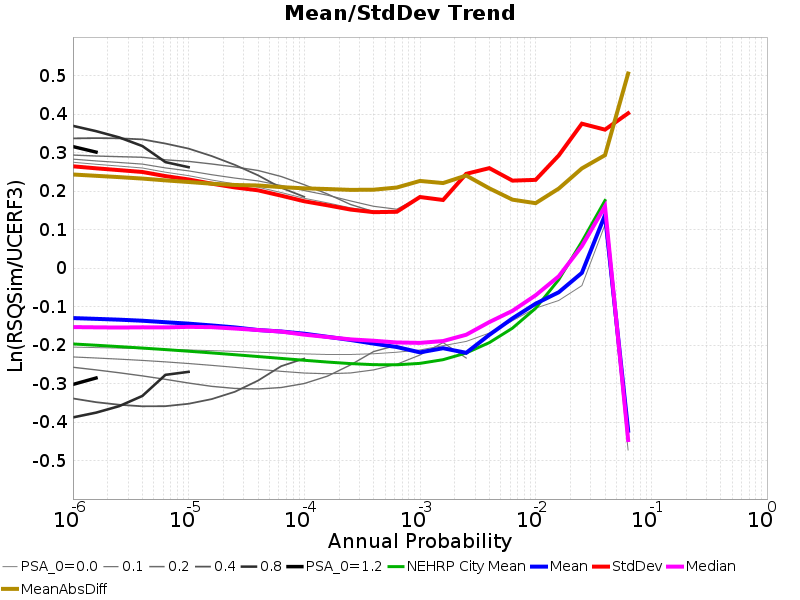
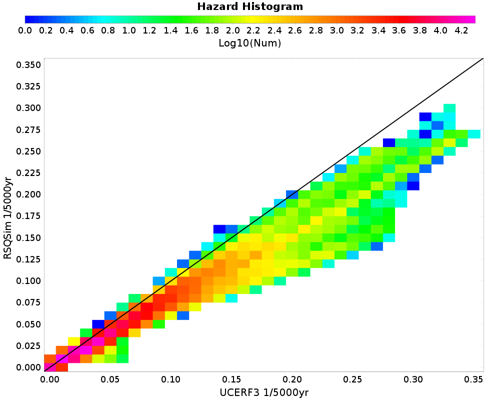
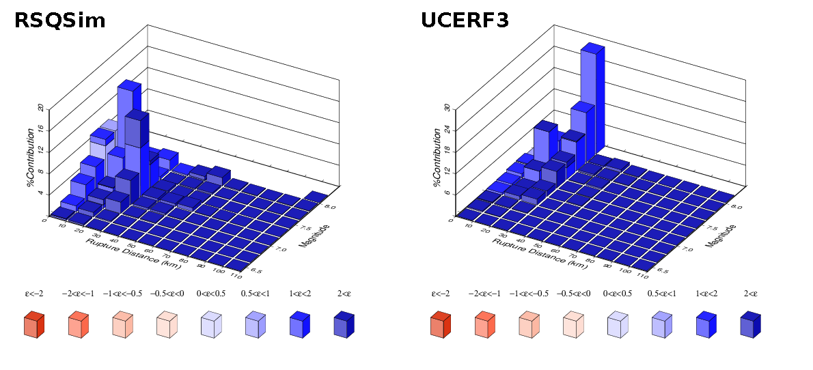
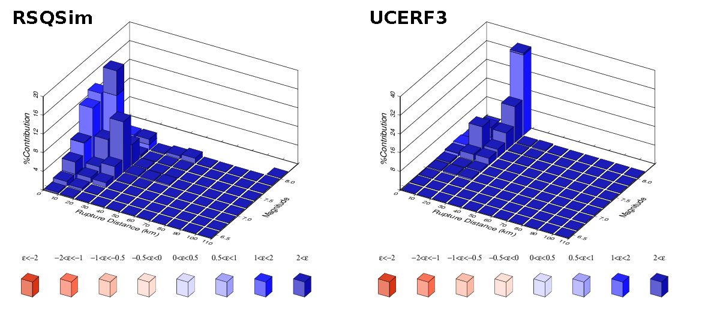

# Hazard Comparisons

*IMT: 5.0s SA (g)*

*Subsections participates in a rupture if at least 20.0 % of its area ruptures*

[Catalog Details](../#bruce-2381)

## Table Of Contents
* [Hazard Maps](#hazard-maps)
* [Histograms](#histograms)
* [0-D Histogram](#0-d-histogram)
* [1-D Histogram](#1-d-histogram)
* [2-D Histograms](#2-d-histograms)
* [Hazard Curves](#hazard-curves)
* [Hazard Disaggregations](#hazard-disaggregations)
## Hazard Maps
*[(top)](#table-of-contents)*

| Return Period | RSQSim | UCERF3 | Ratio | Tight Ratio |
|-----|-----|-----|-----|-----|
| **1000 yr** |  |  |  |  |
| **2500 yr** |  |  |  |  |
| **10000 yr** |  |  |  |  |

## Histograms

## 0-D Histogram
*[(top)](#table-of-contents)*

## 1-D Histogram
*[(top)](#table-of-contents)*

## 2-D Histograms
*[(top)](#table-of-contents)*

| Return Period | 2-D Histogram |
|-----|-----|
| **1000 yr** |  |
| **2500 yr** |  |
| **5000 yr** |  |
| **10000 yr** |  |

## Hazard Curves
*[(top)](#table-of-contents)*

|  |  |  |  |
|-----|-----|-----|-----|
|  |  |  |  |
|  |  |  |  |
|  |  |  |  |
|  |  |  |  |
|  |  |  |  |

## Hazard Disaggregations
*[(top)](#table-of-contents)*

| **Century City, 2500 yr** |  |
|-----|-----|
| **Century City, 10000 yr** |  |
| **Concord, 2500 yr** |  |
| **Concord, 10000 yr** |  |
| **Irvine, 2500 yr** |  |
| **Irvine, 10000 yr** |  |
| **Long Beach, 2500 yr** |  |
| **Long Beach, 10000 yr** |  |
| **Los Angeles, 2500 yr** |  |
| **Los Angeles, 10000 yr** |  |
| **Monterey, 2500 yr** |  |
| **Monterey, 10000 yr** |  |
| **Northridge, 2500 yr** |  |
| **Northridge, 10000 yr** |  |
| **Oakland, 2500 yr** |  |
| **Oakland, 10000 yr** |  |
| **Pasadena, 2500 yr** |  |
| **Pasadena, 10000 yr** |  |
| **Riverside, 2500 yr** |  |
| **Riverside, 10000 yr** |  |
| **Sacramento, 2500 yr** |  |
| **Sacramento, 10000 yr** |  |
| **San Bernardino, 2500 yr** |  |
| **San Bernardino, 10000 yr** |  |
| **San Diego, 2500 yr** |  |
| **San Diego, 10000 yr** |  |
| **San Francisco, 2500 yr** |  |
| **San Francisco, 10000 yr** |  |
| **San Jose, 2500 yr** |  |
| **San Jose, 10000 yr** |  |
| **San Luis Obispo, 2500 yr** |  |
| **San Luis Obispo, 10000 yr** |  |
| **San Mateo, 2500 yr** |  |
| **San Mateo, 10000 yr** |  |
| **Santa Barbara, 2500 yr** |  |
| **Santa Barbara, 10000 yr** |  |
| **Santa Cruz, 2500 yr** |  |
| **Santa Cruz, 10000 yr** |  |
| **Santa Rosa, 2500 yr** |  |
| **Santa Rosa, 10000 yr** |  |
| **USC, 2500 yr** |  |
| **USC, 10000 yr** |  |
| **Vallejo, 2500 yr** |  |
| **Vallejo, 10000 yr** |  |
| **Ventura, 2500 yr** |  |
| **Ventura, 10000 yr** |  |

