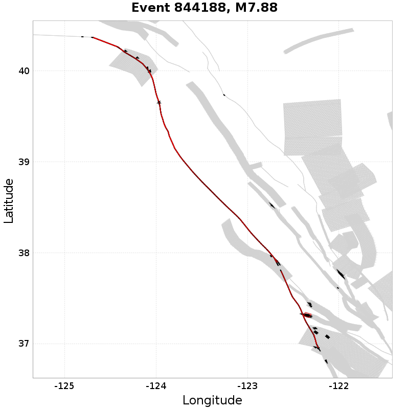
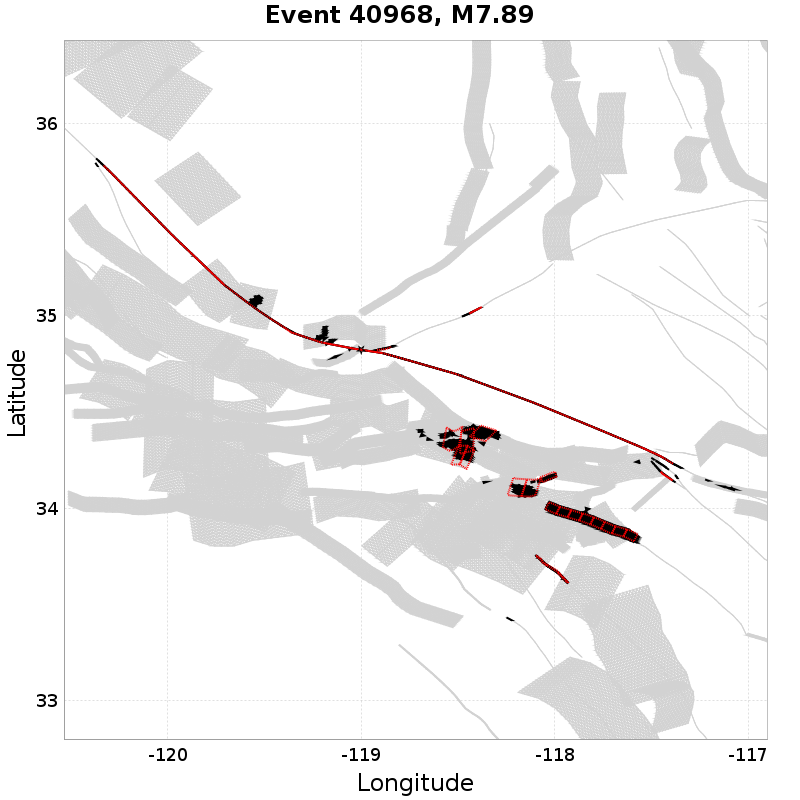
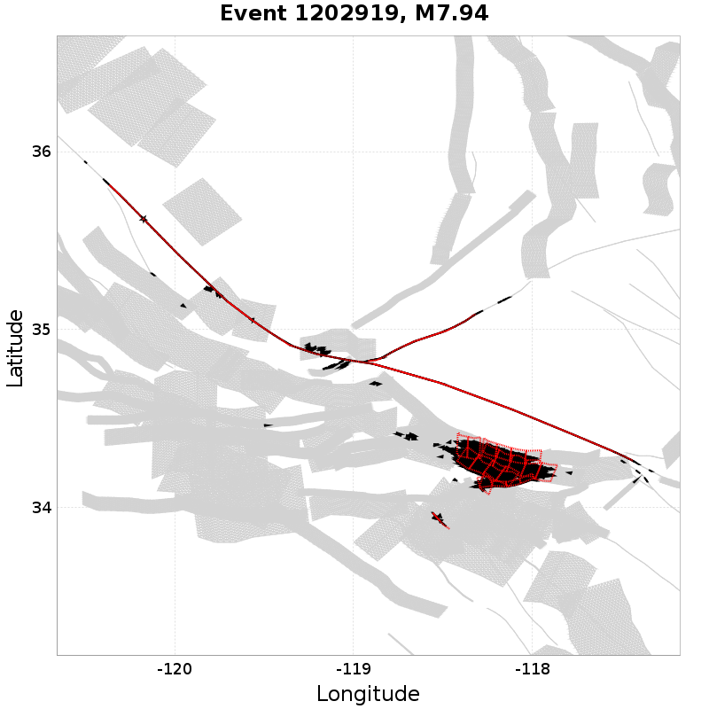
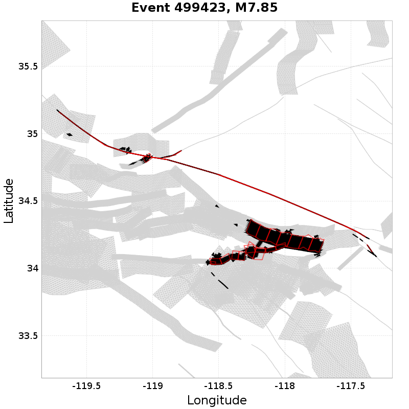
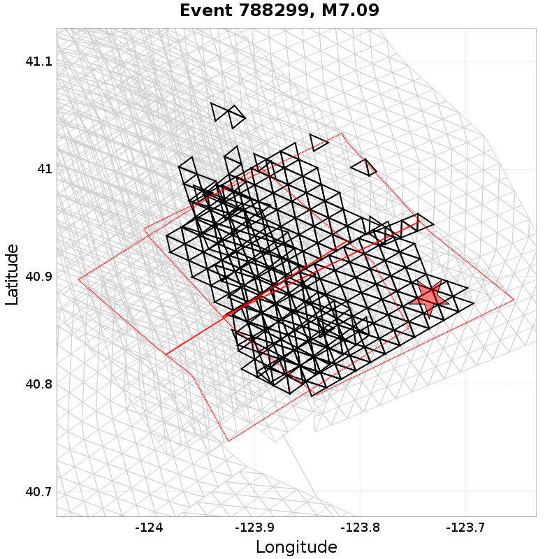
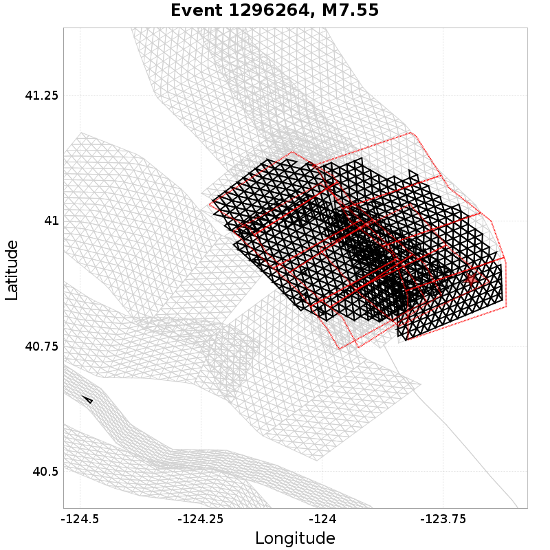
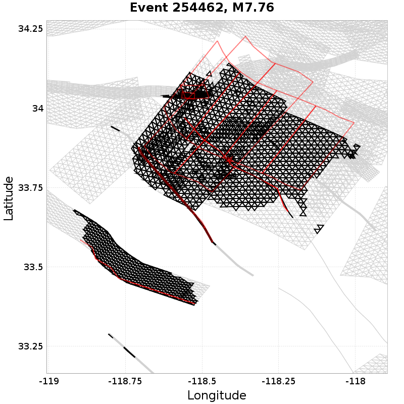
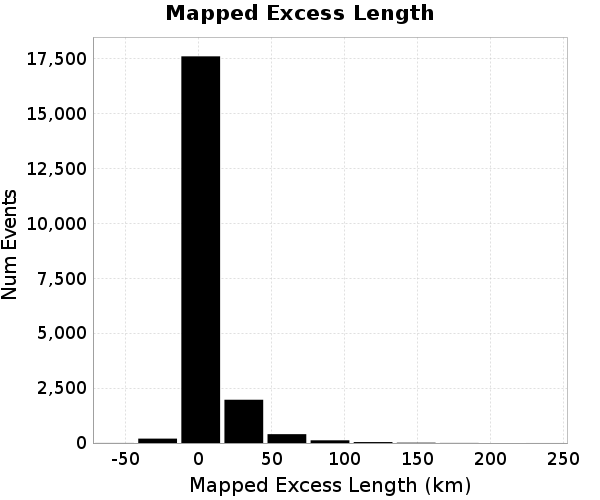
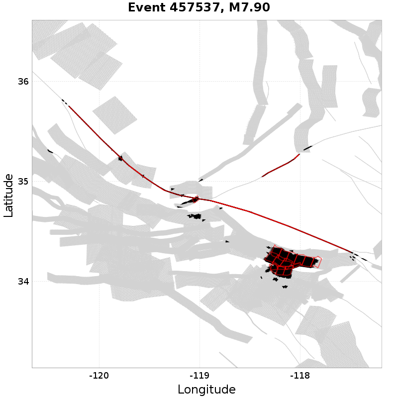
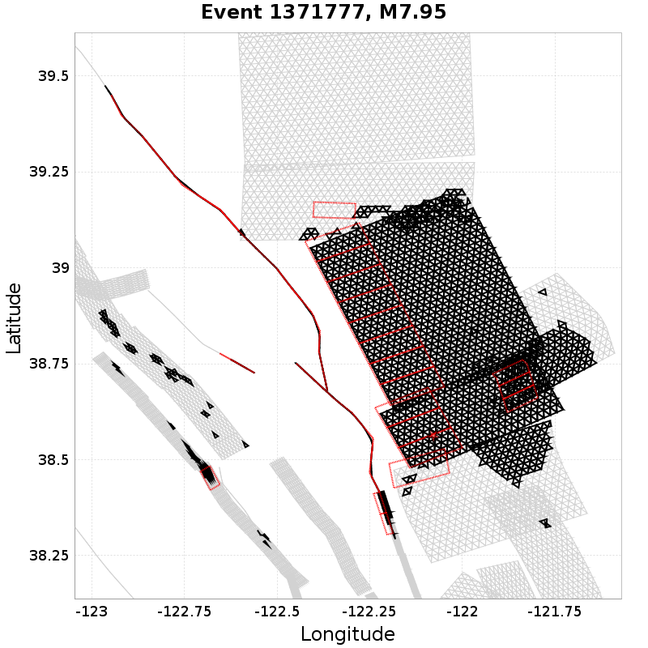

# Bruce 2457 Extreme Events

*Subsections participates in a rupture if at least 20.0 % of its area ruptures*

[Catalog Details](../#bruce-2457)

## Table Of Contents
* [Subsection Count](#subsection-count)
  * [Subsection Count Histogram](#subsection-count-histogram)
  * [Subsection Count Events](#subsection-count-events)
* [Parent Section Count](#parent-section-count)
  * [Parent Section Count Histogram](#parent-section-count-histogram)
  * [Parent Section Count Events](#parent-section-count-events)
* [Mapped Length Ratio](#mapped-length-ratio)
  * [Mapped Length Ratio Histogram](#mapped-length-ratio-histogram)
  * [Mapped Length Ratio Events](#mapped-length-ratio-events)
* [Mapped Excess Length](#mapped-excess-length)
  * [Mapped Excess Length Histogram](#mapped-excess-length-histogram)
  * [Mapped Excess Length Events](#mapped-excess-length-events)
* [Moment Off Mapped Rupture](#moment-off-mapped-rupture)
  * [Moment Off Mapped Rupture Histogram](#moment-off-mapped-rupture-histogram)
  * [Moment Off Mapped Rupture Events](#moment-off-mapped-rupture-events)
* [Magnitude](#magnitude)
  * [Magnitude Histogram](#magnitude-histogram)
  * [Magnitude Events](#magnitude-events)
## Subsection Count
*[(top)](#table-of-contents)*

Total count of mapped UCERF3 subsections (e.g. SAF Mojave S Subsection 3), after application of minimum subsection area filter

### Subsection Count Histogram

### Subsection Count Events
*[(top)](#table-of-contents)*

| Event ID | Subsection Count | Plot |
|-----|-----|-----|
| **1350038** | **92 (Subsection[s])** |  |
| **844188** | **83 (Subsection[s])** |  |
| **45936** | **82 (Subsection[s])** |  |
| **83595** | **82 (Subsection[s])** |  |
| **984679** | **82 (Subsection[s])** |  |

## Parent Section Count
*[(top)](#table-of-contents)*

Total count of mapped UCERF3 subsections (e.g. SAF Mojave S), after application of minimum subsection area filter

### Parent Section Count Histogram

### Parent Section Count Events
*[(top)](#table-of-contents)*

| Event ID | Parent Section Count | Plot |
|-----|-----|-----|
| **40968** | **17 (Section[s])** |  |
| **1202919** | **16 (Section[s])** |  |
| **50492** | **15 (Section[s])** |  |
| **499423** | **15 (Section[s])** |  |
| **575055** | **14 (Section[s])** |  |

## Mapped Length Ratio
*[(top)](#table-of-contents)*

Ratio of the total rupture length (UCERF3 mapped subsection rupture) to the idealized length, defined as the straight line distance between the furthest 2 subsections

### Mapped Length Ratio Histogram

### Mapped Length Ratio Events
*[(top)](#table-of-contents)*

| Event ID | Mapped Length Ratio | Plot |
|-----|-----|-----|
| **788299** | **3.27** |  |
| **1277639** | **3.07** |  |
| **1296264** | **3.05** |  |
| **254462** | **3.04** |  |
| **549007** | **3.03** |  |

## Mapped Excess Length
*[(top)](#table-of-contents)*

Total rupture length (UCERF3 mapped subsection rupture) minus the idealized length, defined as the straight line distance between the furthest 2 subsections

### Mapped Excess Length Histogram

### Mapped Excess Length Events
*[(top)](#table-of-contents)*

| Event ID | Mapped Excess Length | Plot |
|-----|-----|-----|
| **1202919** | **237.63 (km)** |  |
| **457537** | **178.25 (km)** |  |
| **935211** | **177.56 (km)** |  |
| **1452878** | **174.91 (km)** |  |
| **1497190** | **167.36 (km)** |  |

## Moment Off Mapped Rupture
*[(top)](#table-of-contents)*

Moment of simulator elements not included in mapped UCERF3 subsection rupture

### Moment Off Mapped Rupture Histogram

### Moment Off Mapped Rupture Events
*[(top)](#table-of-contents)*

| Event ID | Moment Off Mapped Rupture | Plot |
|-----|-----|-----|
| **576362** | **1.7496393E19 (N-m)** |  |
| **957840** | **1.7276246E19 (N-m)** |  |
| **345788** | **1.66809E19 (N-m)** |  |
| **81590** | **1.6041317E19 (N-m)** |  |
| **840646** | **1.5931184E19 (N-m)** |  |

## Magnitude
*[(top)](#table-of-contents)*

Event Moment Magnitude

### Magnitude Histogram

### Magnitude Events
*[(top)](#table-of-contents)*

| Event ID | Magnitude | Plot |
|-----|-----|-----|
| **232197** | **7.96** |  |
| **1371777** | **7.95** |  |
| **1497190** | **7.95** |  |
| **458932** | **7.94** |  |
| **1202919** | **7.94** |  |

