# Bruce 2457 BBP/NGAWest_2014_NoIdr GMPE Comparisons

**GMPE: NGAWest2 2014 Averaged No Idriss**

Ruptures are binned by their moment magnitude (**Mw**) and the Joyner-Boore distance (**rJB**), the shortest horizontal distance from a site to the surface projection of the rupture surface

[Catalog Details](../#bruce-2457)

## Table Of Contents
* [Site Scatters/Z-Score Histograms](#site-scattersz-score-histograms)
  * [All Sites Aggregated](#all-sites-aggregated)
    * [All Sites, 6 < Mw < 6.5](#all-sites-6--mw--65)
    * [All Sites, 6.5 < Mw < 7](#all-sites-65--mw--7)
    * [All Sites, 7 < Mw < 7.5](#all-sites-7--mw--75)
    * [All Sites, 7.5 < Mw < 8](#all-sites-75--mw--8)
    * [All Sites, All Ruptures, Z-Score Histograms](#all-sites-all-ruptures-z-score-histograms)
* [GMPE Residuals](#gmpe-residuals)
  * [GMPE Magnitude Residuals](#gmpe-magnitude-residuals)
  * [GMPE rJB Residuals](#gmpe-rjb-residuals)
  * [GMPE rRup Residuals](#gmpe-rrup-residuals)
## Site Scatters/Z-Score Histograms
*[(top)](#table-of-contents)*

### All Sites Aggregated
*[(top)](#table-of-contents)*

**76 sites**

| Name | Location | # Ruptures | Vs30 (m/s) | Z1.0 (km) | Z2.5 (km) |
|-----|-----|-----|-----|-----|-----|
| grid0 | *32.5, -117.4* | 26200 (26200 sims) | 863 | N/A | N/A |
| grid1 | *32.5, -116.4* | 25164 (25164 sims) | 863 | N/A | N/A |
| grid2 | *32.5, -115.4* | 19797 (19797 sims) | 863 | N/A | N/A |
| grid3 | *32.5, -114.4* | 14240 (14240 sims) | 863 | N/A | N/A |
| grid4 | *33.5, -120.4* | 10219 (10219 sims) | 863 | N/A | N/A |
| grid5 | *33.5, -119.4* | 15659 (15659 sims) | 863 | N/A | N/A |
| grid6 | *33.5, -118.4* | 23305 (23305 sims) | 863 | N/A | N/A |
| grid7 | *33.5, -117.4* | 30753 (30753 sims) | 863 | N/A | N/A |
| grid8 | *33.5, -116.4* | 29511 (29511 sims) | 863 | N/A | N/A |
| grid9 | *33.5, -115.4* | 24272 (24272 sims) | 863 | N/A | N/A |
| grid10 | *33.5, -114.4* | 17547 (17547 sims) | 863 | N/A | N/A |
| grid11 | *33.5, -113.4* | 291 (291 sims) | 863 | N/A | N/A |
| grid12 | *34.5, -121.4* | 8564 (8564 sims) | 863 | N/A | N/A |
| grid13 | *34.5, -120.4* | 14312 (14312 sims) | 863 | N/A | N/A |
| grid14 | *34.5, -119.4* | 19850 (19850 sims) | 863 | N/A | N/A |
| grid15 | *34.5, -118.4* | 24328 (24328 sims) | 863 | N/A | N/A |
| grid16 | *34.5, -117.4* | 28396 (28396 sims) | 863 | N/A | N/A |
| grid17 | *34.5, -116.4* | 26833 (26833 sims) | 863 | N/A | N/A |
| grid18 | *34.5, -115.4* | 20433 (20433 sims) | 863 | N/A | N/A |
| grid19 | *34.5, -114.4* | 6561 (6561 sims) | 863 | N/A | N/A |
| grid20 | *34.5, -113.4* | 28 (28 sims) | 863 | N/A | N/A |
| grid21 | *35.5, -122.4* | 21102 (21102 sims) | 863 | N/A | N/A |
| grid22 | *35.5, -121.4* | 25264 (25264 sims) | 863 | N/A | N/A |
| grid23 | *35.5, -120.4* | 23950 (23950 sims) | 863 | N/A | N/A |
| grid24 | *35.5, -119.4* | 20152 (20152 sims) | 863 | N/A | N/A |
| grid25 | *35.5, -118.4* | 23037 (23037 sims) | 863 | N/A | N/A |
| grid26 | *35.5, -117.4* | 20527 (20527 sims) | 863 | N/A | N/A |
| grid27 | *35.5, -116.4* | 14730 (14730 sims) | 863 | N/A | N/A |
| grid28 | *35.5, -115.4* | 5673 (5673 sims) | 863 | N/A | N/A |
| grid29 | *35.5, -114.4* | 681 (681 sims) | 863 | N/A | N/A |
| grid30 | *36.5, -122.4* | 33138 (33138 sims) | 863 | N/A | N/A |
| grid31 | *36.5, -121.4* | 33512 (33512 sims) | 863 | N/A | N/A |
| grid32 | *36.5, -120.4* | 31831 (31831 sims) | 863 | N/A | N/A |
| grid33 | *36.5, -119.4* | 23616 (23616 sims) | 863 | N/A | N/A |
| grid34 | *36.5, -118.4* | 12242 (12242 sims) | 863 | N/A | N/A |
| grid35 | *36.5, -117.4* | 6939 (6939 sims) | 863 | N/A | N/A |
| grid36 | *36.5, -116.4* | 5888 (5888 sims) | 863 | N/A | N/A |
| grid37 | *36.5, -115.4* | 2866 (2866 sims) | 863 | N/A | N/A |
| grid38 | *37.5, -123.4* | 32013 (32013 sims) | 863 | N/A | N/A |
| grid39 | *37.5, -122.4* | 35929 (35929 sims) | 863 | N/A | N/A |
| grid40 | *37.5, -121.4* | 36259 (36259 sims) | 863 | N/A | N/A |
| grid41 | *37.5, -120.4* | 34477 (34477 sims) | 863 | N/A | N/A |
| grid42 | *37.5, -119.4* | 18603 (18603 sims) | 863 | N/A | N/A |
| grid43 | *37.5, -118.4* | 3849 (3849 sims) | 863 | N/A | N/A |
| grid44 | *37.5, -117.4* | 4067 (4067 sims) | 863 | N/A | N/A |
| grid45 | *38.5, -123.4* | 25978 (25978 sims) | 863 | N/A | N/A |
| grid46 | *38.5, -122.4* | 31186 (31186 sims) | 863 | N/A | N/A |
| grid47 | *38.5, -121.4* | 33740 (33740 sims) | 863 | N/A | N/A |
| grid48 | *38.5, -120.4* | 19543 (19543 sims) | 863 | N/A | N/A |
| grid49 | *38.5, -119.4* | 2353 (2353 sims) | 863 | N/A | N/A |
| grid50 | *38.5, -118.4* | 2467 (2467 sims) | 863 | N/A | N/A |
| grid51 | *39.5, -124.4* | 14709 (14709 sims) | 863 | N/A | N/A |
| grid52 | *39.5, -123.4* | 17872 (17872 sims) | 863 | N/A | N/A |
| grid53 | *39.5, -122.4* | 19435 (19435 sims) | 863 | N/A | N/A |
| grid54 | *39.5, -121.4* | 14477 (14477 sims) | 863 | N/A | N/A |
| grid55 | *39.5, -120.4* | 3218 (3218 sims) | 863 | N/A | N/A |
| grid56 | *39.5, -119.4* | 1502 (1502 sims) | 863 | N/A | N/A |
| grid57 | *40.5, -125.4* | 8484 (8484 sims) | 863 | N/A | N/A |
| grid58 | *40.5, -124.4* | 10869 (10869 sims) | 863 | N/A | N/A |
| grid59 | *40.5, -123.4* | 12355 (12355 sims) | 863 | N/A | N/A |
| grid60 | *40.5, -122.4* | 13466 (13466 sims) | 863 | N/A | N/A |
| grid61 | *40.5, -121.4* | 4330 (4330 sims) | 863 | N/A | N/A |
| grid62 | *40.5, -120.4* | 1681 (1681 sims) | 863 | N/A | N/A |
| grid63 | *40.5, -119.4* | 1558 (1558 sims) | 863 | N/A | N/A |
| grid64 | *41.5, -124.4* | 6962 (6962 sims) | 863 | N/A | N/A |
| grid65 | *41.5, -123.4* | 7494 (7494 sims) | 863 | N/A | N/A |
| grid66 | *41.5, -122.4* | 3022 (3022 sims) | 863 | N/A | N/A |
| grid67 | *41.5, -121.4* | 1414 (1414 sims) | 863 | N/A | N/A |
| grid68 | *41.5, -120.4* | 1416 (1416 sims) | 863 | N/A | N/A |
| grid69 | *41.5, -119.4* | 1160 (1160 sims) | 863 | N/A | N/A |
| grid70 | *42.5, -124.4* | 876 (876 sims) | 863 | N/A | N/A |
| grid71 | *42.5, -123.4* | 1048 (1048 sims) | 863 | N/A | N/A |
| grid72 | *42.5, -122.4* | 671 (671 sims) | 863 | N/A | N/A |
| grid73 | *42.5, -121.4* | 565 (565 sims) | 863 | N/A | N/A |
| grid74 | *42.5, -120.4* | 546 (546 sims) | 863 | N/A | N/A |
| grid75 | *42.5, -119.4* | 345 (345 sims) | 863 | N/A | N/A |

92861 ruptures within 200 km of *any* site
#### All Sites, 6 < Mw < 6.5
51045 Ruptures
##### All Sites, 6 < Mw < 6.5, Scatter Plots
*[(top)](#table-of-contents)*

**Legend**
* Red +: GMPE Mean/RSQSim/BBP single rupture comparison
* Yellow Region: Factor of 2 above & below
* Green Line: Linear Regression

| **Distance Bin** | **1 s** | **2 s** | **5 s** |
|-----|-----|-----|-----|
| **0 km < rJB < 10 km** |  |  |  |
| **10 km < rJB < 20 km** |  |  |  |
| **20 km < rJB < 40 km** |  |  |  |
| **40 km < rJB < 80 km** |  |  |  |
| **80 km < rJB < 160 km** |  |  |  |
| **160 km < rJB < 200 km** |  |  |  |
##### All Sites, 6 < Mw < 6.5, Z-Score Histograms
*[(top)](#table-of-contents)*

These plots compare RSQSim/BBP to the full GMPE log-normal distributions. Each rupture's GMPE distribution is converted to a standard log-normal distribution, and the z-score is computed for each rupture:

**z-score**: (ln(*RSQSim/BBP*) - ln(*GMPE-mean*)) / *GMPE-sigma*

**Legend**
* Black Line: Standard Normal distribution (in natural log space)
* Gray Histogram: z-score for each rupture
* Blue Dashed Line: RSQSim/BBP Mean

| **0 km < rJB < 10 km** | **10 km < rJB < 20 km** | **20 km < rJB < 40 km** |
|-----|-----|-----|
|  |  |  |
| **40 km < rJB < 80 km** | **80 km < rJB < 160 km** | **160 km < rJB < 200 km** |
|  |  |  |
#### All Sites, 6.5 < Mw < 7
21443 Ruptures
##### All Sites, 6.5 < Mw < 7, Scatter Plots
*[(top)](#table-of-contents)*

**Legend**
* Red +: GMPE Mean/RSQSim/BBP single rupture comparison
* Yellow Region: Factor of 2 above & below
* Green Line: Linear Regression

| **Distance Bin** | **1 s** | **2 s** | **5 s** |
|-----|-----|-----|-----|
| **0 km < rJB < 10 km** |  |  | 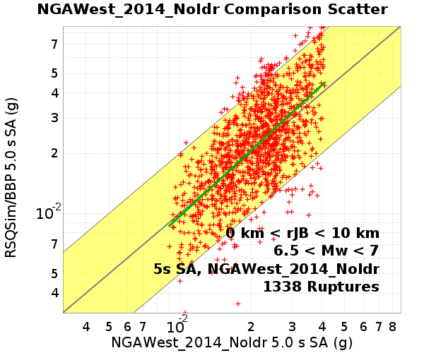 |
| **10 km < rJB < 20 km** |  |  |  |
| **20 km < rJB < 40 km** |  |  |  |
| **40 km < rJB < 80 km** |  |  |  |
| **80 km < rJB < 160 km** |  |  |  |
| **160 km < rJB < 200 km** |  |  |  |
##### All Sites, 6.5 < Mw < 7, Z-Score Histograms
*[(top)](#table-of-contents)*

These plots compare RSQSim/BBP to the full GMPE log-normal distributions. Each rupture's GMPE distribution is converted to a standard log-normal distribution, and the z-score is computed for each rupture:

**z-score**: (ln(*RSQSim/BBP*) - ln(*GMPE-mean*)) / *GMPE-sigma*

**Legend**
* Black Line: Standard Normal distribution (in natural log space)
* Gray Histogram: z-score for each rupture
* Blue Dashed Line: RSQSim/BBP Mean

| **0 km < rJB < 10 km** | **10 km < rJB < 20 km** | **20 km < rJB < 40 km** |
|-----|-----|-----|
|  |  |  |
| **40 km < rJB < 80 km** | **80 km < rJB < 160 km** | **160 km < rJB < 200 km** |
|  |  |  |
#### All Sites, 7 < Mw < 7.5
17173 Ruptures
##### All Sites, 7 < Mw < 7.5, Scatter Plots
*[(top)](#table-of-contents)*

**Legend**
* Red +: GMPE Mean/RSQSim/BBP single rupture comparison
* Yellow Region: Factor of 2 above & below
* Green Line: Linear Regression

| **Distance Bin** | **1 s** | **2 s** | **5 s** |
|-----|-----|-----|-----|
| **0 km < rJB < 10 km** |  |  |  |
| **10 km < rJB < 20 km** |  |  |  |
| **20 km < rJB < 40 km** |  |  |  |
| **40 km < rJB < 80 km** |  |  |  |
| **80 km < rJB < 160 km** |  |  |  |
| **160 km < rJB < 200 km** |  |  |  |
##### All Sites, 7 < Mw < 7.5, Z-Score Histograms
*[(top)](#table-of-contents)*

These plots compare RSQSim/BBP to the full GMPE log-normal distributions. Each rupture's GMPE distribution is converted to a standard log-normal distribution, and the z-score is computed for each rupture:

**z-score**: (ln(*RSQSim/BBP*) - ln(*GMPE-mean*)) / *GMPE-sigma*

**Legend**
* Black Line: Standard Normal distribution (in natural log space)
* Gray Histogram: z-score for each rupture
* Blue Dashed Line: RSQSim/BBP Mean

| **0 km < rJB < 10 km** | **10 km < rJB < 20 km** | **20 km < rJB < 40 km** |
|-----|-----|-----|
|  |  |  |
| **40 km < rJB < 80 km** | **80 km < rJB < 160 km** | **160 km < rJB < 200 km** |
|  |  |  |
#### All Sites, 7.5 < Mw < 8
3200 Ruptures
##### All Sites, 7.5 < Mw < 8, Scatter Plots
*[(top)](#table-of-contents)*

**Legend**
* Red +: GMPE Mean/RSQSim/BBP single rupture comparison
* Yellow Region: Factor of 2 above & below
* Green Line: Linear Regression

| **Distance Bin** | **1 s** | **2 s** | **5 s** |
|-----|-----|-----|-----|
| **0 km < rJB < 10 km** |  |  |  |
| **10 km < rJB < 20 km** |  |  |  |
| **20 km < rJB < 40 km** |  |  |  |
| **40 km < rJB < 80 km** |  |  |  |
| **80 km < rJB < 160 km** |  |  |  |
| **160 km < rJB < 200 km** |  |  |  |
##### All Sites, 7.5 < Mw < 8, Z-Score Histograms
*[(top)](#table-of-contents)*

These plots compare RSQSim/BBP to the full GMPE log-normal distributions. Each rupture's GMPE distribution is converted to a standard log-normal distribution, and the z-score is computed for each rupture:

**z-score**: (ln(*RSQSim/BBP*) - ln(*GMPE-mean*)) / *GMPE-sigma*

**Legend**
* Black Line: Standard Normal distribution (in natural log space)
* Gray Histogram: z-score for each rupture
* Blue Dashed Line: RSQSim/BBP Mean

| **0 km < rJB < 10 km** | **10 km < rJB < 20 km** | **20 km < rJB < 40 km** |
|-----|-----|-----|
|  |  |  |
| **40 km < rJB < 80 km** | **80 km < rJB < 160 km** | **160 km < rJB < 200 km** |
|  |  |  |
#### All Sites, All Ruptures, Z-Score Histograms
*[(top)](#table-of-contents)*

z-score standard normal plots across all magnitudes/distances

**z-score**: (ln(*RSQSim/BBP*) - ln(*GMPE-mean*)) / *GMPE-sigma*

**Legend**
* Black Line: Standard Normal distribution (in natural log space)
* Gray Histogram: z-score for each rupture
* Blue Dashed Line: RSQSim/BBP Mean

## GMPE Residuals
*[(top)](#table-of-contents)*

Residuals of simulation data (RSQSim/BBP) in log space relative to GMPE log-mean

### GMPE Magnitude Residuals
*[(top)](#table-of-contents)*

| **1 s** | **2 s** | **5 s** |
|-----|-----|-----|
|  |  | 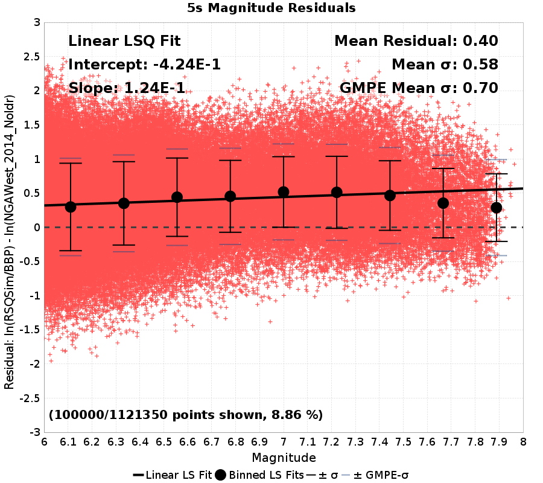 |
| 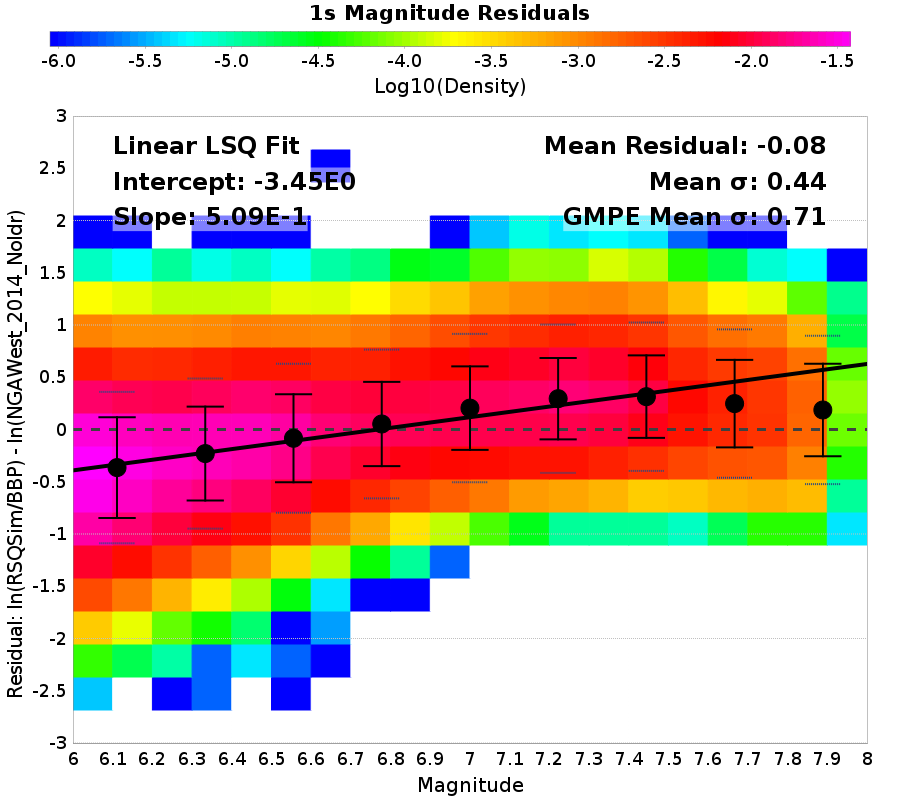 | 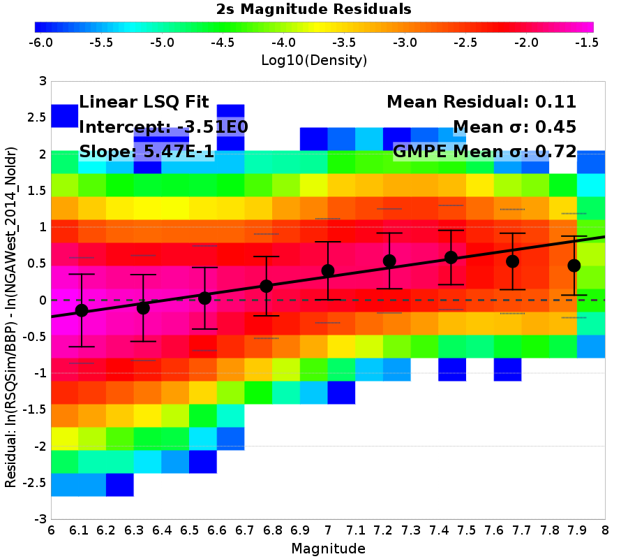 | 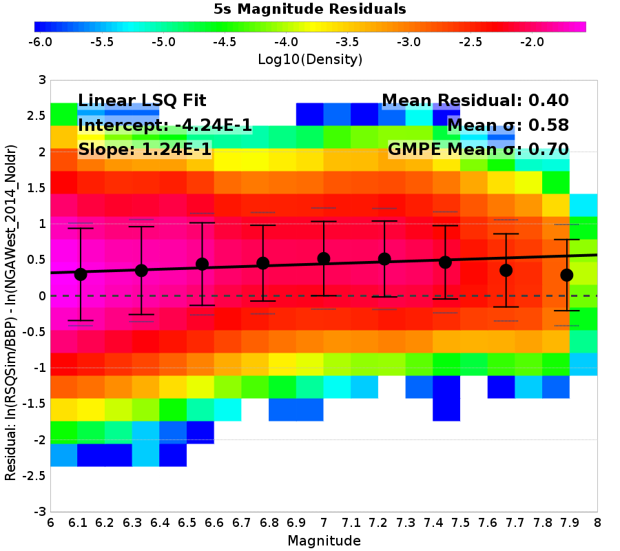 |
### GMPE rJB Residuals
*[(top)](#table-of-contents)*

| **1 s** | **2 s** | **5 s** |
|-----|-----|-----|
| 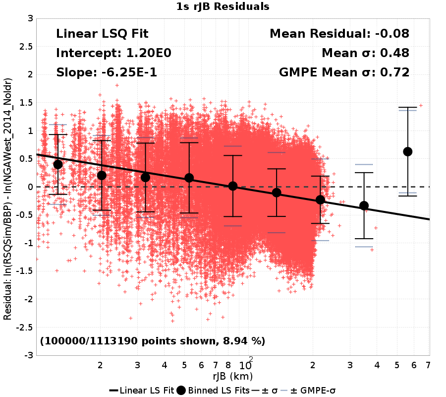 |  | 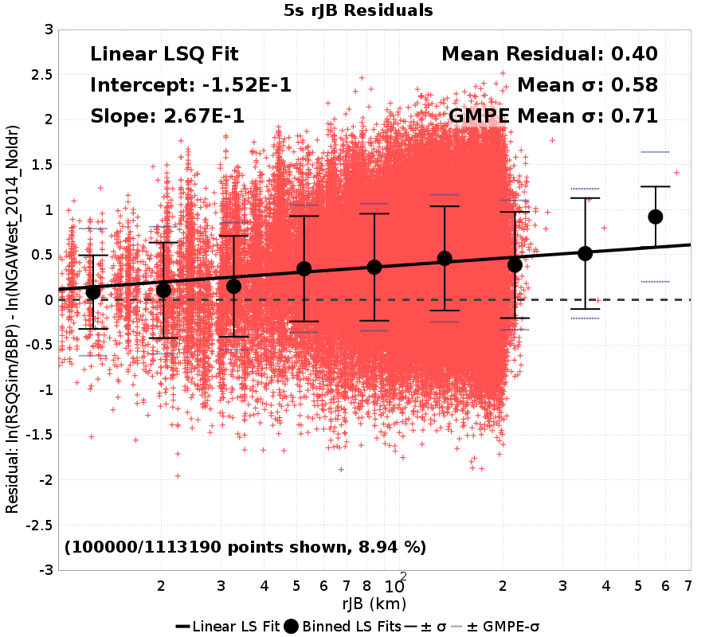 |
| 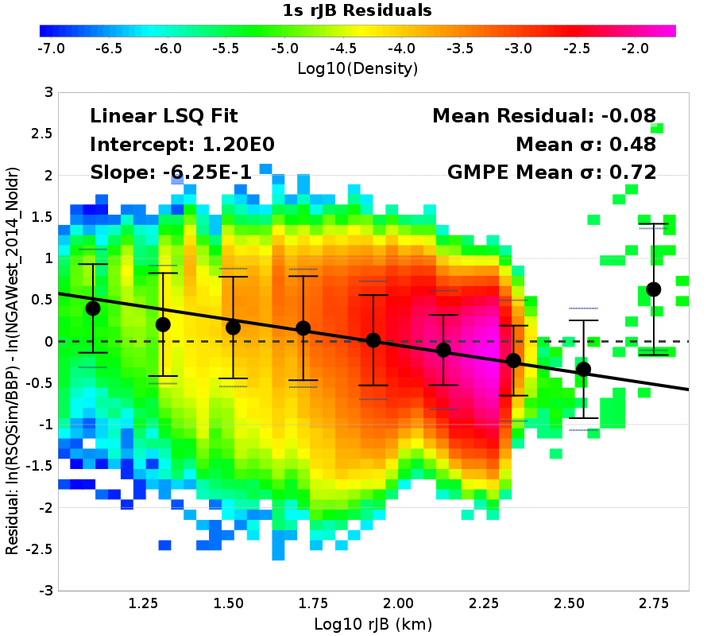 | 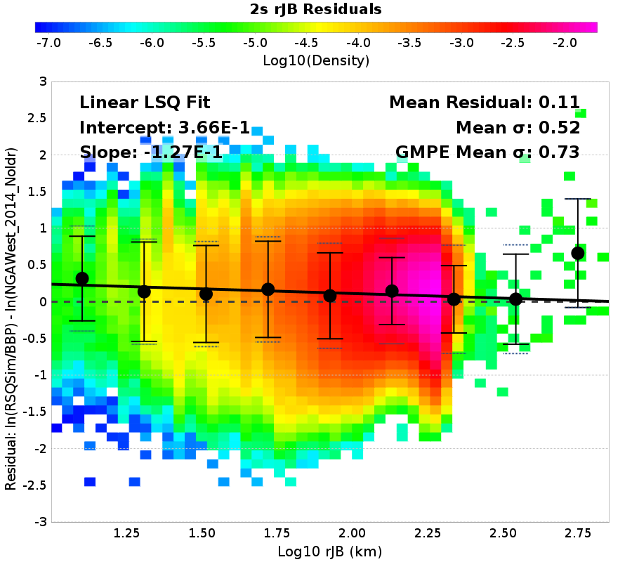 | 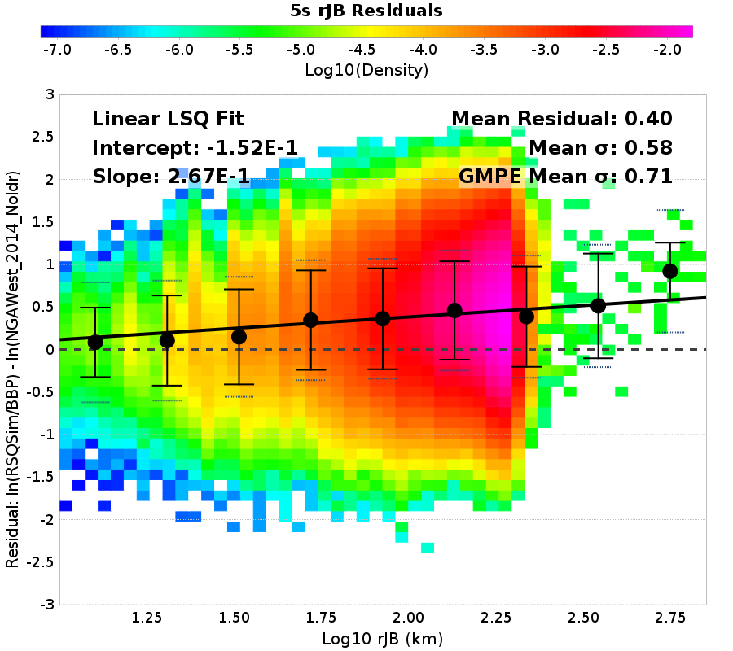 |
### GMPE rRup Residuals
*[(top)](#table-of-contents)*

| **1 s** | **2 s** | **5 s** |
|-----|-----|-----|
| 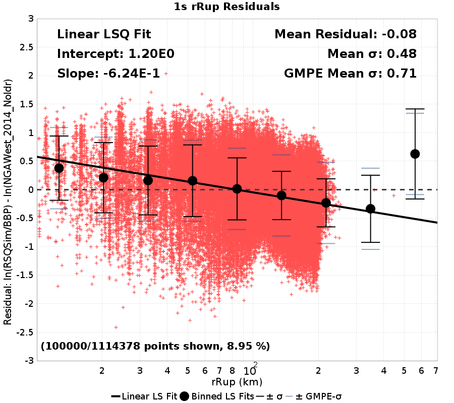 |  |  |
| 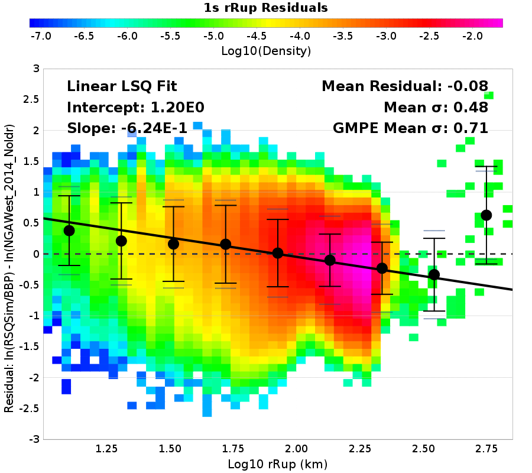 |  |  |
