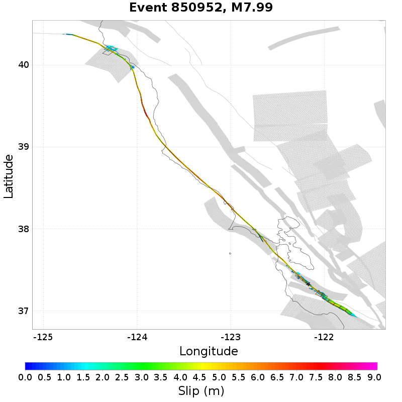
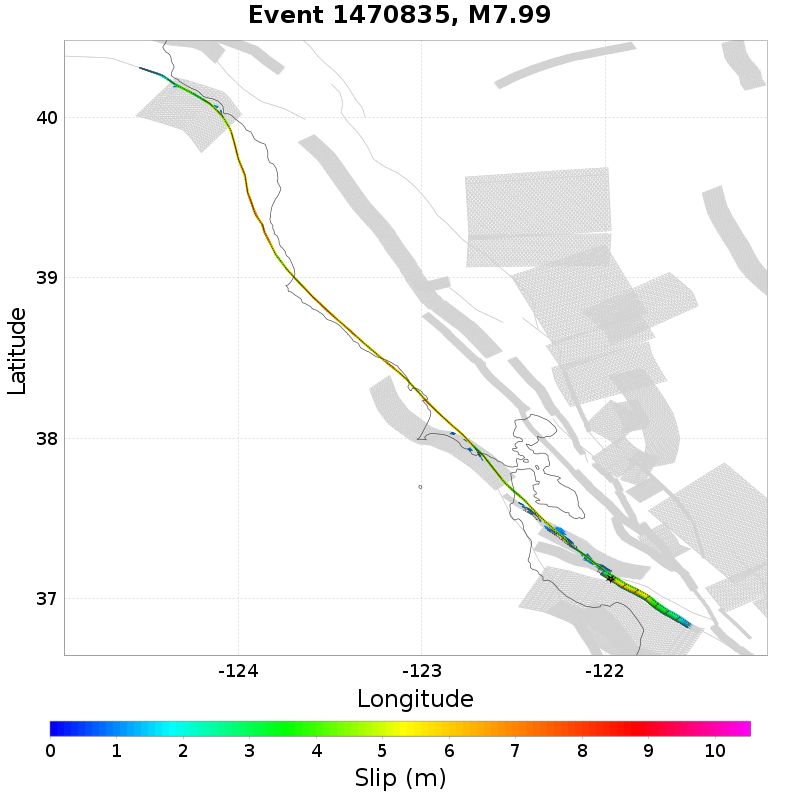
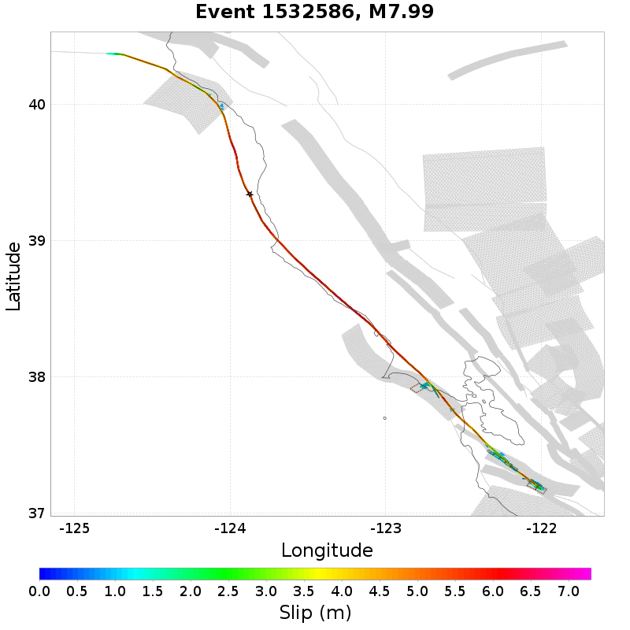
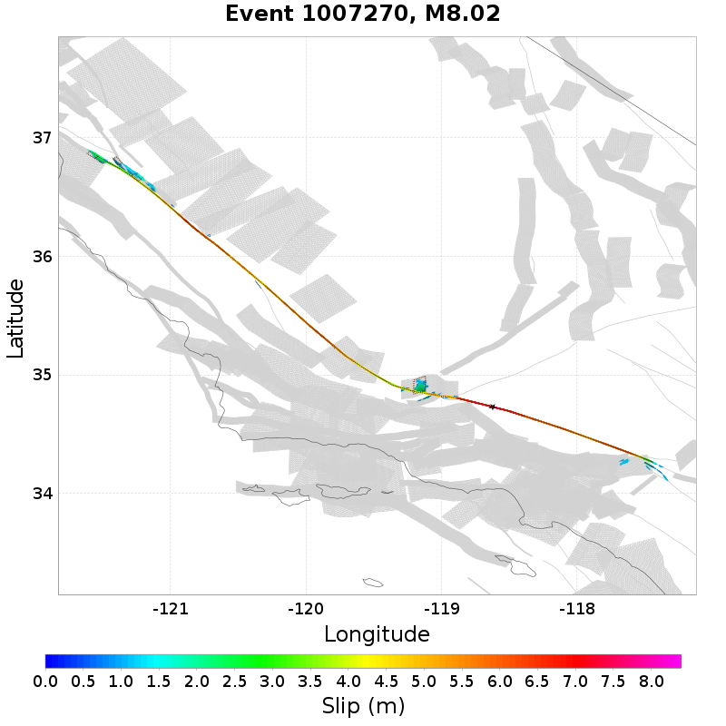
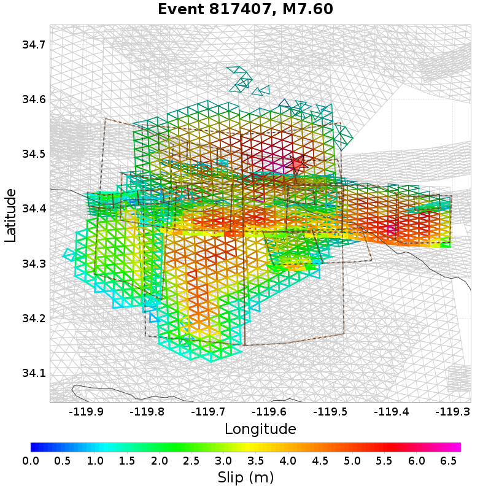
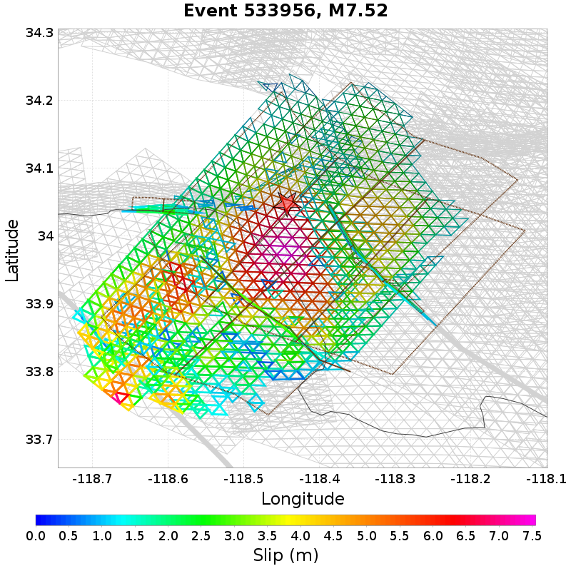
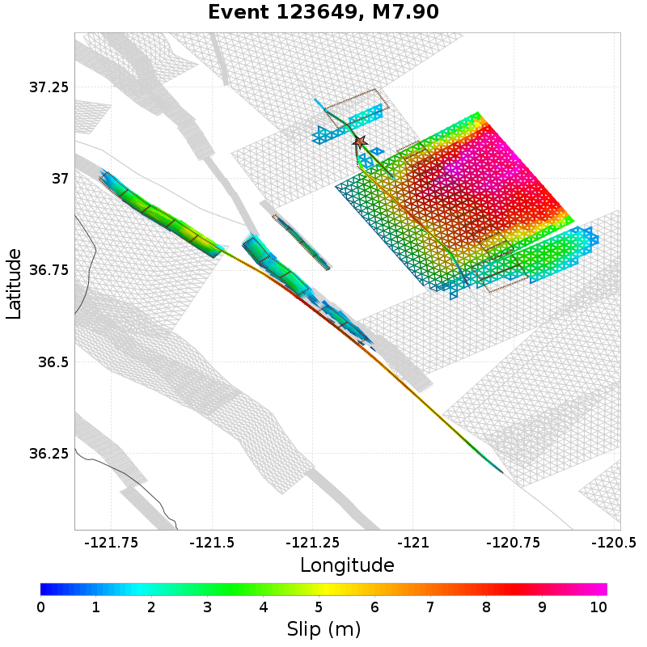
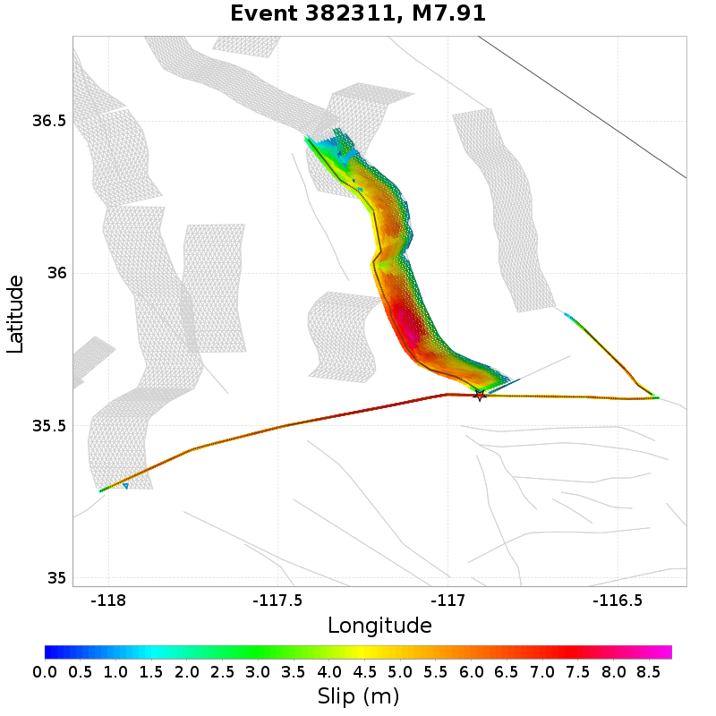
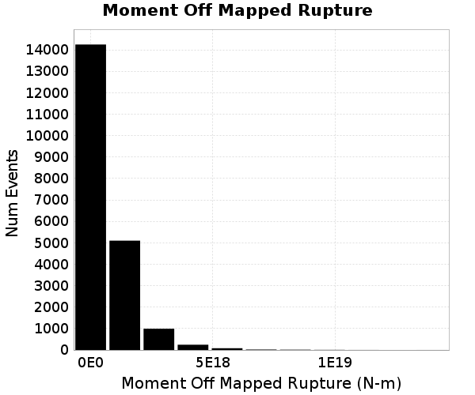
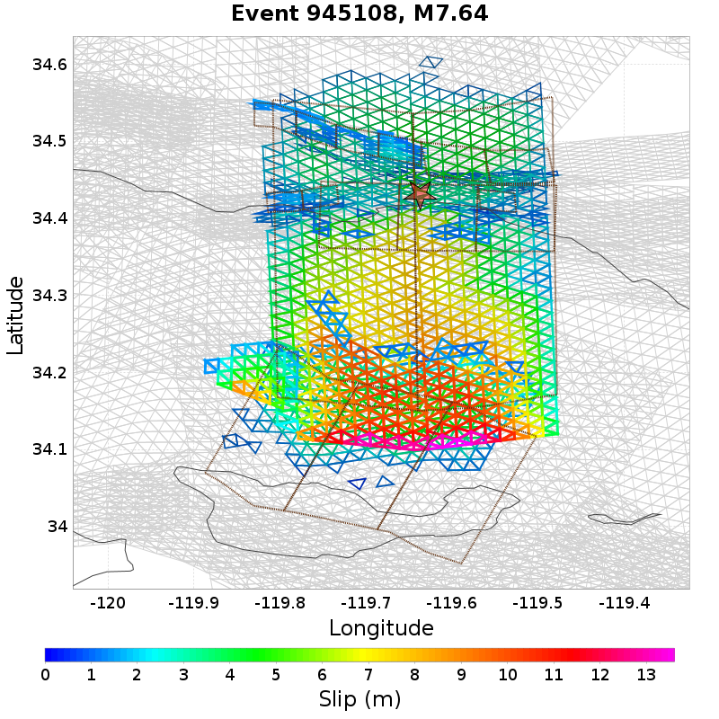

# Bruce 2579 Extreme Events

*Subsections participate in a rupture if at least 20.0 % of its area ruptures*

[Catalog Details](../#bruce-2579)

## Table Of Contents
* [Subsection Count](#subsection-count)
  * [Subsection Count Histogram](#subsection-count-histogram)
  * [Subsection Count Events](#subsection-count-events)
* [Parent Section Count](#parent-section-count)
  * [Parent Section Count Histogram](#parent-section-count-histogram)
  * [Parent Section Count Events](#parent-section-count-events)
* [Mapped Length Ratio](#mapped-length-ratio)
  * [Mapped Length Ratio Histogram](#mapped-length-ratio-histogram)
  * [Mapped Length Ratio Events](#mapped-length-ratio-events)
* [Mapped Excess Length](#mapped-excess-length)
  * [Mapped Excess Length Histogram](#mapped-excess-length-histogram)
  * [Mapped Excess Length Events](#mapped-excess-length-events)
* [Moment Off Mapped Rupture](#moment-off-mapped-rupture)
  * [Moment Off Mapped Rupture Histogram](#moment-off-mapped-rupture-histogram)
  * [Moment Off Mapped Rupture Events](#moment-off-mapped-rupture-events)
* [Magnitude](#magnitude)
  * [Magnitude Histogram](#magnitude-histogram)
  * [Magnitude Events](#magnitude-events)
* [Moment >100km from Mapped](#moment-100km-from-mapped)
## Subsection Count
*[(top)](#table-of-contents)*

Total count of mapped UCERF3 subsections (e.g. SAF Mojave S Subsection 3), after application of minimum subsection area filter

### Subsection Count Histogram

### Subsection Count Events
*[(top)](#table-of-contents)*

| Event ID | Subsection Count | Plot |
|-----|-----|-----|
| **57268** | **96 (Subsection[s])** |  |
| **302755** | **93 (Subsection[s])** |  |
| **850952** | **90 (Subsection[s])** |  |
| **1470835** | **88 (Subsection[s])** |  |
| **1532586** | **85 (Subsection[s])** |  |

## Parent Section Count
*[(top)](#table-of-contents)*

Total count of mapped UCERF3 subsections (e.g. SAF Mojave S), after application of minimum subsection area filter

### Parent Section Count Histogram

### Parent Section Count Events
*[(top)](#table-of-contents)*

| Event ID | Parent Section Count | Plot |
|-----|-----|-----|
| **1007270** | **12 (Section[s])** |  |
| **774925** | **12 (Section[s])** |  |
| **1127055** | **12 (Section[s])** |  |
| **397439** | **11 (Section[s])** |  |
| **904206** | **11 (Section[s])** |  |

## Mapped Length Ratio
*[(top)](#table-of-contents)*

Ratio of the total rupture length (UCERF3 mapped subsection rupture) to the idealized length, defined as the straight line distance between the furthest 2 subsections

### Mapped Length Ratio Histogram

### Mapped Length Ratio Events
*[(top)](#table-of-contents)*

| Event ID | Mapped Length Ratio | Plot |
|-----|-----|-----|
| **840873** | **3.7** |  |
| **817407** | **3.06** |  |
| **533956** | **2.93** |  |
| **1215535** | **2.91** |  |
| **1326122** | **2.89** |  |

## Mapped Excess Length
*[(top)](#table-of-contents)*

Total rupture length (UCERF3 mapped subsection rupture) minus the idealized length, defined as the straight line distance between the furthest 2 subsections

### Mapped Excess Length Histogram

### Mapped Excess Length Events
*[(top)](#table-of-contents)*

| Event ID | Mapped Excess Length | Plot |
|-----|-----|-----|
| **123649** | **178.18 (km)** |  |
| **157575** | **177.68 (km)** |  |
| **898340** | **162.23 (km)** |  |
| **653312** | **155.72 (km)** |  |
| **382311** | **155.48 (km)** |  |

## Moment Off Mapped Rupture
*[(top)](#table-of-contents)*

Moment of simulator elements not included in mapped UCERF3 subsection rupture

### Moment Off Mapped Rupture Histogram

### Moment Off Mapped Rupture Events
*[(top)](#table-of-contents)*

| Event ID | Moment Off Mapped Rupture | Plot |
|-----|-----|-----|
| **945108** | **1.7742906E19 (N-m)** |  |
| **1056939** | **1.7380615E19 (N-m)** |  |
| **1379960** | **1.7312159E19 (N-m)** |  |
| **730135** | **1.7028126E19 (N-m)** |  |
| **1052359** | **1.6424175E19 (N-m)** |  |

## Magnitude
*[(top)](#table-of-contents)*

Event Moment Magnitude

### Magnitude Histogram

### Magnitude Events
*[(top)](#table-of-contents)*

| Event ID | Magnitude | Plot |
|-----|-----|-----|
| **57268** | **8.08** |  |
| **1508208** | **8.03** |  |
| **302755** | **8.02** |  |
| **946919** | **8.02** |  |
| **317661** | **8.02** |  |

## Moment >100km from Mapped
*[(top)](#table-of-contents)*

Moment that is at least 100km from the nearest mapped subsection (after application of subsection area threshold)

0 events above threshold of 1 [N-m]
