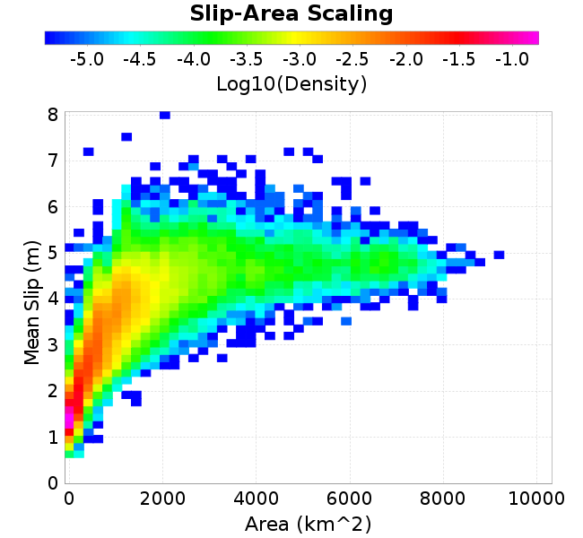
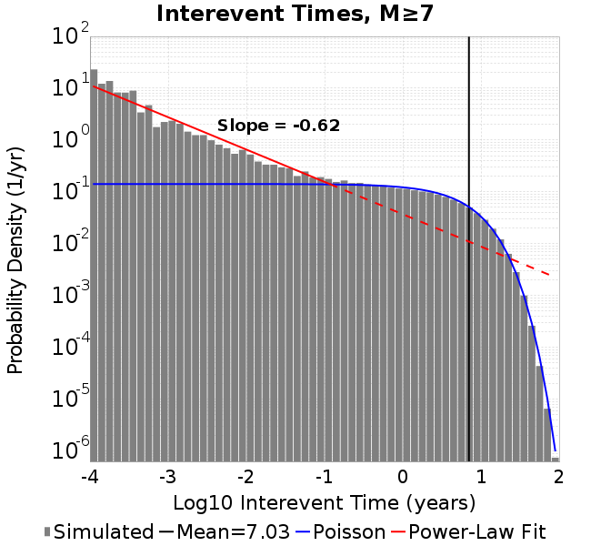
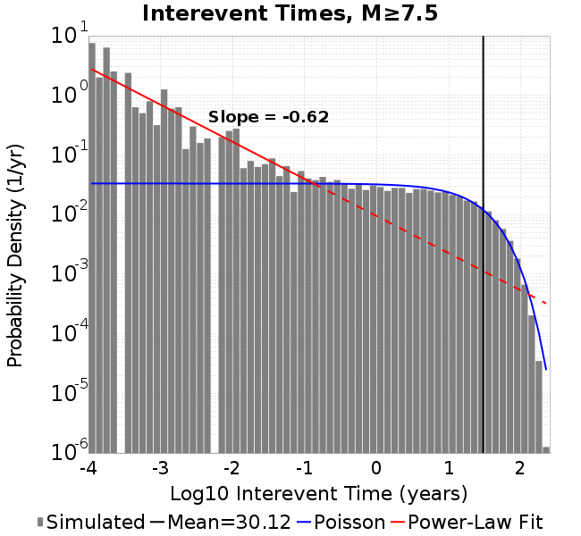
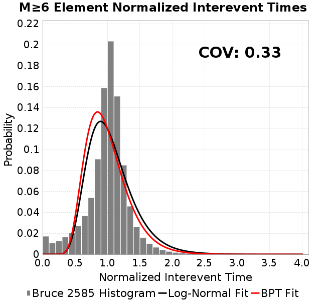
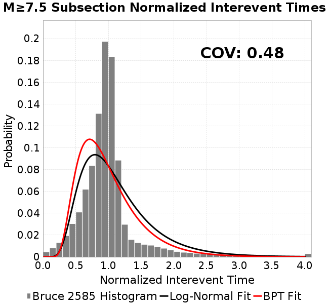
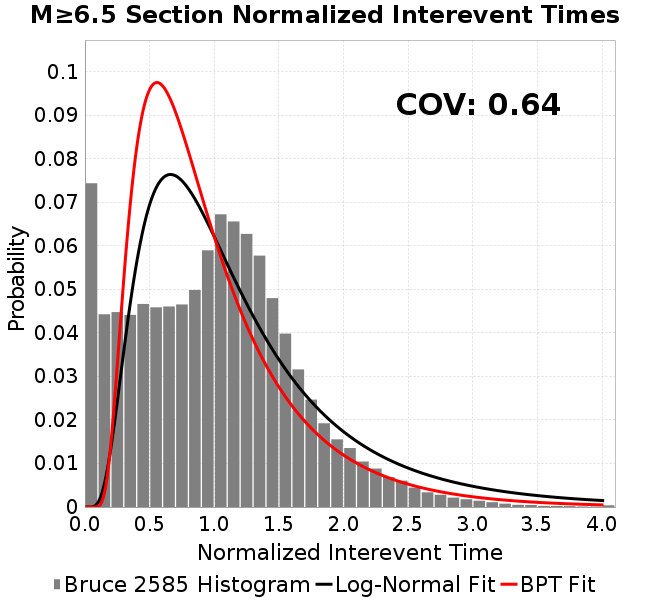
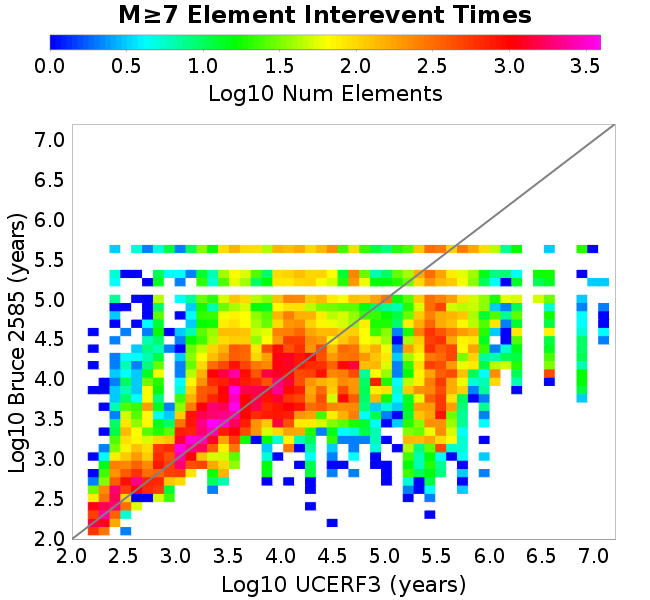
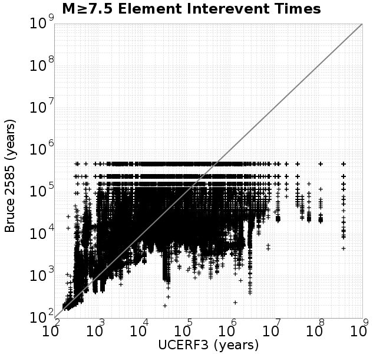
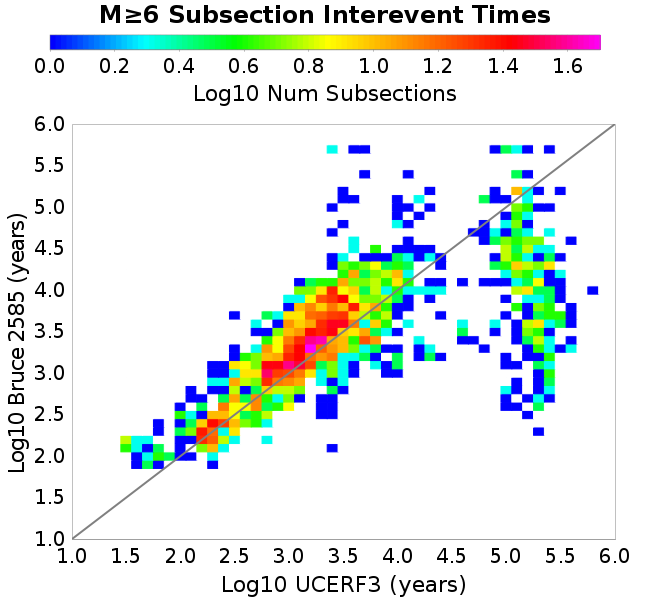

# Bruce 2585
## Metadata
| **Catalog** | Bruce 2585 |
|-----|-----|
| **Author** | Bruce Shaw, 2018/02/10 |
| **Description** | Longer run; else same as r2579. straight loaded;  fracCreep=0.5; H=18 (2,12,4); stressMult=1.2; neighbors |
| **Fault/Def Model** | Fault Model 3.1, Geologic |
| **Slip Velocity** | 1.0 m/s |
| **Average Element Area** | 1.35 km^2 |
| **Length** | 5,083,499 events in 469,390 years |
| **Frictional Params** | a=0.001, b=0.008, (b-a)=0.007, ddotEQ=1 |

* [Metadata](#metadata)
* [Single Event Comparisons](#single-event-comparisons)
* [Full Catalog GMPE Comparisons](#full-catalog-gmpe-comparisons)
  * [Points Of Interest](#points-of-interest)
  * [Gridded Sites](#gridded-sites)
* [Hazard Comparisons](#hazard-comparisons)
* [Multi-Fault Rupture Comparisons](multi_fault/)
* [Extreme Event Examples](extreme_events/)
* [Plots](#plots)
  * [Magnitude-Frequency Plot](#magnitude-frequency-plot)
  * [Magnitude-Area Plots](#magnitude-area-plots)
  * [Slip-Area Plots](#slip-area-plots)
  * [Rupture Velocity Plots](#rupture-velocity-plots)
  * [Global Interevent-Time Distributions](#global-interevent-time-distributions)
  * [Normalized Fault Interevent-Time Distributions](#normalized-fault-interevent-time-distributions)
  * [Stationarity Plot](#stationarity-plot)
  * [Element/Subsection Interevent Time Comparisons](#elementsubsection-interevent-time-comparisons)
    * [Element Interevent Time Comparisons](#element-interevent-time-comparisons)
    * [Subsection Interevent Time Comparisons](#subsection-interevent-time-comparisons)
* [Input File](#input-file)

## Single Event Comparisons
*[(top)](#bruce-2585)*

* [Event 1670183, M7.52](event_1670183/)
* [Event 1670183, M7.52, GP DDW Extension](event_1670183_adjustDDW/)
* [Event 1670183, M7.52, Time Scale Factor: 2.0](event_1670183_timeScale2.0/)
* [Event 1670183, M7.52, Time Scale Factor: 2.0, Velocities Scaled](event_1670183_timeScale2.0_velScale/)
* [Event 2637969, M7.77](event_2637969/)
* [Event 81854, M7.32](event_81854/)

## Full Catalog GMPE Comparisons
*[(top)](#bruce-2585)*

### Points Of Interest

* [ASK2014](gmpe_bbp_comparisons_ASK2014/)
* [ASK2014, Time Scale Factor: 2.0](gmpe_bbp_comparisons_ASK2014_timeScale2.0/)
* [ASK2014, Time Scale Factor: 2.0, Velocities Scaled](gmpe_bbp_comparisons_ASK2014_timeScale2.0_velScale/)
* [BSSA2014](gmpe_bbp_comparisons_BSSA2014/)
* [CB2014](gmpe_bbp_comparisons_CB2014/)
* [CY2014](gmpe_bbp_comparisons_CY2014/)
* [NGAWest_2014_NoIdr](gmpe_bbp_comparisons_NGAWest_2014_NoIdr/)
* [NGAWest_2014_NoIdr, Time Scale Factor: 2.0](gmpe_bbp_comparisons_NGAWest_2014_NoIdr_timeScale2.0/)
* [NGAWest_2014_NoIdr, Time Scale Factor: 2.0, Velocities Scaled](gmpe_bbp_comparisons_NGAWest_2014_NoIdr_timeScale2.0_velScale/)

### Gridded Sites

* [ASK2014](gmpe_bbp_comparisons_ASK2014_GriddedSites/)
* [BSSA2014](gmpe_bbp_comparisons_BSSA2014_GriddedSites/)
* [CB2014](gmpe_bbp_comparisons_CB2014_GriddedSites/)
* [CY2014](gmpe_bbp_comparisons_CY2014_GriddedSites/)
* [NGAWest_2014_NoIdr](gmpe_bbp_comparisons_NGAWest_2014_NoIdr_GriddedSites/)

## Hazard Comparisons
*[(top)](#bruce-2585)*

* [PGA](hazard_pga/)
* [PGA, SectAreaFract=0.1](hazard_pga_sectArea0.1/)
* [PGA, SectAreaFract=0.4](hazard_pga_sectArea0.4/)
* [0.2s SA](hazard_sa_0.2s/)
* [0.2s SA, SectAreaFract=0.1](hazard_sa_0.2s_sectArea0.1/)
* [0.2s SA, SectAreaFract=0.4](hazard_sa_0.2s_sectArea0.4/)
* [1.0s SA](hazard_sa_1.0s/)
* [1.0s SA, SectAreaFract=0.1](hazard_sa_1.0s_sectArea0.1/)
* [1.0s SA, SectAreaFract=0.4](hazard_sa_1.0s_sectArea0.4/)
* [10.0s SA](hazard_sa_10.0s/)
* [10.0s SA, SectAreaFract=0.1](hazard_sa_10.0s_sectArea0.1/)
* [10.0s SA, SectAreaFract=0.4](hazard_sa_10.0s_sectArea0.4/)
* [2.0s SA](hazard_sa_2.0s/)
* [2.0s SA, SectAreaFract=0.1](hazard_sa_2.0s_sectArea0.1/)
* [2.0s SA, SectAreaFract=0.4](hazard_sa_2.0s_sectArea0.4/)
* [5.0s SA](hazard_sa_5.0s/)
* [5.0s SA, SectAreaFract=0.1](hazard_sa_5.0s_sectArea0.1/)
* [5.0s SA, SectAreaFract=0.4](hazard_sa_5.0s_sectArea0.4/)

## Multi-Fault Rupture Comparisons
*[(top)](#bruce-2585)*

[Multi-Fault Rupture Comparisons here](multi_fault/)

## Extreme Event Examples
*[(top)](#bruce-2585)*

[Extreme Event Examples Here](extreme_events/)

## Plots
### Magnitude-Frequency Plot
*[(top)](#bruce-2585)*


### Magnitude-Area Plots
*[(top)](#bruce-2585)*

| Scatter | 2-D Hist |
|-----|-----|
|  |  |
### Slip-Area Plots
*[(top)](#bruce-2585)*

| Scatter | 2-D Hist |
|-----|-----|
|  |  |
### Rupture Velocity Plots
*[(top)](#bruce-2585)*

| **Scatter** |  |
|-----|-----|
| **Distance/Velocity** |  |
### Global Interevent-Time Distributions
*[(top)](#bruce-2585)*

| **M≥6** | **M≥6.5** | **M≥7** | **M≥7.5** |
|-----|-----|-----|-----|
|  |  |  |  |
### Normalized Fault Interevent-Time Distributions
*[(top)](#bruce-2585)*

|  | **M≥6** | **M≥6.5** | **M≥7** | **M≥7.5** |
|-----|-----|-----|-----|-----|
| **Elements** |  |  |  |  |
| **Subsections** |  |  |  |  |
| **Sections** |  |  |  |  |
### Stationarity Plot
*[(top)](#bruce-2585)*


### Element/Subsection Interevent Time Comparisons

#### Element Interevent Time Comparisons
*[(top)](#bruce-2585)*

| Min Mag | Scatter | 2-D Hist |
|-----|-----|-----|
| **M≥6.0** |  |  |
| **M≥6.5** |  |  |
| **M≥7.0** |  |  |
| **M≥7.5** |  |  |

#### Subsection Interevent Time Comparisons
*[(top)](#bruce-2585)*

*Subsections participate in a rupture if at least 20.0 % of its area ruptures*

| Min Mag | Scatter | 2-D Hist |
|-----|-----|-----|
| **M≥6.0** |  |  |
| **M≥6.5** |  |  |
| **M≥7.0** |  |  |
| **M≥7.5** |  |  |

## Input File
*[(top)](#bruce-2585)*

```
  A_1 = 0.001
  fA = .1
  B_1 = 0.008
  muSlipAmp_1 = .0
  muSlipInvDist_1 = 1.0
  cohesion = 0.0
  Dc_1 = 1.0000000000000000818e-05
  mu0_1 = 0.6
  ddotStar_1 = 9.9999999999999995475e-07
  ddotAB_1 = 9.9999999999999995475e-07
  alpha_1 = 0.0
  theta0_1 = 200000000
  tau0_1 = 55.1
  sigma0_1 = 100
  sigmaFracPin = .5
  lowSigmaAction = 1
  maxThetaPin = 1.0e13
  ddotEQ_1 = 1
  ddotEQFname = 
  stressOvershootFactor = 0.10000000000000000555
  lameLambda = 30000
  lameMu = 30000
  slowSlip_1 = 0
  nEq = 10000000
  KZeroFrac = 0
  KOneFrac =  0
  muPin = 1.0
  tStart = 0
  maxT = 1.0000000000000000159e+100
  maxTransitions = 1.0000000000000000159e+8
  faultFname = zfault_Deepen.in
  outFnameInfix = 
  writeTau = 0
  writeSigma = 0
  writeSlip = 0
  writeSlipSpeed = 0
  writeState = 0
  writeTheta = 0
  writePED = 1
  writeTransitions = 1
  minDtWrite = 0
  minDtWriteCoseismic = 0
  minDtWriteInterseismic = 0
  minMagWrite = 0
  writeStiffness = 0
  stressRateSpecification = 1
  dMu3 = 0.01000000000000000
  initTauFname = 
  initSigmaFname = 
  initThetaFname = 
  initSlipSpeedFname = 
  AFname = 
  BFname =  
  DcFname = 
  mu0Fname = 
  ddotStarFname = 
  ddotABFname = 
  alphaFname = 
  KTauFname = 
  KSigmaFname = 
  tFailFname = 
  tauFailFname = 
  tauDotFname = 
  sigmaDotFname =
  KZeroFname = zfault_Deepen_KZero.in
  pinnedFname =  
  neighborFname = zfault_Deepen_neighbors.in
  stressRateFname =  
  slowSlipFname = 
  writePatchFname = 
  DEBUG = 0
  ZBrentUpperBracket = 0
```
