# Event 1670183, M7.52, Time Scale Factor: 2.0

**NOTE: RSQSim Slip/Time function has been MODIFIED on this page. Slip initiation for each patch are modified to be 2.0 times sooner. Velocities remain the same, the slip time function is just shifted in time.**

[Catalog Details](../#bruce-2585)

**Graves & Pitarka (2015) Simulations: 400 per site**

## Table Of Contents
* [Fault List](#fault-list)
* [Rupture Plots](#rupture-plots)
  * [Slip/Time Plot](#sliptime-plot)
  * [Slip/Vel Animation](#slipvel-animation)
  * [Map Plot](#map-plot)
  * [Rupture Velocity Plot](#rupture-velocity-plot)
* [Spectra Plots](#spectra-plots)
  * [Site USC](#site-usc)
    * [USC Fourier Amplitude Spectra](#usc-fourier-amplitude-spectra)
    * [USC RotD50 Spectra](#usc-rotd50-spectra)
    * [USC RotD Ratio](#usc-rotd-ratio)
    * [USC Acceleration Seismograms](#usc-acceleration-seismograms)
    * [USC Velocity Seismograms](#usc-velocity-seismograms)
  * [Site PAS](#site-pas)
    * [PAS Fourier Amplitude Spectra](#pas-fourier-amplitude-spectra)
    * [PAS RotD50 Spectra](#pas-rotd50-spectra)
    * [PAS RotD Ratio](#pas-rotd-ratio)
    * [PAS Acceleration Seismograms](#pas-acceleration-seismograms)
    * [PAS Velocity Seismograms](#pas-velocity-seismograms)
  * [Site SBSM](#site-sbsm)
    * [SBSM Fourier Amplitude Spectra](#sbsm-fourier-amplitude-spectra)
    * [SBSM RotD50 Spectra](#sbsm-rotd50-spectra)
    * [SBSM RotD Ratio](#sbsm-rotd-ratio)
    * [SBSM Acceleration Seismograms](#sbsm-acceleration-seismograms)
    * [SBSM Velocity Seismograms](#sbsm-velocity-seismograms)
  * [Site WNGC](#site-wngc)
    * [WNGC Fourier Amplitude Spectra](#wngc-fourier-amplitude-spectra)
    * [WNGC RotD50 Spectra](#wngc-rotd50-spectra)
    * [WNGC RotD Ratio](#wngc-rotd-ratio)
    * [WNGC Acceleration Seismograms](#wngc-acceleration-seismograms)
    * [WNGC Velocity Seismograms](#wngc-velocity-seismograms)
  * [Site STNI](#site-stni)
    * [STNI Fourier Amplitude Spectra](#stni-fourier-amplitude-spectra)
    * [STNI RotD50 Spectra](#stni-rotd50-spectra)
    * [STNI RotD Ratio](#stni-rotd-ratio)
    * [STNI Acceleration Seismograms](#stni-acceleration-seismograms)
    * [STNI Velocity Seismograms](#stni-velocity-seismograms)
  * [Site LAPD](#site-lapd)
    * [LAPD Fourier Amplitude Spectra](#lapd-fourier-amplitude-spectra)
    * [LAPD RotD50 Spectra](#lapd-rotd50-spectra)
    * [LAPD RotD Ratio](#lapd-rotd-ratio)
    * [LAPD Acceleration Seismograms](#lapd-acceleration-seismograms)
    * [LAPD Velocity Seismograms](#lapd-velocity-seismograms)
## Fault List
*[(top)](#table-of-contents)*

| Section Name | Area Ruptured | Patches Ruptured | Moment | Equiv. Mag | Max Slip |
|-----|-----|-----|-----|-----|-----|
| *(Total)* | 1847.07 km^2 | 1365 | 2.13e20 N-m | M7.52 | 5.90 m |
| San Andreas (Mojave S) | 1722.96 km^2 | 1272 | 2.04e20 N-m | M7.51 | 5.90 m |
| San Andreas (San Bernardino N) | 124.11 km^2 | 93 | 8.85e18 N-m | M6.60 | 4.72 m |

## Rupture Plots
*[(top)](#table-of-contents)*

**Legend**
* Colored, Filled Triangles: RSQSim Elements
* Red Star: RSQSim Hypocenter
* Dark Green Solid Outline: BBP Equivalent Planar Surface
* Green Star: BBP Equivalent Hypocenter
* Dark Gray Dashed Outline: GMPE Surface

### Slip/Time Plot
*[(top)](#table-of-contents)*

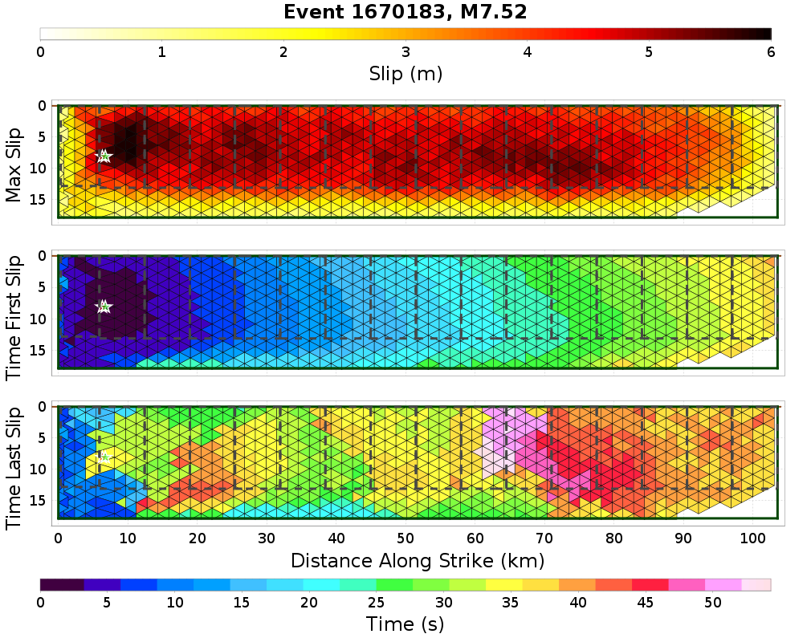
### Slip/Vel Animation
*[(top)](#table-of-contents)*

[Click here to view Slip/Velocity Animation](resources/rupture_plot_1670183.gif)
### Map Plot
*[(top)](#table-of-contents)*

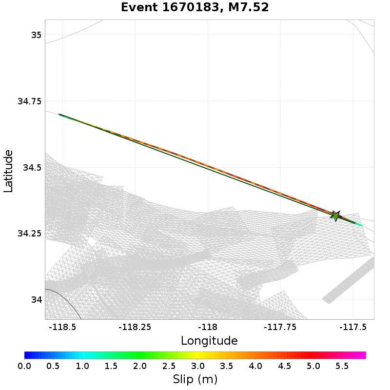
### Rupture Velocity Plot
*[(top)](#table-of-contents)*

## Spectra Plots
*[(top)](#table-of-contents)*

### Site USC
*[(top)](#table-of-contents)*

*Location: 34.0192, -118.286*

| Distance | Actual RSQSim Surface | BBP Equivalent Planar Surface | GMPE Surface |
|-----|-----|-----|-----|
| Horizontal | 60.07 km | 59.14 km | 60.07 km |
| 3-D | 60.07 km | 59.14 km | 60.07 km |

*NOTE: RSQSim ruptures sometimes have a few co-rupturing elements on faults some distance from the main rupture. This may cause discrepancies in the table above, consult rupture map plot.*
#### USC Fourier Amplitude Spectra
*[(top)](#table-of-contents)*

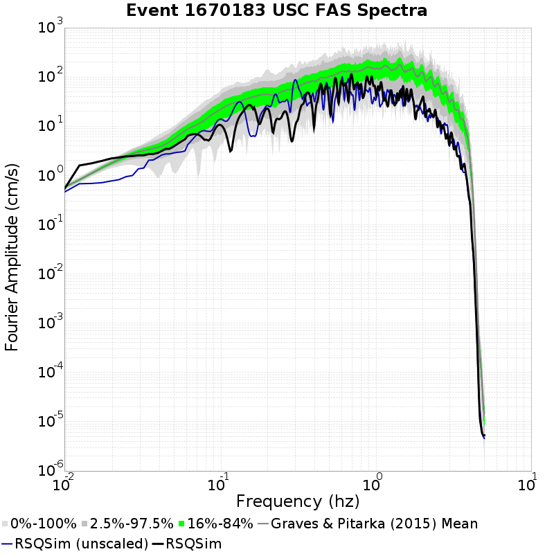
#### USC RotD50 Spectra
*[(top)](#table-of-contents)*

#### USC RotD Ratio
*[(top)](#table-of-contents)*

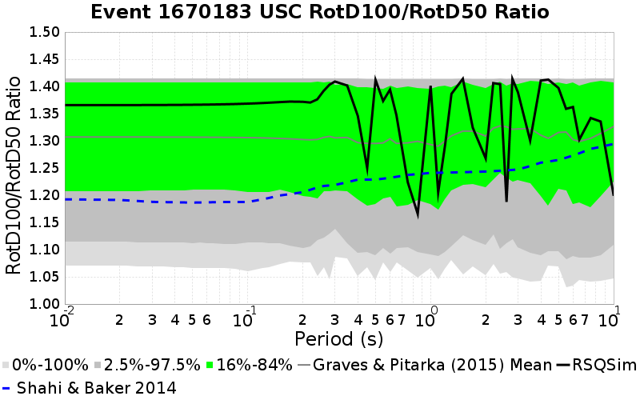
#### USC Acceleration Seismograms
*[(top)](#table-of-contents)*

RSQSim ruptures in blue. Gray seismograms are Graves & Pitarka (2015) comparisons.

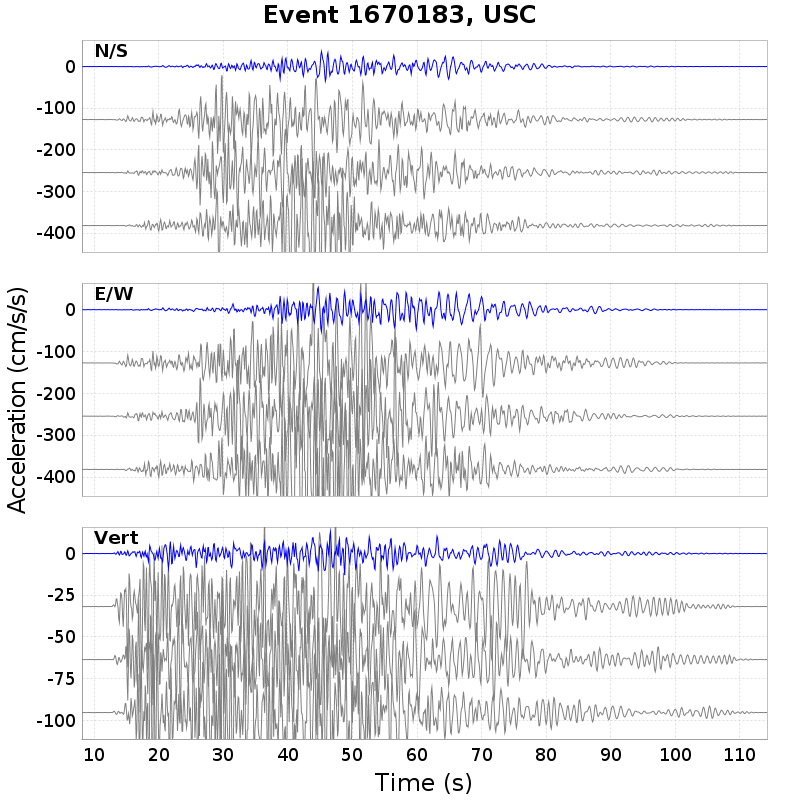
#### USC Velocity Seismograms
*[(top)](#table-of-contents)*

RSQSim ruptures in blue. Gray seismograms are Graves & Pitarka (2015) comparisons.

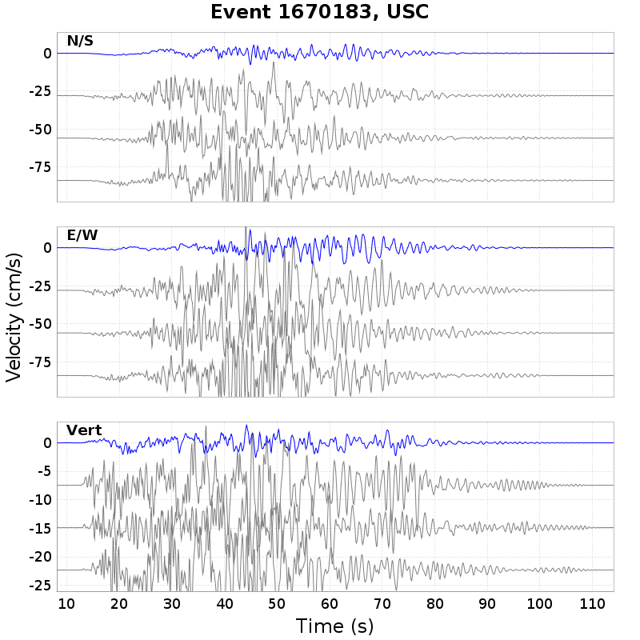
### Site PAS
*[(top)](#table-of-contents)*

*Location: 34.148426, -118.17119*

| Distance | Actual RSQSim Surface | BBP Equivalent Planar Surface | GMPE Surface |
|-----|-----|-----|-----|
| Horizontal | 42.50 km | 41.58 km | 42.50 km |
| 3-D | 42.50 km | 41.58 km | 42.50 km |

*NOTE: RSQSim ruptures sometimes have a few co-rupturing elements on faults some distance from the main rupture. This may cause discrepancies in the table above, consult rupture map plot.*
#### PAS Fourier Amplitude Spectra
*[(top)](#table-of-contents)*

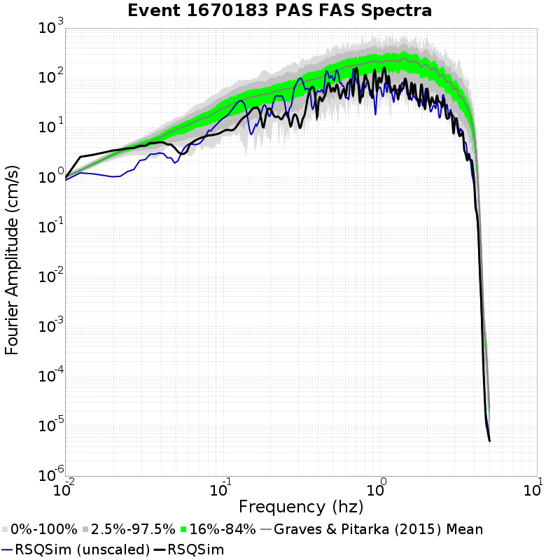
#### PAS RotD50 Spectra
*[(top)](#table-of-contents)*

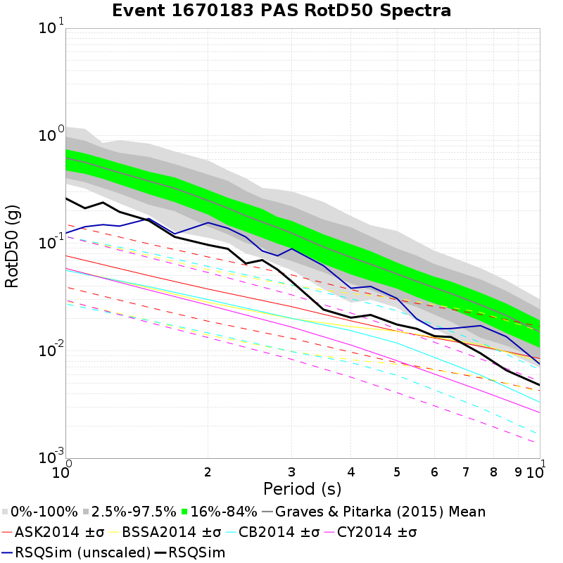
#### PAS RotD Ratio
*[(top)](#table-of-contents)*

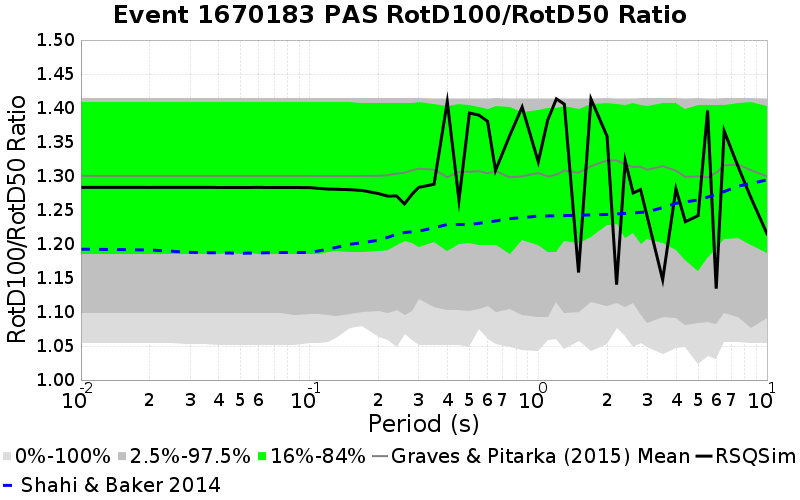
#### PAS Acceleration Seismograms
*[(top)](#table-of-contents)*

RSQSim ruptures in blue. Gray seismograms are Graves & Pitarka (2015) comparisons.

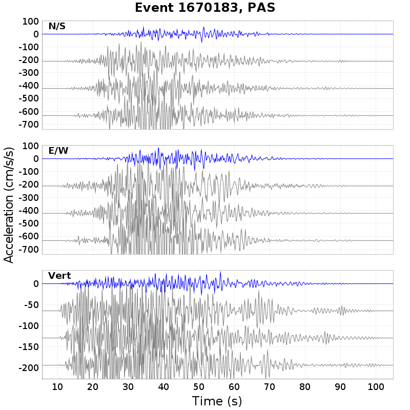
#### PAS Velocity Seismograms
*[(top)](#table-of-contents)*

RSQSim ruptures in blue. Gray seismograms are Graves & Pitarka (2015) comparisons.

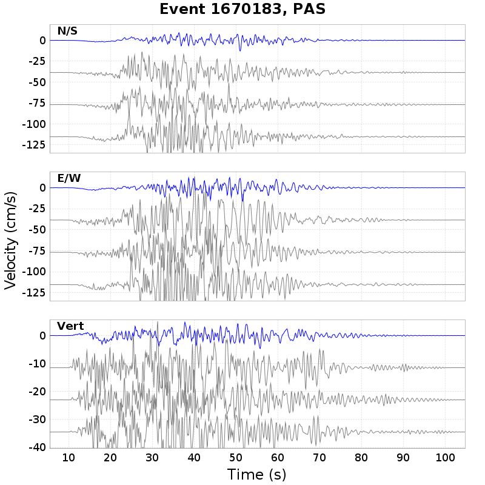
### Site SBSM
*[(top)](#table-of-contents)*

*Location: 34.064987, -117.29201*

| Distance | Actual RSQSim Surface | BBP Equivalent Planar Surface | GMPE Surface |
|-----|-----|-----|-----|
| Horizontal | 29.40 km | 31.03 km | 31.15 km |
| 3-D | 29.40 km | 31.03 km | 31.15 km |

*NOTE: RSQSim ruptures sometimes have a few co-rupturing elements on faults some distance from the main rupture. This may cause discrepancies in the table above, consult rupture map plot.*
#### SBSM Fourier Amplitude Spectra
*[(top)](#table-of-contents)*

#### SBSM RotD50 Spectra
*[(top)](#table-of-contents)*

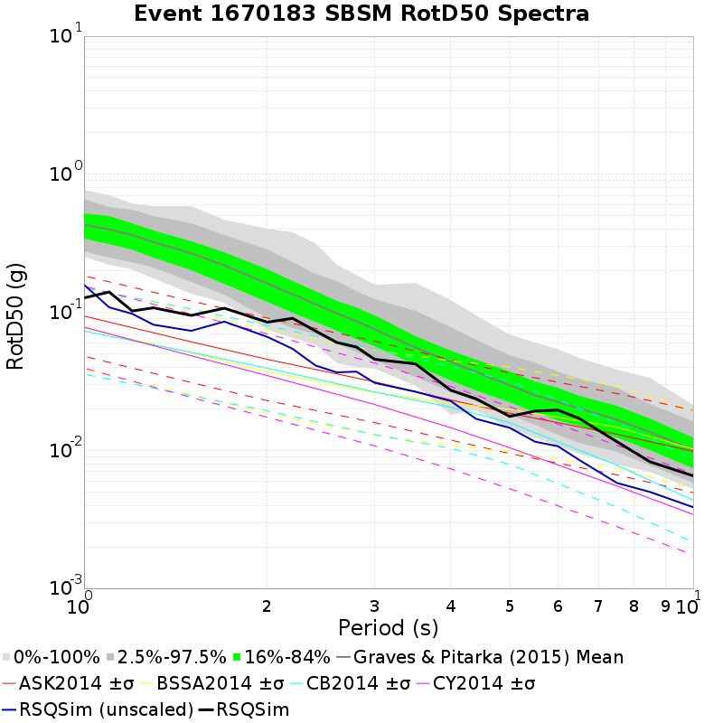
#### SBSM RotD Ratio
*[(top)](#table-of-contents)*

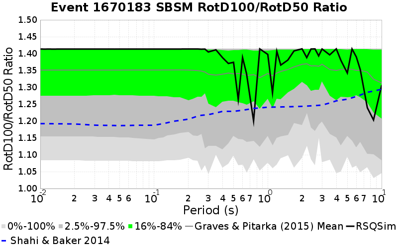
#### SBSM Acceleration Seismograms
*[(top)](#table-of-contents)*

RSQSim ruptures in blue. Gray seismograms are Graves & Pitarka (2015) comparisons.

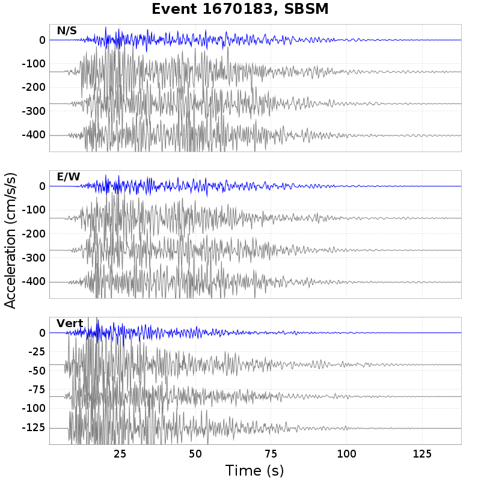
#### SBSM Velocity Seismograms
*[(top)](#table-of-contents)*

RSQSim ruptures in blue. Gray seismograms are Graves & Pitarka (2015) comparisons.

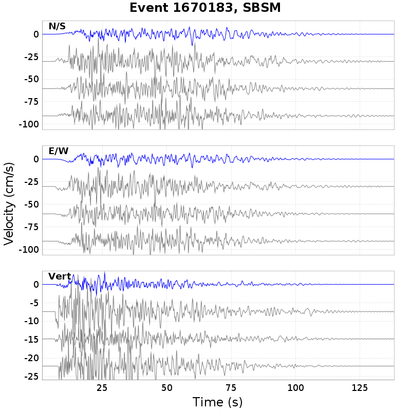
### Site WNGC
*[(top)](#table-of-contents)*

*Location: 34.041824, -118.0653*

| Distance | Actual RSQSim Surface | BBP Equivalent Planar Surface | GMPE Surface |
|-----|-----|-----|-----|
| Horizontal | 48.75 km | 47.91 km | 48.74 km |
| 3-D | 48.75 km | 47.91 km | 48.74 km |

*NOTE: RSQSim ruptures sometimes have a few co-rupturing elements on faults some distance from the main rupture. This may cause discrepancies in the table above, consult rupture map plot.*
#### WNGC Fourier Amplitude Spectra
*[(top)](#table-of-contents)*

#### WNGC RotD50 Spectra
*[(top)](#table-of-contents)*

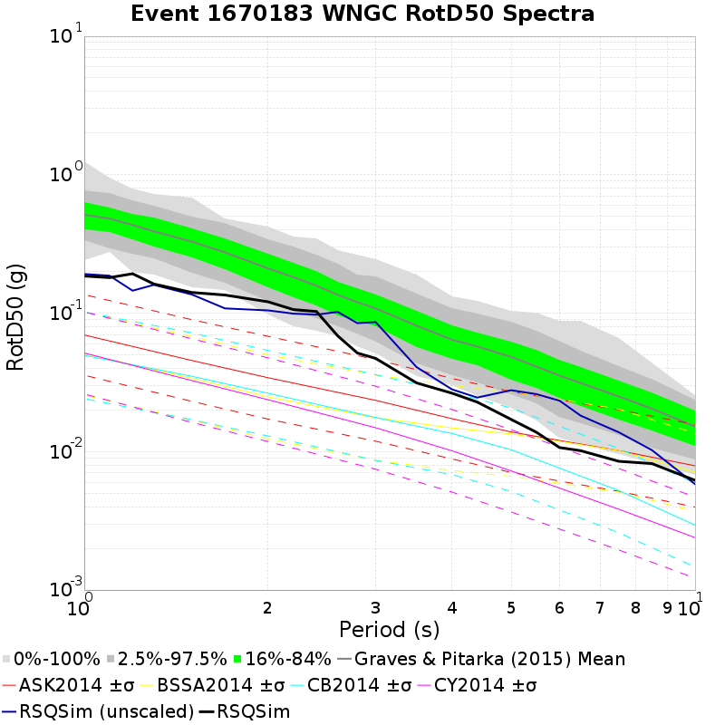
#### WNGC RotD Ratio
*[(top)](#table-of-contents)*

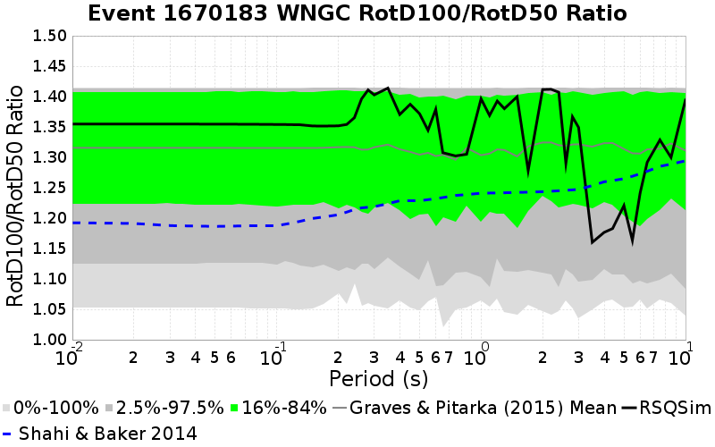
#### WNGC Acceleration Seismograms
*[(top)](#table-of-contents)*

RSQSim ruptures in blue. Gray seismograms are Graves & Pitarka (2015) comparisons.

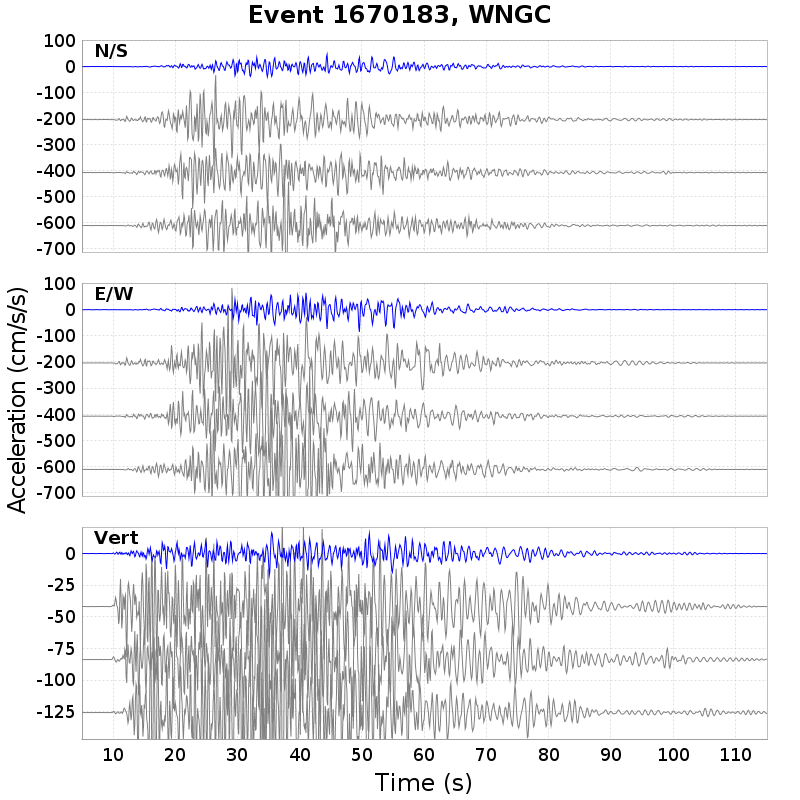
#### WNGC Velocity Seismograms
*[(top)](#table-of-contents)*

RSQSim ruptures in blue. Gray seismograms are Graves & Pitarka (2015) comparisons.

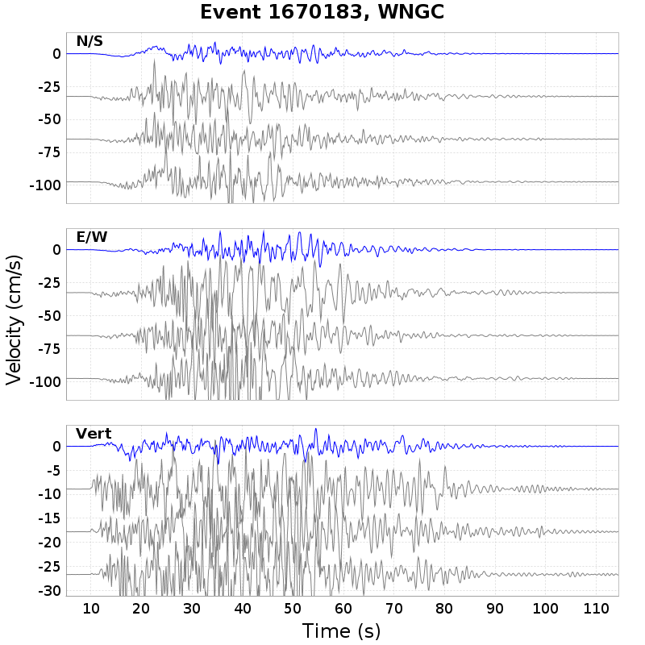
### Site STNI
*[(top)](#table-of-contents)*

*Location: 33.93088, -118.17881*

| Distance | Actual RSQSim Surface | BBP Equivalent Planar Surface | GMPE Surface |
|-----|-----|-----|-----|
| Horizontal | 64.46 km | 63.60 km | 64.46 km |
| 3-D | 64.46 km | 63.60 km | 64.46 km |

*NOTE: RSQSim ruptures sometimes have a few co-rupturing elements on faults some distance from the main rupture. This may cause discrepancies in the table above, consult rupture map plot.*
#### STNI Fourier Amplitude Spectra
*[(top)](#table-of-contents)*

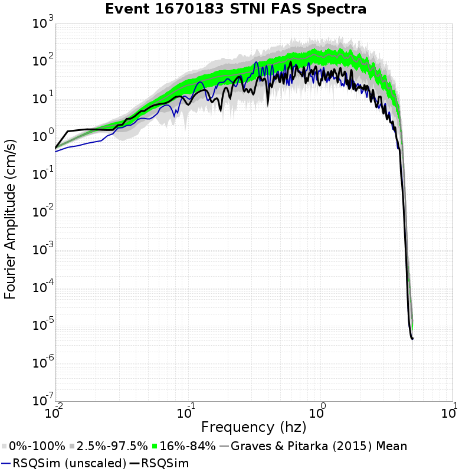
#### STNI RotD50 Spectra
*[(top)](#table-of-contents)*

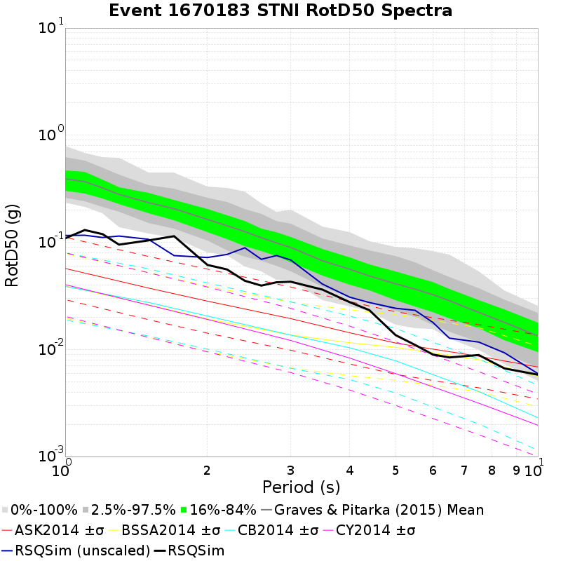
#### STNI RotD Ratio
*[(top)](#table-of-contents)*

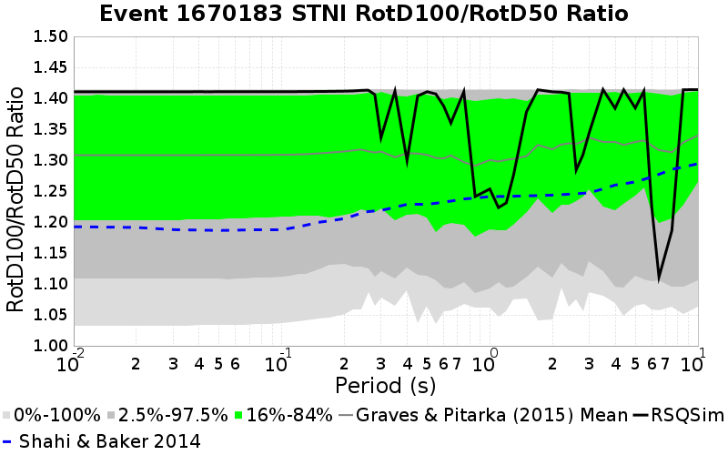
#### STNI Acceleration Seismograms
*[(top)](#table-of-contents)*

RSQSim ruptures in blue. Gray seismograms are Graves & Pitarka (2015) comparisons.

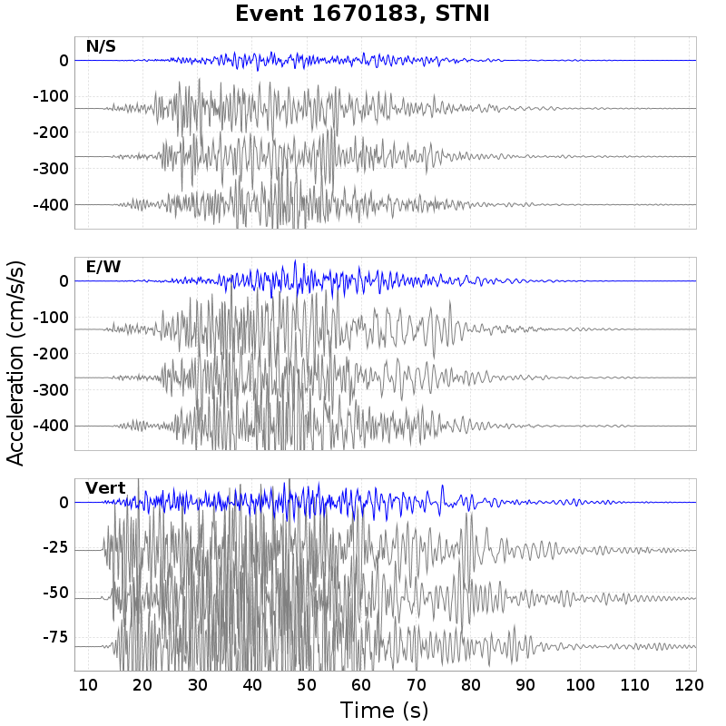
#### STNI Velocity Seismograms
*[(top)](#table-of-contents)*

RSQSim ruptures in blue. Gray seismograms are Graves & Pitarka (2015) comparisons.

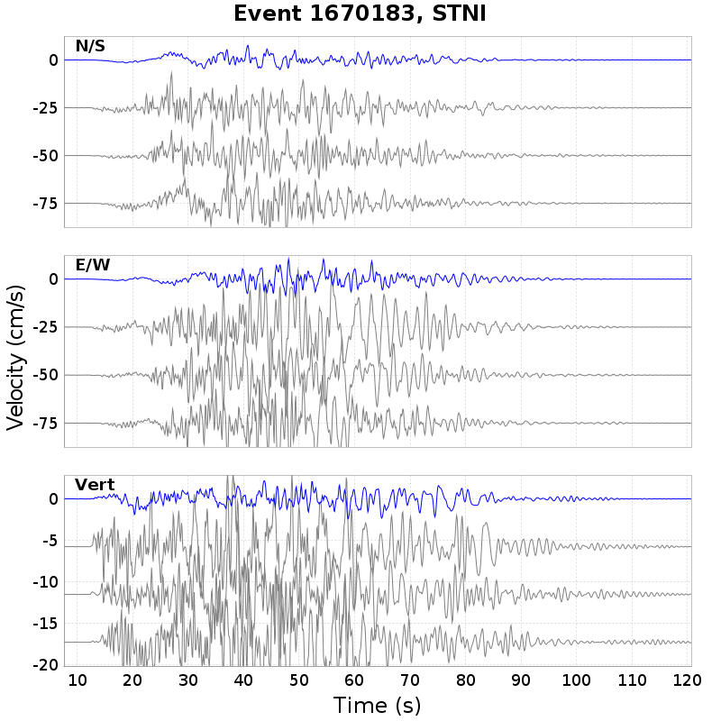
### Site LAPD
*[(top)](#table-of-contents)*

*Location: 34.557, -118.125*

| Distance | Actual RSQSim Surface | BBP Equivalent Planar Surface | GMPE Surface |
|-----|-----|-----|-----|
| Horizontal | 0.47 km | 1.06 km | 0.36 km |
| 3-D | 0.47 km | 1.06 km | 0.36 km |

*NOTE: RSQSim ruptures sometimes have a few co-rupturing elements on faults some distance from the main rupture. This may cause discrepancies in the table above, consult rupture map plot.*
#### LAPD Fourier Amplitude Spectra
*[(top)](#table-of-contents)*

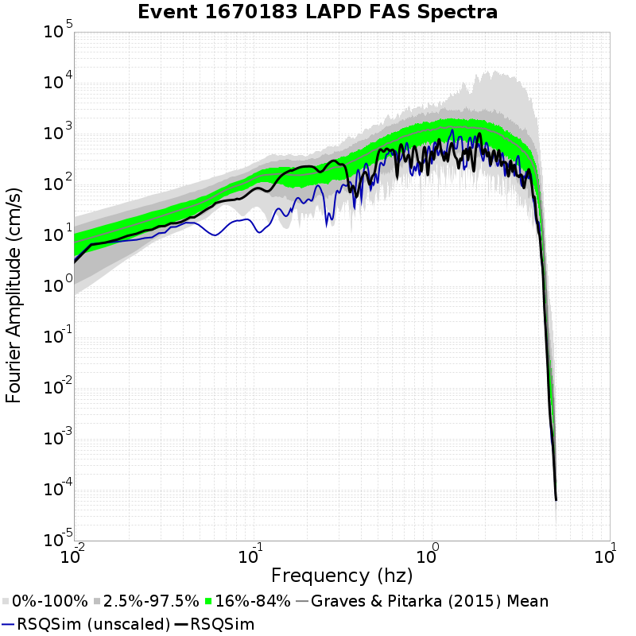
#### LAPD RotD50 Spectra
*[(top)](#table-of-contents)*

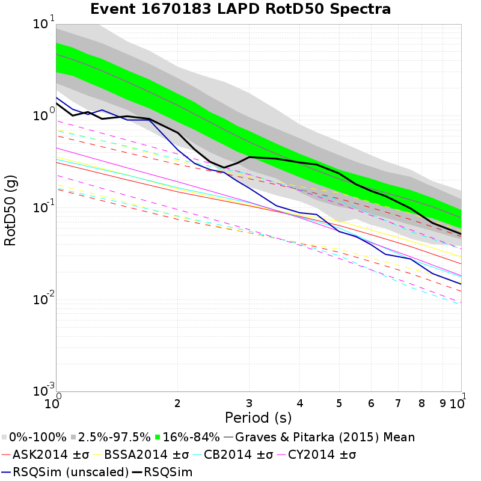
#### LAPD RotD Ratio
*[(top)](#table-of-contents)*

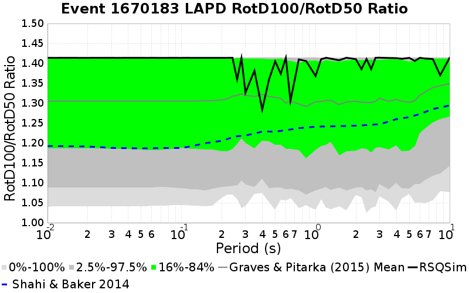
#### LAPD Acceleration Seismograms
*[(top)](#table-of-contents)*

RSQSim ruptures in blue. Gray seismograms are Graves & Pitarka (2015) comparisons.

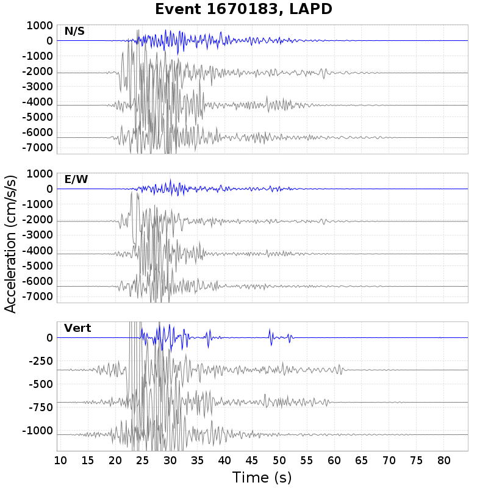
#### LAPD Velocity Seismograms
*[(top)](#table-of-contents)*

RSQSim ruptures in blue. Gray seismograms are Graves & Pitarka (2015) comparisons.

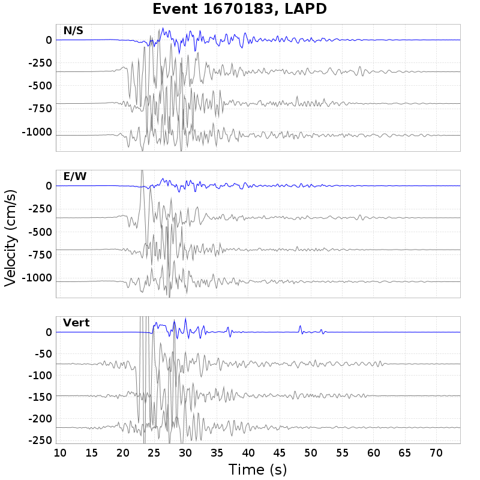
