# Event 1670183, M7.52, GP DDW Extension

**NOTE: Graves & Pitarka (2015) DDW with has been modified for the area to match the Somerville (2006) relationship.**

* Original surface: 103.57 km x 17.83 km  = 1847.07 km^2
* Modified surface: 103.57 km x 33.35 km = 3454.34 km^2

[Catalog Details](../#bruce-2585)

**Graves & Pitarka (2015) Simulations: 400 per site**

## Table Of Contents
* [Fault List](#fault-list)
* [Rupture Plots](#rupture-plots)
  * [Slip/Time Plot](#sliptime-plot)
  * [Map Plot](#map-plot)
  * [Rupture Velocity Plot](#rupture-velocity-plot)
* [Spectra Plots](#spectra-plots)
  * [Site USC](#site-usc)
    * [USC Fourier Amplitude Spectra](#usc-fourier-amplitude-spectra)
    * [USC RotD50 Spectra](#usc-rotd50-spectra)
    * [USC RotD Ratio](#usc-rotd-ratio)
    * [USC Acceleration Seismograms](#usc-acceleration-seismograms)
    * [USC Velocity Seismograms](#usc-velocity-seismograms)
  * [Site PAS](#site-pas)
    * [PAS Fourier Amplitude Spectra](#pas-fourier-amplitude-spectra)
    * [PAS RotD50 Spectra](#pas-rotd50-spectra)
    * [PAS RotD Ratio](#pas-rotd-ratio)
    * [PAS Acceleration Seismograms](#pas-acceleration-seismograms)
    * [PAS Velocity Seismograms](#pas-velocity-seismograms)
  * [Site SBSM](#site-sbsm)
    * [SBSM Fourier Amplitude Spectra](#sbsm-fourier-amplitude-spectra)
    * [SBSM RotD50 Spectra](#sbsm-rotd50-spectra)
    * [SBSM RotD Ratio](#sbsm-rotd-ratio)
    * [SBSM Acceleration Seismograms](#sbsm-acceleration-seismograms)
    * [SBSM Velocity Seismograms](#sbsm-velocity-seismograms)
  * [Site WNGC](#site-wngc)
    * [WNGC Fourier Amplitude Spectra](#wngc-fourier-amplitude-spectra)
    * [WNGC RotD50 Spectra](#wngc-rotd50-spectra)
    * [WNGC RotD Ratio](#wngc-rotd-ratio)
    * [WNGC Acceleration Seismograms](#wngc-acceleration-seismograms)
    * [WNGC Velocity Seismograms](#wngc-velocity-seismograms)
  * [Site STNI](#site-stni)
    * [STNI Fourier Amplitude Spectra](#stni-fourier-amplitude-spectra)
    * [STNI RotD50 Spectra](#stni-rotd50-spectra)
    * [STNI RotD Ratio](#stni-rotd-ratio)
    * [STNI Acceleration Seismograms](#stni-acceleration-seismograms)
    * [STNI Velocity Seismograms](#stni-velocity-seismograms)
  * [Site LAPD](#site-lapd)
    * [LAPD Fourier Amplitude Spectra](#lapd-fourier-amplitude-spectra)
    * [LAPD RotD50 Spectra](#lapd-rotd50-spectra)
    * [LAPD RotD Ratio](#lapd-rotd-ratio)
    * [LAPD Acceleration Seismograms](#lapd-acceleration-seismograms)
    * [LAPD Velocity Seismograms](#lapd-velocity-seismograms)
## Fault List
*[(top)](#table-of-contents)*

| Section Name | Area Ruptured | Patches Ruptured | Moment | Equiv. Mag | Max Slip |
|-----|-----|-----|-----|-----|-----|
| *(Total)* | 1847.07 km^2 | 1365 | 2.13e20 N-m | M7.52 | 5.90 m |
| San Andreas (Mojave S) | 1722.96 km^2 | 1272 | 2.04e20 N-m | M7.51 | 5.90 m |
| San Andreas (San Bernardino N) | 124.11 km^2 | 93 | 8.85e18 N-m | M6.60 | 4.72 m |

## Rupture Plots
*[(top)](#table-of-contents)*

**Legend**
* Colored, Filled Triangles: RSQSim Elements
* Red Star: RSQSim Hypocenter
* Dark Green Solid Outline: BBP Equivalent Planar Surface
* Green Star: BBP Equivalent Hypocenter
* Dark Gray Dashed Outline: GMPE Surface

### Slip/Time Plot
*[(top)](#table-of-contents)*

### Map Plot
*[(top)](#table-of-contents)*

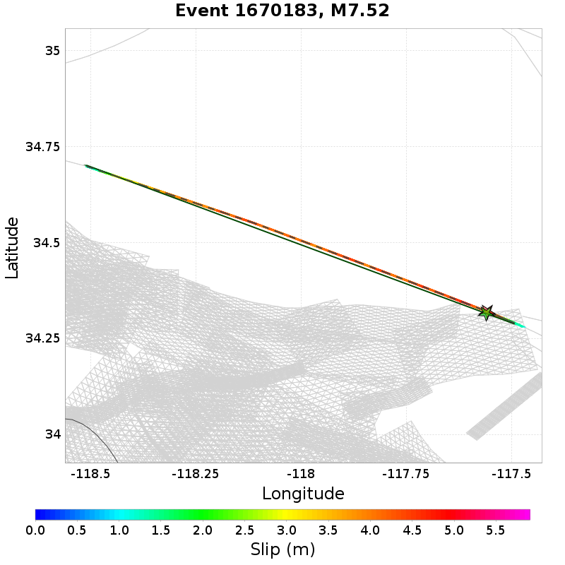
### Rupture Velocity Plot
*[(top)](#table-of-contents)*

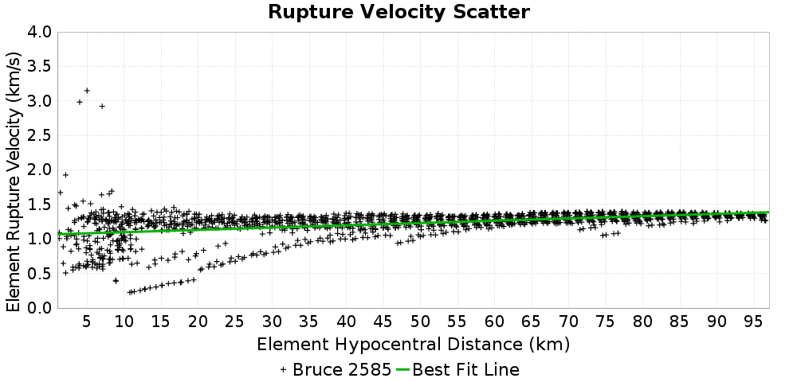

## Spectra Plots
*[(top)](#table-of-contents)*

### Site USC
*[(top)](#table-of-contents)*

*Location: 34.0192, -118.286*

| Distance | Actual RSQSim Surface | BBP Equivalent Planar Surface | GMPE Surface |
|-----|-----|-----|-----|
| Horizontal | 60.07 km | 59.14 km | 60.07 km |
| 3-D | 60.07 km | 59.14 km | 60.07 km |

*NOTE: RSQSim ruptures sometimes have a few co-rupturing elements on faults some distance from the main rupture. This may cause discrepancies in the table above, consult rupture map plot.*
#### USC Fourier Amplitude Spectra
*[(top)](#table-of-contents)*

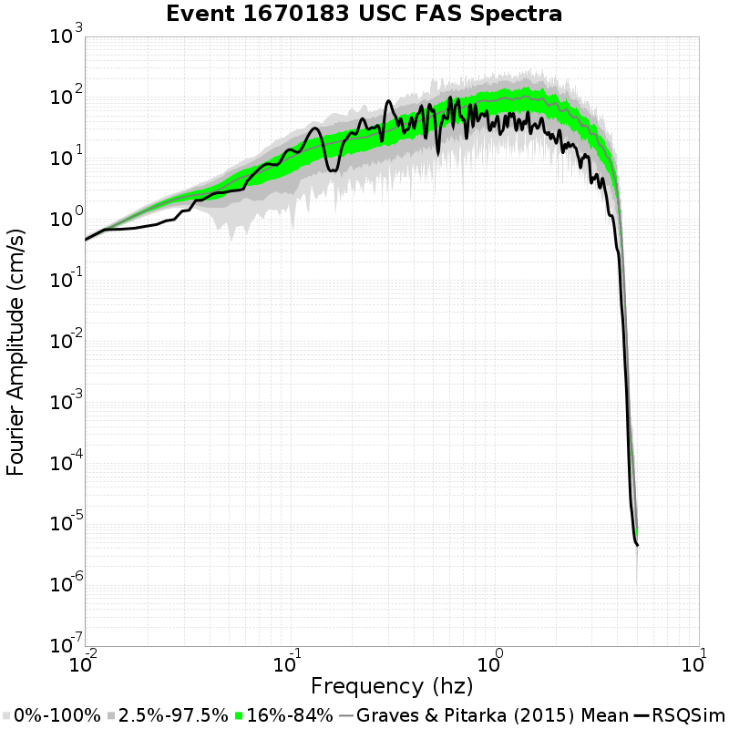
#### USC RotD50 Spectra
*[(top)](#table-of-contents)*

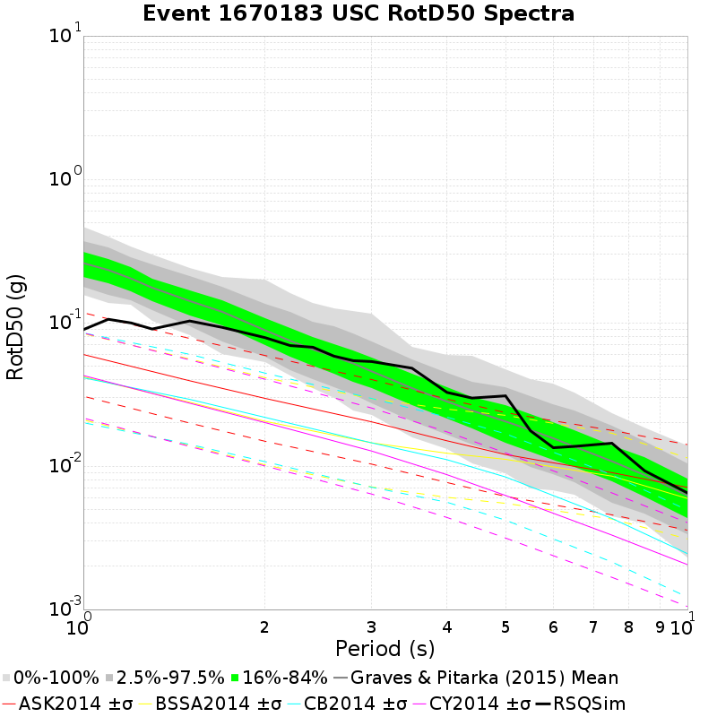
#### USC RotD Ratio
*[(top)](#table-of-contents)*

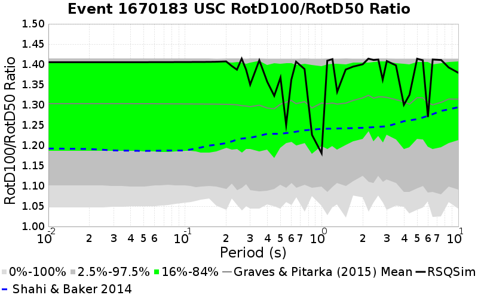
#### USC Acceleration Seismograms
*[(top)](#table-of-contents)*

RSQSim ruptures in blue. Gray seismograms are Graves & Pitarka (2015) comparisons.

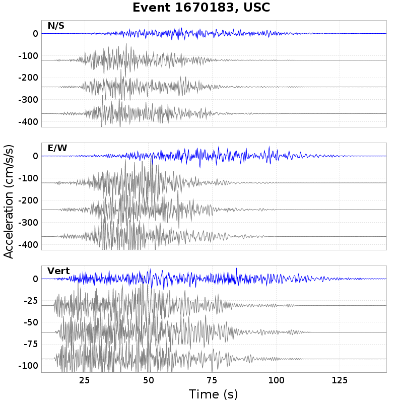
#### USC Velocity Seismograms
*[(top)](#table-of-contents)*

RSQSim ruptures in blue. Gray seismograms are Graves & Pitarka (2015) comparisons.

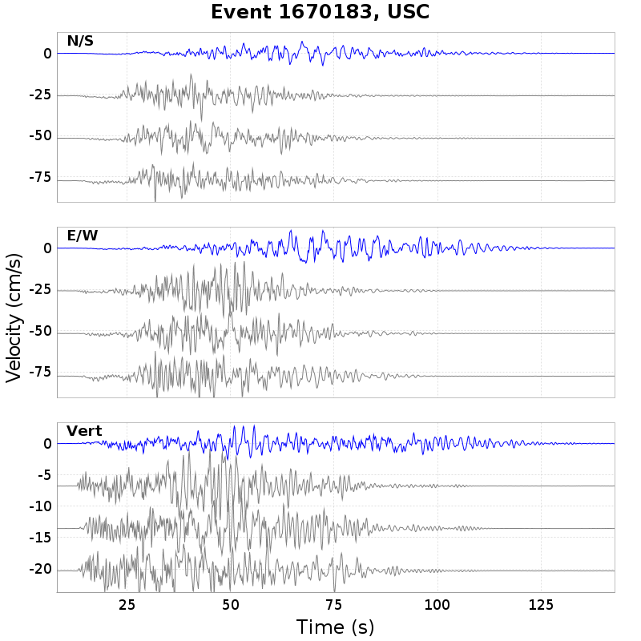
### Site PAS
*[(top)](#table-of-contents)*

*Location: 34.148426, -118.17119*

| Distance | Actual RSQSim Surface | BBP Equivalent Planar Surface | GMPE Surface |
|-----|-----|-----|-----|
| Horizontal | 42.50 km | 41.58 km | 42.50 km |
| 3-D | 42.50 km | 41.58 km | 42.50 km |

*NOTE: RSQSim ruptures sometimes have a few co-rupturing elements on faults some distance from the main rupture. This may cause discrepancies in the table above, consult rupture map plot.*
#### PAS Fourier Amplitude Spectra
*[(top)](#table-of-contents)*

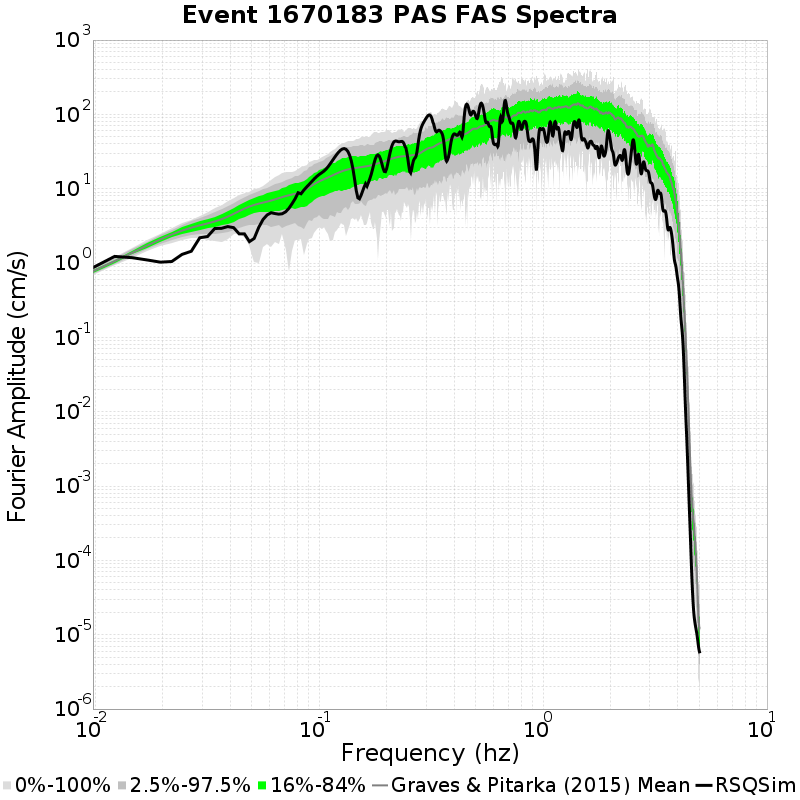
#### PAS RotD50 Spectra
*[(top)](#table-of-contents)*

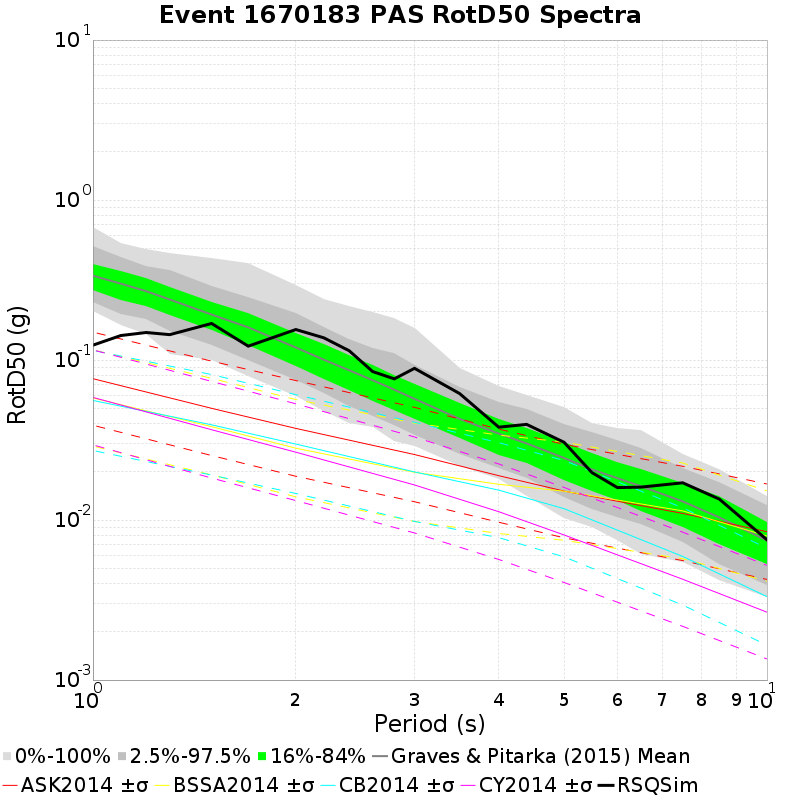
#### PAS RotD Ratio
*[(top)](#table-of-contents)*

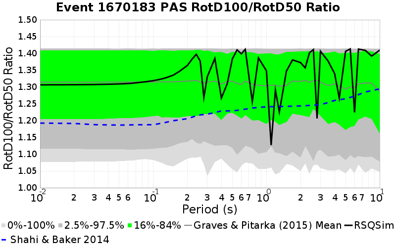
#### PAS Acceleration Seismograms
*[(top)](#table-of-contents)*

RSQSim ruptures in blue. Gray seismograms are Graves & Pitarka (2015) comparisons.

#### PAS Velocity Seismograms
*[(top)](#table-of-contents)*

RSQSim ruptures in blue. Gray seismograms are Graves & Pitarka (2015) comparisons.

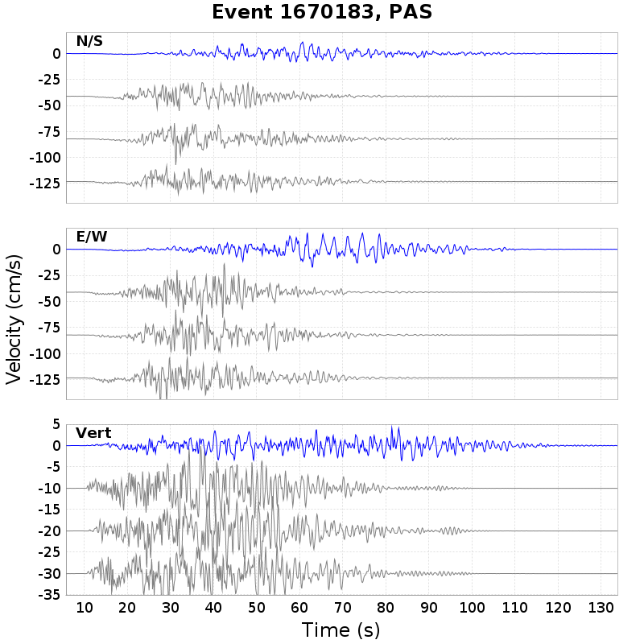
### Site SBSM
*[(top)](#table-of-contents)*

*Location: 34.064987, -117.29201*

| Distance | Actual RSQSim Surface | BBP Equivalent Planar Surface | GMPE Surface |
|-----|-----|-----|-----|
| Horizontal | 29.40 km | 31.03 km | 31.15 km |
| 3-D | 29.40 km | 31.03 km | 31.15 km |

*NOTE: RSQSim ruptures sometimes have a few co-rupturing elements on faults some distance from the main rupture. This may cause discrepancies in the table above, consult rupture map plot.*
#### SBSM Fourier Amplitude Spectra
*[(top)](#table-of-contents)*

#### SBSM RotD50 Spectra
*[(top)](#table-of-contents)*

#### SBSM RotD Ratio
*[(top)](#table-of-contents)*

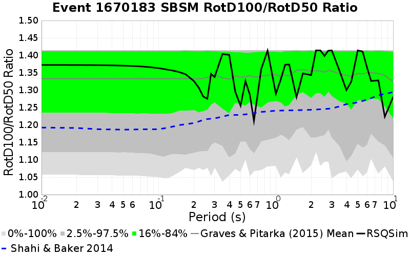
#### SBSM Acceleration Seismograms
*[(top)](#table-of-contents)*

RSQSim ruptures in blue. Gray seismograms are Graves & Pitarka (2015) comparisons.

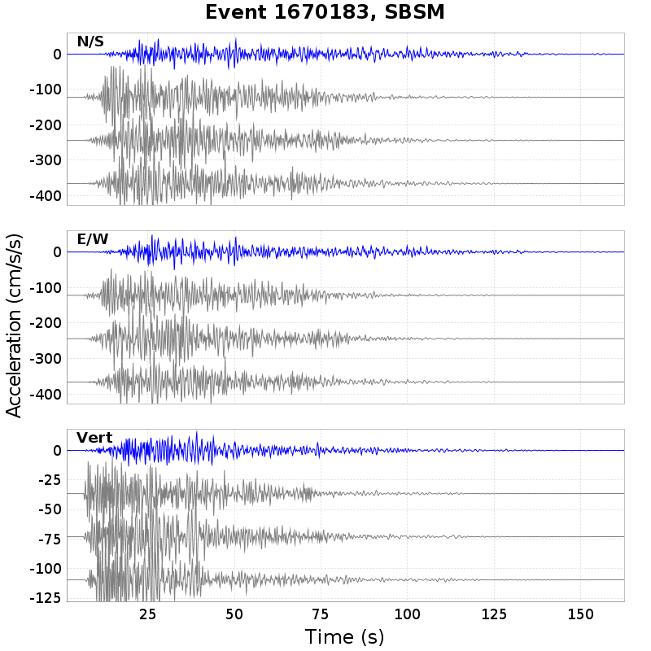
#### SBSM Velocity Seismograms
*[(top)](#table-of-contents)*

RSQSim ruptures in blue. Gray seismograms are Graves & Pitarka (2015) comparisons.

### Site WNGC
*[(top)](#table-of-contents)*

*Location: 34.041824, -118.0653*

| Distance | Actual RSQSim Surface | BBP Equivalent Planar Surface | GMPE Surface |
|-----|-----|-----|-----|
| Horizontal | 48.75 km | 47.91 km | 48.74 km |
| 3-D | 48.75 km | 47.91 km | 48.74 km |

*NOTE: RSQSim ruptures sometimes have a few co-rupturing elements on faults some distance from the main rupture. This may cause discrepancies in the table above, consult rupture map plot.*
#### WNGC Fourier Amplitude Spectra
*[(top)](#table-of-contents)*

#### WNGC RotD50 Spectra
*[(top)](#table-of-contents)*

#### WNGC RotD Ratio
*[(top)](#table-of-contents)*

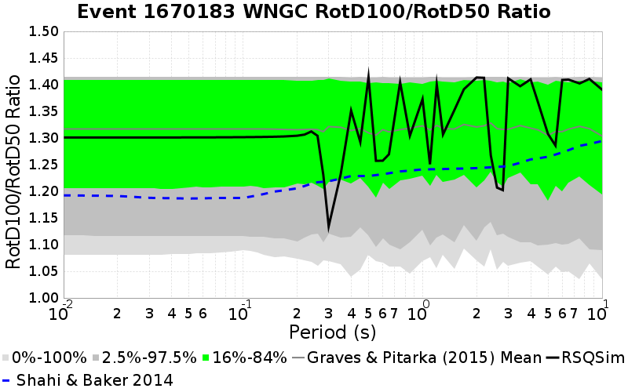
#### WNGC Acceleration Seismograms
*[(top)](#table-of-contents)*

RSQSim ruptures in blue. Gray seismograms are Graves & Pitarka (2015) comparisons.

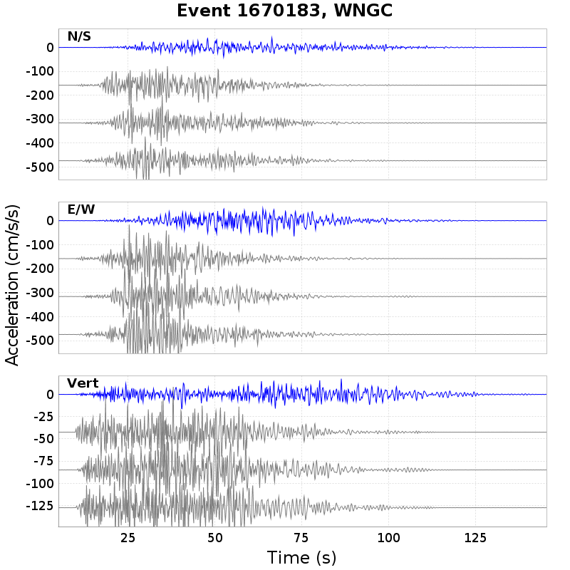
#### WNGC Velocity Seismograms
*[(top)](#table-of-contents)*

RSQSim ruptures in blue. Gray seismograms are Graves & Pitarka (2015) comparisons.

### Site STNI
*[(top)](#table-of-contents)*

*Location: 33.93088, -118.17881*

| Distance | Actual RSQSim Surface | BBP Equivalent Planar Surface | GMPE Surface |
|-----|-----|-----|-----|
| Horizontal | 64.46 km | 63.60 km | 64.46 km |
| 3-D | 64.46 km | 63.60 km | 64.46 km |

*NOTE: RSQSim ruptures sometimes have a few co-rupturing elements on faults some distance from the main rupture. This may cause discrepancies in the table above, consult rupture map plot.*
#### STNI Fourier Amplitude Spectra
*[(top)](#table-of-contents)*

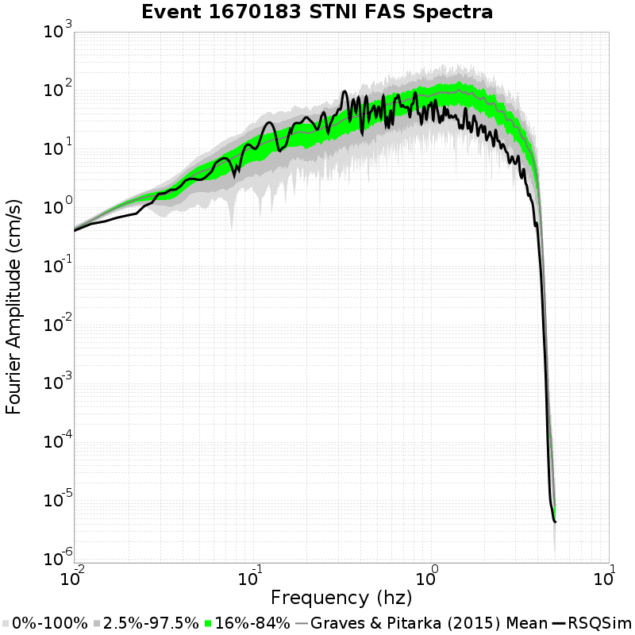
#### STNI RotD50 Spectra
*[(top)](#table-of-contents)*

#### STNI RotD Ratio
*[(top)](#table-of-contents)*

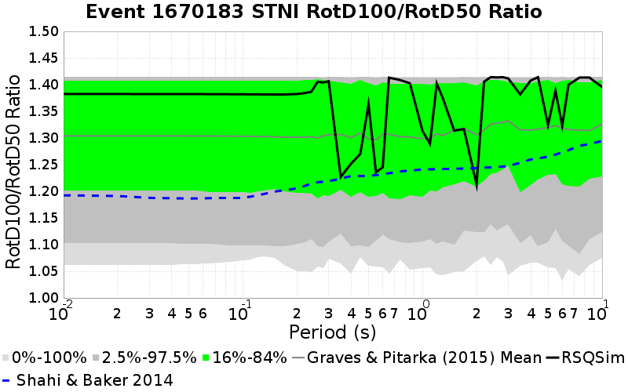
#### STNI Acceleration Seismograms
*[(top)](#table-of-contents)*

RSQSim ruptures in blue. Gray seismograms are Graves & Pitarka (2015) comparisons.

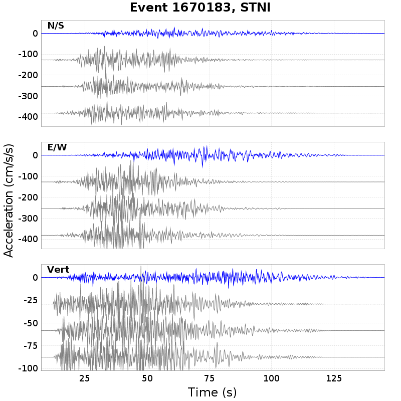
#### STNI Velocity Seismograms
*[(top)](#table-of-contents)*

RSQSim ruptures in blue. Gray seismograms are Graves & Pitarka (2015) comparisons.

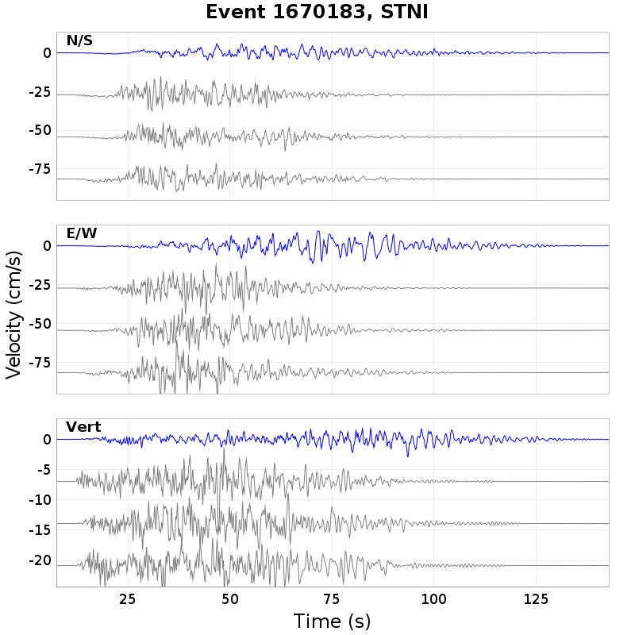
### Site LAPD
*[(top)](#table-of-contents)*

*Location: 34.557, -118.125*

| Distance | Actual RSQSim Surface | BBP Equivalent Planar Surface | GMPE Surface |
|-----|-----|-----|-----|
| Horizontal | 0.47 km | 1.06 km | 0.36 km |
| 3-D | 0.47 km | 1.06 km | 0.36 km |

*NOTE: RSQSim ruptures sometimes have a few co-rupturing elements on faults some distance from the main rupture. This may cause discrepancies in the table above, consult rupture map plot.*
#### LAPD Fourier Amplitude Spectra
*[(top)](#table-of-contents)*

#### LAPD RotD50 Spectra
*[(top)](#table-of-contents)*

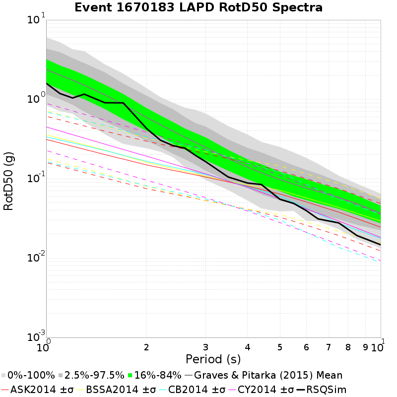
#### LAPD RotD Ratio
*[(top)](#table-of-contents)*

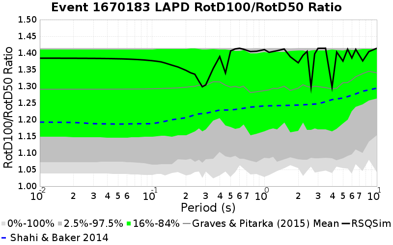
#### LAPD Acceleration Seismograms
*[(top)](#table-of-contents)*

RSQSim ruptures in blue. Gray seismograms are Graves & Pitarka (2015) comparisons.

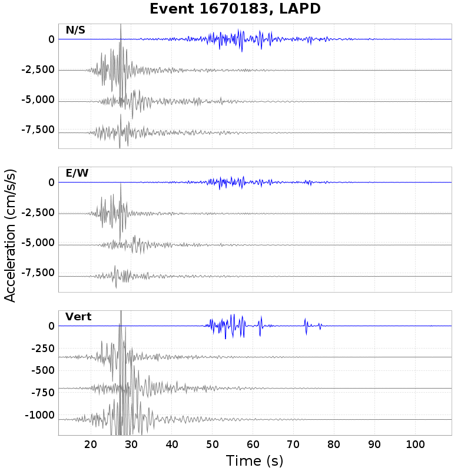
#### LAPD Velocity Seismograms
*[(top)](#table-of-contents)*

RSQSim ruptures in blue. Gray seismograms are Graves & Pitarka (2015) comparisons.

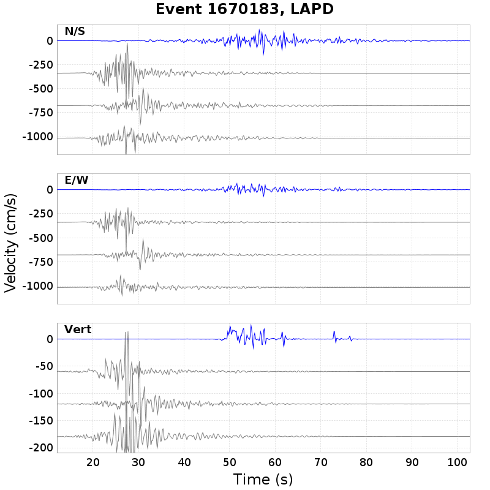
