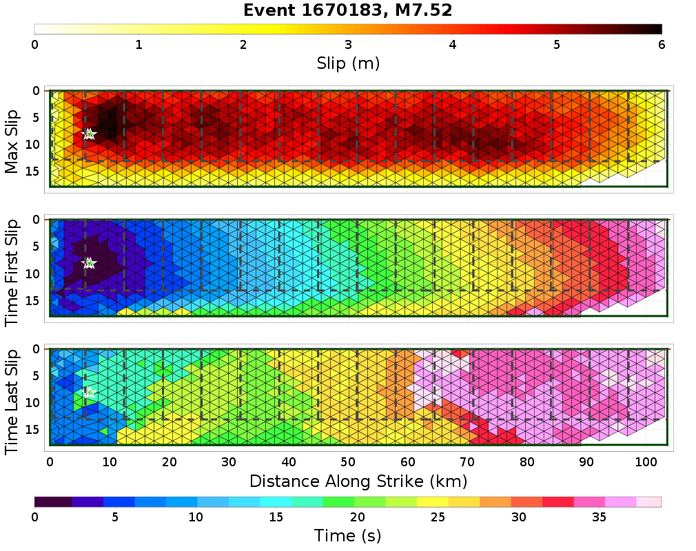
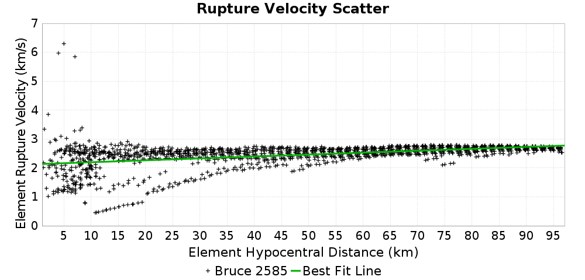
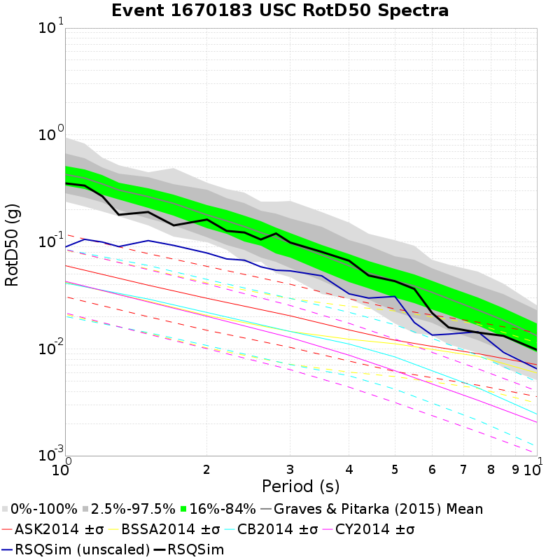
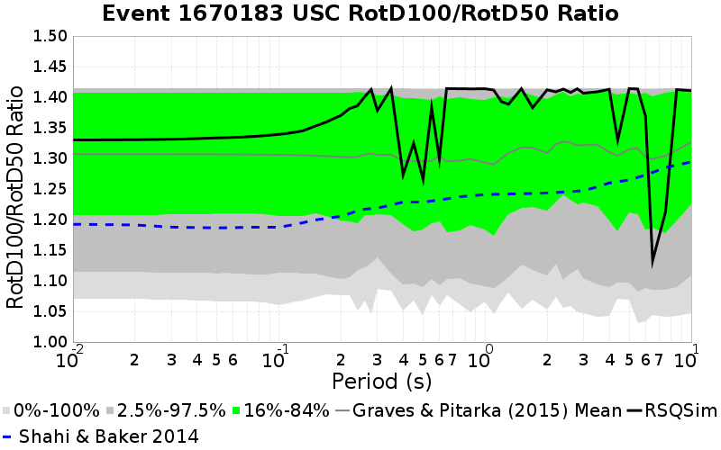
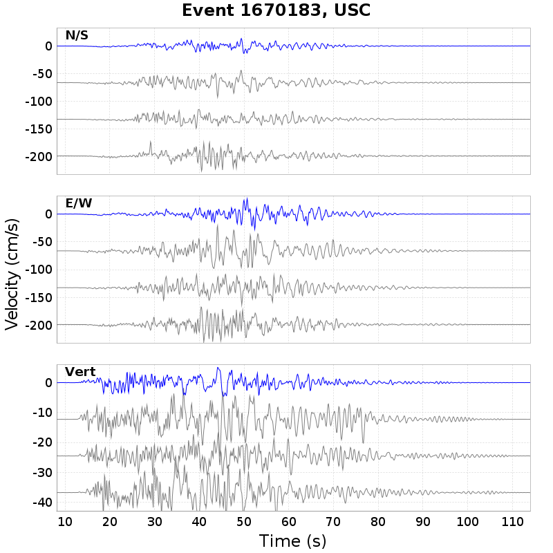
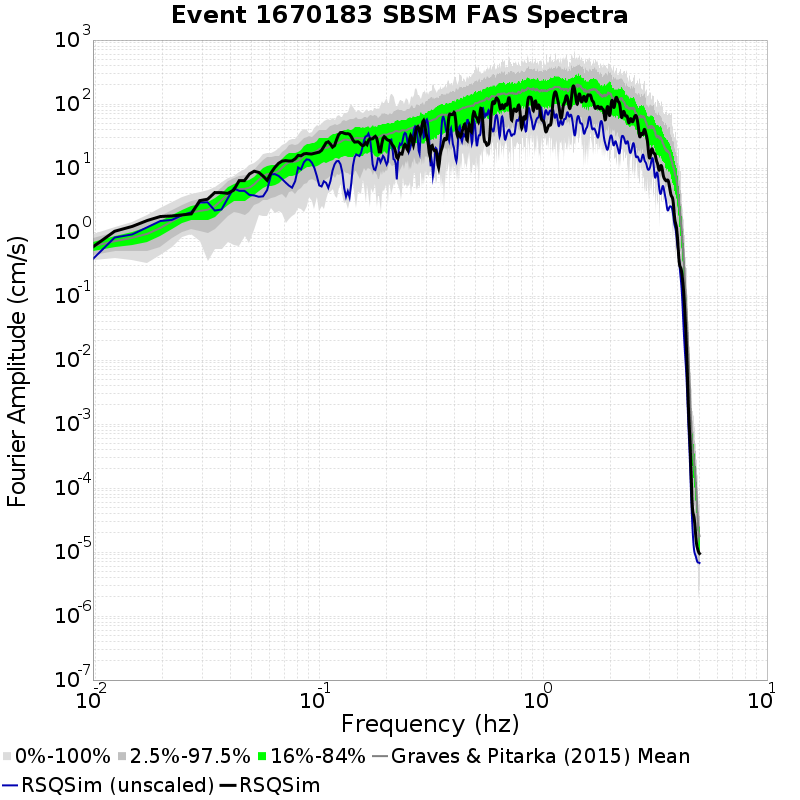
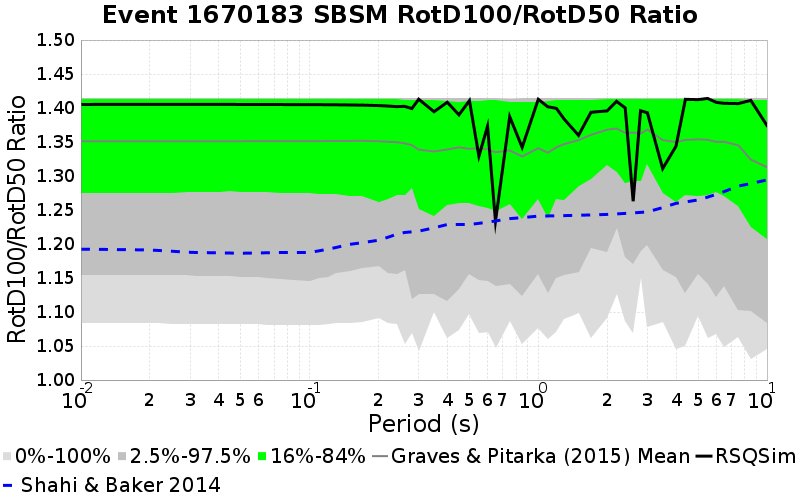
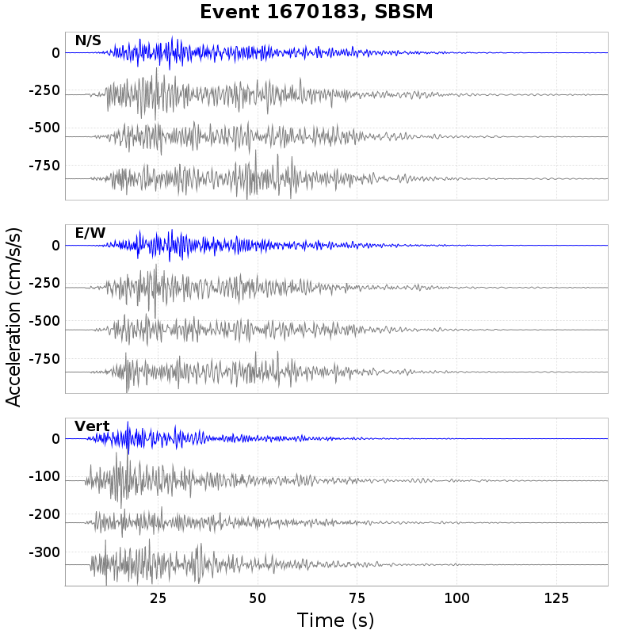

# Event 1670183, M7.52, Time Scale Factor: 2.0, Velocities Scaled

**NOTE: RSQSim Slip/Time function has been MODIFIED on this page. Slip initiation for each patch are modified to be 2.0 times sooner. Slip velocities are also scaled by 2.0x, resulting in faster (but shorter lasting) slip.**

[Catalog Details](../#bruce-2585)

**Graves & Pitarka (2015) Simulations: 400 per site**

## Table Of Contents
* [Fault List](#fault-list)
* [Rupture Plots](#rupture-plots)
  * [Slip/Time Plot](#sliptime-plot)
  * [Slip/Vel Animation](#slipvel-animation)
  * [Map Plot](#map-plot)
  * [Rupture Velocity Plot](#rupture-velocity-plot)
* [Spectra Plots](#spectra-plots)
  * [Site USC](#site-usc)
    * [USC Fourier Amplitude Spectra](#usc-fourier-amplitude-spectra)
    * [USC RotD50 Spectra](#usc-rotd50-spectra)
    * [USC RotD Ratio](#usc-rotd-ratio)
    * [USC Acceleration Seismograms](#usc-acceleration-seismograms)
    * [USC Velocity Seismograms](#usc-velocity-seismograms)
  * [Site SBSM](#site-sbsm)
    * [SBSM Fourier Amplitude Spectra](#sbsm-fourier-amplitude-spectra)
    * [SBSM RotD50 Spectra](#sbsm-rotd50-spectra)
    * [SBSM RotD Ratio](#sbsm-rotd-ratio)
    * [SBSM Acceleration Seismograms](#sbsm-acceleration-seismograms)
    * [SBSM Velocity Seismograms](#sbsm-velocity-seismograms)
  * [Site Los Angeles](#site-los-angeles)
    * [Los Angeles Fourier Amplitude Spectra](#los-angeles-fourier-amplitude-spectra)
    * [Los Angeles RotD50 Spectra](#los-angeles-rotd50-spectra)
    * [Los Angeles RotD Ratio](#los-angeles-rotd-ratio)
    * [Los Angeles Acceleration Seismograms](#los-angeles-acceleration-seismograms)
    * [Los Angeles Velocity Seismograms](#los-angeles-velocity-seismograms)
  * [Site Riverside](#site-riverside)
    * [Riverside Fourier Amplitude Spectra](#riverside-fourier-amplitude-spectra)
    * [Riverside RotD50 Spectra](#riverside-rotd50-spectra)
    * [Riverside RotD Ratio](#riverside-rotd-ratio)
    * [Riverside Acceleration Seismograms](#riverside-acceleration-seismograms)
    * [Riverside Velocity Seismograms](#riverside-velocity-seismograms)
  * [Site San Diego](#site-san-diego)
    * [San Diego Fourier Amplitude Spectra](#san-diego-fourier-amplitude-spectra)
    * [San Diego RotD50 Spectra](#san-diego-rotd50-spectra)
    * [San Diego RotD Ratio](#san-diego-rotd-ratio)
    * [San Diego Acceleration Seismograms](#san-diego-acceleration-seismograms)
    * [San Diego Velocity Seismograms](#san-diego-velocity-seismograms)
  * [Site Santa Barbara](#site-santa-barbara)
    * [Santa Barbara Fourier Amplitude Spectra](#santa-barbara-fourier-amplitude-spectra)
    * [Santa Barbara RotD50 Spectra](#santa-barbara-rotd50-spectra)
    * [Santa Barbara RotD Ratio](#santa-barbara-rotd-ratio)
    * [Santa Barbara Acceleration Seismograms](#santa-barbara-acceleration-seismograms)
    * [Santa Barbara Velocity Seismograms](#santa-barbara-velocity-seismograms)
## Fault List
*[(top)](#table-of-contents)*

| Section Name | Area Ruptured | Patches Ruptured | Moment | Equiv. Mag | Max Slip |
|-----|-----|-----|-----|-----|-----|
| *(Total)* | 1847.07 km^2 | 1365 | 2.13e20 N-m | M7.52 | 5.90 m |
| San Andreas (Mojave S) | 1722.96 km^2 | 1272 | 2.04e20 N-m | M7.51 | 5.90 m |
| San Andreas (San Bernardino N) | 124.11 km^2 | 93 | 8.85e18 N-m | M6.60 | 4.72 m |

## Rupture Plots
*[(top)](#table-of-contents)*

**Legend**
* Colored, Filled Triangles: RSQSim Elements
* Red Star: RSQSim Hypocenter
* Dark Green Solid Outline: BBP Equivalent Planar Surface
* Green Star: BBP Equivalent Hypocenter
* Dark Gray Dashed Outline: GMPE Surface

### Slip/Time Plot
*[(top)](#table-of-contents)*

### Slip/Vel Animation
*[(top)](#table-of-contents)*

[Click here to view Slip/Velocity Animation](resources/rupture_plot_1670183.gif)
### Map Plot
*[(top)](#table-of-contents)*

### Rupture Velocity Plot
*[(top)](#table-of-contents)*

## Spectra Plots
*[(top)](#table-of-contents)*

### Site USC
*[(top)](#table-of-contents)*

*Location: 34.0192, -118.286*

| Distance | Actual RSQSim Surface | BBP Equivalent Planar Surface | GMPE Surface |
|-----|-----|-----|-----|
| Horizontal | 60.07 km | 59.14 km | 60.07 km |
| 3-D | 60.07 km | 59.14 km | 60.07 km |

*NOTE: RSQSim ruptures sometimes have a few co-rupturing elements on faults some distance from the main rupture. This may cause discrepancies in the table above, consult rupture map plot.*
#### USC Fourier Amplitude Spectra
*[(top)](#table-of-contents)*

#### USC RotD50 Spectra
*[(top)](#table-of-contents)*

#### USC RotD Ratio
*[(top)](#table-of-contents)*

#### USC Acceleration Seismograms
*[(top)](#table-of-contents)*

RSQSim ruptures in blue. Gray seismograms are Graves & Pitarka (2015) comparisons.

#### USC Velocity Seismograms
*[(top)](#table-of-contents)*

RSQSim ruptures in blue. Gray seismograms are Graves & Pitarka (2015) comparisons.

### Site SBSM
*[(top)](#table-of-contents)*

*Location: 34.064987, -117.29201*

| Distance | Actual RSQSim Surface | BBP Equivalent Planar Surface | GMPE Surface |
|-----|-----|-----|-----|
| Horizontal | 29.40 km | 31.03 km | 31.15 km |
| 3-D | 29.40 km | 31.03 km | 31.15 km |

*NOTE: RSQSim ruptures sometimes have a few co-rupturing elements on faults some distance from the main rupture. This may cause discrepancies in the table above, consult rupture map plot.*
#### SBSM Fourier Amplitude Spectra
*[(top)](#table-of-contents)*

#### SBSM RotD50 Spectra
*[(top)](#table-of-contents)*

#### SBSM RotD Ratio
*[(top)](#table-of-contents)*

#### SBSM Acceleration Seismograms
*[(top)](#table-of-contents)*

RSQSim ruptures in blue. Gray seismograms are Graves & Pitarka (2015) comparisons.

#### SBSM Velocity Seismograms
*[(top)](#table-of-contents)*

RSQSim ruptures in blue. Gray seismograms are Graves & Pitarka (2015) comparisons.

### Site Los Angeles
*[(top)](#table-of-contents)*

*Location: 34.05, -118.25*

| Distance | Actual RSQSim Surface | BBP Equivalent Planar Surface | GMPE Surface |
|-----|-----|-----|-----|
| Horizontal | 55.53 km | 54.60 km | 55.53 km |
| 3-D | 55.53 km | 54.60 km | 55.53 km |

*NOTE: RSQSim ruptures sometimes have a few co-rupturing elements on faults some distance from the main rupture. This may cause discrepancies in the table above, consult rupture map plot.*
#### Los Angeles Fourier Amplitude Spectra
*[(top)](#table-of-contents)*

#### Los Angeles RotD50 Spectra
*[(top)](#table-of-contents)*

#### Los Angeles RotD Ratio
*[(top)](#table-of-contents)*

#### Los Angeles Acceleration Seismograms
*[(top)](#table-of-contents)*

RSQSim ruptures in blue. Gray seismograms are Graves & Pitarka (2015) comparisons.

#### Los Angeles Velocity Seismograms
*[(top)](#table-of-contents)*

RSQSim ruptures in blue. Gray seismograms are Graves & Pitarka (2015) comparisons.

### Site Riverside
*[(top)](#table-of-contents)*

*Location: 33.95, -117.4*

| Distance | Actual RSQSim Surface | BBP Equivalent Planar Surface | GMPE Surface |
|-----|-----|-----|-----|
| Horizontal | 37.52 km | 38.61 km | 38.81 km |
| 3-D | 37.52 km | 38.61 km | 38.81 km |

*NOTE: RSQSim ruptures sometimes have a few co-rupturing elements on faults some distance from the main rupture. This may cause discrepancies in the table above, consult rupture map plot.*
#### Riverside Fourier Amplitude Spectra
*[(top)](#table-of-contents)*

#### Riverside RotD50 Spectra
*[(top)](#table-of-contents)*

#### Riverside RotD Ratio
*[(top)](#table-of-contents)*

#### Riverside Acceleration Seismograms
*[(top)](#table-of-contents)*

RSQSim ruptures in blue. Gray seismograms are Graves & Pitarka (2015) comparisons.

#### Riverside Velocity Seismograms
*[(top)](#table-of-contents)*

RSQSim ruptures in blue. Gray seismograms are Graves & Pitarka (2015) comparisons.

### Site San Diego
*[(top)](#table-of-contents)*

*Location: 32.7, -117.15*

| Distance | Actual RSQSim Surface | BBP Equivalent Planar Surface | GMPE Surface |
|-----|-----|-----|-----|
| Horizontal | 178.43 km | 179.48 km | 179.68 km |
| 3-D | 178.43 km | 179.48 km | 179.68 km |

*NOTE: RSQSim ruptures sometimes have a few co-rupturing elements on faults some distance from the main rupture. This may cause discrepancies in the table above, consult rupture map plot.*
#### San Diego Fourier Amplitude Spectra
*[(top)](#table-of-contents)*

#### San Diego RotD50 Spectra
*[(top)](#table-of-contents)*

#### San Diego RotD Ratio
*[(top)](#table-of-contents)*

#### San Diego Acceleration Seismograms
*[(top)](#table-of-contents)*

RSQSim ruptures in blue. Gray seismograms are Graves & Pitarka (2015) comparisons.

#### San Diego Velocity Seismograms
*[(top)](#table-of-contents)*

RSQSim ruptures in blue. Gray seismograms are Graves & Pitarka (2015) comparisons.

### Site Santa Barbara
*[(top)](#table-of-contents)*

*Location: 34.45, -119.7*

| Distance | Actual RSQSim Surface | BBP Equivalent Planar Surface | GMPE Surface |
|-----|-----|-----|-----|
| Horizontal | 112.50 km | 112.66 km | 112.50 km |
| 3-D | 112.50 km | 112.66 km | 112.50 km |

*NOTE: RSQSim ruptures sometimes have a few co-rupturing elements on faults some distance from the main rupture. This may cause discrepancies in the table above, consult rupture map plot.*
#### Santa Barbara Fourier Amplitude Spectra
*[(top)](#table-of-contents)*

#### Santa Barbara RotD50 Spectra
*[(top)](#table-of-contents)*

#### Santa Barbara RotD Ratio
*[(top)](#table-of-contents)*

#### Santa Barbara Acceleration Seismograms
*[(top)](#table-of-contents)*

RSQSim ruptures in blue. Gray seismograms are Graves & Pitarka (2015) comparisons.

#### Santa Barbara Velocity Seismograms
*[(top)](#table-of-contents)*

RSQSim ruptures in blue. Gray seismograms are Graves & Pitarka (2015) comparisons.

