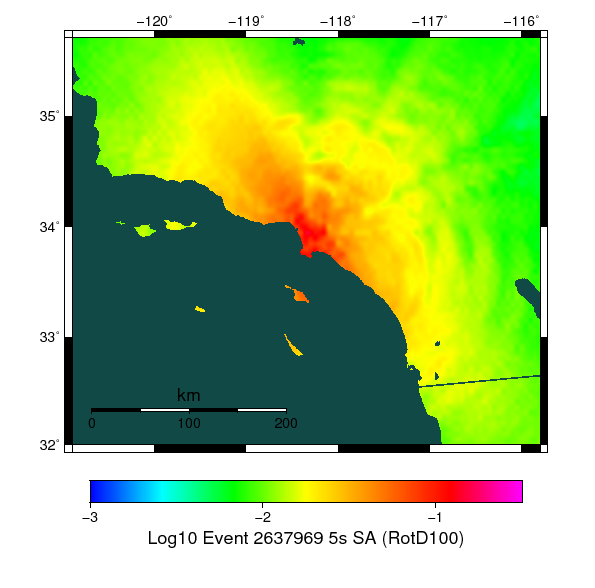

# Event 2637969, M7.77

[Catalog Details](../#bruce-2585)

## Table Of Contents
* [Fault List](#fault-list)
* [Rupture Plots](#rupture-plots)
  * [Slip/Time Plot](#sliptime-plot)
  * [Slip/Vel Animation](#slipvel-animation)
  * [Map Plot](#map-plot)
  * [Rupture Velocity Plot](#rupture-velocity-plot)
* [Spectra Plots](#spectra-plots)
  * [Site USC](#site-usc)
    * [USC Fourier Amplitude Spectra](#usc-fourier-amplitude-spectra)
    * [USC RotD50 Spectra](#usc-rotd50-spectra)
    * [USC RotD Ratio](#usc-rotd-ratio)
    * [USC Acceleration Seismograms](#usc-acceleration-seismograms)
    * [USC Velocity Seismograms](#usc-velocity-seismograms)
  * [Site SBSM](#site-sbsm)
    * [SBSM Fourier Amplitude Spectra](#sbsm-fourier-amplitude-spectra)
    * [SBSM RotD50 Spectra](#sbsm-rotd50-spectra)
    * [SBSM RotD Ratio](#sbsm-rotd-ratio)
    * [SBSM Acceleration Seismograms](#sbsm-acceleration-seismograms)
    * [SBSM Velocity Seismograms](#sbsm-velocity-seismograms)
  * [Site Los Angeles](#site-los-angeles)
    * [Los Angeles Fourier Amplitude Spectra](#los-angeles-fourier-amplitude-spectra)
    * [Los Angeles RotD50 Spectra](#los-angeles-rotd50-spectra)
    * [Los Angeles RotD Ratio](#los-angeles-rotd-ratio)
    * [Los Angeles Acceleration Seismograms](#los-angeles-acceleration-seismograms)
    * [Los Angeles Velocity Seismograms](#los-angeles-velocity-seismograms)
  * [Site Riverside](#site-riverside)
    * [Riverside Fourier Amplitude Spectra](#riverside-fourier-amplitude-spectra)
    * [Riverside RotD50 Spectra](#riverside-rotd50-spectra)
    * [Riverside RotD Ratio](#riverside-rotd-ratio)
    * [Riverside Acceleration Seismograms](#riverside-acceleration-seismograms)
    * [Riverside Velocity Seismograms](#riverside-velocity-seismograms)
  * [Site San Diego](#site-san-diego)
    * [San Diego Fourier Amplitude Spectra](#san-diego-fourier-amplitude-spectra)
    * [San Diego RotD50 Spectra](#san-diego-rotd50-spectra)
    * [San Diego RotD Ratio](#san-diego-rotd-ratio)
    * [San Diego Acceleration Seismograms](#san-diego-acceleration-seismograms)
    * [San Diego Velocity Seismograms](#san-diego-velocity-seismograms)
  * [Site Santa Barbara](#site-santa-barbara)
    * [Santa Barbara Fourier Amplitude Spectra](#santa-barbara-fourier-amplitude-spectra)
    * [Santa Barbara RotD50 Spectra](#santa-barbara-rotd50-spectra)
    * [Santa Barbara RotD Ratio](#santa-barbara-rotd-ratio)
    * [Santa Barbara Acceleration Seismograms](#santa-barbara-acceleration-seismograms)
    * [Santa Barbara Velocity Seismograms](#santa-barbara-velocity-seismograms)
* [ShakeMaps](#shakemaps)
  * [Region RotD100/RotD50 Ratio](#region-rotd100rotd50-ratio)
## Fault List
*[(top)](#table-of-contents)*

| Section Name | Area Ruptured | Patches Ruptured | Moment | Equiv. Mag | Max Slip |
|-----|-----|-----|-----|-----|-----|
| Compton | 2377.10 km^2 | 1708 | 2.89e20 N-m | M7.61 | 8.77 m |
| Palos Verdes | 871.76 km^2 | 639 | 8.36e19 N-m | M7.25 | 5.42 m |
| Newport-Inglewood alt 1 | 734.57 km^2 | 533 | 6.27e19 N-m | M7.16 | 4.84 m |
| San Pedro Escarpment | 638.22 km^2 | 459 | 5.10e19 N-m | M7.11 | 5.44 m |
| Redondo Canyon alt 1 | 192.74 km^2 | 143 | 1.39e19 N-m | M6.73 | 3.85 m |
| Anaheim | 59.15 km^2 | 43 | 2.88e18 N-m | M6.27 | 2.57 m |
| Elysian Park (Lower CFM) | 11.78 km^2 | 9 | 5.54e17 N-m | M5.80 | 3.80 m |
| Santa Susana East (connector) | 10.23 km^2 | 7 | 3.04e17 N-m | M5.62 | 1.28 m |
| Malibu Coast alt 1 | 4.35 km^2 | 3 | 1.64e17 N-m | M5.44 | 1.43 m |
| San Pedro Basin | 6.32 km^2 | 5 | 1.42e17 N-m | M5.40 | 0.85 m |
| Santa Monica Bay | 2.83 km^2 | 2 | 1.01e17 N-m | M5.30 | 1.25 m |
| Northridge | 2.16 km^2 | 2 | 9.11e16 N-m | M5.27 | 1.62 m |
| Puente Hills | 1.32 km^2 | 1 | 6.57e16 N-m | M5.18 | 1.66 m |
| Santa Monica alt 1 | 1.45 km^2 | 1 | 5.27e16 N-m | M5.11 | 1.21 m |
| Hollywood | 1.36 km^2 | 1 | 3.91e16 N-m | M5.03 | 0.96 m |
| San Vicente | 1.40 km^2 | 1 | 3.90e16 N-m | M5.03 | 0.93 m |

## Rupture Plots
*[(top)](#table-of-contents)*

**Legend**
* Colored, Filled Triangles: RSQSim Elements
* Red Star: RSQSim Hypocenter
* Dark Gray Dashed Outline: GMPE Surface

### Slip/Time Plot
*[(top)](#table-of-contents)*

### Slip/Vel Animation
*[(top)](#table-of-contents)*

[Click here to view Slip/Velocity Animation](resources/rupture_plot_2637969.gif)
### Map Plot
*[(top)](#table-of-contents)*

### Rupture Velocity Plot
*[(top)](#table-of-contents)*

## Spectra Plots
*[(top)](#table-of-contents)*

### Site USC
*[(top)](#table-of-contents)*

*Location: 34.0192, -118.286*

| Distance | Actual RSQSim Surface | GMPE Surface |
|-----|-----|-----|
| Horizontal | 0.82 km | 0.00 km |
| 3-D | 7.82 km | 7.63 km |

*NOTE: RSQSim ruptures sometimes have a few co-rupturing elements on faults some distance from the main rupture. This may cause discrepancies in the table above, consult rupture map plot.*
#### USC Fourier Amplitude Spectra
*[(top)](#table-of-contents)*

#### USC RotD50 Spectra
*[(top)](#table-of-contents)*

#### USC RotD Ratio
*[(top)](#table-of-contents)*

#### USC Acceleration Seismograms
*[(top)](#table-of-contents)*

#### USC Velocity Seismograms
*[(top)](#table-of-contents)*

### Site SBSM
*[(top)](#table-of-contents)*

*Location: 34.064987, -117.29201*

| Distance | Actual RSQSim Surface | GMPE Surface |
|-----|-----|-----|
| Horizontal | 58.03 km | 57.98 km |
| 3-D | 60.40 km | 60.04 km |

*NOTE: RSQSim ruptures sometimes have a few co-rupturing elements on faults some distance from the main rupture. This may cause discrepancies in the table above, consult rupture map plot.*
#### SBSM Fourier Amplitude Spectra
*[(top)](#table-of-contents)*

#### SBSM RotD50 Spectra
*[(top)](#table-of-contents)*

#### SBSM RotD Ratio
*[(top)](#table-of-contents)*

#### SBSM Acceleration Seismograms
*[(top)](#table-of-contents)*

#### SBSM Velocity Seismograms
*[(top)](#table-of-contents)*

### Site Los Angeles
*[(top)](#table-of-contents)*

*Location: 34.05, -118.25*

| Distance | Actual RSQSim Surface | GMPE Surface |
|-----|-----|-----|
| Horizontal | 0.85 km | 0.00 km |
| 3-D | 12.28 km | 12.03 km |

*NOTE: RSQSim ruptures sometimes have a few co-rupturing elements on faults some distance from the main rupture. This may cause discrepancies in the table above, consult rupture map plot.*
#### Los Angeles Fourier Amplitude Spectra
*[(top)](#table-of-contents)*

#### Los Angeles RotD50 Spectra
*[(top)](#table-of-contents)*

#### Los Angeles RotD Ratio
*[(top)](#table-of-contents)*

#### Los Angeles Acceleration Seismograms
*[(top)](#table-of-contents)*

#### Los Angeles Velocity Seismograms
*[(top)](#table-of-contents)*

### Site Riverside
*[(top)](#table-of-contents)*

*Location: 33.95, -117.4*

| Distance | Actual RSQSim Surface | GMPE Surface |
|-----|-----|-----|
| Horizontal | 45.44 km | 45.26 km |
| 3-D | 48.43 km | 47.87 km |

*NOTE: RSQSim ruptures sometimes have a few co-rupturing elements on faults some distance from the main rupture. This may cause discrepancies in the table above, consult rupture map plot.*
#### Riverside Fourier Amplitude Spectra
*[(top)](#table-of-contents)*

#### Riverside RotD50 Spectra
*[(top)](#table-of-contents)*

#### Riverside RotD Ratio
*[(top)](#table-of-contents)*

#### Riverside Acceleration Seismograms
*[(top)](#table-of-contents)*

#### Riverside Velocity Seismograms
*[(top)](#table-of-contents)*

### Site San Diego
*[(top)](#table-of-contents)*

*Location: 32.7, -117.15*

| Distance | Actual RSQSim Surface | GMPE Surface |
|-----|-----|-----|
| Horizontal | 132.79 km | 132.26 km |
| 3-D | 132.82 km | 132.26 km |

*NOTE: RSQSim ruptures sometimes have a few co-rupturing elements on faults some distance from the main rupture. This may cause discrepancies in the table above, consult rupture map plot.*
#### San Diego Fourier Amplitude Spectra
*[(top)](#table-of-contents)*

#### San Diego RotD50 Spectra
*[(top)](#table-of-contents)*

#### San Diego RotD Ratio
*[(top)](#table-of-contents)*

#### San Diego Acceleration Seismograms
*[(top)](#table-of-contents)*

#### San Diego Velocity Seismograms
*[(top)](#table-of-contents)*

### Site Santa Barbara
*[(top)](#table-of-contents)*

*Location: 34.45, -119.7*

| Distance | Actual RSQSim Surface | GMPE Surface |
|-----|-----|-----|
| Horizontal | 111.21 km | 110.71 km |
| 3-D | 111.52 km | 110.83 km |

*NOTE: RSQSim ruptures sometimes have a few co-rupturing elements on faults some distance from the main rupture. This may cause discrepancies in the table above, consult rupture map plot.*
#### Santa Barbara Fourier Amplitude Spectra
*[(top)](#table-of-contents)*

#### Santa Barbara RotD50 Spectra
*[(top)](#table-of-contents)*

#### Santa Barbara RotD Ratio
*[(top)](#table-of-contents)*

#### Santa Barbara Acceleration Seismograms
*[(top)](#table-of-contents)*

#### Santa Barbara Velocity Seismograms
*[(top)](#table-of-contents)*

## ShakeMaps
*[(top)](#table-of-contents)*

| SA Period | RSQSim | NGAWest_2014_NoIdr | Ratio |
|-----|-----|-----|-----|
| **1.0 s** |  |  |  |
| **2.0 s** |  |  |  |
| **3.0 s** |  |  |  |
| **4.0 s** |  |  |  |
| **5.0 s** |  |  |  |
| **7.5 s** |  |  |  |
| **10.0 s** |  |  |  |
### Region RotD100/RotD50 Ratio
*[(top)](#table-of-contents)*

| SA Period | RotD50 | RotD100 | RotD100/RotD50 Ratio |
|-----|-----|-----|-----|
| **1.0 s** |  |  |  |
| **2.0 s** |  |  |  |
| **3.0 s** |  |  |  |
| **4.0 s** |  |  |  |
| **5.0 s** |  |  |  |
| **7.5 s** |  |  |  |
| **10.0 s** |  |  |  |
