# Bruce 2585 Extreme Events

*Subsections participate in a rupture if at least 20.0 % of its area ruptures*

[Catalog Details](../#bruce-2585)

## Table Of Contents
* [Subsection Count](#subsection-count)
  * [Subsection Count Histogram](#subsection-count-histogram)
  * [Subsection Count Events](#subsection-count-events)
* [Parent Section Count](#parent-section-count)
  * [Parent Section Count Histogram](#parent-section-count-histogram)
  * [Parent Section Count Events](#parent-section-count-events)
* [Mapped Length Ratio](#mapped-length-ratio)
  * [Mapped Length Ratio Histogram](#mapped-length-ratio-histogram)
  * [Mapped Length Ratio Events](#mapped-length-ratio-events)
* [Mapped Excess Length](#mapped-excess-length)
  * [Mapped Excess Length Histogram](#mapped-excess-length-histogram)
  * [Mapped Excess Length Events](#mapped-excess-length-events)
* [Moment Off Mapped Rupture](#moment-off-mapped-rupture)
  * [Moment Off Mapped Rupture Histogram](#moment-off-mapped-rupture-histogram)
  * [Moment Off Mapped Rupture Events](#moment-off-mapped-rupture-events)
* [Magnitude](#magnitude)
  * [Magnitude Histogram](#magnitude-histogram)
  * [Magnitude Events](#magnitude-events)
* [Moment >100km from Mapped](#moment-100km-from-mapped)
  * [Moment >100km from Mapped Histogram](#moment-100km-from-mapped-histogram)
  * [Moment >100km from Mapped Events](#moment-100km-from-mapped-events)
## Subsection Count
*[(top)](#table-of-contents)*

Total count of mapped UCERF3 subsections (e.g. SAF Mojave S Subsection 3), after application of minimum subsection area filter

### Subsection Count Histogram
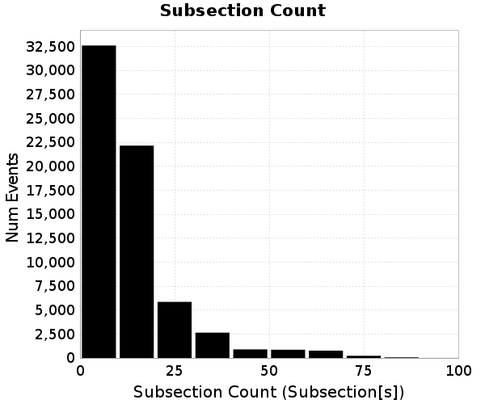
### Subsection Count Events
*[(top)](#table-of-contents)*

| Event ID | Subsection Count | Plot |
|-----|-----|-----|
| **1484996** | **94 (Subsection[s])** |  |
| **3010969** | **92 (Subsection[s])** | 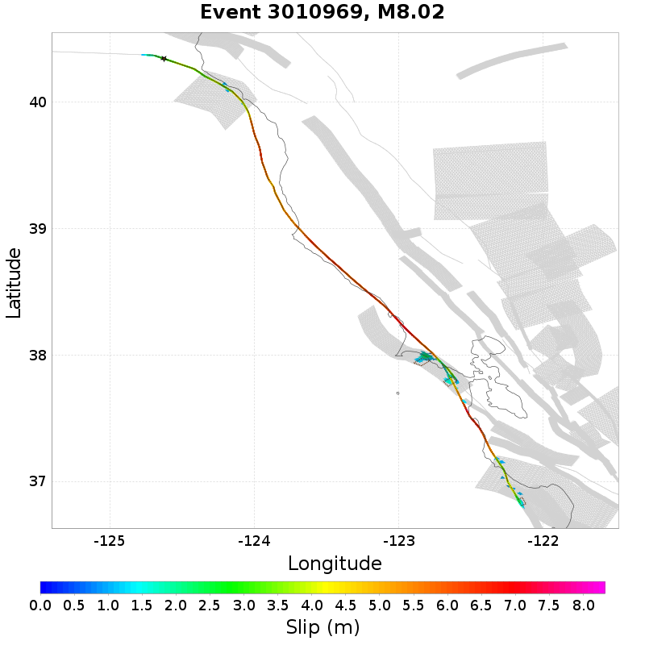 |
| **2576392** | **90 (Subsection[s])** | 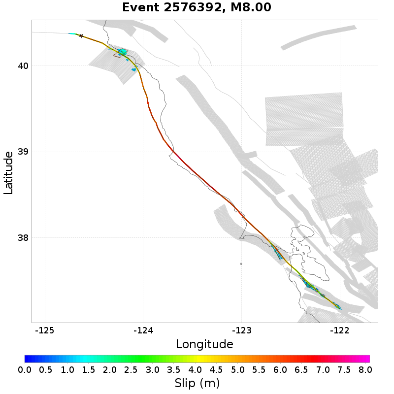 |
| **565325** | **89 (Subsection[s])** | 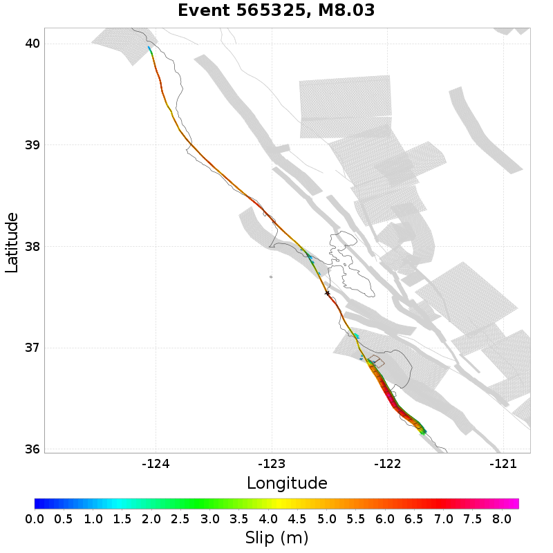 |
| **1482425** | **89 (Subsection[s])** |  |

## Parent Section Count
*[(top)](#table-of-contents)*

Total count of mapped UCERF3 subsections (e.g. SAF Mojave S), after application of minimum subsection area filter

### Parent Section Count Histogram

### Parent Section Count Events
*[(top)](#table-of-contents)*

| Event ID | Parent Section Count | Plot |
|-----|-----|-----|
| **3274601** | **13 (Section[s])** |  |
| **3885849** | **13 (Section[s])** |  |
| **1193982** | **13 (Section[s])** |  |
| **1362893** | **13 (Section[s])** |  |
| **3008347** | **13 (Section[s])** | 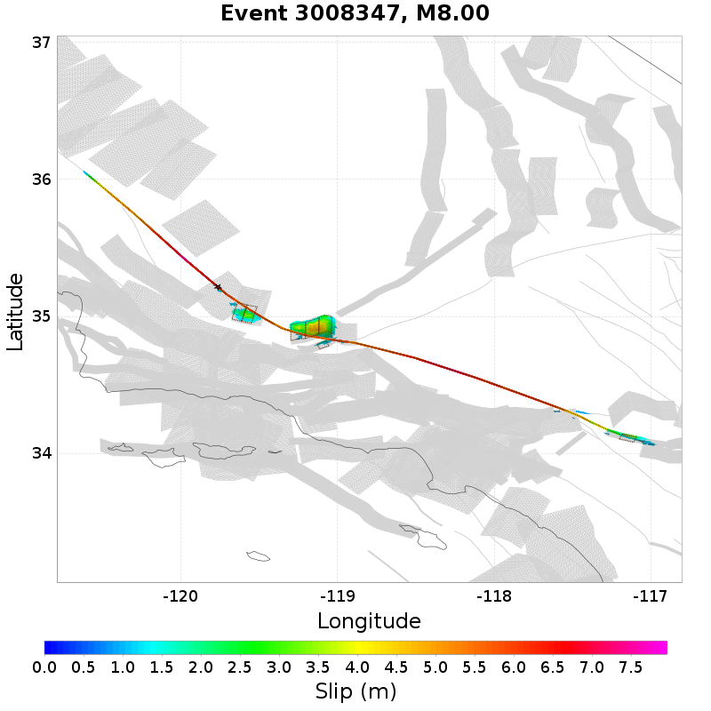 |

## Mapped Length Ratio
*[(top)](#table-of-contents)*

Ratio of the total rupture length (UCERF3 mapped subsection rupture) to the idealized length, defined as the straight line distance between the furthest 2 subsections

### Mapped Length Ratio Histogram

### Mapped Length Ratio Events
*[(top)](#table-of-contents)*

| Event ID | Mapped Length Ratio | Plot |
|-----|-----|-----|
| **561917** | **3.82** | 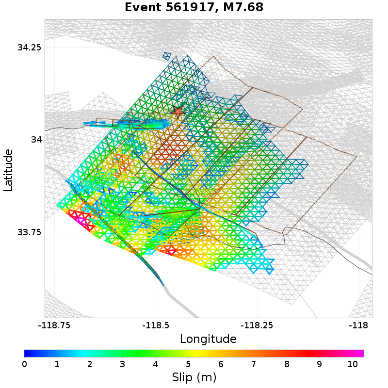 |
| **2637969** | **3.57** |  |
| **2624853** | **3.34** |  |
| **353106** | **3.34** | 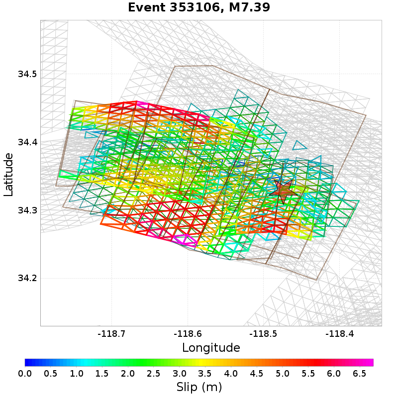 |
| **1210600** | **3.3** |  |

## Mapped Excess Length
*[(top)](#table-of-contents)*

Total rupture length (UCERF3 mapped subsection rupture) minus the idealized length, defined as the straight line distance between the furthest 2 subsections

### Mapped Excess Length Histogram

### Mapped Excess Length Events
*[(top)](#table-of-contents)*

| Event ID | Mapped Excess Length | Plot |
|-----|-----|-----|
| **3869791** | **228.38 (km)** | 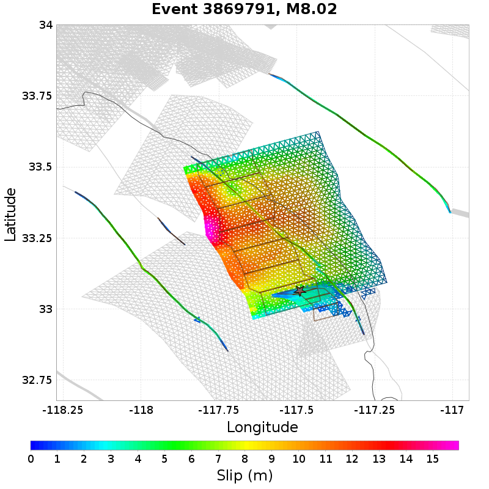 |
| **1112371** | **215.45 (km)** | 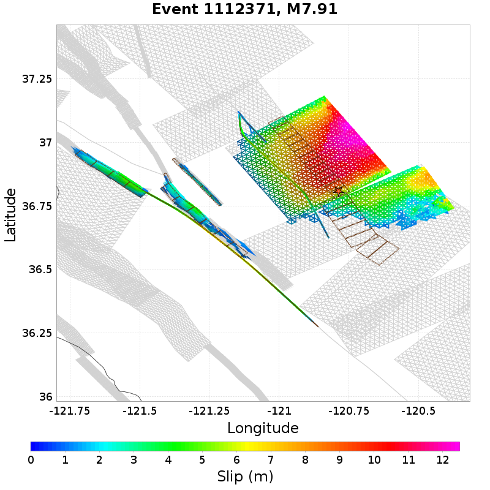 |
| **3770823** | **186.28 (km)** |  |
| **4029912** | **178.08 (km)** |  |
| **673077** | **176.52 (km)** |  |

## Moment Off Mapped Rupture
*[(top)](#table-of-contents)*

Moment of simulator elements not included in mapped UCERF3 subsection rupture

### Moment Off Mapped Rupture Histogram
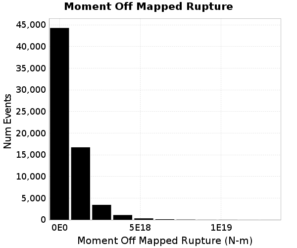
### Moment Off Mapped Rupture Events
*[(top)](#table-of-contents)*

| Event ID | Moment Off Mapped Rupture | Plot |
|-----|-----|-----|
| **4423643** | **1.3036395E19 (N-m)** | 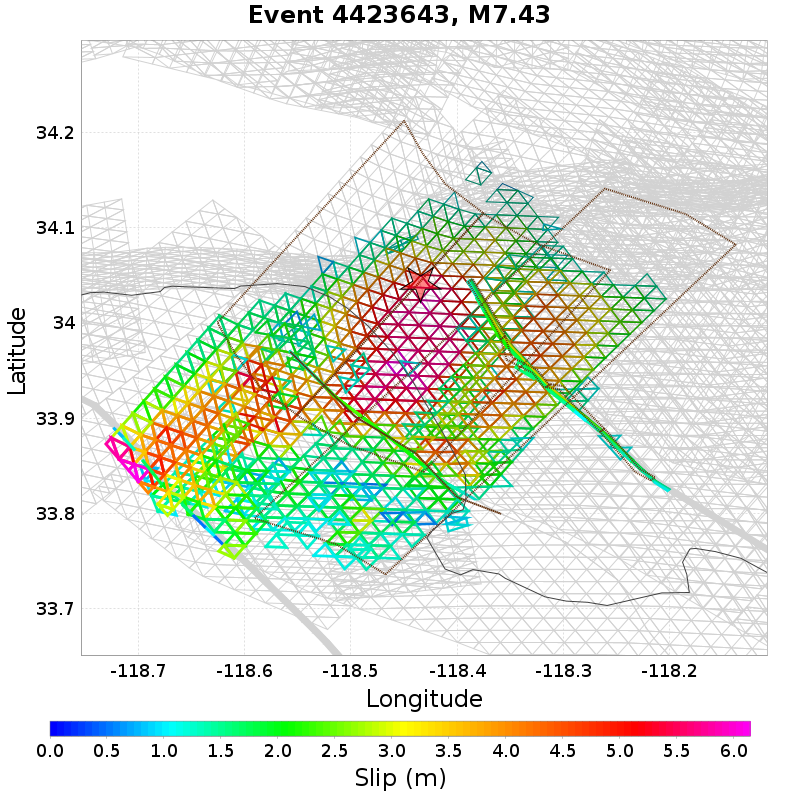 |
| **4156317** | **1.2869223E19 (N-m)** | 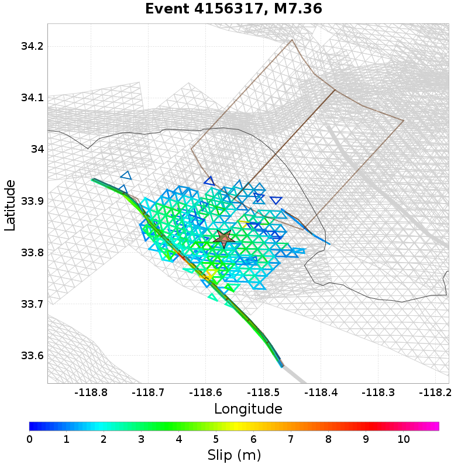 |
| **622185** | **1.2662618E19 (N-m)** |  |
| **4950120** | **1.2441654E19 (N-m)** |  |
| **3840362** | **1.222424E19 (N-m)** |  |

## Magnitude
*[(top)](#table-of-contents)*

Event Moment Magnitude

### Magnitude Histogram

### Magnitude Events
*[(top)](#table-of-contents)*

| Event ID | Magnitude | Plot |
|-----|-----|-----|
| **660372** | **8.06** | 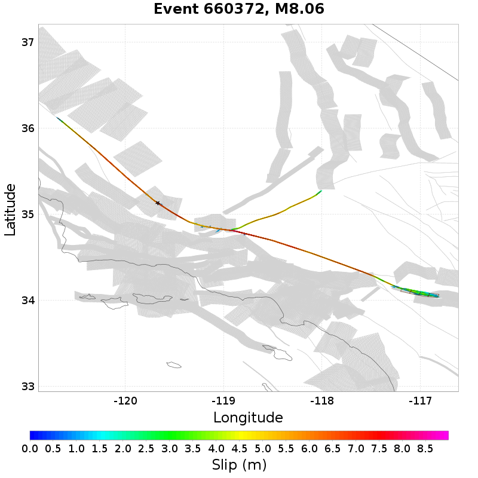 |
| **2762888** | **8.04** | 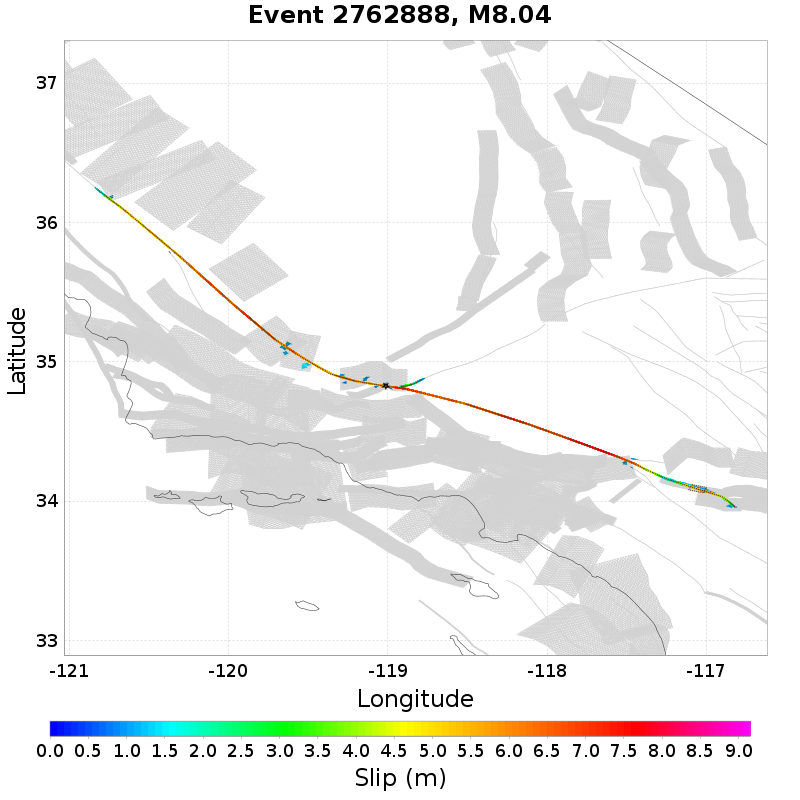 |
| **373646** | **8.04** | 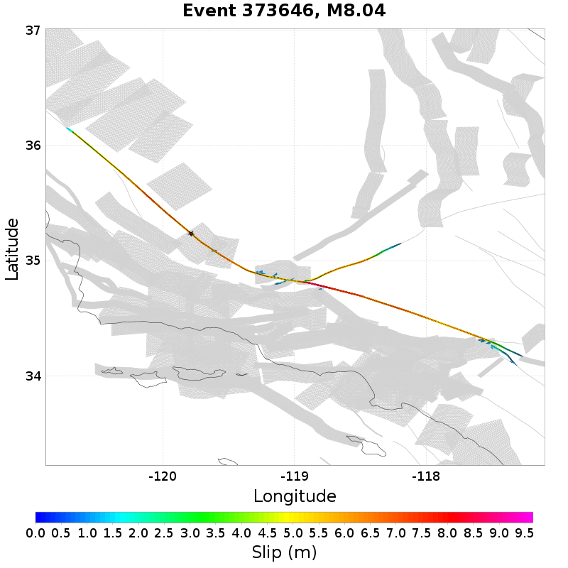 |
| **527621** | **8.04** |  |
| **4373677** | **8.03** | 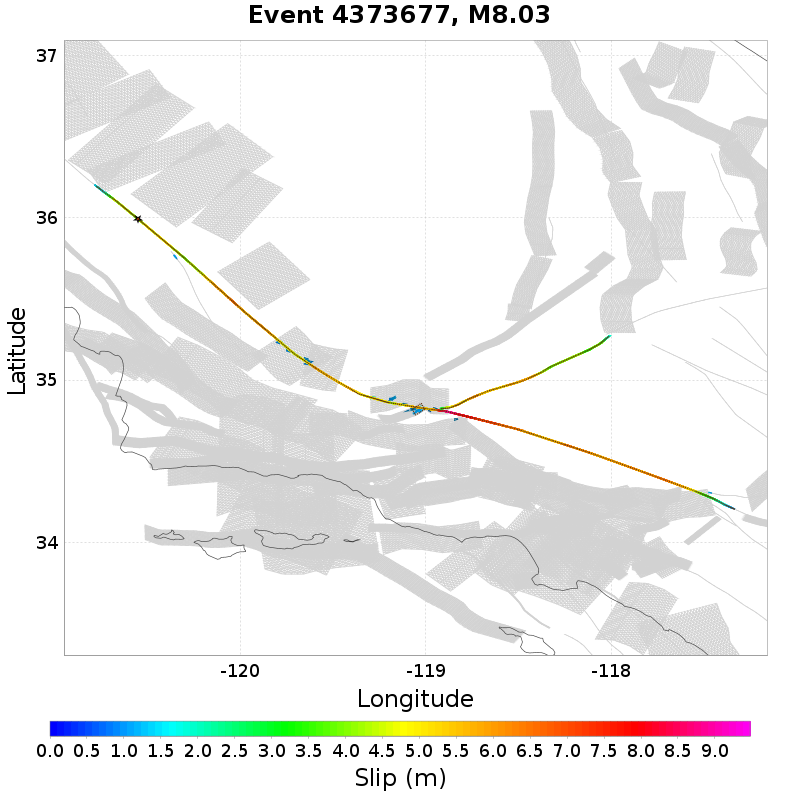 |

## Moment >100km from Mapped
*[(top)](#table-of-contents)*

Moment that is at least 100km from the nearest mapped subsection (after application of subsection area threshold)

4 events above threshold of 1 [N-m]
### Moment >100km from Mapped Histogram
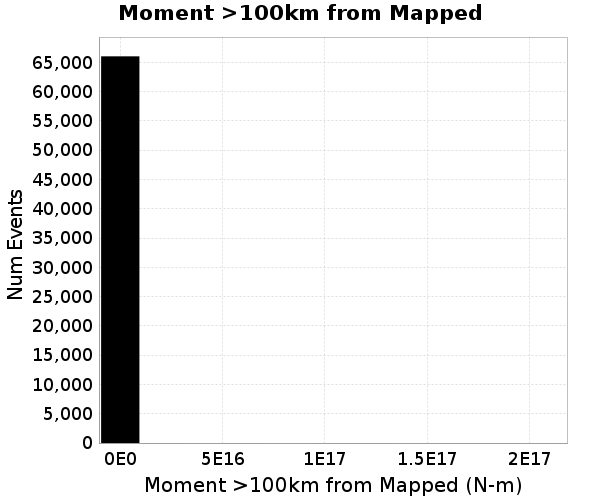
### Moment >100km from Mapped Events
*[(top)](#table-of-contents)*

| Event ID | Moment >100km from Mapped | Plot |
|-----|-----|-----|
| **2334300** | **2.07870971E17 (N-m)** |  |
| **312280** | **1.45769369E17 (N-m)** |  |
| **733288** | **8.7181523E16 (N-m)** | 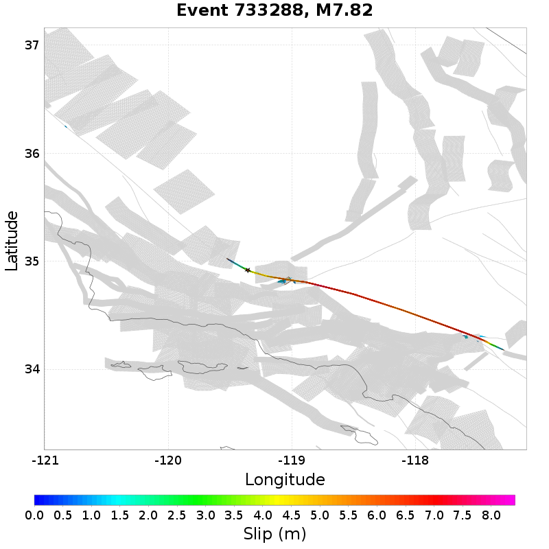 |
| **2967140** | **4.8429879E16 (N-m)** | 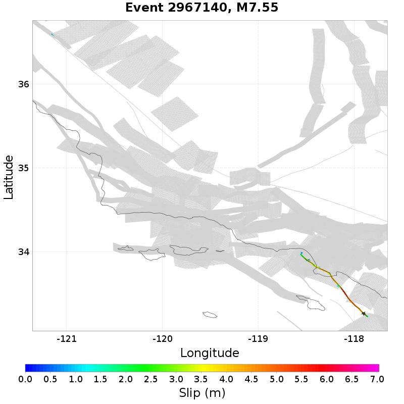 |

