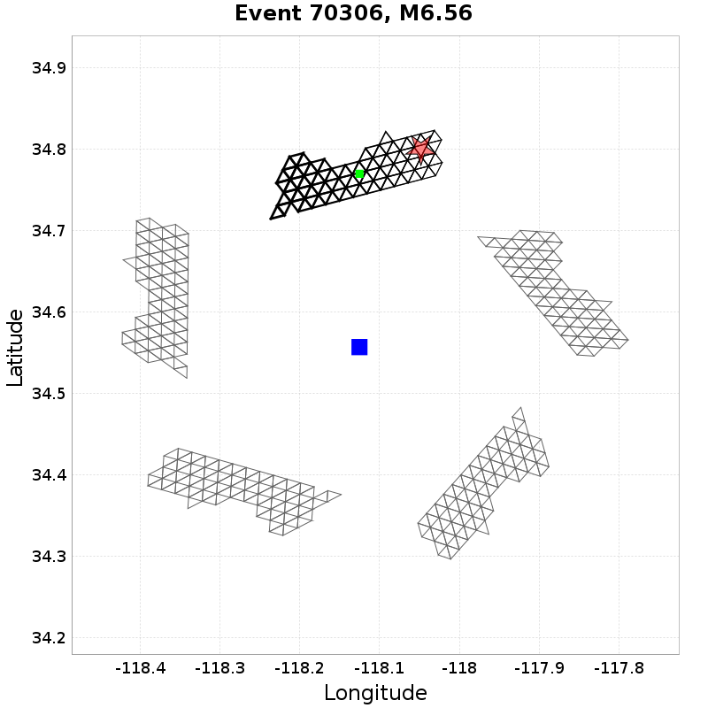

# Bruce 2585 Rotated Rupture Variability, M6.6 Reverse

This exercise uses translations and rotations to estimate ground motion variability from different sources. We begin by selecting a subset of similar ruptures which match a set of criteria (in this case, M6.6, Reverse, Dip=45, Ztor=3). Each rupture is then reoriented such that its strike (following the Aki & Richards 1980 convention) is 0 degrees (due North, dipping to the right for normal or reverse ruptures). For each site, ruptures are translated such that their centroid is directly North of the site, and their Joyner-Boore distance  (rJB) is as specified (we consider 2 distance[s] here).

We then  perform various rotations. We rotate the rupture in place around its centroid, holding the site-to-source centroid path and rJB constant (henceforth 'Rupture Strike'). We also rotate ruptures around the site, holding rJB and source orientation relative to the site constant but sampling different various paths (henceforth 'Path'). We do this for each unique combination of Rupture Strike, Path, Joyner-Boore Distance, Site, and Rupture.

*NOTE: This page uses the SCEC BBP to simulate a 1-dimensional velocity structure. Thus we expect no path variability, and plots of path variabilitiy are included only as verification of the method.*

[RSQSim Catalog Details](../#bruce-2585)

## Table Of Contents
* [Rupture Rotation Parameters](#rupture-rotation-parameters)
* [M6.6 Reverse RSQSim Rupture Match Criteria](#m66-reverse-rsqsim-rupture-match-criteria)
* [Sites](#sites)
* [Result Summary Table](#result-summary-table)
* [Path-to-path Variability](#path-to-path-variability)
  * [Path-to-path Variability Methodology](#path-to-path-variability-methodology)
  * [20.0 km Path-to-path Results](#200-km-path-to-path-results)
  * [50.0 km Path-to-path Results](#500-km-path-to-path-results)
* [Source-strike Variability](#source-strike-variability)
  * [Source-strike Variability Methodology](#source-strike-variability-methodology)
  * [20.0 km Source-strike Results](#200-km-source-strike-results)
  * [50.0 km Source-strike Results](#500-km-source-strike-results)
* [Within-event Variability](#within-event-variability)
  * [Within-event Variability Methodology](#within-event-variability-methodology)
  * [20.0 km Within-event Results](#200-km-within-event-results)
  * [50.0 km Within-event Results](#500-km-within-event-results)
* [Between-events, single-path Variability](#between-events-single-path-variability)
  * [Between-events, single-path Variability Methodology](#between-events-single-path-variability-methodology)
  * [20.0 km Between-events, single-path Results](#200-km-between-events-single-path-results)
  * [50.0 km Between-events, single-path Results](#500-km-between-events-single-path-results)
* [Between-events Variability](#between-events-variability)
  * [Between-events Variability Methodology](#between-events-variability-methodology)
  * [20.0 km Between-events Results](#200-km-between-events-results)
  * [50.0 km Between-events Results](#500-km-between-events-results)
* [Site-to-site Variability](#site-to-site-variability)
  * [Site-to-site Variability Methodology](#site-to-site-variability-methodology)
  * [20.0 km Site-to-site Results](#200-km-site-to-site-results)
  * [50.0 km Site-to-site Results](#500-km-site-to-site-results)
## Rupture Rotation Parameters

| Quantity | Variations | Description |
|-----|-----|-----|
| Rupture | 75 | Unique (but similar in faulting style and magnitude) ruptures which match the given scenario. |
| Site | 10 | Unique site locations. If 3-d, each will have unique velocity profiles. |
| Rupture Strike | 36 | Rupture strike conforming to the Aki & Richards (1980) convention, where dipping faults dip to the right of the rupture. If also rotated about a site, this azimuth is relative to the path. |
| Path | 4 | Path from the site to the centroid of the rupture, in azimuthal degrees (0 is North) |
| Joyner-Boore Distance | 20.0, 50.0 km | Shortest horizontal distance between the site and the surface projection of the rupture. |
| **Total # Simulations** | **216000** | Total number of combinations of the above. |

## M6.6 Reverse RSQSim Rupture Match Criteria
*[(top)](#table-of-contents)*

We condisder 75 events in the catalog match the following criteria:

* M=[6.55,6.65]
* Ztor=[2,4]
* Rake=[80,100]
* Dip=[40,50]

## Sites

| Name | Location | Vs30 (m/s) | Z1.0 (km) | Z2.5 (km) |
|-----|-----|-----|-----|-----|
| LAPD | *34.557, -118.125* | 863 | N/A | N/A |
| PAS | *34.148426, -118.17119* | 863 | N/A | N/A |
| SBSM | *34.064987, -117.29201* | 863 | N/A | N/A |
| SMCA | *34.00909, -118.48939* | 863 | N/A | N/A |
| STNI | *33.93088, -118.17881* | 863 | N/A | N/A |
| USC | *34.0192, -118.286* | 863 | N/A | N/A |
| WNGC | *34.041824, -118.0653* | 863 | N/A | N/A |
| s119 | *34.55314, -118.72826* | 863 | N/A | N/A |
| s279 | *34.37809, -118.34757* | 863 | N/A | N/A |
| s480 | *34.15755, -117.87389* | 863 | N/A | N/A |

## Result Summary Table

| Type | Notation | Distance | 3s Calc. Std. Dev. | 5s Calc. Std. Dev. | 7.5s Calc. Std. Dev. | 10s Calc. Std. Dev. |
|-----|-----|-----|-----|-----|-----|-----|
| Path-to-path | &phi;P2P | 20 km | 0 | 0 | 0 | 0 |
| Path-to-path | &phi;P2P | 50 km | 0 | 0 | 0 | 0 |
| Source-strike | &phi;s | 20 km | 0.35 | 0.38 | 0.39 | 0.34 |
| Source-strike | &phi;s | 50 km | 0.35 | 0.41 | 0.36 | 0.34 |
| Within-event | &phi; | 20 km | 0.35 | 0.38 | 0.39 | 0.34 |
| Within-event | &phi; | 50 km | 0.35 | 0.41 | 0.36 | 0.34 |
| Between-events, single-path | &tau;0 | 20 km | 0.41 | 0.41 | 0.41 | 0.37 |
| Between-events, single-path | &tau;0 | 50 km | 0.45 | 0.47 | 0.39 | 0.39 |
| Between-events | &tau; | 20 km | 0.46 | 0.48 | 0.49 | 0.45 |
| Between-events | &tau; | 50 km | 0.5 | 0.53 | 0.46 | 0.45 |
| Site-to-site | &phi;S2S | 20 km | 0.01 | 0.01 | 0 | 0 |
| Site-to-site | &phi;S2S | 50 km | 0.01 | 0.01 | 0 | 0 |

## Path-to-path Variability
*[(top)](#table-of-contents)*

### Path-to-path Variability Methodology
*[(top)](#table-of-contents)*

Path-to-path variability, denoted &phi;P2P in Al Atik 2010, is computed from ground motion residuals where the following quantities are held constant:

* Site *[10 unique]*
* Joyner-Boore Distance *[2 unique]*
* Rupture *[75 unique]*
* Rupture Strike *[36 unique]*

and the following quantities vary:

* Path *[4 unique]*

Here is an exmample with 5 rotations, which would be repeated for each combination of Site, Joyner-Boore Distance, Rupture, Rupture Strike

Standard deviation is computed and tabulated separately for each site and distance, then a total standard deviation is computed from all site and distances and reported in the "**ALL SITES**" row.

### 20.0 km Path-to-path Results
*[(top)](#table-of-contents)*

| Site | 3s &phi;P2P | Total | Mean | Median | Range | 5s &phi;P2P | Total | Mean | Median | Range | 7.5s &phi;P2P | Total | Mean | Median | Range | 10s &phi;P2P | Total | Mean | Median | Range |
|-----|-----|-----|-----|-----|-----|-----|-----|-----|-----|-----|-----|-----|-----|-----|-----|-----|-----|-----|-----|-----|
| LAPD |  | 0 | 0 | 0 | [0 0.02] |  | 0 | 0 | 0 | [0 0.01] |  | 0 | 0 | 0 | [0 0.01] |  | 0 | 0 | 0 | [0 0.01] |
| PAS |  | 0 | 0 | 0 | [0 0.03] |  | 0 | 0 | 0 | [0 0.01] |  | 0 | 0 | 0 | [0 0.01] |  | 0 | 0 | 0 | [0 0.01] |
| SBSM |  | 0 | 0 | 0 | [0 0.03] |  | 0 | 0 | 0 | [0 0.01] |  | 0 | 0 | 0 | [0 0.01] |  | 0 | 0 | 0 | [0 0.01] |
| SMCA |  | 0 | 0 | 0 | [0 0.02] |  | 0 | 0 | 0 | [0 0.02] |  | 0 | 0 | 0 | [0 0.01] |  | 0 | 0 | 0 | [0 0.01] |
| STNI |  | 0 | 0 | 0 | [0 0.03] |  | 0 | 0 | 0 | [0 0.01] |  | 0 | 0 | 0 | [0 0.01] |  | 0 | 0 | 0 | [0 0.01] |
| USC |  | 0 | 0 | 0 | [0 0.03] |  | 0 | 0 | 0 | [0 0.02] |  | 0 | 0 | 0 | [0 0.01] |  | 0 | 0 | 0 | [0 0.01] |
| WNGC |  | 0 | 0 | 0 | [0 0.02] |  | 0 | 0 | 0 | [0 0.01] |  | 0 | 0 | 0 | [0 0.01] |  | 0 | 0 | 0 | [0 0.01] |
| s119 |  | 0 | 0 | 0 | [0 0.04] |  | 0 | 0 | 0 | [0 0.01] |  | 0 | 0 | 0 | [0 0.02] |  | 0 | 0 | 0 | [0 0.01] |
| s279 |  | 0 | 0 | 0 | [0 0.03] |  | 0 | 0 | 0 | [0 0.01] |  | 0 | 0 | 0 | [0 0.01] |  | 0 | 0 | 0 | [0 0.01] |
| s480 |  | 0 | 0 | 0 | [0 0.02] |  | 0 | 0 | 0 | [0 0.01] |  | 0 | 0 | 0 | [0 0.01] |  | 0 | 0 | 0 | [0 0.01] |
| **ALL SITES** |  | **0** | **0** | **0** | **[0 0.04]** |  | **0** | **0** | **0** | **[0 0.02]** |  | **0** | **0** | **0** | **[0 0.02]** |  | **0** | **0** | **0** | **[0 0.01]** |

| 3s | 5s |
|-----|-----|
|  |  |
| 7.5s | 10s |
|  |  |

### 50.0 km Path-to-path Results
*[(top)](#table-of-contents)*

| Site | 3s &phi;P2P | Total | Mean | Median | Range | 5s &phi;P2P | Total | Mean | Median | Range | 7.5s &phi;P2P | Total | Mean | Median | Range | 10s &phi;P2P | Total | Mean | Median | Range |
|-----|-----|-----|-----|-----|-----|-----|-----|-----|-----|-----|-----|-----|-----|-----|-----|-----|-----|-----|-----|-----|
| LAPD |  | 0 | 0 | 0 | [0 0.05] |  | 0 | 0 | 0 | [0 0.02] |  | 0 | 0 | 0 | [0 0.01] |  | 0 | 0 | 0 | [0 0.01] |
| PAS |  | 0 | 0 | 0 | [0 0.07] |  | 0 | 0 | 0 | [0 0.03] |  | 0 | 0 | 0 | [0 0.02] |  | 0 | 0 | 0 | [0 0.02] |
| SBSM |  | 0 | 0 | 0 | [0 0.07] |  | 0 | 0 | 0 | [0 0.03] |  | 0 | 0 | 0 | [0 0.01] |  | 0 | 0 | 0 | [0 0.01] |
| SMCA |  | 0 | 0 | 0 | [0 0.06] |  | 0 | 0 | 0 | [0 0.03] |  | 0 | 0 | 0 | [0 0.02] |  | 0 | 0 | 0 | [0 0.01] |
| STNI |  | 0 | 0 | 0 | [0 0.05] |  | 0 | 0 | 0 | [0 0.03] |  | 0 | 0 | 0 | [0 0.02] |  | 0 | 0 | 0 | [0 0.02] |
| USC |  | 0 | 0 | 0 | [0 0.05] |  | 0 | 0 | 0 | [0 0.03] |  | 0 | 0 | 0 | [0 0.02] |  | 0 | 0 | 0 | [0 0.02] |
| WNGC |  | 0 | 0 | 0 | [0 0.04] |  | 0 | 0 | 0 | [0 0.03] |  | 0 | 0 | 0 | [0 0.02] |  | 0 | 0 | 0 | [0 0.01] |
| s119 |  | 0 | 0 | 0 | [0 0.06] |  | 0 | 0 | 0 | [0 0.03] |  | 0 | 0 | 0 | [0 0.02] |  | 0 | 0 | 0 | [0 0.02] |
| s279 |  | 0 | 0 | 0 | [0 0.07] |  | 0 | 0 | 0 | [0 0.03] |  | 0 | 0 | 0 | [0 0.02] |  | 0 | 0 | 0 | [0 0.02] |
| s480 |  | 0 | 0 | 0 | [0 0.06] |  | 0 | 0 | 0 | [0 0.03] |  | 0 | 0 | 0 | [0 0.02] |  | 0 | 0 | 0 | [0 0.02] |
| **ALL SITES** |  | **0** | **0** | **0** | **[0 0.07]** |  | **0** | **0** | **0** | **[0 0.03]** |  | **0** | **0** | **0** | **[0 0.02]** |  | **0** | **0** | **0** | **[0 0.02]** |

| 3s | 5s |
|-----|-----|
|  |  |
| 7.5s | 10s |
|  |  |

## Source-strike Variability
*[(top)](#table-of-contents)*

### Source-strike Variability Methodology
*[(top)](#table-of-contents)*

Source-strike variability, denoted &phi;s, is computed from ground motion residuals where the following quantities are held constant:

* Site *[10 unique]*
* Joyner-Boore Distance *[2 unique]*
* Rupture *[75 unique]*
* Path *[4 unique]*

and the following quantities vary:

* Rupture Strike *[36 unique]*

Here is an exmample with 5 rotations, which would be repeated for each combination of Site, Joyner-Boore Distance, Rupture, Path

Standard deviation is computed and tabulated separately for each site and distance, then a total standard deviation is computed from all site and distances and reported in the "**ALL SITES**" row.

### 20.0 km Source-strike Results
*[(top)](#table-of-contents)*

| Site | 3s &phi;s | Total | Mean | Median | Range | 5s &phi;s | Total | Mean | Median | Range | 7.5s &phi;s | Total | Mean | Median | Range | 10s &phi;s | Total | Mean | Median | Range |
|-----|-----|-----|-----|-----|-----|-----|-----|-----|-----|-----|-----|-----|-----|-----|-----|-----|-----|-----|-----|-----|
| LAPD |  | 0.35 | 0.35 | 0.35 | [0.16 0.58] |  | 0.38 | 0.37 | 0.36 | [0.18 0.68] |  | 0.39 | 0.38 | 0.36 | [0.2 0.62] |  | 0.34 | 0.34 | 0.33 | [0.2 0.54] |
| PAS |  | 0.35 | 0.35 | 0.35 | [0.16 0.58] |  | 0.38 | 0.37 | 0.36 | [0.18 0.68] |  | 0.39 | 0.38 | 0.36 | [0.2 0.62] |  | 0.34 | 0.34 | 0.33 | [0.2 0.54] |
| SBSM |  | 0.35 | 0.35 | 0.36 | [0.16 0.58] |  | 0.38 | 0.37 | 0.36 | [0.18 0.68] |  | 0.39 | 0.38 | 0.36 | [0.21 0.62] |  | 0.34 | 0.34 | 0.33 | [0.2 0.54] |
| SMCA |  | 0.35 | 0.35 | 0.36 | [0.16 0.58] |  | 0.38 | 0.37 | 0.36 | [0.18 0.68] |  | 0.39 | 0.38 | 0.36 | [0.2 0.62] |  | 0.34 | 0.34 | 0.33 | [0.2 0.54] |
| STNI |  | 0.35 | 0.35 | 0.36 | [0.16 0.58] |  | 0.38 | 0.37 | 0.36 | [0.18 0.68] |  | 0.39 | 0.38 | 0.36 | [0.2 0.62] |  | 0.34 | 0.34 | 0.33 | [0.2 0.54] |
| USC |  | 0.35 | 0.35 | 0.35 | [0.16 0.58] |  | 0.38 | 0.37 | 0.36 | [0.18 0.68] |  | 0.39 | 0.38 | 0.36 | [0.2 0.62] |  | 0.34 | 0.34 | 0.33 | [0.2 0.54] |
| WNGC |  | 0.35 | 0.35 | 0.36 | [0.16 0.58] |  | 0.38 | 0.37 | 0.36 | [0.18 0.68] |  | 0.39 | 0.38 | 0.36 | [0.2 0.62] |  | 0.34 | 0.34 | 0.33 | [0.2 0.54] |
| s119 |  | 0.35 | 0.35 | 0.35 | [0.17 0.58] |  | 0.38 | 0.37 | 0.36 | [0.18 0.68] |  | 0.39 | 0.38 | 0.36 | [0.2 0.62] |  | 0.34 | 0.34 | 0.33 | [0.2 0.54] |
| s279 |  | 0.35 | 0.35 | 0.35 | [0.16 0.58] |  | 0.38 | 0.37 | 0.37 | [0.18 0.68] |  | 0.39 | 0.38 | 0.36 | [0.2 0.62] |  | 0.34 | 0.34 | 0.33 | [0.2 0.54] |
| s480 |  | 0.35 | 0.35 | 0.36 | [0.16 0.58] |  | 0.38 | 0.37 | 0.36 | [0.18 0.68] |  | 0.39 | 0.38 | 0.36 | [0.2 0.62] |  | 0.34 | 0.34 | 0.33 | [0.2 0.54] |
| **ALL SITES** |  | **0.35** | **0.35** | **0.36** | **[0.16 0.58]** |  | **0.38** | **0.37** | **0.36** | **[0.18 0.68]** |  | **0.39** | **0.38** | **0.36** | **[0.2 0.62]** |  | **0.34** | **0.34** | **0.33** | **[0.2 0.54]** |

| 3s | 5s |
|-----|-----|
|  |  |
| 7.5s | 10s |
|  |  |

### 50.0 km Source-strike Results
*[(top)](#table-of-contents)*

| Site | 3s &phi;s | Total | Mean | Median | Range | 5s &phi;s | Total | Mean | Median | Range | 7.5s &phi;s | Total | Mean | Median | Range | 10s &phi;s | Total | Mean | Median | Range |
|-----|-----|-----|-----|-----|-----|-----|-----|-----|-----|-----|-----|-----|-----|-----|-----|-----|-----|-----|-----|-----|
| LAPD |  | 0.35 | 0.35 | 0.34 | [0.16 0.53] |  | 0.41 | 0.4 | 0.38 | [0.15 0.7] |  | 0.36 | 0.36 | 0.34 | [0.15 0.64] |  | 0.34 | 0.34 | 0.32 | [0.2 0.55] |
| PAS |  | 0.35 | 0.35 | 0.35 | [0.16 0.53] |  | 0.41 | 0.4 | 0.38 | [0.15 0.7] |  | 0.36 | 0.36 | 0.34 | [0.15 0.64] |  | 0.34 | 0.34 | 0.32 | [0.2 0.55] |
| SBSM |  | 0.35 | 0.35 | 0.35 | [0.16 0.53] |  | 0.41 | 0.4 | 0.38 | [0.15 0.7] |  | 0.36 | 0.36 | 0.34 | [0.15 0.64] |  | 0.34 | 0.34 | 0.32 | [0.2 0.55] |
| SMCA |  | 0.35 | 0.35 | 0.35 | [0.16 0.53] |  | 0.41 | 0.4 | 0.38 | [0.15 0.7] |  | 0.36 | 0.36 | 0.34 | [0.15 0.64] |  | 0.34 | 0.34 | 0.32 | [0.2 0.55] |
| STNI |  | 0.35 | 0.35 | 0.35 | [0.16 0.53] |  | 0.41 | 0.4 | 0.38 | [0.15 0.7] |  | 0.36 | 0.36 | 0.34 | [0.15 0.64] |  | 0.34 | 0.34 | 0.32 | [0.2 0.55] |
| USC |  | 0.35 | 0.35 | 0.35 | [0.16 0.53] |  | 0.41 | 0.4 | 0.38 | [0.15 0.69] |  | 0.36 | 0.36 | 0.34 | [0.15 0.64] |  | 0.34 | 0.34 | 0.32 | [0.2 0.55] |
| WNGC |  | 0.35 | 0.35 | 0.34 | [0.16 0.53] |  | 0.41 | 0.4 | 0.38 | [0.15 0.7] |  | 0.36 | 0.36 | 0.34 | [0.15 0.64] |  | 0.34 | 0.34 | 0.32 | [0.2 0.55] |
| s119 |  | 0.35 | 0.35 | 0.34 | [0.16 0.53] |  | 0.41 | 0.4 | 0.38 | [0.15 0.7] |  | 0.36 | 0.36 | 0.34 | [0.15 0.64] |  | 0.34 | 0.34 | 0.32 | [0.2 0.55] |
| s279 |  | 0.35 | 0.35 | 0.35 | [0.16 0.53] |  | 0.41 | 0.4 | 0.38 | [0.15 0.69] |  | 0.36 | 0.36 | 0.34 | [0.15 0.64] |  | 0.34 | 0.34 | 0.32 | [0.2 0.55] |
| s480 |  | 0.36 | 0.35 | 0.35 | [0.16 0.53] |  | 0.41 | 0.4 | 0.38 | [0.15 0.7] |  | 0.36 | 0.36 | 0.34 | [0.15 0.64] |  | 0.34 | 0.34 | 0.32 | [0.2 0.55] |
| **ALL SITES** |  | **0.35** | **0.35** | **0.35** | **[0.16 0.53]** |  | **0.41** | **0.4** | **0.38** | **[0.15 0.7]** |  | **0.36** | **0.36** | **0.34** | **[0.15 0.64]** |  | **0.34** | **0.34** | **0.32** | **[0.2 0.55]** |

| 3s | 5s |
|-----|-----|
|  |  |
| 7.5s | 10s |
|  |  |

## Within-event Variability
*[(top)](#table-of-contents)*

### Within-event Variability Methodology
*[(top)](#table-of-contents)*

Within-event variability, denoted &phi; in Al Atik 2010, is computed from ground motion residuals where the following quantities are held constant:

* Site *[10 unique]*
* Joyner-Boore Distance *[2 unique]*
* Rupture *[75 unique]*

and the following quantities vary:

* Rupture Strike *[36 unique]*
* Path *[4 unique]*

Here is an exmample with 5 rotations, which would be repeated for each combination of Site, Joyner-Boore Distance, Rupture

Standard deviation is computed and tabulated separately for each site and distance, then a total standard deviation is computed from all site and distances and reported in the "**ALL SITES**" row.

### 20.0 km Within-event Results
*[(top)](#table-of-contents)*

| Site | 3s &phi; | Total | Mean | Median | Range | 5s &phi; | Total | Mean | Median | Range | 7.5s &phi; | Total | Mean | Median | Range | 10s &phi; | Total | Mean | Median | Range |
|-----|-----|-----|-----|-----|-----|-----|-----|-----|-----|-----|-----|-----|-----|-----|-----|-----|-----|-----|-----|-----|
| LAPD |  | 0.35 | 0.35 | 0.35 | [0.16 0.57] |  | 0.38 | 0.36 | 0.36 | [0.17 0.67] |  | 0.39 | 0.37 | 0.35 | [0.2 0.61] |  | 0.34 | 0.34 | 0.33 | [0.2 0.53] |
| PAS |  | 0.35 | 0.35 | 0.35 | [0.16 0.58] |  | 0.38 | 0.36 | 0.36 | [0.18 0.67] |  | 0.39 | 0.37 | 0.36 | [0.2 0.61] |  | 0.34 | 0.34 | 0.33 | [0.2 0.53] |
| SBSM |  | 0.35 | 0.35 | 0.35 | [0.16 0.57] |  | 0.38 | 0.36 | 0.36 | [0.18 0.67] |  | 0.39 | 0.37 | 0.35 | [0.2 0.61] |  | 0.34 | 0.34 | 0.33 | [0.2 0.53] |
| SMCA |  | 0.35 | 0.35 | 0.35 | [0.16 0.58] |  | 0.38 | 0.37 | 0.36 | [0.18 0.67] |  | 0.39 | 0.37 | 0.36 | [0.2 0.61] |  | 0.34 | 0.34 | 0.33 | [0.2 0.53] |
| STNI |  | 0.35 | 0.35 | 0.35 | [0.16 0.58] |  | 0.38 | 0.36 | 0.36 | [0.18 0.67] |  | 0.39 | 0.37 | 0.36 | [0.2 0.61] |  | 0.34 | 0.34 | 0.33 | [0.2 0.53] |
| USC |  | 0.35 | 0.35 | 0.35 | [0.16 0.58] |  | 0.38 | 0.37 | 0.36 | [0.18 0.67] |  | 0.39 | 0.37 | 0.36 | [0.2 0.61] |  | 0.34 | 0.34 | 0.33 | [0.2 0.53] |
| WNGC |  | 0.35 | 0.35 | 0.35 | [0.16 0.57] |  | 0.38 | 0.36 | 0.36 | [0.18 0.67] |  | 0.39 | 0.37 | 0.36 | [0.2 0.61] |  | 0.34 | 0.34 | 0.33 | [0.2 0.53] |
| s119 |  | 0.35 | 0.35 | 0.35 | [0.16 0.58] |  | 0.38 | 0.36 | 0.36 | [0.17 0.67] |  | 0.39 | 0.37 | 0.36 | [0.2 0.61] |  | 0.34 | 0.34 | 0.33 | [0.2 0.53] |
| s279 |  | 0.35 | 0.35 | 0.35 | [0.16 0.57] |  | 0.38 | 0.36 | 0.36 | [0.17 0.67] |  | 0.39 | 0.37 | 0.36 | [0.2 0.61] |  | 0.34 | 0.34 | 0.33 | [0.2 0.53] |
| s480 |  | 0.35 | 0.35 | 0.35 | [0.16 0.57] |  | 0.38 | 0.36 | 0.36 | [0.18 0.67] |  | 0.39 | 0.37 | 0.35 | [0.2 0.61] |  | 0.34 | 0.34 | 0.33 | [0.2 0.53] |
| **ALL SITES** |  | **0.35** | **0.35** | **0.35** | **[0.16 0.58]** |  | **0.38** | **0.36** | **0.36** | **[0.17 0.67]** |  | **0.39** | **0.37** | **0.36** | **[0.2 0.61]** |  | **0.34** | **0.34** | **0.33** | **[0.2 0.53]** |

| 3s | 5s |
|-----|-----|
|  |  |
| 7.5s | 10s |
|  |  |

### 50.0 km Within-event Results
*[(top)](#table-of-contents)*

| Site | 3s &phi; | Total | Mean | Median | Range | 5s &phi; | Total | Mean | Median | Range | 7.5s &phi; | Total | Mean | Median | Range | 10s &phi; | Total | Mean | Median | Range |
|-----|-----|-----|-----|-----|-----|-----|-----|-----|-----|-----|-----|-----|-----|-----|-----|-----|-----|-----|-----|-----|
| LAPD |  | 0.35 | 0.35 | 0.34 | [0.15 0.53] |  | 0.41 | 0.39 | 0.38 | [0.15 0.69] |  | 0.36 | 0.35 | 0.34 | [0.15 0.63] |  | 0.34 | 0.33 | 0.32 | [0.2 0.54] |
| PAS |  | 0.35 | 0.35 | 0.34 | [0.16 0.53] |  | 0.41 | 0.39 | 0.38 | [0.15 0.69] |  | 0.36 | 0.35 | 0.34 | [0.15 0.63] |  | 0.34 | 0.33 | 0.32 | [0.2 0.54] |
| SBSM |  | 0.35 | 0.35 | 0.34 | [0.16 0.52] |  | 0.41 | 0.39 | 0.38 | [0.15 0.69] |  | 0.36 | 0.35 | 0.34 | [0.15 0.63] |  | 0.34 | 0.33 | 0.32 | [0.2 0.54] |
| SMCA |  | 0.35 | 0.35 | 0.34 | [0.16 0.52] |  | 0.41 | 0.39 | 0.38 | [0.15 0.69] |  | 0.36 | 0.35 | 0.34 | [0.15 0.63] |  | 0.34 | 0.33 | 0.32 | [0.2 0.54] |
| STNI |  | 0.35 | 0.35 | 0.34 | [0.16 0.53] |  | 0.41 | 0.39 | 0.38 | [0.15 0.69] |  | 0.36 | 0.35 | 0.34 | [0.15 0.63] |  | 0.34 | 0.33 | 0.32 | [0.2 0.54] |
| USC |  | 0.35 | 0.35 | 0.34 | [0.16 0.52] |  | 0.41 | 0.39 | 0.38 | [0.15 0.69] |  | 0.36 | 0.35 | 0.34 | [0.15 0.63] |  | 0.34 | 0.33 | 0.32 | [0.2 0.54] |
| WNGC |  | 0.35 | 0.35 | 0.34 | [0.16 0.53] |  | 0.41 | 0.39 | 0.38 | [0.15 0.69] |  | 0.36 | 0.35 | 0.34 | [0.15 0.63] |  | 0.34 | 0.33 | 0.32 | [0.2 0.54] |
| s119 |  | 0.35 | 0.35 | 0.34 | [0.16 0.52] |  | 0.41 | 0.39 | 0.38 | [0.15 0.69] |  | 0.36 | 0.35 | 0.34 | [0.15 0.63] |  | 0.34 | 0.33 | 0.32 | [0.2 0.54] |
| s279 |  | 0.35 | 0.35 | 0.34 | [0.16 0.53] |  | 0.41 | 0.39 | 0.38 | [0.15 0.69] |  | 0.36 | 0.35 | 0.34 | [0.15 0.63] |  | 0.34 | 0.33 | 0.32 | [0.2 0.54] |
| s480 |  | 0.36 | 0.35 | 0.34 | [0.15 0.53] |  | 0.41 | 0.39 | 0.38 | [0.15 0.69] |  | 0.36 | 0.35 | 0.34 | [0.15 0.63] |  | 0.34 | 0.33 | 0.32 | [0.2 0.54] |
| **ALL SITES** |  | **0.35** | **0.35** | **0.34** | **[0.15 0.53]** |  | **0.41** | **0.39** | **0.38** | **[0.15 0.69]** |  | **0.36** | **0.35** | **0.34** | **[0.15 0.63]** |  | **0.34** | **0.33** | **0.32** | **[0.2 0.54]** |

| 3s | 5s |
|-----|-----|
|  |  |
| 7.5s | 10s |
|  |  |

## Between-events, single-path Variability
*[(top)](#table-of-contents)*

### Between-events, single-path Variability Methodology
*[(top)](#table-of-contents)*

Between-events, single-path variability, denoted &tau;0 in Al Atik 2010, is computed from ground motion residuals where the following quantities are held constant:

* Site *[10 unique]*
* Joyner-Boore Distance *[2 unique]*
* Rupture Strike *[36 unique]*
* Path *[4 unique]*

and the following quantities vary:

* Rupture *[75 unique]*

Standard deviation is computed and tabulated separately for each site and distance, then a total standard deviation is computed from all site and distances and reported in the "**ALL SITES**" row.

### 20.0 km Between-events, single-path Results
*[(top)](#table-of-contents)*

| Site | 3s &tau;0 | Total | Mean | Median | Range | 5s &tau;0 | Total | Mean | Median | Range | 7.5s &tau;0 | Total | Mean | Median | Range | 10s &tau;0 | Total | Mean | Median | Range |
|-----|-----|-----|-----|-----|-----|-----|-----|-----|-----|-----|-----|-----|-----|-----|-----|-----|-----|-----|-----|-----|
| LAPD |  | 0.41 | 0.41 | 0.42 | [0.34 0.48] |  | 0.41 | 0.42 | 0.41 | [0.33 0.48] |  | 0.41 | 0.41 | 0.41 | [0.36 0.45] |  | 0.37 | 0.37 | 0.37 | [0.34 0.41] |
| PAS |  | 0.41 | 0.41 | 0.42 | [0.34 0.48] |  | 0.41 | 0.42 | 0.41 | [0.33 0.48] |  | 0.41 | 0.41 | 0.41 | [0.36 0.45] |  | 0.37 | 0.37 | 0.37 | [0.34 0.41] |
| SBSM |  | 0.41 | 0.41 | 0.42 | [0.34 0.49] |  | 0.41 | 0.42 | 0.41 | [0.33 0.48] |  | 0.41 | 0.41 | 0.41 | [0.36 0.45] |  | 0.37 | 0.37 | 0.37 | [0.34 0.41] |
| SMCA |  | 0.41 | 0.41 | 0.42 | [0.34 0.48] |  | 0.41 | 0.42 | 0.41 | [0.33 0.48] |  | 0.41 | 0.41 | 0.41 | [0.36 0.45] |  | 0.37 | 0.37 | 0.37 | [0.34 0.41] |
| STNI |  | 0.41 | 0.41 | 0.42 | [0.34 0.48] |  | 0.41 | 0.42 | 0.41 | [0.33 0.48] |  | 0.41 | 0.41 | 0.41 | [0.36 0.45] |  | 0.37 | 0.37 | 0.37 | [0.34 0.41] |
| USC |  | 0.41 | 0.41 | 0.42 | [0.34 0.48] |  | 0.41 | 0.42 | 0.41 | [0.33 0.48] |  | 0.41 | 0.41 | 0.41 | [0.36 0.45] |  | 0.37 | 0.37 | 0.37 | [0.34 0.41] |
| WNGC |  | 0.41 | 0.41 | 0.42 | [0.34 0.48] |  | 0.41 | 0.42 | 0.41 | [0.33 0.48] |  | 0.41 | 0.41 | 0.41 | [0.36 0.45] |  | 0.37 | 0.37 | 0.37 | [0.34 0.41] |
| s119 |  | 0.41 | 0.41 | 0.42 | [0.34 0.48] |  | 0.41 | 0.42 | 0.41 | [0.33 0.48] |  | 0.41 | 0.41 | 0.41 | [0.36 0.45] |  | 0.37 | 0.37 | 0.37 | [0.34 0.41] |
| s279 |  | 0.41 | 0.41 | 0.42 | [0.34 0.48] |  | 0.41 | 0.42 | 0.41 | [0.33 0.48] |  | 0.41 | 0.41 | 0.41 | [0.36 0.45] |  | 0.37 | 0.37 | 0.37 | [0.34 0.41] |
| s480 |  | 0.41 | 0.41 | 0.42 | [0.34 0.48] |  | 0.41 | 0.42 | 0.41 | [0.33 0.48] |  | 0.41 | 0.41 | 0.41 | [0.36 0.45] |  | 0.37 | 0.37 | 0.37 | [0.34 0.41] |
| **ALL SITES** |  | **0.41** | **0.41** | **0.42** | **[0.34 0.49]** |  | **0.41** | **0.42** | **0.41** | **[0.33 0.48]** |  | **0.41** | **0.41** | **0.41** | **[0.36 0.45]** |  | **0.37** | **0.37** | **0.37** | **[0.34 0.41]** |

| 3s | 5s |
|-----|-----|
|  |  |
| 7.5s | 10s |
|  |  |

### 50.0 km Between-events, single-path Results
*[(top)](#table-of-contents)*

| Site | 3s &tau;0 | Total | Mean | Median | Range | 5s &tau;0 | Total | Mean | Median | Range | 7.5s &tau;0 | Total | Mean | Median | Range | 10s &tau;0 | Total | Mean | Median | Range |
|-----|-----|-----|-----|-----|-----|-----|-----|-----|-----|-----|-----|-----|-----|-----|-----|-----|-----|-----|-----|-----|
| LAPD |  | 0.45 | 0.45 | 0.45 | [0.37 0.53] |  | 0.47 | 0.47 | 0.47 | [0.4 0.52] |  | 0.39 | 0.39 | 0.4 | [0.31 0.45] |  | 0.39 | 0.39 | 0.39 | [0.34 0.44] |
| PAS |  | 0.45 | 0.45 | 0.45 | [0.37 0.53] |  | 0.47 | 0.47 | 0.47 | [0.4 0.52] |  | 0.39 | 0.39 | 0.4 | [0.31 0.45] |  | 0.39 | 0.39 | 0.39 | [0.34 0.44] |
| SBSM |  | 0.45 | 0.45 | 0.45 | [0.37 0.53] |  | 0.47 | 0.47 | 0.47 | [0.4 0.52] |  | 0.39 | 0.39 | 0.4 | [0.31 0.45] |  | 0.39 | 0.39 | 0.39 | [0.34 0.44] |
| SMCA |  | 0.45 | 0.45 | 0.45 | [0.37 0.53] |  | 0.47 | 0.47 | 0.47 | [0.4 0.52] |  | 0.39 | 0.39 | 0.4 | [0.31 0.45] |  | 0.39 | 0.39 | 0.39 | [0.34 0.44] |
| STNI |  | 0.45 | 0.45 | 0.45 | [0.37 0.53] |  | 0.47 | 0.47 | 0.47 | [0.4 0.52] |  | 0.39 | 0.39 | 0.4 | [0.31 0.45] |  | 0.39 | 0.39 | 0.39 | [0.34 0.44] |
| USC |  | 0.45 | 0.45 | 0.45 | [0.37 0.53] |  | 0.47 | 0.47 | 0.47 | [0.4 0.52] |  | 0.39 | 0.39 | 0.4 | [0.31 0.45] |  | 0.39 | 0.39 | 0.39 | [0.34 0.44] |
| WNGC |  | 0.45 | 0.45 | 0.45 | [0.37 0.53] |  | 0.47 | 0.47 | 0.47 | [0.4 0.52] |  | 0.39 | 0.39 | 0.4 | [0.31 0.45] |  | 0.39 | 0.39 | 0.39 | [0.34 0.44] |
| s119 |  | 0.45 | 0.45 | 0.45 | [0.37 0.53] |  | 0.47 | 0.47 | 0.47 | [0.4 0.52] |  | 0.39 | 0.39 | 0.4 | [0.31 0.45] |  | 0.39 | 0.39 | 0.39 | [0.34 0.44] |
| s279 |  | 0.45 | 0.45 | 0.45 | [0.37 0.53] |  | 0.47 | 0.47 | 0.47 | [0.4 0.52] |  | 0.39 | 0.39 | 0.4 | [0.31 0.45] |  | 0.39 | 0.39 | 0.39 | [0.34 0.44] |
| s480 |  | 0.45 | 0.45 | 0.45 | [0.37 0.53] |  | 0.47 | 0.47 | 0.47 | [0.4 0.52] |  | 0.39 | 0.39 | 0.4 | [0.31 0.45] |  | 0.39 | 0.39 | 0.39 | [0.34 0.44] |
| **ALL SITES** |  | **0.45** | **0.45** | **0.45** | **[0.37 0.53]** |  | **0.47** | **0.47** | **0.47** | **[0.4 0.52]** |  | **0.39** | **0.39** | **0.4** | **[0.31 0.45]** |  | **0.39** | **0.39** | **0.39** | **[0.34 0.44]** |

| 3s | 5s |
|-----|-----|
|  |  |
| 7.5s | 10s |
|  |  |

## Between-events Variability
*[(top)](#table-of-contents)*

### Between-events Variability Methodology
*[(top)](#table-of-contents)*

Between-events variability, denoted &tau; in Al Atik 2010, is computed from ground motion residuals where the following quantities are held constant:

* Site *[10 unique]*
* Joyner-Boore Distance *[2 unique]*

and the following quantities vary:

* Rupture *[75 unique]*
* Rupture Strike *[36 unique]*
* Path *[4 unique]*

Standard deviation is computed and tabulated separately for each site and distance, then a total standard deviation is computed from all site and distances and reported in the "**ALL SITES**" row.

### 20.0 km Between-events Results
*[(top)](#table-of-contents)*

| Site | 3s &tau; | Total | Mean | Median | Range | 5s &tau; | Total | Mean | Median | Range | 7.5s &tau; | Total | Mean | Median | Range | 10s &tau; | Total | Mean | Median | Range |
|-----|-----|-----|-----|-----|-----|-----|-----|-----|-----|-----|-----|-----|-----|-----|-----|-----|-----|-----|-----|-----|
| LAPD |  | 0.46 | 0.46 | 0.46 | [0.46 0.46] |  | 0.48 | 0.48 | 0.48 | [0.48 0.48] |  | 0.49 | 0.49 | 0.49 | [0.49 0.49] |  | 0.45 | 0.45 | 0.45 | [0.45 0.45] |
| PAS |  | 0.46 | 0.46 | 0.46 | [0.46 0.46] |  | 0.48 | 0.48 | 0.48 | [0.48 0.48] |  | 0.49 | 0.49 | 0.49 | [0.49 0.49] |  | 0.45 | 0.45 | 0.45 | [0.45 0.45] |
| SBSM |  | 0.46 | 0.46 | 0.46 | [0.46 0.46] |  | 0.48 | 0.48 | 0.48 | [0.48 0.48] |  | 0.49 | 0.49 | 0.49 | [0.49 0.49] |  | 0.45 | 0.45 | 0.45 | [0.45 0.45] |
| SMCA |  | 0.46 | 0.46 | 0.46 | [0.46 0.46] |  | 0.48 | 0.48 | 0.48 | [0.48 0.48] |  | 0.49 | 0.49 | 0.49 | [0.49 0.49] |  | 0.45 | 0.45 | 0.45 | [0.45 0.45] |
| STNI |  | 0.46 | 0.46 | 0.46 | [0.46 0.46] |  | 0.48 | 0.48 | 0.48 | [0.48 0.48] |  | 0.49 | 0.49 | 0.49 | [0.49 0.49] |  | 0.45 | 0.45 | 0.45 | [0.45 0.45] |
| USC |  | 0.46 | 0.46 | 0.46 | [0.46 0.46] |  | 0.48 | 0.48 | 0.48 | [0.48 0.48] |  | 0.49 | 0.49 | 0.49 | [0.49 0.49] |  | 0.45 | 0.45 | 0.45 | [0.45 0.45] |
| WNGC |  | 0.46 | 0.46 | 0.46 | [0.46 0.46] |  | 0.48 | 0.48 | 0.48 | [0.48 0.48] |  | 0.49 | 0.49 | 0.49 | [0.49 0.49] |  | 0.45 | 0.45 | 0.45 | [0.45 0.45] |
| s119 |  | 0.46 | 0.46 | 0.46 | [0.46 0.46] |  | 0.48 | 0.48 | 0.48 | [0.48 0.48] |  | 0.49 | 0.49 | 0.49 | [0.49 0.49] |  | 0.45 | 0.45 | 0.45 | [0.45 0.45] |
| s279 |  | 0.46 | 0.46 | 0.46 | [0.46 0.46] |  | 0.48 | 0.48 | 0.48 | [0.48 0.48] |  | 0.49 | 0.49 | 0.49 | [0.49 0.49] |  | 0.45 | 0.45 | 0.45 | [0.45 0.45] |
| s480 |  | 0.46 | 0.46 | 0.46 | [0.46 0.46] |  | 0.48 | 0.48 | 0.48 | [0.48 0.48] |  | 0.49 | 0.49 | 0.49 | [0.49 0.49] |  | 0.45 | 0.45 | 0.45 | [0.45 0.45] |
| **ALL SITES** |  | **0.46** | **0.46** | **0.46** | **[0.46 0.46]** |  | **0.48** | **0.48** | **0.48** | **[0.48 0.48]** |  | **0.49** | **0.49** | **0.49** | **[0.49 0.49]** |  | **0.45** | **0.45** | **0.45** | **[0.45 0.45]** |

| 3s | 5s |
|-----|-----|
|  |  |
| 7.5s | 10s |
|  |  |

### 50.0 km Between-events Results
*[(top)](#table-of-contents)*

| Site | 3s &tau; | Total | Mean | Median | Range | 5s &tau; | Total | Mean | Median | Range | 7.5s &tau; | Total | Mean | Median | Range | 10s &tau; | Total | Mean | Median | Range |
|-----|-----|-----|-----|-----|-----|-----|-----|-----|-----|-----|-----|-----|-----|-----|-----|-----|-----|-----|-----|-----|
| LAPD |  | 0.5 | 0.5 | 0.5 | [0.5 0.5] |  | 0.53 | 0.53 | 0.53 | [0.53 0.53] |  | 0.46 | 0.46 | 0.46 | [0.46 0.46] |  | 0.45 | 0.45 | 0.45 | [0.45 0.45] |
| PAS |  | 0.5 | 0.5 | 0.5 | [0.5 0.5] |  | 0.53 | 0.53 | 0.53 | [0.53 0.53] |  | 0.46 | 0.46 | 0.46 | [0.46 0.46] |  | 0.45 | 0.45 | 0.45 | [0.45 0.45] |
| SBSM |  | 0.5 | 0.5 | 0.5 | [0.5 0.5] |  | 0.53 | 0.53 | 0.53 | [0.53 0.53] |  | 0.46 | 0.46 | 0.46 | [0.46 0.46] |  | 0.45 | 0.45 | 0.45 | [0.45 0.45] |
| SMCA |  | 0.5 | 0.5 | 0.5 | [0.5 0.5] |  | 0.53 | 0.53 | 0.53 | [0.53 0.53] |  | 0.46 | 0.46 | 0.46 | [0.46 0.46] |  | 0.45 | 0.45 | 0.45 | [0.45 0.45] |
| STNI |  | 0.5 | 0.5 | 0.5 | [0.5 0.5] |  | 0.53 | 0.53 | 0.53 | [0.53 0.53] |  | 0.46 | 0.46 | 0.46 | [0.46 0.46] |  | 0.45 | 0.45 | 0.45 | [0.45 0.45] |
| USC |  | 0.5 | 0.5 | 0.5 | [0.5 0.5] |  | 0.53 | 0.53 | 0.53 | [0.53 0.53] |  | 0.46 | 0.46 | 0.46 | [0.46 0.46] |  | 0.45 | 0.45 | 0.45 | [0.45 0.45] |
| WNGC |  | 0.5 | 0.5 | 0.5 | [0.5 0.5] |  | 0.53 | 0.53 | 0.53 | [0.53 0.53] |  | 0.46 | 0.46 | 0.46 | [0.46 0.46] |  | 0.45 | 0.45 | 0.45 | [0.45 0.45] |
| s119 |  | 0.5 | 0.5 | 0.5 | [0.5 0.5] |  | 0.53 | 0.53 | 0.53 | [0.53 0.53] |  | 0.46 | 0.46 | 0.46 | [0.46 0.46] |  | 0.45 | 0.45 | 0.45 | [0.45 0.45] |
| s279 |  | 0.5 | 0.5 | 0.5 | [0.5 0.5] |  | 0.53 | 0.53 | 0.53 | [0.53 0.53] |  | 0.46 | 0.46 | 0.46 | [0.46 0.46] |  | 0.45 | 0.45 | 0.45 | [0.45 0.45] |
| s480 |  | 0.5 | 0.5 | 0.5 | [0.5 0.5] |  | 0.53 | 0.53 | 0.53 | [0.53 0.53] |  | 0.46 | 0.46 | 0.46 | [0.46 0.46] |  | 0.45 | 0.45 | 0.45 | [0.45 0.45] |
| **ALL SITES** |  | **0.5** | **0.5** | **0.5** | **[0.5 0.5]** |  | **0.53** | **0.53** | **0.53** | **[0.53 0.53]** |  | **0.46** | **0.46** | **0.46** | **[0.46 0.46]** |  | **0.45** | **0.45** | **0.45** | **[0.45 0.45]** |

| 3s | 5s |
|-----|-----|
|  |  |
| 7.5s | 10s |
|  |  |

## Site-to-site Variability
*[(top)](#table-of-contents)*

### Site-to-site Variability Methodology
*[(top)](#table-of-contents)*

Site-to-site variability, denoted &phi;S2S in Al Atik 2010, is computed from ground motion residuals where the following quantities are held constant:

* Joyner-Boore Distance *[2 unique]*
* Rupture *[75 unique]*
* Rupture Strike *[36 unique]*
* Path *[4 unique]*

and the following quantities vary:

* Site *[10 unique]*

Standard deviation is computed and tabulated separately for each distance, then a total standard deviation is computed from all distances and reported in the "**ALL SITES**" row.

### 20.0 km Site-to-site Results
*[(top)](#table-of-contents)*

| 3s &phi;S2S | Total | Mean | Median | Range | 5s &phi;S2S | Total | Mean | Median | Range | 7.5s &phi;S2S | Total | Mean | Median | Range | 10s &phi;S2S | Total | Mean | Median | Range |
|-----|-----|-----|-----|-----|-----|-----|-----|-----|-----|-----|-----|-----|-----|-----|-----|-----|-----|-----|-----|
|  | 0.01 | 0.01 | 0.01 | [0 0.06] |  | 0.01 | 0.01 | 0 | [0 0.03] |  | 0 | 0 | 0 | [0 0.04] |  | 0 | 0 | 0 | [0 0.02] |

| 3s | 5s |
|-----|-----|
|  |  |
| 7.5s | 10s |
|  |  |

### 50.0 km Site-to-site Results
*[(top)](#table-of-contents)*

| 3s &phi;S2S | Total | Mean | Median | Range | 5s &phi;S2S | Total | Mean | Median | Range | 7.5s &phi;S2S | Total | Mean | Median | Range | 10s &phi;S2S | Total | Mean | Median | Range |
|-----|-----|-----|-----|-----|-----|-----|-----|-----|-----|-----|-----|-----|-----|-----|-----|-----|-----|-----|-----|
|  | 0.01 | 0.01 | 0 | [0 0.12] |  | 0.01 | 0.01 | 0 | [0 0.05] |  | 0 | 0 | 0 | [0 0.02] |  | 0 | 0 | 0 | [0 0.02] |

| 3s | 5s |
|-----|-----|
|  |  |
| 7.5s | 10s |
|  |  |

