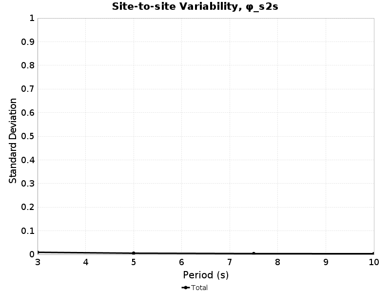

# Bruce 2585 Rotated Rupture Variability, M6.6 SS

[Catalog Details](../#bruce-2585)

## Table Of Contents
* [Rupture Rotation Parameters](#rupture-rotation-parameters)
* [Sites](#sites)
* [Path Variability](#path-variability)
  * [Path Variability Methodology](#path-variability-methodology)
  * [20.0 km Path Residuals](#200-km-path-residuals)
  * [50.0 km Path Residuals](#500-km-path-residuals)
* [Source-strike Variability](#source-strike-variability)
  * [Source-strike Variability Methodology](#source-strike-variability-methodology)
  * [Source-strike Variability Results](#source-strike-variability-results)
* [Within-event Variability](#within-event-variability)
  * [Within-event Variability Methodology](#within-event-variability-methodology)
  * [Within-event Variability Results](#within-event-variability-results)
* [Site-to-site Variability](#site-to-site-variability)
  * [Site-to-site Variability Methodology](#site-to-site-variability-methodology)
  * [Site-to-site Variability Results](#site-to-site-variability-results)
## Rupture Rotation Parameters

| Events | 100 |
|-----|-----|
| Sites | 10 |
| Source Rotation Azimuths | 36 |
| Site-To-Source Path Azimuths | 4 |
| Source-Site Distance[s] | 20.0,50.0 km |
| Total # Simulations | 288000 |

## Sites

| Name | Location | Vs30 (m/s) | Z1.0 (km) | Z2.5 (km) |
|-----|-----|-----|-----|-----|
| LAPD | *34.557, -118.125* | 863 | N/A | N/A |
| PAS | *34.148426, -118.17119* | 863 | N/A | N/A |
| SBSM | *34.064987, -117.29201* | 863 | N/A | N/A |
| SMCA | *34.00909, -118.48939* | 863 | N/A | N/A |
| STNI | *33.93088, -118.17881* | 863 | N/A | N/A |
| USC | *34.0192, -118.286* | 863 | N/A | N/A |
| WNGC | *34.041824, -118.0653* | 863 | N/A | N/A |
| s119 | *34.55314, -118.72826* | 863 | N/A | N/A |
| s279 | *34.37809, -118.34757* | 863 | N/A | N/A |
| s480 | *34.15755, -117.87389* | 863 | N/A | N/A |
## Path Variability
*[(top)](#table-of-contents)*

### Path Variability Methodology
*[(top)](#table-of-contents)*

Path variability, denoted &phi;P2P in Al Atik 2010, is computed from ground motion residuals where the following quantities are held constant:

* Site *[10 unique]*
* Joyner-Boore Distance *[2 unique]*
* Rupture *[100 unique]*
* Rupture Strike (Aki & Richards 1980 convention) *[36 unique]*

and the following quantities vary:

* Path (from site to rupture centroid) *[4 unique]*

Here is an exmample with 5 rotations:

Standard deviation is computed and tabulated separately for each site and distance, then a total standard deviation is computed from all site and distances and reported in the "**ALL SITES**" row.

### 20.0 km Path Residuals
*[(top)](#table-of-contents)*

| Site | 3s Std. Dev. | 3s Residual Range | 5s Std. Dev. | 5s Residual Range | 7.5s Std. Dev. | 7.5s Residual Range | 10s Std. Dev. | 10s Residual Range |
|-----|-----|-----|-----|-----|-----|-----|-----|-----|
| LAPD | 0 | [-0.04 0.05] | 0 | [-0.04 0.06] | 0 | [-0.01 0.03] | 0 | [-0.01 0.01] |
| PAS | 0 | [-0.03 0.05] | 0 | [-0.01 0.04] | 0 | [-0.01 0.01] | 0 | [-0.01 0.02] |
| SBSM | 0 | [-0.04 0.05] | 0 | [-0.02 0.03] | 0 | [-0.01 0.02] | 0 | [-0.02 0.02] |
| SMCA | 0 | [-0.04 0.05] | 0 | [-0.02 0.03] | 0 | [-0.02 0.01] | 0 | [-0.02 0.02] |
| STNI | 0 | [-0.03 0.04] | 0 | [-0.02 0.03] | 0 | [-0.01 0.01] | 0 | [-0.02 0.02] |
| USC | 0 | [-0.05 0.05] | 0 | [-0.03 0.04] | 0 | [-0.01 0.01] | 0 | [-0.02 0.03] |
| WNGC | 0 | [-0.04 0.05] | 0 | [-0.02 0.03] | 0 | [-0.01 0.02] | 0 | [-0.02 0.01] |
| s119 | 0 | [-0.05 0.04] | 0 | [-0.04 0.03] | 0 | [-0.01 0.02] | 0 | [-0.02 0.01] |
| s279 | 0 | [-0.05 0.04] | 0 | [-0.02 0.03] | 0 | [-0.01 0.03] | 0 | [-0.02 0.02] |
| s480 | 0 | [-0.03 0.05] | 0 | [-0.02 0.03] | 0 | [-0.03 0.02] | 0 | [-0.02 0.01] |
| **ALL SITES** | **0** | **[-0.05 0.05]** | **0** | **[-0.04 0.06]** | **0** | **[-0.03 0.03]** | **0** | **[-0.02 0.03]** |

### 50.0 km Path Residuals
*[(top)](#table-of-contents)*

| Site | 3s Std. Dev. | 3s Residual Range | 5s Std. Dev. | 5s Residual Range | 7.5s Std. Dev. | 7.5s Residual Range | 10s Std. Dev. | 10s Residual Range |
|-----|-----|-----|-----|-----|-----|-----|-----|-----|
| LAPD | 0 | [-0.06 0.09] | 0 | [-0.05 0.02] | 0 | [-0.03 0.03] | 0 | [-0.02 0.02] |
| PAS | 0 | [-0.04 0.09] | 0 | [-0.07 0.03] | 0 | [-0.03 0.02] | 0 | [-0.01 0.02] |
| SBSM | 0 | [-0.11 0.11] | 0 | [-0.04 0.04] | 0 | [-0.02 0.03] | 0 | [-0.02 0.02] |
| SMCA | 0 | [-0.17 0.07] | 0 | [-0.07 0.04] | 0 | [-0.02 0.02] | 0 | [-0.02 0.01] |
| STNI | 0 | [-0.17 0.08] | 0 | [-0.07 0.06] | 0 | [-0.05 0.03] | 0 | [-0.03 0.01] |
| USC | 0 | [-0.17 0.11] | 0 | [-0.07 0.05] | 0 | [-0.04 0.02] | 0 | [-0.02 0.02] |
| WNGC | 0 | [-0.06 0.07] | 0 | [-0.05 0.05] | 0 | [-0.04 0.04] | 0 | [-0.04 0.04] |
| s119 | 0 | [-0.1 0.09] | 0 | [-0.03 0.05] | 0 | [-0.02 0.02] | 0 | [-0.03 0.03] |
| s279 | 0 | [-0.08 0.09] | 0 | [-0.07 0.06] | 0 | [-0.02 0.03] | 0 | [-0.02 0.02] |
| s480 | 0 | [-0.13 0.11] | 0 | [-0.04 0.04] | 0 | [-0.02 0.04] | 0 | [-0.02 0.02] |
| **ALL SITES** | **0** | **[-0.17 0.11]** | **0** | **[-0.07 0.06]** | **0** | **[-0.05 0.04]** | **0** | **[-0.04 0.04]** |

## Source-strike Variability
*[(top)](#table-of-contents)*

### Source-strike Variability Methodology
*[(top)](#table-of-contents)*

Source-strike variability, denoted &phi;s, is computed from ground motion residuals where the following quantities are held constant:

* Site *[10 unique]*
* Joyner-Boore Distance *[2 unique]*
* Rupture *[100 unique]*
* Path (from site to rupture centroid) *[4 unique]*

and the following quantities vary:

* Rupture Strike (Aki & Richards 1980 convention) *[36 unique]*

Standard deviation is computed and tabulated separately for each site, then a total standard deviation is computed from all sites and reported in the "**ALL SITES**" row.

### Source-strike Variability Results
*[(top)](#table-of-contents)*

| Site | 3s Std. Dev. | 3s Residual Range | 5s Std. Dev. | 5s Residual Range | 7.5s Std. Dev. | 7.5s Residual Range | 10s Std. Dev. | 10s Residual Range |
|-----|-----|-----|-----|-----|-----|-----|-----|-----|
| LAPD | 0.41 | [-1.34 1.42] | 0.44 | [-1.6 1.34] | 0.42 | [-1.85 1.35] | 0.41 | [-1.55 1.28] |
| PAS | 0.41 | [-1.34 1.43] | 0.44 | [-1.6 1.34] | 0.42 | [-1.85 1.34] | 0.41 | [-1.55 1.28] |
| SBSM | 0.41 | [-1.34 1.42] | 0.44 | [-1.61 1.34] | 0.42 | [-1.85 1.34] | 0.41 | [-1.55 1.28] |
| SMCA | 0.41 | [-1.34 1.43] | 0.44 | [-1.6 1.34] | 0.42 | [-1.84 1.34] | 0.41 | [-1.54 1.27] |
| STNI | 0.41 | [-1.34 1.43] | 0.44 | [-1.6 1.33] | 0.42 | [-1.85 1.34] | 0.41 | [-1.55 1.27] |
| USC | 0.41 | [-1.34 1.43] | 0.44 | [-1.6 1.33] | 0.42 | [-1.85 1.34] | 0.41 | [-1.54 1.27] |
| WNGC | 0.41 | [-1.34 1.43] | 0.44 | [-1.6 1.34] | 0.42 | [-1.85 1.34] | 0.41 | [-1.55 1.28] |
| s119 | 0.41 | [-1.34 1.43] | 0.44 | [-1.59 1.34] | 0.42 | [-1.84 1.34] | 0.41 | [-1.54 1.28] |
| s279 | 0.41 | [-1.34 1.43] | 0.44 | [-1.6 1.34] | 0.42 | [-1.84 1.34] | 0.41 | [-1.54 1.28] |
| s480 | 0.41 | [-1.34 1.43] | 0.44 | [-1.6 1.34] | 0.42 | [-1.85 1.34] | 0.41 | [-1.55 1.28] |
| **ALL SITES** | **0.41** | **[-1.34 1.43]** | **0.44** | **[-1.61 1.34]** | **0.42** | **[-1.85 1.35]** | **0.41** | **[-1.55 1.28]** |

## Within-event Variability
*[(top)](#table-of-contents)*

### Within-event Variability Methodology
*[(top)](#table-of-contents)*

Within-event variability, denoted &phi; in Al Atik 2010, is computed from ground motion residuals where the following quantities are held constant:

* Site *[10 unique]*
* Joyner-Boore Distance *[2 unique]*
* Rupture Strike (Aki & Richards 1980 convention) *[36 unique]*
* Path (from site to rupture centroid) *[4 unique]*

and the following quantities vary:

* Rupture *[100 unique]*

Standard deviation is computed and tabulated separately for each site, then a total standard deviation is computed from all sites and reported in the "**ALL SITES**" row.

### Within-event Variability Results
*[(top)](#table-of-contents)*

| Site | 3s Std. Dev. | 3s Residual Range | 5s Std. Dev. | 5s Residual Range | 7.5s Std. Dev. | 7.5s Residual Range | 10s Std. Dev. | 10s Residual Range |
|-----|-----|-----|-----|-----|-----|-----|-----|-----|
| LAPD | 0.33 | [-1.11 1.44] | 0.37 | [-1.39 1] | 0.43 | [-1.51 1.05] | 0.42 | [-1.77 0.97] |
| PAS | 0.33 | [-1.11 1.44] | 0.37 | [-1.39 1] | 0.43 | [-1.51 1.05] | 0.42 | [-1.77 0.97] |
| SBSM | 0.33 | [-1.11 1.45] | 0.37 | [-1.39 1] | 0.43 | [-1.51 1.05] | 0.42 | [-1.77 0.97] |
| SMCA | 0.33 | [-1.11 1.45] | 0.37 | [-1.39 1] | 0.43 | [-1.51 1.05] | 0.42 | [-1.77 0.97] |
| STNI | 0.33 | [-1.11 1.45] | 0.37 | [-1.39 1] | 0.43 | [-1.51 1.05] | 0.42 | [-1.77 0.97] |
| USC | 0.33 | [-1.11 1.45] | 0.37 | [-1.39 1] | 0.43 | [-1.51 1.05] | 0.42 | [-1.77 0.97] |
| WNGC | 0.33 | [-1.11 1.44] | 0.37 | [-1.39 1] | 0.43 | [-1.51 1.05] | 0.42 | [-1.78 0.97] |
| s119 | 0.33 | [-1.11 1.44] | 0.37 | [-1.39 1] | 0.43 | [-1.51 1.05] | 0.42 | [-1.77 0.97] |
| s279 | 0.33 | [-1.11 1.44] | 0.37 | [-1.39 1] | 0.43 | [-1.51 1.05] | 0.42 | [-1.77 0.97] |
| s480 | 0.33 | [-1.11 1.44] | 0.37 | [-1.39 1] | 0.43 | [-1.51 1.05] | 0.42 | [-1.77 0.97] |
| **ALL SITES** | **0.33** | **[-1.11 1.45]** | **0.37** | **[-1.39 1]** | **0.43** | **[-1.51 1.05]** | **0.42** | **[-1.78 0.97]** |

## Site-to-site Variability
*[(top)](#table-of-contents)*

### Site-to-site Variability Methodology
*[(top)](#table-of-contents)*

Site-to-site variability, denoted &phi;S2S in Al Atik 2010, is computed from ground motion residuals where the following quantities are held constant:

* Joyner-Boore Distance *[2 unique]*
* Rupture *[100 unique]*
* Rupture Strike (Aki & Richards 1980 convention) *[36 unique]*
* Path (from site to rupture centroid) *[4 unique]*

and the following quantities vary:

* Site *[10 unique]*

### Site-to-site Variability Results
*[(top)](#table-of-contents)*

| 3s Std. Dev. | 3s Residual Range | 5s Std. Dev. | 5s Residual Range | 7.5s Std. Dev. | 7.5s Residual Range | 10s Std. Dev. | 10s Residual Range |
|-----|-----|-----|-----|-----|-----|-----|-----|
| 0.01 | [-0.21 0.13] | 0.01 | [-0.08 0.11] | 0 | [-0.07 0.05] | 0 | [-0.06 0.05] |

