# Bruce 2585 1myr
## Metadata
| **Catalog** | Bruce 2585 1myr |
|-----|-----|
| **Author** | Bruce Shaw/Jacqui Gilchrist, 2018/03/12 |
| **Description** | Extended version of Bruce's 2585 to 1 million years |
| **Fault/Def Model** | Fault Model 3.1, Geologic |
| **Slip Velocity** | 1.0 m/s |
| **Average Element Area** | 1.35 km^2 |
| **Length** | 11,230,644 events in 1,002,001 years |
| **Frictional Params** | a=0.001, b=0.008, (b-a)=0.007, ddotEQ=1 |

* [Metadata](#metadata)
* [Extreme Event Examples](extreme_events/)
* [Occupancy Copulas](#occupancy-copulas)
* [BBP Calculations, LA Basin 863 (m/s) Velocity Model](#bbp-calculations-la-basin-863-ms-velocity-model)
  * [Full Catalog GMPE Comparisons, LA Basin 863 (m/s)](#full-catalog-gmpe-comparisons-la-basin-863-ms)
  * [Source/Site Ground Motion Comparisons, LA Basin 863 (m/s)](bbp_LA_BASIN_863/source_site_comparisons/)
  * [BBP Part B Analysis, LA Basin 863 (m/s)](bbp_LA_BASIN_863/bbp_part_b)
  * [Rotated Rupture Variability Comparisons, LA Basin 863 (m/s)](#rotated-rupture-variability-comparisons-la-basin-863-ms)
* [BBP Calculations, LA Basin 500 (m/s) Velocity Model](#bbp-calculations-la-basin-500-ms-velocity-model)
  * [Full Catalog GMPE Comparisons, LA Basin 500 (m/s)](#full-catalog-gmpe-comparisons-la-basin-500-ms)
  * [BBP Part B Analysis, LA Basin 500 (m/s)](bbp_LA_BASIN_500/bbp_part_b)
  * [Rotated Rupture Variability Comparisons, LA Basin 500 (m/s)](#rotated-rupture-variability-comparisons-la-basin-500-ms)
* [BBP PartB Summary](bbp_part_b_summary/)
* [BBP Velocity Model Comparisons](bbp_vm_rot_rup_compare/)
* [Plots](#plots)
  * [Magnitude-Frequency Plot](#magnitude-frequency-plot)
  * [Magnitude-Area Plots](#magnitude-area-plots)
  * [Slip-Area Plots](#slip-area-plots)
  * [Rupture Velocity Plots](#rupture-velocity-plots)
  * [Global Interevent-Time Distributions](#global-interevent-time-distributions)
  * [Normalized Fault Interevent-Time Distributions](#normalized-fault-interevent-time-distributions)
  * [Stationarity Plot](#stationarity-plot)
  * [Element/Subsection Interevent Time Comparisons](#elementsubsection-interevent-time-comparisons)
    * [Element Interevent Time Comparisons](#element-interevent-time-comparisons)
    * [Subsection Interevent Time Comparisons](#subsection-interevent-time-comparisons)
  * [Paleo Open Interval Plots](#paleo-open-interval-plots)
    * [Paleo Open Interval Plots, Biasi and Sharer 2019](#paleo-open-interval-plots-biasi-and-sharer-2019)
    * [Paleo Open Interval Plots, UCERF3](#paleo-open-interval-plots-ucerf3)
  * [Moment Release Variability Plots](#moment-release-variability-plots)
* [Input File](#input-file)

## Extreme Event Examples
*[(top)](#bruce-2585-1myr)*

[Extreme Event Examples Here](extreme_events/)

## Occupancy Copulas
*[(top)](#bruce-2585-1myr)*

* [6-D M>=7.0 Occupancy Copulas](occupancy_copula_m7.0_6D/)

## BBP Calculations, LA Basin 863 (m/s) Velocity Model
*[(top)](#bruce-2585-1myr)*


### Full Catalog GMPE Comparisons, LA Basin 863 (m/s)
*[(top)](#bruce-2585-1myr)*

* [ASK2014](bbp_LA_BASIN_863/gmpe_bbp_comparisons_ASK2014/)

### Source/Site Ground Motion Comparisons, LA Basin 863 (m/s)
*[(top)](#bruce-2585-1myr)*

[Source/Site Ground Motion Comparisons here](bbp_LA_BASIN_863/source_site_comparisons/)

### BBP Part B Analysis, LA Basin 863 (m/s)
*[(top)](#bruce-2585-1myr)*

[BBP Part B Analysis Here](bbp_LA_BASIN_863/bbp_part_b)

### Rotated Rupture Variability Comparisons, LA Basin 863 (m/s)
*[(top)](#bruce-2585-1myr)*

* [M6.6, Reverse, Dip=45, Ztor=3](bbp_LA_BASIN_863/rotated_ruptures_m6p6_reverse/)
* [M6.6, Vertical Strike-Slip with Surface Rupture](bbp_LA_BASIN_863/rotated_ruptures_m6p6_vert_ss_surface/)
* [M7.2, Reverse, Dip=45](bbp_LA_BASIN_863/rotated_ruptures_m7p2_reverse/)
* [M7.2, Vertical Strike-Slip with Surface Rupture](bbp_LA_BASIN_863/rotated_ruptures_m7p2_vert_ss_surface/)
* [M7.6, Reverse, Dip=45](bbp_LA_BASIN_863/rotated_ruptures_m7p6_reverse/)
* [M7.6, Vertical Strike-Slip with Surface Rupture](bbp_LA_BASIN_863/rotated_ruptures_m7p6_vert_ss_surface/)
* [Reverse, Dip=45, Mag-Dist Bins](bbp_LA_BASIN_863/rotated_ruptures_mag_dist_reverse/)
* [Vertical Strike-Slip with Surface Rupture, Mag-Dist Bins](bbp_LA_BASIN_863/rotated_ruptures_mag_dist_vert_ss_surface/)

## BBP Calculations, LA Basin 500 (m/s) Velocity Model
*[(top)](#bruce-2585-1myr)*


### Full Catalog GMPE Comparisons, LA Basin 500 (m/s)
*[(top)](#bruce-2585-1myr)*

* [ASK2014](bbp_LA_BASIN_500/gmpe_bbp_comparisons_ASK2014/)

### BBP Part B Analysis, LA Basin 500 (m/s)
*[(top)](#bruce-2585-1myr)*

[BBP Part B Analysis Here](bbp_LA_BASIN_500/bbp_part_b)

### Rotated Rupture Variability Comparisons, LA Basin 500 (m/s)
*[(top)](#bruce-2585-1myr)*

* [M6.6, Reverse, Dip=45, Ztor=3](bbp_LA_BASIN_500/rotated_ruptures_m6p6_reverse/)
* [M6.6, Vertical Strike-Slip with Surface Rupture](bbp_LA_BASIN_500/rotated_ruptures_m6p6_vert_ss_surface/)
* [M7.2, Reverse, Dip=45](bbp_LA_BASIN_500/rotated_ruptures_m7p2_reverse/)
* [M7.2, Vertical Strike-Slip with Surface Rupture](bbp_LA_BASIN_500/rotated_ruptures_m7p2_vert_ss_surface/)
* [M7.6, Reverse, Dip=45](bbp_LA_BASIN_500/rotated_ruptures_m7p6_reverse/)
* [M7.6, Vertical Strike-Slip with Surface Rupture](bbp_LA_BASIN_500/rotated_ruptures_m7p6_vert_ss_surface/)

## BBP PartB Summary
*[(top)](#bruce-2585-1myr)*

[BBP PartB Summary Here](bbp_part_b_summary/)

## BBP Velocity Model Comparisons
*[(top)](#bruce-2585-1myr)*

[BBP Velocity Model Comparisons Here](bbp_vm_rot_rup_compare/)

## Plots
### Magnitude-Frequency Plot
*[(top)](#bruce-2585-1myr)*


### Magnitude-Area Plots
*[(top)](#bruce-2585-1myr)*

| Scatter | 2-D Hist |
|-----|-----|
|  |  |
### Slip-Area Plots
*[(top)](#bruce-2585-1myr)*

| Scatter | 2-D Hist |
|-----|-----|
| 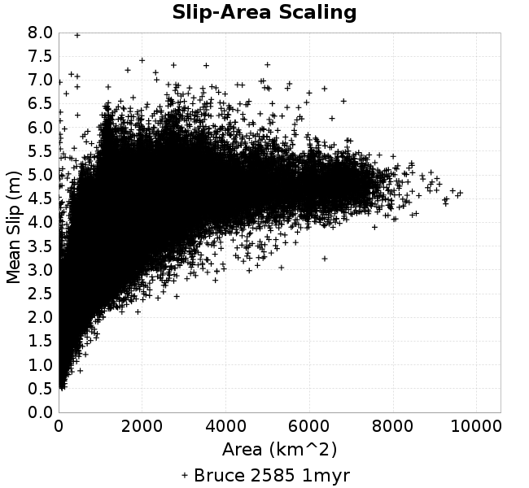 |  |
### Rupture Velocity Plots
*[(top)](#bruce-2585-1myr)*

| **Scatter** |  |
|-----|-----|
| **Distance/Velocity** | 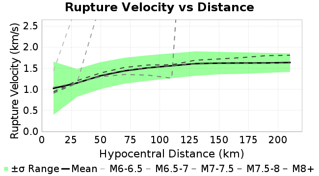 |
### Global Interevent-Time Distributions
*[(top)](#bruce-2585-1myr)*

| **M≥6** | **M≥6.5** | **M≥7** | **M≥7.5** |
|-----|-----|-----|-----|
| 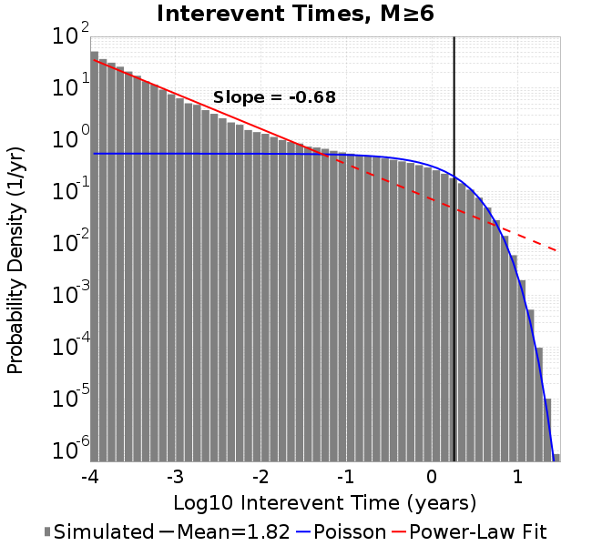 |  |  |  |
### Normalized Fault Interevent-Time Distributions
*[(top)](#bruce-2585-1myr)*

|  | **M≥6** | **M≥6.5** | **M≥7** | **M≥7.5** |
|-----|-----|-----|-----|-----|
| **Elements** |  | 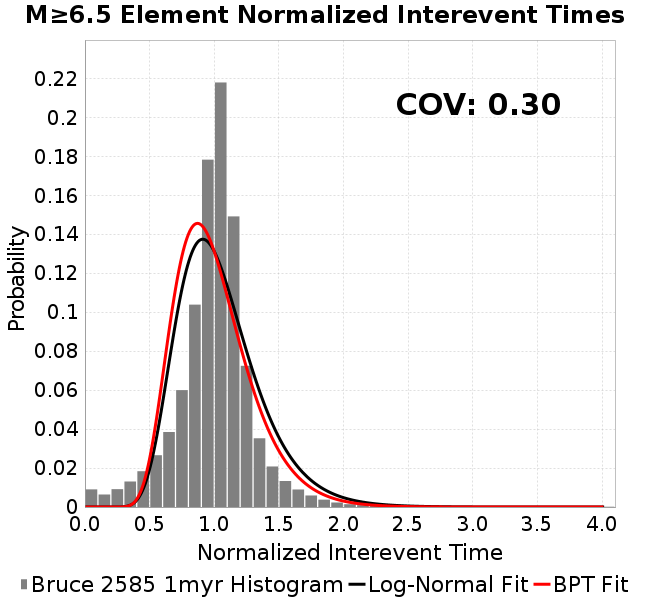 |  |  |
| **Subsections** |  | 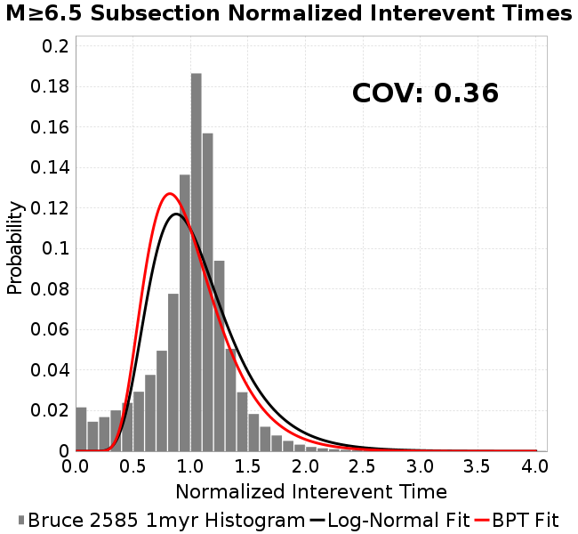 |  | 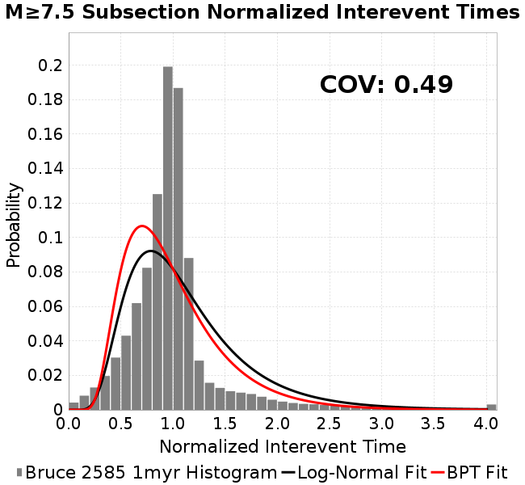 |
| **Sections** | 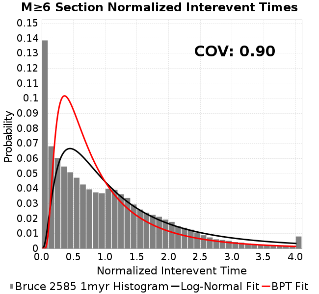 |  |  |  |
### Stationarity Plot
*[(top)](#bruce-2585-1myr)*


### Element/Subsection Interevent Time Comparisons

#### Element Interevent Time Comparisons
*[(top)](#bruce-2585-1myr)*

| Min Mag | Scatter | 2-D Hist |
|-----|-----|-----|
| **M≥6.0** |  | 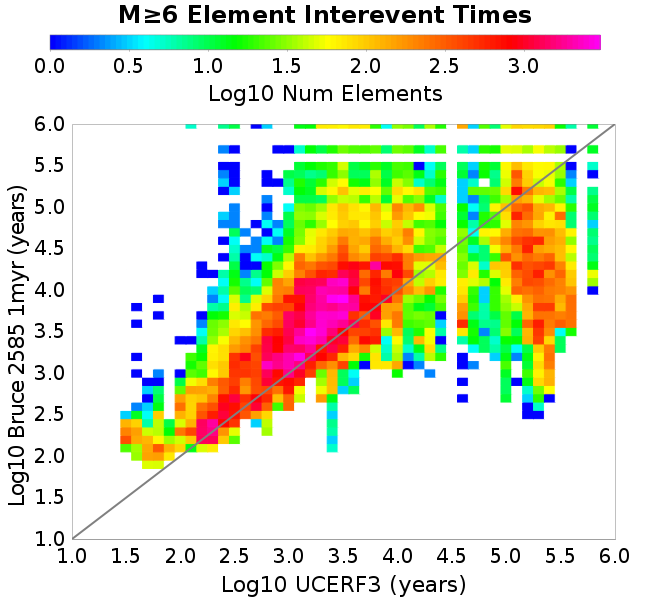 |
| **M≥6.5** |  |  |
| **M≥7.0** |  |  |
| **M≥7.5** | 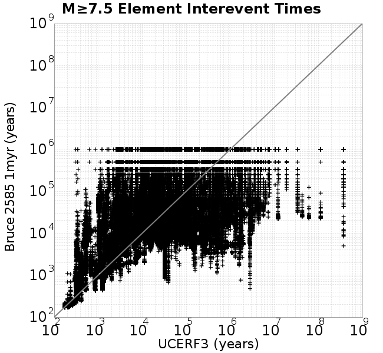 |  |

#### Subsection Interevent Time Comparisons
*[(top)](#bruce-2585-1myr)*

*Subsections participate in a rupture if at least 20.0 % of its area ruptures*

| Min Mag | Scatter | 2-D Hist |
|-----|-----|-----|
| **M≥6.0** | 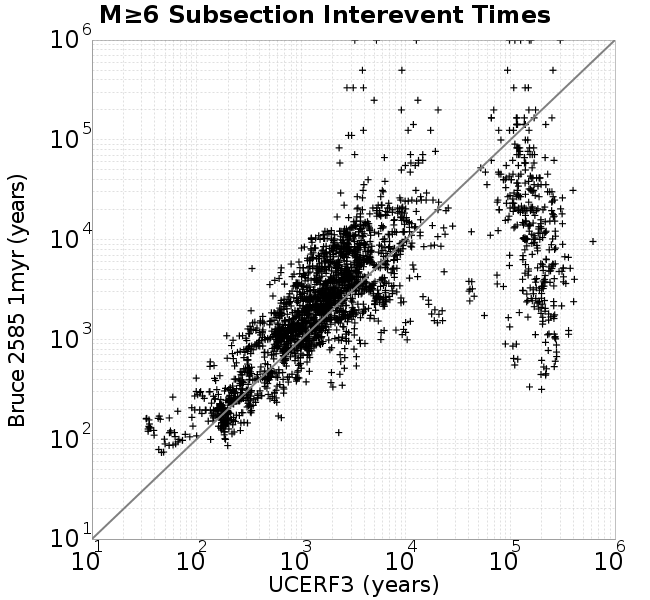 |  |
| **M≥6.5** | 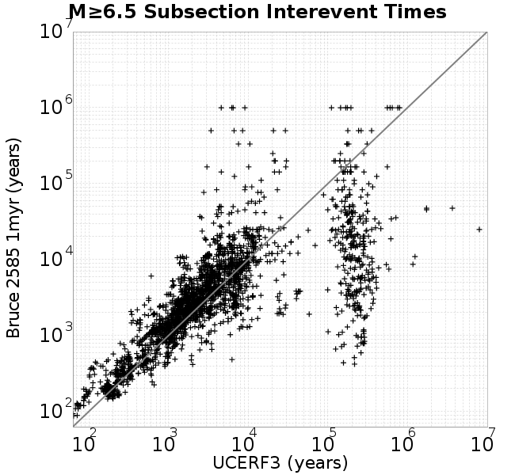 |  |
| **M≥7.0** |  |  |
| **M≥7.5** | 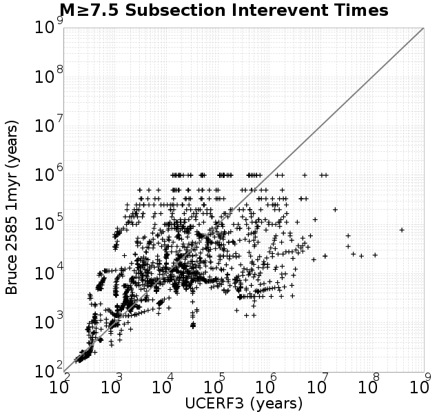 |  |

### Paleo Open Interval Plots
*[(top)](#bruce-2585-1myr)*

#### Paleo Open Interval Plots, Biasi and Sharer 2019
*[(top)](#bruce-2585-1myr)*

These plots use the 5 paleoseismic sites identified in Biasi & Scharer (2019) on the Hayward, N. SAF, S. SAF, and SJC faults. By default, a rupture is counted at a paleo site if the nearest element (at the surface) slips any amount. We also alternatively apply a probability of detection model. Those results are marked as 'Prob. Filtered'.

**Paleoseismic sites table:**

| **Site Name** | Data MRI (yr) | Data Annual Rate | Catalog MRI (yr) | Catalog Annual Rate | Catalog Occurences | Prob Filtered Catalog MRI (yr) | Prob Filtered Catalog Annual Rate | Prob Filtered Catalog Occurences |
|-----|-----|-----|-----|-----|-----|-----|-----|-----|
| **HOG** | 191.00 | 0.005235602 | 404.90 | 0.0024697164 | 2462 | 409.77 | 0.0024404032 | 2432.78 |
| **FRA** | 119.00 | 0.008403362 | 151.19 | 0.0066142087 | 6593 | 156.08 | 0.006406949 | 6386.41 |
| **COA** | 181.00 | 0.005524862 | 244.52 | 0.004089617 | 4076 | 252.52 | 0.0039600083 | 3946.83 |
| **SCZ** | 106.00 | 0.009433962 | 223.37 | 0.0044768727 | 4463 | 237.88 | 0.004203756 | 4190.54 |
| **TYS** | 329.00 | 0.0030395137 | 558.23 | 0.0017913908 | 1786 | 581.94 | 0.0017183891 | 1713.25 |
| **TOTAL** | 31.61 | 0.0316373 | 51.45 | 0.019437807 | 19376 | 53.39 | 0.018728975 | 18669.02 |

**Paleoseismic Plots:**

|  |  |
|-----|-----|

**Open interval probabilities table:**

| **Open Interval (yr)** | Catalog Probability | Catalog Poisson Probability | Prob. Filtered Catalog Probability | Prob. Filtered Catalog Poisson Probability | Data Poisson Probability |
|-----|-----|-----|-----|-----|-----|
| **10.00** | 0.9870218 | 0.82334656 | 0.9879309 | 0.8292034 | 0.72878754 |
| **20.00** | 0.95103514 | 0.6778996 | 0.9544958 | 0.6875783 | 0.53113127 |
| **30.00** | 0.89685434 | 0.5581463 | 0.90377414 | 0.5701423 | 0.3870819 |
| **40.00** | 0.82788944 | 0.45954782 | 0.8384362 | 0.472764 | 0.28210047 |
| **50.00** | 0.7493224 | 0.37836713 | 0.7636411 | 0.3920175 | 0.2055913 |
| **60.00** | 0.6663528 | 0.31152728 | 0.68398994 | 0.32506227 | 0.14983238 |
| **70.00** | 0.58128965 | 0.2564949 | 0.6018514 | 0.26954275 | 0.10919597 |
| **80.00** | 0.4998829 | 0.2111842 | 0.52231985 | 0.22350578 | 0.079580665 |
| **90.00** | 0.42138997 | 0.17387779 | 0.4445179 | 0.18533176 | 0.057997398 |
| **100.00** | 0.34843597 | 0.14316168 | 0.3719505 | 0.15367773 | 0.04226778 |
| **110.00** | 0.28230414 | 0.11787168 | 0.30532777 | 0.12743011 | 0.030804234 |
| **120.00** | 0.22059464 | 0.097049244 | 0.24230814 | 0.10566548 | 0.022449743 |
| **130.00** | 0.16726813 | 0.07990516 | 0.18688858 | 0.08761818 | 0.016361093 |
| **140.00** | 0.12613228 | 0.06578964 | 0.14303437 | 0.0726533 | 0.011923761 |
| **150.00** | 0.09321699 | 0.054167673 | 0.10739326 | 0.060244363 | 0.008689889 |
| **160.00** | 0.06491631 | 0.04459877 | 0.07650525 | 0.049954835 | 0.0063330824 |
| **170.00** | 0.04364628 | 0.036720242 | 0.052414972 | 0.04142272 | 0.0046154717 |
| **180.00** | 0.024492633 | 0.030233486 | 0.030376721 | 0.034347862 | 0.0033636983 |
| **190.00** | 0.009220149 | 0.024892638 | 0.01292834 | 0.028481366 | 0.0024514215 |
| **200.00** | 0.0022892235 | 0.020495268 | 0.0046464843 | 0.023616847 | 0.0017865654 |
| **210.00** | 5.269872E-4 | 0.016874708 | 0.0019330629 | 0.01958317 | 0.0013020267 |
| **220.00** | 0.0 | 0.013893733 | 9.5545175E-4 | 0.016238432 | 9.489008E-4 |
| **230.00** | 0.0 | 0.011439357 | 6.162644E-4 | 0.013464964 | 6.915471E-4 |
| **240.00** | 0.0 | 0.009418556 | 3.5374766E-4 | 0.011165194 | 5.039909E-4 |
| **250.00** | 0.0 | 0.007754735 | 2.317902E-4 | 0.009258217 | 3.673023E-4 |
| **260.00** | 0.0 | 0.0063848346 | 1.6885484E-4 | 0.007676946 | 2.6768536E-4 |
| **270.00** | 0.0 | 0.0052569318 | 8.5999265E-5 | 0.00636575 | 1.9508575E-4 |
| **280.00** | 0.0 | 0.0043282765 | 6.7659275E-5 | 0.0052785017 | 1.4217607E-4 |
| **290.00** | 0.0 | 0.0035636718 | 4.6271034E-5 | 0.0043769516 | 1.0361615E-4 |
| **300.00** | 0.0 | 0.002934137 | 2.510413E-5 | 0.0036293834 | 7.551416E-5 |
| **310.00** | 0.0 | 0.0024158116 | 1.5212435E-5 | 0.0030094972 | 5.503378E-5 |
| **320.00** | 0.0 | 0.00198905 | 8.122711E-6 | 0.0024954854 | 4.0107934E-5 |
| **330.00** | 0.0 | 0.0016376775 | 5.4114344E-6 | 0.002069265 | 2.9230163E-5 |
| **340.00** | 0.0 | 0.0013483763 | 0.0 | 0.0017158418 | 2.1302578E-5 |

#### Paleo Open Interval Plots, UCERF3
*[(top)](#bruce-2585-1myr)*

These plots use the full set of UCERF3 paleoseismic sites. By default, a rupture is counted at a paleo site if the nearest element (at the surface) slips any amount. We also alternativeslyapply a probability of detection model. Those results are marked as 'Prob. Filtered'.

**Paleoseismic sites table:**

| **Site Name** | Data MRI (yr) | Data Annual Rate | Catalog MRI (yr) | Catalog Annual Rate | Catalog Occurences | Prob Filtered Catalog MRI (yr) | Prob Filtered Catalog Annual Rate | Prob Filtered Catalog Occurences |
|-----|-----|-----|-----|-----|-----|-----|-----|-----|
| **SSanAndreasBurroFlats** | 205.44 | 0.0048677 | 292.60 | 0.0034176207 | 3407 | 313.42 | 0.003190652 | 3180.73 |
| **SSanAndreasIndio** | 277.37 | 0.0036053 | 238.89 | 0.0041859616 | 4172 | 246.13 | 0.0040628565 | 4049.31 |
| **SSAFMCreek1000Palms** | 261.33 | 0.0038266 | 2912.12 | 3.4339217E-4 | 342 | 3749.20 | 2.6672374E-4 | 265.59 |
| **NSanAndreasFortRoss** | 306.28 | 0.003265 | 245.53 | 0.0040728557 | 4061 | 248.48 | 0.004024463 | 4012.7 |
| **NSanAndreasNorthCoast** | 263.87 | 0.0037898 | 239.51 | 0.0041751787 | 4163 | 242.87 | 0.0041174632 | 4105.45 |
| **CalaverasfaultNorth** | 618.05 | 0.001618 | 367.86 | 0.0027184316 | 2709 | 434.98 | 0.0022989644 | 2290.95 |
| **ElsinoreTemecula** | 1019.16 | 9.812E-4 | 929.50 | 0.0010758454 | 1072 | 949.15 | 0.0010535752 | 1049.83 |
| **ElsinoreWhittier** | 3196.93 | 3.128E-4 | 2181.16 | 4.584726E-4 | 457 | 2238.61 | 4.4670491E-4 | 445.27 |
| **SSAFCarrizoBidart** | 114.71 | 0.0087179 | 166.91 | 0.0059913527 | 5973 | 169.60 | 0.0058963555 | 5878.3 |
| **SanJacintoHogLake** | 311.78 | 0.0032074 | 404.90 | 0.0024697164 | 2462 | 409.65 | 0.0024411257 | 2433.5 |
| **PuenteHills** | 3506.31 | 2.852E-4 | 7062.19 | 1.4159923E-4 | 141 | 7395.51 | 1.3521715E-4 | 134.64 |
| **SanGregorioNorth** | 1019.06 | 9.813E-4 | 507.51 | 0.001970402 | 1965 | 518.23 | 0.0019296613 | 1924.36 |
| **SanJacintoSuperstition** | 508.26 | 0.0019675 | 1764.36 | 5.667774E-4 | 564 | 1810.93 | 5.522026E-4 | 549.47 |
| **SSanAndreasWrightwood** | 106.04 | 0.0094304 | 197.28 | 0.00506902 | 5053 | 199.36 | 0.005016144 | 5000.28 |
| **SSanAndreasPitmanCanyon** | 173.48 | 0.0057643 | 196.89 | 0.0050790487 | 5063 | 207.02 | 0.0048304168 | 4815.13 |
| **SSanAndreasPlungeCreek** | 205.36 | 0.0048695 | 594.96 | 0.0016807913 | 1676 | 662.60 | 0.0015092047 | 1504.71 |
| **FrazierMountianSSAF** | 148.57 | 0.0067307 | 151.19 | 0.0066142087 | 6593 | 156.10 | 0.006406156 | 6385.62 |
| **NSanAndreasSantaCruzSeg** | 109.84 | 0.0091041 | 223.37 | 0.0044768727 | 4463 | 237.98 | 0.0042019957 | 4188.82 |
| **RodgersCreek** | 325.31 | 0.003074 | 482.54 | 0.0020723485 | 2066 | 500.12 | 0.00199953 | 1993.41 |
| **GreenValleyMasonRoad** | 293.31 | 0.0034094 | 4298.88 | 2.3261887E-4 | 232 | 4548.08 | 2.1987307E-4 | 219.31 |
| **HaywardfaultNorth** | 318.34 | 0.0031413 | 510.30 | 0.001959617 | 1953 | 520.76 | 0.0019202539 | 1913.77 |
| **HaywardfaultSouth** | 167.57 | 0.0059677 | 558.23 | 0.0017913908 | 1786 | 581.56 | 0.0017195131 | 1714.37 |
| **Compton** | 2658.16 | 3.762E-4 | 8918.67 | 1.1212429E-4 | 112 | 9286.26 | 1.0768596E-4 | 107.56 |
| **SSanAndreasCoachella** | 178.45 | 0.0056037 | 244.52 | 0.004089617 | 4076 | 252.47 | 0.0039608995 | 3947.73 |
| **ElsinoreGlenIvy** | 179.12 | 0.0055828 | 773.23 | 0.0012932757 | 1289 | 804.70 | 0.0012427022 | 1238.6 |
| **GarlockCentralallevents** | 1434.93 | 6.969E-4 | 837.41 | 0.0011941644 | 1190 | 847.33 | 0.001180183 | 1176.07 |
| **NSanAndreasAlderCreek** | 869.64 | 0.0011499 | 247.60 | 0.0040387483 | 4027 | 250.43 | 0.003993112 | 3981.5 |
| **SSanAndreasPallettCreek** | 149.30 | 0.006698 | 196.65 | 0.0050850743 | 5069 | 198.84 | 0.0050292877 | 5013.39 |
| **GarlockWesternallevents** | 1230.16 | 8.129E-4 | 1100.84 | 9.083976E-4 | 906 | 1116.54 | 8.956201E-4 | 893.26 |
| **ElsinoreFaultJulian** | 3250.98 | 3.076E-4 | 1652.06 | 6.0530583E-4 | 604 | 1672.64 | 5.9785746E-4 | 596.58 |
| **TOTAL** | 9.08 | 0.1101451 | 22.26 | 0.04492681 | 44786 | 23.01 | 0.043453388 | 43317.23 |

**Paleoseismic Plots:**

|  |  |
|-----|-----|

**Open interval probabilities table:**

| **Open Interval (yr)** | Catalog Probability | Catalog Poisson Probability | Prob. Filtered Catalog Probability | Prob. Filtered Catalog Poisson Probability | Data Poisson Probability |
|-----|-----|-----|-----|-----|-----|
| **10.00** | 0.9321675 | 0.638095 | 0.9358973 | 0.64756644 | 0.33238843 |
| **20.00** | 0.7843157 | 0.40716523 | 0.7945408 | 0.41934228 | 0.110482074 |
| **30.00** | 0.61675966 | 0.2598101 | 0.63190234 | 0.271552 | 0.036722966 |
| **40.00** | 0.45807922 | 0.16578352 | 0.47557738 | 0.17584795 | 0.012206289 |
| **50.00** | 0.32234046 | 0.10578564 | 0.33980092 | 0.11387323 | 0.004057229 |
| **60.00** | 0.21375829 | 0.067501284 | 0.22958745 | 0.07374048 | 0.001348576 |
| **70.00** | 0.13610245 | 0.043072235 | 0.14909253 | 0.04775186 | 4.4825108E-4 |
| **80.00** | 0.0841948 | 0.027484177 | 0.09407623 | 0.030922502 | 1.4899348E-4 |
| **90.00** | 0.052597567 | 0.017537516 | 0.059567448 | 0.020024374 | 4.952371E-5 |
| **100.00** | 0.032159824 | 0.011190602 | 0.037043795 | 0.0129671125 | 1.6461108E-5 |
| **110.00** | 0.017231898 | 0.0071406667 | 0.020390391 | 0.008397067 | 5.4714824E-6 |
| **120.00** | 0.008730427 | 0.0045564235 | 0.010690333 | 0.0054376586 | 1.8186574E-6 |
| **130.00** | 0.0042902674 | 0.0029074312 | 0.0053841965 | 0.0035212452 | 6.045007E-7 |
| **140.00** | 0.0028951555 | 0.0018552173 | 0.0035043666 | 0.0022802402 | 2.0092905E-7 |
| **150.00** | 0.0017636493 | 0.0011838049 | 0.0021401043 | 0.0014766069 | 6.678649E-8 |
| **160.00** | 5.7431817E-4 | 7.5537997E-4 | 7.4393925E-4 | 9.562011E-4 | 2.2199057E-8 |
| **170.00** | 3.3145462E-4 | 4.820042E-4 | 4.821833E-4 | 6.192037E-4 | 7.37871E-9 |
| **180.00** | 0.0 | 3.0756448E-4 | 1.1339292E-4 | 4.0097555E-4 | 2.452598E-9 |
| **190.00** | 0.0 | 1.9625535E-4 | 0.0 | 2.5965832E-4 | 8.152152E-10 |

### Moment Release Variability Plots
*[(top)](#bruce-2585-1myr)*

We first create a tapered moment release time series for the entire catalog. Each event's moment is distributed across a 25 year Hanning (cosine) taper. Here is a plot of a random 2,000 year section of this time series:

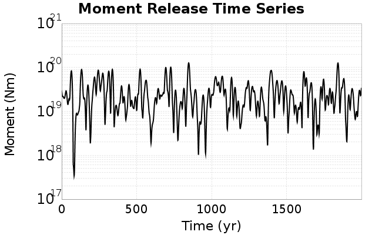

We then compute Welch's power spectral density estimate on the entire time series. Results are plotted below, with a Poisson randomization of the catalog also plotted in gray as a control. Significant deviations above the Poisson model indicate synchronization at that period.


## Input File
*[(top)](#bruce-2585-1myr)*

```
  A_1 = 0.001
  fA = .1
  B_1 = 0.008
  muSlipAmp_1 = .0
  muSlipInvDist_1 = 1.0
  cohesion = 0.0
  Dc_1 = 1.0000000000000000818e-05
  mu0_1 = 0.6
  ddotStar_1 = 9.9999999999999995475e-07
  ddotAB_1 = 9.9999999999999995475e-07
  alpha_1 = 0.0
  theta0_1 = 200000000
  tau0_1 = 55.1
  sigma0_1 = 100
  sigmaFracPin = .5
  lowSigmaAction = 1
  maxThetaPin = 1.0e13
  ddotEQ_1 = 1
  ddotEQFname = 
  stressOvershootFactor = 0.10000000000000000555
  lameLambda = 30000
  lameMu = 30000
  slowSlip_1 = 0
  nEq = 10000000000
  KZeroFrac = 0
  KOneFrac =  0
  muPin = 1.0
  tStart = 26772011003374.0078125
  maxT = 3.16e13
  maxTransitions = 1.0000000000000000159e100
  faultFname = zfault_Deepen.in
  outFnameInfix = extend2585
  writeTau = 2
  writeSigma = 2
  writeSlip = 0
  writeSlipSpeed = 0
  writeState = 0
  writeTheta = 2
  writePED = 1
  writeTransitions = 1
  minDtWrite = 0
  minDtWriteCoseismic = 0
  minDtWriteInterseismic = 0
  minMagWrite = 7.95
  writeStiffness = 0
  stressRateSpecification = 1
  dMu3 = 0.01000000000000000
  initTauFname = extend2585.initTau
  initSigmaFname = extend2585.initSigma
  initThetaFname = extend2585.initTheta
  initSlipSpeedFname = 
  AFname = 
  BFname =  
  DcFname = 
  mu0Fname = 
  ddotStarFname = 
  ddotABFname = 
  alphaFname = 
  KTauFname = 
  KSigmaFname = 
  tFailFname = 
  tauFailFname = 
  tauDotFname = 
  sigmaDotFname =
  KZeroFname = zfault_Deepen_KZero.in
  pinnedFname =  extend2585.pin
  neighborFname = zfault_Deepen_neighbors.in
  stressRateFname =  
  slowSlipFname = 
  writePatchFname = 
  DEBUG = 0
  ZBrentUpperBracket = 0
```
