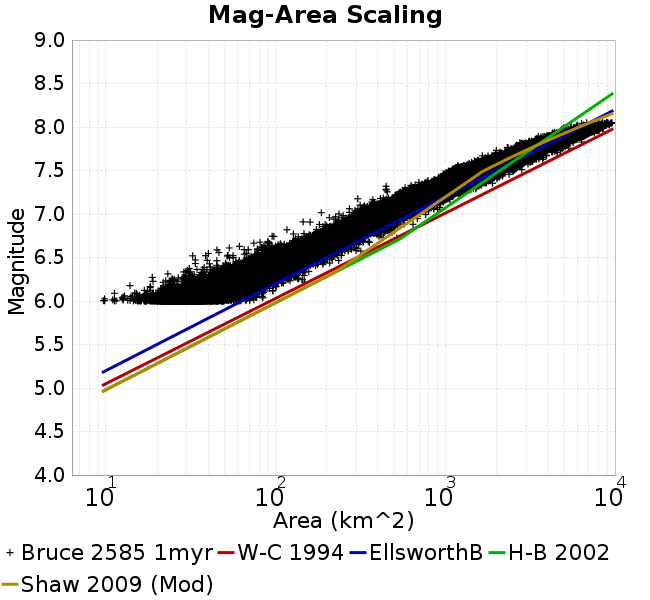
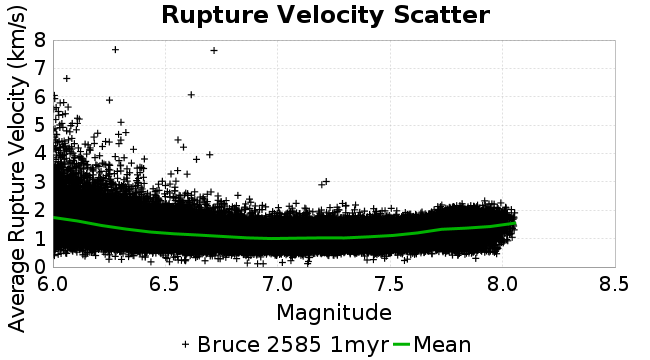
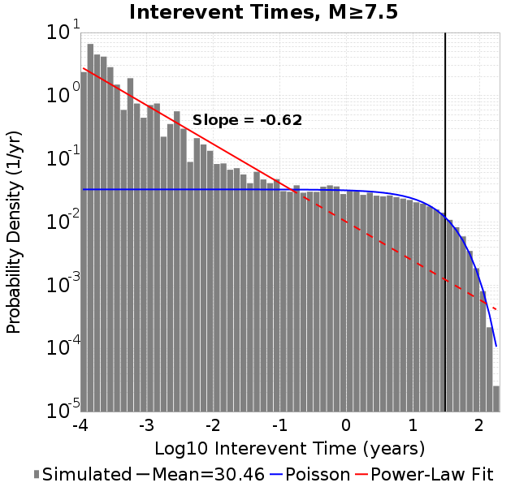
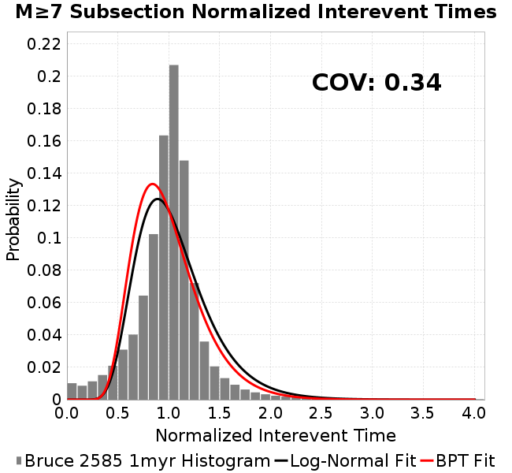
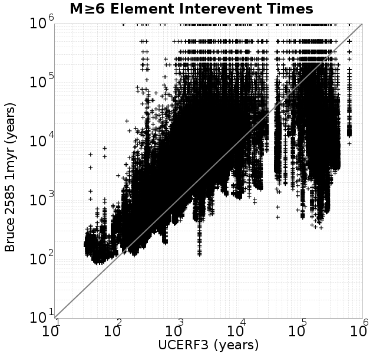
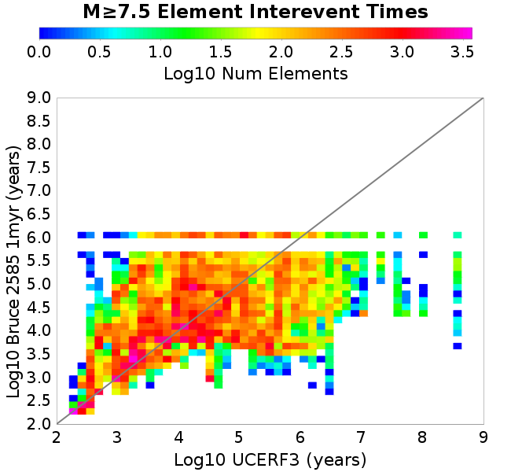
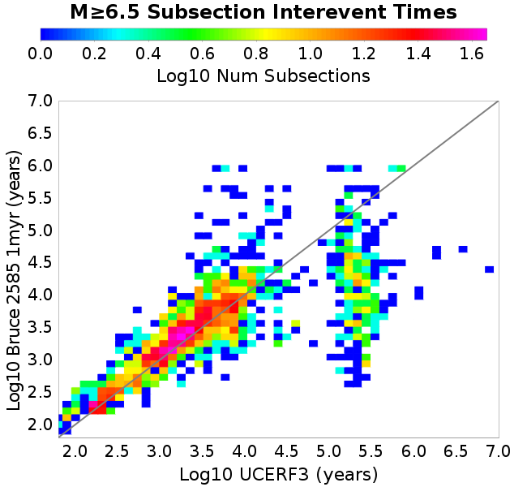
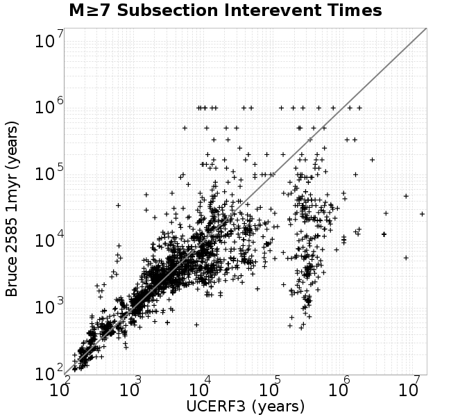
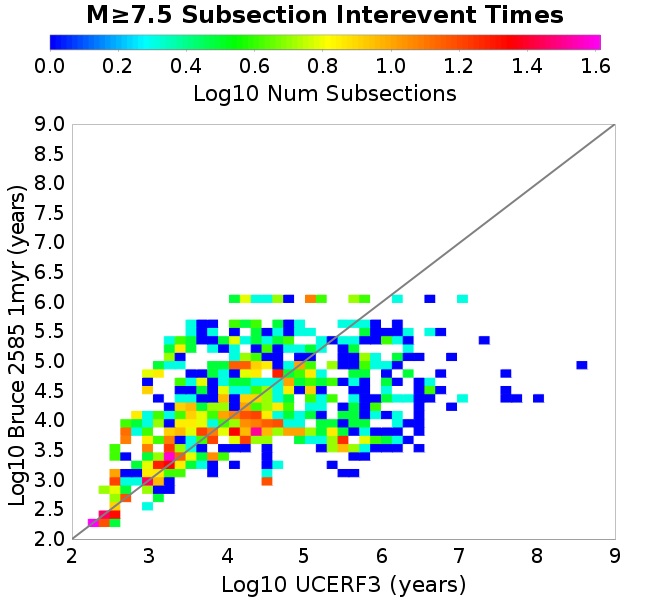
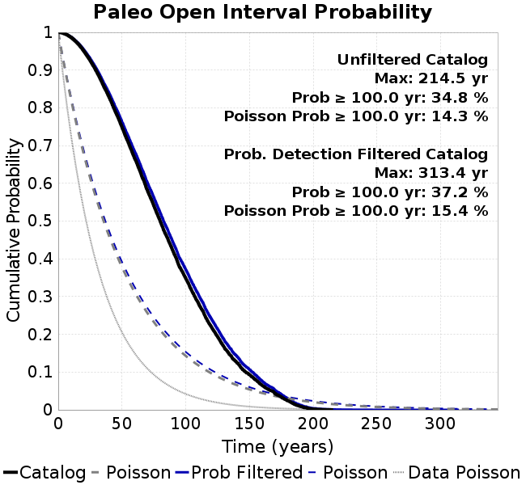

# Bruce 2585 1myr
## Metadata
| **Catalog** | Bruce 2585 1myr |
|-----|-----|
| **Author** | Bruce Shaw/Jacqui Gilchrist, 2018/03/12 |
| **Description** | Extended version of Bruce's 2585 to 1 million years |
| **Fault/Def Model** | Fault Model 3.1, Geologic |
| **Slip Velocity** | 1.0 m/s |
| **Average Element Area** | 1.35 km^2 |
| **Length** | 11,230,644 events in 1,002,001 years |
| **Frictional Params** | a=0.001, b=0.008, (b-a)=0.007, ddotEQ=1 |

* [Metadata](#metadata)
* [Extreme Event Examples](extreme_events/)
* [Occupancy Copulas](#occupancy-copulas)
* [BBP Calculations, LA Basin 863 (m/s) Velocity Model](#bbp-calculations-la-basin-863-ms-velocity-model)
  * [Full Catalog GMPE Comparisons, LA Basin 863 (m/s)](#full-catalog-gmpe-comparisons-la-basin-863-ms)
  * [Source/Site Ground Motion Comparisons, LA Basin 863 (m/s)](bbp_LA_BASIN_863/source_site_comparisons/)
  * [BBP Part B Analysis, LA Basin 863 (m/s)](bbp_LA_BASIN_863/bbp_part_b)
  * [Rotated Rupture Variability Comparisons, LA Basin 863 (m/s)](#rotated-rupture-variability-comparisons-la-basin-863-ms)
* [BBP Calculations, LA Basin 500 (m/s) Velocity Model](#bbp-calculations-la-basin-500-ms-velocity-model)
  * [Full Catalog GMPE Comparisons, LA Basin 500 (m/s)](#full-catalog-gmpe-comparisons-la-basin-500-ms)
  * [BBP Part B Analysis, LA Basin 500 (m/s)](bbp_LA_BASIN_500/bbp_part_b)
  * [Rotated Rupture Variability Comparisons, LA Basin 500 (m/s)](#rotated-rupture-variability-comparisons-la-basin-500-ms)
* [BBP PartB Summary](bbp_part_b_summary/)
* [BBP Velocity Model Comparisons](bbp_vm_rot_rup_compare/)
* [Plots](#plots)
  * [Magnitude-Frequency Plot](#magnitude-frequency-plot)
  * [Magnitude-Area Plots](#magnitude-area-plots)
  * [Slip-Area Plots](#slip-area-plots)
  * [Rupture Velocity Plots](#rupture-velocity-plots)
  * [Global Interevent-Time Distributions](#global-interevent-time-distributions)
  * [Normalized Fault Interevent-Time Distributions](#normalized-fault-interevent-time-distributions)
  * [Stationarity Plot](#stationarity-plot)
  * [Element/Subsection Interevent Time Comparisons](#elementsubsection-interevent-time-comparisons)
    * [Element Interevent Time Comparisons](#element-interevent-time-comparisons)
    * [Subsection Interevent Time Comparisons](#subsection-interevent-time-comparisons)
  * [Paleo Open Interval Plots](#paleo-open-interval-plots)
* [Input File](#input-file)

## Extreme Event Examples
*[(top)](#bruce-2585-1myr)*

[Extreme Event Examples Here](extreme_events/)

## Occupancy Copulas
*[(top)](#bruce-2585-1myr)*

* [6-D M>=7.0 Occupancy Copulas](occupancy_copula_m7.0_6D/)

## BBP Calculations, LA Basin 863 (m/s) Velocity Model
*[(top)](#bruce-2585-1myr)*


### Full Catalog GMPE Comparisons, LA Basin 863 (m/s)
*[(top)](#bruce-2585-1myr)*

* [ASK2014](bbp_LA_BASIN_863/gmpe_bbp_comparisons_ASK2014/)

### Source/Site Ground Motion Comparisons, LA Basin 863 (m/s)
*[(top)](#bruce-2585-1myr)*

[Source/Site Ground Motion Comparisons here](bbp_LA_BASIN_863/source_site_comparisons/)

### BBP Part B Analysis, LA Basin 863 (m/s)
*[(top)](#bruce-2585-1myr)*

[BBP Part B Analysis Here](bbp_LA_BASIN_863/bbp_part_b)

### Rotated Rupture Variability Comparisons, LA Basin 863 (m/s)
*[(top)](#bruce-2585-1myr)*

* [M6.6, Reverse, Dip=45, Ztor=3](bbp_LA_BASIN_863/rotated_ruptures_m6p6_reverse/)
* [M6.6, Vertical Strike-Slip with Surface Rupture](bbp_LA_BASIN_863/rotated_ruptures_m6p6_vert_ss_surface/)
* [M7.2, Reverse, Dip=45](bbp_LA_BASIN_863/rotated_ruptures_m7p2_reverse/)
* [M7.2, Vertical Strike-Slip with Surface Rupture](bbp_LA_BASIN_863/rotated_ruptures_m7p2_vert_ss_surface/)
* [M7.6, Reverse, Dip=45](bbp_LA_BASIN_863/rotated_ruptures_m7p6_reverse/)
* [M7.6, Vertical Strike-Slip with Surface Rupture](bbp_LA_BASIN_863/rotated_ruptures_m7p6_vert_ss_surface/)
* [Reverse, Dip=45, Mag-Dist Bins](bbp_LA_BASIN_863/rotated_ruptures_mag_dist_reverse/)
* [Vertical Strike-Slip with Surface Rupture, Mag-Dist Bins](bbp_LA_BASIN_863/rotated_ruptures_mag_dist_vert_ss_surface/)

## BBP Calculations, LA Basin 500 (m/s) Velocity Model
*[(top)](#bruce-2585-1myr)*


### Full Catalog GMPE Comparisons, LA Basin 500 (m/s)
*[(top)](#bruce-2585-1myr)*

* [ASK2014](bbp_LA_BASIN_500/gmpe_bbp_comparisons_ASK2014/)

### BBP Part B Analysis, LA Basin 500 (m/s)
*[(top)](#bruce-2585-1myr)*

[BBP Part B Analysis Here](bbp_LA_BASIN_500/bbp_part_b)

### Rotated Rupture Variability Comparisons, LA Basin 500 (m/s)
*[(top)](#bruce-2585-1myr)*

* [M6.6, Reverse, Dip=45, Ztor=3](bbp_LA_BASIN_500/rotated_ruptures_m6p6_reverse/)
* [M6.6, Vertical Strike-Slip with Surface Rupture](bbp_LA_BASIN_500/rotated_ruptures_m6p6_vert_ss_surface/)
* [M7.2, Reverse, Dip=45](bbp_LA_BASIN_500/rotated_ruptures_m7p2_reverse/)
* [M7.2, Vertical Strike-Slip with Surface Rupture](bbp_LA_BASIN_500/rotated_ruptures_m7p2_vert_ss_surface/)
* [M7.6, Reverse, Dip=45](bbp_LA_BASIN_500/rotated_ruptures_m7p6_reverse/)
* [M7.6, Vertical Strike-Slip with Surface Rupture](bbp_LA_BASIN_500/rotated_ruptures_m7p6_vert_ss_surface/)

## BBP PartB Summary
*[(top)](#bruce-2585-1myr)*

[BBP PartB Summary Here](bbp_part_b_summary/)

## BBP Velocity Model Comparisons
*[(top)](#bruce-2585-1myr)*

[BBP Velocity Model Comparisons Here](bbp_vm_rot_rup_compare/)

## Plots
### Magnitude-Frequency Plot
*[(top)](#bruce-2585-1myr)*


### Magnitude-Area Plots
*[(top)](#bruce-2585-1myr)*

| Scatter | 2-D Hist |
|-----|-----|
|  |  |
### Slip-Area Plots
*[(top)](#bruce-2585-1myr)*

| Scatter | 2-D Hist |
|-----|-----|
|  |  |
### Rupture Velocity Plots
*[(top)](#bruce-2585-1myr)*

| **Scatter** |  |
|-----|-----|
| **Distance/Velocity** |  |
### Global Interevent-Time Distributions
*[(top)](#bruce-2585-1myr)*

| **M≥6** | **M≥6.5** | **M≥7** | **M≥7.5** |
|-----|-----|-----|-----|
|  |  |  |  |
### Normalized Fault Interevent-Time Distributions
*[(top)](#bruce-2585-1myr)*

|  | **M≥6** | **M≥6.5** | **M≥7** | **M≥7.5** |
|-----|-----|-----|-----|-----|
| **Elements** |  |  |  |  |
| **Subsections** |  |  |  |  |
| **Sections** |  |  |  |  |
### Stationarity Plot
*[(top)](#bruce-2585-1myr)*


### Element/Subsection Interevent Time Comparisons

#### Element Interevent Time Comparisons
*[(top)](#bruce-2585-1myr)*

| Min Mag | Scatter | 2-D Hist |
|-----|-----|-----|
| **M≥6.0** |  |  |
| **M≥6.5** |  |  |
| **M≥7.0** |  |  |
| **M≥7.5** |  |  |

#### Subsection Interevent Time Comparisons
*[(top)](#bruce-2585-1myr)*

*Subsections participate in a rupture if at least 20.0 % of its area ruptures*

| Min Mag | Scatter | 2-D Hist |
|-----|-----|-----|
| **M≥6.0** |  |  |
| **M≥6.5** |  |  |
| **M≥7.0** |  |  |
| **M≥7.5** |  |  |
### Paleo Open Interval Plots
*[(top)](#bruce-2585-1myr)*

These plots use the 5 paleoseismic sites identified in Biasi & Scharer (2019) on the Hayward, N. SAF, S. SAF, and SJC faults. A rupture is counted at a paleo site if the nearest element (at the surface) slips any amount.

**Paleoseismic sites table:**

| **Site Name** | Data MRI (yr) | Data Annual Rate | Catalog MRI (yr) | Catalog Annual Rate | Catalog Occurences |
|-----|-----|-----|-----|-----|-----|
| **HOG** | 191.00 | 0.005235602 | 404.90 | 0.0024697164 | 2462 |
| **FRA** | 119.00 | 0.008403362 | 151.19 | 0.0066142087 | 6593 |
| **COA** | 181.00 | 0.005524862 | 244.52 | 0.004089617 | 4076 |
| **SCZ** | 106.00 | 0.009433962 | 223.37 | 0.0044768727 | 4463 |
| **TYS** | 329.00 | 0.0030395137 | 558.23 | 0.0017913908 | 1786 |
| **TOTAL** | 31.61 | 0.0316373 | 51.44 | 0.019441806 | 19376 |

|  |
|-----|
|  |

**Open interval probabilities table:**

| **Open Interval (yr)** | Catalog Probability | Catalog Poisson Probability | Data Poisson Probability |
|-----|-----|-----|-----|
| **10.00** | 0.9870218 | 0.82331365 | 0.72878754 |
| **20.00** | 0.95103514 | 0.67784536 | 0.53113127 |
| **30.00** | 0.89685434 | 0.5580793 | 0.3870819 |
| **40.00** | 0.82788944 | 0.45947433 | 0.28210047 |
| **50.00** | 0.7493224 | 0.3782915 | 0.2055913 |
| **60.00** | 0.6663528 | 0.31145254 | 0.14983238 |
| **70.00** | 0.58128965 | 0.25642312 | 0.10919597 |
| **80.00** | 0.4998829 | 0.21111666 | 0.079580665 |
| **90.00** | 0.42138997 | 0.17381522 | 0.057997398 |
| **100.00** | 0.34843597 | 0.14310443 | 0.04226778 |
| **110.00** | 0.28230414 | 0.11781984 | 0.030804234 |
| **120.00** | 0.22059464 | 0.09700268 | 0.022449743 |
| **130.00** | 0.16726813 | 0.07986363 | 0.016361093 |
| **140.00** | 0.12613228 | 0.06575281 | 0.011923761 |
| **150.00** | 0.09321699 | 0.05413519 | 0.008689889 |
| **160.00** | 0.06491631 | 0.04457024 | 0.0063330824 |
| **170.00** | 0.04364628 | 0.036695287 | 0.0046154717 |
| **180.00** | 0.024492633 | 0.03021173 | 0.0033636983 |
| **190.00** | 0.009220149 | 0.02487373 | 0.0024514215 |
| **200.00** | 0.0022892235 | 0.02047888 | 0.0017865654 |
| **210.00** | 5.269872E-4 | 0.016860541 | 0.0013020267 |
| **220.00** | 0.0 | 0.013881514 | 9.489008E-4 |

These plots use the full set of UCERF3 paleoseismic sites. A rupture is counted at a paleo site if the nearest element (at the surface) slips any amount.

**Paleoseismic sites table:**

| **Site Name** | Data MRI (yr) | Data Annual Rate | Catalog MRI (yr) | Catalog Annual Rate | Catalog Occurences |
|-----|-----|-----|-----|-----|-----|
| **San Jacinto - Superstition** | 508.26 | 0.0019675 | 1764.36 | 5.667774E-4 | 564 |
| **S. San Andreas - Indio  ** | 277.37 | 0.0036053 | 238.89 | 0.0041859616 | 4172 |
| **N. San Andreas - Alder Creek** | 869.64 | 0.0011499 | 247.60 | 0.0040387483 | 4027 |
| **Elsinore - Glen Ivy** | 179.12 | 0.0055828 | 773.23 | 0.0012932757 | 1289 |
| **Garlock Central (all events)** | 1434.93 | 6.969E-4 | 837.41 | 0.0011941644 | 1190 |
| **S. San Andreas - Wrightwood        ** | 106.04 | 0.0094304 | 197.28 | 0.00506902 | 5053 |
| **Green Valley - Mason Road** | 293.31 | 0.0034094 | 4298.88 | 2.3261887E-4 | 232 |
| **Rodgers Creek** | 325.31 | 0.003074 | 482.54 | 0.0020723485 | 2066 |
| **N. San Andreas - Santa Cruz Seg.** | 109.84 | 0.0091041 | 223.37 | 0.0044768727 | 4463 |
| **Calaveras fault - North** | 618.05 | 0.001618 | 367.86 | 0.0027184316 | 2709 |
| **Puente Hills** | 3506.31 | 2.852E-4 | 7062.19 | 1.4159923E-4 | 141 |
| **N. San Andreas - North Coast** | 263.87 | 0.0037898 | 239.51 | 0.0041751787 | 4163 |
| **Elsinore - Whittier** | 3196.93 | 3.128E-4 | 2181.16 | 4.584726E-4 | 457 |
| **San Jacinto - Hog Lake** | 311.78 | 0.0032074 | 404.90 | 0.0024697164 | 2462 |
| **San Gregorio - North** | 1019.06 | 9.813E-4 | 507.51 | 0.001970402 | 1965 |
| **S. San Andreas - Burro Flats                         ** | 205.44 | 0.0048677 | 292.60 | 0.0034176207 | 3407 |
| **Hayward fault - North** | 318.34 | 0.0031413 | 510.30 | 0.001959617 | 1953 |
| **S. San Andreas - Coachella** | 178.45 | 0.0056037 | 244.52 | 0.004089617 | 4076 |
| **Frazier Mountian, SSAF** | 148.57 | 0.0067307 | 151.19 | 0.0066142087 | 6593 |
| **Compton** | 2658.16 | 3.762E-4 | 8918.67 | 1.1212429E-4 | 112 |
| **S. San Andreas - Pallett Creek** | 149.30 | 0.006698 | 196.65 | 0.0050850743 | 5069 |
| **S. San Andreas - Pitman Canyon      ** | 173.48 | 0.0057643 | 196.89 | 0.0050790487 | 5063 |
| **N. San Andreas -  Fort Ross** | 306.28 | 0.003265 | 245.53 | 0.0040728557 | 4061 |
| **Elsinore - Temecula** | 1019.16 | 9.812E-4 | 929.50 | 0.0010758454 | 1072 |
| **S. SAF M. Creek - 1000 Palms** | 261.33 | 0.0038266 | 2912.12 | 3.4339217E-4 | 342 |
| **Hayward fault - South** | 167.57 | 0.0059677 | 558.23 | 0.0017913908 | 1786 |
| **S. SAF- Carrizo Bidart** | 114.71 | 0.0087179 | 166.91 | 0.0059913527 | 5973 |
| **S. San Andreas - Plunge Creek   ** | 205.36 | 0.0048695 | 594.96 | 0.0016807913 | 1676 |
| **Garlock - Western (all events)** | 1230.16 | 8.129E-4 | 1100.84 | 9.083976E-4 | 906 |
| **Elsinore Fault - Julian** | 3250.98 | 3.076E-4 | 1652.06 | 6.0530583E-4 | 604 |
| **TOTAL** | 9.08 | 0.1101451 | 12.84 | 0.07789023 | 44786 |

|  |
|-----|
|  |

**Open interval probabilities table:**

| **Open Interval (yr)** | Catalog Probability | Catalog Poisson Probability | Data Poisson Probability |
|-----|-----|-----|-----|
| **10.00** | 0.9321675 | 0.45890948 | 0.33238843 |
| **20.00** | 0.7843157 | 0.2105979 | 0.110482074 |
| **30.00** | 0.61675966 | 0.09664538 | 0.036722966 |
| **40.00** | 0.45807922 | 0.044351477 | 0.012206289 |
| **50.00** | 0.32234046 | 0.020353314 | 0.004057229 |
| **60.00** | 0.21375829 | 0.009340328 | 0.001348576 |
| **70.00** | 0.13610245 | 0.004286365 | 4.4825108E-4 |
| **80.00** | 0.0841948 | 0.0019670536 | 1.4899348E-4 |
| **90.00** | 0.052597567 | 9.0269954E-4 | 4.952371E-5 |
| **100.00** | 0.032159824 | 4.1425737E-4 | 1.6461108E-5 |
| **110.00** | 0.017231898 | 1.9010664E-4 | 5.4714824E-6 |
| **120.00** | 0.008730427 | 8.724174E-5 | 1.8186574E-6 |
| **130.00** | 0.0042902674 | 4.003606E-5 | 6.045007E-7 |
| **140.00** | 0.0028951555 | 1.8372928E-5 | 2.0092905E-7 |
| **150.00** | 0.0017636493 | 8.431511E-6 | 6.678649E-8 |
| **160.00** | 5.7431817E-4 | 3.8693E-6 | 2.2199057E-8 |
| **170.00** | 3.3145462E-4 | 1.7756585E-6 | 7.37871E-9 |
| **180.00** | 0.0 | 8.148665E-7 | 2.452598E-9 |

## Input File
*[(top)](#bruce-2585-1myr)*

```
  A_1 = 0.001
  fA = .1
  B_1 = 0.008
  muSlipAmp_1 = .0
  muSlipInvDist_1 = 1.0
  cohesion = 0.0
  Dc_1 = 1.0000000000000000818e-05
  mu0_1 = 0.6
  ddotStar_1 = 9.9999999999999995475e-07
  ddotAB_1 = 9.9999999999999995475e-07
  alpha_1 = 0.0
  theta0_1 = 200000000
  tau0_1 = 55.1
  sigma0_1 = 100
  sigmaFracPin = .5
  lowSigmaAction = 1
  maxThetaPin = 1.0e13
  ddotEQ_1 = 1
  ddotEQFname = 
  stressOvershootFactor = 0.10000000000000000555
  lameLambda = 30000
  lameMu = 30000
  slowSlip_1 = 0
  nEq = 10000000000
  KZeroFrac = 0
  KOneFrac =  0
  muPin = 1.0
  tStart = 26772011003374.0078125
  maxT = 3.16e13
  maxTransitions = 1.0000000000000000159e100
  faultFname = zfault_Deepen.in
  outFnameInfix = extend2585
  writeTau = 2
  writeSigma = 2
  writeSlip = 0
  writeSlipSpeed = 0
  writeState = 0
  writeTheta = 2
  writePED = 1
  writeTransitions = 1
  minDtWrite = 0
  minDtWriteCoseismic = 0
  minDtWriteInterseismic = 0
  minMagWrite = 7.95
  writeStiffness = 0
  stressRateSpecification = 1
  dMu3 = 0.01000000000000000
  initTauFname = extend2585.initTau
  initSigmaFname = extend2585.initSigma
  initThetaFname = extend2585.initTheta
  initSlipSpeedFname = 
  AFname = 
  BFname =  
  DcFname = 
  mu0Fname = 
  ddotStarFname = 
  ddotABFname = 
  alphaFname = 
  KTauFname = 
  KSigmaFname = 
  tFailFname = 
  tauFailFname = 
  tauDotFname = 
  sigmaDotFname =
  KZeroFname = zfault_Deepen_KZero.in
  pinnedFname =  extend2585.pin
  neighborFname = zfault_Deepen_neighbors.in
  stressRateFname =  
  slowSlipFname = 
  writePatchFname = 
  DEBUG = 0
  ZBrentUpperBracket = 0
```
