# Directivity Debug

Map plots show the re-oriented (with strike=0) raw rupture in black, the linear GMPE source used to predict directivity with a dashed line, and hypocenter with a star. Map background is empirical fD estimates for 3s, and mean simulated values at 20 and 50 km are overlaid. The chart on the right shows the simulated values for 20 km at each spectral period.

| Map Plot | Residuals Plot |
|-----|-----|
|  |  |
|  | 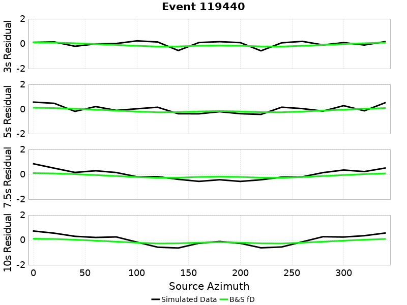 |
|  |  |
|  |  |
|  |  |
|  |  |
|  |  |
|  | 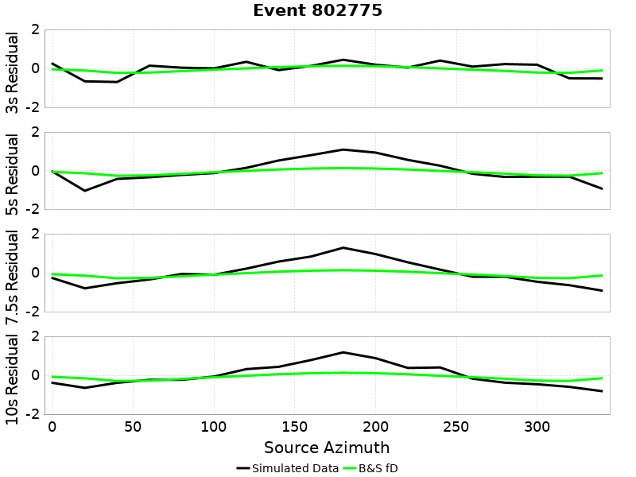 |
|  |  |
|  |  |
|  | 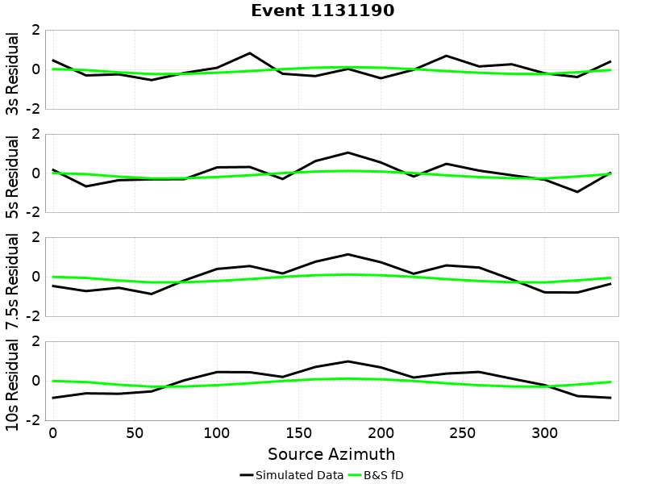 |
|  |  |
|  |  |
|  |  |
|  |  |
| 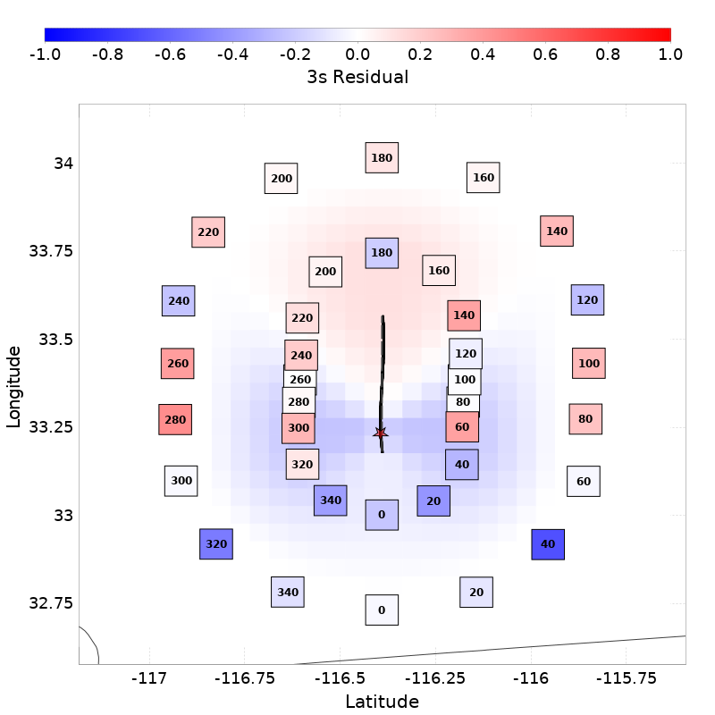 |  |
|  |  |
|  |  |
|  | 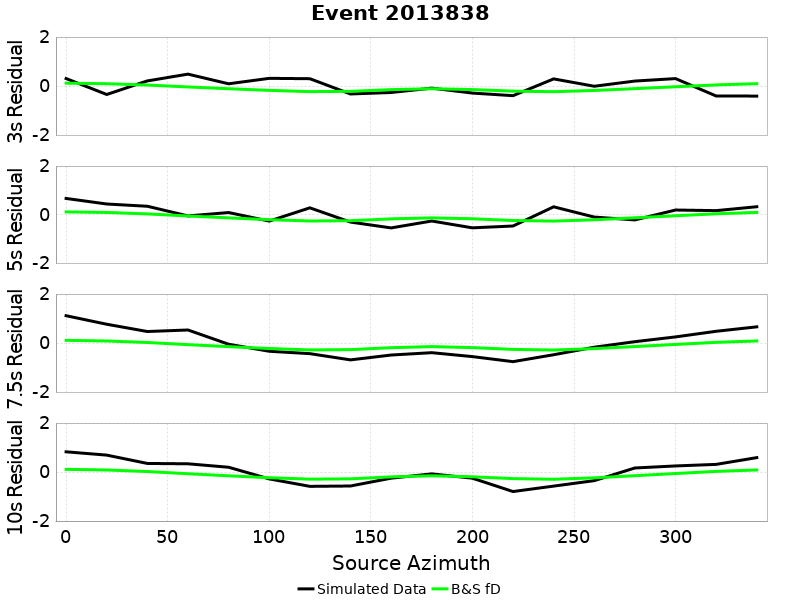 |
|  |  |
|  |  |
|  |  |
|  |  |
|  |  |
|  |  |
|  |  |
|  |  |
|  |  |
|  |  |
|  |  |
|  | 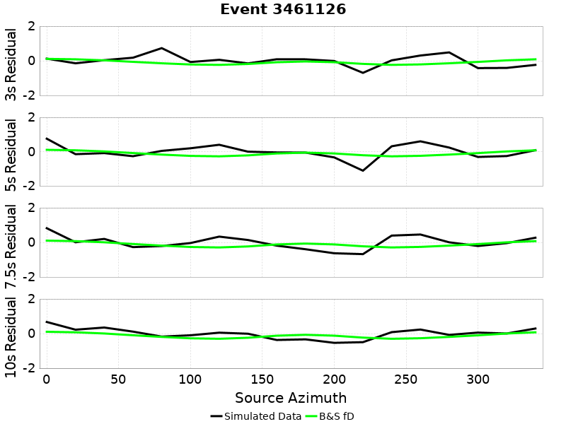 |
|  |  |
|  |  |
|  | 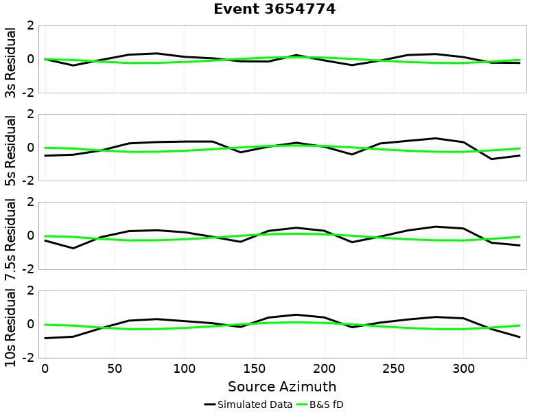 |
|  |  |
|  |  |
|  |  |
|  |  |
|  |  |
|  |  |
|  |  |
|  |  |
|  |  |
|  | 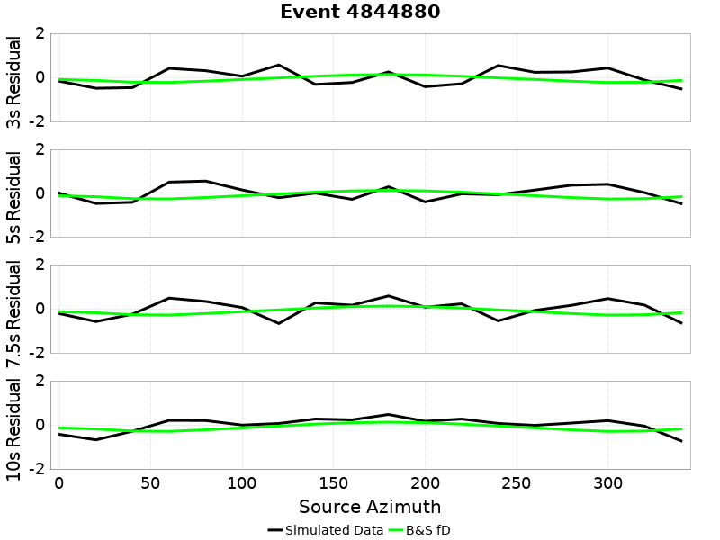 |
|  |  |
|  |  |
|  |  |
|  |  |
|  | 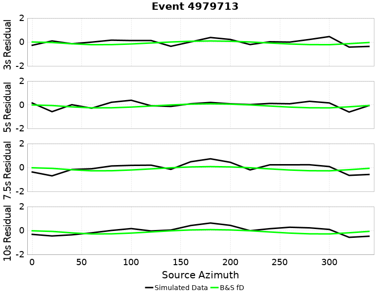 |
|  |  |
|  |  |
|  |  |
|  |  |
|  |  |
|  |  |
|  |  |
|  |  |
|  |  |
|  |  |
|  |  |
|  |  |
|  |  |
|  |  |
|  |  |
|  |  |
|  |  |
|  |  |
|  |  |
|  |  |
|  |  |
|  |  |
|  |  |
|  | 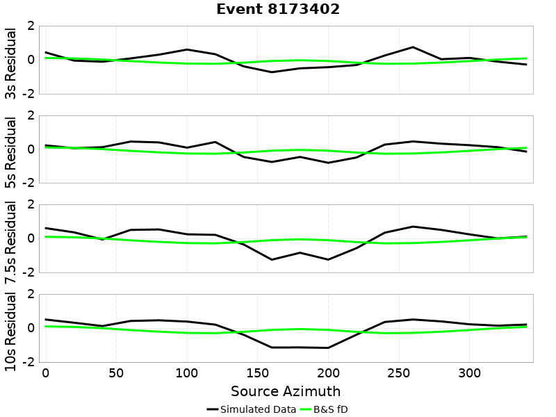 |
|  |  |
|  |  |
|  |  |
|  |  |
|  |  |
| 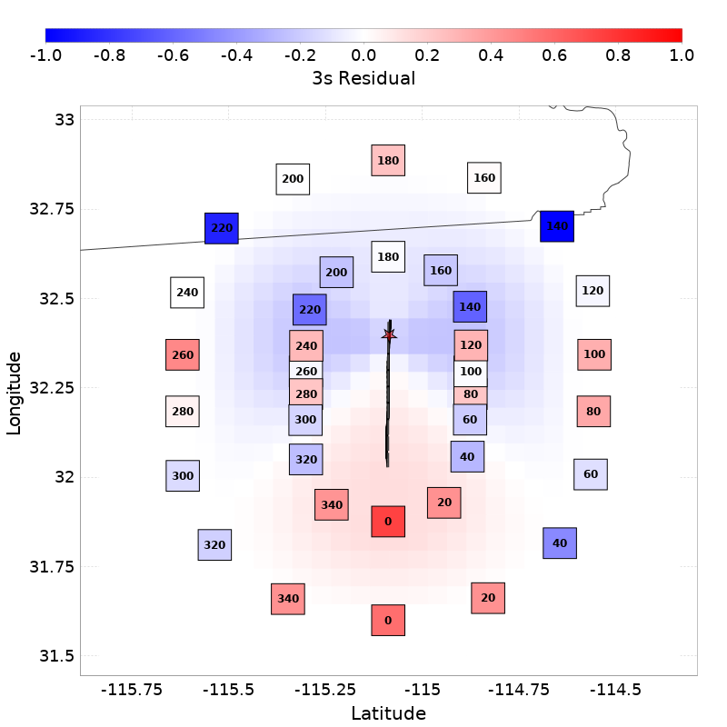 |  |
|  |  |
|  |  |
|  |  |
|  |  |
|  |  |
|  |  |
|  |  |
|  |  |
|  |  |
| 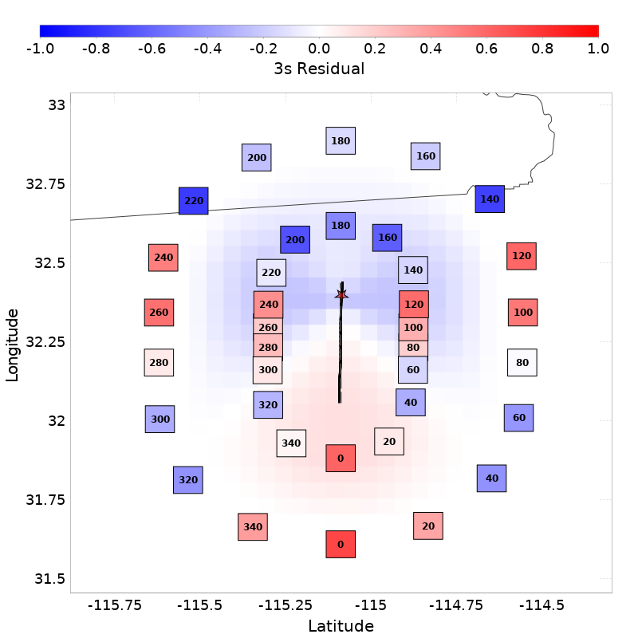 |  |
|  |  |
|  |  |
|  |  |
|  |  |
|  |  |
|  |  |
|  |  |
|  |  |
|  |  |
|  |  |
|  |  |

