# Bruce 2585 1myr Rotated Rupture Variability, M6.6 SS Rel

This exercise uses translations and rotations to estimate ground motion variability from different sources. We begin by selecting a subset of similar ruptures which match a set of criteria (in this case, M6.6, Vertical Strike-Slip with Surface Rupture (relaxed)). Each rupture is then reoriented such that its strike (following the Aki & Richards 1980 convention) is 0 degrees (due North, dipping to the right for normal or reverse ruptures). For each site, ruptures are translated such that their scalar seismic moment centroid is directly North of the site, and their 3-dimensional distance (Rrup) is as specified (we consider 3 distance[s] here).

We then  perform various rotations. We rotate the rupture in place around its centroid, holding the site-to-source centroid path and Rrup constant (henceforth 'Rupture Strike'). We also rotate ruptures around the site, holding Rrup and source orientation relative to the site constant but sampling different various paths (henceforth 'Path'). We do this for each unique combination of Rupture Strike, Path, Distance, Site, and Rupture.

*NOTE: This page uses the SCEC BBP to simulate a 1-dimensional velocity structure. Thus we expect no path variability, and plots of path variabilitiy are included only as verification of the method.*

[RSQSim Catalog Details](../#bruce-2585-1myr)

## Table Of Contents
* [Rupture Rotation Parameters](#rupture-rotation-parameters)
* [M6.6 SS Rel RSQSim Rupture Match Criteria](#m66-ss-rel-rsqsim-rupture-match-criteria)
  * [Fault Section Counts](#fault-section-counts)
* [Sites](#sites)
* [Result Summary Table](#result-summary-table)
  * [GMPE Table](#gmpe-table)
  * [Dist-Dependent Plot Table](#dist-dependent-plot-table)
* [Source-strike Variability](#source-strike-variability)
  * [Source-strike Variability Methodology](#source-strike-variability-methodology)
  * [20.0 km M6.6 Source-strike Results](#200-km-m66-source-strike-results)
  * [50.0 km M6.6 Source-strike Results](#500-km-m66-source-strike-results)
  * [100.0 km M6.6 Source-strike Results](#1000-km-m66-source-strike-results)
  * [All Distances M6.6 Source-strike Results](#all-distances-m66-source-strike-results)
* [Within-event, single-site Variability](#within-event-single-site-variability)
  * [Within-event, single-site Variability Methodology](#within-event-single-site-variability-methodology)
  * [20.0 km M6.6 Within-event, single-site Results](#200-km-m66-within-event-single-site-results)
  * [50.0 km M6.6 Within-event, single-site Results](#500-km-m66-within-event-single-site-results)
  * [100.0 km M6.6 Within-event, single-site Results](#1000-km-m66-within-event-single-site-results)
  * [All Distances M6.6 Within-event, single-site Results](#all-distances-m66-within-event-single-site-results)
* [Between-events Variability](#between-events-variability)
  * [Between-events Variability Methodology](#between-events-variability-methodology)
  * [20.0 km M6.6 Between-events Results](#200-km-m66-between-events-results)
  * [50.0 km M6.6 Between-events Results](#500-km-m66-between-events-results)
  * [100.0 km M6.6 Between-events Results](#1000-km-m66-between-events-results)
  * [All Distances M6.6 Between-events Results](#all-distances-m66-between-events-results)
* [Azumth Dependence](#azumth-dependence)
  * [Rupture Strike Dependence](#rupture-strike-dependence)
* [BBP PartB Comparison](#bbp-partb-comparison)
  * [BBP PartB Summary Table](#bbp-partb-summary-table)
  * [BBP PartB, M6.6, Vertical Strike-Slip with Surface Rupture (relaxed)](#bbp-partb-m66-vertical-strike-slip-with-surface-rupture-relaxed)
* [CSV Files](#csv-files)
## Rupture Rotation Parameters

| Quantity | Variations | Description |
|-----|-----|-----|
| Rupture | 400 | Unique (but similar in faulting style and magnitude) ruptures which match the given scenario. |
| Site | 1 | Unique site locations. If 3-d, each will have unique velocity profiles. |
| Rupture Strike | 18 | Rupture strike conforming to the Aki & Richards (1980) convention, where dipping faults dip to the right of the rupture. If path rotation is also performed, this azimuth is relative to the path. |
| Path | 1 | Path from the site to the centroid of the rupture, in azimuthal degrees (0 is North) |
| Distance | 20.0, 50.0, 100.0 km | 3-dimensional distance between the site and the rupture surface. |
| **Total # Simulations** | **21600** | Total number of combinations of the above. |

## M6.6 SS Rel RSQSim Rupture Match Criteria
*[(top)](#table-of-contents)*

We condisder 400 events in the catalog which match the following criteria:

* M=[6.55,6.65]
* Ztor=[0.0,1.0]
* Rake=[-180,-170] or [-10,10] or [170,180]
* Dip=90.0
* Linear rupture (max 20.0% deviation from ideal)

### Fault Section Counts
*[(top)](#table-of-contents)*

This tables gives a list of all fault sections which participate in the ruptures matching the above criteria. Many ruptures include multiple sections, so the sum of counts may be larger than the number of events.

| Section Name | Participation Count |
|-----|-----|
| Cerro Prieto | 64 |
| San Andreas (Coachella) rev | 49 |
| Mendocino | 31 |
| Garlock (West) | 20 |
| Garlock (Central) | 16 |
| Hunting Creek - Berryessa 2011 CFM | 15 |
| San Jacinto (San Bernardino) | 14 |
| Elsinore (Glen Ivy) rev | 11 |
| San Jacinto (Lytle Creek connector) | 10 |
| San Gregorio (North) 2011 CFM | 10 |
| Rose Canyon | 8 |
| San Andreas (San Bernardino S) | 8 |
| Death Valley (So) | 8 |
| San Jacinto (Clark) rev | 8 |
| Palos Verdes | 8 |
| Bartlett Springs 2011 CFM | 8 |
| San Andreas (Offshore) 2011 CFM | 8 |
| Honey Lake 2011 CFM | 7 |
| Laguna Salada | 7 |
| Hunting Creek - Bartlett Springs connector 2011 | 6 |
| San Jacinto (Coyote Creek) | 6 |
| San Andreas (Creeping Section) 2011 CFM | 6 |
| San Diego Trough north alt1 | 5 |
| San Andreas (North Coast) 2011 CFM | 4 |
| San Diego Trough south | 4 |
| San Andreas (San Bernardino N) | 4 |
| Lenwood-Lockhart-Old Woman Springs | 4 |
| Cady | 4 |
| Ortigalita (North) | 4 |
| Superstition Hills | 3 |
| White Mountains | 3 |
| San Andreas (Peninsula) 2011 CFM | 3 |
| Coronado Bank alt1 | 2 |
| Ortigalita (South) | 2 |
| Newport-Inglewood (Offshore) | 2 |
| Johnson Valley (No) 2011 rev | 2 |
| Concord 2011 CFM | 2 |
| Paradise | 2 |
| Calico-Hidalgo | 2 |
| San Andreas (Carrizo) rev | 2 |
| Blue Cut | 2 |
| Collayami 2011 CFM | 2 |
| Elsinore (Stepovers Combined) | 1 |
| Manix-Afton Hills | 1 |
| Gravel Hills-Harper Lk | 1 |
| Pisgah-Bullion Mtn-Mesquite Lk | 1 |
| Brawley (Seismic Zone) alt 1 | 1 |
| San Andreas (Cholame) rev | 1 |
| Sargent 2011 CFM | 1 |
| Pinto Mtn | 1 |
| Coyote Lake | 1 |
| San Andreas (Big Bend) | 1 |
| San Jacinto (Borrego) | 1 |
| Mohawk Valley 2011 CFM | 1 |
| San Jacinto (San Jacinto Valley) rev | 1 |
| Baker | 1 |
| Ludlow | 1 |
| Owens Valley | 1 |
| San Andreas (Parkfield) | 1 |
| Homestead Valley 2011 | 1 |
| Cleghorn Pass | 1 |
| Death Valley (No) | 1 |
| San Jacinto (Stepovers Combined) | 1 |
| Eureka Peak | 1 |

## Sites

| Name | Location | Vs30 (m/s) | Z1.0 (km) | Z2.5 (km) |
|-----|-----|-----|-----|-----|
| USC | *34.0192, -118.286* | 500 | N/A | N/A |

## Result Summary Table

| Type | Notation | Distance | T-independent Std. Dev. | 3s Std. Dev. | 5s Std. Dev. | 7.5s Std. Dev. | 10s Std. Dev. |
|-----|-----|-----|-----|-----|-----|-----|-----|
| Source-strike | &phi;s | 20 km | 0.36 | 0.39 | 0.4 | 0.31 | 0.24 |
| Source-strike | &phi;s | 50 km | 0.47 | 0.45 | 0.48 | 0.52 | 0.54 |
| Source-strike | &phi;s | 100 km | 0.48 | 0.45 | 0.52 | 0.56 | 0.5 |
| Source-strike | &phi;s | (all) | 0.44 | 0.43 | 0.47 | 0.48 | 0.45 |
| Within-event, single-site | &phi;SS | 20 km | 0.36 | 0.39 | 0.4 | 0.31 | 0.24 |
| Within-event, single-site | &phi;SS | 50 km | 0.47 | 0.45 | 0.48 | 0.52 | 0.54 |
| Within-event, single-site | &phi;SS | 100 km | 0.48 | 0.45 | 0.52 | 0.56 | 0.5 |
| Within-event, single-site | &phi;SS | (all) | 0.44 | 0.43 | 0.47 | 0.48 | 0.45 |
| Between-events | &tau; | 20 km | 0.28 | 0.25 | 0.27 | 0.36 | 0.38 |
| Between-events | &tau; | 50 km | 0.3 | 0.26 | 0.31 | 0.38 | 0.39 |
| Between-events | &tau; | 100 km | 0.29 | 0.24 | 0.32 | 0.39 | 0.41 |
| Between-events | &tau; | (all) | 0.29 | 0.25 | 0.3 | 0.37 | 0.39 |

### GMPE Table
*[(top)](#table-of-contents)*

| Type | Notation | Distance | ASK2014 3s | ASK2014 5s | ASK2014 7.5s | ASK2014 10s | BSSA2014 3s | BSSA2014 5s | BSSA2014 7.5s | BSSA2014 10s | CB2014 3s | CB2014 5s | CB2014 7.5s | CB2014 10s | CY2014 3s | CY2014 5s | CY2014 7.5s | CY2014 10s |
|-----|-----|-----|-----|-----|-----|-----|-----|-----|-----|-----|-----|-----|-----|-----|-----|-----|-----|-----|
| Source-strike | &phi;SS | 20 km | 0.48 | 0.5 | 0.49 | 0.48 | 0.55 | 0.54 | 0.54 | 0.54 | 0.55 | 0.51 | 0.49 | 0.47 | 0.51 | 0.53 | 0.52 | 0.51 |
| Source-strike | &phi;SS | 50 km | 0.48 | 0.5 | 0.49 | 0.48 | 0.55 | 0.54 | 0.54 | 0.54 | 0.55 | 0.51 | 0.49 | 0.47 | 0.52 | 0.53 | 0.52 | 0.51 |
| Source-strike | &phi;SS | 100 km | 0.48 | 0.5 | 0.49 | 0.48 | 0.55 | 0.54 | 0.54 | 0.54 | 0.55 | 0.51 | 0.49 | 0.47 | 0.52 | 0.53 | 0.52 | 0.51 |
| Within-event, single-site | &phi;SS | 20 km | 0.48 | 0.5 | 0.49 | 0.48 | 0.55 | 0.54 | 0.54 | 0.54 | 0.55 | 0.51 | 0.49 | 0.47 | 0.51 | 0.53 | 0.52 | 0.51 |
| Within-event, single-site | &phi;SS | 50 km | 0.48 | 0.5 | 0.49 | 0.48 | 0.55 | 0.54 | 0.54 | 0.54 | 0.55 | 0.51 | 0.49 | 0.47 | 0.52 | 0.53 | 0.52 | 0.51 |
| Within-event, single-site | &phi;SS | 100 km | 0.48 | 0.5 | 0.49 | 0.48 | 0.55 | 0.54 | 0.54 | 0.54 | 0.55 | 0.51 | 0.49 | 0.47 | 0.52 | 0.53 | 0.52 | 0.51 |
| Between-events | &tau; | 20 km | 0.38 | 0.38 | 0.38 | 0.38 | 0.3 | 0.33 | 0.34 | 0.35 | 0.35 | 0.4 | 0.42 | 0.39 | 0.33 | 0.33 | 0.34 | 0.34 |
| Between-events | &tau; | 50 km | 0.38 | 0.38 | 0.38 | 0.38 | 0.3 | 0.33 | 0.34 | 0.35 | 0.35 | 0.4 | 0.42 | 0.39 | 0.33 | 0.33 | 0.34 | 0.34 |
| Between-events | &tau; | 100 km | 0.38 | 0.38 | 0.38 | 0.38 | 0.3 | 0.33 | 0.34 | 0.35 | 0.35 | 0.4 | 0.42 | 0.39 | 0.33 | 0.34 | 0.34 | 0.34 |

### Dist-Dependent Plot Table
*[(top)](#table-of-contents)*

| **&phi;s** |  |
|-----|-----|
| **&phi;SS** | 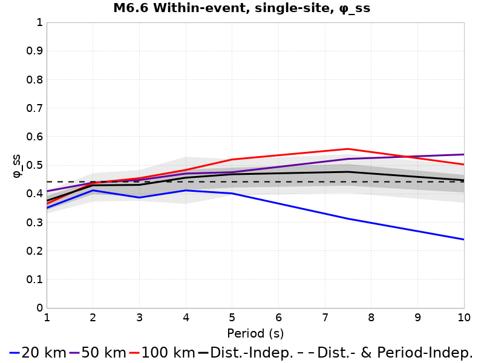 |
| **&tau;** | 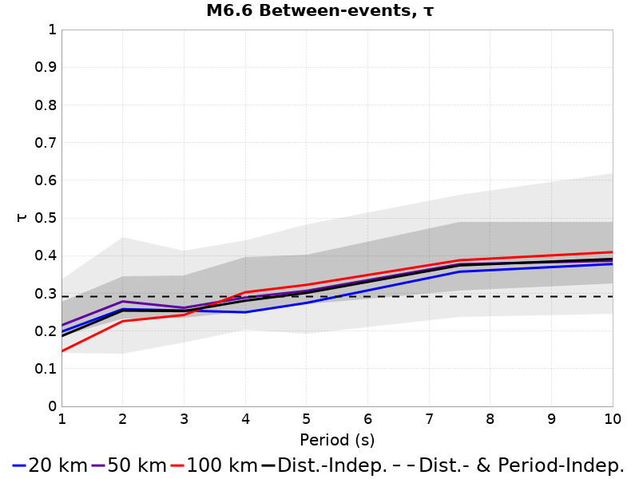 |

## Source-strike Variability
*[(top)](#table-of-contents)*

### Source-strike Variability Methodology
*[(top)](#table-of-contents)*

Source-strike variability, denoted &phi;s in Aki & Richards (1980), is computed separately for each:

* Site *[1 unique]*
* Distance *[3 unique]*

Then, for each unique combination of:

* Rupture *[400 unique]*
* Path *[1 unique]*

we compute residuals, &delta;Wes, of the natural-log ground motions (relative to the median), computed across all 18 combinations of:

* Rupture Strike *[18 unique]*

We take &phi;s to be the standard deviation of all residuals, &delta;Wes, across each combination of Rupture, Path.

We also compute distance-independent &phi;s, which is computed as the standard deviation of all residuals, &delta;Wes, across all distances. Each residual is still computed relative to the log-median ground motion at it's distance.

Here is an exmample with 5 rotations, which would be repeated for each combination of [Rupture, Path]. The site is shown with a blue square, and initially oriented rupture in bold with its hypocenter as a red star and centroid a green circle. Rotations of that rupture are in gray:

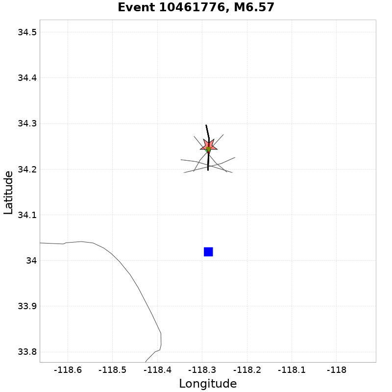

### 20.0 km M6.6 Source-strike Results
*[(top)](#table-of-contents)*

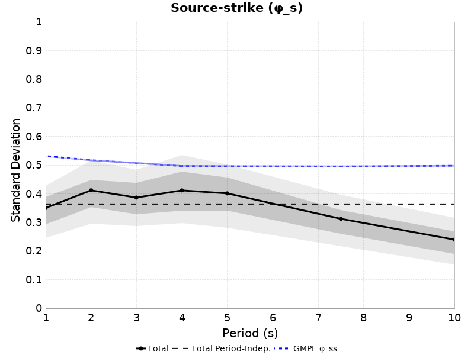

| 3s &phi;s | Total | Mean | Median | Range | 5s &phi;s | Total | Mean | Median | Range | 7.5s &phi;s | Total | Mean | Median | Range | 10s &phi;s | Total | Mean | Median | Range |
|-----|-----|-----|-----|-----|-----|-----|-----|-----|-----|-----|-----|-----|-----|-----|-----|-----|-----|-----|-----|
|  | 0.39 | 0.38 | 0.38 | [0.11 0.63] |  | 0.4 | 0.4 | 0.4 | [0.13 0.64] |  | 0.31 | 0.31 | 0.3 | [0.14 0.6] |  | 0.24 | 0.23 | 0.22 | [0.06 0.48] |

We compute uncertainties on &phi;s through downsampling the rotational synthetic data to match the sample sizes used in the ASK 2014 regressions. We search the ASK dataset for ruptures with the same mechanism, magnitude in the range [6.4 6.8], and distance within the range [10.0 30.0] km. We throw out any events with only 1 recording, leaving us with 4 events and a total of 37 recordings. We then downsample our simulated data 100 times, and compute &phi;s from each sample. The 95% confidence range from these samples is plotted as a shaded region above, and listed in the table below.

| Period (s) | Full &phi;s | Downsampled median &phi;s | Downsampled &phi;s std. dev. | Downsampled &phi;s 68% conf range | Downsampled &phi;s 95% conf range |
|-----|-----|-----|-----|-----|-----|
| T-independent | 0.36 | 0.36 | 0.03 | [0.32 0.39] | [0.3 0.41] |
| 1 | 0.35 | 0.34 | 0.05 | [0.29 0.39] | [0.25 0.43] |
| 2 | 0.41 | 0.4 | 0.05 | [0.35 0.45] | [0.3 0.52] |
| 3 | 0.39 | 0.38 | 0.05 | [0.33 0.44] | [0.29 0.48] |
| 4 | 0.41 | 0.4 | 0.06 | [0.34 0.48] | [0.3 0.54] |
| 5 | 0.4 | 0.39 | 0.06 | [0.34 0.46] | [0.28 0.5] |
| 7.5 | 0.31 | 0.3 | 0.04 | [0.26 0.34] | [0.22 0.4] |
| 10 | 0.24 | 0.23 | 0.04 | [0.19 0.27] | [0.15 0.32] |

These plots show the dependence of &phi;s to the number of events included and the number of recordings per event. The left plot holds the number of recordings per event fixed at the full set of simulated recordings (18), varying the number of events. The right plot holds the number of events fixed at the full set of simulated events (400), varying the number of recordings per event.

| Period | Event Count Dependence | Recordings/Event Dependence |
|-----|-----|-----|
| Period Indep. |  |  |
| 1s | 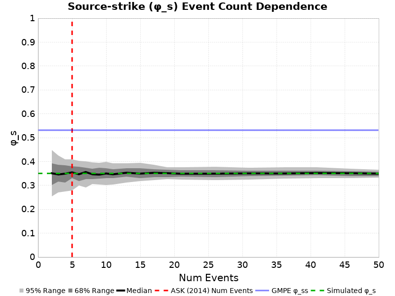 | 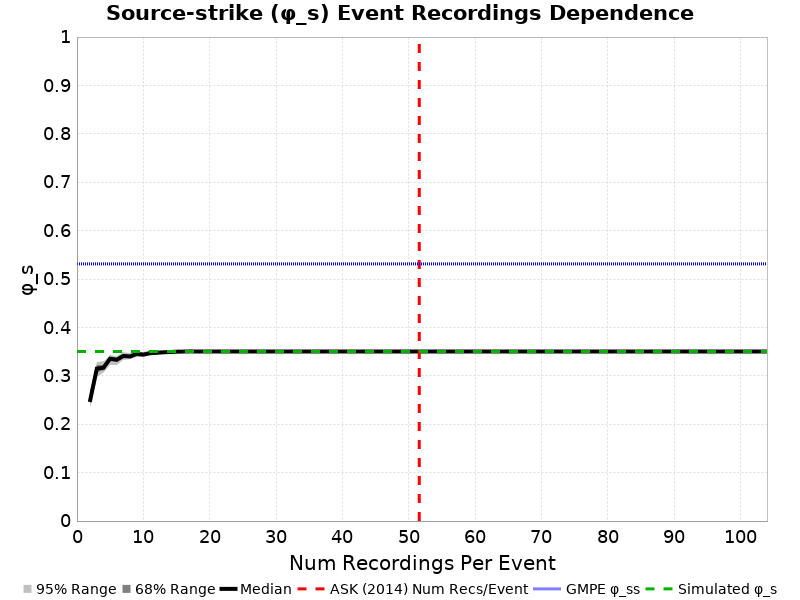 |

These plots show the distribution of period-independent downsampled &phi;s for each site.

| **USC** |
|-----|
| 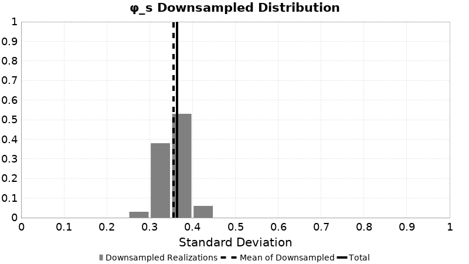 |

Here are plots of the histogram of &phi;s for each individual rupture, from which we compute a total &phi;s

| 3s | 5s |
|-----|-----|
| 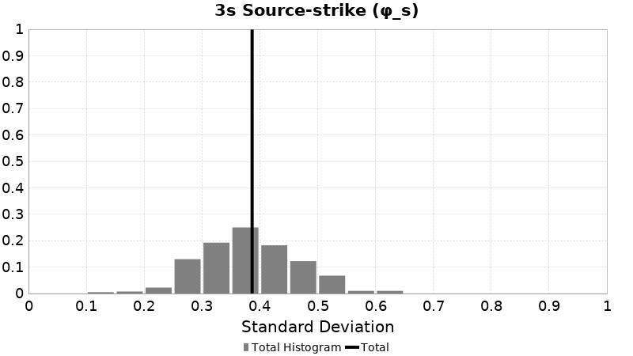 | 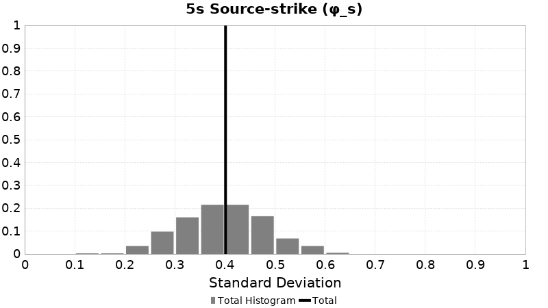 |
| 7.5s | 10s |
| 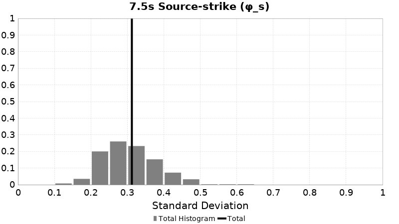 | 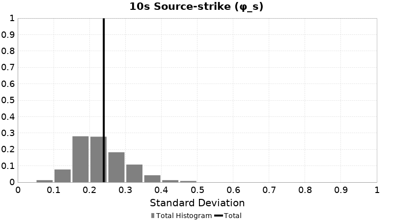 |

### 50.0 km M6.6 Source-strike Results
*[(top)](#table-of-contents)*

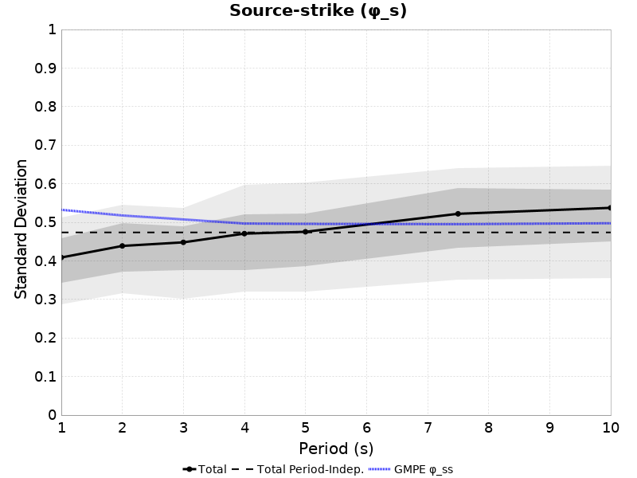

| 3s &phi;s | Total | Mean | Median | Range | 5s &phi;s | Total | Mean | Median | Range | 7.5s &phi;s | Total | Mean | Median | Range | 10s &phi;s | Total | Mean | Median | Range |
|-----|-----|-----|-----|-----|-----|-----|-----|-----|-----|-----|-----|-----|-----|-----|-----|-----|-----|-----|-----|
|  | 0.45 | 0.45 | 0.44 | [0.22 0.7] |  | 0.48 | 0.47 | 0.48 | [0.23 0.78] |  | 0.52 | 0.52 | 0.52 | [0.19 0.77] |  | 0.54 | 0.54 | 0.55 | [0.17 0.72] |

We compute uncertainties on &phi;s through downsampling the rotational synthetic data to match the sample sizes used in the ASK 2014 regressions. We search the ASK dataset for ruptures with the same mechanism, magnitude in the range [6.4 6.8], and distance within the range [40.0 60.0] km. We throw out any events with only 1 recording, leaving us with 3 events and a total of 33 recordings. We then downsample our simulated data 100 times, and compute &phi;s from each sample. The 95% confidence range from these samples is plotted as a shaded region above, and listed in the table below.

*WARNING: Some real events had more recordings than we have rotations per event, so our dataset for this test is smaller. We are using 2 fewer data points.*

| Period (s) | Full &phi;s | Downsampled median &phi;s | Downsampled &phi;s std. dev. | Downsampled &phi;s 68% conf range | Downsampled &phi;s 95% conf range |
|-----|-----|-----|-----|-----|-----|
| T-independent | 0.47 | 0.46 | 0.04 | [0.42 0.5] | [0.37 0.54] |
| 1 | 0.41 | 0.4 | 0.05 | [0.34 0.46] | [0.29 0.51] |
| 2 | 0.44 | 0.42 | 0.06 | [0.37 0.5] | [0.32 0.55] |
| 3 | 0.45 | 0.43 | 0.06 | [0.38 0.49] | [0.3 0.54] |
| 4 | 0.47 | 0.45 | 0.07 | [0.38 0.52] | [0.32 0.6] |
| 5 | 0.48 | 0.46 | 0.07 | [0.39 0.52] | [0.32 0.6] |
| 7.5 | 0.52 | 0.51 | 0.07 | [0.43 0.59] | [0.35 0.64] |
| 10 | 0.54 | 0.52 | 0.07 | [0.45 0.59] | [0.36 0.65] |

These plots show the dependence of &phi;s to the number of events included and the number of recordings per event. The left plot holds the number of recordings per event fixed at the full set of simulated recordings (18), varying the number of events. The right plot holds the number of events fixed at the full set of simulated events (400), varying the number of recordings per event.

| Period | Event Count Dependence | Recordings/Event Dependence |
|-----|-----|-----|
| Period Indep. | 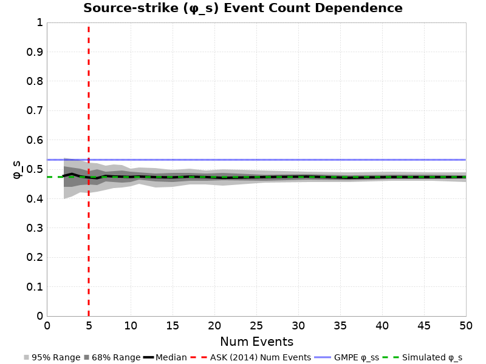 | 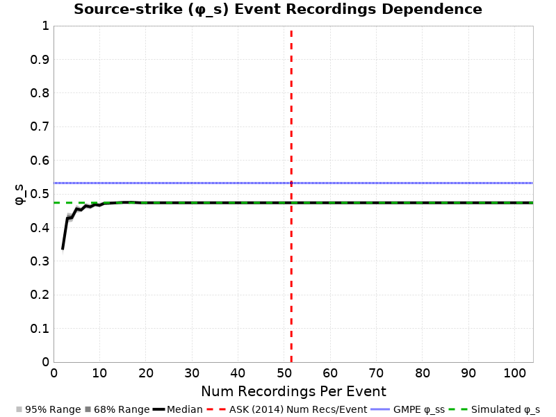 |
| 1s | 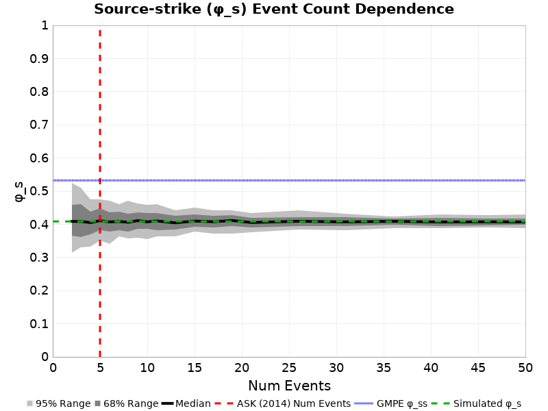 | 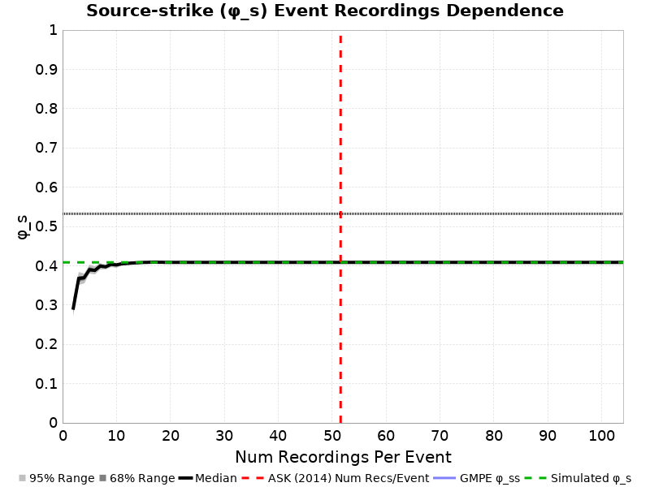 |

These plots show the distribution of period-independent downsampled &phi;s for each site.

| **USC** |
|-----|
| 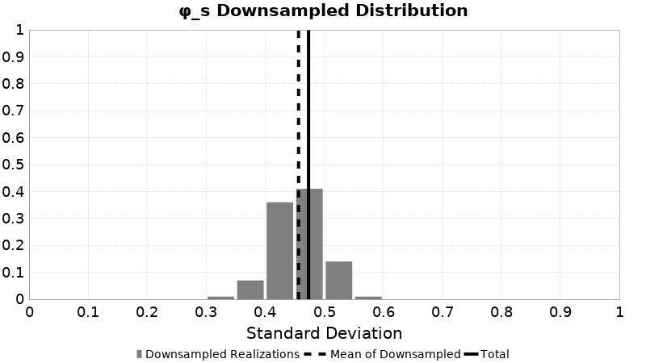 |

Here are plots of the histogram of &phi;s for each individual rupture, from which we compute a total &phi;s

| 3s | 5s |
|-----|-----|
| 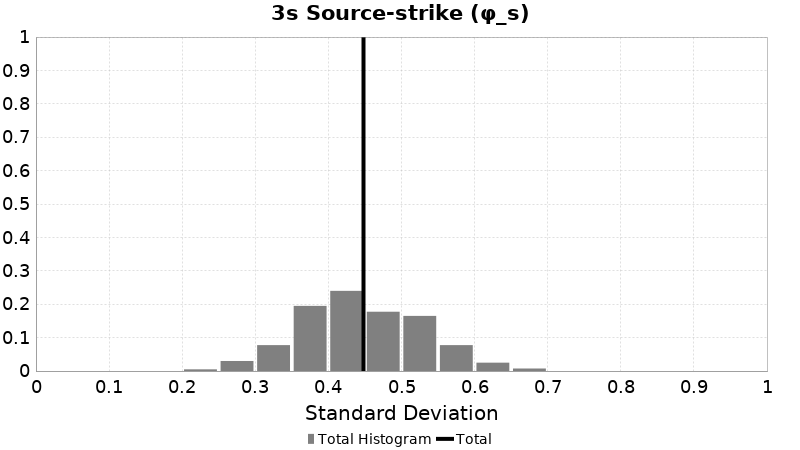 | 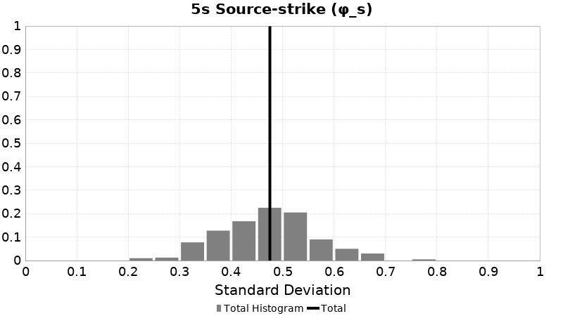 |
| 7.5s | 10s |
| 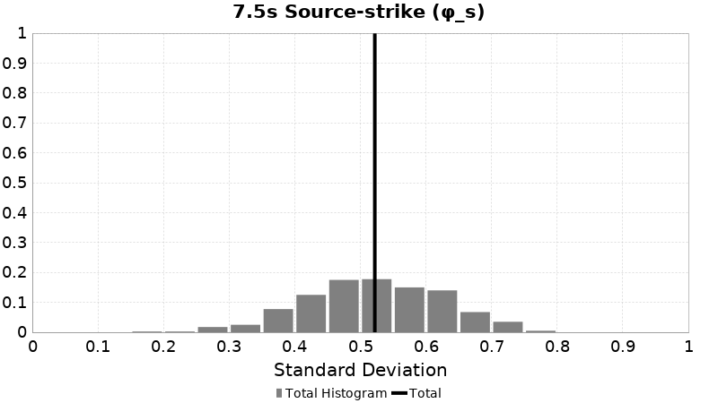 | 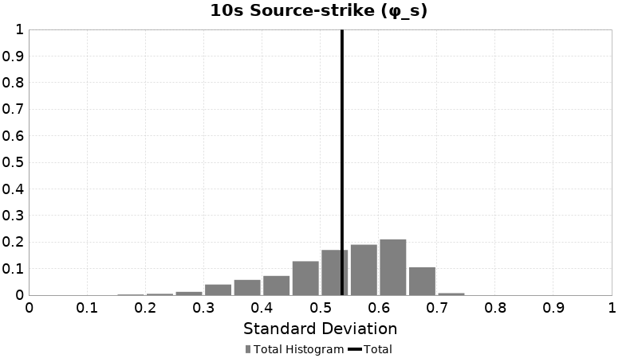 |

### 100.0 km M6.6 Source-strike Results
*[(top)](#table-of-contents)*

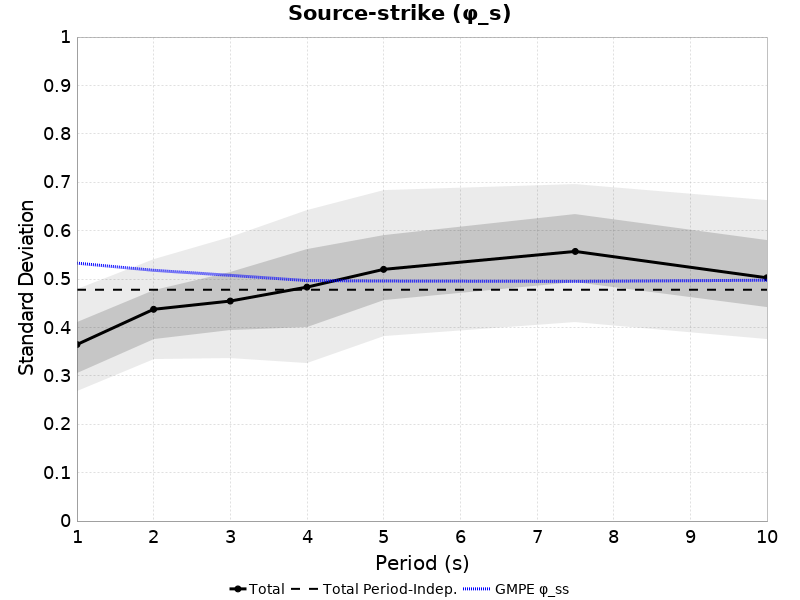

| 3s &phi;s | Total | Mean | Median | Range | 5s &phi;s | Total | Mean | Median | Range | 7.5s &phi;s | Total | Mean | Median | Range | 10s &phi;s | Total | Mean | Median | Range |
|-----|-----|-----|-----|-----|-----|-----|-----|-----|-----|-----|-----|-----|-----|-----|-----|-----|-----|-----|-----|
|  | 0.45 | 0.45 | 0.45 | [0.24 0.69] |  | 0.52 | 0.52 | 0.52 | [0.23 0.82] |  | 0.56 | 0.56 | 0.57 | [0.15 0.79] |  | 0.5 | 0.5 | 0.51 | [0.18 0.78] |

We compute uncertainties on &phi;s through downsampling the rotational synthetic data to match the sample sizes used in the ASK 2014 regressions. We search the ASK dataset for ruptures with the same mechanism, magnitude in the range [6.4 6.8], and distance within the range [80.0 120.0] km. We throw out any events with only 1 recording, leaving us with 2 events and a total of 29 recordings. We then downsample our simulated data 100 times, and compute &phi;s from each sample. The 95% confidence range from these samples is plotted as a shaded region above, and listed in the table below.

*WARNING: Some real events had more recordings than we have rotations per event, so our dataset for this test is smaller. We are using 28 fewer data points.*

| Period (s) | Full &phi;s | Downsampled median &phi;s | Downsampled &phi;s std. dev. | Downsampled &phi;s 68% conf range | Downsampled &phi;s 95% conf range |
|-----|-----|-----|-----|-----|-----|
| T-independent | 0.48 | 0.48 | 0.04 | [0.44 0.52] | [0.41 0.57] |
| 1 | 0.36 | 0.34 | 0.05 | [0.31 0.41] | [0.27 0.48] |
| 2 | 0.44 | 0.42 | 0.05 | [0.38 0.48] | [0.33 0.54] |
| 3 | 0.45 | 0.46 | 0.06 | [0.39 0.51] | [0.34 0.59] |
| 4 | 0.48 | 0.49 | 0.08 | [0.4 0.56] | [0.33 0.64] |
| 5 | 0.52 | 0.52 | 0.07 | [0.46 0.59] | [0.38 0.68] |
| 7.5 | 0.56 | 0.58 | 0.07 | [0.49 0.63] | [0.41 0.7] |
| 10 | 0.5 | 0.52 | 0.07 | [0.44 0.58] | [0.38 0.66] |

These plots show the dependence of &phi;s to the number of events included and the number of recordings per event. The left plot holds the number of recordings per event fixed at the full set of simulated recordings (18), varying the number of events. The right plot holds the number of events fixed at the full set of simulated events (400), varying the number of recordings per event.

| Period | Event Count Dependence | Recordings/Event Dependence |
|-----|-----|-----|
| Period Indep. |  | 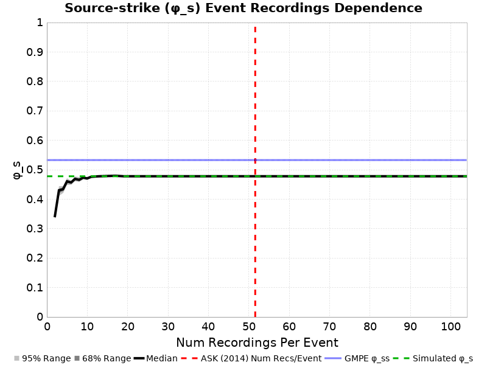 |
| 1s | 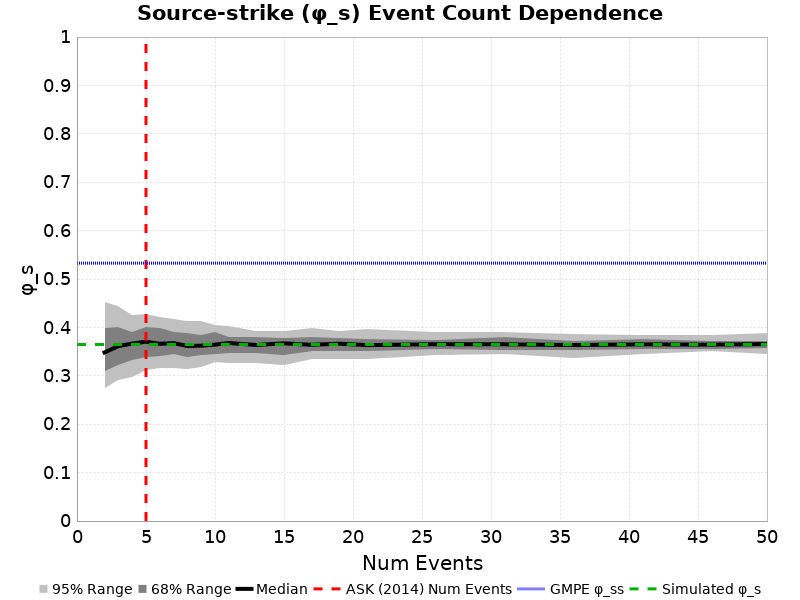 | 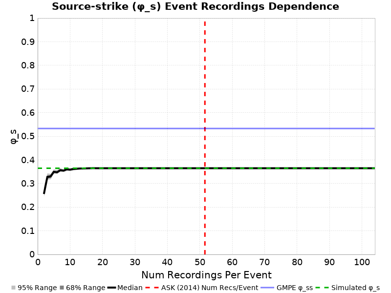 |

These plots show the distribution of period-independent downsampled &phi;s for each site.

| **USC** |
|-----|
| 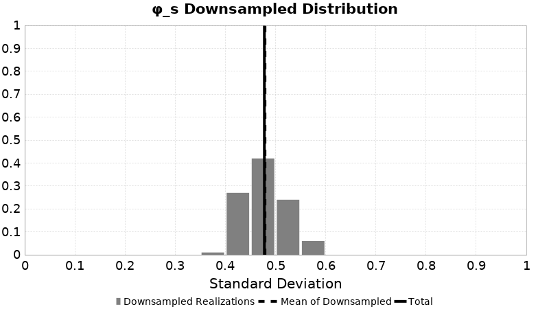 |

Here are plots of the histogram of &phi;s for each individual rupture, from which we compute a total &phi;s

| 3s | 5s |
|-----|-----|
| 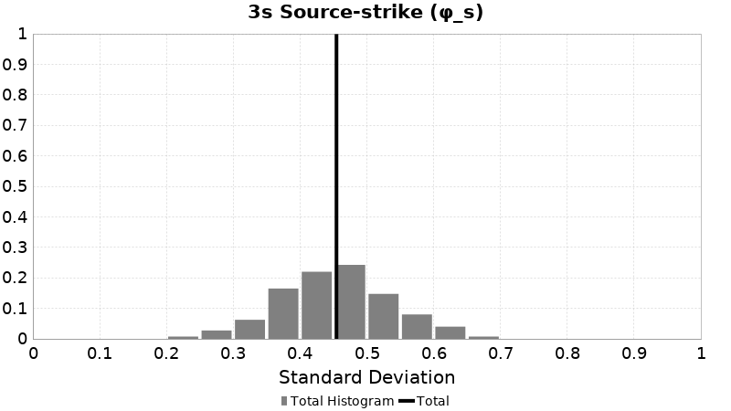 | 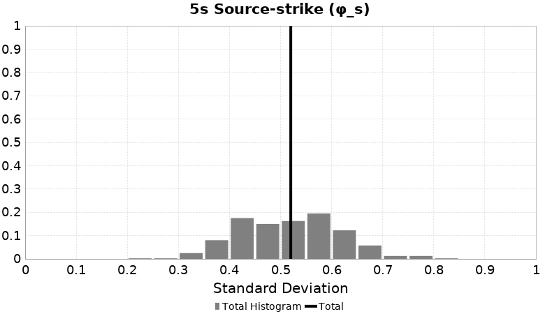 |
| 7.5s | 10s |
| 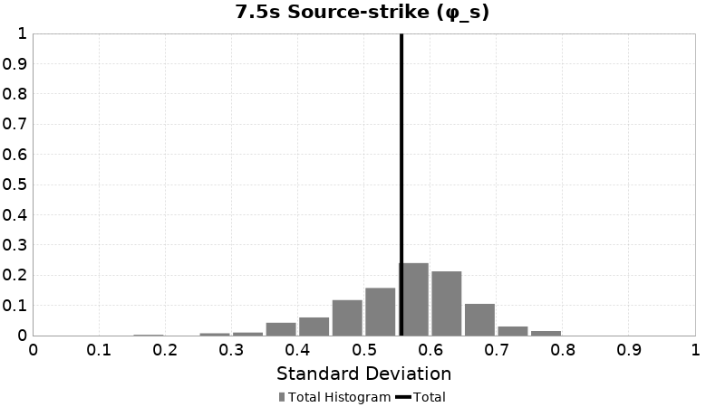 | 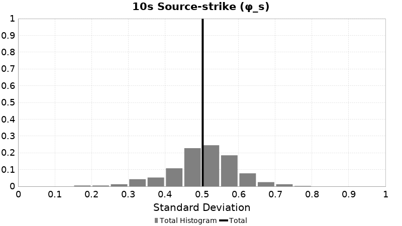 |

### All Distances M6.6 Source-strike Results
*[(top)](#table-of-contents)*

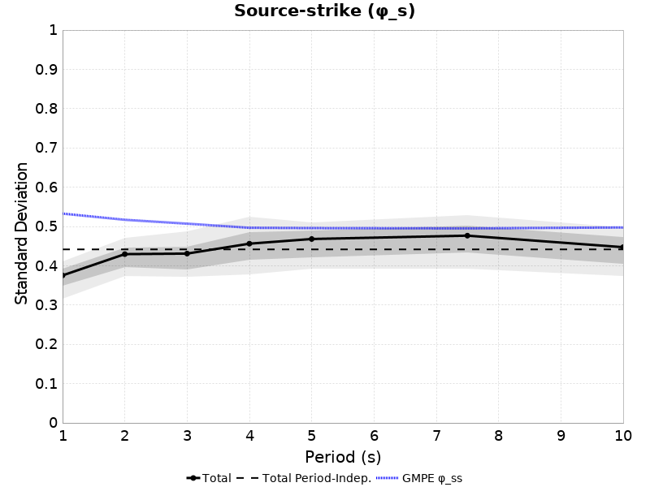

| 3s &phi;s | Total | Mean | Median | Range | 5s &phi;s | Total | Mean | Median | Range | 7.5s &phi;s | Total | Mean | Median | Range | 10s &phi;s | Total | Mean | Median | Range |
|-----|-----|-----|-----|-----|-----|-----|-----|-----|-----|-----|-----|-----|-----|-----|-----|-----|-----|-----|-----|
|  | 0.43 | 0.43 | 0.43 | [0.11 0.7] |  | 0.47 | 0.46 | 0.46 | [0.13 0.82] |  | 0.48 | 0.46 | 0.48 | [0.14 0.79] |  | 0.45 | 0.42 | 0.47 | [0.06 0.78] |

We compute uncertainties on &phi;s through downsampling the rotational synthetic data to match the sample sizes used in the ASK 2014 regressions. We search the ASK dataset for ruptures with the same mechanism, magnitude in the range [6.4 6.8], and all distances. We throw out any events with only 1 recording, leaving us with 5 events and a total of 144 recordings. We then downsample our simulated data 100 times, and compute &phi;s from each sample. The 95% confidence range from these samples is plotted as a shaded region above, and listed in the table below.

| Period (s) | Full &phi;s | Downsampled median &phi;s | Downsampled &phi;s std. dev. | Downsampled &phi;s 68% conf range | Downsampled &phi;s 95% conf range |
|-----|-----|-----|-----|-----|-----|
| T-independent | 0.44 | 0.43 | 0.02 | [0.41 0.46] | [0.39 0.48] |
| 1 | 0.38 | 0.37 | 0.02 | [0.35 0.39] | [0.32 0.41] |
| 2 | 0.43 | 0.42 | 0.02 | [0.4 0.45] | [0.37 0.47] |
| 3 | 0.43 | 0.42 | 0.03 | [0.39 0.45] | [0.37 0.49] |
| 4 | 0.46 | 0.45 | 0.04 | [0.41 0.49] | [0.38 0.52] |
| 5 | 0.47 | 0.46 | 0.03 | [0.42 0.49] | [0.39 0.51] |
| 7.5 | 0.48 | 0.46 | 0.03 | [0.43 0.5] | [0.39 0.53] |
| 10 | 0.45 | 0.43 | 0.03 | [0.4 0.47] | [0.37 0.5] |

These plots show the dependence of &phi;s to the number of events included and the number of recordings per event. The left plot holds the number of recordings per event fixed at the full set of simulated recordings (18), varying the number of events. The right plot holds the number of events fixed at the full set of simulated events (400), varying the number of recordings per event.

| Period | Event Count Dependence | Recordings/Event Dependence |
|-----|-----|-----|
| Period Indep. | 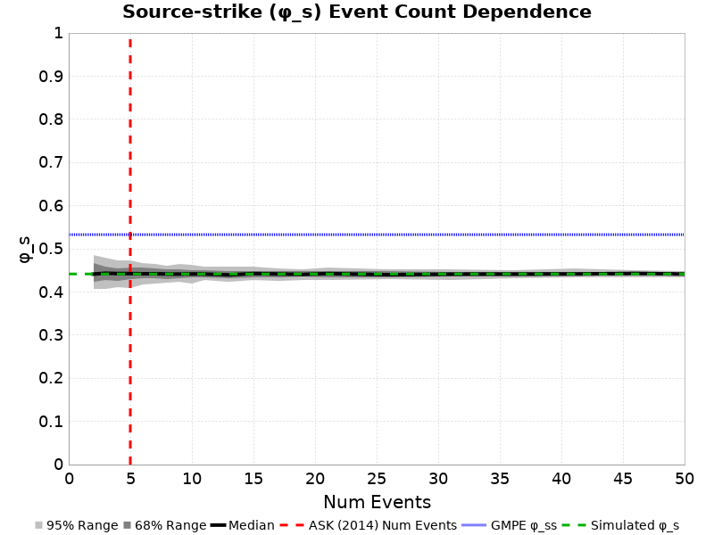 | 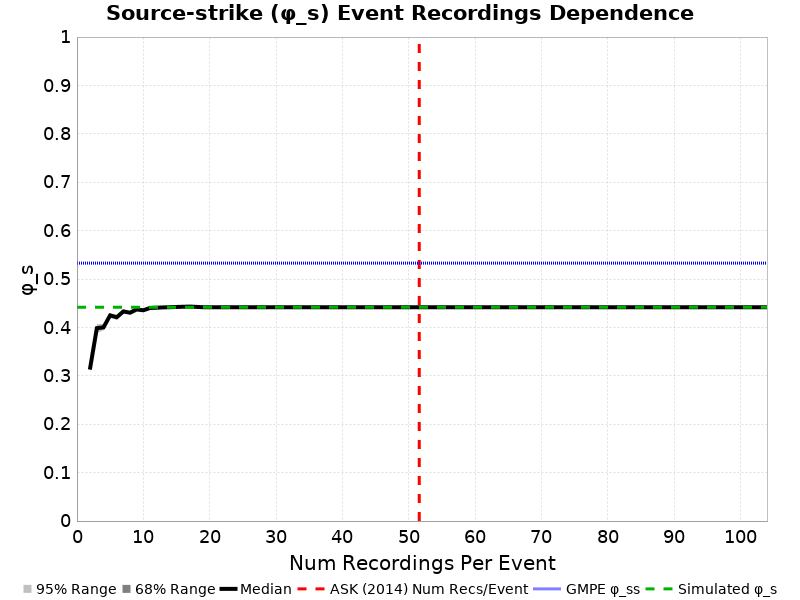 |
| 1s | 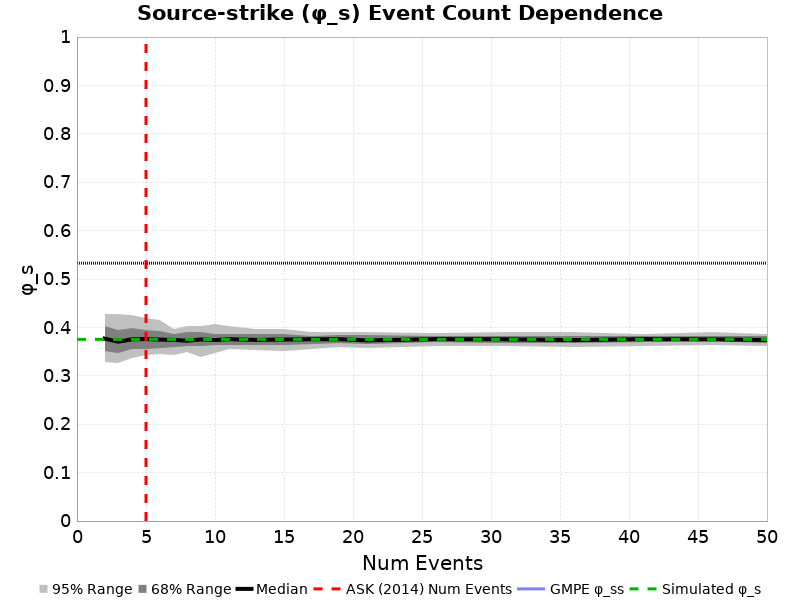 | 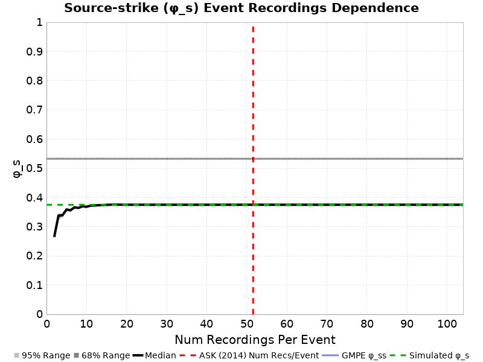 |

These plots show the distribution of period-independent downsampled &phi;s for each site.

| **USC** |
|-----|
| 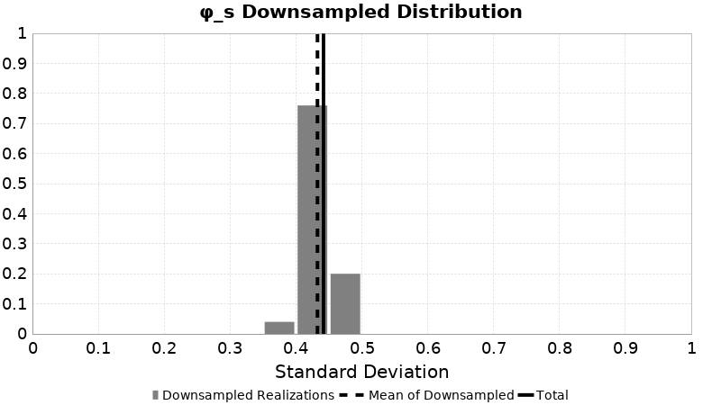 |

Here are plots of the histogram of &phi;s for each individual rupture, from which we compute a total &phi;s

| 3s | 5s |
|-----|-----|
| 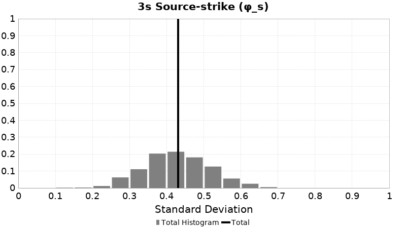 |  |
| 7.5s | 10s |
| 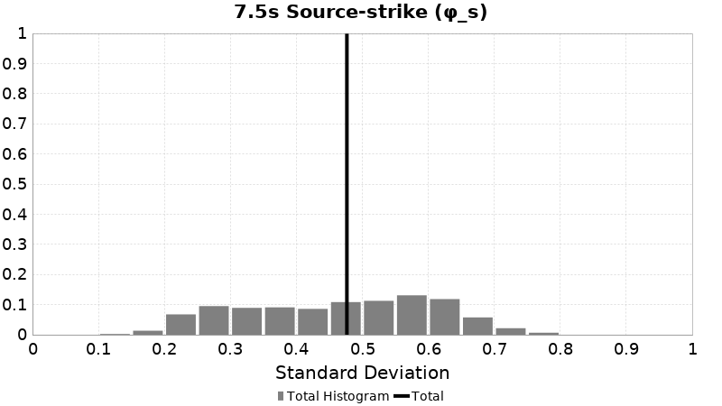 | 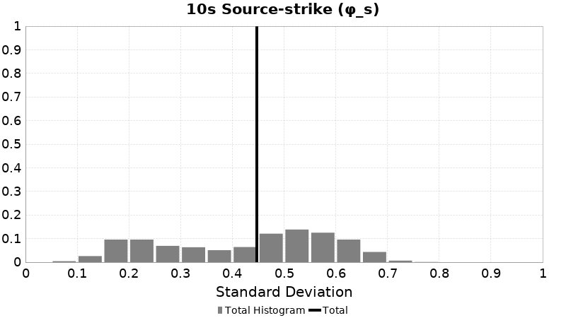 |

## Within-event, single-site Variability
*[(top)](#table-of-contents)*

### Within-event, single-site Variability Methodology
*[(top)](#table-of-contents)*

Within-event, single-site variability, denoted &phi;SS in Al Atik (2010), is computed separately for each:

* Site *[1 unique]*
* Distance *[3 unique]*

Then, for each unique combination of:

* Rupture *[400 unique]*

we compute residuals, &delta;Wes, of the natural-log ground motions (relative to the median), computed across all 18 combinations of:

* Rupture Strike *[18 unique]*
* Path *[1 unique]*

We take &phi;SS to be the standard deviation of all residuals, &delta;Wes, across each combination of Rupture.

We also compute distance-independent &phi;SS, which is computed as the standard deviation of all residuals, &delta;Wes, across all distances. Each residual is still computed relative to the log-median ground motion at it's distance.

Here is an exmample with 5 rotations, which would be repeated for each combination of [Rupture]. The site is shown with a blue square, and initially oriented rupture in bold with its hypocenter as a red star and centroid a green circle. Rotations of that rupture are in gray:

### 20.0 km M6.6 Within-event, single-site Results
*[(top)](#table-of-contents)*

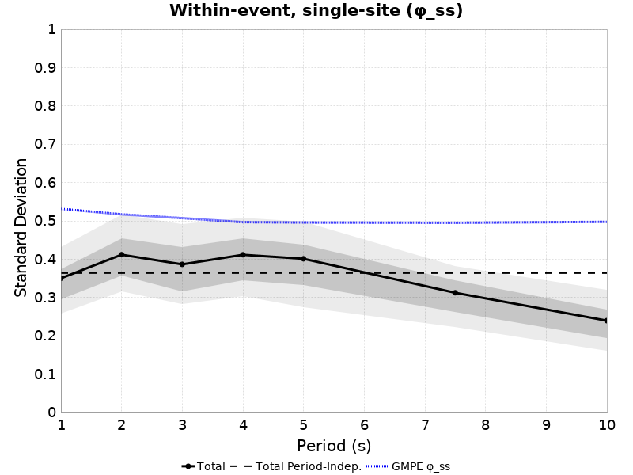

| 3s &phi;SS | Total | Mean | Median | Range | 5s &phi;SS | Total | Mean | Median | Range | 7.5s &phi;SS | Total | Mean | Median | Range | 10s &phi;SS | Total | Mean | Median | Range |
|-----|-----|-----|-----|-----|-----|-----|-----|-----|-----|-----|-----|-----|-----|-----|-----|-----|-----|-----|-----|
|  | 0.39 | 0.38 | 0.38 | [0.11 0.63] |  | 0.4 | 0.4 | 0.4 | [0.13 0.64] |  | 0.31 | 0.31 | 0.3 | [0.14 0.6] |  | 0.24 | 0.23 | 0.22 | [0.06 0.48] |

We compute uncertainties on &phi;SS through downsampling the rotational synthetic data to match the sample sizes used in the ASK 2014 regressions. We search the ASK dataset for ruptures with the same mechanism, magnitude in the range [6.4 6.8], and distance within the range [10.0 30.0] km. We throw out any events with only 1 recording, leaving us with 4 events and a total of 37 recordings. We then downsample our simulated data 100 times, and compute &phi;SS from each sample. The 95% confidence range from these samples is plotted as a shaded region above, and listed in the table below.

| Period (s) | Full &phi;SS | Downsampled median &phi;SS | Downsampled &phi;SS std. dev. | Downsampled &phi;SS 68% conf range | Downsampled &phi;SS 95% conf range |
|-----|-----|-----|-----|-----|-----|
| T-independent | 0.36 | 0.35 | 0.03 | [0.33 0.38] | [0.3 0.41] |
| 1 | 0.35 | 0.33 | 0.04 | [0.3 0.37] | [0.26 0.43] |
| 2 | 0.41 | 0.41 | 0.05 | [0.36 0.45] | [0.32 0.52] |
| 3 | 0.39 | 0.38 | 0.05 | [0.32 0.43] | [0.28 0.49] |
| 4 | 0.41 | 0.4 | 0.05 | [0.34 0.45] | [0.3 0.51] |
| 5 | 0.4 | 0.38 | 0.05 | [0.33 0.44] | [0.27 0.5] |
| 7.5 | 0.31 | 0.3 | 0.04 | [0.26 0.35] | [0.22 0.38] |
| 10 | 0.24 | 0.23 | 0.04 | [0.19 0.27] | [0.16 0.32] |

These plots show the dependence of &phi;SS to the number of events included and the number of recordings per event. The left plot holds the number of recordings per event fixed at the full set of simulated recordings (18), varying the number of events. The right plot holds the number of events fixed at the full set of simulated events (400), varying the number of recordings per event.

| Period | Event Count Dependence | Recordings/Event Dependence |
|-----|-----|-----|
| Period Indep. | 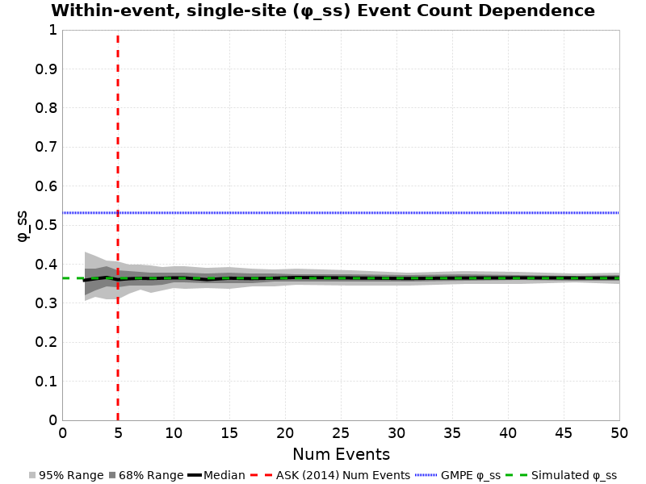 | 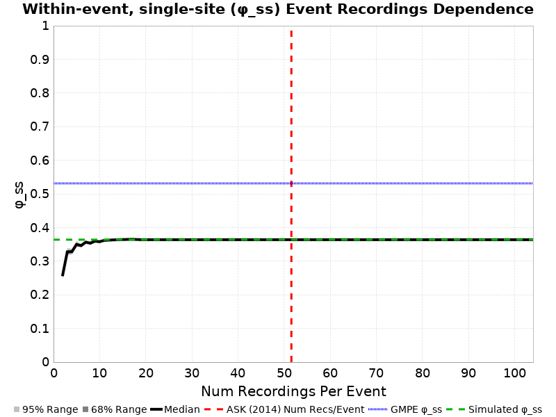 |
| 1s | 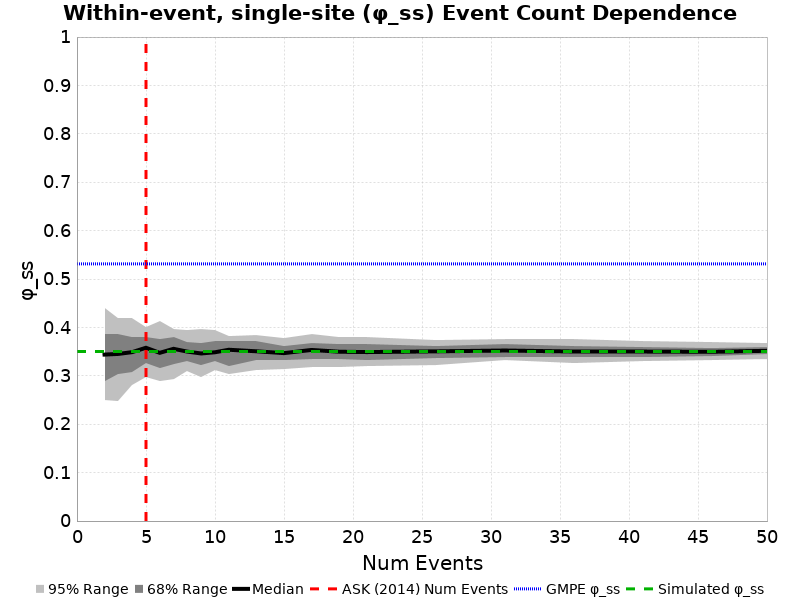 | 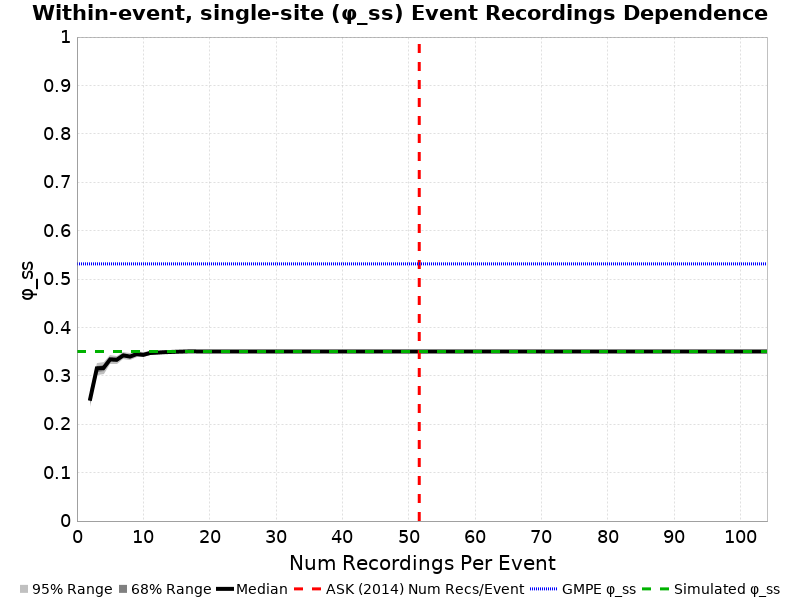 |

These plots show the distribution of period-independent downsampled &phi;SS for each site.

| **USC** |
|-----|
| 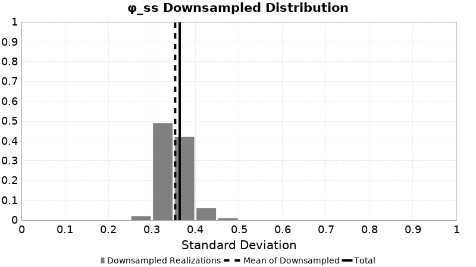 |

Here are plots of the histogram of &phi;SS for each individual rupture, from which we compute a total &phi;SS

| 3s | 5s |
|-----|-----|
| 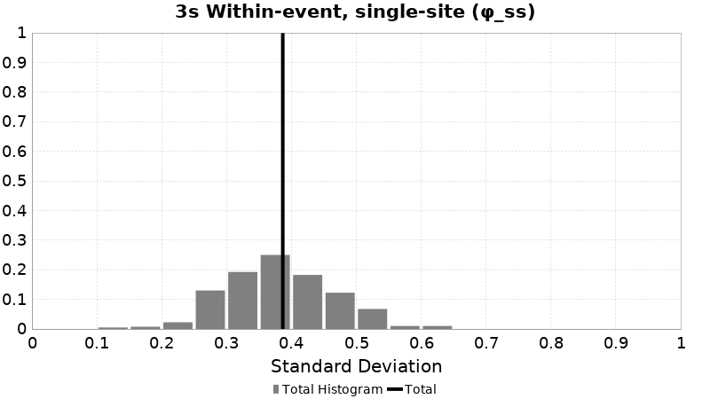 | 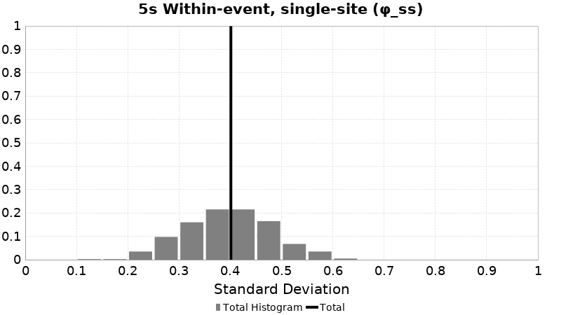 |
| 7.5s | 10s |
| 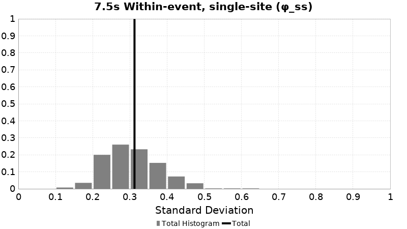 | 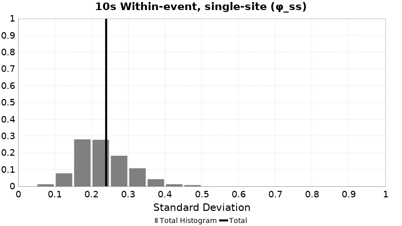 |

### 50.0 km M6.6 Within-event, single-site Results
*[(top)](#table-of-contents)*

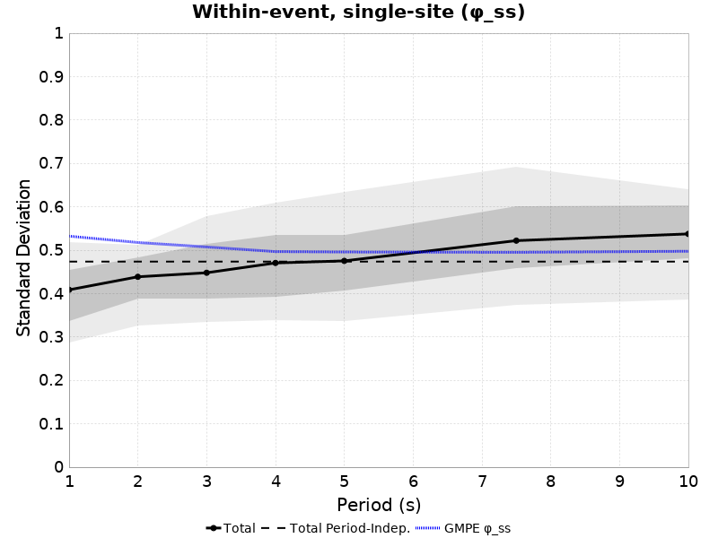

| 3s &phi;SS | Total | Mean | Median | Range | 5s &phi;SS | Total | Mean | Median | Range | 7.5s &phi;SS | Total | Mean | Median | Range | 10s &phi;SS | Total | Mean | Median | Range |
|-----|-----|-----|-----|-----|-----|-----|-----|-----|-----|-----|-----|-----|-----|-----|-----|-----|-----|-----|-----|
|  | 0.45 | 0.45 | 0.44 | [0.22 0.7] |  | 0.48 | 0.47 | 0.48 | [0.23 0.78] |  | 0.52 | 0.52 | 0.52 | [0.19 0.77] |  | 0.54 | 0.54 | 0.55 | [0.17 0.72] |

We compute uncertainties on &phi;SS through downsampling the rotational synthetic data to match the sample sizes used in the ASK 2014 regressions. We search the ASK dataset for ruptures with the same mechanism, magnitude in the range [6.4 6.8], and distance within the range [40.0 60.0] km. We throw out any events with only 1 recording, leaving us with 3 events and a total of 33 recordings. We then downsample our simulated data 100 times, and compute &phi;SS from each sample. The 95% confidence range from these samples is plotted as a shaded region above, and listed in the table below.

*WARNING: Some real events had more recordings than we have rotations per event, so our dataset for this test is smaller. We are using 2 fewer data points.*

| Period (s) | Full &phi;SS | Downsampled median &phi;SS | Downsampled &phi;SS std. dev. | Downsampled &phi;SS 68% conf range | Downsampled &phi;SS 95% conf range |
|-----|-----|-----|-----|-----|-----|
| T-independent | 0.47 | 0.48 | 0.04 | [0.43 0.5] | [0.38 0.56] |
| 1 | 0.41 | 0.39 | 0.06 | [0.34 0.45] | [0.29 0.52] |
| 2 | 0.44 | 0.44 | 0.05 | [0.39 0.48] | [0.33 0.51] |
| 3 | 0.45 | 0.46 | 0.06 | [0.39 0.51] | [0.33 0.58] |
| 4 | 0.47 | 0.47 | 0.07 | [0.39 0.53] | [0.34 0.61] |
| 5 | 0.48 | 0.47 | 0.07 | [0.41 0.53] | [0.34 0.63] |
| 7.5 | 0.52 | 0.52 | 0.07 | [0.46 0.6] | [0.37 0.69] |
| 10 | 0.54 | 0.54 | 0.06 | [0.48 0.6] | [0.39 0.64] |

These plots show the dependence of &phi;SS to the number of events included and the number of recordings per event. The left plot holds the number of recordings per event fixed at the full set of simulated recordings (18), varying the number of events. The right plot holds the number of events fixed at the full set of simulated events (400), varying the number of recordings per event.

| Period | Event Count Dependence | Recordings/Event Dependence |
|-----|-----|-----|
| Period Indep. | 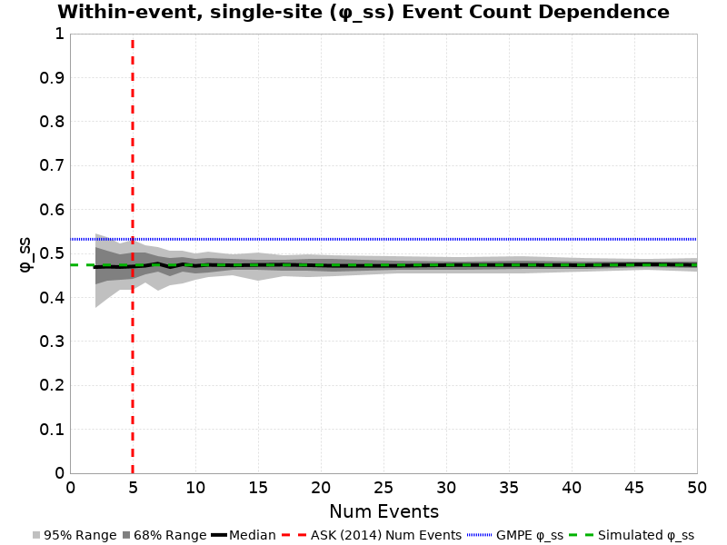 | 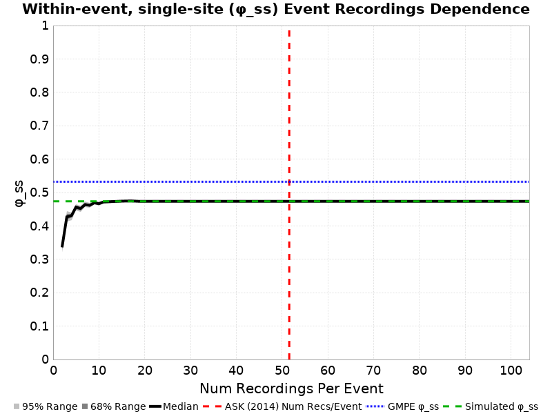 |
| 1s | 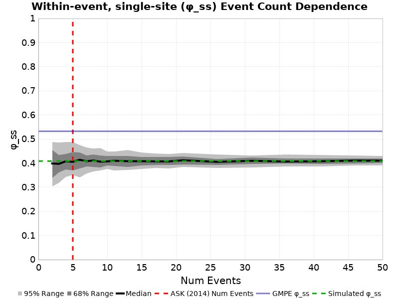 | 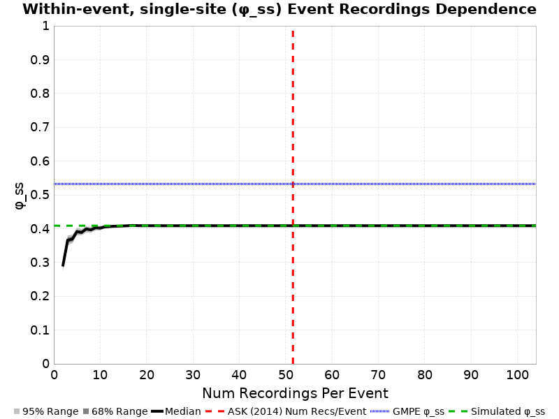 |

These plots show the distribution of period-independent downsampled &phi;SS for each site.

| **USC** |
|-----|
| 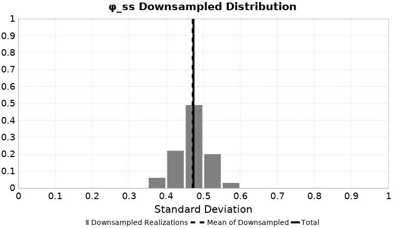 |

Here are plots of the histogram of &phi;SS for each individual rupture, from which we compute a total &phi;SS

| 3s | 5s |
|-----|-----|
| 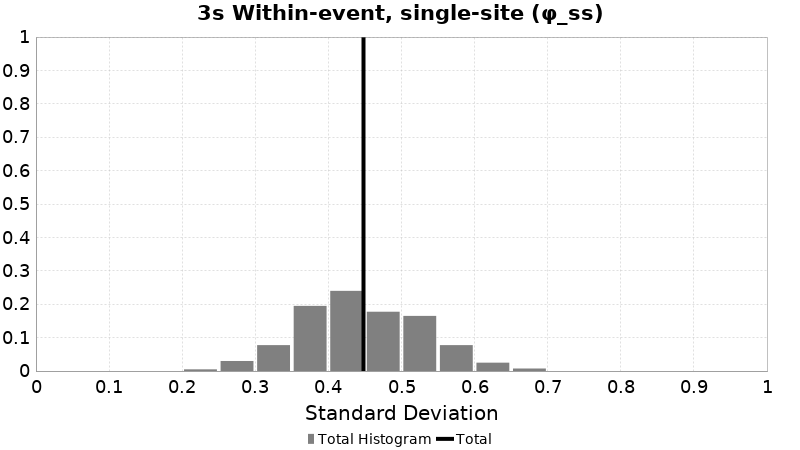 | 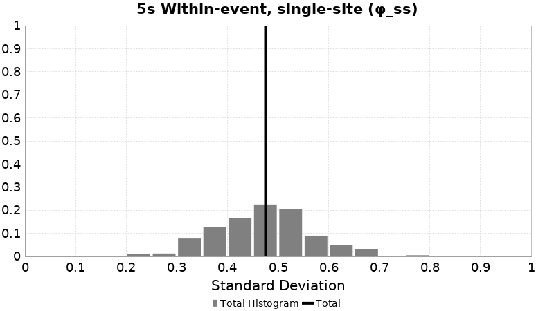 |
| 7.5s | 10s |
| 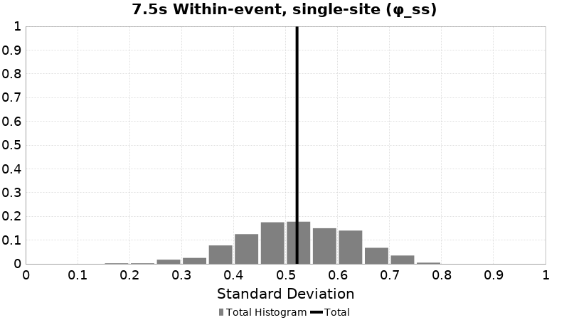 | 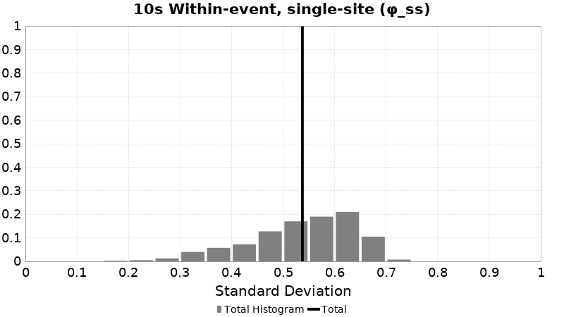 |

### 100.0 km M6.6 Within-event, single-site Results
*[(top)](#table-of-contents)*

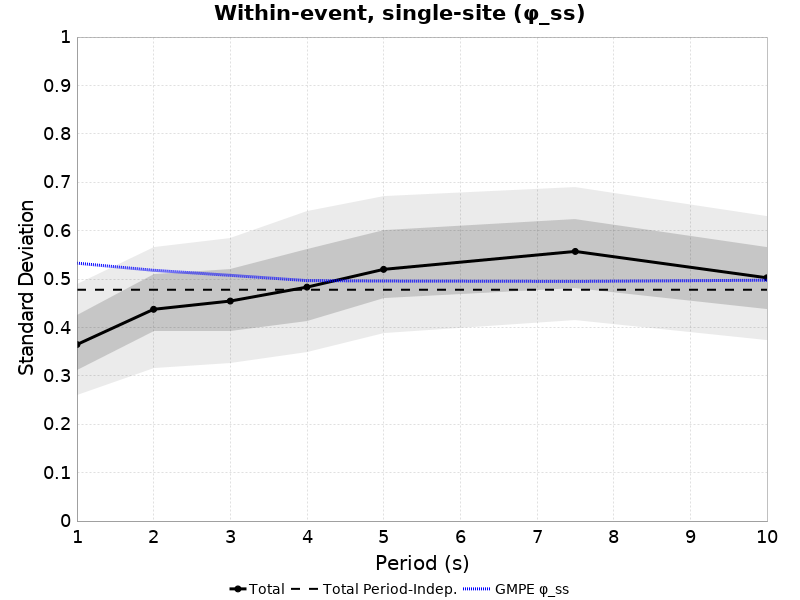

| 3s &phi;SS | Total | Mean | Median | Range | 5s &phi;SS | Total | Mean | Median | Range | 7.5s &phi;SS | Total | Mean | Median | Range | 10s &phi;SS | Total | Mean | Median | Range |
|-----|-----|-----|-----|-----|-----|-----|-----|-----|-----|-----|-----|-----|-----|-----|-----|-----|-----|-----|-----|
|  | 0.45 | 0.45 | 0.45 | [0.24 0.69] |  | 0.52 | 0.52 | 0.52 | [0.23 0.82] |  | 0.56 | 0.56 | 0.57 | [0.15 0.79] |  | 0.5 | 0.5 | 0.51 | [0.18 0.78] |

We compute uncertainties on &phi;SS through downsampling the rotational synthetic data to match the sample sizes used in the ASK 2014 regressions. We search the ASK dataset for ruptures with the same mechanism, magnitude in the range [6.4 6.8], and distance within the range [80.0 120.0] km. We throw out any events with only 1 recording, leaving us with 2 events and a total of 29 recordings. We then downsample our simulated data 100 times, and compute &phi;SS from each sample. The 95% confidence range from these samples is plotted as a shaded region above, and listed in the table below.

*WARNING: Some real events had more recordings than we have rotations per event, so our dataset for this test is smaller. We are using 28 fewer data points.*

| Period (s) | Full &phi;SS | Downsampled median &phi;SS | Downsampled &phi;SS std. dev. | Downsampled &phi;SS 68% conf range | Downsampled &phi;SS 95% conf range |
|-----|-----|-----|-----|-----|-----|
| T-independent | 0.48 | 0.49 | 0.04 | [0.44 0.52] | [0.4 0.56] |
| 1 | 0.36 | 0.36 | 0.05 | [0.31 0.43] | [0.26 0.49] |
| 2 | 0.44 | 0.45 | 0.06 | [0.39 0.51] | [0.32 0.57] |
| 3 | 0.45 | 0.45 | 0.06 | [0.39 0.52] | [0.33 0.58] |
| 4 | 0.48 | 0.49 | 0.07 | [0.41 0.56] | [0.35 0.64] |
| 5 | 0.52 | 0.54 | 0.07 | [0.46 0.6] | [0.39 0.67] |
| 7.5 | 0.56 | 0.57 | 0.07 | [0.48 0.62] | [0.42 0.69] |
| 10 | 0.5 | 0.51 | 0.06 | [0.44 0.57] | [0.37 0.63] |

These plots show the dependence of &phi;SS to the number of events included and the number of recordings per event. The left plot holds the number of recordings per event fixed at the full set of simulated recordings (18), varying the number of events. The right plot holds the number of events fixed at the full set of simulated events (400), varying the number of recordings per event.

| Period | Event Count Dependence | Recordings/Event Dependence |
|-----|-----|-----|
| Period Indep. | 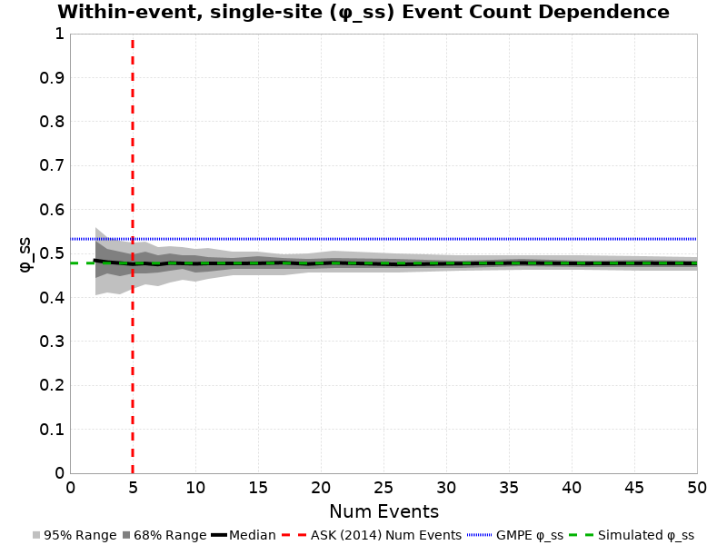 | 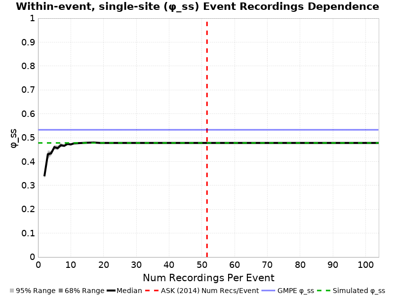 |
| 1s | 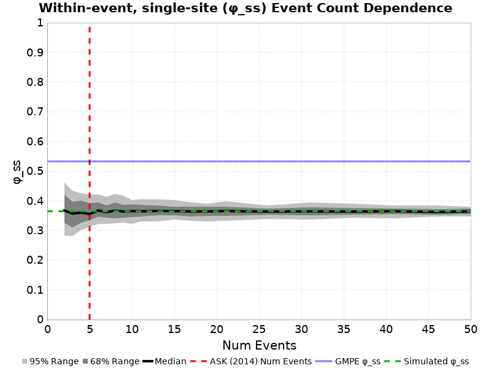 |  |

These plots show the distribution of period-independent downsampled &phi;SS for each site.

| **USC** |
|-----|
| 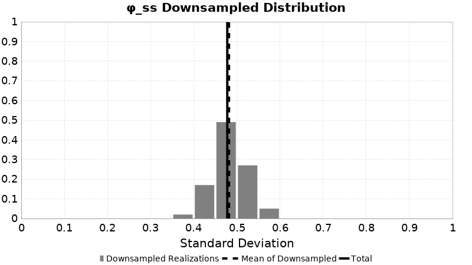 |

Here are plots of the histogram of &phi;SS for each individual rupture, from which we compute a total &phi;SS

| 3s | 5s |
|-----|-----|
| 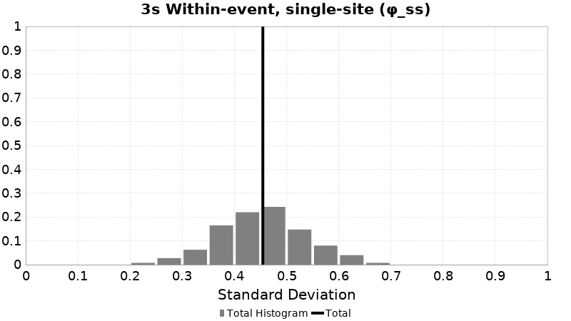 | 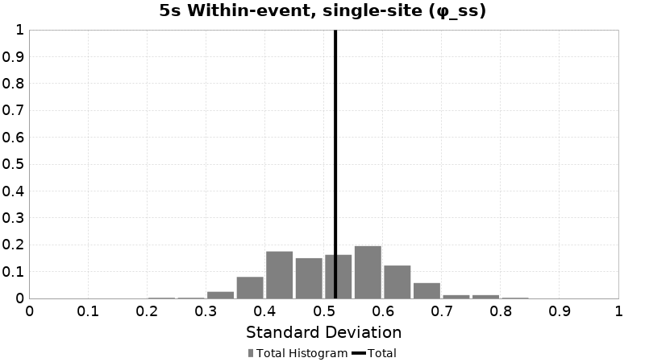 |
| 7.5s | 10s |
| 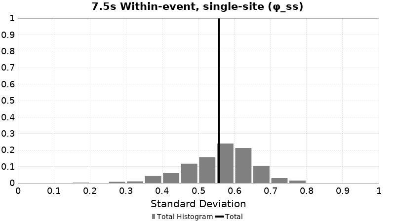 | 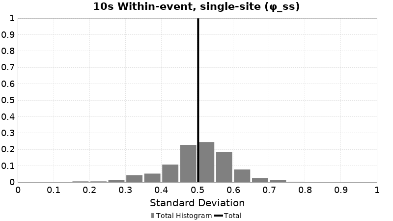 |

### All Distances M6.6 Within-event, single-site Results
*[(top)](#table-of-contents)*

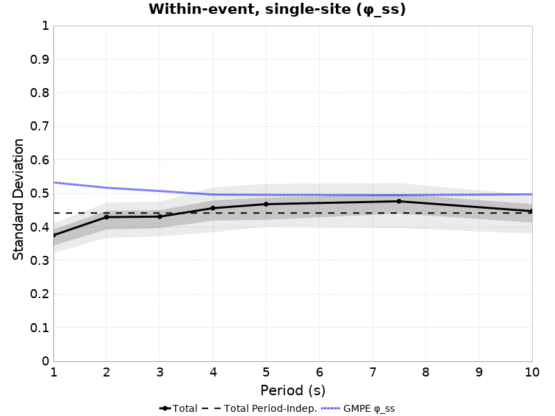

| 3s &phi;SS | Total | Mean | Median | Range | 5s &phi;SS | Total | Mean | Median | Range | 7.5s &phi;SS | Total | Mean | Median | Range | 10s &phi;SS | Total | Mean | Median | Range |
|-----|-----|-----|-----|-----|-----|-----|-----|-----|-----|-----|-----|-----|-----|-----|-----|-----|-----|-----|-----|
|  | 0.43 | 0.43 | 0.43 | [0.11 0.7] |  | 0.47 | 0.46 | 0.46 | [0.13 0.82] |  | 0.48 | 0.46 | 0.48 | [0.14 0.79] |  | 0.45 | 0.42 | 0.47 | [0.06 0.78] |

We compute uncertainties on &phi;SS through downsampling the rotational synthetic data to match the sample sizes used in the ASK 2014 regressions. We search the ASK dataset for ruptures with the same mechanism, magnitude in the range [6.4 6.8], and all distances. We throw out any events with only 1 recording, leaving us with 5 events and a total of 144 recordings. We then downsample our simulated data 100 times, and compute &phi;SS from each sample. The 95% confidence range from these samples is plotted as a shaded region above, and listed in the table below.

| Period (s) | Full &phi;SS | Downsampled median &phi;SS | Downsampled &phi;SS std. dev. | Downsampled &phi;SS 68% conf range | Downsampled &phi;SS 95% conf range |
|-----|-----|-----|-----|-----|-----|
| T-independent | 0.44 | 0.43 | 0.02 | [0.42 0.45] | [0.4 0.47] |
| 1 | 0.38 | 0.37 | 0.02 | [0.34 0.39] | [0.32 0.41] |
| 2 | 0.43 | 0.42 | 0.03 | [0.39 0.45] | [0.37 0.47] |
| 3 | 0.43 | 0.42 | 0.03 | [0.4 0.45] | [0.37 0.47] |
| 4 | 0.46 | 0.45 | 0.03 | [0.42 0.48] | [0.38 0.52] |
| 5 | 0.47 | 0.46 | 0.03 | [0.42 0.49] | [0.4 0.53] |
| 7.5 | 0.48 | 0.47 | 0.03 | [0.44 0.5] | [0.4 0.53] |
| 10 | 0.45 | 0.44 | 0.03 | [0.41 0.47] | [0.38 0.5] |

These plots show the dependence of &phi;SS to the number of events included and the number of recordings per event. The left plot holds the number of recordings per event fixed at the full set of simulated recordings (18), varying the number of events. The right plot holds the number of events fixed at the full set of simulated events (400), varying the number of recordings per event.

| Period | Event Count Dependence | Recordings/Event Dependence |
|-----|-----|-----|
| Period Indep. | 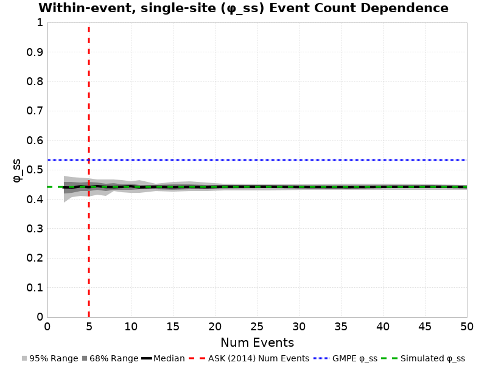 | 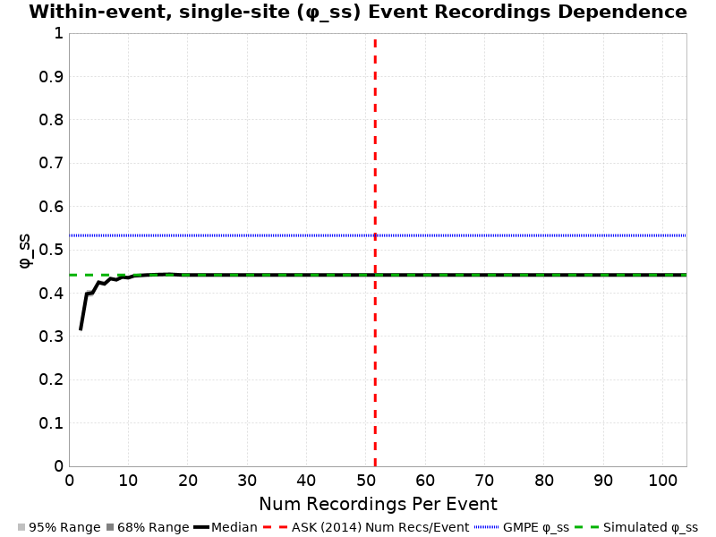 |
| 1s | 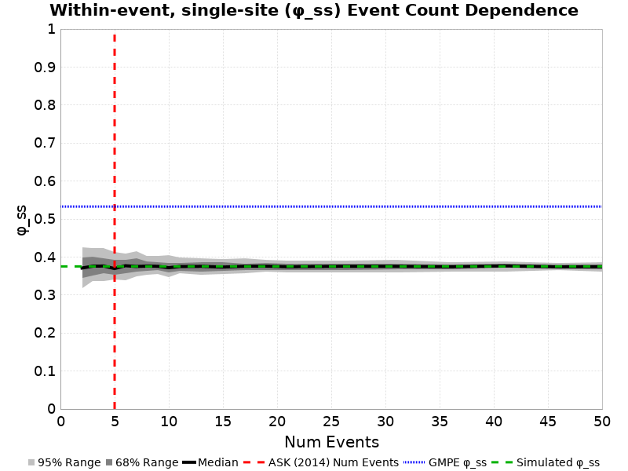 | 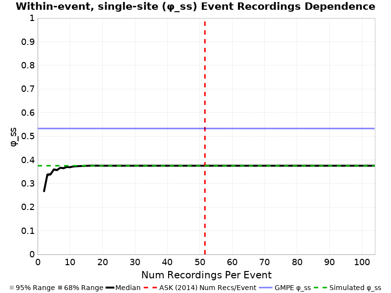 |

These plots show the distribution of period-independent downsampled &phi;SS for each site.

| **USC** |
|-----|
| 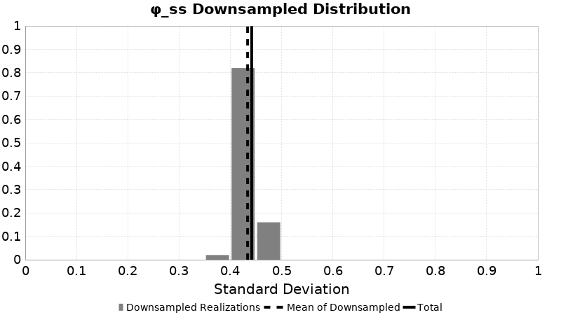 |

Here are plots of the histogram of &phi;SS for each individual rupture, from which we compute a total &phi;SS

| 3s | 5s |
|-----|-----|
| 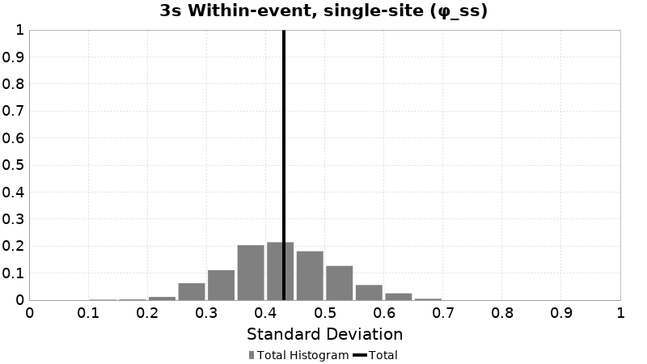 | 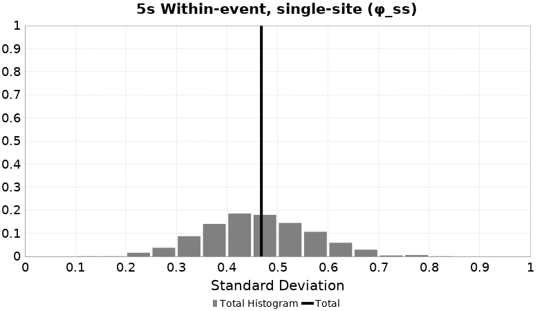 |
| 7.5s | 10s |
| 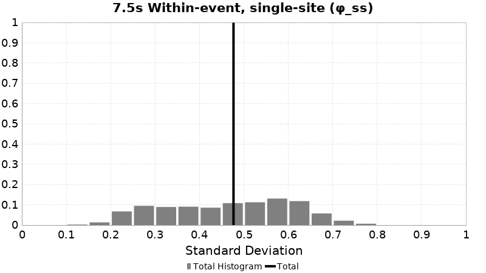 | 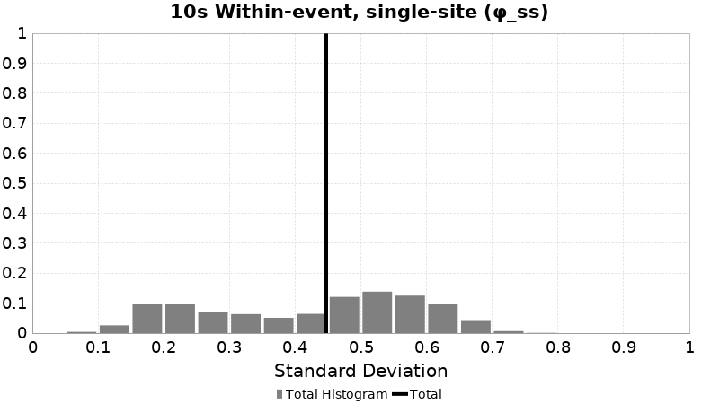 |

## Between-events Variability
*[(top)](#table-of-contents)*

### Between-events Variability Methodology
*[(top)](#table-of-contents)*

Between-events variability, denoted &tau; in Al Atik (2010), is computed separately for each:

* Distance *[3 unique]*

We first compute the median natural-log ground motion, &delta;Be, for each combination of:

* Rupture *[400 unique]*

That median, &delta;Be, is computed across all 18 combinations of:

* Site *[1 unique]*
* Rupture Strike *[18 unique]*
* Path *[1 unique]*

We take &tau; to be the standard deviation of all &delta;Be.

We also compute distance-independent &tau;, which we take to be the mean value across all distances.

Here is an exmample with 5 rotations, which would be repeated for each combination of [Rupture]. The site is shown with a blue square, and initially oriented rupture in bold with its hypocenter as a red star and centroid a green circle. Rotations of that rupture are in gray:

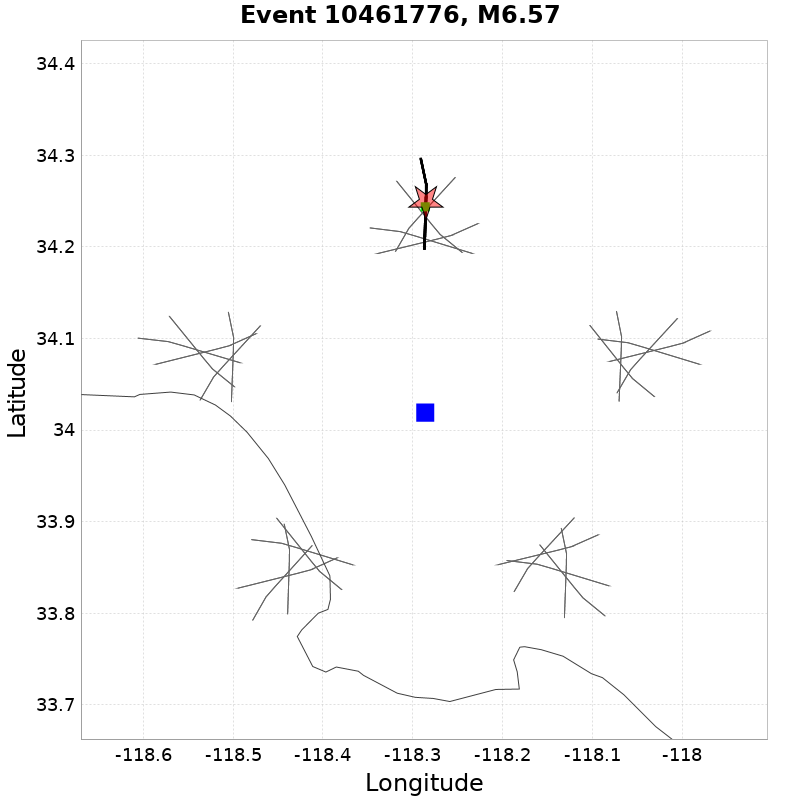

### 20.0 km M6.6 Between-events Results
*[(top)](#table-of-contents)*

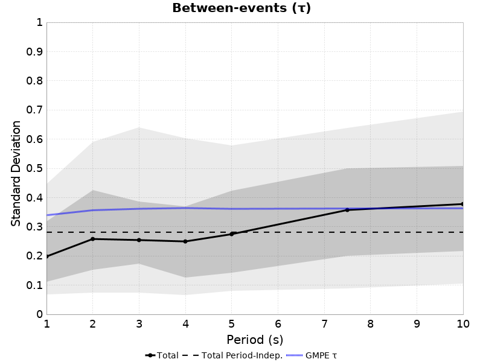

| 3s &tau; | Mean &delta;Be | &delta;Be Range | 5s &tau; | Mean &delta;Be | &delta;Be Range | 7.5s &tau; | Mean &delta;Be | &delta;Be Range | 10s &tau; | Mean &delta;Be | &delta;Be Range |
|-----|-----|-----|-----|-----|-----|-----|-----|-----|-----|-----|-----|
| 0.25 | -4.04 | [-4.64 -3.15] | 0.27 | -4.73 | [-5.43 -3.87] | 0.36 | -5.23 | [-6.22 -4.44] | 0.38 | -5.74 | [-6.84 -4.98] |

We compute uncertainties on &tau; through downsampling the rotational synthetic data to match the sample sizes used in the ASK 2014 regressions. We search the ASK dataset for ruptures with the same mechanism, magnitude in the range [6.4 6.8], and distance within the range [10.0 30.0] km. We throw out any events with only 1 recording, leaving us with 4 events and a total of 37 recordings. We then downsample our simulated data 100 times, and compute &tau; from each sample. The 95% confidence range from these samples is plotted as a shaded region above, and listed in the table below.

| Period (s) | Full &tau; | Downsampled median &tau; | Downsampled &tau; std. dev. | Downsampled &tau; 68% conf range | Downsampled &tau; 95% conf range |
|-----|-----|-----|-----|-----|-----|
| T-independent | 0.28 | 0.27 | 0.08 | [0.21 0.37] | [0.15 0.49] |
| 1 | 0.2 | 0.19 | 0.09 | [0.11 0.32] | [0.07 0.45] |
| 2 | 0.26 | 0.26 | 0.14 | [0.15 0.43] | [0.07 0.59] |
| 3 | 0.25 | 0.25 | 0.13 | [0.17 0.39] | [0.07 0.64] |
| 4 | 0.25 | 0.27 | 0.13 | [0.13 0.37] | [0.07 0.6] |
| 5 | 0.27 | 0.29 | 0.13 | [0.14 0.42] | [0.08 0.58] |
| 7.5 | 0.36 | 0.34 | 0.15 | [0.2 0.5] | [0.09 0.64] |
| 10 | 0.38 | 0.33 | 0.14 | [0.22 0.51] | [0.1 0.69] |

These plots show the dependence of &tau; to the number of events included and the number of recordings per event. The left plot holds the number of recordings per event fixed at the full set of simulated recordings (18), varying the number of events. The right plot holds the number of events fixed at the full set of simulated events (400), varying the number of recordings per event.

| Period | Event Count Dependence | Recordings/Event Dependence |
|-----|-----|-----|
| Period Indep. | 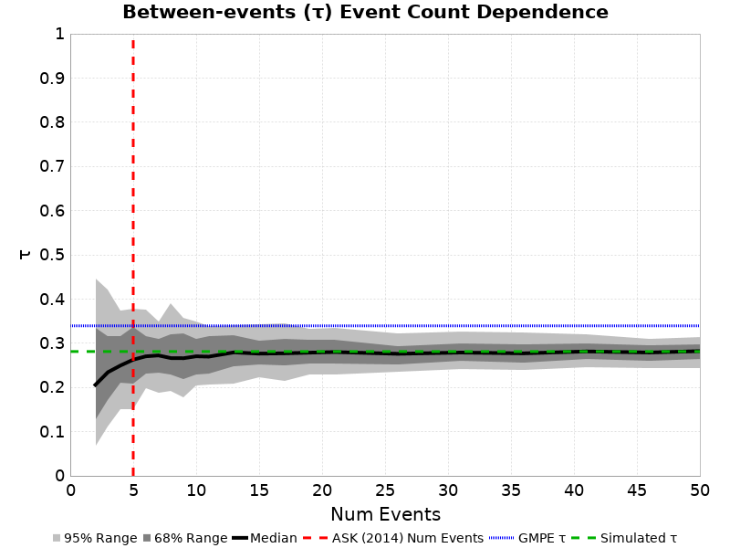 | 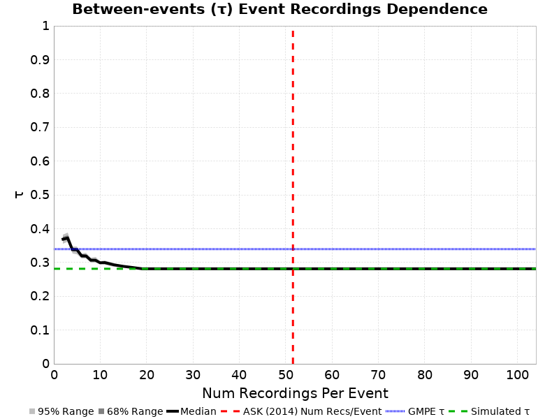 |
| 1s | 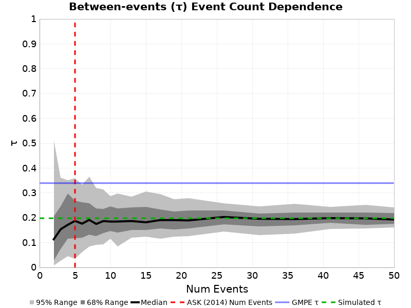 | 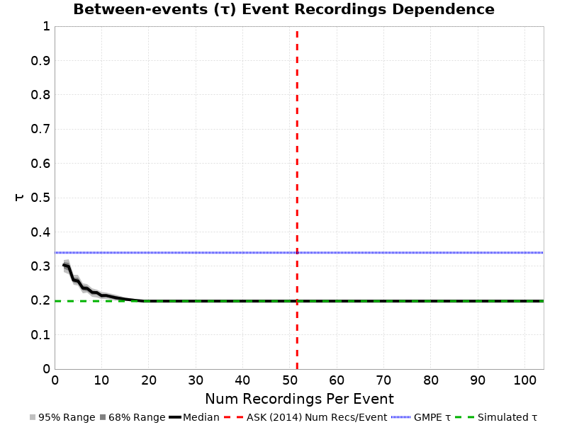 |

This plot shows the distribution of period-independent downsampled &tau;.

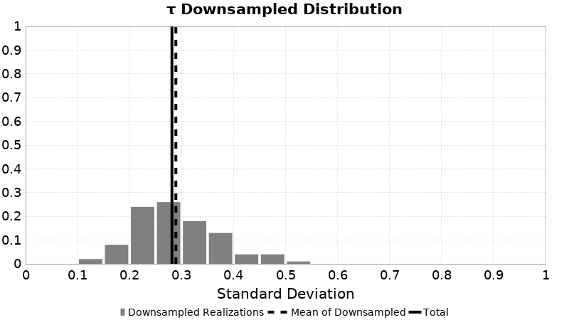

### 50.0 km M6.6 Between-events Results
*[(top)](#table-of-contents)*

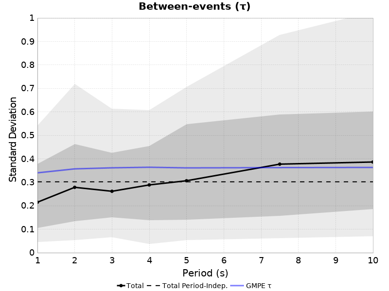

| 3s &tau; | Mean &delta;Be | &delta;Be Range | 5s &tau; | Mean &delta;Be | &delta;Be Range | 7.5s &tau; | Mean &delta;Be | &delta;Be Range | 10s &tau; | Mean &delta;Be | &delta;Be Range |
|-----|-----|-----|-----|-----|-----|-----|-----|-----|-----|-----|-----|
| 0.26 | -4.81 | [-5.52 -4.03] | 0.31 | -5.41 | [-6.22 -4.57] | 0.38 | -5.91 | [-7 -5.02] | 0.39 | -6.35 | [-7.64 -5.51] |

We compute uncertainties on &tau; through downsampling the rotational synthetic data to match the sample sizes used in the ASK 2014 regressions. We search the ASK dataset for ruptures with the same mechanism, magnitude in the range [6.4 6.8], and distance within the range [40.0 60.0] km. We throw out any events with only 1 recording, leaving us with 3 events and a total of 33 recordings. We then downsample our simulated data 100 times, and compute &tau; from each sample. The 95% confidence range from these samples is plotted as a shaded region above, and listed in the table below.

*WARNING: Some real events had more recordings than we have rotations per event, so our dataset for this test is smaller. We are using 2 fewer data points.*

| Period (s) | Full &tau; | Downsampled median &tau; | Downsampled &tau; std. dev. | Downsampled &tau; 68% conf range | Downsampled &tau; 95% conf range |
|-----|-----|-----|-----|-----|-----|
| T-independent | 0.3 | 0.31 | 0.12 | [0.19 0.41] | [0.12 0.6] |
| 1 | 0.22 | 0.21 | 0.13 | [0.11 0.38] | [0.04 0.54] |
| 2 | 0.28 | 0.26 | 0.16 | [0.13 0.46] | [0.05 0.72] |
| 3 | 0.26 | 0.26 | 0.14 | [0.15 0.43] | [0.07 0.61] |
| 4 | 0.29 | 0.33 | 0.16 | [0.14 0.45] | [0.04 0.61] |
| 5 | 0.31 | 0.26 | 0.18 | [0.14 0.55] | [0.05 0.71] |
| 7.5 | 0.38 | 0.34 | 0.23 | [0.16 0.59] | [0.06 0.93] |
| 10 | 0.39 | 0.37 | 0.23 | [0.19 0.6] | [0.07 1.03] |

These plots show the dependence of &tau; to the number of events included and the number of recordings per event. The left plot holds the number of recordings per event fixed at the full set of simulated recordings (18), varying the number of events. The right plot holds the number of events fixed at the full set of simulated events (400), varying the number of recordings per event.

| Period | Event Count Dependence | Recordings/Event Dependence |
|-----|-----|-----|
| Period Indep. | 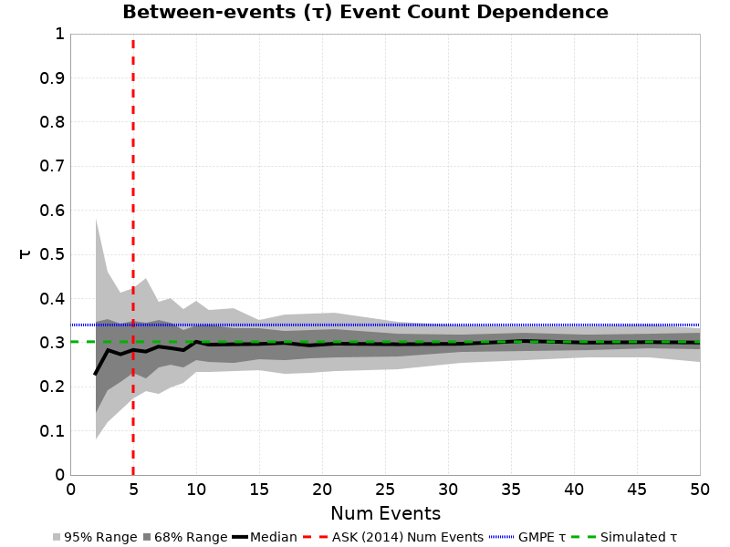 | 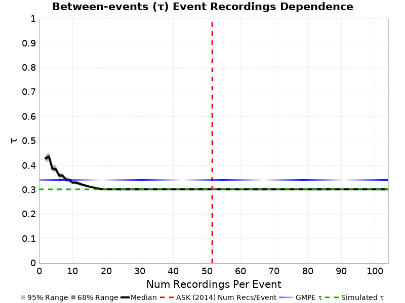 |
| 1s | 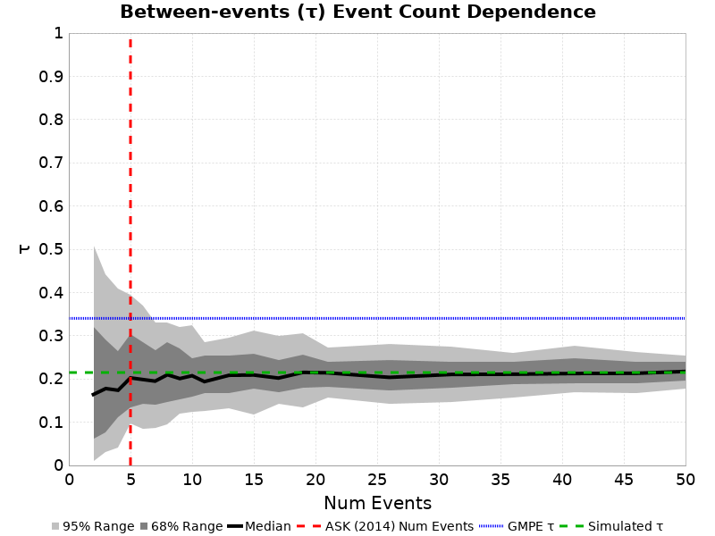 | 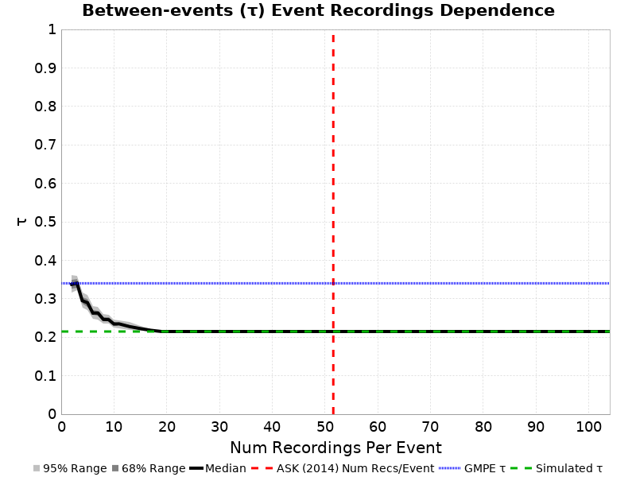 |

This plot shows the distribution of period-independent downsampled &tau;.

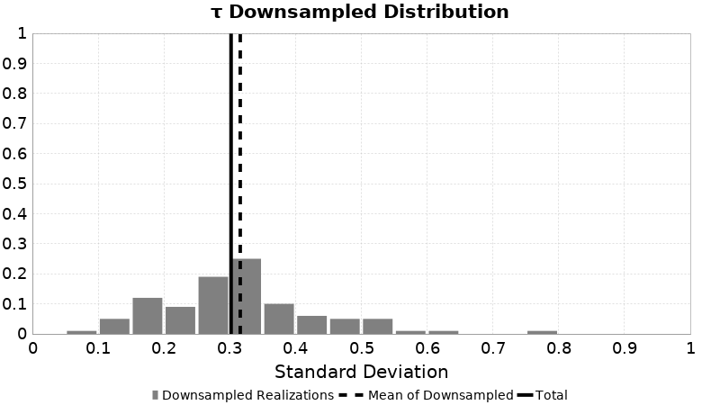

### 100.0 km M6.6 Between-events Results
*[(top)](#table-of-contents)*

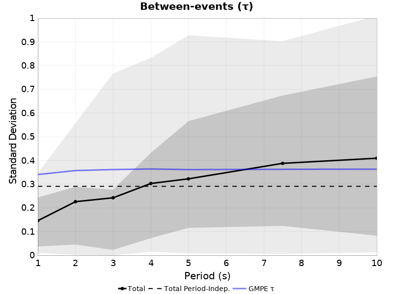

| 3s &tau; | Mean &delta;Be | &delta;Be Range | 5s &tau; | Mean &delta;Be | &delta;Be Range | 7.5s &tau; | Mean &delta;Be | &delta;Be Range | 10s &tau; | Mean &delta;Be | &delta;Be Range |
|-----|-----|-----|-----|-----|-----|-----|-----|-----|-----|-----|-----|
| 0.24 | -5.51 | [-6.24 -4.76] | 0.32 | -6 | [-7.01 -5.17] | 0.39 | -6.38 | [-7.43 -5.52] | 0.41 | -6.78 | [-8.14 -5.94] |

We compute uncertainties on &tau; through downsampling the rotational synthetic data to match the sample sizes used in the ASK 2014 regressions. We search the ASK dataset for ruptures with the same mechanism, magnitude in the range [6.4 6.8], and distance within the range [80.0 120.0] km. We throw out any events with only 1 recording, leaving us with 2 events and a total of 29 recordings. We then downsample our simulated data 100 times, and compute &tau; from each sample. The 95% confidence range from these samples is plotted as a shaded region above, and listed in the table below.

*WARNING: Some real events had more recordings than we have rotations per event, so our dataset for this test is smaller. We are using 28 fewer data points.*

| Period (s) | Full &tau; | Downsampled median &tau; | Downsampled &tau; std. dev. | Downsampled &tau; 68% conf range | Downsampled &tau; 95% conf range |
|-----|-----|-----|-----|-----|-----|
| T-independent | 0.29 | 0.24 | 0.13 | [0.14 0.37] | [0.07 0.68] |
| 1 | 0.15 | 0.11 | 0.1 | [0.04 0.24] | [0.01 0.35] |
| 2 | 0.23 | 0.17 | 0.14 | [0.05 0.29] | [0 0.56] |
| 3 | 0.24 | 0.14 | 0.17 | [0.02 0.28] | [0 0.77] |
| 4 | 0.3 | 0.23 | 0.2 | [0.07 0.43] | [0.01 0.83] |
| 5 | 0.32 | 0.29 | 0.23 | [0.12 0.57] | [0.01 0.93] |
| 7.5 | 0.39 | 0.33 | 0.25 | [0.12 0.67] | [0.01 0.9] |
| 10 | 0.41 | 0.3 | 0.3 | [0.08 0.75] | [0.01 1.01] |

These plots show the dependence of &tau; to the number of events included and the number of recordings per event. The left plot holds the number of recordings per event fixed at the full set of simulated recordings (18), varying the number of events. The right plot holds the number of events fixed at the full set of simulated events (400), varying the number of recordings per event.

| Period | Event Count Dependence | Recordings/Event Dependence |
|-----|-----|-----|
| Period Indep. |  | 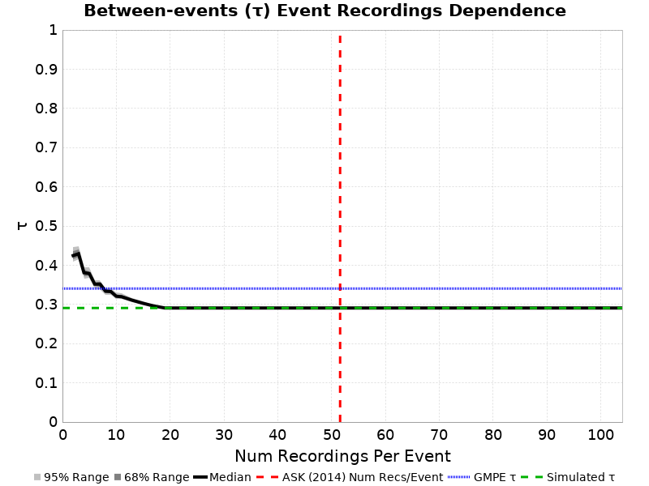 |
| 1s | 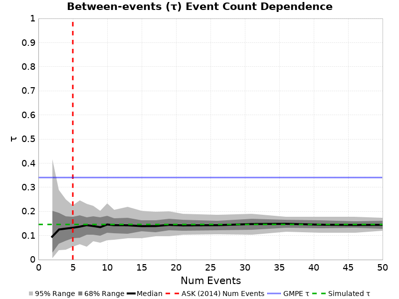 | 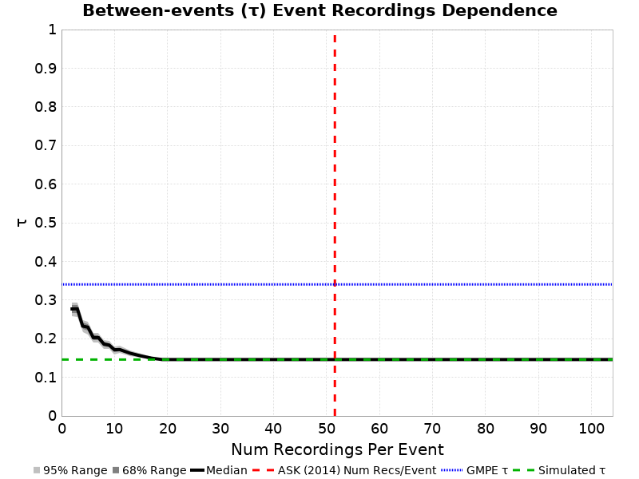 |

This plot shows the distribution of period-independent downsampled &tau;.

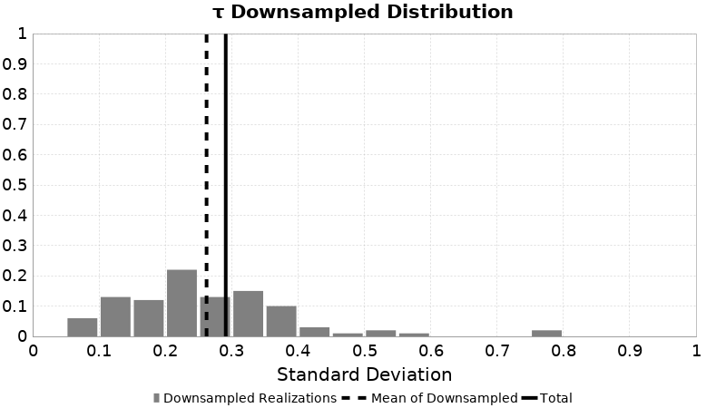

### All Distances M6.6 Between-events Results
*[(top)](#table-of-contents)*

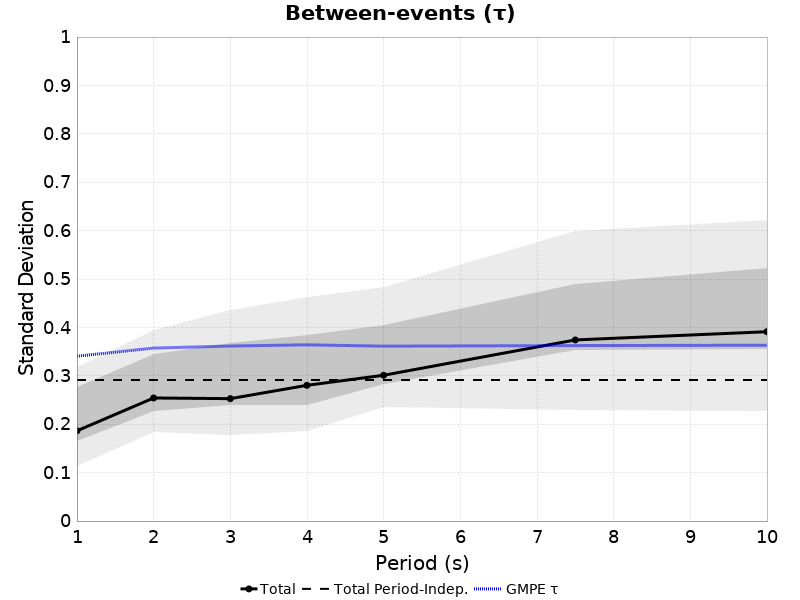

| 3s &tau; | Mean &delta;Be | &delta;Be Range | 5s &tau; | Mean &delta;Be | &delta;Be Range | 7.5s &tau; | Mean &delta;Be | &delta;Be Range | 10s &tau; | Mean &delta;Be | &delta;Be Range |
|-----|-----|-----|-----|-----|-----|-----|-----|-----|-----|-----|-----|
| 0.25 | -4.79 | [-6.24 -3.15] | 0.3 | -5.38 | [-7.01 -3.87] | 0.37 | -5.84 | [-7.43 -4.44] | 0.39 | -6.29 | [-8.14 -4.98] |

We compute uncertainties on &tau; through downsampling the rotational synthetic data to match the sample sizes used in the ASK 2014 regressions. We search the ASK dataset for ruptures with the same mechanism, magnitude in the range [6.4 6.8], and all distances. We throw out any events with only 1 recording, leaving us with 5 events and a total of 144 recordings. We then downsample our simulated data 100 times, and compute &tau; from each sample. The 95% confidence range from these samples is plotted as a shaded region above, and listed in the table below.

| Period (s) | Full &tau; | Downsampled median &tau; | Downsampled &tau; std. dev. | Downsampled &tau; 68% conf range | Downsampled &tau; 95% conf range |
|-----|-----|-----|-----|-----|-----|
| T-independent | 0.29 | 0.33 | 0.04 | [0.3 0.36] | [0.23 0.43] |
| 1 | 0.19 | 0.22 | 0.05 | [0.17 0.28] | [0.11 0.32] |
| 2 | 0.25 | 0.28 | 0.06 | [0.23 0.35] | [0.18 0.39] |
| 3 | 0.25 | 0.28 | 0.06 | [0.24 0.37] | [0.18 0.44] |
| 4 | 0.28 | 0.31 | 0.07 | [0.24 0.38] | [0.19 0.46] |
| 5 | 0.3 | 0.33 | 0.06 | [0.28 0.4] | [0.24 0.48] |
| 7.5 | 0.37 | 0.44 | 0.08 | [0.35 0.49] | [0.23 0.6] |
| 10 | 0.39 | 0.43 | 0.09 | [0.35 0.52] | [0.23 0.62] |

These plots show the dependence of &tau; to the number of events included and the number of recordings per event. The left plot holds the number of recordings per event fixed at the full set of simulated recordings (18), varying the number of events. The right plot holds the number of events fixed at the full set of simulated events (400), varying the number of recordings per event.

| Period | Event Count Dependence | Recordings/Event Dependence |
|-----|-----|-----|
| Period Indep. |  | 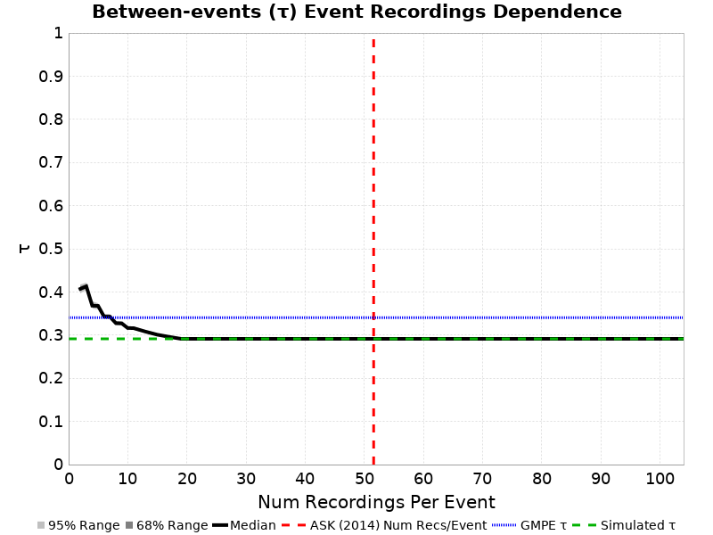 |
| 1s | 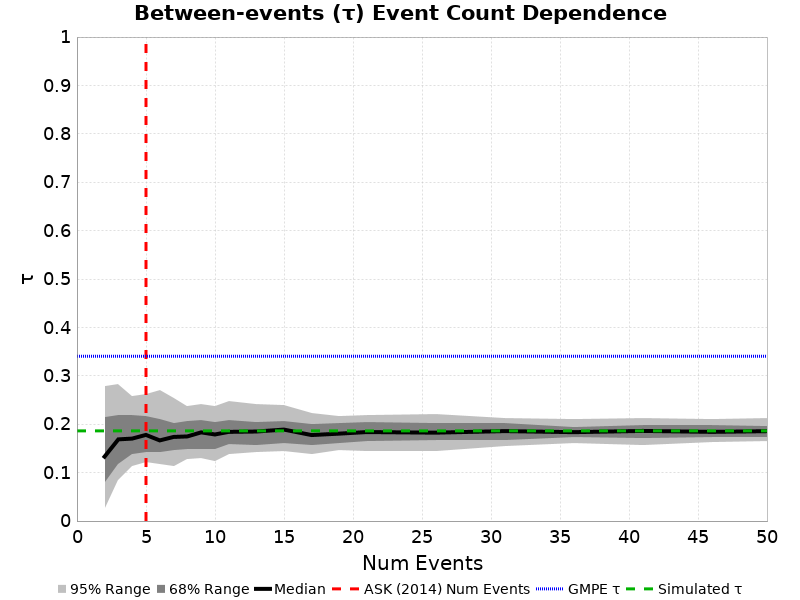 | 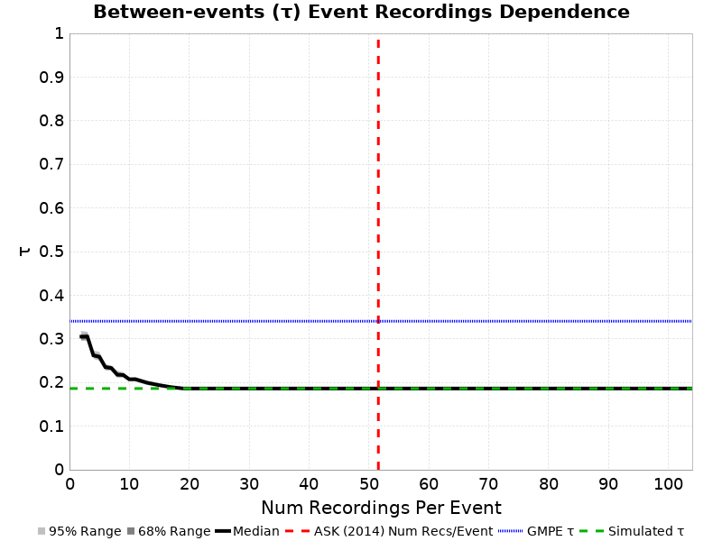 |

This plot shows the distribution of period-independent downsampled &tau;.

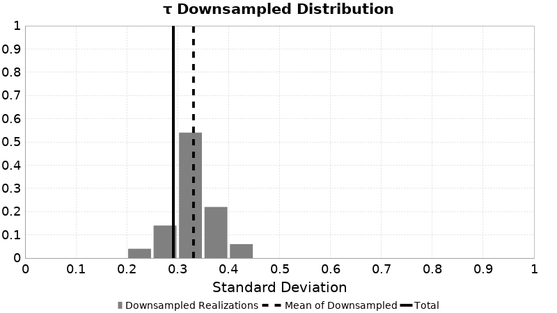

## Azumth Dependence
*[(top)](#table-of-contents)*

### Rupture Strike Dependence
*[(top)](#table-of-contents)*

| Type | 3s | 5s | 7.5s | 10s |
|-----|-----|-----|-----|-----|
| **&tau;** | 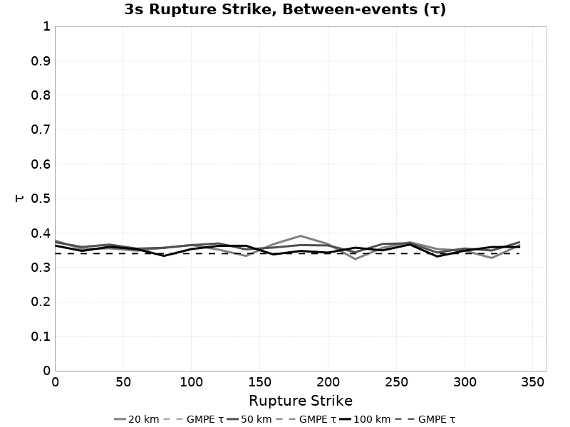 | 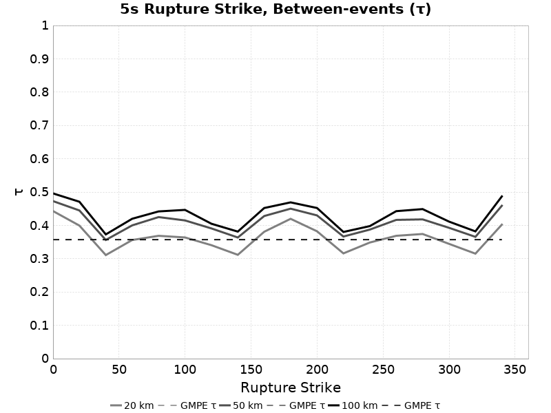 | 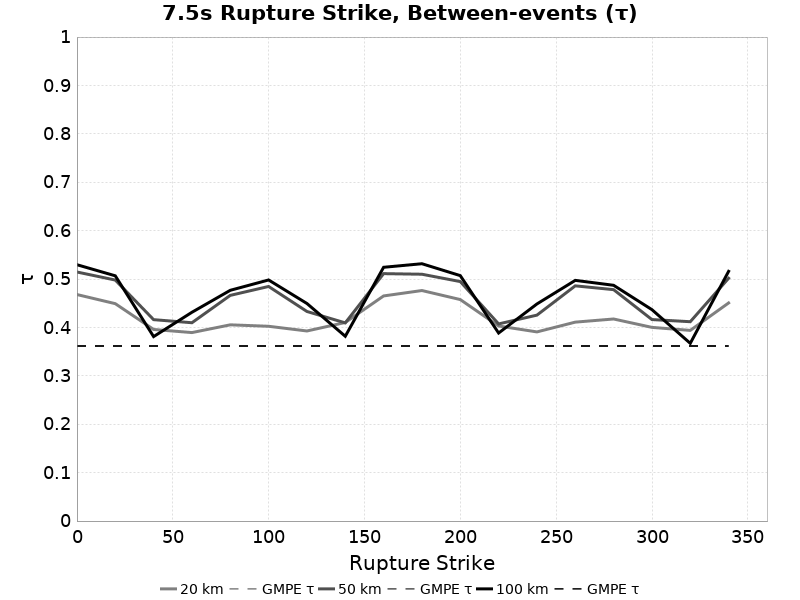 | 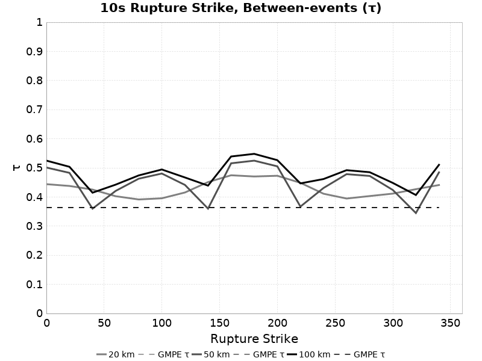 |
| **Median SA** | 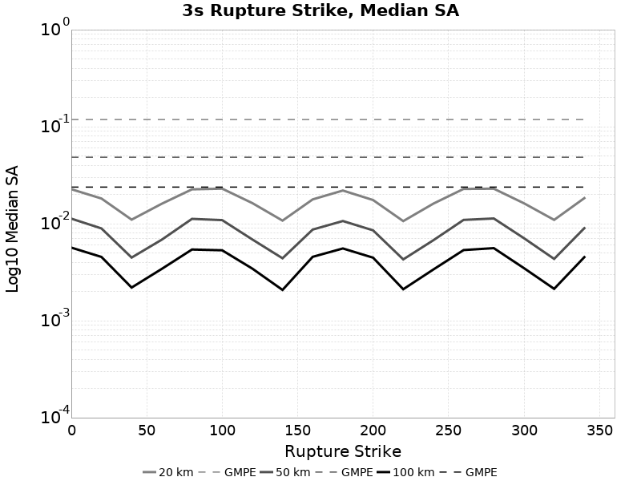 | 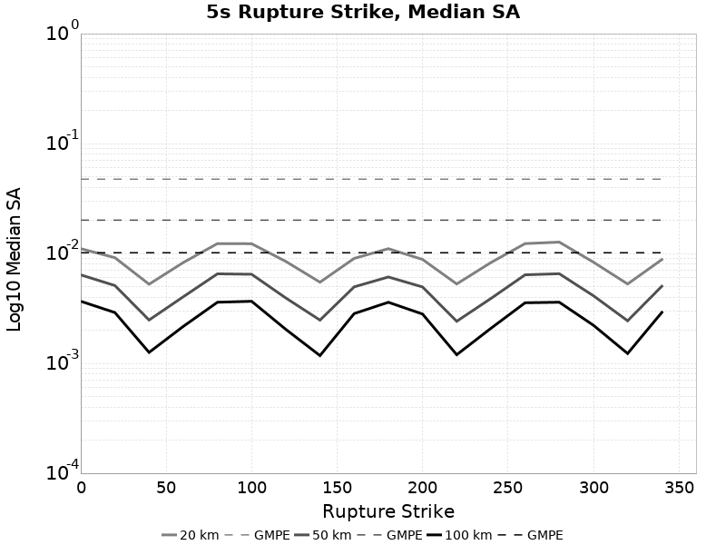 | 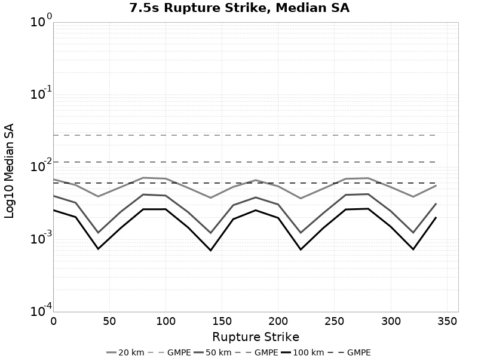 | 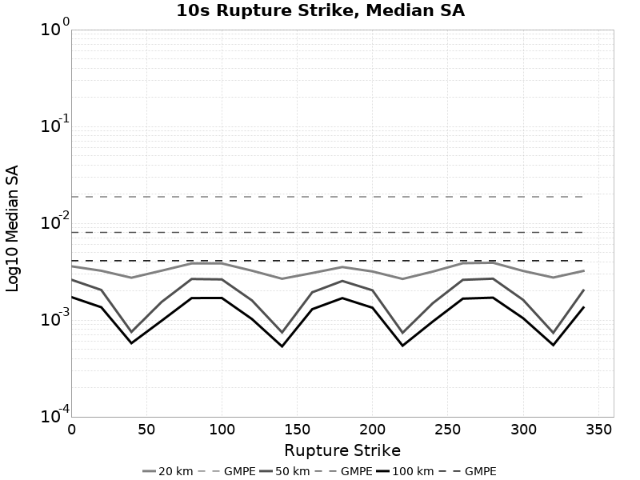 |

## BBP PartB Comparison
*[(top)](#table-of-contents)*

Here we attempt to reproduce the SCEC BroadBand Platform "Part B" validation exercise as defined in:

*Goulet, C. A., Abrahamson, N. A., Somerville, P. G., & Wooddell, K. E. (2014). The SCEC broadband platform validation exercise: Methodology for code validation in the context of seismichazard analyses. Seismological Research Letters, 86(1), 17-26.* [(link)](https://pubs.geoscienceworld.org/ssa/srl/article/86/1/17/315438/the-scec-broadband-platform-validation-exercise)

The BBP exercise positioned sites in a 'racetrack' around the ruptures. Here, we instead position and rotate the ruptures around the site in order to work in 3-D with CyberShake reciprical calculations. Results for official scenarios and distances are in **bold**, results for additional magnitudes or distances not defined in the Goulet et. al. (2014) are *italicised*.

### BBP PartB Summary Table
*[(top)](#table-of-contents)*

| Scenario | 20.0 km | 50.0 km | 100.0 km |
|-----|-----|-----|-----|
| **M6.6 SS Rel** | **FAIL** | **FAIL** | *(FAIL)* |

### BBP PartB, M6.6, Vertical Strike-Slip with Surface Rupture (relaxed)
*[(top)](#table-of-contents)*

| 20.0 km | 50.0 km | 100.0 km |
|-----|-----|-----|
| 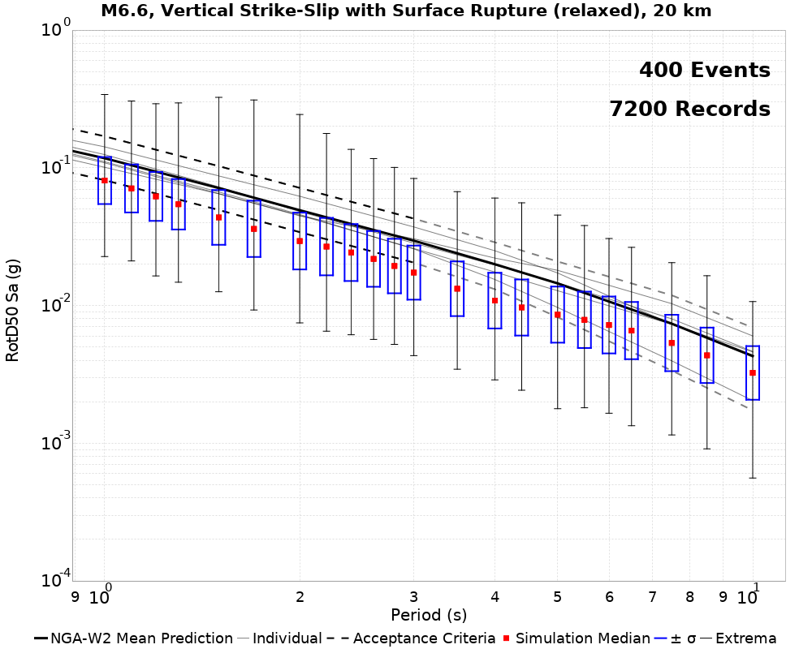 | 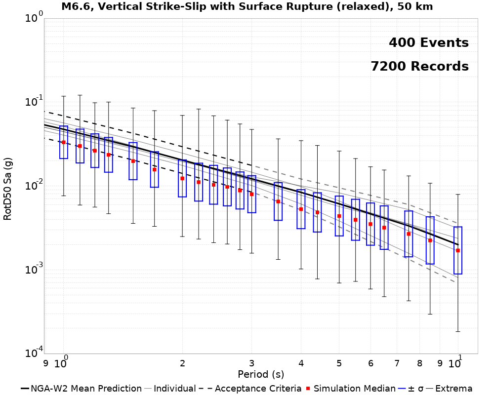 | 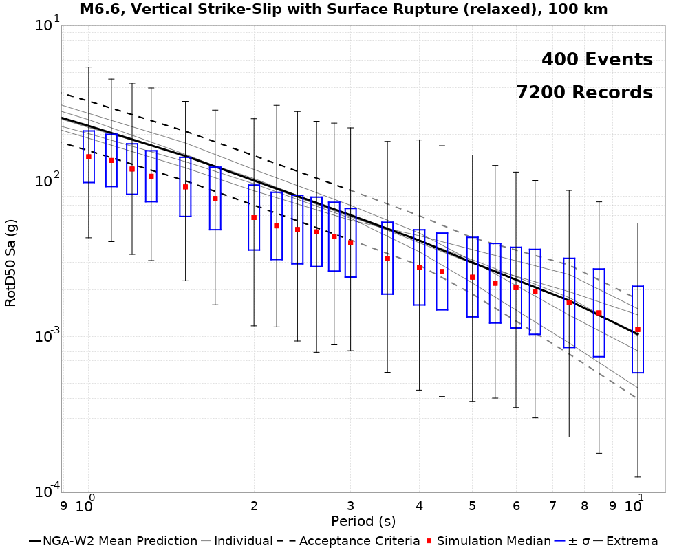 |

## CSV Files
*[(top)](#table-of-contents)*

| Magnitude | Distance | Site | CSV File |
|-----|-----|-----|-----|
| M6.6 | 20.0 km | USC | [sa_USC_m6.6_20.0km.csv.gz](resources/sa_USC_m6.6_20.0km.csv.gz) |
| M6.6 | 50.0 km | USC | [sa_USC_m6.6_50.0km.csv.gz](resources/sa_USC_m6.6_50.0km.csv.gz) |
| M6.6 | 100.0 km | USC | [sa_USC_m6.6_100.0km.csv.gz](resources/sa_USC_m6.6_100.0km.csv.gz) |

