# Bruce 2585 1myr BBP PartB Results Summary

This page combines results from multiple BBP PartB calculations for different BBP velocity models and rupture rotation studies. Refer to individual pages for details and methodology for individual calculations. Regular PartB studies distribute sites around RSQSim ruptures in a half-racetrack. Rotation studies instead use a fixed site location, translating each rupture to the specified distance from the site, and rotating the ruptures about their moment centroids to sample many source azimuths.

## Table Of Contents
* [BBP PartB Background Information](#bbp-partb-background-information)
* [Result](#result)
  * [M6.6, Vertical Strike-Slip with Surface Rupture](#m66-vertical-strike-slip-with-surface-rupture)
  * [M6.6, Reverse, Dip=45, Ztor=3](#m66-reverse-dip45-ztor3)
  * [M7.2, Vertical Strike-Slip with Surface Rupture](#m72-vertical-strike-slip-with-surface-rupture)
  * [M7.2, Reverse, Dip=45](#m72-reverse-dip45)
  * [M7.6, Vertical Strike-Slip with Surface Rupture](#m76-vertical-strike-slip-with-surface-rupture)
  * [M7.6, Reverse, Dip=45](#m76-reverse-dip45)
## BBP PartB Background Information
*[(top)](#table-of-contents)*

This page reproduces the SCEC BroadBand Platform "Part B" validation exercise as defined in:

*Goulet, C. A., Abrahamson, N. A., Somerville, P. G., & Wooddell, K. E. (2014). The SCEC broadband platform validation exercise: Methodology for code validation in the context of seismic‐hazard analyses. Seismological Research Letters, 86(1), 17-26.* [(link)](https://pubs.geoscienceworld.org/ssa/srl/article/86/1/17/315438/the-scec-broadband-platform-validation-exercise)

The goal of this exercise was to validate BBP simulation methods (both rupture generation and ground motion simulation) against the NGA-West GMPEs (the original study used NGA-West1, we use NGA-West2) for scenario ruptures where the NGA relations are well constrained:

* M 5.5, 45°-dipping reverse, Ztor = 6 km
* M 6.2, vertical strike slip, Ztor = 4 km
* M 6.6, vertical strike slip with a surface rupture
* M 6.6, 45°-dipping reverse, Ztor = 3 km

50 rupture realizations were generated for each scenario with randomly distributed hypocenters, and 40 sites were distributed at random azimuths on the footwall side of the faults at rupture distances of 20 and 50 km. Resultant ground motions were compared against an evaluation criterion which "was established so as to be wide enough to limit a pass/fail grade for each scenario considered." This criterion only applies at periods up to 3s, becase data above this period "are fairly sparse and cannot provide a reliable constraint."

A method is said to pass the test if the median RotD50 value is within the evaluation criteria at every spectral period. "Departure from that range is a definite sign that the model is not consistent with our current dataset and is a sign of potential issues with the simulations."

## Result
*[(top)](#table-of-contents)*

Results for official BBP PartB criteria are listed in **bold**, and those for unofficial scenarios (which use the same formulae to determine criteria but where the underlying models are less constrained) are listed in *(italics)*. Failures also list the largetst failure (at any period), in natural-log units from the criterion. A positive value means that the simulated median value was above the maximum criterion by the specified natural-log amount, and a negative below the minimum criterion.

### M6.6, Vertical Strike-Slip with Surface Rupture
*[(top)](#table-of-contents)*

| Velocity Model | Rotation? | Link | 20.0 km | 50.0 km | 100.0 km |
|-----|-----|-----|-----|-----|-----|
| LA Basin 863 (m/s) | no | [Page Link](../bbp_LA_BASIN_863/bbp_part_b) | **PASS** | **PASS** | *N/A* |
|  |  |  |  |  |  |
| LA Basin 863 (m/s) | yes | [Page Link](../bbp_LA_BASIN_863/rotated_ruptures_m6p6_vert_ss_surface) | **PASS** | **PASS** | *(PASS)* |
|  |  |  | 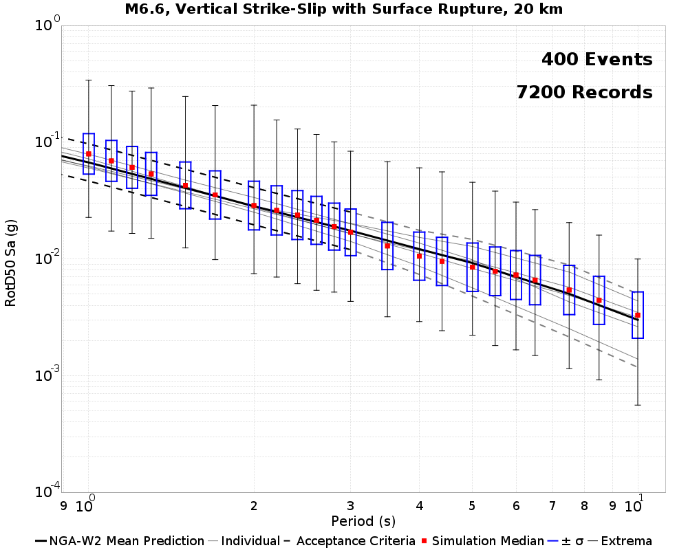 |  | 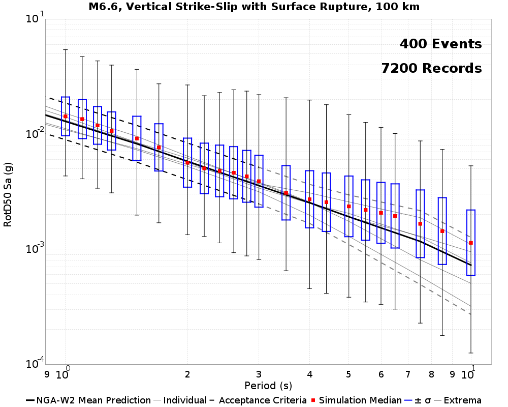 |
| LA Basin 500 (m/s) | no | [Page Link](../bbp_LA_BASIN_500/bbp_part_b) | **FAIL**, Max Ln Fail: -0.026501494 | **FAIL**, Max Ln Fail: -0.03552638 | *N/A* |
|  |  |  |  |  |  |
| LA Basin 500 (m/s) | yes | [Page Link](../bbp_LA_BASIN_500/rotated_ruptures_m6p6_vert_ss_surface) | **FAIL**, Max Ln Fail: -0.02202357 | **FAIL**, Max Ln Fail: -0.04429825 | *(FAIL)*, Max Ln Fail: -0.05429953 |
|  |  |  |  |  |  |

### M6.6, Reverse, Dip=45, Ztor=3
*[(top)](#table-of-contents)*

| Velocity Model | Rotation? | Link | 20.0 km | 50.0 km | 100.0 km |
|-----|-----|-----|-----|-----|-----|
| LA Basin 863 (m/s) | no | [Page Link](../bbp_LA_BASIN_863/bbp_part_b) | **PASS** | **PASS** | *N/A* |
|  |  |  |  | 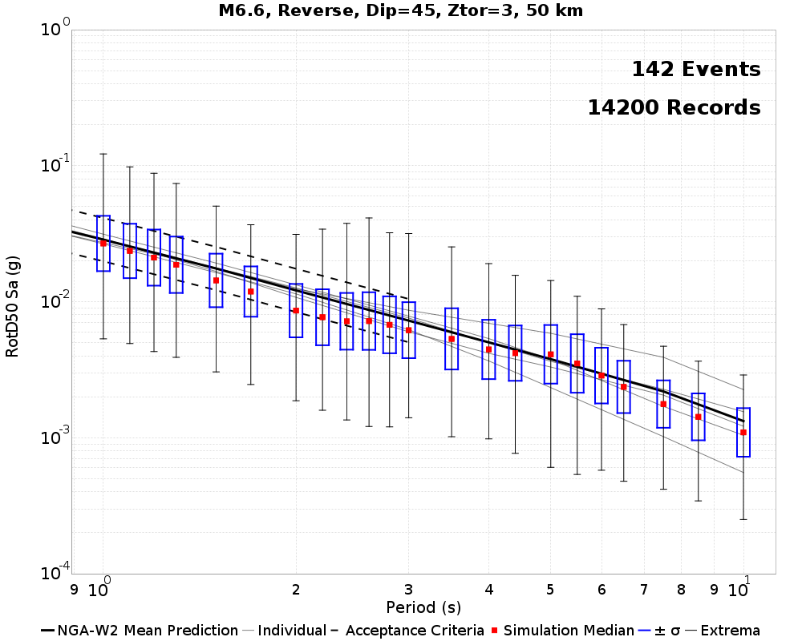 |  |
| LA Basin 863 (m/s) | yes | [Page Link](../bbp_LA_BASIN_863/rotated_ruptures_m6p6_reverse) | **FAIL**, Max Ln Fail: -3.0430473E-4 | **PASS** | *(PASS)* |
|  |  |  | 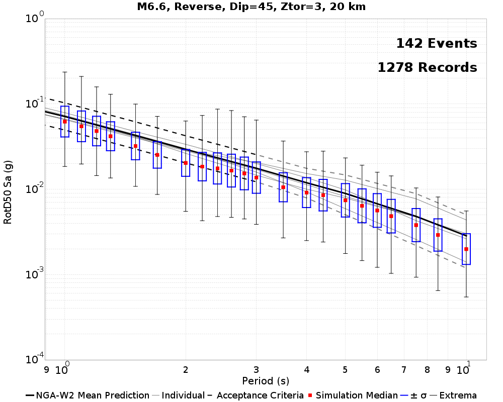 | 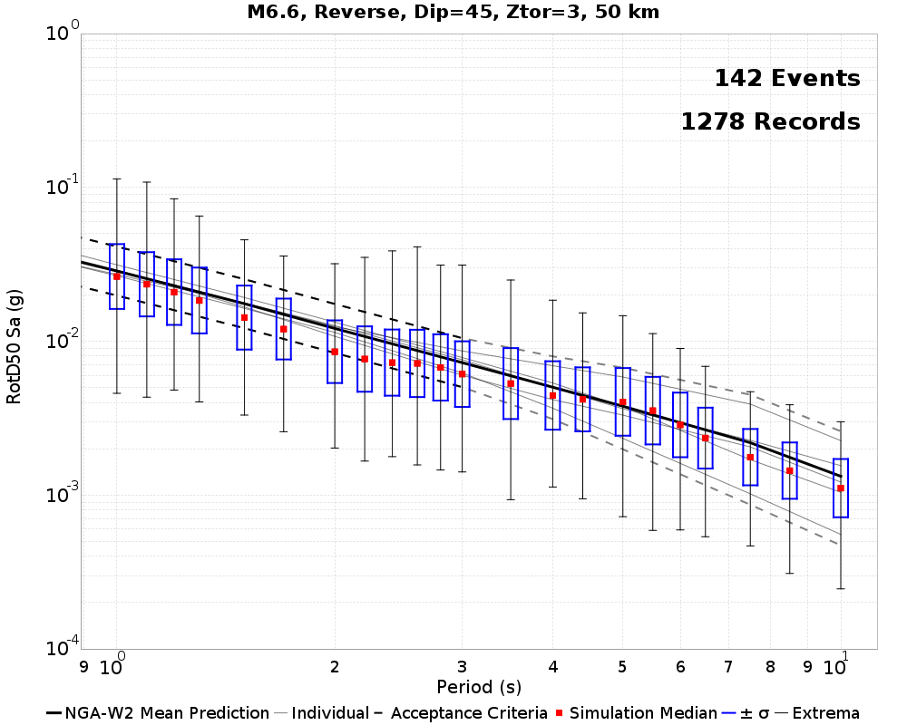 | 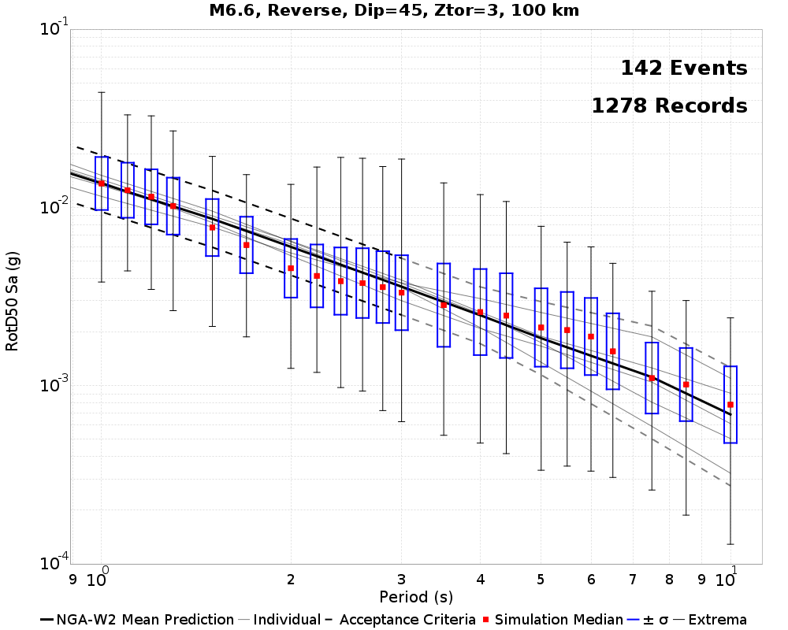 |
| LA Basin 500 (m/s) | no | [Page Link](../bbp_LA_BASIN_500/bbp_part_b) | **FAIL**, Max Ln Fail: -0.31272474 | **FAIL**, Max Ln Fail: -0.24618043 | *N/A* |
|  |  |  |  |  |  |
| LA Basin 500 (m/s) | yes | [Page Link](../bbp_LA_BASIN_500/rotated_ruptures_m6p6_reverse) | **FAIL**, Max Ln Fail: -0.3436171 | **FAIL**, Max Ln Fail: -0.25448194 | *(FAIL)*, Max Ln Fail: -0.1595632 |
|  |  |  |  |  |  |

### M7.2, Vertical Strike-Slip with Surface Rupture
*[(top)](#table-of-contents)*

| Velocity Model | Rotation? | Link | 20.0 km | 50.0 km | 100.0 km |
|-----|-----|-----|-----|-----|-----|
| LA Basin 863 (m/s) | yes | [Page Link](../bbp_LA_BASIN_863/rotated_ruptures_m7p2_vert_ss_surface) | *(FAIL)*, Max Ln Fail: 0.48618278 | *(FAIL)*, Max Ln Fail: 0.4000601 | *(FAIL)*, Max Ln Fail: 0.2716579 |
|  |  |  | 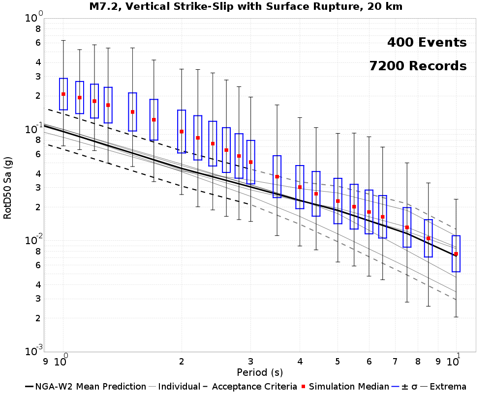 | 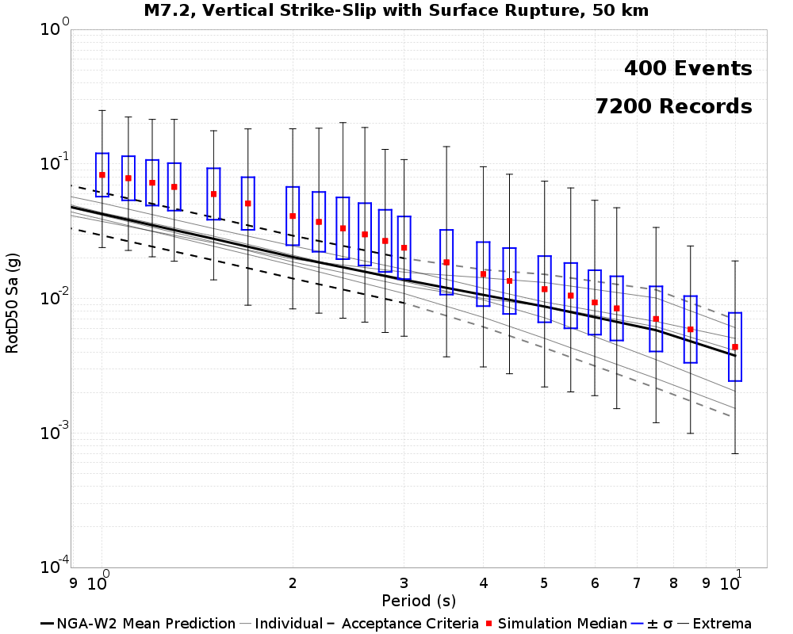 |  |
| LA Basin 500 (m/s) | no | [Page Link](../bbp_LA_BASIN_500/bbp_part_b) | *(FAIL)*, Max Ln Fail: 0.34203008 | *(FAIL)*, Max Ln Fail: 0.016803756 | *N/A* |
|  |  |  |  |  |  |
| LA Basin 500 (m/s) | yes | [Page Link](../bbp_LA_BASIN_500/rotated_ruptures_m7p2_vert_ss_surface) | *(FAIL)*, Max Ln Fail: 0.19656545 | *(FAIL)*, Max Ln Fail: 0.026863437 | *(FAIL)*, Max Ln Fail: 0.06008641 |
|  |  |  |  |  |  |

### M7.2, Reverse, Dip=45
*[(top)](#table-of-contents)*

| Velocity Model | Rotation? | Link | 20.0 km | 50.0 km | 100.0 km |
|-----|-----|-----|-----|-----|-----|
| LA Basin 863 (m/s) | yes | [Page Link](../bbp_LA_BASIN_863/rotated_ruptures_m7p2_reverse) | *(FAIL)*, Max Ln Fail: 0.22424392 | *(FAIL)*, Max Ln Fail: 0.23314002 | *(FAIL)*, Max Ln Fail: 0.2074014 |
|  |  |  |  | 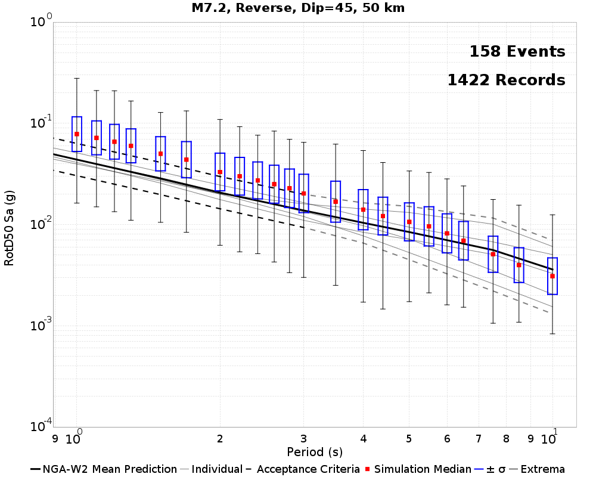 | 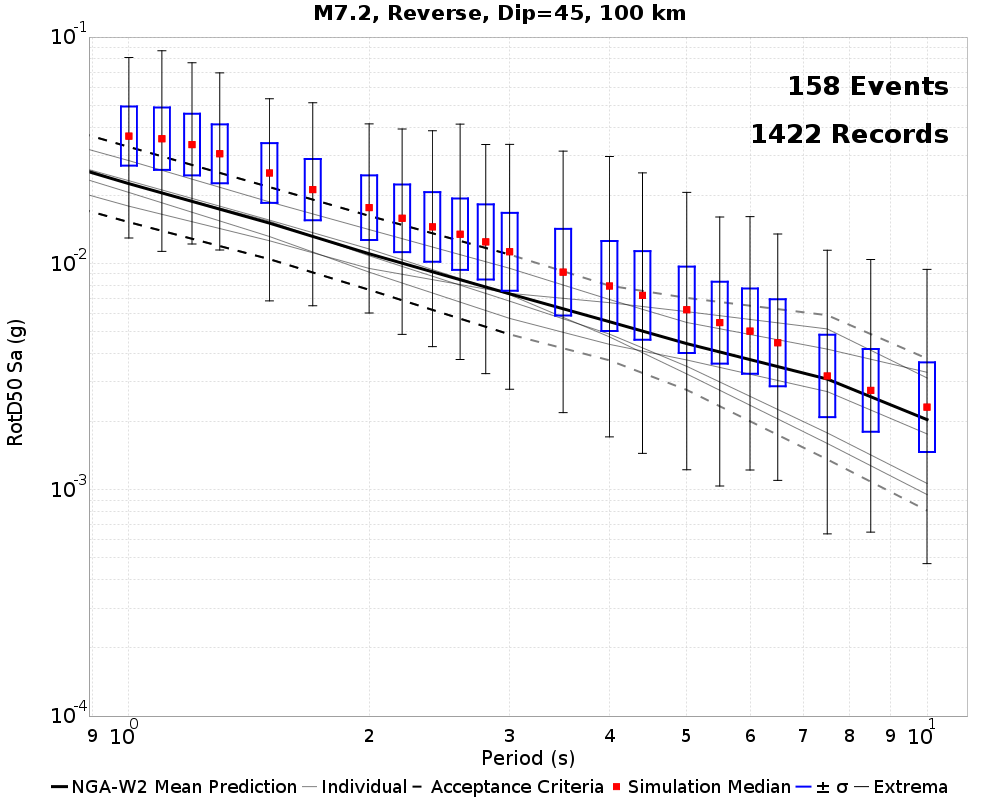 |
| LA Basin 500 (m/s) | no | [Page Link](../bbp_LA_BASIN_500/bbp_part_b) | *(PASS)* | *(PASS)* | *N/A* |
|  |  |  |  |  |  |
| LA Basin 500 (m/s) | yes | [Page Link](../bbp_LA_BASIN_500/rotated_ruptures_m7p2_reverse) | *(PASS)* | *(PASS)* | *(PASS)* |
|  |  |  | 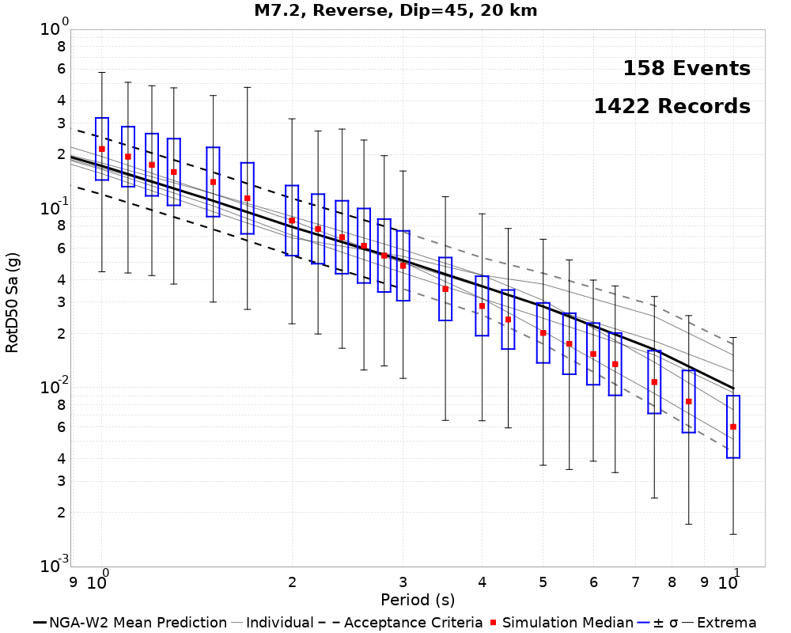 | 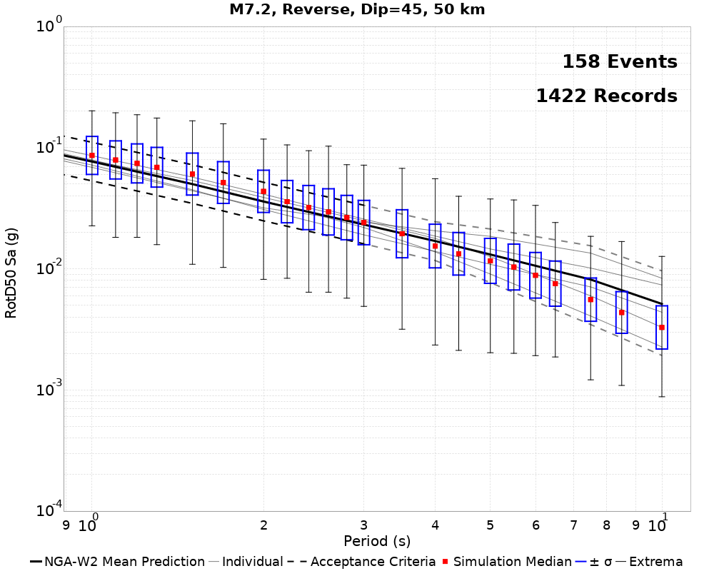 |  |

### M7.6, Vertical Strike-Slip with Surface Rupture
*[(top)](#table-of-contents)*

| Velocity Model | Rotation? | Link | 20.0 km | 50.0 km | 100.0 km |
|-----|-----|-----|-----|-----|-----|
| LA Basin 863 (m/s) | yes | [Page Link](../bbp_LA_BASIN_863/rotated_ruptures_m7p6_vert_ss_surface) | *(FAIL)*, Max Ln Fail: 0.7548017 | *(FAIL)*, Max Ln Fail: 0.5500974 | *(FAIL)*, Max Ln Fail: 0.2588784 |
|  |  |  |  |  | 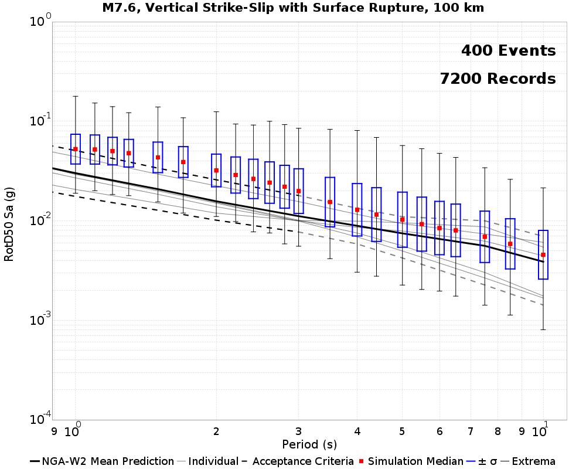 |
| LA Basin 500 (m/s) | no | [Page Link](../bbp_LA_BASIN_500/bbp_part_b) | *(FAIL)*, Max Ln Fail: 0.46908635 | *(FAIL)*, Max Ln Fail: 0.27621907 | *N/A* |
|  |  |  |  |  |  |
| LA Basin 500 (m/s) | yes | [Page Link](../bbp_LA_BASIN_500/rotated_ruptures_m7p6_vert_ss_surface) | *(FAIL)*, Max Ln Fail: 0.39212325 | *(FAIL)*, Max Ln Fail: 0.1552544 | *(PASS)* |
|  |  |  |  | 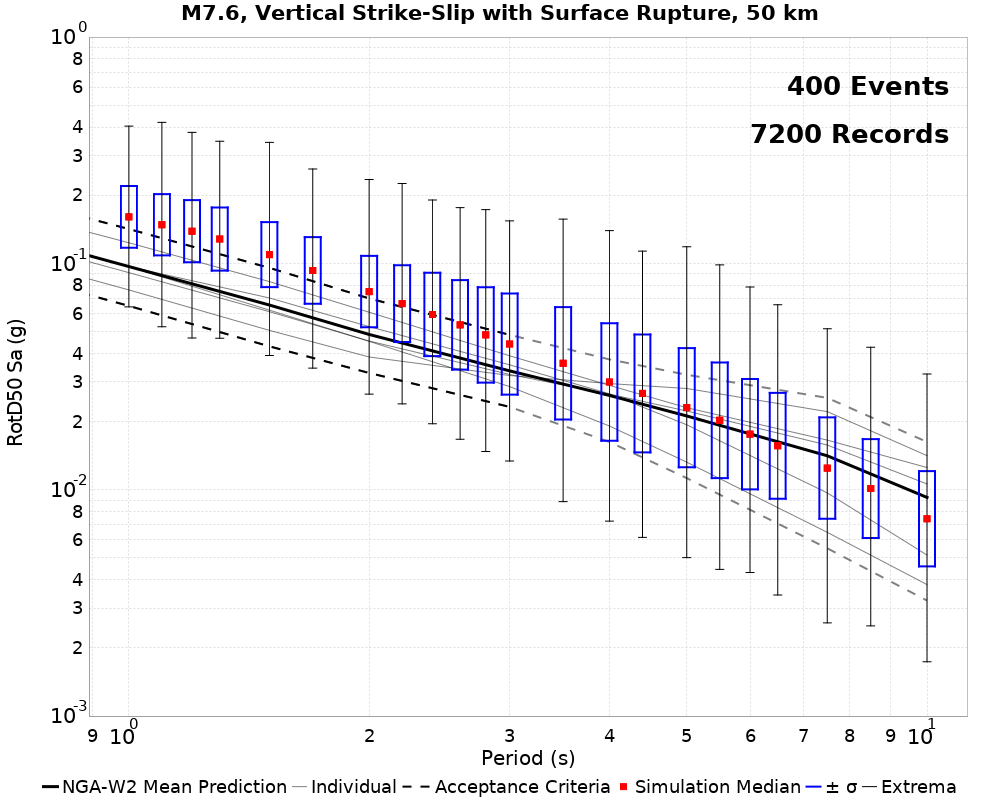 |  |

### M7.6, Reverse, Dip=45
*[(top)](#table-of-contents)*

| Velocity Model | Rotation? | Link | 20.0 km | 50.0 km | 100.0 km |
|-----|-----|-----|-----|-----|-----|
| LA Basin 863 (m/s) | yes | [Page Link](../bbp_LA_BASIN_863/rotated_ruptures_m7p6_reverse) | *(FAIL)*, Max Ln Fail: 0.6813394 | *(FAIL)*, Max Ln Fail: 0.5887081 | *(FAIL)*, Max Ln Fail: 0.43806335 |
|  |  |  | 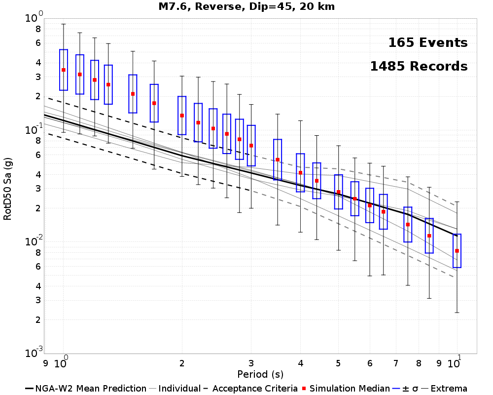 |  | 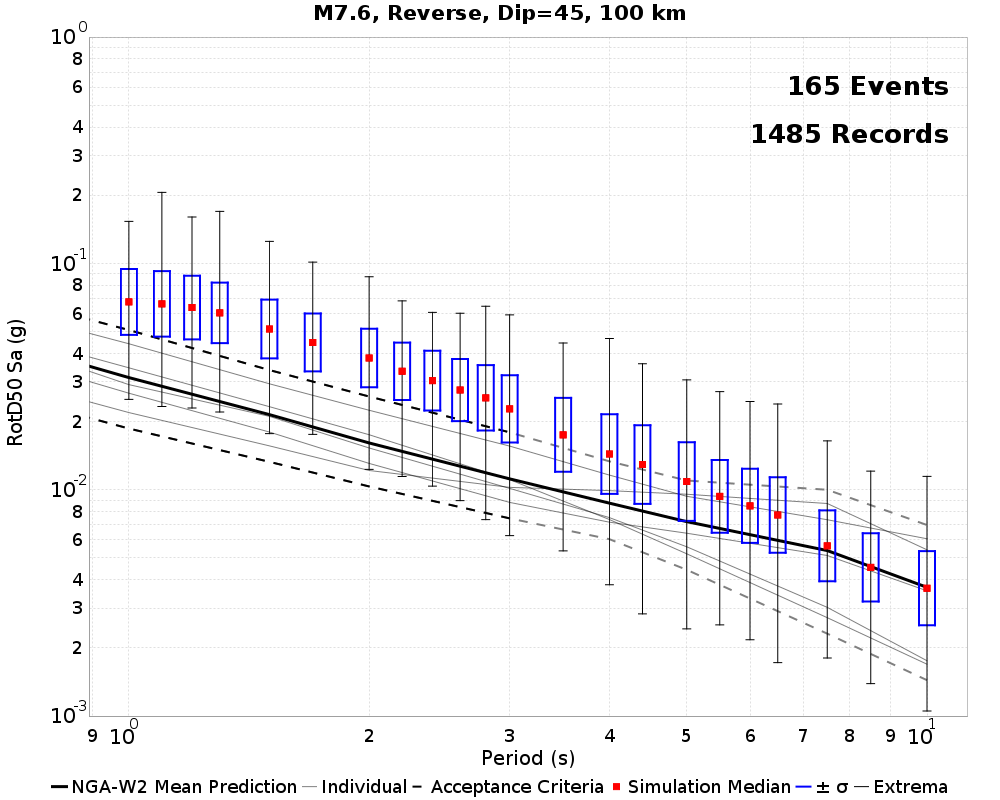 |
| LA Basin 500 (m/s) | no | [Page Link](../bbp_LA_BASIN_500/bbp_part_b) | *(FAIL)*, Max Ln Fail: 0.5856252 | *(FAIL)*, Max Ln Fail: 0.22480956 | *N/A* |
|  |  |  | 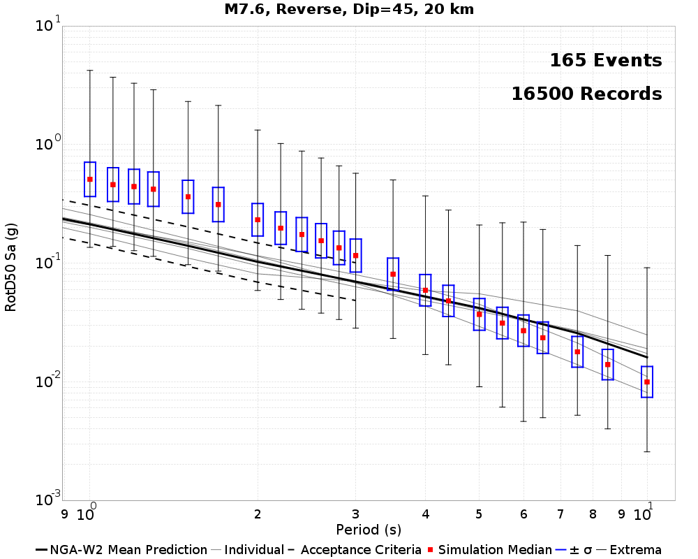 | 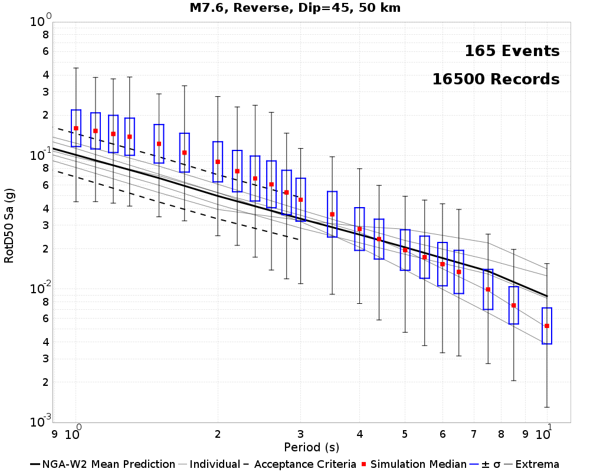 |  |
| LA Basin 500 (m/s) | yes | [Page Link](../bbp_LA_BASIN_500/rotated_ruptures_m7p6_reverse) | *(FAIL)*, Max Ln Fail: 0.3282838 | *(FAIL)*, Max Ln Fail: 0.21737458 | *(FAIL)*, Max Ln Fail: 0.19641219 |
|  |  |  |  |  | 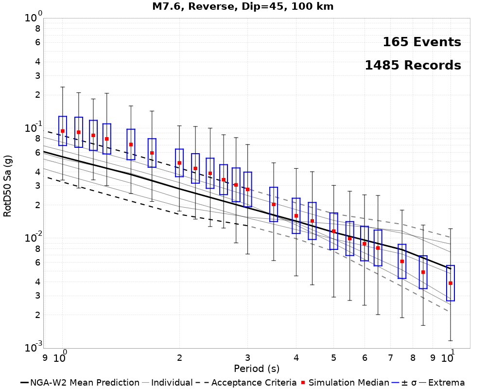 |

