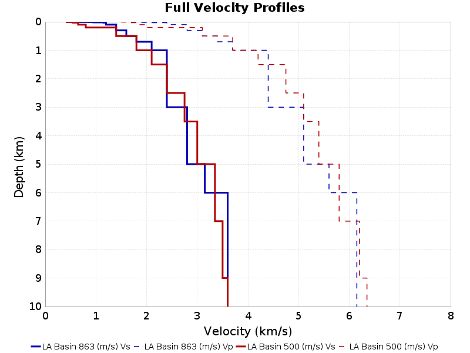
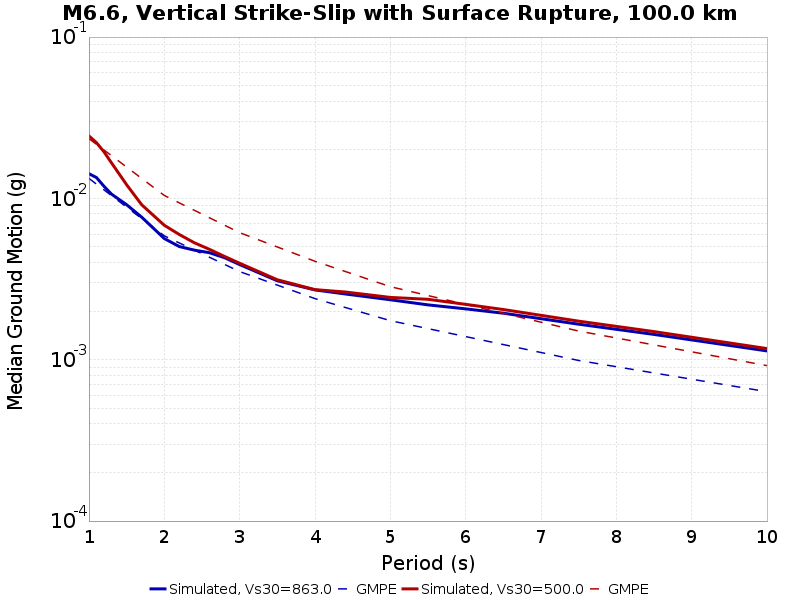
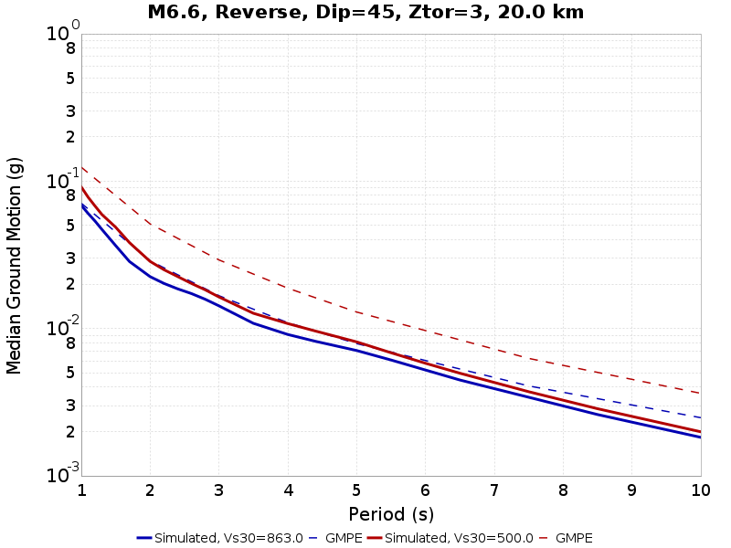
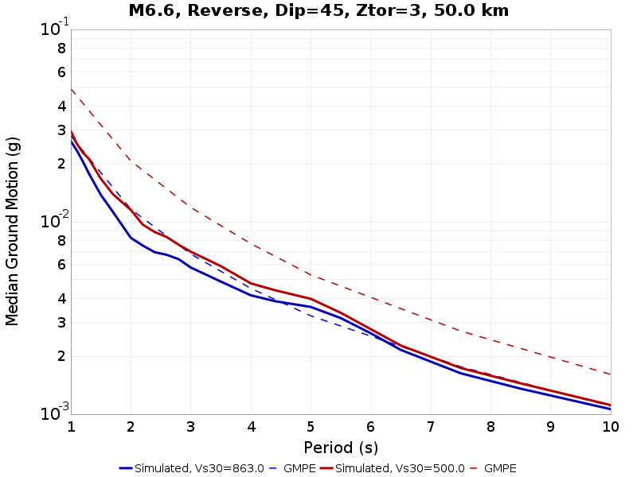
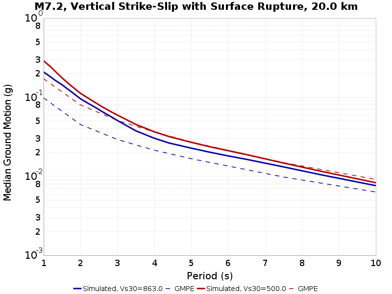
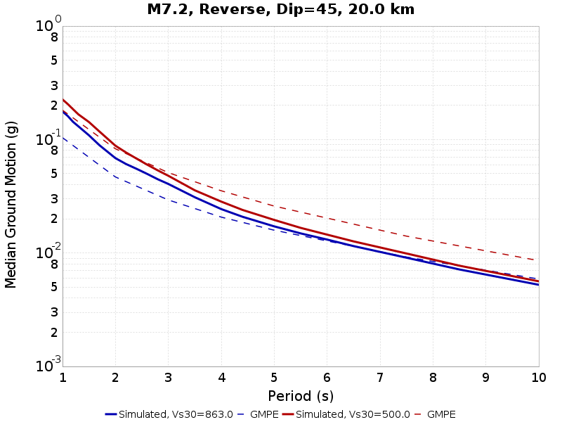
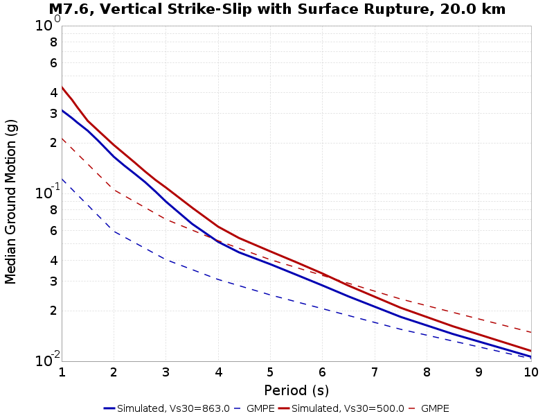
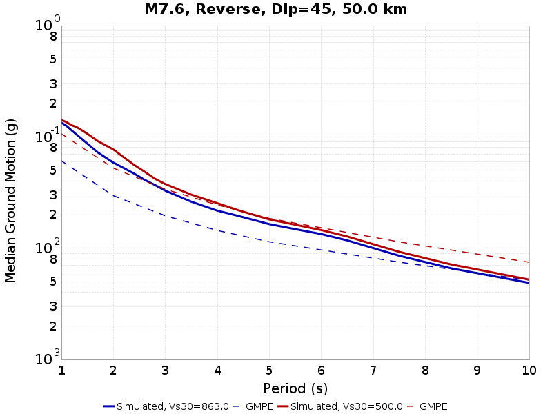
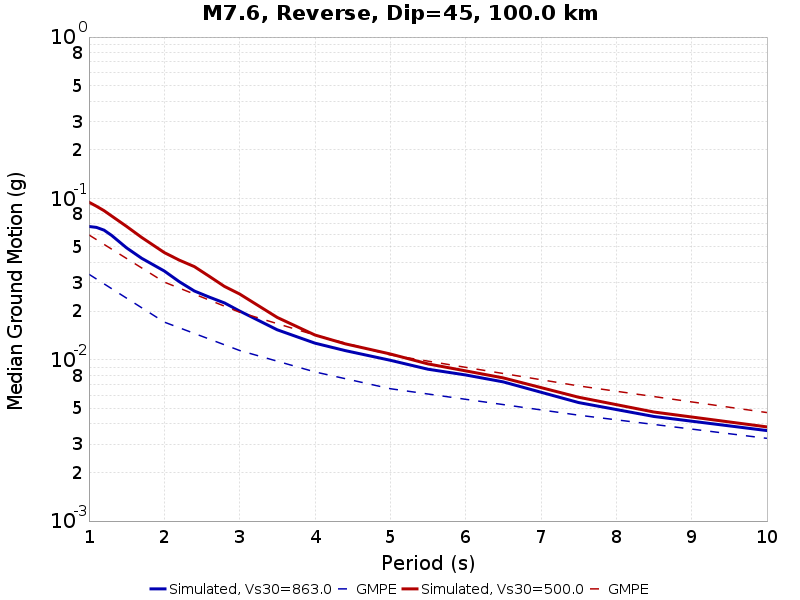

# Scenario-Based BBP Velocity Model Comparisons

This page contains comparisons of BBP simulations for the same RSQSim catalog with different 1-dimensional layered velocity structures. Simulations are done for various scenario ruptures (we search the RSQSim catalog for matching events). This page uses results computed for the rupture rotation variability study.

The following velocity models are shown:

* LA Basin 863 (m/s), Vs30=863.0 m/s
* LA Basin 500 (m/s), Vs30=500.0 m/s

We compare results with the following GMPE(s):

* Abrahamson, Silva & Kamai (2014)
* Boore, Stewart, Seyhan & Atkinson (2014)
* Campbell & Bozorgnia (2014)
* Chiou & Youngs (2014)

## Table Of Contents
* [Velocity Model Profiles](#velocity-model-profiles)
* [M6.6, Vertical Strike-Slip with Surface Rupture](#m66-vertical-strike-slip-with-surface-rupture)
* [M6.6, Reverse, Dip=45, Ztor=3](#m66-reverse-dip45-ztor3)
* [M7.2, Vertical Strike-Slip with Surface Rupture](#m72-vertical-strike-slip-with-surface-rupture)
* [M7.2, Reverse, Dip=45](#m72-reverse-dip45)
* [M7.6, Vertical Strike-Slip with Surface Rupture](#m76-vertical-strike-slip-with-surface-rupture)
* [M7.6, Reverse, Dip=45](#m76-reverse-dip45)
## Velocity Model Profiles
*[(top)](#table-of-contents)*

### LA Basin 863 (m/s) Profile
*[(top)](#table-of-contents)*

| Start Depth (km) | End Depth (km) | Thickness (km) | Vs (km/s) | Vp (km/s) |
|-----|-----|-----|-----|-----|
| 0.0 | 0.002 | 0.002 | 0.45 | 1.7 |
| 0.002 | 0.006 | 0.004 | 0.65 | 1.8 |
| 0.006 | 0.012 | 0.006 | 0.85 | 1.8 |
| 0.012 | 0.02 | 0.008 | 0.95 | 1.9 |
| 0.02 | 0.03 | 0.01 | 1.15 | 2.0 |
| 0.03 | 0.1 | 0.07 | 1.2 | 2.4 |
| 0.1 | 0.3 | 0.2 | 1.4 | 2.8 |
| 0.3 | 0.5 | 0.2 | 1.6 | 3.1 |
| 0.5 | 0.7 | 0.2 | 1.8 | 3.4 |
| 0.7 | 1.0 | 0.3 | 2.1 | 3.7 |
| 1.0 | 3.0 | 2.0 | 2.4 | 4.4 |
| 3.0 | 5.0 | 2.0 | 2.8 | 5.1 |
| 5.0 | 6.0 | 1.0 | 3.15 | 5.6 |
| 6.0 | 11.0 | 5.0 | 3.6 | 6.15 |
| 11.0 | 16.0 | 5.0 | 3.65 | 6.32 |
| 16.0 | 21.0 | 5.0 | 3.7 | 6.55 |
| 21.0 | 31.0 | 10.0 | 3.8 | 6.8 |
| 31.0 | 1030.0 | 999.0 | 4.5 | 7.8 |

### LA Basin 500 (m/s) Profile
*[(top)](#table-of-contents)*

| Start Depth (km) | End Depth (km) | Thickness (km) | Vs (km/s) | Vp (km/s) |
|-----|-----|-----|-----|-----|
| 0.0 | 0.01 | 0.01 | 0.425 | 1.5 |
| 0.01 | 0.03 | 0.02 | 0.538 | 1.6 |
| 0.03 | 0.1 | 0.07 | 0.65 | 1.8 |
| 0.1 | 0.2 | 0.1 | 0.8 | 2.0 |
| 0.2 | 0.5 | 0.3 | 1.4 | 3.1 |
| 0.5 | 1.0 | 0.5 | 1.8 | 3.7 |
| 1.0 | 1.5 | 0.5 | 2.1 | 4.2 |
| 1.5 | 2.5 | 1.0 | 2.4 | 4.75 |
| 2.5 | 3.5 | 1.0 | 2.75 | 5.1 |
| 3.5 | 5.0 | 1.5 | 3.0 | 5.4 |
| 5.0 | 7.0 | 2.0 | 3.35 | 5.8 |
| 7.0 | 9.0 | 2.0 | 3.5 | 6.2 |
| 9.0 | 17.0 | 8.0 | 3.6 | 6.35 |
| 17.0 | 30.0 | 13.0 | 3.8 | 6.8 |
| 30.0 | 1029.0 | 999.0 | 4.5 | 7.8 |

### Z1.0 and Z2.5 Comparisons
*[(top)](#table-of-contents)*

| VM Name | VM Z1.0 (km) | ASK 2014 Z1.0 (km) | BSSA 2014 Z1.0 (km) | CY 2014 Z1.0 (km) | VM Z2.5 (km) | CB 2014 Z2.5 (km) |
|-----|-----|-----|-----|-----|-----|-----|
| **LA Basin 863 (m/s)** | **0.02** | 0.023041464 | 0.019953089 | 0.01995113 | **3.0** | 0.52470744 |
| **LA Basin 500 (m/s)** | **0.2** | 0.24750118 | 0.22898823 | 0.2288851 | **2.5** | 0.9796973 |

## M6.6, Vertical Strike-Slip with Surface Rupture
*[(top)](#table-of-contents)*

Median spectra shown across 400 RSQSim events which match the following scenario criteria:

* M=[6.55,6.65]
* Ztor=[0.0,1.0]
* Rake=[-180,-170] or [-10,10] or [170,180]
* Dip=90.0
* Linear rupture (max 0.5km deviation from ideal)

### M6.6, Vertical Strike-Slip with Surface Rupture, 20.0 km
*[(top)](#table-of-contents)*

### M6.6, Vertical Strike-Slip with Surface Rupture, 50.0 km
*[(top)](#table-of-contents)*

### M6.6, Vertical Strike-Slip with Surface Rupture, 100.0 km
*[(top)](#table-of-contents)*

## M6.6, Reverse, Dip=45, Ztor=3
*[(top)](#table-of-contents)*

Median spectra shown across 142 RSQSim events which match the following scenario criteria:

* M=[6.55,6.65]
* Ztor=[1.0,5.0]
* Rake=[80,100]
* Dip=[35.0,55.0]

### M6.6, Reverse, Dip=45, Ztor=3, 20.0 km
*[(top)](#table-of-contents)*

### M6.6, Reverse, Dip=45, Ztor=3, 50.0 km
*[(top)](#table-of-contents)*

### M6.6, Reverse, Dip=45, Ztor=3, 100.0 km
*[(top)](#table-of-contents)*

## M7.2, Vertical Strike-Slip with Surface Rupture
*[(top)](#table-of-contents)*

Median spectra shown across 400 RSQSim events which match the following scenario criteria:

* M=[7.15,7.25]
* Ztor=[0.0,1.0]
* Rake=[-180,-170] or [-10,10] or [170,180]
* Dip=90.0
* Linear rupture (max 5.0% deviation from ideal)

### M7.2, Vertical Strike-Slip with Surface Rupture, 20.0 km
*[(top)](#table-of-contents)*

### M7.2, Vertical Strike-Slip with Surface Rupture, 50.0 km
*[(top)](#table-of-contents)*

### M7.2, Vertical Strike-Slip with Surface Rupture, 100.0 km
*[(top)](#table-of-contents)*

## M7.2, Reverse, Dip=45
*[(top)](#table-of-contents)*

Median spectra shown across 158 RSQSim events which match the following scenario criteria:

* M=[7.15,7.25]
* Ztor=[0.0,5.0]
* Rake=[80,100]
* Dip=[35.0,55.0]

### M7.2, Reverse, Dip=45, 20.0 km
*[(top)](#table-of-contents)*

### M7.2, Reverse, Dip=45, 50.0 km
*[(top)](#table-of-contents)*

### M7.2, Reverse, Dip=45, 100.0 km
*[(top)](#table-of-contents)*

## M7.6, Vertical Strike-Slip with Surface Rupture
*[(top)](#table-of-contents)*

Median spectra shown across 400 RSQSim events which match the following scenario criteria:

* M=[7.55,7.65]
* Ztor=[0.0,1.0]
* Rake=[-180,-170] or [-10,10] or [170,180]
* Dip=90.0
* Linear rupture (max 5.0% deviation from ideal)

### M7.6, Vertical Strike-Slip with Surface Rupture, 20.0 km
*[(top)](#table-of-contents)*

### M7.6, Vertical Strike-Slip with Surface Rupture, 50.0 km
*[(top)](#table-of-contents)*

### M7.6, Vertical Strike-Slip with Surface Rupture, 100.0 km
*[(top)](#table-of-contents)*

## M7.6, Reverse, Dip=45
*[(top)](#table-of-contents)*

Median spectra shown across 165 RSQSim events which match the following scenario criteria:

* M=[7.55,7.65]
* Ztor=[0.0,5.0]
* Rake=[80,100]
* Dip=[35.0,55.0]

### M7.6, Reverse, Dip=45, 20.0 km
*[(top)](#table-of-contents)*

### M7.6, Reverse, Dip=45, 50.0 km
*[(top)](#table-of-contents)*

### M7.6, Reverse, Dip=45, 100.0 km
*[(top)](#table-of-contents)*

