# Bruce 2585 1myr Extreme Events

*Subsections participate in a rupture if at least 20.0 % of its area ruptures*

[Catalog Details](../#bruce-2585-1myr)

## Table Of Contents
* [Subsection Count](#subsection-count)
  * [Subsection Count Histogram](#subsection-count-histogram)
  * [Subsection Count Events](#subsection-count-events)
* [Parent Section Count](#parent-section-count)
  * [Parent Section Count Histogram](#parent-section-count-histogram)
  * [Parent Section Count Events](#parent-section-count-events)
* [Mapped Length Ratio](#mapped-length-ratio)
  * [Mapped Length Ratio Histogram](#mapped-length-ratio-histogram)
  * [Mapped Length Ratio Events](#mapped-length-ratio-events)
* [Mapped Excess Length](#mapped-excess-length)
  * [Mapped Excess Length Histogram](#mapped-excess-length-histogram)
  * [Mapped Excess Length Events](#mapped-excess-length-events)
* [Moment Off Mapped Rupture](#moment-off-mapped-rupture)
  * [Moment Off Mapped Rupture Histogram](#moment-off-mapped-rupture-histogram)
  * [Moment Off Mapped Rupture Events](#moment-off-mapped-rupture-events)
* [Magnitude](#magnitude)
  * [Magnitude Histogram](#magnitude-histogram)
  * [Magnitude Events](#magnitude-events)
* [Moment >100km from Mapped](#moment-100km-from-mapped)
  * [Moment >100km from Mapped Histogram](#moment-100km-from-mapped-histogram)
  * [Moment >100km from Mapped Events](#moment-100km-from-mapped-events)
## Subsection Count
*[(top)](#table-of-contents)*

Total count of mapped UCERF3 subsections (e.g. SAF Mojave S Subsection 3), after application of minimum subsection area filter

### Subsection Count Histogram
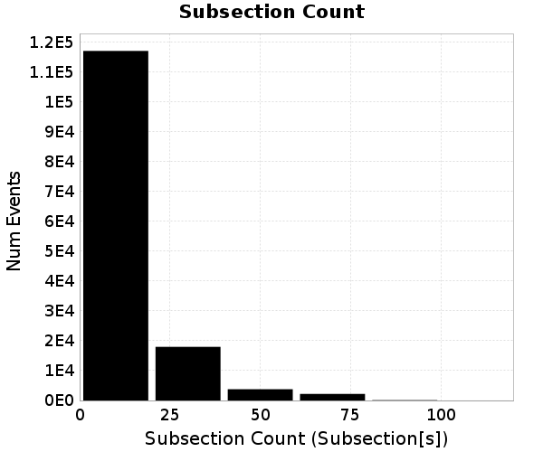
### Subsection Count Events
*[(top)](#table-of-contents)*

| Event ID | Subsection Count | Plot |
|-----|-----|-----|
| **9093914** | **108 (Subsection[s])** |  |
| **9893808** | **105 (Subsection[s])** |  |
| **3485081** | **102 (Subsection[s])** |  |
| **7126672** | **101 (Subsection[s])** |  |
| **1441573** | **93 (Subsection[s])** |  |

## Parent Section Count
*[(top)](#table-of-contents)*

Total count of mapped UCERF3 subsections (e.g. SAF Mojave S), after application of minimum subsection area filter

### Parent Section Count Histogram
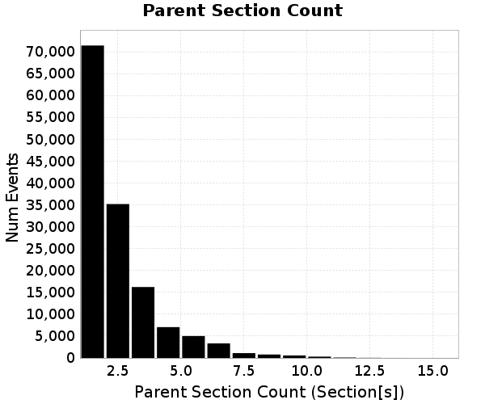
### Parent Section Count Events
*[(top)](#table-of-contents)*

| Event ID | Parent Section Count | Plot |
|-----|-----|-----|
| **671658** | **15 (Section[s])** | 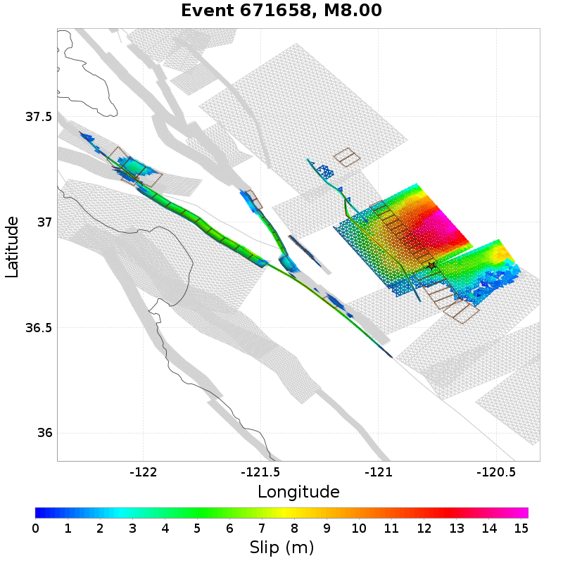 |
| **4159477** | **14 (Section[s])** |  |
| **2462426** | **13 (Section[s])** |  |
| **2923570** | **13 (Section[s])** | 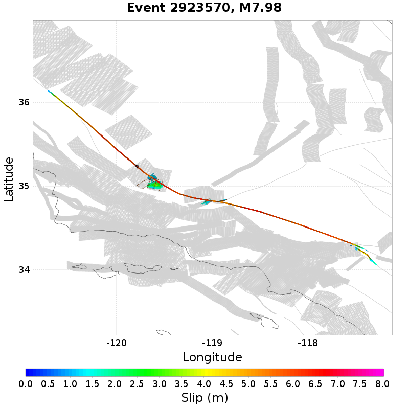 |
| **10685166** | **13 (Section[s])** | 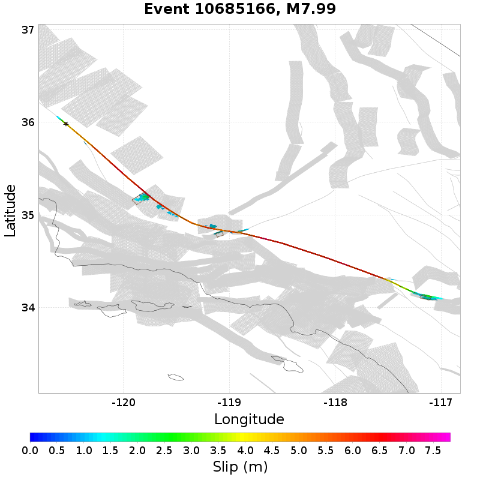 |

## Mapped Length Ratio
*[(top)](#table-of-contents)*

Ratio of the total rupture length (UCERF3 mapped subsection rupture) to the idealized length, defined as the straight line distance between the furthest 2 subsections

### Mapped Length Ratio Histogram

### Mapped Length Ratio Events
*[(top)](#table-of-contents)*

| Event ID | Mapped Length Ratio | Plot |
|-----|-----|-----|
| **11024434** | **3.56** |  |
| **9644870** | **3.48** | 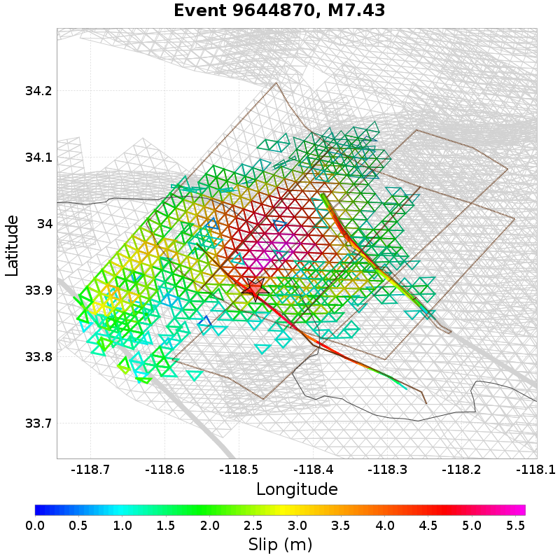 |
| **7652000** | **3.42** | 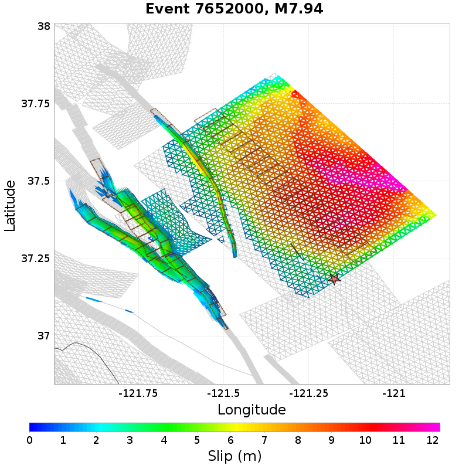 |
| **4501619** | **3.42** |  |
| **2467686** | **3.4** |  |

## Mapped Excess Length
*[(top)](#table-of-contents)*

Total rupture length (UCERF3 mapped subsection rupture) minus the idealized length, defined as the straight line distance between the furthest 2 subsections

### Mapped Excess Length Histogram
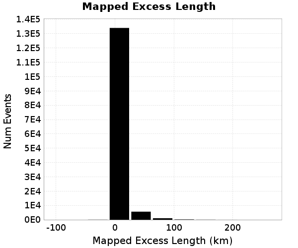
### Mapped Excess Length Events
*[(top)](#table-of-contents)*

| Event ID | Mapped Excess Length | Plot |
|-----|-----|-----|
| **671658** | **264.3 (km)** |  |
| **6651015** | **219.25 (km)** | 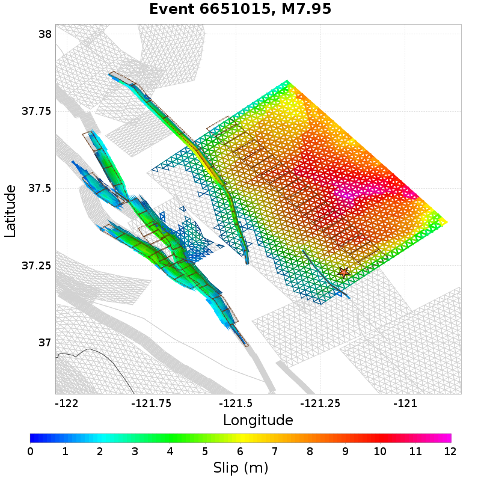 |
| **8324165** | **219.09 (km)** | 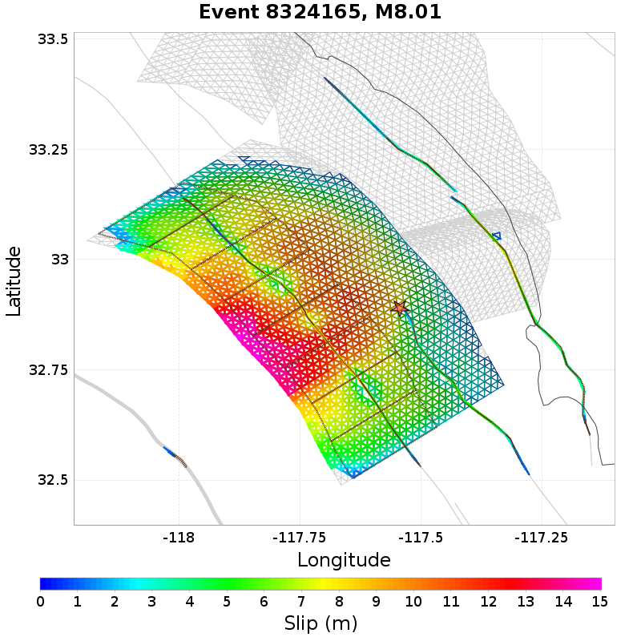 |
| **2107876** | **210.8 (km)** | 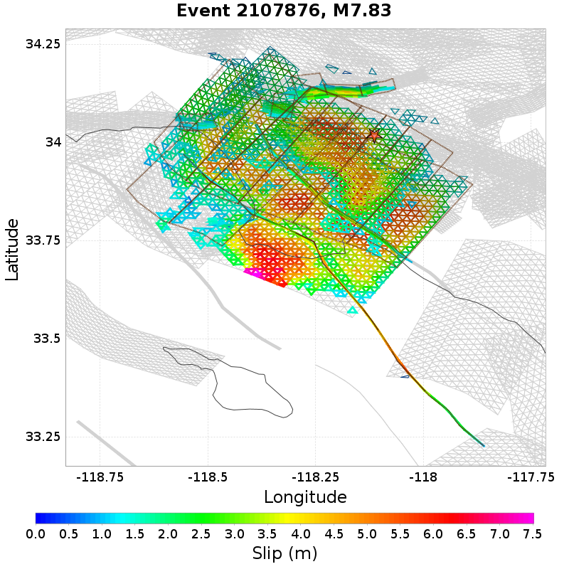 |
| **11024434** | **203.75 (km)** |  |

## Moment Off Mapped Rupture
*[(top)](#table-of-contents)*

Moment of simulator elements not included in mapped UCERF3 subsection rupture

### Moment Off Mapped Rupture Histogram
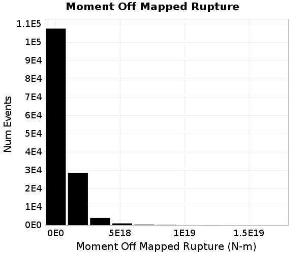
### Moment Off Mapped Rupture Events
*[(top)](#table-of-contents)*

| Event ID | Moment Off Mapped Rupture | Plot |
|-----|-----|-----|
| **1450493** | **1.7194901E19 (N-m)** |  |
| **3286706** | **1.634477E19 (N-m)** | 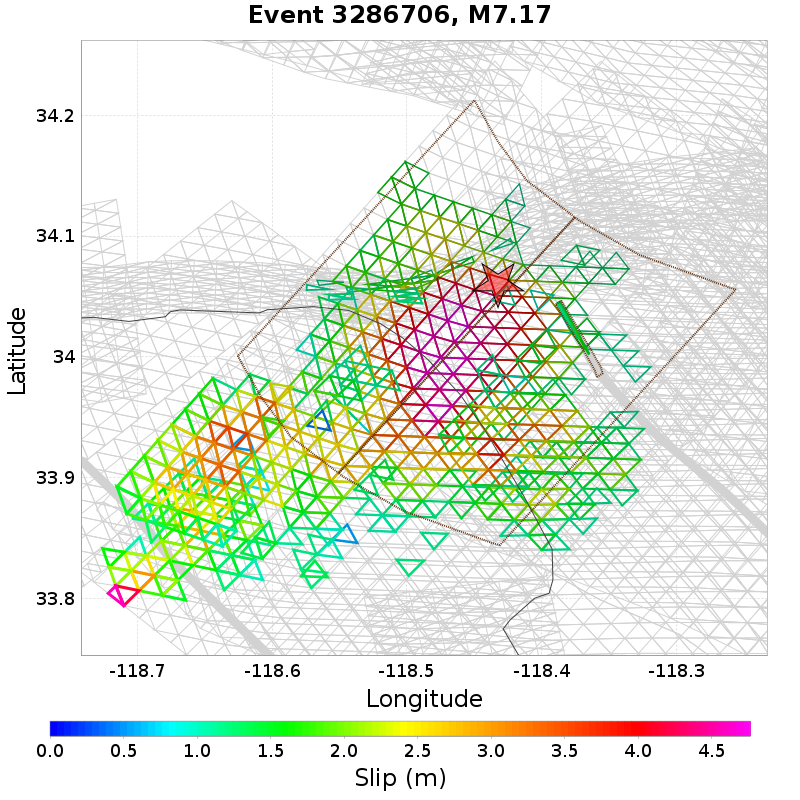 |
| **3817386** | **1.5599315E19 (N-m)** |  |
| **10898611** | **1.5166895E19 (N-m)** |  |
| **6381066** | **1.4625452E19 (N-m)** |  |

## Magnitude
*[(top)](#table-of-contents)*

Event Moment Magnitude

### Magnitude Histogram

### Magnitude Events
*[(top)](#table-of-contents)*

| Event ID | Magnitude | Plot |
|-----|-----|-----|
| **8585746** | **8.05** |  |
| **8184239** | **8.05** |  |
| **7551386** | **8.05** | 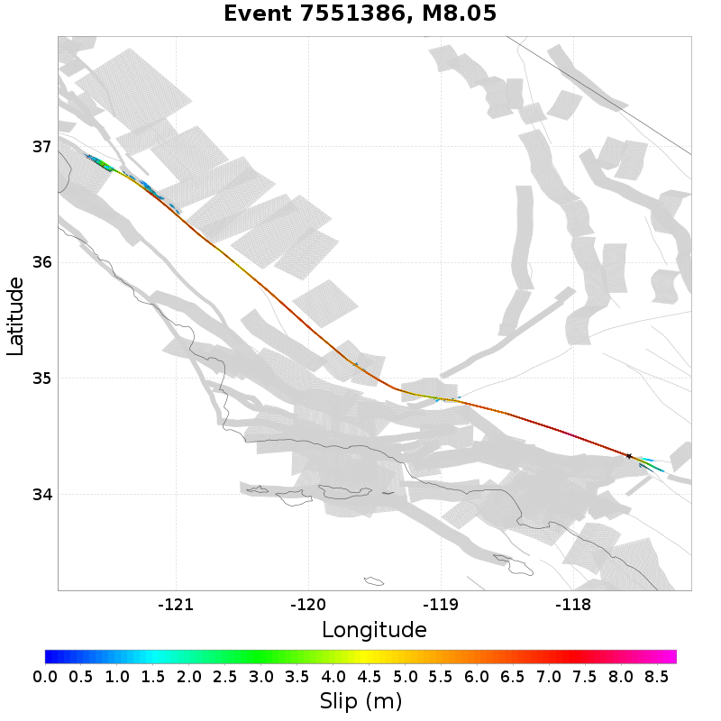 |
| **9093914** | **8.05** |  |
| **4868735** | **8.05** |  |

## Moment >100km from Mapped
*[(top)](#table-of-contents)*

Moment that is at least 100km from the nearest mapped subsection (after application of subsection area threshold)

5 events above threshold of 1 [N-m]
### Moment >100km from Mapped Histogram

### Moment >100km from Mapped Events
*[(top)](#table-of-contents)*

| Event ID | Moment >100km from Mapped | Plot |
|-----|-----|-----|
| **8825881** | **5.9468145E17 (N-m)** | 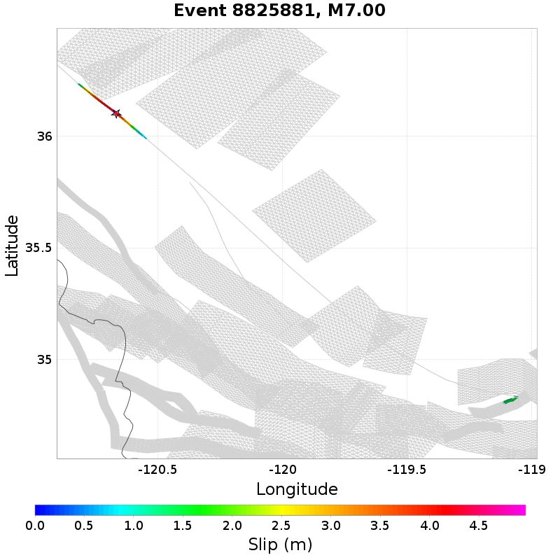 |
| **4033935** | **2.42374677E17 (N-m)** |  |
| **6271357** | **2.34263408E17 (N-m)** | 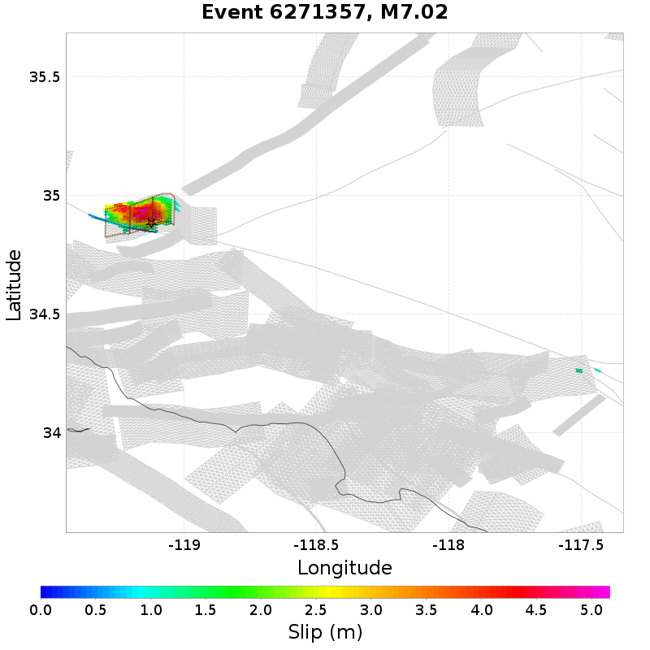 |
| **3938750** | **4.3049119E16 (N-m)** |  |
| **5365953** | **4.073216E16 (N-m)** |  |

