# Bruce 2585 1myr Rotated Rupture Variability, Reverse

This exercise uses translations and rotations to estimate ground motion variability from different sources. We begin by selecting a subset of similar ruptures which match a set of criteria (in this case, Reverse, Dip=45). Each rupture is then reoriented such that its strike (following the Aki & Richards 1980 convention) is 0 degrees (due North, dipping to the right for normal or reverse ruptures). For each site, ruptures are translated such that their scalar seismic moment centroid is directly North of the site, and their Joyner-Boore distance (rJB) is as specified (we consider 10 distance[s] here).

We then  perform various rotations. We rotate the rupture in place around its centroid, holding the site-to-source centroid path and rJB constant (henceforth 'Rupture Strike'). We also rotate ruptures around the site, holding rJB and source orientation relative to the site constant but sampling different various paths (henceforth 'Path'). We do this for each unique combination of Rupture Strike, Path, Joyner-Boore Distance, Site, and Rupture.

*NOTE: This page uses the SCEC BBP to simulate a 1-dimensional velocity structure. Thus we expect no path variability, and plots of path variabilitiy are included only as verification of the method.*

[RSQSim Catalog Details](../#bruce-2585-1myr)

## Table Of Contents
* [Rupture Rotation Parameters](#rupture-rotation-parameters)
* [Reverse RSQSim Rupture Match Criteria](#reverse-rsqsim-rupture-match-criteria)
* [Sites](#sites)
* [Result Summary Table](#result-summary-table)
* [M6.5 Result Summary Table](#m65-result-summary-table)
* [M6.5 Result Summary Table](#m65-result-summary-table)
* [M6.6 Result Summary Table](#m66-result-summary-table)
* [M6.7 Result Summary Table](#m67-result-summary-table)
* [M6.8 Result Summary Table](#m68-result-summary-table)
* [M6.9 Result Summary Table](#m69-result-summary-table)
* [M7 Result Summary Table](#m7-result-summary-table)
* [M7 Result Summary Table](#m7-result-summary-table)
* [M7.1 Result Summary Table](#m71-result-summary-table)
* [M7.2 Result Summary Table](#m72-result-summary-table)
* [M7.3 Result Summary Table](#m73-result-summary-table)
* [Source-strike Variability](#source-strike-variability)
  * [Source-strike Variability Methodology](#source-strike-variability-methodology)
  * [Source-strike Variability Mag-Distance Plots](#source-strike-variability-mag-distance-plots)
  * [20.0 km M6.5 Source-strike Results](#200-km-m65-source-strike-results)
  * [40.0 km M6.5 Source-strike Results](#400-km-m65-source-strike-results)
  * [80.0 km M6.5 Source-strike Results](#800-km-m65-source-strike-results)
  * [160.0 km M6.5 Source-strike Results](#1600-km-m65-source-strike-results)
  * [20.0 km M6.5 Source-strike Results](#200-km-m65-source-strike-results)
  * [40.0 km M6.5 Source-strike Results](#400-km-m65-source-strike-results)
  * [80.0 km M6.5 Source-strike Results](#800-km-m65-source-strike-results)
  * [160.0 km M6.5 Source-strike Results](#1600-km-m65-source-strike-results)
  * [20.0 km M6.6 Source-strike Results](#200-km-m66-source-strike-results)
  * [40.0 km M6.6 Source-strike Results](#400-km-m66-source-strike-results)
  * [80.0 km M6.6 Source-strike Results](#800-km-m66-source-strike-results)
  * [160.0 km M6.6 Source-strike Results](#1600-km-m66-source-strike-results)
  * [20.0 km M6.7 Source-strike Results](#200-km-m67-source-strike-results)
  * [40.0 km M6.7 Source-strike Results](#400-km-m67-source-strike-results)
  * [80.0 km M6.7 Source-strike Results](#800-km-m67-source-strike-results)
  * [160.0 km M6.7 Source-strike Results](#1600-km-m67-source-strike-results)
  * [20.0 km M6.8 Source-strike Results](#200-km-m68-source-strike-results)
  * [40.0 km M6.8 Source-strike Results](#400-km-m68-source-strike-results)
  * [80.0 km M6.8 Source-strike Results](#800-km-m68-source-strike-results)
  * [160.0 km M6.8 Source-strike Results](#1600-km-m68-source-strike-results)
  * [20.0 km M6.9 Source-strike Results](#200-km-m69-source-strike-results)
  * [40.0 km M6.9 Source-strike Results](#400-km-m69-source-strike-results)
  * [80.0 km M6.9 Source-strike Results](#800-km-m69-source-strike-results)
  * [160.0 km M6.9 Source-strike Results](#1600-km-m69-source-strike-results)
  * [20.0 km M7 Source-strike Results](#200-km-m7-source-strike-results)
  * [40.0 km M7 Source-strike Results](#400-km-m7-source-strike-results)
  * [80.0 km M7 Source-strike Results](#800-km-m7-source-strike-results)
  * [160.0 km M7 Source-strike Results](#1600-km-m7-source-strike-results)
  * [20.0 km M7 Source-strike Results](#200-km-m7-source-strike-results)
  * [40.0 km M7 Source-strike Results](#400-km-m7-source-strike-results)
  * [80.0 km M7 Source-strike Results](#800-km-m7-source-strike-results)
  * [160.0 km M7 Source-strike Results](#1600-km-m7-source-strike-results)
  * [20.0 km M7.1 Source-strike Results](#200-km-m71-source-strike-results)
  * [40.0 km M7.1 Source-strike Results](#400-km-m71-source-strike-results)
  * [80.0 km M7.1 Source-strike Results](#800-km-m71-source-strike-results)
  * [160.0 km M7.1 Source-strike Results](#1600-km-m71-source-strike-results)
  * [20.0 km M7.2 Source-strike Results](#200-km-m72-source-strike-results)
  * [40.0 km M7.2 Source-strike Results](#400-km-m72-source-strike-results)
  * [80.0 km M7.2 Source-strike Results](#800-km-m72-source-strike-results)
  * [160.0 km M7.2 Source-strike Results](#1600-km-m72-source-strike-results)
  * [20.0 km M7.3 Source-strike Results](#200-km-m73-source-strike-results)
  * [40.0 km M7.3 Source-strike Results](#400-km-m73-source-strike-results)
  * [80.0 km M7.3 Source-strike Results](#800-km-m73-source-strike-results)
  * [160.0 km M7.3 Source-strike Results](#1600-km-m73-source-strike-results)
* [Within-event Variability](#within-event-variability)
  * [Within-event Variability Methodology](#within-event-variability-methodology)
  * [Within-event Variability Mag-Distance Plots](#within-event-variability-mag-distance-plots)
  * [20.0 km M6.5 Within-event Results](#200-km-m65-within-event-results)
  * [40.0 km M6.5 Within-event Results](#400-km-m65-within-event-results)
  * [80.0 km M6.5 Within-event Results](#800-km-m65-within-event-results)
  * [160.0 km M6.5 Within-event Results](#1600-km-m65-within-event-results)
  * [20.0 km M6.5 Within-event Results](#200-km-m65-within-event-results)
  * [40.0 km M6.5 Within-event Results](#400-km-m65-within-event-results)
  * [80.0 km M6.5 Within-event Results](#800-km-m65-within-event-results)
  * [160.0 km M6.5 Within-event Results](#1600-km-m65-within-event-results)
  * [20.0 km M6.6 Within-event Results](#200-km-m66-within-event-results)
  * [40.0 km M6.6 Within-event Results](#400-km-m66-within-event-results)
  * [80.0 km M6.6 Within-event Results](#800-km-m66-within-event-results)
  * [160.0 km M6.6 Within-event Results](#1600-km-m66-within-event-results)
  * [20.0 km M6.7 Within-event Results](#200-km-m67-within-event-results)
  * [40.0 km M6.7 Within-event Results](#400-km-m67-within-event-results)
  * [80.0 km M6.7 Within-event Results](#800-km-m67-within-event-results)
  * [160.0 km M6.7 Within-event Results](#1600-km-m67-within-event-results)
  * [20.0 km M6.8 Within-event Results](#200-km-m68-within-event-results)
  * [40.0 km M6.8 Within-event Results](#400-km-m68-within-event-results)
  * [80.0 km M6.8 Within-event Results](#800-km-m68-within-event-results)
  * [160.0 km M6.8 Within-event Results](#1600-km-m68-within-event-results)
  * [20.0 km M6.9 Within-event Results](#200-km-m69-within-event-results)
  * [40.0 km M6.9 Within-event Results](#400-km-m69-within-event-results)
  * [80.0 km M6.9 Within-event Results](#800-km-m69-within-event-results)
  * [160.0 km M6.9 Within-event Results](#1600-km-m69-within-event-results)
  * [20.0 km M7 Within-event Results](#200-km-m7-within-event-results)
  * [40.0 km M7 Within-event Results](#400-km-m7-within-event-results)
  * [80.0 km M7 Within-event Results](#800-km-m7-within-event-results)
  * [160.0 km M7 Within-event Results](#1600-km-m7-within-event-results)
  * [20.0 km M7 Within-event Results](#200-km-m7-within-event-results)
  * [40.0 km M7 Within-event Results](#400-km-m7-within-event-results)
  * [80.0 km M7 Within-event Results](#800-km-m7-within-event-results)
  * [160.0 km M7 Within-event Results](#1600-km-m7-within-event-results)
  * [20.0 km M7.1 Within-event Results](#200-km-m71-within-event-results)
  * [40.0 km M7.1 Within-event Results](#400-km-m71-within-event-results)
  * [80.0 km M7.1 Within-event Results](#800-km-m71-within-event-results)
  * [160.0 km M7.1 Within-event Results](#1600-km-m71-within-event-results)
  * [20.0 km M7.2 Within-event Results](#200-km-m72-within-event-results)
  * [40.0 km M7.2 Within-event Results](#400-km-m72-within-event-results)
  * [80.0 km M7.2 Within-event Results](#800-km-m72-within-event-results)
  * [160.0 km M7.2 Within-event Results](#1600-km-m72-within-event-results)
  * [20.0 km M7.3 Within-event Results](#200-km-m73-within-event-results)
  * [40.0 km M7.3 Within-event Results](#400-km-m73-within-event-results)
  * [80.0 km M7.3 Within-event Results](#800-km-m73-within-event-results)
  * [160.0 km M7.3 Within-event Results](#1600-km-m73-within-event-results)
* [Between-events, single-path Variability](#between-events-single-path-variability)
  * [Between-events, single-path Variability Methodology](#between-events-single-path-variability-methodology)
  * [Between-events, single-path Variability Mag-Distance Plots](#between-events-single-path-variability-mag-distance-plots)
  * [20.0 km M6.5 Between-events, single-path Results](#200-km-m65-between-events-single-path-results)
  * [40.0 km M6.5 Between-events, single-path Results](#400-km-m65-between-events-single-path-results)
  * [80.0 km M6.5 Between-events, single-path Results](#800-km-m65-between-events-single-path-results)
  * [160.0 km M6.5 Between-events, single-path Results](#1600-km-m65-between-events-single-path-results)
  * [20.0 km M6.5 Between-events, single-path Results](#200-km-m65-between-events-single-path-results)
  * [40.0 km M6.5 Between-events, single-path Results](#400-km-m65-between-events-single-path-results)
  * [80.0 km M6.5 Between-events, single-path Results](#800-km-m65-between-events-single-path-results)
  * [160.0 km M6.5 Between-events, single-path Results](#1600-km-m65-between-events-single-path-results)
  * [20.0 km M6.6 Between-events, single-path Results](#200-km-m66-between-events-single-path-results)
  * [40.0 km M6.6 Between-events, single-path Results](#400-km-m66-between-events-single-path-results)
  * [80.0 km M6.6 Between-events, single-path Results](#800-km-m66-between-events-single-path-results)
  * [160.0 km M6.6 Between-events, single-path Results](#1600-km-m66-between-events-single-path-results)
  * [20.0 km M6.7 Between-events, single-path Results](#200-km-m67-between-events-single-path-results)
  * [40.0 km M6.7 Between-events, single-path Results](#400-km-m67-between-events-single-path-results)
  * [80.0 km M6.7 Between-events, single-path Results](#800-km-m67-between-events-single-path-results)
  * [160.0 km M6.7 Between-events, single-path Results](#1600-km-m67-between-events-single-path-results)
  * [20.0 km M6.8 Between-events, single-path Results](#200-km-m68-between-events-single-path-results)
  * [40.0 km M6.8 Between-events, single-path Results](#400-km-m68-between-events-single-path-results)
  * [80.0 km M6.8 Between-events, single-path Results](#800-km-m68-between-events-single-path-results)
  * [160.0 km M6.8 Between-events, single-path Results](#1600-km-m68-between-events-single-path-results)
  * [20.0 km M6.9 Between-events, single-path Results](#200-km-m69-between-events-single-path-results)
  * [40.0 km M6.9 Between-events, single-path Results](#400-km-m69-between-events-single-path-results)
  * [80.0 km M6.9 Between-events, single-path Results](#800-km-m69-between-events-single-path-results)
  * [160.0 km M6.9 Between-events, single-path Results](#1600-km-m69-between-events-single-path-results)
  * [20.0 km M7 Between-events, single-path Results](#200-km-m7-between-events-single-path-results)
  * [40.0 km M7 Between-events, single-path Results](#400-km-m7-between-events-single-path-results)
  * [80.0 km M7 Between-events, single-path Results](#800-km-m7-between-events-single-path-results)
  * [160.0 km M7 Between-events, single-path Results](#1600-km-m7-between-events-single-path-results)
  * [20.0 km M7 Between-events, single-path Results](#200-km-m7-between-events-single-path-results)
  * [40.0 km M7 Between-events, single-path Results](#400-km-m7-between-events-single-path-results)
  * [80.0 km M7 Between-events, single-path Results](#800-km-m7-between-events-single-path-results)
  * [160.0 km M7 Between-events, single-path Results](#1600-km-m7-between-events-single-path-results)
  * [20.0 km M7.1 Between-events, single-path Results](#200-km-m71-between-events-single-path-results)
  * [40.0 km M7.1 Between-events, single-path Results](#400-km-m71-between-events-single-path-results)
  * [80.0 km M7.1 Between-events, single-path Results](#800-km-m71-between-events-single-path-results)
  * [160.0 km M7.1 Between-events, single-path Results](#1600-km-m71-between-events-single-path-results)
  * [20.0 km M7.2 Between-events, single-path Results](#200-km-m72-between-events-single-path-results)
  * [40.0 km M7.2 Between-events, single-path Results](#400-km-m72-between-events-single-path-results)
  * [80.0 km M7.2 Between-events, single-path Results](#800-km-m72-between-events-single-path-results)
  * [160.0 km M7.2 Between-events, single-path Results](#1600-km-m72-between-events-single-path-results)
  * [20.0 km M7.3 Between-events, single-path Results](#200-km-m73-between-events-single-path-results)
  * [40.0 km M7.3 Between-events, single-path Results](#400-km-m73-between-events-single-path-results)
  * [80.0 km M7.3 Between-events, single-path Results](#800-km-m73-between-events-single-path-results)
  * [160.0 km M7.3 Between-events, single-path Results](#1600-km-m73-between-events-single-path-results)
* [Between-events Variability](#between-events-variability)
  * [Between-events Variability Methodology](#between-events-variability-methodology)
  * [Between-events Variability Mag-Distance Plots](#between-events-variability-mag-distance-plots)
  * [20.0 km M6.5 Between-events Results](#200-km-m65-between-events-results)
  * [40.0 km M6.5 Between-events Results](#400-km-m65-between-events-results)
  * [80.0 km M6.5 Between-events Results](#800-km-m65-between-events-results)
  * [160.0 km M6.5 Between-events Results](#1600-km-m65-between-events-results)
  * [20.0 km M6.5 Between-events Results](#200-km-m65-between-events-results)
  * [40.0 km M6.5 Between-events Results](#400-km-m65-between-events-results)
  * [80.0 km M6.5 Between-events Results](#800-km-m65-between-events-results)
  * [160.0 km M6.5 Between-events Results](#1600-km-m65-between-events-results)
  * [20.0 km M6.6 Between-events Results](#200-km-m66-between-events-results)
  * [40.0 km M6.6 Between-events Results](#400-km-m66-between-events-results)
  * [80.0 km M6.6 Between-events Results](#800-km-m66-between-events-results)
  * [160.0 km M6.6 Between-events Results](#1600-km-m66-between-events-results)
  * [20.0 km M6.7 Between-events Results](#200-km-m67-between-events-results)
  * [40.0 km M6.7 Between-events Results](#400-km-m67-between-events-results)
  * [80.0 km M6.7 Between-events Results](#800-km-m67-between-events-results)
  * [160.0 km M6.7 Between-events Results](#1600-km-m67-between-events-results)
  * [20.0 km M6.8 Between-events Results](#200-km-m68-between-events-results)
  * [40.0 km M6.8 Between-events Results](#400-km-m68-between-events-results)
  * [80.0 km M6.8 Between-events Results](#800-km-m68-between-events-results)
  * [160.0 km M6.8 Between-events Results](#1600-km-m68-between-events-results)
  * [20.0 km M6.9 Between-events Results](#200-km-m69-between-events-results)
  * [40.0 km M6.9 Between-events Results](#400-km-m69-between-events-results)
  * [80.0 km M6.9 Between-events Results](#800-km-m69-between-events-results)
  * [160.0 km M6.9 Between-events Results](#1600-km-m69-between-events-results)
  * [20.0 km M7 Between-events Results](#200-km-m7-between-events-results)
  * [40.0 km M7 Between-events Results](#400-km-m7-between-events-results)
  * [80.0 km M7 Between-events Results](#800-km-m7-between-events-results)
  * [160.0 km M7 Between-events Results](#1600-km-m7-between-events-results)
  * [20.0 km M7 Between-events Results](#200-km-m7-between-events-results)
  * [40.0 km M7 Between-events Results](#400-km-m7-between-events-results)
  * [80.0 km M7 Between-events Results](#800-km-m7-between-events-results)
  * [160.0 km M7 Between-events Results](#1600-km-m7-between-events-results)
  * [20.0 km M7.1 Between-events Results](#200-km-m71-between-events-results)
  * [40.0 km M7.1 Between-events Results](#400-km-m71-between-events-results)
  * [80.0 km M7.1 Between-events Results](#800-km-m71-between-events-results)
  * [160.0 km M7.1 Between-events Results](#1600-km-m71-between-events-results)
  * [20.0 km M7.2 Between-events Results](#200-km-m72-between-events-results)
  * [40.0 km M7.2 Between-events Results](#400-km-m72-between-events-results)
  * [80.0 km M7.2 Between-events Results](#800-km-m72-between-events-results)
  * [160.0 km M7.2 Between-events Results](#1600-km-m72-between-events-results)
  * [20.0 km M7.3 Between-events Results](#200-km-m73-between-events-results)
  * [40.0 km M7.3 Between-events Results](#400-km-m73-between-events-results)
  * [80.0 km M7.3 Between-events Results](#800-km-m73-between-events-results)
  * [160.0 km M7.3 Between-events Results](#1600-km-m73-between-events-results)
## Rupture Rotation Parameters

| Quantity | Variations | Description |
|-----|-----|-----|
| Rupture | 10 - 100 | Unique (but similar in faulting style and magnitude) ruptures which match the given scenario. |
| Site | 1 | Unique site locations. If 3-d, each will have unique velocity profiles. |
| Rupture Strike | 36 | Rupture strike conforming to the Aki & Richards (1980) convention, where dipping faults dip to the right of the rupture. If path rotation is also performed, this azimuth is relative to the path. |
| Path | 1 | Path from the site to the centroid of the rupture, in azimuthal degrees (0 is North) |
| Joyner-Boore Distance | 20.0, 40.0, 60.0, 80.0, 100.0, 120.0, 140.0, 160.0, 180.0, 200.0 km | Shortest horizontal distance between the site and the surface projection of the rupture. |
| **Total # Simulations** | **21240** | Total number of combinations of the above. |

## Reverse RSQSim Rupture Match Criteria
*[(top)](#table-of-contents)*

We condisder 100 events in the catalog which match the following criteria:

* Ztor=[0,5]
* Rake=[75,105]
* Dip=[35,55]

## Sites

| Name | Location | Vs30 (m/s) | Z1.0 (km) | Z2.5 (km) |
|-----|-----|-----|-----|-----|
| USC | *34.0192, -118.286* | 863 | N/A | N/A |

## Result Summary Table

## M6.5 Result Summary Table

| Type | Notation | Distance | 3s Std. Dev. | 5s Std. Dev. | 7.5s Std. Dev. | 10s Std. Dev. |
|-----|-----|-----|-----|-----|-----|-----|
| Source-strike | &phi;s | 20 km | 0.35 | 0.36 | 0.35 | 0.32 |
| Source-strike | &phi;s | 40 km | 0.39 | 0.38 | 0.32 | 0.32 |
| Source-strike | &phi;s | 60 km | 0.37 | 0.36 | 0.37 | 0.32 |
| Source-strike | &phi;s | 80 km | 0.37 | 0.41 | 0.35 | 0.35 |
| Source-strike | &phi;s | 100 km | 0.37 | 0.4 | 0.35 | 0.35 |
| Source-strike | &phi;s | 120 km | 0.34 | 0.4 | 0.37 | 0.34 |
| Source-strike | &phi;s | 140 km | 0.33 | 0.4 | 0.36 | 0.35 |
| Source-strike | &phi;s | 160 km | 0.33 | 0.39 | 0.38 | 0.36 |
| Source-strike | &phi;s | 180 km | 0.33 | 0.4 | 0.38 | 0.35 |
| Source-strike | &phi;s | 200 km | 0.35 | 0.4 | 0.38 | 0.35 |
| Within-event | &phi; | 20 km | 0.35 | 0.36 | 0.35 | 0.32 |
| Within-event | &phi; | 40 km | 0.39 | 0.38 | 0.32 | 0.32 |
| Within-event | &phi; | 60 km | 0.37 | 0.36 | 0.37 | 0.32 |
| Within-event | &phi; | 80 km | 0.37 | 0.41 | 0.35 | 0.35 |
| Within-event | &phi; | 100 km | 0.37 | 0.4 | 0.35 | 0.35 |
| Within-event | &phi; | 120 km | 0.34 | 0.4 | 0.37 | 0.34 |
| Within-event | &phi; | 140 km | 0.33 | 0.4 | 0.36 | 0.35 |
| Within-event | &phi; | 160 km | 0.33 | 0.39 | 0.38 | 0.36 |
| Within-event | &phi; | 180 km | 0.33 | 0.4 | 0.38 | 0.35 |
| Within-event | &phi; | 200 km | 0.35 | 0.4 | 0.38 | 0.35 |
| Between-events, single-path | &tau;0 | 20 km | 0.39 | 0.41 | 0.4 | 0.36 |
| Between-events, single-path | &tau;0 | 40 km | 0.45 | 0.47 | 0.39 | 0.39 |
| Between-events, single-path | &tau;0 | 60 km | 0.46 | 0.43 | 0.44 | 0.35 |
| Between-events, single-path | &tau;0 | 80 km | 0.49 | 0.5 | 0.43 | 0.38 |
| Between-events, single-path | &tau;0 | 100 km | 0.44 | 0.48 | 0.4 | 0.41 |
| Between-events, single-path | &tau;0 | 120 km | 0.35 | 0.48 | 0.44 | 0.39 |
| Between-events, single-path | &tau;0 | 140 km | 0.33 | 0.47 | 0.43 | 0.37 |
| Between-events, single-path | &tau;0 | 160 km | 0.33 | 0.46 | 0.43 | 0.42 |
| Between-events, single-path | &tau;0 | 180 km | 0.34 | 0.47 | 0.45 | 0.42 |
| Between-events, single-path | &tau;0 | 200 km | 0.37 | 0.48 | 0.45 | 0.4 |
| Between-events | &tau; | 20 km | 0.44 | 0.46 | 0.46 | 0.42 |
| Between-events | &tau; | 40 km | 0.52 | 0.52 | 0.43 | 0.44 |
| Between-events | &tau; | 60 km | 0.52 | 0.48 | 0.49 | 0.41 |
| Between-events | &tau; | 80 km | 0.54 | 0.55 | 0.47 | 0.46 |
| Between-events | &tau; | 100 km | 0.49 | 0.52 | 0.46 | 0.47 |
| Between-events | &tau; | 120 km | 0.41 | 0.52 | 0.49 | 0.45 |
| Between-events | &tau; | 140 km | 0.39 | 0.51 | 0.47 | 0.45 |
| Between-events | &tau; | 160 km | 0.39 | 0.5 | 0.48 | 0.48 |
| Between-events | &tau; | 180 km | 0.4 | 0.51 | 0.5 | 0.48 |
| Between-events | &tau; | 200 km | 0.42 | 0.52 | 0.49 | 0.47 |

## M6.5 Result Summary Table

| Type | Notation | Distance | 3s Std. Dev. | 5s Std. Dev. | 7.5s Std. Dev. | 10s Std. Dev. |
|-----|-----|-----|-----|-----|-----|-----|
| Source-strike | &phi;s | 20 km | 0.35 | 0.36 | 0.35 | 0.32 |
| Source-strike | &phi;s | 40 km | 0.39 | 0.38 | 0.32 | 0.32 |
| Source-strike | &phi;s | 60 km | 0.37 | 0.36 | 0.37 | 0.32 |
| Source-strike | &phi;s | 80 km | 0.37 | 0.41 | 0.35 | 0.35 |
| Source-strike | &phi;s | 100 km | 0.37 | 0.4 | 0.35 | 0.35 |
| Source-strike | &phi;s | 120 km | 0.34 | 0.4 | 0.37 | 0.34 |
| Source-strike | &phi;s | 140 km | 0.33 | 0.4 | 0.36 | 0.35 |
| Source-strike | &phi;s | 160 km | 0.33 | 0.39 | 0.38 | 0.36 |
| Source-strike | &phi;s | 180 km | 0.33 | 0.4 | 0.38 | 0.35 |
| Source-strike | &phi;s | 200 km | 0.35 | 0.4 | 0.38 | 0.35 |
| Within-event | &phi; | 20 km | 0.35 | 0.36 | 0.35 | 0.32 |
| Within-event | &phi; | 40 km | 0.39 | 0.38 | 0.32 | 0.32 |
| Within-event | &phi; | 60 km | 0.37 | 0.36 | 0.37 | 0.32 |
| Within-event | &phi; | 80 km | 0.37 | 0.41 | 0.35 | 0.35 |
| Within-event | &phi; | 100 km | 0.37 | 0.4 | 0.35 | 0.35 |
| Within-event | &phi; | 120 km | 0.34 | 0.4 | 0.37 | 0.34 |
| Within-event | &phi; | 140 km | 0.33 | 0.4 | 0.36 | 0.35 |
| Within-event | &phi; | 160 km | 0.33 | 0.39 | 0.38 | 0.36 |
| Within-event | &phi; | 180 km | 0.33 | 0.4 | 0.38 | 0.35 |
| Within-event | &phi; | 200 km | 0.35 | 0.4 | 0.38 | 0.35 |
| Between-events, single-path | &tau;0 | 20 km | 0.39 | 0.41 | 0.4 | 0.36 |
| Between-events, single-path | &tau;0 | 40 km | 0.45 | 0.47 | 0.39 | 0.39 |
| Between-events, single-path | &tau;0 | 60 km | 0.46 | 0.43 | 0.44 | 0.35 |
| Between-events, single-path | &tau;0 | 80 km | 0.49 | 0.5 | 0.43 | 0.38 |
| Between-events, single-path | &tau;0 | 100 km | 0.44 | 0.48 | 0.4 | 0.41 |
| Between-events, single-path | &tau;0 | 120 km | 0.35 | 0.48 | 0.44 | 0.39 |
| Between-events, single-path | &tau;0 | 140 km | 0.33 | 0.47 | 0.43 | 0.37 |
| Between-events, single-path | &tau;0 | 160 km | 0.33 | 0.46 | 0.43 | 0.42 |
| Between-events, single-path | &tau;0 | 180 km | 0.34 | 0.47 | 0.45 | 0.42 |
| Between-events, single-path | &tau;0 | 200 km | 0.37 | 0.48 | 0.45 | 0.4 |
| Between-events | &tau; | 20 km | 0.44 | 0.46 | 0.46 | 0.42 |
| Between-events | &tau; | 40 km | 0.52 | 0.52 | 0.43 | 0.44 |
| Between-events | &tau; | 60 km | 0.52 | 0.48 | 0.49 | 0.41 |
| Between-events | &tau; | 80 km | 0.54 | 0.55 | 0.47 | 0.46 |
| Between-events | &tau; | 100 km | 0.49 | 0.52 | 0.46 | 0.47 |
| Between-events | &tau; | 120 km | 0.41 | 0.52 | 0.49 | 0.45 |
| Between-events | &tau; | 140 km | 0.39 | 0.51 | 0.47 | 0.45 |
| Between-events | &tau; | 160 km | 0.39 | 0.5 | 0.48 | 0.48 |
| Between-events | &tau; | 180 km | 0.4 | 0.51 | 0.5 | 0.48 |
| Between-events | &tau; | 200 km | 0.42 | 0.52 | 0.49 | 0.47 |

## M6.6 Result Summary Table

| Type | Notation | Distance | 3s Std. Dev. | 5s Std. Dev. | 7.5s Std. Dev. | 10s Std. Dev. |
|-----|-----|-----|-----|-----|-----|-----|
| Source-strike | &phi;s | 20 km | 0.34 | 0.37 | 0.37 | 0.32 |
| Source-strike | &phi;s | 40 km | 0.37 | 0.38 | 0.35 | 0.33 |
| Source-strike | &phi;s | 60 km | 0.36 | 0.37 | 0.39 | 0.34 |
| Source-strike | &phi;s | 80 km | 0.36 | 0.41 | 0.38 | 0.37 |
| Source-strike | &phi;s | 100 km | 0.36 | 0.4 | 0.37 | 0.36 |
| Source-strike | &phi;s | 120 km | 0.34 | 0.4 | 0.4 | 0.36 |
| Source-strike | &phi;s | 140 km | 0.33 | 0.4 | 0.39 | 0.37 |
| Source-strike | &phi;s | 160 km | 0.34 | 0.4 | 0.4 | 0.38 |
| Source-strike | &phi;s | 180 km | 0.33 | 0.41 | 0.42 | 0.37 |
| Source-strike | &phi;s | 200 km | 0.34 | 0.41 | 0.42 | 0.38 |
| Within-event | &phi; | 20 km | 0.34 | 0.37 | 0.37 | 0.32 |
| Within-event | &phi; | 40 km | 0.37 | 0.38 | 0.35 | 0.33 |
| Within-event | &phi; | 60 km | 0.36 | 0.37 | 0.39 | 0.34 |
| Within-event | &phi; | 80 km | 0.36 | 0.41 | 0.38 | 0.37 |
| Within-event | &phi; | 100 km | 0.36 | 0.4 | 0.37 | 0.36 |
| Within-event | &phi; | 120 km | 0.34 | 0.4 | 0.4 | 0.36 |
| Within-event | &phi; | 140 km | 0.33 | 0.4 | 0.39 | 0.37 |
| Within-event | &phi; | 160 km | 0.34 | 0.4 | 0.4 | 0.38 |
| Within-event | &phi; | 180 km | 0.33 | 0.41 | 0.42 | 0.37 |
| Within-event | &phi; | 200 km | 0.34 | 0.41 | 0.42 | 0.38 |
| Between-events, single-path | &tau;0 | 20 km | 0.37 | 0.39 | 0.4 | 0.37 |
| Between-events, single-path | &tau;0 | 40 km | 0.42 | 0.44 | 0.39 | 0.4 |
| Between-events, single-path | &tau;0 | 60 km | 0.43 | 0.41 | 0.41 | 0.36 |
| Between-events, single-path | &tau;0 | 80 km | 0.45 | 0.46 | 0.44 | 0.4 |
| Between-events, single-path | &tau;0 | 100 km | 0.41 | 0.45 | 0.4 | 0.43 |
| Between-events, single-path | &tau;0 | 120 km | 0.34 | 0.45 | 0.44 | 0.4 |
| Between-events, single-path | &tau;0 | 140 km | 0.32 | 0.44 | 0.44 | 0.39 |
| Between-events, single-path | &tau;0 | 160 km | 0.33 | 0.44 | 0.43 | 0.43 |
| Between-events, single-path | &tau;0 | 180 km | 0.33 | 0.45 | 0.46 | 0.44 |
| Between-events, single-path | &tau;0 | 200 km | 0.34 | 0.45 | 0.45 | 0.42 |
| Between-events | &tau; | 20 km | 0.42 | 0.45 | 0.46 | 0.43 |
| Between-events | &tau; | 40 km | 0.48 | 0.49 | 0.43 | 0.44 |
| Between-events | &tau; | 60 km | 0.49 | 0.45 | 0.48 | 0.42 |
| Between-events | &tau; | 80 km | 0.5 | 0.51 | 0.48 | 0.47 |
| Between-events | &tau; | 100 km | 0.46 | 0.49 | 0.45 | 0.48 |
| Between-events | &tau; | 120 km | 0.4 | 0.49 | 0.5 | 0.46 |
| Between-events | &tau; | 140 km | 0.38 | 0.49 | 0.48 | 0.47 |
| Between-events | &tau; | 160 km | 0.38 | 0.48 | 0.49 | 0.49 |
| Between-events | &tau; | 180 km | 0.39 | 0.49 | 0.51 | 0.49 |
| Between-events | &tau; | 200 km | 0.4 | 0.5 | 0.5 | 0.48 |

## M6.7 Result Summary Table

| Type | Notation | Distance | 3s Std. Dev. | 5s Std. Dev. | 7.5s Std. Dev. | 10s Std. Dev. |
|-----|-----|-----|-----|-----|-----|-----|
| Source-strike | &phi;s | 20 km | 0.35 | 0.38 | 0.38 | 0.34 |
| Source-strike | &phi;s | 40 km | 0.38 | 0.39 | 0.36 | 0.34 |
| Source-strike | &phi;s | 60 km | 0.36 | 0.38 | 0.41 | 0.36 |
| Source-strike | &phi;s | 80 km | 0.36 | 0.43 | 0.39 | 0.39 |
| Source-strike | &phi;s | 100 km | 0.36 | 0.41 | 0.38 | 0.38 |
| Source-strike | &phi;s | 120 km | 0.34 | 0.41 | 0.41 | 0.38 |
| Source-strike | &phi;s | 140 km | 0.33 | 0.41 | 0.4 | 0.39 |
| Source-strike | &phi;s | 160 km | 0.34 | 0.4 | 0.41 | 0.39 |
| Source-strike | &phi;s | 180 km | 0.33 | 0.41 | 0.42 | 0.39 |
| Source-strike | &phi;s | 200 km | 0.33 | 0.42 | 0.42 | 0.39 |
| Within-event | &phi; | 20 km | 0.35 | 0.38 | 0.38 | 0.34 |
| Within-event | &phi; | 40 km | 0.38 | 0.39 | 0.36 | 0.34 |
| Within-event | &phi; | 60 km | 0.36 | 0.38 | 0.41 | 0.36 |
| Within-event | &phi; | 80 km | 0.36 | 0.43 | 0.39 | 0.39 |
| Within-event | &phi; | 100 km | 0.36 | 0.41 | 0.38 | 0.38 |
| Within-event | &phi; | 120 km | 0.34 | 0.41 | 0.41 | 0.38 |
| Within-event | &phi; | 140 km | 0.33 | 0.41 | 0.4 | 0.39 |
| Within-event | &phi; | 160 km | 0.34 | 0.4 | 0.41 | 0.39 |
| Within-event | &phi; | 180 km | 0.33 | 0.41 | 0.42 | 0.39 |
| Within-event | &phi; | 200 km | 0.33 | 0.42 | 0.42 | 0.39 |
| Between-events, single-path | &tau;0 | 20 km | 0.35 | 0.37 | 0.37 | 0.36 |
| Between-events, single-path | &tau;0 | 40 km | 0.39 | 0.43 | 0.37 | 0.39 |
| Between-events, single-path | &tau;0 | 60 km | 0.4 | 0.41 | 0.41 | 0.36 |
| Between-events, single-path | &tau;0 | 80 km | 0.42 | 0.45 | 0.41 | 0.39 |
| Between-events, single-path | &tau;0 | 100 km | 0.37 | 0.44 | 0.38 | 0.42 |
| Between-events, single-path | &tau;0 | 120 km | 0.31 | 0.43 | 0.42 | 0.4 |
| Between-events, single-path | &tau;0 | 140 km | 0.3 | 0.44 | 0.41 | 0.38 |
| Between-events, single-path | &tau;0 | 160 km | 0.3 | 0.42 | 0.41 | 0.42 |
| Between-events, single-path | &tau;0 | 180 km | 0.3 | 0.44 | 0.43 | 0.43 |
| Between-events, single-path | &tau;0 | 200 km | 0.31 | 0.45 | 0.42 | 0.41 |
| Between-events | &tau; | 20 km | 0.41 | 0.44 | 0.44 | 0.42 |
| Between-events | &tau; | 40 km | 0.46 | 0.49 | 0.42 | 0.44 |
| Between-events | &tau; | 60 km | 0.47 | 0.46 | 0.48 | 0.43 |
| Between-events | &tau; | 80 km | 0.47 | 0.51 | 0.46 | 0.46 |
| Between-events | &tau; | 100 km | 0.43 | 0.5 | 0.44 | 0.48 |
| Between-events | &tau; | 120 km | 0.38 | 0.49 | 0.48 | 0.46 |
| Between-events | &tau; | 140 km | 0.37 | 0.49 | 0.46 | 0.46 |
| Between-events | &tau; | 160 km | 0.37 | 0.48 | 0.47 | 0.48 |
| Between-events | &tau; | 180 km | 0.37 | 0.49 | 0.49 | 0.49 |
| Between-events | &tau; | 200 km | 0.38 | 0.5 | 0.48 | 0.47 |

## M6.8 Result Summary Table

| Type | Notation | Distance | 3s Std. Dev. | 5s Std. Dev. | 7.5s Std. Dev. | 10s Std. Dev. |
|-----|-----|-----|-----|-----|-----|-----|
| Source-strike | &phi;s | 20 km | 0.34 | 0.38 | 0.37 | 0.34 |
| Source-strike | &phi;s | 40 km | 0.36 | 0.39 | 0.35 | 0.35 |
| Source-strike | &phi;s | 60 km | 0.34 | 0.37 | 0.39 | 0.36 |
| Source-strike | &phi;s | 80 km | 0.35 | 0.41 | 0.39 | 0.38 |
| Source-strike | &phi;s | 100 km | 0.34 | 0.4 | 0.38 | 0.38 |
| Source-strike | &phi;s | 120 km | 0.32 | 0.4 | 0.4 | 0.37 |
| Source-strike | &phi;s | 140 km | 0.32 | 0.4 | 0.39 | 0.39 |
| Source-strike | &phi;s | 160 km | 0.32 | 0.39 | 0.4 | 0.39 |
| Source-strike | &phi;s | 180 km | 0.32 | 0.4 | 0.41 | 0.39 |
| Source-strike | &phi;s | 200 km | 0.33 | 0.41 | 0.41 | 0.39 |
| Within-event | &phi; | 20 km | 0.34 | 0.38 | 0.37 | 0.34 |
| Within-event | &phi; | 40 km | 0.36 | 0.39 | 0.35 | 0.35 |
| Within-event | &phi; | 60 km | 0.34 | 0.37 | 0.39 | 0.36 |
| Within-event | &phi; | 80 km | 0.35 | 0.41 | 0.39 | 0.38 |
| Within-event | &phi; | 100 km | 0.34 | 0.4 | 0.38 | 0.38 |
| Within-event | &phi; | 120 km | 0.32 | 0.4 | 0.4 | 0.37 |
| Within-event | &phi; | 140 km | 0.32 | 0.4 | 0.39 | 0.39 |
| Within-event | &phi; | 160 km | 0.32 | 0.39 | 0.4 | 0.39 |
| Within-event | &phi; | 180 km | 0.32 | 0.4 | 0.41 | 0.39 |
| Within-event | &phi; | 200 km | 0.33 | 0.41 | 0.41 | 0.39 |
| Between-events, single-path | &tau;0 | 20 km | 0.35 | 0.37 | 0.39 | 0.38 |
| Between-events, single-path | &tau;0 | 40 km | 0.4 | 0.43 | 0.37 | 0.39 |
| Between-events, single-path | &tau;0 | 60 km | 0.41 | 0.4 | 0.41 | 0.36 |
| Between-events, single-path | &tau;0 | 80 km | 0.43 | 0.44 | 0.42 | 0.4 |
| Between-events, single-path | &tau;0 | 100 km | 0.38 | 0.43 | 0.39 | 0.42 |
| Between-events, single-path | &tau;0 | 120 km | 0.32 | 0.43 | 0.43 | 0.4 |
| Between-events, single-path | &tau;0 | 140 km | 0.3 | 0.43 | 0.42 | 0.39 |
| Between-events, single-path | &tau;0 | 160 km | 0.3 | 0.42 | 0.42 | 0.43 |
| Between-events, single-path | &tau;0 | 180 km | 0.31 | 0.43 | 0.44 | 0.43 |
| Between-events, single-path | &tau;0 | 200 km | 0.32 | 0.44 | 0.44 | 0.41 |
| Between-events | &tau; | 20 km | 0.41 | 0.44 | 0.45 | 0.43 |
| Between-events | &tau; | 40 km | 0.46 | 0.48 | 0.41 | 0.44 |
| Between-events | &tau; | 60 km | 0.47 | 0.45 | 0.47 | 0.43 |
| Between-events | &tau; | 80 km | 0.48 | 0.5 | 0.46 | 0.46 |
| Between-events | &tau; | 100 km | 0.43 | 0.48 | 0.44 | 0.48 |
| Between-events | &tau; | 120 km | 0.38 | 0.48 | 0.47 | 0.46 |
| Between-events | &tau; | 140 km | 0.36 | 0.48 | 0.46 | 0.46 |
| Between-events | &tau; | 160 km | 0.36 | 0.47 | 0.47 | 0.49 |
| Between-events | &tau; | 180 km | 0.37 | 0.49 | 0.49 | 0.48 |
| Between-events | &tau; | 200 km | 0.39 | 0.49 | 0.48 | 0.47 |

## M6.9 Result Summary Table

| Type | Notation | Distance | 3s Std. Dev. | 5s Std. Dev. | 7.5s Std. Dev. | 10s Std. Dev. |
|-----|-----|-----|-----|-----|-----|-----|
| Source-strike | &phi;s | 20 km | 0.36 | 0.4 | 0.38 | 0.34 |
| Source-strike | &phi;s | 40 km | 0.37 | 0.4 | 0.37 | 0.37 |
| Source-strike | &phi;s | 60 km | 0.35 | 0.39 | 0.41 | 0.37 |
| Source-strike | &phi;s | 80 km | 0.35 | 0.43 | 0.4 | 0.38 |
| Source-strike | &phi;s | 100 km | 0.33 | 0.41 | 0.39 | 0.4 |
| Source-strike | &phi;s | 120 km | 0.32 | 0.41 | 0.41 | 0.39 |
| Source-strike | &phi;s | 140 km | 0.32 | 0.4 | 0.41 | 0.39 |
| Source-strike | &phi;s | 160 km | 0.33 | 0.4 | 0.41 | 0.4 |
| Source-strike | &phi;s | 180 km | 0.33 | 0.41 | 0.43 | 0.41 |
| Source-strike | &phi;s | 200 km | 0.34 | 0.41 | 0.43 | 0.41 |
| Within-event | &phi; | 20 km | 0.36 | 0.4 | 0.38 | 0.34 |
| Within-event | &phi; | 40 km | 0.37 | 0.4 | 0.37 | 0.37 |
| Within-event | &phi; | 60 km | 0.35 | 0.39 | 0.41 | 0.37 |
| Within-event | &phi; | 80 km | 0.35 | 0.43 | 0.4 | 0.38 |
| Within-event | &phi; | 100 km | 0.33 | 0.41 | 0.39 | 0.4 |
| Within-event | &phi; | 120 km | 0.32 | 0.41 | 0.41 | 0.39 |
| Within-event | &phi; | 140 km | 0.32 | 0.4 | 0.41 | 0.39 |
| Within-event | &phi; | 160 km | 0.33 | 0.4 | 0.41 | 0.4 |
| Within-event | &phi; | 180 km | 0.33 | 0.41 | 0.43 | 0.41 |
| Within-event | &phi; | 200 km | 0.34 | 0.41 | 0.43 | 0.41 |
| Between-events, single-path | &tau;0 | 20 km | 0.34 | 0.38 | 0.38 | 0.38 |
| Between-events, single-path | &tau;0 | 40 km | 0.38 | 0.45 | 0.38 | 0.41 |
| Between-events, single-path | &tau;0 | 60 km | 0.4 | 0.43 | 0.43 | 0.39 |
| Between-events, single-path | &tau;0 | 80 km | 0.4 | 0.47 | 0.41 | 0.41 |
| Between-events, single-path | &tau;0 | 100 km | 0.34 | 0.45 | 0.4 | 0.44 |
| Between-events, single-path | &tau;0 | 120 km | 0.29 | 0.43 | 0.43 | 0.41 |
| Between-events, single-path | &tau;0 | 140 km | 0.29 | 0.43 | 0.42 | 0.41 |
| Between-events, single-path | &tau;0 | 160 km | 0.29 | 0.43 | 0.43 | 0.44 |
| Between-events, single-path | &tau;0 | 180 km | 0.3 | 0.44 | 0.44 | 0.45 |
| Between-events, single-path | &tau;0 | 200 km | 0.31 | 0.45 | 0.44 | 0.44 |
| Between-events | &tau; | 20 km | 0.42 | 0.48 | 0.46 | 0.43 |
| Between-events | &tau; | 40 km | 0.46 | 0.52 | 0.44 | 0.46 |
| Between-events | &tau; | 60 km | 0.47 | 0.49 | 0.49 | 0.46 |
| Between-events | &tau; | 80 km | 0.47 | 0.54 | 0.47 | 0.47 |
| Between-events | &tau; | 100 km | 0.4 | 0.51 | 0.47 | 0.5 |
| Between-events | &tau; | 120 km | 0.35 | 0.5 | 0.48 | 0.48 |
| Between-events | &tau; | 140 km | 0.35 | 0.5 | 0.48 | 0.47 |
| Between-events | &tau; | 160 km | 0.37 | 0.49 | 0.49 | 0.49 |
| Between-events | &tau; | 180 km | 0.37 | 0.51 | 0.49 | 0.5 |
| Between-events | &tau; | 200 km | 0.39 | 0.51 | 0.49 | 0.5 |

## M7 Result Summary Table

| Type | Notation | Distance | 3s Std. Dev. | 5s Std. Dev. | 7.5s Std. Dev. | 10s Std. Dev. |
|-----|-----|-----|-----|-----|-----|-----|
| Source-strike | &phi;s | 20 km | 0.38 | 0.39 | 0.4 | 0.38 |
| Source-strike | &phi;s | 40 km | 0.39 | 0.41 | 0.38 | 0.41 |
| Source-strike | &phi;s | 60 km | 0.37 | 0.38 | 0.42 | 0.4 |
| Source-strike | &phi;s | 80 km | 0.36 | 0.43 | 0.42 | 0.44 |
| Source-strike | &phi;s | 100 km | 0.35 | 0.4 | 0.4 | 0.44 |
| Source-strike | &phi;s | 120 km | 0.34 | 0.4 | 0.44 | 0.42 |
| Source-strike | &phi;s | 140 km | 0.33 | 0.39 | 0.42 | 0.43 |
| Source-strike | &phi;s | 160 km | 0.34 | 0.39 | 0.43 | 0.46 |
| Source-strike | &phi;s | 180 km | 0.34 | 0.4 | 0.45 | 0.45 |
| Source-strike | &phi;s | 200 km | 0.34 | 0.41 | 0.44 | 0.44 |
| Within-event | &phi; | 20 km | 0.38 | 0.39 | 0.4 | 0.38 |
| Within-event | &phi; | 40 km | 0.39 | 0.41 | 0.38 | 0.41 |
| Within-event | &phi; | 60 km | 0.37 | 0.38 | 0.42 | 0.4 |
| Within-event | &phi; | 80 km | 0.36 | 0.43 | 0.42 | 0.44 |
| Within-event | &phi; | 100 km | 0.35 | 0.4 | 0.4 | 0.44 |
| Within-event | &phi; | 120 km | 0.34 | 0.4 | 0.44 | 0.42 |
| Within-event | &phi; | 140 km | 0.33 | 0.39 | 0.42 | 0.43 |
| Within-event | &phi; | 160 km | 0.34 | 0.39 | 0.43 | 0.46 |
| Within-event | &phi; | 180 km | 0.34 | 0.4 | 0.45 | 0.45 |
| Within-event | &phi; | 200 km | 0.34 | 0.41 | 0.44 | 0.44 |
| Between-events, single-path | &tau;0 | 20 km | 0.31 | 0.33 | 0.4 | 0.42 |
| Between-events, single-path | &tau;0 | 40 km | 0.33 | 0.38 | 0.39 | 0.45 |
| Between-events, single-path | &tau;0 | 60 km | 0.35 | 0.37 | 0.41 | 0.41 |
| Between-events, single-path | &tau;0 | 80 km | 0.35 | 0.41 | 0.43 | 0.45 |
| Between-events, single-path | &tau;0 | 100 km | 0.31 | 0.39 | 0.39 | 0.48 |
| Between-events, single-path | &tau;0 | 120 km | 0.29 | 0.37 | 0.43 | 0.45 |
| Between-events, single-path | &tau;0 | 140 km | 0.29 | 0.36 | 0.42 | 0.43 |
| Between-events, single-path | &tau;0 | 160 km | 0.28 | 0.36 | 0.42 | 0.48 |
| Between-events, single-path | &tau;0 | 180 km | 0.27 | 0.37 | 0.44 | 0.49 |
| Between-events, single-path | &tau;0 | 200 km | 0.27 | 0.38 | 0.44 | 0.47 |
| Between-events | &tau; | 20 km | 0.42 | 0.44 | 0.49 | 0.48 |
| Between-events | &tau; | 40 km | 0.44 | 0.47 | 0.46 | 0.51 |
| Between-events | &tau; | 60 km | 0.44 | 0.45 | 0.49 | 0.49 |
| Between-events | &tau; | 80 km | 0.43 | 0.49 | 0.5 | 0.53 |
| Between-events | &tau; | 100 km | 0.39 | 0.47 | 0.47 | 0.55 |
| Between-events | &tau; | 120 km | 0.37 | 0.46 | 0.51 | 0.52 |
| Between-events | &tau; | 140 km | 0.36 | 0.45 | 0.49 | 0.51 |
| Between-events | &tau; | 160 km | 0.37 | 0.44 | 0.49 | 0.55 |
| Between-events | &tau; | 180 km | 0.37 | 0.46 | 0.52 | 0.56 |
| Between-events | &tau; | 200 km | 0.37 | 0.46 | 0.51 | 0.54 |

## M7 Result Summary Table

| Type | Notation | Distance | 3s Std. Dev. | 5s Std. Dev. | 7.5s Std. Dev. | 10s Std. Dev. |
|-----|-----|-----|-----|-----|-----|-----|
| Source-strike | &phi;s | 20 km | 0.38 | 0.39 | 0.4 | 0.38 |
| Source-strike | &phi;s | 40 km | 0.39 | 0.41 | 0.38 | 0.41 |
| Source-strike | &phi;s | 60 km | 0.37 | 0.38 | 0.42 | 0.4 |
| Source-strike | &phi;s | 80 km | 0.36 | 0.43 | 0.42 | 0.44 |
| Source-strike | &phi;s | 100 km | 0.35 | 0.4 | 0.4 | 0.44 |
| Source-strike | &phi;s | 120 km | 0.34 | 0.4 | 0.44 | 0.42 |
| Source-strike | &phi;s | 140 km | 0.33 | 0.39 | 0.42 | 0.43 |
| Source-strike | &phi;s | 160 km | 0.34 | 0.39 | 0.43 | 0.46 |
| Source-strike | &phi;s | 180 km | 0.34 | 0.4 | 0.45 | 0.45 |
| Source-strike | &phi;s | 200 km | 0.34 | 0.41 | 0.44 | 0.44 |
| Within-event | &phi; | 20 km | 0.38 | 0.39 | 0.4 | 0.38 |
| Within-event | &phi; | 40 km | 0.39 | 0.41 | 0.38 | 0.41 |
| Within-event | &phi; | 60 km | 0.37 | 0.38 | 0.42 | 0.4 |
| Within-event | &phi; | 80 km | 0.36 | 0.43 | 0.42 | 0.44 |
| Within-event | &phi; | 100 km | 0.35 | 0.4 | 0.4 | 0.44 |
| Within-event | &phi; | 120 km | 0.34 | 0.4 | 0.44 | 0.42 |
| Within-event | &phi; | 140 km | 0.33 | 0.39 | 0.42 | 0.43 |
| Within-event | &phi; | 160 km | 0.34 | 0.39 | 0.43 | 0.46 |
| Within-event | &phi; | 180 km | 0.34 | 0.4 | 0.45 | 0.45 |
| Within-event | &phi; | 200 km | 0.34 | 0.41 | 0.44 | 0.44 |
| Between-events, single-path | &tau;0 | 20 km | 0.31 | 0.33 | 0.4 | 0.42 |
| Between-events, single-path | &tau;0 | 40 km | 0.33 | 0.38 | 0.39 | 0.45 |
| Between-events, single-path | &tau;0 | 60 km | 0.35 | 0.37 | 0.41 | 0.41 |
| Between-events, single-path | &tau;0 | 80 km | 0.35 | 0.41 | 0.43 | 0.45 |
| Between-events, single-path | &tau;0 | 100 km | 0.31 | 0.39 | 0.39 | 0.48 |
| Between-events, single-path | &tau;0 | 120 km | 0.29 | 0.37 | 0.43 | 0.45 |
| Between-events, single-path | &tau;0 | 140 km | 0.29 | 0.36 | 0.42 | 0.43 |
| Between-events, single-path | &tau;0 | 160 km | 0.28 | 0.36 | 0.42 | 0.48 |
| Between-events, single-path | &tau;0 | 180 km | 0.27 | 0.37 | 0.44 | 0.49 |
| Between-events, single-path | &tau;0 | 200 km | 0.27 | 0.38 | 0.44 | 0.47 |
| Between-events | &tau; | 20 km | 0.42 | 0.44 | 0.49 | 0.48 |
| Between-events | &tau; | 40 km | 0.44 | 0.47 | 0.46 | 0.51 |
| Between-events | &tau; | 60 km | 0.44 | 0.45 | 0.49 | 0.49 |
| Between-events | &tau; | 80 km | 0.43 | 0.49 | 0.5 | 0.53 |
| Between-events | &tau; | 100 km | 0.39 | 0.47 | 0.47 | 0.55 |
| Between-events | &tau; | 120 km | 0.37 | 0.46 | 0.51 | 0.52 |
| Between-events | &tau; | 140 km | 0.36 | 0.45 | 0.49 | 0.51 |
| Between-events | &tau; | 160 km | 0.37 | 0.44 | 0.49 | 0.55 |
| Between-events | &tau; | 180 km | 0.37 | 0.46 | 0.52 | 0.56 |
| Between-events | &tau; | 200 km | 0.37 | 0.46 | 0.51 | 0.54 |

## M7.1 Result Summary Table

| Type | Notation | Distance | 3s Std. Dev. | 5s Std. Dev. | 7.5s Std. Dev. | 10s Std. Dev. |
|-----|-----|-----|-----|-----|-----|-----|
| Source-strike | &phi;s | 20 km | 0.37 | 0.38 | 0.34 | 0.32 |
| Source-strike | &phi;s | 40 km | 0.37 | 0.4 | 0.33 | 0.36 |
| Source-strike | &phi;s | 60 km | 0.35 | 0.38 | 0.35 | 0.35 |
| Source-strike | &phi;s | 80 km | 0.34 | 0.41 | 0.37 | 0.38 |
| Source-strike | &phi;s | 100 km | 0.32 | 0.39 | 0.34 | 0.39 |
| Source-strike | &phi;s | 120 km | 0.32 | 0.38 | 0.37 | 0.37 |
| Source-strike | &phi;s | 140 km | 0.33 | 0.38 | 0.36 | 0.37 |
| Source-strike | &phi;s | 160 km | 0.33 | 0.37 | 0.36 | 0.39 |
| Source-strike | &phi;s | 180 km | 0.31 | 0.39 | 0.38 | 0.4 |
| Source-strike | &phi;s | 200 km | 0.32 | 0.39 | 0.37 | 0.39 |
| Within-event | &phi; | 20 km | 0.37 | 0.38 | 0.34 | 0.32 |
| Within-event | &phi; | 40 km | 0.37 | 0.4 | 0.33 | 0.36 |
| Within-event | &phi; | 60 km | 0.35 | 0.38 | 0.35 | 0.35 |
| Within-event | &phi; | 80 km | 0.34 | 0.41 | 0.37 | 0.38 |
| Within-event | &phi; | 100 km | 0.32 | 0.39 | 0.34 | 0.39 |
| Within-event | &phi; | 120 km | 0.32 | 0.38 | 0.37 | 0.37 |
| Within-event | &phi; | 140 km | 0.33 | 0.38 | 0.36 | 0.37 |
| Within-event | &phi; | 160 km | 0.33 | 0.37 | 0.36 | 0.39 |
| Within-event | &phi; | 180 km | 0.31 | 0.39 | 0.38 | 0.4 |
| Within-event | &phi; | 200 km | 0.32 | 0.39 | 0.37 | 0.39 |
| Between-events, single-path | &tau;0 | 20 km | 0.29 | 0.34 | 0.32 | 0.34 |
| Between-events, single-path | &tau;0 | 40 km | 0.33 | 0.4 | 0.33 | 0.38 |
| Between-events, single-path | &tau;0 | 60 km | 0.34 | 0.38 | 0.37 | 0.36 |
| Between-events, single-path | &tau;0 | 80 km | 0.33 | 0.4 | 0.37 | 0.38 |
| Between-events, single-path | &tau;0 | 100 km | 0.29 | 0.39 | 0.35 | 0.4 |
| Between-events, single-path | &tau;0 | 120 km | 0.28 | 0.37 | 0.38 | 0.39 |
| Between-events, single-path | &tau;0 | 140 km | 0.28 | 0.37 | 0.36 | 0.38 |
| Between-events, single-path | &tau;0 | 160 km | 0.27 | 0.36 | 0.37 | 0.4 |
| Between-events, single-path | &tau;0 | 180 km | 0.26 | 0.37 | 0.39 | 0.42 |
| Between-events, single-path | &tau;0 | 200 km | 0.27 | 0.38 | 0.38 | 0.41 |
| Between-events | &tau; | 20 km | 0.41 | 0.43 | 0.39 | 0.4 |
| Between-events | &tau; | 40 km | 0.44 | 0.47 | 0.38 | 0.44 |
| Between-events | &tau; | 60 km | 0.44 | 0.45 | 0.41 | 0.42 |
| Between-events | &tau; | 80 km | 0.41 | 0.48 | 0.42 | 0.44 |
| Between-events | &tau; | 100 km | 0.37 | 0.46 | 0.39 | 0.47 |
| Between-events | &tau; | 120 km | 0.35 | 0.44 | 0.43 | 0.45 |
| Between-events | &tau; | 140 km | 0.36 | 0.44 | 0.41 | 0.44 |
| Between-events | &tau; | 160 km | 0.36 | 0.43 | 0.41 | 0.47 |
| Between-events | &tau; | 180 km | 0.34 | 0.44 | 0.43 | 0.48 |
| Between-events | &tau; | 200 km | 0.35 | 0.45 | 0.42 | 0.47 |

## M7.2 Result Summary Table

| Type | Notation | Distance | 3s Std. Dev. | 5s Std. Dev. | 7.5s Std. Dev. | 10s Std. Dev. |
|-----|-----|-----|-----|-----|-----|-----|
| Source-strike | &phi;s | 20 km | 0.37 | 0.4 | 0.36 | 0.31 |
| Source-strike | &phi;s | 40 km | 0.38 | 0.43 | 0.33 | 0.34 |
| Source-strike | &phi;s | 60 km | 0.35 | 0.37 | 0.37 | 0.31 |
| Source-strike | &phi;s | 80 km | 0.33 | 0.43 | 0.35 | 0.33 |
| Source-strike | &phi;s | 100 km | 0.31 | 0.38 | 0.34 | 0.35 |
| Source-strike | &phi;s | 120 km | 0.32 | 0.39 | 0.37 | 0.34 |
| Source-strike | &phi;s | 140 km | 0.33 | 0.38 | 0.35 | 0.33 |
| Source-strike | &phi;s | 160 km | 0.33 | 0.38 | 0.36 | 0.36 |
| Source-strike | &phi;s | 180 km | 0.34 | 0.39 | 0.38 | 0.37 |
| Source-strike | &phi;s | 200 km | 0.34 | 0.4 | 0.37 | 0.35 |
| Within-event | &phi; | 20 km | 0.37 | 0.4 | 0.36 | 0.31 |
| Within-event | &phi; | 40 km | 0.38 | 0.43 | 0.33 | 0.34 |
| Within-event | &phi; | 60 km | 0.35 | 0.37 | 0.37 | 0.31 |
| Within-event | &phi; | 80 km | 0.33 | 0.43 | 0.35 | 0.33 |
| Within-event | &phi; | 100 km | 0.31 | 0.38 | 0.34 | 0.35 |
| Within-event | &phi; | 120 km | 0.32 | 0.39 | 0.37 | 0.34 |
| Within-event | &phi; | 140 km | 0.33 | 0.38 | 0.35 | 0.33 |
| Within-event | &phi; | 160 km | 0.33 | 0.38 | 0.36 | 0.36 |
| Within-event | &phi; | 180 km | 0.34 | 0.39 | 0.38 | 0.37 |
| Within-event | &phi; | 200 km | 0.34 | 0.4 | 0.37 | 0.35 |
| Between-events, single-path | &tau;0 | 20 km | 0.29 | 0.31 | 0.33 | 0.37 |
| Between-events, single-path | &tau;0 | 40 km | 0.31 | 0.34 | 0.31 | 0.37 |
| Between-events, single-path | &tau;0 | 60 km | 0.31 | 0.32 | 0.35 | 0.32 |
| Between-events, single-path | &tau;0 | 80 km | 0.31 | 0.35 | 0.34 | 0.38 |
| Between-events, single-path | &tau;0 | 100 km | 0.27 | 0.33 | 0.32 | 0.41 |
| Between-events, single-path | &tau;0 | 120 km | 0.25 | 0.31 | 0.35 | 0.36 |
| Between-events, single-path | &tau;0 | 140 km | 0.25 | 0.31 | 0.33 | 0.35 |
| Between-events, single-path | &tau;0 | 160 km | 0.25 | 0.31 | 0.34 | 0.41 |
| Between-events, single-path | &tau;0 | 180 km | 0.25 | 0.32 | 0.36 | 0.41 |
| Between-events, single-path | &tau;0 | 200 km | 0.26 | 0.34 | 0.35 | 0.38 |
| Between-events | &tau; | 20 km | 0.41 | 0.44 | 0.41 | 0.42 |
| Between-events | &tau; | 40 km | 0.44 | 0.48 | 0.39 | 0.43 |
| Between-events | &tau; | 60 km | 0.42 | 0.42 | 0.42 | 0.39 |
| Between-events | &tau; | 80 km | 0.4 | 0.48 | 0.41 | 0.44 |
| Between-events | &tau; | 100 km | 0.36 | 0.43 | 0.39 | 0.46 |
| Between-events | &tau; | 120 km | 0.34 | 0.43 | 0.42 | 0.43 |
| Between-events | &tau; | 140 km | 0.36 | 0.43 | 0.4 | 0.42 |
| Between-events | &tau; | 160 km | 0.36 | 0.42 | 0.4 | 0.47 |
| Between-events | &tau; | 180 km | 0.36 | 0.44 | 0.43 | 0.47 |
| Between-events | &tau; | 200 km | 0.36 | 0.44 | 0.42 | 0.44 |

## M7.3 Result Summary Table

| Type | Notation | Distance | 3s Std. Dev. | 5s Std. Dev. | 7.5s Std. Dev. | 10s Std. Dev. |
|-----|-----|-----|-----|-----|-----|-----|
| Source-strike | &phi;s | 20 km | 0.39 | 0.37 | 0.37 | 0.33 |
| Source-strike | &phi;s | 40 km | 0.35 | 0.4 | 0.3 | 0.33 |
| Source-strike | &phi;s | 60 km | 0.33 | 0.35 | 0.36 | 0.34 |
| Source-strike | &phi;s | 80 km | 0.33 | 0.38 | 0.35 | 0.38 |
| Source-strike | &phi;s | 100 km | 0.31 | 0.36 | 0.33 | 0.36 |
| Source-strike | &phi;s | 120 km | 0.31 | 0.35 | 0.35 | 0.33 |
| Source-strike | &phi;s | 140 km | 0.34 | 0.36 | 0.32 | 0.36 |
| Source-strike | &phi;s | 160 km | 0.34 | 0.35 | 0.34 | 0.39 |
| Source-strike | &phi;s | 180 km | 0.32 | 0.36 | 0.35 | 0.37 |
| Source-strike | &phi;s | 200 km | 0.32 | 0.36 | 0.34 | 0.37 |
| Within-event | &phi; | 20 km | 0.39 | 0.37 | 0.37 | 0.33 |
| Within-event | &phi; | 40 km | 0.35 | 0.4 | 0.3 | 0.33 |
| Within-event | &phi; | 60 km | 0.33 | 0.35 | 0.36 | 0.34 |
| Within-event | &phi; | 80 km | 0.33 | 0.38 | 0.35 | 0.38 |
| Within-event | &phi; | 100 km | 0.31 | 0.36 | 0.33 | 0.36 |
| Within-event | &phi; | 120 km | 0.31 | 0.35 | 0.35 | 0.33 |
| Within-event | &phi; | 140 km | 0.34 | 0.36 | 0.32 | 0.36 |
| Within-event | &phi; | 160 km | 0.34 | 0.35 | 0.34 | 0.39 |
| Within-event | &phi; | 180 km | 0.32 | 0.36 | 0.35 | 0.37 |
| Within-event | &phi; | 200 km | 0.32 | 0.36 | 0.34 | 0.37 |
| Between-events, single-path | &tau;0 | 20 km | 0.24 | 0.25 | 0.31 | 0.35 |
| Between-events, single-path | &tau;0 | 40 km | 0.25 | 0.27 | 0.29 | 0.37 |
| Between-events, single-path | &tau;0 | 60 km | 0.25 | 0.25 | 0.33 | 0.34 |
| Between-events, single-path | &tau;0 | 80 km | 0.25 | 0.26 | 0.32 | 0.4 |
| Between-events, single-path | &tau;0 | 100 km | 0.25 | 0.25 | 0.3 | 0.4 |
| Between-events, single-path | &tau;0 | 120 km | 0.22 | 0.25 | 0.32 | 0.38 |
| Between-events, single-path | &tau;0 | 140 km | 0.22 | 0.25 | 0.3 | 0.37 |
| Between-events, single-path | &tau;0 | 160 km | 0.22 | 0.25 | 0.33 | 0.42 |
| Between-events, single-path | &tau;0 | 180 km | 0.23 | 0.26 | 0.33 | 0.41 |
| Between-events, single-path | &tau;0 | 200 km | 0.23 | 0.28 | 0.33 | 0.39 |
| Between-events | &tau; | 20 km | 0.41 | 0.38 | 0.42 | 0.43 |
| Between-events | &tau; | 40 km | 0.39 | 0.42 | 0.35 | 0.43 |
| Between-events | &tau; | 60 km | 0.36 | 0.37 | 0.4 | 0.4 |
| Between-events | &tau; | 80 km | 0.35 | 0.39 | 0.4 | 0.47 |
| Between-events | &tau; | 100 km | 0.33 | 0.37 | 0.37 | 0.46 |
| Between-events | &tau; | 120 km | 0.32 | 0.37 | 0.39 | 0.43 |
| Between-events | &tau; | 140 km | 0.35 | 0.37 | 0.37 | 0.44 |
| Between-events | &tau; | 160 km | 0.36 | 0.36 | 0.38 | 0.48 |
| Between-events | &tau; | 180 km | 0.34 | 0.37 | 0.39 | 0.47 |
| Between-events | &tau; | 200 km | 0.34 | 0.38 | 0.39 | 0.45 |

## Source-strike Variability
*[(top)](#table-of-contents)*

### Source-strike Variability Methodology
*[(top)](#table-of-contents)*

Source-strike variability, denoted &phi;s in Aki & Richards (1980), is computed from ground motion residuals where the following quantities are held constant:

* Site *[1 unique]*
* Joyner-Boore Distance *[10 unique]*
* Rupture *[59 unique]*
* Path *[1 unique]*

and the following quantities vary:

* Rupture Strike *[36 unique]*

Here is an exmample with 5 rotations, which would be repeated for each combination of [Site, Joyner-Boore Distance, Rupture, Path]. The site is shown with a blue square, and initially oriented rupture in bold with its hypocenter as a red star and centroid a green circle. Rotations of that rupture are in gray:

Standard deviation is computed and tabulated separately for each site and distance, then a total standard deviation is computed from all sitess and reported in the "**ALL SITES**" row. Results are reported separately for each distance

### Source-strike Variability Mag-Distance Plots
*[(top)](#table-of-contents)*

| 3s | 5s | 7.5s | 10s |
|-----|-----|-----|-----|
|  |  |  |  |

### 20.0 km M6.5 Source-strike Results
*[(top)](#table-of-contents)*

| 3s &phi;s | Total | Mean | Median | Range | 5s &phi;s | Total | Mean | Median | Range | 7.5s &phi;s | Total | Mean | Median | Range | 10s &phi;s | Total | Mean | Median | Range |
|-----|-----|-----|-----|-----|-----|-----|-----|-----|-----|-----|-----|-----|-----|-----|-----|-----|-----|-----|-----|
|  | 0.35 | 0.35 | 0.34 | [0.22 0.56] |  | 0.36 | 0.35 | 0.35 | [0.16 0.64] |  | 0.35 | 0.34 | 0.33 | [0.13 0.71] |  | 0.32 | 0.31 | 0.3 | [0.15 0.56] |

| 3s | 5s |
|-----|-----|
|  |  |
| 7.5s | 10s |
|  |  |

### 40.0 km M6.5 Source-strike Results
*[(top)](#table-of-contents)*

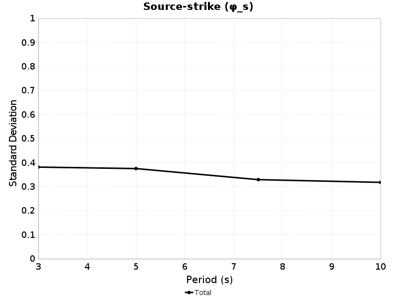

| 3s &phi;s | Total | Mean | Median | Range | 5s &phi;s | Total | Mean | Median | Range | 7.5s &phi;s | Total | Mean | Median | Range | 10s &phi;s | Total | Mean | Median | Range |
|-----|-----|-----|-----|-----|-----|-----|-----|-----|-----|-----|-----|-----|-----|-----|-----|-----|-----|-----|-----|
|  | 0.39 | 0.39 | 0.37 | [0.24 0.68] |  | 0.38 | 0.37 | 0.37 | [0.21 0.69] |  | 0.32 | 0.31 | 0.3 | [0.17 0.64] |  | 0.32 | 0.31 | 0.3 | [0.19 0.61] |

| 3s | 5s |
|-----|-----|
|  | 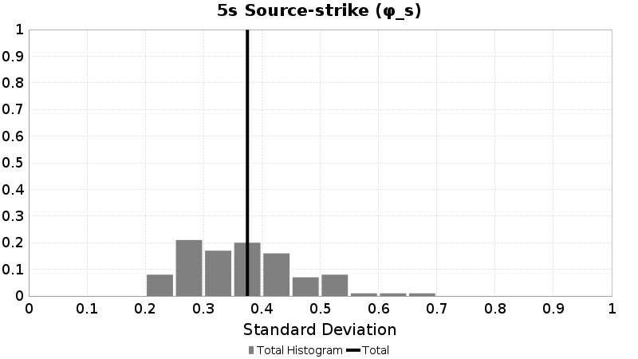 |
| 7.5s | 10s |
|  |  |

### 80.0 km M6.5 Source-strike Results
*[(top)](#table-of-contents)*

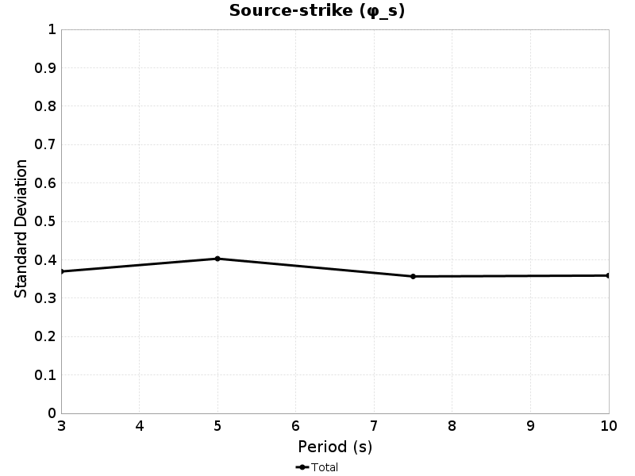

| 3s &phi;s | Total | Mean | Median | Range | 5s &phi;s | Total | Mean | Median | Range | 7.5s &phi;s | Total | Mean | Median | Range | 10s &phi;s | Total | Mean | Median | Range |
|-----|-----|-----|-----|-----|-----|-----|-----|-----|-----|-----|-----|-----|-----|-----|-----|-----|-----|-----|-----|
|  | 0.37 | 0.37 | 0.34 | [0.22 0.76] |  | 0.41 | 0.4 | 0.39 | [0.14 0.72] |  | 0.35 | 0.34 | 0.31 | [0.14 0.69] |  | 0.35 | 0.35 | 0.33 | [0.2 0.74] |

| 3s | 5s |
|-----|-----|
|  |  |
| 7.5s | 10s |
|  |  |

### 160.0 km M6.5 Source-strike Results
*[(top)](#table-of-contents)*

| 3s &phi;s | Total | Mean | Median | Range | 5s &phi;s | Total | Mean | Median | Range | 7.5s &phi;s | Total | Mean | Median | Range | 10s &phi;s | Total | Mean | Median | Range |
|-----|-----|-----|-----|-----|-----|-----|-----|-----|-----|-----|-----|-----|-----|-----|-----|-----|-----|-----|-----|
|  | 0.33 | 0.33 | 0.32 | [0.17 0.56] |  | 0.39 | 0.38 | 0.38 | [0.15 0.73] |  | 0.38 | 0.37 | 0.35 | [0.16 0.73] |  | 0.36 | 0.35 | 0.34 | [0.22 0.73] |

| 3s | 5s |
|-----|-----|
| 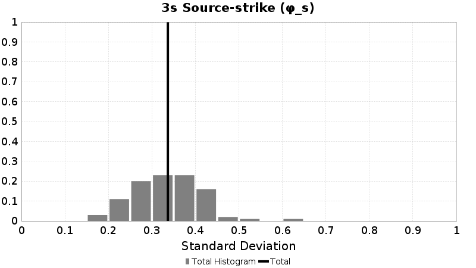 |  |
| 7.5s | 10s |
|  | 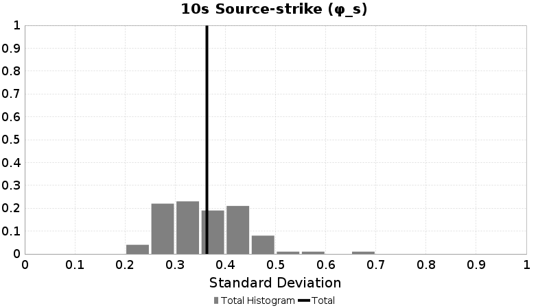 |

### 20.0 km M6.5 Source-strike Results
*[(top)](#table-of-contents)*

| 3s &phi;s | Total | Mean | Median | Range | 5s &phi;s | Total | Mean | Median | Range | 7.5s &phi;s | Total | Mean | Median | Range | 10s &phi;s | Total | Mean | Median | Range |
|-----|-----|-----|-----|-----|-----|-----|-----|-----|-----|-----|-----|-----|-----|-----|-----|-----|-----|-----|-----|
|  | 0.35 | 0.35 | 0.34 | [0.22 0.56] |  | 0.36 | 0.35 | 0.35 | [0.16 0.64] |  | 0.35 | 0.34 | 0.33 | [0.13 0.71] |  | 0.32 | 0.31 | 0.3 | [0.15 0.56] |

| 3s | 5s |
|-----|-----|
|  |  |
| 7.5s | 10s |
|  |  |

### 40.0 km M6.5 Source-strike Results
*[(top)](#table-of-contents)*

| 3s &phi;s | Total | Mean | Median | Range | 5s &phi;s | Total | Mean | Median | Range | 7.5s &phi;s | Total | Mean | Median | Range | 10s &phi;s | Total | Mean | Median | Range |
|-----|-----|-----|-----|-----|-----|-----|-----|-----|-----|-----|-----|-----|-----|-----|-----|-----|-----|-----|-----|
|  | 0.39 | 0.39 | 0.37 | [0.24 0.68] |  | 0.38 | 0.37 | 0.37 | [0.21 0.69] |  | 0.32 | 0.31 | 0.3 | [0.17 0.64] |  | 0.32 | 0.31 | 0.3 | [0.19 0.61] |

| 3s | 5s |
|-----|-----|
|  |  |
| 7.5s | 10s |
|  |  |

### 80.0 km M6.5 Source-strike Results
*[(top)](#table-of-contents)*

| 3s &phi;s | Total | Mean | Median | Range | 5s &phi;s | Total | Mean | Median | Range | 7.5s &phi;s | Total | Mean | Median | Range | 10s &phi;s | Total | Mean | Median | Range |
|-----|-----|-----|-----|-----|-----|-----|-----|-----|-----|-----|-----|-----|-----|-----|-----|-----|-----|-----|-----|
|  | 0.37 | 0.37 | 0.34 | [0.22 0.76] |  | 0.41 | 0.4 | 0.39 | [0.14 0.72] |  | 0.35 | 0.34 | 0.31 | [0.14 0.69] |  | 0.35 | 0.35 | 0.33 | [0.2 0.74] |

| 3s | 5s |
|-----|-----|
|  |  |
| 7.5s | 10s |
|  |  |

### 160.0 km M6.5 Source-strike Results
*[(top)](#table-of-contents)*

| 3s &phi;s | Total | Mean | Median | Range | 5s &phi;s | Total | Mean | Median | Range | 7.5s &phi;s | Total | Mean | Median | Range | 10s &phi;s | Total | Mean | Median | Range |
|-----|-----|-----|-----|-----|-----|-----|-----|-----|-----|-----|-----|-----|-----|-----|-----|-----|-----|-----|-----|
|  | 0.33 | 0.33 | 0.32 | [0.17 0.56] |  | 0.39 | 0.38 | 0.38 | [0.15 0.73] |  | 0.38 | 0.37 | 0.35 | [0.16 0.73] |  | 0.36 | 0.35 | 0.34 | [0.22 0.73] |

| 3s | 5s |
|-----|-----|
|  |  |
| 7.5s | 10s |
|  |  |

### 20.0 km M6.6 Source-strike Results
*[(top)](#table-of-contents)*

| 3s &phi;s | Total | Mean | Median | Range | 5s &phi;s | Total | Mean | Median | Range | 7.5s &phi;s | Total | Mean | Median | Range | 10s &phi;s | Total | Mean | Median | Range |
|-----|-----|-----|-----|-----|-----|-----|-----|-----|-----|-----|-----|-----|-----|-----|-----|-----|-----|-----|-----|
|  | 0.34 | 0.34 | 0.33 | [0.16 0.58] |  | 0.37 | 0.36 | 0.37 | [0.12 0.6] |  | 0.37 | 0.36 | 0.35 | [0.13 0.75] |  | 0.32 | 0.31 | 0.3 | [0.15 0.67] |

| 3s | 5s |
|-----|-----|
|  |  |
| 7.5s | 10s |
|  |  |

### 40.0 km M6.6 Source-strike Results
*[(top)](#table-of-contents)*

| 3s &phi;s | Total | Mean | Median | Range | 5s &phi;s | Total | Mean | Median | Range | 7.5s &phi;s | Total | Mean | Median | Range | 10s &phi;s | Total | Mean | Median | Range |
|-----|-----|-----|-----|-----|-----|-----|-----|-----|-----|-----|-----|-----|-----|-----|-----|-----|-----|-----|-----|
|  | 0.37 | 0.37 | 0.37 | [0.18 0.59] |  | 0.38 | 0.37 | 0.36 | [0.17 0.64] |  | 0.35 | 0.34 | 0.32 | [0.13 0.7] |  | 0.33 | 0.32 | 0.29 | [0.16 0.72] |

| 3s | 5s |
|-----|-----|
|  |  |
| 7.5s | 10s |
|  |  |

### 80.0 km M6.6 Source-strike Results
*[(top)](#table-of-contents)*

| 3s &phi;s | Total | Mean | Median | Range | 5s &phi;s | Total | Mean | Median | Range | 7.5s &phi;s | Total | Mean | Median | Range | 10s &phi;s | Total | Mean | Median | Range |
|-----|-----|-----|-----|-----|-----|-----|-----|-----|-----|-----|-----|-----|-----|-----|-----|-----|-----|-----|-----|
|  | 0.36 | 0.36 | 0.34 | [0.18 0.65] |  | 0.41 | 0.4 | 0.39 | [0.19 0.66] |  | 0.38 | 0.37 | 0.36 | [0.17 0.85] |  | 0.37 | 0.37 | 0.37 | [0.21 0.8] |

| 3s | 5s |
|-----|-----|
|  |  |
| 7.5s | 10s |
|  |  |

### 160.0 km M6.6 Source-strike Results
*[(top)](#table-of-contents)*

| 3s &phi;s | Total | Mean | Median | Range | 5s &phi;s | Total | Mean | Median | Range | 7.5s &phi;s | Total | Mean | Median | Range | 10s &phi;s | Total | Mean | Median | Range |
|-----|-----|-----|-----|-----|-----|-----|-----|-----|-----|-----|-----|-----|-----|-----|-----|-----|-----|-----|-----|
|  | 0.34 | 0.33 | 0.32 | [0.19 0.61] |  | 0.4 | 0.39 | 0.39 | [0.19 0.66] |  | 0.4 | 0.39 | 0.39 | [0.19 0.78] |  | 0.38 | 0.37 | 0.35 | [0.2 0.81] |

| 3s | 5s |
|-----|-----|
|  |  |
| 7.5s | 10s |
|  |  |

### 20.0 km M6.7 Source-strike Results
*[(top)](#table-of-contents)*

| 3s &phi;s | Total | Mean | Median | Range | 5s &phi;s | Total | Mean | Median | Range | 7.5s &phi;s | Total | Mean | Median | Range | 10s &phi;s | Total | Mean | Median | Range |
|-----|-----|-----|-----|-----|-----|-----|-----|-----|-----|-----|-----|-----|-----|-----|-----|-----|-----|-----|-----|
|  | 0.35 | 0.35 | 0.35 | [0.2 0.53] |  | 0.38 | 0.37 | 0.36 | [0.15 0.63] |  | 0.38 | 0.37 | 0.35 | [0.17 0.68] |  | 0.34 | 0.33 | 0.32 | [0.16 0.6] |

| 3s | 5s |
|-----|-----|
|  |  |
| 7.5s | 10s |
|  |  |

### 40.0 km M6.7 Source-strike Results
*[(top)](#table-of-contents)*

| 3s &phi;s | Total | Mean | Median | Range | 5s &phi;s | Total | Mean | Median | Range | 7.5s &phi;s | Total | Mean | Median | Range | 10s &phi;s | Total | Mean | Median | Range |
|-----|-----|-----|-----|-----|-----|-----|-----|-----|-----|-----|-----|-----|-----|-----|-----|-----|-----|-----|-----|
|  | 0.38 | 0.38 | 0.38 | [0.2 0.58] |  | 0.39 | 0.38 | 0.39 | [0.11 0.66] |  | 0.36 | 0.35 | 0.34 | [0.17 0.6] |  | 0.34 | 0.33 | 0.32 | [0.19 0.64] |

| 3s | 5s |
|-----|-----|
|  |  |
| 7.5s | 10s |
|  |  |

### 80.0 km M6.7 Source-strike Results
*[(top)](#table-of-contents)*

| 3s &phi;s | Total | Mean | Median | Range | 5s &phi;s | Total | Mean | Median | Range | 7.5s &phi;s | Total | Mean | Median | Range | 10s &phi;s | Total | Mean | Median | Range |
|-----|-----|-----|-----|-----|-----|-----|-----|-----|-----|-----|-----|-----|-----|-----|-----|-----|-----|-----|-----|
|  | 0.36 | 0.36 | 0.35 | [0.2 0.63] |  | 0.43 | 0.42 | 0.41 | [0.15 0.77] |  | 0.39 | 0.38 | 0.36 | [0.17 0.75] |  | 0.39 | 0.38 | 0.37 | [0.21 0.68] |

| 3s | 5s |
|-----|-----|
|  |  |
| 7.5s | 10s |
|  |  |

### 160.0 km M6.7 Source-strike Results
*[(top)](#table-of-contents)*

| 3s &phi;s | Total | Mean | Median | Range | 5s &phi;s | Total | Mean | Median | Range | 7.5s &phi;s | Total | Mean | Median | Range | 10s &phi;s | Total | Mean | Median | Range |
|-----|-----|-----|-----|-----|-----|-----|-----|-----|-----|-----|-----|-----|-----|-----|-----|-----|-----|-----|-----|
|  | 0.34 | 0.33 | 0.33 | [0.16 0.53] |  | 0.4 | 0.4 | 0.4 | [0.15 0.71] |  | 0.41 | 0.4 | 0.4 | [0.2 0.71] |  | 0.39 | 0.38 | 0.37 | [0.2 0.68] |

| 3s | 5s |
|-----|-----|
|  |  |
| 7.5s | 10s |
|  |  |

### 20.0 km M6.8 Source-strike Results
*[(top)](#table-of-contents)*

| 3s &phi;s | Total | Mean | Median | Range | 5s &phi;s | Total | Mean | Median | Range | 7.5s &phi;s | Total | Mean | Median | Range | 10s &phi;s | Total | Mean | Median | Range |
|-----|-----|-----|-----|-----|-----|-----|-----|-----|-----|-----|-----|-----|-----|-----|-----|-----|-----|-----|-----|
|  | 0.34 | 0.34 | 0.34 | [0.2 0.51] |  | 0.38 | 0.37 | 0.37 | [0.2 0.66] |  | 0.37 | 0.36 | 0.35 | [0.16 0.69] |  | 0.34 | 0.33 | 0.32 | [0.14 0.61] |

| 3s | 5s |
|-----|-----|
|  |  |
| 7.5s | 10s |
|  |  |

### 40.0 km M6.8 Source-strike Results
*[(top)](#table-of-contents)*

| 3s &phi;s | Total | Mean | Median | Range | 5s &phi;s | Total | Mean | Median | Range | 7.5s &phi;s | Total | Mean | Median | Range | 10s &phi;s | Total | Mean | Median | Range |
|-----|-----|-----|-----|-----|-----|-----|-----|-----|-----|-----|-----|-----|-----|-----|-----|-----|-----|-----|-----|
|  | 0.36 | 0.36 | 0.35 | [0.23 0.51] |  | 0.39 | 0.39 | 0.38 | [0.2 0.67] |  | 0.35 | 0.34 | 0.33 | [0.17 0.69] |  | 0.35 | 0.34 | 0.32 | [0.18 0.61] |

| 3s | 5s |
|-----|-----|
|  |  |
| 7.5s | 10s |
| 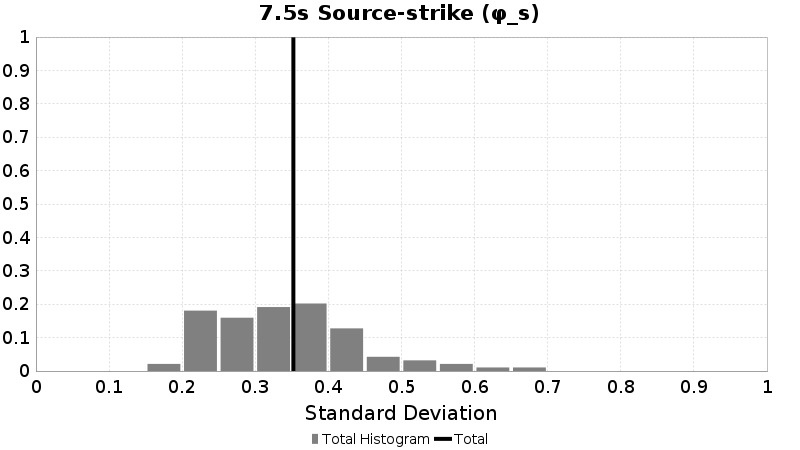 |  |

### 80.0 km M6.8 Source-strike Results
*[(top)](#table-of-contents)*

| 3s &phi;s | Total | Mean | Median | Range | 5s &phi;s | Total | Mean | Median | Range | 7.5s &phi;s | Total | Mean | Median | Range | 10s &phi;s | Total | Mean | Median | Range |
|-----|-----|-----|-----|-----|-----|-----|-----|-----|-----|-----|-----|-----|-----|-----|-----|-----|-----|-----|-----|
|  | 0.35 | 0.34 | 0.34 | [0.17 0.49] |  | 0.41 | 0.41 | 0.4 | [0.22 0.73] |  | 0.39 | 0.38 | 0.36 | [0.16 0.71] |  | 0.38 | 0.38 | 0.36 | [0.19 0.71] |

| 3s | 5s |
|-----|-----|
|  |  |
| 7.5s | 10s |
|  |  |

### 160.0 km M6.8 Source-strike Results
*[(top)](#table-of-contents)*

| 3s &phi;s | Total | Mean | Median | Range | 5s &phi;s | Total | Mean | Median | Range | 7.5s &phi;s | Total | Mean | Median | Range | 10s &phi;s | Total | Mean | Median | Range |
|-----|-----|-----|-----|-----|-----|-----|-----|-----|-----|-----|-----|-----|-----|-----|-----|-----|-----|-----|-----|
|  | 0.32 | 0.31 | 0.31 | [0.14 0.49] |  | 0.39 | 0.39 | 0.37 | [0.23 0.68] |  | 0.4 | 0.39 | 0.38 | [0.21 0.72] |  | 0.39 | 0.39 | 0.37 | [0.18 0.72] |

| 3s | 5s |
|-----|-----|
|  |  |
| 7.5s | 10s |
|  |  |

### 20.0 km M6.9 Source-strike Results
*[(top)](#table-of-contents)*

| 3s &phi;s | Total | Mean | Median | Range | 5s &phi;s | Total | Mean | Median | Range | 7.5s &phi;s | Total | Mean | Median | Range | 10s &phi;s | Total | Mean | Median | Range |
|-----|-----|-----|-----|-----|-----|-----|-----|-----|-----|-----|-----|-----|-----|-----|-----|-----|-----|-----|-----|
|  | 0.36 | 0.35 | 0.35 | [0.2 0.51] |  | 0.4 | 0.39 | 0.4 | [0.19 0.54] |  | 0.38 | 0.38 | 0.37 | [0.19 0.56] |  | 0.34 | 0.33 | 0.33 | [0.15 0.51] |

| 3s | 5s |
|-----|-----|
|  |  |
| 7.5s | 10s |
|  |  |

### 40.0 km M6.9 Source-strike Results
*[(top)](#table-of-contents)*

| 3s &phi;s | Total | Mean | Median | Range | 5s &phi;s | Total | Mean | Median | Range | 7.5s &phi;s | Total | Mean | Median | Range | 10s &phi;s | Total | Mean | Median | Range |
|-----|-----|-----|-----|-----|-----|-----|-----|-----|-----|-----|-----|-----|-----|-----|-----|-----|-----|-----|-----|
|  | 0.37 | 0.37 | 0.36 | [0.24 0.55] |  | 0.4 | 0.4 | 0.39 | [0.22 0.58] |  | 0.37 | 0.36 | 0.37 | [0.17 0.53] |  | 0.37 | 0.36 | 0.35 | [0.17 0.58] |

| 3s | 5s |
|-----|-----|
|  |  |
| 7.5s | 10s |
|  |  |

### 80.0 km M6.9 Source-strike Results
*[(top)](#table-of-contents)*

| 3s &phi;s | Total | Mean | Median | Range | 5s &phi;s | Total | Mean | Median | Range | 7.5s &phi;s | Total | Mean | Median | Range | 10s &phi;s | Total | Mean | Median | Range |
|-----|-----|-----|-----|-----|-----|-----|-----|-----|-----|-----|-----|-----|-----|-----|-----|-----|-----|-----|-----|
|  | 0.35 | 0.35 | 0.34 | [0.22 0.46] |  | 0.43 | 0.42 | 0.42 | [0.2 0.63] |  | 0.4 | 0.4 | 0.39 | [0.21 0.59] |  | 0.38 | 0.37 | 0.38 | [0.19 0.6] |

| 3s | 5s |
|-----|-----|
|  |  |
| 7.5s | 10s |
|  |  |

### 160.0 km M6.9 Source-strike Results
*[(top)](#table-of-contents)*

| 3s &phi;s | Total | Mean | Median | Range | 5s &phi;s | Total | Mean | Median | Range | 7.5s &phi;s | Total | Mean | Median | Range | 10s &phi;s | Total | Mean | Median | Range |
|-----|-----|-----|-----|-----|-----|-----|-----|-----|-----|-----|-----|-----|-----|-----|-----|-----|-----|-----|-----|
|  | 0.33 | 0.33 | 0.34 | [0.13 0.5] |  | 0.4 | 0.39 | 0.38 | [0.2 0.58] |  | 0.41 | 0.41 | 0.42 | [0.23 0.62] |  | 0.4 | 0.4 | 0.41 | [0.21 0.63] |

| 3s | 5s |
|-----|-----|
|  |  |
| 7.5s | 10s |
|  |  |

### 20.0 km M7 Source-strike Results
*[(top)](#table-of-contents)*

| 3s &phi;s | Total | Mean | Median | Range | 5s &phi;s | Total | Mean | Median | Range | 7.5s &phi;s | Total | Mean | Median | Range | 10s &phi;s | Total | Mean | Median | Range |
|-----|-----|-----|-----|-----|-----|-----|-----|-----|-----|-----|-----|-----|-----|-----|-----|-----|-----|-----|-----|
|  | 0.38 | 0.38 | 0.37 | [0.23 0.56] |  | 0.39 | 0.39 | 0.37 | [0.2 0.64] |  | 0.4 | 0.4 | 0.4 | [0.21 0.66] |  | 0.38 | 0.37 | 0.36 | [0.19 0.72] |

| 3s | 5s |
|-----|-----|
|  |  |
| 7.5s | 10s |
|  |  |

### 40.0 km M7 Source-strike Results
*[(top)](#table-of-contents)*

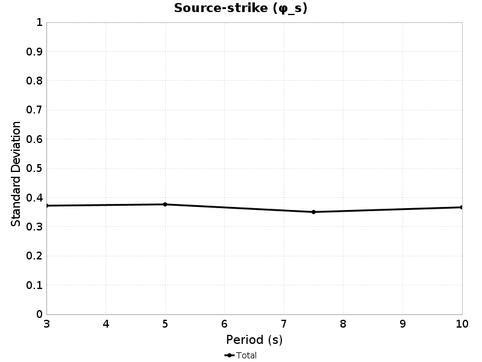

| 3s &phi;s | Total | Mean | Median | Range | 5s &phi;s | Total | Mean | Median | Range | 7.5s &phi;s | Total | Mean | Median | Range | 10s &phi;s | Total | Mean | Median | Range |
|-----|-----|-----|-----|-----|-----|-----|-----|-----|-----|-----|-----|-----|-----|-----|-----|-----|-----|-----|-----|
|  | 0.39 | 0.39 | 0.38 | [0.23 0.54] |  | 0.41 | 0.41 | 0.41 | [0.22 0.64] |  | 0.38 | 0.37 | 0.37 | [0.18 0.62] |  | 0.41 | 0.4 | 0.4 | [0.19 0.69] |

| 3s | 5s |
|-----|-----|
|  |  |
| 7.5s | 10s |
|  |  |

### 80.0 km M7 Source-strike Results
*[(top)](#table-of-contents)*

| 3s &phi;s | Total | Mean | Median | Range | 5s &phi;s | Total | Mean | Median | Range | 7.5s &phi;s | Total | Mean | Median | Range | 10s &phi;s | Total | Mean | Median | Range |
|-----|-----|-----|-----|-----|-----|-----|-----|-----|-----|-----|-----|-----|-----|-----|-----|-----|-----|-----|-----|
|  | 0.36 | 0.36 | 0.34 | [0.2 0.55] |  | 0.43 | 0.42 | 0.42 | [0.22 0.72] |  | 0.42 | 0.41 | 0.4 | [0.2 0.74] |  | 0.44 | 0.43 | 0.42 | [0.2 0.71] |

| 3s | 5s |
|-----|-----|
| 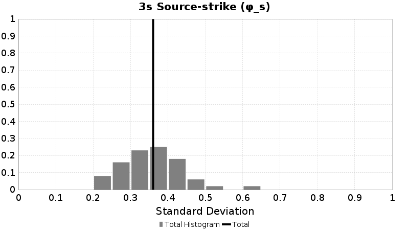 |  |
| 7.5s | 10s |
|  |  |

### 160.0 km M7 Source-strike Results
*[(top)](#table-of-contents)*

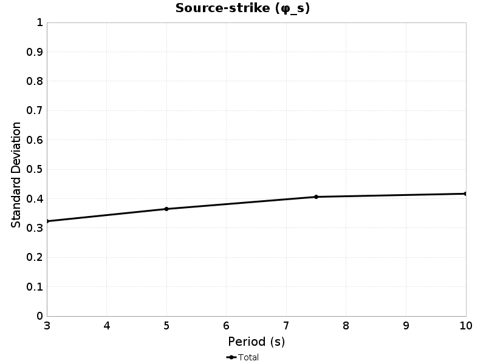

| 3s &phi;s | Total | Mean | Median | Range | 5s &phi;s | Total | Mean | Median | Range | 7.5s &phi;s | Total | Mean | Median | Range | 10s &phi;s | Total | Mean | Median | Range |
|-----|-----|-----|-----|-----|-----|-----|-----|-----|-----|-----|-----|-----|-----|-----|-----|-----|-----|-----|-----|
|  | 0.34 | 0.34 | 0.33 | [0.22 0.56] |  | 0.39 | 0.39 | 0.38 | [0.22 0.61] |  | 0.43 | 0.42 | 0.42 | [0.23 0.7] |  | 0.46 | 0.45 | 0.45 | [0.22 0.73] |

| 3s | 5s |
|-----|-----|
|  |  |
| 7.5s | 10s |
|  |  |

### 20.0 km M7 Source-strike Results
*[(top)](#table-of-contents)*

| 3s &phi;s | Total | Mean | Median | Range | 5s &phi;s | Total | Mean | Median | Range | 7.5s &phi;s | Total | Mean | Median | Range | 10s &phi;s | Total | Mean | Median | Range |
|-----|-----|-----|-----|-----|-----|-----|-----|-----|-----|-----|-----|-----|-----|-----|-----|-----|-----|-----|-----|
|  | 0.38 | 0.38 | 0.37 | [0.23 0.56] |  | 0.39 | 0.39 | 0.37 | [0.2 0.64] |  | 0.4 | 0.4 | 0.4 | [0.21 0.66] |  | 0.38 | 0.37 | 0.36 | [0.19 0.72] |

| 3s | 5s |
|-----|-----|
|  |  |
| 7.5s | 10s |
|  |  |

### 40.0 km M7 Source-strike Results
*[(top)](#table-of-contents)*

| 3s &phi;s | Total | Mean | Median | Range | 5s &phi;s | Total | Mean | Median | Range | 7.5s &phi;s | Total | Mean | Median | Range | 10s &phi;s | Total | Mean | Median | Range |
|-----|-----|-----|-----|-----|-----|-----|-----|-----|-----|-----|-----|-----|-----|-----|-----|-----|-----|-----|-----|
|  | 0.39 | 0.39 | 0.38 | [0.23 0.54] |  | 0.41 | 0.41 | 0.41 | [0.22 0.64] |  | 0.38 | 0.37 | 0.37 | [0.18 0.62] |  | 0.41 | 0.4 | 0.4 | [0.19 0.69] |

| 3s | 5s |
|-----|-----|
|  |  |
| 7.5s | 10s |
|  |  |

### 80.0 km M7 Source-strike Results
*[(top)](#table-of-contents)*

| 3s &phi;s | Total | Mean | Median | Range | 5s &phi;s | Total | Mean | Median | Range | 7.5s &phi;s | Total | Mean | Median | Range | 10s &phi;s | Total | Mean | Median | Range |
|-----|-----|-----|-----|-----|-----|-----|-----|-----|-----|-----|-----|-----|-----|-----|-----|-----|-----|-----|-----|
|  | 0.36 | 0.36 | 0.34 | [0.2 0.55] |  | 0.43 | 0.42 | 0.42 | [0.22 0.72] |  | 0.42 | 0.41 | 0.4 | [0.2 0.74] |  | 0.44 | 0.43 | 0.42 | [0.2 0.71] |

| 3s | 5s |
|-----|-----|
|  |  |
| 7.5s | 10s |
|  |  |

### 160.0 km M7 Source-strike Results
*[(top)](#table-of-contents)*

| 3s &phi;s | Total | Mean | Median | Range | 5s &phi;s | Total | Mean | Median | Range | 7.5s &phi;s | Total | Mean | Median | Range | 10s &phi;s | Total | Mean | Median | Range |
|-----|-----|-----|-----|-----|-----|-----|-----|-----|-----|-----|-----|-----|-----|-----|-----|-----|-----|-----|-----|
|  | 0.34 | 0.34 | 0.33 | [0.22 0.56] |  | 0.39 | 0.39 | 0.38 | [0.22 0.61] |  | 0.43 | 0.42 | 0.42 | [0.23 0.7] |  | 0.46 | 0.45 | 0.45 | [0.22 0.73] |

| 3s | 5s |
|-----|-----|
|  |  |
| 7.5s | 10s |
|  |  |

### 20.0 km M7.1 Source-strike Results
*[(top)](#table-of-contents)*

| 3s &phi;s | Total | Mean | Median | Range | 5s &phi;s | Total | Mean | Median | Range | 7.5s &phi;s | Total | Mean | Median | Range | 10s &phi;s | Total | Mean | Median | Range |
|-----|-----|-----|-----|-----|-----|-----|-----|-----|-----|-----|-----|-----|-----|-----|-----|-----|-----|-----|-----|
|  | 0.37 | 0.36 | 0.35 | [0.23 0.52] |  | 0.38 | 0.37 | 0.36 | [0.21 0.61] |  | 0.34 | 0.33 | 0.34 | [0.16 0.47] |  | 0.32 | 0.31 | 0.29 | [0.16 0.57] |

| 3s | 5s |
|-----|-----|
|  |  |
| 7.5s | 10s |
|  |  |

### 40.0 km M7.1 Source-strike Results
*[(top)](#table-of-contents)*

| 3s &phi;s | Total | Mean | Median | Range | 5s &phi;s | Total | Mean | Median | Range | 7.5s &phi;s | Total | Mean | Median | Range | 10s &phi;s | Total | Mean | Median | Range |
|-----|-----|-----|-----|-----|-----|-----|-----|-----|-----|-----|-----|-----|-----|-----|-----|-----|-----|-----|-----|
|  | 0.37 | 0.37 | 0.38 | [0.27 0.49] |  | 0.4 | 0.39 | 0.4 | [0.2 0.69] |  | 0.33 | 0.33 | 0.3 | [0.23 0.46] |  | 0.36 | 0.35 | 0.33 | [0.19 0.56] |

| 3s | 5s |
|-----|-----|
|  |  |
| 7.5s | 10s |
|  |  |

### 80.0 km M7.1 Source-strike Results
*[(top)](#table-of-contents)*

| 3s &phi;s | Total | Mean | Median | Range | 5s &phi;s | Total | Mean | Median | Range | 7.5s &phi;s | Total | Mean | Median | Range | 10s &phi;s | Total | Mean | Median | Range |
|-----|-----|-----|-----|-----|-----|-----|-----|-----|-----|-----|-----|-----|-----|-----|-----|-----|-----|-----|-----|
|  | 0.34 | 0.34 | 0.32 | [0.24 0.46] |  | 0.41 | 0.4 | 0.4 | [0.21 0.71] |  | 0.37 | 0.36 | 0.34 | [0.26 0.55] |  | 0.38 | 0.37 | 0.35 | [0.22 0.64] |

| 3s | 5s |
|-----|-----|
|  |  |
| 7.5s | 10s |
|  |  |

### 160.0 km M7.1 Source-strike Results
*[(top)](#table-of-contents)*

| 3s &phi;s | Total | Mean | Median | Range | 5s &phi;s | Total | Mean | Median | Range | 7.5s &phi;s | Total | Mean | Median | Range | 10s &phi;s | Total | Mean | Median | Range |
|-----|-----|-----|-----|-----|-----|-----|-----|-----|-----|-----|-----|-----|-----|-----|-----|-----|-----|-----|-----|
|  | 0.33 | 0.32 | 0.32 | [0.19 0.5] |  | 0.37 | 0.37 | 0.37 | [0.25 0.61] |  | 0.36 | 0.36 | 0.37 | [0.26 0.49] |  | 0.39 | 0.39 | 0.37 | [0.22 0.65] |

| 3s | 5s |
|-----|-----|
|  |  |
| 7.5s | 10s |
|  |  |

### 20.0 km M7.2 Source-strike Results
*[(top)](#table-of-contents)*

| 3s &phi;s | Total | Mean | Median | Range | 5s &phi;s | Total | Mean | Median | Range | 7.5s &phi;s | Total | Mean | Median | Range | 10s &phi;s | Total | Mean | Median | Range |
|-----|-----|-----|-----|-----|-----|-----|-----|-----|-----|-----|-----|-----|-----|-----|-----|-----|-----|-----|-----|
|  | 0.37 | 0.37 | 0.38 | [0.25 0.48] |  | 0.4 | 0.4 | 0.4 | [0.22 0.54] |  | 0.36 | 0.35 | 0.36 | [0.16 0.54] |  | 0.31 | 0.3 | 0.31 | [0.14 0.42] |

| 3s | 5s |
|-----|-----|
|  |  |
| 7.5s | 10s |
|  |  |

### 40.0 km M7.2 Source-strike Results
*[(top)](#table-of-contents)*

| 3s &phi;s | Total | Mean | Median | Range | 5s &phi;s | Total | Mean | Median | Range | 7.5s &phi;s | Total | Mean | Median | Range | 10s &phi;s | Total | Mean | Median | Range |
|-----|-----|-----|-----|-----|-----|-----|-----|-----|-----|-----|-----|-----|-----|-----|-----|-----|-----|-----|-----|
|  | 0.38 | 0.38 | 0.38 | [0.27 0.49] |  | 0.43 | 0.43 | 0.43 | [0.29 0.6] |  | 0.33 | 0.33 | 0.31 | [0.18 0.45] |  | 0.34 | 0.33 | 0.34 | [0.17 0.46] |

| 3s | 5s |
|-----|-----|
|  |  |
| 7.5s | 10s |
|  |  |

### 80.0 km M7.2 Source-strike Results
*[(top)](#table-of-contents)*

| 3s &phi;s | Total | Mean | Median | Range | 5s &phi;s | Total | Mean | Median | Range | 7.5s &phi;s | Total | Mean | Median | Range | 10s &phi;s | Total | Mean | Median | Range |
|-----|-----|-----|-----|-----|-----|-----|-----|-----|-----|-----|-----|-----|-----|-----|-----|-----|-----|-----|-----|
|  | 0.33 | 0.33 | 0.34 | [0.25 0.44] |  | 0.43 | 0.42 | 0.43 | [0.24 0.6] |  | 0.35 | 0.35 | 0.35 | [0.17 0.51] |  | 0.33 | 0.33 | 0.36 | [0.17 0.46] |

| 3s | 5s |
|-----|-----|
|  |  |
| 7.5s | 10s |
|  |  |

### 160.0 km M7.2 Source-strike Results
*[(top)](#table-of-contents)*

| 3s &phi;s | Total | Mean | Median | Range | 5s &phi;s | Total | Mean | Median | Range | 7.5s &phi;s | Total | Mean | Median | Range | 10s &phi;s | Total | Mean | Median | Range |
|-----|-----|-----|-----|-----|-----|-----|-----|-----|-----|-----|-----|-----|-----|-----|-----|-----|-----|-----|-----|
|  | 0.33 | 0.33 | 0.34 | [0.22 0.45] |  | 0.38 | 0.37 | 0.39 | [0.24 0.52] |  | 0.36 | 0.35 | 0.32 | [0.17 0.52] |  | 0.36 | 0.35 | 0.37 | [0.22 0.48] |

| 3s | 5s |
|-----|-----|
|  |  |
| 7.5s | 10s |
|  |  |

### 20.0 km M7.3 Source-strike Results
*[(top)](#table-of-contents)*

| 3s &phi;s | Total | Mean | Median | Range | 5s &phi;s | Total | Mean | Median | Range | 7.5s &phi;s | Total | Mean | Median | Range | 10s &phi;s | Total | Mean | Median | Range |
|-----|-----|-----|-----|-----|-----|-----|-----|-----|-----|-----|-----|-----|-----|-----|-----|-----|-----|-----|-----|
|  | 0.39 | 0.39 | 0.38 | [0.3 0.52] |  | 0.37 | 0.37 | 0.36 | [0.26 0.53] |  | 0.37 | 0.37 | 0.38 | [0.27 0.44] |  | 0.33 | 0.33 | 0.32 | [0.19 0.47] |

| 3s | 5s |
|-----|-----|
|  |  |
| 7.5s | 10s |
|  |  |

### 40.0 km M7.3 Source-strike Results
*[(top)](#table-of-contents)*

| 3s &phi;s | Total | Mean | Median | Range | 5s &phi;s | Total | Mean | Median | Range | 7.5s &phi;s | Total | Mean | Median | Range | 10s &phi;s | Total | Mean | Median | Range |
|-----|-----|-----|-----|-----|-----|-----|-----|-----|-----|-----|-----|-----|-----|-----|-----|-----|-----|-----|-----|
|  | 0.35 | 0.36 | 0.34 | [0.29 0.45] |  | 0.4 | 0.4 | 0.41 | [0.32 0.5] |  | 0.3 | 0.3 | 0.29 | [0.15 0.42] |  | 0.33 | 0.32 | 0.3 | [0.22 0.54] |

| 3s | 5s |
|-----|-----|
|  |  |
| 7.5s | 10s |
|  |  |

### 80.0 km M7.3 Source-strike Results
*[(top)](#table-of-contents)*

| 3s &phi;s | Total | Mean | Median | Range | 5s &phi;s | Total | Mean | Median | Range | 7.5s &phi;s | Total | Mean | Median | Range | 10s &phi;s | Total | Mean | Median | Range |
|-----|-----|-----|-----|-----|-----|-----|-----|-----|-----|-----|-----|-----|-----|-----|-----|-----|-----|-----|-----|
|  | 0.33 | 0.33 | 0.31 | [0.23 0.44] |  | 0.38 | 0.38 | 0.39 | [0.25 0.48] |  | 0.35 | 0.34 | 0.35 | [0.19 0.43] |  | 0.38 | 0.38 | 0.35 | [0.24 0.57] |

| 3s | 5s |
|-----|-----|
|  |  |
| 7.5s | 10s |
|  |  |

### 160.0 km M7.3 Source-strike Results
*[(top)](#table-of-contents)*

| 3s &phi;s | Total | Mean | Median | Range | 5s &phi;s | Total | Mean | Median | Range | 7.5s &phi;s | Total | Mean | Median | Range | 10s &phi;s | Total | Mean | Median | Range |
|-----|-----|-----|-----|-----|-----|-----|-----|-----|-----|-----|-----|-----|-----|-----|-----|-----|-----|-----|-----|
|  | 0.34 | 0.34 | 0.34 | [0.22 0.44] |  | 0.35 | 0.35 | 0.37 | [0.23 0.46] |  | 0.34 | 0.33 | 0.33 | [0.17 0.49] |  | 0.39 | 0.38 | 0.38 | [0.26 0.6] |

| 3s | 5s |
|-----|-----|
|  |  |
| 7.5s | 10s |
|  |  |

## Within-event Variability
*[(top)](#table-of-contents)*

### Within-event Variability Methodology
*[(top)](#table-of-contents)*

Within-event variability, denoted &phi; in Al Atik (2010), is computed from ground motion residuals where the following quantities are held constant:

* Site *[1 unique]*
* Joyner-Boore Distance *[10 unique]*
* Rupture *[59 unique]*

and the following quantities vary:

* Rupture Strike *[36 unique]*
* Path *[1 unique]*

Here is an exmample with 5 rotations, which would be repeated for each combination of [Site, Joyner-Boore Distance, Rupture]. The site is shown with a blue square, and initially oriented rupture in bold with its hypocenter as a red star and centroid a green circle. Rotations of that rupture are in gray:

Standard deviation is computed and tabulated separately for each site and distance, then a total standard deviation is computed from all sitess and reported in the "**ALL SITES**" row. Results are reported separately for each distance

### Within-event Variability Mag-Distance Plots
*[(top)](#table-of-contents)*

| 3s | 5s | 7.5s | 10s |
|-----|-----|-----|-----|
| 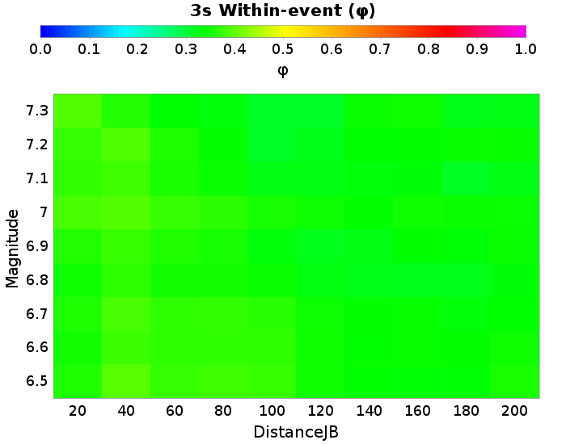 |  |  |  |

### 20.0 km M6.5 Within-event Results
*[(top)](#table-of-contents)*

| 3s &phi; | Total | Mean | Median | Range | 5s &phi; | Total | Mean | Median | Range | 7.5s &phi; | Total | Mean | Median | Range | 10s &phi; | Total | Mean | Median | Range |
|-----|-----|-----|-----|-----|-----|-----|-----|-----|-----|-----|-----|-----|-----|-----|-----|-----|-----|-----|-----|
|  | 0.35 | 0.35 | 0.34 | [0.22 0.56] |  | 0.36 | 0.35 | 0.35 | [0.16 0.64] |  | 0.35 | 0.34 | 0.33 | [0.13 0.71] |  | 0.32 | 0.31 | 0.3 | [0.15 0.56] |

| 3s | 5s |
|-----|-----|
|  |  |
| 7.5s | 10s |
|  |  |

### 40.0 km M6.5 Within-event Results
*[(top)](#table-of-contents)*

| 3s &phi; | Total | Mean | Median | Range | 5s &phi; | Total | Mean | Median | Range | 7.5s &phi; | Total | Mean | Median | Range | 10s &phi; | Total | Mean | Median | Range |
|-----|-----|-----|-----|-----|-----|-----|-----|-----|-----|-----|-----|-----|-----|-----|-----|-----|-----|-----|-----|
|  | 0.39 | 0.39 | 0.37 | [0.24 0.68] |  | 0.38 | 0.37 | 0.37 | [0.21 0.69] |  | 0.32 | 0.31 | 0.3 | [0.17 0.64] |  | 0.32 | 0.31 | 0.3 | [0.19 0.61] |

| 3s | 5s |
|-----|-----|
|  |  |
| 7.5s | 10s |
|  |  |

### 80.0 km M6.5 Within-event Results
*[(top)](#table-of-contents)*

| 3s &phi; | Total | Mean | Median | Range | 5s &phi; | Total | Mean | Median | Range | 7.5s &phi; | Total | Mean | Median | Range | 10s &phi; | Total | Mean | Median | Range |
|-----|-----|-----|-----|-----|-----|-----|-----|-----|-----|-----|-----|-----|-----|-----|-----|-----|-----|-----|-----|
|  | 0.37 | 0.37 | 0.34 | [0.22 0.76] |  | 0.41 | 0.4 | 0.39 | [0.14 0.72] |  | 0.35 | 0.34 | 0.31 | [0.14 0.69] |  | 0.35 | 0.35 | 0.33 | [0.2 0.74] |

| 3s | 5s |
|-----|-----|
|  |  |
| 7.5s | 10s |
|  |  |

### 160.0 km M6.5 Within-event Results
*[(top)](#table-of-contents)*

| 3s &phi; | Total | Mean | Median | Range | 5s &phi; | Total | Mean | Median | Range | 7.5s &phi; | Total | Mean | Median | Range | 10s &phi; | Total | Mean | Median | Range |
|-----|-----|-----|-----|-----|-----|-----|-----|-----|-----|-----|-----|-----|-----|-----|-----|-----|-----|-----|-----|
|  | 0.33 | 0.33 | 0.32 | [0.17 0.56] |  | 0.39 | 0.38 | 0.38 | [0.15 0.73] |  | 0.38 | 0.37 | 0.35 | [0.16 0.73] |  | 0.36 | 0.35 | 0.34 | [0.22 0.73] |

| 3s | 5s |
|-----|-----|
|  |  |
| 7.5s | 10s |
|  |  |

### 20.0 km M6.5 Within-event Results
*[(top)](#table-of-contents)*

| 3s &phi; | Total | Mean | Median | Range | 5s &phi; | Total | Mean | Median | Range | 7.5s &phi; | Total | Mean | Median | Range | 10s &phi; | Total | Mean | Median | Range |
|-----|-----|-----|-----|-----|-----|-----|-----|-----|-----|-----|-----|-----|-----|-----|-----|-----|-----|-----|-----|
|  | 0.35 | 0.35 | 0.34 | [0.22 0.56] |  | 0.36 | 0.35 | 0.35 | [0.16 0.64] |  | 0.35 | 0.34 | 0.33 | [0.13 0.71] |  | 0.32 | 0.31 | 0.3 | [0.15 0.56] |

| 3s | 5s |
|-----|-----|
|  |  |
| 7.5s | 10s |
|  |  |

### 40.0 km M6.5 Within-event Results
*[(top)](#table-of-contents)*

| 3s &phi; | Total | Mean | Median | Range | 5s &phi; | Total | Mean | Median | Range | 7.5s &phi; | Total | Mean | Median | Range | 10s &phi; | Total | Mean | Median | Range |
|-----|-----|-----|-----|-----|-----|-----|-----|-----|-----|-----|-----|-----|-----|-----|-----|-----|-----|-----|-----|
|  | 0.39 | 0.39 | 0.37 | [0.24 0.68] |  | 0.38 | 0.37 | 0.37 | [0.21 0.69] |  | 0.32 | 0.31 | 0.3 | [0.17 0.64] |  | 0.32 | 0.31 | 0.3 | [0.19 0.61] |

| 3s | 5s |
|-----|-----|
|  |  |
| 7.5s | 10s |
|  |  |

### 80.0 km M6.5 Within-event Results
*[(top)](#table-of-contents)*

| 3s &phi; | Total | Mean | Median | Range | 5s &phi; | Total | Mean | Median | Range | 7.5s &phi; | Total | Mean | Median | Range | 10s &phi; | Total | Mean | Median | Range |
|-----|-----|-----|-----|-----|-----|-----|-----|-----|-----|-----|-----|-----|-----|-----|-----|-----|-----|-----|-----|
|  | 0.37 | 0.37 | 0.34 | [0.22 0.76] |  | 0.41 | 0.4 | 0.39 | [0.14 0.72] |  | 0.35 | 0.34 | 0.31 | [0.14 0.69] |  | 0.35 | 0.35 | 0.33 | [0.2 0.74] |

| 3s | 5s |
|-----|-----|
|  |  |
| 7.5s | 10s |
|  |  |

### 160.0 km M6.5 Within-event Results
*[(top)](#table-of-contents)*

| 3s &phi; | Total | Mean | Median | Range | 5s &phi; | Total | Mean | Median | Range | 7.5s &phi; | Total | Mean | Median | Range | 10s &phi; | Total | Mean | Median | Range |
|-----|-----|-----|-----|-----|-----|-----|-----|-----|-----|-----|-----|-----|-----|-----|-----|-----|-----|-----|-----|
|  | 0.33 | 0.33 | 0.32 | [0.17 0.56] |  | 0.39 | 0.38 | 0.38 | [0.15 0.73] |  | 0.38 | 0.37 | 0.35 | [0.16 0.73] |  | 0.36 | 0.35 | 0.34 | [0.22 0.73] |

| 3s | 5s |
|-----|-----|
|  |  |
| 7.5s | 10s |
|  |  |

### 20.0 km M6.6 Within-event Results
*[(top)](#table-of-contents)*

| 3s &phi; | Total | Mean | Median | Range | 5s &phi; | Total | Mean | Median | Range | 7.5s &phi; | Total | Mean | Median | Range | 10s &phi; | Total | Mean | Median | Range |
|-----|-----|-----|-----|-----|-----|-----|-----|-----|-----|-----|-----|-----|-----|-----|-----|-----|-----|-----|-----|
|  | 0.34 | 0.34 | 0.33 | [0.16 0.58] |  | 0.37 | 0.36 | 0.37 | [0.12 0.6] |  | 0.37 | 0.36 | 0.35 | [0.13 0.75] |  | 0.32 | 0.31 | 0.3 | [0.15 0.67] |

| 3s | 5s |
|-----|-----|
|  |  |
| 7.5s | 10s |
|  |  |

### 40.0 km M6.6 Within-event Results
*[(top)](#table-of-contents)*

| 3s &phi; | Total | Mean | Median | Range | 5s &phi; | Total | Mean | Median | Range | 7.5s &phi; | Total | Mean | Median | Range | 10s &phi; | Total | Mean | Median | Range |
|-----|-----|-----|-----|-----|-----|-----|-----|-----|-----|-----|-----|-----|-----|-----|-----|-----|-----|-----|-----|
|  | 0.37 | 0.37 | 0.37 | [0.18 0.59] |  | 0.38 | 0.37 | 0.36 | [0.17 0.64] |  | 0.35 | 0.34 | 0.32 | [0.13 0.7] |  | 0.33 | 0.32 | 0.29 | [0.16 0.72] |

| 3s | 5s |
|-----|-----|
|  |  |
| 7.5s | 10s |
|  |  |

### 80.0 km M6.6 Within-event Results
*[(top)](#table-of-contents)*

| 3s &phi; | Total | Mean | Median | Range | 5s &phi; | Total | Mean | Median | Range | 7.5s &phi; | Total | Mean | Median | Range | 10s &phi; | Total | Mean | Median | Range |
|-----|-----|-----|-----|-----|-----|-----|-----|-----|-----|-----|-----|-----|-----|-----|-----|-----|-----|-----|-----|
|  | 0.36 | 0.36 | 0.34 | [0.18 0.65] |  | 0.41 | 0.4 | 0.39 | [0.19 0.66] |  | 0.38 | 0.37 | 0.36 | [0.17 0.85] |  | 0.37 | 0.37 | 0.37 | [0.21 0.8] |

| 3s | 5s |
|-----|-----|
|  |  |
| 7.5s | 10s |
|  |  |

### 160.0 km M6.6 Within-event Results
*[(top)](#table-of-contents)*

| 3s &phi; | Total | Mean | Median | Range | 5s &phi; | Total | Mean | Median | Range | 7.5s &phi; | Total | Mean | Median | Range | 10s &phi; | Total | Mean | Median | Range |
|-----|-----|-----|-----|-----|-----|-----|-----|-----|-----|-----|-----|-----|-----|-----|-----|-----|-----|-----|-----|
|  | 0.34 | 0.33 | 0.32 | [0.19 0.61] |  | 0.4 | 0.39 | 0.39 | [0.19 0.66] |  | 0.4 | 0.39 | 0.39 | [0.19 0.78] |  | 0.38 | 0.37 | 0.35 | [0.2 0.81] |

| 3s | 5s |
|-----|-----|
|  |  |
| 7.5s | 10s |
|  |  |

### 20.0 km M6.7 Within-event Results
*[(top)](#table-of-contents)*

| 3s &phi; | Total | Mean | Median | Range | 5s &phi; | Total | Mean | Median | Range | 7.5s &phi; | Total | Mean | Median | Range | 10s &phi; | Total | Mean | Median | Range |
|-----|-----|-----|-----|-----|-----|-----|-----|-----|-----|-----|-----|-----|-----|-----|-----|-----|-----|-----|-----|
|  | 0.35 | 0.35 | 0.35 | [0.2 0.53] |  | 0.38 | 0.37 | 0.36 | [0.15 0.63] |  | 0.38 | 0.37 | 0.35 | [0.17 0.68] |  | 0.34 | 0.33 | 0.32 | [0.16 0.6] |

| 3s | 5s |
|-----|-----|
|  |  |
| 7.5s | 10s |
|  |  |

### 40.0 km M6.7 Within-event Results
*[(top)](#table-of-contents)*

| 3s &phi; | Total | Mean | Median | Range | 5s &phi; | Total | Mean | Median | Range | 7.5s &phi; | Total | Mean | Median | Range | 10s &phi; | Total | Mean | Median | Range |
|-----|-----|-----|-----|-----|-----|-----|-----|-----|-----|-----|-----|-----|-----|-----|-----|-----|-----|-----|-----|
|  | 0.38 | 0.38 | 0.38 | [0.2 0.58] |  | 0.39 | 0.38 | 0.39 | [0.11 0.66] |  | 0.36 | 0.35 | 0.34 | [0.17 0.6] |  | 0.34 | 0.33 | 0.32 | [0.19 0.64] |

| 3s | 5s |
|-----|-----|
|  |  |
| 7.5s | 10s |
|  |  |

### 80.0 km M6.7 Within-event Results
*[(top)](#table-of-contents)*

| 3s &phi; | Total | Mean | Median | Range | 5s &phi; | Total | Mean | Median | Range | 7.5s &phi; | Total | Mean | Median | Range | 10s &phi; | Total | Mean | Median | Range |
|-----|-----|-----|-----|-----|-----|-----|-----|-----|-----|-----|-----|-----|-----|-----|-----|-----|-----|-----|-----|
|  | 0.36 | 0.36 | 0.35 | [0.2 0.63] |  | 0.43 | 0.42 | 0.41 | [0.15 0.77] |  | 0.39 | 0.38 | 0.36 | [0.17 0.75] |  | 0.39 | 0.38 | 0.37 | [0.21 0.68] |

| 3s | 5s |
|-----|-----|
|  | 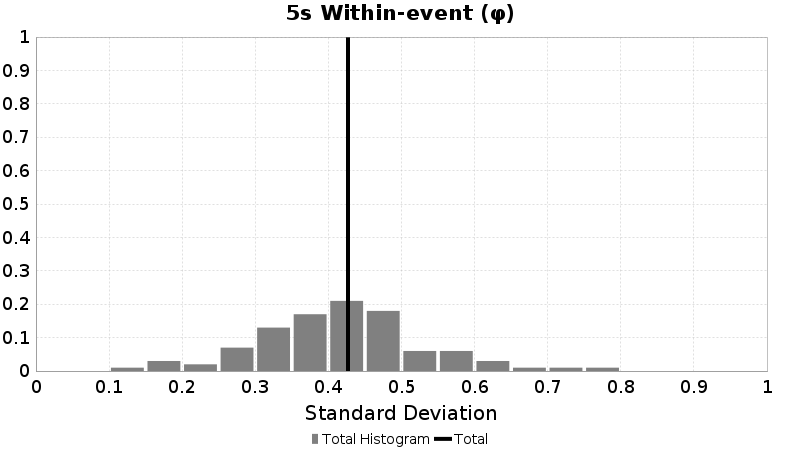 |
| 7.5s | 10s |
|  |  |

### 160.0 km M6.7 Within-event Results
*[(top)](#table-of-contents)*

| 3s &phi; | Total | Mean | Median | Range | 5s &phi; | Total | Mean | Median | Range | 7.5s &phi; | Total | Mean | Median | Range | 10s &phi; | Total | Mean | Median | Range |
|-----|-----|-----|-----|-----|-----|-----|-----|-----|-----|-----|-----|-----|-----|-----|-----|-----|-----|-----|-----|
|  | 0.34 | 0.33 | 0.33 | [0.16 0.53] |  | 0.4 | 0.4 | 0.4 | [0.15 0.71] |  | 0.41 | 0.4 | 0.4 | [0.2 0.71] |  | 0.39 | 0.38 | 0.37 | [0.2 0.68] |

| 3s | 5s |
|-----|-----|
|  |  |
| 7.5s | 10s |
|  |  |

### 20.0 km M6.8 Within-event Results
*[(top)](#table-of-contents)*

| 3s &phi; | Total | Mean | Median | Range | 5s &phi; | Total | Mean | Median | Range | 7.5s &phi; | Total | Mean | Median | Range | 10s &phi; | Total | Mean | Median | Range |
|-----|-----|-----|-----|-----|-----|-----|-----|-----|-----|-----|-----|-----|-----|-----|-----|-----|-----|-----|-----|
|  | 0.34 | 0.34 | 0.34 | [0.2 0.51] |  | 0.38 | 0.37 | 0.37 | [0.2 0.66] |  | 0.37 | 0.36 | 0.35 | [0.16 0.69] |  | 0.34 | 0.33 | 0.32 | [0.14 0.61] |

| 3s | 5s |
|-----|-----|
|  |  |
| 7.5s | 10s |
|  |  |

### 40.0 km M6.8 Within-event Results
*[(top)](#table-of-contents)*

| 3s &phi; | Total | Mean | Median | Range | 5s &phi; | Total | Mean | Median | Range | 7.5s &phi; | Total | Mean | Median | Range | 10s &phi; | Total | Mean | Median | Range |
|-----|-----|-----|-----|-----|-----|-----|-----|-----|-----|-----|-----|-----|-----|-----|-----|-----|-----|-----|-----|
|  | 0.36 | 0.36 | 0.35 | [0.23 0.51] |  | 0.39 | 0.39 | 0.38 | [0.2 0.67] |  | 0.35 | 0.34 | 0.33 | [0.17 0.69] |  | 0.35 | 0.34 | 0.32 | [0.18 0.61] |

| 3s | 5s |
|-----|-----|
|  |  |
| 7.5s | 10s |
|  |  |

### 80.0 km M6.8 Within-event Results
*[(top)](#table-of-contents)*

| 3s &phi; | Total | Mean | Median | Range | 5s &phi; | Total | Mean | Median | Range | 7.5s &phi; | Total | Mean | Median | Range | 10s &phi; | Total | Mean | Median | Range |
|-----|-----|-----|-----|-----|-----|-----|-----|-----|-----|-----|-----|-----|-----|-----|-----|-----|-----|-----|-----|
|  | 0.35 | 0.34 | 0.34 | [0.17 0.49] |  | 0.41 | 0.41 | 0.4 | [0.22 0.73] |  | 0.39 | 0.38 | 0.36 | [0.16 0.71] |  | 0.38 | 0.38 | 0.36 | [0.19 0.71] |

| 3s | 5s |
|-----|-----|
|  |  |
| 7.5s | 10s |
|  |  |

### 160.0 km M6.8 Within-event Results
*[(top)](#table-of-contents)*

| 3s &phi; | Total | Mean | Median | Range | 5s &phi; | Total | Mean | Median | Range | 7.5s &phi; | Total | Mean | Median | Range | 10s &phi; | Total | Mean | Median | Range |
|-----|-----|-----|-----|-----|-----|-----|-----|-----|-----|-----|-----|-----|-----|-----|-----|-----|-----|-----|-----|
|  | 0.32 | 0.31 | 0.31 | [0.14 0.49] |  | 0.39 | 0.39 | 0.37 | [0.23 0.68] |  | 0.4 | 0.39 | 0.38 | [0.21 0.72] |  | 0.39 | 0.39 | 0.37 | [0.18 0.72] |

| 3s | 5s |
|-----|-----|
|  |  |
| 7.5s | 10s |
|  |  |

### 20.0 km M6.9 Within-event Results
*[(top)](#table-of-contents)*

| 3s &phi; | Total | Mean | Median | Range | 5s &phi; | Total | Mean | Median | Range | 7.5s &phi; | Total | Mean | Median | Range | 10s &phi; | Total | Mean | Median | Range |
|-----|-----|-----|-----|-----|-----|-----|-----|-----|-----|-----|-----|-----|-----|-----|-----|-----|-----|-----|-----|
|  | 0.36 | 0.35 | 0.35 | [0.2 0.51] |  | 0.4 | 0.39 | 0.4 | [0.19 0.54] |  | 0.38 | 0.38 | 0.37 | [0.19 0.56] |  | 0.34 | 0.33 | 0.33 | [0.15 0.51] |

| 3s | 5s |
|-----|-----|
|  |  |
| 7.5s | 10s |
|  |  |

### 40.0 km M6.9 Within-event Results
*[(top)](#table-of-contents)*

| 3s &phi; | Total | Mean | Median | Range | 5s &phi; | Total | Mean | Median | Range | 7.5s &phi; | Total | Mean | Median | Range | 10s &phi; | Total | Mean | Median | Range |
|-----|-----|-----|-----|-----|-----|-----|-----|-----|-----|-----|-----|-----|-----|-----|-----|-----|-----|-----|-----|
|  | 0.37 | 0.37 | 0.36 | [0.24 0.55] |  | 0.4 | 0.4 | 0.39 | [0.22 0.58] |  | 0.37 | 0.36 | 0.37 | [0.17 0.53] |  | 0.37 | 0.36 | 0.35 | [0.17 0.58] |

| 3s | 5s |
|-----|-----|
|  |  |
| 7.5s | 10s |
|  |  |

### 80.0 km M6.9 Within-event Results
*[(top)](#table-of-contents)*

| 3s &phi; | Total | Mean | Median | Range | 5s &phi; | Total | Mean | Median | Range | 7.5s &phi; | Total | Mean | Median | Range | 10s &phi; | Total | Mean | Median | Range |
|-----|-----|-----|-----|-----|-----|-----|-----|-----|-----|-----|-----|-----|-----|-----|-----|-----|-----|-----|-----|
|  | 0.35 | 0.35 | 0.34 | [0.22 0.46] |  | 0.43 | 0.42 | 0.42 | [0.2 0.63] |  | 0.4 | 0.4 | 0.39 | [0.21 0.59] |  | 0.38 | 0.37 | 0.38 | [0.19 0.6] |

| 3s | 5s |
|-----|-----|
|  |  |
| 7.5s | 10s |
|  |  |

### 160.0 km M6.9 Within-event Results
*[(top)](#table-of-contents)*

| 3s &phi; | Total | Mean | Median | Range | 5s &phi; | Total | Mean | Median | Range | 7.5s &phi; | Total | Mean | Median | Range | 10s &phi; | Total | Mean | Median | Range |
|-----|-----|-----|-----|-----|-----|-----|-----|-----|-----|-----|-----|-----|-----|-----|-----|-----|-----|-----|-----|
|  | 0.33 | 0.33 | 0.34 | [0.13 0.5] |  | 0.4 | 0.39 | 0.38 | [0.2 0.58] |  | 0.41 | 0.41 | 0.42 | [0.23 0.62] |  | 0.4 | 0.4 | 0.41 | [0.21 0.63] |

| 3s | 5s |
|-----|-----|
|  |  |
| 7.5s | 10s |
|  |  |

### 20.0 km M7 Within-event Results
*[(top)](#table-of-contents)*

| 3s &phi; | Total | Mean | Median | Range | 5s &phi; | Total | Mean | Median | Range | 7.5s &phi; | Total | Mean | Median | Range | 10s &phi; | Total | Mean | Median | Range |
|-----|-----|-----|-----|-----|-----|-----|-----|-----|-----|-----|-----|-----|-----|-----|-----|-----|-----|-----|-----|
|  | 0.38 | 0.38 | 0.37 | [0.23 0.56] |  | 0.39 | 0.39 | 0.37 | [0.2 0.64] |  | 0.4 | 0.4 | 0.4 | [0.21 0.66] |  | 0.38 | 0.37 | 0.36 | [0.19 0.72] |

| 3s | 5s |
|-----|-----|
|  |  |
| 7.5s | 10s |
|  |  |

### 40.0 km M7 Within-event Results
*[(top)](#table-of-contents)*

| 3s &phi; | Total | Mean | Median | Range | 5s &phi; | Total | Mean | Median | Range | 7.5s &phi; | Total | Mean | Median | Range | 10s &phi; | Total | Mean | Median | Range |
|-----|-----|-----|-----|-----|-----|-----|-----|-----|-----|-----|-----|-----|-----|-----|-----|-----|-----|-----|-----|
|  | 0.39 | 0.39 | 0.38 | [0.23 0.54] |  | 0.41 | 0.41 | 0.41 | [0.22 0.64] |  | 0.38 | 0.37 | 0.37 | [0.18 0.62] |  | 0.41 | 0.4 | 0.4 | [0.19 0.69] |

| 3s | 5s |
|-----|-----|
|  |  |
| 7.5s | 10s |
|  |  |

### 80.0 km M7 Within-event Results
*[(top)](#table-of-contents)*

| 3s &phi; | Total | Mean | Median | Range | 5s &phi; | Total | Mean | Median | Range | 7.5s &phi; | Total | Mean | Median | Range | 10s &phi; | Total | Mean | Median | Range |
|-----|-----|-----|-----|-----|-----|-----|-----|-----|-----|-----|-----|-----|-----|-----|-----|-----|-----|-----|-----|
|  | 0.36 | 0.36 | 0.34 | [0.2 0.55] |  | 0.43 | 0.42 | 0.42 | [0.22 0.72] |  | 0.42 | 0.41 | 0.4 | [0.2 0.74] |  | 0.44 | 0.43 | 0.42 | [0.2 0.71] |

| 3s | 5s |
|-----|-----|
|  | 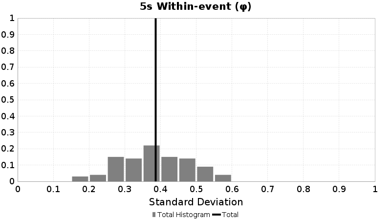 |
| 7.5s | 10s |
|  |  |

### 160.0 km M7 Within-event Results
*[(top)](#table-of-contents)*

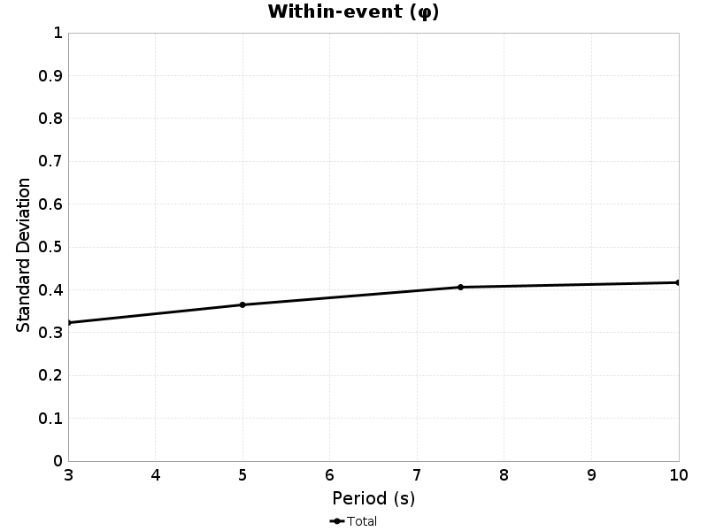

| 3s &phi; | Total | Mean | Median | Range | 5s &phi; | Total | Mean | Median | Range | 7.5s &phi; | Total | Mean | Median | Range | 10s &phi; | Total | Mean | Median | Range |
|-----|-----|-----|-----|-----|-----|-----|-----|-----|-----|-----|-----|-----|-----|-----|-----|-----|-----|-----|-----|
|  | 0.34 | 0.34 | 0.33 | [0.22 0.56] |  | 0.39 | 0.39 | 0.38 | [0.22 0.61] |  | 0.43 | 0.42 | 0.42 | [0.23 0.7] |  | 0.46 | 0.45 | 0.45 | [0.22 0.73] |

| 3s | 5s |
|-----|-----|
|  | 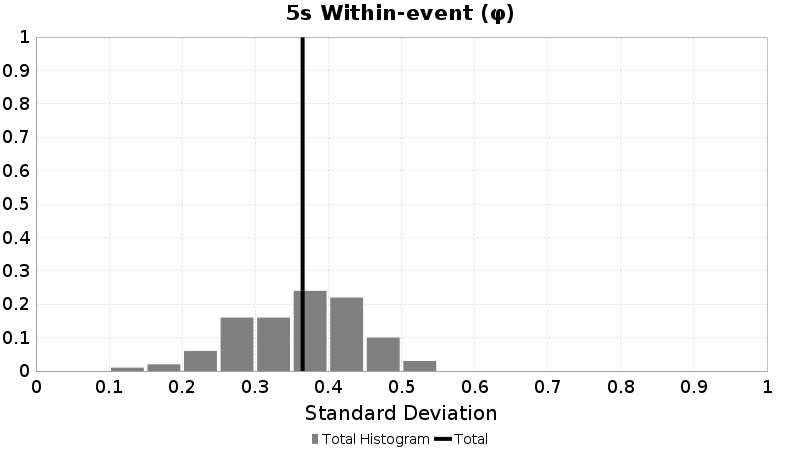 |
| 7.5s | 10s |
|  |  |

### 20.0 km M7 Within-event Results
*[(top)](#table-of-contents)*

| 3s &phi; | Total | Mean | Median | Range | 5s &phi; | Total | Mean | Median | Range | 7.5s &phi; | Total | Mean | Median | Range | 10s &phi; | Total | Mean | Median | Range |
|-----|-----|-----|-----|-----|-----|-----|-----|-----|-----|-----|-----|-----|-----|-----|-----|-----|-----|-----|-----|
|  | 0.38 | 0.38 | 0.37 | [0.23 0.56] |  | 0.39 | 0.39 | 0.37 | [0.2 0.64] |  | 0.4 | 0.4 | 0.4 | [0.21 0.66] |  | 0.38 | 0.37 | 0.36 | [0.19 0.72] |

| 3s | 5s |
|-----|-----|
|  |  |
| 7.5s | 10s |
|  |  |

### 40.0 km M7 Within-event Results
*[(top)](#table-of-contents)*

| 3s &phi; | Total | Mean | Median | Range | 5s &phi; | Total | Mean | Median | Range | 7.5s &phi; | Total | Mean | Median | Range | 10s &phi; | Total | Mean | Median | Range |
|-----|-----|-----|-----|-----|-----|-----|-----|-----|-----|-----|-----|-----|-----|-----|-----|-----|-----|-----|-----|
|  | 0.39 | 0.39 | 0.38 | [0.23 0.54] |  | 0.41 | 0.41 | 0.41 | [0.22 0.64] |  | 0.38 | 0.37 | 0.37 | [0.18 0.62] |  | 0.41 | 0.4 | 0.4 | [0.19 0.69] |

| 3s | 5s |
|-----|-----|
|  |  |
| 7.5s | 10s |
|  |  |

### 80.0 km M7 Within-event Results
*[(top)](#table-of-contents)*

| 3s &phi; | Total | Mean | Median | Range | 5s &phi; | Total | Mean | Median | Range | 7.5s &phi; | Total | Mean | Median | Range | 10s &phi; | Total | Mean | Median | Range |
|-----|-----|-----|-----|-----|-----|-----|-----|-----|-----|-----|-----|-----|-----|-----|-----|-----|-----|-----|-----|
|  | 0.36 | 0.36 | 0.34 | [0.2 0.55] |  | 0.43 | 0.42 | 0.42 | [0.22 0.72] |  | 0.42 | 0.41 | 0.4 | [0.2 0.74] |  | 0.44 | 0.43 | 0.42 | [0.2 0.71] |

| 3s | 5s |
|-----|-----|
|  |  |
| 7.5s | 10s |
|  |  |

### 160.0 km M7 Within-event Results
*[(top)](#table-of-contents)*

| 3s &phi; | Total | Mean | Median | Range | 5s &phi; | Total | Mean | Median | Range | 7.5s &phi; | Total | Mean | Median | Range | 10s &phi; | Total | Mean | Median | Range |
|-----|-----|-----|-----|-----|-----|-----|-----|-----|-----|-----|-----|-----|-----|-----|-----|-----|-----|-----|-----|
|  | 0.34 | 0.34 | 0.33 | [0.22 0.56] |  | 0.39 | 0.39 | 0.38 | [0.22 0.61] |  | 0.43 | 0.42 | 0.42 | [0.23 0.7] |  | 0.46 | 0.45 | 0.45 | [0.22 0.73] |

| 3s | 5s |
|-----|-----|
|  |  |
| 7.5s | 10s |
|  |  |

### 20.0 km M7.1 Within-event Results
*[(top)](#table-of-contents)*

| 3s &phi; | Total | Mean | Median | Range | 5s &phi; | Total | Mean | Median | Range | 7.5s &phi; | Total | Mean | Median | Range | 10s &phi; | Total | Mean | Median | Range |
|-----|-----|-----|-----|-----|-----|-----|-----|-----|-----|-----|-----|-----|-----|-----|-----|-----|-----|-----|-----|
|  | 0.37 | 0.36 | 0.35 | [0.23 0.52] |  | 0.38 | 0.37 | 0.36 | [0.21 0.61] |  | 0.34 | 0.33 | 0.34 | [0.16 0.47] |  | 0.32 | 0.31 | 0.29 | [0.16 0.57] |

| 3s | 5s |
|-----|-----|
|  |  |
| 7.5s | 10s |
|  |  |

### 40.0 km M7.1 Within-event Results
*[(top)](#table-of-contents)*

| 3s &phi; | Total | Mean | Median | Range | 5s &phi; | Total | Mean | Median | Range | 7.5s &phi; | Total | Mean | Median | Range | 10s &phi; | Total | Mean | Median | Range |
|-----|-----|-----|-----|-----|-----|-----|-----|-----|-----|-----|-----|-----|-----|-----|-----|-----|-----|-----|-----|
|  | 0.37 | 0.37 | 0.38 | [0.27 0.49] |  | 0.4 | 0.39 | 0.4 | [0.2 0.69] |  | 0.33 | 0.33 | 0.3 | [0.23 0.46] |  | 0.36 | 0.35 | 0.33 | [0.19 0.56] |

| 3s | 5s |
|-----|-----|
|  |  |
| 7.5s | 10s |
|  |  |

### 80.0 km M7.1 Within-event Results
*[(top)](#table-of-contents)*

| 3s &phi; | Total | Mean | Median | Range | 5s &phi; | Total | Mean | Median | Range | 7.5s &phi; | Total | Mean | Median | Range | 10s &phi; | Total | Mean | Median | Range |
|-----|-----|-----|-----|-----|-----|-----|-----|-----|-----|-----|-----|-----|-----|-----|-----|-----|-----|-----|-----|
|  | 0.34 | 0.34 | 0.32 | [0.24 0.46] |  | 0.41 | 0.4 | 0.4 | [0.21 0.71] |  | 0.37 | 0.36 | 0.34 | [0.26 0.55] |  | 0.38 | 0.37 | 0.35 | [0.22 0.64] |

| 3s | 5s |
|-----|-----|
|  |  |
| 7.5s | 10s |
|  |  |

### 160.0 km M7.1 Within-event Results
*[(top)](#table-of-contents)*

| 3s &phi; | Total | Mean | Median | Range | 5s &phi; | Total | Mean | Median | Range | 7.5s &phi; | Total | Mean | Median | Range | 10s &phi; | Total | Mean | Median | Range |
|-----|-----|-----|-----|-----|-----|-----|-----|-----|-----|-----|-----|-----|-----|-----|-----|-----|-----|-----|-----|
|  | 0.33 | 0.32 | 0.32 | [0.19 0.5] |  | 0.37 | 0.37 | 0.37 | [0.25 0.61] |  | 0.36 | 0.36 | 0.37 | [0.26 0.49] |  | 0.39 | 0.39 | 0.37 | [0.22 0.65] |

| 3s | 5s |
|-----|-----|
|  |  |
| 7.5s | 10s |
|  |  |

### 20.0 km M7.2 Within-event Results
*[(top)](#table-of-contents)*

| 3s &phi; | Total | Mean | Median | Range | 5s &phi; | Total | Mean | Median | Range | 7.5s &phi; | Total | Mean | Median | Range | 10s &phi; | Total | Mean | Median | Range |
|-----|-----|-----|-----|-----|-----|-----|-----|-----|-----|-----|-----|-----|-----|-----|-----|-----|-----|-----|-----|
|  | 0.37 | 0.37 | 0.38 | [0.25 0.48] |  | 0.4 | 0.4 | 0.4 | [0.22 0.54] |  | 0.36 | 0.35 | 0.36 | [0.16 0.54] |  | 0.31 | 0.3 | 0.31 | [0.14 0.42] |

| 3s | 5s |
|-----|-----|
|  |  |
| 7.5s | 10s |
|  |  |

### 40.0 km M7.2 Within-event Results
*[(top)](#table-of-contents)*

| 3s &phi; | Total | Mean | Median | Range | 5s &phi; | Total | Mean | Median | Range | 7.5s &phi; | Total | Mean | Median | Range | 10s &phi; | Total | Mean | Median | Range |
|-----|-----|-----|-----|-----|-----|-----|-----|-----|-----|-----|-----|-----|-----|-----|-----|-----|-----|-----|-----|
|  | 0.38 | 0.38 | 0.38 | [0.27 0.49] |  | 0.43 | 0.43 | 0.43 | [0.29 0.6] |  | 0.33 | 0.33 | 0.31 | [0.18 0.45] |  | 0.34 | 0.33 | 0.34 | [0.17 0.46] |

| 3s | 5s |
|-----|-----|
|  |  |
| 7.5s | 10s |
|  |  |

### 80.0 km M7.2 Within-event Results
*[(top)](#table-of-contents)*

| 3s &phi; | Total | Mean | Median | Range | 5s &phi; | Total | Mean | Median | Range | 7.5s &phi; | Total | Mean | Median | Range | 10s &phi; | Total | Mean | Median | Range |
|-----|-----|-----|-----|-----|-----|-----|-----|-----|-----|-----|-----|-----|-----|-----|-----|-----|-----|-----|-----|
|  | 0.33 | 0.33 | 0.34 | [0.25 0.44] |  | 0.43 | 0.42 | 0.43 | [0.24 0.6] |  | 0.35 | 0.35 | 0.35 | [0.17 0.51] |  | 0.33 | 0.33 | 0.36 | [0.17 0.46] |

| 3s | 5s |
|-----|-----|
|  |  |
| 7.5s | 10s |
|  |  |

### 160.0 km M7.2 Within-event Results
*[(top)](#table-of-contents)*

| 3s &phi; | Total | Mean | Median | Range | 5s &phi; | Total | Mean | Median | Range | 7.5s &phi; | Total | Mean | Median | Range | 10s &phi; | Total | Mean | Median | Range |
|-----|-----|-----|-----|-----|-----|-----|-----|-----|-----|-----|-----|-----|-----|-----|-----|-----|-----|-----|-----|
|  | 0.33 | 0.33 | 0.34 | [0.22 0.45] |  | 0.38 | 0.37 | 0.39 | [0.24 0.52] |  | 0.36 | 0.35 | 0.32 | [0.17 0.52] |  | 0.36 | 0.35 | 0.37 | [0.22 0.48] |

| 3s | 5s |
|-----|-----|
|  |  |
| 7.5s | 10s |
|  |  |

### 20.0 km M7.3 Within-event Results
*[(top)](#table-of-contents)*

| 3s &phi; | Total | Mean | Median | Range | 5s &phi; | Total | Mean | Median | Range | 7.5s &phi; | Total | Mean | Median | Range | 10s &phi; | Total | Mean | Median | Range |
|-----|-----|-----|-----|-----|-----|-----|-----|-----|-----|-----|-----|-----|-----|-----|-----|-----|-----|-----|-----|
|  | 0.39 | 0.39 | 0.38 | [0.3 0.52] |  | 0.37 | 0.37 | 0.36 | [0.26 0.53] |  | 0.37 | 0.37 | 0.38 | [0.27 0.44] |  | 0.33 | 0.33 | 0.32 | [0.19 0.47] |

| 3s | 5s |
|-----|-----|
|  |  |
| 7.5s | 10s |
|  |  |

### 40.0 km M7.3 Within-event Results
*[(top)](#table-of-contents)*

| 3s &phi; | Total | Mean | Median | Range | 5s &phi; | Total | Mean | Median | Range | 7.5s &phi; | Total | Mean | Median | Range | 10s &phi; | Total | Mean | Median | Range |
|-----|-----|-----|-----|-----|-----|-----|-----|-----|-----|-----|-----|-----|-----|-----|-----|-----|-----|-----|-----|
|  | 0.35 | 0.36 | 0.34 | [0.29 0.45] |  | 0.4 | 0.4 | 0.41 | [0.32 0.5] |  | 0.3 | 0.3 | 0.29 | [0.15 0.42] |  | 0.33 | 0.32 | 0.3 | [0.22 0.54] |

| 3s | 5s |
|-----|-----|
|  |  |
| 7.5s | 10s |
|  |  |

### 80.0 km M7.3 Within-event Results
*[(top)](#table-of-contents)*

| 3s &phi; | Total | Mean | Median | Range | 5s &phi; | Total | Mean | Median | Range | 7.5s &phi; | Total | Mean | Median | Range | 10s &phi; | Total | Mean | Median | Range |
|-----|-----|-----|-----|-----|-----|-----|-----|-----|-----|-----|-----|-----|-----|-----|-----|-----|-----|-----|-----|
|  | 0.33 | 0.33 | 0.31 | [0.23 0.44] |  | 0.38 | 0.38 | 0.39 | [0.25 0.48] |  | 0.35 | 0.34 | 0.35 | [0.19 0.43] |  | 0.38 | 0.38 | 0.35 | [0.24 0.57] |

| 3s | 5s |
|-----|-----|
|  |  |
| 7.5s | 10s |
|  |  |

### 160.0 km M7.3 Within-event Results
*[(top)](#table-of-contents)*

| 3s &phi; | Total | Mean | Median | Range | 5s &phi; | Total | Mean | Median | Range | 7.5s &phi; | Total | Mean | Median | Range | 10s &phi; | Total | Mean | Median | Range |
|-----|-----|-----|-----|-----|-----|-----|-----|-----|-----|-----|-----|-----|-----|-----|-----|-----|-----|-----|-----|
|  | 0.34 | 0.34 | 0.34 | [0.22 0.44] |  | 0.35 | 0.35 | 0.37 | [0.23 0.46] |  | 0.34 | 0.33 | 0.33 | [0.17 0.49] |  | 0.39 | 0.38 | 0.38 | [0.26 0.6] |

| 3s | 5s |
|-----|-----|
|  |  |
| 7.5s | 10s |
|  |  |

## Between-events, single-path Variability
*[(top)](#table-of-contents)*

### Between-events, single-path Variability Methodology
*[(top)](#table-of-contents)*

Between-events, single-path variability, denoted &tau;0 in Al Atik (2010), is computed from ground motion residuals where the following quantities are held constant:

* Site *[1 unique]*
* Joyner-Boore Distance *[10 unique]*
* Rupture Strike *[36 unique]*
* Path *[1 unique]*

and the following quantities vary:

* Rupture *[59 unique]*

Standard deviation is computed and tabulated separately for each site and distance, then a total standard deviation is computed from all sitess and reported in the "**ALL SITES**" row. Results are reported separately for each distance

### Between-events, single-path Variability Mag-Distance Plots
*[(top)](#table-of-contents)*

| 3s | 5s | 7.5s | 10s |
|-----|-----|-----|-----|
| 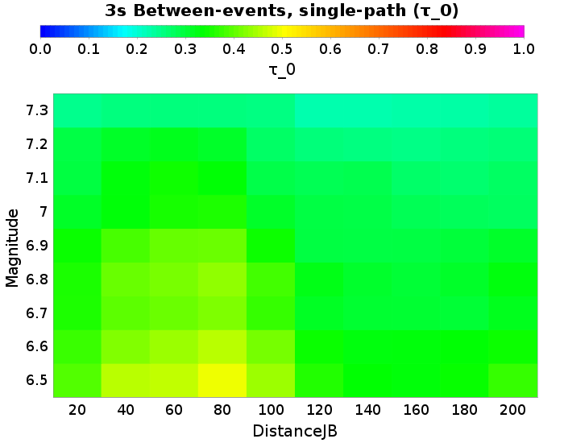 |  | 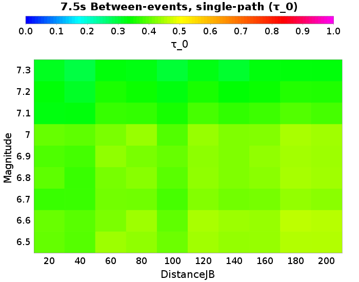 | 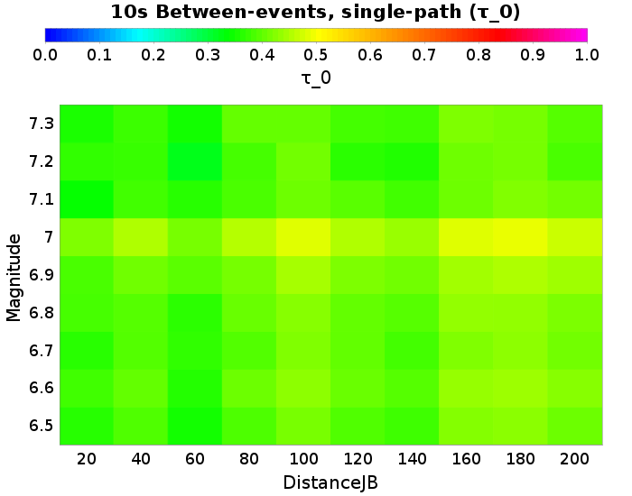 |

### 20.0 km M6.5 Between-events, single-path Results
*[(top)](#table-of-contents)*

| 3s &tau;0 | Total | Mean | Median | Range | 5s &tau;0 | Total | Mean | Median | Range | 7.5s &tau;0 | Total | Mean | Median | Range | 10s &tau;0 | Total | Mean | Median | Range |
|-----|-----|-----|-----|-----|-----|-----|-----|-----|-----|-----|-----|-----|-----|-----|-----|-----|-----|-----|-----|
|  | 0.39 | 0.39 | 0.39 | [0.3 0.46] |  | 0.41 | 0.41 | 0.41 | [0.34 0.48] |  | 0.4 | 0.4 | 0.4 | [0.37 0.43] |  | 0.36 | 0.36 | 0.36 | [0.33 0.39] |

| 3s | 5s |
|-----|-----|
|  |  |
| 7.5s | 10s |
|  |  |

### 40.0 km M6.5 Between-events, single-path Results
*[(top)](#table-of-contents)*

| 3s &tau;0 | Total | Mean | Median | Range | 5s &tau;0 | Total | Mean | Median | Range | 7.5s &tau;0 | Total | Mean | Median | Range | 10s &tau;0 | Total | Mean | Median | Range |
|-----|-----|-----|-----|-----|-----|-----|-----|-----|-----|-----|-----|-----|-----|-----|-----|-----|-----|-----|-----|
|  | 0.45 | 0.45 | 0.45 | [0.38 0.56] |  | 0.47 | 0.47 | 0.47 | [0.4 0.54] |  | 0.39 | 0.39 | 0.4 | [0.33 0.43] |  | 0.39 | 0.39 | 0.39 | [0.33 0.44] |

| 3s | 5s |
|-----|-----|
|  |  |
| 7.5s | 10s |
|  |  |

### 80.0 km M6.5 Between-events, single-path Results
*[(top)](#table-of-contents)*

| 3s &tau;0 | Total | Mean | Median | Range | 5s &tau;0 | Total | Mean | Median | Range | 7.5s &tau;0 | Total | Mean | Median | Range | 10s &tau;0 | Total | Mean | Median | Range |
|-----|-----|-----|-----|-----|-----|-----|-----|-----|-----|-----|-----|-----|-----|-----|-----|-----|-----|-----|-----|
|  | 0.49 | 0.49 | 0.49 | [0.42 0.58] |  | 0.5 | 0.5 | 0.5 | [0.45 0.56] |  | 0.43 | 0.43 | 0.43 | [0.39 0.45] |  | 0.38 | 0.38 | 0.38 | [0.34 0.43] |

| 3s | 5s |
|-----|-----|
|  |  |
| 7.5s | 10s |
|  |  |

### 160.0 km M6.5 Between-events, single-path Results
*[(top)](#table-of-contents)*

| 3s &tau;0 | Total | Mean | Median | Range | 5s &tau;0 | Total | Mean | Median | Range | 7.5s &tau;0 | Total | Mean | Median | Range | 10s &tau;0 | Total | Mean | Median | Range |
|-----|-----|-----|-----|-----|-----|-----|-----|-----|-----|-----|-----|-----|-----|-----|-----|-----|-----|-----|-----|
|  | 0.33 | 0.33 | 0.33 | [0.28 0.38] |  | 0.46 | 0.46 | 0.45 | [0.42 0.54] |  | 0.43 | 0.43 | 0.44 | [0.38 0.46] |  | 0.42 | 0.42 | 0.42 | [0.39 0.45] |

| 3s | 5s |
|-----|-----|
|  |  |
| 7.5s | 10s |
|  |  |

### 20.0 km M6.5 Between-events, single-path Results
*[(top)](#table-of-contents)*

| 3s &tau;0 | Total | Mean | Median | Range | 5s &tau;0 | Total | Mean | Median | Range | 7.5s &tau;0 | Total | Mean | Median | Range | 10s &tau;0 | Total | Mean | Median | Range |
|-----|-----|-----|-----|-----|-----|-----|-----|-----|-----|-----|-----|-----|-----|-----|-----|-----|-----|-----|-----|
|  | 0.39 | 0.39 | 0.39 | [0.3 0.46] |  | 0.41 | 0.41 | 0.41 | [0.34 0.48] |  | 0.4 | 0.4 | 0.4 | [0.37 0.43] |  | 0.36 | 0.36 | 0.36 | [0.33 0.39] |

| 3s | 5s |
|-----|-----|
|  |  |
| 7.5s | 10s |
|  |  |

### 40.0 km M6.5 Between-events, single-path Results
*[(top)](#table-of-contents)*

| 3s &tau;0 | Total | Mean | Median | Range | 5s &tau;0 | Total | Mean | Median | Range | 7.5s &tau;0 | Total | Mean | Median | Range | 10s &tau;0 | Total | Mean | Median | Range |
|-----|-----|-----|-----|-----|-----|-----|-----|-----|-----|-----|-----|-----|-----|-----|-----|-----|-----|-----|-----|
|  | 0.45 | 0.45 | 0.45 | [0.38 0.56] |  | 0.47 | 0.47 | 0.47 | [0.4 0.54] |  | 0.39 | 0.39 | 0.4 | [0.33 0.43] |  | 0.39 | 0.39 | 0.39 | [0.33 0.44] |

| 3s | 5s |
|-----|-----|
|  |  |
| 7.5s | 10s |
|  |  |

### 80.0 km M6.5 Between-events, single-path Results
*[(top)](#table-of-contents)*

| 3s &tau;0 | Total | Mean | Median | Range | 5s &tau;0 | Total | Mean | Median | Range | 7.5s &tau;0 | Total | Mean | Median | Range | 10s &tau;0 | Total | Mean | Median | Range |
|-----|-----|-----|-----|-----|-----|-----|-----|-----|-----|-----|-----|-----|-----|-----|-----|-----|-----|-----|-----|
|  | 0.49 | 0.49 | 0.49 | [0.42 0.58] |  | 0.5 | 0.5 | 0.5 | [0.45 0.56] |  | 0.43 | 0.43 | 0.43 | [0.39 0.45] |  | 0.38 | 0.38 | 0.38 | [0.34 0.43] |

| 3s | 5s |
|-----|-----|
|  |  |
| 7.5s | 10s |
|  |  |

### 160.0 km M6.5 Between-events, single-path Results
*[(top)](#table-of-contents)*

| 3s &tau;0 | Total | Mean | Median | Range | 5s &tau;0 | Total | Mean | Median | Range | 7.5s &tau;0 | Total | Mean | Median | Range | 10s &tau;0 | Total | Mean | Median | Range |
|-----|-----|-----|-----|-----|-----|-----|-----|-----|-----|-----|-----|-----|-----|-----|-----|-----|-----|-----|-----|
|  | 0.33 | 0.33 | 0.33 | [0.28 0.38] |  | 0.46 | 0.46 | 0.45 | [0.42 0.54] |  | 0.43 | 0.43 | 0.44 | [0.38 0.46] |  | 0.42 | 0.42 | 0.42 | [0.39 0.45] |

| 3s | 5s |
|-----|-----|
|  |  |
| 7.5s | 10s |
|  |  |

### 20.0 km M6.6 Between-events, single-path Results
*[(top)](#table-of-contents)*

| 3s &tau;0 | Total | Mean | Median | Range | 5s &tau;0 | Total | Mean | Median | Range | 7.5s &tau;0 | Total | Mean | Median | Range | 10s &tau;0 | Total | Mean | Median | Range |
|-----|-----|-----|-----|-----|-----|-----|-----|-----|-----|-----|-----|-----|-----|-----|-----|-----|-----|-----|-----|
|  | 0.37 | 0.37 | 0.37 | [0.34 0.43] |  | 0.39 | 0.39 | 0.38 | [0.35 0.46] |  | 0.4 | 0.4 | 0.4 | [0.36 0.46] |  | 0.37 | 0.38 | 0.37 | [0.33 0.43] |

| 3s | 5s |
|-----|-----|
|  |  |
| 7.5s | 10s |
|  |  |

### 40.0 km M6.6 Between-events, single-path Results
*[(top)](#table-of-contents)*

| 3s &tau;0 | Total | Mean | Median | Range | 5s &tau;0 | Total | Mean | Median | Range | 7.5s &tau;0 | Total | Mean | Median | Range | 10s &tau;0 | Total | Mean | Median | Range |
|-----|-----|-----|-----|-----|-----|-----|-----|-----|-----|-----|-----|-----|-----|-----|-----|-----|-----|-----|-----|
|  | 0.42 | 0.42 | 0.42 | [0.36 0.47] |  | 0.44 | 0.44 | 0.44 | [0.41 0.5] |  | 0.39 | 0.39 | 0.39 | [0.35 0.43] |  | 0.4 | 0.4 | 0.4 | [0.36 0.43] |

| 3s | 5s |
|-----|-----|
|  |  |
| 7.5s | 10s |
|  |  |

### 80.0 km M6.6 Between-events, single-path Results
*[(top)](#table-of-contents)*

| 3s &tau;0 | Total | Mean | Median | Range | 5s &tau;0 | Total | Mean | Median | Range | 7.5s &tau;0 | Total | Mean | Median | Range | 10s &tau;0 | Total | Mean | Median | Range |
|-----|-----|-----|-----|-----|-----|-----|-----|-----|-----|-----|-----|-----|-----|-----|-----|-----|-----|-----|-----|
|  | 0.45 | 0.45 | 0.45 | [0.4 0.53] |  | 0.46 | 0.46 | 0.46 | [0.42 0.52] |  | 0.44 | 0.44 | 0.43 | [0.41 0.5] |  | 0.4 | 0.4 | 0.4 | [0.35 0.47] |

| 3s | 5s |
|-----|-----|
|  |  |
| 7.5s | 10s |
|  |  |

### 160.0 km M6.6 Between-events, single-path Results
*[(top)](#table-of-contents)*

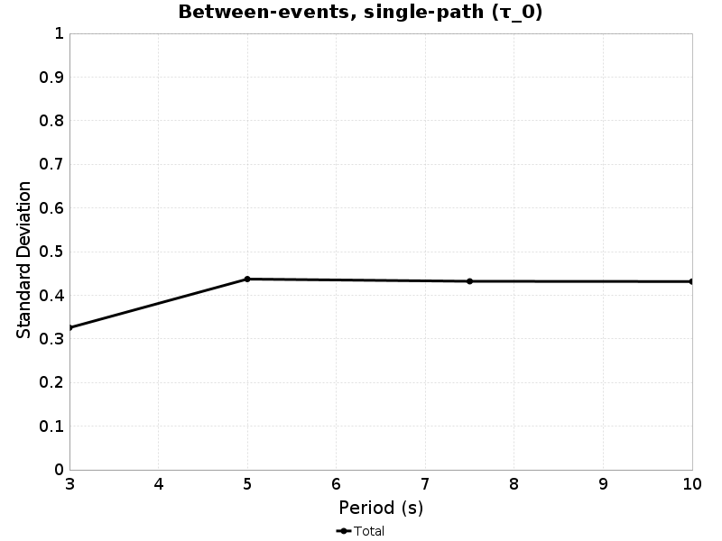

| 3s &tau;0 | Total | Mean | Median | Range | 5s &tau;0 | Total | Mean | Median | Range | 7.5s &tau;0 | Total | Mean | Median | Range | 10s &tau;0 | Total | Mean | Median | Range |
|-----|-----|-----|-----|-----|-----|-----|-----|-----|-----|-----|-----|-----|-----|-----|-----|-----|-----|-----|-----|
|  | 0.33 | 0.33 | 0.32 | [0.29 0.37] |  | 0.44 | 0.44 | 0.44 | [0.37 0.52] |  | 0.43 | 0.43 | 0.43 | [0.4 0.46] |  | 0.43 | 0.43 | 0.43 | [0.38 0.48] |

| 3s | 5s |
|-----|-----|
|  |  |
| 7.5s | 10s |
|  |  |

### 20.0 km M6.7 Between-events, single-path Results
*[(top)](#table-of-contents)*

| 3s &tau;0 | Total | Mean | Median | Range | 5s &tau;0 | Total | Mean | Median | Range | 7.5s &tau;0 | Total | Mean | Median | Range | 10s &tau;0 | Total | Mean | Median | Range |
|-----|-----|-----|-----|-----|-----|-----|-----|-----|-----|-----|-----|-----|-----|-----|-----|-----|-----|-----|-----|
|  | 0.35 | 0.35 | 0.35 | [0.29 0.39] |  | 0.37 | 0.37 | 0.37 | [0.32 0.43] |  | 0.37 | 0.37 | 0.37 | [0.32 0.44] |  | 0.36 | 0.36 | 0.37 | [0.32 0.4] |

| 3s | 5s |
|-----|-----|
|  |  |
| 7.5s | 10s |
|  |  |

### 40.0 km M6.7 Between-events, single-path Results
*[(top)](#table-of-contents)*

| 3s &tau;0 | Total | Mean | Median | Range | 5s &tau;0 | Total | Mean | Median | Range | 7.5s &tau;0 | Total | Mean | Median | Range | 10s &tau;0 | Total | Mean | Median | Range |
|-----|-----|-----|-----|-----|-----|-----|-----|-----|-----|-----|-----|-----|-----|-----|-----|-----|-----|-----|-----|
|  | 0.39 | 0.39 | 0.39 | [0.34 0.45] |  | 0.43 | 0.43 | 0.43 | [0.38 0.49] |  | 0.37 | 0.37 | 0.38 | [0.3 0.42] |  | 0.39 | 0.39 | 0.39 | [0.33 0.44] |

| 3s | 5s |
|-----|-----|
|  |  |
| 7.5s | 10s |
|  |  |

### 80.0 km M6.7 Between-events, single-path Results
*[(top)](#table-of-contents)*

| 3s &tau;0 | Total | Mean | Median | Range | 5s &tau;0 | Total | Mean | Median | Range | 7.5s &tau;0 | Total | Mean | Median | Range | 10s &tau;0 | Total | Mean | Median | Range |
|-----|-----|-----|-----|-----|-----|-----|-----|-----|-----|-----|-----|-----|-----|-----|-----|-----|-----|-----|-----|
|  | 0.42 | 0.42 | 0.42 | [0.36 0.48] |  | 0.45 | 0.46 | 0.45 | [0.41 0.51] |  | 0.41 | 0.41 | 0.4 | [0.36 0.47] |  | 0.39 | 0.39 | 0.39 | [0.34 0.44] |

| 3s | 5s |
|-----|-----|
|  |  |
| 7.5s | 10s |
|  |  |

### 160.0 km M6.7 Between-events, single-path Results
*[(top)](#table-of-contents)*

| 3s &tau;0 | Total | Mean | Median | Range | 5s &tau;0 | Total | Mean | Median | Range | 7.5s &tau;0 | Total | Mean | Median | Range | 10s &tau;0 | Total | Mean | Median | Range |
|-----|-----|-----|-----|-----|-----|-----|-----|-----|-----|-----|-----|-----|-----|-----|-----|-----|-----|-----|-----|
|  | 0.3 | 0.3 | 0.31 | [0.25 0.34] |  | 0.42 | 0.43 | 0.42 | [0.37 0.51] |  | 0.41 | 0.41 | 0.39 | [0.34 0.5] |  | 0.42 | 0.42 | 0.41 | [0.37 0.46] |

| 3s | 5s |
|-----|-----|
|  |  |
| 7.5s | 10s |
|  |  |

### 20.0 km M6.8 Between-events, single-path Results
*[(top)](#table-of-contents)*

| 3s &tau;0 | Total | Mean | Median | Range | 5s &tau;0 | Total | Mean | Median | Range | 7.5s &tau;0 | Total | Mean | Median | Range | 10s &tau;0 | Total | Mean | Median | Range |
|-----|-----|-----|-----|-----|-----|-----|-----|-----|-----|-----|-----|-----|-----|-----|-----|-----|-----|-----|-----|
|  | 0.35 | 0.35 | 0.35 | [0.3 0.43] |  | 0.37 | 0.37 | 0.36 | [0.33 0.43] |  | 0.39 | 0.4 | 0.4 | [0.34 0.44] |  | 0.38 | 0.38 | 0.38 | [0.33 0.43] |

| 3s | 5s |
|-----|-----|
|  |  |
| 7.5s | 10s |
|  |  |

### 40.0 km M6.8 Between-events, single-path Results
*[(top)](#table-of-contents)*

| 3s &tau;0 | Total | Mean | Median | Range | 5s &tau;0 | Total | Mean | Median | Range | 7.5s &tau;0 | Total | Mean | Median | Range | 10s &tau;0 | Total | Mean | Median | Range |
|-----|-----|-----|-----|-----|-----|-----|-----|-----|-----|-----|-----|-----|-----|-----|-----|-----|-----|-----|-----|
|  | 0.4 | 0.4 | 0.4 | [0.32 0.47] |  | 0.43 | 0.43 | 0.42 | [0.39 0.49] |  | 0.37 | 0.37 | 0.37 | [0.33 0.42] |  | 0.39 | 0.39 | 0.39 | [0.34 0.44] |

| 3s | 5s |
|-----|-----|
|  |  |
| 7.5s | 10s |
|  |  |

### 80.0 km M6.8 Between-events, single-path Results
*[(top)](#table-of-contents)*

| 3s &tau;0 | Total | Mean | Median | Range | 5s &tau;0 | Total | Mean | Median | Range | 7.5s &tau;0 | Total | Mean | Median | Range | 10s &tau;0 | Total | Mean | Median | Range |
|-----|-----|-----|-----|-----|-----|-----|-----|-----|-----|-----|-----|-----|-----|-----|-----|-----|-----|-----|-----|
|  | 0.43 | 0.43 | 0.43 | [0.37 0.49] |  | 0.44 | 0.44 | 0.44 | [0.4 0.5] |  | 0.42 | 0.42 | 0.43 | [0.37 0.48] |  | 0.4 | 0.4 | 0.4 | [0.35 0.46] |

| 3s | 5s |
|-----|-----|
|  |  |
| 7.5s | 10s |
|  |  |

### 160.0 km M6.8 Between-events, single-path Results
*[(top)](#table-of-contents)*

| 3s &tau;0 | Total | Mean | Median | Range | 5s &tau;0 | Total | Mean | Median | Range | 7.5s &tau;0 | Total | Mean | Median | Range | 10s &tau;0 | Total | Mean | Median | Range |
|-----|-----|-----|-----|-----|-----|-----|-----|-----|-----|-----|-----|-----|-----|-----|-----|-----|-----|-----|-----|
|  | 0.3 | 0.3 | 0.3 | [0.26 0.35] |  | 0.42 | 0.42 | 0.42 | [0.39 0.47] |  | 0.42 | 0.43 | 0.43 | [0.37 0.48] |  | 0.43 | 0.43 | 0.43 | [0.39 0.48] |

| 3s | 5s |
|-----|-----|
|  |  |
| 7.5s | 10s |
|  |  |

### 20.0 km M6.9 Between-events, single-path Results
*[(top)](#table-of-contents)*

| 3s &tau;0 | Total | Mean | Median | Range | 5s &tau;0 | Total | Mean | Median | Range | 7.5s &tau;0 | Total | Mean | Median | Range | 10s &tau;0 | Total | Mean | Median | Range |
|-----|-----|-----|-----|-----|-----|-----|-----|-----|-----|-----|-----|-----|-----|-----|-----|-----|-----|-----|-----|
|  | 0.34 | 0.34 | 0.34 | [0.29 0.41] |  | 0.38 | 0.39 | 0.38 | [0.34 0.45] |  | 0.38 | 0.38 | 0.38 | [0.3 0.48] |  | 0.38 | 0.38 | 0.36 | [0.28 0.5] |

| 3s | 5s |
|-----|-----|
|  |  |
| 7.5s | 10s |
|  |  |

### 40.0 km M6.9 Between-events, single-path Results
*[(top)](#table-of-contents)*

| 3s &tau;0 | Total | Mean | Median | Range | 5s &tau;0 | Total | Mean | Median | Range | 7.5s &tau;0 | Total | Mean | Median | Range | 10s &tau;0 | Total | Mean | Median | Range |
|-----|-----|-----|-----|-----|-----|-----|-----|-----|-----|-----|-----|-----|-----|-----|-----|-----|-----|-----|-----|
|  | 0.38 | 0.38 | 0.39 | [0.3 0.46] |  | 0.45 | 0.45 | 0.45 | [0.4 0.52] |  | 0.38 | 0.38 | 0.37 | [0.29 0.48] |  | 0.41 | 0.4 | 0.39 | [0.32 0.55] |

| 3s | 5s |
|-----|-----|
|  |  |
| 7.5s | 10s |
|  |  |

### 80.0 km M6.9 Between-events, single-path Results
*[(top)](#table-of-contents)*

| 3s &tau;0 | Total | Mean | Median | Range | 5s &tau;0 | Total | Mean | Median | Range | 7.5s &tau;0 | Total | Mean | Median | Range | 10s &tau;0 | Total | Mean | Median | Range |
|-----|-----|-----|-----|-----|-----|-----|-----|-----|-----|-----|-----|-----|-----|-----|-----|-----|-----|-----|-----|
|  | 0.4 | 0.4 | 0.41 | [0.32 0.48] |  | 0.47 | 0.47 | 0.46 | [0.42 0.54] |  | 0.41 | 0.41 | 0.4 | [0.37 0.52] |  | 0.41 | 0.41 | 0.38 | [0.3 0.61] |

| 3s | 5s |
|-----|-----|
|  |  |
| 7.5s | 10s |
|  |  |

### 160.0 km M6.9 Between-events, single-path Results
*[(top)](#table-of-contents)*

| 3s &tau;0 | Total | Mean | Median | Range | 5s &tau;0 | Total | Mean | Median | Range | 7.5s &tau;0 | Total | Mean | Median | Range | 10s &tau;0 | Total | Mean | Median | Range |
|-----|-----|-----|-----|-----|-----|-----|-----|-----|-----|-----|-----|-----|-----|-----|-----|-----|-----|-----|-----|
|  | 0.29 | 0.29 | 0.29 | [0.24 0.36] |  | 0.43 | 0.43 | 0.43 | [0.37 0.52] |  | 0.43 | 0.43 | 0.42 | [0.33 0.54] |  | 0.44 | 0.43 | 0.41 | [0.35 0.64] |

| 3s | 5s |
|-----|-----|
|  |  |
| 7.5s | 10s |
|  |  |

### 20.0 km M7 Between-events, single-path Results
*[(top)](#table-of-contents)*

| 3s &tau;0 | Total | Mean | Median | Range | 5s &tau;0 | Total | Mean | Median | Range | 7.5s &tau;0 | Total | Mean | Median | Range | 10s &tau;0 | Total | Mean | Median | Range |
|-----|-----|-----|-----|-----|-----|-----|-----|-----|-----|-----|-----|-----|-----|-----|-----|-----|-----|-----|-----|
|  | 0.31 | 0.31 | 0.31 | [0.23 0.37] |  | 0.33 | 0.33 | 0.33 | [0.23 0.39] |  | 0.4 | 0.4 | 0.41 | [0.32 0.47] |  | 0.42 | 0.42 | 0.4 | [0.34 0.51] |

| 3s | 5s |
|-----|-----|
|  |  |
| 7.5s | 10s |
|  |  |

### 40.0 km M7 Between-events, single-path Results
*[(top)](#table-of-contents)*

| 3s &tau;0 | Total | Mean | Median | Range | 5s &tau;0 | Total | Mean | Median | Range | 7.5s &tau;0 | Total | Mean | Median | Range | 10s &tau;0 | Total | Mean | Median | Range |
|-----|-----|-----|-----|-----|-----|-----|-----|-----|-----|-----|-----|-----|-----|-----|-----|-----|-----|-----|-----|
|  | 0.33 | 0.33 | 0.33 | [0.27 0.39] |  | 0.38 | 0.38 | 0.38 | [0.3 0.47] |  | 0.39 | 0.4 | 0.41 | [0.31 0.46] |  | 0.45 | 0.45 | 0.44 | [0.37 0.56] |

| 3s | 5s |
|-----|-----|
|  |  |
| 7.5s | 10s |
|  |  |

### 80.0 km M7 Between-events, single-path Results
*[(top)](#table-of-contents)*

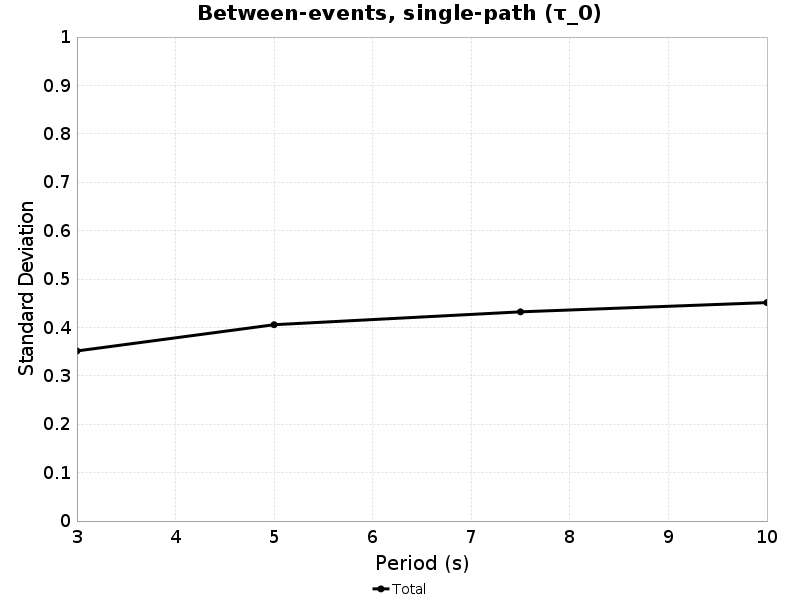

| 3s &tau;0 | Total | Mean | Median | Range | 5s &tau;0 | Total | Mean | Median | Range | 7.5s &tau;0 | Total | Mean | Median | Range | 10s &tau;0 | Total | Mean | Median | Range |
|-----|-----|-----|-----|-----|-----|-----|-----|-----|-----|-----|-----|-----|-----|-----|-----|-----|-----|-----|-----|
|  | 0.35 | 0.35 | 0.35 | [0.28 0.44] |  | 0.41 | 0.41 | 0.39 | [0.34 0.49] |  | 0.43 | 0.43 | 0.43 | [0.35 0.53] |  | 0.45 | 0.45 | 0.45 | [0.36 0.59] |

| 3s | 5s |
|-----|-----|
|  |  |
| 7.5s | 10s |
|  |  |

### 160.0 km M7 Between-events, single-path Results
*[(top)](#table-of-contents)*

| 3s &tau;0 | Total | Mean | Median | Range | 5s &tau;0 | Total | Mean | Median | Range | 7.5s &tau;0 | Total | Mean | Median | Range | 10s &tau;0 | Total | Mean | Median | Range |
|-----|-----|-----|-----|-----|-----|-----|-----|-----|-----|-----|-----|-----|-----|-----|-----|-----|-----|-----|-----|
|  | 0.28 | 0.28 | 0.28 | [0.2 0.35] |  | 0.36 | 0.36 | 0.34 | [0.28 0.45] |  | 0.42 | 0.42 | 0.41 | [0.34 0.5] |  | 0.48 | 0.48 | 0.47 | [0.39 0.6] |

| 3s | 5s |
|-----|-----|
|  |  |
| 7.5s | 10s |
|  |  |

### 20.0 km M7 Between-events, single-path Results
*[(top)](#table-of-contents)*

| 3s &tau;0 | Total | Mean | Median | Range | 5s &tau;0 | Total | Mean | Median | Range | 7.5s &tau;0 | Total | Mean | Median | Range | 10s &tau;0 | Total | Mean | Median | Range |
|-----|-----|-----|-----|-----|-----|-----|-----|-----|-----|-----|-----|-----|-----|-----|-----|-----|-----|-----|-----|
|  | 0.31 | 0.31 | 0.31 | [0.23 0.37] |  | 0.33 | 0.33 | 0.33 | [0.23 0.39] |  | 0.4 | 0.4 | 0.41 | [0.32 0.47] |  | 0.42 | 0.42 | 0.4 | [0.34 0.51] |

| 3s | 5s |
|-----|-----|
|  |  |
| 7.5s | 10s |
|  |  |

### 40.0 km M7 Between-events, single-path Results
*[(top)](#table-of-contents)*

| 3s &tau;0 | Total | Mean | Median | Range | 5s &tau;0 | Total | Mean | Median | Range | 7.5s &tau;0 | Total | Mean | Median | Range | 10s &tau;0 | Total | Mean | Median | Range |
|-----|-----|-----|-----|-----|-----|-----|-----|-----|-----|-----|-----|-----|-----|-----|-----|-----|-----|-----|-----|
|  | 0.33 | 0.33 | 0.33 | [0.27 0.39] |  | 0.38 | 0.38 | 0.38 | [0.3 0.47] |  | 0.39 | 0.4 | 0.41 | [0.31 0.46] |  | 0.45 | 0.45 | 0.44 | [0.37 0.56] |

| 3s | 5s |
|-----|-----|
|  |  |
| 7.5s | 10s |
|  |  |

### 80.0 km M7 Between-events, single-path Results
*[(top)](#table-of-contents)*

| 3s &tau;0 | Total | Mean | Median | Range | 5s &tau;0 | Total | Mean | Median | Range | 7.5s &tau;0 | Total | Mean | Median | Range | 10s &tau;0 | Total | Mean | Median | Range |
|-----|-----|-----|-----|-----|-----|-----|-----|-----|-----|-----|-----|-----|-----|-----|-----|-----|-----|-----|-----|
|  | 0.35 | 0.35 | 0.35 | [0.28 0.44] |  | 0.41 | 0.41 | 0.39 | [0.34 0.49] |  | 0.43 | 0.43 | 0.43 | [0.35 0.53] |  | 0.45 | 0.45 | 0.45 | [0.36 0.59] |

| 3s | 5s |
|-----|-----|
|  |  |
| 7.5s | 10s |
|  |  |

### 160.0 km M7 Between-events, single-path Results
*[(top)](#table-of-contents)*

| 3s &tau;0 | Total | Mean | Median | Range | 5s &tau;0 | Total | Mean | Median | Range | 7.5s &tau;0 | Total | Mean | Median | Range | 10s &tau;0 | Total | Mean | Median | Range |
|-----|-----|-----|-----|-----|-----|-----|-----|-----|-----|-----|-----|-----|-----|-----|-----|-----|-----|-----|-----|
|  | 0.28 | 0.28 | 0.28 | [0.2 0.35] |  | 0.36 | 0.36 | 0.34 | [0.28 0.45] |  | 0.42 | 0.42 | 0.41 | [0.34 0.5] |  | 0.48 | 0.48 | 0.47 | [0.39 0.6] |

| 3s | 5s |
|-----|-----|
|  |  |
| 7.5s | 10s |
|  |  |

### 20.0 km M7.1 Between-events, single-path Results
*[(top)](#table-of-contents)*

| 3s &tau;0 | Total | Mean | Median | Range | 5s &tau;0 | Total | Mean | Median | Range | 7.5s &tau;0 | Total | Mean | Median | Range | 10s &tau;0 | Total | Mean | Median | Range |
|-----|-----|-----|-----|-----|-----|-----|-----|-----|-----|-----|-----|-----|-----|-----|-----|-----|-----|-----|-----|
|  | 0.29 | 0.29 | 0.29 | [0.19 0.4] |  | 0.34 | 0.34 | 0.34 | [0.25 0.49] |  | 0.32 | 0.33 | 0.33 | [0.24 0.43] |  | 0.34 | 0.34 | 0.33 | [0.28 0.44] |

| 3s | 5s |
|-----|-----|
|  |  |
| 7.5s | 10s |
|  |  |

### 40.0 km M7.1 Between-events, single-path Results
*[(top)](#table-of-contents)*

| 3s &tau;0 | Total | Mean | Median | Range | 5s &tau;0 | Total | Mean | Median | Range | 7.5s &tau;0 | Total | Mean | Median | Range | 10s &tau;0 | Total | Mean | Median | Range |
|-----|-----|-----|-----|-----|-----|-----|-----|-----|-----|-----|-----|-----|-----|-----|-----|-----|-----|-----|-----|
|  | 0.33 | 0.33 | 0.33 | [0.26 0.42] |  | 0.4 | 0.4 | 0.4 | [0.26 0.51] |  | 0.33 | 0.33 | 0.32 | [0.26 0.42] |  | 0.38 | 0.38 | 0.37 | [0.27 0.51] |

| 3s | 5s |
|-----|-----|
|  |  |
| 7.5s | 10s |
|  |  |

### 80.0 km M7.1 Between-events, single-path Results
*[(top)](#table-of-contents)*

| 3s &tau;0 | Total | Mean | Median | Range | 5s &tau;0 | Total | Mean | Median | Range | 7.5s &tau;0 | Total | Mean | Median | Range | 10s &tau;0 | Total | Mean | Median | Range |
|-----|-----|-----|-----|-----|-----|-----|-----|-----|-----|-----|-----|-----|-----|-----|-----|-----|-----|-----|-----|
|  | 0.33 | 0.33 | 0.33 | [0.27 0.44] |  | 0.4 | 0.41 | 0.42 | [0.27 0.5] |  | 0.37 | 0.37 | 0.37 | [0.3 0.44] |  | 0.38 | 0.39 | 0.39 | [0.3 0.48] |

| 3s | 5s |
|-----|-----|
|  |  |
| 7.5s | 10s |
|  |  |

### 160.0 km M7.1 Between-events, single-path Results
*[(top)](#table-of-contents)*

| 3s &tau;0 | Total | Mean | Median | Range | 5s &tau;0 | Total | Mean | Median | Range | 7.5s &tau;0 | Total | Mean | Median | Range | 10s &tau;0 | Total | Mean | Median | Range |
|-----|-----|-----|-----|-----|-----|-----|-----|-----|-----|-----|-----|-----|-----|-----|-----|-----|-----|-----|-----|
|  | 0.27 | 0.27 | 0.27 | [0.18 0.35] |  | 0.36 | 0.36 | 0.37 | [0.25 0.45] |  | 0.37 | 0.38 | 0.38 | [0.29 0.46] |  | 0.4 | 0.41 | 0.41 | [0.32 0.48] |

| 3s | 5s |
|-----|-----|
|  |  |
| 7.5s | 10s |
|  |  |

### 20.0 km M7.2 Between-events, single-path Results
*[(top)](#table-of-contents)*

| 3s &tau;0 | Total | Mean | Median | Range | 5s &tau;0 | Total | Mean | Median | Range | 7.5s &tau;0 | Total | Mean | Median | Range | 10s &tau;0 | Total | Mean | Median | Range |
|-----|-----|-----|-----|-----|-----|-----|-----|-----|-----|-----|-----|-----|-----|-----|-----|-----|-----|-----|-----|
|  | 0.29 | 0.29 | 0.29 | [0.22 0.37] |  | 0.31 | 0.31 | 0.31 | [0.17 0.43] |  | 0.33 | 0.34 | 0.32 | [0.28 0.46] |  | 0.37 | 0.37 | 0.37 | [0.27 0.5] |

| 3s | 5s |
|-----|-----|
|  |  |
| 7.5s | 10s |
|  |  |

### 40.0 km M7.2 Between-events, single-path Results
*[(top)](#table-of-contents)*

| 3s &tau;0 | Total | Mean | Median | Range | 5s &tau;0 | Total | Mean | Median | Range | 7.5s &tau;0 | Total | Mean | Median | Range | 10s &tau;0 | Total | Mean | Median | Range |
|-----|-----|-----|-----|-----|-----|-----|-----|-----|-----|-----|-----|-----|-----|-----|-----|-----|-----|-----|-----|
|  | 0.31 | 0.31 | 0.31 | [0.23 0.41] |  | 0.34 | 0.34 | 0.35 | [0.21 0.45] |  | 0.31 | 0.31 | 0.32 | [0.2 0.45] |  | 0.37 | 0.38 | 0.39 | [0.28 0.47] |

| 3s | 5s |
|-----|-----|
|  |  |
| 7.5s | 10s |
|  |  |

### 80.0 km M7.2 Between-events, single-path Results
*[(top)](#table-of-contents)*

| 3s &tau;0 | Total | Mean | Median | Range | 5s &tau;0 | Total | Mean | Median | Range | 7.5s &tau;0 | Total | Mean | Median | Range | 10s &tau;0 | Total | Mean | Median | Range |
|-----|-----|-----|-----|-----|-----|-----|-----|-----|-----|-----|-----|-----|-----|-----|-----|-----|-----|-----|-----|
|  | 0.31 | 0.31 | 0.32 | [0.22 0.39] |  | 0.35 | 0.35 | 0.35 | [0.22 0.48] |  | 0.34 | 0.35 | 0.34 | [0.27 0.45] |  | 0.38 | 0.39 | 0.38 | [0.28 0.5] |

| 3s | 5s |
|-----|-----|
|  |  |
| 7.5s | 10s |
|  |  |

### 160.0 km M7.2 Between-events, single-path Results
*[(top)](#table-of-contents)*

| 3s &tau;0 | Total | Mean | Median | Range | 5s &tau;0 | Total | Mean | Median | Range | 7.5s &tau;0 | Total | Mean | Median | Range | 10s &tau;0 | Total | Mean | Median | Range |
|-----|-----|-----|-----|-----|-----|-----|-----|-----|-----|-----|-----|-----|-----|-----|-----|-----|-----|-----|-----|
|  | 0.25 | 0.25 | 0.26 | [0.16 0.34] |  | 0.31 | 0.32 | 0.33 | [0.2 0.4] |  | 0.34 | 0.34 | 0.33 | [0.23 0.51] |  | 0.41 | 0.41 | 0.41 | [0.28 0.55] |

| 3s | 5s |
|-----|-----|
|  |  |
| 7.5s | 10s |
|  |  |

### 20.0 km M7.3 Between-events, single-path Results
*[(top)](#table-of-contents)*

| 3s &tau;0 | Total | Mean | Median | Range | 5s &tau;0 | Total | Mean | Median | Range | 7.5s &tau;0 | Total | Mean | Median | Range | 10s &tau;0 | Total | Mean | Median | Range |
|-----|-----|-----|-----|-----|-----|-----|-----|-----|-----|-----|-----|-----|-----|-----|-----|-----|-----|-----|-----|
|  | 0.24 | 0.25 | 0.25 | [0.09 0.36] |  | 0.25 | 0.25 | 0.25 | [0.12 0.43] |  | 0.31 | 0.32 | 0.32 | [0.18 0.44] |  | 0.35 | 0.36 | 0.36 | [0.26 0.53] |

| 3s | 5s |
|-----|-----|
|  |  |
| 7.5s | 10s |
|  |  |

### 40.0 km M7.3 Between-events, single-path Results
*[(top)](#table-of-contents)*

| 3s &tau;0 | Total | Mean | Median | Range | 5s &tau;0 | Total | Mean | Median | Range | 7.5s &tau;0 | Total | Mean | Median | Range | 10s &tau;0 | Total | Mean | Median | Range |
|-----|-----|-----|-----|-----|-----|-----|-----|-----|-----|-----|-----|-----|-----|-----|-----|-----|-----|-----|-----|
|  | 0.25 | 0.26 | 0.26 | [0.17 0.36] |  | 0.27 | 0.27 | 0.25 | [0.13 0.49] |  | 0.29 | 0.3 | 0.28 | [0.15 0.45] |  | 0.37 | 0.39 | 0.36 | [0.28 0.56] |

| 3s | 5s |
|-----|-----|
|  |  |
| 7.5s | 10s |
|  |  |

### 80.0 km M7.3 Between-events, single-path Results
*[(top)](#table-of-contents)*

| 3s &tau;0 | Total | Mean | Median | Range | 5s &tau;0 | Total | Mean | Median | Range | 7.5s &tau;0 | Total | Mean | Median | Range | 10s &tau;0 | Total | Mean | Median | Range |
|-----|-----|-----|-----|-----|-----|-----|-----|-----|-----|-----|-----|-----|-----|-----|-----|-----|-----|-----|-----|
|  | 0.25 | 0.26 | 0.26 | [0.16 0.36] |  | 0.26 | 0.27 | 0.28 | [0.16 0.43] |  | 0.32 | 0.33 | 0.34 | [0.14 0.45] |  | 0.4 | 0.41 | 0.41 | [0.3 0.55] |

| 3s | 5s |
|-----|-----|
|  |  |
| 7.5s | 10s |
|  |  |

### 160.0 km M7.3 Between-events, single-path Results
*[(top)](#table-of-contents)*

| 3s &tau;0 | Total | Mean | Median | Range | 5s &tau;0 | Total | Mean | Median | Range | 7.5s &tau;0 | Total | Mean | Median | Range | 10s &tau;0 | Total | Mean | Median | Range |
|-----|-----|-----|-----|-----|-----|-----|-----|-----|-----|-----|-----|-----|-----|-----|-----|-----|-----|-----|-----|
|  | 0.22 | 0.23 | 0.22 | [0.14 0.35] |  | 0.25 | 0.25 | 0.24 | [0.14 0.44] |  | 0.33 | 0.34 | 0.35 | [0.15 0.46] |  | 0.42 | 0.43 | 0.43 | [0.28 0.58] |

| 3s | 5s |
|-----|-----|
|  |  |
| 7.5s | 10s |
|  |  |

## Between-events Variability
*[(top)](#table-of-contents)*

### Between-events Variability Methodology
*[(top)](#table-of-contents)*

Between-events variability, denoted &tau; in Al Atik (2010), is computed from ground motion residuals where the following quantities are held constant:

* Site *[1 unique]*
* Joyner-Boore Distance *[10 unique]*

and the following quantities vary:

* Rupture *[59 unique]*
* Rupture Strike *[36 unique]*
* Path *[1 unique]*

Standard deviation is computed and tabulated separately for each site and distance, then a total standard deviation is computed from all sitess and reported in the "**ALL SITES**" row. Results are reported separately for each distance

### Between-events Variability Mag-Distance Plots
*[(top)](#table-of-contents)*

| 3s | 5s | 7.5s | 10s |
|-----|-----|-----|-----|
| 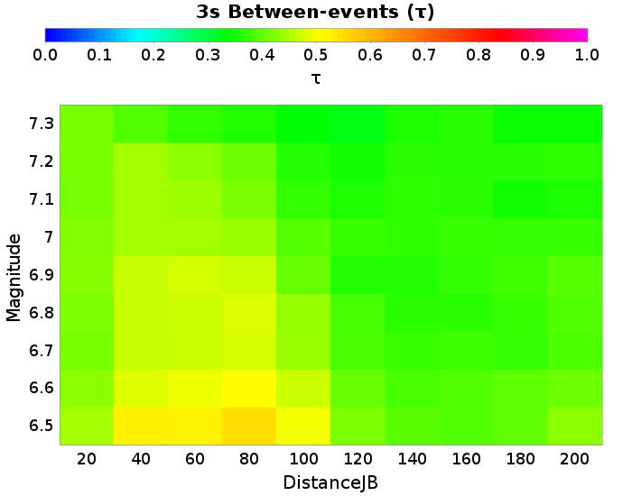 |  |  | 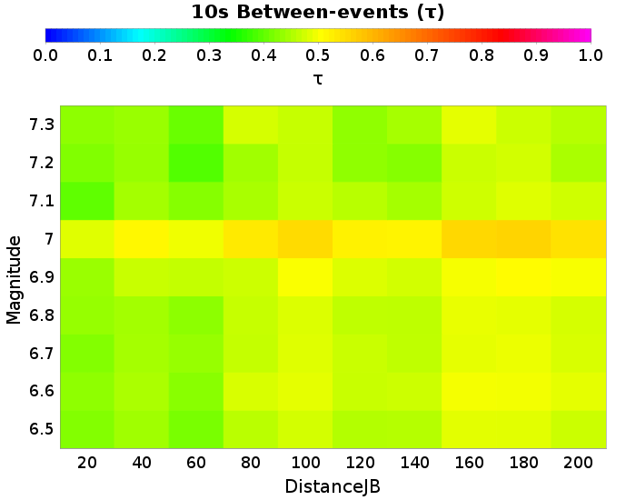 |

### 20.0 km M6.5 Between-events Results
*[(top)](#table-of-contents)*

| 3s &tau; | Total | Mean | Median | Range | 5s &tau; | Total | Mean | Median | Range | 7.5s &tau; | Total | Mean | Median | Range | 10s &tau; | Total | Mean | Median | Range |
|-----|-----|-----|-----|-----|-----|-----|-----|-----|-----|-----|-----|-----|-----|-----|-----|-----|-----|-----|-----|
|  | 0.44 | 0.44 | 0.44 | [0.44 0.44] |  | 0.46 | 0.46 | 0.46 | [0.46 0.46] |  | 0.46 | 0.46 | 0.46 | [0.46 0.46] |  | 0.42 | 0.42 | 0.42 | [0.42 0.42] |

| 3s | 5s |
|-----|-----|
|  |  |
| 7.5s | 10s |
|  |  |

### 40.0 km M6.5 Between-events Results
*[(top)](#table-of-contents)*

| 3s &tau; | Total | Mean | Median | Range | 5s &tau; | Total | Mean | Median | Range | 7.5s &tau; | Total | Mean | Median | Range | 10s &tau; | Total | Mean | Median | Range |
|-----|-----|-----|-----|-----|-----|-----|-----|-----|-----|-----|-----|-----|-----|-----|-----|-----|-----|-----|-----|
|  | 0.52 | 0.52 | 0.52 | [0.52 0.52] |  | 0.52 | 0.52 | 0.52 | [0.52 0.52] |  | 0.43 | 0.43 | 0.43 | [0.43 0.43] |  | 0.44 | 0.44 | 0.44 | [0.44 0.44] |

| 3s | 5s |
|-----|-----|
|  |  |
| 7.5s | 10s |
|  |  |

### 80.0 km M6.5 Between-events Results
*[(top)](#table-of-contents)*

| 3s &tau; | Total | Mean | Median | Range | 5s &tau; | Total | Mean | Median | Range | 7.5s &tau; | Total | Mean | Median | Range | 10s &tau; | Total | Mean | Median | Range |
|-----|-----|-----|-----|-----|-----|-----|-----|-----|-----|-----|-----|-----|-----|-----|-----|-----|-----|-----|-----|
|  | 0.54 | 0.54 | 0.54 | [0.54 0.54] |  | 0.55 | 0.55 | 0.55 | [0.55 0.55] |  | 0.47 | 0.47 | 0.47 | [0.47 0.47] |  | 0.46 | 0.46 | 0.46 | [0.46 0.46] |

| 3s | 5s |
|-----|-----|
|  |  |
| 7.5s | 10s |
|  |  |

### 160.0 km M6.5 Between-events Results
*[(top)](#table-of-contents)*

| 3s &tau; | Total | Mean | Median | Range | 5s &tau; | Total | Mean | Median | Range | 7.5s &tau; | Total | Mean | Median | Range | 10s &tau; | Total | Mean | Median | Range |
|-----|-----|-----|-----|-----|-----|-----|-----|-----|-----|-----|-----|-----|-----|-----|-----|-----|-----|-----|-----|
|  | 0.39 | 0.39 | 0.39 | [0.39 0.39] |  | 0.5 | 0.5 | 0.5 | [0.5 0.5] |  | 0.48 | 0.48 | 0.48 | [0.48 0.48] |  | 0.48 | 0.48 | 0.48 | [0.48 0.48] |

| 3s | 5s |
|-----|-----|
| 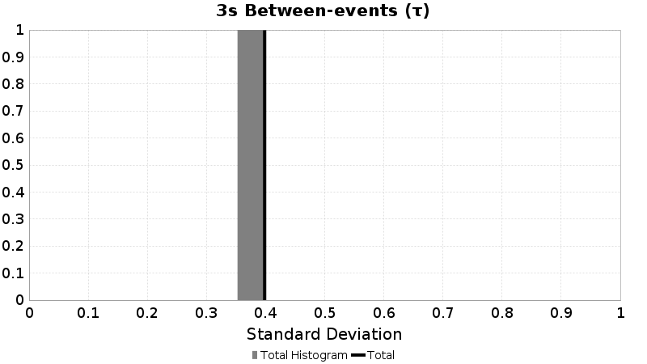 |  |
| 7.5s | 10s |
|  |  |

### 20.0 km M6.5 Between-events Results
*[(top)](#table-of-contents)*

| 3s &tau; | Total | Mean | Median | Range | 5s &tau; | Total | Mean | Median | Range | 7.5s &tau; | Total | Mean | Median | Range | 10s &tau; | Total | Mean | Median | Range |
|-----|-----|-----|-----|-----|-----|-----|-----|-----|-----|-----|-----|-----|-----|-----|-----|-----|-----|-----|-----|
|  | 0.44 | 0.44 | 0.44 | [0.44 0.44] |  | 0.46 | 0.46 | 0.46 | [0.46 0.46] |  | 0.46 | 0.46 | 0.46 | [0.46 0.46] |  | 0.42 | 0.42 | 0.42 | [0.42 0.42] |

| 3s | 5s |
|-----|-----|
|  |  |
| 7.5s | 10s |
|  |  |

### 40.0 km M6.5 Between-events Results
*[(top)](#table-of-contents)*

| 3s &tau; | Total | Mean | Median | Range | 5s &tau; | Total | Mean | Median | Range | 7.5s &tau; | Total | Mean | Median | Range | 10s &tau; | Total | Mean | Median | Range |
|-----|-----|-----|-----|-----|-----|-----|-----|-----|-----|-----|-----|-----|-----|-----|-----|-----|-----|-----|-----|
|  | 0.52 | 0.52 | 0.52 | [0.52 0.52] |  | 0.52 | 0.52 | 0.52 | [0.52 0.52] |  | 0.43 | 0.43 | 0.43 | [0.43 0.43] |  | 0.44 | 0.44 | 0.44 | [0.44 0.44] |

| 3s | 5s |
|-----|-----|
|  |  |
| 7.5s | 10s |
|  |  |

### 80.0 km M6.5 Between-events Results
*[(top)](#table-of-contents)*

| 3s &tau; | Total | Mean | Median | Range | 5s &tau; | Total | Mean | Median | Range | 7.5s &tau; | Total | Mean | Median | Range | 10s &tau; | Total | Mean | Median | Range |
|-----|-----|-----|-----|-----|-----|-----|-----|-----|-----|-----|-----|-----|-----|-----|-----|-----|-----|-----|-----|
|  | 0.54 | 0.54 | 0.54 | [0.54 0.54] |  | 0.55 | 0.55 | 0.55 | [0.55 0.55] |  | 0.47 | 0.47 | 0.47 | [0.47 0.47] |  | 0.46 | 0.46 | 0.46 | [0.46 0.46] |

| 3s | 5s |
|-----|-----|
|  |  |
| 7.5s | 10s |
|  |  |

### 160.0 km M6.5 Between-events Results
*[(top)](#table-of-contents)*

| 3s &tau; | Total | Mean | Median | Range | 5s &tau; | Total | Mean | Median | Range | 7.5s &tau; | Total | Mean | Median | Range | 10s &tau; | Total | Mean | Median | Range |
|-----|-----|-----|-----|-----|-----|-----|-----|-----|-----|-----|-----|-----|-----|-----|-----|-----|-----|-----|-----|
|  | 0.39 | 0.39 | 0.39 | [0.39 0.39] |  | 0.5 | 0.5 | 0.5 | [0.5 0.5] |  | 0.48 | 0.48 | 0.48 | [0.48 0.48] |  | 0.48 | 0.48 | 0.48 | [0.48 0.48] |

| 3s | 5s |
|-----|-----|
|  |  |
| 7.5s | 10s |
|  |  |

### 20.0 km M6.6 Between-events Results
*[(top)](#table-of-contents)*

| 3s &tau; | Total | Mean | Median | Range | 5s &tau; | Total | Mean | Median | Range | 7.5s &tau; | Total | Mean | Median | Range | 10s &tau; | Total | Mean | Median | Range |
|-----|-----|-----|-----|-----|-----|-----|-----|-----|-----|-----|-----|-----|-----|-----|-----|-----|-----|-----|-----|
|  | 0.42 | 0.42 | 0.42 | [0.42 0.42] |  | 0.45 | 0.45 | 0.45 | [0.45 0.45] |  | 0.46 | 0.46 | 0.46 | [0.46 0.46] |  | 0.43 | 0.43 | 0.43 | [0.43 0.43] |

| 3s | 5s |
|-----|-----|
|  |  |
| 7.5s | 10s |
|  |  |

### 40.0 km M6.6 Between-events Results
*[(top)](#table-of-contents)*

| 3s &tau; | Total | Mean | Median | Range | 5s &tau; | Total | Mean | Median | Range | 7.5s &tau; | Total | Mean | Median | Range | 10s &tau; | Total | Mean | Median | Range |
|-----|-----|-----|-----|-----|-----|-----|-----|-----|-----|-----|-----|-----|-----|-----|-----|-----|-----|-----|-----|
|  | 0.48 | 0.48 | 0.48 | [0.48 0.48] |  | 0.49 | 0.49 | 0.49 | [0.49 0.49] |  | 0.43 | 0.43 | 0.43 | [0.43 0.43] |  | 0.44 | 0.44 | 0.44 | [0.44 0.44] |

| 3s | 5s |
|-----|-----|
|  |  |
| 7.5s | 10s |
|  |  |

### 80.0 km M6.6 Between-events Results
*[(top)](#table-of-contents)*

| 3s &tau; | Total | Mean | Median | Range | 5s &tau; | Total | Mean | Median | Range | 7.5s &tau; | Total | Mean | Median | Range | 10s &tau; | Total | Mean | Median | Range |
|-----|-----|-----|-----|-----|-----|-----|-----|-----|-----|-----|-----|-----|-----|-----|-----|-----|-----|-----|-----|
|  | 0.5 | 0.5 | 0.5 | [0.5 0.5] |  | 0.51 | 0.51 | 0.51 | [0.51 0.51] |  | 0.48 | 0.48 | 0.48 | [0.48 0.48] |  | 0.47 | 0.47 | 0.47 | [0.47 0.47] |

| 3s | 5s |
|-----|-----|
|  |  |
| 7.5s | 10s |
|  |  |

### 160.0 km M6.6 Between-events Results
*[(top)](#table-of-contents)*

| 3s &tau; | Total | Mean | Median | Range | 5s &tau; | Total | Mean | Median | Range | 7.5s &tau; | Total | Mean | Median | Range | 10s &tau; | Total | Mean | Median | Range |
|-----|-----|-----|-----|-----|-----|-----|-----|-----|-----|-----|-----|-----|-----|-----|-----|-----|-----|-----|-----|
|  | 0.38 | 0.38 | 0.38 | [0.38 0.38] |  | 0.48 | 0.48 | 0.48 | [0.48 0.48] |  | 0.49 | 0.49 | 0.49 | [0.49 0.49] |  | 0.49 | 0.49 | 0.49 | [0.49 0.49] |

| 3s | 5s |
|-----|-----|
|  |  |
| 7.5s | 10s |
|  |  |

### 20.0 km M6.7 Between-events Results
*[(top)](#table-of-contents)*

| 3s &tau; | Total | Mean | Median | Range | 5s &tau; | Total | Mean | Median | Range | 7.5s &tau; | Total | Mean | Median | Range | 10s &tau; | Total | Mean | Median | Range |
|-----|-----|-----|-----|-----|-----|-----|-----|-----|-----|-----|-----|-----|-----|-----|-----|-----|-----|-----|-----|
|  | 0.41 | 0.41 | 0.41 | [0.41 0.41] |  | 0.44 | 0.44 | 0.44 | [0.44 0.44] |  | 0.44 | 0.44 | 0.44 | [0.44 0.44] |  | 0.42 | 0.42 | 0.42 | [0.42 0.42] |

| 3s | 5s |
|-----|-----|
|  |  |
| 7.5s | 10s |
|  |  |

### 40.0 km M6.7 Between-events Results
*[(top)](#table-of-contents)*

| 3s &tau; | Total | Mean | Median | Range | 5s &tau; | Total | Mean | Median | Range | 7.5s &tau; | Total | Mean | Median | Range | 10s &tau; | Total | Mean | Median | Range |
|-----|-----|-----|-----|-----|-----|-----|-----|-----|-----|-----|-----|-----|-----|-----|-----|-----|-----|-----|-----|
|  | 0.46 | 0.46 | 0.46 | [0.46 0.46] |  | 0.49 | 0.49 | 0.49 | [0.49 0.49] |  | 0.42 | 0.42 | 0.42 | [0.42 0.42] |  | 0.44 | 0.44 | 0.44 | [0.44 0.44] |

| 3s | 5s |
|-----|-----|
|  |  |
| 7.5s | 10s |
|  |  |

### 80.0 km M6.7 Between-events Results
*[(top)](#table-of-contents)*

| 3s &tau; | Total | Mean | Median | Range | 5s &tau; | Total | Mean | Median | Range | 7.5s &tau; | Total | Mean | Median | Range | 10s &tau; | Total | Mean | Median | Range |
|-----|-----|-----|-----|-----|-----|-----|-----|-----|-----|-----|-----|-----|-----|-----|-----|-----|-----|-----|-----|
|  | 0.47 | 0.47 | 0.47 | [0.47 0.47] |  | 0.51 | 0.51 | 0.51 | [0.51 0.51] |  | 0.46 | 0.46 | 0.46 | [0.46 0.46] |  | 0.46 | 0.46 | 0.46 | [0.46 0.46] |

| 3s | 5s |
|-----|-----|
|  |  |
| 7.5s | 10s |
|  |  |

### 160.0 km M6.7 Between-events Results
*[(top)](#table-of-contents)*

| 3s &tau; | Total | Mean | Median | Range | 5s &tau; | Total | Mean | Median | Range | 7.5s &tau; | Total | Mean | Median | Range | 10s &tau; | Total | Mean | Median | Range |
|-----|-----|-----|-----|-----|-----|-----|-----|-----|-----|-----|-----|-----|-----|-----|-----|-----|-----|-----|-----|
|  | 0.37 | 0.37 | 0.37 | [0.37 0.37] |  | 0.48 | 0.48 | 0.48 | [0.48 0.48] |  | 0.47 | 0.47 | 0.47 | [0.47 0.47] |  | 0.48 | 0.48 | 0.48 | [0.48 0.48] |

| 3s | 5s |
|-----|-----|
|  |  |
| 7.5s | 10s |
|  |  |

### 20.0 km M6.8 Between-events Results
*[(top)](#table-of-contents)*

| 3s &tau; | Total | Mean | Median | Range | 5s &tau; | Total | Mean | Median | Range | 7.5s &tau; | Total | Mean | Median | Range | 10s &tau; | Total | Mean | Median | Range |
|-----|-----|-----|-----|-----|-----|-----|-----|-----|-----|-----|-----|-----|-----|-----|-----|-----|-----|-----|-----|
|  | 0.41 | 0.41 | 0.41 | [0.41 0.41] |  | 0.44 | 0.44 | 0.44 | [0.44 0.44] |  | 0.45 | 0.45 | 0.45 | [0.45 0.45] |  | 0.43 | 0.43 | 0.43 | [0.43 0.43] |

| 3s | 5s |
|-----|-----|
|  |  |
| 7.5s | 10s |
|  |  |

### 40.0 km M6.8 Between-events Results
*[(top)](#table-of-contents)*

| 3s &tau; | Total | Mean | Median | Range | 5s &tau; | Total | Mean | Median | Range | 7.5s &tau; | Total | Mean | Median | Range | 10s &tau; | Total | Mean | Median | Range |
|-----|-----|-----|-----|-----|-----|-----|-----|-----|-----|-----|-----|-----|-----|-----|-----|-----|-----|-----|-----|
|  | 0.46 | 0.46 | 0.46 | [0.46 0.46] |  | 0.48 | 0.48 | 0.48 | [0.48 0.48] |  | 0.41 | 0.41 | 0.41 | [0.41 0.41] |  | 0.44 | 0.44 | 0.44 | [0.44 0.44] |

| 3s | 5s |
|-----|-----|
|  |  |
| 7.5s | 10s |
|  |  |

### 80.0 km M6.8 Between-events Results
*[(top)](#table-of-contents)*

| 3s &tau; | Total | Mean | Median | Range | 5s &tau; | Total | Mean | Median | Range | 7.5s &tau; | Total | Mean | Median | Range | 10s &tau; | Total | Mean | Median | Range |
|-----|-----|-----|-----|-----|-----|-----|-----|-----|-----|-----|-----|-----|-----|-----|-----|-----|-----|-----|-----|
|  | 0.48 | 0.48 | 0.48 | [0.48 0.48] |  | 0.5 | 0.5 | 0.5 | [0.5 0.5] |  | 0.46 | 0.46 | 0.46 | [0.46 0.46] |  | 0.46 | 0.46 | 0.46 | [0.46 0.46] |

| 3s | 5s |
|-----|-----|
|  |  |
| 7.5s | 10s |
|  |  |

### 160.0 km M6.8 Between-events Results
*[(top)](#table-of-contents)*

| 3s &tau; | Total | Mean | Median | Range | 5s &tau; | Total | Mean | Median | Range | 7.5s &tau; | Total | Mean | Median | Range | 10s &tau; | Total | Mean | Median | Range |
|-----|-----|-----|-----|-----|-----|-----|-----|-----|-----|-----|-----|-----|-----|-----|-----|-----|-----|-----|-----|
|  | 0.36 | 0.36 | 0.36 | [0.36 0.36] |  | 0.47 | 0.47 | 0.47 | [0.47 0.47] |  | 0.47 | 0.47 | 0.47 | [0.47 0.47] |  | 0.49 | 0.49 | 0.49 | [0.49 0.49] |

| 3s | 5s |
|-----|-----|
|  |  |
| 7.5s | 10s |
|  |  |

### 20.0 km M6.9 Between-events Results
*[(top)](#table-of-contents)*

| 3s &tau; | Total | Mean | Median | Range | 5s &tau; | Total | Mean | Median | Range | 7.5s &tau; | Total | Mean | Median | Range | 10s &tau; | Total | Mean | Median | Range |
|-----|-----|-----|-----|-----|-----|-----|-----|-----|-----|-----|-----|-----|-----|-----|-----|-----|-----|-----|-----|
|  | 0.42 | 0.42 | 0.42 | [0.42 0.42] |  | 0.48 | 0.48 | 0.48 | [0.48 0.48] |  | 0.46 | 0.46 | 0.46 | [0.46 0.46] |  | 0.43 | 0.43 | 0.43 | [0.43 0.43] |

| 3s | 5s |
|-----|-----|
|  |  |
| 7.5s | 10s |
|  |  |

### 40.0 km M6.9 Between-events Results
*[(top)](#table-of-contents)*

| 3s &tau; | Total | Mean | Median | Range | 5s &tau; | Total | Mean | Median | Range | 7.5s &tau; | Total | Mean | Median | Range | 10s &tau; | Total | Mean | Median | Range |
|-----|-----|-----|-----|-----|-----|-----|-----|-----|-----|-----|-----|-----|-----|-----|-----|-----|-----|-----|-----|
|  | 0.46 | 0.46 | 0.46 | [0.46 0.46] |  | 0.52 | 0.52 | 0.52 | [0.52 0.52] |  | 0.44 | 0.44 | 0.44 | [0.44 0.44] |  | 0.46 | 0.46 | 0.46 | [0.46 0.46] |

| 3s | 5s |
|-----|-----|
|  |  |
| 7.5s | 10s |
|  |  |

### 80.0 km M6.9 Between-events Results
*[(top)](#table-of-contents)*

| 3s &tau; | Total | Mean | Median | Range | 5s &tau; | Total | Mean | Median | Range | 7.5s &tau; | Total | Mean | Median | Range | 10s &tau; | Total | Mean | Median | Range |
|-----|-----|-----|-----|-----|-----|-----|-----|-----|-----|-----|-----|-----|-----|-----|-----|-----|-----|-----|-----|
|  | 0.47 | 0.47 | 0.47 | [0.47 0.47] |  | 0.54 | 0.54 | 0.54 | [0.54 0.54] |  | 0.47 | 0.47 | 0.47 | [0.47 0.47] |  | 0.47 | 0.47 | 0.47 | [0.47 0.47] |

| 3s | 5s |
|-----|-----|
|  |  |
| 7.5s | 10s |
|  |  |

### 160.0 km M6.9 Between-events Results
*[(top)](#table-of-contents)*

| 3s &tau; | Total | Mean | Median | Range | 5s &tau; | Total | Mean | Median | Range | 7.5s &tau; | Total | Mean | Median | Range | 10s &tau; | Total | Mean | Median | Range |
|-----|-----|-----|-----|-----|-----|-----|-----|-----|-----|-----|-----|-----|-----|-----|-----|-----|-----|-----|-----|
|  | 0.37 | 0.37 | 0.37 | [0.37 0.37] |  | 0.49 | 0.49 | 0.49 | [0.49 0.49] |  | 0.49 | 0.49 | 0.49 | [0.49 0.49] |  | 0.49 | 0.49 | 0.49 | [0.49 0.49] |

| 3s | 5s |
|-----|-----|
|  |  |
| 7.5s | 10s |
|  |  |

### 20.0 km M7 Between-events Results
*[(top)](#table-of-contents)*

| 3s &tau; | Total | Mean | Median | Range | 5s &tau; | Total | Mean | Median | Range | 7.5s &tau; | Total | Mean | Median | Range | 10s &tau; | Total | Mean | Median | Range |
|-----|-----|-----|-----|-----|-----|-----|-----|-----|-----|-----|-----|-----|-----|-----|-----|-----|-----|-----|-----|
|  | 0.42 | 0.42 | 0.42 | [0.42 0.42] |  | 0.44 | 0.44 | 0.44 | [0.44 0.44] |  | 0.49 | 0.49 | 0.49 | [0.49 0.49] |  | 0.48 | 0.48 | 0.48 | [0.48 0.48] |

| 3s | 5s |
|-----|-----|
|  |  |
| 7.5s | 10s |
|  |  |

### 40.0 km M7 Between-events Results
*[(top)](#table-of-contents)*

| 3s &tau; | Total | Mean | Median | Range | 5s &tau; | Total | Mean | Median | Range | 7.5s &tau; | Total | Mean | Median | Range | 10s &tau; | Total | Mean | Median | Range |
|-----|-----|-----|-----|-----|-----|-----|-----|-----|-----|-----|-----|-----|-----|-----|-----|-----|-----|-----|-----|
|  | 0.44 | 0.44 | 0.44 | [0.44 0.44] |  | 0.47 | 0.47 | 0.47 | [0.47 0.47] |  | 0.46 | 0.46 | 0.46 | [0.46 0.46] |  | 0.51 | 0.51 | 0.51 | [0.51 0.51] |

| 3s | 5s |
|-----|-----|
|  |  |
| 7.5s | 10s |
|  |  |

### 80.0 km M7 Between-events Results
*[(top)](#table-of-contents)*

| 3s &tau; | Total | Mean | Median | Range | 5s &tau; | Total | Mean | Median | Range | 7.5s &tau; | Total | Mean | Median | Range | 10s &tau; | Total | Mean | Median | Range |
|-----|-----|-----|-----|-----|-----|-----|-----|-----|-----|-----|-----|-----|-----|-----|-----|-----|-----|-----|-----|
|  | 0.43 | 0.43 | 0.43 | [0.43 0.43] |  | 0.49 | 0.49 | 0.49 | [0.49 0.49] |  | 0.5 | 0.5 | 0.5 | [0.5 0.5] |  | 0.53 | 0.53 | 0.53 | [0.53 0.53] |

| 3s | 5s |
|-----|-----|
|  |  |
| 7.5s | 10s |
|  |  |

### 160.0 km M7 Between-events Results
*[(top)](#table-of-contents)*

| 3s &tau; | Total | Mean | Median | Range | 5s &tau; | Total | Mean | Median | Range | 7.5s &tau; | Total | Mean | Median | Range | 10s &tau; | Total | Mean | Median | Range |
|-----|-----|-----|-----|-----|-----|-----|-----|-----|-----|-----|-----|-----|-----|-----|-----|-----|-----|-----|-----|
|  | 0.37 | 0.37 | 0.37 | [0.37 0.37] |  | 0.44 | 0.44 | 0.44 | [0.44 0.44] |  | 0.49 | 0.49 | 0.49 | [0.49 0.49] |  | 0.55 | 0.55 | 0.55 | [0.55 0.55] |

| 3s | 5s |
|-----|-----|
|  |  |
| 7.5s | 10s |
|  |  |

### 20.0 km M7 Between-events Results
*[(top)](#table-of-contents)*

| 3s &tau; | Total | Mean | Median | Range | 5s &tau; | Total | Mean | Median | Range | 7.5s &tau; | Total | Mean | Median | Range | 10s &tau; | Total | Mean | Median | Range |
|-----|-----|-----|-----|-----|-----|-----|-----|-----|-----|-----|-----|-----|-----|-----|-----|-----|-----|-----|-----|
|  | 0.42 | 0.42 | 0.42 | [0.42 0.42] |  | 0.44 | 0.44 | 0.44 | [0.44 0.44] |  | 0.49 | 0.49 | 0.49 | [0.49 0.49] |  | 0.48 | 0.48 | 0.48 | [0.48 0.48] |

| 3s | 5s |
|-----|-----|
|  |  |
| 7.5s | 10s |
|  |  |

### 40.0 km M7 Between-events Results
*[(top)](#table-of-contents)*

| 3s &tau; | Total | Mean | Median | Range | 5s &tau; | Total | Mean | Median | Range | 7.5s &tau; | Total | Mean | Median | Range | 10s &tau; | Total | Mean | Median | Range |
|-----|-----|-----|-----|-----|-----|-----|-----|-----|-----|-----|-----|-----|-----|-----|-----|-----|-----|-----|-----|
|  | 0.44 | 0.44 | 0.44 | [0.44 0.44] |  | 0.47 | 0.47 | 0.47 | [0.47 0.47] |  | 0.46 | 0.46 | 0.46 | [0.46 0.46] |  | 0.51 | 0.51 | 0.51 | [0.51 0.51] |

| 3s | 5s |
|-----|-----|
|  |  |
| 7.5s | 10s |
|  |  |

### 80.0 km M7 Between-events Results
*[(top)](#table-of-contents)*

| 3s &tau; | Total | Mean | Median | Range | 5s &tau; | Total | Mean | Median | Range | 7.5s &tau; | Total | Mean | Median | Range | 10s &tau; | Total | Mean | Median | Range |
|-----|-----|-----|-----|-----|-----|-----|-----|-----|-----|-----|-----|-----|-----|-----|-----|-----|-----|-----|-----|
|  | 0.43 | 0.43 | 0.43 | [0.43 0.43] |  | 0.49 | 0.49 | 0.49 | [0.49 0.49] |  | 0.5 | 0.5 | 0.5 | [0.5 0.5] |  | 0.53 | 0.53 | 0.53 | [0.53 0.53] |

| 3s | 5s |
|-----|-----|
|  |  |
| 7.5s | 10s |
|  |  |

### 160.0 km M7 Between-events Results
*[(top)](#table-of-contents)*

| 3s &tau; | Total | Mean | Median | Range | 5s &tau; | Total | Mean | Median | Range | 7.5s &tau; | Total | Mean | Median | Range | 10s &tau; | Total | Mean | Median | Range |
|-----|-----|-----|-----|-----|-----|-----|-----|-----|-----|-----|-----|-----|-----|-----|-----|-----|-----|-----|-----|
|  | 0.37 | 0.37 | 0.37 | [0.37 0.37] |  | 0.44 | 0.44 | 0.44 | [0.44 0.44] |  | 0.49 | 0.49 | 0.49 | [0.49 0.49] |  | 0.55 | 0.55 | 0.55 | [0.55 0.55] |

| 3s | 5s |
|-----|-----|
|  |  |
| 7.5s | 10s |
|  |  |

### 20.0 km M7.1 Between-events Results
*[(top)](#table-of-contents)*

| 3s &tau; | Total | Mean | Median | Range | 5s &tau; | Total | Mean | Median | Range | 7.5s &tau; | Total | Mean | Median | Range | 10s &tau; | Total | Mean | Median | Range |
|-----|-----|-----|-----|-----|-----|-----|-----|-----|-----|-----|-----|-----|-----|-----|-----|-----|-----|-----|-----|
|  | 0.41 | 0.41 | 0.41 | [0.41 0.41] |  | 0.43 | 0.43 | 0.43 | [0.43 0.43] |  | 0.39 | 0.39 | 0.39 | [0.39 0.39] |  | 0.4 | 0.4 | 0.4 | [0.4 0.4] |

| 3s | 5s |
|-----|-----|
|  |  |
| 7.5s | 10s |
|  |  |

### 40.0 km M7.1 Between-events Results
*[(top)](#table-of-contents)*

| 3s &tau; | Total | Mean | Median | Range | 5s &tau; | Total | Mean | Median | Range | 7.5s &tau; | Total | Mean | Median | Range | 10s &tau; | Total | Mean | Median | Range |
|-----|-----|-----|-----|-----|-----|-----|-----|-----|-----|-----|-----|-----|-----|-----|-----|-----|-----|-----|-----|
|  | 0.44 | 0.44 | 0.44 | [0.44 0.44] |  | 0.47 | 0.47 | 0.47 | [0.47 0.47] |  | 0.38 | 0.38 | 0.38 | [0.38 0.38] |  | 0.44 | 0.44 | 0.44 | [0.44 0.44] |

| 3s | 5s |
|-----|-----|
|  |  |
| 7.5s | 10s |
|  |  |

### 80.0 km M7.1 Between-events Results
*[(top)](#table-of-contents)*

| 3s &tau; | Total | Mean | Median | Range | 5s &tau; | Total | Mean | Median | Range | 7.5s &tau; | Total | Mean | Median | Range | 10s &tau; | Total | Mean | Median | Range |
|-----|-----|-----|-----|-----|-----|-----|-----|-----|-----|-----|-----|-----|-----|-----|-----|-----|-----|-----|-----|
|  | 0.41 | 0.41 | 0.41 | [0.41 0.41] |  | 0.48 | 0.48 | 0.48 | [0.48 0.48] |  | 0.42 | 0.42 | 0.42 | [0.42 0.42] |  | 0.44 | 0.44 | 0.44 | [0.44 0.44] |

| 3s | 5s |
|-----|-----|
|  |  |
| 7.5s | 10s |
|  |  |

### 160.0 km M7.1 Between-events Results
*[(top)](#table-of-contents)*

| 3s &tau; | Total | Mean | Median | Range | 5s &tau; | Total | Mean | Median | Range | 7.5s &tau; | Total | Mean | Median | Range | 10s &tau; | Total | Mean | Median | Range |
|-----|-----|-----|-----|-----|-----|-----|-----|-----|-----|-----|-----|-----|-----|-----|-----|-----|-----|-----|-----|
|  | 0.36 | 0.36 | 0.36 | [0.36 0.36] |  | 0.43 | 0.43 | 0.43 | [0.43 0.43] |  | 0.41 | 0.41 | 0.41 | [0.41 0.41] |  | 0.47 | 0.47 | 0.47 | [0.47 0.47] |

| 3s | 5s |
|-----|-----|
|  |  |
| 7.5s | 10s |
|  |  |

### 20.0 km M7.2 Between-events Results
*[(top)](#table-of-contents)*

| 3s &tau; | Total | Mean | Median | Range | 5s &tau; | Total | Mean | Median | Range | 7.5s &tau; | Total | Mean | Median | Range | 10s &tau; | Total | Mean | Median | Range |
|-----|-----|-----|-----|-----|-----|-----|-----|-----|-----|-----|-----|-----|-----|-----|-----|-----|-----|-----|-----|
|  | 0.41 | 0.41 | 0.41 | [0.41 0.41] |  | 0.44 | 0.44 | 0.44 | [0.44 0.44] |  | 0.41 | 0.41 | 0.41 | [0.41 0.41] |  | 0.42 | 0.42 | 0.42 | [0.42 0.42] |

| 3s | 5s |
|-----|-----|
|  |  |
| 7.5s | 10s |
|  |  |

### 40.0 km M7.2 Between-events Results
*[(top)](#table-of-contents)*

| 3s &tau; | Total | Mean | Median | Range | 5s &tau; | Total | Mean | Median | Range | 7.5s &tau; | Total | Mean | Median | Range | 10s &tau; | Total | Mean | Median | Range |
|-----|-----|-----|-----|-----|-----|-----|-----|-----|-----|-----|-----|-----|-----|-----|-----|-----|-----|-----|-----|
|  | 0.44 | 0.44 | 0.44 | [0.44 0.44] |  | 0.48 | 0.48 | 0.48 | [0.48 0.48] |  | 0.39 | 0.39 | 0.39 | [0.39 0.39] |  | 0.43 | 0.43 | 0.43 | [0.43 0.43] |

| 3s | 5s |
|-----|-----|
|  |  |
| 7.5s | 10s |
|  |  |

### 80.0 km M7.2 Between-events Results
*[(top)](#table-of-contents)*

| 3s &tau; | Total | Mean | Median | Range | 5s &tau; | Total | Mean | Median | Range | 7.5s &tau; | Total | Mean | Median | Range | 10s &tau; | Total | Mean | Median | Range |
|-----|-----|-----|-----|-----|-----|-----|-----|-----|-----|-----|-----|-----|-----|-----|-----|-----|-----|-----|-----|
|  | 0.4 | 0.4 | 0.4 | [0.4 0.4] |  | 0.48 | 0.48 | 0.48 | [0.48 0.48] |  | 0.41 | 0.41 | 0.41 | [0.41 0.41] |  | 0.44 | 0.44 | 0.44 | [0.44 0.44] |

| 3s | 5s |
|-----|-----|
|  |  |
| 7.5s | 10s |
|  |  |

### 160.0 km M7.2 Between-events Results
*[(top)](#table-of-contents)*

| 3s &tau; | Total | Mean | Median | Range | 5s &tau; | Total | Mean | Median | Range | 7.5s &tau; | Total | Mean | Median | Range | 10s &tau; | Total | Mean | Median | Range |
|-----|-----|-----|-----|-----|-----|-----|-----|-----|-----|-----|-----|-----|-----|-----|-----|-----|-----|-----|-----|
|  | 0.36 | 0.36 | 0.36 | [0.36 0.36] |  | 0.42 | 0.42 | 0.42 | [0.42 0.42] |  | 0.4 | 0.4 | 0.4 | [0.4 0.4] |  | 0.47 | 0.47 | 0.47 | [0.47 0.47] |

| 3s | 5s |
|-----|-----|
|  |  |
| 7.5s | 10s |
|  |  |

### 20.0 km M7.3 Between-events Results
*[(top)](#table-of-contents)*

| 3s &tau; | Total | Mean | Median | Range | 5s &tau; | Total | Mean | Median | Range | 7.5s &tau; | Total | Mean | Median | Range | 10s &tau; | Total | Mean | Median | Range |
|-----|-----|-----|-----|-----|-----|-----|-----|-----|-----|-----|-----|-----|-----|-----|-----|-----|-----|-----|-----|
|  | 0.41 | 0.41 | 0.41 | [0.41 0.41] |  | 0.38 | 0.38 | 0.38 | [0.38 0.38] |  | 0.42 | 0.42 | 0.42 | [0.42 0.42] |  | 0.43 | 0.43 | 0.43 | [0.43 0.43] |

| 3s | 5s |
|-----|-----|
|  |  |
| 7.5s | 10s |
|  |  |

### 40.0 km M7.3 Between-events Results
*[(top)](#table-of-contents)*

| 3s &tau; | Total | Mean | Median | Range | 5s &tau; | Total | Mean | Median | Range | 7.5s &tau; | Total | Mean | Median | Range | 10s &tau; | Total | Mean | Median | Range |
|-----|-----|-----|-----|-----|-----|-----|-----|-----|-----|-----|-----|-----|-----|-----|-----|-----|-----|-----|-----|
|  | 0.39 | 0.39 | 0.39 | [0.39 0.39] |  | 0.42 | 0.42 | 0.42 | [0.42 0.42] |  | 0.35 | 0.35 | 0.35 | [0.35 0.35] |  | 0.43 | 0.43 | 0.43 | [0.43 0.43] |

| 3s | 5s |
|-----|-----|
|  |  |
| 7.5s | 10s |
|  |  |

### 80.0 km M7.3 Between-events Results
*[(top)](#table-of-contents)*

| 3s &tau; | Total | Mean | Median | Range | 5s &tau; | Total | Mean | Median | Range | 7.5s &tau; | Total | Mean | Median | Range | 10s &tau; | Total | Mean | Median | Range |
|-----|-----|-----|-----|-----|-----|-----|-----|-----|-----|-----|-----|-----|-----|-----|-----|-----|-----|-----|-----|
|  | 0.35 | 0.35 | 0.35 | [0.35 0.35] |  | 0.39 | 0.39 | 0.39 | [0.39 0.39] |  | 0.4 | 0.4 | 0.4 | [0.4 0.4] |  | 0.47 | 0.47 | 0.47 | [0.47 0.47] |

| 3s | 5s |
|-----|-----|
|  |  |
| 7.5s | 10s |
|  |  |

### 160.0 km M7.3 Between-events Results
*[(top)](#table-of-contents)*

| 3s &tau; | Total | Mean | Median | Range | 5s &tau; | Total | Mean | Median | Range | 7.5s &tau; | Total | Mean | Median | Range | 10s &tau; | Total | Mean | Median | Range |
|-----|-----|-----|-----|-----|-----|-----|-----|-----|-----|-----|-----|-----|-----|-----|-----|-----|-----|-----|-----|
|  | 0.36 | 0.36 | 0.36 | [0.36 0.36] |  | 0.36 | 0.36 | 0.36 | [0.36 0.36] |  | 0.38 | 0.38 | 0.38 | [0.38 0.38] |  | 0.48 | 0.48 | 0.48 | [0.48 0.48] |

| 3s | 5s |
|-----|-----|
|  |  |
| 7.5s | 10s |
|  |  |

