# Bruce 2592 Extreme Events

*Subsections participate in a rupture if at least 20.0 % of its area ruptures*

[Catalog Details](../#bruce-2592)

## Table Of Contents
* [Subsection Count](#subsection-count)
  * [Subsection Count Histogram](#subsection-count-histogram)
  * [Subsection Count Events](#subsection-count-events)
* [Parent Section Count](#parent-section-count)
  * [Parent Section Count Histogram](#parent-section-count-histogram)
  * [Parent Section Count Events](#parent-section-count-events)
* [Mapped Length Ratio](#mapped-length-ratio)
  * [Mapped Length Ratio Histogram](#mapped-length-ratio-histogram)
  * [Mapped Length Ratio Events](#mapped-length-ratio-events)
* [Mapped Excess Length](#mapped-excess-length)
  * [Mapped Excess Length Histogram](#mapped-excess-length-histogram)
  * [Mapped Excess Length Events](#mapped-excess-length-events)
* [Moment Off Mapped Rupture](#moment-off-mapped-rupture)
  * [Moment Off Mapped Rupture Histogram](#moment-off-mapped-rupture-histogram)
  * [Moment Off Mapped Rupture Events](#moment-off-mapped-rupture-events)
* [Magnitude](#magnitude)
  * [Magnitude Histogram](#magnitude-histogram)
  * [Magnitude Events](#magnitude-events)
* [Moment >100km from Mapped](#moment-100km-from-mapped)
  * [Moment >100km from Mapped Histogram](#moment-100km-from-mapped-histogram)
  * [Moment >100km from Mapped Events](#moment-100km-from-mapped-events)
## Subsection Count
*[(top)](#table-of-contents)*

Total count of mapped UCERF3 subsections (e.g. SAF Mojave S Subsection 3), after application of minimum subsection area filter

### Subsection Count Histogram
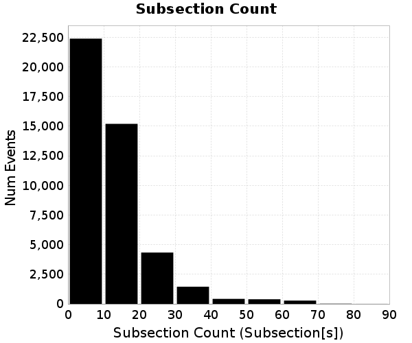
### Subsection Count Events
*[(top)](#table-of-contents)*

| Event ID | Subsection Count | Plot |
|-----|-----|-----|
| **1569279** | **87 (Subsection[s])** | 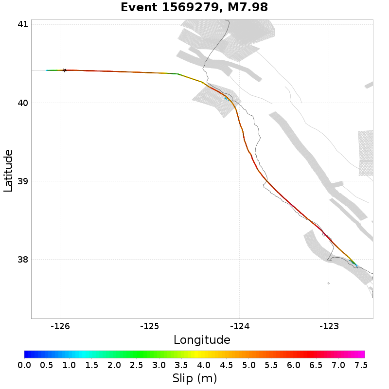 |
| **183748** | **85 (Subsection[s])** | 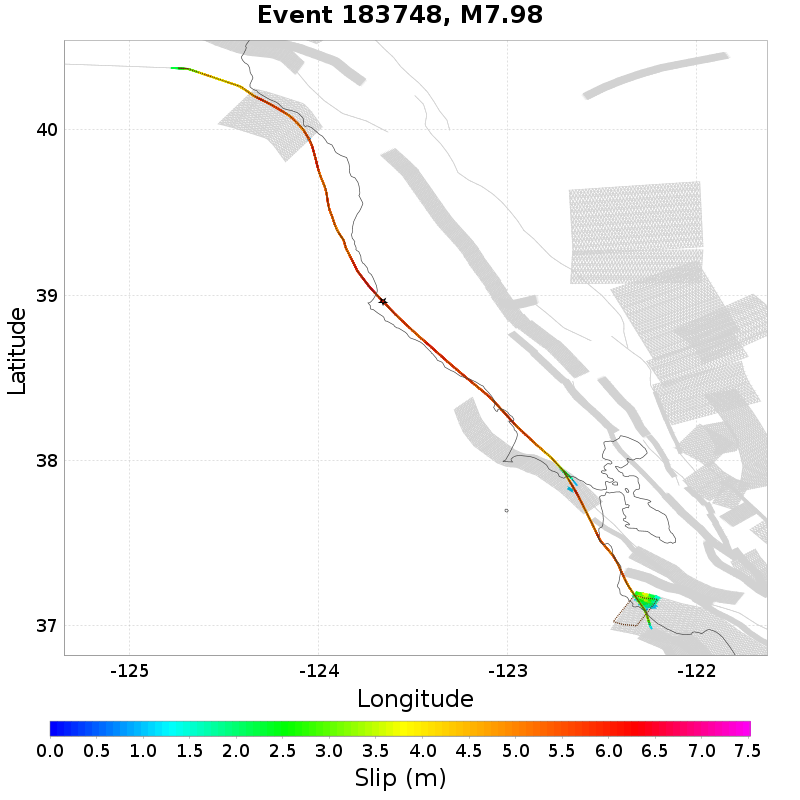 |
| **2603034** | **84 (Subsection[s])** | 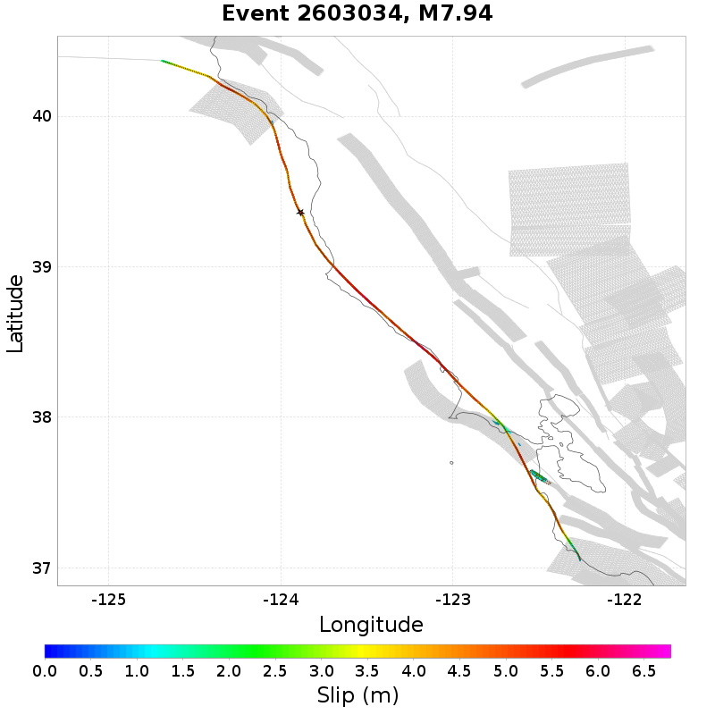 |
| **729881** | **80 (Subsection[s])** |  |
| **294512** | **79 (Subsection[s])** | 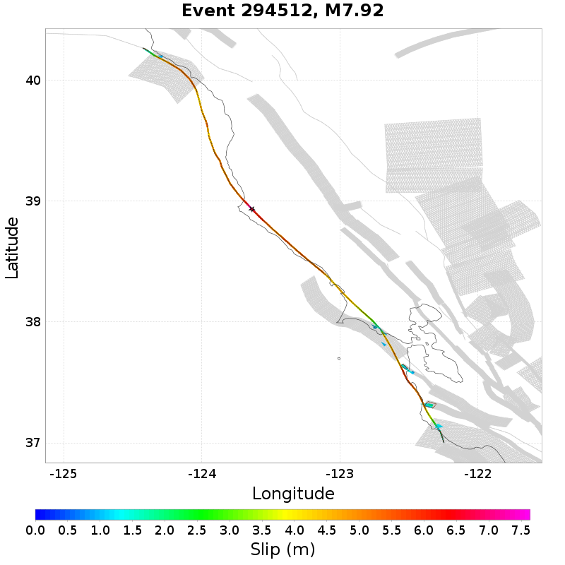 |

## Parent Section Count
*[(top)](#table-of-contents)*

Total count of mapped UCERF3 subsections (e.g. SAF Mojave S), after application of minimum subsection area filter

### Parent Section Count Histogram

### Parent Section Count Events
*[(top)](#table-of-contents)*

| Event ID | Parent Section Count | Plot |
|-----|-----|-----|
| **1441473** | **11 (Section[s])** | 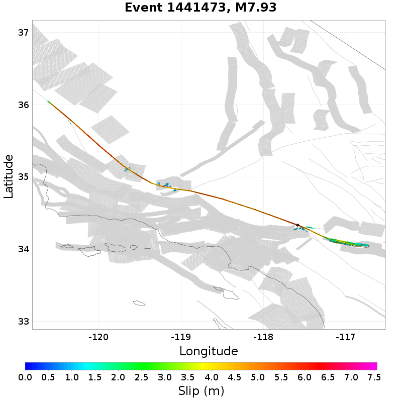 |
| **1907145** | **11 (Section[s])** |  |
| **2804459** | **11 (Section[s])** |  |
| **2009026** | **11 (Section[s])** |  |
| **1918472** | **11 (Section[s])** |  |

## Mapped Length Ratio
*[(top)](#table-of-contents)*

Ratio of the total rupture length (UCERF3 mapped subsection rupture) to the idealized length, defined as the straight line distance between the furthest 2 subsections

### Mapped Length Ratio Histogram
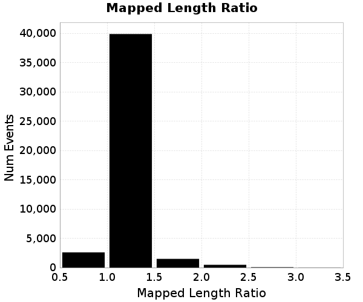
### Mapped Length Ratio Events
*[(top)](#table-of-contents)*

| Event ID | Mapped Length Ratio | Plot |
|-----|-----|-----|
| **2615283** | **3.32** | 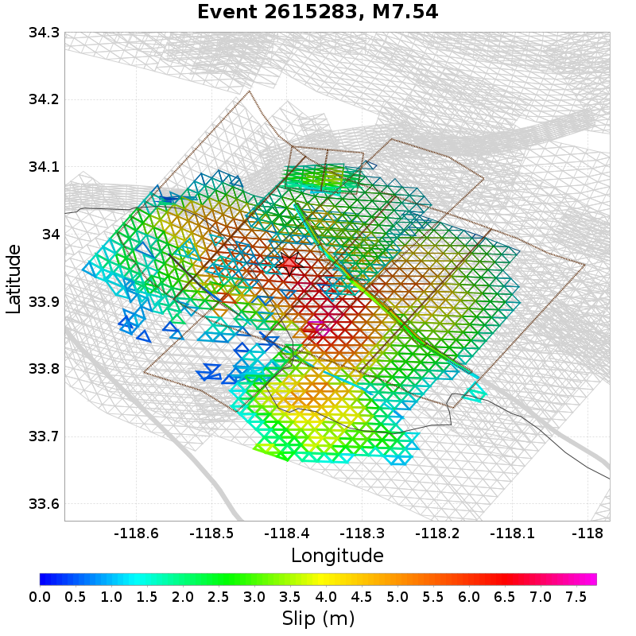 |
| **2211721** | **3.25** |  |
| **1941786** | **3.22** |  |
| **1473883** | **3.21** |  |
| **1800592** | **3.14** | 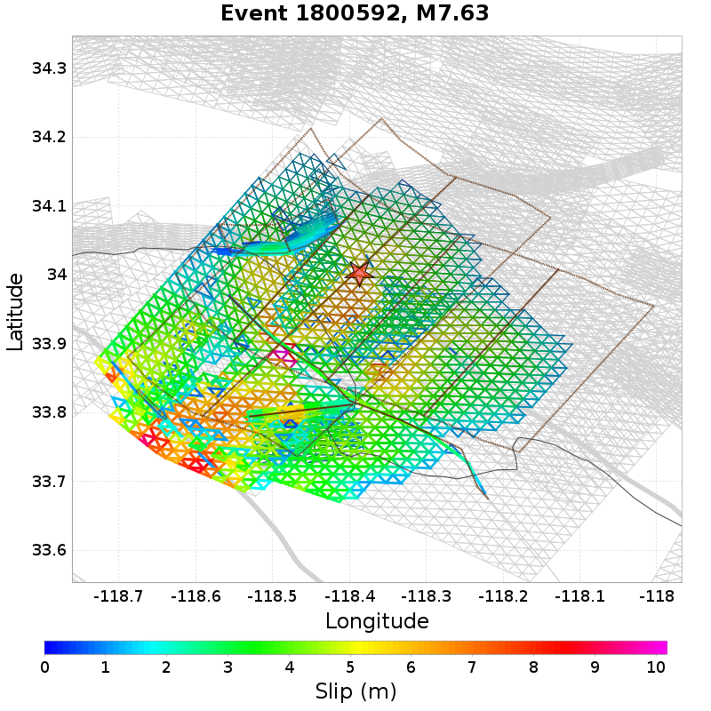 |

## Mapped Excess Length
*[(top)](#table-of-contents)*

Total rupture length (UCERF3 mapped subsection rupture) minus the idealized length, defined as the straight line distance between the furthest 2 subsections

### Mapped Excess Length Histogram
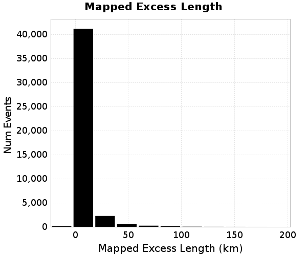
### Mapped Excess Length Events
*[(top)](#table-of-contents)*

| Event ID | Mapped Excess Length | Plot |
|-----|-----|-----|
| **2815356** | **192.03 (km)** |  |
| **67540** | **175.73 (km)** |  |
| **2473876** | **174.66 (km)** | 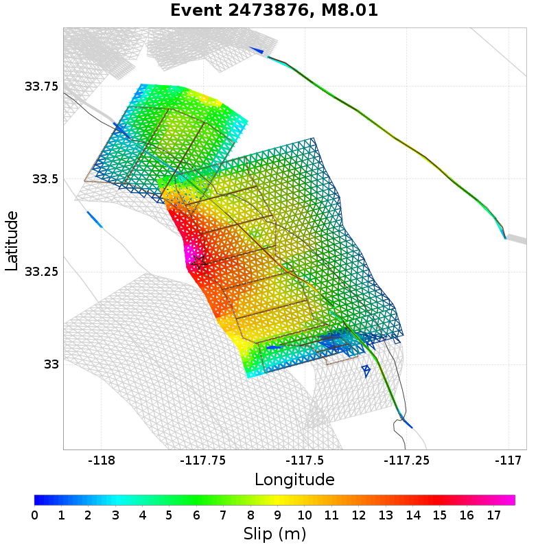 |
| **1918472** | **166.24 (km)** |  |
| **2910933** | **149.59 (km)** | 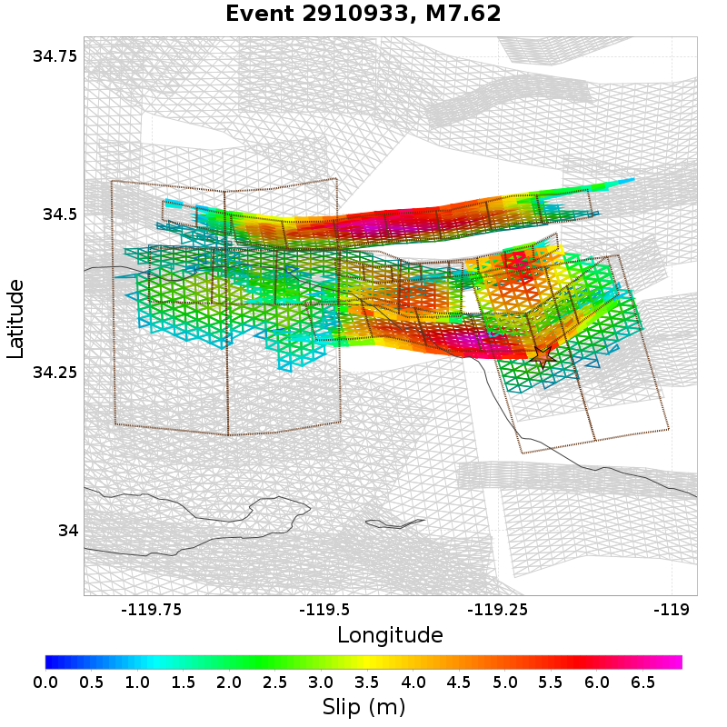 |

## Moment Off Mapped Rupture
*[(top)](#table-of-contents)*

Moment of simulator elements not included in mapped UCERF3 subsection rupture

### Moment Off Mapped Rupture Histogram
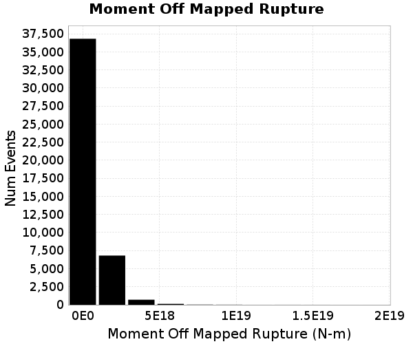
### Moment Off Mapped Rupture Events
*[(top)](#table-of-contents)*

| Event ID | Moment Off Mapped Rupture | Plot |
|-----|-----|-----|
| **1042766** | **1.9101464E19 (N-m)** |  |
| **1977278** | **1.7182936E19 (N-m)** |  |
| **1139182** | **1.4564559E19 (N-m)** | 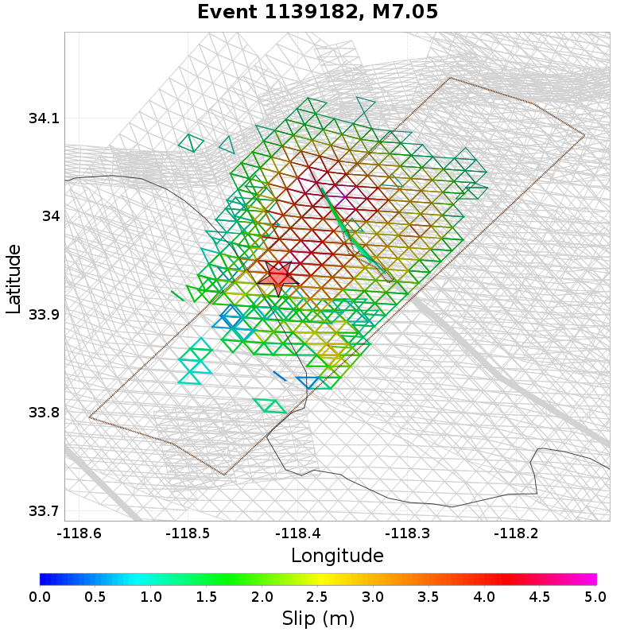 |
| **1350622** | **1.4463234E19 (N-m)** | 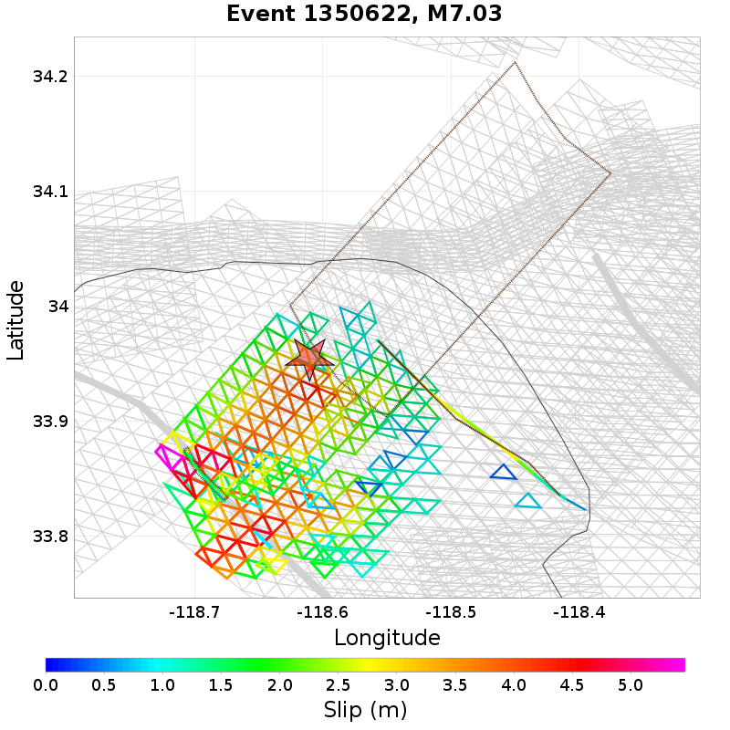 |
| **2141821** | **1.4451382E19 (N-m)** | 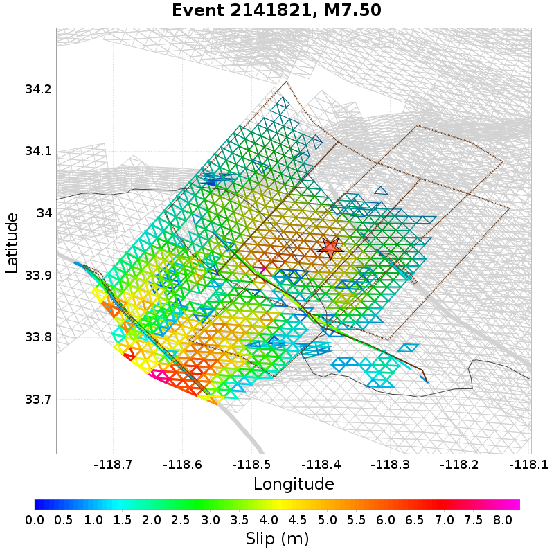 |

## Magnitude
*[(top)](#table-of-contents)*

Event Moment Magnitude

### Magnitude Histogram

### Magnitude Events
*[(top)](#table-of-contents)*

| Event ID | Magnitude | Plot |
|-----|-----|-----|
| **67540** | **8.06** |  |
| **1110177** | **8.03** | 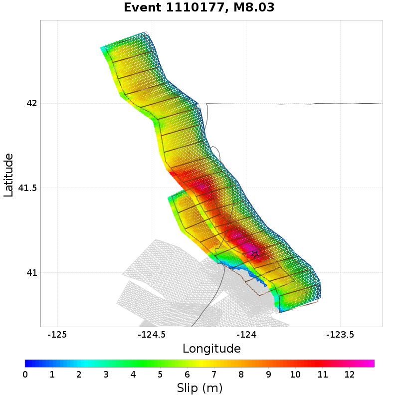 |
| **2473876** | **8.01** |  |
| **1569279** | **7.98** |  |
| **183748** | **7.98** |  |

## Moment >100km from Mapped
*[(top)](#table-of-contents)*

Moment that is at least 100km from the nearest mapped subsection (after application of subsection area threshold)

2 events above threshold of 1 [N-m]
### Moment >100km from Mapped Histogram
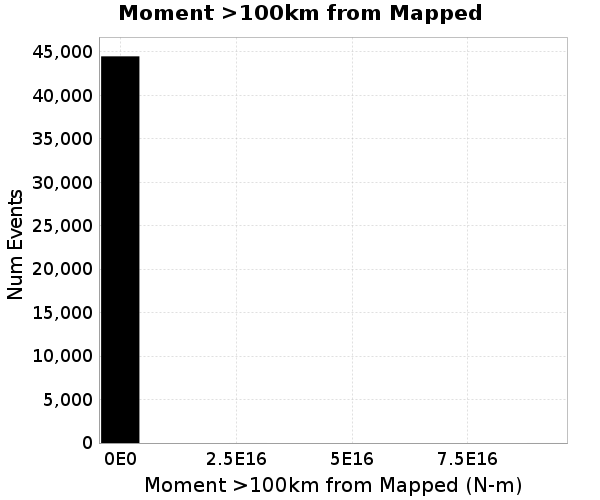
### Moment >100km from Mapped Events
*[(top)](#table-of-contents)*

| Event ID | Moment >100km from Mapped | Plot |
|-----|-----|-----|
| **2385784** | **9.17692E16 (N-m)** |  |
| **507069** | **2.7545631E16 (N-m)** |  |

