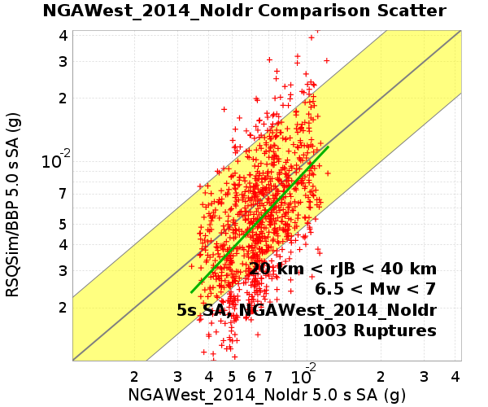
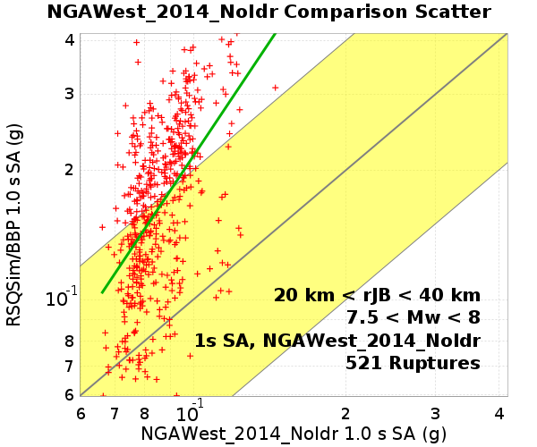

# Bruce 2665 BBP/NGAWest_2014_NoIdr GMPE Comparisons

**GMPE: NGAWest2 2014 Averaged No Idriss**

Ruptures are binned by their moment magnitude (**Mw**) and the Joyner-Boore distance (**rJB**), the shortest horizontal distance from a site to the surface projection of the rupture surface

[Catalog Details](../#bruce-2665)

## Table Of Contents
* [Site Scatters/Z-Score Histograms](#site-scattersz-score-histograms)
  * [All Sites Aggregated](#all-sites-aggregated)
    * [All Sites, 6 < Mw < 6.5](#all-sites-6--mw--65)
    * [All Sites, 6.5 < Mw < 7](#all-sites-65--mw--7)
    * [All Sites, 7 < Mw < 7.5](#all-sites-7--mw--75)
    * [All Sites, 7.5 < Mw < 8](#all-sites-75--mw--8)
    * [All Sites, All Ruptures, Z-Score Histograms](#all-sites-all-ruptures-z-score-histograms)
* [GMPE Residuals](#gmpe-residuals)
  * [Period-Dependent Residual Components](#period-dependent-residual-components)
  * [GMPE Magnitude Residuals](#gmpe-magnitude-residuals)
  * [GMPE rJB Residuals](#gmpe-rjb-residuals)
  * [GMPE rRup Residuals](#gmpe-rrup-residuals)
## Site Scatters/Z-Score Histograms
*[(top)](#table-of-contents)*

### All Sites Aggregated
*[(top)](#table-of-contents)*

**35 sites**

| Name | Location | # Ruptures | Vs30 (m/s) | Z1.0 (km) | Z2.5 (km) |
|-----|-----|-----|-----|-----|-----|
| grid0 | *31.5, -117.0* | 1316 (1316 sims) | 863 | N/A | N/A |
| grid1 | *32.5, -118.0* | 2569 (2569 sims) | 863 | N/A | N/A |
| grid2 | *32.5, -117.0* | 4730 (4730 sims) | 863 | N/A | N/A |
| grid3 | *32.5, -116.0* | 3969 (3969 sims) | 863 | N/A | N/A |
| grid4 | *32.5, -115.0* | 2991 (2991 sims) | 863 | N/A | N/A |
| grid5 | *32.5, -114.0* | 2159 (2159 sims) | 863 | N/A | N/A |
| grid6 | *33.5, -120.0* | 2094 (2094 sims) | 863 | N/A | N/A |
| grid7 | *33.5, -119.0* | 3254 (3254 sims) | 863 | N/A | N/A |
| grid8 | *33.5, -118.0* | 4570 (4570 sims) | 863 | N/A | N/A |
| grid9 | *33.5, -117.0* | 5447 (5447 sims) | 863 | N/A | N/A |
| grid10 | *33.5, -116.0* | 4846 (4846 sims) | 863 | N/A | N/A |
| grid11 | *33.5, -115.0* | 3669 (3669 sims) | 863 | N/A | N/A |
| grid12 | *33.5, -114.0* | 2341 (2341 sims) | 863 | N/A | N/A |
| grid13 | *34.5, -121.0* | 1493 (1493 sims) | 863 | N/A | N/A |
| grid14 | *34.5, -120.0* | 2287 (2287 sims) | 863 | N/A | N/A |
| grid15 | *34.5, -119.0* | 3490 (3490 sims) | 863 | N/A | N/A |
| grid16 | *34.5, -118.0* | 4683 (4683 sims) | 863 | N/A | N/A |
| grid17 | *34.5, -117.0* | 4997 (4997 sims) | 863 | N/A | N/A |
| grid18 | *34.5, -116.0* | 4081 (4081 sims) | 863 | N/A | N/A |
| grid19 | *34.5, -115.0* | 2808 (2808 sims) | 863 | N/A | N/A |
| grid20 | *34.5, -114.0* | 64 (64 sims) | 863 | N/A | N/A |
| grid21 | *35.5, -121.0* | 3746 (3746 sims) | 863 | N/A | N/A |
| grid22 | *35.5, -120.0* | 4161 (4161 sims) | 863 | N/A | N/A |
| grid23 | *35.5, -119.0* | 3178 (3178 sims) | 863 | N/A | N/A |
| grid24 | *35.5, -118.0* | 3761 (3761 sims) | 863 | N/A | N/A |
| grid25 | *35.5, -117.0* | 3511 (3511 sims) | 863 | N/A | N/A |
| grid26 | *35.5, -116.0* | 2530 (2530 sims) | 863 | N/A | N/A |
| grid27 | *35.5, -115.0* | 475 (475 sims) | 863 | N/A | N/A |
| grid28 | *35.5, -114.0* | 0 (0 sims) | 863 | N/A | N/A |
| grid29 | *36.5, -119.0* | 2558 (2558 sims) | 863 | N/A | N/A |
| grid30 | *36.5, -118.0* | 954 (954 sims) | 863 | N/A | N/A |
| grid31 | *36.5, -117.0* | 881 (881 sims) | 863 | N/A | N/A |
| grid32 | *36.5, -116.0* | 676 (676 sims) | 863 | N/A | N/A |
| grid33 | *37.5, -118.0* | 423 (423 sims) | 863 | N/A | N/A |
| grid34 | *37.5, -117.0* | 485 (485 sims) | 863 | N/A | N/A |

10132 ruptures within 200 km of *any* site
#### All Sites, 6 < Mw < 6.5
3865 Ruptures
##### All Sites, 6 < Mw < 6.5, Scatter Plots
*[(top)](#table-of-contents)*

**Legend**
* Red +: GMPE Mean/RSQSim/BBP single rupture comparison
* Yellow Region: Factor of 2 above & below
* Green Line: Linear Regression

| **Distance Bin** | **1 s** | **2 s** | **5 s** |
|-----|-----|-----|-----|
| **0 km < rJB < 10 km** |  |  |  |
| **10 km < rJB < 20 km** |  |  |  |
| **20 km < rJB < 40 km** |  |  |  |
| **40 km < rJB < 80 km** |  |  |  |
| **80 km < rJB < 160 km** |  |  |  |
| **160 km < rJB < 200 km** |  |  |  |
##### All Sites, 6 < Mw < 6.5, Z-Score Histograms
*[(top)](#table-of-contents)*

These plots compare RSQSim/BBP to the full GMPE log-normal distributions. Each rupture's GMPE distribution is converted to a standard log-normal distribution, and the z-score is computed for each rupture:

**z-score**: (ln(*RSQSim/BBP*) - ln(*GMPE-mean*)) / *GMPE-sigma*

**Legend**
* Black Line: Standard Normal distribution (in natural log space)
* Gray Histogram: z-score for each rupture
* Blue Dashed Line: RSQSim/BBP Mean

| **0 km < rJB < 10 km** | **10 km < rJB < 20 km** | **20 km < rJB < 40 km** |
|-----|-----|-----|
|  |  |  |
| **40 km < rJB < 80 km** | **80 km < rJB < 160 km** | **160 km < rJB < 200 km** |
|  |  |  |
#### All Sites, 6.5 < Mw < 7
3212 Ruptures
##### All Sites, 6.5 < Mw < 7, Scatter Plots
*[(top)](#table-of-contents)*

**Legend**
* Red +: GMPE Mean/RSQSim/BBP single rupture comparison
* Yellow Region: Factor of 2 above & below
* Green Line: Linear Regression

| **Distance Bin** | **1 s** | **2 s** | **5 s** |
|-----|-----|-----|-----|
| **0 km < rJB < 10 km** |  |  |  |
| **10 km < rJB < 20 km** |  |  |  |
| **20 km < rJB < 40 km** |  |  |  |
| **40 km < rJB < 80 km** |  |  |  |
| **80 km < rJB < 160 km** |  |  |  |
| **160 km < rJB < 200 km** |  |  |  |
##### All Sites, 6.5 < Mw < 7, Z-Score Histograms
*[(top)](#table-of-contents)*

These plots compare RSQSim/BBP to the full GMPE log-normal distributions. Each rupture's GMPE distribution is converted to a standard log-normal distribution, and the z-score is computed for each rupture:

**z-score**: (ln(*RSQSim/BBP*) - ln(*GMPE-mean*)) / *GMPE-sigma*

**Legend**
* Black Line: Standard Normal distribution (in natural log space)
* Gray Histogram: z-score for each rupture
* Blue Dashed Line: RSQSim/BBP Mean

| **0 km < rJB < 10 km** | **10 km < rJB < 20 km** | **20 km < rJB < 40 km** |
|-----|-----|-----|
|  |  |  |
| **40 km < rJB < 80 km** | **80 km < rJB < 160 km** | **160 km < rJB < 200 km** |
|  |  |  |
#### All Sites, 7 < Mw < 7.5
2457 Ruptures
##### All Sites, 7 < Mw < 7.5, Scatter Plots
*[(top)](#table-of-contents)*

**Legend**
* Red +: GMPE Mean/RSQSim/BBP single rupture comparison
* Yellow Region: Factor of 2 above & below
* Green Line: Linear Regression

| **Distance Bin** | **1 s** | **2 s** | **5 s** |
|-----|-----|-----|-----|
| **0 km < rJB < 10 km** |  |  |  |
| **10 km < rJB < 20 km** |  |  |  |
| **20 km < rJB < 40 km** |  |  |  |
| **40 km < rJB < 80 km** |  |  |  |
| **80 km < rJB < 160 km** |  |  |  |
| **160 km < rJB < 200 km** |  |  |  |
##### All Sites, 7 < Mw < 7.5, Z-Score Histograms
*[(top)](#table-of-contents)*

These plots compare RSQSim/BBP to the full GMPE log-normal distributions. Each rupture's GMPE distribution is converted to a standard log-normal distribution, and the z-score is computed for each rupture:

**z-score**: (ln(*RSQSim/BBP*) - ln(*GMPE-mean*)) / *GMPE-sigma*

**Legend**
* Black Line: Standard Normal distribution (in natural log space)
* Gray Histogram: z-score for each rupture
* Blue Dashed Line: RSQSim/BBP Mean

| **0 km < rJB < 10 km** | **10 km < rJB < 20 km** | **20 km < rJB < 40 km** |
|-----|-----|-----|
|  |  |  |
| **40 km < rJB < 80 km** | **80 km < rJB < 160 km** | **160 km < rJB < 200 km** |
|  |  |  |
#### All Sites, 7.5 < Mw < 8
598 Ruptures
##### All Sites, 7.5 < Mw < 8, Scatter Plots
*[(top)](#table-of-contents)*

**Legend**
* Red +: GMPE Mean/RSQSim/BBP single rupture comparison
* Yellow Region: Factor of 2 above & below
* Green Line: Linear Regression

| **Distance Bin** | **1 s** | **2 s** | **5 s** |
|-----|-----|-----|-----|
| **0 km < rJB < 10 km** |  |  |  |
| **10 km < rJB < 20 km** |  |  |  |
| **20 km < rJB < 40 km** |  |  |  |
| **40 km < rJB < 80 km** |  |  |  |
| **80 km < rJB < 160 km** |  |  |  |
| **160 km < rJB < 200 km** |  |  |  |
##### All Sites, 7.5 < Mw < 8, Z-Score Histograms
*[(top)](#table-of-contents)*

These plots compare RSQSim/BBP to the full GMPE log-normal distributions. Each rupture's GMPE distribution is converted to a standard log-normal distribution, and the z-score is computed for each rupture:

**z-score**: (ln(*RSQSim/BBP*) - ln(*GMPE-mean*)) / *GMPE-sigma*

**Legend**
* Black Line: Standard Normal distribution (in natural log space)
* Gray Histogram: z-score for each rupture
* Blue Dashed Line: RSQSim/BBP Mean

| **0 km < rJB < 10 km** | **10 km < rJB < 20 km** | **20 km < rJB < 40 km** |
|-----|-----|-----|
|  |  |  |
| **40 km < rJB < 80 km** | **80 km < rJB < 160 km** | **160 km < rJB < 200 km** |
|  |  |  |
#### All Sites, All Ruptures, Z-Score Histograms
*[(top)](#table-of-contents)*

z-score standard normal plots across all magnitudes/distances

**z-score**: (ln(*RSQSim/BBP*) - ln(*GMPE-mean*)) / *GMPE-sigma*

**Legend**
* Black Line: Standard Normal distribution (in natural log space)
* Gray Histogram: z-score for each rupture
* Blue Dashed Line: RSQSim/BBP Mean

## GMPE Residuals
*[(top)](#table-of-contents)*

Residuals of simulation data (RSQSim/BBP) in log space relative to GMPE log-mean

**Legend**
* Black Thick Line: Linear Least-Squares Fit to Residuals
* Black Circles: Binned Linear Least-Squares Fit to Residuals
  * Black Thin Dashes: binned mean ± data sigma
  * Blue Thin Dotted: binned mean ± GMPE sigma

GMPE Residuals use the following values, averaged among all ruptures, for all paremeters which are not varied. All other parameters set to GMPE defaults

| Name | Average Value |
|-----|-----|
| Magnitude | 6.82 |
| rRup | 128.55 |
| rJB | 128.42 |
| Vs30 | 863 |
| Z10 | � |
| Z25 | � |

### Period-Dependent Residual Components
*[(top)](#table-of-contents)*

**Note: These are not yet corrected for covariance. Currently only useful for comparing relative phi and tau, not absolute values**

### GMPE Magnitude Residuals
*[(top)](#table-of-contents)*

| **1 s** | **2 s** | **5 s** |
|-----|-----|-----|
|  |  |  |
|  |  |  |
### GMPE rJB Residuals
*[(top)](#table-of-contents)*

| **1 s** | **2 s** | **5 s** |
|-----|-----|-----|
|  |  |  |
|  |  |  |
### GMPE rRup Residuals
*[(top)](#table-of-contents)*

| **1 s** | **2 s** | **5 s** |
|-----|-----|-----|
|  |  |  |
|  |  |  |
