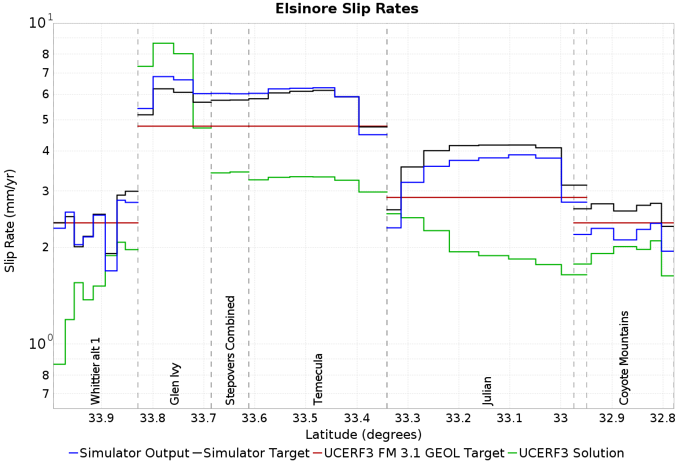
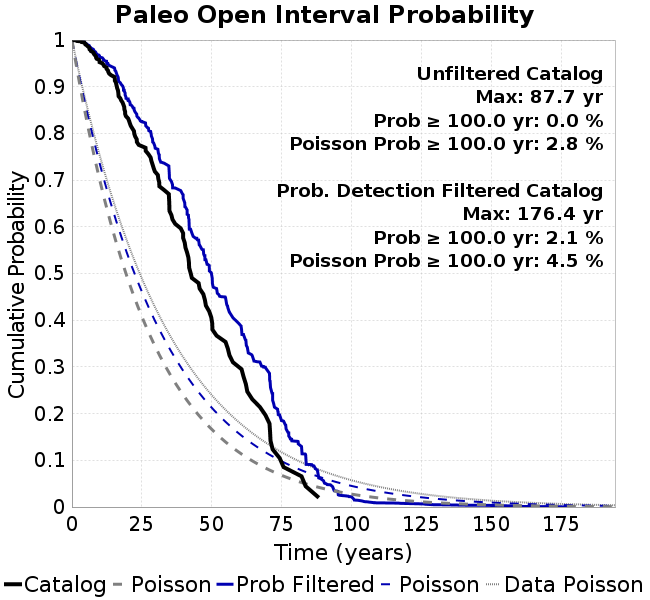
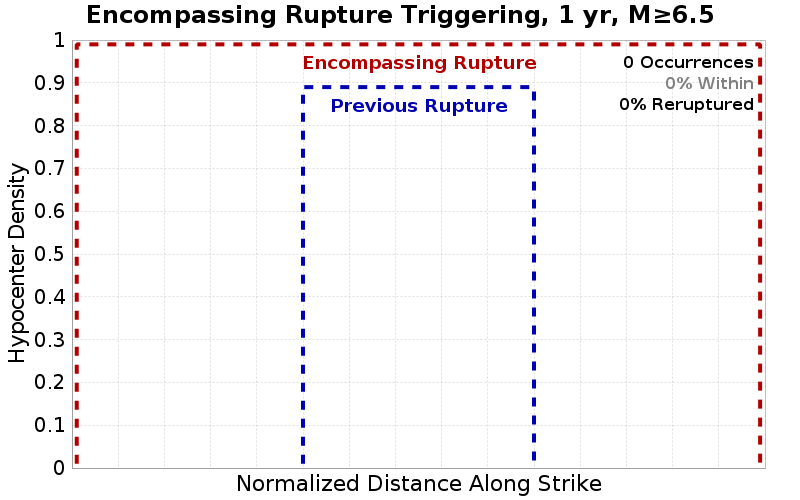
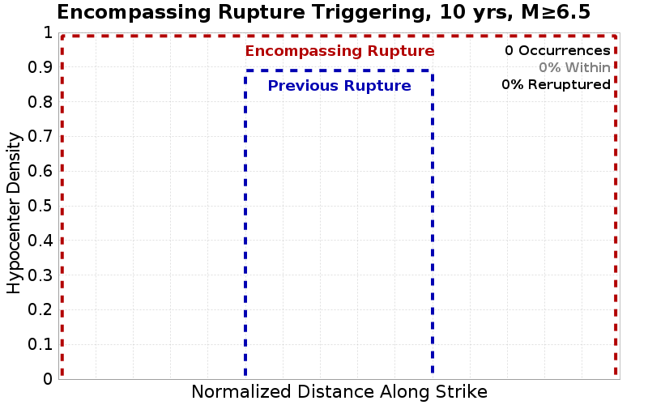

# Bruce 2666
## Metadata
| **Catalog** | Bruce 2666 |
|-----|-----|
| **Author** | Bruce Shaw, 2018/04/17 |
| **Description** | dx/4, LatCut=37, rateCut=2.0mm/yr, interpolated nearest |
| **Fault/Def Model** | Fault Model 3.1, Geologic |
| **Slip Velocity** | 1.0 m/s |
| **Average Element Area** | 0.09 km^2 |
| **Length** | 1,164,999 events in 4,994 years |
| **Frictional Params** | a=0.001, b=0.008, (b-a)=0.007, ddotEQ=1 |

* [Metadata](#metadata)
* [BBP Calculations, LA Basin 863 (m/s) Velocity Model](#bbp-calculations-la-basin-863-ms-velocity-model)
  * [Full Catalog GMPE Comparisons, LA Basin 863 (m/s)](#full-catalog-gmpe-comparisons-la-basin-863-ms)
* [Plots](#plots)
  * [Magnitude-Frequency Plot](#magnitude-frequency-plot)
  * [Magnitude-Area Plots](#magnitude-area-plots)
  * [Slip-Area Plots](#slip-area-plots)
  * [Slip-Length Plots](#slip-length-plots)
  * [Slip Along Rupture (Dsr) Plots](#slip-along-rupture-dsr-plots)
    * [Two- and Three-Fault Slip Along Rupture](#two--and-three-fault-slip-along-rupture)
  * [Slip Rate Plots](#slip-rate-plots)
    * [Slip Rate Fault Plots](#slip-rate-fault-plots)
  * [Rupture Velocity Plots](#rupture-velocity-plots)
  * [Global Interevent-Time Distributions](#global-interevent-time-distributions)
  * [Normalized Fault Interevent-Time Distributions](#normalized-fault-interevent-time-distributions)
  * [Normalized Rupture Interevent-Time Distributions](#normalized-rupture-interevent-time-distributions)
  * [Stationarity Plot](#stationarity-plot)
  * [Element/Subsection Interevent Time Comparisons](#elementsubsection-interevent-time-comparisons)
    * [Element Interevent Time Comparisons](#element-interevent-time-comparisons)
    * [Subsection Interevent Time Comparisons](#subsection-interevent-time-comparisons)
  * [Paleo Recurrence Plots](#paleo-recurrence-plots)
  * [Paleo Open Interval Plots](#paleo-open-interval-plots)
    * [Paleo Open Interval Plots, Biasi and Sharer 2019](#paleo-open-interval-plots-biasi-and-sharer-2019)
    * [Paleo Open Interval Plots, UCERF3](#paleo-open-interval-plots-ucerf3)
  * [Trigger Hypocenter Statistics Within Previous Rupture Area](#trigger-hypocenter-statistics-within-previous-rupture-area)
* [Input File](#input-file)

## BBP Calculations, LA Basin 863 (m/s) Velocity Model
*[(top)](#bruce-2666)*


### Full Catalog GMPE Comparisons, LA Basin 863 (m/s)
*[(top)](#bruce-2666)*

* [ASK2014](bbp_LA_BASIN_863/gmpe_bbp_comparisons_ASK2014_GriddedSites/)
* [NGAWest_2014_NoIdr](bbp_LA_BASIN_863/gmpe_bbp_comparisons_NGAWest_2014_NoIdr_GriddedSites/)

## Plots
### Magnitude-Frequency Plot
*[(top)](#bruce-2666)*


### Magnitude-Area Plots
*[(top)](#bruce-2666)*

| Scatter | 2-D Hist |
|-----|-----|
|  |  |
### Slip-Area Plots
*[(top)](#bruce-2666)*

| Scatter | 2-D Hist |
|-----|-----|
|  |  |
### Slip-Length Plots
*[(top)](#bruce-2666)*

These plots compute average slip-length scaling at mid-seismogenic depth. We define mid-seismogenic depth to be no deeper than 8 km, no shallower than 4 km, and no less than 2 km down- or up-dip from the top or bottom of the fault. Average slip is computed across all elements in this mid-seismogenic region, including any which did not slip, along the full length of the rupture.

We define the rupture length, which also determines the region at mid-seismogenic depth across which we compute average slip, multiple ways in order to test sensitivity:

* **Full Mapped Subsection Length:** Average slip in the mid-seismogenic zone across the whole length of each mapped subsection
* **Full Slipped Length:** Average slip in the mid-seismogenic zone across the section of fault that slipped (regardless of if that slip was in the mid-seismgenic zone or not)
* **Mid-Seismogenic Slipped Length:** Average slip in the mid-seismogenic zone across the section of fault that slipped in that mid-seismogenic zone (including any holes with no slip)
* **Surface Slipped Length:** Average slip in the mid-seismogenic zone across the section of fault that had surface slip

These length algorithms are illustrated in the following example plot, which also has the mid-seismogenic depth range outlined in a cyan dashed line:


The average value is plotted in a thick gray line, and UCERF3 Scaling Relationships in colored lines (assuming a down dip width of 12 km).

| Lengh Algorithm | Scatter | 2-D Hist |
|-----|-----|-----|
| **Full Mapped Subsection Length** |  |  |
| **Full Slipped Length** |  |  |
| **Mid-Seismogenic Slipped Length** |  |  |
| **Surface Slipped Length** |  |  |
### Slip Along Rupture (Dsr) Plots
*[(top)](#bruce-2666)*

These plots show the slip along rupture distiribution, noted D<sub>SR</sub> in UCERF3. First we compute average slip along each mapped subsection at mid-seismogenic depth (using the *Full Slipped Length* algorithm), then plot that slip along strike, normalized by the average slip across all subsections in that rupture. We do this for single-fault events, which can span multiple segments (e.g. SAF Mojave and San Bernardino), and also separately for each junction in multi-fault events. This is done using the UCERF3 'named faults' list to determine if multiple fault sections belong to the same master fault. We only consider ruptures where at least 2 subsections participated (2 on each side of the jump for multi-fault ruptures).

Ruptures are binned by their length in each row below. For multi-fault ruptures, the junction point is at x=0 with the shorter side of the rupture on the left (below zero), and longer half on the right

Average values are plotted with a solid black line, and 1.311*sqrt(sin(|x*&pi;|)) in a dashed gray line (normalized length plots only).

| Rupture Length | Single-fault, absolute distance from either rupture endpoint | Single-fault, normalized distance along strike | Multi-fault, normalized distance on either side of jump |
|-----|-----|-----|-----|
| **All Lengths** |  |  |  |
| **Len=[0 25]** |  |  |  |
| **Len=[25 50]** |  |  |  |
| **Len=[50 100]** |  |  |  |
| **Len≥100** |  |  |  |

#### Two- and Three-Fault Slip Along Rupture

These plots show D<sub>SR</sub> for two- and three-fault ruptures. Lengths are normalized, with the first fault in x=[0 1], second in x=[1 2], etc. Rupture are organized such that the leftmost side is always shorter than the rightmost side.

| Rupture Length | Two-fault Ruptures | Three-Fault Ruptures |
|-----|-----|-----|
| **All Lengths** |  |  |
| **Len=[0 25]** |  |  |
| **Len=[25 50]** |  |  |
| **Len=[50 100]** |  |  |
| **Len≥100** |  |  |
### Slip Rate Plots
*[(top)](#bruce-2666)*

Slip rates are calculated at mid-seismogenic depth: no deeper than 8 km, no shallower than 4 km, and no less than 2 km down- or up-dip from the top or bottom of the fault. UCERF3 comparisons are included with the original target slip rate for the fault and deformation model used as input to the simulator when constructing the geometry, but this target is often smoothed and/or modified before use in the simlators. Post-UCERF3 inversion slip rates (which will not perfectly match the target) are also included and labeled as 'UCERF3 Solution'.

| <p align="center">**Simulation Slip Rate**</p> | <p align="center">**Simulation vs Target Ratio**</p> | <p align="center">**UCERF3 Target Slip Rate**</p> |
|-----|-----|-----|
|  |  |  |
| <p align="center">**Simulation vs UCERF3 Target Ratio**</p> | <p align="center">**UCERF3 Solution Slip Rate**</p> | <p align="center">**UCERF3 Solution vs Target Ratio**</p> |
|  |  |  |
#### Slip Rate Fault Plots
*[(top)](#bruce-2666)*

| <p align="center">**Calaveras**</p> | <p align="center">**Elsinore**</p> | <p align="center">**Garlock**</p> |
|-----|-----|-----|
|  |  |  |
| <p align="center">**Green Valley**</p> | <p align="center">**Hayward-Rodgers Creek**</p> | <p align="center">**San Andreas**</p> |
|  |  |  |
| <p align="center">**San Jacinto (CC to SM)**</p> | <p align="center">**San Jacinto (SB to C)**</p> |  |
|  |  |  |
### Rupture Velocity Plots
*[(top)](#bruce-2666)*

| **Scatter** |  |
|-----|-----|
| **Distance/Velocity** |  |
### Global Interevent-Time Distributions
*[(top)](#bruce-2666)*

| **M≥6** | **M≥6.5** | **M≥7** | **M≥7.5** |
|-----|-----|-----|-----|
|  |  |  |  |
### Normalized Fault Interevent-Time Distributions
*[(top)](#bruce-2666)*

These plots show interevent-time distributions for a point on a fault (either an element,  or aggregated at the subsection or parent section level).

|  | **M≥6** | **M≥6.5** | **M≥7** | **M≥7.5** |
|-----|-----|-----|-----|-----|
| **Elements** |  |  |  |  |
| **Subsections** |  |  |  |  |
| **Sections** |  |  |  |  |
### Normalized Rupture Interevent-Time Distributions
*[(top)](#bruce-2666)*

These plots show interevent-time distributions, averaged over a rupture, similar to the UCERF3 BPT calculation. For each rupture, we compute the average normalized open interval across all subsections which participate.

| **M≥6** | **M≥6.5** | **M≥7** | **M≥7.5** |
|-----|-----|-----|-----|
|  |  |  |  |
### Stationarity Plot
*[(top)](#bruce-2666)*


### Element/Subsection Interevent Time Comparisons

#### Element Interevent Time Comparisons
*[(top)](#bruce-2666)*

| Min Mag | Scatter | 2-D Hist |
|-----|-----|-----|
| **M≥6.0** |  |  |
| **M≥6.5** |  |  |
| **M≥7.0** |  |  |
| **M≥7.5** |  |  |

#### Subsection Interevent Time Comparisons
*[(top)](#bruce-2666)*

*Subsections participate in a rupture if at least 20.0 % of its area ruptures*

| Min Mag | Scatter | 2-D Hist |
|-----|-----|-----|
| **M≥6.0** |  |  |
| **M≥6.5** |  |  |
| **M≥7.0** |  |  |
| **M≥7.5** |  |  |

### Paleo Recurrence Plots
*[(top)](#bruce-2666)*

|  |  |
|-----|-----|
|  |  |

| Paleoseismic Site Name | UCERF3 Rate | UCERF3 95% Conf | UCERF3 68% Conf | Sim Subsection Rate | Sim Paleo-Detectable Subsection Rate | Sim Element Rate | Sim Paleo-Detectable Element Rate |
|-----|-----|-----|-----|-----|-----|-----|-----|
| Elsinore - Glen Ivy | 0.0055828 | [0.0038119 0.0081764] | [0.0046288 0.00677] | 0.00329645 | 0.0026376953 | 0.0025357308 | 0.0023156223 |
| Elsinore Fault - Julian | 3.076E-4 | [7.8E-6 0.0011347] | [5.35E-5 5.62E-4] | 0.0010142924 | 9.507856E-4 | 0.0010142924 | 9.774602E-4 |
| Elsinore - Temecula | 9.812E-4 | [1.06E-5 0.090633] | [5.225E-4 0.0018758] | 0.0017750117 | 0.0016269046 | 0.0017750117 | 0.0016784847 |
| Elsinore - Whittier | 3.128E-4 | [7.9E-6 0.0011538] | [5.45E-5 5.725E-4] | 0.0015214385 | 0.0011691011 | 7.6071924E-4 | 7.1877247E-4 |
| Frazier Mountian, SSAF | 0.0067307 | [0.0037115 0.0122057] | [0.0049697 0.0090886] | 0.011157216 | 0.010536205 | 0.010650069 | 0.010067604 |
| Garlock Central (all events) | 6.969E-4 | [3.037E-4 0.0015988] | [4.591E-4 0.0010631] | 0.0022821578 | 0.0021749514 | 0.0022821578 | 0.0022122958 |
| Garlock - Western (all events) | 8.129E-4 | [3.459E-4 0.00191] | [5.294E-4 0.0012535] | 0.0015214385 | 0.0014363554 | 0.0015214385 | 0.0014711848 |
| N. San Andreas - Santa Cruz Seg. | 0.0091041 | [0.0054923 0.0150912] | [0.0070415 0.0117617] | 0.011157216 | 0.0075490368 | 0.011157216 | 0.008535818 |
| San Jacinto - Hog Lake | 0.0032074 | [0.0018202 0.0056519] | [0.0024066 0.0042752] | 0.0043107425 | 0.004141493 | 0.0043107425 | 0.0042183674 |
| San Jacinto - Superstition | 0.0019675 | [5.929E-4 0.0065288] | [0.0010666 0.0036454] | 0.002789304 | 0.00216183 | 0.0017750117 | 0.0014205482 |
| S. SAF- Carrizo Bidart | 0.0087179 | [0.0048746 0.0155916] | [0.0064913 0.0117016] | 0.010142923 | 0.010007678 | 0.010142923 | 0.009821021 |
| S. San Andreas - Burro Flats                          | 0.0048677 | [0.002824 0.0083903] | [0.0036799 0.0064073] | 0.008875058 | 0.0047936994 | 0.006085754 | 0.0041114255 |
| S. San Andreas - Coachella | 0.0056037 | [0.0031142 0.0100834] | [0.0041571 0.0075507] | 0.011410789 | 0.008883187 | 0.009128631 | 0.008028202 |
| S. San Andreas - Indio   | 0.0036053 | [0.0022287 0.0058323] | [0.002805 0.0046111] | 0.011410789 | 0.008883187 | 0.009128631 | 0.008189045 |
| S. San Andreas - Pallett Creek | 0.006698 | [0.0044376 0.0101097] | [0.005447 0.0082553] | 0.009635777 | 0.009449816 | 0.009635777 | 0.009379756 |
| S. San Andreas - Pitman Canyon       | 0.0057643 | [0.003515 0.0094529] | [0.0044747 0.0074149] | 0.0109036425 | 0.005431901 | 0.008621485 | 0.007563106 |
| S. San Andreas - Plunge Creek    | 0.0048695 | [0.0028965 0.0081864] | [0.0036725 0.0062762] | 0.006085754 | 0.0041997083 | 0.0045643155 | 0.0031665685 |
| S. SAF M. Creek - 1000 Palms | 0.0038266 | [0.0024425 0.0059951] | [0.0030666 0.0047993] | 0.005578608 | 0.004028549 | 0.0035500233 | 0.003223117 |
| S. San Andreas - Wrightwood         | 0.0094304 | [0.0067778 0.0131212] | [0.0079741 0.0111519] | 0.009635777 | 0.009154837 | 0.009635777 | 0.009377782 |

### Paleo Open Interval Plots
*[(top)](#bruce-2666)*

#### Paleo Open Interval Plots, Biasi and Sharer 2019
*[(top)](#bruce-2666)*

These plots use the 5 paleoseismic sites identified in Biasi & Scharer (2019) on the Hayward, N. SAF, S. SAF, and SJC faults. By default, a rupture is counted at a paleo site if the nearest element (at the surface) slips any amount. We also alternatively apply a probability of detection model. Those results are marked as 'Prob. Filtered'.

**Paleoseismic sites table:**

| **Site Name** | Data MRI (yr) | Data Annual Rate | Catalog MRI (yr) | Catalog Annual Rate | Catalog Occurences | Prob Filtered Catalog MRI (yr) | Prob Filtered Catalog Annual Rate | Prob Filtered Catalog Occurences |
|-----|-----|-----|-----|-----|-----|-----|-----|-----|
| **HOG** | 191.00 | 0.005235602 | 231.35 | 0.0043223966 | 17 | 236.95 | 0.0042202696 | 16.57 |
| **FRA** | 119.00 | 0.008403362 | 91.59 | 0.010918525 | 42 | 96.23 | 0.010391997 | 39.94 |
| **COA** | 181.00 | 0.005524862 | 109.72 | 0.00911419 | 36 | 125.24 | 0.007984477 | 31.52 |
| **SCZ** | 106.00 | 0.009433962 | 87.65 | 0.011408481 | 44 | 121.30 | 0.008244057 | 31.72 |
| **TOTAL** | 34.97 | 0.028597787 | 27.85 | 0.035906997 | 139 | 32.27 | 0.030990966 | 120.02 |

**Paleoseismic Plots:**

|  |  |
|-----|-----|

**Open interval probabilities table:**

| **Open Interval (yr)** | Catalog Probability | Catalog Poisson Probability | Prob. Filtered Catalog Probability | Prob. Filtered Catalog Poisson Probability | Data Poisson Probability |
|-----|-----|-----|-----|-----|-----|
| **10.00** | 0.9523374 | 0.6983255 | 0.96364474 | 0.73351324 | 0.75127923 |
| **20.00** | 0.8325619 | 0.4876585 | 0.8737766 | 0.53804165 | 0.5644205 |
| **30.00** | 0.7159407 | 0.34054434 | 0.76781476 | 0.39466065 | 0.4240374 |
| **40.00** | 0.57138115 | 0.2378108 | 0.6565582 | 0.2894888 | 0.3185705 |
| **50.00** | 0.397873 | 0.16606934 | 0.49430156 | 0.21234387 | 0.2393354 |
| **60.00** | 0.2980705 | 0.115970455 | 0.39041182 | 0.15575702 | 0.17980771 |
| **70.00** | 0.18611844 | 0.08098513 | 0.29114825 | 0.11424984 | 0.1350858 |
| **80.00** | 0.07209712 | 0.05655398 | 0.14099273 | 0.083803765 | 0.10148716 |
| **90.00** | 0.0 | 0.039493084 | 0.05456883 | 0.06147117 | 0.076245196 |
| **100.00** | 0.0 | 0.027579028 | 0.021382429 | 0.045089915 | 0.05728143 |
| **110.00** | 0.0 | 0.019259138 | 0.008988119 | 0.03307405 | 0.04303435 |
| **120.00** | 0.0 | 0.013449147 | 0.00757757 | 0.024260253 | 0.032330815 |
| **130.00** | 0.0 | 0.009391882 | 0.00500437 | 0.017795216 | 0.02428947 |
| **140.00** | 0.0 | 0.0065585906 | 0.0040328577 | 0.013053026 | 0.018248174 |
| **150.00** | 0.0 | 0.004580031 | 0.0032941443 | 0.009574567 | 0.013709474 |
| **160.00** | 0.0 | 0.0031983524 | 0.0017755545 | 0.0070230714 | 0.0102996435 |
| **170.00** | 0.0 | 0.002233491 | 8.0925546E-4 | 0.005151516 | 0.007737908 |
| **180.00** | 0.0 | 0.0015597037 | 0.0 | 0.003778705 | 0.00581333 |

#### Paleo Open Interval Plots, UCERF3
*[(top)](#bruce-2666)*

These plots use the full set of UCERF3 paleoseismic sites. By default, a rupture is counted at a paleo site if the nearest element (at the surface) slips any amount. We also alternativeslyapply a probability of detection model. Those results are marked as 'Prob. Filtered'.

**Paleoseismic sites table:**

| **Site Name** | Data MRI (yr) | Data Annual Rate | Catalog MRI (yr) | Catalog Annual Rate | Catalog Occurences | Prob Filtered Catalog MRI (yr) | Prob Filtered Catalog Annual Rate | Prob Filtered Catalog Occurences |
|-----|-----|-----|-----|-----|-----|-----|-----|-----|
| **SSanAndreasBurroFlats** | 205.44 | 0.0048677 | 159.95 | 0.0062520253 | 24 | 235.38 | 0.004248445 | 16.06 |
| **SSanAndreasIndio** | 277.37 | 0.0036053 | 109.72 | 0.00911419 | 36 | 121.86 | 0.0082062315 | 32.35 |
| **SSAFMCreek1000Palms** | 261.33 | 0.0038266 | 278.11 | 0.0035956823 | 14 | 301.22 | 0.0033198078 | 12.78 |
| **SSanAndreasCoachella** | 178.45 | 0.0056037 | 109.72 | 0.00911419 | 36 | 124.16 | 0.008054227 | 31.86 |
| **ElsinoreTemecula** | 1019.16 | 9.812E-4 | 580.81 | 0.0017217399 | 7 | 601.96 | 0.0016612447 | 6.72 |
| **ElsinoreWhittier** | 3196.93 | 3.128E-4 | 1453.85 | 6.8782945E-4 | 3 | 1456.38 | 6.866354E-4 | 2.87 |
| **SSAFCarrizoBidart** | 114.71 | 0.0087179 | 96.28 | 0.010385914 | 40 | 99.06 | 0.010095209 | 38.84 |
| **SanJacintoHogLake** | 311.78 | 0.0032074 | 231.35 | 0.0043223966 | 17 | 235.20 | 0.004251755 | 16.7 |
| **ElsinoreGlenIvy** | 179.12 | 0.0055828 | 430.73 | 0.0023216372 | 10 | 466.72 | 0.0021425958 | 9.18 |
| **GarlockCentralallevents** | 1434.93 | 6.969E-4 | 434.28 | 0.0023026557 | 9 | 452.06 | 0.0022120776 | 8.62 |
| **SanJacintoSuperstition** | 508.26 | 0.0019675 | 762.32 | 0.0013117881 | 5 | 853.01 | 0.0011723212 | 4.26 |
| **SSanAndreasWrightwood** | 106.04 | 0.0094304 | 101.49 | 0.0098533025 | 38 | 103.98 | 0.009617414 | 37.06 |
| **SSanAndreasPitmanCanyon** | 173.48 | 0.0057643 | 113.94 | 0.00877661 | 35 | 130.08 | 0.0076875314 | 29.99 |
| **SSanAndreasPlungeCreek** | 205.36 | 0.0048695 | 229.93 | 0.004349235 | 17 | 336.45 | 0.0029722117 | 11.61 |
| **SSanAndreasPallettCreek** | 149.30 | 0.006698 | 101.49 | 0.0098533025 | 38 | 103.92 | 0.009623178 | 37.05 |
| **GarlockWesternallevents** | 1230.16 | 8.129E-4 | 659.83 | 0.0015155389 | 6 | 674.16 | 0.0014833307 | 5.8 |
| **FrazierMountianSSAF** | 148.57 | 0.0067307 | 91.59 | 0.010918525 | 42 | 96.22 | 0.010393165 | 39.98 |
| **NSanAndreasSantaCruzSeg** | 109.84 | 0.0091041 | 87.65 | 0.011408481 | 44 | 117.24 | 0.008529706 | 32.62 |
| **ElsinoreFaultJulian** | 3250.98 | 3.076E-4 | 874.89 | 0.0011430058 | 4 | 909.01 | 0.0011000936 | 3.83 |
| **TOTAL** | 12.04 | 0.0830873 | 17.86 | 0.055976994 | 221 | 20.15 | 0.049639508 | 195.08 |

**Paleoseismic Plots:**

|  |  |
|-----|-----|

**Open interval probabilities table:**

| **Open Interval (yr)** | Catalog Probability | Catalog Poisson Probability | Prob. Filtered Catalog Probability | Prob. Filtered Catalog Poisson Probability | Data Poisson Probability |
|-----|-----|-----|-----|-----|-----|
| **10.00** | 0.88227946 | 0.5713405 | 0.90496874 | 0.6087211 | 0.4356688 |
| **20.00** | 0.69476914 | 0.32642996 | 0.7408968 | 0.37054136 | 0.18980728 |
| **30.00** | 0.4920888 | 0.18650265 | 0.54815644 | 0.22555634 | 0.08269311 |
| **40.00** | 0.32106096 | 0.10655651 | 0.3817176 | 0.13730091 | 0.036026806 |
| **50.00** | 0.17619677 | 0.06088005 | 0.2324138 | 0.08357795 | 0.015695754 |
| **60.00** | 0.079900056 | 0.034783237 | 0.12891877 | 0.050875664 | 0.0068381503 |
| **70.00** | 0.04130911 | 0.019873073 | 0.079288736 | 0.030969089 | 0.0029791687 |
| **80.00** | 0.021041717 | 0.011354291 | 0.03224911 | 0.018851537 | 0.0012979307 |
| **90.00** | 0.0 | 0.006487166 | 0.002825388 | 0.011475328 | 5.654679E-4 |
| **100.00** | 0.0 | 0.0037063807 | 0.0 | 0.0069852746 | 2.463567E-4 |

### Trigger Hypocenter Statistics Within Previous Rupture Area
*[(top)](#bruce-2666)*

Example rupture plots:

| M≥6 | M≥6.5 | M≥7 |
|-----|-----|-----|
|  |  |  |
|  |  |  |

| M≥6 | M≥6.5 | M≥7 |
|-----|-----|-----|
|  |  |  |
|  |  |  |
|  |  |  |

## Input File
*[(top)](#bruce-2666)*

```
  A_1 = 0.001
  fA = .1
  B_1 = 0.008
  muSlipAmp_1 = .0
  muSlipInvDist_1 = 1.0
  cohesion = 0.0
  Dc_1 = 1.0000000000000000818e-05
  mu0_1 = 0.6
  ddotStar_1 = 9.9999999999999995475e-07
  ddotAB_1 = 9.9999999999999995475e-07
  alpha_1 = 0.0
  theta0_1 = 200000000
  tau0_1 = 55.1
  sigma0_1 = 100
  sigmaFracPin = .5
  lowSigmaAction = 1
  maxThetaPin = 1.0e13
  ddotEQ_1 = 1
  ddotEQFname = 
  stressOvershootFactor = 0.10000000000000000555
  lameLambda = 30000
  lameMu = 30000
  slowSlip_1 = 0
  nEq = 10000000
  KZeroFrac = 0
  KOneFrac =  0
  muPin = 1.0
  tStart = 0
  maxT = 1.0000000000000000159e+100
  maxTransitions = 1.0000000000000000159e+8
  faultFname = zfault_Deepen.in
  outFnameInfix = 
  writeTau = 0
  writeSigma = 0
  writeSlip = 0
  writeSlipSpeed = 0
  writeState = 0
  writeTheta = 0
  writePED = 1
  writeTransitions = 1
  minDtWrite = 0
  minDtWriteCoseismic = 0
  minDtWriteInterseismic = 0
  minMagWrite = 0
  writeStiffness = 0
  stressRateSpecification = 1
  dMu3 = 0.01000000000000000
  initTauFname = 
  initSigmaFname = 
  initThetaFname = 
  initSlipSpeedFname = 
  AFname = 
  BFname =  
  DcFname = 
  mu0Fname = 
  ddotStarFname = 
  ddotABFname = 
  alphaFname = 
  KTauFname = 
  KSigmaFname = 
  tFailFname = 
  tauFailFname = 
  tauDotFname = 
  sigmaDotFname =
  KZeroFname = zfault_Deepen_KZero.in
  pinnedFname =  
  neighborFname = zfault_Deepen_neighbors.in
  stressRateFname =  
  slowSlipFname = 
  writePatchFname = 
  DEBUG = 0
  ZBrentUpperBracket = 0
```
