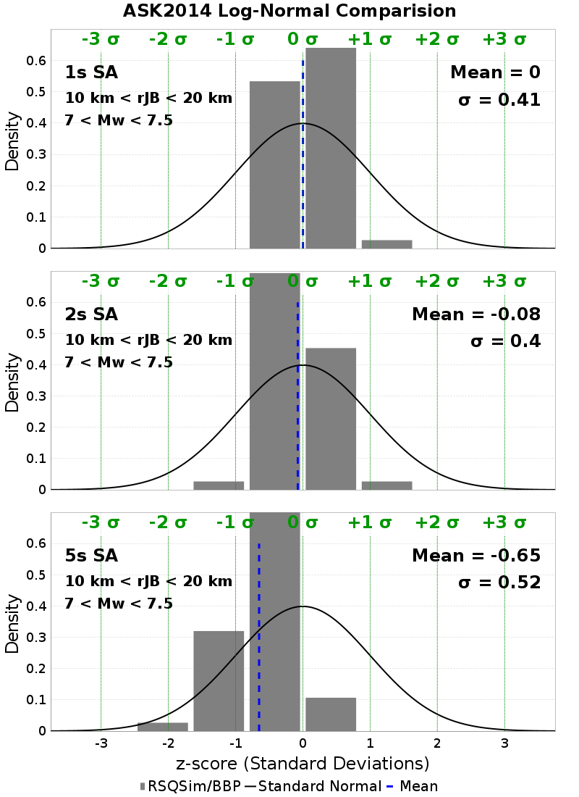
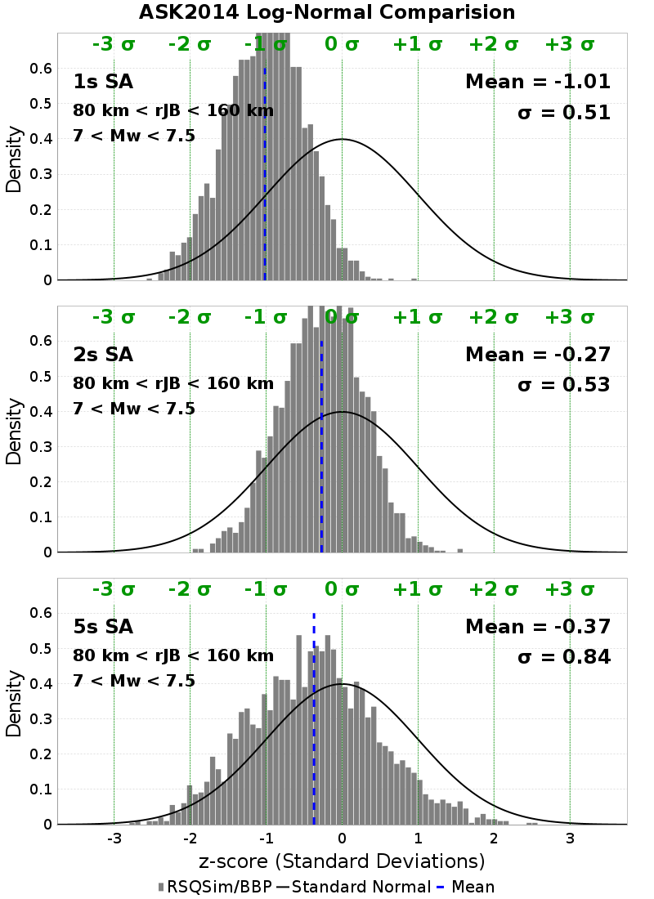
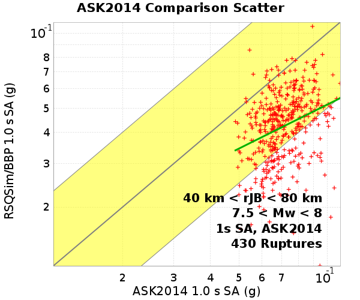
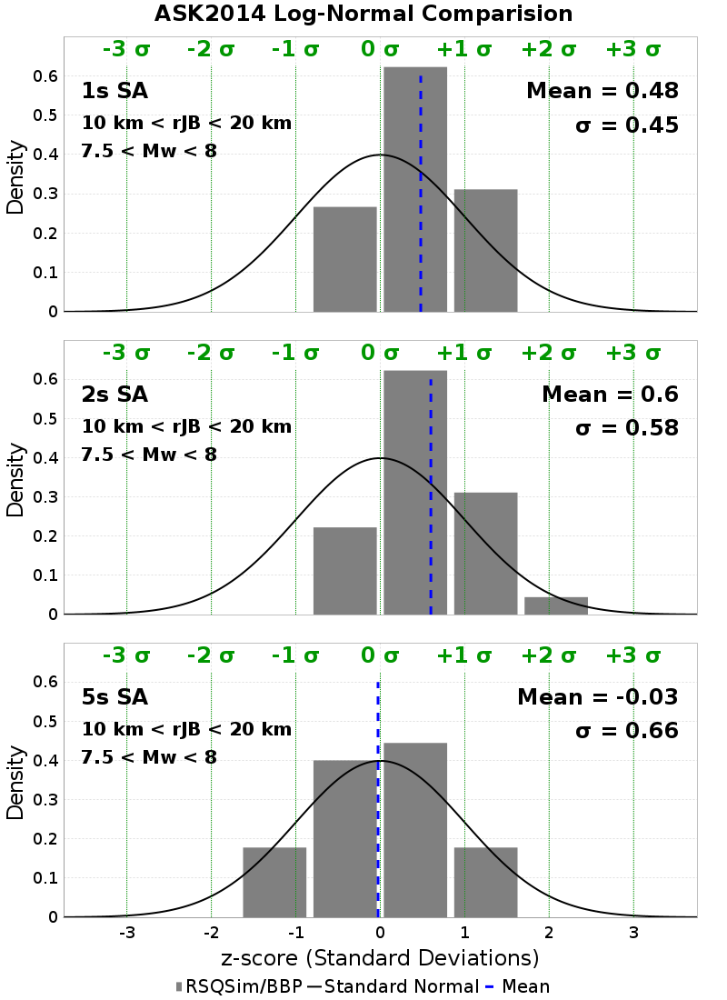
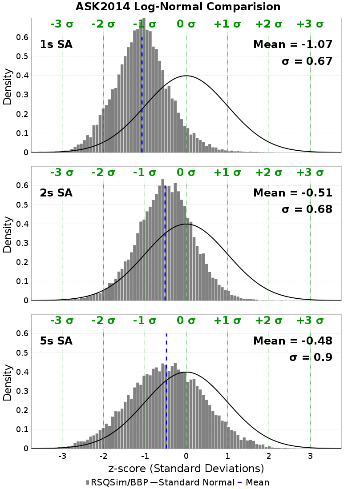

# Bruce 2667 BBP/ASK2014 GMPE Comparisons

**GMPE: Abrahamson, Silva & Kamai (2014)**

Ruptures are binned by their moment magnitude (**Mw**) and the Joyner-Boore distance (**rJB**), the shortest horizontal distance from a site to the surface projection of the rupture surface

[Catalog Details](../#bruce-2667)

## Table Of Contents
* [Site Scatters/Z-Score Histograms](#site-scattersz-score-histograms)
  * [All Sites Aggregated](#all-sites-aggregated)
    * [All Sites, 6 < Mw < 6.5](#all-sites-6--mw--65)
    * [All Sites, 6.5 < Mw < 7](#all-sites-65--mw--7)
    * [All Sites, 7 < Mw < 7.5](#all-sites-7--mw--75)
    * [All Sites, 7.5 < Mw < 8](#all-sites-75--mw--8)
    * [All Sites, All Ruptures, Z-Score Histograms](#all-sites-all-ruptures-z-score-histograms)
* [GMPE Residuals](#gmpe-residuals)
  * [Period-Dependent Residual Components](#period-dependent-residual-components)
  * [Detrended Period-Dependent Residual Components](#detrended-period-dependent-residual-components)
  * [GMPE Magnitude Residuals](#gmpe-magnitude-residuals)
  * [GMPE rJB Residuals](#gmpe-rjb-residuals)
  * [GMPE rRup Residuals](#gmpe-rrup-residuals)
## Site Scatters/Z-Score Histograms
*[(top)](#table-of-contents)*

### All Sites Aggregated
*[(top)](#table-of-contents)*

**35 sites**

| Name | Location | # Ruptures | Vs30 (m/s) | Z1.0 (km) | Z2.5 (km) |
|-----|-----|-----|-----|-----|-----|
| grid0 | *31.5, -117.0* | 304 (304 sims) | 863 | N/A | N/A |
| grid1 | *32.5, -118.0* | 415 (415 sims) | 863 | N/A | N/A |
| grid2 | *32.5, -117.0* | 981 (981 sims) | 863 | N/A | N/A |
| grid3 | *32.5, -116.0* | 862 (862 sims) | 863 | N/A | N/A |
| grid4 | *32.5, -115.0* | 692 (692 sims) | 863 | N/A | N/A |
| grid5 | *32.5, -114.0* | 542 (542 sims) | 863 | N/A | N/A |
| grid6 | *33.5, -120.0* | 250 (250 sims) | 863 | N/A | N/A |
| grid7 | *33.5, -119.0* | 461 (461 sims) | 863 | N/A | N/A |
| grid8 | *33.5, -118.0* | 707 (707 sims) | 863 | N/A | N/A |
| grid9 | *33.5, -117.0* | 1029 (1029 sims) | 863 | N/A | N/A |
| grid10 | *33.5, -116.0* | 996 (996 sims) | 863 | N/A | N/A |
| grid11 | *33.5, -115.0* | 830 (830 sims) | 863 | N/A | N/A |
| grid12 | *33.5, -114.0* | 583 (583 sims) | 863 | N/A | N/A |
| grid13 | *34.5, -121.0* | 232 (232 sims) | 863 | N/A | N/A |
| grid14 | *34.5, -120.0* | 296 (296 sims) | 863 | N/A | N/A |
| grid15 | *34.5, -119.0* | 477 (477 sims) | 863 | N/A | N/A |
| grid16 | *34.5, -118.0* | 704 (704 sims) | 863 | N/A | N/A |
| grid17 | *34.5, -117.0* | 871 (871 sims) | 863 | N/A | N/A |
| grid18 | *34.5, -116.0* | 818 (818 sims) | 863 | N/A | N/A |
| grid19 | *34.5, -115.0* | 602 (602 sims) | 863 | N/A | N/A |
| grid20 | *34.5, -114.0* | 8 (8 sims) | 863 | N/A | N/A |
| grid21 | *35.5, -121.0* | 725 (725 sims) | 863 | N/A | N/A |
| grid22 | *35.5, -120.0* | 734 (734 sims) | 863 | N/A | N/A |
| grid23 | *35.5, -119.0* | 466 (466 sims) | 863 | N/A | N/A |
| grid24 | *35.5, -118.0* | 597 (597 sims) | 863 | N/A | N/A |
| grid25 | *35.5, -117.0* | 594 (594 sims) | 863 | N/A | N/A |
| grid26 | *35.5, -116.0* | 472 (472 sims) | 863 | N/A | N/A |
| grid27 | *35.5, -115.0* | 48 (48 sims) | 863 | N/A | N/A |
| grid28 | *35.5, -114.0* | 0 (0 sims) | 863 | N/A | N/A |
| grid29 | *36.5, -119.0* | 458 (458 sims) | 863 | N/A | N/A |
| grid30 | *36.5, -118.0* | 159 (159 sims) | 863 | N/A | N/A |
| grid31 | *36.5, -117.0* | 134 (134 sims) | 863 | N/A | N/A |
| grid32 | *36.5, -116.0* | 99 (99 sims) | 863 | N/A | N/A |
| grid33 | *37.5, -118.0* | 84 (84 sims) | 863 | N/A | N/A |
| grid34 | *37.5, -117.0* | 90 (90 sims) | 863 | N/A | N/A |

1877 ruptures within 200 km of *any* site
#### All Sites, 6 < Mw < 6.5
553 Ruptures
##### All Sites, 6 < Mw < 6.5, Scatter Plots
*[(top)](#table-of-contents)*

**Legend**
* Red +: GMPE Mean/RSQSim/BBP single rupture comparison
* Yellow Region: Factor of 2 above & below
* Green Line: Linear Regression

| **Distance Bin** | **1 s** | **2 s** | **5 s** |
|-----|-----|-----|-----|
| **0 km < rJB < 10 km** |  |  |  |
| **10 km < rJB < 20 km** |  |  |  |
| **20 km < rJB < 40 km** |  |  |  |
| **40 km < rJB < 80 km** |  |  |  |
| **80 km < rJB < 160 km** |  |  |  |
| **160 km < rJB < 200 km** |  |  |  |
##### All Sites, 6 < Mw < 6.5, Z-Score Histograms
*[(top)](#table-of-contents)*

These plots compare RSQSim/BBP to the full GMPE log-normal distributions. Each rupture's GMPE distribution is converted to a standard log-normal distribution, and the z-score is computed for each rupture:

**z-score**: (ln(*RSQSim/BBP*) - ln(*GMPE-mean*)) / *GMPE-sigma*

**Legend**
* Black Line: Standard Normal distribution (in natural log space)
* Gray Histogram: z-score for each rupture
* Blue Dashed Line: RSQSim/BBP Mean

| **0 km < rJB < 10 km** | **10 km < rJB < 20 km** | **20 km < rJB < 40 km** |
|-----|-----|-----|
|  |  |  |
| **40 km < rJB < 80 km** | **80 km < rJB < 160 km** | **160 km < rJB < 200 km** |
|  |  |  |
#### All Sites, 6.5 < Mw < 7
620 Ruptures
##### All Sites, 6.5 < Mw < 7, Scatter Plots
*[(top)](#table-of-contents)*

**Legend**
* Red +: GMPE Mean/RSQSim/BBP single rupture comparison
* Yellow Region: Factor of 2 above & below
* Green Line: Linear Regression

| **Distance Bin** | **1 s** | **2 s** | **5 s** |
|-----|-----|-----|-----|
| **0 km < rJB < 10 km** |  |  |  |
| **10 km < rJB < 20 km** |  |  |  |
| **20 km < rJB < 40 km** |  |  |  |
| **40 km < rJB < 80 km** |  |  |  |
| **80 km < rJB < 160 km** |  |  |  |
| **160 km < rJB < 200 km** |  |  |  |
##### All Sites, 6.5 < Mw < 7, Z-Score Histograms
*[(top)](#table-of-contents)*

These plots compare RSQSim/BBP to the full GMPE log-normal distributions. Each rupture's GMPE distribution is converted to a standard log-normal distribution, and the z-score is computed for each rupture:

**z-score**: (ln(*RSQSim/BBP*) - ln(*GMPE-mean*)) / *GMPE-sigma*

**Legend**
* Black Line: Standard Normal distribution (in natural log space)
* Gray Histogram: z-score for each rupture
* Blue Dashed Line: RSQSim/BBP Mean

| **0 km < rJB < 10 km** | **10 km < rJB < 20 km** | **20 km < rJB < 40 km** |
|-----|-----|-----|
|  |  |  |
| **40 km < rJB < 80 km** | **80 km < rJB < 160 km** | **160 km < rJB < 200 km** |
|  |  |  |
#### All Sites, 7 < Mw < 7.5
546 Ruptures
##### All Sites, 7 < Mw < 7.5, Scatter Plots
*[(top)](#table-of-contents)*

**Legend**
* Red +: GMPE Mean/RSQSim/BBP single rupture comparison
* Yellow Region: Factor of 2 above & below
* Green Line: Linear Regression

| **Distance Bin** | **1 s** | **2 s** | **5 s** |
|-----|-----|-----|-----|
| **0 km < rJB < 10 km** |  |  |  |
| **10 km < rJB < 20 km** |  |  |  |
| **20 km < rJB < 40 km** |  |  |  |
| **40 km < rJB < 80 km** |  |  |  |
| **80 km < rJB < 160 km** |  |  |  |
| **160 km < rJB < 200 km** |  |  |  |
##### All Sites, 7 < Mw < 7.5, Z-Score Histograms
*[(top)](#table-of-contents)*

These plots compare RSQSim/BBP to the full GMPE log-normal distributions. Each rupture's GMPE distribution is converted to a standard log-normal distribution, and the z-score is computed for each rupture:

**z-score**: (ln(*RSQSim/BBP*) - ln(*GMPE-mean*)) / *GMPE-sigma*

**Legend**
* Black Line: Standard Normal distribution (in natural log space)
* Gray Histogram: z-score for each rupture
* Blue Dashed Line: RSQSim/BBP Mean

| **0 km < rJB < 10 km** | **10 km < rJB < 20 km** | **20 km < rJB < 40 km** |
|-----|-----|-----|
|  |  |  |
| **40 km < rJB < 80 km** | **80 km < rJB < 160 km** | **160 km < rJB < 200 km** |
|  |  |  |
#### All Sites, 7.5 < Mw < 8
158 Ruptures
##### All Sites, 7.5 < Mw < 8, Scatter Plots
*[(top)](#table-of-contents)*

**Legend**
* Red +: GMPE Mean/RSQSim/BBP single rupture comparison
* Yellow Region: Factor of 2 above & below
* Green Line: Linear Regression

| **Distance Bin** | **1 s** | **2 s** | **5 s** |
|-----|-----|-----|-----|
| **0 km < rJB < 10 km** |  |  |  |
| **10 km < rJB < 20 km** |  |  |  |
| **20 km < rJB < 40 km** |  |  |  |
| **40 km < rJB < 80 km** |  |  |  |
| **80 km < rJB < 160 km** |  |  |  |
| **160 km < rJB < 200 km** |  |  |  |
##### All Sites, 7.5 < Mw < 8, Z-Score Histograms
*[(top)](#table-of-contents)*

These plots compare RSQSim/BBP to the full GMPE log-normal distributions. Each rupture's GMPE distribution is converted to a standard log-normal distribution, and the z-score is computed for each rupture:

**z-score**: (ln(*RSQSim/BBP*) - ln(*GMPE-mean*)) / *GMPE-sigma*

**Legend**
* Black Line: Standard Normal distribution (in natural log space)
* Gray Histogram: z-score for each rupture
* Blue Dashed Line: RSQSim/BBP Mean

| **0 km < rJB < 10 km** | **10 km < rJB < 20 km** | **20 km < rJB < 40 km** |
|-----|-----|-----|
|  |  |  |
| **40 km < rJB < 80 km** | **80 km < rJB < 160 km** | **160 km < rJB < 200 km** |
|  |  |  |
#### All Sites, All Ruptures, Z-Score Histograms
*[(top)](#table-of-contents)*

z-score standard normal plots across all magnitudes/distances

**z-score**: (ln(*RSQSim/BBP*) - ln(*GMPE-mean*)) / *GMPE-sigma*

**Legend**
* Black Line: Standard Normal distribution (in natural log space)
* Gray Histogram: z-score for each rupture
* Blue Dashed Line: RSQSim/BBP Mean

## GMPE Residuals
*[(top)](#table-of-contents)*

Residuals of simulation data (RSQSim/BBP) in log space relative to GMPE log-mean

**Legend**
* Black Thick Line: Linear Least-Squares Fit to Residuals
* Black Circles: Binned Linear Least-Squares Fit to Residuals
  * Black Thin Dashes: binned mean ± data sigma
  * Blue Thin Dotted: binned mean ± GMPE sigma

GMPE Residuals use the following values, averaged among all ruptures, for all paremeters which are not varied. All other parameters set to GMPE defaults

| Name | Average Value |
|-----|-----|
| Magnitude | 6.93 |
| rRup | 129.1 |
| rJB | 129.01 |
| Vs30 | 863 |
| Z10 | � |
| Z25 | � |

### Period-Dependent Residual Components
*[(top)](#table-of-contents)*

**Note: These are not yet corrected for covariance. Currently only useful for comparing relative phi and tau, not absolute values**

### Detrended Period-Dependent Residual Components
*[(top)](#table-of-contents)*

**Note: These are not yet corrected for covariance. Currently only useful for comparing relative phi and tau, not absolute values**

Residuals shown here are first detrended according to the following magnitude & log-distance dependent average residuals

| **1s** | **2s** | **5s** |
|-----|-----|-----|
|  |  |  |

### GMPE Magnitude Residuals
*[(top)](#table-of-contents)*

| **1 s** | **2 s** | **5 s** |
|-----|-----|-----|
|  |  |  |
|  |  |  |
### GMPE rJB Residuals
*[(top)](#table-of-contents)*

| **1 s** | **2 s** | **5 s** |
|-----|-----|-----|
|  |  |  |
|  |  |  |
### GMPE rRup Residuals
*[(top)](#table-of-contents)*

| **1 s** | **2 s** | **5 s** |
|-----|-----|-----|
|  |  |  |
|  |  |  |
