# Bruce 2740
## Metadata
| **Catalog** | Bruce 2740 |
|-----|-----|
| **Author** | Bruce Shaw, 2018/06/27 |
| **Description** | FinitePatch fracArea=0.8, 48Hr, all else same as r2585 |
| **Fault/Def Model** | Fault Model 3.1, Geologic |
| **Slip Velocity** | 1.0 m/s |
| **Average Element Area** | 1.35 km^2 |
| **Length** | 4,677,999 events in 258,089 years |
| **Frictional Params** | a=0.001, b=0.008, (b-a)=0.007, ddotEQ=1 |

* [Metadata](#metadata)
* [BBP Calculations, LA Basin 863 (m/s) Velocity Model](#bbp-calculations-la-basin-863-ms-velocity-model)
  * [Single Event Comparisons, LA Basin 863 (m/s)](#single-event-comparisons-la-basin-863-ms)
  * [Full Catalog GMPE Comparisons, LA Basin 863 (m/s)](#full-catalog-gmpe-comparisons-la-basin-863-ms)
  * [Source/Site Ground Motion Comparisons, LA Basin 863 (m/s)](bbp_LA_BASIN_863/source_site_comparisons/)
  * [BBP Part B Analysis, LA Basin 863 (m/s)](bbp_LA_BASIN_863/bbp_part_b)
  * [Rotated Rupture Variability Comparisons, LA Basin 863 (m/s)](#rotated-rupture-variability-comparisons-la-basin-863-ms)
* [BBP Calculations, LA Basin 500 (m/s) Velocity Model](#bbp-calculations-la-basin-500-ms-velocity-model)
  * [Rotated Rupture Variability Comparisons, LA Basin 500 (m/s)](#rotated-rupture-variability-comparisons-la-basin-500-ms)
* [BBP PartB Summary](bbp_part_b_summary/)
* [BBP Velocity Model Comparisons](bbp_vm_rot_rup_compare/)
* [Plots](#plots)
  * [Magnitude-Frequency Plot](#magnitude-frequency-plot)
  * [Magnitude-Area Plots](#magnitude-area-plots)
  * [Slip-Area Plots](#slip-area-plots)
  * [Rupture Velocity Plots](#rupture-velocity-plots)
  * [Global Interevent-Time Distributions](#global-interevent-time-distributions)
  * [Normalized Fault Interevent-Time Distributions](#normalized-fault-interevent-time-distributions)
  * [Stationarity Plot](#stationarity-plot)
  * [Element/Subsection Interevent Time Comparisons](#elementsubsection-interevent-time-comparisons)
    * [Element Interevent Time Comparisons](#element-interevent-time-comparisons)
    * [Subsection Interevent Time Comparisons](#subsection-interevent-time-comparisons)
* [Input File](#input-file)

## BBP Calculations, LA Basin 863 (m/s) Velocity Model
*[(top)](#bruce-2740)*


### Single Event Comparisons, LA Basin 863 (m/s)
*[(top)](#bruce-2740)*

* [Event 385955, M7.49](bbp_LA_BASIN_863/event_385955/)

### Full Catalog GMPE Comparisons, LA Basin 863 (m/s)
*[(top)](#bruce-2740)*

* [ASK2014](bbp_LA_BASIN_863/gmpe_bbp_comparisons_ASK2014/)
* [ASK2014, Focal Mechanism: Normal](bbp_LA_BASIN_863/gmpe_bbp_comparisons_ASK2014_mech_normal/)
* [ASK2014, Focal Mechanism: Reverse](bbp_LA_BASIN_863/gmpe_bbp_comparisons_ASK2014_mech_reverse/)
* [ASK2014, Focal Mechanism: Vertical Strike-Slip](bbp_LA_BASIN_863/gmpe_bbp_comparisons_ASK2014_mech_vert_ss/)
* [NGAWest_2014_NoIdr](bbp_LA_BASIN_863/gmpe_bbp_comparisons_NGAWest_2014_NoIdr/)

### Source/Site Ground Motion Comparisons, LA Basin 863 (m/s)
*[(top)](#bruce-2740)*

[Source/Site Ground Motion Comparisons here](bbp_LA_BASIN_863/source_site_comparisons/)

### BBP Part B Analysis, LA Basin 863 (m/s)
*[(top)](#bruce-2740)*

[BBP Part B Analysis Here](bbp_LA_BASIN_863/bbp_part_b)

### Rotated Rupture Variability Comparisons, LA Basin 863 (m/s)
*[(top)](#bruce-2740)*

* [M6.6, Reverse, Dip=45, Ztor=3](bbp_LA_BASIN_863/rotated_ruptures_m6p6_reverse/)
* [M6.6, Vertical Strike-Slip with Surface Rupture](bbp_LA_BASIN_863/rotated_ruptures_m6p6_vert_ss_surface/)
* [M7.2, Reverse, Dip=45](bbp_LA_BASIN_863/rotated_ruptures_m7p2_reverse/)
* [M7.2, Vertical Strike-Slip with Surface Rupture](bbp_LA_BASIN_863/rotated_ruptures_m7p2_vert_ss_surface/)
* [M7.6, Reverse, Dip=45](bbp_LA_BASIN_863/rotated_ruptures_m7p6_reverse/)
* [M7.6, Vertical Strike-Slip with Surface Rupture](bbp_LA_BASIN_863/rotated_ruptures_m7p6_vert_ss_surface/)
* [Normal, Dip=45, Mag-Dist Bins](bbp_LA_BASIN_863/rotated_ruptures_mag_dist_normal/)
* [Reverse, Dip=45, Mag-Dist Bins](bbp_LA_BASIN_863/rotated_ruptures_mag_dist_reverse/)
* [Vertical Strike-Slip with Surface Rupture, Mag-Dist Bins](bbp_LA_BASIN_863/rotated_ruptures_mag_dist_vert_ss_surface/)

## BBP Calculations, LA Basin 500 (m/s) Velocity Model
*[(top)](#bruce-2740)*


### Rotated Rupture Variability Comparisons, LA Basin 500 (m/s)
*[(top)](#bruce-2740)*

* [M6.6, Reverse, Dip=45, Ztor=3](bbp_LA_BASIN_500/rotated_ruptures_m6p6_reverse/)
* [M6.6, Vertical Strike-Slip with Surface Rupture](bbp_LA_BASIN_500/rotated_ruptures_m6p6_vert_ss_surface/)
* [M7.2, Reverse, Dip=45](bbp_LA_BASIN_500/rotated_ruptures_m7p2_reverse/)
* [M7.2, Vertical Strike-Slip with Surface Rupture](bbp_LA_BASIN_500/rotated_ruptures_m7p2_vert_ss_surface/)
* [M7.6, Reverse, Dip=45](bbp_LA_BASIN_500/rotated_ruptures_m7p6_reverse/)
* [M7.6, Vertical Strike-Slip with Surface Rupture](bbp_LA_BASIN_500/rotated_ruptures_m7p6_vert_ss_surface/)

## BBP PartB Summary
*[(top)](#bruce-2740)*

[BBP PartB Summary Here](bbp_part_b_summary/)

## BBP Velocity Model Comparisons
*[(top)](#bruce-2740)*

[BBP Velocity Model Comparisons Here](bbp_vm_rot_rup_compare/)

## Plots
### Magnitude-Frequency Plot
*[(top)](#bruce-2740)*


### Magnitude-Area Plots
*[(top)](#bruce-2740)*

| Scatter | 2-D Hist |
|-----|-----|
|  |  |
### Slip-Area Plots
*[(top)](#bruce-2740)*

| Scatter | 2-D Hist |
|-----|-----|
|  | 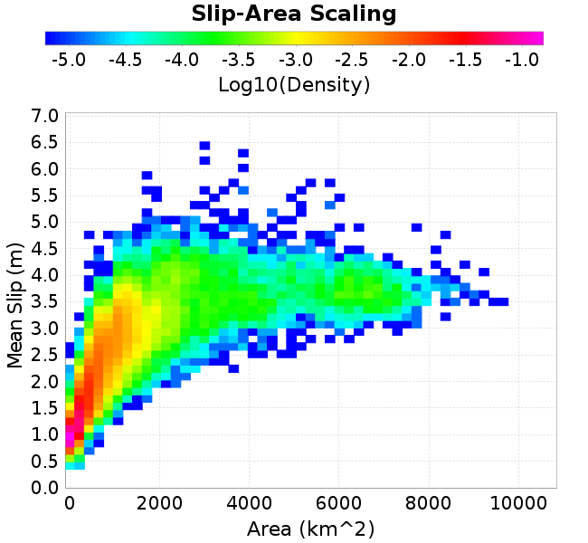 |
### Rupture Velocity Plots
*[(top)](#bruce-2740)*

| **Scatter** | 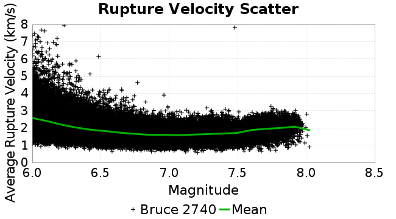 |
|-----|-----|
| **Distance/Velocity** |  |
### Global Interevent-Time Distributions
*[(top)](#bruce-2740)*

| **M≥6** | **M≥6.5** | **M≥7** | **M≥7.5** |
|-----|-----|-----|-----|
|  |  |  | 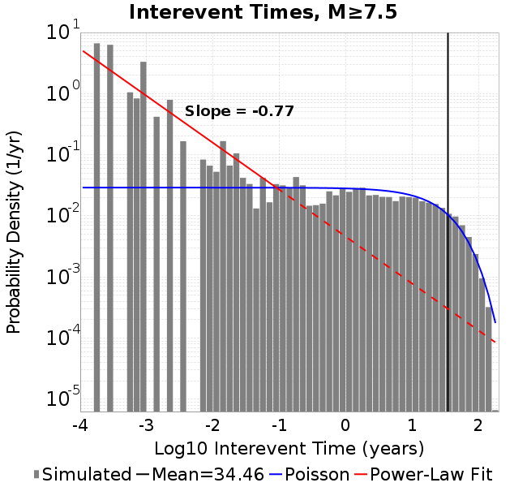 |
### Normalized Fault Interevent-Time Distributions
*[(top)](#bruce-2740)*

|  | **M≥6** | **M≥6.5** | **M≥7** | **M≥7.5** |
|-----|-----|-----|-----|-----|
| **Elements** |  |  | 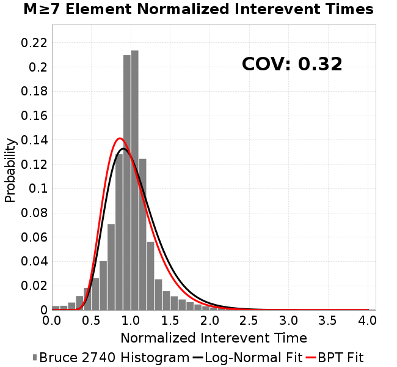 |  |
| **Subsections** |  | 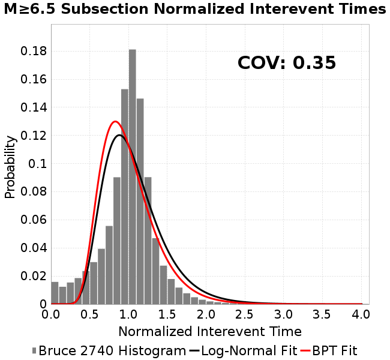 |  |  |
| **Sections** | 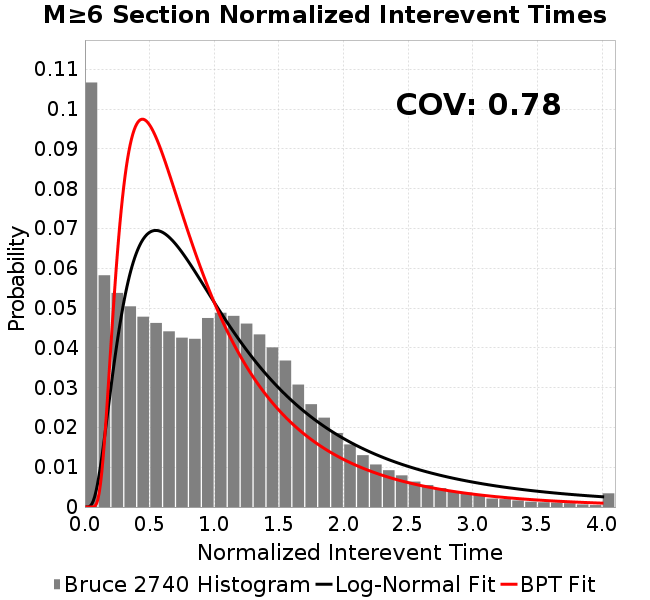 |  | 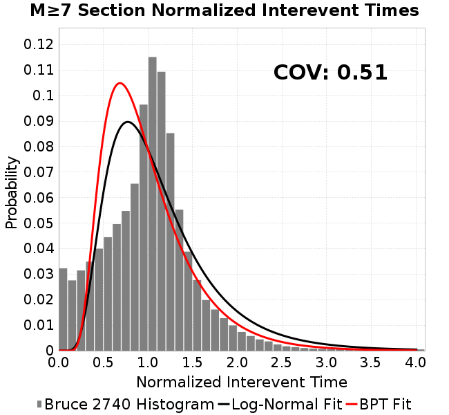 | 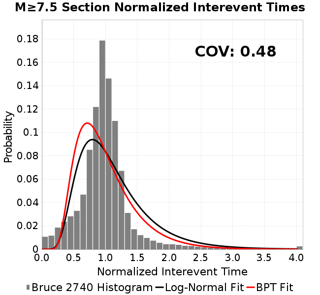 |
### Stationarity Plot
*[(top)](#bruce-2740)*

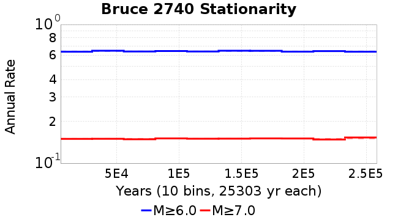
### Element/Subsection Interevent Time Comparisons

#### Element Interevent Time Comparisons
*[(top)](#bruce-2740)*

| Min Mag | Scatter | 2-D Hist |
|-----|-----|-----|
| **M≥6.0** |  | 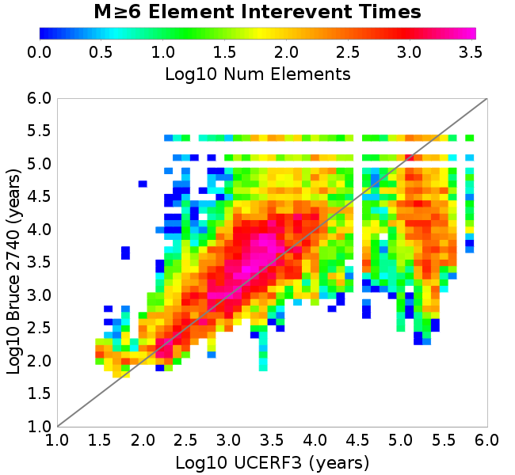 |
| **M≥6.5** |  |  |
| **M≥7.0** |  |  |
| **M≥7.5** |  |  |

#### Subsection Interevent Time Comparisons
*[(top)](#bruce-2740)*

*Subsections participate in a rupture if at least 20.0 % of its area ruptures*

| Min Mag | Scatter | 2-D Hist |
|-----|-----|-----|
| **M≥6.0** |  | 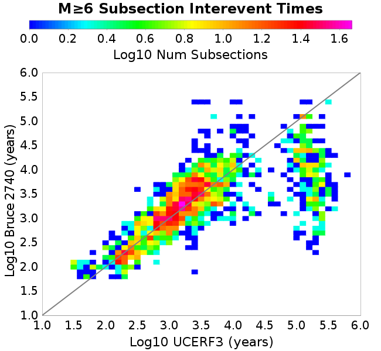 |
| **M≥6.5** |  |  |
| **M≥7.0** |  |  |
| **M≥7.5** |  |  |

## Input File
*[(top)](#bruce-2740)*

```
  A_1 = 0.001
  fA = .1
  B_1 = 0.008
  muSlipAmp_1 = .0
  muSlipInvDist_1 = 1.0
  cohesion = 0.0
  Dc_1 = 1.0000000000000000818e-05
  mu0_1 = 0.6
  ddotStar_1 = 9.9999999999999995475e-07
  ddotAB_1 = 9.9999999999999995475e-07
  alpha_1 = 0.0
  theta0_1 = 200000000
  tau0_1 = 55.1
  sigma0_1 = 100
  sigmaFracPin = .5
  lowSigmaAction = 1
  maxThetaPin = 1.0e13
  ddotEQ_1 = 1
  ddotEQFname = 
  stressOvershootFactor = 0.10000000000000000555
  lameLambda = 30000
  lameMu = 30000
  slowSlip_1 = 0
  nEq = 10000000
  KZeroFrac = 0
  KOneFrac =  0
  muPin = 1.0
  tStart = 0
  maxT = 1.0000000000000000159e+100
  maxTransitions = 1.0000000000000000159e+8
  faultFname = zfault_Deepen.in
  outFnameInfix = 
  writeTau = 0
  writeSigma = 0
  writeSlip = 0
  writeSlipSpeed = 0
  writeState = 0
  writeTheta = 0
  writePED = 1
  writeTransitions = 1
  minDtWrite = 0
  minDtWriteCoseismic = 0
  minDtWriteInterseismic = 0
  minMagWrite = 0
  writeStiffness = 0
  stressRateSpecification = 1
  dMu3 = 0.01000000000000000
  initTauFname = 
  initSigmaFname = 
  initThetaFname = 
  initSlipSpeedFname = 
  AFname = 
  BFname =  
  DcFname = 
  mu0Fname = 
  ddotStarFname = 
  ddotABFname = 
  alphaFname = 
  KTauFname = 
  KSigmaFname = 
  tFailFname = 
  tauFailFname = 
  tauDotFname = 
  sigmaDotFname =
  KZeroFname = zfault_Deepen_KZero.in
  pinnedFname =  
  neighborFname = zfault_Deepen_neighbors.in
  stressRateFname =  
  slowSlipFname = 
  writePatchFname = 
  DEBUG = 0
  ZBrentUpperBracket = 0
  receiverElementAreaFrac = 0.8
  receiverElementIntTol = 1.0e-4
  receiverElementSubdivisionMax = 4
  tgfDist1 = 3
  tgfDist1 = 10
```
