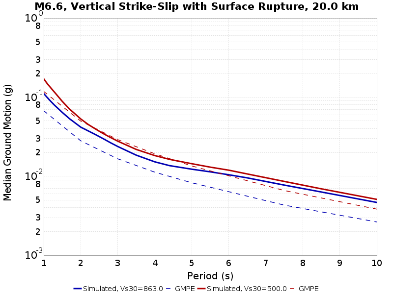
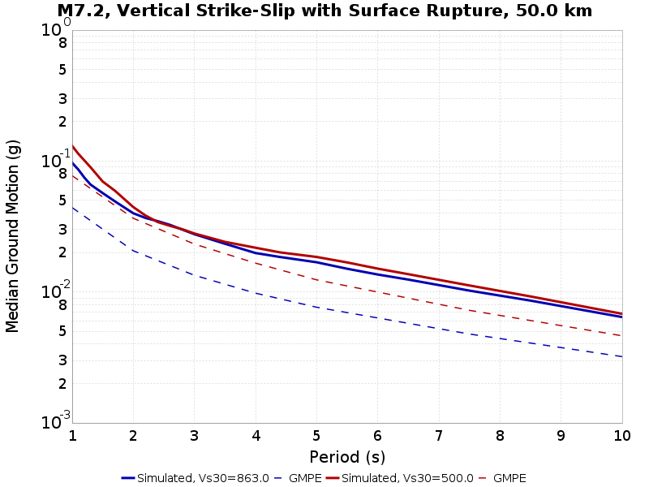

# Scenario-Based BBP Velocity Model Comparisons

This page contains comparisons of BBP simulations for the same RSQSim catalog with different 1-dimensional layered velocity structures. Simulations are done for various scenario ruptures (we search the RSQSim catalog for matching events). This page uses results computed for the rupture rotation variability study.

The following velocity models are shown:

* LA_BASIN_863, Vs30=863.0 m/s
* LA_BASIN_500, Vs30=500.0 m/s

We compare results with the following GMPE(s):

* Abrahamson, Silva & Kamai (2014)
* Boore, Stewart, Seyhan & Atkinson (2014)
* Campbell & Bozorgnia (2014)
* Chiou & Youngs (2014)

## Table Of Contents
* [M6.6, Vertical Strike-Slip with Surface Rupture](#m66-vertical-strike-slip-with-surface-rupture)
  * [M6.6, Vertical Strike-Slip with Surface Rupture, 20.0 km](#m66-vertical-strike-slip-with-surface-rupture-200-km)
  * [M6.6, Vertical Strike-Slip with Surface Rupture, 50.0 km](#m66-vertical-strike-slip-with-surface-rupture-500-km)
  * [M6.6, Vertical Strike-Slip with Surface Rupture, 100.0 km](#m66-vertical-strike-slip-with-surface-rupture-1000-km)
* [M6.6, Reverse, Dip=45, Ztor=3](#m66-reverse-dip45-ztor3)
  * [M6.6, Reverse, Dip=45, Ztor=3, 20.0 km](#m66-reverse-dip45-ztor3-200-km)
  * [M6.6, Reverse, Dip=45, Ztor=3, 50.0 km](#m66-reverse-dip45-ztor3-500-km)
  * [M6.6, Reverse, Dip=45, Ztor=3, 100.0 km](#m66-reverse-dip45-ztor3-1000-km)
* [M7.2, Vertical Strike-Slip with Surface Rupture](#m72-vertical-strike-slip-with-surface-rupture)
  * [M7.2, Vertical Strike-Slip with Surface Rupture, 20.0 km](#m72-vertical-strike-slip-with-surface-rupture-200-km)
  * [M7.2, Vertical Strike-Slip with Surface Rupture, 50.0 km](#m72-vertical-strike-slip-with-surface-rupture-500-km)
  * [M7.2, Vertical Strike-Slip with Surface Rupture, 100.0 km](#m72-vertical-strike-slip-with-surface-rupture-1000-km)
* [M7.2, Reverse, Dip=45](#m72-reverse-dip45)
  * [M7.2, Reverse, Dip=45, 20.0 km](#m72-reverse-dip45-200-km)
  * [M7.2, Reverse, Dip=45, 50.0 km](#m72-reverse-dip45-500-km)
  * [M7.2, Reverse, Dip=45, 100.0 km](#m72-reverse-dip45-1000-km)
* [M7.6, Vertical Strike-Slip with Surface Rupture](#m76-vertical-strike-slip-with-surface-rupture)
  * [M7.6, Vertical Strike-Slip with Surface Rupture, 20.0 km](#m76-vertical-strike-slip-with-surface-rupture-200-km)
  * [M7.6, Vertical Strike-Slip with Surface Rupture, 50.0 km](#m76-vertical-strike-slip-with-surface-rupture-500-km)
  * [M7.6, Vertical Strike-Slip with Surface Rupture, 100.0 km](#m76-vertical-strike-slip-with-surface-rupture-1000-km)
* [M7.6, Reverse, Dip=45](#m76-reverse-dip45)
  * [M7.6, Reverse, Dip=45, 20.0 km](#m76-reverse-dip45-200-km)
  * [M7.6, Reverse, Dip=45, 50.0 km](#m76-reverse-dip45-500-km)
  * [M7.6, Reverse, Dip=45, 100.0 km](#m76-reverse-dip45-1000-km)
## M6.6, Vertical Strike-Slip with Surface Rupture
*[(top)](#table-of-contents)*

Scenario Criteria:

* M=[6.55,6.65]
* Ztor=[0,1]
* Rake=[-180,-170] or [-10,10] or [170,180]
* Dip=90
* Linear rupture (max 0.5km deviation from ideal)

### M6.6, Vertical Strike-Slip with Surface Rupture, 20.0 km
*[(top)](#table-of-contents)*

### M6.6, Vertical Strike-Slip with Surface Rupture, 50.0 km
*[(top)](#table-of-contents)*

### M6.6, Vertical Strike-Slip with Surface Rupture, 100.0 km
*[(top)](#table-of-contents)*

## M6.6, Reverse, Dip=45, Ztor=3
*[(top)](#table-of-contents)*

Scenario Criteria:

* M=[6.55,6.65]
* Ztor=[1,5]
* Rake=[75,105]
* Dip=[35,55]

### M6.6, Reverse, Dip=45, Ztor=3, 20.0 km
*[(top)](#table-of-contents)*

### M6.6, Reverse, Dip=45, Ztor=3, 50.0 km
*[(top)](#table-of-contents)*

### M6.6, Reverse, Dip=45, Ztor=3, 100.0 km
*[(top)](#table-of-contents)*

## M7.2, Vertical Strike-Slip with Surface Rupture
*[(top)](#table-of-contents)*

Scenario Criteria:

* M=[7.15,7.25]
* Ztor=[0,1]
* Rake=[-180,-170] or [-10,10] or [170,180]
* Dip=90
* Linear rupture (max 5% deviation from ideal)

### M7.2, Vertical Strike-Slip with Surface Rupture, 20.0 km
*[(top)](#table-of-contents)*

### M7.2, Vertical Strike-Slip with Surface Rupture, 50.0 km
*[(top)](#table-of-contents)*

### M7.2, Vertical Strike-Slip with Surface Rupture, 100.0 km
*[(top)](#table-of-contents)*

## M7.2, Reverse, Dip=45
*[(top)](#table-of-contents)*

Scenario Criteria:

* M=[7.15,7.25]
* Ztor=[0,5]
* Rake=[75,105]
* Dip=[35,55]

### M7.2, Reverse, Dip=45, 20.0 km
*[(top)](#table-of-contents)*

### M7.2, Reverse, Dip=45, 50.0 km
*[(top)](#table-of-contents)*

### M7.2, Reverse, Dip=45, 100.0 km
*[(top)](#table-of-contents)*

## M7.6, Vertical Strike-Slip with Surface Rupture
*[(top)](#table-of-contents)*

Scenario Criteria:

* M=[7.55,7.65]
* Ztor=[0,1]
* Rake=[-180,-170] or [-10,10] or [170,180]
* Dip=90
* Linear rupture (max 5% deviation from ideal)

### M7.6, Vertical Strike-Slip with Surface Rupture, 20.0 km
*[(top)](#table-of-contents)*

### M7.6, Vertical Strike-Slip with Surface Rupture, 50.0 km
*[(top)](#table-of-contents)*

### M7.6, Vertical Strike-Slip with Surface Rupture, 100.0 km
*[(top)](#table-of-contents)*

## M7.6, Reverse, Dip=45
*[(top)](#table-of-contents)*

Scenario Criteria:

* M=[7.55,7.65]
* Ztor=[0,5]
* Rake=[75,105]
* Dip=[35,55]

### M7.6, Reverse, Dip=45, 20.0 km
*[(top)](#table-of-contents)*

### M7.6, Reverse, Dip=45, 50.0 km
*[(top)](#table-of-contents)*

### M7.6, Reverse, Dip=45, 100.0 km
*[(top)](#table-of-contents)*

