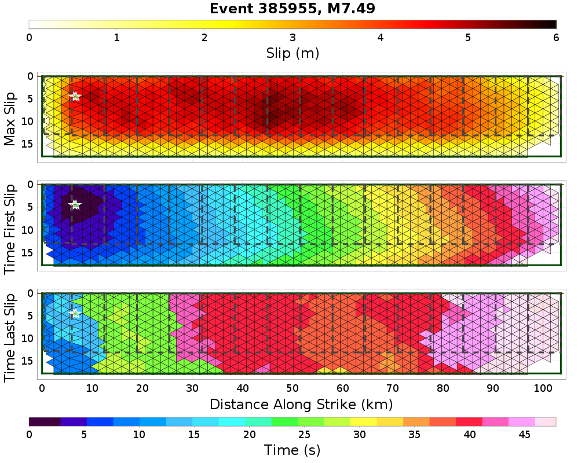
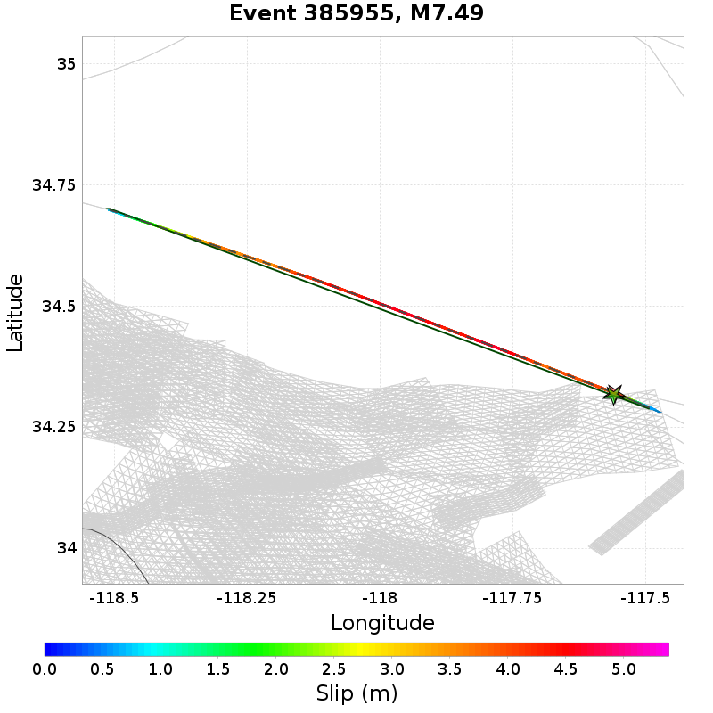
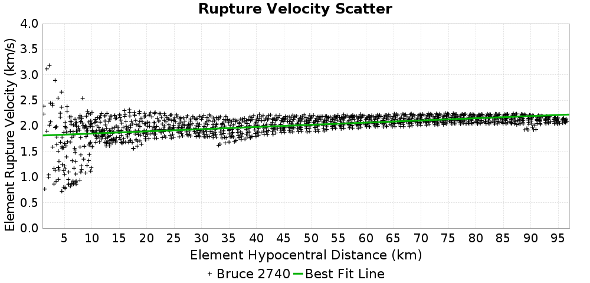
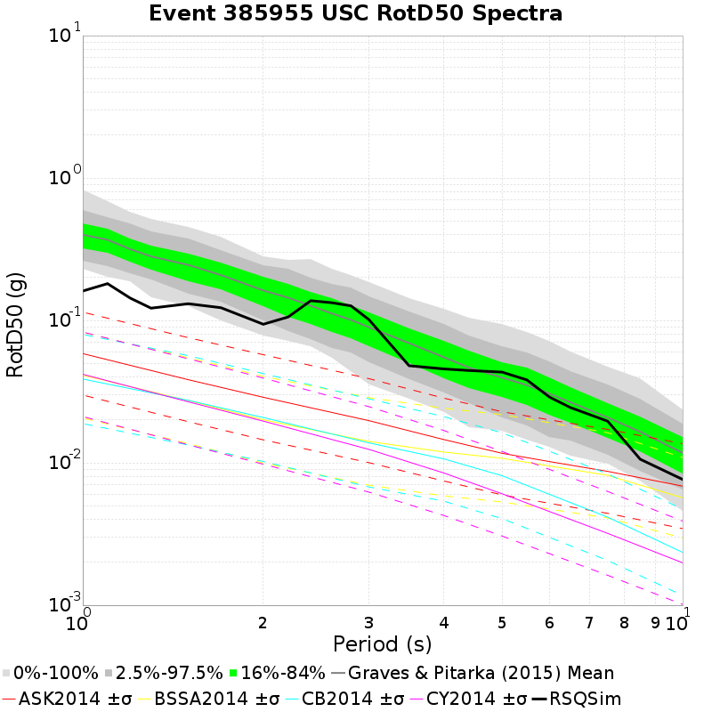
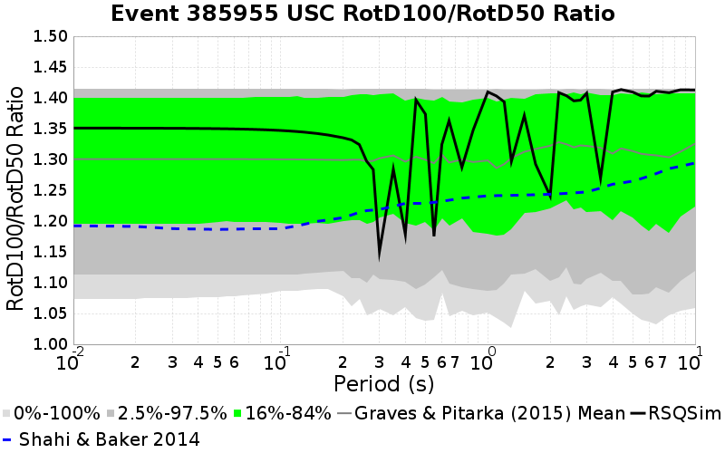
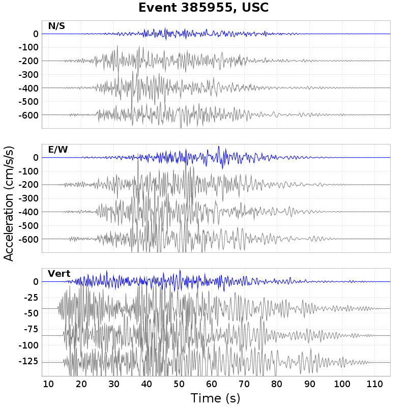
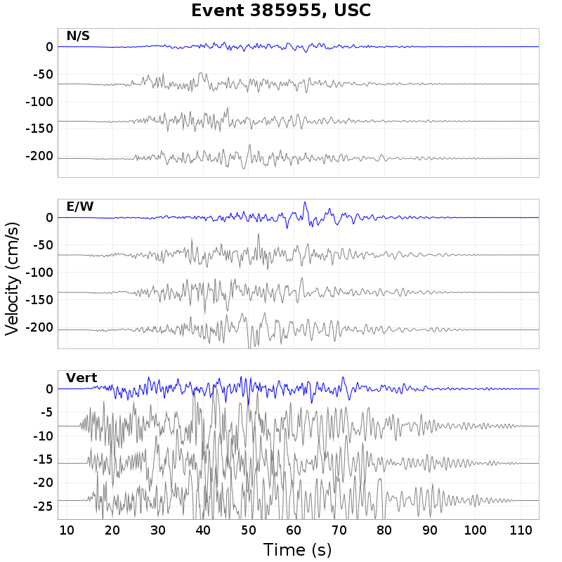
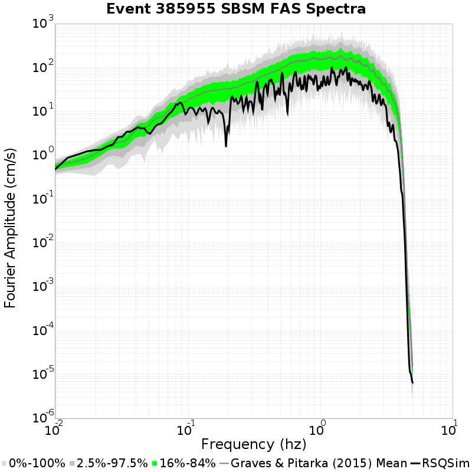
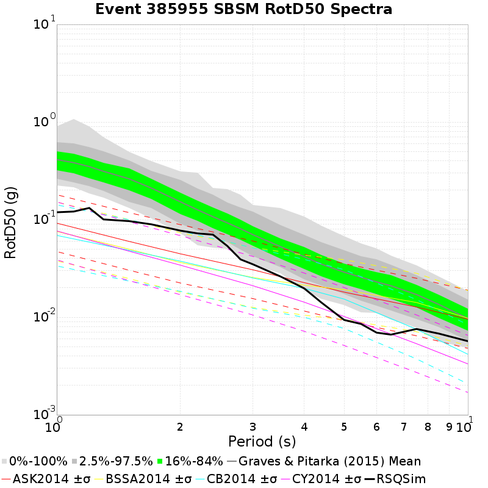
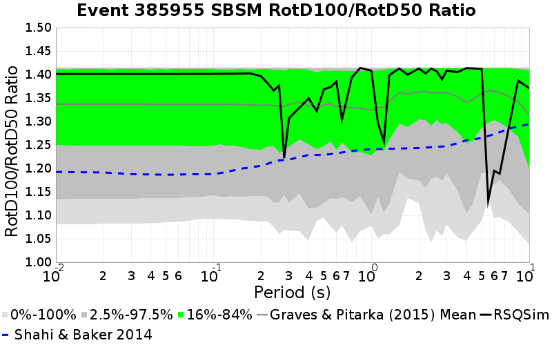

# Event 385955, M7.49

[Catalog Details](../#bruce-2740)

## Table Of Contents
* [Fault List](#fault-list)
* [Rupture Plots](#rupture-plots)
  * [Slip/Time Plot](#sliptime-plot)
  * [Slip/Vel Animation](#slipvel-animation)
  * [Map Plot](#map-plot)
  * [Rupture Velocity Plot](#rupture-velocity-plot)
* [Spectra Plots](#spectra-plots)
  * [Site USC](#site-usc)
    * [USC Fourier Amplitude Spectra](#usc-fourier-amplitude-spectra)
    * [USC RotD50 Spectra](#usc-rotd50-spectra)
    * [USC RotD Ratio](#usc-rotd-ratio)
    * [USC Acceleration Seismograms](#usc-acceleration-seismograms)
    * [USC Velocity Seismograms](#usc-velocity-seismograms)
  * [Site SBSM](#site-sbsm)
    * [SBSM Fourier Amplitude Spectra](#sbsm-fourier-amplitude-spectra)
    * [SBSM RotD50 Spectra](#sbsm-rotd50-spectra)
    * [SBSM RotD Ratio](#sbsm-rotd-ratio)
    * [SBSM Acceleration Seismograms](#sbsm-acceleration-seismograms)
    * [SBSM Velocity Seismograms](#sbsm-velocity-seismograms)
  * [Site Los Angeles](#site-los-angeles)
    * [Los Angeles Fourier Amplitude Spectra](#los-angeles-fourier-amplitude-spectra)
    * [Los Angeles RotD50 Spectra](#los-angeles-rotd50-spectra)
    * [Los Angeles RotD Ratio](#los-angeles-rotd-ratio)
    * [Los Angeles Acceleration Seismograms](#los-angeles-acceleration-seismograms)
    * [Los Angeles Velocity Seismograms](#los-angeles-velocity-seismograms)
  * [Site Riverside](#site-riverside)
    * [Riverside Fourier Amplitude Spectra](#riverside-fourier-amplitude-spectra)
    * [Riverside RotD50 Spectra](#riverside-rotd50-spectra)
    * [Riverside RotD Ratio](#riverside-rotd-ratio)
    * [Riverside Acceleration Seismograms](#riverside-acceleration-seismograms)
    * [Riverside Velocity Seismograms](#riverside-velocity-seismograms)
  * [Site San Diego](#site-san-diego)
    * [San Diego Fourier Amplitude Spectra](#san-diego-fourier-amplitude-spectra)
    * [San Diego RotD50 Spectra](#san-diego-rotd50-spectra)
    * [San Diego RotD Ratio](#san-diego-rotd-ratio)
    * [San Diego Acceleration Seismograms](#san-diego-acceleration-seismograms)
    * [San Diego Velocity Seismograms](#san-diego-velocity-seismograms)
  * [Site Santa Barbara](#site-santa-barbara)
    * [Santa Barbara Fourier Amplitude Spectra](#santa-barbara-fourier-amplitude-spectra)
    * [Santa Barbara RotD50 Spectra](#santa-barbara-rotd50-spectra)
    * [Santa Barbara RotD Ratio](#santa-barbara-rotd-ratio)
    * [Santa Barbara Acceleration Seismograms](#santa-barbara-acceleration-seismograms)
    * [Santa Barbara Velocity Seismograms](#santa-barbara-velocity-seismograms)
## Fault List
*[(top)](#table-of-contents)*

| Section Name | Area Ruptured | Patches Ruptured | Moment | Equiv. Mag | Max Slip |
|-----|-----|-----|-----|-----|-----|
| *(Total)* | 1837.95 km^2 | 1359 | 1.94e20 N-m | M7.49 | 5.39 m |
| San Andreas (Mojave S) | 1735.58 km^2 | 1283 | 1.88e20 N-m | M7.48 | 5.39 m |
| San Andreas (San Bernardino N) | 102.37 km^2 | 76 | 5.60e18 N-m | M6.47 | 4.03 m |

## Rupture Plots
*[(top)](#table-of-contents)*

**Legend**
* Colored, Filled Triangles: RSQSim Elements
* Red Star: RSQSim Hypocenter
* Dark Gray Dashed Outline: GMPE Surface

### Slip/Time Plot
*[(top)](#table-of-contents)*

### Slip/Vel Animation
*[(top)](#table-of-contents)*

[Click here to view Slip/Velocity Animation](resources/rupture_plot_385955.gif)
### Map Plot
*[(top)](#table-of-contents)*

### Rupture Velocity Plot
*[(top)](#table-of-contents)*

## Spectra Plots
*[(top)](#table-of-contents)*

### Site USC
*[(top)](#table-of-contents)*

*Location: 34.0192, -118.286*

| Distance | Actual RSQSim Surface | GMPE Surface |
|-----|-----|-----|
| Horizontal | 60.07 km | 60.07 km |
| 3-D | 60.07 km | 60.07 km |

*NOTE: RSQSim ruptures sometimes have a few co-rupturing elements on faults some distance from the main rupture. This may cause discrepancies in the table above, consult rupture map plot.*
#### USC Fourier Amplitude Spectra
*[(top)](#table-of-contents)*

#### USC RotD50 Spectra
*[(top)](#table-of-contents)*

#### USC RotD Ratio
*[(top)](#table-of-contents)*

#### USC Acceleration Seismograms
*[(top)](#table-of-contents)*

#### USC Velocity Seismograms
*[(top)](#table-of-contents)*

### Site SBSM
*[(top)](#table-of-contents)*

*Location: 34.064987, -117.29201*

| Distance | Actual RSQSim Surface | GMPE Surface |
|-----|-----|-----|
| Horizontal | 29.40 km | 31.15 km |
| 3-D | 30.75 km | 31.15 km |

*NOTE: RSQSim ruptures sometimes have a few co-rupturing elements on faults some distance from the main rupture. This may cause discrepancies in the table above, consult rupture map plot.*
#### SBSM Fourier Amplitude Spectra
*[(top)](#table-of-contents)*

#### SBSM RotD50 Spectra
*[(top)](#table-of-contents)*

#### SBSM RotD Ratio
*[(top)](#table-of-contents)*

#### SBSM Acceleration Seismograms
*[(top)](#table-of-contents)*

#### SBSM Velocity Seismograms
*[(top)](#table-of-contents)*

### Site Los Angeles
*[(top)](#table-of-contents)*

*Location: 34.05, -118.25*

| Distance | Actual RSQSim Surface | GMPE Surface |
|-----|-----|-----|
| Horizontal | 55.53 km | 55.53 km |
| 3-D | 55.53 km | 55.53 km |

*NOTE: RSQSim ruptures sometimes have a few co-rupturing elements on faults some distance from the main rupture. This may cause discrepancies in the table above, consult rupture map plot.*
#### Los Angeles Fourier Amplitude Spectra
*[(top)](#table-of-contents)*

#### Los Angeles RotD50 Spectra
*[(top)](#table-of-contents)*

#### Los Angeles RotD Ratio
*[(top)](#table-of-contents)*

#### Los Angeles Acceleration Seismograms
*[(top)](#table-of-contents)*

#### Los Angeles Velocity Seismograms
*[(top)](#table-of-contents)*

### Site Riverside
*[(top)](#table-of-contents)*

*Location: 33.95, -117.4*

| Distance | Actual RSQSim Surface | GMPE Surface |
|-----|-----|-----|
| Horizontal | 37.52 km | 38.81 km |
| 3-D | 38.57 km | 38.81 km |

*NOTE: RSQSim ruptures sometimes have a few co-rupturing elements on faults some distance from the main rupture. This may cause discrepancies in the table above, consult rupture map plot.*
#### Riverside Fourier Amplitude Spectra
*[(top)](#table-of-contents)*

#### Riverside RotD50 Spectra
*[(top)](#table-of-contents)*

#### Riverside RotD Ratio
*[(top)](#table-of-contents)*

#### Riverside Acceleration Seismograms
*[(top)](#table-of-contents)*

#### Riverside Velocity Seismograms
*[(top)](#table-of-contents)*

### Site San Diego
*[(top)](#table-of-contents)*

*Location: 32.7, -117.15*

| Distance | Actual RSQSim Surface | GMPE Surface |
|-----|-----|-----|
| Horizontal | 178.43 km | 179.68 km |
| 3-D | 178.66 km | 179.68 km |

*NOTE: RSQSim ruptures sometimes have a few co-rupturing elements on faults some distance from the main rupture. This may cause discrepancies in the table above, consult rupture map plot.*
#### San Diego Fourier Amplitude Spectra
*[(top)](#table-of-contents)*

#### San Diego RotD50 Spectra
*[(top)](#table-of-contents)*

#### San Diego RotD Ratio
*[(top)](#table-of-contents)*

#### San Diego Acceleration Seismograms
*[(top)](#table-of-contents)*

#### San Diego Velocity Seismograms
*[(top)](#table-of-contents)*

### Site Santa Barbara
*[(top)](#table-of-contents)*

*Location: 34.45, -119.7*

| Distance | Actual RSQSim Surface | GMPE Surface |
|-----|-----|-----|
| Horizontal | 112.50 km | 112.50 km |
| 3-D | 112.51 km | 112.50 km |

*NOTE: RSQSim ruptures sometimes have a few co-rupturing elements on faults some distance from the main rupture. This may cause discrepancies in the table above, consult rupture map plot.*
#### Santa Barbara Fourier Amplitude Spectra
*[(top)](#table-of-contents)*

#### Santa Barbara RotD50 Spectra
*[(top)](#table-of-contents)*

#### Santa Barbara RotD Ratio
*[(top)](#table-of-contents)*

#### Santa Barbara Acceleration Seismograms
*[(top)](#table-of-contents)*

#### Santa Barbara Velocity Seismograms
*[(top)](#table-of-contents)*

