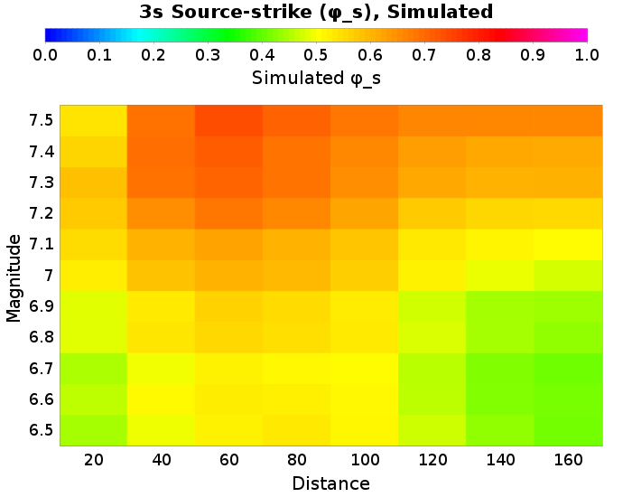
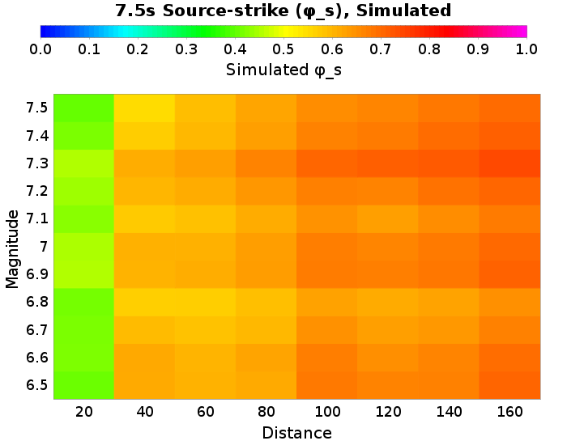
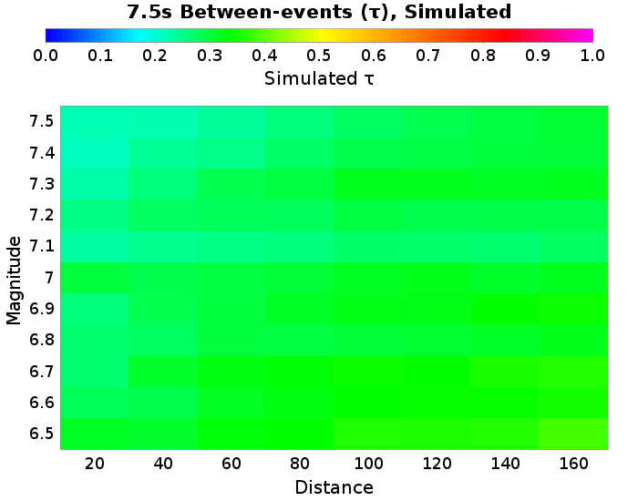
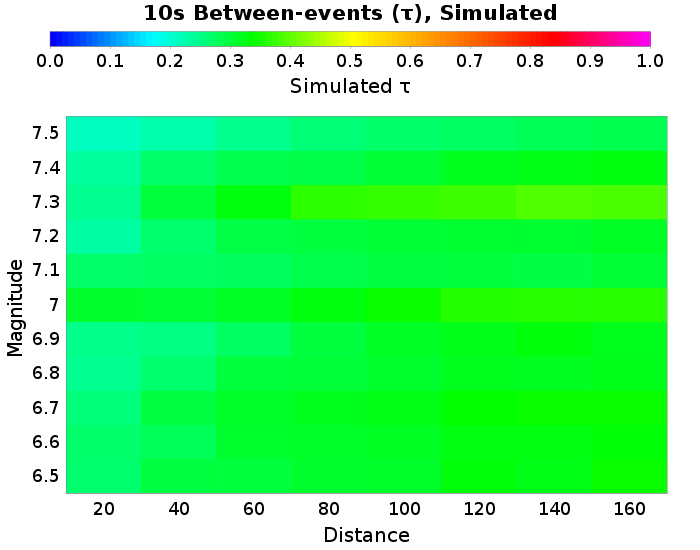
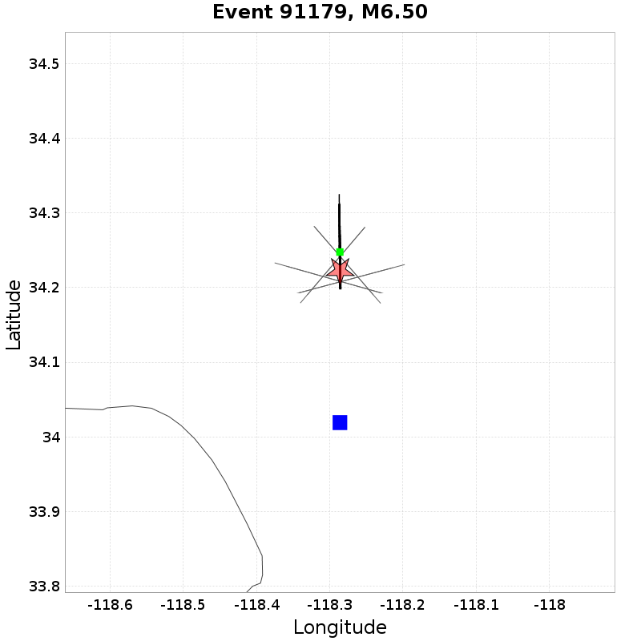
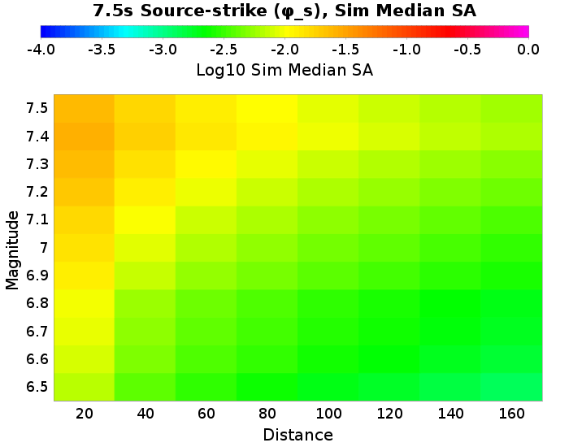
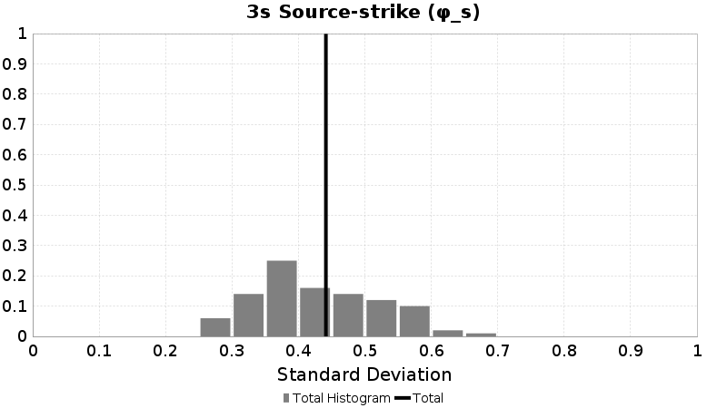
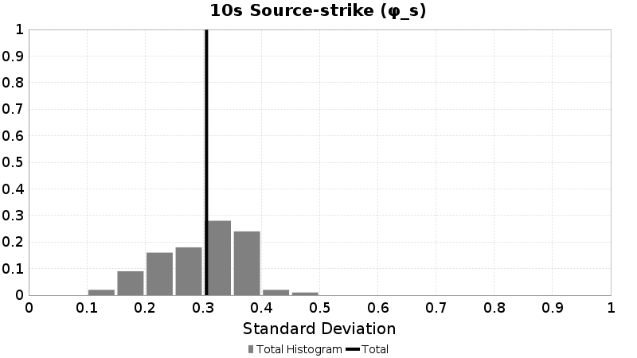
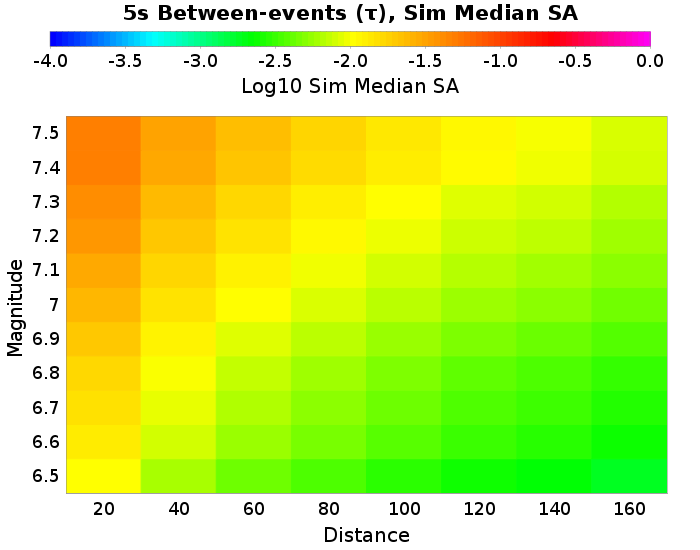
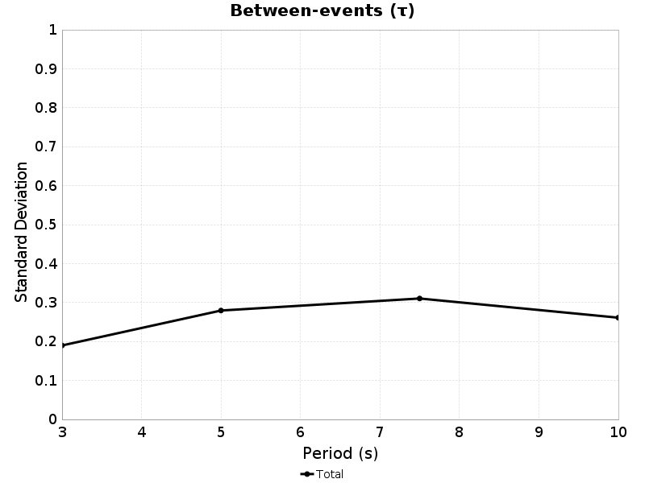

# Bruce 2740 Rotated Rupture Variability, SS

This exercise uses translations and rotations to estimate ground motion variability from different sources. We begin by selecting a subset of similar ruptures which match a set of criteria (in this case, Vertical Strike-Slip with Surface Rupture). Each rupture is then reoriented such that its strike (following the Aki & Richards 1980 convention) is 0 degrees (due North, dipping to the right for normal or reverse ruptures). For each site, ruptures are translated such that their scalar seismic moment centroid is directly North of the site, and their Joyner-Boore distance (rJB) is as specified (we consider 8 distance[s] here).

We then  perform various rotations. We rotate the rupture in place around its centroid, holding the site-to-source centroid path and rJB constant (henceforth 'Rupture Strike'). We also rotate ruptures around the site, holding rJB and source orientation relative to the site constant but sampling different various paths (henceforth 'Path'). We do this for each unique combination of Rupture Strike, Path, Joyner-Boore Distance, Site, and Rupture.

*NOTE: This page uses the SCEC BBP to simulate a 1-dimensional velocity structure. Thus we expect no path variability, and plots of path variabilitiy are included only as verification of the method.*

[RSQSim Catalog Details](../#bruce-2740)

## Table Of Contents
* [Rupture Rotation Parameters](#rupture-rotation-parameters)
* [SS RSQSim Rupture Match Criteria](#ss-rsqsim-rupture-match-criteria)
* [Sites](#sites)
* [Result Summary Table](#result-summary-table)
  * [Mag-Dist Plots](#mag-dist-plots)
  * [M6.5 Result Summary Table](#m65-result-summary-table)
  * [M7 Result Summary Table](#m7-result-summary-table)
  * [M7.5 Result Summary Table](#m75-result-summary-table)
* [Source-strike Variability](#source-strike-variability)
  * [Source-strike Variability Methodology](#source-strike-variability-methodology)
  * [Source-strike Variability Mag-Distance Plots](#source-strike-variability-mag-distance-plots)
  * [20.0 km M6.5 Source-strike Results](#200-km-m65-source-strike-results)
  * [40.0 km M6.5 Source-strike Results](#400-km-m65-source-strike-results)
  * [80.0 km M6.5 Source-strike Results](#800-km-m65-source-strike-results)
  * [160.0 km M6.5 Source-strike Results](#1600-km-m65-source-strike-results)
  * [20.0 km M7 Source-strike Results](#200-km-m7-source-strike-results)
  * [40.0 km M7 Source-strike Results](#400-km-m7-source-strike-results)
  * [80.0 km M7 Source-strike Results](#800-km-m7-source-strike-results)
  * [160.0 km M7 Source-strike Results](#1600-km-m7-source-strike-results)
  * [20.0 km M7.5 Source-strike Results](#200-km-m75-source-strike-results)
  * [40.0 km M7.5 Source-strike Results](#400-km-m75-source-strike-results)
  * [80.0 km M7.5 Source-strike Results](#800-km-m75-source-strike-results)
  * [160.0 km M7.5 Source-strike Results](#1600-km-m75-source-strike-results)
* [Within-event Variability](#within-event-variability)
  * [Within-event Variability Methodology](#within-event-variability-methodology)
  * [Within-event Variability Mag-Distance Plots](#within-event-variability-mag-distance-plots)
  * [20.0 km M6.5 Within-event Results](#200-km-m65-within-event-results)
  * [40.0 km M6.5 Within-event Results](#400-km-m65-within-event-results)
  * [80.0 km M6.5 Within-event Results](#800-km-m65-within-event-results)
  * [160.0 km M6.5 Within-event Results](#1600-km-m65-within-event-results)
  * [20.0 km M7 Within-event Results](#200-km-m7-within-event-results)
  * [40.0 km M7 Within-event Results](#400-km-m7-within-event-results)
  * [80.0 km M7 Within-event Results](#800-km-m7-within-event-results)
  * [160.0 km M7 Within-event Results](#1600-km-m7-within-event-results)
  * [20.0 km M7.5 Within-event Results](#200-km-m75-within-event-results)
  * [40.0 km M7.5 Within-event Results](#400-km-m75-within-event-results)
  * [80.0 km M7.5 Within-event Results](#800-km-m75-within-event-results)
  * [160.0 km M7.5 Within-event Results](#1600-km-m75-within-event-results)
* [Between-events Variability](#between-events-variability)
  * [Between-events Variability Methodology](#between-events-variability-methodology)
  * [Between-events Variability Mag-Distance Plots](#between-events-variability-mag-distance-plots)
  * [20.0 km M6.5 Between-events Results](#200-km-m65-between-events-results)
  * [40.0 km M6.5 Between-events Results](#400-km-m65-between-events-results)
  * [80.0 km M6.5 Between-events Results](#800-km-m65-between-events-results)
  * [160.0 km M6.5 Between-events Results](#1600-km-m65-between-events-results)
  * [20.0 km M7 Between-events Results](#200-km-m7-between-events-results)
  * [40.0 km M7 Between-events Results](#400-km-m7-between-events-results)
  * [80.0 km M7 Between-events Results](#800-km-m7-between-events-results)
  * [160.0 km M7 Between-events Results](#1600-km-m7-between-events-results)
  * [20.0 km M7.5 Between-events Results](#200-km-m75-between-events-results)
  * [40.0 km M7.5 Between-events Results](#400-km-m75-between-events-results)
  * [80.0 km M7.5 Between-events Results](#800-km-m75-between-events-results)
  * [160.0 km M7.5 Between-events Results](#1600-km-m75-between-events-results)
## Rupture Rotation Parameters

| Quantity | Variations | Description |
|-----|-----|-----|
| Rupture | 100 | Unique (but similar in faulting style and magnitude) ruptures which match the given scenario. |
| Site | 1 | Unique site locations. If 3-d, each will have unique velocity profiles. |
| Rupture Strike | 36 | Rupture strike conforming to the Aki & Richards (1980) convention, where dipping faults dip to the right of the rupture. If path rotation is also performed, this azimuth is relative to the path. |
| Path | 1 | Path from the site to the centroid of the rupture, in azimuthal degrees (0 is North) |
| Joyner-Boore Distance | 20.0, 40.0, 60.0, 80.0, 100.0, 120.0, 140.0, 160.0 km | Shortest horizontal distance between the site and the surface projection of the rupture. |
| **Total # Simulations** | **28800** | Total number of combinations of the above. |

## SS RSQSim Rupture Match Criteria
*[(top)](#table-of-contents)*

We condisder 100 events in the catalog which match the following criteria:

* Ztor=[0,1]
* Rake=[-180,-170] or [-10,10] or [170,180]
* Dip=90
* Linear rupture (max 5% deviation from ideal)

## Sites

| Name | Location | Vs30 (m/s) | Z1.0 (km) | Z2.5 (km) |
|-----|-----|-----|-----|-----|
| USC | *34.0192, -118.286* | 863 | N/A | N/A |

## Result Summary Table

### Mag-Dist Plots
*[(top)](#table-of-contents)*

| Type | Notation | 3s Std. Dev. | 5s Std. Dev. | 7.5s Std. Dev. | 10s Std. Dev. |
|-----|-----|-----|-----|-----|-----|
| Source-strike | &phi;s |  |  |  |  |
| Within-event | &phi; |  |  |  |  |
| Between-events | &tau; |  |  |  |  |

### M6.5 Result Summary Table
*[(top)](#table-of-contents)*

| Type | Notation | Distance | 3s Std. Dev. | 5s Std. Dev. | 7.5s Std. Dev. | 10s Std. Dev. |
|-----|-----|-----|-----|-----|-----|-----|
| Source-strike | &phi;s | 20 km | 0.43 | 0.48 | 0.4 | 0.3 |
| Source-strike | &phi;s | 40 km | 0.48 | 0.57 | 0.61 | 0.51 |
| Source-strike | &phi;s | 60 km | 0.51 | 0.61 | 0.6 | 0.63 |
| Source-strike | &phi;s | 80 km | 0.52 | 0.62 | 0.61 | 0.57 |
| Source-strike | &phi;s | 100 km | 0.5 | 0.65 | 0.67 | 0.57 |
| Source-strike | &phi;s | 120 km | 0.46 | 0.62 | 0.66 | 0.61 |
| Source-strike | &phi;s | 140 km | 0.42 | 0.63 | 0.66 | 0.64 |
| Source-strike | &phi;s | 160 km | 0.4 | 0.62 | 0.69 | 0.63 |
| Within-event | &phi; | 20 km | 0.43 | 0.48 | 0.4 | 0.3 |
| Within-event | &phi; | 40 km | 0.48 | 0.57 | 0.61 | 0.51 |
| Within-event | &phi; | 60 km | 0.51 | 0.61 | 0.6 | 0.63 |
| Within-event | &phi; | 80 km | 0.52 | 0.62 | 0.61 | 0.57 |
| Within-event | &phi; | 100 km | 0.5 | 0.65 | 0.67 | 0.57 |
| Within-event | &phi; | 120 km | 0.46 | 0.62 | 0.66 | 0.61 |
| Within-event | &phi; | 140 km | 0.42 | 0.63 | 0.66 | 0.64 |
| Within-event | &phi; | 160 km | 0.4 | 0.62 | 0.69 | 0.63 |
| Between-events | &tau; | 20 km | 0.47 | 0.54 | 0.49 | 0.4 |
| Between-events | &tau; | 40 km | 0.52 | 0.63 | 0.66 | 0.57 |
| Between-events | &tau; | 60 km | 0.54 | 0.67 | 0.67 | 0.68 |
| Between-events | &tau; | 80 km | 0.55 | 0.68 | 0.67 | 0.64 |
| Between-events | &tau; | 100 km | 0.53 | 0.71 | 0.73 | 0.63 |
| Between-events | &tau; | 120 km | 0.49 | 0.68 | 0.72 | 0.68 |
| Between-events | &tau; | 140 km | 0.46 | 0.69 | 0.72 | 0.69 |
| Between-events | &tau; | 160 km | 0.44 | 0.68 | 0.76 | 0.69 |

### M7 Result Summary Table
*[(top)](#table-of-contents)*

| Type | Notation | Distance | 3s Std. Dev. | 5s Std. Dev. | 7.5s Std. Dev. | 10s Std. Dev. |
|-----|-----|-----|-----|-----|-----|-----|
| Source-strike | &phi;s | 20 km | 0.51 | 0.51 | 0.44 | 0.39 |
| Source-strike | &phi;s | 40 km | 0.57 | 0.57 | 0.59 | 0.56 |
| Source-strike | &phi;s | 60 km | 0.59 | 0.61 | 0.59 | 0.62 |
| Source-strike | &phi;s | 80 km | 0.58 | 0.63 | 0.62 | 0.61 |
| Source-strike | &phi;s | 100 km | 0.56 | 0.63 | 0.66 | 0.62 |
| Source-strike | &phi;s | 120 km | 0.51 | 0.62 | 0.65 | 0.65 |
| Source-strike | &phi;s | 140 km | 0.48 | 0.63 | 0.66 | 0.66 |
| Source-strike | &phi;s | 160 km | 0.47 | 0.63 | 0.68 | 0.66 |
| Within-event | &phi; | 20 km | 0.51 | 0.51 | 0.44 | 0.39 |
| Within-event | &phi; | 40 km | 0.57 | 0.57 | 0.59 | 0.56 |
| Within-event | &phi; | 60 km | 0.59 | 0.61 | 0.59 | 0.62 |
| Within-event | &phi; | 80 km | 0.58 | 0.63 | 0.62 | 0.61 |
| Within-event | &phi; | 100 km | 0.56 | 0.63 | 0.66 | 0.62 |
| Within-event | &phi; | 120 km | 0.51 | 0.62 | 0.65 | 0.65 |
| Within-event | &phi; | 140 km | 0.48 | 0.63 | 0.66 | 0.66 |
| Within-event | &phi; | 160 km | 0.47 | 0.63 | 0.68 | 0.66 |
| Between-events | &tau; | 20 km | 0.54 | 0.55 | 0.52 | 0.49 |
| Between-events | &tau; | 40 km | 0.59 | 0.61 | 0.64 | 0.63 |
| Between-events | &tau; | 60 km | 0.61 | 0.65 | 0.65 | 0.69 |
| Between-events | &tau; | 80 km | 0.61 | 0.67 | 0.67 | 0.68 |
| Between-events | &tau; | 100 km | 0.58 | 0.67 | 0.71 | 0.7 |
| Between-events | &tau; | 120 km | 0.53 | 0.66 | 0.7 | 0.73 |
| Between-events | &tau; | 140 km | 0.51 | 0.67 | 0.71 | 0.74 |
| Between-events | &tau; | 160 km | 0.49 | 0.66 | 0.73 | 0.74 |

### M7.5 Result Summary Table
*[(top)](#table-of-contents)*

| Type | Notation | Distance | 3s Std. Dev. | 5s Std. Dev. | 7.5s Std. Dev. | 10s Std. Dev. |
|-----|-----|-----|-----|-----|-----|-----|
| Source-strike | &phi;s | 20 km | 0.53 | 0.46 | 0.39 | 0.37 |
| Source-strike | &phi;s | 40 km | 0.67 | 0.58 | 0.54 | 0.49 |
| Source-strike | &phi;s | 60 km | 0.72 | 0.65 | 0.58 | 0.56 |
| Source-strike | &phi;s | 80 km | 0.69 | 0.67 | 0.61 | 0.58 |
| Source-strike | &phi;s | 100 km | 0.67 | 0.68 | 0.64 | 0.6 |
| Source-strike | &phi;s | 120 km | 0.65 | 0.68 | 0.65 | 0.62 |
| Source-strike | &phi;s | 140 km | 0.65 | 0.7 | 0.67 | 0.64 |
| Source-strike | &phi;s | 160 km | 0.65 | 0.7 | 0.69 | 0.65 |
| Within-event | &phi; | 20 km | 0.53 | 0.46 | 0.39 | 0.37 |
| Within-event | &phi; | 40 km | 0.67 | 0.58 | 0.54 | 0.49 |
| Within-event | &phi; | 60 km | 0.72 | 0.65 | 0.58 | 0.56 |
| Within-event | &phi; | 80 km | 0.69 | 0.67 | 0.61 | 0.58 |
| Within-event | &phi; | 100 km | 0.67 | 0.68 | 0.64 | 0.6 |
| Within-event | &phi; | 120 km | 0.65 | 0.68 | 0.65 | 0.62 |
| Within-event | &phi; | 140 km | 0.65 | 0.7 | 0.67 | 0.64 |
| Within-event | &phi; | 160 km | 0.65 | 0.7 | 0.69 | 0.65 |
| Between-events | &tau; | 20 km | 0.54 | 0.48 | 0.44 | 0.42 |
| Between-events | &tau; | 40 km | 0.68 | 0.6 | 0.58 | 0.54 |
| Between-events | &tau; | 60 km | 0.72 | 0.68 | 0.62 | 0.61 |
| Between-events | &tau; | 80 km | 0.7 | 0.69 | 0.66 | 0.63 |
| Between-events | &tau; | 100 km | 0.67 | 0.7 | 0.69 | 0.65 |
| Between-events | &tau; | 120 km | 0.66 | 0.7 | 0.7 | 0.68 |
| Between-events | &tau; | 140 km | 0.65 | 0.73 | 0.71 | 0.7 |
| Between-events | &tau; | 160 km | 0.65 | 0.73 | 0.73 | 0.7 |

## Source-strike Variability
*[(top)](#table-of-contents)*

### Source-strike Variability Methodology
*[(top)](#table-of-contents)*

Source-strike variability, denoted &phi;s in Aki & Richards (1980), is computed from ground motion residuals where the following quantities are held constant:

* Site *[1 unique]*
* Joyner-Boore Distance *[8 unique]*
* Rupture *[100 unique]*
* Path *[1 unique]*

and the following quantities vary:

* Rupture Strike *[36 unique]*

Here is an exmample with 5 rotations, which would be repeated for each combination of [Site, Joyner-Boore Distance, Rupture, Path]. The site is shown with a blue square, and initially oriented rupture in bold with its hypocenter as a red star and centroid a green circle. Rotations of that rupture are in gray:

Standard deviation is computed and tabulated separately for each site and distance, then a total standard deviation is computed from all sitess and reported in the "**ALL SITES**" row. Results are reported separately for each distance

### Source-strike Variability Mag-Distance Plots
*[(top)](#table-of-contents)*

| Plot Type | 3s | 5s | 7.5s | 10s |
|-----|-----|-----|-----|-----|
| **Simulated** |  |  |  |  |
| **Sim Median SA** |  |  |  |  |

### 20.0 km M6.5 Source-strike Results
*[(top)](#table-of-contents)*

| 3s &phi;s | Total | Mean | Median | Range | 5s &phi;s | Total | Mean | Median | Range | 7.5s &phi;s | Total | Mean | Median | Range | 10s &phi;s | Total | Mean | Median | Range |
|-----|-----|-----|-----|-----|-----|-----|-----|-----|-----|-----|-----|-----|-----|-----|-----|-----|-----|-----|-----|
|  | 0.43 | 0.43 | 0.42 | [0.26 0.68] |  | 0.48 | 0.47 | 0.47 | [0.23 0.81] |  | 0.4 | 0.39 | 0.41 | [0.17 0.62] |  | 0.3 | 0.3 | 0.31 | [0.12 0.49] |

| 3s | 5s |
|-----|-----|
|  |  |
| 7.5s | 10s |
|  |  |

| 3s | 5s | 7.5s | 10s |
|-----|-----|-----|-----|
|  |  |  |  |
|  |  |  |  |
|  |  |  |  |

### 40.0 km M6.5 Source-strike Results
*[(top)](#table-of-contents)*

| 3s &phi;s | Total | Mean | Median | Range | 5s &phi;s | Total | Mean | Median | Range | 7.5s &phi;s | Total | Mean | Median | Range | 10s &phi;s | Total | Mean | Median | Range |
|-----|-----|-----|-----|-----|-----|-----|-----|-----|-----|-----|-----|-----|-----|-----|-----|-----|-----|-----|-----|
|  | 0.48 | 0.48 | 0.49 | [0.25 0.74] |  | 0.57 | 0.56 | 0.54 | [0.26 0.85] |  | 0.61 | 0.61 | 0.62 | [0.36 0.83] |  | 0.51 | 0.51 | 0.52 | [0.27 0.67] |

| 3s | 5s |
|-----|-----|
|  |  |
| 7.5s | 10s |
|  |  |

| 3s | 5s | 7.5s | 10s |
|-----|-----|-----|-----|
|  |  |  |  |
|  |  |  |  |
|  |  |  |  |

### 80.0 km M6.5 Source-strike Results
*[(top)](#table-of-contents)*

| 3s &phi;s | Total | Mean | Median | Range | 5s &phi;s | Total | Mean | Median | Range | 7.5s &phi;s | Total | Mean | Median | Range | 10s &phi;s | Total | Mean | Median | Range |
|-----|-----|-----|-----|-----|-----|-----|-----|-----|-----|-----|-----|-----|-----|-----|-----|-----|-----|-----|-----|
|  | 0.52 | 0.52 | 0.51 | [0.32 0.79] |  | 0.62 | 0.61 | 0.58 | [0.3 1] |  | 0.61 | 0.6 | 0.6 | [0.33 0.87] |  | 0.57 | 0.57 | 0.58 | [0.36 0.75] |

| 3s | 5s |
|-----|-----|
|  |  |
| 7.5s | 10s |
|  |  |

| 3s | 5s | 7.5s | 10s |
|-----|-----|-----|-----|
|  |  |  |  |
|  |  |  |  |
|  |  |  |  |

### 160.0 km M6.5 Source-strike Results
*[(top)](#table-of-contents)*

| 3s &phi;s | Total | Mean | Median | Range | 5s &phi;s | Total | Mean | Median | Range | 7.5s &phi;s | Total | Mean | Median | Range | 10s &phi;s | Total | Mean | Median | Range |
|-----|-----|-----|-----|-----|-----|-----|-----|-----|-----|-----|-----|-----|-----|-----|-----|-----|-----|-----|-----|
|  | 0.4 | 0.4 | 0.39 | [0.19 0.64] |  | 0.62 | 0.62 | 0.59 | [0.34 0.98] |  | 0.69 | 0.69 | 0.69 | [0.39 0.98] |  | 0.63 | 0.63 | 0.64 | [0.36 0.78] |

| 3s | 5s |
|-----|-----|
|  |  |
| 7.5s | 10s |
|  |  |

| 3s | 5s | 7.5s | 10s |
|-----|-----|-----|-----|
|  |  |  |  |
|  |  |  |  |
|  |  |  |  |

### 20.0 km M7 Source-strike Results
*[(top)](#table-of-contents)*

| 3s &phi;s | Total | Mean | Median | Range | 5s &phi;s | Total | Mean | Median | Range | 7.5s &phi;s | Total | Mean | Median | Range | 10s &phi;s | Total | Mean | Median | Range |
|-----|-----|-----|-----|-----|-----|-----|-----|-----|-----|-----|-----|-----|-----|-----|-----|-----|-----|-----|-----|
|  | 0.51 | 0.51 | 0.5 | [0.25 0.75] |  | 0.51 | 0.51 | 0.51 | [0.29 0.79] |  | 0.44 | 0.43 | 0.42 | [0.24 0.78] |  | 0.39 | 0.38 | 0.36 | [0.18 0.76] |

| 3s | 5s |
|-----|-----|
|  |  |
| 7.5s | 10s |
|  |  |

| 3s | 5s | 7.5s | 10s |
|-----|-----|-----|-----|
|  |  |  |  |
|  |  |  |  |
|  |  |  |  |

### 40.0 km M7 Source-strike Results
*[(top)](#table-of-contents)*

| 3s &phi;s | Total | Mean | Median | Range | 5s &phi;s | Total | Mean | Median | Range | 7.5s &phi;s | Total | Mean | Median | Range | 10s &phi;s | Total | Mean | Median | Range |
|-----|-----|-----|-----|-----|-----|-----|-----|-----|-----|-----|-----|-----|-----|-----|-----|-----|-----|-----|-----|
|  | 0.57 | 0.57 | 0.56 | [0.33 0.85] |  | 0.57 | 0.57 | 0.56 | [0.29 0.81] |  | 0.59 | 0.59 | 0.6 | [0.37 0.89] |  | 0.56 | 0.56 | 0.55 | [0.3 0.88] |

| 3s | 5s |
|-----|-----|
|  |  |
| 7.5s | 10s |
|  |  |

| 3s | 5s | 7.5s | 10s |
|-----|-----|-----|-----|
|  |  |  |  |
|  |  |  |  |
|  |  |  |  |

### 80.0 km M7 Source-strike Results
*[(top)](#table-of-contents)*

| 3s &phi;s | Total | Mean | Median | Range | 5s &phi;s | Total | Mean | Median | Range | 7.5s &phi;s | Total | Mean | Median | Range | 10s &phi;s | Total | Mean | Median | Range |
|-----|-----|-----|-----|-----|-----|-----|-----|-----|-----|-----|-----|-----|-----|-----|-----|-----|-----|-----|-----|
|  | 0.58 | 0.59 | 0.58 | [0.38 0.81] |  | 0.63 | 0.63 | 0.63 | [0.33 0.88] |  | 0.62 | 0.62 | 0.61 | [0.39 0.9] |  | 0.61 | 0.61 | 0.59 | [0.42 0.91] |

| 3s | 5s |
|-----|-----|
|  |  |
| 7.5s | 10s |
|  |  |

| 3s | 5s | 7.5s | 10s |
|-----|-----|-----|-----|
|  |  |  |  |
|  |  |  |  |
|  |  |  |  |

### 160.0 km M7 Source-strike Results
*[(top)](#table-of-contents)*

| 3s &phi;s | Total | Mean | Median | Range | 5s &phi;s | Total | Mean | Median | Range | 7.5s &phi;s | Total | Mean | Median | Range | 10s &phi;s | Total | Mean | Median | Range |
|-----|-----|-----|-----|-----|-----|-----|-----|-----|-----|-----|-----|-----|-----|-----|-----|-----|-----|-----|-----|
|  | 0.47 | 0.46 | 0.47 | [0.19 0.7] |  | 0.63 | 0.63 | 0.64 | [0.32 0.89] |  | 0.68 | 0.68 | 0.7 | [0.45 0.9] |  | 0.66 | 0.67 | 0.65 | [0.46 0.92] |

| 3s | 5s |
|-----|-----|
|  |  |
| 7.5s | 10s |
|  |  |

| 3s | 5s | 7.5s | 10s |
|-----|-----|-----|-----|
|  |  |  |  |
|  |  |  |  |
|  |  |  |  |

### 20.0 km M7.5 Source-strike Results
*[(top)](#table-of-contents)*

| 3s &phi;s | Total | Mean | Median | Range | 5s &phi;s | Total | Mean | Median | Range | 7.5s &phi;s | Total | Mean | Median | Range | 10s &phi;s | Total | Mean | Median | Range |
|-----|-----|-----|-----|-----|-----|-----|-----|-----|-----|-----|-----|-----|-----|-----|-----|-----|-----|-----|-----|
|  | 0.53 | 0.53 | 0.54 | [0.31 0.74] |  | 0.46 | 0.46 | 0.46 | [0.24 0.68] |  | 0.39 | 0.38 | 0.35 | [0.22 0.65] |  | 0.37 | 0.35 | 0.34 | [0.13 0.71] |

| 3s | 5s |
|-----|-----|
|  |  |
| 7.5s | 10s |
|  |  |

| 3s | 5s | 7.5s | 10s |
|-----|-----|-----|-----|
|  |  |  |  |
|  |  |  |  |
|  |  |  |  |

### 40.0 km M7.5 Source-strike Results
*[(top)](#table-of-contents)*

| 3s &phi;s | Total | Mean | Median | Range | 5s &phi;s | Total | Mean | Median | Range | 7.5s &phi;s | Total | Mean | Median | Range | 10s &phi;s | Total | Mean | Median | Range |
|-----|-----|-----|-----|-----|-----|-----|-----|-----|-----|-----|-----|-----|-----|-----|-----|-----|-----|-----|-----|
|  | 0.67 | 0.68 | 0.68 | [0.46 0.86] |  | 0.58 | 0.58 | 0.59 | [0.32 0.78] |  | 0.54 | 0.53 | 0.52 | [0.33 0.86] |  | 0.49 | 0.49 | 0.47 | [0.31 0.81] |

| 3s | 5s |
|-----|-----|
|  |  |
| 7.5s | 10s |
|  |  |

| 3s | 5s | 7.5s | 10s |
|-----|-----|-----|-----|
|  |  |  |  |
|  |  |  |  |
|  |  |  |  |

### 80.0 km M7.5 Source-strike Results
*[(top)](#table-of-contents)*

| 3s &phi;s | Total | Mean | Median | Range | 5s &phi;s | Total | Mean | Median | Range | 7.5s &phi;s | Total | Mean | Median | Range | 10s &phi;s | Total | Mean | Median | Range |
|-----|-----|-----|-----|-----|-----|-----|-----|-----|-----|-----|-----|-----|-----|-----|-----|-----|-----|-----|-----|
|  | 0.69 | 0.7 | 0.69 | [0.53 0.87] |  | 0.67 | 0.68 | 0.68 | [0.44 0.87] |  | 0.61 | 0.61 | 0.6 | [0.43 0.89] |  | 0.58 | 0.57 | 0.55 | [0.37 0.89] |

| 3s | 5s |
|-----|-----|
|  |  |
| 7.5s | 10s |
|  |  |

| 3s | 5s | 7.5s | 10s |
|-----|-----|-----|-----|
|  |  |  |  |
|  |  |  |  |
|  |  |  |  |

### 160.0 km M7.5 Source-strike Results
*[(top)](#table-of-contents)*

| 3s &phi;s | Total | Mean | Median | Range | 5s &phi;s | Total | Mean | Median | Range | 7.5s &phi;s | Total | Mean | Median | Range | 10s &phi;s | Total | Mean | Median | Range |
|-----|-----|-----|-----|-----|-----|-----|-----|-----|-----|-----|-----|-----|-----|-----|-----|-----|-----|-----|-----|
|  | 0.65 | 0.65 | 0.66 | [0.48 0.84] |  | 0.7 | 0.71 | 0.72 | [0.48 0.9] |  | 0.69 | 0.68 | 0.67 | [0.49 1.01] |  | 0.65 | 0.65 | 0.63 | [0.45 0.98] |

| 3s | 5s |
|-----|-----|
|  |  |
| 7.5s | 10s |
|  |  |

| 3s | 5s | 7.5s | 10s |
|-----|-----|-----|-----|
|  |  |  |  |
|  |  |  |  |
|  |  |  |  |

## Within-event Variability
*[(top)](#table-of-contents)*

### Within-event Variability Methodology
*[(top)](#table-of-contents)*

Within-event variability, denoted &phi; in Al Atik (2010), is computed from ground motion residuals where the following quantities are held constant:

* Site *[1 unique]*
* Joyner-Boore Distance *[8 unique]*
* Rupture *[100 unique]*

and the following quantities vary:

* Rupture Strike *[36 unique]*
* Path *[1 unique]*

Here is an exmample with 5 rotations, which would be repeated for each combination of [Site, Joyner-Boore Distance, Rupture]. The site is shown with a blue square, and initially oriented rupture in bold with its hypocenter as a red star and centroid a green circle. Rotations of that rupture are in gray:

Standard deviation is computed and tabulated separately for each site and distance, then a total standard deviation is computed from all sitess and reported in the "**ALL SITES**" row. Results are reported separately for each distance

### Within-event Variability Mag-Distance Plots
*[(top)](#table-of-contents)*

| Plot Type | 3s | 5s | 7.5s | 10s |
|-----|-----|-----|-----|-----|
| **Simulated** |  |  |  |  |
| **Sim Median SA** |  |  |  |  |

### 20.0 km M6.5 Within-event Results
*[(top)](#table-of-contents)*

| 3s &phi; | Total | Mean | Median | Range | 5s &phi; | Total | Mean | Median | Range | 7.5s &phi; | Total | Mean | Median | Range | 10s &phi; | Total | Mean | Median | Range |
|-----|-----|-----|-----|-----|-----|-----|-----|-----|-----|-----|-----|-----|-----|-----|-----|-----|-----|-----|-----|
|  | 0.43 | 0.43 | 0.42 | [0.26 0.68] |  | 0.48 | 0.47 | 0.47 | [0.23 0.81] |  | 0.4 | 0.39 | 0.41 | [0.17 0.62] |  | 0.3 | 0.3 | 0.31 | [0.12 0.49] |

| 3s | 5s |
|-----|-----|
|  |  |
| 7.5s | 10s |
|  |  |

| 3s | 5s | 7.5s | 10s |
|-----|-----|-----|-----|
|  |  |  |  |
|  |  |  |  |
|  |  |  |  |

### 40.0 km M6.5 Within-event Results
*[(top)](#table-of-contents)*

| 3s &phi; | Total | Mean | Median | Range | 5s &phi; | Total | Mean | Median | Range | 7.5s &phi; | Total | Mean | Median | Range | 10s &phi; | Total | Mean | Median | Range |
|-----|-----|-----|-----|-----|-----|-----|-----|-----|-----|-----|-----|-----|-----|-----|-----|-----|-----|-----|-----|
|  | 0.48 | 0.48 | 0.49 | [0.25 0.74] |  | 0.57 | 0.56 | 0.54 | [0.26 0.85] |  | 0.61 | 0.61 | 0.62 | [0.36 0.83] |  | 0.51 | 0.51 | 0.52 | [0.27 0.67] |

| 3s | 5s |
|-----|-----|
|  |  |
| 7.5s | 10s |
|  |  |

| 3s | 5s | 7.5s | 10s |
|-----|-----|-----|-----|
|  |  |  |  |
|  |  |  |  |
|  |  |  |  |

### 80.0 km M6.5 Within-event Results
*[(top)](#table-of-contents)*

| 3s &phi; | Total | Mean | Median | Range | 5s &phi; | Total | Mean | Median | Range | 7.5s &phi; | Total | Mean | Median | Range | 10s &phi; | Total | Mean | Median | Range |
|-----|-----|-----|-----|-----|-----|-----|-----|-----|-----|-----|-----|-----|-----|-----|-----|-----|-----|-----|-----|
|  | 0.52 | 0.52 | 0.51 | [0.32 0.79] |  | 0.62 | 0.61 | 0.58 | [0.3 1] |  | 0.61 | 0.6 | 0.6 | [0.33 0.87] |  | 0.57 | 0.57 | 0.58 | [0.36 0.75] |

| 3s | 5s |
|-----|-----|
|  |  |
| 7.5s | 10s |
|  |  |

| 3s | 5s | 7.5s | 10s |
|-----|-----|-----|-----|
|  |  |  |  |
|  |  |  |  |
|  |  |  |  |

### 160.0 km M6.5 Within-event Results
*[(top)](#table-of-contents)*

| 3s &phi; | Total | Mean | Median | Range | 5s &phi; | Total | Mean | Median | Range | 7.5s &phi; | Total | Mean | Median | Range | 10s &phi; | Total | Mean | Median | Range |
|-----|-----|-----|-----|-----|-----|-----|-----|-----|-----|-----|-----|-----|-----|-----|-----|-----|-----|-----|-----|
|  | 0.4 | 0.4 | 0.39 | [0.19 0.64] |  | 0.62 | 0.62 | 0.59 | [0.34 0.98] |  | 0.69 | 0.69 | 0.69 | [0.39 0.98] |  | 0.63 | 0.63 | 0.64 | [0.36 0.78] |

| 3s | 5s |
|-----|-----|
|  |  |
| 7.5s | 10s |
|  |  |

| 3s | 5s | 7.5s | 10s |
|-----|-----|-----|-----|
|  |  |  |  |
|  |  |  |  |
|  |  |  |  |

### 20.0 km M7 Within-event Results
*[(top)](#table-of-contents)*

| 3s &phi; | Total | Mean | Median | Range | 5s &phi; | Total | Mean | Median | Range | 7.5s &phi; | Total | Mean | Median | Range | 10s &phi; | Total | Mean | Median | Range |
|-----|-----|-----|-----|-----|-----|-----|-----|-----|-----|-----|-----|-----|-----|-----|-----|-----|-----|-----|-----|
|  | 0.51 | 0.51 | 0.5 | [0.25 0.75] |  | 0.51 | 0.51 | 0.51 | [0.29 0.79] |  | 0.44 | 0.43 | 0.42 | [0.24 0.78] |  | 0.39 | 0.38 | 0.36 | [0.18 0.76] |

| 3s | 5s |
|-----|-----|
|  |  |
| 7.5s | 10s |
|  |  |

| 3s | 5s | 7.5s | 10s |
|-----|-----|-----|-----|
|  |  |  |  |
|  |  |  |  |
|  |  |  |  |

### 40.0 km M7 Within-event Results
*[(top)](#table-of-contents)*

| 3s &phi; | Total | Mean | Median | Range | 5s &phi; | Total | Mean | Median | Range | 7.5s &phi; | Total | Mean | Median | Range | 10s &phi; | Total | Mean | Median | Range |
|-----|-----|-----|-----|-----|-----|-----|-----|-----|-----|-----|-----|-----|-----|-----|-----|-----|-----|-----|-----|
|  | 0.57 | 0.57 | 0.56 | [0.33 0.85] |  | 0.57 | 0.57 | 0.56 | [0.29 0.81] |  | 0.59 | 0.59 | 0.6 | [0.37 0.89] |  | 0.56 | 0.56 | 0.55 | [0.3 0.88] |

| 3s | 5s |
|-----|-----|
|  |  |
| 7.5s | 10s |
|  |  |

| 3s | 5s | 7.5s | 10s |
|-----|-----|-----|-----|
|  |  |  |  |
|  |  |  |  |
|  |  |  |  |

### 80.0 km M7 Within-event Results
*[(top)](#table-of-contents)*

| 3s &phi; | Total | Mean | Median | Range | 5s &phi; | Total | Mean | Median | Range | 7.5s &phi; | Total | Mean | Median | Range | 10s &phi; | Total | Mean | Median | Range |
|-----|-----|-----|-----|-----|-----|-----|-----|-----|-----|-----|-----|-----|-----|-----|-----|-----|-----|-----|-----|
|  | 0.58 | 0.59 | 0.58 | [0.38 0.81] |  | 0.63 | 0.63 | 0.63 | [0.33 0.88] |  | 0.62 | 0.62 | 0.61 | [0.39 0.9] |  | 0.61 | 0.61 | 0.59 | [0.42 0.91] |

| 3s | 5s |
|-----|-----|
|  |  |
| 7.5s | 10s |
|  |  |

| 3s | 5s | 7.5s | 10s |
|-----|-----|-----|-----|
|  |  |  |  |
|  |  |  |  |
|  |  |  |  |

### 160.0 km M7 Within-event Results
*[(top)](#table-of-contents)*

| 3s &phi; | Total | Mean | Median | Range | 5s &phi; | Total | Mean | Median | Range | 7.5s &phi; | Total | Mean | Median | Range | 10s &phi; | Total | Mean | Median | Range |
|-----|-----|-----|-----|-----|-----|-----|-----|-----|-----|-----|-----|-----|-----|-----|-----|-----|-----|-----|-----|
|  | 0.47 | 0.46 | 0.47 | [0.19 0.7] |  | 0.63 | 0.63 | 0.64 | [0.32 0.89] |  | 0.68 | 0.68 | 0.7 | [0.45 0.9] |  | 0.66 | 0.67 | 0.65 | [0.46 0.92] |

| 3s | 5s |
|-----|-----|
|  |  |
| 7.5s | 10s |
|  |  |

| 3s | 5s | 7.5s | 10s |
|-----|-----|-----|-----|
|  |  |  |  |
|  |  |  |  |
|  |  |  |  |

### 20.0 km M7.5 Within-event Results
*[(top)](#table-of-contents)*

| 3s &phi; | Total | Mean | Median | Range | 5s &phi; | Total | Mean | Median | Range | 7.5s &phi; | Total | Mean | Median | Range | 10s &phi; | Total | Mean | Median | Range |
|-----|-----|-----|-----|-----|-----|-----|-----|-----|-----|-----|-----|-----|-----|-----|-----|-----|-----|-----|-----|
|  | 0.53 | 0.53 | 0.54 | [0.31 0.74] |  | 0.46 | 0.46 | 0.46 | [0.24 0.68] |  | 0.39 | 0.38 | 0.35 | [0.22 0.65] |  | 0.37 | 0.35 | 0.34 | [0.13 0.71] |

| 3s | 5s |
|-----|-----|
|  |  |
| 7.5s | 10s |
|  |  |

| 3s | 5s | 7.5s | 10s |
|-----|-----|-----|-----|
|  |  |  |  |
|  |  |  |  |
|  |  |  |  |

### 40.0 km M7.5 Within-event Results
*[(top)](#table-of-contents)*

| 3s &phi; | Total | Mean | Median | Range | 5s &phi; | Total | Mean | Median | Range | 7.5s &phi; | Total | Mean | Median | Range | 10s &phi; | Total | Mean | Median | Range |
|-----|-----|-----|-----|-----|-----|-----|-----|-----|-----|-----|-----|-----|-----|-----|-----|-----|-----|-----|-----|
|  | 0.67 | 0.68 | 0.68 | [0.46 0.86] |  | 0.58 | 0.58 | 0.59 | [0.32 0.78] |  | 0.54 | 0.53 | 0.52 | [0.33 0.86] |  | 0.49 | 0.49 | 0.47 | [0.31 0.81] |

| 3s | 5s |
|-----|-----|
|  |  |
| 7.5s | 10s |
|  |  |

| 3s | 5s | 7.5s | 10s |
|-----|-----|-----|-----|
|  |  |  |  |
|  |  |  |  |
|  |  |  |  |

### 80.0 km M7.5 Within-event Results
*[(top)](#table-of-contents)*

| 3s &phi; | Total | Mean | Median | Range | 5s &phi; | Total | Mean | Median | Range | 7.5s &phi; | Total | Mean | Median | Range | 10s &phi; | Total | Mean | Median | Range |
|-----|-----|-----|-----|-----|-----|-----|-----|-----|-----|-----|-----|-----|-----|-----|-----|-----|-----|-----|-----|
|  | 0.69 | 0.7 | 0.69 | [0.53 0.87] |  | 0.67 | 0.68 | 0.68 | [0.44 0.87] |  | 0.61 | 0.61 | 0.6 | [0.43 0.89] |  | 0.58 | 0.57 | 0.55 | [0.37 0.89] |

| 3s | 5s |
|-----|-----|
|  |  |
| 7.5s | 10s |
|  |  |

| 3s | 5s | 7.5s | 10s |
|-----|-----|-----|-----|
|  |  |  |  |
|  |  |  |  |
|  |  |  |  |

### 160.0 km M7.5 Within-event Results
*[(top)](#table-of-contents)*

| 3s &phi; | Total | Mean | Median | Range | 5s &phi; | Total | Mean | Median | Range | 7.5s &phi; | Total | Mean | Median | Range | 10s &phi; | Total | Mean | Median | Range |
|-----|-----|-----|-----|-----|-----|-----|-----|-----|-----|-----|-----|-----|-----|-----|-----|-----|-----|-----|-----|
|  | 0.65 | 0.65 | 0.66 | [0.48 0.84] |  | 0.7 | 0.71 | 0.72 | [0.48 0.9] |  | 0.69 | 0.68 | 0.67 | [0.49 1.01] |  | 0.65 | 0.65 | 0.63 | [0.45 0.98] |

| 3s | 5s |
|-----|-----|
|  |  |
| 7.5s | 10s |
|  |  |

| 3s | 5s | 7.5s | 10s |
|-----|-----|-----|-----|
|  |  |  |  |
|  |  |  |  |
|  |  |  |  |

## Between-events Variability
*[(top)](#table-of-contents)*

### Between-events Variability Methodology
*[(top)](#table-of-contents)*

Between-events variability, denoted &tau; in Al Atik (2010), is computed from ground motion residuals where the following quantities are held constant:

* Site *[1 unique]*
* Joyner-Boore Distance *[8 unique]*

and the following quantities vary:

* Rupture *[100 unique]*
* Rupture Strike *[36 unique]*
* Path *[1 unique]*

Standard deviation is computed and tabulated separately for each site and distance, then a total standard deviation is computed from all sitess and reported in the "**ALL SITES**" row. Results are reported separately for each distance

### Between-events Variability Mag-Distance Plots
*[(top)](#table-of-contents)*

| Plot Type | 3s | 5s | 7.5s | 10s |
|-----|-----|-----|-----|-----|
| **Simulated** |  |  |  |  |
| **Sim Median SA** |  |  |  |  |

### 20.0 km M6.5 Between-events Results
*[(top)](#table-of-contents)*

| 3s &tau; | Total | Mean | Median | Range | 5s &tau; | Total | Mean | Median | Range | 7.5s &tau; | Total | Mean | Median | Range | 10s &tau; | Total | Mean | Median | Range |
|-----|-----|-----|-----|-----|-----|-----|-----|-----|-----|-----|-----|-----|-----|-----|-----|-----|-----|-----|-----|
|  | 0.47 | 0.47 | 0.47 | [0.47 0.47] |  | 0.54 | 0.54 | 0.54 | [0.54 0.54] |  | 0.49 | 0.49 | 0.49 | [0.49 0.49] |  | 0.4 | 0.4 | 0.4 | [0.4 0.4] |

| 3s | 5s |
|-----|-----|
|  |  |
| 7.5s | 10s |
|  |  |

### 40.0 km M6.5 Between-events Results
*[(top)](#table-of-contents)*

| 3s &tau; | Total | Mean | Median | Range | 5s &tau; | Total | Mean | Median | Range | 7.5s &tau; | Total | Mean | Median | Range | 10s &tau; | Total | Mean | Median | Range |
|-----|-----|-----|-----|-----|-----|-----|-----|-----|-----|-----|-----|-----|-----|-----|-----|-----|-----|-----|-----|
|  | 0.52 | 0.52 | 0.52 | [0.52 0.52] |  | 0.63 | 0.63 | 0.63 | [0.63 0.63] |  | 0.66 | 0.66 | 0.66 | [0.66 0.66] |  | 0.57 | 0.57 | 0.57 | [0.57 0.57] |

| 3s | 5s |
|-----|-----|
|  |  |
| 7.5s | 10s |
|  |  |

### 80.0 km M6.5 Between-events Results
*[(top)](#table-of-contents)*

| 3s &tau; | Total | Mean | Median | Range | 5s &tau; | Total | Mean | Median | Range | 7.5s &tau; | Total | Mean | Median | Range | 10s &tau; | Total | Mean | Median | Range |
|-----|-----|-----|-----|-----|-----|-----|-----|-----|-----|-----|-----|-----|-----|-----|-----|-----|-----|-----|-----|
|  | 0.55 | 0.55 | 0.55 | [0.55 0.55] |  | 0.68 | 0.68 | 0.68 | [0.68 0.68] |  | 0.67 | 0.67 | 0.67 | [0.67 0.67] |  | 0.64 | 0.64 | 0.64 | [0.64 0.64] |

| 3s | 5s |
|-----|-----|
|  |  |
| 7.5s | 10s |
|  |  |

### 160.0 km M6.5 Between-events Results
*[(top)](#table-of-contents)*

| 3s &tau; | Total | Mean | Median | Range | 5s &tau; | Total | Mean | Median | Range | 7.5s &tau; | Total | Mean | Median | Range | 10s &tau; | Total | Mean | Median | Range |
|-----|-----|-----|-----|-----|-----|-----|-----|-----|-----|-----|-----|-----|-----|-----|-----|-----|-----|-----|-----|
|  | 0.44 | 0.44 | 0.44 | [0.44 0.44] |  | 0.68 | 0.68 | 0.68 | [0.68 0.68] |  | 0.76 | 0.76 | 0.76 | [0.76 0.76] |  | 0.69 | 0.69 | 0.69 | [0.69 0.69] |

| 3s | 5s |
|-----|-----|
|  |  |
| 7.5s | 10s |
|  |  |

### 20.0 km M7 Between-events Results
*[(top)](#table-of-contents)*

| 3s &tau; | Total | Mean | Median | Range | 5s &tau; | Total | Mean | Median | Range | 7.5s &tau; | Total | Mean | Median | Range | 10s &tau; | Total | Mean | Median | Range |
|-----|-----|-----|-----|-----|-----|-----|-----|-----|-----|-----|-----|-----|-----|-----|-----|-----|-----|-----|-----|
|  | 0.54 | 0.54 | 0.54 | [0.54 0.54] |  | 0.55 | 0.55 | 0.55 | [0.55 0.55] |  | 0.52 | 0.52 | 0.52 | [0.52 0.52] |  | 0.49 | 0.49 | 0.49 | [0.49 0.49] |

| 3s | 5s |
|-----|-----|
|  |  |
| 7.5s | 10s |
|  |  |

### 40.0 km M7 Between-events Results
*[(top)](#table-of-contents)*

| 3s &tau; | Total | Mean | Median | Range | 5s &tau; | Total | Mean | Median | Range | 7.5s &tau; | Total | Mean | Median | Range | 10s &tau; | Total | Mean | Median | Range |
|-----|-----|-----|-----|-----|-----|-----|-----|-----|-----|-----|-----|-----|-----|-----|-----|-----|-----|-----|-----|
|  | 0.59 | 0.59 | 0.59 | [0.59 0.59] |  | 0.61 | 0.61 | 0.61 | [0.61 0.61] |  | 0.64 | 0.64 | 0.64 | [0.64 0.64] |  | 0.63 | 0.63 | 0.63 | [0.63 0.63] |

| 3s | 5s |
|-----|-----|
|  |  |
| 7.5s | 10s |
|  |  |

### 80.0 km M7 Between-events Results
*[(top)](#table-of-contents)*

| 3s &tau; | Total | Mean | Median | Range | 5s &tau; | Total | Mean | Median | Range | 7.5s &tau; | Total | Mean | Median | Range | 10s &tau; | Total | Mean | Median | Range |
|-----|-----|-----|-----|-----|-----|-----|-----|-----|-----|-----|-----|-----|-----|-----|-----|-----|-----|-----|-----|
|  | 0.61 | 0.61 | 0.61 | [0.61 0.61] |  | 0.67 | 0.67 | 0.67 | [0.67 0.67] |  | 0.67 | 0.67 | 0.67 | [0.67 0.67] |  | 0.68 | 0.68 | 0.68 | [0.68 0.68] |

| 3s | 5s |
|-----|-----|
|  |  |
| 7.5s | 10s |
|  |  |

### 160.0 km M7 Between-events Results
*[(top)](#table-of-contents)*

| 3s &tau; | Total | Mean | Median | Range | 5s &tau; | Total | Mean | Median | Range | 7.5s &tau; | Total | Mean | Median | Range | 10s &tau; | Total | Mean | Median | Range |
|-----|-----|-----|-----|-----|-----|-----|-----|-----|-----|-----|-----|-----|-----|-----|-----|-----|-----|-----|-----|
|  | 0.49 | 0.49 | 0.49 | [0.49 0.49] |  | 0.66 | 0.66 | 0.66 | [0.66 0.66] |  | 0.73 | 0.73 | 0.73 | [0.73 0.73] |  | 0.74 | 0.74 | 0.74 | [0.74 0.74] |

| 3s | 5s |
|-----|-----|
|  |  |
| 7.5s | 10s |
|  |  |

### 20.0 km M7.5 Between-events Results
*[(top)](#table-of-contents)*

| 3s &tau; | Total | Mean | Median | Range | 5s &tau; | Total | Mean | Median | Range | 7.5s &tau; | Total | Mean | Median | Range | 10s &tau; | Total | Mean | Median | Range |
|-----|-----|-----|-----|-----|-----|-----|-----|-----|-----|-----|-----|-----|-----|-----|-----|-----|-----|-----|-----|
|  | 0.54 | 0.54 | 0.54 | [0.54 0.54] |  | 0.48 | 0.48 | 0.48 | [0.48 0.48] |  | 0.44 | 0.44 | 0.44 | [0.44 0.44] |  | 0.42 | 0.42 | 0.42 | [0.42 0.42] |

| 3s | 5s |
|-----|-----|
|  |  |
| 7.5s | 10s |
|  |  |

### 40.0 km M7.5 Between-events Results
*[(top)](#table-of-contents)*

| 3s &tau; | Total | Mean | Median | Range | 5s &tau; | Total | Mean | Median | Range | 7.5s &tau; | Total | Mean | Median | Range | 10s &tau; | Total | Mean | Median | Range |
|-----|-----|-----|-----|-----|-----|-----|-----|-----|-----|-----|-----|-----|-----|-----|-----|-----|-----|-----|-----|
|  | 0.68 | 0.68 | 0.68 | [0.68 0.68] |  | 0.6 | 0.6 | 0.6 | [0.6 0.6] |  | 0.58 | 0.58 | 0.58 | [0.58 0.58] |  | 0.54 | 0.54 | 0.54 | [0.54 0.54] |

| 3s | 5s |
|-----|-----|
|  |  |
| 7.5s | 10s |
|  |  |

### 80.0 km M7.5 Between-events Results
*[(top)](#table-of-contents)*

| 3s &tau; | Total | Mean | Median | Range | 5s &tau; | Total | Mean | Median | Range | 7.5s &tau; | Total | Mean | Median | Range | 10s &tau; | Total | Mean | Median | Range |
|-----|-----|-----|-----|-----|-----|-----|-----|-----|-----|-----|-----|-----|-----|-----|-----|-----|-----|-----|-----|
|  | 0.7 | 0.7 | 0.7 | [0.7 0.7] |  | 0.69 | 0.69 | 0.69 | [0.69 0.69] |  | 0.66 | 0.66 | 0.66 | [0.66 0.66] |  | 0.63 | 0.63 | 0.63 | [0.63 0.63] |

| 3s | 5s |
|-----|-----|
|  |  |
| 7.5s | 10s |
|  |  |

### 160.0 km M7.5 Between-events Results
*[(top)](#table-of-contents)*

| 3s &tau; | Total | Mean | Median | Range | 5s &tau; | Total | Mean | Median | Range | 7.5s &tau; | Total | Mean | Median | Range | 10s &tau; | Total | Mean | Median | Range |
|-----|-----|-----|-----|-----|-----|-----|-----|-----|-----|-----|-----|-----|-----|-----|-----|-----|-----|-----|-----|
|  | 0.65 | 0.65 | 0.65 | [0.65 0.65] |  | 0.73 | 0.73 | 0.73 | [0.73 0.73] |  | 0.73 | 0.73 | 0.73 | [0.73 0.73] |  | 0.7 | 0.7 | 0.7 | [0.7 0.7] |

| 3s | 5s |
|-----|-----|
|  |  |
| 7.5s | 10s |
|  |  |

