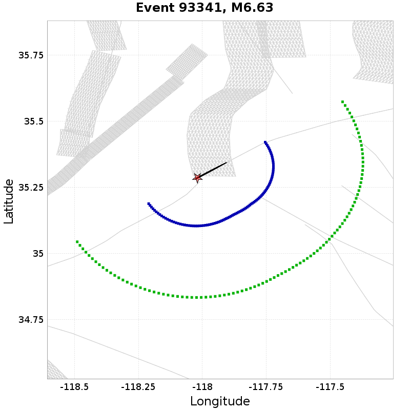
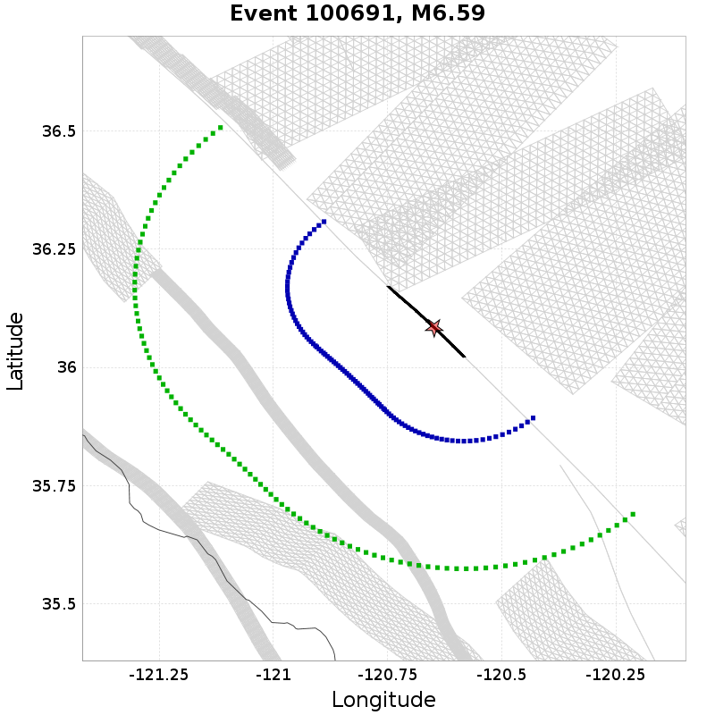
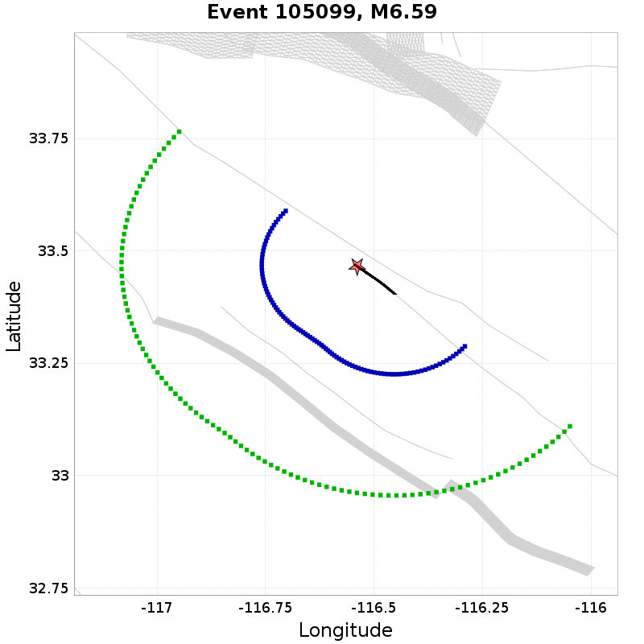
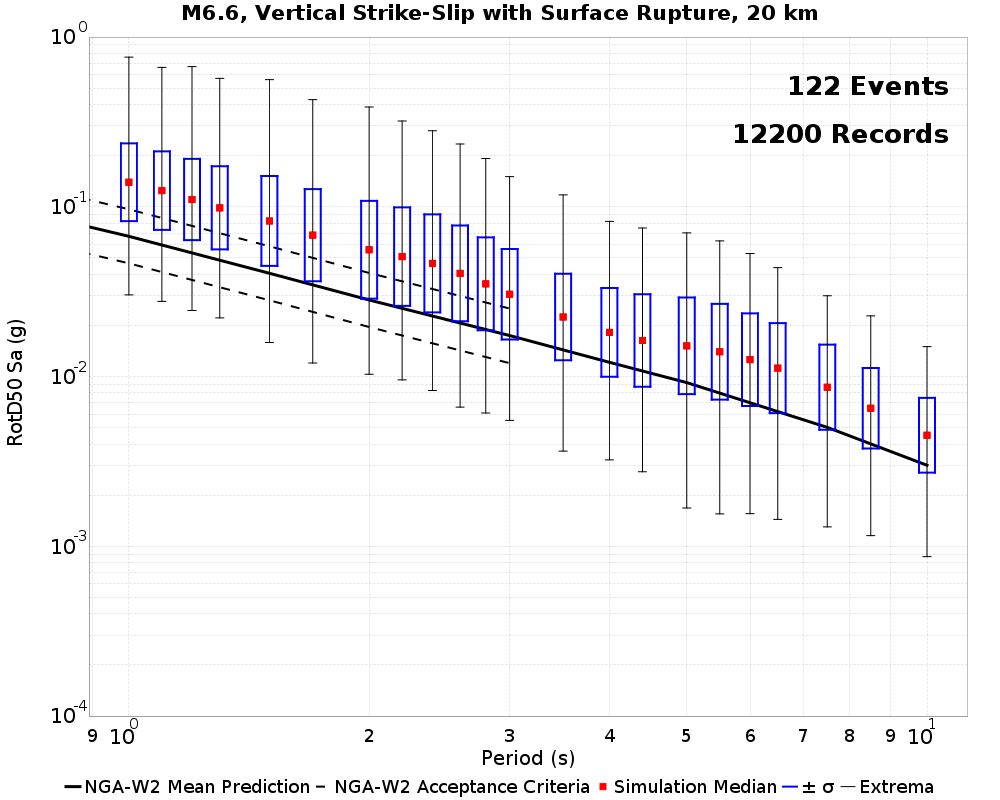
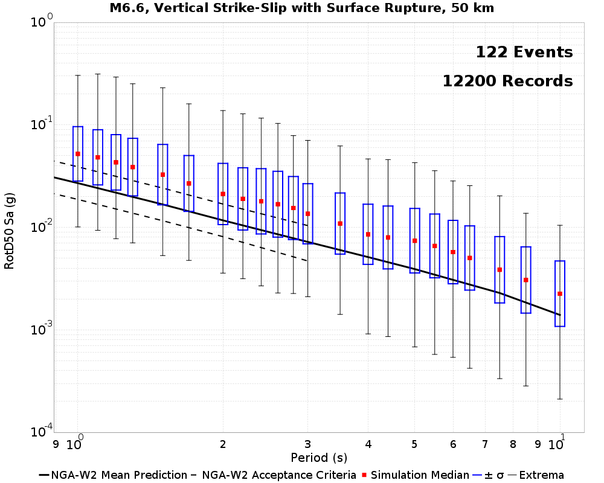
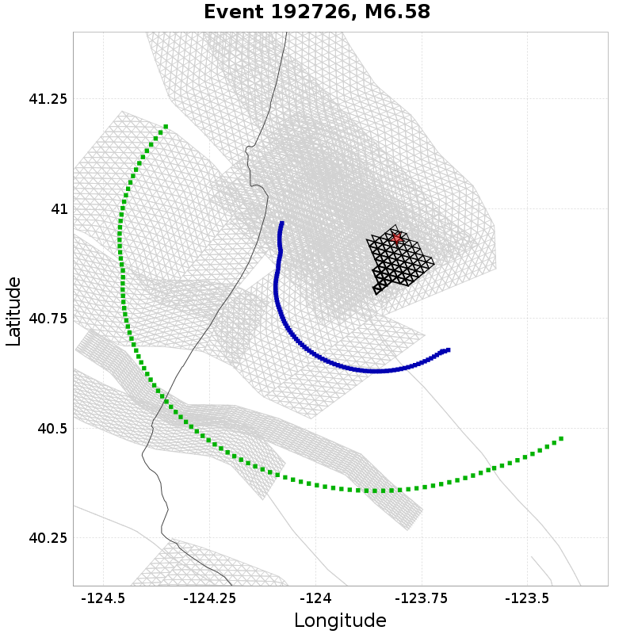
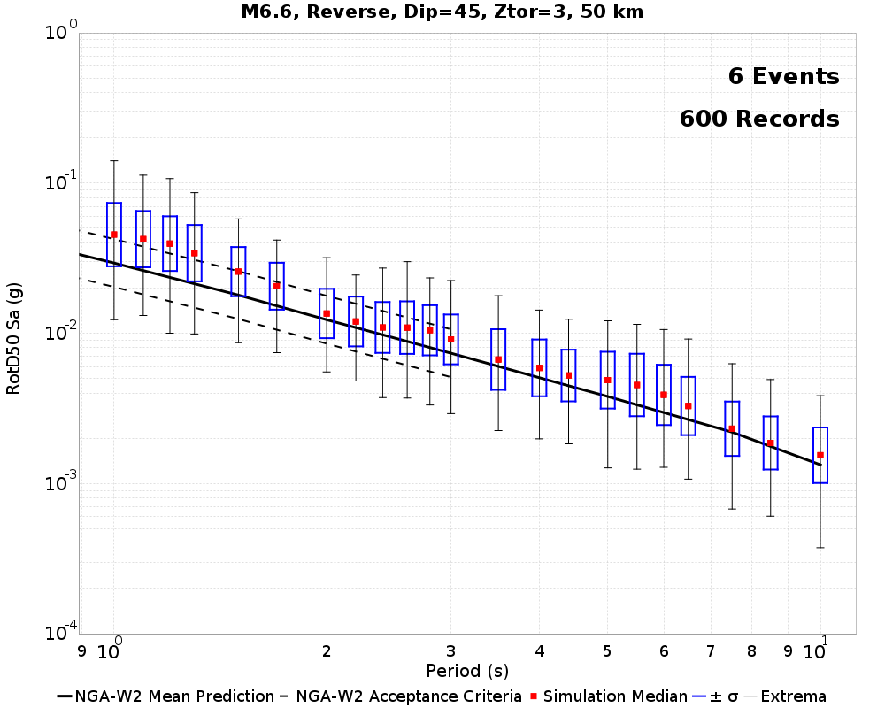

# Bruce 2829 BBP Part B Validation

[Catalog Details](../#bruce-2829)

## Table Of Contents
* [Background Information](#background-information)
* [RSQSim BBP Part B Methodology](#rsqsim-bbp-part-b-methodology)
* [Results Summary Table](#results-summary-table)
* [M6.6, Vertical Strike-Slip with Surface Rupture](#m66-vertical-strike-slip-with-surface-rupture)
  * [M6.6 SS RSQSim Rupture Match Criteria](#m66-ss-rsqsim-rupture-match-criteria)
  * [M6.6 SS 20 km Results](#m66-ss-20-km-results)
  * [M6.6 SS 50 km Results](#m66-ss-50-km-results)
* [M6.6, Reverse, Dip=45, Ztor=3](#m66-reverse-dip45-ztor3)
  * [M6.6 Reverse RSQSim Rupture Match Criteria](#m66-reverse-rsqsim-rupture-match-criteria)
  * [M6.6 Reverse 20 km Results](#m66-reverse-20-km-results)
  * [M6.6 Reverse 50 km Results](#m66-reverse-50-km-results)
## Background Information
*[(top)](#table-of-contents)*

This page reproduces the SCEC BroadBand Platform "Part B" validation exercise as defined in:

*Goulet, C. A., Abrahamson, N. A., Somerville, P. G., & Wooddell, K. E. (2014). The SCEC broadband platform validation exercise: Methodology for code validation in the context of seismic‐hazard analyses. Seismological Research Letters, 86(1), 17-26.*

The goal of this exercise was to validate BBP simulation methods (both rupture generation and ground motion simulation) against the NGA-West GMPEs (the original study used NGA-West1, we use NGA-West2) for scenario ruptures where the NGA relations are well constrained:

* M 5.5, 45°-dipping reverse, Ztor = 6 km
* M 6.2, vertical strike slip, Ztor = 4 km
* M 6.6, vertical strike slip with a surface rupture
* M 6.6, 45°-dipping reverse, Ztor = 3 km

50 rupture realizations were generated for each scenario, and 40 sites were distributed at random azimuths on the footwall side of the faults at rupture distances of 20 and 50 km. Resultant ground motions were compared against an evaluation criterion which was established so as to be wide enough to limit a pass fail grade for each scenario considered. This criterion only applies at periods up to 3s, becase data above this period is "fairly sparse and cannot provide a reliable constraint."

## RSQSim BBP Part B Methodology
*[(top)](#table-of-contents)*

We reproduce the Part B experiment using RSQSim as the rupture generator, coupled with the Graves & Pitarka ground motion simulation method. While the original BBP Part B validation exercise was prescriptive (the magnitude and fault surface for each scenario was an input to the rupture generators), we can't prescribe RSQSim ruptures. Instead we search catalogs for ruptures which are very similar to the BBP Part B scenarios, and distribute sites around those ruptures. This algorithm can be a little tricky for non-rectangular dipping ruptures. The specific matching criteria for each scenario along with example plots of ruptures and sites can be found under each scenario.

*NOTE: We only currently only consider the larger M6.6 scenarios, and spectral periods 1s or larger*

## Results Summary Table

| Scenario | 20 km | 50 km |
|-----|-----|-----|
| M6.6 SS | **[FAIL](#m66-ss-20-km-results)** | **[FAIL](#m66-ss-50-km-results)** |
| M6.6 Reverse | **[FAIL](#m66-reverse-20-km-results)** | **[FAIL](#m66-reverse-50-km-results)** |

## M6.6, Vertical Strike-Slip with Surface Rupture
*[(top)](#table-of-contents)*

### M6.6 SS RSQSim Rupture Match Criteria
*[(top)](#table-of-contents)*

122 events in the catalog match the following criteria:

* M=[6.55,6.65]
* Ztor=[0,1]
* Rake=[-180,-170] or [-10,10] or [170,180]
* Dip=90
* Linear rupture (max 0.5km deviation from ideal)

Example matches (20 km sites in Blue, 50 km sites in Geen):

|  |  |  |  |  |
|-----|-----|-----|-----|-----|
### M6.6 SS 20 km Results
*[(top)](#table-of-contents)*

Result: **FAIL**

### M6.6 SS 50 km Results
*[(top)](#table-of-contents)*

Result: **FAIL**

## M6.6, Reverse, Dip=45, Ztor=3
*[(top)](#table-of-contents)*

### M6.6 Reverse RSQSim Rupture Match Criteria
*[(top)](#table-of-contents)*

6 events in the catalog match the following criteria:

* M=[6.55,6.65]
* Ztor=[2,4]
* Rake=[80,100]
* Dip=[40,50]

Example matches (20 km sites in Blue, 50 km sites in Geen):

|  |  |  |  |  |
|-----|-----|-----|-----|-----|
### M6.6 Reverse 20 km Results
*[(top)](#table-of-contents)*

Result: **FAIL**

### M6.6 Reverse 50 km Results
*[(top)](#table-of-contents)*

Result: **FAIL**

