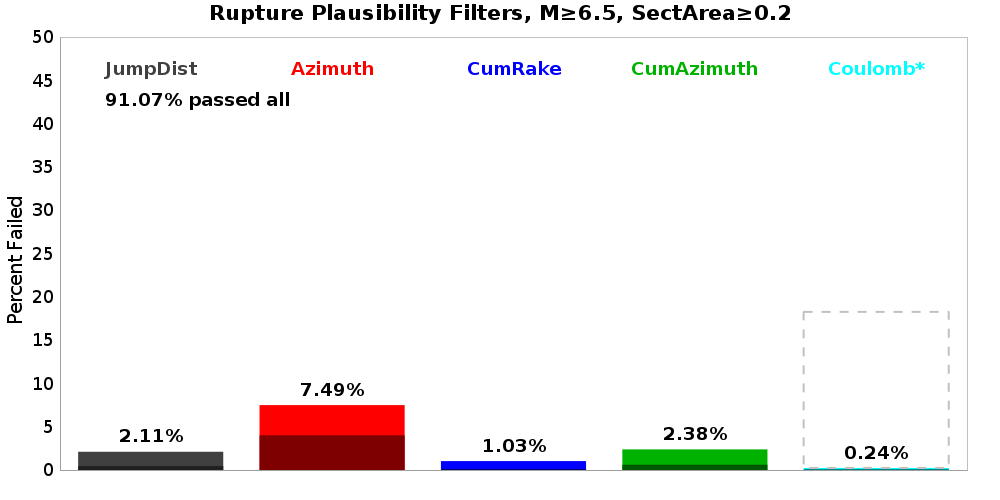
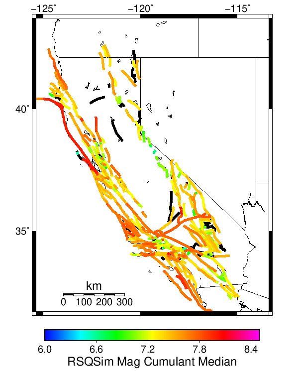
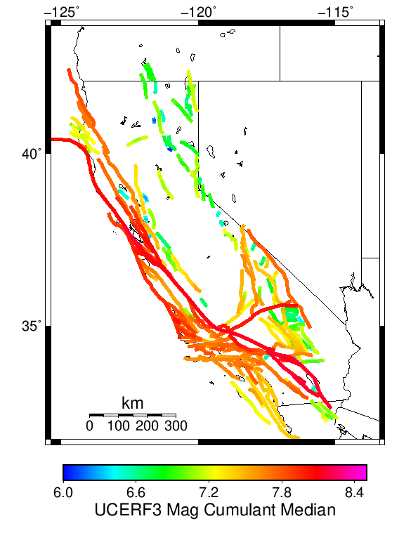
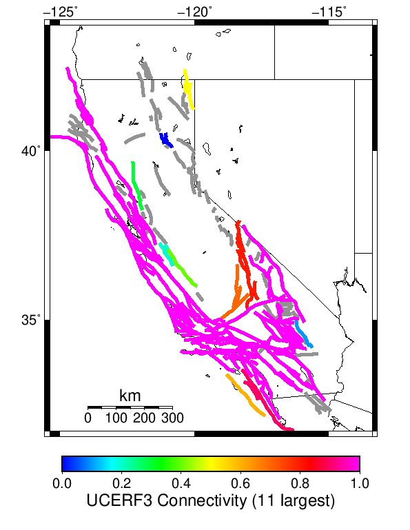

# Multi Fault Rupture Comparisons

*Subsections participate in a rupture if at least 20.0 % of its area ruptures*

[Catalog Details](../#bruce-3271)

## Table Of Contents
* [Plausibility Filter Comparisons](#plausibility-filter-comparisons)
  * [Rupture Failure Percentages](#rupture-failure-percentages)
* [1km Jump Count](#1km-jump-count)
* [Cumulant Magnitude](#cumulant-magnitude)
* [Fault Connectivity](#fault-connectivity)
## Plausibility Filter Comparisons

### Rupture Failure Percentages
*[(top)](#table-of-contents)*

## 1km Jump Count
*[(top)](#table-of-contents)*

## Cumulant Magnitude
*[(top)](#table-of-contents)*

| Bruce 3271 | UCERF3 | Difference |
|-----|-----|-----|
|  |  |  |

## Fault Connectivity
*[(top)](#table-of-contents)*

| Bruce 3271 | UCERF3 |
|-----|-----|
|  |  |

