# Bruce 3271 Parent Section MFDs

*Sections participate in a rupture if at least 20.0 % of one of its subsections (by area) ruptures*

[Catalog Details](../#bruce-3271)

## Table Of Contents
* [Calaveras](#calaveras)
  * [Calaveras (Central) 2011 CFM](#calaveras-central-2011-cfm)
  * [Calaveras (No) 2011 CFM](#calaveras-no-2011-cfm)
  * [Calaveras (So) - Paicines extension 2011 CFM](#calaveras-so---paicines-extension-2011-cfm)
  * [Calaveras (So) 2011 CFM](#calaveras-so-2011-cfm)
* [Compton](#compton)
  * [Compton](#compton)
* [Elsinore](#elsinore)
  * [Elsinore (Coyote Mountains)](#elsinore-coyote-mountains)
  * [Elsinore (Glen Ivy) rev](#elsinore-glen-ivy-rev)
  * [Elsinore (Julian)](#elsinore-julian)
  * [Elsinore (Stepovers Combined)](#elsinore-stepovers-combined)
  * [Elsinore (Temecula) rev](#elsinore-temecula-rev)
  * [Whittier alt 1](#whittier-alt-1)
* [Garlock](#garlock)
  * [Garlock (Central)](#garlock-central)
  * [Garlock (East)](#garlock-east)
  * [Garlock (West)](#garlock-west)
* [Green Valley](#green-valley)
  * [Concord 2011 CFM](#concord-2011-cfm)
  * [Green Valley 2011 CFM](#green-valley-2011-cfm)
  * [Hunting Creek - Berryessa 2011 CFM](#hunting-creek---berryessa-2011-cfm)
* [Hayward-Rodgers Creek](#hayward-rodgers-creek)
  * [Hayward (No) 2011 CFM](#hayward-no-2011-cfm)
  * [Hayward (So) 2011 CFM](#hayward-so-2011-cfm)
  * [Hayward (So) extension 2011 CFM](#hayward-so-extension-2011-cfm)
  * [Rodgers Creek - Healdsburg 2011 CFM](#rodgers-creek---healdsburg-2011-cfm)
* [Little Salmon](#little-salmon)
  * [Little Salmon (Offshore)](#little-salmon-offshore)
  * [Little Salmon (Onshore)](#little-salmon-onshore)
* [Puente Hills](#puente-hills)
  * [Puente Hills](#puente-hills)
* [San Andreas](#san-andreas)
  * [San Andreas (Big Bend)](#san-andreas-big-bend)
  * [San Andreas (Carrizo) rev](#san-andreas-carrizo-rev)
  * [San Andreas (Cholame) rev](#san-andreas-cholame-rev)
  * [San Andreas (Coachella) rev](#san-andreas-coachella-rev)
  * [San Andreas (Creeping Section) 2011 CFM](#san-andreas-creeping-section-2011-cfm)
  * [San Andreas (Mojave N)](#san-andreas-mojave-n)
  * [San Andreas (Mojave S)](#san-andreas-mojave-s)
  * [San Andreas (North Coast) 2011 CFM](#san-andreas-north-coast-2011-cfm)
  * [San Andreas (Offshore) 2011 CFM](#san-andreas-offshore-2011-cfm)
  * [San Andreas (Parkfield)](#san-andreas-parkfield)
  * [San Andreas (Peninsula) 2011 CFM](#san-andreas-peninsula-2011-cfm)
  * [San Andreas (San Bernardino N)](#san-andreas-san-bernardino-n)
  * [San Andreas (San Bernardino S)](#san-andreas-san-bernardino-s)
  * [San Andreas (San Gorgonio Pass-Garnet HIll)](#san-andreas-san-gorgonio-pass-garnet-hill)
  * [San Andreas (Santa Cruz Mts) 2011 CFM](#san-andreas-santa-cruz-mts-2011-cfm)
* [San Gregorio](#san-gregorio)
  * [San Gregorio (North) 2011 CFM](#san-gregorio-north-2011-cfm)
  * [San Gregorio (South) 2011 CFM](#san-gregorio-south-2011-cfm)
* [San Jacinto (CC to SM)](#san-jacinto-cc-to-sm)
  * [San Jacinto (Borrego)](#san-jacinto-borrego)
  * [San Jacinto (Coyote Creek)](#san-jacinto-coyote-creek)
  * [San Jacinto (Superstition Mtn)](#san-jacinto-superstition-mtn)
* [San Jacinto (SB to C)](#san-jacinto-sb-to-c)
  * [San Jacinto (Anza) rev](#san-jacinto-anza-rev)
  * [San Jacinto (Clark) rev](#san-jacinto-clark-rev)
  * [San Jacinto (San Bernardino)](#san-jacinto-san-bernardino)
  * [San Jacinto (San Jacinto Valley) rev](#san-jacinto-san-jacinto-valley-rev)
  * [San Jacinto (Stepovers Combined)](#san-jacinto-stepovers-combined)
* [Other Faults](#other-faults)
  * [Airport Lake](#airport-lake)
  * [Almanor 2011 CFM](#almanor-2011-cfm)
  * [Anacapa-Dume alt 1](#anacapa-dume-alt-1)
  * [Anaheim](#anaheim)
  * [Antelope Valley 2011](#antelope-valley-2011)
  * [Ash Hill](#ash-hill)
  * [Baker](#baker)
  * [Bartlett Springs 2011 CFM](#bartlett-springs-2011-cfm)
  * [Battle Creek 2011 CFM](#battle-creek-2011-cfm)
  * [Bear River fault zone](#bear-river-fault-zone)
  * [Bennett Valley 2011 CFM](#bennett-valley-2011-cfm)
  * [Bicycle Lake](#bicycle-lake)
  * [Big Lagoon - Bald Mtn 2011 CFM](#big-lagoon---bald-mtn-2011-cfm)
  * [Big Pine (Central)](#big-pine-central)
  * [Big Pine (East)](#big-pine-east)
  * [Big Pine (West)](#big-pine-west)
  * [Blackwater](#blackwater)
  * [Blue Cut](#blue-cut)
  * [Brawley (Seismic Zone) alt 1](#brawley-seismic-zone-alt-1)
  * [Breckenridge 2011](#breckenridge-2011)
  * [Bullion Mountains](#bullion-mountains)
  * [Burnt Mtn](#burnt-mtn)
  * [Butano 2011 CFM](#butano-2011-cfm)
  * [Cady](#cady)
  * [Calico-Hidalgo](#calico-hidalgo)
  * [Camp Rock 2011](#camp-rock-2011)
  * [Canada David (Detachment)](#canada-david-detachment)
  * [Carlsbad](#carlsbad)
  * [Carson Range (Genoa)](#carson-range-genoa)
  * [Casmalia 2011 CFM](#casmalia-2011-cfm)
  * [Cedar Mtn-Mahogany Mtn](#cedar-mtn-mahogany-mtn)
  * [Cerro Prieto](#cerro-prieto)
  * [Channel Islands Thrust](#channel-islands-thrust)
  * [Channel Islands Western Deep Ramp](#channel-islands-western-deep-ramp)
  * [Chino alt 1](#chino-alt-1)
  * [Clamshell-Sawpit](#clamshell-sawpit)
  * [Clayton](#clayton)
  * [Cleghorn](#cleghorn)
  * [Cleghorn Lake](#cleghorn-lake)
  * [Cleghorn Pass](#cleghorn-pass)
  * [Collayami 2011 CFM](#collayami-2011-cfm)
  * [Contra Costa (Lafayette) 2011 CFM](#contra-costa-lafayette-2011-cfm)
  * [Contra Costa Shear Zone (connector) 2011 CFM](#contra-costa-shear-zone-connector-2011-cfm)
  * [Coronado Bank alt1](#coronado-bank-alt1)
  * [Coyote Canyon](#coyote-canyon)
  * [Coyote Lake](#coyote-lake)
  * [Cucamonga](#cucamonga)
  * [Davis Creek](#davis-creek)
  * [Death Valley (Black Mtns Frontal)](#death-valley-black-mtns-frontal)
  * [Death Valley (Fish Lake Valley)](#death-valley-fish-lake-valley)
  * [Death Valley (No)](#death-valley-no)
  * [Death Valley (So)](#death-valley-so)
  * [Deep Springs](#deep-springs)
  * [Del Valle](#del-valle)
  * [Dog Valley](#dog-valley)
  * [Dry Mountain](#dry-mountain)
  * [Earthquake Valley](#earthquake-valley)
  * [Earthquake Valley (No  Extension)](#earthquake-valley-no--extension)
  * [Earthquake Valley (So Extension)](#earthquake-valley-so-extension)
  * [East Huasna 2011 CFM](#east-huasna-2011-cfm)
  * [Eaton Roughs 2011 CFM](#eaton-roughs-2011-cfm)
  * [Elmore Ranch](#elmore-ranch)
  * [Elysian Park (Lower CFM)](#elysian-park-lower-cfm)
  * [Elysian Park (Upper)](#elysian-park-upper)
  * [Emerson-Copper Mtn 2011](#emerson-copper-mtn-2011)
  * [Eureka Peak](#eureka-peak)
  * [Fickle Hill (alt1)](#fickle-hill-alt1)
  * [Fish Slough 2011 CFM](#fish-slough-2011-cfm)
  * [Fitzhugh Creek](#fitzhugh-creek)
  * [Fontana (Seismicity)](#fontana-seismicity)
  * [Franklin 2011 CFM](#franklin-2011-cfm)
  * [Garberville - Briceland 2011 CFM](#garberville---briceland-2011-cfm)
  * [Garlic Springs](#garlic-springs)
  * [Gillem - Big Crack 2011 CFM](#gillem---big-crack-2011-cfm)
  * [Goldstone Lake](#goldstone-lake)
  * [Goose Lake 2011 CFM](#goose-lake-2011-cfm)
  * [Gravel Hills-Harper Lk](#gravel-hills-harper-lk)
  * [Great Valley 01](#great-valley-01)
  * [Great Valley 02](#great-valley-02)
  * [Great Valley 03 Mysterious Ridge](#great-valley-03-mysterious-ridge)
  * [Great Valley 03a Dunnigan Hills](#great-valley-03a-dunnigan-hills)
  * [Great Valley 04a Trout Creek](#great-valley-04a-trout-creek)
  * [Great Valley 04b Gordon Valley](#great-valley-04b-gordon-valley)
  * [Great Valley 05 Pittsburg - Kirby Hills alt1](#great-valley-05-pittsburg---kirby-hills-alt1)
  * [Great Valley 06 (Midland) 2011 CFM alt1](#great-valley-06-midland-2011-cfm-alt1)
  * [Great Valley 07 (Orestimba)](#great-valley-07-orestimba)
  * [Great Valley 08 (Quinto)](#great-valley-08-quinto)
  * [Great Valley 09 (Laguna Seca)](#great-valley-09-laguna-seca)
  * [Great Valley 10 (Panoche)](#great-valley-10-panoche)
  * [Great Valley 11](#great-valley-11)
  * [Great Valley 12](#great-valley-12)
  * [Great Valley 13 (Coalinga)](#great-valley-13-coalinga)
  * [Great Valley 14 (Kettleman Hills)](#great-valley-14-kettleman-hills)
  * [Greenville (No) 2011 CFM](#greenville-no-2011-cfm)
  * [Greenville (So) 2011 CFM](#greenville-so-2011-cfm)
  * [Hartley Springs 2011 CFM](#hartley-springs-2011-cfm)
  * [Hat Creek-McArthur-Mayfield](#hat-creek-mcarthur-mayfield)
  * [Hector Mine](#hector-mine)
  * [Helendale-So Lockhart](#helendale-so-lockhart)
  * [Hilton Creek 2011 CFM](#hilton-creek-2011-cfm)
  * [Hollywood](#hollywood)
  * [Holser alt 1](#holser-alt-1)
  * [Homestead Valley 2011](#homestead-valley-2011)
  * [Honey Lake 2011 CFM](#honey-lake-2011-cfm)
  * [Hosgri](#hosgri)
  * [Hosgri (Extension)](#hosgri-extension)
  * [Hunter Mountain-Saline Valley](#hunter-mountain-saline-valley)
  * [Hunting Creek - Bartlett Springs connector 2011](#hunting-creek---bartlett-springs-connector-2011)
  * [Imperial](#imperial)
  * [Incline Village 2011 CFM](#incline-village-2011-cfm)
  * [Independence rev 2011](#independence-rev-2011)
  * [Jess Valley](#jess-valley)
  * [Johnson Valley (No) 2011 rev](#johnson-valley-no-2011-rev)
  * [Joshua Tree (Seismicity)](#joshua-tree-seismicity)
  * [Keddie Ridge 2011 CFM](#keddie-ridge-2011-cfm)
  * [Kern Canyon (Lake Isabella) 2011](#kern-canyon-lake-isabella-2011)
  * [Kern Canyon (North Kern) 2011](#kern-canyon-north-kern-2011)
  * [Kern Canyon (South Kern) 2011](#kern-canyon-south-kern-2011)
  * [Kickapoo](#kickapoo)
  * [King Range 2011 CFM](#king-range-2011-cfm)
  * [La Panza 2011](#la-panza-2011)
  * [Laguna Salada](#laguna-salada)
  * [Lake Isabella (Seismicity)](#lake-isabella-seismicity)
  * [Las Positas](#las-positas)
  * [Last Chance](#last-chance)
  * [Lenwood-Lockhart-Old Woman Springs](#lenwood-lockhart-old-woman-springs)
  * [Likely 2011 CFM](#likely-2011-cfm)
  * [Lions Head 2011 CFM](#lions-head-2011-cfm)
  * [Little Lake](#little-lake)
  * [Los Alamos 2011 CFM](#los-alamos-2011-cfm)
  * [Los Alamos extension](#los-alamos-extension)
  * [Los Medanos - Roe Island](#los-medanos---roe-island)
  * [Los Osos 2011](#los-osos-2011)
  * [Lost Hills](#lost-hills)
  * [Ludlow](#ludlow)
  * [Maacama 2011 CFM](#maacama-2011-cfm)
  * [Mad River (alt1)](#mad-river-alt1)
  * [Malibu Coast (Extension) alt 1](#malibu-coast-extension-alt-1)
  * [Malibu Coast alt 1](#malibu-coast-alt-1)
  * [Manix-Afton Hills](#manix-afton-hills)
  * [McKinleyville (alt1)](#mckinleyville-alt1)
  * [McLean Lake](#mclean-lake)
  * [Mendocino](#mendocino)
  * [Mission (connected) 2011 CFM](#mission-connected-2011-cfm)
  * [Mission Creek](#mission-creek)
  * [Mission Hills 2011](#mission-hills-2011)
  * [Mission Ridge-Arroyo Parida-Santa Ana](#mission-ridge-arroyo-parida-santa-ana)
  * [Mohawk Valley 2011 CFM](#mohawk-valley-2011-cfm)
  * [Mono Lake 2011 CFM](#mono-lake-2011-cfm)
  * [Monte Vista - Shannon 2011 CFM](#monte-vista---shannon-2011-cfm)
  * [Monterey Bay-Tularcitos](#monterey-bay-tularcitos)
  * [Morales (East)](#morales-east)
  * [Morales (West)](#morales-west)
  * [Mount Diablo Thrust North CFM](#mount-diablo-thrust-north-cfm)
  * [Mount Diablo Thrust South](#mount-diablo-thrust-south)
  * [Nelson Lake](#nelson-lake)
  * [Newport-Inglewood (Offshore)](#newport-inglewood-offshore)
  * [Newport-Inglewood alt 1](#newport-inglewood-alt-1)
  * [North Frontal  (East)](#north-frontal--east)
  * [North Frontal  (West)](#north-frontal--west)
  * [North Salt Lake](#north-salt-lake)
  * [North Tahoe 2011 CFM](#north-tahoe-2011-cfm)
  * [Northridge](#northridge)
  * [Northridge Hills](#northridge-hills)
  * [Oak Ridge (Onshore)](#oak-ridge-onshore)
  * [Oceanic - West Huasna](#oceanic---west-huasna)
  * [Oceanside alt1](#oceanside-alt1)
  * [Ortigalita (North)](#ortigalita-north)
  * [Ortigalita (South)](#ortigalita-south)
  * [Owens Valley](#owens-valley)
  * [Owens Valley Keough Hot Springs](#owens-valley-keough-hot-springs)
  * [Owl Lake](#owl-lake)
  * [Ozena](#ozena)
  * [Palos Verdes](#palos-verdes)
  * [Panamint Valley](#panamint-valley)
  * [Paradise](#paradise)
  * [Peralta Hills](#peralta-hills)
  * [Pilarcitos 2011 CFM](#pilarcitos-2011-cfm)
  * [Pine Mtn](#pine-mtn)
  * [Pinto Mtn](#pinto-mtn)
  * [Pisgah-Bullion Mtn-Mesquite Lk](#pisgah-bullion-mtn-mesquite-lk)
  * [Pitas Point (Lower West)](#pitas-point-lower-west)
  * [Pitas Point (Lower)-Montalvo](#pitas-point-lower-montalvo)
  * [Pittville 2011 CFM](#pittville-2011-cfm)
  * [Pleito](#pleito)
  * [Point Reyes 2011 CFM](#point-reyes-2011-cfm)
  * [Point Reyes 2011 connector](#point-reyes-2011-connector)
  * [Polaris 2011 CFM](#polaris-2011-cfm)
  * [Quien Sabe 2011 CFM](#quien-sabe-2011-cfm)
  * [Raymond](#raymond)
  * [Red Mountain](#red-mountain)
  * [Red Pass](#red-pass)
  * [Redondo Canyon alt 1](#redondo-canyon-alt-1)
  * [Reliz 2011 CFM](#reliz-2011-cfm)
  * [Richfield](#richfield)
  * [Rinconada 2011 CFM](#rinconada-2011-cfm)
  * [Robinson Creek](#robinson-creek)
  * [Rocky Ledge 2011 CFM](#rocky-ledge-2011-cfm)
  * [Rose Canyon](#rose-canyon)
  * [Round Valley](#round-valley)
  * [Russ 2011 CFM](#russ-2011-cfm)
  * [San Andreas (North Branch Mill Creek)](#san-andreas-north-branch-mill-creek)
  * [San Cayetano](#san-cayetano)
  * [San Clemente](#san-clemente)
  * [San Diego Trough north alt1](#san-diego-trough-north-alt1)
  * [San Diego Trough south](#san-diego-trough-south)
  * [San Gabriel](#san-gabriel)
  * [San Gabriel (Extension)](#san-gabriel-extension)
  * [San Gorgonio Pass](#san-gorgonio-pass)
  * [San Jacinto (Lytle Creek connector)](#san-jacinto-lytle-creek-connector)
  * [San Joaquin Hills](#san-joaquin-hills)
  * [San Jose](#san-jose)
  * [San Juan](#san-juan)
  * [San Luis Range - Oceano 2011 CFM](#san-luis-range---oceano-2011-cfm)
  * [San Luis Range - Pecho 2011 CFM](#san-luis-range---pecho-2011-cfm)
  * [San Luis Range 2011 CFM](#san-luis-range-2011-cfm)
  * [San Pedro Basin](#san-pedro-basin)
  * [San Pedro Escarpment](#san-pedro-escarpment)
  * [San Vicente](#san-vicente)
  * [Santa Cruz Catalina Ridge alt1](#santa-cruz-catalina-ridge-alt1)
  * [Santa Cruz Island](#santa-cruz-island)
  * [Santa Monica Bay](#santa-monica-bay)
  * [Santa Monica alt 1](#santa-monica-alt-1)
  * [Santa Rosa Island](#santa-rosa-island)
  * [Santa Susana East (connector)](#santa-susana-east-connector)
  * [Santa Susana alt 1](#santa-susana-alt-1)
  * [Santa Ynez (East)](#santa-ynez-east)
  * [Santa Ynez (West)](#santa-ynez-west)
  * [Santa Ynez River](#santa-ynez-river)
  * [Sargent 2011 CFM](#sargent-2011-cfm)
  * [Scodie Lineament](#scodie-lineament)
  * [Sheephole](#sheephole)
  * [Shoreline](#shoreline)
  * [Sierra Madre](#sierra-madre)
  * [Sierra Madre (San Fernando)](#sierra-madre-san-fernando)
  * [Sierra Nevada  (No Extension)](#sierra-nevada--no-extension)
  * [Silver Creek 2011 CFM](#silver-creek-2011-cfm)
  * [Simi-Santa Rosa](#simi-santa-rosa)
  * [Sisar](#sisar)
  * [Skinner Flat 2011 CFM](#skinner-flat-2011-cfm)
  * [So Sierra Nevada](#so-sierra-nevada)
  * [South Cuyama](#south-cuyama)
  * [South Klamath Lake East](#south-klamath-lake-east)
  * [South Klamath Lake West](#south-klamath-lake-west)
  * [Superstition Hills](#superstition-hills)
  * [Surprise Valley 2011 CFM](#surprise-valley-2011-cfm)
  * [Swain Ravine - Spenceville](#swain-ravine---spenceville)
  * [Table Bluff](#table-bluff)
  * [Tank Canyon](#tank-canyon)
  * [Thirty Mile Bank](#thirty-mile-bank)
  * [Tin Mountain](#tin-mountain)
  * [Towne Pass](#towne-pass)
  * [Trinidad (alt1)](#trinidad-alt1)
  * [Ventura-Pitas Point](#ventura-pitas-point)
  * [Verdugo](#verdugo)
  * [Walker Spring 2011 CFM](#walker-spring-2011-cfm)
  * [West Napa 2011 CFM](#west-napa-2011-cfm)
  * [West Tahoe](#west-tahoe)
  * [White Mountains](#white-mountains)
  * [White Wolf](#white-wolf)
  * [White Wolf (Extension)](#white-wolf-extension)
  * [Wight Way 2011 CFM](#wight-way-2011-cfm)
  * [Yorba Linda](#yorba-linda)
  * [Zayante-Vergeles 2011 CFM](#zayante-vergeles-2011-cfm)
## Calaveras
*[(top)](#table-of-contents)*

### Calaveras (Central) 2011 CFM
*[(top)](#table-of-contents)*

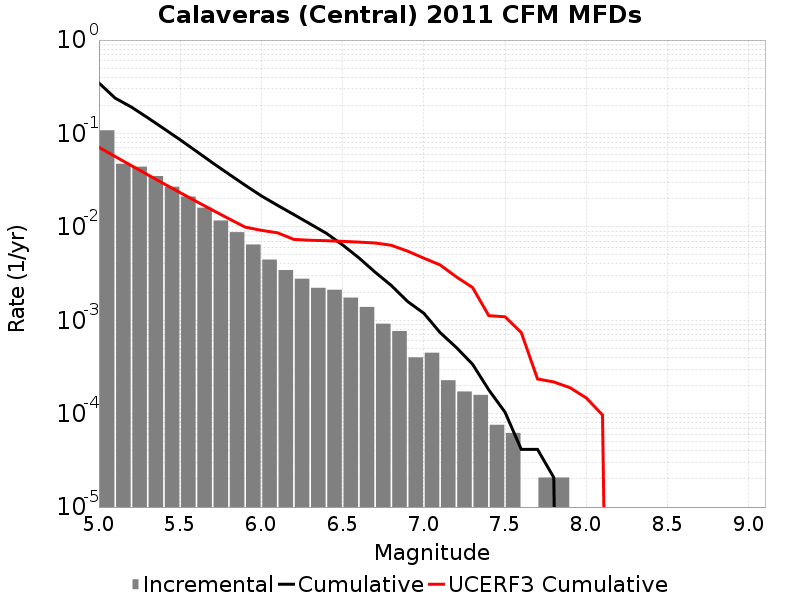

| Magnitude | Incremental Rate | Cumulative Rate | UCERF3 Cumulative Rate |
|-----|-----|-----|-----|
| 5.05 | 0.108130544 | 0.35650605 | 0.07100634 |
| 5.15 | 0.04738398 | 0.24837552 | 0.056638412 |
| 5.25 | 0.04410206 | 0.20099154 | 0.04522556 |
| 5.35 | 0.035071608 | 0.15688947 | 0.03616001 |
| 5.45 | 0.027160458 | 0.121817864 | 0.02895899 |
| 5.55 | 0.021729749 | 0.094657406 | 0.023239013 |
| 5.65 | 0.016796509 | 0.07292766 | 0.018695476 |
| 5.75 | 0.012851298 | 0.05613115 | 0.015086415 |
| 5.85 | 0.009990848 | 0.043279853 | 0.01221895 |
| 5.95 | 0.007648595 | 0.033289008 | 0.009941787 |
| 6.05 | 0.0053408886 | 0.025640411 | 0.009178028 |
| 6.15 | 0.004138671 | 0.020299522 | 0.008632215 |
| 6.25 | 0.0033095547 | 0.016160853 | 0.0073400643 |
| 6.35 | 0.0025633504 | 0.012851298 | 0.0071848882 |
| 6.45 | 0.0025218944 | 0.010287948 | 0.0071119615 |
| 6.55 | 0.0020589714 | 0.007766053 | 0.0069953245 |
| 6.65 | 0.0016927784 | 0.005707082 | 0.0068666073 |
| 6.75 | 0.0010985787 | 0.0040143034 | 0.0067191636 |
| 6.85 | 8.7748107E-4 | 0.0029157246 | 0.006352975 |
| 6.95 | 4.974696E-4 | 0.0020382435 | 0.0054970887 |
| 7.05 | 5.458347E-4 | 0.0015407739 | 0.0046224357 |
| 7.15 | 2.832813E-4 | 9.949392E-4 | 0.003914367 |
| 7.25 | 2.141883E-4 | 7.1165786E-4 | 0.0029156022 |
| 7.35 | 2.07279E-4 | 4.974696E-4 | 0.0022438315 |
| 7.45 | 1.312767E-4 | 2.901906E-4 | 0.0011201188 |
| 7.55 | 1.174581E-4 | 1.589139E-4 | 0.0010892509 |
| 7.65 | 0.0 | 4.1455798E-5 | 7.379511E-4 |
| 7.75 | 2.0727899E-5 | 4.1455798E-5 | 2.3522697E-4 |
| 7.85 | 2.0727899E-5 | 2.0727899E-5 | 2.1856277E-4 |
| 7.95 | 0.0 | 0.0 | 1.8961244E-4 |
| 8.05 | 0.0 | 0.0 | 1.4741506E-4 |
| 8.15 | 0.0 | 0.0 | 9.690319E-5 |

### Calaveras (No) 2011 CFM
*[(top)](#table-of-contents)*

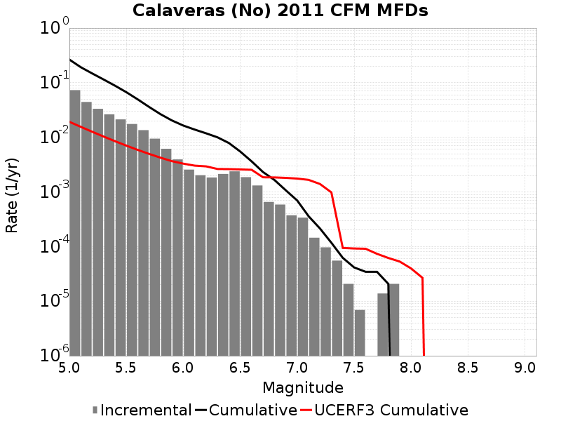

| Magnitude | Incremental Rate | Cumulative Rate | UCERF3 Cumulative Rate |
|-----|-----|-----|-----|
| 5.05 | 0.073169485 | 0.2732628 | 0.019240739 |
| 5.15 | 0.044475164 | 0.20009333 | 0.015574851 |
| 5.25 | 0.033330463 | 0.15561816 | 0.012662932 |
| 5.35 | 0.026407344 | 0.1222877 | 0.0103499135 |
| 5.45 | 0.021432647 | 0.09588035 | 0.008512617 |
| 5.55 | 0.0177569 | 0.07444771 | 0.007053201 |
| 5.65 | 0.013936058 | 0.056690805 | 0.0058939457 |
| 5.75 | 0.009956301 | 0.042754747 | 0.0049731163 |
| 5.85 | 0.0070820325 | 0.032798447 | 0.0042416756 |
| 5.95 | 0.004795054 | 0.025716415 | 0.0036606714 |
| 6.05 | 0.0032750082 | 0.02092136 | 0.0033003804 |
| 6.15 | 0.002584078 | 0.017646352 | 0.0030334198 |
| 6.25 | 0.0022731596 | 0.0150622735 | 0.0029406564 |
| 6.35 | 0.0026393526 | 0.012789114 | 0.002635047 |
| 6.45 | 0.0027568107 | 0.010149761 | 0.0026155885 |
| 6.55 | 0.0021211552 | 0.007392951 | 0.0025838017 |
| 6.65 | 0.0017549621 | 0.0052717957 | 0.0025460108 |
| 6.75 | 8.98209E-4 | 0.0035168338 | 0.0018559819 |
| 6.85 | 7.945695E-4 | 0.0026186246 | 0.0018448767 |
| 6.95 | 5.5274396E-4 | 0.0018240552 | 0.0018095034 |
| 7.05 | 4.698324E-4 | 0.0012713112 | 0.0017576138 |
| 7.15 | 2.418255E-4 | 8.014788E-4 | 0.0016647958 |
| 7.25 | 1.450953E-4 | 5.596533E-4 | 0.0013985251 |
| 7.35 | 1.5200459E-4 | 4.14558E-4 | 9.821742E-4 |
| 7.45 | 1.3818599E-4 | 2.625534E-4 | 9.4498355E-5 |
| 7.55 | 7.6002296E-5 | 1.243674E-4 | 9.2251226E-5 |
| 7.65 | 6.9093E-6 | 4.83651E-5 | 9.1217036E-5 |
| 7.75 | 2.0727899E-5 | 4.1455798E-5 | 7.3720155E-5 |
| 7.85 | 2.0727899E-5 | 2.0727899E-5 | 6.1813786E-5 |
| 7.95 | 0.0 | 0.0 | 5.319204E-5 |
| 8.05 | 0.0 | 0.0 | 3.9677194E-5 |
| 8.15 | 0.0 | 0.0 | 2.6732794E-5 |

### Calaveras (So) - Paicines extension 2011 CFM
*[(top)](#table-of-contents)*

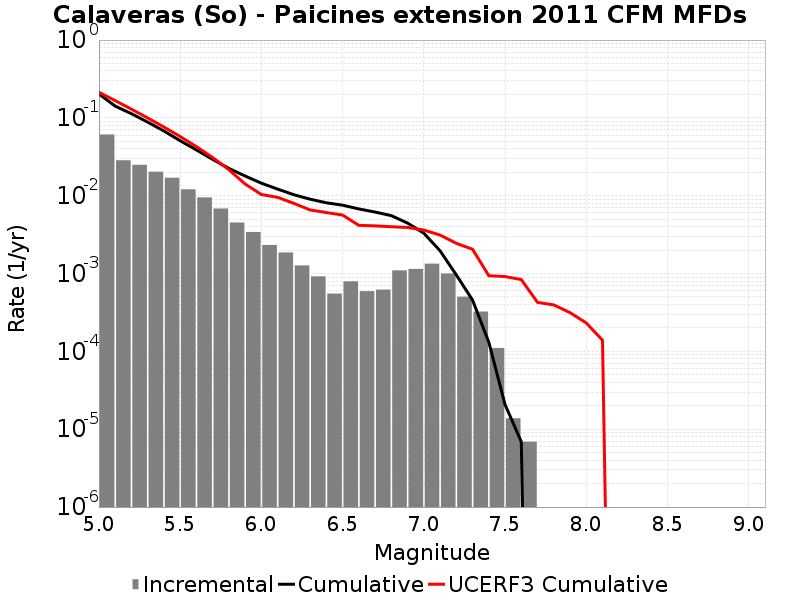

| Magnitude | Incremental Rate | Cumulative Rate | UCERF3 Cumulative Rate |
|-----|-----|-----|-----|
| 5.05 | 0.061147302 | 0.21331082 | 0.2136791 |
| 5.15 | 0.028535409 | 0.1521635 | 0.16673005 |
| 5.25 | 0.024935663 | 0.1236281 | 0.1294371 |
| 5.35 | 0.020334069 | 0.09869244 | 0.09981425 |
| 5.45 | 0.017045243 | 0.07835837 | 0.07628398 |
| 5.55 | 0.01213273 | 0.061313126 | 0.057593223 |
| 5.65 | 0.010315585 | 0.049180396 | 0.04274663 |
| 5.75 | 0.008450074 | 0.038864814 | 0.030953495 |
| 5.85 | 0.006176914 | 0.030414738 | 0.021585548 |
| 5.95 | 0.004795054 | 0.024237825 | 0.01414157 |
| 6.05 | 0.0033095547 | 0.01944277 | 0.010361473 |
| 6.15 | 0.0026669898 | 0.016133215 | 0.009531914 |
| 6.25 | 0.001706597 | 0.013466226 | 0.0079712495 |
| 6.35 | 0.0013196763 | 0.011759629 | 0.006569192 |
| 6.45 | 7.185672E-4 | 0.010439952 | 0.0060796672 |
| 6.55 | 0.0010156671 | 0.009721385 | 0.005646591 |
| 6.65 | 9.051183E-4 | 0.0087057175 | 0.0041618836 |
| 6.75 | 8.636625E-4 | 0.0078005996 | 0.004099414 |
| 6.85 | 0.0014302251 | 0.006936937 | 0.0039963736 |
| 6.95 | 0.0015407739 | 0.005506712 | 0.0039080456 |
| 7.05 | 0.0016651413 | 0.003965938 | 0.0036226988 |
| 7.15 | 0.0010985787 | 0.0023007968 | 0.0031245102 |
| 7.25 | 5.389254E-4 | 0.0012022182 | 0.0024455981 |
| 7.35 | 4.214673E-4 | 6.6329277E-4 | 0.0020529516 |
| 7.45 | 1.865511E-4 | 2.418255E-4 | 9.3939673E-4 |
| 7.55 | 4.1455798E-5 | 5.52744E-5 | 9.147618E-4 |
| 7.65 | 6.9093E-6 | 1.38186E-5 | 8.3802635E-4 |
| 7.75 | 6.9093E-6 | 6.9093E-6 | 4.2622484E-4 |
| 7.85 | 0.0 | 0.0 | 3.954782E-4 |
| 7.95 | 0.0 | 0.0 | 3.14912E-4 |
| 8.05 | 0.0 | 0.0 | 2.3191649E-4 |
| 8.15 | 0.0 | 0.0 | 1.3910608E-4 |

### Calaveras (So) 2011 CFM
*[(top)](#table-of-contents)*

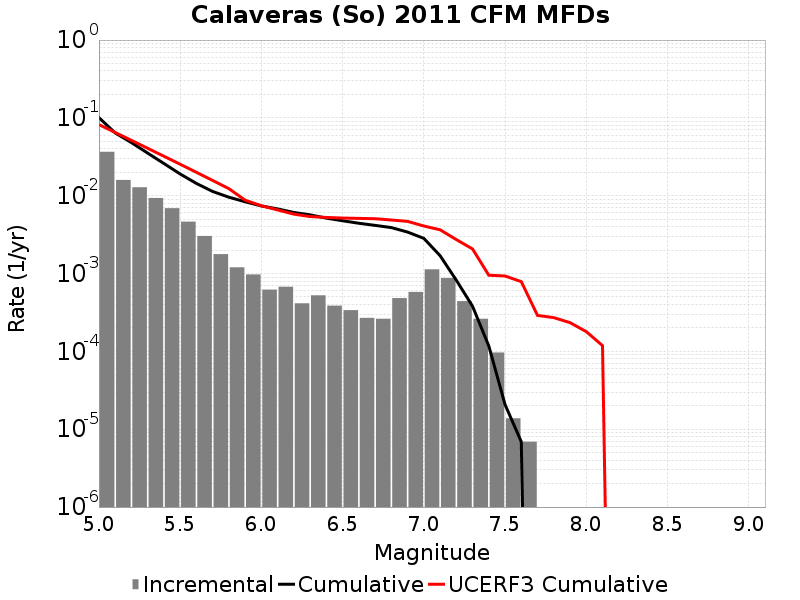

| Magnitude | Incremental Rate | Cumulative Rate | UCERF3 Cumulative Rate |
|-----|-----|-----|-----|
| 5.05 | 0.036653835 | 0.101988174 | 0.08200529 |
| 5.15 | 0.015946664 | 0.06533434 | 0.0649738 |
| 5.25 | 0.012844388 | 0.049387675 | 0.051445205 |
| 5.35 | 0.009348283 | 0.036543287 | 0.04069906 |
| 5.45 | 0.006916209 | 0.027195005 | 0.032163095 |
| 5.55 | 0.004705233 | 0.020278795 | 0.025382735 |
| 5.65 | 0.003226643 | 0.015573562 | 0.019996902 |
| 5.75 | 0.0020451527 | 0.012346919 | 0.015718777 |
| 5.85 | 0.0014094972 | 0.010301766 | 0.012320548 |
| 5.95 | 0.0010502136 | 0.008892269 | 0.00876393 |
| 6.05 | 7.1165786E-4 | 0.0078420555 | 0.0074360073 |
| 6.15 | 7.047486E-4 | 0.0071303975 | 0.006566692 |
| 6.25 | 4.3528588E-4 | 0.006425649 | 0.0058027906 |
| 6.35 | 5.458347E-4 | 0.005990363 | 0.0053947633 |
| 6.45 | 4.007394E-4 | 0.0054445285 | 0.00526252 |
| 6.55 | 3.523743E-4 | 0.005043789 | 0.0051650573 |
| 6.65 | 2.970999E-4 | 0.0046914145 | 0.0051156767 |
| 6.75 | 3.178278E-4 | 0.0043943147 | 0.0050660316 |
| 6.85 | 5.181975E-4 | 0.004076487 | 0.004874644 |
| 6.95 | 6.21837E-4 | 0.0035582895 | 0.004683963 |
| 7.05 | 0.0011607624 | 0.0029364524 | 0.004082315 |
| 7.15 | 9.051183E-4 | 0.0017756901 | 0.0036529945 |
| 7.25 | 4.6292308E-4 | 8.7057176E-4 | 0.0027331023 |
| 7.35 | 2.625534E-4 | 4.0764868E-4 | 0.002069884 |
| 7.45 | 1.036395E-4 | 1.450953E-4 | 9.5181883E-4 |
| 7.55 | 2.0727899E-5 | 4.1455798E-5 | 9.308644E-4 |
| 7.65 | 6.9093E-6 | 2.0727899E-5 | 7.872221E-4 |
| 7.75 | 6.9093E-6 | 1.38186E-5 | 2.8977467E-4 |
| 7.85 | 6.9093E-6 | 6.9093E-6 | 2.715852E-4 |
| 7.95 | 0.0 | 0.0 | 2.3403416E-4 |
| 8.05 | 0.0 | 0.0 | 1.7955832E-4 |
| 8.15 | 0.0 | 0.0 | 1.1865481E-4 |

## Compton
*[(top)](#table-of-contents)*

### Compton
*[(top)](#table-of-contents)*

| Magnitude | Incremental Rate | Cumulative Rate | UCERF3 Cumulative Rate |
|-----|-----|-----|-----|
| 5.05 | 0.018116184 | 0.048579287 | 0.011674947 |
| 5.15 | 0.0071027605 | 0.030463103 | 0.009271771 |
| 5.25 | 0.0059350887 | 0.023360344 | 0.007362859 |
| 5.35 | 0.0039313915 | 0.017425254 | 0.0058465567 |
| 5.45 | 0.0032335524 | 0.013493863 | 0.0046421154 |
| 5.55 | 0.0021833389 | 0.01026031 | 0.0036853934 |
| 5.65 | 0.0016720506 | 0.008076971 | 0.002925442 |
| 5.75 | 0.0012229461 | 0.006404921 | 0.0023217914 |
| 5.85 | 9.327555E-4 | 0.0051819747 | 0.0018422945 |
| 5.95 | 6.771114E-4 | 0.0042492193 | 0.0014614166 |
| 6.05 | 6.0801837E-4 | 0.003572108 | 0.0011716459 |
| 6.15 | 3.523743E-4 | 0.0029640896 | 9.528949E-4 |
| 6.25 | 3.661929E-4 | 0.0026117153 | 8.1629504E-4 |
| 6.35 | 5.389254E-4 | 0.0022455226 | 7.1803347E-4 |
| 6.45 | 3.45465E-4 | 0.001706597 | 6.4705405E-4 |
| 6.55 | 2.141883E-4 | 0.0013611321 | 6.004227E-4 |
| 6.65 | 1.5200459E-4 | 0.0011469438 | 5.642693E-4 |
| 6.75 | 1.3818599E-4 | 9.949392E-4 | 5.3555163E-4 |
| 6.85 | 2.210976E-4 | 8.567532E-4 | 5.22339E-4 |
| 6.95 | 1.6582319E-4 | 6.356556E-4 | 5.118439E-4 |
| 7.05 | 4.1455798E-5 | 4.698324E-4 | 3.8737405E-4 |
| 7.15 | 8.98209E-5 | 4.283766E-4 | 3.6151873E-4 |
| 7.25 | 4.1455798E-5 | 3.385557E-4 | 3.1041077E-4 |
| 7.35 | 6.9092996E-5 | 2.970999E-4 | 1.9425052E-4 |
| 7.45 | 9.67302E-5 | 2.280069E-4 | 1.0934677E-4 |
| 7.55 | 4.83651E-5 | 1.312767E-4 | 8.296116E-5 |
| 7.65 | 4.1455798E-5 | 8.2911596E-5 | 6.655909E-5 |
| 7.75 | 2.76372E-5 | 4.1455798E-5 | 2.3591083E-5 |
| 7.85 | 6.9093E-6 | 1.38186E-5 | 5.843135E-7 |
| 7.95 | 0.0 | 6.9093E-6 | 7.895737E-8 |
| 8.05 | 6.9093E-6 | 6.9093E-6 | 0.0 |

## Elsinore
*[(top)](#table-of-contents)*

### Elsinore (Coyote Mountains)
*[(top)](#table-of-contents)*

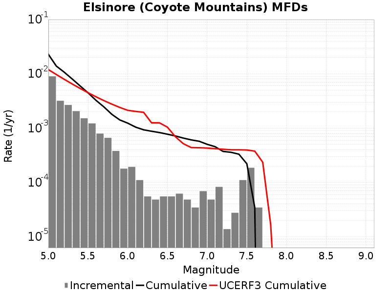

| Magnitude | Incremental Rate | Cumulative Rate | UCERF3 Cumulative Rate |
|-----|-----|-----|-----|
| 5.05 | 0.009002818 | 0.022925057 | 0.011991588 |
| 5.15 | 0.0031920965 | 0.01392224 | 0.009737008 |
| 5.25 | 0.002673899 | 0.010730143 | 0.007946132 |
| 5.35 | 0.0020589714 | 0.008056244 | 0.0065235877 |
| 5.45 | 0.001520046 | 0.005997272 | 0.005393621 |
| 5.55 | 0.0012229461 | 0.004477226 | 0.0044960566 |
| 5.65 | 7.945695E-4 | 0.0032542802 | 0.0037830956 |
| 5.75 | 6.6329277E-4 | 0.0024597107 | 0.0032167707 |
| 5.85 | 3.800115E-4 | 0.001796418 | 0.0027669228 |
| 5.95 | 1.796418E-4 | 0.0014164065 | 0.0024095958 |
| 6.05 | 1.934604E-4 | 0.0012367647 | 0.00212996 |
| 6.15 | 1.105488E-4 | 0.0010433043 | 0.0020342406 |
| 6.25 | 5.52744E-5 | 9.327555E-4 | 0.001958211 |
| 6.35 | 4.83651E-5 | 8.7748107E-4 | 0.0012543036 |
| 6.45 | 5.52744E-5 | 8.29116E-4 | 0.0012524538 |
| 6.55 | 5.52744E-5 | 7.738416E-4 | 0.0010427121 |
| 6.65 | 6.21837E-5 | 7.185672E-4 | 6.9555116E-4 |
| 6.75 | 4.83651E-5 | 6.5638346E-4 | 5.1788625E-4 |
| 6.85 | 3.4546498E-5 | 6.0801837E-4 | 4.3910297E-4 |
| 6.95 | 6.9092996E-5 | 5.734719E-4 | 4.3591773E-4 |
| 7.05 | 4.83651E-5 | 5.0437887E-4 | 4.300237E-4 |
| 7.15 | 8.2911596E-5 | 4.560138E-4 | 4.1896713E-4 |
| 7.25 | 1.38186E-5 | 3.731022E-4 | 4.0889363E-4 |
| 7.35 | 2.76372E-5 | 3.592836E-4 | 3.998658E-4 |
| 7.45 | 1.105488E-4 | 3.3164638E-4 | 3.993115E-4 |
| 7.55 | 1.865511E-4 | 2.210976E-4 | 3.9636964E-4 |
| 7.65 | 3.4546498E-5 | 3.4546498E-5 | 3.7732732E-4 |
| 7.75 | 0.0 | 0.0 | 2.3617015E-4 |
| 7.85 | 0.0 | 0.0 | 1.6817838E-5 |
| 7.95 | 0.0 | 0.0 | 5.3128286E-8 |

### Elsinore (Glen Ivy) rev
*[(top)](#table-of-contents)*

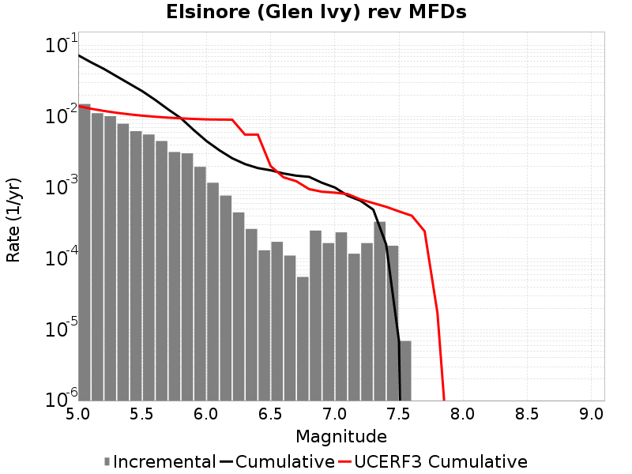

| Magnitude | Incremental Rate | Cumulative Rate | UCERF3 Cumulative Rate |
|-----|-----|-----|-----|
| 5.05 | 0.015138276 | 0.074281886 | 0.014121826 |
| 5.15 | 0.011234522 | 0.059143607 | 0.012993433 |
| 5.25 | 0.010198127 | 0.047909085 | 0.012097118 |
| 5.35 | 0.007973332 | 0.037710957 | 0.01138515 |
| 5.45 | 0.006266735 | 0.029737627 | 0.010819614 |
| 5.55 | 0.00562417 | 0.023470892 | 0.010370393 |
| 5.65 | 0.0045739566 | 0.017846722 | 0.010013564 |
| 5.75 | 0.003247371 | 0.013272765 | 0.009730124 |
| 5.85 | 0.003178278 | 0.010025394 | 0.00950498 |
| 5.95 | 0.00207279 | 0.006847116 | 0.009326142 |
| 6.05 | 0.0011953089 | 0.0047743265 | 0.009184804 |
| 6.15 | 8.29116E-4 | 0.0035790172 | 0.009137934 |
| 6.25 | 4.698324E-4 | 0.0027499013 | 0.009102031 |
| 6.35 | 2.7637198E-4 | 0.002280069 | 0.0056058615 |
| 6.45 | 1.312767E-4 | 0.002003697 | 0.005605713 |
| 6.55 | 1.865511E-4 | 0.0018724203 | 0.002021401 |
| 6.65 | 1.174581E-4 | 0.0016858692 | 0.0014035564 |
| 6.75 | 5.52744E-5 | 0.0015684111 | 0.0012356669 |
| 6.85 | 2.556441E-4 | 0.0015131367 | 9.556008E-4 |
| 6.95 | 1.865511E-4 | 0.0012574926 | 8.784625E-4 |
| 7.05 | 2.7637198E-4 | 0.0010709414 | 8.5197267E-4 |
| 7.15 | 1.243674E-4 | 7.945695E-4 | 8.139407E-4 |
| 7.25 | 1.796418E-4 | 6.702021E-4 | 6.842041E-4 |
| 7.35 | 3.3164638E-4 | 4.905603E-4 | 6.073638E-4 |
| 7.45 | 1.5200459E-4 | 1.589139E-4 | 5.3837354E-4 |
| 7.55 | 6.9093E-6 | 6.9093E-6 | 4.642789E-4 |
| 7.65 | 0.0 | 0.0 | 4.0315872E-4 |
| 7.75 | 0.0 | 0.0 | 2.4354857E-4 |
| 7.85 | 0.0 | 0.0 | 1.7038972E-5 |
| 7.95 | 0.0 | 0.0 | 7.275435E-8 |

### Elsinore (Julian)
*[(top)](#table-of-contents)*

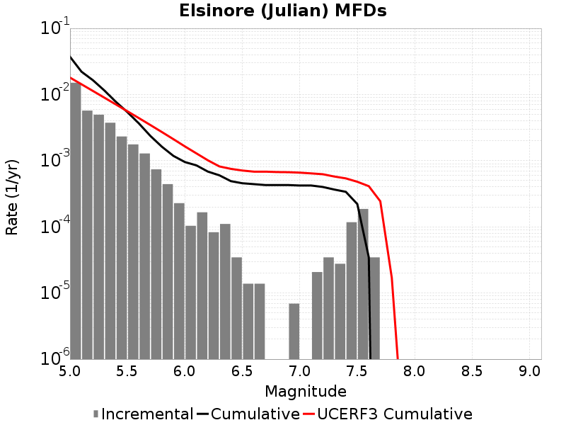

| Magnitude | Incremental Rate | Cumulative Rate | UCERF3 Cumulative Rate |
|-----|-----|-----|-----|
| 5.05 | 0.015069183 | 0.037959695 | 0.018033268 |
| 5.15 | 0.005713991 | 0.02289051 | 0.014287607 |
| 5.25 | 0.004953968 | 0.01717652 | 0.011312321 |
| 5.35 | 0.0037448406 | 0.012222552 | 0.008948968 |
| 5.45 | 0.0023215248 | 0.008477711 | 0.0070716897 |
| 5.55 | 0.0017618715 | 0.006156186 | 0.0055805147 |
| 5.65 | 0.0012989484 | 0.0043943147 | 0.004396032 |
| 5.75 | 8.567532E-4 | 0.0030953663 | 0.0034551644 |
| 5.85 | 5.5274396E-4 | 0.002238613 | 0.0027078064 |
| 5.95 | 3.938301E-4 | 0.0016858692 | 0.002114159 |
| 6.05 | 2.141883E-4 | 0.001292039 | 0.0016426508 |
| 6.15 | 2.418255E-4 | 0.0010778508 | 0.0012898152 |
| 6.25 | 8.2911596E-5 | 8.360253E-4 | 0.0010127154 |
| 6.35 | 1.243674E-4 | 7.531137E-4 | 8.1898825E-4 |
| 6.45 | 5.52744E-5 | 6.287463E-4 | 7.5249025E-4 |
| 6.55 | 3.4546498E-5 | 5.734719E-4 | 7.10004E-4 |
| 6.65 | 1.38186E-5 | 5.389254E-4 | 6.830913E-4 |
| 6.75 | 0.0 | 5.251068E-4 | 6.830913E-4 |
| 6.85 | 6.9093E-6 | 5.251068E-4 | 6.7360536E-4 |
| 6.95 | 6.9093E-6 | 5.181975E-4 | 6.7001267E-4 |
| 7.05 | 0.0 | 5.112882E-4 | 6.595085E-4 |
| 7.15 | 2.76372E-5 | 5.112882E-4 | 6.4260286E-4 |
| 7.25 | 4.1455798E-5 | 4.83651E-4 | 6.2432955E-4 |
| 7.35 | 4.83651E-5 | 4.421952E-4 | 5.76358E-4 |
| 7.45 | 1.6582319E-4 | 3.938301E-4 | 5.403196E-4 |
| 7.55 | 1.934604E-4 | 2.280069E-4 | 4.8031664E-4 |
| 7.65 | 3.4546498E-5 | 3.4546498E-5 | 4.117878E-4 |
| 7.75 | 0.0 | 0.0 | 2.4348023E-4 |
| 7.85 | 0.0 | 0.0 | 1.7035798E-5 |
| 7.95 | 0.0 | 0.0 | 7.275435E-8 |

### Elsinore (Stepovers Combined)
*[(top)](#table-of-contents)*

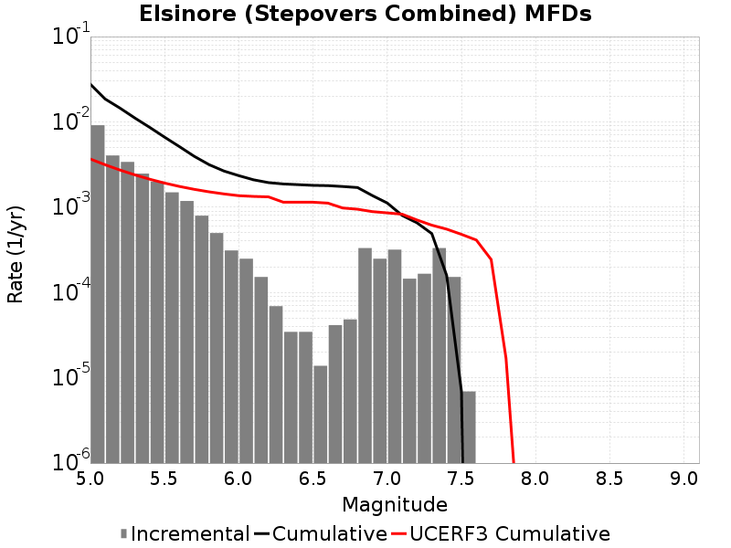

| Magnitude | Incremental Rate | Cumulative Rate | UCERF3 Cumulative Rate |
|-----|-----|-----|-----|
| 5.05 | 0.009134094 | 0.027796114 | 0.0036683376 |
| 5.15 | 0.004035031 | 0.018662019 | 0.0031417839 |
| 5.25 | 0.0033924663 | 0.014626988 | 0.0027235271 |
| 5.35 | 0.0024735294 | 0.011234522 | 0.002391294 |
| 5.45 | 0.0019967877 | 0.008760992 | 0.002127392 |
| 5.55 | 0.0014924088 | 0.0067642047 | 0.0019177671 |
| 5.65 | 0.0011814903 | 0.0052717957 | 0.0017512561 |
| 5.75 | 8.083881E-4 | 0.0040903054 | 0.0016189917 |
| 5.85 | 5.458347E-4 | 0.0032819174 | 0.0015139304 |
| 5.95 | 3.385557E-4 | 0.0027360828 | 0.0014304772 |
| 6.05 | 2.694627E-4 | 0.002397527 | 0.001364188 |
| 6.15 | 1.5200459E-4 | 0.0021280644 | 0.0013376047 |
| 6.25 | 7.6002296E-5 | 0.0019760597 | 0.0013208746 |
| 6.35 | 3.4546498E-5 | 0.0019000574 | 0.0011440769 |
| 6.45 | 3.4546498E-5 | 0.001865511 | 0.0011440769 |
| 6.55 | 2.76372E-5 | 0.0018309645 | 0.0011440769 |
| 6.65 | 4.1455798E-5 | 0.0018033272 | 0.0011164121 |
| 6.75 | 4.83651E-5 | 0.0017618715 | 9.78477E-4 |
| 6.85 | 3.3164638E-4 | 0.0017135064 | 9.466718E-4 |
| 6.95 | 2.556441E-4 | 0.00138186 | 8.8735047E-4 |
| 7.05 | 3.178278E-4 | 0.0011262159 | 8.5773336E-4 |
| 7.15 | 1.450953E-4 | 8.083881E-4 | 8.281868E-4 |
| 7.25 | 1.727325E-4 | 6.6329277E-4 | 7.083638E-4 |
| 7.35 | 3.3164638E-4 | 4.905603E-4 | 6.15456E-4 |
| 7.45 | 1.5200459E-4 | 1.589139E-4 | 5.531482E-4 |
| 7.55 | 6.9093E-6 | 6.9093E-6 | 4.8052153E-4 |
| 7.65 | 0.0 | 0.0 | 4.1213454E-4 |
| 7.75 | 0.0 | 0.0 | 2.4353416E-4 |
| 7.85 | 0.0 | 0.0 | 1.7038972E-5 |
| 7.95 | 0.0 | 0.0 | 7.275435E-8 |

### Elsinore (Temecula) rev
*[(top)](#table-of-contents)*

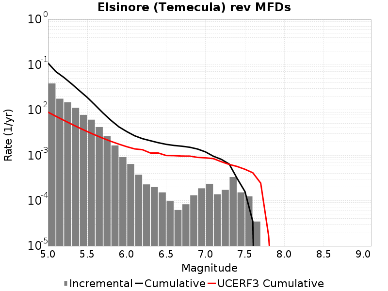

| Magnitude | Incremental Rate | Cumulative Rate | UCERF3 Cumulative Rate |
|-----|-----|-----|-----|
| 5.05 | 0.03857462 | 0.110085875 | 0.008987465 |
| 5.15 | 0.017770719 | 0.07151125 | 0.0072881035 |
| 5.25 | 0.014785902 | 0.053740535 | 0.0059382524 |
| 5.35 | 0.011206885 | 0.038954634 | 0.0048660277 |
| 5.45 | 0.00779369 | 0.027747748 | 0.0040143295 |
| 5.55 | 0.0061147306 | 0.019954057 | 0.0033378014 |
| 5.65 | 0.004235401 | 0.013839328 | 0.0028004162 |
| 5.75 | 0.0027982665 | 0.009603927 | 0.0023735557 |
| 5.85 | 0.0018102366 | 0.00680566 | 0.0020344886 |
| 5.95 | 0.0010916694 | 0.004995424 | 0.0017651579 |
| 6.05 | 8.2220667E-4 | 0.0039037545 | 0.001551221 |
| 6.15 | 4.421952E-4 | 0.0030815478 | 0.0013865472 |
| 6.25 | 2.556441E-4 | 0.0026393526 | 0.0013287283 |
| 6.35 | 2.280069E-4 | 0.0023837085 | 0.0011263378 |
| 6.45 | 1.5200459E-4 | 0.0021557016 | 0.0011247247 |
| 6.55 | 9.67302E-5 | 0.002003697 | 9.908669E-4 |
| 6.65 | 6.9092996E-5 | 0.0019069668 | 9.83132E-4 |
| 6.75 | 9.67302E-5 | 0.0018378737 | 9.6371514E-4 |
| 6.85 | 2.07279E-4 | 0.0017411435 | 9.598005E-4 |
| 6.95 | 2.210976E-4 | 0.0015338645 | 8.996513E-4 |
| 7.05 | 2.556441E-4 | 0.0013127669 | 8.7951333E-4 |
| 7.15 | 1.450953E-4 | 0.0010571228 | 8.45362E-4 |
| 7.25 | 1.865511E-4 | 9.120276E-4 | 7.228232E-4 |
| 7.35 | 3.3164638E-4 | 7.254765E-4 | 6.301561E-4 |
| 7.45 | 1.934604E-4 | 3.938301E-4 | 5.6804763E-4 |
| 7.55 | 1.6582319E-4 | 2.003697E-4 | 4.9241615E-4 |
| 7.65 | 3.4546498E-5 | 3.4546498E-5 | 4.1212162E-4 |
| 7.75 | 0.0 | 0.0 | 2.4352365E-4 |
| 7.85 | 0.0 | 0.0 | 1.7038972E-5 |
| 7.95 | 0.0 | 0.0 | 7.275435E-8 |

### Whittier alt 1
*[(top)](#table-of-contents)*

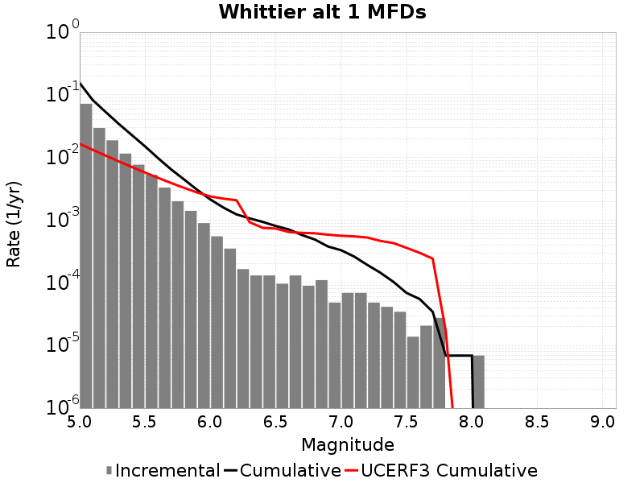

| Magnitude | Incremental Rate | Cumulative Rate | UCERF3 Cumulative Rate |
|-----|-----|-----|-----|
| 5.05 | 0.07217455 | 0.15659237 | 0.016542327 |
| 5.15 | 0.02959253 | 0.08441783 | 0.013300066 |
| 5.25 | 0.018807115 | 0.054825295 | 0.010724647 |
| 5.35 | 0.011566168 | 0.03601818 | 0.008678919 |
| 5.45 | 0.0076831416 | 0.024452012 | 0.007053938 |
| 5.55 | 0.0053132516 | 0.01676887 | 0.005763171 |
| 5.65 | 0.0033855569 | 0.011455619 | 0.0047378778 |
| 5.75 | 0.002141883 | 0.008070062 | 0.003923459 |
| 5.85 | 0.0016236855 | 0.0059281792 | 0.0032765425 |
| 5.95 | 0.0011054879 | 0.004304494 | 0.0027626788 |
| 6.05 | 6.6329277E-4 | 0.003199006 | 0.0023952837 |
| 6.15 | 4.14558E-4 | 0.0025357131 | 0.0022105954 |
| 6.25 | 2.349162E-4 | 0.0021211552 | 0.0020805672 |
| 6.35 | 1.865511E-4 | 0.0018862389 | 9.297644E-4 |
| 6.45 | 1.3818599E-4 | 0.0016996878 | 7.5589406E-4 |
| 6.55 | 1.312767E-4 | 0.0015615018 | 7.3693617E-4 |
| 6.65 | 1.865511E-4 | 0.0014302251 | 6.471466E-4 |
| 6.75 | 1.105488E-4 | 0.001243674 | 6.284317E-4 |
| 6.85 | 1.6582319E-4 | 0.0011331252 | 6.181412E-4 |
| 6.95 | 1.3818599E-4 | 9.67302E-4 | 5.8750174E-4 |
| 7.05 | 1.450953E-4 | 8.29116E-4 | 5.643572E-4 |
| 7.15 | 1.934604E-4 | 6.840207E-4 | 5.522244E-4 |
| 7.25 | 1.312767E-4 | 4.905603E-4 | 5.293254E-4 |
| 7.35 | 1.796418E-4 | 3.592836E-4 | 4.6771878E-4 |
| 7.45 | 8.2911596E-5 | 1.796418E-4 | 4.316059E-4 |
| 7.55 | 2.0727899E-5 | 9.67302E-5 | 3.62195E-4 |
| 7.65 | 3.4546498E-5 | 7.6002296E-5 | 3.0193754E-4 |
| 7.75 | 2.76372E-5 | 4.1455798E-5 | 2.4357994E-4 |
| 7.85 | 6.9093E-6 | 1.38186E-5 | 1.7038972E-5 |
| 7.95 | 0.0 | 6.9093E-6 | 7.275435E-8 |
| 8.05 | 6.9093E-6 | 6.9093E-6 | 0.0 |

## Garlock
*[(top)](#table-of-contents)*

### Garlock (Central)
*[(top)](#table-of-contents)*

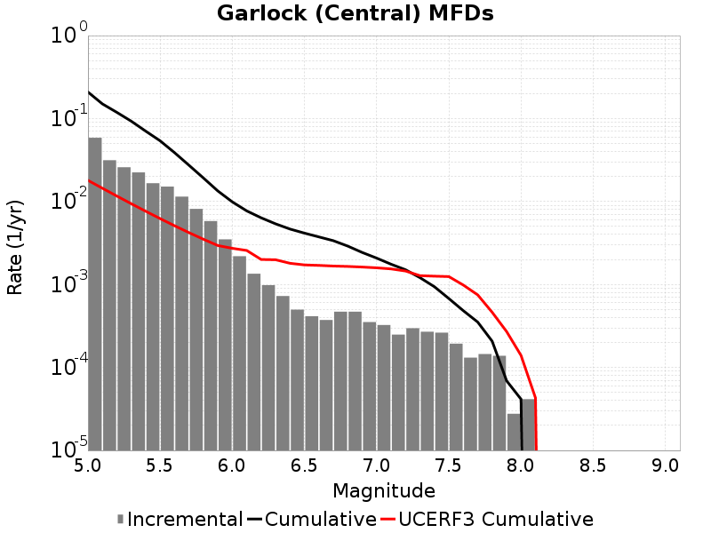

| Magnitude | Incremental Rate | Cumulative Rate | UCERF3 Cumulative Rate |
|-----|-----|-----|-----|
| 5.05 | 0.0586185 | 0.21001507 | 0.018005634 |
| 5.15 | 0.031444225 | 0.15139657 | 0.01446269 |
| 5.25 | 0.025875328 | 0.11995236 | 0.011648429 |
| 5.35 | 0.022420678 | 0.09407703 | 0.0094129825 |
| 5.45 | 0.016609957 | 0.07165635 | 0.007637304 |
| 5.55 | 0.015145185 | 0.05504639 | 0.006226832 |
| 5.65 | 0.011517803 | 0.039901208 | 0.0051064547 |
| 5.75 | 0.008318797 | 0.028383404 | 0.004216507 |
| 5.85 | 0.005976544 | 0.020064607 | 0.003509597 |
| 5.95 | 0.0036204732 | 0.014088063 | 0.002948078 |
| 6.05 | 0.0022662503 | 0.010467589 | 0.002730237 |
| 6.15 | 0.0014164065 | 0.008201339 | 0.0025708394 |
| 6.25 | 0.0010433043 | 0.0067849327 | 0.0020021272 |
| 6.35 | 7.60023E-4 | 0.0057416284 | 0.0019867348 |
| 6.45 | 5.734719E-4 | 0.0049816053 | 0.0018011578 |
| 6.55 | 4.698324E-4 | 0.004408133 | 0.0017220217 |
| 6.65 | 4.214673E-4 | 0.003938301 | 0.0016993036 |
| 6.75 | 4.698324E-4 | 0.0035168338 | 0.0016690122 |
| 6.85 | 4.698324E-4 | 0.0030470013 | 0.001650677 |
| 6.95 | 3.731022E-4 | 0.0025771689 | 0.0016228089 |
| 7.05 | 4.007394E-4 | 0.0022040666 | 0.0015885318 |
| 7.15 | 2.625534E-4 | 0.0018033272 | 0.0015415144 |
| 7.25 | 3.109185E-4 | 0.0015407739 | 0.001453464 |
| 7.35 | 2.694627E-4 | 0.0012298553 | 0.0012780061 |
| 7.45 | 2.625534E-4 | 9.603927E-4 | 0.0012599839 |
| 7.55 | 1.934604E-4 | 6.978393E-4 | 0.0012453462 |
| 7.65 | 1.5200459E-4 | 5.0437887E-4 | 9.850117E-4 |
| 7.75 | 1.450953E-4 | 3.523743E-4 | 7.492929E-4 |
| 7.85 | 1.3818599E-4 | 2.07279E-4 | 4.626055E-4 |
| 7.95 | 2.76372E-5 | 6.9092996E-5 | 2.710637E-4 |
| 8.05 | 4.1455798E-5 | 4.1455798E-5 | 1.3957628E-4 |
| 8.15 | 0.0 | 0.0 | 4.3051485E-5 |

### Garlock (East)
*[(top)](#table-of-contents)*

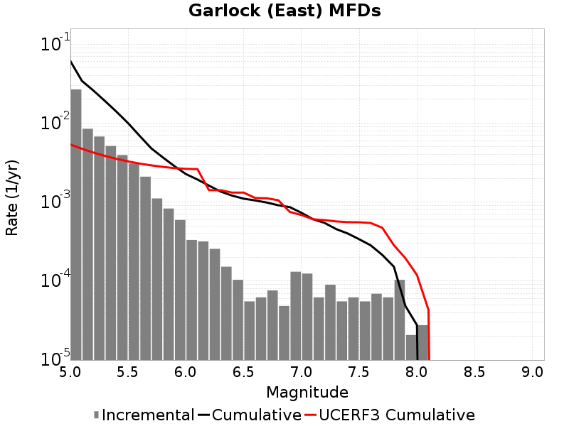

| Magnitude | Incremental Rate | Cumulative Rate | UCERF3 Cumulative Rate |
|-----|-----|-----|-----|
| 5.05 | 0.026780447 | 0.06429104 | 0.0053692083 |
| 5.15 | 0.008491529 | 0.03751059 | 0.0047402694 |
| 5.25 | 0.0067711137 | 0.02901906 | 0.004240685 |
| 5.35 | 0.0051405192 | 0.022247946 | 0.0038438514 |
| 5.45 | 0.003938301 | 0.017107427 | 0.003528635 |
| 5.55 | 0.0031160943 | 0.013169126 | 0.0032782499 |
| 5.65 | 0.0024458922 | 0.010053031 | 0.003079362 |
| 5.75 | 0.0016444133 | 0.007607139 | 0.0029213796 |
| 5.85 | 0.0014924088 | 0.0059627257 | 0.0027958897 |
| 5.95 | 0.0011331252 | 0.004470317 | 0.0026962096 |
| 6.05 | 6.425649E-4 | 0.0033371919 | 0.0026403416 |
| 6.15 | 5.320161E-4 | 0.002694627 | 0.002615184 |
| 6.25 | 3.385557E-4 | 0.0021626109 | 0.0014165178 |
| 6.35 | 2.141883E-4 | 0.0018240552 | 0.0014165178 |
| 6.45 | 1.6582319E-4 | 0.0016098669 | 0.0013204123 |
| 6.55 | 8.98209E-5 | 0.0014440437 | 0.0013204123 |
| 6.65 | 1.105488E-4 | 0.0013542228 | 0.0011279639 |
| 6.75 | 8.2911596E-5 | 0.001243674 | 0.0011197259 |
| 6.85 | 6.9092996E-5 | 0.0011607624 | 0.0010555562 |
| 6.95 | 1.865511E-4 | 0.0010916694 | 7.508506E-4 |
| 7.05 | 1.450953E-4 | 9.051183E-4 | 6.866739E-4 |
| 7.15 | 1.105488E-4 | 7.60023E-4 | 6.059132E-4 |
| 7.25 | 9.67302E-5 | 6.494742E-4 | 5.922774E-4 |
| 7.35 | 5.52744E-5 | 5.5274396E-4 | 5.6976534E-4 |
| 7.45 | 9.67302E-5 | 4.974696E-4 | 5.576721E-4 |
| 7.55 | 6.9092996E-5 | 4.007394E-4 | 5.5560615E-4 |
| 7.65 | 9.67302E-5 | 3.3164638E-4 | 5.4404995E-4 |
| 7.75 | 6.9092996E-5 | 2.349162E-4 | 4.730166E-4 |
| 7.85 | 1.105488E-4 | 1.6582319E-4 | 2.8460237E-4 |
| 7.95 | 2.0727899E-5 | 5.52744E-5 | 1.9461072E-4 |
| 8.05 | 3.4546498E-5 | 3.4546498E-5 | 1.1926748E-4 |
| 8.15 | 0.0 | 0.0 | 4.3051485E-5 |

### Garlock (West)
*[(top)](#table-of-contents)*

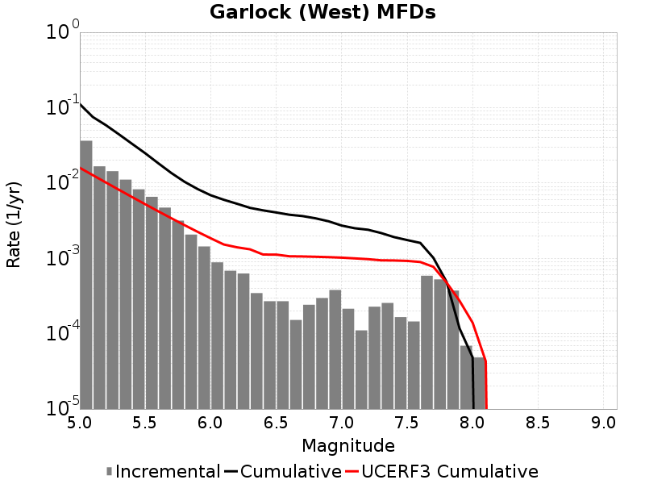

| Magnitude | Incremental Rate | Cumulative Rate | UCERF3 Cumulative Rate |
|-----|-----|-----|-----|
| 5.05 | 0.03634292 | 0.11650462 | 0.015914861 |
| 5.15 | 0.016637594 | 0.0801617 | 0.012699134 |
| 5.25 | 0.014343707 | 0.063524105 | 0.010144792 |
| 5.35 | 0.011096336 | 0.049180396 | 0.008115805 |
| 5.45 | 0.008304979 | 0.03808406 | 0.0065041236 |
| 5.55 | 0.006681293 | 0.029779082 | 0.0052239196 |
| 5.65 | 0.0049608774 | 0.023097789 | 0.004207018 |
| 5.75 | 0.0034891965 | 0.018136913 | 0.0033992636 |
| 5.85 | 0.0023560713 | 0.014647716 | 0.0027576417 |
| 5.95 | 0.0017135064 | 0.012291645 | 0.0022479834 |
| 6.05 | 0.0010018485 | 0.010578138 | 0.0018460276 |
| 6.15 | 8.2220667E-4 | 0.00957629 | 0.0015267783 |
| 6.25 | 7.531137E-4 | 0.008754083 | 0.0014017031 |
| 6.35 | 4.491045E-4 | 0.008000969 | 0.0013171567 |
| 6.45 | 3.523743E-4 | 0.0075518647 | 0.0011235953 |
| 6.55 | 3.45465E-4 | 0.0071994904 | 0.0011212905 |
| 6.65 | 2.003697E-4 | 0.0068540256 | 0.001065516 |
| 6.75 | 2.694627E-4 | 0.006653656 | 0.001059248 |
| 6.85 | 3.45465E-4 | 0.006384193 | 0.0010494941 |
| 6.95 | 4.283766E-4 | 0.006038728 | 0.0010372668 |
| 7.05 | 2.487348E-4 | 0.0056103515 | 0.0010213776 |
| 7.15 | 2.210976E-4 | 0.0053616166 | 9.988411E-4 |
| 7.25 | 5.0437887E-4 | 0.0051405192 | 9.7568147E-4 |
| 7.35 | 3.800115E-4 | 0.00463614 | 9.415858E-4 |
| 7.45 | 2.487348E-4 | 0.004256129 | 9.368889E-4 |
| 7.55 | 3.385557E-4 | 0.004007394 | 9.249968E-4 |
| 7.65 | 0.0013127669 | 0.0036688382 | 8.9389435E-4 |
| 7.75 | 0.0014716808 | 0.0023560713 | 7.7191106E-4 |
| 7.85 | 6.5638346E-4 | 8.843904E-4 | 4.7950426E-4 |
| 7.95 | 1.727325E-4 | 2.280069E-4 | 2.7300828E-4 |
| 8.05 | 4.83651E-5 | 5.52744E-5 | 1.3957628E-4 |
| 8.15 | 6.9093E-6 | 6.9093E-6 | 4.3051485E-5 |

## Green Valley
*[(top)](#table-of-contents)*

### Concord 2011 CFM
*[(top)](#table-of-contents)*

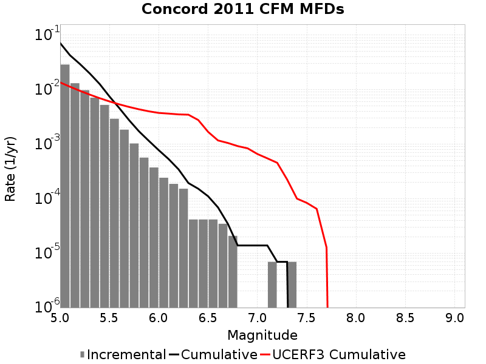

| Magnitude | Incremental Rate | Cumulative Rate | UCERF3 Cumulative Rate |
|-----|-----|-----|-----|
| 5.05 | 0.028901601 | 0.07188436 | 0.013588127 |
| 5.15 | 0.013134579 | 0.042982753 | 0.011333404 |
| 5.25 | 0.009790478 | 0.029848175 | 0.009542413 |
| 5.35 | 0.0071303975 | 0.020057697 | 0.00811978 |
| 5.45 | 0.0052510677 | 0.0129273 | 0.0069897408 |
| 5.55 | 0.002922634 | 0.007676232 | 0.0060921195 |
| 5.65 | 0.0018447831 | 0.0047535985 | 0.0053791134 |
| 5.75 | 0.0010294857 | 0.0029088152 | 0.0048127524 |
| 5.85 | 5.734719E-4 | 0.0018793296 | 0.004362876 |
| 5.95 | 3.938301E-4 | 0.0013058577 | 0.0040055267 |
| 6.05 | 2.487348E-4 | 9.120276E-4 | 0.0037434627 |
| 6.15 | 2.07279E-4 | 6.6329277E-4 | 0.0036387402 |
| 6.25 | 1.727325E-4 | 4.560138E-4 | 0.0035196992 |
| 6.35 | 4.1455798E-5 | 2.832813E-4 | 0.0034755843 |
| 6.45 | 4.83651E-5 | 2.418255E-4 | 0.002772996 |
| 6.55 | 4.83651E-5 | 1.934604E-4 | 0.0016799406 |
| 6.65 | 4.83651E-5 | 1.450953E-4 | 0.0011707064 |
| 6.75 | 2.76372E-5 | 9.67302E-5 | 0.0010517092 |
| 6.85 | 2.0727899E-5 | 6.9092996E-5 | 9.208354E-4 |
| 6.95 | 6.9093E-6 | 4.83651E-5 | 8.3924143E-4 |
| 7.05 | 2.76372E-5 | 4.1455798E-5 | 6.5909827E-4 |
| 7.15 | 6.9093E-6 | 1.38186E-5 | 5.4938317E-4 |
| 7.25 | 0.0 | 6.9093E-6 | 4.5499217E-4 |
| 7.35 | 6.9093E-6 | 6.9093E-6 | 2.2555624E-4 |
| 7.45 | 0.0 | 0.0 | 1.0007589E-4 |
| 7.55 | 0.0 | 0.0 | 8.361279E-5 |
| 7.65 | 0.0 | 0.0 | 6.493862E-5 |
| 7.75 | 0.0 | 0.0 | 1.2708771E-5 |

### Green Valley 2011 CFM
*[(top)](#table-of-contents)*

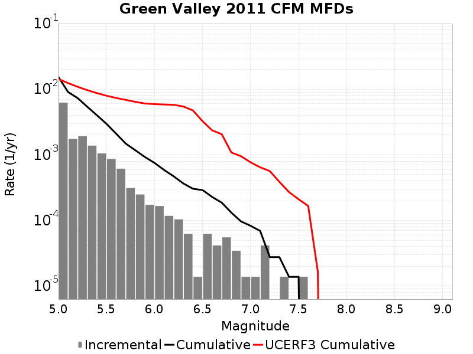

| Magnitude | Incremental Rate | Cumulative Rate | UCERF3 Cumulative Rate |
|-----|-----|-----|-----|
| 5.05 | 0.0062529165 | 0.016064122 | 0.014313682 |
| 5.15 | 0.0017480529 | 0.009811206 | 0.012403729 |
| 5.25 | 0.0019207854 | 0.008063153 | 0.010886599 |
| 5.35 | 0.00138186 | 0.0061423676 | 0.0096815005 |
| 5.45 | 0.0010502136 | 0.0047605075 | 0.008724256 |
| 5.55 | 8.636625E-4 | 0.0037102941 | 0.007963884 |
| 5.65 | 6.21837E-4 | 0.0028466315 | 0.007359904 |
| 5.75 | 3.523743E-4 | 0.0022247946 | 0.0068801055 |
| 5.85 | 3.109185E-4 | 0.0018724203 | 0.006427514 |
| 5.95 | 2.418255E-4 | 0.0015615018 | 0.0060639074 |
| 6.05 | 2.901906E-4 | 0.0013196763 | 0.0059273774 |
| 6.15 | 1.865511E-4 | 0.0010294857 | 0.005853832 |
| 6.25 | 1.5200459E-4 | 8.429346E-4 | 0.005793057 |
| 6.35 | 9.67302E-5 | 6.9093E-4 | 0.005458883 |
| 6.45 | 4.1455798E-5 | 5.941998E-4 | 0.0047474015 |
| 6.55 | 1.174581E-4 | 5.5274396E-4 | 0.003254881 |
| 6.65 | 8.98209E-5 | 4.3528588E-4 | 0.0023640108 |
| 6.75 | 7.6002296E-5 | 3.45465E-4 | 0.0020629684 |
| 6.85 | 8.2911596E-5 | 2.694627E-4 | 0.0010838705 |
| 6.95 | 2.0727899E-5 | 1.865511E-4 | 9.532674E-4 |
| 7.05 | 3.4546498E-5 | 1.6582319E-4 | 7.683604E-4 |
| 7.15 | 6.9092996E-5 | 1.312767E-4 | 6.4599485E-4 |
| 7.25 | 6.9093E-6 | 6.21837E-5 | 5.6541985E-4 |
| 7.35 | 2.76372E-5 | 5.52744E-5 | 3.873925E-4 |
| 7.45 | 1.38186E-5 | 2.76372E-5 | 2.7106324E-4 |
| 7.55 | 1.38186E-5 | 1.38186E-5 | 2.1033037E-4 |
| 7.65 | 0.0 | 0.0 | 1.6630984E-4 |
| 7.75 | 0.0 | 0.0 | 1.6634476E-5 |

### Hunting Creek - Berryessa 2011 CFM
*[(top)](#table-of-contents)*

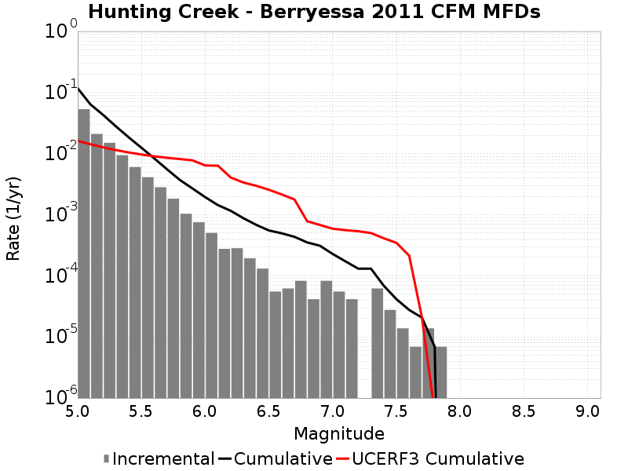

| Magnitude | Incremental Rate | Cumulative Rate | UCERF3 Cumulative Rate |
|-----|-----|-----|-----|
| 5.05 | 0.05340198 | 0.11892978 | 0.016212277 |
| 5.15 | 0.02101809 | 0.0655278 | 0.014245249 |
| 5.25 | 0.0150622735 | 0.04450971 | 0.0126827825 |
| 5.35 | 0.009451922 | 0.029447436 | 0.011441671 |
| 5.45 | 0.0060732746 | 0.019995514 | 0.010455822 |
| 5.55 | 0.0041732173 | 0.01392224 | 0.009672734 |
| 5.65 | 0.0029088152 | 0.009749022 | 0.009050705 |
| 5.75 | 0.0019691505 | 0.0068402067 | 0.008556609 |
| 5.85 | 0.0011814903 | 0.0048710564 | 0.008164136 |
| 5.95 | 8.912997E-4 | 0.0036895662 | 0.0077725328 |
| 6.05 | 6.356556E-4 | 0.0027982665 | 0.0064161806 |
| 6.15 | 3.731022E-4 | 0.0021626109 | 0.0063493885 |
| 6.25 | 3.731022E-4 | 0.0017895086 | 0.004073045 |
| 6.35 | 2.694627E-4 | 0.0014164065 | 0.0033665595 |
| 6.45 | 1.6582319E-4 | 0.0011469438 | 0.002977862 |
| 6.55 | 1.243674E-4 | 9.811206E-4 | 0.0025669117 |
| 6.65 | 1.5200459E-4 | 8.567532E-4 | 0.0021481211 |
| 6.75 | 1.5200459E-4 | 7.047486E-4 | 0.0017787821 |
| 6.85 | 8.98209E-5 | 5.5274396E-4 | 7.818634E-4 |
| 6.95 | 1.036395E-4 | 4.6292308E-4 | 6.8065576E-4 |
| 7.05 | 6.21837E-5 | 3.592836E-4 | 5.904655E-4 |
| 7.15 | 8.2911596E-5 | 2.970999E-4 | 5.596979E-4 |
| 7.25 | 1.38186E-5 | 2.141883E-4 | 5.371651E-4 |
| 7.35 | 7.6002296E-5 | 2.003697E-4 | 5.017624E-4 |
| 7.45 | 6.9092996E-5 | 1.243674E-4 | 4.1276126E-4 |
| 7.55 | 2.0727899E-5 | 5.52744E-5 | 3.4666134E-4 |
| 7.65 | 6.9093E-6 | 3.4546498E-5 | 2.1377587E-4 |
| 7.75 | 1.38186E-5 | 2.76372E-5 | 2.0768453E-5 |
| 7.85 | 1.38186E-5 | 1.38186E-5 | 5.774941E-7 |

## Hayward-Rodgers Creek
*[(top)](#table-of-contents)*

### Hayward (No) 2011 CFM
*[(top)](#table-of-contents)*

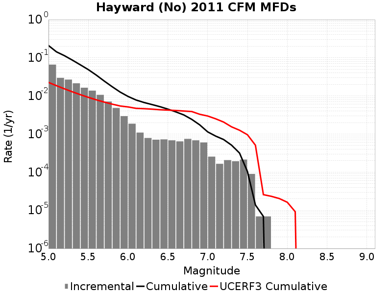

| Magnitude | Incremental Rate | Cumulative Rate | UCERF3 Cumulative Rate |
|-----|-----|-----|-----|
| 5.05 | 0.06614273 | 0.21103075 | 0.02258473 |
| 5.15 | 0.02969617 | 0.14488801 | 0.018551815 |
| 5.25 | 0.026780447 | 0.11519185 | 0.015348356 |
| 5.35 | 0.021405011 | 0.0884114 | 0.0128037585 |
| 5.45 | 0.016395768 | 0.06700639 | 0.010782512 |
| 5.55 | 0.013742598 | 0.05061062 | 0.009176979 |
| 5.65 | 0.010674869 | 0.036868025 | 0.007901659 |
| 5.75 | 0.0071994904 | 0.026193157 | 0.0068886364 |
| 5.85 | 0.0049332404 | 0.018993665 | 0.006083964 |
| 5.95 | 0.0031644593 | 0.014060426 | 0.00544479 |
| 6.05 | 0.0021626109 | 0.010895966 | 0.005139434 |
| 6.15 | 0.0013680414 | 0.008733355 | 0.004716466 |
| 6.25 | 9.051183E-4 | 0.007365314 | 0.004621984 |
| 6.35 | 7.876602E-4 | 0.0064601954 | 0.004497491 |
| 6.45 | 8.083881E-4 | 0.0056725354 | 0.0043389057 |
| 6.55 | 7.945695E-4 | 0.004864147 | 0.0042453473 |
| 6.65 | 7.1165786E-4 | 0.0040695774 | 0.004146362 |
| 6.75 | 8.083881E-4 | 0.0033579199 | 0.004011138 |
| 6.85 | 6.978393E-4 | 0.0025495316 | 0.0038924352 |
| 6.95 | 6.0801837E-4 | 0.0018516923 | 0.003298221 |
| 7.05 | 2.7637198E-4 | 0.001243674 | 0.0029705279 |
| 7.15 | 1.934604E-4 | 9.67302E-4 | 0.0025114028 |
| 7.25 | 2.210976E-4 | 7.738416E-4 | 0.002062867 |
| 7.35 | 2.07279E-4 | 5.5274396E-4 | 0.0015458551 |
| 7.45 | 2.280069E-4 | 3.45465E-4 | 0.0012590825 |
| 7.55 | 1.036395E-4 | 1.174581E-4 | 9.576355E-4 |
| 7.65 | 6.9093E-6 | 1.38186E-5 | 5.092267E-4 |
| 7.75 | 6.9093E-6 | 6.9093E-6 | 2.576057E-5 |
| 7.85 | 0.0 | 0.0 | 2.3299248E-5 |
| 7.95 | 0.0 | 0.0 | 2.0363144E-5 |
| 8.05 | 0.0 | 0.0 | 1.6283075E-5 |
| 8.15 | 0.0 | 0.0 | 9.196594E-6 |

### Hayward (So) 2011 CFM
*[(top)](#table-of-contents)*

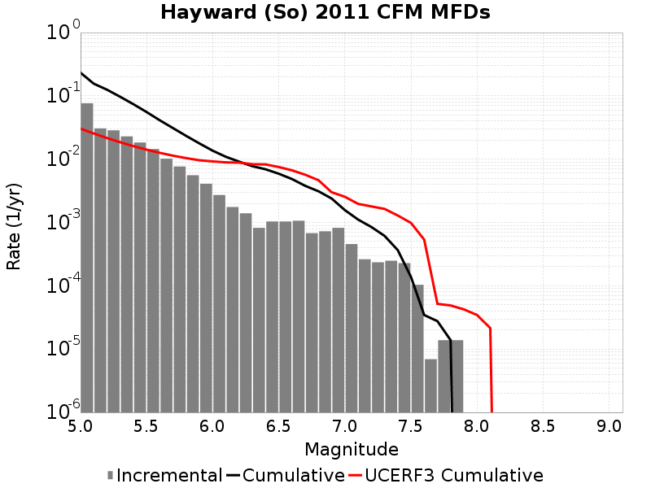

| Magnitude | Incremental Rate | Cumulative Rate | UCERF3 Cumulative Rate |
|-----|-----|-----|-----|
| 5.05 | 0.076340854 | 0.24561179 | 0.030360326 |
| 5.15 | 0.030732566 | 0.16927093 | 0.025479192 |
| 5.25 | 0.028694322 | 0.13853838 | 0.02160197 |
| 5.35 | 0.02319452 | 0.10984405 | 0.018522182 |
| 5.45 | 0.01875875 | 0.08664953 | 0.016075822 |
| 5.55 | 0.015338645 | 0.06789078 | 0.014132608 |
| 5.65 | 0.011655989 | 0.052552134 | 0.012589058 |
| 5.75 | 0.009134094 | 0.040896147 | 0.011362973 |
| 5.85 | 0.0069714836 | 0.031762052 | 0.010389058 |
| 5.95 | 0.0052234307 | 0.024790568 | 0.00961545 |
| 6.05 | 0.0034615593 | 0.019567138 | 0.009219753 |
| 6.15 | 0.0022109759 | 0.016105577 | 0.008908982 |
| 6.25 | 0.001865511 | 0.013894602 | 0.008825078 |
| 6.35 | 0.0013956786 | 0.012029091 | 0.008322003 |
| 6.45 | 0.0017480529 | 0.010633413 | 0.008270429 |
| 6.55 | 0.001727325 | 0.008885359 | 0.0075213253 |
| 6.65 | 0.001706597 | 0.0071580345 | 0.0066701276 |
| 6.75 | 9.949392E-4 | 0.0054514376 | 0.0056780465 |
| 6.85 | 0.0011193065 | 0.0044564987 | 0.004656094 |
| 6.95 | 0.0011123973 | 0.0033371919 | 0.0030037302 |
| 7.05 | 7.6693227E-4 | 0.0022247946 | 0.0025489063 |
| 7.15 | 4.3528588E-4 | 0.0014578623 | 0.0019685647 |
| 7.25 | 3.385557E-4 | 0.0010225764 | 0.0017961207 |
| 7.35 | 2.970999E-4 | 6.840207E-4 | 0.0016391763 |
| 7.45 | 2.349162E-4 | 3.869208E-4 | 0.001290757 |
| 7.55 | 1.036395E-4 | 1.5200459E-4 | 9.851507E-4 |
| 7.65 | 6.9093E-6 | 4.83651E-5 | 5.3601206E-4 |
| 7.75 | 2.0727899E-5 | 4.1455798E-5 | 5.1901843E-5 |
| 7.85 | 2.0727899E-5 | 2.0727899E-5 | 4.8899812E-5 |
| 7.95 | 0.0 | 0.0 | 4.244399E-5 |
| 8.05 | 0.0 | 0.0 | 3.4555702E-5 |
| 8.15 | 0.0 | 0.0 | 2.1436623E-5 |

### Hayward (So) extension 2011 CFM
*[(top)](#table-of-contents)*

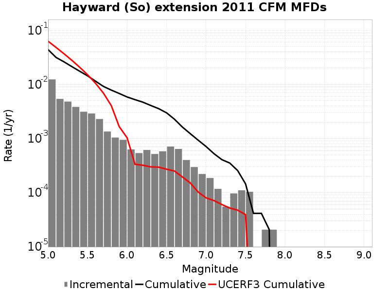

| Magnitude | Incremental Rate | Cumulative Rate | UCERF3 Cumulative Rate |
|-----|-----|-----|-----|
| 5.05 | 0.012374556 | 0.052358676 | 0.06277116 |
| 5.15 | 0.0054030726 | 0.03998412 | 0.04842445 |
| 5.25 | 0.0048226914 | 0.034581047 | 0.037028454 |
| 5.35 | 0.003896845 | 0.029758355 | 0.027976297 |
| 5.45 | 0.003226643 | 0.02586151 | 0.020785911 |
| 5.55 | 0.002998636 | 0.022634866 | 0.0150743835 |
| 5.65 | 0.0029917269 | 0.01963623 | 0.010535407 |
| 5.75 | 0.002259341 | 0.016644504 | 0.00692986 |
| 5.85 | 0.001913876 | 0.014385163 | 0.0040673157 |
| 5.95 | 0.0016720506 | 0.012471287 | 0.0016622184 |
| 6.05 | 0.0013127669 | 0.010799236 | 0.0010354185 |
| 6.15 | 0.0012091275 | 0.0094864685 | 3.343923E-4 |
| 6.25 | 0.0012022182 | 0.008277342 | 3.2088728E-4 |
| 6.35 | 0.0011054879 | 0.007075123 | 2.992796E-4 |
| 6.45 | 0.0014025879 | 0.005969635 | 2.9603115E-4 |
| 6.55 | 0.0011469438 | 0.004567047 | 2.710167E-4 |
| 6.65 | 0.0010709414 | 0.0034201033 | 2.5090107E-4 |
| 6.75 | 5.5274396E-4 | 0.002349162 | 1.9518599E-4 |
| 6.85 | 5.181975E-4 | 0.001796418 | 1.511501E-4 |
| 6.95 | 2.970999E-4 | 0.0012782204 | 1.0269447E-4 |
| 7.05 | 3.109185E-4 | 9.811206E-4 | 8.024694E-5 |
| 7.15 | 1.6582319E-4 | 6.702021E-4 | 7.1360344E-5 |
| 7.25 | 8.98209E-5 | 5.0437887E-4 | 6.031955E-5 |
| 7.35 | 1.3818599E-4 | 4.14558E-4 | 5.19874E-5 |
| 7.45 | 1.174581E-4 | 2.7637198E-4 | 4.744614E-5 |
| 7.55 | 1.174581E-4 | 1.589139E-4 | 3.9154722E-5 |
| 7.65 | 0.0 | 4.1455798E-5 | 7.414909E-8 |
| 7.75 | 2.0727899E-5 | 4.1455798E-5 | 2.7565573E-8 |
| 7.85 | 2.0727899E-5 | 2.0727899E-5 | 0.0 |

### Rodgers Creek - Healdsburg 2011 CFM
*[(top)](#table-of-contents)*

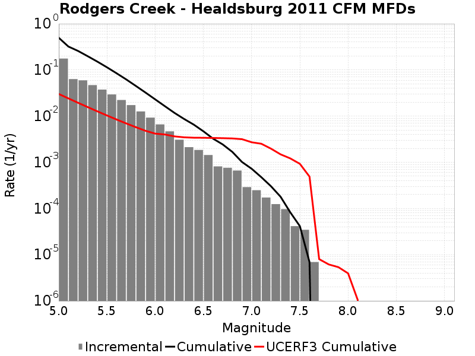

| Magnitude | Incremental Rate | Cumulative Rate | UCERF3 Cumulative Rate |
|-----|-----|-----|-----|
| 5.05 | 0.1763806 | 0.5012697 | 0.030179968 |
| 5.15 | 0.0633721 | 0.3248891 | 0.024210582 |
| 5.25 | 0.059537437 | 0.261517 | 0.019468928 |
| 5.35 | 0.046921056 | 0.20197956 | 0.0157025 |
| 5.45 | 0.037538227 | 0.1550585 | 0.0127107175 |
| 5.55 | 0.029495802 | 0.11752028 | 0.010334262 |
| 5.65 | 0.022565773 | 0.08802448 | 0.008446575 |
| 5.75 | 0.017549621 | 0.06545871 | 0.0069471328 |
| 5.85 | 0.013086214 | 0.047909085 | 0.0057560834 |
| 5.95 | 0.009645383 | 0.03482287 | 0.004809999 |
| 6.05 | 0.0068747536 | 0.025177488 | 0.004183624 |
| 6.15 | 0.004877966 | 0.018302735 | 0.004004379 |
| 6.25 | 0.0032542802 | 0.01342477 | 0.0036430866 |
| 6.35 | 0.0023077063 | 0.01017049 | 0.0034768484 |
| 6.45 | 0.0021211552 | 0.007862783 | 0.0034108458 |
| 6.55 | 0.0015684111 | 0.0057416284 | 0.003397144 |
| 6.65 | 0.0010640322 | 0.0041732173 | 0.0033656526 |
| 6.75 | 0.0010778508 | 0.003109185 | 0.0033321083 |
| 6.85 | 8.636625E-4 | 0.0020313342 | 0.003287325 |
| 6.95 | 3.523743E-4 | 0.0011676716 | 0.0031704037 |
| 7.05 | 2.625534E-4 | 8.1529736E-4 | 0.0027180477 |
| 7.15 | 2.003697E-4 | 5.5274396E-4 | 0.0025236614 |
| 7.25 | 1.243674E-4 | 3.523743E-4 | 0.0019781478 |
| 7.35 | 1.036395E-4 | 2.280069E-4 | 0.0014874318 |
| 7.45 | 6.21837E-5 | 1.243674E-4 | 0.0012167406 |
| 7.55 | 5.52744E-5 | 6.21837E-5 | 9.271161E-4 |
| 7.65 | 6.9093E-6 | 6.9093E-6 | 4.9044227E-4 |
| 7.75 | 0.0 | 0.0 | 8.005927E-6 |
| 7.85 | 0.0 | 0.0 | 6.1413903E-6 |
| 7.95 | 0.0 | 0.0 | 5.360805E-6 |
| 8.05 | 0.0 | 0.0 | 3.940478E-6 |
| 8.15 | 0.0 | 0.0 | 1.0457376E-6 |

## Little Salmon
*[(top)](#table-of-contents)*

### Little Salmon (Offshore)
*[(top)](#table-of-contents)*

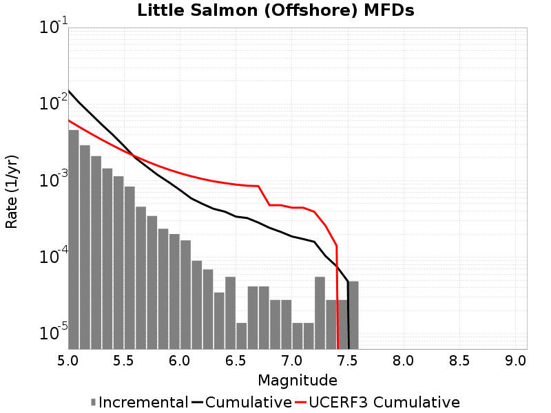

| Magnitude | Incremental Rate | Cumulative Rate | UCERF3 Cumulative Rate |
|-----|-----|-----|-----|
| 5.05 | 0.004587775 | 0.015248825 | 0.006142237 |
| 5.15 | 0.0028949967 | 0.01066105 | 0.0050246776 |
| 5.25 | 0.002093518 | 0.007766053 | 0.004136969 |
| 5.35 | 0.0014440437 | 0.0056725354 | 0.0034318364 |
| 5.45 | 0.0011400345 | 0.0042284913 | 0.00287173 |
| 5.55 | 8.360253E-4 | 0.003088457 | 0.0024268215 |
| 5.65 | 4.560138E-4 | 0.0022524318 | 0.002073418 |
| 5.75 | 3.45465E-4 | 0.001796418 | 0.0017926999 |
| 5.85 | 2.349162E-4 | 0.001450953 | 0.0015697174 |
| 5.95 | 2.003697E-4 | 0.0012160367 | 0.0013925963 |
| 6.05 | 1.6582319E-4 | 0.0010156671 | 0.0012519038 |
| 6.15 | 9.67302E-5 | 8.498439E-4 | 0.0011401479 |
| 6.25 | 9.67302E-5 | 7.531137E-4 | 0.001051377 |
| 6.35 | 4.1455798E-5 | 6.5638346E-4 | 9.808638E-4 |
| 6.45 | 5.52744E-5 | 6.149277E-4 | 9.2942035E-4 |
| 6.55 | 1.38186E-5 | 5.596533E-4 | 8.886098E-4 |
| 6.65 | 6.21837E-5 | 5.458347E-4 | 8.5863296E-4 |
| 6.75 | 4.83651E-5 | 4.83651E-4 | 8.4895233E-4 |
| 6.85 | 2.76372E-5 | 4.3528588E-4 | 4.78128E-4 |
| 6.95 | 5.52744E-5 | 4.0764868E-4 | 4.78128E-4 |
| 7.05 | 2.0727899E-5 | 3.523743E-4 | 4.4362576E-4 |
| 7.15 | 5.52744E-5 | 3.3164638E-4 | 4.4362576E-4 |
| 7.25 | 1.036395E-4 | 2.7637198E-4 | 3.9209003E-4 |
| 7.35 | 4.83651E-5 | 1.727325E-4 | 2.581718E-4 |
| 7.45 | 7.6002296E-5 | 1.243674E-4 | 1.4128092E-4 |
| 7.55 | 4.83651E-5 | 4.83651E-5 | 0.0 |

### Little Salmon (Onshore)
*[(top)](#table-of-contents)*

| Magnitude | Incremental Rate | Cumulative Rate | UCERF3 Cumulative Rate |
|-----|-----|-----|-----|
| 5.05 | 0.015767023 | 0.054500557 | 0.009173521 |
| 5.15 | 0.011193066 | 0.038733535 | 0.007845915 |
| 5.25 | 0.008007878 | 0.02754047 | 0.0067913597 |
| 5.35 | 0.0056518074 | 0.019532591 | 0.005953697 |
| 5.45 | 0.004076487 | 0.013880784 | 0.005288318 |
| 5.55 | 0.0029779084 | 0.009804296 | 0.004759788 |
| 5.65 | 0.0017549621 | 0.006826388 | 0.0043399623 |
| 5.75 | 0.0013058577 | 0.0050714263 | 0.0040064827 |
| 5.85 | 0.0010156671 | 0.0037655684 | 0.0037415903 |
| 5.95 | 7.392951E-4 | 0.0027499013 | 0.0035311787 |
| 6.05 | 4.14558E-4 | 0.0020106062 | 0.0033640445 |
| 6.15 | 3.523743E-4 | 0.0015960482 | 0.0032312851 |
| 6.25 | 2.280069E-4 | 0.001243674 | 0.003132152 |
| 6.35 | 1.174581E-4 | 0.0010156671 | 0.0030534079 |
| 6.45 | 8.98209E-5 | 8.98209E-4 | 0.002996778 |
| 6.55 | 6.9093E-6 | 8.083881E-4 | 0.002953378 |
| 6.65 | 3.4546498E-5 | 8.014788E-4 | 0.0029239529 |
| 6.75 | 2.0727899E-5 | 7.6693227E-4 | 0.0029137016 |
| 6.85 | 8.2911596E-5 | 7.462044E-4 | 0.0021357706 |
| 6.95 | 8.98209E-5 | 6.6329277E-4 | 0.0021357706 |
| 7.05 | 7.6002296E-5 | 5.734719E-4 | 6.3639175E-4 |
| 7.15 | 1.105488E-4 | 4.974696E-4 | 5.1854376E-4 |
| 7.25 | 1.174581E-4 | 3.869208E-4 | 4.5317382E-4 |
| 7.35 | 6.21837E-5 | 2.694627E-4 | 2.581718E-4 |
| 7.45 | 2.07279E-4 | 2.07279E-4 | 1.4128092E-4 |

## Puente Hills
*[(top)](#table-of-contents)*

### Puente Hills
*[(top)](#table-of-contents)*

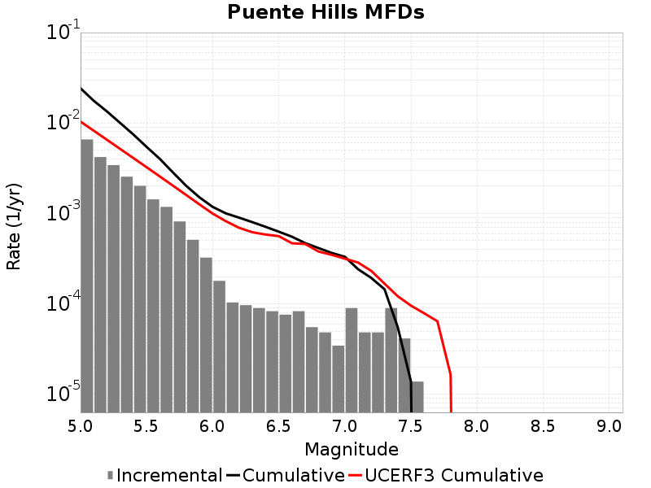

| Magnitude | Incremental Rate | Cumulative Rate | UCERF3 Cumulative Rate |
|-----|-----|-----|-----|
| 5.05 | 0.0065776533 | 0.026172427 | 0.010371835 |
| 5.15 | 0.0042008543 | 0.019594774 | 0.008227751 |
| 5.25 | 0.0034201033 | 0.01539392 | 0.006524644 |
| 5.35 | 0.0025495316 | 0.011973817 | 0.005171818 |
| 5.45 | 0.0020175155 | 0.009424285 | 0.0040972303 |
| 5.55 | 0.0014302251 | 0.0074067693 | 0.003243655 |
| 5.65 | 0.0011953089 | 0.005976544 | 0.002565636 |
| 5.75 | 8.2220667E-4 | 0.0047812355 | 0.0020270664 |
| 5.85 | 6.149277E-4 | 0.003959029 | 0.0015992654 |
| 5.95 | 4.767417E-4 | 0.0033441011 | 0.0012594509 |
| 6.05 | 3.109185E-4 | 0.0028673594 | 9.95729E-4 |
| 6.15 | 2.418255E-4 | 0.002556441 | 8.200533E-4 |
| 6.25 | 2.349162E-4 | 0.0023146155 | 6.935869E-4 |
| 6.35 | 2.970999E-4 | 0.0020796992 | 6.199923E-4 |
| 6.45 | 2.832813E-4 | 0.0017825994 | 5.845963E-4 |
| 6.55 | 1.796418E-4 | 0.001499318 | 5.610939E-4 |
| 6.65 | 2.418255E-4 | 0.0013196763 | 4.679507E-4 |
| 6.75 | 1.934604E-4 | 0.0010778508 | 4.5997687E-4 |
| 6.85 | 2.07279E-4 | 8.843904E-4 | 3.797763E-4 |
| 6.95 | 1.589139E-4 | 6.771114E-4 | 3.4868479E-4 |
| 7.05 | 1.3818599E-4 | 5.181975E-4 | 3.1635893E-4 |
| 7.15 | 9.67302E-5 | 3.800115E-4 | 2.8644162E-4 |
| 7.25 | 8.98209E-5 | 2.832813E-4 | 2.3142782E-4 |
| 7.35 | 1.243674E-4 | 1.934604E-4 | 1.675073E-4 |
| 7.45 | 4.83651E-5 | 6.9092996E-5 | 1.2147725E-4 |
| 7.55 | 1.38186E-5 | 2.0727899E-5 | 9.567858E-5 |
| 7.65 | 0.0 | 6.9093E-6 | 7.872752E-5 |
| 7.75 | 0.0 | 6.9093E-6 | 6.427348E-5 |
| 7.85 | 0.0 | 6.9093E-6 | 1.6482316E-5 |
| 7.95 | 0.0 | 6.9093E-6 | 0.0 |
| 8.05 | 6.9093E-6 | 6.9093E-6 | 0.0 |

## San Andreas
*[(top)](#table-of-contents)*

### San Andreas (Big Bend)
*[(top)](#table-of-contents)*

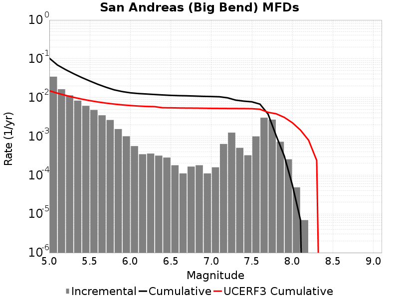

| Magnitude | Incremental Rate | Cumulative Rate | UCERF3 Cumulative Rate |
|-----|-----|-----|-----|
| 5.05 | 0.034505043 | 0.105090454 | 0.014969358 |
| 5.15 | 0.016402679 | 0.07058541 | 0.012968303 |
| 5.25 | 0.011379617 | 0.05418273 | 0.011378808 |
| 5.35 | 0.008325706 | 0.042803112 | 0.010116227 |
| 5.45 | 0.0061147306 | 0.034477405 | 0.009113324 |
| 5.55 | 0.0047812355 | 0.028362677 | 0.008316689 |
| 5.65 | 0.0034891965 | 0.02358144 | 0.0076838997 |
| 5.75 | 0.002653171 | 0.020092243 | 0.007181257 |
| 5.85 | 0.0016236855 | 0.017439073 | 0.0067819944 |
| 5.95 | 0.0012505833 | 0.015815387 | 0.0064648483 |
| 6.05 | 8.429346E-4 | 0.014564804 | 0.0062185857 |
| 6.15 | 5.251068E-4 | 0.013721869 | 0.0060350033 |
| 6.25 | 4.491045E-4 | 0.013196763 | 0.0058931108 |
| 6.35 | 3.523743E-4 | 0.012747658 | 0.005821518 |
| 6.45 | 3.3164638E-4 | 0.012395284 | 0.0054444745 |
| 6.55 | 2.141883E-4 | 0.012063637 | 0.0054332474 |
| 6.65 | 1.450953E-4 | 0.011849449 | 0.0053810505 |
| 6.75 | 1.934604E-4 | 0.011704354 | 0.0053518848 |
| 6.85 | 1.865511E-4 | 0.011510894 | 0.005334812 |
| 6.95 | 1.312767E-4 | 0.011324342 | 0.005299666 |
| 7.05 | 1.6582319E-4 | 0.011193066 | 0.005261597 |
| 7.15 | 6.425649E-4 | 0.011027243 | 0.0052382047 |
| 7.25 | 0.0012713112 | 0.010384678 | 0.0052212607 |
| 7.35 | 5.389254E-4 | 0.009113367 | 0.005206644 |
| 7.45 | 3.385557E-4 | 0.008574441 | 0.0051931534 |
| 7.55 | 0.0012160367 | 0.008235886 | 0.0051494054 |
| 7.65 | 0.003199006 | 0.0070198486 | 0.0049879206 |
| 7.75 | 0.0027499013 | 0.0038208428 | 0.0041585793 |
| 7.85 | 7.462044E-4 | 0.0010709414 | 0.0038118456 |
| 7.95 | 2.694627E-4 | 3.247371E-4 | 0.003081539 |
| 8.05 | 4.83651E-5 | 5.52744E-5 | 0.0022382822 |
| 8.15 | 6.9093E-6 | 6.9093E-6 | 0.0014445325 |
| 8.25 | 0.0 | 0.0 | 7.937497E-4 |
| 8.35 | 0.0 | 0.0 | 2.3926099E-4 |

### San Andreas (Carrizo) rev
*[(top)](#table-of-contents)*

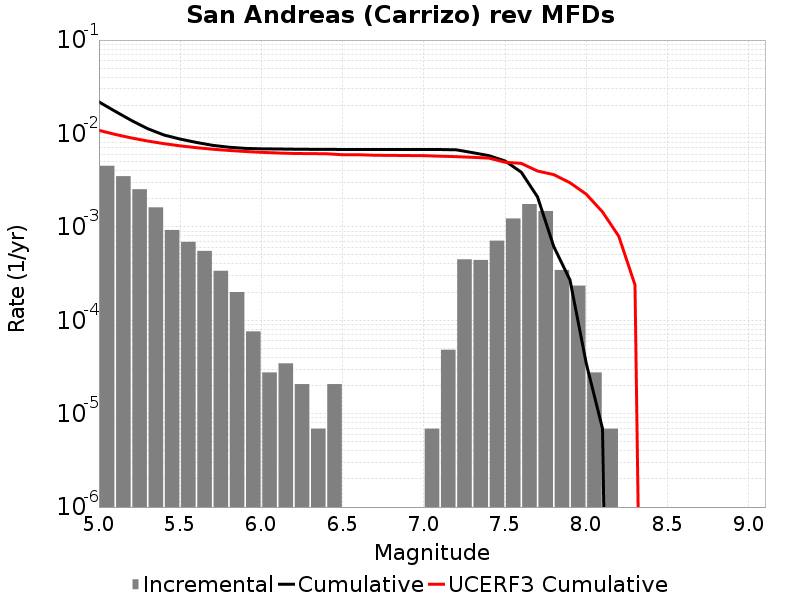

| Magnitude | Incremental Rate | Cumulative Rate | UCERF3 Cumulative Rate |
|-----|-----|-----|-----|
| 5.05 | 0.0045048636 | 0.022876691 | 0.010803295 |
| 5.15 | 0.0034891965 | 0.018371828 | 0.009770032 |
| 5.25 | 0.0025288037 | 0.014882632 | 0.008949282 |
| 5.35 | 0.0016167762 | 0.012353828 | 0.008297337 |
| 5.45 | 9.2584617E-4 | 0.010737052 | 0.0077794786 |
| 5.55 | 6.9093E-4 | 0.009811206 | 0.007368129 |
| 5.65 | 5.5274396E-4 | 0.009120276 | 0.0070413826 |
| 5.75 | 3.45465E-4 | 0.008567532 | 0.006781839 |
| 5.85 | 2.487348E-4 | 0.008222067 | 0.0065756757 |
| 5.95 | 1.3818599E-4 | 0.007973332 | 0.0064119142 |
| 6.05 | 4.1455798E-5 | 0.007835146 | 0.006281834 |
| 6.15 | 4.1455798E-5 | 0.00779369 | 0.0061806533 |
| 6.25 | 2.76372E-5 | 0.0077522346 | 0.0061065154 |
| 6.35 | 1.38186E-5 | 0.007724597 | 0.0060811373 |
| 6.45 | 2.0727899E-5 | 0.0077107786 | 0.0060637207 |
| 6.55 | 1.38186E-5 | 0.0076900506 | 0.0059184413 |
| 6.65 | 0.0 | 0.007676232 | 0.0059183994 |
| 6.75 | 6.9093E-6 | 0.007676232 | 0.0058433204 |
| 6.85 | 1.38186E-5 | 0.0076693227 | 0.0058256784 |
| 6.95 | 6.9093E-6 | 0.007655504 | 0.0058021927 |
| 7.05 | 1.38186E-5 | 0.007648595 | 0.0057855896 |
| 7.15 | 1.934604E-4 | 0.007634776 | 0.0057077156 |
| 7.25 | 8.567532E-4 | 0.007441316 | 0.005644484 |
| 7.35 | 5.181975E-4 | 0.006584563 | 0.005553204 |
| 7.45 | 7.392951E-4 | 0.006066365 | 0.005450963 |
| 7.55 | 0.0012367647 | 0.00532707 | 0.0049190433 |
| 7.65 | 0.001796418 | 0.0040903054 | 0.0047816476 |
| 7.75 | 0.0016236855 | 0.0022938875 | 0.003961972 |
| 7.85 | 3.938301E-4 | 6.702021E-4 | 0.0036254006 |
| 7.95 | 2.418255E-4 | 2.7637198E-4 | 0.00296619 |
| 8.05 | 2.76372E-5 | 3.4546498E-5 | 0.0022372936 |
| 8.15 | 6.9093E-6 | 6.9093E-6 | 0.0014461908 |
| 8.25 | 0.0 | 0.0 | 7.937497E-4 |
| 8.35 | 0.0 | 0.0 | 2.3926099E-4 |

### San Andreas (Cholame) rev
*[(top)](#table-of-contents)*

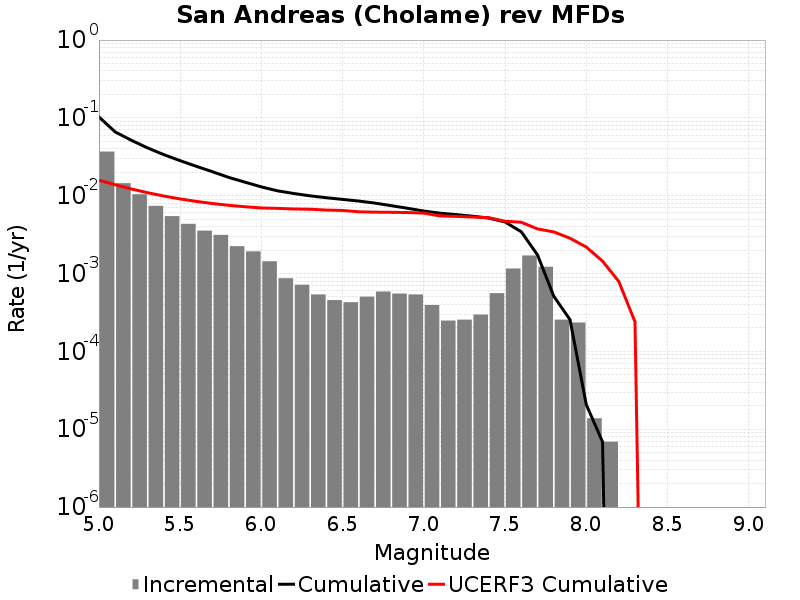

| Magnitude | Incremental Rate | Cumulative Rate | UCERF3 Cumulative Rate |
|-----|-----|-----|-----|
| 5.05 | 0.03688184 | 0.10370168 | 0.01586009 |
| 5.15 | 0.014474983 | 0.06681984 | 0.013824349 |
| 5.25 | 0.010439952 | 0.052344855 | 0.012207303 |
| 5.35 | 0.0074067693 | 0.041904904 | 0.010922837 |
| 5.45 | 0.005465256 | 0.034498133 | 0.00990255 |
| 5.55 | 0.0043666777 | 0.029032879 | 0.0090921065 |
| 5.65 | 0.003592836 | 0.024666201 | 0.008448349 |
| 5.75 | 0.0031713687 | 0.021073366 | 0.007936995 |
| 5.85 | 0.0022938875 | 0.017901996 | 0.0075308103 |
| 5.95 | 0.0019967877 | 0.015608109 | 0.007215107 |
| 6.05 | 0.0014924088 | 0.01361132 | 0.0069680093 |
| 6.15 | 9.051183E-4 | 0.012118912 | 0.00687994 |
| 6.25 | 8.7748107E-4 | 0.011213793 | 0.006757088 |
| 6.35 | 6.287463E-4 | 0.010336312 | 0.0067111626 |
| 6.45 | 5.5274396E-4 | 0.009707566 | 0.006544003 |
| 6.55 | 4.698324E-4 | 0.009154823 | 0.0064678104 |
| 6.65 | 5.251068E-4 | 0.00868499 | 0.0062143463 |
| 6.75 | 6.011091E-4 | 0.008159883 | 0.006150468 |
| 6.85 | 5.734719E-4 | 0.007558774 | 0.006121412 |
| 6.95 | 5.596533E-4 | 0.006985302 | 0.0060824417 |
| 7.05 | 4.14558E-4 | 0.006425649 | 0.0059815063 |
| 7.15 | 2.556441E-4 | 0.0060110907 | 0.0054990575 |
| 7.25 | 2.7637198E-4 | 0.005755447 | 0.005427606 |
| 7.35 | 3.0400918E-4 | 0.005479075 | 0.00532666 |
| 7.45 | 5.734719E-4 | 0.0051750657 | 0.0052263867 |
| 7.55 | 0.0011607624 | 0.0046015936 | 0.0046992 |
| 7.65 | 0.001706597 | 0.0034408313 | 0.0045636864 |
| 7.75 | 0.0012229461 | 0.0017342343 | 0.0037461098 |
| 7.85 | 2.556441E-4 | 5.112882E-4 | 0.003430843 |
| 7.95 | 2.349162E-4 | 2.556441E-4 | 0.002843783 |
| 8.05 | 1.38186E-5 | 2.0727899E-5 | 0.0021931776 |
| 8.15 | 6.9093E-6 | 6.9093E-6 | 0.001446303 |
| 8.25 | 0.0 | 0.0 | 7.937497E-4 |
| 8.35 | 0.0 | 0.0 | 2.3926099E-4 |

### San Andreas (Coachella) rev
*[(top)](#table-of-contents)*

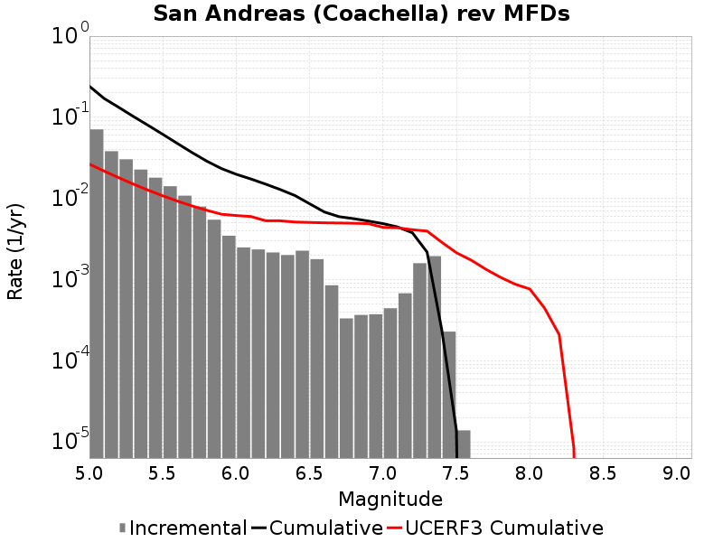

| Magnitude | Incremental Rate | Cumulative Rate | UCERF3 Cumulative Rate |
|-----|-----|-----|-----|
| 5.05 | 0.07085487 | 0.24201205 | 0.026481478 |
| 5.15 | 0.03817388 | 0.17115718 | 0.021752886 |
| 5.25 | 0.030318009 | 0.1329833 | 0.01799683 |
| 5.35 | 0.022676323 | 0.10266529 | 0.015013291 |
| 5.45 | 0.018005636 | 0.079988964 | 0.01264338 |
| 5.55 | 0.0141295185 | 0.06198333 | 0.010760894 |
| 5.65 | 0.010813055 | 0.047853813 | 0.009265582 |
| 5.75 | 0.007931876 | 0.037040755 | 0.008077813 |
| 5.85 | 0.005485984 | 0.02910888 | 0.0071343346 |
| 5.95 | 0.0035168338 | 0.023622897 | 0.006384903 |
| 6.05 | 0.0025149852 | 0.020106062 | 0.0061551095 |
| 6.15 | 0.0024044365 | 0.017591078 | 0.0059873047 |
| 6.25 | 0.0022247946 | 0.015186641 | 0.005316342 |
| 6.35 | 0.0020175155 | 0.012961847 | 0.0053015 |
| 6.45 | 0.0022731596 | 0.010944331 | 0.0051214197 |
| 6.55 | 0.0017825994 | 0.008671171 | 0.00506004 |
| 6.65 | 8.498439E-4 | 0.006888572 | 0.0050072335 |
| 6.75 | 3.3164638E-4 | 0.006038728 | 0.0049786223 |
| 6.85 | 3.661929E-4 | 0.005707082 | 0.0049468675 |
| 6.95 | 3.731022E-4 | 0.0053408886 | 0.004891104 |
| 7.05 | 4.6292308E-4 | 0.004967787 | 0.0044017965 |
| 7.15 | 7.047486E-4 | 0.0045048636 | 0.0043480815 |
| 7.25 | 0.0016098669 | 0.0038001148 | 0.004113007 |
| 7.35 | 0.0019415133 | 0.002190248 | 0.003960019 |
| 7.45 | 2.280069E-4 | 2.487348E-4 | 0.0028850774 |
| 7.55 | 2.0727899E-5 | 2.0727899E-5 | 0.002140953 |
| 7.65 | 0.0 | 0.0 | 0.0017370612 |
| 7.75 | 0.0 | 0.0 | 0.0013415673 |
| 7.85 | 0.0 | 0.0 | 0.001065687 |
| 7.95 | 0.0 | 0.0 | 8.771363E-4 |
| 8.05 | 0.0 | 0.0 | 7.6413597E-4 |
| 8.15 | 0.0 | 0.0 | 4.4585599E-4 |
| 8.25 | 0.0 | 0.0 | 2.0965519E-4 |
| 8.35 | 0.0 | 0.0 | 8.424468E-6 |

### San Andreas (Creeping Section) 2011 CFM
*[(top)](#table-of-contents)*

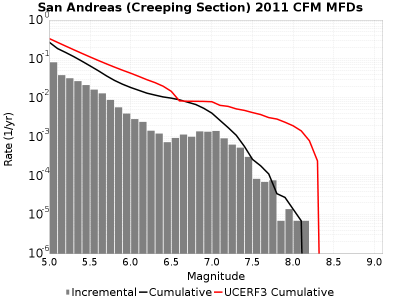

| Magnitude | Incremental Rate | Cumulative Rate | UCERF3 Cumulative Rate |
|-----|-----|-----|-----|
| 5.05 | 0.0820203 | 0.28080776 | 0.33236915 |
| 5.15 | 0.038312066 | 0.19878747 | 0.26623955 |
| 5.25 | 0.03190024 | 0.1604754 | 0.21371092 |
| 5.35 | 0.026870267 | 0.12857516 | 0.17198588 |
| 5.45 | 0.021301372 | 0.101704895 | 0.13884248 |
| 5.55 | 0.016333586 | 0.08040352 | 0.112515494 |
| 5.65 | 0.013210582 | 0.06406994 | 0.09160304 |
| 5.75 | 0.010301766 | 0.05085936 | 0.07499104 |
| 5.85 | 0.0078420555 | 0.04055759 | 0.06179125 |
| 5.95 | 0.0060041817 | 0.032715537 | 0.051309112 |
| 6.05 | 0.0043183123 | 0.026711354 | 0.042987555 |
| 6.15 | 0.0037033847 | 0.02239304 | 0.035601426 |
| 6.25 | 0.0022731596 | 0.018689657 | 0.029259762 |
| 6.35 | 0.0017618715 | 0.016416496 | 0.024615118 |
| 6.45 | 0.0011331252 | 0.014654625 | 0.01988999 |
| 6.55 | 0.0014302251 | 0.0135215 | 0.014715224 |
| 6.65 | 0.0014854994 | 0.012091274 | 0.008380002 |
| 6.75 | 0.0013956786 | 0.010605776 | 0.008186329 |
| 6.85 | 0.001934604 | 0.009210097 | 0.008163131 |
| 6.95 | 0.0020589714 | 0.007275493 | 0.008107596 |
| 7.05 | 0.0019415133 | 0.005216521 | 0.007953422 |
| 7.15 | 0.0012505833 | 0.0032750082 | 0.006418367 |
| 7.25 | 7.945695E-4 | 0.002024425 | 0.0060396553 |
| 7.35 | 6.011091E-4 | 0.0012298553 | 0.0052069114 |
| 7.45 | 3.385557E-4 | 6.287463E-4 | 0.0047680675 |
| 7.55 | 9.67302E-5 | 2.901906E-4 | 0.0041868133 |
| 7.65 | 7.6002296E-5 | 1.934604E-4 | 0.0037238987 |
| 7.75 | 8.2911596E-5 | 1.174581E-4 | 0.0031093797 |
| 7.85 | 6.9093E-6 | 3.4546498E-5 | 0.0028553563 |
| 7.95 | 1.38186E-5 | 2.76372E-5 | 0.0023641016 |
| 8.05 | 6.9093E-6 | 1.38186E-5 | 0.0019135074 |
| 8.15 | 6.9093E-6 | 6.9093E-6 | 0.0014175118 |
| 8.25 | 0.0 | 0.0 | 7.937497E-4 |
| 8.35 | 0.0 | 0.0 | 2.3926099E-4 |

### San Andreas (Mojave N)
*[(top)](#table-of-contents)*

| Magnitude | Incremental Rate | Cumulative Rate | UCERF3 Cumulative Rate |
|-----|-----|-----|-----|
| 5.05 | 0.009859571 | 0.0462094 | 0.011659615 |
| 5.15 | 0.006204551 | 0.036349826 | 0.01041297 |
| 5.25 | 0.0043528588 | 0.030145276 | 0.009422724 |
| 5.35 | 0.0034201033 | 0.025792416 | 0.008636144 |
| 5.45 | 0.003067729 | 0.022372313 | 0.008011341 |
| 5.55 | 0.0028604502 | 0.019304585 | 0.007515043 |
| 5.65 | 0.0021142457 | 0.016444134 | 0.007120819 |
| 5.75 | 0.001589139 | 0.014329888 | 0.006807676 |
| 5.85 | 8.912997E-4 | 0.012740749 | 0.0065589375 |
| 5.95 | 7.738416E-4 | 0.011849449 | 0.0063613574 |
| 6.05 | 5.112882E-4 | 0.0110756075 | 0.006204414 |
| 6.15 | 3.592836E-4 | 0.01056432 | 0.0060797497 |
| 6.25 | 2.901906E-4 | 0.010205036 | 0.00599641 |
| 6.35 | 2.487348E-4 | 0.009914845 | 0.0059610074 |
| 6.45 | 2.556441E-4 | 0.00966611 | 0.0059339944 |
| 6.55 | 1.796418E-4 | 0.009410466 | 0.0059210192 |
| 6.65 | 9.67302E-5 | 0.009230825 | 0.005919865 |
| 6.75 | 1.450953E-4 | 0.009134094 | 0.0059154024 |
| 6.85 | 1.727325E-4 | 0.008988999 | 0.0059116986 |
| 6.95 | 1.5200459E-4 | 0.008816266 | 0.005907007 |
| 7.05 | 1.5200459E-4 | 0.0086642625 | 0.005888174 |
| 7.15 | 5.803812E-4 | 0.008512258 | 0.005866126 |
| 7.25 | 0.0012022182 | 0.007931876 | 0.0058523836 |
| 7.35 | 5.0437887E-4 | 0.006729658 | 0.005839253 |
| 7.45 | 2.832813E-4 | 0.006225279 | 0.005822611 |
| 7.55 | 5.941998E-4 | 0.0059419977 | 0.005804384 |
| 7.65 | 0.0019622413 | 0.005347798 | 0.005750274 |
| 7.75 | 0.0023353433 | 0.0033855569 | 0.0049961735 |
| 7.85 | 7.323858E-4 | 0.0010502136 | 0.0044143596 |
| 7.95 | 2.625534E-4 | 3.178278E-4 | 0.003380977 |
| 8.05 | 4.83651E-5 | 5.52744E-5 | 0.002361803 |
| 8.15 | 6.9093E-6 | 6.9093E-6 | 0.0014756443 |
| 8.25 | 0.0 | 0.0 | 7.937497E-4 |
| 8.35 | 0.0 | 0.0 | 2.3926099E-4 |

### San Andreas (Mojave S)
*[(top)](#table-of-contents)*

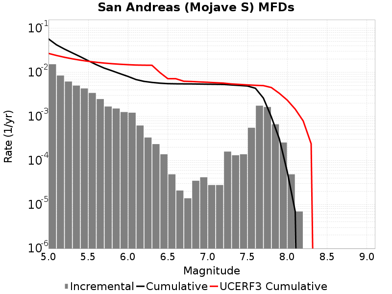

| Magnitude | Incremental Rate | Cumulative Rate | UCERF3 Cumulative Rate |
|-----|-----|-----|-----|
| 5.05 | 0.015338645 | 0.05794139 | 0.027075231 |
| 5.15 | 0.008498439 | 0.042602744 | 0.024314594 |
| 5.25 | 0.0062114606 | 0.034104303 | 0.022121742 |
| 5.35 | 0.005016152 | 0.027892843 | 0.0203799 |
| 5.45 | 0.0043252218 | 0.022876691 | 0.018996304 |
| 5.55 | 0.0034201033 | 0.01855147 | 0.017897274 |
| 5.65 | 0.0024804387 | 0.015131366 | 0.017024286 |
| 5.75 | 0.0016789599 | 0.012650928 | 0.016330846 |
| 5.85 | 0.0015131367 | 0.010971968 | 0.015780026 |
| 5.95 | 0.0012574926 | 0.0094588315 | 0.0153424945 |
| 6.05 | 0.0012160367 | 0.008201339 | 0.014994951 |
| 6.15 | 6.21837E-4 | 0.006985302 | 0.014722229 |
| 6.25 | 3.3164638E-4 | 0.006363465 | 0.014617239 |
| 6.35 | 2.349162E-4 | 0.0060318187 | 0.014548674 |
| 6.45 | 1.450953E-4 | 0.005796903 | 0.009937925 |
| 6.55 | 4.83651E-5 | 0.0056518074 | 0.0071966434 |
| 6.65 | 2.0727899E-5 | 0.0056034424 | 0.0071965964 |
| 6.75 | 1.38186E-5 | 0.0055827145 | 0.0063071097 |
| 6.85 | 3.4546498E-5 | 0.0055688955 | 0.0062214145 |
| 6.95 | 4.1455798E-5 | 0.005534349 | 0.006087753 |
| 7.05 | 4.1455798E-5 | 0.0054928935 | 0.005976935 |
| 7.15 | 2.76372E-5 | 0.0054514376 | 0.0058427807 |
| 7.25 | 2.003697E-4 | 0.0054238006 | 0.0057144635 |
| 7.35 | 1.5200459E-4 | 0.0052234307 | 0.0054726037 |
| 7.45 | 1.3818599E-4 | 0.0050714263 | 0.005345855 |
| 7.55 | 5.5274396E-4 | 0.0049332404 | 0.0052031754 |
| 7.65 | 0.0017549621 | 0.004380496 | 0.005092676 |
| 7.75 | 0.0016513227 | 0.0026255338 | 0.005019265 |
| 7.85 | 6.6329277E-4 | 9.7421126E-4 | 0.0045399973 |
| 7.95 | 2.556441E-4 | 3.109185E-4 | 0.0033561934 |
| 8.05 | 4.83651E-5 | 5.52744E-5 | 0.0023468705 |
| 8.15 | 6.9093E-6 | 6.9093E-6 | 0.0014649015 |
| 8.25 | 0.0 | 0.0 | 7.9164264E-4 |
| 8.35 | 0.0 | 0.0 | 2.3926099E-4 |

### San Andreas (North Coast) 2011 CFM
*[(top)](#table-of-contents)*

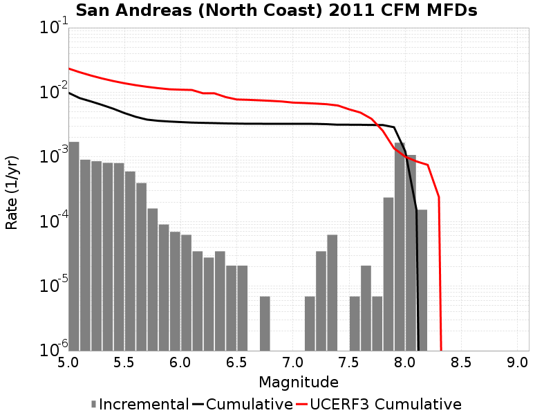

| Magnitude | Incremental Rate | Cumulative Rate | UCERF3 Cumulative Rate |
|-----|-----|-----|-----|
| 5.05 | 0.001706597 | 0.010681777 | 0.023354173 |
| 5.15 | 9.051183E-4 | 0.008975181 | 0.020479148 |
| 5.25 | 8.567532E-4 | 0.008070062 | 0.018195434 |
| 5.35 | 8.083881E-4 | 0.007213309 | 0.016381415 |
| 5.45 | 8.014788E-4 | 0.006404921 | 0.014940489 |
| 5.55 | 6.356556E-4 | 0.0056034424 | 0.013795921 |
| 5.65 | 5.112882E-4 | 0.004967787 | 0.012886758 |
| 5.75 | 2.625534E-4 | 0.0044564987 | 0.012164584 |
| 5.85 | 1.865511E-4 | 0.004193945 | 0.011590941 |
| 5.95 | 1.036395E-4 | 0.004007394 | 0.01113528 |
| 6.05 | 9.67302E-5 | 0.0039037545 | 0.010981478 |
| 6.15 | 6.21837E-5 | 0.0038070243 | 0.010866478 |
| 6.25 | 4.83651E-5 | 0.0037448406 | 0.009649738 |
| 6.35 | 7.6002296E-5 | 0.0036964754 | 0.009648948 |
| 6.45 | 9.67302E-5 | 0.0036204732 | 0.008445072 |
| 6.55 | 5.52744E-5 | 0.003523743 | 0.0077445707 |
| 6.65 | 2.76372E-5 | 0.0034684686 | 0.0076498585 |
| 6.75 | 1.38186E-5 | 0.0034408313 | 0.0075214286 |
| 6.85 | 1.38186E-5 | 0.0034270128 | 0.0073833447 |
| 6.95 | 1.38186E-5 | 0.003413194 | 0.007211889 |
| 7.05 | 0.0 | 0.0033993756 | 0.00692989 |
| 7.15 | 3.4546498E-5 | 0.0033993756 | 0.006831411 |
| 7.25 | 1.036395E-4 | 0.003364829 | 0.0066973083 |
| 7.35 | 8.2911596E-5 | 0.0032611894 | 0.006543445 |
| 7.45 | 0.0 | 0.003178278 | 0.006250831 |
| 7.55 | 3.4546498E-5 | 0.003178278 | 0.0054527223 |
| 7.65 | 2.0727899E-5 | 0.0031437315 | 0.0048646494 |
| 7.75 | 6.9093E-6 | 0.0031230035 | 0.0038868622 |
| 7.85 | 2.349162E-4 | 0.0031160943 | 0.0025401346 |
| 7.95 | 0.001658232 | 0.0028811782 | 0.0013586754 |
| 8.05 | 0.0010709414 | 0.0012229461 | 0.001007561 |
| 8.15 | 1.5200459E-4 | 1.5200459E-4 | 8.520563E-4 |
| 8.25 | 0.0 | 0.0 | 7.5232243E-4 |
| 8.35 | 0.0 | 0.0 | 2.3926099E-4 |

### San Andreas (Offshore) 2011 CFM
*[(top)](#table-of-contents)*

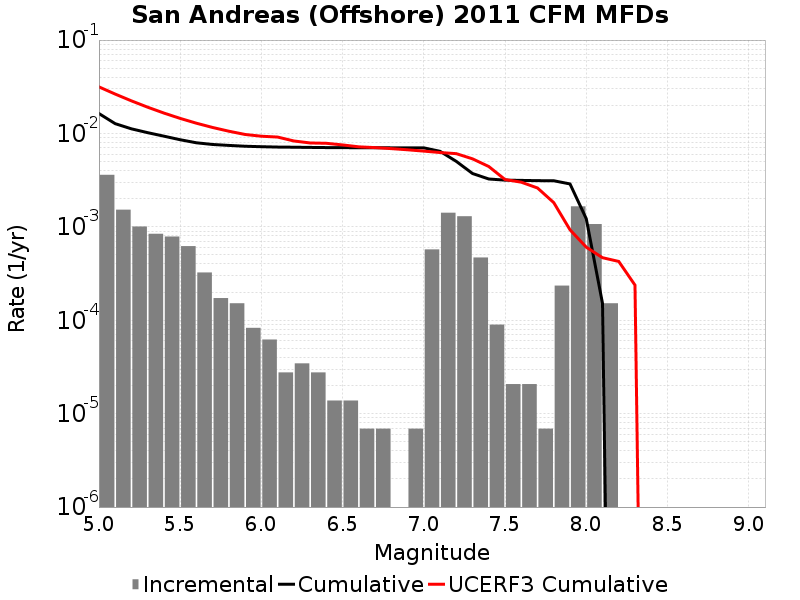

| Magnitude | Incremental Rate | Cumulative Rate | UCERF3 Cumulative Rate |
|-----|-----|-----|-----|
| 5.05 | 0.0036066545 | 0.01696233 | 0.031529028 |
| 5.15 | 0.0015269553 | 0.013355677 | 0.026405303 |
| 5.25 | 0.0010087577 | 0.0118287215 | 0.022335384 |
| 5.35 | 8.429346E-4 | 0.010819963 | 0.019102532 |
| 5.45 | 7.876602E-4 | 0.009977029 | 0.016534587 |
| 5.55 | 6.425649E-4 | 0.009189369 | 0.014494796 |
| 5.65 | 4.6292308E-4 | 0.008546804 | 0.0128745325 |
| 5.75 | 2.832813E-4 | 0.008083881 | 0.011587512 |
| 5.85 | 2.003697E-4 | 0.0078005996 | 0.010565194 |
| 5.95 | 9.67302E-5 | 0.0076002297 | 0.009753139 |
| 6.05 | 6.9092996E-5 | 0.0075034997 | 0.009341969 |
| 6.15 | 4.1455798E-5 | 0.007434407 | 0.009149561 |
| 6.25 | 4.83651E-5 | 0.007392951 | 0.008310123 |
| 6.35 | 3.4546498E-5 | 0.007344586 | 0.007911678 |
| 6.45 | 2.76372E-5 | 0.0073100394 | 0.007844841 |
| 6.55 | 1.38186E-5 | 0.007282402 | 0.007538395 |
| 6.65 | 6.9093E-6 | 0.0072685834 | 0.0071904263 |
| 6.75 | 6.9093E-6 | 0.0072616744 | 0.007056089 |
| 6.85 | 6.9093E-6 | 0.007254765 | 0.006880217 |
| 6.95 | 2.76372E-5 | 0.0072478554 | 0.006686704 |
| 7.05 | 6.356556E-4 | 0.0072202184 | 0.006470525 |
| 7.15 | 0.0014716808 | 0.006584563 | 0.0062490962 |
| 7.25 | 0.0013265855 | 0.005112882 | 0.006078331 |
| 7.35 | 4.905603E-4 | 0.0037862964 | 0.0053480286 |
| 7.45 | 9.67302E-5 | 0.0032957362 | 0.004425845 |
| 7.55 | 4.83651E-5 | 0.003199006 | 0.0032123793 |
| 7.65 | 2.76372E-5 | 0.0031506408 | 0.0030078627 |
| 7.75 | 6.9093E-6 | 0.0031230035 | 0.0026064417 |
| 7.85 | 2.349162E-4 | 0.0031160943 | 0.0018173005 |
| 7.95 | 0.001658232 | 0.0028811782 | 9.298017E-4 |
| 8.05 | 0.0010709414 | 0.0012229461 | 6.0600747E-4 |
| 8.15 | 1.5200459E-4 | 1.5200459E-4 | 4.6764698E-4 |
| 8.25 | 0.0 | 0.0 | 4.2630784E-4 |
| 8.35 | 0.0 | 0.0 | 2.3784128E-4 |

### San Andreas (Parkfield)
*[(top)](#table-of-contents)*

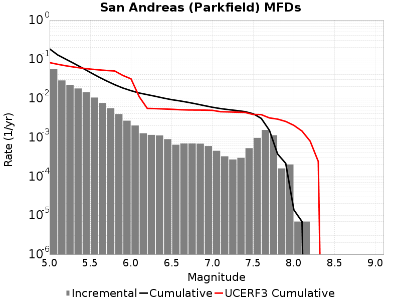

| Magnitude | Incremental Rate | Cumulative Rate | UCERF3 Cumulative Rate |
|-----|-----|-----|-----|
| 5.05 | 0.055288218 | 0.18800205 | 0.08152392 |
| 5.15 | 0.028480135 | 0.13271384 | 0.073743924 |
| 5.25 | 0.021950847 | 0.1042337 | 0.06756405 |
| 5.35 | 0.017736172 | 0.082282856 | 0.0626552 |
| 5.45 | 0.0141986115 | 0.06454668 | 0.058755968 |
| 5.55 | 0.010412315 | 0.05034807 | 0.055658422 |
| 5.65 | 0.00779369 | 0.039935753 | 0.053197857 |
| 5.75 | 0.006059456 | 0.03214206 | 0.051242795 |
| 5.85 | 0.004491045 | 0.026082607 | 0.049688186 |
| 5.95 | 0.0033026454 | 0.021591563 | 0.03823428 |
| 6.05 | 0.0027084455 | 0.018288916 | 0.031278316 |
| 6.15 | 0.001727325 | 0.015580472 | 0.010966381 |
| 6.25 | 0.0015822296 | 0.013853147 | 0.0054689334 |
| 6.35 | 0.0013749506 | 0.012270916 | 0.0053983317 |
| 6.45 | 0.0010709414 | 0.010895966 | 0.0052991975 |
| 6.55 | 7.807509E-4 | 0.009825025 | 0.005199702 |
| 6.65 | 7.807509E-4 | 0.009044274 | 0.005064082 |
| 6.75 | 7.6693227E-4 | 0.008263523 | 0.0049929637 |
| 6.85 | 7.254765E-4 | 0.0074965903 | 0.004969275 |
| 6.95 | 6.6329277E-4 | 0.0067711137 | 0.004951576 |
| 7.05 | 5.181975E-4 | 0.006107821 | 0.004884407 |
| 7.15 | 3.661929E-4 | 0.0055896235 | 0.004501249 |
| 7.25 | 2.970999E-4 | 0.0052234307 | 0.004451691 |
| 7.35 | 3.3164638E-4 | 0.004926331 | 0.004383092 |
| 7.45 | 5.389254E-4 | 0.0045946846 | 0.0043159625 |
| 7.55 | 9.7421126E-4 | 0.004055759 | 0.003828483 |
| 7.65 | 0.0015476831 | 0.0030815478 | 0.0037889117 |
| 7.75 | 0.0011469438 | 0.0015338645 | 0.00312406 |
| 7.85 | 1.727325E-4 | 3.869208E-4 | 0.0029125304 |
| 7.95 | 2.003697E-4 | 2.141883E-4 | 0.002537968 |
| 8.05 | 6.9093E-6 | 1.38186E-5 | 0.0020160854 |
| 8.15 | 6.9093E-6 | 6.9093E-6 | 0.0014392592 |
| 8.25 | 0.0 | 0.0 | 7.937497E-4 |
| 8.35 | 0.0 | 0.0 | 2.3926099E-4 |

### San Andreas (Peninsula) 2011 CFM
*[(top)](#table-of-contents)*

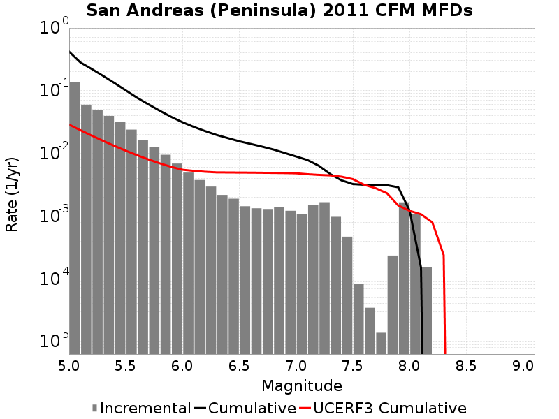

| Magnitude | Incremental Rate | Cumulative Rate | UCERF3 Cumulative Rate |
|-----|-----|-----|-----|
| 5.05 | 0.13730852 | 0.42551616 | 0.02875864 |
| 5.15 | 0.059841447 | 0.28820762 | 0.023425845 |
| 5.25 | 0.049664047 | 0.22836618 | 0.019189857 |
| 5.35 | 0.03960411 | 0.17870213 | 0.015825093 |
| 5.45 | 0.031540953 | 0.13909802 | 0.013152364 |
| 5.55 | 0.024313826 | 0.10755707 | 0.01102934 |
| 5.65 | 0.017404526 | 0.08324324 | 0.009342963 |
| 5.75 | 0.013873874 | 0.06583872 | 0.008003426 |
| 5.85 | 0.010474498 | 0.051964846 | 0.006939394 |
| 5.95 | 0.0074758623 | 0.041490346 | 0.0060942033 |
| 6.05 | 0.0054928935 | 0.034014482 | 0.0054882923 |
| 6.15 | 0.004035031 | 0.02852159 | 0.0052659004 |
| 6.25 | 0.003178278 | 0.024486559 | 0.005097285 |
| 6.35 | 0.0023353433 | 0.02130828 | 0.0049803825 |
| 6.45 | 0.002093518 | 0.018972937 | 0.0049682376 |
| 6.55 | 0.001658232 | 0.016879419 | 0.004948044 |
| 6.65 | 0.0014578623 | 0.015221188 | 0.004935232 |
| 6.75 | 0.001499318 | 0.013763325 | 0.004909034 |
| 6.85 | 0.0015269553 | 0.012264008 | 0.0048866197 |
| 6.95 | 0.0014094972 | 0.010737052 | 0.004858902 |
| 7.05 | 0.0011676716 | 0.009327555 | 0.0048172316 |
| 7.15 | 0.0016167762 | 0.008159883 | 0.004661436 |
| 7.25 | 0.0017411435 | 0.006543107 | 0.0045414492 |
| 7.35 | 0.0010018485 | 0.0048019635 | 0.0044625895 |
| 7.45 | 5.181975E-4 | 0.0038001148 | 0.004254971 |
| 7.55 | 1.105488E-4 | 0.0032819174 | 0.0038906902 |
| 7.65 | 4.1455798E-5 | 0.0031713687 | 0.0031577284 |
| 7.75 | 1.38186E-5 | 0.0031299128 | 0.00279037 |
| 7.85 | 2.349162E-4 | 0.0031160943 | 0.0023207671 |
| 7.95 | 0.001658232 | 0.0028811782 | 0.0014786142 |
| 8.05 | 0.0010709414 | 0.0012229461 | 0.001214599 |
| 8.15 | 1.5200459E-4 | 1.5200459E-4 | 0.0010714913 |
| 8.25 | 0.0 | 0.0 | 7.935151E-4 |
| 8.35 | 0.0 | 0.0 | 2.3926099E-4 |

### San Andreas (San Bernardino N)
*[(top)](#table-of-contents)*

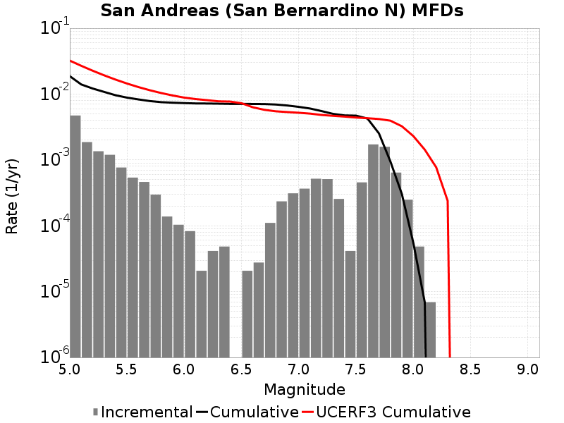

| Magnitude | Incremental Rate | Cumulative Rate | UCERF3 Cumulative Rate |
|-----|-----|-----|-----|
| 5.05 | 0.004725961 | 0.019166399 | 0.032256514 |
| 5.15 | 0.001865511 | 0.014440437 | 0.026905235 |
| 5.25 | 0.0013542228 | 0.012574926 | 0.022654563 |
| 5.35 | 0.0011953089 | 0.011220703 | 0.019278135 |
| 5.45 | 7.6693227E-4 | 0.010025394 | 0.016596144 |
| 5.55 | 5.389254E-4 | 0.009258462 | 0.01446576 |
| 5.65 | 4.6292308E-4 | 0.0087195365 | 0.012773538 |
| 5.75 | 2.970999E-4 | 0.008256613 | 0.011429357 |
| 5.85 | 1.450953E-4 | 0.007959514 | 0.010361637 |
| 5.95 | 1.3818599E-4 | 0.0078144185 | 0.009513517 |
| 6.05 | 1.105488E-4 | 0.007676232 | 0.008839831 |
| 6.15 | 4.83651E-5 | 0.007565683 | 0.008400228 |
| 6.25 | 5.52744E-5 | 0.0075173182 | 0.008086635 |
| 6.35 | 7.6002296E-5 | 0.007462044 | 0.007762198 |
| 6.45 | 1.38186E-5 | 0.007386042 | 0.0076996484 |
| 6.55 | 6.21837E-5 | 0.007372223 | 0.0072660143 |
| 6.65 | 5.52744E-5 | 0.0073100394 | 0.0062956014 |
| 6.75 | 2.07279E-4 | 0.007254765 | 0.0057669124 |
| 6.85 | 2.901906E-4 | 0.007047486 | 0.0054758945 |
| 6.95 | 3.3164638E-4 | 0.006757295 | 0.005332598 |
| 7.05 | 3.661929E-4 | 0.006425649 | 0.0052056327 |
| 7.15 | 5.181975E-4 | 0.006059456 | 0.0050502527 |
| 7.25 | 5.112882E-4 | 0.0055412585 | 0.004817549 |
| 7.35 | 2.625534E-4 | 0.0050299703 | 0.004677778 |
| 7.45 | 4.83651E-5 | 0.004767417 | 0.0045507345 |
| 7.55 | 4.560138E-4 | 0.004719052 | 0.0044024065 |
| 7.65 | 0.001727325 | 0.004263038 | 0.0043009226 |
| 7.75 | 0.001589139 | 0.0025357131 | 0.0041812304 |
| 7.85 | 6.425649E-4 | 9.465741E-4 | 0.003946663 |
| 7.95 | 2.487348E-4 | 3.0400918E-4 | 0.0032463993 |
| 8.05 | 4.83651E-5 | 5.52744E-5 | 0.0023042061 |
| 8.15 | 6.9093E-6 | 6.9093E-6 | 0.001433219 |
| 8.25 | 0.0 | 0.0 | 7.7207497E-4 |
| 8.35 | 0.0 | 0.0 | 2.3926099E-4 |

### San Andreas (San Bernardino S)
*[(top)](#table-of-contents)*

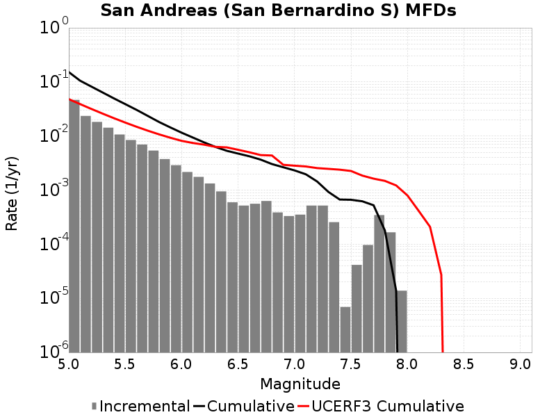

| Magnitude | Incremental Rate | Cumulative Rate | UCERF3 Cumulative Rate |
|-----|-----|-----|-----|
| 5.05 | 0.046547953 | 0.15398066 | 0.048103135 |
| 5.15 | 0.023505438 | 0.1074327 | 0.038971078 |
| 5.25 | 0.018226733 | 0.08392727 | 0.031717226 |
| 5.35 | 0.0142538855 | 0.06570053 | 0.025955288 |
| 5.45 | 0.010667959 | 0.051446646 | 0.021378418 |
| 5.55 | 0.008436255 | 0.04077869 | 0.01774288 |
| 5.65 | 0.0069714836 | 0.032342434 | 0.01485507 |
| 5.75 | 0.005555077 | 0.02537095 | 0.012561201 |
| 5.85 | 0.0041317614 | 0.019815871 | 0.010739116 |
| 5.95 | 0.0032888267 | 0.015684111 | 0.009291782 |
| 6.05 | 0.0024458922 | 0.012395284 | 0.008142124 |
| 6.15 | 0.0019276947 | 0.009949392 | 0.00743445 |
| 6.25 | 0.0014440437 | 0.008021697 | 0.00691958 |
| 6.35 | 9.949392E-4 | 0.0065776533 | 0.0063085076 |
| 6.45 | 6.5638346E-4 | 0.0055827145 | 0.0061665457 |
| 6.55 | 5.5274396E-4 | 0.004926331 | 0.005566737 |
| 6.65 | 5.941998E-4 | 0.0043735867 | 0.005008901 |
| 6.75 | 6.356556E-4 | 0.003779387 | 0.004444136 |
| 6.85 | 3.869208E-4 | 0.0031437315 | 0.004365943 |
| 6.95 | 3.45465E-4 | 0.0027568107 | 0.0029385886 |
| 7.05 | 3.731022E-4 | 0.0024113457 | 0.0028297394 |
| 7.15 | 5.251068E-4 | 0.0020382435 | 0.0027377314 |
| 7.25 | 5.389254E-4 | 0.0015131367 | 0.0025542397 |
| 7.35 | 2.694627E-4 | 9.7421126E-4 | 0.0024722498 |
| 7.45 | 6.9093E-6 | 7.047486E-4 | 0.002388791 |
| 7.55 | 4.1455798E-5 | 6.978393E-4 | 0.002259644 |
| 7.65 | 1.174581E-4 | 6.5638346E-4 | 0.0018556895 |
| 7.75 | 3.523743E-4 | 5.389254E-4 | 0.0016298892 |
| 7.85 | 1.6582319E-4 | 1.865511E-4 | 0.0014825203 |
| 7.95 | 1.38186E-5 | 2.0727899E-5 | 0.0012205923 |
| 8.05 | 6.9093E-6 | 6.9093E-6 | 7.97182E-4 |
| 8.15 | 0.0 | 0.0 | 4.12182E-4 |
| 8.25 | 0.0 | 0.0 | 2.0983754E-4 |
| 8.35 | 0.0 | 0.0 | 2.7143069E-5 |

### San Andreas (San Gorgonio Pass-Garnet HIll)
*[(top)](#table-of-contents)*

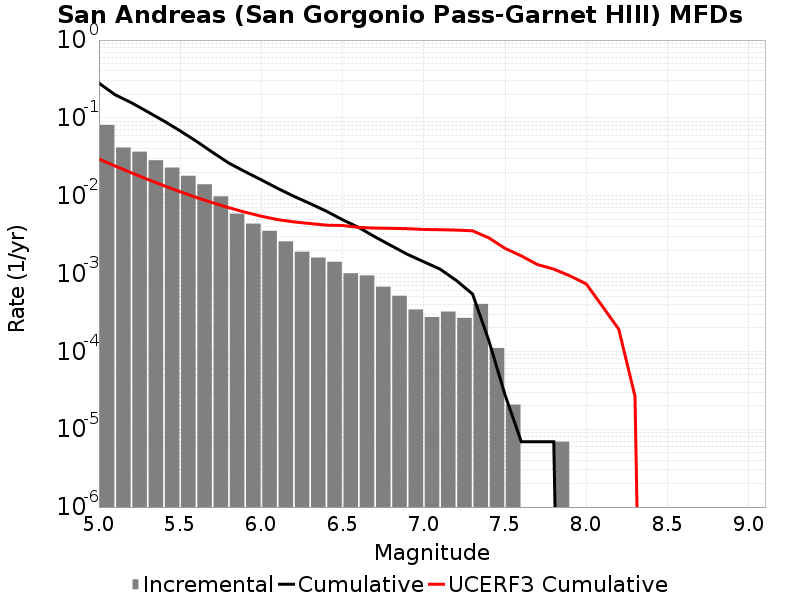

| Magnitude | Incremental Rate | Cumulative Rate | UCERF3 Cumulative Rate |
|-----|-----|-----|-----|
| 5.05 | 0.08137774 | 0.28838727 | 0.029595876 |
| 5.15 | 0.041600894 | 0.20700954 | 0.024077786 |
| 5.25 | 0.03682657 | 0.16540864 | 0.019694611 |
| 5.35 | 0.028569955 | 0.12858208 | 0.016212933 |
| 5.45 | 0.023014879 | 0.100012116 | 0.013447337 |
| 5.55 | 0.018309645 | 0.076997235 | 0.011250545 |
| 5.65 | 0.015414648 | 0.058687594 | 0.009505572 |
| 5.75 | 0.012174186 | 0.043272946 | 0.008119491 |
| 5.85 | 0.008014788 | 0.031098759 | 0.007018487 |
| 5.95 | 0.0054238006 | 0.023083972 | 0.0061439285 |
| 6.05 | 0.0039106635 | 0.01766017 | 0.005453437 |
| 6.15 | 0.0027982665 | 0.013749507 | 0.004932618 |
| 6.25 | 0.0021764294 | 0.010951241 | 0.0046126563 |
| 6.35 | 0.0017411435 | 0.0087748105 | 0.0043883068 |
| 6.45 | 0.0015131367 | 0.0070336675 | 0.004186393 |
| 6.55 | 0.0010571228 | 0.0055205305 | 0.004145121 |
| 6.65 | 9.534834E-4 | 0.0044634077 | 0.0039183167 |
| 6.75 | 6.978393E-4 | 0.0035099243 | 0.003838596 |
| 6.85 | 5.5274396E-4 | 0.002812085 | 0.0038090541 |
| 6.95 | 3.661929E-4 | 0.002259341 | 0.0037703833 |
| 7.05 | 3.247371E-4 | 0.0018931482 | 0.003686132 |
| 7.15 | 3.800115E-4 | 0.0015684111 | 0.0036578954 |
| 7.25 | 4.007394E-4 | 0.0011883996 | 0.0036175682 |
| 7.35 | 5.803812E-4 | 7.876602E-4 | 0.003542249 |
| 7.45 | 1.312767E-4 | 2.07279E-4 | 0.0028781982 |
| 7.55 | 2.0727899E-5 | 7.6002296E-5 | 0.0021080626 |
| 7.65 | 0.0 | 5.52744E-5 | 0.001687481 |
| 7.75 | 2.0727899E-5 | 5.52744E-5 | 0.0013044077 |
| 7.85 | 3.4546498E-5 | 3.4546498E-5 | 0.0011403529 |
| 7.95 | 0.0 | 0.0 | 9.3429856E-4 |
| 8.05 | 0.0 | 0.0 | 7.3562854E-4 |
| 8.15 | 0.0 | 0.0 | 3.784802E-4 |
| 8.25 | 0.0 | 0.0 | 1.9255566E-4 |
| 8.35 | 0.0 | 0.0 | 2.6581523E-5 |

### San Andreas (Santa Cruz Mts) 2011 CFM
*[(top)](#table-of-contents)*

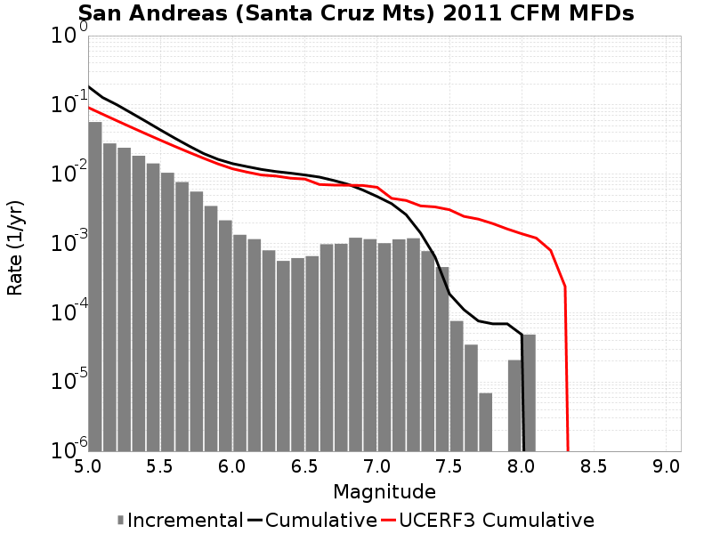

| Magnitude | Incremental Rate | Cumulative Rate | UCERF3 Cumulative Rate |
|-----|-----|-----|-----|
| 5.05 | 0.056607895 | 0.1898952 | 0.091917306 |
| 5.15 | 0.027796114 | 0.13328731 | 0.07359617 |
| 5.25 | 0.024065092 | 0.10549119 | 0.059043176 |
| 5.35 | 0.018427104 | 0.0814261 | 0.047483325 |
| 5.45 | 0.014288432 | 0.062998995 | 0.038301006 |
| 5.55 | 0.010488317 | 0.048710566 | 0.03100723 |
| 5.65 | 0.007924967 | 0.038222246 | 0.02521358 |
| 5.75 | 0.0061216396 | 0.03029728 | 0.020611519 |
| 5.85 | 0.0042284913 | 0.02417564 | 0.016955974 |
| 5.95 | 0.0028189945 | 0.019947149 | 0.014052269 |
| 6.05 | 0.0018309645 | 0.017128155 | 0.011957535 |
| 6.15 | 0.0017342343 | 0.01529719 | 0.01071856 |
| 6.25 | 0.0011469438 | 0.013562956 | 0.00973699 |
| 6.35 | 8.360253E-4 | 0.012416012 | 0.009397689 |
| 6.45 | 7.945695E-4 | 0.011579987 | 0.008761797 |
| 6.55 | 8.2220667E-4 | 0.010785417 | 0.0085104415 |
| 6.65 | 0.0011262159 | 0.009963211 | 0.007103475 |
| 6.75 | 0.0010709414 | 0.008836995 | 0.0069651203 |
| 6.85 | 0.0014164065 | 0.007766053 | 0.0069302535 |
| 6.95 | 0.0013680414 | 0.0063496465 | 0.006872134 |
| 7.05 | 0.0011262159 | 0.0049816053 | 0.0064704726 |
| 7.15 | 0.0011883996 | 0.0038553893 | 0.0044835857 |
| 7.25 | 0.0012160367 | 0.0026669898 | 0.0041752914 |
| 7.35 | 7.945695E-4 | 0.001450953 | 0.0034883071 |
| 7.45 | 4.698324E-4 | 6.5638346E-4 | 0.0033704124 |
| 7.55 | 7.6002296E-5 | 1.865511E-4 | 0.003068106 |
| 7.65 | 3.4546498E-5 | 1.105488E-4 | 0.002459832 |
| 7.75 | 6.9093E-6 | 7.6002296E-5 | 0.0022461726 |
| 7.85 | 0.0 | 6.9092996E-5 | 0.0019352855 |
| 7.95 | 2.0727899E-5 | 6.9092996E-5 | 0.00161795 |
| 8.05 | 4.83651E-5 | 4.83651E-5 | 0.0013804785 |
| 8.15 | 0.0 | 0.0 | 0.0011967062 |
| 8.25 | 0.0 | 0.0 | 7.935153E-4 |
| 8.35 | 0.0 | 0.0 | 2.3926099E-4 |

## San Gregorio
*[(top)](#table-of-contents)*

### San Gregorio (North) 2011 CFM
*[(top)](#table-of-contents)*

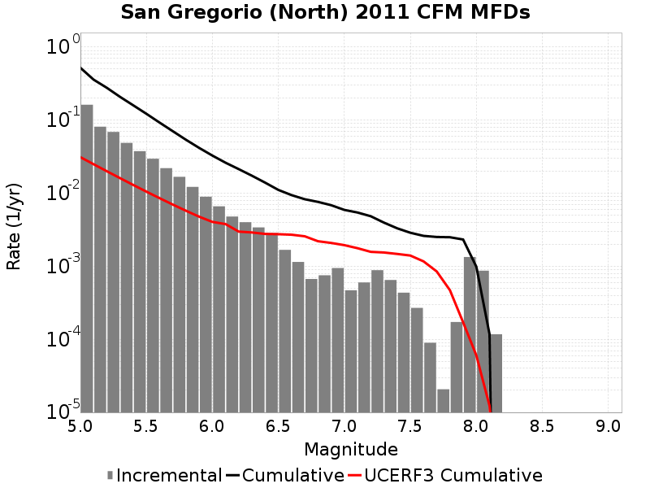

| Magnitude | Incremental Rate | Cumulative Rate | UCERF3 Cumulative Rate |
|-----|-----|-----|-----|
| 5.05 | 0.16286601 | 0.5261086 | 0.031221393 |
| 5.15 | 0.08152283 | 0.36324263 | 0.024999946 |
| 5.25 | 0.06907918 | 0.2817198 | 0.020058073 |
| 5.35 | 0.048917845 | 0.21264061 | 0.016132604 |
| 5.45 | 0.03770405 | 0.16372277 | 0.013014494 |
| 5.55 | 0.02969617 | 0.12601872 | 0.010537691 |
| 5.65 | 0.022206489 | 0.09632255 | 0.008570297 |
| 5.75 | 0.017224886 | 0.07411606 | 0.0070075393 |
| 5.85 | 0.012574926 | 0.056891177 | 0.005766197 |
| 5.95 | 0.009217006 | 0.04431625 | 0.004780164 |
| 6.05 | 0.0067434767 | 0.035099242 | 0.0040577175 |
| 6.15 | 0.004864147 | 0.028355766 | 0.0037864686 |
| 6.25 | 0.0040626684 | 0.02349162 | 0.00298703 |
| 6.35 | 0.00345465 | 0.019428952 | 0.002907845 |
| 6.45 | 0.0028949967 | 0.015974302 | 0.0027768717 |
| 6.55 | 0.0016858692 | 0.013079304 | 0.002753288 |
| 6.65 | 0.0011676716 | 0.011393435 | 0.002708621 |
| 6.75 | 6.771114E-4 | 0.010225764 | 0.0025773183 |
| 6.85 | 8.083881E-4 | 0.009548653 | 0.002206168 |
| 6.95 | 9.67302E-4 | 0.008740264 | 0.0020894455 |
| 7.05 | 6.356556E-4 | 0.0077729626 | 0.0019494003 |
| 7.15 | 9.949392E-4 | 0.007137307 | 0.0017700065 |
| 7.25 | 0.001243674 | 0.0061423676 | 0.0015783369 |
| 7.35 | 7.945695E-4 | 0.0048986934 | 0.0015461022 |
| 7.45 | 5.0437887E-4 | 0.004104124 | 0.0014777348 |
| 7.55 | 3.178278E-4 | 0.0035997452 | 0.0014046327 |
| 7.65 | 1.3818599E-4 | 0.0032819174 | 0.0011690251 |
| 7.75 | 3.4546498E-5 | 0.0031437315 | 8.5012504E-4 |
| 7.85 | 2.349162E-4 | 0.003109185 | 4.7091607E-4 |
| 7.95 | 0.0016513227 | 0.0028742687 | 1.7095631E-4 |
| 8.05 | 0.0010709414 | 0.0012229461 | 6.0410573E-5 |
| 8.15 | 1.5200459E-4 | 1.5200459E-4 | 1.2354511E-5 |
| 8.25 | 0.0 | 0.0 | 1.0911487E-7 |

### San Gregorio (South) 2011 CFM
*[(top)](#table-of-contents)*

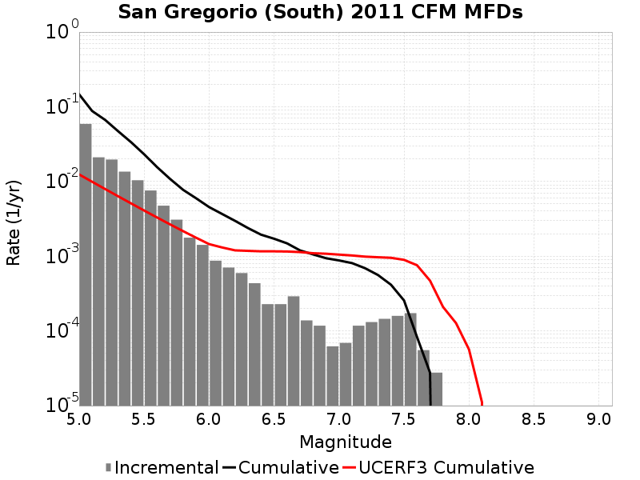

| Magnitude | Incremental Rate | Cumulative Rate | UCERF3 Cumulative Rate |
|-----|-----|-----|-----|
| 5.05 | 0.058894873 | 0.15136895 | 0.012421036 |
| 5.15 | 0.021045728 | 0.09247407 | 0.009914312 |
| 5.25 | 0.01965005 | 0.07142834 | 0.0079231495 |
| 5.35 | 0.013535319 | 0.051778294 | 0.0063415137 |
| 5.45 | 0.010384678 | 0.038242973 | 0.0050851754 |
| 5.55 | 0.0076140487 | 0.027858296 | 0.0040872307 |
| 5.65 | 0.00523034 | 0.020244248 | 0.0032945347 |
| 5.75 | 0.004207764 | 0.015013909 | 0.002664874 |
| 5.85 | 0.0028397222 | 0.010806145 | 0.0021647168 |
| 5.95 | 0.0022178853 | 0.0079664225 | 0.0017674278 |
| 6.05 | 0.0012851298 | 0.0057485374 | 0.0014518499 |
| 6.15 | 9.327555E-4 | 0.0044634077 | 0.0013095143 |
| 6.25 | 7.531137E-4 | 0.0035306523 | 0.0011972202 |
| 6.35 | 5.320161E-4 | 0.0027775385 | 0.001179216 |
| 6.45 | 2.694627E-4 | 0.0022455226 | 0.001162545 |
| 6.55 | 2.349162E-4 | 0.0019760597 | 0.0011622198 |
| 6.65 | 2.901906E-4 | 0.0017411435 | 0.0011557451 |
| 6.75 | 1.3818599E-4 | 0.001450953 | 0.0011355078 |
| 6.85 | 1.243674E-4 | 0.0013127669 | 0.0010967298 |
| 6.95 | 7.6002296E-5 | 0.0011883996 | 0.0010795719 |
| 7.05 | 8.2911596E-5 | 0.0011123973 | 0.001050754 |
| 7.15 | 1.450953E-4 | 0.0010294857 | 0.0010227582 |
| 7.25 | 1.865511E-4 | 8.843904E-4 | 9.873462E-4 |
| 7.35 | 1.796418E-4 | 6.978393E-4 | 9.684875E-4 |
| 7.45 | 2.280069E-4 | 5.181975E-4 | 9.5191365E-4 |
| 7.55 | 1.796418E-4 | 2.901906E-4 | 8.941299E-4 |
| 7.65 | 6.21837E-5 | 1.105488E-4 | 7.5706496E-4 |
| 7.75 | 3.4546498E-5 | 4.83651E-5 | 4.7085926E-4 |
| 7.85 | 6.9093E-6 | 1.38186E-5 | 2.0965426E-4 |
| 7.95 | 0.0 | 6.9093E-6 | 1.2735162E-4 |
| 8.05 | 6.9093E-6 | 6.9093E-6 | 5.644585E-5 |
| 8.15 | 0.0 | 0.0 | 1.1048418E-5 |

## San Jacinto (CC to SM)
*[(top)](#table-of-contents)*

### San Jacinto (Borrego)
*[(top)](#table-of-contents)*

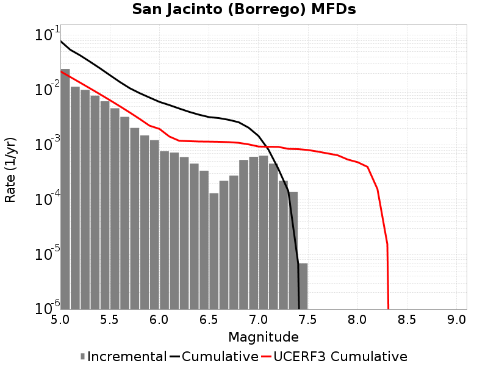

| Magnitude | Incremental Rate | Cumulative Rate | UCERF3 Cumulative Rate |
|-----|-----|-----|-----|
| 5.05 | 0.024348373 | 0.08325016 | 0.022088202 |
| 5.15 | 0.011559259 | 0.058901783 | 0.017420186 |
| 5.25 | 0.010108306 | 0.047342524 | 0.013712249 |
| 5.35 | 0.007945695 | 0.037234217 | 0.01076693 |
| 5.45 | 0.0062805535 | 0.029288523 | 0.00842738 |
| 5.55 | 0.004767417 | 0.023007968 | 0.006569008 |
| 5.65 | 0.0036273825 | 0.018240552 | 0.005092852 |
| 5.75 | 0.0025978968 | 0.014613169 | 0.003920299 |
| 5.85 | 0.0020589714 | 0.012015273 | 0.0029888176 |
| 5.95 | 0.001865511 | 0.009956301 | 0.0022485717 |
| 6.05 | 0.0013680414 | 0.00809079 | 0.0019634503 |
| 6.15 | 0.0010985787 | 0.0067227487 | 0.0014260715 |
| 6.25 | 7.6693227E-4 | 0.00562417 | 0.0011905023 |
| 6.35 | 5.251068E-4 | 0.004857238 | 0.0011730954 |
| 6.45 | 4.0764868E-4 | 0.0043321312 | 0.0011558904 |
| 6.55 | 1.796418E-4 | 0.0039244825 | 0.0011503735 |
| 6.65 | 2.487348E-4 | 0.0037448406 | 0.0011416132 |
| 6.75 | 4.974696E-4 | 0.0034961058 | 0.0011251641 |
| 6.85 | 8.1529736E-4 | 0.002998636 | 0.0010938627 |
| 6.95 | 7.047486E-4 | 0.0021833389 | 0.0010248147 |
| 7.05 | 6.425649E-4 | 0.0014785902 | 9.35792E-4 |
| 7.15 | 4.698324E-4 | 8.360253E-4 | 9.26775E-4 |
| 7.25 | 2.210976E-4 | 3.661929E-4 | 9.2294463E-4 |
| 7.35 | 1.3818599E-4 | 1.450953E-4 | 8.488272E-4 |
| 7.45 | 6.9093E-6 | 6.9093E-6 | 8.388092E-4 |
| 7.55 | 0.0 | 0.0 | 8.087162E-4 |
| 7.65 | 0.0 | 0.0 | 7.552828E-4 |
| 7.75 | 0.0 | 0.0 | 6.9977844E-4 |
| 7.85 | 0.0 | 0.0 | 6.4710923E-4 |
| 7.95 | 0.0 | 0.0 | 5.4224004E-4 |
| 8.05 | 0.0 | 0.0 | 4.8452546E-4 |
| 8.15 | 0.0 | 0.0 | 3.983122E-4 |
| 8.25 | 0.0 | 0.0 | 1.5691023E-4 |
| 8.35 | 0.0 | 0.0 | 1.5448491E-5 |

### San Jacinto (Coyote Creek)
*[(top)](#table-of-contents)*

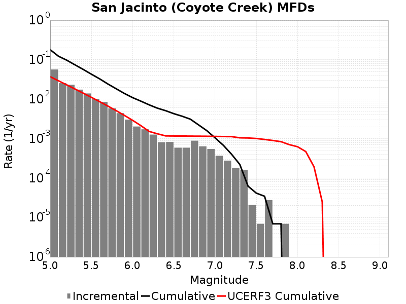

| Magnitude | Incremental Rate | Cumulative Rate | UCERF3 Cumulative Rate |
|-----|-----|-----|-----|
| 5.05 | 0.056573346 | 0.18188731 | 0.03709153 |
| 5.15 | 0.025433132 | 0.12531397 | 0.029276285 |
| 5.25 | 0.023146154 | 0.09988084 | 0.023068417 |
| 5.35 | 0.017439073 | 0.076734684 | 0.018137332 |
| 5.45 | 0.013942967 | 0.059295613 | 0.014220431 |
| 5.55 | 0.010225764 | 0.045352645 | 0.011109127 |
| 5.65 | 0.00868499 | 0.03512688 | 0.00863773 |
| 5.75 | 0.006135458 | 0.02644189 | 0.006674629 |
| 5.85 | 0.004677596 | 0.020306433 | 0.005115283 |
| 5.95 | 0.0033441011 | 0.015628837 | 0.0038766505 |
| 6.05 | 0.002328434 | 0.012284735 | 0.0029037234 |
| 6.15 | 0.0019415133 | 0.009956301 | 0.0021322302 |
| 6.25 | 0.0014716808 | 0.008014788 | 0.0015194113 |
| 6.35 | 9.1893686E-4 | 0.006543107 | 0.0013250142 |
| 6.45 | 8.567532E-4 | 0.00562417 | 0.0011716898 |
| 6.55 | 5.872905E-4 | 0.004767417 | 0.0011635385 |
| 6.65 | 5.941998E-4 | 0.0041801264 | 0.0011635359 |
| 6.75 | 8.843904E-4 | 0.0035859267 | 0.0011566427 |
| 6.85 | 6.356556E-4 | 0.0027015363 | 0.0011527126 |
| 6.95 | 5.5274396E-4 | 0.0020658807 | 0.001146518 |
| 7.05 | 3.661929E-4 | 0.0015131367 | 0.001136428 |
| 7.15 | 2.832813E-4 | 0.0011469438 | 0.0011269436 |
| 7.25 | 1.865511E-4 | 8.636625E-4 | 0.0011224529 |
| 7.35 | 1.865511E-4 | 6.771114E-4 | 0.0010476708 |
| 7.45 | 1.036395E-4 | 4.905603E-4 | 0.0010371314 |
| 7.55 | 1.589139E-4 | 3.869208E-4 | 0.0010064169 |
| 7.65 | 1.243674E-4 | 2.280069E-4 | 9.520984E-4 |
| 7.75 | 6.9092996E-5 | 1.036395E-4 | 8.958751E-4 |
| 7.85 | 3.4546498E-5 | 3.4546498E-5 | 8.357031E-4 |
| 7.95 | 0.0 | 0.0 | 7.0338836E-4 |
| 8.05 | 0.0 | 0.0 | 6.2214345E-4 |
| 8.15 | 0.0 | 0.0 | 4.6916702E-4 |
| 8.25 | 0.0 | 0.0 | 1.926832E-4 |
| 8.35 | 0.0 | 0.0 | 2.4812074E-5 |

### San Jacinto (Superstition Mtn)
*[(top)](#table-of-contents)*

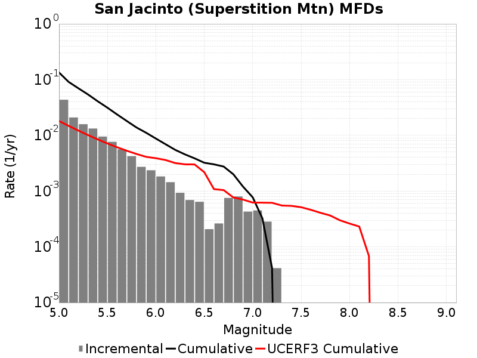

| Magnitude | Incremental Rate | Cumulative Rate | UCERF3 Cumulative Rate |
|-----|-----|-----|-----|
| 5.05 | 0.04352168 | 0.13480735 | 0.018076435 |
| 5.15 | 0.020935178 | 0.09128567 | 0.014791292 |
| 5.25 | 0.015849935 | 0.07035049 | 0.01218181 |
| 5.35 | 0.013252038 | 0.054500557 | 0.010109025 |
| 5.45 | 0.009507197 | 0.04124852 | 0.008462554 |
| 5.55 | 0.007648595 | 0.031741325 | 0.0071547152 |
| 5.65 | 0.005644898 | 0.024092728 | 0.0061158617 |
| 5.75 | 0.0043459497 | 0.018447831 | 0.0052906713 |
| 5.85 | 0.0028604502 | 0.0141018815 | 0.0046351994 |
| 5.95 | 0.0024251642 | 0.011241431 | 0.0041145394 |
| 6.05 | 0.0018516923 | 0.008816266 | 0.0038890587 |
| 6.15 | 0.0014647716 | 0.006964574 | 0.0036095206 |
| 6.25 | 9.327555E-4 | 0.0054998025 | 0.0031841393 |
| 6.35 | 6.9093E-4 | 0.004567047 | 0.0030204258 |
| 6.45 | 6.494742E-4 | 0.0038761173 | 0.0030068744 |
| 6.55 | 2.07279E-4 | 0.003226643 | 0.002183602 |
| 6.65 | 2.625534E-4 | 0.003019364 | 0.0010850288 |
| 6.75 | 7.531137E-4 | 0.0027568107 | 0.0010415096 |
| 6.85 | 8.014788E-4 | 0.002003697 | 7.684031E-4 |
| 6.95 | 4.283766E-4 | 0.0012022182 | 7.0377626E-4 |
| 7.05 | 4.491045E-4 | 7.738416E-4 | 6.221634E-4 |
| 7.15 | 2.832813E-4 | 3.247371E-4 | 6.197132E-4 |
| 7.25 | 4.1455798E-5 | 4.1455798E-5 | 6.1594794E-4 |
| 7.35 | 0.0 | 0.0 | 5.5088475E-4 |
| 7.45 | 0.0 | 0.0 | 5.4304866E-4 |
| 7.55 | 0.0 | 0.0 | 5.136673E-4 |
| 7.65 | 0.0 | 0.0 | 4.61197E-4 |
| 7.75 | 0.0 | 0.0 | 4.074684E-4 |
| 7.85 | 0.0 | 0.0 | 3.6454445E-4 |
| 7.95 | 0.0 | 0.0 | 2.9948173E-4 |
| 8.05 | 0.0 | 0.0 | 2.614687E-4 |
| 8.15 | 0.0 | 0.0 | 2.3112027E-4 |
| 8.25 | 0.0 | 0.0 | 6.828069E-5 |

## San Jacinto (SB to C)
*[(top)](#table-of-contents)*

### San Jacinto (Anza) rev
*[(top)](#table-of-contents)*

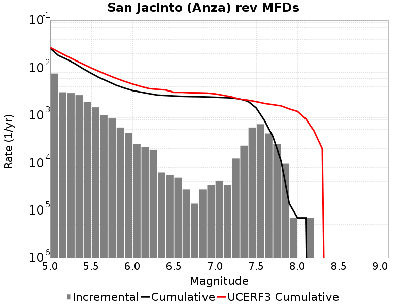

| Magnitude | Incremental Rate | Cumulative Rate | UCERF3 Cumulative Rate |
|-----|-----|-----|-----|
| 5.05 | 0.007579502 | 0.026573168 | 0.026895285 |
| 5.15 | 0.0030539106 | 0.018993665 | 0.021791227 |
| 5.25 | 0.0029364524 | 0.015939755 | 0.017736932 |
| 5.35 | 0.0026600806 | 0.013003303 | 0.0145164905 |
| 5.45 | 0.0019276947 | 0.010343222 | 0.0119584035 |
| 5.55 | 0.0014716808 | 0.008415528 | 0.009926442 |
| 5.65 | 0.0010087577 | 0.0069438466 | 0.008312398 |
| 5.75 | 8.636625E-4 | 0.0059350887 | 0.007030317 |
| 5.85 | 5.734719E-4 | 0.0050714263 | 0.006011924 |
| 5.95 | 4.560138E-4 | 0.004497954 | 0.005202986 |
| 6.05 | 2.901906E-4 | 0.0040419404 | 0.004560423 |
| 6.15 | 2.625534E-4 | 0.0037517499 | 0.0040500173 |
| 6.25 | 2.418255E-4 | 0.0034891965 | 0.003655185 |
| 6.35 | 1.174581E-4 | 0.003247371 | 0.0035262771 |
| 6.45 | 7.6002296E-5 | 0.0031299128 | 0.0034250624 |
| 6.55 | 6.9092996E-5 | 0.0030539106 | 0.0030418346 |
| 6.65 | 4.83651E-5 | 0.0029848176 | 0.0030418346 |
| 6.75 | 9.67302E-5 | 0.0029364524 | 0.002986255 |
| 6.85 | 8.2911596E-5 | 0.0028397222 | 0.0029758431 |
| 6.95 | 6.9092996E-5 | 0.0027568107 | 0.0029399046 |
| 7.05 | 4.83651E-5 | 0.0026877176 | 0.0028264178 |
| 7.15 | 1.105488E-4 | 0.0026393526 | 0.0026386022 |
| 7.25 | 1.727325E-4 | 0.0025288037 | 0.0024466151 |
| 7.35 | 3.661929E-4 | 0.0023560713 | 0.0021867016 |
| 7.45 | 5.665626E-4 | 0.0019898785 | 0.002086107 |
| 7.55 | 6.494742E-4 | 0.0014233157 | 0.0019439915 |
| 7.65 | 4.14558E-4 | 7.738416E-4 | 0.0017821882 |
| 7.75 | 2.487348E-4 | 3.592836E-4 | 0.0016798389 |
| 7.85 | 9.67302E-5 | 1.105488E-4 | 0.0015819316 |
| 7.95 | 6.9093E-6 | 1.38186E-5 | 0.001365232 |
| 8.05 | 0.0 | 6.9093E-6 | 0.0012068754 |
| 8.15 | 6.9093E-6 | 6.9093E-6 | 8.449637E-4 |
| 8.25 | 0.0 | 0.0 | 4.6824254E-4 |
| 8.35 | 0.0 | 0.0 | 1.9640489E-4 |

### San Jacinto (Clark) rev
*[(top)](#table-of-contents)*

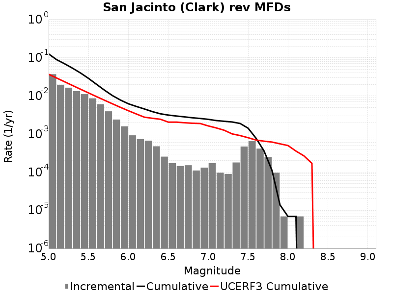

| Magnitude | Incremental Rate | Cumulative Rate | UCERF3 Cumulative Rate |
|-----|-----|-----|-----|
| 5.05 | 0.037082214 | 0.12721403 | 0.03701521 |
| 5.15 | 0.019574046 | 0.09013182 | 0.029484944 |
| 5.25 | 0.016409587 | 0.07055777 | 0.023503441 |
| 5.35 | 0.013383314 | 0.054148182 | 0.018752165 |
| 5.45 | 0.011110154 | 0.04076487 | 0.014978092 |
| 5.55 | 0.0086228065 | 0.029654715 | 0.01198024 |
| 5.65 | 0.0060249097 | 0.021031909 | 0.009598961 |
| 5.75 | 0.00394521 | 0.0150069995 | 0.0077074436 |
| 5.85 | 0.002508076 | 0.0110617895 | 0.006204958 |
| 5.95 | 0.0017618715 | 0.008553714 | 0.0050114915 |
| 6.05 | 0.0010709414 | 0.0067918417 | 0.004087904 |
| 6.15 | 8.7057176E-4 | 0.0057209004 | 0.0033543366 |
| 6.25 | 7.807509E-4 | 0.0048503284 | 0.002771651 |
| 6.35 | 5.251068E-4 | 0.0040695774 | 0.0025896542 |
| 6.45 | 2.694627E-4 | 0.0035444708 | 0.0024451928 |
| 6.55 | 2.003697E-4 | 0.0032750082 | 0.002056494 |
| 6.65 | 1.589139E-4 | 0.0030746385 | 0.002056494 |
| 6.75 | 1.796418E-4 | 0.0029157246 | 0.001979164 |
| 6.85 | 1.312767E-4 | 0.0027360828 | 0.0019221848 |
| 6.95 | 1.450953E-4 | 0.002604806 | 0.0018877026 |
| 7.05 | 1.796418E-4 | 0.0024597107 | 0.0016345358 |
| 7.15 | 9.67302E-5 | 0.002280069 | 0.0014481795 |
| 7.25 | 9.67302E-5 | 0.0021833389 | 0.0012581326 |
| 7.35 | 1.865511E-4 | 0.0020866087 | 0.0010091453 |
| 7.45 | 4.767417E-4 | 0.0019000574 | 9.12753E-4 |
| 7.55 | 6.494742E-4 | 0.0014233157 | 8.0193783E-4 |
| 7.65 | 4.14558E-4 | 7.738416E-4 | 6.9531717E-4 |
| 7.75 | 2.487348E-4 | 3.592836E-4 | 6.5027346E-4 |
| 7.85 | 9.67302E-5 | 1.105488E-4 | 6.1607413E-4 |
| 7.95 | 6.9093E-6 | 1.38186E-5 | 5.5351475E-4 |
| 8.05 | 0.0 | 6.9093E-6 | 4.994637E-4 |
| 8.15 | 6.9093E-6 | 6.9093E-6 | 3.5727475E-4 |
| 8.25 | 0.0 | 0.0 | 2.6739293E-4 |
| 8.35 | 0.0 | 0.0 | 1.7032823E-4 |

### San Jacinto (San Bernardino)
*[(top)](#table-of-contents)*

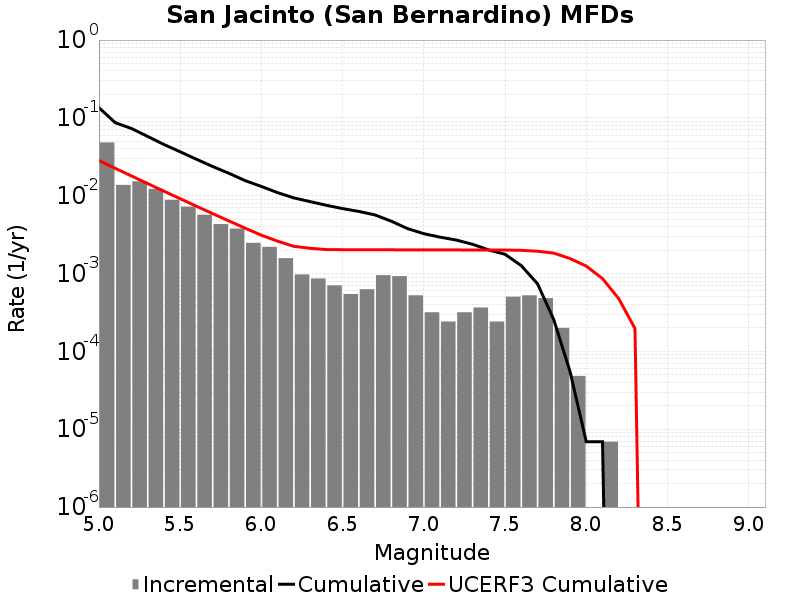

| Magnitude | Incremental Rate | Cumulative Rate | UCERF3 Cumulative Rate |
|-----|-----|-----|-----|
| 5.05 | 0.048337463 | 0.13874565 | 0.028272657 |
| 5.15 | 0.013777144 | 0.09040819 | 0.02252205 |
| 5.25 | 0.015304099 | 0.07663105 | 0.017954182 |
| 5.35 | 0.012257098 | 0.061326947 | 0.014325796 |
| 5.45 | 0.008850813 | 0.049069848 | 0.011443665 |
| 5.55 | 0.0072478554 | 0.040219035 | 0.009154309 |
| 5.65 | 0.0057001724 | 0.03297118 | 0.0073358067 |
| 5.75 | 0.0043390403 | 0.027271006 | 0.0058913203 |
| 5.85 | 0.0039313915 | 0.022931967 | 0.0047439234 |
| 5.95 | 0.00276372 | 0.019000575 | 0.003832514 |
| 6.05 | 0.0024251642 | 0.016236855 | 0.0031085555 |
| 6.15 | 0.0017480529 | 0.013811691 | 0.0026065905 |
| 6.25 | 0.0010709414 | 0.012063637 | 0.0022366915 |
| 6.35 | 9.327555E-4 | 0.0109926965 | 0.0021121493 |
| 6.45 | 7.876602E-4 | 0.010059941 | 0.00203309 |
| 6.55 | 6.5638346E-4 | 0.00927228 | 0.0020256266 |
| 6.65 | 6.978393E-4 | 0.008615897 | 0.002022234 |
| 6.75 | 0.0010087577 | 0.007918058 | 0.002020544 |
| 6.85 | 0.0010709414 | 0.0069093 | 0.0020192713 |
| 6.95 | 5.941998E-4 | 0.0058383583 | 0.002017801 |
| 7.05 | 3.45465E-4 | 0.0052441587 | 0.0020165625 |
| 7.15 | 2.487348E-4 | 0.0048986934 | 0.002014964 |
| 7.25 | 3.661929E-4 | 0.004649959 | 0.0020121706 |
| 7.35 | 4.007394E-4 | 0.004283766 | 0.0020101897 |
| 7.45 | 2.832813E-4 | 0.0038830265 | 0.0020083492 |
| 7.55 | 6.356556E-4 | 0.0035997452 | 0.0020048467 |
| 7.65 | 0.0012298553 | 0.0029640896 | 0.0019888189 |
| 7.75 | 0.0010778508 | 0.0017342343 | 0.0019357821 |
| 7.85 | 4.83651E-4 | 6.5638346E-4 | 0.0018309384 |
| 7.95 | 1.589139E-4 | 1.727325E-4 | 0.0015592495 |
| 8.05 | 6.9093E-6 | 1.38186E-5 | 0.0012478796 |
| 8.15 | 6.9093E-6 | 6.9093E-6 | 8.613425E-4 |
| 8.25 | 0.0 | 0.0 | 4.760987E-4 |
| 8.35 | 0.0 | 0.0 | 1.9667334E-4 |

### San Jacinto (San Jacinto Valley) rev
*[(top)](#table-of-contents)*

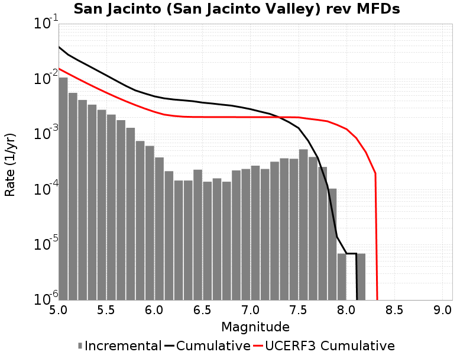

| Magnitude | Incremental Rate | Cumulative Rate | UCERF3 Cumulative Rate |
|-----|-----|-----|-----|
| 5.05 | 0.010598866 | 0.03857462 | 0.015417056 |
| 5.15 | 0.0056034424 | 0.027975755 | 0.012473218 |
| 5.25 | 0.004166308 | 0.022372313 | 0.010134844 |
| 5.35 | 0.0034270128 | 0.018206006 | 0.008277408 |
| 5.45 | 0.00276372 | 0.014778992 | 0.0068019936 |
| 5.55 | 0.0022662503 | 0.012015273 | 0.0056300303 |
| 5.65 | 0.001796418 | 0.009749022 | 0.004699107 |
| 5.75 | 0.0013058577 | 0.007952604 | 0.003959648 |
| 5.85 | 7.6693227E-4 | 0.0066467463 | 0.003372275 |
| 5.95 | 6.356556E-4 | 0.0058798143 | 0.0029057083 |
| 6.05 | 4.214673E-4 | 0.0052441587 | 0.0025351008 |
| 6.15 | 2.487348E-4 | 0.0048226914 | 0.0022654315 |
| 6.25 | 1.727325E-4 | 0.0045739566 | 0.0021449423 |
| 6.35 | 1.589139E-4 | 0.004401224 | 0.0020741043 |
| 6.45 | 2.418255E-4 | 0.0042423103 | 0.0020507853 |
| 6.55 | 1.934604E-4 | 0.0040004845 | 0.0020469083 |
| 6.65 | 1.934604E-4 | 0.0038070243 | 0.0020428717 |
| 6.75 | 1.589139E-4 | 0.003613564 | 0.0020422973 |
| 6.85 | 2.418255E-4 | 0.00345465 | 0.0020410595 |
| 6.95 | 2.625534E-4 | 0.0032128245 | 0.0020394248 |
| 7.05 | 2.832813E-4 | 0.0029502711 | 0.0020375692 |
| 7.15 | 2.349162E-4 | 0.0026669898 | 0.002036522 |
| 7.25 | 3.178278E-4 | 0.0024320735 | 0.002035082 |
| 7.35 | 3.661929E-4 | 0.0021142457 | 0.0020331664 |
| 7.45 | 3.938301E-4 | 0.0017480529 | 0.0020308525 |
| 7.55 | 5.734719E-4 | 0.0013542228 | 0.0020173586 |
| 7.65 | 4.0764868E-4 | 7.807509E-4 | 0.0019073663 |
| 7.75 | 2.556441E-4 | 3.731022E-4 | 0.0018192712 |
| 7.85 | 1.036395E-4 | 1.174581E-4 | 0.0017158715 |
| 7.95 | 6.9093E-6 | 1.38186E-5 | 0.001478963 |
| 8.05 | 0.0 | 6.9093E-6 | 0.0012352217 |
| 8.15 | 6.9093E-6 | 6.9093E-6 | 8.543919E-4 |
| 8.25 | 0.0 | 0.0 | 4.7260374E-4 |
| 8.35 | 0.0 | 0.0 | 1.9667334E-4 |

### San Jacinto (Stepovers Combined)
*[(top)](#table-of-contents)*

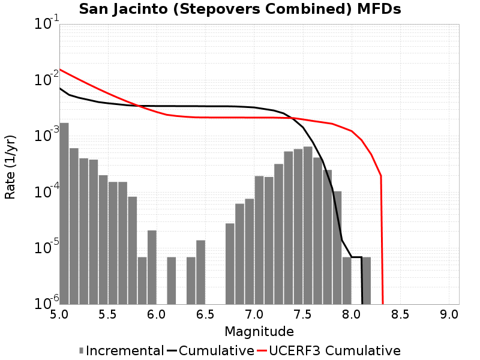

| Magnitude | Incremental Rate | Cumulative Rate | UCERF3 Cumulative Rate |
|-----|-----|-----|-----|
| 5.05 | 0.0017204157 | 0.007538046 | 0.01554356 |
| 5.15 | 6.0801837E-4 | 0.0058176303 | 0.012606074 |
| 5.25 | 4.007394E-4 | 0.005209612 | 0.010272746 |
| 5.35 | 3.800115E-4 | 0.004808873 | 0.008419318 |
| 5.45 | 2.003697E-4 | 0.004428861 | 0.006947088 |
| 5.55 | 1.5200459E-4 | 0.0042284913 | 0.005777654 |
| 5.65 | 1.5200459E-4 | 0.004076487 | 0.0048487396 |
| 5.75 | 8.2911596E-5 | 0.0039244825 | 0.0041108765 |
| 5.85 | 3.4546498E-5 | 0.0038415708 | 0.0035247712 |
| 5.95 | 4.83651E-5 | 0.0038070243 | 0.003059211 |
| 6.05 | 2.76372E-5 | 0.0037586591 | 0.0026894035 |
| 6.15 | 6.9093E-6 | 0.003731022 | 0.002405243 |
| 6.25 | 6.9093E-6 | 0.0037241126 | 0.002287289 |
| 6.35 | 2.0727899E-5 | 0.0037172034 | 0.0022116269 |
| 6.45 | 4.1455798E-5 | 0.0036964754 | 0.0021595524 |
| 6.55 | 1.38186E-5 | 0.0036550197 | 0.0021513258 |
| 6.65 | 3.4546498E-5 | 0.003641201 | 0.002147464 |
| 6.75 | 4.83651E-5 | 0.0036066545 | 0.0021463402 |
| 6.85 | 8.98209E-5 | 0.0035582895 | 0.002145137 |
| 6.95 | 1.105488E-4 | 0.0034684686 | 0.0021433993 |
| 7.05 | 2.349162E-4 | 0.0033579199 | 0.002141104 |
| 7.15 | 2.280069E-4 | 0.0031230035 | 0.0021400503 |
| 7.25 | 3.45465E-4 | 0.0028949967 | 0.0021380864 |
| 7.35 | 5.320161E-4 | 0.0025495316 | 0.0021175786 |
| 7.45 | 5.872905E-4 | 0.0020175155 | 0.002099829 |
| 7.55 | 6.494742E-4 | 0.0014302251 | 0.0019867609 |
| 7.65 | 4.14558E-4 | 7.807509E-4 | 0.0018648634 |
| 7.75 | 2.487348E-4 | 3.661929E-4 | 0.0017618267 |
| 7.85 | 1.036395E-4 | 1.174581E-4 | 0.00166015 |
| 7.95 | 6.9093E-6 | 1.38186E-5 | 0.0014345228 |
| 8.05 | 0.0 | 6.9093E-6 | 0.0012283901 |
| 8.15 | 6.9093E-6 | 6.9093E-6 | 8.514208E-4 |
| 8.25 | 0.0 | 0.0 | 4.7052343E-4 |
| 8.35 | 0.0 | 0.0 | 1.9640489E-4 |

## Other Faults
*[(top)](#table-of-contents)*

### Airport Lake
*[(top)](#table-of-contents)*

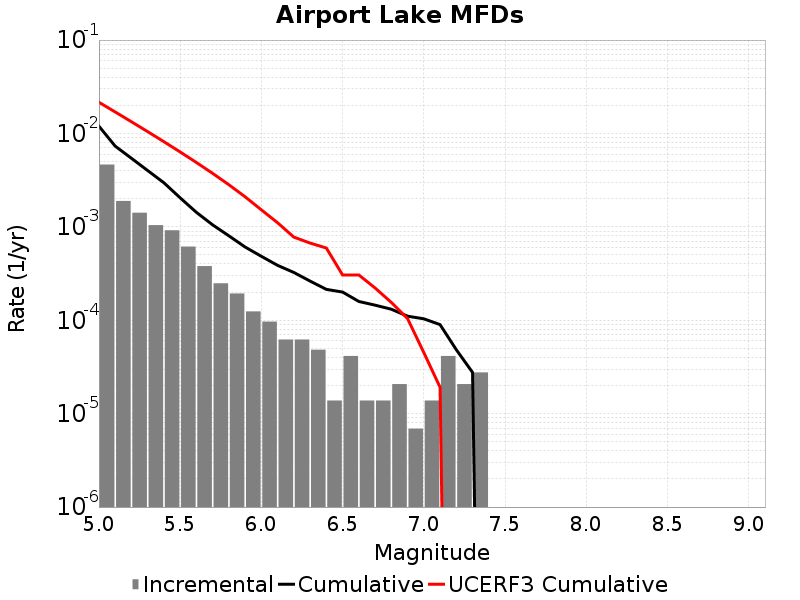

| Magnitude | Incremental Rate | Cumulative Rate | UCERF3 Cumulative Rate |
|-----|-----|-----|-----|
| 5.05 | 0.0046430496 | 0.011973817 | 0.021572491 |
| 5.15 | 0.0018931482 | 0.0073307673 | 0.016990073 |
| 5.25 | 0.0014164065 | 0.005437619 | 0.01335013 |
| 5.35 | 0.0010433043 | 0.0040212125 | 0.01045882 |
| 5.45 | 9.1893686E-4 | 0.0029779084 | 0.008162171 |
| 5.55 | 6.149277E-4 | 0.0020589714 | 0.0063378774 |
| 5.65 | 3.800115E-4 | 0.0014440437 | 0.0048887897 |
| 5.75 | 2.487348E-4 | 0.0010640322 | 0.0037377384 |
| 5.85 | 1.934604E-4 | 8.1529736E-4 | 0.0028234257 |
| 5.95 | 1.243674E-4 | 6.21837E-4 | 0.0020971615 |
| 6.05 | 9.67302E-5 | 4.974696E-4 | 0.0015205464 |
| 6.15 | 6.21837E-5 | 4.007394E-4 | 0.0011057542 |
| 6.25 | 6.21837E-5 | 3.385557E-4 | 7.762729E-4 |
| 6.35 | 4.83651E-5 | 2.7637198E-4 | 6.7064934E-4 |
| 6.45 | 1.38186E-5 | 2.280069E-4 | 5.9330097E-4 |
| 6.55 | 4.1455798E-5 | 2.141883E-4 | 3.0551254E-4 |
| 6.65 | 1.38186E-5 | 1.727325E-4 | 3.0551254E-4 |
| 6.75 | 1.38186E-5 | 1.589139E-4 | 2.2160172E-4 |
| 6.85 | 2.76372E-5 | 1.450953E-4 | 1.5514804E-4 |
| 6.95 | 6.9093E-6 | 1.174581E-4 | 1.04104074E-4 |
| 7.05 | 1.38186E-5 | 1.105488E-4 | 4.508191E-5 |
| 7.15 | 4.1455798E-5 | 9.67302E-5 | 1.9167075E-5 |
| 7.25 | 2.0727899E-5 | 5.52744E-5 | 0.0 |
| 7.35 | 3.4546498E-5 | 3.4546498E-5 | 0.0 |

### Almanor 2011 CFM
*[(top)](#table-of-contents)*

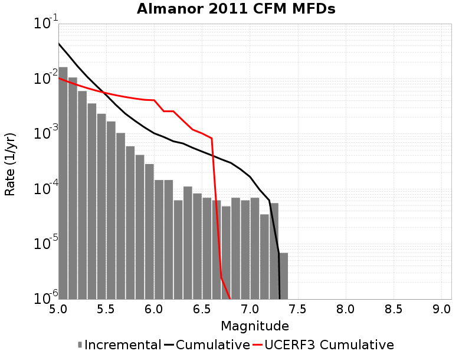

| Magnitude | Incremental Rate | Cumulative Rate | UCERF3 Cumulative Rate |
|-----|-----|-----|-----|
| 5.05 | 0.016243763 | 0.04364605 | 0.01027483 |
| 5.15 | 0.010529773 | 0.027402284 | 0.008832195 |
| 5.25 | 0.005969635 | 0.01687251 | 0.007686268 |
| 5.35 | 0.0035582895 | 0.010902875 | 0.006776026 |
| 5.45 | 0.0023146155 | 0.007344586 | 0.006052995 |
| 5.55 | 0.0016789599 | 0.0050299703 | 0.0054786718 |
| 5.65 | 0.001036395 | 0.0033510104 | 0.00502247 |
| 5.75 | 5.941998E-4 | 0.0023146155 | 0.004660096 |
| 5.85 | 4.14558E-4 | 0.0017204157 | 0.0043722526 |
| 5.95 | 2.832813E-4 | 0.0013058577 | 0.00414361 |
| 6.05 | 1.450953E-4 | 0.0010225764 | 0.004072724 |
| 6.15 | 1.450953E-4 | 8.7748107E-4 | 0.0025633462 |
| 6.25 | 6.21837E-5 | 7.323858E-4 | 0.0025633462 |
| 6.35 | 1.105488E-4 | 6.702021E-4 | 0.0017423609 |
| 6.45 | 8.2911596E-5 | 5.596533E-4 | 0.0011971836 |
| 6.55 | 6.9092996E-5 | 4.767417E-4 | 0.0010171777 |
| 6.65 | 6.21837E-5 | 4.0764868E-4 | 8.299544E-4 |
| 6.75 | 4.83651E-5 | 3.45465E-4 | 2.444631E-6 |
| 6.85 | 6.9092996E-5 | 2.970999E-4 | 9.2688316E-7 |
| 6.95 | 6.21837E-5 | 2.280069E-4 | 0.0 |
| 7.05 | 6.9092996E-5 | 1.6582319E-4 | 0.0 |
| 7.15 | 3.4546498E-5 | 9.67302E-5 | 0.0 |
| 7.25 | 5.52744E-5 | 6.21837E-5 | 0.0 |
| 7.35 | 6.9093E-6 | 6.9093E-6 | 0.0 |

### Anacapa-Dume alt 1
*[(top)](#table-of-contents)*

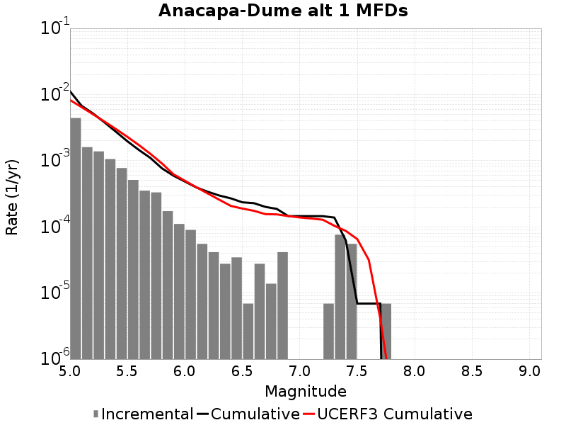

| Magnitude | Incremental Rate | Cumulative Rate | UCERF3 Cumulative Rate |
|-----|-----|-----|-----|
| 5.05 | 0.0044150427 | 0.011476347 | 0.008264131 |
| 5.15 | 0.0016029576 | 0.0070613045 | 0.0064663407 |
| 5.25 | 0.00138186 | 0.005458347 | 0.0050383057 |
| 5.35 | 0.0010571228 | 0.004076487 | 0.0039039769 |
| 5.45 | 7.876602E-4 | 0.003019364 | 0.0030029474 |
| 5.55 | 5.181975E-4 | 0.0022317038 | 0.0022872344 |
| 5.65 | 3.869208E-4 | 0.0017135064 | 0.0017187233 |
| 5.75 | 3.523743E-4 | 0.0013265855 | 0.0012671389 |
| 5.85 | 1.796418E-4 | 9.7421126E-4 | 9.0843264E-4 |
| 5.95 | 1.3818599E-4 | 7.945695E-4 | 6.235022E-4 |
| 6.05 | 9.67302E-5 | 6.5638346E-4 | 4.970458E-4 |
| 6.15 | 6.21837E-5 | 5.596533E-4 | 3.9666108E-4 |
| 6.25 | 5.52744E-5 | 4.974696E-4 | 3.184224E-4 |
| 6.35 | 4.1455798E-5 | 4.421952E-4 | 2.5630172E-4 |
| 6.45 | 3.4546498E-5 | 4.007394E-4 | 2.0695753E-4 |
| 6.55 | 6.9093E-6 | 3.661929E-4 | 1.8901455E-4 |
| 6.65 | 2.76372E-5 | 3.592836E-4 | 1.7476192E-4 |
| 6.75 | 1.38186E-5 | 3.3164638E-4 | 1.5572534E-4 |
| 6.85 | 4.83651E-5 | 3.178278E-4 | 1.5423988E-4 |
| 6.95 | 6.9093E-6 | 2.694627E-4 | 1.4537388E-4 |
| 7.05 | 4.83651E-5 | 2.625534E-4 | 1.3864833E-4 |
| 7.15 | 1.38186E-5 | 2.141883E-4 | 1.3374933E-4 |
| 7.25 | 2.0727899E-5 | 2.003697E-4 | 1.2808116E-4 |
| 7.35 | 1.036395E-4 | 1.796418E-4 | 1.0389956E-4 |
| 7.45 | 6.21837E-5 | 7.6002296E-5 | 8.6786116E-5 |
| 7.55 | 6.9093E-6 | 1.38186E-5 | 6.516268E-5 |
| 7.65 | 0.0 | 6.9093E-6 | 3.1615997E-5 |
| 7.75 | 6.9093E-6 | 6.9093E-6 | 4.0956897E-6 |
| 7.85 | 0.0 | 0.0 | 2.8435582E-7 |
| 7.95 | 0.0 | 0.0 | 6.7235293E-9 |

### Anaheim
*[(top)](#table-of-contents)*

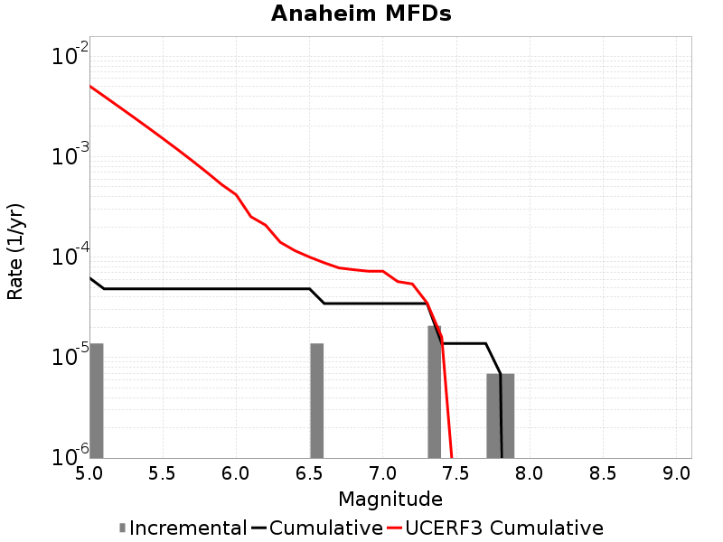

| Magnitude | Incremental Rate | Cumulative Rate | UCERF3 Cumulative Rate |
|-----|-----|-----|-----|
| 5.05 | 1.38186E-5 | 6.21837E-5 | 0.0050718356 |
| 5.15 | 0.0 | 4.83651E-5 | 0.004003122 |
| 5.25 | 0.0 | 4.83651E-5 | 0.0031542124 |
| 5.35 | 0.0 | 4.83651E-5 | 0.0024798997 |
| 5.45 | 0.0 | 4.83651E-5 | 0.0019442741 |
| 5.55 | 0.0 | 4.83651E-5 | 0.0015188114 |
| 5.65 | 0.0 | 4.83651E-5 | 0.0011808545 |
| 5.75 | 0.0 | 4.83651E-5 | 9.124057E-4 |
| 5.85 | 0.0 | 4.83651E-5 | 6.991693E-4 |
| 5.95 | 0.0 | 4.83651E-5 | 5.297896E-4 |
| 6.05 | 0.0 | 4.83651E-5 | 4.1752215E-4 |
| 6.15 | 0.0 | 4.83651E-5 | 2.528083E-4 |
| 6.25 | 0.0 | 4.83651E-5 | 2.0836941E-4 |
| 6.35 | 0.0 | 4.83651E-5 | 1.4084115E-4 |
| 6.45 | 0.0 | 4.83651E-5 | 1.1599068E-4 |
| 6.55 | 1.38186E-5 | 4.83651E-5 | 1.00147954E-4 |
| 6.65 | 0.0 | 3.4546498E-5 | 8.783784E-5 |
| 6.75 | 0.0 | 3.4546498E-5 | 7.812485E-5 |
| 6.85 | 0.0 | 3.4546498E-5 | 7.49938E-5 |
| 6.95 | 0.0 | 3.4546498E-5 | 7.248015E-5 |
| 7.05 | 0.0 | 3.4546498E-5 | 7.2363306E-5 |
| 7.15 | 0.0 | 3.4546498E-5 | 5.7138535E-5 |
| 7.25 | 0.0 | 3.4546498E-5 | 5.411196E-5 |
| 7.35 | 2.0727899E-5 | 3.4546498E-5 | 3.5045934E-5 |
| 7.45 | 0.0 | 1.38186E-5 | 1.5983935E-5 |
| 7.55 | 0.0 | 1.38186E-5 | 2.7419E-7 |
| 7.65 | 0.0 | 1.38186E-5 | 3.0187373E-8 |
| 7.75 | 6.9093E-6 | 1.38186E-5 | 2.583773E-9 |
| 7.85 | 6.9093E-6 | 6.9093E-6 | 0.0 |

### Antelope Valley 2011
*[(top)](#table-of-contents)*

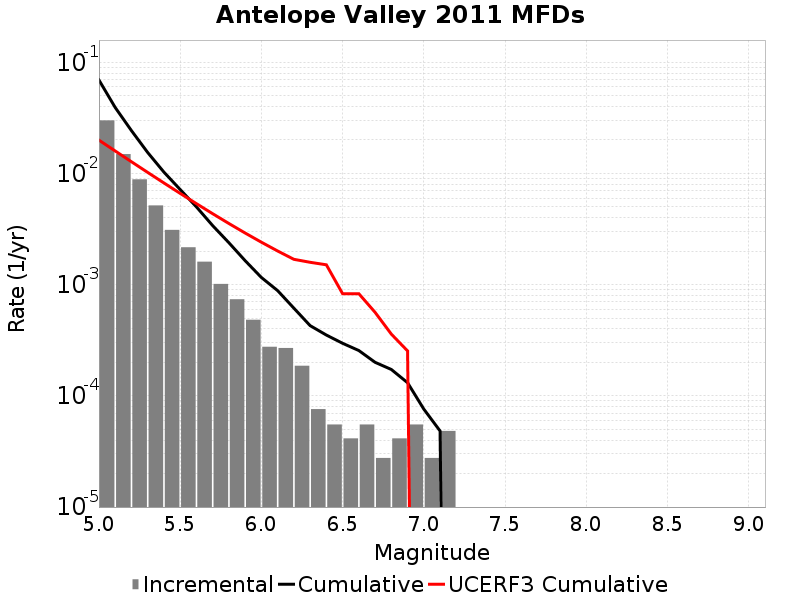

| Magnitude | Incremental Rate | Cumulative Rate | UCERF3 Cumulative Rate |
|-----|-----|-----|-----|
| 5.05 | 0.030034726 | 0.06927955 | 0.019946266 |
| 5.15 | 0.0149379065 | 0.039244823 | 0.015938785 |
| 5.25 | 0.008857722 | 0.024306918 | 0.01275553 |
| 5.35 | 0.005161247 | 0.015449194 | 0.010226981 |
| 5.45 | 0.003109185 | 0.010287948 | 0.008218483 |
| 5.55 | 0.0021695201 | 0.0071787625 | 0.006623076 |
| 5.65 | 0.0016098669 | 0.0050092423 | 0.0053557996 |
| 5.75 | 0.0010156671 | 0.0033993756 | 0.004349166 |
| 5.85 | 7.392951E-4 | 0.0023837085 | 0.0035495684 |
| 5.95 | 4.83651E-4 | 0.0016444133 | 0.0029144257 |
| 6.05 | 2.7637198E-4 | 0.0011607624 | 0.0024099138 |
| 6.15 | 2.694627E-4 | 8.843904E-4 | 0.0020091657 |
| 6.25 | 1.865511E-4 | 6.149277E-4 | 0.0016908402 |
| 6.35 | 7.6002296E-5 | 4.283766E-4 | 0.0015896983 |
| 6.45 | 5.52744E-5 | 3.523743E-4 | 0.0015093583 |
| 6.55 | 4.1455798E-5 | 2.970999E-4 | 8.296549E-4 |
| 6.65 | 5.52744E-5 | 2.556441E-4 | 8.296549E-4 |
| 6.75 | 2.76372E-5 | 2.003697E-4 | 5.639933E-4 |
| 6.85 | 4.1455798E-5 | 1.727325E-4 | 3.5927884E-4 |
| 6.95 | 5.52744E-5 | 1.312767E-4 | 2.5363613E-4 |
| 7.05 | 2.76372E-5 | 7.6002296E-5 | 0.0 |
| 7.15 | 4.83651E-5 | 4.83651E-5 | 0.0 |

### Ash Hill
*[(top)](#table-of-contents)*

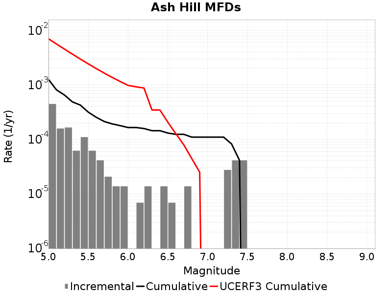

| Magnitude | Incremental Rate | Cumulative Rate | UCERF3 Cumulative Rate |
|-----|-----|-----|-----|
| 5.05 | 4.491045E-4 | 0.0012713112 | 0.0070545995 |
| 5.15 | 1.589139E-4 | 8.2220667E-4 | 0.005667544 |
| 5.25 | 1.6582319E-4 | 6.6329277E-4 | 0.0045657665 |
| 5.35 | 6.21837E-5 | 4.974696E-4 | 0.0036905936 |
| 5.45 | 1.105488E-4 | 4.3528588E-4 | 0.002995419 |
| 5.55 | 6.21837E-5 | 3.247371E-4 | 0.0024432223 |
| 5.65 | 4.1455798E-5 | 2.625534E-4 | 0.0020045966 |
| 5.75 | 2.0727899E-5 | 2.210976E-4 | 0.0016561841 |
| 5.85 | 1.38186E-5 | 2.003697E-4 | 0.0013794302 |
| 5.95 | 1.38186E-5 | 1.865511E-4 | 0.0011595966 |
| 6.05 | 0.0 | 1.727325E-4 | 9.852635E-4 |
| 6.15 | 6.9093E-6 | 1.727325E-4 | 9.2695194E-4 |
| 6.25 | 1.38186E-5 | 1.6582319E-4 | 8.807541E-4 |
| 6.35 | 0.0 | 1.5200459E-4 | 3.48166E-4 |
| 6.45 | 1.38186E-5 | 1.5200459E-4 | 3.4722066E-4 |
| 6.55 | 6.9093E-6 | 1.3818599E-4 | 2.0747866E-4 |
| 6.65 | 6.9093E-6 | 1.312767E-4 | 1.2767718E-4 |
| 6.75 | 1.38186E-5 | 1.243674E-4 | 7.997106E-5 |
| 6.85 | 0.0 | 1.105488E-4 | 4.4659188E-5 |
| 6.95 | 0.0 | 1.105488E-4 | 2.509994E-5 |
| 7.05 | 0.0 | 1.105488E-4 | 0.0 |
| 7.15 | 0.0 | 1.105488E-4 | 0.0 |
| 7.25 | 2.76372E-5 | 1.105488E-4 | 0.0 |
| 7.35 | 4.1455798E-5 | 8.2911596E-5 | 0.0 |
| 7.45 | 4.1455798E-5 | 4.1455798E-5 | 0.0 |

### Baker
*[(top)](#table-of-contents)*

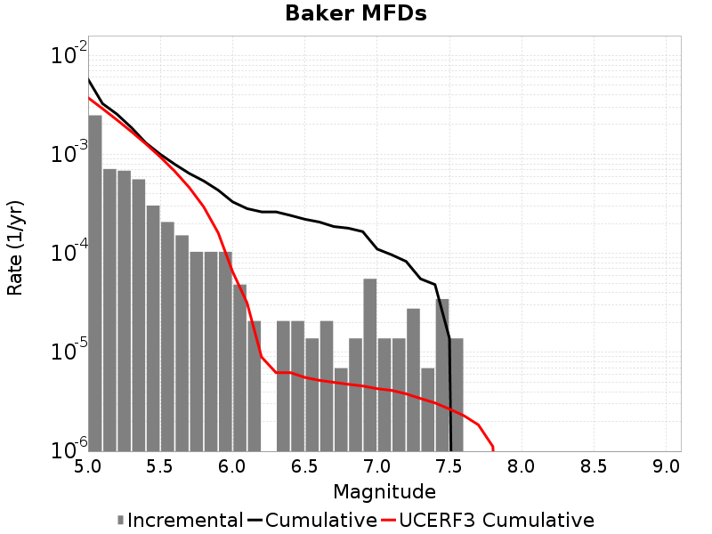

| Magnitude | Incremental Rate | Cumulative Rate | UCERF3 Cumulative Rate |
|-----|-----|-----|-----|
| 5.05 | 0.0024804387 | 0.0057416284 | 0.0037414988 |
| 5.15 | 7.1165786E-4 | 0.0032611894 | 0.002899132 |
| 5.25 | 6.840207E-4 | 0.0025495316 | 0.002230016 |
| 5.35 | 5.596533E-4 | 0.001865511 | 0.0016985186 |
| 5.45 | 3.0400918E-4 | 0.0013058577 | 0.0012763351 |
| 5.55 | 2.07279E-4 | 0.0010018485 | 9.409828E-4 |
| 5.65 | 1.5200459E-4 | 7.945695E-4 | 6.74603E-4 |
| 5.75 | 1.036395E-4 | 6.425649E-4 | 4.6301E-4 |
| 5.85 | 1.036395E-4 | 5.389254E-4 | 2.9493571E-4 |
| 5.95 | 1.036395E-4 | 4.3528588E-4 | 1.6142956E-4 |
| 6.05 | 4.83651E-5 | 3.3164638E-4 | 6.526483E-5 |
| 6.15 | 2.0727899E-5 | 2.832813E-4 | 3.1570165E-5 |
| 6.25 | 0.0 | 2.625534E-4 | 8.962695E-6 |
| 6.35 | 2.0727899E-5 | 2.625534E-4 | 6.2342965E-6 |
| 6.45 | 2.0727899E-5 | 2.418255E-4 | 6.2342965E-6 |
| 6.55 | 1.38186E-5 | 2.210976E-4 | 5.5740798E-6 |
| 6.65 | 2.0727899E-5 | 2.07279E-4 | 5.2089745E-6 |
| 6.75 | 6.9093E-6 | 1.865511E-4 | 4.9739197E-6 |
| 6.85 | 1.38186E-5 | 1.796418E-4 | 4.7525955E-6 |
| 6.95 | 5.52744E-5 | 1.6582319E-4 | 4.567235E-6 |
| 7.05 | 1.38186E-5 | 1.105488E-4 | 4.292074E-6 |
| 7.15 | 1.38186E-5 | 9.67302E-5 | 4.1251196E-6 |
| 7.25 | 2.76372E-5 | 8.2911596E-5 | 3.8043665E-6 |
| 7.35 | 6.9093E-6 | 5.52744E-5 | 3.4146733E-6 |
| 7.45 | 3.4546498E-5 | 4.83651E-5 | 3.0795538E-6 |
| 7.55 | 1.38186E-5 | 1.38186E-5 | 2.672737E-6 |
| 7.65 | 0.0 | 0.0 | 2.2896336E-6 |
| 7.75 | 0.0 | 0.0 | 1.8481775E-6 |
| 7.85 | 0.0 | 0.0 | 1.1175662E-6 |
| 7.95 | 0.0 | 0.0 | 3.6808274E-9 |

### Bartlett Springs 2011 CFM
*[(top)](#table-of-contents)*

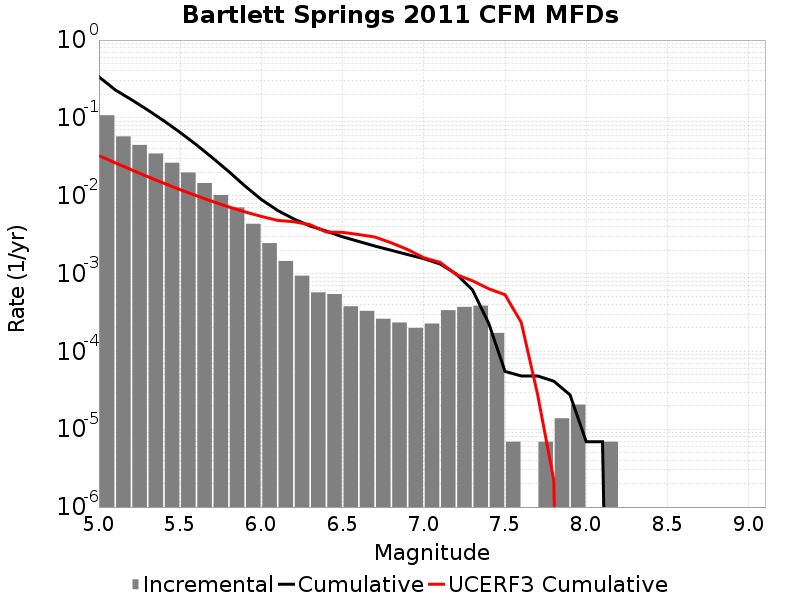

| Magnitude | Incremental Rate | Cumulative Rate | UCERF3 Cumulative Rate |
|-----|-----|-----|-----|
| 5.05 | 0.108130544 | 0.33793387 | 0.032735642 |
| 5.15 | 0.057865385 | 0.22980331 | 0.02648864 |
| 5.25 | 0.044938087 | 0.17193793 | 0.02152647 |
| 5.35 | 0.034891963 | 0.12699984 | 0.017584879 |
| 5.45 | 0.026524803 | 0.09210788 | 0.0144539615 |
| 5.55 | 0.019891875 | 0.06558307 | 0.011966986 |
| 5.65 | 0.01459935 | 0.0456912 | 0.00999151 |
| 5.75 | 0.010329403 | 0.03109185 | 0.008422334 |
| 5.85 | 0.0071580345 | 0.020762445 | 0.0071758926 |
| 5.95 | 0.0044150427 | 0.013604412 | 0.0061856 |
| 6.05 | 0.002508076 | 0.009189369 | 0.0054187803 |
| 6.15 | 0.0014854994 | 0.006681293 | 0.0048201024 |
| 6.25 | 9.880299E-4 | 0.0051957937 | 0.004629731 |
| 6.35 | 6.0801837E-4 | 0.004207764 | 0.0042416565 |
| 6.45 | 5.734719E-4 | 0.0035997452 | 0.0034128372 |
| 6.55 | 3.938301E-4 | 0.0030262733 | 0.0033845115 |
| 6.65 | 3.385557E-4 | 0.0026324433 | 0.0031696993 |
| 6.75 | 2.694627E-4 | 0.0022938875 | 0.0029421065 |
| 6.85 | 2.349162E-4 | 0.002024425 | 0.0024818645 |
| 6.95 | 2.003697E-4 | 0.0017895086 | 0.0020367042 |
| 7.05 | 2.280069E-4 | 0.001589139 | 0.0015962957 |
| 7.15 | 3.385557E-4 | 0.0013611321 | 0.0013937776 |
| 7.25 | 3.731022E-4 | 0.0010225764 | 9.6887216E-4 |
| 7.35 | 3.869208E-4 | 6.494742E-4 | 8.0704835E-4 |
| 7.45 | 1.796418E-4 | 2.625534E-4 | 6.372236E-4 |
| 7.55 | 6.9093E-6 | 8.2911596E-5 | 5.341735E-4 |
| 7.65 | 0.0 | 7.6002296E-5 | 2.3511468E-4 |
| 7.75 | 2.0727899E-5 | 7.6002296E-5 | 2.838445E-5 |
| 7.85 | 2.76372E-5 | 5.52744E-5 | 2.2219701E-6 |
| 7.95 | 2.0727899E-5 | 2.76372E-5 | 0.0 |
| 8.05 | 0.0 | 6.9093E-6 | 0.0 |
| 8.15 | 6.9093E-6 | 6.9093E-6 | 0.0 |

### Battle Creek 2011 CFM
*[(top)](#table-of-contents)*

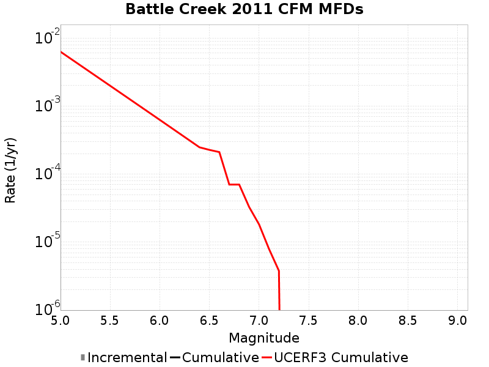

| Magnitude | Incremental Rate | Cumulative Rate | UCERF3 Cumulative Rate |
|-----|-----|-----|-----|
| 5.05 | 0.0 | 0.0 | 0.006308708 |
| 5.15 | 0.0 | 0.0 | 0.005010495 |
| 5.25 | 0.0 | 0.0 | 0.0039792876 |
| 5.35 | 0.0 | 0.0 | 0.0031601703 |
| 5.45 | 0.0 | 0.0 | 0.0025095223 |
| 5.55 | 0.0 | 0.0 | 0.0019926943 |
| 5.65 | 0.0 | 0.0 | 0.0015821633 |
| 5.75 | 0.0 | 0.0 | 0.0012560668 |
| 5.85 | 0.0 | 0.0 | 9.970393E-4 |
| 5.95 | 0.0 | 0.0 | 7.9128635E-4 |
| 6.05 | 0.0 | 0.0 | 6.27851E-4 |
| 6.15 | 0.0 | 0.0 | 4.980297E-4 |
| 6.25 | 0.0 | 0.0 | 3.9490894E-4 |
| 6.35 | 0.0 | 0.0 | 3.1299723E-4 |
| 6.45 | 0.0 | 0.0 | 2.4793245E-4 |
| 6.55 | 0.0 | 0.0 | 2.2725934E-4 |
| 6.65 | 0.0 | 0.0 | 2.1083809E-4 |
| 6.75 | 0.0 | 0.0 | 7.028735E-5 |
| 6.85 | 0.0 | 0.0 | 7.028735E-5 |
| 6.95 | 0.0 | 0.0 | 3.2882002E-5 |
| 7.05 | 0.0 | 0.0 | 1.8233823E-5 |
| 7.15 | 0.0 | 0.0 | 7.950685E-6 |
| 7.25 | 0.0 | 0.0 | 3.7906768E-6 |

### Bear River fault zone
*[(top)](#table-of-contents)*

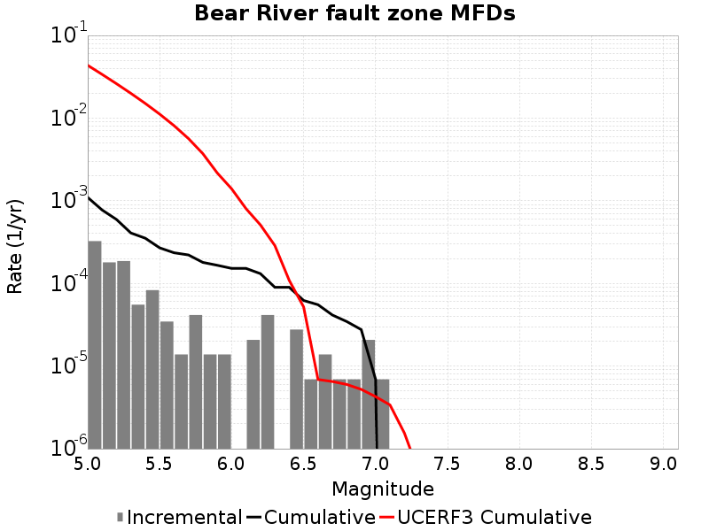

| Magnitude | Incremental Rate | Cumulative Rate | UCERF3 Cumulative Rate |
|-----|-----|-----|-----|
| 5.05 | 3.247371E-4 | 0.0010985787 | 0.043545246 |
| 5.15 | 1.796418E-4 | 7.738416E-4 | 0.033810105 |
| 5.25 | 1.865511E-4 | 5.941998E-4 | 0.026077203 |
| 5.35 | 5.52744E-5 | 4.0764868E-4 | 0.019934744 |
| 5.45 | 8.2911596E-5 | 3.523743E-4 | 0.015055614 |
| 5.55 | 3.4546498E-5 | 2.694627E-4 | 0.011179984 |
| 5.65 | 1.38186E-5 | 2.349162E-4 | 0.0081014605 |
| 5.75 | 4.1455798E-5 | 2.210976E-4 | 0.005656103 |
| 5.85 | 1.38186E-5 | 1.796418E-4 | 0.0037136865 |
| 5.95 | 1.38186E-5 | 1.6582319E-4 | 0.0021707702 |
| 6.05 | 0.0 | 1.5200459E-4 | 0.0013946188 |
| 6.15 | 2.0727899E-5 | 1.5200459E-4 | 8.025127E-4 |
| 6.25 | 4.1455798E-5 | 1.312767E-4 | 5.1025517E-4 |
| 6.35 | 0.0 | 8.98209E-5 | 2.8737116E-4 |
| 6.45 | 2.76372E-5 | 8.98209E-5 | 1.0887554E-4 |
| 6.55 | 6.9093E-6 | 6.21837E-5 | 5.1976313E-5 |
| 6.65 | 1.38186E-5 | 5.52744E-5 | 6.8844056E-6 |
| 6.75 | 6.9093E-6 | 4.1455798E-5 | 6.504088E-6 |
| 6.85 | 6.9093E-6 | 3.4546498E-5 | 5.9920944E-6 |
| 6.95 | 2.0727899E-5 | 2.76372E-5 | 5.231033E-6 |
| 7.05 | 6.9093E-6 | 6.9093E-6 | 4.269655E-6 |
| 7.15 | 0.0 | 0.0 | 3.3873725E-6 |
| 7.25 | 0.0 | 0.0 | 1.548444E-6 |
| 7.35 | 0.0 | 0.0 | 5.1962064E-7 |

### Bennett Valley 2011 CFM
*[(top)](#table-of-contents)*

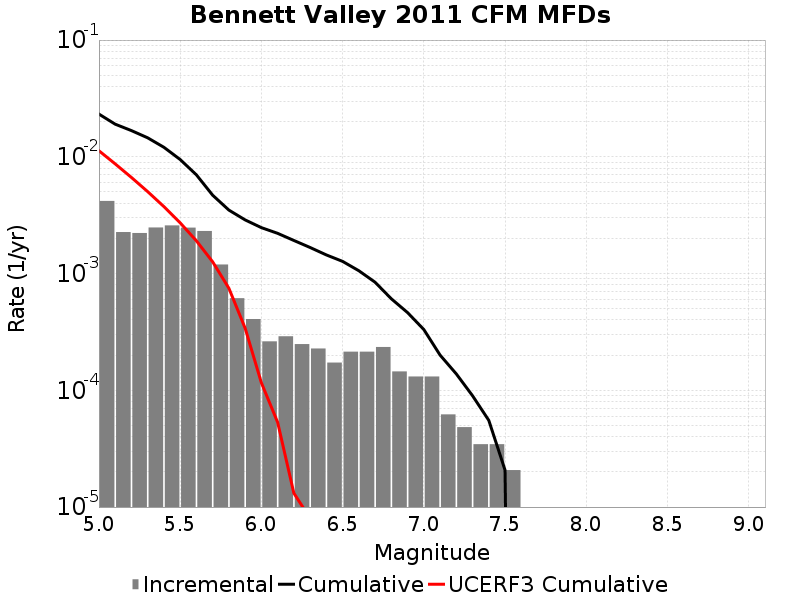

| Magnitude | Incremental Rate | Cumulative Rate | UCERF3 Cumulative Rate |
|-----|-----|-----|-----|
| 5.05 | 0.004187036 | 0.033606835 | 0.011268672 |
| 5.15 | 0.0022662503 | 0.029419798 | 0.008697346 |
| 5.25 | 0.0022247946 | 0.027153548 | 0.006654869 |
| 5.35 | 0.0024804387 | 0.024928754 | 0.0050324723 |
| 5.45 | 0.002584078 | 0.022448316 | 0.0037437566 |
| 5.55 | 0.0024804387 | 0.019864237 | 0.0027200934 |
| 5.65 | 0.0026462618 | 0.017383799 | 0.0019069687 |
| 5.75 | 0.0023215248 | 0.014737537 | 0.0012610808 |
| 5.85 | 0.002259341 | 0.012416012 | 7.48034E-4 |
| 5.95 | 0.0018309645 | 0.010156671 | 3.4050632E-4 |
| 6.05 | 0.0012574926 | 0.008325706 | 1.1599287E-4 |
| 6.15 | 0.0012367647 | 0.007068214 | 5.3220665E-5 |
| 6.25 | 0.0010433043 | 0.0058314493 | 1.3146281E-5 |
| 6.35 | 9.120276E-4 | 0.004788145 | 8.006452E-6 |
| 6.45 | 7.945695E-4 | 0.0038761173 | 7.688661E-6 |
| 6.55 | 7.945695E-4 | 0.0030815478 | 7.5013986E-6 |
| 6.65 | 5.665626E-4 | 0.0022869783 | 7.324066E-6 |
| 6.75 | 5.181975E-4 | 0.0017204157 | 7.1249774E-6 |
| 6.85 | 4.007394E-4 | 0.0012022182 | 6.834979E-6 |
| 6.95 | 2.003697E-4 | 8.014788E-4 | 6.434962E-6 |
| 7.05 | 1.934604E-4 | 6.011091E-4 | 5.90079E-6 |
| 7.15 | 1.5200459E-4 | 4.0764868E-4 | 5.416368E-6 |
| 7.25 | 1.174581E-4 | 2.556441E-4 | 4.9742544E-6 |
| 7.35 | 6.9092996E-5 | 1.3818599E-4 | 4.3912346E-6 |
| 7.45 | 3.4546498E-5 | 6.9092996E-5 | 3.6264732E-6 |
| 7.55 | 2.76372E-5 | 3.4546498E-5 | 2.4316862E-6 |
| 7.65 | 6.9093E-6 | 6.9093E-6 | 9.602564E-7 |
| 7.75 | 0.0 | 0.0 | 4.632417E-7 |
| 7.85 | 0.0 | 0.0 | 1.517678E-7 |
| 7.95 | 0.0 | 0.0 | 9.5095125E-8 |
| 8.05 | 0.0 | 0.0 | 5.7319372E-8 |

### Bicycle Lake
*[(top)](#table-of-contents)*

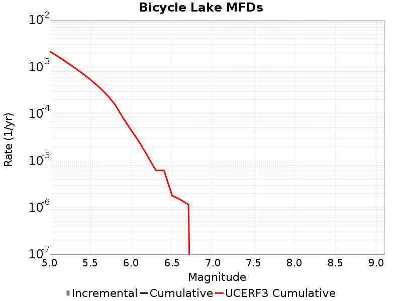

| Magnitude | Incremental Rate | Cumulative Rate | UCERF3 Cumulative Rate |
|-----|-----|-----|-----|
| 5.05 | 0.0 | 0.0 | 0.0021654845 |
| 5.15 | 0.0 | 0.0 | 0.0016749451 |
| 5.25 | 0.0 | 0.0 | 0.0012852958 |
| 5.35 | 0.0 | 0.0 | 9.757864E-4 |
| 5.45 | 0.0 | 0.0 | 7.2993437E-4 |
| 5.55 | 0.0 | 0.0 | 5.3464714E-4 |
| 5.65 | 0.0 | 0.0 | 3.7952495E-4 |
| 5.75 | 0.0 | 0.0 | 2.5630704E-4 |
| 5.85 | 0.0 | 0.0 | 1.5843156E-4 |
| 5.95 | 0.0 | 0.0 | 8.068632E-5 |
| 6.05 | 0.0 | 0.0 | 4.421513E-5 |
| 6.15 | 0.0 | 0.0 | 2.4593559E-5 |
| 6.25 | 0.0 | 0.0 | 1.2489226E-5 |
| 6.35 | 0.0 | 0.0 | 6.193031E-6 |
| 6.45 | 0.0 | 0.0 | 6.193031E-6 |
| 6.55 | 0.0 | 0.0 | 1.7937552E-6 |
| 6.65 | 0.0 | 0.0 | 1.4766711E-6 |
| 6.75 | 0.0 | 0.0 | 1.149631E-6 |

### Big Lagoon - Bald Mtn 2011 CFM
*[(top)](#table-of-contents)*

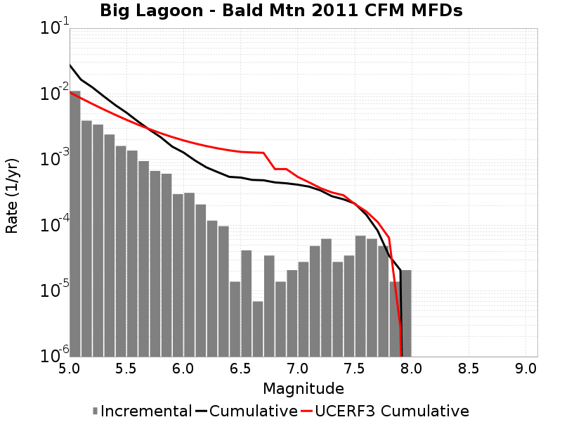

| Magnitude | Incremental Rate | Cumulative Rate | UCERF3 Cumulative Rate |
|-----|-----|-----|-----|
| 5.05 | 0.01105488 | 0.027768476 | 0.010570411 |
| 5.15 | 0.0039037545 | 0.016713597 | 0.008601436 |
| 5.25 | 0.0034062848 | 0.012809842 | 0.0070374245 |
| 5.35 | 0.0024044365 | 0.0094035575 | 0.005795086 |
| 5.45 | 0.0016098669 | 0.0069991206 | 0.004808261 |
| 5.55 | 0.0013680414 | 0.005389254 | 0.0040243985 |
| 5.65 | 9.465741E-4 | 0.0040212125 | 0.0034017542 |
| 5.75 | 6.702021E-4 | 0.0030746385 | 0.0029071702 |
| 5.85 | 6.0801837E-4 | 0.0024044365 | 0.0025143083 |
| 5.95 | 2.970999E-4 | 0.001796418 | 0.0022022468 |
| 6.05 | 3.109185E-4 | 0.001499318 | 0.0019543676 |
| 6.15 | 2.280069E-4 | 0.0011883996 | 0.0017574703 |
| 6.25 | 1.312767E-4 | 9.603927E-4 | 0.0016023911 |
| 6.35 | 1.105488E-4 | 8.29116E-4 | 0.0014792074 |
| 6.45 | 2.76372E-5 | 7.185672E-4 | 0.0013819151 |
| 6.55 | 4.83651E-5 | 6.9093E-4 | 0.0013085123 |
| 6.65 | 1.38186E-5 | 6.425649E-4 | 0.0012839574 |
| 6.75 | 3.4546498E-5 | 6.287463E-4 | 0.0012660845 |
| 6.85 | 2.76372E-5 | 5.941998E-4 | 7.173059E-4 |
| 6.95 | 5.52744E-5 | 5.665626E-4 | 7.173059E-4 |
| 7.05 | 6.21837E-5 | 5.112882E-4 | 5.451266E-4 |
| 7.15 | 5.52744E-5 | 4.491045E-4 | 4.4942024E-4 |
| 7.25 | 6.9092996E-5 | 3.938301E-4 | 3.6670716E-4 |
| 7.35 | 2.76372E-5 | 3.247371E-4 | 3.1557685E-4 |
| 7.45 | 4.83651E-5 | 2.970999E-4 | 2.8662017E-4 |
| 7.55 | 7.6002296E-5 | 2.487348E-4 | 2.1047848E-4 |
| 7.65 | 8.2911596E-5 | 1.727325E-4 | 1.6241227E-4 |
| 7.75 | 5.52744E-5 | 8.98209E-5 | 1.1233738E-4 |
| 7.85 | 1.38186E-5 | 3.4546498E-5 | 6.430689E-5 |
| 7.95 | 2.0727899E-5 | 2.0727899E-5 | 2.775461E-6 |

### Big Pine (Central)
*[(top)](#table-of-contents)*

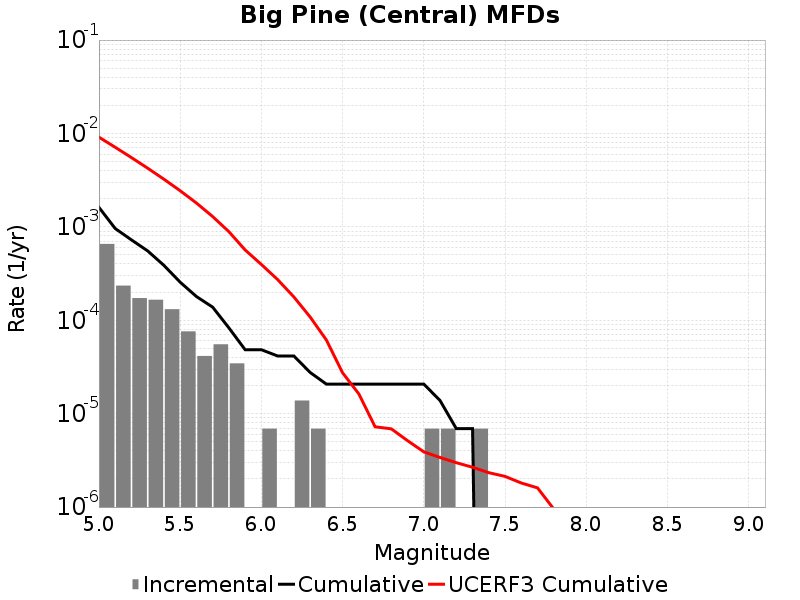

| Magnitude | Incremental Rate | Cumulative Rate | UCERF3 Cumulative Rate |
|-----|-----|-----|-----|
| 5.05 | 6.5638346E-4 | 0.0016305947 | 0.009128822 |
| 5.15 | 2.349162E-4 | 9.7421126E-4 | 0.007115982 |
| 5.25 | 1.727325E-4 | 7.392951E-4 | 0.0055171265 |
| 5.35 | 1.6582319E-4 | 5.665626E-4 | 0.004247111 |
| 5.45 | 1.312767E-4 | 4.007394E-4 | 0.003238301 |
| 5.55 | 7.6002296E-5 | 2.694627E-4 | 0.002436975 |
| 5.65 | 4.1455798E-5 | 1.934604E-4 | 0.0018004592 |
| 5.75 | 5.52744E-5 | 1.5200459E-4 | 0.0012898971 |
| 5.85 | 3.4546498E-5 | 9.67302E-5 | 8.882828E-4 |
| 5.95 | 0.0 | 6.21837E-5 | 5.656175E-4 |
| 6.05 | 6.9093E-6 | 6.21837E-5 | 3.955856E-4 |
| 6.15 | 0.0 | 5.52744E-5 | 2.7269023E-4 |
| 6.25 | 1.38186E-5 | 5.52744E-5 | 1.77656E-4 |
| 6.35 | 6.9093E-6 | 4.1455798E-5 | 1.085558E-4 |
| 6.45 | 0.0 | 3.4546498E-5 | 6.149144E-5 |
| 6.55 | 6.9093E-6 | 3.4546498E-5 | 2.7361852E-5 |
| 6.65 | 0.0 | 2.76372E-5 | 1.6271955E-5 |
| 6.75 | 0.0 | 2.76372E-5 | 7.2353464E-6 |
| 6.85 | 0.0 | 2.76372E-5 | 6.874779E-6 |
| 6.95 | 0.0 | 2.76372E-5 | 5.136218E-6 |
| 7.05 | 6.9093E-6 | 2.76372E-5 | 3.9004467E-6 |
| 7.15 | 1.38186E-5 | 2.0727899E-5 | 3.3938998E-6 |
| 7.25 | 0.0 | 6.9093E-6 | 2.9851265E-6 |
| 7.35 | 6.9093E-6 | 6.9093E-6 | 2.667847E-6 |
| 7.45 | 0.0 | 0.0 | 2.333907E-6 |
| 7.55 | 0.0 | 0.0 | 2.1301018E-6 |
| 7.65 | 0.0 | 0.0 | 1.8097414E-6 |
| 7.75 | 0.0 | 0.0 | 1.6043216E-6 |
| 7.85 | 0.0 | 0.0 | 9.5279466E-7 |
| 7.95 | 0.0 | 0.0 | 2.8223226E-7 |

### Big Pine (East)
*[(top)](#table-of-contents)*

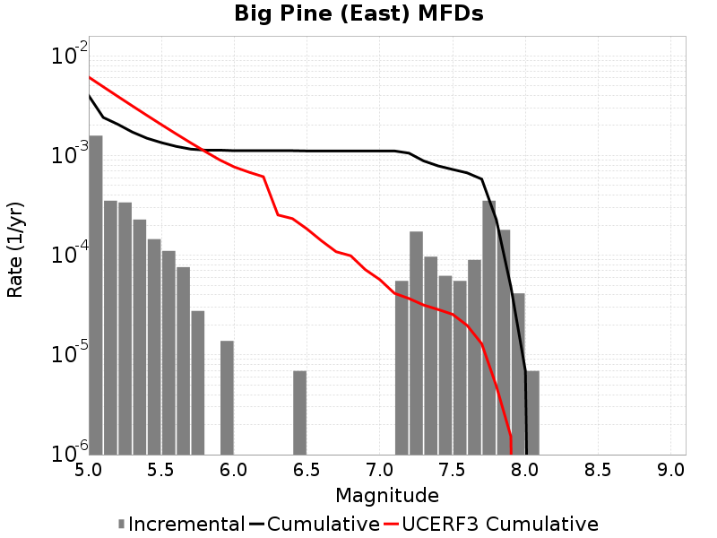

| Magnitude | Incremental Rate | Cumulative Rate | UCERF3 Cumulative Rate |
|-----|-----|-----|-----|
| 5.05 | 0.0015822296 | 0.007980241 | 0.006123838 |
| 5.15 | 3.523743E-4 | 0.006398012 | 0.004895705 |
| 5.25 | 3.385557E-4 | 0.006045637 | 0.003920164 |
| 5.35 | 2.280069E-4 | 0.005707082 | 0.0031452642 |
| 5.45 | 1.450953E-4 | 0.005479075 | 0.0025297394 |
| 5.55 | 1.105488E-4 | 0.0053339796 | 0.0020408109 |
| 5.65 | 7.6002296E-5 | 0.0052234307 | 0.001652441 |
| 5.75 | 2.76372E-5 | 0.0051474283 | 0.0013439478 |
| 5.85 | 0.0 | 0.0051197913 | 0.001098903 |
| 5.95 | 1.38186E-5 | 0.0051197913 | 9.04257E-4 |
| 6.05 | 0.0 | 0.0051059728 | 7.683208E-4 |
| 6.15 | 0.0 | 0.0051059728 | 6.8189343E-4 |
| 6.25 | 1.38186E-5 | 0.0051059728 | 6.132883E-4 |
| 6.35 | 0.0 | 0.0050921543 | 2.5359727E-4 |
| 6.45 | 3.4546498E-5 | 0.0050921543 | 2.3297206E-4 |
| 6.55 | 2.76372E-5 | 0.0050576073 | 1.833066E-4 |
| 6.65 | 1.38186E-5 | 0.0050299703 | 1.393747E-4 |
| 6.75 | 2.76372E-5 | 0.005016152 | 1.0844714E-4 |
| 6.85 | 2.0727899E-5 | 0.0049885144 | 9.886049E-5 |
| 6.95 | 6.21837E-5 | 0.004967787 | 7.1749586E-5 |
| 7.05 | 1.174581E-4 | 0.004905603 | 5.695796E-5 |
| 7.15 | 4.83651E-4 | 0.004788145 | 4.1566684E-5 |
| 7.25 | 9.811206E-4 | 0.004304494 | 3.68252E-5 |
| 7.35 | 3.661929E-4 | 0.0033233732 | 3.1703847E-5 |
| 7.45 | 2.210976E-4 | 0.0029571804 | 2.8567665E-5 |
| 7.55 | 1.865511E-4 | 0.0027360828 | 2.5552556E-5 |
| 7.65 | 5.0437887E-4 | 0.0025495316 | 1.9751094E-5 |
| 7.75 | 0.0013542228 | 0.0020451527 | 1.2949697E-5 |
| 7.85 | 4.6292308E-4 | 6.9093E-4 | 4.8864667E-6 |
| 7.95 | 2.003697E-4 | 2.280069E-4 | 1.5221307E-6 |
| 8.05 | 2.0727899E-5 | 2.76372E-5 | 0.0 |
| 8.15 | 6.9093E-6 | 6.9093E-6 | 0.0 |

### Big Pine (West)
*[(top)](#table-of-contents)*

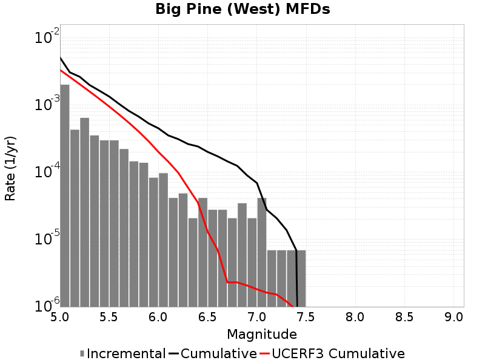

| Magnitude | Incremental Rate | Cumulative Rate | UCERF3 Cumulative Rate |
|-----|-----|-----|-----|
| 5.05 | 0.0019967877 | 0.0052234307 | 0.0033154662 |
| 5.15 | 4.283766E-4 | 0.003226643 | 0.0026033022 |
| 5.25 | 6.425649E-4 | 0.0027982665 | 0.0020376102 |
| 5.35 | 3.523743E-4 | 0.0021557016 | 0.0015882651 |
| 5.45 | 2.970999E-4 | 0.0018033272 | 0.0012313375 |
| 5.55 | 2.970999E-4 | 0.0015062274 | 9.4781996E-4 |
| 5.65 | 2.210976E-4 | 0.0012091275 | 7.2261394E-4 |
| 5.75 | 1.450953E-4 | 9.880299E-4 | 5.4372643E-4 |
| 5.85 | 1.3818599E-4 | 8.429346E-4 | 4.0163103E-4 |
| 5.95 | 8.2911596E-5 | 7.047486E-4 | 2.8876064E-4 |
| 6.05 | 9.67302E-5 | 6.21837E-4 | 1.99953E-4 |
| 6.15 | 4.83651E-5 | 5.251068E-4 | 1.4353948E-4 |
| 6.25 | 4.83651E-5 | 4.767417E-4 | 9.8728626E-5 |
| 6.35 | 2.0727899E-5 | 4.283766E-4 | 5.9041922E-5 |
| 6.45 | 6.21837E-5 | 4.0764868E-4 | 3.54892E-5 |
| 6.55 | 3.4546498E-5 | 3.45465E-4 | 1.2977228E-5 |
| 6.65 | 2.76372E-5 | 3.109185E-4 | 7.025999E-6 |
| 6.75 | 3.4546498E-5 | 2.832813E-4 | 2.304297E-6 |
| 6.85 | 4.83651E-5 | 2.487348E-4 | 2.30137E-6 |
| 6.95 | 4.1455798E-5 | 2.003697E-4 | 2.072501E-6 |
| 7.05 | 6.21837E-5 | 1.589139E-4 | 1.8192546E-6 |
| 7.15 | 4.1455798E-5 | 9.67302E-5 | 1.6198156E-6 |
| 7.25 | 1.38186E-5 | 5.52744E-5 | 1.5218071E-6 |
| 7.35 | 2.76372E-5 | 4.1455798E-5 | 1.1999404E-6 |
| 7.45 | 6.9093E-6 | 1.38186E-5 | 8.953801E-7 |
| 7.55 | 6.9093E-6 | 6.9093E-6 | 5.6087464E-7 |
| 7.65 | 0.0 | 0.0 | 3.081577E-7 |
| 7.75 | 0.0 | 0.0 | 1.120106E-7 |
| 7.85 | 0.0 | 0.0 | 1.5915775E-8 |

### Blackwater
*[(top)](#table-of-contents)*

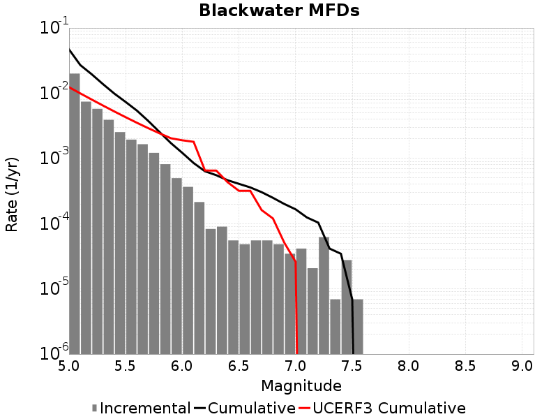

| Magnitude | Incremental Rate | Cumulative Rate | UCERF3 Cumulative Rate |
|-----|-----|-----|-----|
| 5.05 | 0.019954057 | 0.046914145 | 0.012354801 |
| 5.15 | 0.0074205883 | 0.026960088 | 0.0099270595 |
| 5.25 | 0.0057623563 | 0.0195395 | 0.007998635 |
| 5.35 | 0.0039037545 | 0.013777144 | 0.006466833 |
| 5.45 | 0.0025288037 | 0.009873389 | 0.0052500796 |
| 5.55 | 0.0019415133 | 0.007344586 | 0.004283578 |
| 5.65 | 0.0016513227 | 0.0054030726 | 0.0035158584 |
| 5.75 | 0.0012160367 | 0.0037517499 | 0.0029060373 |
| 5.85 | 8.2220667E-4 | 0.0025357131 | 0.002421639 |
| 5.95 | 4.974696E-4 | 0.0017135064 | 0.0020368677 |
| 6.05 | 3.661929E-4 | 0.0012160367 | 0.0018967673 |
| 6.15 | 2.141883E-4 | 8.498439E-4 | 0.0017978423 |
| 6.25 | 8.2911596E-5 | 6.356556E-4 | 6.5333094E-4 |
| 6.35 | 8.98209E-5 | 5.5274396E-4 | 6.5036415E-4 |
| 6.45 | 5.52744E-5 | 4.6292308E-4 | 4.3168085E-4 |
| 6.55 | 4.83651E-5 | 4.0764868E-4 | 3.1831602E-4 |
| 6.65 | 5.52744E-5 | 3.592836E-4 | 3.1831602E-4 |
| 6.75 | 5.52744E-5 | 3.0400918E-4 | 1.6143097E-4 |
| 6.85 | 4.83651E-5 | 2.487348E-4 | 1.2008889E-4 |
| 6.95 | 3.4546498E-5 | 2.003697E-4 | 5.112681E-5 |
| 7.05 | 4.1455798E-5 | 1.6582319E-4 | 2.6022486E-5 |
| 7.15 | 2.0727899E-5 | 1.243674E-4 | 0.0 |
| 7.25 | 6.21837E-5 | 1.036395E-4 | 0.0 |
| 7.35 | 6.9093E-6 | 4.1455798E-5 | 0.0 |
| 7.45 | 2.76372E-5 | 3.4546498E-5 | 0.0 |
| 7.55 | 6.9093E-6 | 6.9093E-6 | 0.0 |

### Blue Cut
*[(top)](#table-of-contents)*

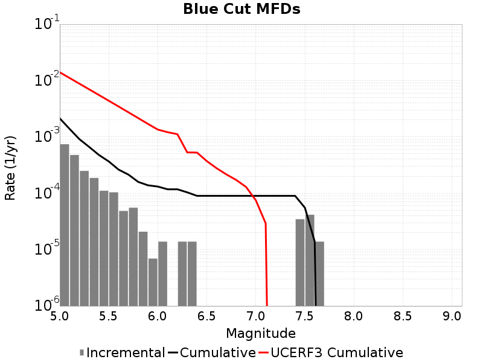

| Magnitude | Incremental Rate | Cumulative Rate | UCERF3 Cumulative Rate |
|-----|-----|-----|-----|
| 5.05 | 7.392951E-4 | 0.0021833389 | 0.013988371 |
| 5.15 | 4.767417E-4 | 0.0014440437 | 0.011096277 |
| 5.25 | 2.487348E-4 | 9.67302E-4 | 0.008799006 |
| 5.35 | 1.865511E-4 | 7.185672E-4 | 0.006974219 |
| 5.45 | 1.105488E-4 | 5.320161E-4 | 0.0055247387 |
| 5.55 | 1.036395E-4 | 4.214673E-4 | 0.004373376 |
| 5.65 | 4.83651E-5 | 3.178278E-4 | 0.0034588156 |
| 5.75 | 5.52744E-5 | 2.694627E-4 | 0.0027323547 |
| 5.85 | 2.0727899E-5 | 2.141883E-4 | 0.0021553063 |
| 5.95 | 6.9093E-6 | 1.934604E-4 | 0.0016969405 |
| 6.05 | 1.38186E-5 | 1.865511E-4 | 0.0013470993 |
| 6.15 | 0.0 | 1.727325E-4 | 0.0012104755 |
| 6.25 | 1.38186E-5 | 1.727325E-4 | 0.0011149137 |
| 6.35 | 1.38186E-5 | 1.589139E-4 | 5.304164E-4 |
| 6.45 | 6.9093E-6 | 1.450953E-4 | 5.2635063E-4 |
| 6.55 | 0.0 | 1.3818599E-4 | 3.7107072E-4 |
| 6.65 | 1.38186E-5 | 1.3818599E-4 | 2.7739926E-4 |
| 6.75 | 0.0 | 1.243674E-4 | 2.152555E-4 |
| 6.85 | 6.9093E-6 | 1.243674E-4 | 1.7163905E-4 |
| 6.95 | 0.0 | 1.174581E-4 | 1.2919957E-4 |
| 7.05 | 0.0 | 1.174581E-4 | 7.4732074E-5 |
| 7.15 | 0.0 | 1.174581E-4 | 2.9155237E-5 |
| 7.25 | 0.0 | 1.174581E-4 | 0.0 |
| 7.35 | 2.0727899E-5 | 1.174581E-4 | 0.0 |
| 7.45 | 4.1455798E-5 | 9.67302E-5 | 0.0 |
| 7.55 | 4.1455798E-5 | 5.52744E-5 | 0.0 |
| 7.65 | 1.38186E-5 | 1.38186E-5 | 0.0 |

### Brawley (Seismic Zone) alt 1
*[(top)](#table-of-contents)*

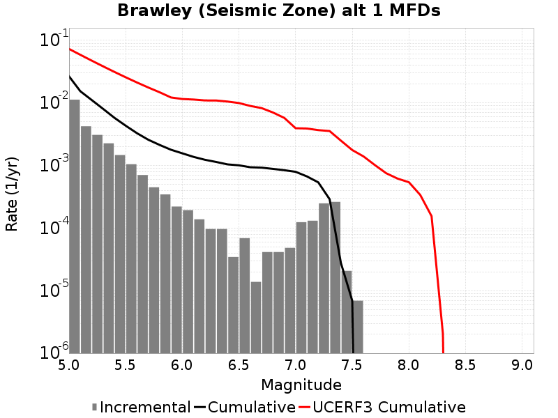

| Magnitude | Incremental Rate | Cumulative Rate | UCERF3 Cumulative Rate |
|-----|-----|-----|-----|
| 5.05 | 0.011289796 | 0.032908995 | 0.07317217 |
| 5.15 | 0.0042423103 | 0.021619199 | 0.058913264 |
| 5.25 | 0.003088457 | 0.017376889 | 0.04758701 |
| 5.35 | 0.0022662503 | 0.014288432 | 0.03859021 |
| 5.45 | 0.0014716808 | 0.012022181 | 0.03144383 |
| 5.55 | 0.0010571228 | 0.010550501 | 0.025767177 |
| 5.65 | 7.185672E-4 | 0.009493378 | 0.021257991 |
| 5.75 | 5.0437887E-4 | 0.0087748105 | 0.017676115 |
| 5.85 | 3.731022E-4 | 0.008270432 | 0.014830882 |
| 5.95 | 2.694627E-4 | 0.0078973295 | 0.012255865 |
| 6.05 | 2.349162E-4 | 0.007627867 | 0.011578597 |
| 6.15 | 1.589139E-4 | 0.007392951 | 0.011355994 |
| 6.25 | 1.243674E-4 | 0.007234037 | 0.010985261 |
| 6.35 | 1.312767E-4 | 0.0071096695 | 0.0109560285 |
| 6.45 | 6.9092996E-5 | 0.006978393 | 0.010540773 |
| 6.55 | 1.243674E-4 | 0.0069093 | 0.009981443 |
| 6.65 | 6.9092996E-5 | 0.0067849327 | 0.008973433 |
| 6.75 | 1.036395E-4 | 0.0067158397 | 0.008285377 |
| 6.85 | 2.556441E-4 | 0.0066122 | 0.007046924 |
| 6.95 | 7.323858E-4 | 0.006356556 | 0.0057772244 |
| 7.05 | 0.0010847601 | 0.00562417 | 0.0039515095 |
| 7.15 | 6.21837E-4 | 0.00453941 | 0.00390899 |
| 7.25 | 0.0019415133 | 0.003917573 | 0.003684435 |
| 7.35 | 0.0018240552 | 0.0019760597 | 0.0035621256 |
| 7.45 | 1.312767E-4 | 1.5200459E-4 | 0.0024999336 |
| 7.55 | 2.0727899E-5 | 2.0727899E-5 | 0.0017705666 |
| 7.65 | 0.0 | 0.0 | 0.0013969286 |
| 7.75 | 0.0 | 0.0 | 0.0010166671 |
| 7.85 | 0.0 | 0.0 | 7.5296406E-4 |
| 7.95 | 0.0 | 0.0 | 6.188059E-4 |
| 8.05 | 0.0 | 0.0 | 5.4113375E-4 |
| 8.15 | 0.0 | 0.0 | 3.3910465E-4 |
| 8.25 | 0.0 | 0.0 | 1.5535296E-4 |
| 8.35 | 0.0 | 0.0 | 2.0350137E-6 |

### Breckenridge 2011
*[(top)](#table-of-contents)*

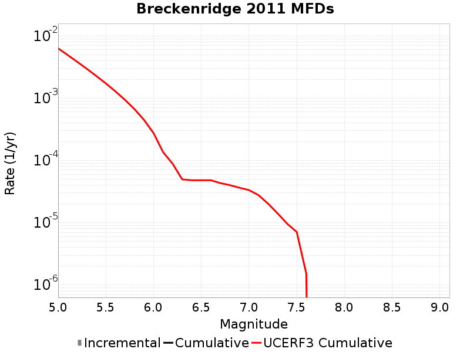

| Magnitude | Incremental Rate | Cumulative Rate | UCERF3 Cumulative Rate |
|-----|-----|-----|-----|
| 5.05 | 0.0 | 0.0 | 0.0063166106 |
| 5.15 | 0.0 | 0.0 | 0.0049357372 |
| 5.25 | 0.0 | 0.0 | 0.0038388704 |
| 5.35 | 0.0 | 0.0 | 0.0029675981 |
| 5.45 | 0.0 | 0.0 | 0.002275522 |
| 5.55 | 0.0 | 0.0 | 0.0017257866 |
| 5.65 | 0.0 | 0.0 | 0.0012891161 |
| 5.75 | 0.0 | 0.0 | 9.422564E-4 |
| 5.85 | 0.0 | 0.0 | 6.667359E-4 |
| 5.95 | 0.0 | 0.0 | 4.4788228E-4 |
| 6.05 | 0.0 | 0.0 | 2.7404062E-4 |
| 6.15 | 0.0 | 0.0 | 1.3595329E-4 |
| 6.25 | 0.0 | 0.0 | 8.843691E-5 |
| 6.35 | 0.0 | 0.0 | 4.967653E-5 |
| 6.45 | 0.0 | 0.0 | 4.814468E-5 |
| 6.55 | 0.0 | 0.0 | 4.814468E-5 |
| 6.65 | 0.0 | 0.0 | 4.814468E-5 |
| 6.75 | 0.0 | 0.0 | 4.3319687E-5 |
| 6.85 | 0.0 | 0.0 | 4.013905E-5 |
| 6.95 | 0.0 | 0.0 | 3.646874E-5 |
| 7.05 | 0.0 | 0.0 | 3.345517E-5 |
| 7.15 | 0.0 | 0.0 | 2.772115E-5 |
| 7.25 | 0.0 | 0.0 | 2.0231484E-5 |
| 7.35 | 0.0 | 0.0 | 1.4134498E-5 |
| 7.45 | 0.0 | 0.0 | 9.646511E-6 |
| 7.55 | 0.0 | 0.0 | 7.1060044E-6 |
| 7.65 | 0.0 | 0.0 | 1.531443E-6 |

### Bullion Mountains
*[(top)](#table-of-contents)*

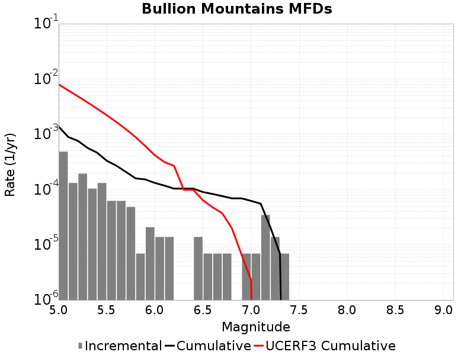

| Magnitude | Incremental Rate | Cumulative Rate | UCERF3 Cumulative Rate |
|-----|-----|-----|-----|
| 5.05 | 4.83651E-4 | 0.00138186 | 0.007958693 |
| 5.15 | 1.312767E-4 | 8.98209E-4 | 0.006229875 |
| 5.25 | 1.934604E-4 | 7.6693227E-4 | 0.004856626 |
| 5.35 | 1.036395E-4 | 5.734719E-4 | 0.0037658154 |
| 5.45 | 1.312767E-4 | 4.698324E-4 | 0.0028993539 |
| 5.55 | 6.21837E-5 | 3.385557E-4 | 0.002211099 |
| 5.65 | 6.21837E-5 | 2.7637198E-4 | 0.0016643986 |
| 5.75 | 4.83651E-5 | 2.141883E-4 | 0.0012301392 |
| 5.85 | 6.9093E-6 | 1.6582319E-4 | 8.851945E-4 |
| 5.95 | 2.0727899E-5 | 1.589139E-4 | 6.1119534E-4 |
| 6.05 | 1.38186E-5 | 1.3818599E-4 | 4.1592322E-4 |
| 6.15 | 1.38186E-5 | 1.243674E-4 | 3.1363283E-4 |
| 6.25 | 0.0 | 1.105488E-4 | 2.6747774E-4 |
| 6.35 | 6.9093E-6 | 1.105488E-4 | 9.8587494E-5 |
| 6.45 | 1.38186E-5 | 1.036395E-4 | 9.831989E-5 |
| 6.55 | 6.9093E-6 | 8.98209E-5 | 6.3574895E-5 |
| 6.65 | 6.9093E-6 | 8.2911596E-5 | 4.763785E-5 |
| 6.75 | 6.9093E-6 | 7.6002296E-5 | 3.7151305E-5 |
| 6.85 | 0.0 | 6.9092996E-5 | 1.9909825E-5 |
| 6.95 | 6.9093E-6 | 6.9092996E-5 | 6.669511E-6 |
| 7.05 | 6.9093E-6 | 6.21837E-5 | 2.291354E-6 |
| 7.15 | 3.4546498E-5 | 5.52744E-5 | 0.0 |
| 7.25 | 1.38186E-5 | 2.0727899E-5 | 0.0 |
| 7.35 | 6.9093E-6 | 6.9093E-6 | 0.0 |

### Burnt Mtn
*[(top)](#table-of-contents)*

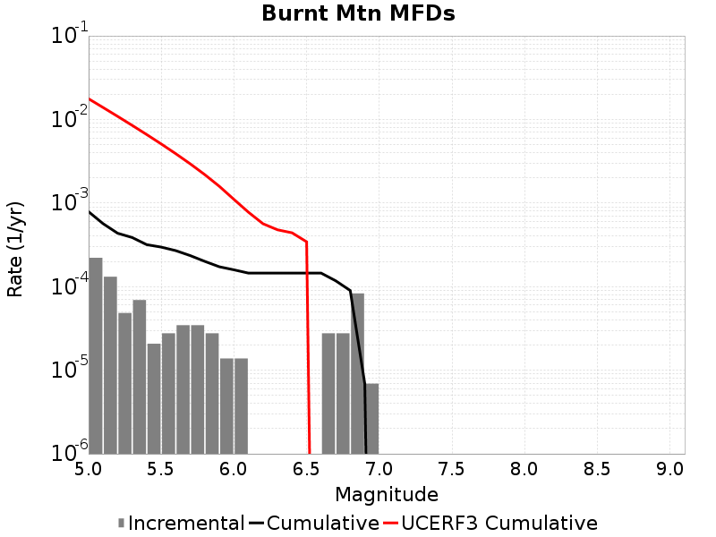

| Magnitude | Incremental Rate | Cumulative Rate | UCERF3 Cumulative Rate |
|-----|-----|-----|-----|
| 5.05 | 2.210976E-4 | 8.7748107E-4 | 0.017682588 |
| 5.15 | 1.312767E-4 | 6.5638346E-4 | 0.013894371 |
| 5.25 | 4.83651E-5 | 5.251068E-4 | 0.010885282 |
| 5.35 | 6.9092996E-5 | 4.767417E-4 | 0.008495079 |
| 5.45 | 2.0727899E-5 | 4.0764868E-4 | 0.0065964726 |
| 5.55 | 2.76372E-5 | 3.869208E-4 | 0.0050883563 |
| 5.65 | 3.4546498E-5 | 3.592836E-4 | 0.0038904166 |
| 5.75 | 3.4546498E-5 | 3.247371E-4 | 0.0029388594 |
| 5.85 | 2.76372E-5 | 2.901906E-4 | 0.0021830106 |
| 5.95 | 1.38186E-5 | 2.625534E-4 | 0.0015826186 |
| 6.05 | 1.38186E-5 | 2.487348E-4 | 0.0011057102 |
| 6.15 | 0.0 | 2.349162E-4 | 7.7639415E-4 |
| 6.25 | 0.0 | 2.349162E-4 | 5.653308E-4 |
| 6.35 | 0.0 | 2.349162E-4 | 4.7830498E-4 |
| 6.45 | 0.0 | 2.349162E-4 | 4.4015315E-4 |
| 6.55 | 6.9093E-6 | 2.349162E-4 | 3.4380154E-4 |
| 6.65 | 2.76372E-5 | 2.280069E-4 | 0.0 |
| 6.75 | 4.83651E-5 | 2.003697E-4 | 0.0 |
| 6.85 | 8.2911596E-5 | 1.5200459E-4 | 0.0 |
| 6.95 | 1.38186E-5 | 6.9092996E-5 | 0.0 |
| 7.05 | 1.38186E-5 | 5.52744E-5 | 0.0 |
| 7.15 | 2.76372E-5 | 4.1455798E-5 | 0.0 |
| 7.25 | 6.9093E-6 | 1.38186E-5 | 0.0 |
| 7.35 | 0.0 | 6.9093E-6 | 0.0 |
| 7.45 | 0.0 | 6.9093E-6 | 0.0 |
| 7.55 | 6.9093E-6 | 6.9093E-6 | 0.0 |

### Butano 2011 CFM
*[(top)](#table-of-contents)*

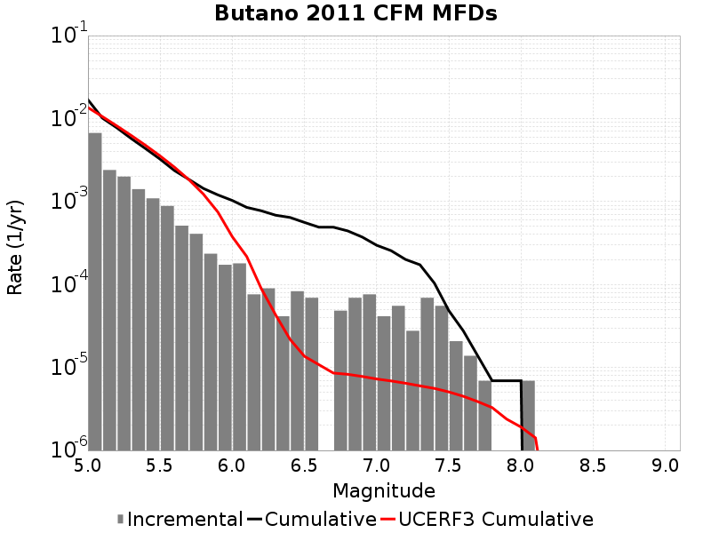

| Magnitude | Incremental Rate | Cumulative Rate | UCERF3 Cumulative Rate |
|-----|-----|-----|-----|
| 5.05 | 0.0067020208 | 0.018820932 | 0.013580588 |
| 5.15 | 0.002397527 | 0.012118912 | 0.010560998 |
| 5.25 | 0.0019967877 | 0.009721385 | 0.008162452 |
| 5.35 | 0.0014094972 | 0.007724597 | 0.0062572192 |
| 5.45 | 0.0010916694 | 0.0063151 | 0.004743839 |
| 5.55 | 8.843904E-4 | 0.0052234307 | 0.0035417185 |
| 5.65 | 5.251068E-4 | 0.0043390403 | 0.0025868402 |
| 5.75 | 4.491045E-4 | 0.0038139336 | 0.0018283535 |
| 5.85 | 2.970999E-4 | 0.003364829 | 0.001225866 |
| 5.95 | 2.141883E-4 | 0.003067729 | 7.472933E-4 |
| 6.05 | 2.349162E-4 | 0.002853541 | 3.76502E-4 |
| 6.15 | 1.243674E-4 | 0.0026186246 | 2.1729208E-4 |
| 6.25 | 1.727325E-4 | 0.0024942572 | 8.973549E-5 |
| 6.35 | 8.98209E-5 | 0.0023215248 | 4.3096425E-5 |
| 6.45 | 1.589139E-4 | 0.0022317038 | 2.1828379E-5 |
| 6.55 | 1.174581E-4 | 0.00207279 | 1.3621922E-5 |
| 6.65 | 4.83651E-5 | 0.0019553318 | 1.0801477E-5 |
| 6.75 | 1.450953E-4 | 0.0019069668 | 8.567364E-6 |
| 6.85 | 1.865511E-4 | 0.0017618715 | 8.2678725E-6 |
| 6.95 | 2.556441E-4 | 0.0015753204 | 7.791626E-6 |
| 7.05 | 1.727325E-4 | 0.0013196763 | 7.2651155E-6 |
| 7.15 | 1.6582319E-4 | 0.0011469438 | 6.880439E-6 |
| 7.25 | 3.385557E-4 | 9.811206E-4 | 6.457561E-6 |
| 7.35 | 3.109185E-4 | 6.425649E-4 | 5.9995327E-6 |
| 7.45 | 2.210976E-4 | 3.3164638E-4 | 5.5926544E-6 |
| 7.55 | 4.83651E-5 | 1.105488E-4 | 5.0700887E-6 |
| 7.65 | 2.0727899E-5 | 6.21837E-5 | 4.4959E-6 |
| 7.75 | 6.9093E-6 | 4.1455798E-5 | 3.8777403E-6 |
| 7.85 | 0.0 | 3.4546498E-5 | 3.2837736E-6 |
| 7.95 | 1.38186E-5 | 3.4546498E-5 | 2.388037E-6 |
| 8.05 | 2.0727899E-5 | 2.0727899E-5 | 1.9122876E-6 |
| 8.15 | 0.0 | 0.0 | 1.4177608E-6 |
| 8.25 | 0.0 | 0.0 | 1.267703E-7 |
| 8.35 | 0.0 | 0.0 | 2.902599E-11 |

### Cady
*[(top)](#table-of-contents)*

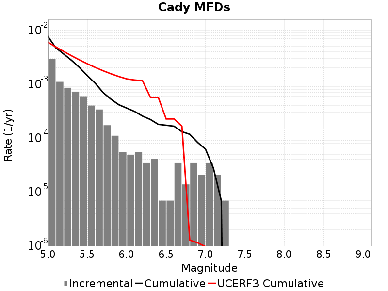

| Magnitude | Incremental Rate | Cumulative Rate | UCERF3 Cumulative Rate |
|-----|-----|-----|-----|
| 5.05 | 0.002901906 | 0.0076624136 | 0.0059735756 |
| 5.15 | 0.0011054879 | 0.0047605075 | 0.0048934645 |
| 5.25 | 8.567532E-4 | 0.0036550197 | 0.004035502 |
| 5.35 | 7.254765E-4 | 0.0027982665 | 0.0033539985 |
| 5.45 | 5.941998E-4 | 0.00207279 | 0.0028126608 |
| 5.55 | 4.007394E-4 | 0.0014785902 | 0.002382661 |
| 5.65 | 3.385557E-4 | 0.0010778508 | 0.0020410998 |
| 5.75 | 1.727325E-4 | 7.392951E-4 | 0.0017697883 |
| 5.85 | 1.105488E-4 | 5.665626E-4 | 0.001554278 |
| 5.95 | 5.52744E-5 | 4.560138E-4 | 0.0013830919 |
| 6.05 | 4.83651E-5 | 4.007394E-4 | 0.0012496586 |
| 6.15 | 5.52744E-5 | 3.523743E-4 | 0.001191972 |
| 6.25 | 4.83651E-5 | 2.970999E-4 | 0.0011582181 |
| 6.35 | 5.52744E-5 | 2.487348E-4 | 5.68285E-4 |
| 6.45 | 6.9093E-6 | 1.934604E-4 | 5.680722E-4 |
| 6.55 | 6.9093E-6 | 1.865511E-4 | 2.2611907E-4 |
| 6.65 | 3.4546498E-5 | 1.796418E-4 | 2.2607528E-4 |
| 6.75 | 1.38186E-5 | 1.450953E-4 | 1.6598296E-4 |
| 6.85 | 3.4546498E-5 | 1.312767E-4 | 1.2812386E-6 |
| 6.95 | 2.76372E-5 | 9.67302E-5 | 1.1414857E-6 |
| 7.05 | 3.4546498E-5 | 6.9092996E-5 | 9.688353E-7 |
| 7.15 | 2.0727899E-5 | 3.4546498E-5 | 0.0 |
| 7.25 | 6.9093E-6 | 1.38186E-5 | 0.0 |
| 7.35 | 6.9093E-6 | 6.9093E-6 | 0.0 |

### Calico-Hidalgo
*[(top)](#table-of-contents)*

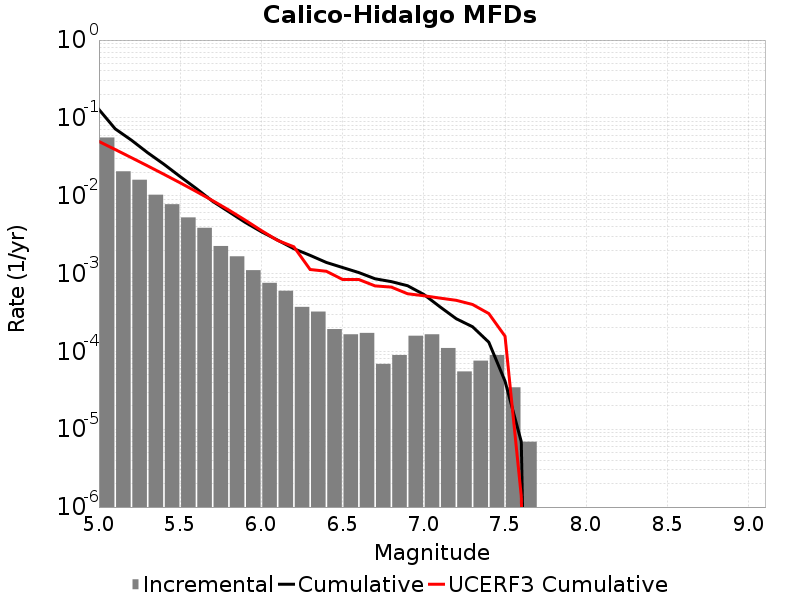

| Magnitude | Incremental Rate | Cumulative Rate | UCERF3 Cumulative Rate |
|-----|-----|-----|-----|
| 5.05 | 0.055992965 | 0.12838861 | 0.049792513 |
| 5.15 | 0.020589713 | 0.072395645 | 0.039220892 |
| 5.25 | 0.016036484 | 0.051805932 | 0.030823555 |
| 5.35 | 0.010301766 | 0.035769444 | 0.024153313 |
| 5.45 | 0.0077798716 | 0.025467679 | 0.01885495 |
| 5.55 | 0.0052648867 | 0.017687807 | 0.014646312 |
| 5.65 | 0.003869208 | 0.012422921 | 0.011303272 |
| 5.75 | 0.002259341 | 0.008553714 | 0.0086478 |
| 5.85 | 0.0016651413 | 0.006294372 | 0.0065384847 |
| 5.95 | 0.0011123973 | 0.004629231 | 0.0048629954 |
| 6.05 | 7.60023E-4 | 0.0035168338 | 0.003567105 |
| 6.15 | 6.0801837E-4 | 0.0027568107 | 0.00266622 |
| 6.25 | 3.731022E-4 | 0.0021487924 | 0.0022067856 |
| 6.35 | 3.3164638E-4 | 0.0017756901 | 0.0011277805 |
| 6.45 | 1.934604E-4 | 0.0014440437 | 0.0010699652 |
| 6.55 | 1.6582319E-4 | 0.0012505833 | 8.393018E-4 |
| 6.65 | 1.865511E-4 | 0.0010847601 | 8.381308E-4 |
| 6.75 | 7.6002296E-5 | 8.98209E-4 | 6.9400115E-4 |
| 6.85 | 8.98209E-5 | 8.2220667E-4 | 6.6989777E-4 |
| 6.95 | 1.6582319E-4 | 7.323858E-4 | 5.503681E-4 |
| 7.05 | 1.6582319E-4 | 5.665626E-4 | 5.188714E-4 |
| 7.15 | 1.174581E-4 | 4.007394E-4 | 4.8362504E-4 |
| 7.25 | 6.9092996E-5 | 2.832813E-4 | 4.5299935E-4 |
| 7.35 | 8.2911596E-5 | 2.141883E-4 | 4.0059647E-4 |
| 7.45 | 8.98209E-5 | 1.312767E-4 | 3.063753E-4 |
| 7.55 | 3.4546498E-5 | 4.1455798E-5 | 1.5659713E-4 |
| 7.65 | 6.9093E-6 | 6.9093E-6 | 1.3823751E-6 |

### Camp Rock 2011
*[(top)](#table-of-contents)*

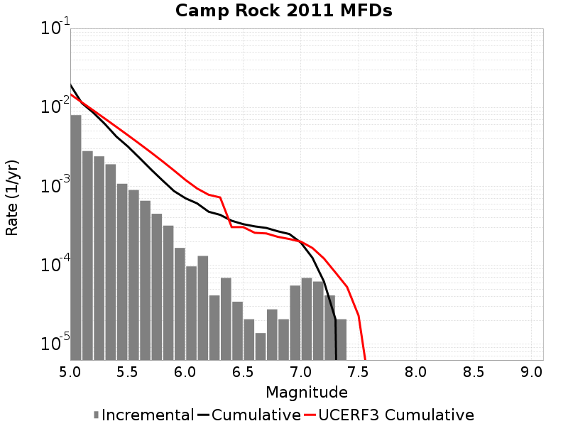

| Magnitude | Incremental Rate | Cumulative Rate | UCERF3 Cumulative Rate |
|-----|-----|-----|-----|
| 5.05 | 0.0079664225 | 0.019491134 | 0.01468741 |
| 5.15 | 0.0027982665 | 0.011524713 | 0.011604853 |
| 5.25 | 0.002397527 | 0.008726446 | 0.00915629 |
| 5.35 | 0.0019000574 | 0.0063289185 | 0.007211329 |
| 5.45 | 0.0010778508 | 0.004428861 | 0.0056663905 |
| 5.55 | 9.051183E-4 | 0.0033510104 | 0.0044392026 |
| 5.65 | 6.6329277E-4 | 0.0024458922 | 0.0034644124 |
| 5.75 | 4.491045E-4 | 0.0017825994 | 0.0026901092 |
| 5.85 | 3.247371E-4 | 0.0013334949 | 0.0020750582 |
| 5.95 | 1.796418E-4 | 0.0010087577 | 0.0015865058 |
| 6.05 | 1.105488E-4 | 8.29116E-4 | 0.0012022442 |
| 6.15 | 1.3818599E-4 | 7.185672E-4 | 9.3932415E-4 |
| 6.25 | 4.83651E-5 | 5.803812E-4 | 7.819929E-4 |
| 6.35 | 6.9092996E-5 | 5.320161E-4 | 7.2295935E-4 |
| 6.45 | 3.4546498E-5 | 4.6292308E-4 | 3.044136E-4 |
| 6.55 | 2.0727899E-5 | 4.283766E-4 | 3.044136E-4 |
| 6.65 | 1.38186E-5 | 4.0764868E-4 | 2.578672E-4 |
| 6.75 | 3.4546498E-5 | 3.938301E-4 | 2.5314454E-4 |
| 6.85 | 2.0727899E-5 | 3.592836E-4 | 2.2917375E-4 |
| 6.95 | 5.52744E-5 | 3.385557E-4 | 2.1507523E-4 |
| 7.05 | 7.6002296E-5 | 2.832813E-4 | 1.991479E-4 |
| 7.15 | 7.6002296E-5 | 2.07279E-4 | 1.6558761E-4 |
| 7.25 | 4.1455798E-5 | 1.312767E-4 | 1.2180525E-4 |
| 7.35 | 6.9092996E-5 | 8.98209E-5 | 8.083247E-5 |
| 7.45 | 2.0727899E-5 | 2.0727899E-5 | 5.3195483E-5 |
| 7.55 | 0.0 | 0.0 | 2.3049073E-5 |
| 7.65 | 0.0 | 0.0 | 2.4567867E-6 |

### Canada David (Detachment)
*[(top)](#table-of-contents)*

| Magnitude | Incremental Rate | Cumulative Rate | UCERF3 Cumulative Rate |
|-----|-----|-----|-----|
| 5.05 | 0.0026462618 | 0.010384678 | 0.01077082 |
| 5.15 | 0.002141883 | 0.007738416 | 0.008504306 |
| 5.25 | 0.0015822296 | 0.005596533 | 0.0067039495 |
| 5.35 | 0.0011814903 | 0.0040143034 | 0.005273876 |
| 5.45 | 7.6693227E-4 | 0.002832813 | 0.0041379277 |
| 5.55 | 5.803812E-4 | 0.0020658807 | 0.0032356123 |
| 5.65 | 3.731022E-4 | 0.0014854994 | 0.0025188776 |
| 5.75 | 2.625534E-4 | 0.0011123973 | 0.0019495551 |
| 5.85 | 1.589139E-4 | 8.498439E-4 | 0.0014973261 |
| 5.95 | 8.2911596E-5 | 6.9093E-4 | 0.0011381079 |
| 6.05 | 8.2911596E-5 | 6.0801837E-4 | 8.867616E-4 |
| 6.15 | 6.9092996E-5 | 5.251068E-4 | 6.871102E-4 |
| 6.25 | 3.4546498E-5 | 4.560138E-4 | 5.431088E-4 |
| 6.35 | 4.1455798E-5 | 4.214673E-4 | 4.287244E-4 |
| 6.45 | 6.9093E-6 | 3.800115E-4 | 3.378656E-4 |
| 6.55 | 2.0727899E-5 | 3.731022E-4 | 2.6579064E-4 |
| 6.65 | 6.9092996E-5 | 3.523743E-4 | 2.0853945E-4 |
| 6.75 | 4.1455798E-5 | 2.832813E-4 | 1.9034896E-4 |
| 6.85 | 3.4546498E-5 | 2.418255E-4 | 1.7589972E-4 |
| 6.95 | 1.38186E-5 | 2.07279E-4 | 1.414697E-4 |
| 7.05 | 6.9092996E-5 | 1.934604E-4 | 1.4041526E-4 |
| 7.15 | 4.83651E-5 | 1.243674E-4 | 1.2628539E-4 |
| 7.25 | 3.4546498E-5 | 7.6002296E-5 | 9.72067E-5 |
| 7.35 | 0.0 | 4.1455798E-5 | 3.8483606E-5 |
| 7.45 | 3.4546498E-5 | 4.1455798E-5 | 0.0 |
| 7.55 | 6.9093E-6 | 6.9093E-6 | 0.0 |

### Carlsbad
*[(top)](#table-of-contents)*

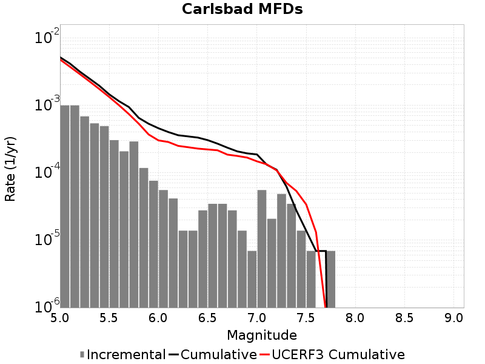

| Magnitude | Incremental Rate | Cumulative Rate | UCERF3 Cumulative Rate |
|-----|-----|-----|-----|
| 5.05 | 9.949392E-4 | 0.005997272 | 0.004762923 |
| 5.15 | 9.949392E-4 | 0.0050023333 | 0.003729048 |
| 5.25 | 6.840207E-4 | 0.004007394 | 0.002907812 |
| 5.35 | 5.389254E-4 | 0.0033233732 | 0.002255481 |
| 5.45 | 5.320161E-4 | 0.0027844477 | 0.0017373161 |
| 5.55 | 3.0400918E-4 | 0.0022524318 | 0.0013257231 |
| 5.65 | 2.280069E-4 | 0.0019484225 | 9.987833E-4 |
| 5.75 | 3.109185E-4 | 0.0017204157 | 7.390856E-4 |
| 5.85 | 1.6582319E-4 | 0.0014094972 | 5.328005E-4 |
| 5.95 | 1.450953E-4 | 0.001243674 | 3.6894236E-4 |
| 6.05 | 1.105488E-4 | 0.0010985787 | 3.013054E-4 |
| 6.15 | 1.450953E-4 | 9.880299E-4 | 2.852363E-4 |
| 6.25 | 1.036395E-4 | 8.429346E-4 | 2.499198E-4 |
| 6.35 | 5.52744E-5 | 7.392951E-4 | 2.387321E-4 |
| 6.45 | 8.98209E-5 | 6.840207E-4 | 2.277572E-4 |
| 6.55 | 8.98209E-5 | 5.941998E-4 | 2.2117383E-4 |
| 6.65 | 8.98209E-5 | 5.0437887E-4 | 2.1482127E-4 |
| 6.75 | 3.4546498E-5 | 4.14558E-4 | 1.853814E-4 |
| 6.85 | 4.1455798E-5 | 3.800115E-4 | 1.7728657E-4 |
| 6.95 | 2.0727899E-5 | 3.385557E-4 | 1.6755337E-4 |
| 7.05 | 8.2911596E-5 | 3.178278E-4 | 1.4749919E-4 |
| 7.15 | 2.76372E-5 | 2.349162E-4 | 1.3305266E-4 |
| 7.25 | 7.6002296E-5 | 2.07279E-4 | 1.0820978E-4 |
| 7.35 | 8.2911596E-5 | 1.312767E-4 | 7.058944E-5 |
| 7.45 | 1.38186E-5 | 4.83651E-5 | 5.3586085E-5 |
| 7.55 | 1.38186E-5 | 3.4546498E-5 | 3.386847E-5 |
| 7.65 | 6.9093E-6 | 2.0727899E-5 | 1.3113565E-5 |
| 7.75 | 1.38186E-5 | 1.38186E-5 | 8.6869284E-7 |

### Carson Range (Genoa)
*[(top)](#table-of-contents)*

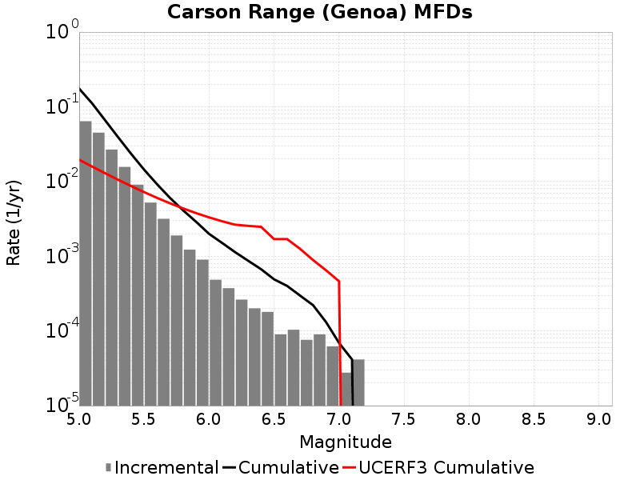

| Magnitude | Incremental Rate | Cumulative Rate | UCERF3 Cumulative Rate |
|-----|-----|-----|-----|
| 5.05 | 0.06402157 | 0.17487438 | 0.019533569 |
| 5.15 | 0.04500027 | 0.11085281 | 0.015825057 |
| 5.25 | 0.02673899 | 0.06585254 | 0.012879282 |
| 5.35 | 0.015663384 | 0.039113548 | 0.01053937 |
| 5.45 | 0.009065001 | 0.023450164 | 0.0086807115 |
| 5.55 | 0.005216521 | 0.014385163 | 0.0072043263 |
| 5.65 | 0.0031644593 | 0.009168641 | 0.006031592 |
| 5.75 | 0.0018931482 | 0.0060041817 | 0.005100056 |
| 5.85 | 0.0012229461 | 0.0041110334 | 0.004360111 |
| 5.95 | 8.98209E-4 | 0.0028880874 | 0.0037723514 |
| 6.05 | 4.83651E-4 | 0.0019898785 | 0.0033054776 |
| 6.15 | 3.731022E-4 | 0.0015062274 | 0.0029346263 |
| 6.25 | 2.625534E-4 | 0.0011331252 | 0.0026403645 |
| 6.35 | 2.003697E-4 | 8.7057176E-4 | 0.002546705 |
| 6.45 | 1.796418E-4 | 6.702021E-4 | 0.0024724458 |
| 6.55 | 8.98209E-5 | 4.905603E-4 | 0.0016937581 |
| 6.65 | 1.036395E-4 | 4.007394E-4 | 0.0016937581 |
| 6.75 | 7.6002296E-5 | 2.970999E-4 | 0.00125561 |
| 6.85 | 8.98209E-5 | 2.210976E-4 | 8.879E-4 |
| 6.95 | 6.21837E-5 | 1.312767E-4 | 6.4744795E-4 |
| 7.05 | 2.76372E-5 | 6.9092996E-5 | 4.6217185E-4 |
| 7.15 | 4.1455798E-5 | 4.1455798E-5 | 0.0 |

### Casmalia 2011 CFM
*[(top)](#table-of-contents)*

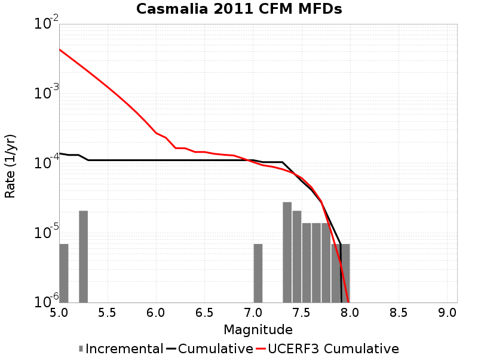

| Magnitude | Incremental Rate | Cumulative Rate | UCERF3 Cumulative Rate |
|-----|-----|-----|-----|
| 5.05 | 6.9093E-6 | 1.6582319E-4 | 0.0043118685 |
| 5.15 | 0.0 | 1.589139E-4 | 0.0033875725 |
| 5.25 | 2.0727899E-5 | 1.589139E-4 | 0.0026533783 |
| 5.35 | 0.0 | 1.3818599E-4 | 0.0020701871 |
| 5.45 | 0.0 | 1.3818599E-4 | 0.0016069419 |
| 5.55 | 0.0 | 1.3818599E-4 | 0.0012389731 |
| 5.65 | 0.0 | 1.3818599E-4 | 9.4668515E-4 |
| 5.75 | 0.0 | 1.3818599E-4 | 7.1451254E-4 |
| 5.85 | 0.0 | 1.3818599E-4 | 5.300913E-4 |
| 5.95 | 0.0 | 1.3818599E-4 | 3.836003E-4 |
| 6.05 | 0.0 | 1.3818599E-4 | 2.706262E-4 |
| 6.15 | 0.0 | 1.3818599E-4 | 2.3200855E-4 |
| 6.25 | 0.0 | 1.3818599E-4 | 1.6484414E-4 |
| 6.35 | 0.0 | 1.3818599E-4 | 1.636716E-4 |
| 6.45 | 0.0 | 1.3818599E-4 | 1.4495115E-4 |
| 6.55 | 0.0 | 1.3818599E-4 | 1.4485401E-4 |
| 6.65 | 0.0 | 1.3818599E-4 | 1.3634287E-4 |
| 6.75 | 0.0 | 1.3818599E-4 | 1.3220143E-4 |
| 6.85 | 0.0 | 1.3818599E-4 | 1.290749E-4 |
| 6.95 | 0.0 | 1.3818599E-4 | 1.1605246E-4 |
| 7.05 | 2.0727899E-5 | 1.3818599E-4 | 1.0388845E-4 |
| 7.15 | 6.9093E-6 | 1.174581E-4 | 9.340475E-5 |
| 7.25 | 0.0 | 1.105488E-4 | 8.891242E-5 |
| 7.35 | 2.76372E-5 | 1.105488E-4 | 8.202266E-5 |
| 7.45 | 2.0727899E-5 | 8.2911596E-5 | 7.327687E-5 |
| 7.55 | 2.0727899E-5 | 6.21837E-5 | 6.118812E-5 |
| 7.65 | 1.38186E-5 | 4.1455798E-5 | 4.5093126E-5 |
| 7.75 | 1.38186E-5 | 2.76372E-5 | 2.8389471E-5 |
| 7.85 | 6.9093E-6 | 1.38186E-5 | 1.0697026E-5 |
| 7.95 | 6.9093E-6 | 6.9093E-6 | 3.6325239E-6 |
| 8.05 | 0.0 | 0.0 | 7.2878595E-7 |

### Cedar Mtn-Mahogany Mtn
*[(top)](#table-of-contents)*

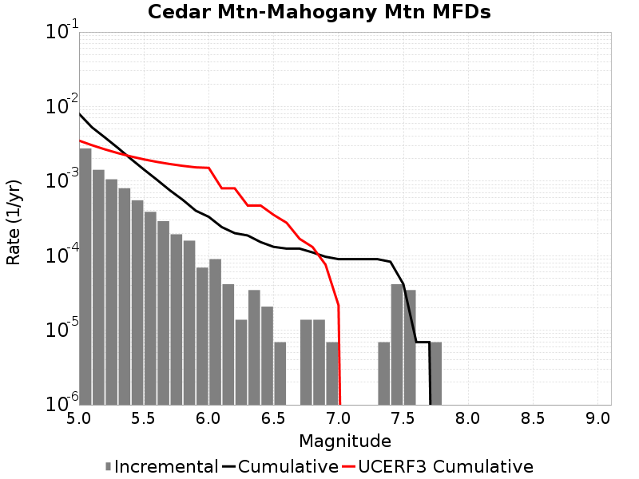

| Magnitude | Incremental Rate | Cumulative Rate | UCERF3 Cumulative Rate |
|-----|-----|-----|-----|
| 5.05 | 0.002742992 | 0.008000969 | 0.0034925789 |
| 5.15 | 0.0014164065 | 0.005257977 | 0.0030305001 |
| 5.25 | 0.0010571228 | 0.0038415708 | 0.0026634582 |
| 5.35 | 8.014788E-4 | 0.0027844477 | 0.0023719063 |
| 5.45 | 5.5274396E-4 | 0.001982969 | 0.0021403185 |
| 5.55 | 3.869208E-4 | 0.0014302251 | 0.0019563618 |
| 5.65 | 2.901906E-4 | 0.0010433043 | 0.0018102397 |
| 5.75 | 1.934604E-4 | 7.531137E-4 | 0.0016941709 |
| 5.85 | 1.589139E-4 | 5.596533E-4 | 0.001601974 |
| 5.95 | 6.9092996E-5 | 4.007394E-4 | 0.0015287396 |
| 6.05 | 8.98209E-5 | 3.3164638E-4 | 0.0015054282 |
| 6.15 | 4.1455798E-5 | 2.418255E-4 | 7.9971575E-4 |
| 6.25 | 1.38186E-5 | 2.003697E-4 | 7.996979E-4 |
| 6.35 | 3.4546498E-5 | 1.865511E-4 | 4.703747E-4 |
| 6.45 | 2.0727899E-5 | 1.5200459E-4 | 4.703747E-4 |
| 6.55 | 6.9093E-6 | 1.312767E-4 | 3.5230242E-4 |
| 6.65 | 0.0 | 1.243674E-4 | 2.7596057E-4 |
| 6.75 | 1.38186E-5 | 1.243674E-4 | 1.6831742E-4 |
| 6.85 | 1.38186E-5 | 1.105488E-4 | 1.305254E-4 |
| 6.95 | 6.9093E-6 | 9.67302E-5 | 7.573123E-5 |
| 7.05 | 0.0 | 8.98209E-5 | 2.1623326E-5 |
| 7.15 | 0.0 | 8.98209E-5 | 0.0 |
| 7.25 | 0.0 | 8.98209E-5 | 0.0 |
| 7.35 | 6.9093E-6 | 8.98209E-5 | 0.0 |
| 7.45 | 4.1455798E-5 | 8.2911596E-5 | 0.0 |
| 7.55 | 3.4546498E-5 | 4.1455798E-5 | 0.0 |
| 7.65 | 0.0 | 6.9093E-6 | 0.0 |
| 7.75 | 6.9093E-6 | 6.9093E-6 | 0.0 |

### Cerro Prieto
*[(top)](#table-of-contents)*

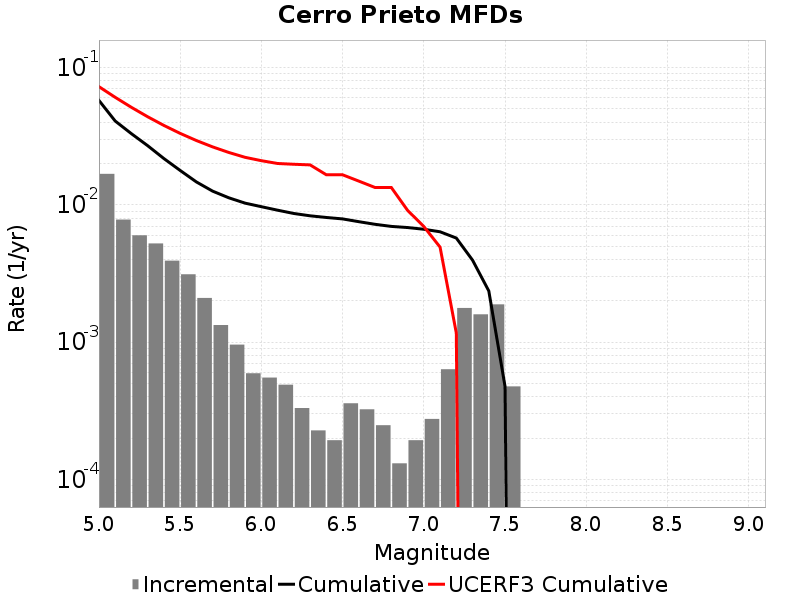

| Magnitude | Incremental Rate | Cumulative Rate | UCERF3 Cumulative Rate |
|-----|-----|-----|-----|
| 5.05 | 0.016817236 | 0.057609744 | 0.07255508 |
| 5.15 | 0.0078144185 | 0.040792506 | 0.060704626 |
| 5.25 | 0.0060041817 | 0.032978088 | 0.05129148 |
| 5.35 | 0.005237249 | 0.026973907 | 0.043814354 |
| 5.45 | 0.0039244825 | 0.021736657 | 0.03787506 |
| 5.55 | 0.0031230035 | 0.017812176 | 0.033157308 |
| 5.65 | 0.0021004272 | 0.014689172 | 0.029409869 |
| 5.75 | 0.0013334949 | 0.012588744 | 0.02643317 |
| 5.85 | 9.603927E-4 | 0.011255249 | 0.024068695 |
| 5.95 | 5.941998E-4 | 0.0102948565 | 0.022190524 |
| 6.05 | 5.5274396E-4 | 0.009700657 | 0.020978399 |
| 6.15 | 4.905603E-4 | 0.009147913 | 0.020015573 |
| 6.25 | 3.3164638E-4 | 0.008657353 | 0.019756556 |
| 6.35 | 2.280069E-4 | 0.008325706 | 0.019550811 |
| 6.45 | 1.934604E-4 | 0.0080977 | 0.016560066 |
| 6.55 | 3.592836E-4 | 0.007904239 | 0.016559927 |
| 6.65 | 3.247371E-4 | 0.0075449557 | 0.014895336 |
| 6.75 | 2.487348E-4 | 0.0072202184 | 0.013381025 |
| 6.85 | 1.312767E-4 | 0.0069714836 | 0.013380996 |
| 6.95 | 1.934604E-4 | 0.0068402067 | 0.009124304 |
| 7.05 | 2.7637198E-4 | 0.0066467463 | 0.0069606705 |
| 7.15 | 6.356556E-4 | 0.0063703745 | 0.0049265344 |
| 7.25 | 0.0017756901 | 0.005734719 | 0.001168977 |
| 7.35 | 0.0015960482 | 0.003959029 | 0.0 |
| 7.45 | 0.0018862389 | 0.0023629805 | 0.0 |
| 7.55 | 4.767417E-4 | 4.767417E-4 | 0.0 |

### Channel Islands Thrust
*[(top)](#table-of-contents)*

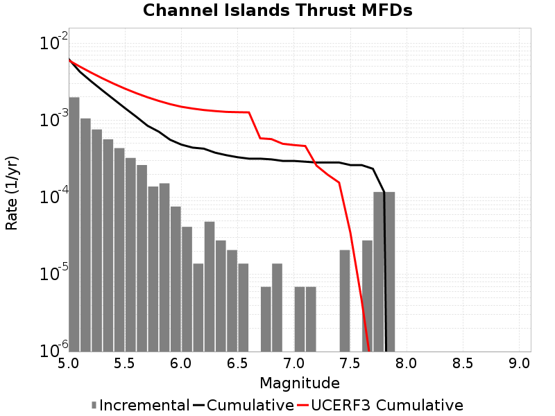

| Magnitude | Incremental Rate | Cumulative Rate | UCERF3 Cumulative Rate |
|-----|-----|-----|-----|
| 5.05 | 0.001982969 | 0.0069231186 | 0.005995962 |
| 5.15 | 0.0010571228 | 0.0049401494 | 0.004966394 |
| 5.25 | 7.60023E-4 | 0.0038830265 | 0.0041485797 |
| 5.35 | 5.665626E-4 | 0.0031230035 | 0.0034989666 |
| 5.45 | 4.3528588E-4 | 0.002556441 | 0.0029829603 |
| 5.55 | 3.247371E-4 | 0.0021211552 | 0.0025730822 |
| 5.65 | 2.625534E-4 | 0.001796418 | 0.0022475042 |
| 5.75 | 1.3818599E-4 | 0.0015338645 | 0.0019888887 |
| 5.85 | 1.589139E-4 | 0.0013956786 | 0.0017834629 |
| 5.95 | 1.174581E-4 | 0.0012367647 | 0.0016202874 |
| 6.05 | 7.6002296E-5 | 0.0011193065 | 0.0014983421 |
| 6.15 | 5.52744E-5 | 0.0010433043 | 0.0014197701 |
| 6.25 | 7.6002296E-5 | 9.880299E-4 | 0.0013584488 |
| 6.35 | 4.83651E-5 | 9.120276E-4 | 0.001317464 |
| 6.45 | 6.9092996E-5 | 8.636625E-4 | 0.0012849087 |
| 6.55 | 4.83651E-5 | 7.945695E-4 | 0.0012743014 |
| 6.65 | 3.4546498E-5 | 7.462044E-4 | 0.0012658759 |
| 6.75 | 8.2911596E-5 | 7.1165786E-4 | 5.8369536E-4 |
| 6.85 | 5.52744E-5 | 6.287463E-4 | 5.695381E-4 |
| 6.95 | 2.0727899E-5 | 5.734719E-4 | 4.955193E-4 |
| 7.05 | 5.52744E-5 | 5.5274396E-4 | 4.772087E-4 |
| 7.15 | 2.0727899E-5 | 4.974696E-4 | 4.6386442E-4 |
| 7.25 | 4.1455798E-5 | 4.767417E-4 | 2.5775394E-4 |
| 7.35 | 4.83651E-5 | 4.3528588E-4 | 1.9631587E-4 |
| 7.45 | 4.1455798E-5 | 3.869208E-4 | 1.5561018E-4 |
| 7.55 | 2.0727899E-5 | 3.45465E-4 | 3.49302E-5 |
| 7.65 | 5.52744E-5 | 3.247371E-4 | 4.6589935E-6 |
| 7.75 | 1.450953E-4 | 2.694627E-4 | 4.5206644E-7 |
| 7.85 | 1.174581E-4 | 1.243674E-4 | 3.8975507E-8 |
| 7.95 | 6.9093E-6 | 6.9093E-6 | 0.0 |

### Channel Islands Western Deep Ramp
*[(top)](#table-of-contents)*

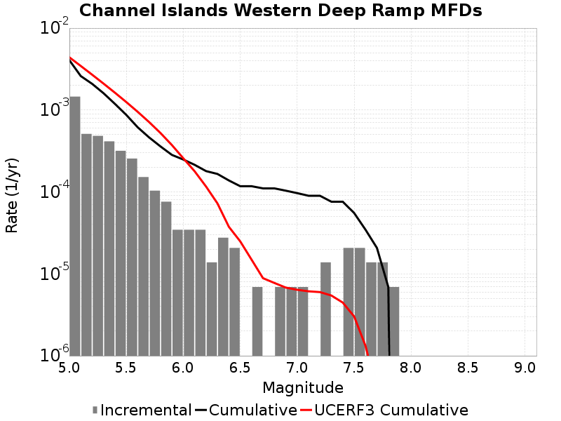

| Magnitude | Incremental Rate | Cumulative Rate | UCERF3 Cumulative Rate |
|-----|-----|-----|-----|
| 5.05 | 0.0014578623 | 0.00503688 | 0.004396877 |
| 5.15 | 5.112882E-4 | 0.0035790172 | 0.0034502028 |
| 5.25 | 4.83651E-4 | 0.003067729 | 0.002698233 |
| 5.35 | 4.283766E-4 | 0.002584078 | 0.002100922 |
| 5.45 | 3.385557E-4 | 0.0021557016 | 0.0016264609 |
| 5.55 | 2.901906E-4 | 0.0018171459 | 0.0012495832 |
| 5.65 | 1.796418E-4 | 0.0015269553 | 9.502185E-4 |
| 5.75 | 1.3818599E-4 | 0.0013473135 | 7.1242475E-4 |
| 5.85 | 1.243674E-4 | 0.0012091275 | 5.2353845E-4 |
| 5.95 | 4.83651E-5 | 0.0010847601 | 3.735007E-4 |
| 6.05 | 6.21837E-5 | 0.001036395 | 2.5755801E-4 |
| 6.15 | 4.1455798E-5 | 9.7421126E-4 | 1.7849346E-4 |
| 6.25 | 2.76372E-5 | 9.327555E-4 | 1.1632954E-4 |
| 6.35 | 5.52744E-5 | 9.051183E-4 | 7.243288E-5 |
| 6.45 | 2.76372E-5 | 8.498439E-4 | 3.756452E-5 |
| 6.55 | 2.0727899E-5 | 8.2220667E-4 | 2.4912448E-5 |
| 6.65 | 2.0727899E-5 | 8.014788E-4 | 1.4862596E-5 |
| 6.75 | 6.9093E-6 | 7.807509E-4 | 8.853982E-6 |
| 6.85 | 4.83651E-5 | 7.738416E-4 | 7.744263E-6 |
| 6.95 | 2.76372E-5 | 7.254765E-4 | 6.7984024E-6 |
| 7.05 | 4.83651E-5 | 6.978393E-4 | 6.3919456E-6 |
| 7.15 | 2.0727899E-5 | 6.494742E-4 | 6.1237665E-6 |
| 7.25 | 4.1455798E-5 | 6.287463E-4 | 5.9904937E-6 |
| 7.35 | 1.38186E-5 | 5.872905E-4 | 5.4409493E-6 |
| 7.45 | 5.52744E-5 | 5.734719E-4 | 4.4620033E-6 |
| 7.55 | 1.174581E-4 | 5.181975E-4 | 3.0207045E-6 |
| 7.65 | 1.312767E-4 | 4.007394E-4 | 1.3189848E-6 |
| 7.75 | 1.5200459E-4 | 2.694627E-4 | 3.668493E-7 |
| 7.85 | 1.174581E-4 | 1.174581E-4 | 5.2657267E-8 |

### Chino alt 1
*[(top)](#table-of-contents)*

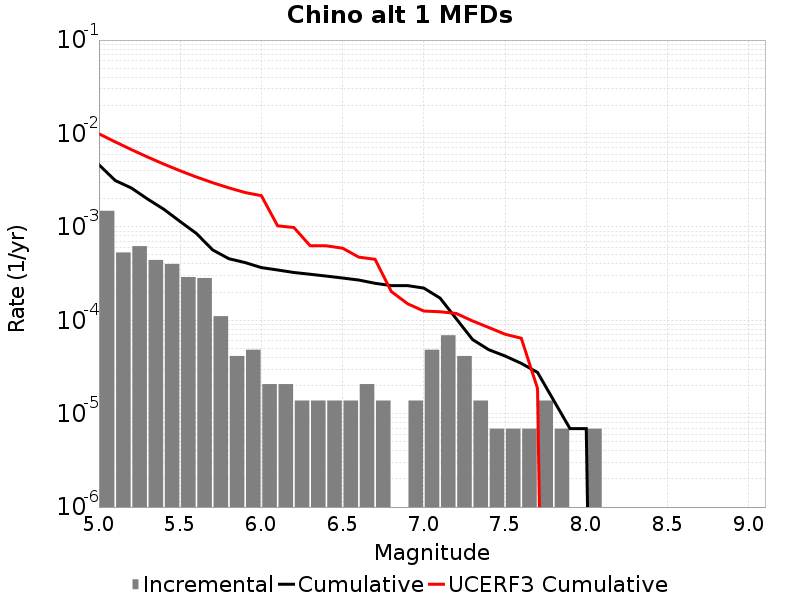

| Magnitude | Incremental Rate | Cumulative Rate | UCERF3 Cumulative Rate |
|-----|-----|-----|-----|
| 5.05 | 0.0014854994 | 0.005023061 | 0.009915331 |
| 5.15 | 5.320161E-4 | 0.0035375615 | 0.00813078 |
| 5.25 | 6.21837E-4 | 0.0030055454 | 0.0067132614 |
| 5.35 | 4.421952E-4 | 0.0023837085 | 0.0055872863 |
| 5.45 | 4.007394E-4 | 0.0019415133 | 0.004692892 |
| 5.55 | 2.901906E-4 | 0.0015407739 | 0.0039824494 |
| 5.65 | 3.0400918E-4 | 0.0012505833 | 0.0034181252 |
| 5.75 | 1.589139E-4 | 9.465741E-4 | 0.0029698662 |
| 5.85 | 9.67302E-5 | 7.876602E-4 | 0.0026138015 |
| 5.95 | 8.98209E-5 | 6.9093E-4 | 0.0023309693 |
| 6.05 | 6.21837E-5 | 6.011091E-4 | 0.0021567976 |
| 6.15 | 2.0727899E-5 | 5.389254E-4 | 0.0010255201 |
| 6.25 | 2.76372E-5 | 5.181975E-4 | 9.840336E-4 |
| 6.35 | 2.0727899E-5 | 4.905603E-4 | 6.2856573E-4 |
| 6.45 | 2.0727899E-5 | 4.698324E-4 | 6.267055E-4 |
| 6.55 | 3.4546498E-5 | 4.491045E-4 | 5.9106847E-4 |
| 6.65 | 2.0727899E-5 | 4.14558E-4 | 4.7386668E-4 |
| 6.75 | 4.1455798E-5 | 3.938301E-4 | 4.492631E-4 |
| 6.85 | 2.0727899E-5 | 3.523743E-4 | 2.0285457E-4 |
| 6.95 | 2.76372E-5 | 3.3164638E-4 | 1.5027571E-4 |
| 7.05 | 8.2911596E-5 | 3.0400918E-4 | 1.255251E-4 |
| 7.15 | 8.2911596E-5 | 2.210976E-4 | 1.2336265E-4 |
| 7.25 | 5.52744E-5 | 1.3818599E-4 | 1.1820429E-4 |
| 7.35 | 2.76372E-5 | 8.2911596E-5 | 9.8321965E-5 |
| 7.45 | 6.9093E-6 | 5.52744E-5 | 8.363691E-5 |
| 7.55 | 6.9093E-6 | 4.83651E-5 | 7.090629E-5 |
| 7.65 | 1.38186E-5 | 4.1455798E-5 | 6.4188964E-5 |
| 7.75 | 1.38186E-5 | 2.76372E-5 | 1.8631335E-5 |
| 7.85 | 6.9093E-6 | 1.38186E-5 | 0.0 |
| 7.95 | 0.0 | 6.9093E-6 | 0.0 |
| 8.05 | 6.9093E-6 | 6.9093E-6 | 0.0 |

### Clamshell-Sawpit
*[(top)](#table-of-contents)*

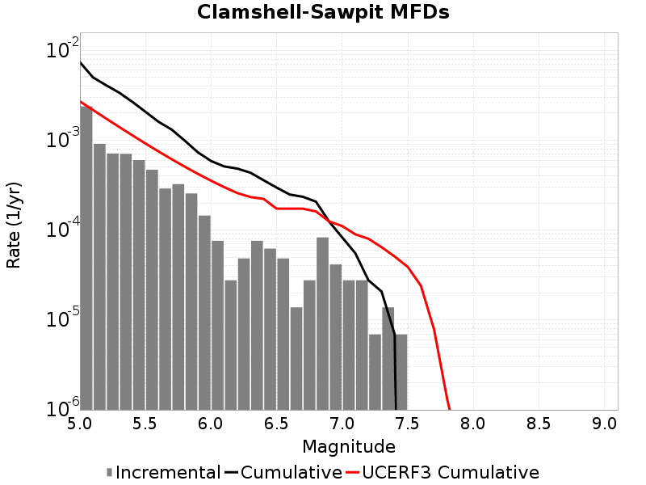

| Magnitude | Incremental Rate | Cumulative Rate | UCERF3 Cumulative Rate |
|-----|-----|-----|-----|
| 5.05 | 0.0023767992 | 0.0079387855 | 0.0027068371 |
| 5.15 | 9.120276E-4 | 0.0055619865 | 0.0021692761 |
| 5.25 | 7.1165786E-4 | 0.004649959 | 0.001742276 |
| 5.35 | 7.047486E-4 | 0.003938301 | 0.0014030978 |
| 5.45 | 6.011091E-4 | 0.0032335524 | 0.001133679 |
| 5.55 | 4.698324E-4 | 0.0026324433 | 9.19672E-4 |
| 5.65 | 2.901906E-4 | 0.0021626109 | 7.496803E-4 |
| 5.75 | 3.247371E-4 | 0.0018724203 | 6.14651E-4 |
| 5.85 | 2.694627E-4 | 0.0015476831 | 5.0739344E-4 |
| 5.95 | 2.07279E-4 | 0.0012782204 | 4.2219574E-4 |
| 6.05 | 1.036395E-4 | 0.0010709414 | 3.545208E-4 |
| 6.15 | 6.9092996E-5 | 9.67302E-4 | 3.0076466E-4 |
| 6.25 | 9.67302E-5 | 8.98209E-4 | 2.5857362E-4 |
| 6.35 | 1.312767E-4 | 8.014788E-4 | 2.332693E-4 |
| 6.45 | 8.2911596E-5 | 6.702021E-4 | 2.2270663E-4 |
| 6.55 | 7.6002296E-5 | 5.872905E-4 | 1.7311217E-4 |
| 6.65 | 4.83651E-5 | 5.112882E-4 | 1.7311217E-4 |
| 6.75 | 4.83651E-5 | 4.6292308E-4 | 1.7311217E-4 |
| 6.85 | 1.450953E-4 | 4.14558E-4 | 1.6130832E-4 |
| 6.95 | 6.21837E-5 | 2.694627E-4 | 1.2482627E-4 |
| 7.05 | 6.9092996E-5 | 2.07279E-4 | 1.1091907E-4 |
| 7.15 | 6.21837E-5 | 1.3818599E-4 | 8.975165E-5 |
| 7.25 | 2.0727899E-5 | 7.6002296E-5 | 8.016101E-5 |
| 7.35 | 4.1455798E-5 | 5.52744E-5 | 6.457193E-5 |
| 7.45 | 6.9093E-6 | 1.38186E-5 | 5.0809118E-5 |
| 7.55 | 6.9093E-6 | 6.9093E-6 | 3.8910148E-5 |
| 7.65 | 0.0 | 0.0 | 2.398464E-5 |
| 7.75 | 0.0 | 0.0 | 7.84923E-6 |
| 7.85 | 0.0 | 0.0 | 1.3155246E-6 |
| 7.95 | 0.0 | 0.0 | 3.1088908E-7 |
| 8.05 | 0.0 | 0.0 | 1.0035582E-8 |

### Clayton
*[(top)](#table-of-contents)*

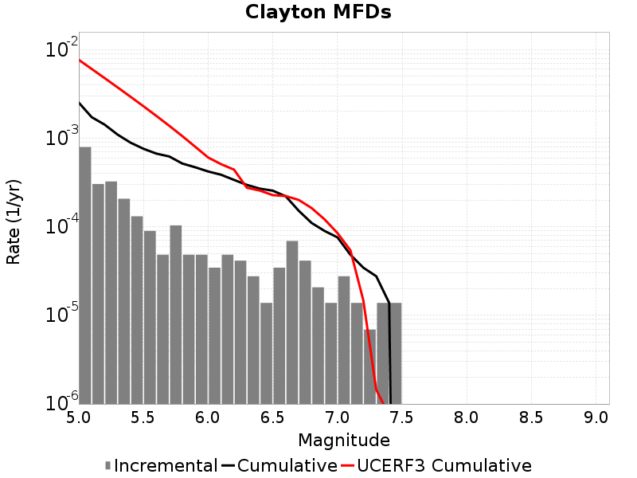

| Magnitude | Incremental Rate | Cumulative Rate | UCERF3 Cumulative Rate |
|-----|-----|-----|-----|
| 5.05 | 7.945695E-4 | 0.0028673594 | 0.0076662237 |
| 5.15 | 3.0400918E-4 | 0.00207279 | 0.0060509574 |
| 5.25 | 3.247371E-4 | 0.0017687808 | 0.0047679055 |
| 5.35 | 2.07279E-4 | 0.0014440437 | 0.003748741 |
| 5.45 | 1.312767E-4 | 0.0012367647 | 0.00293919 |
| 5.55 | 8.98209E-5 | 0.0011054879 | 0.0022961409 |
| 5.65 | 4.83651E-5 | 0.0010156671 | 0.0017853488 |
| 5.75 | 1.036395E-4 | 9.67302E-4 | 0.0013796121 |
| 5.85 | 5.52744E-5 | 8.636625E-4 | 0.001057324 |
| 5.95 | 5.52744E-5 | 8.083881E-4 | 8.013216E-4 |
| 6.05 | 4.1455798E-5 | 7.531137E-4 | 6.061413E-4 |
| 6.15 | 5.52744E-5 | 7.1165786E-4 | 5.09286E-4 |
| 6.25 | 5.52744E-5 | 6.5638346E-4 | 4.4195852E-4 |
| 6.35 | 5.52744E-5 | 6.011091E-4 | 2.7592384E-4 |
| 6.45 | 5.52744E-5 | 5.458347E-4 | 2.5628123E-4 |
| 6.55 | 8.2911596E-5 | 4.905603E-4 | 2.2775686E-4 |
| 6.65 | 1.174581E-4 | 4.0764868E-4 | 2.2246804E-4 |
| 6.75 | 1.105488E-4 | 2.901906E-4 | 2.011675E-4 |
| 6.85 | 4.1455798E-5 | 1.796418E-4 | 1.6281828E-4 |
| 6.95 | 3.4546498E-5 | 1.3818599E-4 | 1.2146568E-4 |
| 7.05 | 2.76372E-5 | 1.036395E-4 | 8.4948006E-5 |
| 7.15 | 2.0727899E-5 | 7.6002296E-5 | 5.4332824E-5 |
| 7.25 | 1.38186E-5 | 5.52744E-5 | 1.4775691E-5 |
| 7.35 | 1.38186E-5 | 4.1455798E-5 | 1.4416603E-6 |
| 7.45 | 2.0727899E-5 | 2.76372E-5 | 7.449234E-7 |
| 7.55 | 6.9093E-6 | 6.9093E-6 | 3.9479139E-7 |
| 7.65 | 0.0 | 0.0 | 2.0394098E-7 |

### Cleghorn
*[(top)](#table-of-contents)*

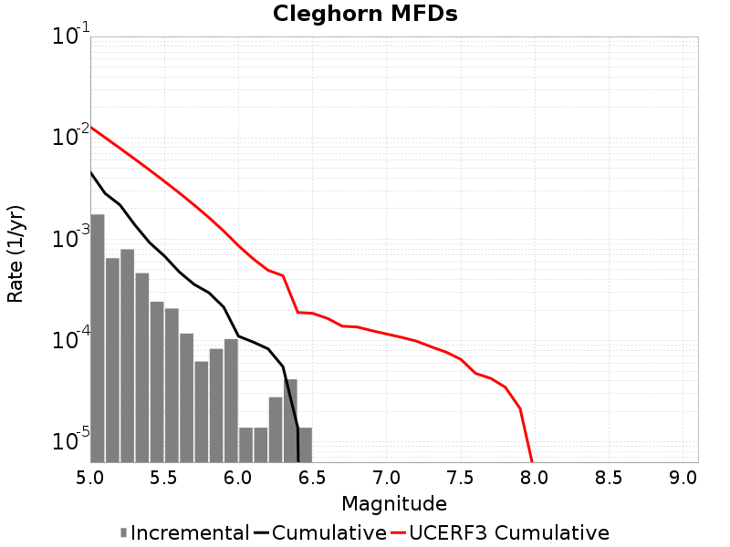

| Magnitude | Incremental Rate | Cumulative Rate | UCERF3 Cumulative Rate |
|-----|-----|-----|-----|
| 5.05 | 0.0017549621 | 0.004587775 | 0.012807313 |
| 5.15 | 6.494742E-4 | 0.002832813 | 0.010077598 |
| 5.25 | 7.945695E-4 | 0.0021833389 | 0.007909306 |
| 5.35 | 4.6292308E-4 | 0.0013887692 | 0.006186972 |
| 5.45 | 2.418255E-4 | 9.2584617E-4 | 0.004818873 |
| 5.55 | 2.07279E-4 | 6.840207E-4 | 0.0037321534 |
| 5.65 | 1.174581E-4 | 4.767417E-4 | 0.0028689413 |
| 5.75 | 6.21837E-5 | 3.592836E-4 | 0.0021832676 |
| 5.85 | 8.2911596E-5 | 2.970999E-4 | 0.0016386175 |
| 5.95 | 1.036395E-4 | 2.141883E-4 | 0.0012059866 |
| 6.05 | 1.38186E-5 | 1.105488E-4 | 8.623357E-4 |
| 6.15 | 1.38186E-5 | 9.67302E-5 | 6.391632E-4 |
| 6.25 | 2.76372E-5 | 8.2911596E-5 | 4.938022E-4 |
| 6.35 | 4.1455798E-5 | 5.52744E-5 | 4.3706718E-4 |
| 6.45 | 1.38186E-5 | 1.38186E-5 | 1.8967898E-4 |
| 6.55 | 0.0 | 0.0 | 1.8598197E-4 |
| 6.65 | 0.0 | 0.0 | 1.6581848E-4 |
| 6.75 | 0.0 | 0.0 | 1.3874561E-4 |
| 6.85 | 0.0 | 0.0 | 1.3632259E-4 |
| 6.95 | 0.0 | 0.0 | 1.2545173E-4 |
| 7.05 | 0.0 | 0.0 | 1.16170486E-4 |
| 7.15 | 0.0 | 0.0 | 1.0783971E-4 |
| 7.25 | 0.0 | 0.0 | 9.889583E-5 |
| 7.35 | 0.0 | 0.0 | 8.6890475E-5 |
| 7.45 | 0.0 | 0.0 | 7.710022E-5 |
| 7.55 | 0.0 | 0.0 | 6.5397304E-5 |
| 7.65 | 0.0 | 0.0 | 4.746625E-5 |
| 7.75 | 0.0 | 0.0 | 4.2570784E-5 |
| 7.85 | 0.0 | 0.0 | 3.4716828E-5 |
| 7.95 | 0.0 | 0.0 | 2.1370039E-5 |
| 8.05 | 0.0 | 0.0 | 4.7263097E-6 |
| 8.15 | 0.0 | 0.0 | 2.0656257E-6 |
| 8.25 | 0.0 | 0.0 | 8.933443E-7 |

### Cleghorn Lake
*[(top)](#table-of-contents)*

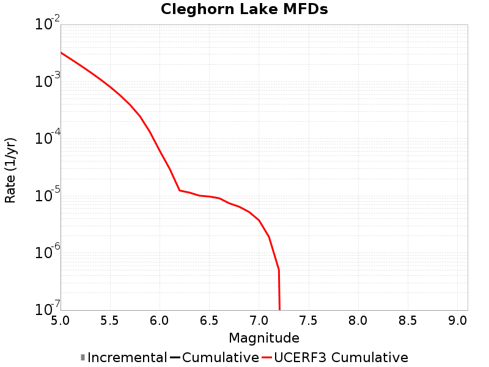

| Magnitude | Incremental Rate | Cumulative Rate | UCERF3 Cumulative Rate |
|-----|-----|-----|-----|
| 5.05 | 0.0 | 0.0 | 0.003240045 |
| 5.15 | 0.0 | 0.0 | 0.002508751 |
| 5.25 | 0.0 | 0.0 | 0.0019278632 |
| 5.35 | 0.0 | 0.0 | 0.0014664478 |
| 5.45 | 0.0 | 0.0 | 0.0010999326 |
| 5.55 | 0.0 | 0.0 | 8.087992E-4 |
| 5.65 | 0.0 | 0.0 | 5.7754363E-4 |
| 5.75 | 0.0 | 0.0 | 3.9385085E-4 |
| 5.85 | 0.0 | 0.0 | 2.479385E-4 |
| 5.95 | 0.0 | 0.0 | 1.3203619E-4 |
| 6.05 | 0.0 | 0.0 | 6.138763E-5 |
| 6.15 | 0.0 | 0.0 | 2.975724E-5 |
| 6.25 | 0.0 | 0.0 | 1.2412565E-5 |
| 6.35 | 0.0 | 0.0 | 1.1412021E-5 |
| 6.45 | 0.0 | 0.0 | 1.0085399E-5 |
| 6.55 | 0.0 | 0.0 | 9.746876E-6 |
| 6.65 | 0.0 | 0.0 | 9.085195E-6 |
| 6.75 | 0.0 | 0.0 | 7.4168865E-6 |
| 6.85 | 0.0 | 0.0 | 6.462506E-6 |
| 6.95 | 0.0 | 0.0 | 5.2262103E-6 |
| 7.05 | 0.0 | 0.0 | 3.730519E-6 |
| 7.15 | 0.0 | 0.0 | 1.917682E-6 |
| 7.25 | 0.0 | 0.0 | 5.0835257E-7 |

### Cleghorn Pass
*[(top)](#table-of-contents)*

| Magnitude | Incremental Rate | Cumulative Rate | UCERF3 Cumulative Rate |
|-----|-----|-----|-----|
| 5.05 | 0.0 | 0.0 | 0.0032844543 |
| 5.15 | 0.0 | 0.0 | 0.0025433663 |
| 5.25 | 0.0 | 0.0 | 0.0019546992 |
| 5.35 | 0.0 | 0.0 | 0.0014871041 |
| 5.45 | 0.0 | 0.0 | 0.0011156802 |
| 5.55 | 0.0 | 0.0 | 8.206478E-4 |
| 5.65 | 0.0 | 0.0 | 5.8629515E-4 |
| 5.75 | 0.0 | 0.0 | 4.0014225E-4 |
| 5.85 | 0.0 | 0.0 | 2.5227576E-4 |
| 5.95 | 0.0 | 0.0 | 1.3482121E-4 |
| 6.05 | 0.0 | 0.0 | 6.511359E-5 |
| 6.15 | 0.0 | 0.0 | 3.3196287E-5 |
| 6.25 | 0.0 | 0.0 | 9.741497E-6 |
| 6.35 | 0.0 | 0.0 | 8.785055E-6 |
| 6.45 | 0.0 | 0.0 | 6.4873548E-6 |

### Collayami 2011 CFM
*[(top)](#table-of-contents)*

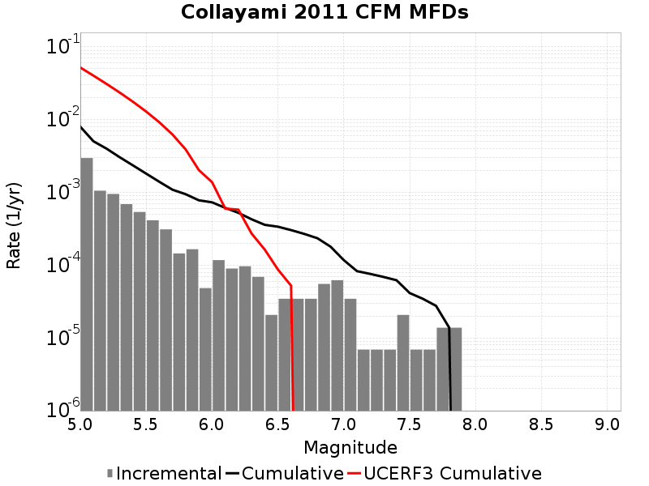

| Magnitude | Incremental Rate | Cumulative Rate | UCERF3 Cumulative Rate |
|-----|-----|-----|-----|
| 5.05 | 0.0029709989 | 0.008076971 | 0.05222359 |
| 5.15 | 0.0010571228 | 0.0051059728 | 0.040413644 |
| 5.25 | 9.534834E-4 | 0.00404885 | 0.031032672 |
| 5.35 | 6.9093E-4 | 0.0030953663 | 0.023581099 |
| 5.45 | 5.389254E-4 | 0.0024044365 | 0.017662106 |
| 5.55 | 4.14558E-4 | 0.001865511 | 0.012960481 |
| 5.65 | 3.109185E-4 | 0.001450953 | 0.009225848 |
| 5.75 | 1.450953E-4 | 0.0011400345 | 0.006259324 |
| 5.85 | 1.6582319E-4 | 9.949392E-4 | 0.0039029303 |
| 5.95 | 5.52744E-5 | 8.29116E-4 | 0.00203118 |
| 6.05 | 1.312767E-4 | 7.738416E-4 | 0.0013874698 |
| 6.15 | 8.98209E-5 | 6.425649E-4 | 6.014882E-4 |
| 6.25 | 9.67302E-5 | 5.5274396E-4 | 5.808784E-4 |
| 6.35 | 6.9092996E-5 | 4.560138E-4 | 2.728969E-4 |
| 6.45 | 2.0727899E-5 | 3.869208E-4 | 1.6410455E-4 |
| 6.55 | 3.4546498E-5 | 3.661929E-4 | 8.72698E-5 |
| 6.65 | 3.4546498E-5 | 3.3164638E-4 | 5.2298794E-5 |
| 6.75 | 4.83651E-5 | 2.970999E-4 | 0.0 |
| 6.85 | 5.52744E-5 | 2.487348E-4 | 0.0 |
| 6.95 | 6.21837E-5 | 1.934604E-4 | 0.0 |
| 7.05 | 3.4546498E-5 | 1.312767E-4 | 0.0 |
| 7.15 | 6.9093E-6 | 9.67302E-5 | 0.0 |
| 7.25 | 6.9093E-6 | 8.98209E-5 | 0.0 |
| 7.35 | 1.38186E-5 | 8.2911596E-5 | 0.0 |
| 7.45 | 2.76372E-5 | 6.9092996E-5 | 0.0 |
| 7.55 | 6.9093E-6 | 4.1455798E-5 | 0.0 |
| 7.65 | 6.9093E-6 | 3.4546498E-5 | 0.0 |
| 7.75 | 1.38186E-5 | 2.76372E-5 | 0.0 |
| 7.85 | 1.38186E-5 | 1.38186E-5 | 0.0 |

### Contra Costa (Lafayette) 2011 CFM
*[(top)](#table-of-contents)*

| Magnitude | Incremental Rate | Cumulative Rate | UCERF3 Cumulative Rate |
|-----|-----|-----|-----|
| 5.05 | 0.002259341 | 0.007054395 | 0.0086100325 |
| 5.15 | 8.912997E-4 | 0.004795054 | 0.00666779 |
| 5.25 | 8.843904E-4 | 0.0039037545 | 0.005125012 |
| 5.35 | 6.21837E-4 | 0.003019364 | 0.0038995394 |
| 5.45 | 6.0801837E-4 | 0.002397527 | 0.0029261122 |
| 5.55 | 4.0764868E-4 | 0.0017895086 | 0.0021528914 |
| 5.65 | 2.7637198E-4 | 0.00138186 | 0.0015387004 |
| 5.75 | 1.6582319E-4 | 0.0011054879 | 0.001050831 |
| 5.85 | 1.312767E-4 | 9.396648E-4 | 6.633027E-4 |
| 5.95 | 1.036395E-4 | 8.083881E-4 | 3.5547797E-4 |
| 6.05 | 9.67302E-5 | 7.047486E-4 | 1.5808294E-4 |
| 6.15 | 8.2911596E-5 | 6.0801837E-4 | 7.080213E-5 |
| 6.25 | 3.4546498E-5 | 5.251068E-4 | 2.4014318E-5 |
| 6.35 | 4.83651E-5 | 4.905603E-4 | 1.3097477E-5 |
| 6.45 | 3.4546498E-5 | 4.421952E-4 | 8.139762E-6 |
| 6.55 | 2.76372E-5 | 4.0764868E-4 | 6.445268E-6 |
| 6.65 | 1.38186E-5 | 3.800115E-4 | 5.1073175E-6 |
| 6.75 | 1.38186E-5 | 3.661929E-4 | 4.992053E-6 |
| 6.85 | 6.21837E-5 | 3.523743E-4 | 4.664854E-6 |
| 6.95 | 7.6002296E-5 | 2.901906E-4 | 4.4799067E-6 |
| 7.05 | 5.52744E-5 | 2.141883E-4 | 4.2651513E-6 |
| 7.15 | 1.036395E-4 | 1.589139E-4 | 3.8918083E-6 |
| 7.25 | 3.4546498E-5 | 5.52744E-5 | 3.3739286E-6 |
| 7.35 | 1.38186E-5 | 2.0727899E-5 | 2.7473466E-6 |
| 7.45 | 6.9093E-6 | 6.9093E-6 | 2.0051395E-6 |
| 7.55 | 0.0 | 0.0 | 1.1629064E-6 |
| 7.65 | 0.0 | 0.0 | 8.5783194E-7 |
| 7.75 | 0.0 | 0.0 | 6.5986023E-7 |
| 7.85 | 0.0 | 0.0 | 6.027186E-7 |
| 7.95 | 0.0 | 0.0 | 5.478757E-7 |
| 8.05 | 0.0 | 0.0 | 3.6535724E-7 |
| 8.15 | 0.0 | 0.0 | 1.1106757E-7 |

### Contra Costa Shear Zone (connector) 2011 CFM
*[(top)](#table-of-contents)*

| Magnitude | Incremental Rate | Cumulative Rate | UCERF3 Cumulative Rate |
|-----|-----|-----|-----|
| 5.05 | 0.017487438 | 0.04083396 | 0.013605916 |
| 5.15 | 0.006446377 | 0.023346525 | 0.010527253 |
| 5.25 | 0.0050576073 | 0.016900148 | 0.008081784 |
| 5.35 | 0.0034408313 | 0.01184254 | 0.006139279 |
| 5.45 | 0.002349162 | 0.008401709 | 0.004596292 |
| 5.55 | 0.0016305947 | 0.0060525467 | 0.0033706543 |
| 5.65 | 0.0010847601 | 0.0044219517 | 0.0023970956 |
| 5.75 | 7.6693227E-4 | 0.0033371919 | 0.0016237705 |
| 5.85 | 5.941998E-4 | 0.0025702596 | 0.0010094964 |
| 5.95 | 3.523743E-4 | 0.0019760597 | 5.215612E-4 |
| 6.05 | 3.731022E-4 | 0.0016236855 | 2.0516444E-4 |
| 6.15 | 2.141883E-4 | 0.0012505833 | 8.9301706E-5 |
| 6.25 | 8.2911596E-5 | 0.001036395 | 1.4622308E-5 |
| 6.35 | 8.2911596E-5 | 9.534834E-4 | 1.0820367E-5 |
| 6.45 | 1.174581E-4 | 8.7057176E-4 | 9.316128E-6 |
| 6.55 | 1.036395E-4 | 7.531137E-4 | 7.96869E-6 |
| 6.65 | 8.2911596E-5 | 6.494742E-4 | 7.3957804E-6 |
| 6.75 | 7.6002296E-5 | 5.665626E-4 | 6.790129E-6 |
| 6.85 | 1.174581E-4 | 4.905603E-4 | 6.0940283E-6 |
| 6.95 | 9.67302E-5 | 3.731022E-4 | 5.047763E-6 |
| 7.05 | 8.2911596E-5 | 2.7637198E-4 | 4.3574805E-6 |
| 7.15 | 1.243674E-4 | 1.934604E-4 | 3.2222474E-6 |
| 7.25 | 4.83651E-5 | 6.9092996E-5 | 2.605478E-6 |
| 7.35 | 1.38186E-5 | 2.0727899E-5 | 2.1112153E-6 |
| 7.45 | 6.9093E-6 | 6.9093E-6 | 1.5275549E-6 |
| 7.55 | 0.0 | 0.0 | 8.117583E-7 |
| 7.65 | 0.0 | 0.0 | 4.5597207E-7 |
| 7.75 | 0.0 | 0.0 | 2.6906088E-7 |
| 7.85 | 0.0 | 0.0 | 2.2022884E-7 |
| 7.95 | 0.0 | 0.0 | 1.7231504E-7 |
| 8.05 | 0.0 | 0.0 | 1.1214906E-7 |
| 8.15 | 0.0 | 0.0 | 1.5528032E-8 |

### Coronado Bank alt1
*[(top)](#table-of-contents)*

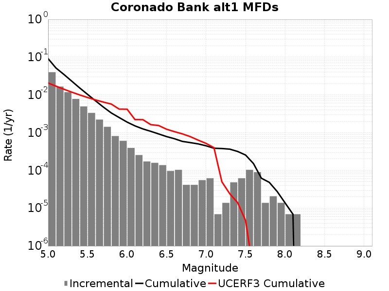

| Magnitude | Incremental Rate | Cumulative Rate | UCERF3 Cumulative Rate |
|-----|-----|-----|-----|
| 5.05 | 0.039845932 | 0.09137549 | 0.020732226 |
| 5.15 | 0.016637594 | 0.05152956 | 0.017064564 |
| 5.25 | 0.0118010845 | 0.034891963 | 0.014151236 |
| 5.35 | 0.007807509 | 0.02309088 | 0.011837098 |
| 5.45 | 0.004953968 | 0.015283371 | 0.009998912 |
| 5.55 | 0.0033441011 | 0.010329403 | 0.008538789 |
| 5.65 | 0.0022247946 | 0.006985302 | 0.007378972 |
| 5.75 | 0.0014302251 | 0.0047605075 | 0.006457697 |
| 5.85 | 8.1529736E-4 | 0.0033302826 | 0.0057259025 |
| 5.95 | 6.0801837E-4 | 0.0025149852 | 0.0042076004 |
| 6.05 | 3.938301E-4 | 0.0019069668 | 0.00419167 |
| 6.15 | 2.556441E-4 | 0.0015131367 | 0.0022203065 |
| 6.25 | 1.727325E-4 | 0.0012574926 | 0.0022108103 |
| 6.35 | 1.589139E-4 | 0.0010847601 | 0.0016331323 |
| 6.45 | 1.3818599E-4 | 9.2584617E-4 | 0.0015451825 |
| 6.55 | 9.67302E-5 | 7.876602E-4 | 0.0012337014 |
| 6.65 | 1.036395E-4 | 6.9093E-4 | 0.0010635046 |
| 6.75 | 4.1455798E-5 | 5.872905E-4 | 9.2946034E-4 |
| 6.85 | 4.1455798E-5 | 5.458347E-4 | 7.856457E-4 |
| 6.95 | 5.52744E-5 | 5.0437887E-4 | 6.344583E-4 |
| 7.05 | 6.21837E-5 | 4.491045E-4 | 5.1933475E-4 |
| 7.15 | 6.9093E-6 | 3.869208E-4 | 4.0038675E-4 |
| 7.25 | 1.38186E-5 | 3.800115E-4 | 4.999049E-5 |
| 7.35 | 4.83651E-5 | 3.661929E-4 | 2.4070223E-5 |
| 7.45 | 6.21837E-5 | 3.178278E-4 | 1.3979868E-5 |
| 7.55 | 1.036395E-4 | 2.556441E-4 | 4.696823E-6 |
| 7.65 | 8.98209E-5 | 1.5200459E-4 | 2.0431875E-7 |
| 7.75 | 1.38186E-5 | 6.21837E-5 | 0.0 |
| 7.85 | 2.0727899E-5 | 4.83651E-5 | 0.0 |
| 7.95 | 1.38186E-5 | 2.76372E-5 | 0.0 |
| 8.05 | 6.9093E-6 | 1.38186E-5 | 0.0 |
| 8.15 | 6.9093E-6 | 6.9093E-6 | 0.0 |

### Coyote Canyon
*[(top)](#table-of-contents)*

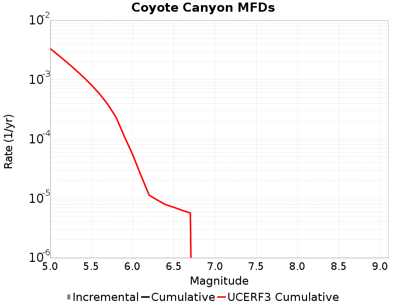

| Magnitude | Incremental Rate | Cumulative Rate | UCERF3 Cumulative Rate |
|-----|-----|-----|-----|
| 5.05 | 0.0 | 0.0 | 0.00334187 |
| 5.15 | 0.0 | 0.0 | 0.0025815053 |
| 5.25 | 0.0 | 0.0 | 0.0019775261 |
| 5.35 | 0.0 | 0.0 | 0.0014977686 |
| 5.45 | 0.0 | 0.0 | 0.0011166836 |
| 5.55 | 0.0 | 0.0 | 8.13977E-4 |
| 5.65 | 0.0 | 0.0 | 5.735286E-4 |
| 5.75 | 0.0 | 0.0 | 3.8253365E-4 |
| 5.85 | 0.0 | 0.0 | 2.3082097E-4 |
| 5.95 | 0.0 | 0.0 | 1.10311295E-4 |
| 6.05 | 0.0 | 0.0 | 5.493544E-5 |
| 6.15 | 0.0 | 0.0 | 2.4520865E-5 |
| 6.25 | 0.0 | 0.0 | 1.1354965E-5 |
| 6.35 | 0.0 | 0.0 | 9.369475E-6 |
| 6.45 | 0.0 | 0.0 | 7.841767E-6 |
| 6.55 | 0.0 | 0.0 | 7.069284E-6 |
| 6.65 | 0.0 | 0.0 | 6.294362E-6 |
| 6.75 | 0.0 | 0.0 | 5.6723047E-6 |

### Coyote Lake
*[(top)](#table-of-contents)*

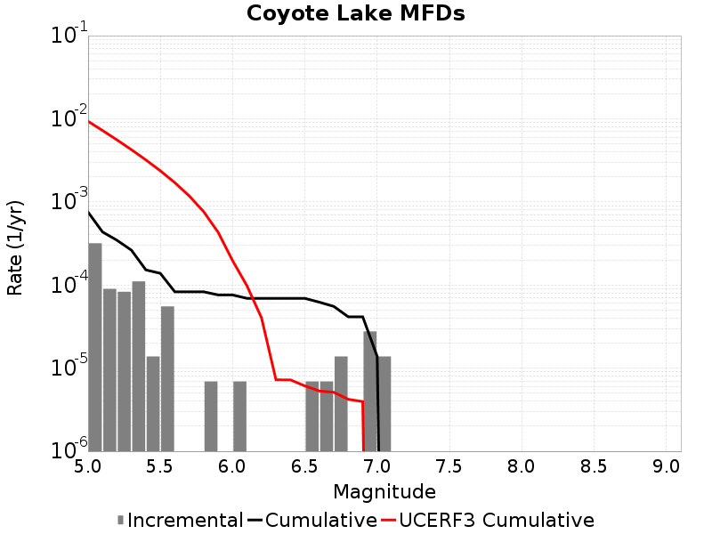

| Magnitude | Incremental Rate | Cumulative Rate | UCERF3 Cumulative Rate |
|-----|-----|-----|-----|
| 5.05 | 3.178278E-4 | 7.945695E-4 | 0.009323687 |
| 5.15 | 8.98209E-5 | 4.767417E-4 | 0.0072311196 |
| 5.25 | 8.2911596E-5 | 3.869208E-4 | 0.0055689337 |
| 5.35 | 1.105488E-4 | 3.0400918E-4 | 0.004248613 |
| 5.45 | 1.38186E-5 | 1.934604E-4 | 0.0031998446 |
| 5.55 | 5.52744E-5 | 1.796418E-4 | 0.0023667784 |
| 5.65 | 6.9093E-6 | 1.243674E-4 | 0.0017050505 |
| 5.75 | 6.9093E-6 | 1.174581E-4 | 0.0011794212 |
| 5.85 | 6.9093E-6 | 1.105488E-4 | 7.6189905E-4 |
| 5.95 | 0.0 | 1.036395E-4 | 4.3024943E-4 |
| 6.05 | 6.9093E-6 | 1.036395E-4 | 1.9608026E-4 |
| 6.15 | 0.0 | 9.67302E-5 | 9.729074E-5 |
| 6.25 | 0.0 | 9.67302E-5 | 4.020683E-5 |
| 6.35 | 0.0 | 9.67302E-5 | 7.231951E-6 |
| 6.45 | 0.0 | 9.67302E-5 | 7.229863E-6 |
| 6.55 | 6.9093E-6 | 9.67302E-5 | 6.112142E-6 |
| 6.65 | 6.9093E-6 | 8.98209E-5 | 5.309038E-6 |
| 6.75 | 1.38186E-5 | 8.2911596E-5 | 5.12124E-6 |
| 6.85 | 0.0 | 6.9092996E-5 | 4.219394E-6 |
| 6.95 | 2.76372E-5 | 6.9092996E-5 | 3.959554E-6 |
| 7.05 | 1.38186E-5 | 4.1455798E-5 | 0.0 |
| 7.15 | 6.9093E-6 | 2.76372E-5 | 0.0 |
| 7.25 | 0.0 | 2.0727899E-5 | 0.0 |
| 7.35 | 2.0727899E-5 | 2.0727899E-5 | 0.0 |

### Cucamonga
*[(top)](#table-of-contents)*

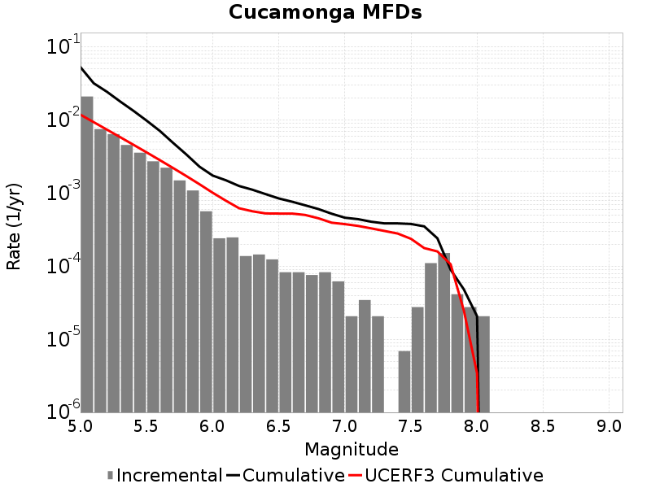

| Magnitude | Incremental Rate | Cumulative Rate | UCERF3 Cumulative Rate |
|-----|-----|-----|-----|
| 5.05 | 0.02111482 | 0.05962035 | 0.011892117 |
| 5.15 | 0.007565683 | 0.038505528 | 0.009406889 |
| 5.25 | 0.006453286 | 0.030939845 | 0.0074328026 |
| 5.35 | 0.0045808656 | 0.024486559 | 0.0058647296 |
| 5.45 | 0.003592836 | 0.019905694 | 0.0046191653 |
| 5.55 | 0.0027360828 | 0.016312856 | 0.0036297785 |
| 5.65 | 0.002238613 | 0.013576774 | 0.0028438806 |
| 5.75 | 0.0015131367 | 0.011338161 | 0.0022196195 |
| 5.85 | 0.0012713112 | 0.009825025 | 0.0017237514 |
| 5.95 | 8.7748107E-4 | 0.008553714 | 0.0013298694 |
| 6.05 | 5.665626E-4 | 0.007676232 | 0.0010169977 |
| 6.15 | 6.0801837E-4 | 0.0071096695 | 7.90781E-4 |
| 6.25 | 3.592836E-4 | 0.0065016514 | 6.2361936E-4 |
| 6.35 | 4.0764868E-4 | 0.0061423676 | 5.670702E-4 |
| 6.45 | 2.694627E-4 | 0.005734719 | 5.299707E-4 |
| 6.55 | 2.694627E-4 | 0.005465256 | 5.2775675E-4 |
| 6.65 | 3.0400918E-4 | 0.0051957937 | 5.2775675E-4 |
| 6.75 | 4.214673E-4 | 0.0048917844 | 5.047307E-4 |
| 6.85 | 4.283766E-4 | 0.004470317 | 4.5453312E-4 |
| 6.95 | 2.210976E-4 | 0.0040419404 | 3.9561075E-4 |
| 7.05 | 7.6002296E-5 | 0.0038208428 | 3.7809162E-4 |
| 7.15 | 4.83651E-5 | 0.0037448406 | 3.5730976E-4 |
| 7.25 | 1.105488E-4 | 0.0036964754 | 3.305104E-4 |
| 7.35 | 8.98209E-5 | 0.0035859267 | 3.0481644E-4 |
| 7.45 | 6.9092996E-5 | 0.0034961058 | 2.8082434E-4 |
| 7.55 | 3.0400918E-4 | 0.0034270128 | 2.3806644E-4 |
| 7.65 | 0.0013127669 | 0.0031230035 | 1.7780023E-4 |
| 7.75 | 0.0011814903 | 0.0018102366 | 1.5986666E-4 |
| 7.85 | 4.283766E-4 | 6.287463E-4 | 1.0661637E-4 |
| 7.95 | 1.6582319E-4 | 2.003697E-4 | 2.4792564E-5 |
| 8.05 | 3.4546498E-5 | 3.4546498E-5 | 3.42004E-6 |

### Davis Creek
*[(top)](#table-of-contents)*

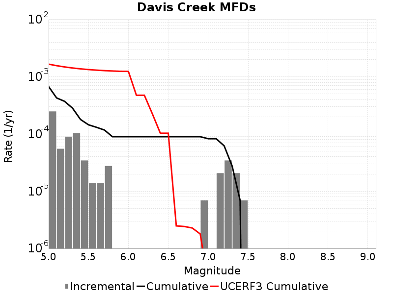

| Magnitude | Incremental Rate | Cumulative Rate | UCERF3 Cumulative Rate |
|-----|-----|-----|-----|
| 5.05 | 2.487348E-4 | 6.771114E-4 | 0.0016660118 |
| 5.15 | 5.52744E-5 | 4.283766E-4 | 0.0015679622 |
| 5.25 | 8.98209E-5 | 3.731022E-4 | 0.0014900786 |
| 5.35 | 1.036395E-4 | 2.832813E-4 | 0.0014282136 |
| 5.45 | 3.4546498E-5 | 1.796418E-4 | 0.0013790723 |
| 5.55 | 1.38186E-5 | 1.450953E-4 | 0.0013400381 |
| 5.65 | 1.38186E-5 | 1.312767E-4 | 0.0013090321 |
| 5.75 | 2.76372E-5 | 1.174581E-4 | 0.0012844031 |
| 5.85 | 0.0 | 8.98209E-5 | 0.0012648397 |
| 5.95 | 0.0 | 8.98209E-5 | 0.0012493 |
| 6.05 | 0.0 | 8.98209E-5 | 0.0012443624 |
| 6.15 | 0.0 | 8.98209E-5 | 4.7656993E-4 |
| 6.25 | 0.0 | 8.98209E-5 | 4.7656993E-4 |
| 6.35 | 0.0 | 8.98209E-5 | 2.2626201E-4 |
| 6.45 | 0.0 | 8.98209E-5 | 1.0347793E-4 |
| 6.55 | 0.0 | 8.98209E-5 | 1.0343449E-4 |
| 6.65 | 0.0 | 8.98209E-5 | 2.4800272E-6 |
| 6.75 | 0.0 | 8.98209E-5 | 2.4218937E-6 |
| 6.85 | 0.0 | 8.98209E-5 | 2.2785641E-6 |
| 6.95 | 6.9093E-6 | 8.98209E-5 | 1.7933177E-6 |
| 7.05 | 0.0 | 8.2911596E-5 | 2.5764598E-7 |
| 7.15 | 2.0727899E-5 | 8.2911596E-5 | 0.0 |
| 7.25 | 3.4546498E-5 | 6.21837E-5 | 0.0 |
| 7.35 | 2.0727899E-5 | 2.76372E-5 | 0.0 |
| 7.45 | 6.9093E-6 | 6.9093E-6 | 0.0 |

### Death Valley (Black Mtns Frontal)
*[(top)](#table-of-contents)*

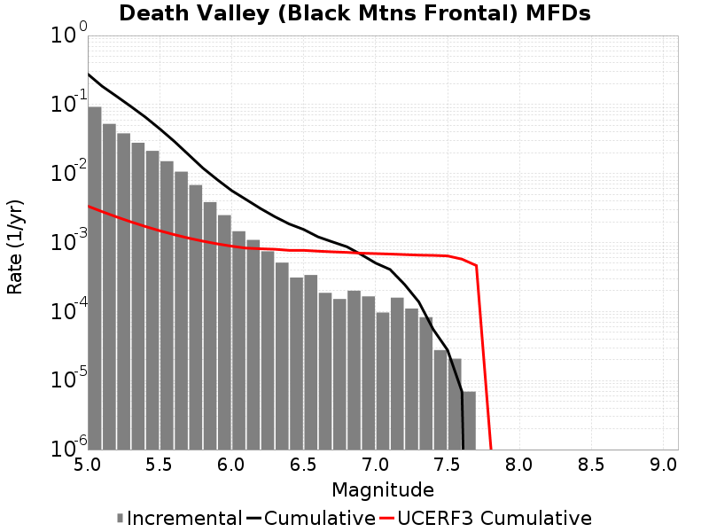

| Magnitude | Incremental Rate | Cumulative Rate | UCERF3 Cumulative Rate |
|-----|-----|-----|-----|
| 5.05 | 0.092453346 | 0.27888006 | 0.003376087 |
| 5.15 | 0.05242086 | 0.18642673 | 0.0028069706 |
| 5.25 | 0.03818079 | 0.13400587 | 0.0023549055 |
| 5.35 | 0.027906662 | 0.09582508 | 0.0019958173 |
| 5.45 | 0.021294462 | 0.06791842 | 0.0017105833 |
| 5.55 | 0.015089911 | 0.046623956 | 0.0014840141 |
| 5.65 | 0.010792326 | 0.031534046 | 0.0013040437 |
| 5.75 | 0.007144216 | 0.020741718 | 0.0011610881 |
| 5.85 | 0.0045117727 | 0.013597502 | 0.0010475344 |
| 5.95 | 0.0028949967 | 0.00908573 | 9.573356E-4 |
| 6.05 | 0.0015753204 | 0.0061907326 | 8.8568806E-4 |
| 6.15 | 0.0011331252 | 0.0046154126 | 8.3111424E-4 |
| 6.25 | 7.876602E-4 | 0.003482287 | 8.130316E-4 |
| 6.35 | 5.320161E-4 | 0.002694627 | 7.996515E-4 |
| 6.45 | 3.247371E-4 | 0.0021626109 | 7.709408E-4 |
| 6.55 | 3.661929E-4 | 0.0018378737 | 7.709408E-4 |
| 6.65 | 2.07279E-4 | 0.0014716808 | 7.505249E-4 |
| 6.75 | 1.589139E-4 | 0.0012644018 | 7.334643E-4 |
| 6.85 | 2.003697E-4 | 0.0011054879 | 7.204616E-4 |
| 6.95 | 1.727325E-4 | 9.051183E-4 | 7.0143107E-4 |
| 7.05 | 1.589139E-4 | 7.323858E-4 | 6.9191994E-4 |
| 7.15 | 1.934604E-4 | 5.734719E-4 | 6.8172516E-4 |
| 7.25 | 1.5200459E-4 | 3.800115E-4 | 6.693652E-4 |
| 7.35 | 8.98209E-5 | 2.280069E-4 | 6.575006E-4 |
| 7.45 | 5.52744E-5 | 1.3818599E-4 | 6.515964E-4 |
| 7.55 | 6.21837E-5 | 8.2911596E-5 | 6.4007204E-4 |
| 7.65 | 1.38186E-5 | 2.0727899E-5 | 5.748534E-4 |
| 7.75 | 0.0 | 6.9093E-6 | 4.6411666E-4 |
| 7.85 | 6.9093E-6 | 6.9093E-6 | 1.1175662E-6 |
| 7.95 | 0.0 | 0.0 | 3.6808274E-9 |

### Death Valley (Fish Lake Valley)
*[(top)](#table-of-contents)*

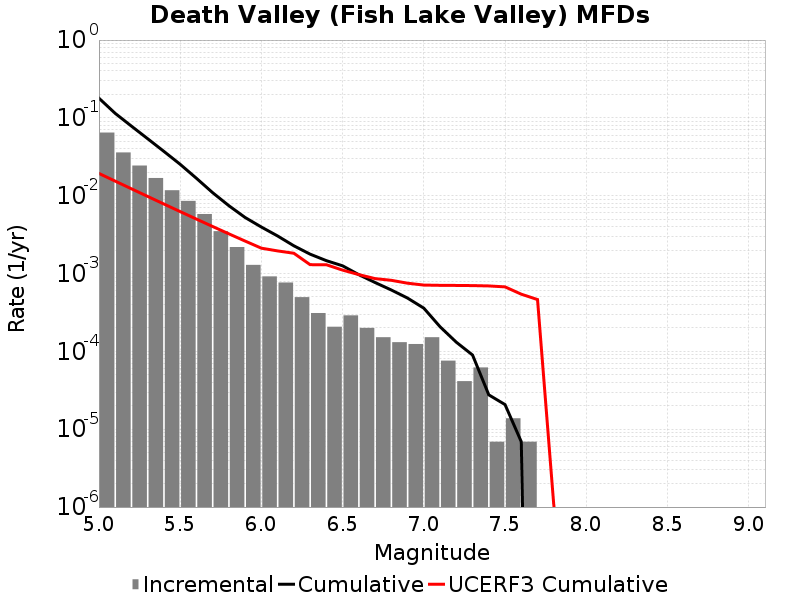

| Magnitude | Incremental Rate | Cumulative Rate | UCERF3 Cumulative Rate |
|-----|-----|-----|-----|
| 5.05 | 0.06476778 | 0.17939307 | 0.019337835 |
| 5.15 | 0.035969816 | 0.11462528 | 0.015402874 |
| 5.25 | 0.024410557 | 0.07865547 | 0.012277223 |
| 5.35 | 0.01688633 | 0.054244913 | 0.009794431 |
| 5.45 | 0.011759629 | 0.037358586 | 0.007822278 |
| 5.55 | 0.008581351 | 0.025598956 | 0.006255742 |
| 5.65 | 0.0058314493 | 0.017017605 | 0.005011398 |
| 5.75 | 0.0035306523 | 0.011186156 | 0.0040229806 |
| 5.85 | 0.002259341 | 0.007655504 | 0.0032378526 |
| 5.95 | 0.0013196763 | 0.005396163 | 0.0026142034 |
| 6.05 | 9.465741E-4 | 0.004076487 | 0.002118821 |
| 6.15 | 7.807509E-4 | 0.0031299128 | 0.0019541914 |
| 6.25 | 5.0437887E-4 | 0.002349162 | 0.0018234215 |
| 6.35 | 3.247371E-4 | 0.0018447831 | 0.0013005447 |
| 6.45 | 2.07279E-4 | 0.001520046 | 0.0012981286 |
| 6.55 | 2.901906E-4 | 0.0013127669 | 0.0011074145 |
| 6.65 | 2.003697E-4 | 0.0010225764 | 9.693432E-4 |
| 6.75 | 1.6582319E-4 | 8.2220667E-4 | 8.6124765E-4 |
| 6.85 | 1.312767E-4 | 6.5638346E-4 | 8.189853E-4 |
| 6.95 | 1.243674E-4 | 5.251068E-4 | 7.517743E-4 |
| 7.05 | 1.5200459E-4 | 4.007394E-4 | 7.113362E-4 |
| 7.15 | 7.6002296E-5 | 2.487348E-4 | 7.058973E-4 |
| 7.25 | 4.83651E-5 | 1.727325E-4 | 7.036652E-4 |
| 7.35 | 6.21837E-5 | 1.243674E-4 | 7.005397E-4 |
| 7.45 | 1.38186E-5 | 6.21837E-5 | 6.93288E-4 |
| 7.55 | 4.1455798E-5 | 4.83651E-5 | 6.745695E-4 |
| 7.65 | 6.9093E-6 | 6.9093E-6 | 5.4325466E-4 |
| 7.75 | 0.0 | 0.0 | 4.6359075E-4 |
| 7.85 | 0.0 | 0.0 | 1.0851867E-6 |
| 7.95 | 0.0 | 0.0 | 3.6808274E-9 |

### Death Valley (No)
*[(top)](#table-of-contents)*

| Magnitude | Incremental Rate | Cumulative Rate | UCERF3 Cumulative Rate |
|-----|-----|-----|-----|
| 5.05 | 0.0947265 | 0.32339668 | 0.010977194 |
| 5.15 | 0.049968056 | 0.2286702 | 0.008744703 |
| 5.25 | 0.043196943 | 0.17870213 | 0.0069713728 |
| 5.35 | 0.035541438 | 0.13550518 | 0.0055627665 |
| 5.45 | 0.02921943 | 0.099963754 | 0.004443871 |
| 5.55 | 0.023560712 | 0.07074432 | 0.0035551004 |
| 5.65 | 0.01697615 | 0.04718361 | 0.0028491248 |
| 5.75 | 0.011497075 | 0.030207459 | 0.0022883487 |
| 5.85 | 0.0073584043 | 0.018710384 | 0.0018429082 |
| 5.95 | 0.0043390403 | 0.011351979 | 0.0014890824 |
| 6.05 | 0.002093518 | 0.0070129395 | 0.0012080284 |
| 6.15 | 0.0012298553 | 0.0049194214 | 0.0011125436 |
| 6.25 | 7.323858E-4 | 0.0036895662 | 0.0010372188 |
| 6.35 | 6.6329277E-4 | 0.0029571804 | 9.865968E-4 |
| 6.45 | 2.418255E-4 | 0.0022938875 | 9.847495E-4 |
| 6.55 | 1.865511E-4 | 0.002052062 | 9.43985E-4 |
| 6.65 | 1.589139E-4 | 0.001865511 | 9.195332E-4 |
| 6.75 | 1.243674E-4 | 0.001706597 | 8.71744E-4 |
| 6.85 | 1.450953E-4 | 0.0015822296 | 8.600054E-4 |
| 6.95 | 1.174581E-4 | 0.0014371343 | 8.414679E-4 |
| 7.05 | 2.7637198E-4 | 0.0013196763 | 8.349729E-4 |
| 7.15 | 2.418255E-4 | 0.0010433043 | 8.2556414E-4 |
| 7.25 | 3.109185E-4 | 8.014788E-4 | 8.1876287E-4 |
| 7.35 | 1.727325E-4 | 4.905603E-4 | 7.8959484E-4 |
| 7.45 | 1.796418E-4 | 3.178278E-4 | 7.6926965E-4 |
| 7.55 | 1.243674E-4 | 1.3818599E-4 | 7.4253295E-4 |
| 7.65 | 1.38186E-5 | 1.38186E-5 | 5.748078E-4 |
| 7.75 | 0.0 | 0.0 | 4.6411666E-4 |
| 7.85 | 0.0 | 0.0 | 1.1175662E-6 |
| 7.95 | 0.0 | 0.0 | 3.6808274E-9 |

### Death Valley (So)
*[(top)](#table-of-contents)*

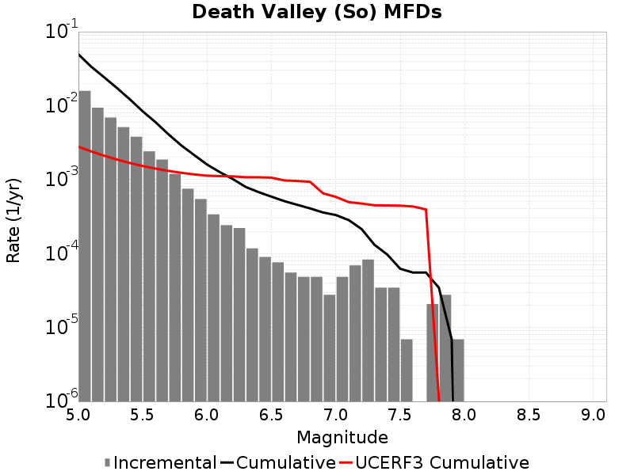

| Magnitude | Incremental Rate | Cumulative Rate | UCERF3 Cumulative Rate |
|-----|-----|-----|-----|
| 5.05 | 0.015856843 | 0.050175335 | 0.0027838547 |
| 5.15 | 0.009382829 | 0.03431849 | 0.002405313 |
| 5.25 | 0.006895481 | 0.024935663 | 0.002104627 |
| 5.35 | 0.0051267007 | 0.018040182 | 0.0018657832 |
| 5.45 | 0.0038001148 | 0.012913481 | 0.001676063 |
| 5.55 | 0.0024251642 | 0.009113367 | 0.001525363 |
| 5.65 | 0.0018931482 | 0.0066882023 | 0.0014056576 |
| 5.75 | 0.0013058577 | 0.004795054 | 0.0013105723 |
| 5.85 | 8.98209E-4 | 0.0034891965 | 0.0012350433 |
| 5.95 | 6.425649E-4 | 0.0025909874 | 0.0011750485 |
| 6.05 | 3.661929E-4 | 0.0019484225 | 0.0011306084 |
| 6.15 | 2.625534E-4 | 0.0015822296 | 0.0011149687 |
| 6.25 | 2.556441E-4 | 0.0013196763 | 0.0011042939 |
| 6.35 | 1.174581E-4 | 0.0010640322 | 0.0010755563 |
| 6.45 | 1.174581E-4 | 9.465741E-4 | 0.0010755563 |
| 6.55 | 8.98209E-5 | 8.29116E-4 | 0.0010613173 |
| 6.65 | 6.21837E-5 | 7.392951E-4 | 9.745384E-4 |
| 6.75 | 4.83651E-5 | 6.771114E-4 | 9.567418E-4 |
| 6.85 | 4.83651E-5 | 6.287463E-4 | 9.32848E-4 |
| 6.95 | 7.6002296E-5 | 5.803812E-4 | 6.528996E-4 |
| 7.05 | 1.036395E-4 | 5.0437887E-4 | 5.8306E-4 |
| 7.15 | 1.036395E-4 | 4.007394E-4 | 4.958478E-4 |
| 7.25 | 1.105488E-4 | 2.970999E-4 | 4.7430606E-4 |
| 7.35 | 5.52744E-5 | 1.865511E-4 | 4.4929868E-4 |
| 7.45 | 4.83651E-5 | 1.312767E-4 | 4.4704883E-4 |
| 7.55 | 2.0727899E-5 | 8.2911596E-5 | 4.4431223E-4 |
| 7.65 | 0.0 | 6.21837E-5 | 4.3255402E-4 |
| 7.75 | 2.76372E-5 | 6.21837E-5 | 3.9477335E-4 |
| 7.85 | 2.76372E-5 | 3.4546498E-5 | 1.1175662E-6 |
| 7.95 | 6.9093E-6 | 6.9093E-6 | 3.6808274E-9 |

### Deep Springs
*[(top)](#table-of-contents)*

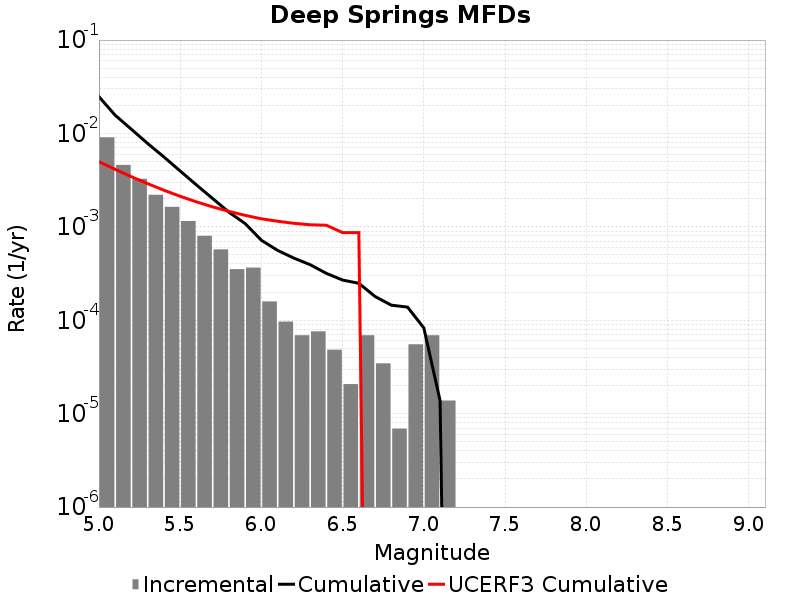

| Magnitude | Incremental Rate | Cumulative Rate | UCERF3 Cumulative Rate |
|-----|-----|-----|-----|
| 5.05 | 0.00908573 | 0.02476293 | 0.004987703 |
| 5.15 | 0.0046015936 | 0.0156772 | 0.0041266656 |
| 5.25 | 0.003268099 | 0.0110756075 | 0.0034427193 |
| 5.35 | 0.0022040666 | 0.007807509 | 0.0028994414 |
| 5.45 | 0.0016375041 | 0.0056034424 | 0.0024679005 |
| 5.55 | 0.0011538531 | 0.003965938 | 0.0021251151 |
| 5.65 | 8.014788E-4 | 0.002812085 | 0.0018528312 |
| 5.75 | 5.734719E-4 | 0.0020106062 | 0.0016365484 |
| 5.85 | 3.523743E-4 | 0.0014371343 | 0.0014647489 |
| 5.95 | 3.661929E-4 | 0.0010847601 | 0.0013282836 |
| 6.05 | 1.589139E-4 | 7.185672E-4 | 0.0012198854 |
| 6.15 | 9.67302E-5 | 5.596533E-4 | 0.0011484778 |
| 6.25 | 6.9092996E-5 | 4.6292308E-4 | 0.001091757 |
| 6.35 | 7.6002296E-5 | 3.938301E-4 | 0.0010528838 |
| 6.45 | 4.83651E-5 | 3.178278E-4 | 0.0010405326 |
| 6.55 | 2.0727899E-5 | 2.694627E-4 | 8.677443E-4 |
| 6.65 | 6.9092996E-5 | 2.487348E-4 | 8.677443E-4 |
| 6.75 | 3.4546498E-5 | 1.796418E-4 | 0.0 |
| 6.85 | 6.9093E-6 | 1.450953E-4 | 0.0 |
| 6.95 | 5.52744E-5 | 1.3818599E-4 | 0.0 |
| 7.05 | 6.9092996E-5 | 8.2911596E-5 | 0.0 |
| 7.15 | 1.38186E-5 | 1.38186E-5 | 0.0 |

### Del Valle
*[(top)](#table-of-contents)*

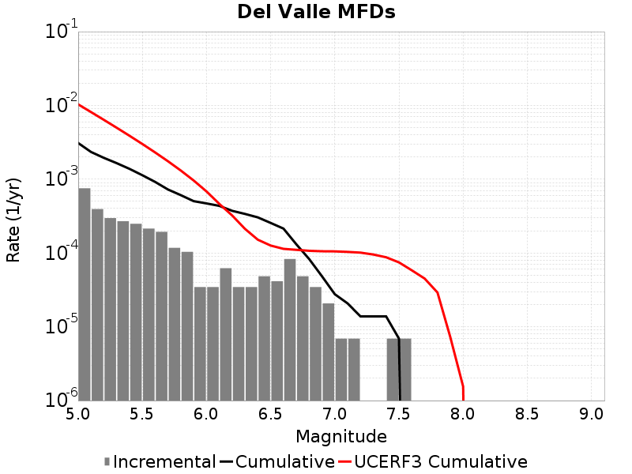

| Magnitude | Incremental Rate | Cumulative Rate | UCERF3 Cumulative Rate |
|-----|-----|-----|-----|
| 5.05 | 7.531137E-4 | 0.0033026454 | 0.010339056 |
| 5.15 | 3.938301E-4 | 0.0025495316 | 0.008132448 |
| 5.25 | 2.970999E-4 | 0.0021557016 | 0.006379678 |
| 5.35 | 2.694627E-4 | 0.0018586017 | 0.004987403 |
| 5.45 | 2.487348E-4 | 0.001589139 | 0.0038814791 |
| 5.55 | 2.141883E-4 | 0.0013404042 | 0.0030030129 |
| 5.65 | 1.934604E-4 | 0.0011262159 | 0.0023052222 |
| 5.75 | 1.174581E-4 | 9.327555E-4 | 0.0017509476 |
| 5.85 | 1.036395E-4 | 8.1529736E-4 | 0.0013106714 |
| 5.95 | 6.9092996E-5 | 7.1165786E-4 | 9.6094765E-4 |
| 6.05 | 6.9092996E-5 | 6.425649E-4 | 6.8315223E-4 |
| 6.15 | 8.2911596E-5 | 5.734719E-4 | 4.6312375E-4 |
| 6.25 | 5.52744E-5 | 4.905603E-4 | 3.2275167E-4 |
| 6.35 | 4.1455798E-5 | 4.3528588E-4 | 2.1234198E-4 |
| 6.45 | 6.21837E-5 | 3.938301E-4 | 1.515022E-4 |
| 6.55 | 4.83651E-5 | 3.3164638E-4 | 1.2620934E-4 |
| 6.65 | 8.98209E-5 | 2.832813E-4 | 1.1386139E-4 |
| 6.75 | 5.52744E-5 | 1.934604E-4 | 1.1041064E-4 |
| 6.85 | 5.52744E-5 | 1.3818599E-4 | 1.0712946E-4 |
| 6.95 | 3.4546498E-5 | 8.2911596E-5 | 1.0561199E-4 |
| 7.05 | 2.76372E-5 | 4.83651E-5 | 1.05218875E-4 |
| 7.15 | 6.9093E-6 | 2.0727899E-5 | 1.0351951E-4 |
| 7.25 | 0.0 | 1.38186E-5 | 1.0119088E-4 |
| 7.35 | 0.0 | 1.38186E-5 | 9.538756E-5 |
| 7.45 | 6.9093E-6 | 1.38186E-5 | 8.752637E-5 |
| 7.55 | 6.9093E-6 | 6.9093E-6 | 7.459596E-5 |
| 7.65 | 0.0 | 0.0 | 5.825307E-5 |
| 7.75 | 0.0 | 0.0 | 4.5058678E-5 |
| 7.85 | 0.0 | 0.0 | 2.9157374E-5 |
| 7.95 | 0.0 | 0.0 | 7.2388475E-6 |
| 8.05 | 0.0 | 0.0 | 1.5472061E-6 |

### Dog Valley
*[(top)](#table-of-contents)*

| Magnitude | Incremental Rate | Cumulative Rate | UCERF3 Cumulative Rate |
|-----|-----|-----|-----|
| 5.05 | 0.0 | 4.1455798E-5 | 0.010956406 |
| 5.15 | 0.0 | 4.1455798E-5 | 0.008549861 |
| 5.25 | 0.0 | 4.1455798E-5 | 0.0066382736 |
| 5.35 | 0.0 | 4.1455798E-5 | 0.005119846 |
| 5.45 | 0.0 | 4.1455798E-5 | 0.003913717 |
| 5.55 | 0.0 | 4.1455798E-5 | 0.002955654 |
| 5.65 | 0.0 | 4.1455798E-5 | 0.0021946377 |
| 5.75 | 0.0 | 4.1455798E-5 | 0.0015901409 |
| 5.85 | 0.0 | 4.1455798E-5 | 0.001109972 |
| 5.95 | 0.0 | 4.1455798E-5 | 7.2856026E-4 |
| 6.05 | 0.0 | 4.1455798E-5 | 4.2559422E-4 |
| 6.15 | 0.0 | 4.1455798E-5 | 1.8493972E-4 |
| 6.25 | 0.0 | 4.1455798E-5 | 1.07679145E-4 |
| 6.35 | 0.0 | 4.1455798E-5 | 4.630889E-5 |
| 6.45 | 0.0 | 4.1455798E-5 | 7.993664E-6 |
| 6.55 | 0.0 | 4.1455798E-5 | 7.727325E-6 |
| 6.65 | 0.0 | 4.1455798E-5 | 6.695984E-6 |
| 6.75 | 0.0 | 4.1455798E-5 | 6.695984E-6 |
| 6.85 | 0.0 | 4.1455798E-5 | 4.0839645E-6 |
| 6.95 | 0.0 | 4.1455798E-5 | 3.7326656E-6 |
| 7.05 | 0.0 | 4.1455798E-5 | 2.6888263E-6 |
| 7.15 | 0.0 | 4.1455798E-5 | 1.6035956E-6 |
| 7.25 | 4.1455798E-5 | 4.1455798E-5 | 0.0 |

### Dry Mountain
*[(top)](#table-of-contents)*

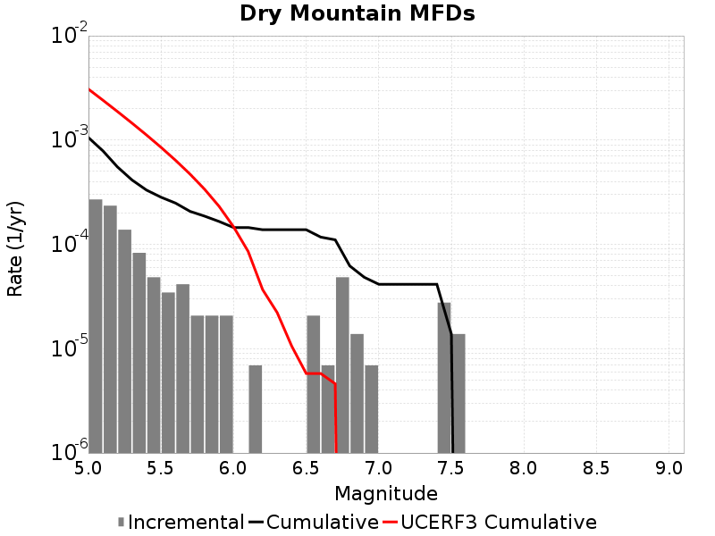

| Magnitude | Incremental Rate | Cumulative Rate | UCERF3 Cumulative Rate |
|-----|-----|-----|-----|
| 5.05 | 2.694627E-4 | 0.0012574926 | 0.0030806246 |
| 5.15 | 2.349162E-4 | 9.880299E-4 | 0.0024102665 |
| 5.25 | 1.3818599E-4 | 7.531137E-4 | 0.0018777823 |
| 5.35 | 8.2911596E-5 | 6.149277E-4 | 0.0014548149 |
| 5.45 | 4.83651E-5 | 5.320161E-4 | 0.0011188401 |
| 5.55 | 3.4546498E-5 | 4.83651E-4 | 8.5196574E-4 |
| 5.65 | 4.1455798E-5 | 4.491045E-4 | 6.399799E-4 |
| 5.75 | 2.0727899E-5 | 4.0764868E-4 | 4.7159358E-4 |
| 5.85 | 4.1455798E-5 | 3.869208E-4 | 3.3783956E-4 |
| 5.95 | 2.0727899E-5 | 3.45465E-4 | 2.3159497E-4 |
| 6.05 | 0.0 | 3.247371E-4 | 1.4720189E-4 |
| 6.15 | 1.38186E-5 | 3.247371E-4 | 8.5673106E-5 |
| 6.25 | 6.9093E-6 | 3.109185E-4 | 3.6799054E-5 |
| 6.35 | 2.0727899E-5 | 3.0400918E-4 | 2.2196828E-5 |
| 6.45 | 0.0 | 2.832813E-4 | 1.0597867E-5 |
| 6.55 | 2.76372E-5 | 2.832813E-4 | 5.78073E-6 |
| 6.65 | 1.38186E-5 | 2.556441E-4 | 5.78073E-6 |
| 6.75 | 4.83651E-5 | 2.418255E-4 | 4.6069417E-6 |
| 6.85 | 2.0727899E-5 | 1.934604E-4 | 0.0 |
| 6.95 | 1.38186E-5 | 1.727325E-4 | 0.0 |
| 7.05 | 0.0 | 1.589139E-4 | 0.0 |
| 7.15 | 0.0 | 1.589139E-4 | 0.0 |
| 7.25 | 0.0 | 1.589139E-4 | 0.0 |
| 7.35 | 2.0727899E-5 | 1.589139E-4 | 0.0 |
| 7.45 | 1.105488E-4 | 1.3818599E-4 | 0.0 |
| 7.55 | 2.76372E-5 | 2.76372E-5 | 0.0 |

### Earthquake Valley
*[(top)](#table-of-contents)*

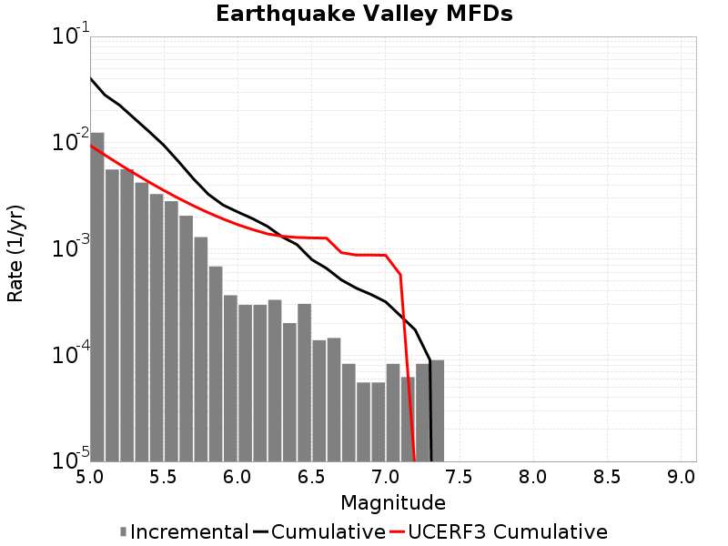

| Magnitude | Incremental Rate | Cumulative Rate | UCERF3 Cumulative Rate |
|-----|-----|-----|-----|
| 5.05 | 0.012422921 | 0.041614715 | 0.009423211 |
| 5.15 | 0.0055896235 | 0.029191792 | 0.0076564937 |
| 5.25 | 0.0056103515 | 0.023602169 | 0.00625314 |
| 5.35 | 0.004207764 | 0.017991817 | 0.005138417 |
| 5.45 | 0.0032819174 | 0.013784054 | 0.004252961 |
| 5.55 | 0.002812085 | 0.010502135 | 0.003549618 |
| 5.65 | 0.0021487924 | 0.0076900506 | 0.002990933 |
| 5.75 | 0.001450953 | 0.0055412585 | 0.0025471535 |
| 5.85 | 0.0010087577 | 0.0040903054 | 0.002194647 |
| 5.95 | 5.596533E-4 | 0.0030815478 | 0.0019146412 |
| 6.05 | 3.869208E-4 | 0.0025218944 | 0.0016922494 |
| 6.15 | 3.592836E-4 | 0.0021349736 | 0.0015216572 |
| 6.25 | 3.731022E-4 | 0.0017756901 | 0.0013861511 |
| 6.35 | 2.003697E-4 | 0.0014025879 | 0.0013162394 |
| 6.45 | 3.109185E-4 | 0.0012022182 | 0.0012828525 |
| 6.55 | 1.450953E-4 | 8.912997E-4 | 0.0012709824 |
| 6.65 | 1.5200459E-4 | 7.462044E-4 | 0.0012632544 |
| 6.75 | 1.036395E-4 | 5.941998E-4 | 9.226661E-4 |
| 6.85 | 8.2911596E-5 | 4.905603E-4 | 8.767123E-4 |
| 6.95 | 8.2911596E-5 | 4.0764868E-4 | 8.767123E-4 |
| 7.05 | 8.2911596E-5 | 3.247371E-4 | 8.707961E-4 |
| 7.15 | 6.9092996E-5 | 2.418255E-4 | 5.709969E-4 |
| 7.25 | 8.2911596E-5 | 1.727325E-4 | 8.06154E-6 |
| 7.35 | 8.98209E-5 | 8.98209E-5 | 7.967155E-6 |
| 7.45 | 0.0 | 0.0 | 7.821426E-6 |
| 7.55 | 0.0 | 0.0 | 7.5634434E-6 |
| 7.65 | 0.0 | 0.0 | 7.085071E-6 |
| 7.75 | 0.0 | 0.0 | 5.8617985E-7 |
| 7.85 | 0.0 | 0.0 | 7.96519E-8 |
| 7.95 | 0.0 | 0.0 | 4.985984E-9 |

### Earthquake Valley (No  Extension)
*[(top)](#table-of-contents)*

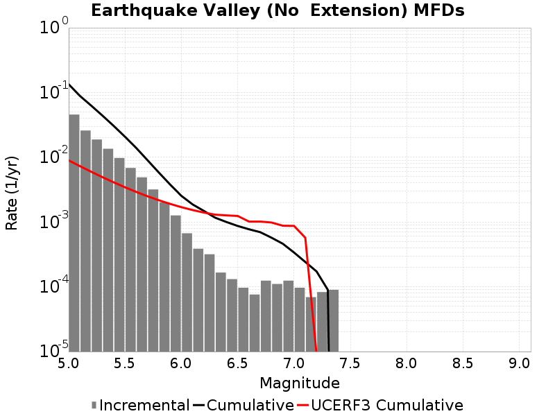

| Magnitude | Incremental Rate | Cumulative Rate | UCERF3 Cumulative Rate |
|-----|-----|-----|-----|
| 5.05 | 0.045670472 | 0.13535318 | 0.008960384 |
| 5.15 | 0.025889147 | 0.08968271 | 0.007300675 |
| 5.25 | 0.018807115 | 0.06379356 | 0.0059823217 |
| 5.35 | 0.013535319 | 0.044986453 | 0.004935116 |
| 5.45 | 0.009749022 | 0.031451132 | 0.0041032913 |
| 5.55 | 0.0068402067 | 0.02170211 | 0.0034425494 |
| 5.65 | 0.0048986934 | 0.014861904 | 0.0029177035 |
| 5.75 | 0.0031851872 | 0.009963211 | 0.0025008034 |
| 5.85 | 0.0021004272 | 0.006778023 | 0.0021696482 |
| 5.95 | 0.0013404042 | 0.004677596 | 0.001906602 |
| 6.05 | 7.462044E-4 | 0.0033371919 | 0.001697657 |
| 6.15 | 4.974696E-4 | 0.0025909874 | 0.0015316862 |
| 6.25 | 3.938301E-4 | 0.002093518 | 0.0013999164 |
| 6.35 | 2.487348E-4 | 0.0016996878 | 0.0012999505 |
| 6.45 | 3.247371E-4 | 0.001450953 | 0.0012667051 |
| 6.55 | 1.727325E-4 | 0.0011262159 | 0.0012421659 |
| 6.65 | 1.727325E-4 | 9.534834E-4 | 0.0010173707 |
| 6.75 | 1.796418E-4 | 7.807509E-4 | 0.0010173707 |
| 6.85 | 1.3818599E-4 | 6.011091E-4 | 9.83276E-4 |
| 6.95 | 1.243674E-4 | 4.6292308E-4 | 8.780534E-4 |
| 7.05 | 9.67302E-5 | 3.385557E-4 | 8.721006E-4 |
| 7.15 | 6.9092996E-5 | 2.418255E-4 | 5.721998E-4 |
| 7.25 | 8.2911596E-5 | 1.727325E-4 | 9.101821E-6 |
| 7.35 | 8.98209E-5 | 8.98209E-5 | 8.877411E-6 |
| 7.45 | 0.0 | 0.0 | 8.426838E-6 |
| 7.55 | 0.0 | 0.0 | 7.8980265E-6 |
| 7.65 | 0.0 | 0.0 | 7.1744435E-6 |
| 7.75 | 0.0 | 0.0 | 6.0208504E-7 |
| 7.85 | 0.0 | 0.0 | 8.606637E-8 |
| 7.95 | 0.0 | 0.0 | 7.006633E-9 |

### Earthquake Valley (So Extension)
*[(top)](#table-of-contents)*

| Magnitude | Incremental Rate | Cumulative Rate | UCERF3 Cumulative Rate |
|-----|-----|-----|-----|
| 5.05 | 0.016001938 | 0.047674168 | 0.007689854 |
| 5.15 | 0.008242795 | 0.03167223 | 0.0063726516 |
| 5.25 | 0.006453286 | 0.023429437 | 0.005326361 |
| 5.35 | 0.004905603 | 0.01697615 | 0.0044952626 |
| 5.45 | 0.0036342917 | 0.012070547 | 0.0038350974 |
| 5.55 | 0.0028811782 | 0.008436255 | 0.0033107097 |
| 5.65 | 0.0020451527 | 0.005555077 | 0.0028941738 |
| 5.75 | 0.0011953089 | 0.0035099243 | 0.0025633078 |
| 5.85 | 6.9093E-4 | 0.0023146155 | 0.0023004913 |
| 5.95 | 2.970999E-4 | 0.0016236855 | 0.0020917288 |
| 6.05 | 2.07279E-4 | 0.0013265855 | 0.0019302301 |
| 6.15 | 1.243674E-4 | 0.0011193065 | 0.0018400184 |
| 6.25 | 1.865511E-4 | 9.949392E-4 | 0.0017683607 |
| 6.35 | 1.105488E-4 | 8.083881E-4 | 0.0010837705 |
| 6.45 | 9.67302E-5 | 6.978393E-4 | 0.0010712331 |
| 6.55 | 6.21837E-5 | 6.011091E-4 | 0.0010644472 |
| 6.65 | 8.98209E-5 | 5.389254E-4 | 0.0010590571 |
| 6.75 | 8.2911596E-5 | 4.491045E-4 | 7.1924226E-4 |
| 6.85 | 4.83651E-5 | 3.661929E-4 | 6.7402335E-4 |
| 6.95 | 4.1455798E-5 | 3.178278E-4 | 6.7402335E-4 |
| 7.05 | 5.52744E-5 | 2.7637198E-4 | 6.7402335E-4 |
| 7.15 | 5.52744E-5 | 2.210976E-4 | 5.6862977E-4 |
| 7.25 | 7.6002296E-5 | 1.6582319E-4 | 5.795268E-6 |
| 7.35 | 8.98209E-5 | 8.98209E-5 | 5.7575016E-6 |
| 7.45 | 0.0 | 0.0 | 5.723871E-6 |
| 7.55 | 0.0 | 0.0 | 5.579003E-6 |
| 7.65 | 0.0 | 0.0 | 5.381095E-6 |
| 7.75 | 0.0 | 0.0 | 4.7837193E-7 |
| 7.85 | 0.0 | 0.0 | 3.3674397E-8 |

### East Huasna 2011 CFM
*[(top)](#table-of-contents)*

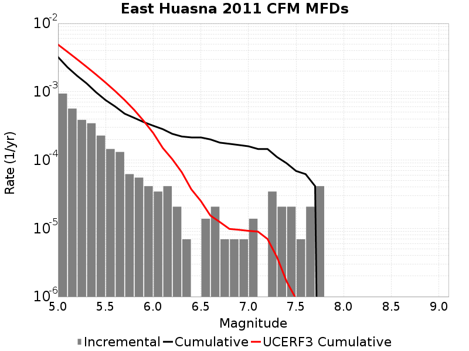

| Magnitude | Incremental Rate | Cumulative Rate | UCERF3 Cumulative Rate |
|-----|-----|-----|-----|
| 5.05 | 9.396648E-4 | 0.0034270128 | 0.004900581 |
| 5.15 | 5.665626E-4 | 0.002487348 | 0.003835341 |
| 5.25 | 3.869208E-4 | 0.0019207854 | 0.0029891902 |
| 5.35 | 3.45465E-4 | 0.0015338645 | 0.0023170689 |
| 5.45 | 2.280069E-4 | 0.0011883996 | 0.001783184 |
| 5.55 | 1.450953E-4 | 9.603927E-4 | 0.0013591041 |
| 5.65 | 1.312767E-4 | 8.1529736E-4 | 0.0010222454 |
| 5.75 | 7.6002296E-5 | 6.840207E-4 | 7.5466913E-4 |
| 5.85 | 6.21837E-5 | 6.0801837E-4 | 5.4212566E-4 |
| 5.95 | 4.1455798E-5 | 5.458347E-4 | 3.7329644E-4 |
| 6.05 | 3.4546498E-5 | 5.0437887E-4 | 2.4845975E-4 |
| 6.15 | 4.83651E-5 | 4.698324E-4 | 1.5031984E-4 |
| 6.25 | 2.0727899E-5 | 4.214673E-4 | 1.0289894E-4 |
| 6.35 | 1.38186E-5 | 4.007394E-4 | 6.620488E-5 |
| 6.45 | 6.9093E-6 | 3.869208E-4 | 3.7263246E-5 |
| 6.55 | 2.0727899E-5 | 3.800115E-4 | 2.50986E-5 |
| 6.65 | 2.0727899E-5 | 3.592836E-4 | 1.5395384E-5 |
| 6.75 | 1.38186E-5 | 3.385557E-4 | 1.2348375E-5 |
| 6.85 | 1.38186E-5 | 3.247371E-4 | 9.804929E-6 |
| 6.95 | 1.38186E-5 | 3.109185E-4 | 9.520643E-6 |
| 7.05 | 2.0727899E-5 | 2.970999E-4 | 9.189699E-6 |
| 7.15 | 0.0 | 2.7637198E-4 | 8.947155E-6 |
| 7.25 | 4.1455798E-5 | 2.7637198E-4 | 6.986416E-6 |
| 7.35 | 2.0727899E-5 | 2.349162E-4 | 3.7752084E-6 |
| 7.45 | 2.76372E-5 | 2.141883E-4 | 1.675962E-6 |
| 7.55 | 2.76372E-5 | 1.865511E-4 | 9.278016E-7 |
| 7.65 | 6.21837E-5 | 1.589139E-4 | 4.7622686E-7 |
| 7.75 | 8.98209E-5 | 9.67302E-5 | 9.620196E-8 |
| 7.85 | 6.9093E-6 | 6.9093E-6 | 1.6957284E-9 |

### Eaton Roughs 2011 CFM
*[(top)](#table-of-contents)*

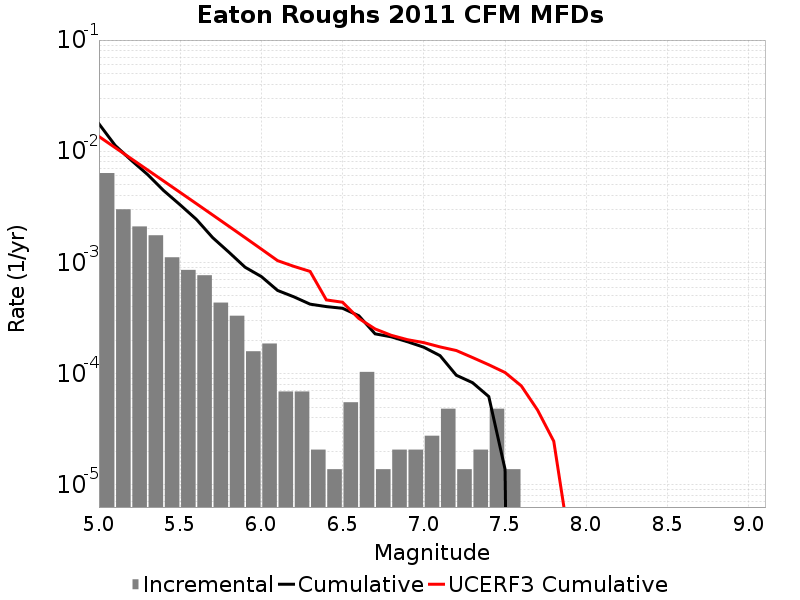

| Magnitude | Incremental Rate | Cumulative Rate | UCERF3 Cumulative Rate |
|-----|-----|-----|-----|
| 5.05 | 0.006363465 | 0.017950362 | 0.013573499 |
| 5.15 | 0.0030055454 | 0.011586896 | 0.010772762 |
| 5.25 | 0.0021073364 | 0.008581351 | 0.008548057 |
| 5.35 | 0.0017549621 | 0.006474014 | 0.006780911 |
| 5.45 | 0.0011123973 | 0.004719052 | 0.0053772167 |
| 5.55 | 8.567532E-4 | 0.0036066545 | 0.004262223 |
| 5.65 | 7.6693227E-4 | 0.0027499013 | 0.003376552 |
| 5.75 | 4.3528588E-4 | 0.001982969 | 0.0026730385 |
| 5.85 | 3.3164638E-4 | 0.0015476831 | 0.002114218 |
| 5.95 | 1.589139E-4 | 0.0012160367 | 0.0016703309 |
| 6.05 | 1.865511E-4 | 0.0010571228 | 0.0013177389 |
| 6.15 | 6.9092996E-5 | 8.7057176E-4 | 0.0010376652 |
| 6.25 | 8.98209E-5 | 8.014788E-4 | 9.220627E-4 |
| 6.35 | 2.0727899E-5 | 7.1165786E-4 | 8.3023653E-4 |
| 6.45 | 1.38186E-5 | 6.9093E-4 | 4.6021063E-4 |
| 6.55 | 5.52744E-5 | 6.771114E-4 | 4.385397E-4 |
| 6.65 | 1.036395E-4 | 6.21837E-4 | 3.133609E-4 |
| 6.75 | 1.38186E-5 | 5.181975E-4 | 2.522909E-4 |
| 6.85 | 3.4546498E-5 | 5.0437887E-4 | 2.2102833E-4 |
| 6.95 | 5.52744E-5 | 4.698324E-4 | 2.0187131E-4 |
| 7.05 | 4.1455798E-5 | 4.14558E-4 | 1.9004781E-4 |
| 7.15 | 6.9092996E-5 | 3.731022E-4 | 1.7388316E-4 |
| 7.25 | 6.9092996E-5 | 3.0400918E-4 | 1.6137565E-4 |
| 7.35 | 4.83651E-5 | 2.349162E-4 | 1.3952285E-4 |
| 7.45 | 1.727325E-4 | 1.865511E-4 | 1.2015535E-4 |
| 7.55 | 1.38186E-5 | 1.38186E-5 | 1.0233904E-4 |
| 7.65 | 0.0 | 0.0 | 7.764877E-5 |
| 7.75 | 0.0 | 0.0 | 4.7085345E-5 |
| 7.85 | 0.0 | 0.0 | 2.4638377E-5 |
| 7.95 | 0.0 | 0.0 | 2.775461E-6 |

### Elmore Ranch
*[(top)](#table-of-contents)*

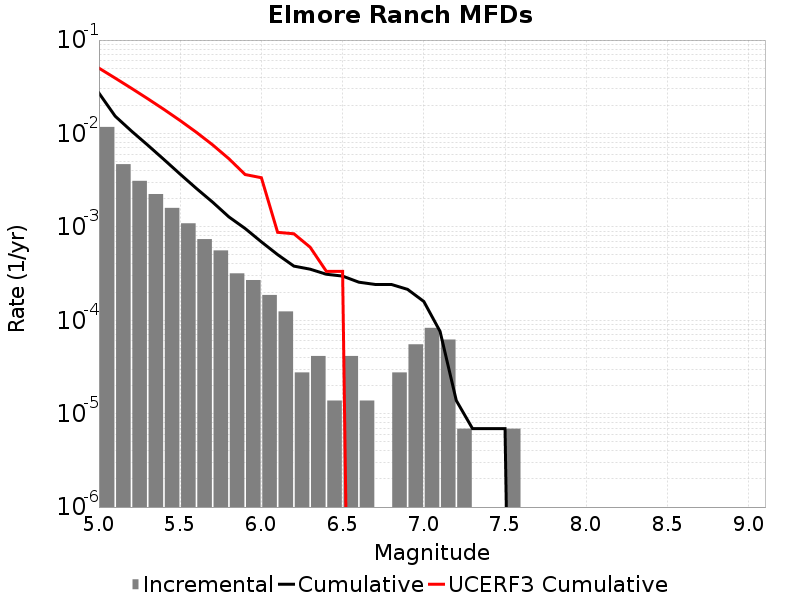

| Magnitude | Incremental Rate | Cumulative Rate | UCERF3 Cumulative Rate |
|-----|-----|-----|-----|
| 5.05 | 0.01174581 | 0.027457558 | 0.05006381 |
| 5.15 | 0.0046914145 | 0.015711747 | 0.03913903 |
| 5.25 | 0.003109185 | 0.0110203335 | 0.030461166 |
| 5.35 | 0.0022455226 | 0.0079111485 | 0.023568094 |
| 5.45 | 0.0015960482 | 0.005665626 | 0.018092731 |
| 5.55 | 0.0010916694 | 0.0040695774 | 0.0137434965 |
| 5.65 | 7.531137E-4 | 0.0029779084 | 0.010288777 |
| 5.75 | 5.734719E-4 | 0.0022247946 | 0.007544595 |
| 5.85 | 3.45465E-4 | 0.0016513227 | 0.0053648143 |
| 5.95 | 3.109185E-4 | 0.0013058577 | 0.0036333527 |
| 6.05 | 2.141883E-4 | 9.949392E-4 | 0.0033584505 |
| 6.15 | 1.450953E-4 | 7.807509E-4 | 8.7375724E-4 |
| 6.25 | 4.1455798E-5 | 6.356556E-4 | 8.4363396E-4 |
| 6.35 | 7.6002296E-5 | 5.941998E-4 | 6.060787E-4 |
| 6.45 | 4.1455798E-5 | 5.181975E-4 | 3.3408208E-4 |
| 6.55 | 6.21837E-5 | 4.767417E-4 | 3.3408208E-4 |
| 6.65 | 2.0727899E-5 | 4.14558E-4 | 0.0 |
| 6.75 | 2.76372E-5 | 3.938301E-4 | 0.0 |
| 6.85 | 7.6002296E-5 | 3.661929E-4 | 0.0 |
| 6.95 | 5.52744E-5 | 2.901906E-4 | 0.0 |
| 7.05 | 1.243674E-4 | 2.349162E-4 | 0.0 |
| 7.15 | 8.98209E-5 | 1.105488E-4 | 0.0 |
| 7.25 | 1.38186E-5 | 2.0727899E-5 | 0.0 |
| 7.35 | 0.0 | 6.9093E-6 | 0.0 |
| 7.45 | 0.0 | 6.9093E-6 | 0.0 |
| 7.55 | 6.9093E-6 | 6.9093E-6 | 0.0 |

### Elysian Park (Lower CFM)
*[(top)](#table-of-contents)*

| Magnitude | Incremental Rate | Cumulative Rate | UCERF3 Cumulative Rate |
|-----|-----|-----|-----|
| 5.05 | 0.0035582895 | 0.013936058 | 0.014854219 |
| 5.15 | 0.0014094972 | 0.010377768 | 0.011626188 |
| 5.25 | 0.001292039 | 0.008968271 | 0.009062071 |
| 5.35 | 0.0010847601 | 0.007676232 | 0.0070253205 |
| 5.45 | 9.120276E-4 | 0.0065914723 | 0.0054074726 |
| 5.55 | 7.392951E-4 | 0.0056794444 | 0.00412237 |
| 5.65 | 5.941998E-4 | 0.0049401494 | 0.0031015768 |
| 5.75 | 5.251068E-4 | 0.0043459497 | 0.002290732 |
| 5.85 | 5.389254E-4 | 0.0038208428 | 0.0016466549 |
| 5.95 | 3.385557E-4 | 0.0032819174 | 0.0011350464 |
| 6.05 | 3.3164638E-4 | 0.0029433616 | 7.391806E-4 |
| 6.15 | 2.141883E-4 | 0.0026117153 | 4.8253292E-4 |
| 6.25 | 1.934604E-4 | 0.002397527 | 2.9045885E-4 |
| 6.35 | 3.109185E-4 | 0.0022040666 | 1.7861628E-4 |
| 6.45 | 2.349162E-4 | 0.0018931482 | 1.1499262E-4 |
| 6.55 | 2.280069E-4 | 0.001658232 | 7.213026E-5 |
| 6.65 | 2.07279E-4 | 0.0014302251 | 4.8018046E-5 |
| 6.75 | 2.003697E-4 | 0.0012229461 | 2.8935869E-5 |
| 6.85 | 2.487348E-4 | 0.0010225764 | 1.9453375E-5 |
| 6.95 | 2.07279E-4 | 7.738416E-4 | 1.1289231E-5 |
| 7.05 | 1.727325E-4 | 5.665626E-4 | 8.500239E-6 |
| 7.15 | 1.105488E-4 | 3.938301E-4 | 6.5157697E-6 |
| 7.25 | 8.98209E-5 | 2.832813E-4 | 5.6433014E-6 |
| 7.35 | 1.3818599E-4 | 1.934604E-4 | 4.8855054E-6 |
| 7.45 | 4.1455798E-5 | 5.52744E-5 | 4.2717465E-6 |
| 7.55 | 1.38186E-5 | 1.38186E-5 | 3.503899E-6 |
| 7.65 | 0.0 | 0.0 | 2.6510718E-6 |
| 7.75 | 0.0 | 0.0 | 1.9627196E-6 |
| 7.85 | 0.0 | 0.0 | 4.4841389E-7 |
| 7.95 | 0.0 | 0.0 | 2.602545E-10 |

### Elysian Park (Upper)
*[(top)](#table-of-contents)*

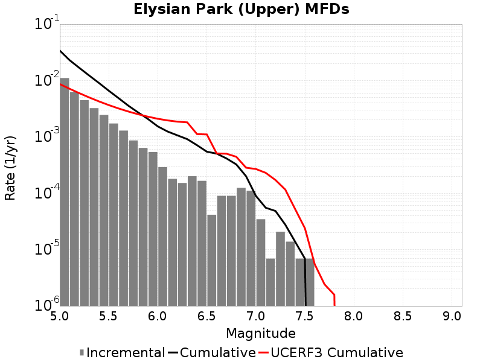

| Magnitude | Incremental Rate | Cumulative Rate | UCERF3 Cumulative Rate |
|-----|-----|-----|-----|
| 5.05 | 0.01105488 | 0.035023242 | 0.008641747 |
| 5.15 | 0.0062598255 | 0.023968361 | 0.0071451324 |
| 5.25 | 0.0044841357 | 0.017708536 | 0.005956329 |
| 5.35 | 0.0032335524 | 0.0132244 | 0.0050120293 |
| 5.45 | 0.0024458922 | 0.009990848 | 0.004261945 |
| 5.55 | 0.001727325 | 0.0075449557 | 0.003666132 |
| 5.65 | 0.001292039 | 0.0058176303 | 0.0031928609 |
| 5.75 | 8.7057176E-4 | 0.0045255916 | 0.0028169283 |
| 5.85 | 6.702021E-4 | 0.0036550197 | 0.0025183144 |
| 5.95 | 5.872905E-4 | 0.0029848176 | 0.002281117 |
| 6.05 | 3.731022E-4 | 0.002397527 | 0.002095232 |
| 6.15 | 2.556441E-4 | 0.002024425 | 0.0019590387 |
| 6.25 | 1.934604E-4 | 0.0017687808 | 0.0018625859 |
| 6.35 | 3.0400918E-4 | 0.0015753204 | 0.0018099557 |
| 6.45 | 2.418255E-4 | 0.0012713112 | 0.0011199442 |
| 6.55 | 1.243674E-4 | 0.0010294857 | 0.0011041015 |
| 6.65 | 1.450953E-4 | 9.051183E-4 | 5.084181E-4 |
| 6.75 | 1.589139E-4 | 7.60023E-4 | 5.025379E-4 |
| 6.85 | 1.450953E-4 | 6.011091E-4 | 4.435982E-4 |
| 6.95 | 1.3818599E-4 | 4.560138E-4 | 2.8379943E-4 |
| 7.05 | 4.1455798E-5 | 3.178278E-4 | 2.6905752E-4 |
| 7.15 | 4.83651E-5 | 2.7637198E-4 | 2.3012927E-4 |
| 7.25 | 5.52744E-5 | 2.280069E-4 | 1.7138367E-4 |
| 7.35 | 8.98209E-5 | 1.727325E-4 | 1.15966104E-4 |
| 7.45 | 4.83651E-5 | 8.2911596E-5 | 5.2426145E-5 |
| 7.55 | 1.38186E-5 | 3.4546498E-5 | 2.3876386E-5 |
| 7.65 | 2.0727899E-5 | 2.0727899E-5 | 5.492975E-6 |
| 7.75 | 0.0 | 0.0 | 2.4144456E-6 |
| 7.85 | 0.0 | 0.0 | 1.5765539E-6 |

### Emerson-Copper Mtn 2011
*[(top)](#table-of-contents)*

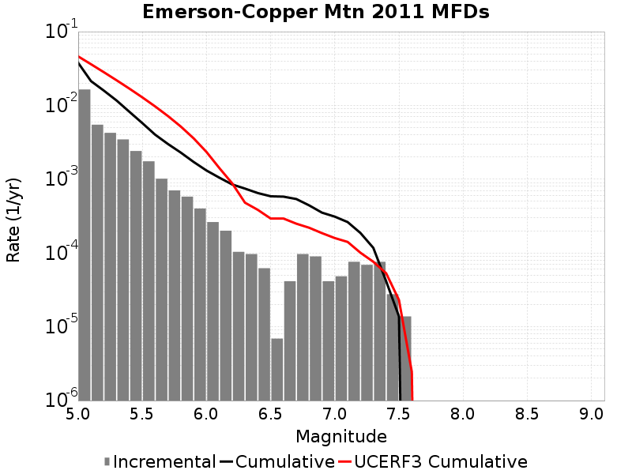

| Magnitude | Incremental Rate | Cumulative Rate | UCERF3 Cumulative Rate |
|-----|-----|-----|-----|
| 5.05 | 0.016451042 | 0.03821534 | 0.046216905 |
| 5.15 | 0.005479075 | 0.021764295 | 0.03618491 |
| 5.25 | 0.0042492193 | 0.01628522 | 0.028216217 |
| 5.35 | 0.0034615593 | 0.012036 | 0.021886459 |
| 5.45 | 0.0024113457 | 0.008574441 | 0.016858552 |
| 5.55 | 0.0017480529 | 0.0061630956 | 0.012864744 |
| 5.65 | 0.0010156671 | 0.0044150427 | 0.0096923495 |
| 5.75 | 7.047486E-4 | 0.0033993756 | 0.007172427 |
| 5.85 | 5.872905E-4 | 0.002694627 | 0.0051707816 |
| 5.95 | 4.0764868E-4 | 0.0021073364 | 0.0035808182 |
| 6.05 | 2.694627E-4 | 0.0016996878 | 0.0023404723 |
| 6.15 | 2.141883E-4 | 0.0014302251 | 0.0014182162 |
| 6.25 | 1.036395E-4 | 0.0012160367 | 8.803875E-4 |
| 6.35 | 1.312767E-4 | 0.0011123973 | 4.8068492E-4 |
| 6.45 | 7.6002296E-5 | 9.811206E-4 | 3.8443034E-4 |
| 6.55 | 2.76372E-5 | 9.051183E-4 | 2.932127E-4 |
| 6.65 | 6.21837E-5 | 8.7748107E-4 | 2.9317033E-4 |
| 6.75 | 1.174581E-4 | 8.1529736E-4 | 2.4968726E-4 |
| 6.85 | 1.174581E-4 | 6.978393E-4 | 2.1997889E-4 |
| 6.95 | 8.98209E-5 | 5.803812E-4 | 1.8591281E-4 |
| 7.05 | 1.036395E-4 | 4.905603E-4 | 1.5937397E-4 |
| 7.15 | 1.174581E-4 | 3.869208E-4 | 1.413053E-4 |
| 7.25 | 1.036395E-4 | 2.694627E-4 | 1.0076035E-4 |
| 7.35 | 1.036395E-4 | 1.6582319E-4 | 7.608255E-5 |
| 7.45 | 2.76372E-5 | 6.21837E-5 | 5.3195483E-5 |
| 7.55 | 3.4546498E-5 | 3.4546498E-5 | 2.3049073E-5 |
| 7.65 | 0.0 | 0.0 | 2.4567867E-6 |

### Eureka Peak
*[(top)](#table-of-contents)*

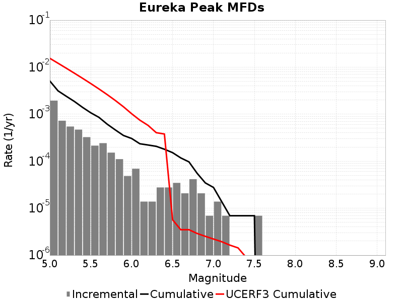

| Magnitude | Incremental Rate | Cumulative Rate | UCERF3 Cumulative Rate |
|-----|-----|-----|-----|
| 5.05 | 0.0019415133 | 0.0052856146 | 0.015436934 |
| 5.15 | 7.254765E-4 | 0.0033441011 | 0.012142554 |
| 5.25 | 5.458347E-4 | 0.0026186246 | 0.009525734 |
| 5.35 | 4.698324E-4 | 0.00207279 | 0.0074471207 |
| 5.45 | 3.247371E-4 | 0.0016029576 | 0.0057960195 |
| 5.55 | 2.141883E-4 | 0.0012782204 | 0.004484503 |
| 5.65 | 2.418255E-4 | 0.0010640322 | 0.0034427287 |
| 5.75 | 1.5200459E-4 | 8.2220667E-4 | 0.0026152176 |
| 5.85 | 1.105488E-4 | 6.702021E-4 | 0.0019579025 |
| 5.95 | 5.52744E-5 | 5.596533E-4 | 0.0014357783 |
| 6.05 | 8.2911596E-5 | 5.0437887E-4 | 0.0010210404 |
| 6.15 | 3.4546498E-5 | 4.214673E-4 | 7.4618147E-4 |
| 6.25 | 2.0727899E-5 | 3.869208E-4 | 5.7862327E-4 |
| 6.35 | 2.76372E-5 | 3.661929E-4 | 4.0491382E-4 |
| 6.45 | 2.76372E-5 | 3.385557E-4 | 3.7846182E-4 |
| 6.55 | 4.83651E-5 | 3.109185E-4 | 5.6817266E-6 |
| 6.65 | 4.83651E-5 | 2.625534E-4 | 3.48879E-6 |
| 6.75 | 6.21837E-5 | 2.141883E-4 | 3.48879E-6 |
| 6.85 | 4.83651E-5 | 1.5200459E-4 | 2.90309E-6 |
| 6.95 | 2.0727899E-5 | 1.036395E-4 | 2.5222414E-6 |
| 7.05 | 2.0727899E-5 | 8.2911596E-5 | 2.2100373E-6 |
| 7.15 | 1.38186E-5 | 6.21837E-5 | 1.9383792E-6 |
| 7.25 | 6.9093E-6 | 4.83651E-5 | 1.6388551E-6 |
| 7.35 | 6.9093E-6 | 4.1455798E-5 | 1.4317543E-6 |
| 7.45 | 1.38186E-5 | 3.4546498E-5 | 8.960426E-7 |
| 7.55 | 2.0727899E-5 | 2.0727899E-5 | 2.053198E-7 |

### Fickle Hill (alt1)
*[(top)](#table-of-contents)*

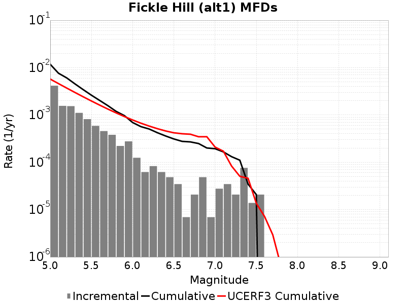

| Magnitude | Incremental Rate | Cumulative Rate | UCERF3 Cumulative Rate |
|-----|-----|-----|-----|
| 5.05 | 0.00414558 | 0.012471287 | 0.0057280743 |
| 5.15 | 0.0015545925 | 0.008325706 | 0.004597857 |
| 5.25 | 0.0015338645 | 0.0067711137 | 0.0037000938 |
| 5.35 | 0.0011054879 | 0.005237249 | 0.002986975 |
| 5.45 | 8.1529736E-4 | 0.0041317614 | 0.0024205246 |
| 5.55 | 5.872905E-4 | 0.003316464 | 0.001970577 |
| 5.65 | 4.560138E-4 | 0.0027291735 | 0.0016131711 |
| 5.75 | 3.800115E-4 | 0.0022731596 | 0.0013292733 |
| 5.85 | 2.210976E-4 | 0.0018931482 | 0.0011037653 |
| 5.95 | 2.7637198E-4 | 0.0016720506 | 9.2463807E-4 |
| 6.05 | 1.450953E-4 | 0.0013956786 | 7.823521E-4 |
| 6.15 | 8.2911596E-5 | 0.0012505833 | 6.693304E-4 |
| 6.25 | 1.243674E-4 | 0.0011676716 | 5.8206456E-4 |
| 6.35 | 1.312767E-4 | 0.0010433043 | 5.127468E-4 |
| 6.45 | 8.98209E-5 | 9.120276E-4 | 4.5879366E-4 |
| 6.55 | 6.9092996E-5 | 8.2220667E-4 | 4.1948535E-4 |
| 6.65 | 4.83651E-5 | 7.531137E-4 | 4.0062497E-4 |
| 6.75 | 6.9092996E-5 | 7.047486E-4 | 3.9130816E-4 |
| 6.85 | 8.2911596E-5 | 6.356556E-4 | 3.4609844E-4 |
| 6.95 | 5.52744E-5 | 5.5274396E-4 | 3.4592557E-4 |
| 7.05 | 8.2911596E-5 | 4.974696E-4 | 2.0939337E-4 |
| 7.15 | 8.2911596E-5 | 4.14558E-4 | 1.7161046E-4 |
| 7.25 | 8.98209E-5 | 3.3164638E-4 | 8.316699E-5 |
| 7.35 | 1.036395E-4 | 2.418255E-4 | 5.052946E-5 |
| 7.45 | 5.52744E-5 | 1.3818599E-4 | 4.586531E-5 |
| 7.55 | 4.1455798E-5 | 8.2911596E-5 | 1.3599443E-5 |
| 7.65 | 2.76372E-5 | 4.1455798E-5 | 7.156327E-6 |
| 7.75 | 6.9093E-6 | 1.38186E-5 | 2.92201E-6 |
| 7.85 | 6.9093E-6 | 6.9093E-6 | 6.3532957E-7 |

### Fish Slough 2011 CFM
*[(top)](#table-of-contents)*

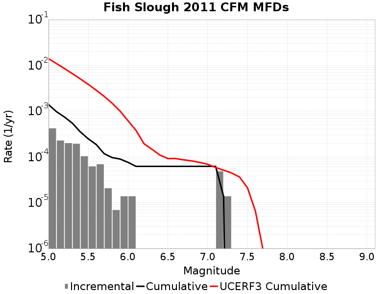

| Magnitude | Incremental Rate | Cumulative Rate | UCERF3 Cumulative Rate |
|-----|-----|-----|-----|
| 5.05 | 4.214673E-4 | 0.0015476831 | 0.014055701 |
| 5.15 | 2.280069E-4 | 0.0011262159 | 0.010984265 |
| 5.25 | 2.003697E-4 | 8.98209E-4 | 0.008544537 |
| 5.35 | 1.934604E-4 | 6.978393E-4 | 0.006606592 |
| 5.45 | 1.036395E-4 | 5.0437887E-4 | 0.0050672274 |
| 5.55 | 6.21837E-5 | 4.007394E-4 | 0.0038444668 |
| 5.65 | 6.9092996E-5 | 3.385557E-4 | 0.0028731935 |
| 5.75 | 2.0727899E-5 | 2.694627E-4 | 0.0021016838 |
| 5.85 | 6.9093E-6 | 2.487348E-4 | 0.0014888517 |
| 5.95 | 2.76372E-5 | 2.418255E-4 | 0.001002062 |
| 6.05 | 2.0727899E-5 | 2.141883E-4 | 6.153911E-4 |
| 6.15 | 2.76372E-5 | 1.934604E-4 | 3.795801E-4 |
| 6.25 | 6.9093E-6 | 1.6582319E-4 | 1.9429893E-4 |
| 6.35 | 2.76372E-5 | 1.589139E-4 | 1.4678635E-4 |
| 6.45 | 1.38186E-5 | 1.312767E-4 | 1.09899716E-4 |
| 6.55 | 6.9093E-6 | 1.174581E-4 | 9.2049566E-5 |
| 6.65 | 6.9093E-6 | 1.105488E-4 | 9.2049566E-5 |
| 6.75 | 6.9093E-6 | 1.036395E-4 | 8.615824E-5 |
| 6.85 | 6.9093E-6 | 9.67302E-5 | 8.1947335E-5 |
| 6.95 | 2.0727899E-5 | 8.98209E-5 | 7.5963144E-5 |
| 7.05 | 6.9093E-6 | 6.9092996E-5 | 6.912142E-5 |
| 7.15 | 4.83651E-5 | 6.21837E-5 | 5.8789374E-5 |
| 7.25 | 1.38186E-5 | 1.38186E-5 | 5.132508E-5 |
| 7.35 | 0.0 | 0.0 | 4.4739798E-5 |
| 7.45 | 0.0 | 0.0 | 3.6416895E-5 |
| 7.55 | 0.0 | 0.0 | 2.122488E-5 |
| 7.65 | 0.0 | 0.0 | 6.505903E-6 |
| 7.75 | 0.0 | 0.0 | 8.4046815E-7 |

### Fitzhugh Creek
*[(top)](#table-of-contents)*

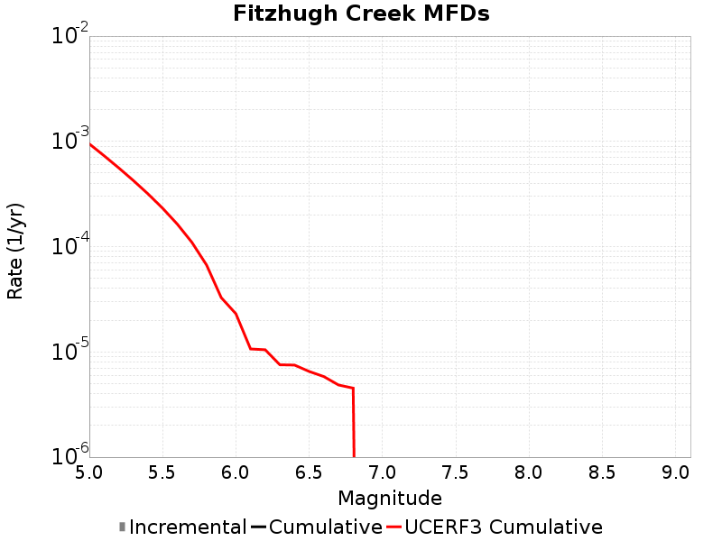

| Magnitude | Incremental Rate | Cumulative Rate | UCERF3 Cumulative Rate |
|-----|-----|-----|-----|
| 5.05 | 0.0 | 0.0 | 9.474162E-4 |
| 5.15 | 0.0 | 0.0 | 7.3221093E-4 |
| 5.25 | 0.0 | 0.0 | 5.612673E-4 |
| 5.35 | 0.0 | 0.0 | 4.2548197E-4 |
| 5.45 | 0.0 | 0.0 | 3.1762384E-4 |
| 5.55 | 0.0 | 0.0 | 2.3194909E-4 |
| 5.65 | 0.0 | 0.0 | 1.6389521E-4 |
| 5.75 | 0.0 | 0.0 | 1.0983809E-4 |
| 5.85 | 0.0 | 0.0 | 6.6898996E-5 |
| 5.95 | 0.0 | 0.0 | 3.2791257E-5 |
| 6.05 | 0.0 | 0.0 | 2.3046328E-5 |
| 6.15 | 0.0 | 0.0 | 1.0670202E-5 |
| 6.25 | 0.0 | 0.0 | 1.0484182E-5 |
| 6.35 | 0.0 | 0.0 | 7.5494577E-6 |
| 6.45 | 0.0 | 0.0 | 7.5025096E-6 |
| 6.55 | 0.0 | 0.0 | 6.5222625E-6 |
| 6.65 | 0.0 | 0.0 | 5.832232E-6 |
| 6.75 | 0.0 | 0.0 | 4.8530396E-6 |
| 6.85 | 0.0 | 0.0 | 4.529056E-6 |

### Fontana (Seismicity)
*[(top)](#table-of-contents)*

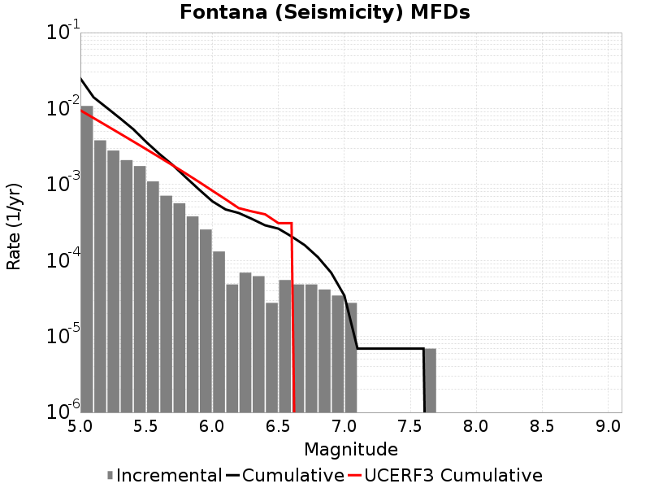

| Magnitude | Incremental Rate | Cumulative Rate | UCERF3 Cumulative Rate |
|-----|-----|-----|-----|
| 5.05 | 0.010813055 | 0.025053121 | 0.0094791455 |
| 5.15 | 0.0038139336 | 0.014240067 | 0.0075023863 |
| 5.25 | 0.0027982665 | 0.010426134 | 0.0059321914 |
| 5.35 | 0.002093518 | 0.007627867 | 0.004684941 |
| 5.45 | 0.0017480529 | 0.005534349 | 0.0036942146 |
| 5.55 | 0.0010985787 | 0.0037862964 | 0.0029072529 |
| 5.65 | 7.1165786E-4 | 0.0026877176 | 0.0022821468 |
| 5.75 | 5.665626E-4 | 0.0019760597 | 0.0017856074 |
| 5.85 | 3.800115E-4 | 0.0014094972 | 0.0013911922 |
| 5.95 | 2.556441E-4 | 0.0010294857 | 0.0010778971 |
| 6.05 | 1.3818599E-4 | 7.738416E-4 | 8.290611E-4 |
| 6.15 | 5.52744E-5 | 6.356556E-4 | 6.389485E-4 |
| 6.25 | 7.6002296E-5 | 5.803812E-4 | 4.886214E-4 |
| 6.35 | 6.21837E-5 | 5.0437887E-4 | 4.4187193E-4 |
| 6.45 | 3.4546498E-5 | 4.421952E-4 | 4.0505387E-4 |
| 6.55 | 6.21837E-5 | 4.0764868E-4 | 3.1004194E-4 |
| 6.65 | 5.52744E-5 | 3.45465E-4 | 3.1002826E-4 |
| 6.75 | 6.21837E-5 | 2.901906E-4 | 0.0 |
| 6.85 | 8.2911596E-5 | 2.280069E-4 | 0.0 |
| 6.95 | 5.52744E-5 | 1.450953E-4 | 0.0 |
| 7.05 | 4.1455798E-5 | 8.98209E-5 | 0.0 |
| 7.15 | 0.0 | 4.83651E-5 | 0.0 |
| 7.25 | 2.0727899E-5 | 4.83651E-5 | 0.0 |
| 7.35 | 0.0 | 2.76372E-5 | 0.0 |
| 7.45 | 6.9093E-6 | 2.76372E-5 | 0.0 |
| 7.55 | 0.0 | 2.0727899E-5 | 0.0 |
| 7.65 | 6.9093E-6 | 2.0727899E-5 | 0.0 |
| 7.75 | 1.38186E-5 | 1.38186E-5 | 0.0 |

### Franklin 2011 CFM
*[(top)](#table-of-contents)*

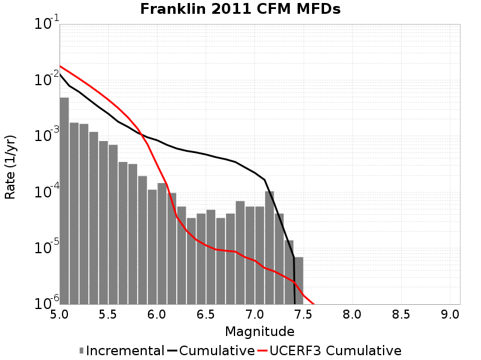

| Magnitude | Incremental Rate | Cumulative Rate | UCERF3 Cumulative Rate |
|-----|-----|-----|-----|
| 5.05 | 0.004857238 | 0.013625139 | 0.017880745 |
| 5.15 | 0.0017342343 | 0.008767902 | 0.013842841 |
| 5.25 | 0.0016513227 | 0.0070336675 | 0.01063542 |
| 5.35 | 0.0011883996 | 0.0053823446 | 0.008087674 |
| 5.45 | 8.1529736E-4 | 0.004193945 | 0.006063928 |
| 5.55 | 6.978393E-4 | 0.0033786476 | 0.0044564093 |
| 5.65 | 3.45465E-4 | 0.0026808083 | 0.0031795115 |
| 5.75 | 3.45465E-4 | 0.0023353433 | 0.0021652358 |
| 5.85 | 2.694627E-4 | 0.0019898785 | 0.001359568 |
| 5.95 | 1.934604E-4 | 0.0017204157 | 7.196032E-4 |
| 6.05 | 2.003697E-4 | 0.0015269553 | 3.0632078E-4 |
| 6.15 | 1.5200459E-4 | 0.0013265855 | 1.3427467E-4 |
| 6.25 | 7.6002296E-5 | 0.001174581 | 3.6475412E-5 |
| 6.35 | 1.036395E-4 | 0.0010985787 | 2.057072E-5 |
| 6.45 | 1.727325E-4 | 9.949392E-4 | 1.4132572E-5 |
| 6.55 | 1.727325E-4 | 8.2220667E-4 | 1.1221924E-5 |
| 6.65 | 1.450953E-4 | 6.494742E-4 | 9.473169E-6 |
| 6.75 | 7.6002296E-5 | 5.0437887E-4 | 9.019635E-6 |
| 6.85 | 1.105488E-4 | 4.283766E-4 | 8.68879E-6 |
| 6.95 | 6.21837E-5 | 3.178278E-4 | 6.914811E-6 |
| 7.05 | 6.9092996E-5 | 2.556441E-4 | 6.0033653E-6 |
| 7.15 | 1.105488E-4 | 1.865511E-4 | 4.4438552E-6 |
| 7.25 | 4.83651E-5 | 7.6002296E-5 | 3.8521052E-6 |
| 7.35 | 2.0727899E-5 | 2.76372E-5 | 3.141888E-6 |
| 7.45 | 6.9093E-6 | 6.9093E-6 | 2.5025874E-6 |
| 7.55 | 0.0 | 0.0 | 1.4258077E-6 |
| 7.65 | 0.0 | 0.0 | 1.0041775E-6 |
| 7.75 | 0.0 | 0.0 | 7.7803065E-7 |
| 7.85 | 0.0 | 0.0 | 7.010193E-7 |
| 7.95 | 0.0 | 0.0 | 6.008489E-7 |
| 8.05 | 0.0 | 0.0 | 4.636019E-7 |
| 8.15 | 0.0 | 0.0 | 2.1703973E-7 |

### Garberville - Briceland 2011 CFM
*[(top)](#table-of-contents)*

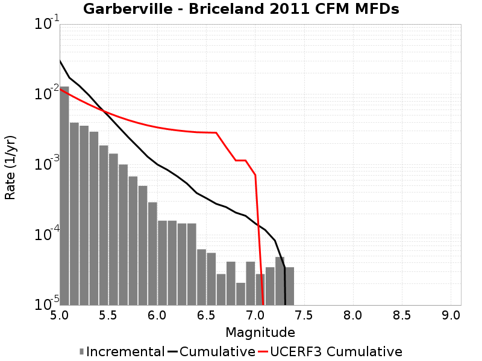

| Magnitude | Incremental Rate | Cumulative Rate | UCERF3 Cumulative Rate |
|-----|-----|-----|-----|
| 5.05 | 0.012920391 | 0.030152185 | 0.011875073 |
| 5.15 | 0.0039521195 | 0.017231794 | 0.009930905 |
| 5.25 | 0.003572108 | 0.013279675 | 0.008386598 |
| 5.35 | 0.0029364524 | 0.009707566 | 0.007159911 |
| 5.45 | 0.0018724203 | 0.0067711137 | 0.006185519 |
| 5.55 | 0.0014302251 | 0.0048986934 | 0.005411532 |
| 5.65 | 0.0010018485 | 0.0034684686 | 0.004796732 |
| 5.75 | 6.771114E-4 | 0.0024666202 | 0.0043083793 |
| 5.85 | 4.974696E-4 | 0.0017895086 | 0.0039204666 |
| 5.95 | 2.901906E-4 | 0.001292039 | 0.003612337 |
| 6.05 | 1.589139E-4 | 0.0010018485 | 0.003378514 |
| 6.15 | 1.589139E-4 | 8.429346E-4 | 0.0032038337 |
| 6.25 | 1.450953E-4 | 6.840207E-4 | 0.003069851 |
| 6.35 | 1.450953E-4 | 5.389254E-4 | 0.0029680738 |
| 6.45 | 6.21837E-5 | 3.938301E-4 | 0.0028872325 |
| 6.55 | 5.52744E-5 | 3.3164638E-4 | 0.0028615687 |
| 6.65 | 2.76372E-5 | 2.7637198E-4 | 0.0028411832 |
| 6.75 | 4.1455798E-5 | 2.487348E-4 | 0.001782603 |
| 6.85 | 2.0727899E-5 | 2.07279E-4 | 0.0011435105 |
| 6.95 | 4.1455798E-5 | 1.865511E-4 | 0.0011434038 |
| 7.05 | 2.76372E-5 | 1.450953E-4 | 7.102327E-4 |
| 7.15 | 3.4546498E-5 | 1.174581E-4 | 3.3873725E-6 |
| 7.25 | 4.83651E-5 | 8.2911596E-5 | 1.548444E-6 |
| 7.35 | 3.4546498E-5 | 3.4546498E-5 | 5.1962064E-7 |

### Garlic Springs
*[(top)](#table-of-contents)*

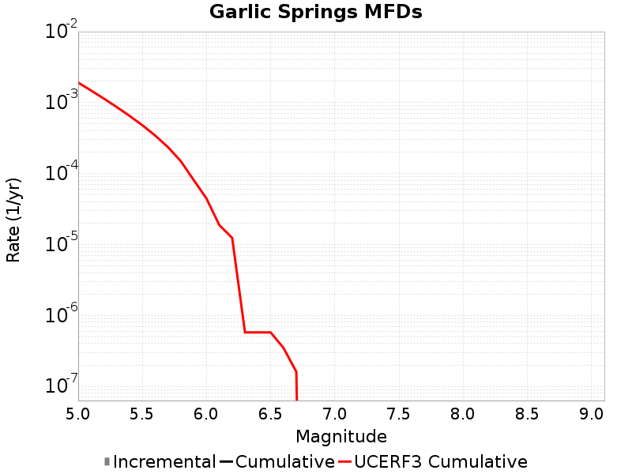

| Magnitude | Incremental Rate | Cumulative Rate | UCERF3 Cumulative Rate |
|-----|-----|-----|-----|
| 5.05 | 0.0 | 0.0 | 0.0019119381 |
| 5.15 | 0.0 | 0.0 | 0.0014811703 |
| 5.25 | 0.0 | 0.0 | 0.0011389992 |
| 5.35 | 0.0 | 0.0 | 8.6720317E-4 |
| 5.45 | 0.0 | 0.0 | 6.5130787E-4 |
| 5.55 | 0.0 | 0.0 | 4.7981614E-4 |
| 5.65 | 0.0 | 0.0 | 3.435954E-4 |
| 5.75 | 0.0 | 0.0 | 2.3539145E-4 |
| 5.85 | 0.0 | 0.0 | 1.4944197E-4 |
| 5.95 | 0.0 | 0.0 | 8.116988E-5 |
| 6.05 | 0.0 | 0.0 | 4.4456097E-5 |
| 6.15 | 0.0 | 0.0 | 1.8743365E-5 |
| 6.25 | 0.0 | 0.0 | 1.2424705E-5 |
| 6.35 | 0.0 | 0.0 | 5.7670576E-7 |
| 6.45 | 0.0 | 0.0 | 5.7670576E-7 |
| 6.55 | 0.0 | 0.0 | 5.7670576E-7 |
| 6.65 | 0.0 | 0.0 | 3.4853562E-7 |
| 6.75 | 0.0 | 0.0 | 1.607378E-7 |

### Gillem - Big Crack 2011 CFM
*[(top)](#table-of-contents)*

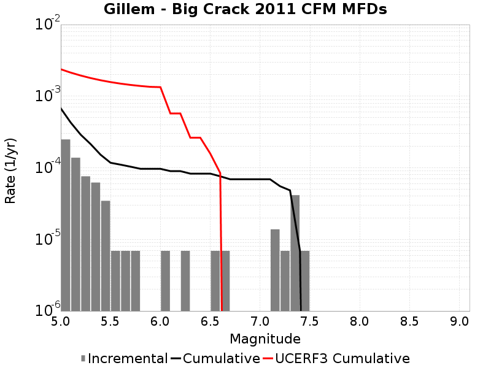

| Magnitude | Incremental Rate | Cumulative Rate | UCERF3 Cumulative Rate |
|-----|-----|-----|-----|
| 5.05 | 2.487348E-4 | 6.771114E-4 | 0.002376256 |
| 5.15 | 1.3818599E-4 | 4.283766E-4 | 0.002134674 |
| 5.25 | 7.6002296E-5 | 2.901906E-4 | 0.0019427786 |
| 5.35 | 6.21837E-5 | 2.141883E-4 | 0.0017903507 |
| 5.45 | 3.4546498E-5 | 1.5200459E-4 | 0.0016692729 |
| 5.55 | 6.9093E-6 | 1.174581E-4 | 0.0015730973 |
| 5.65 | 6.9093E-6 | 1.105488E-4 | 0.0014967024 |
| 5.75 | 6.9093E-6 | 1.036395E-4 | 0.0014360198 |
| 5.85 | 0.0 | 9.67302E-5 | 0.0013878178 |
| 5.95 | 0.0 | 9.67302E-5 | 0.0013495296 |
| 6.05 | 6.9093E-6 | 9.67302E-5 | 0.0013371449 |
| 6.15 | 0.0 | 8.98209E-5 | 5.7364686E-4 |
| 6.25 | 6.9093E-6 | 8.98209E-5 | 5.7355454E-4 |
| 6.35 | 0.0 | 8.2911596E-5 | 2.6298204E-4 |
| 6.45 | 0.0 | 8.2911596E-5 | 2.6298204E-4 |
| 6.55 | 6.9093E-6 | 8.2911596E-5 | 1.57845E-4 |
| 6.65 | 6.9093E-6 | 7.6002296E-5 | 8.4409454E-5 |
| 6.75 | 0.0 | 6.9092996E-5 | 0.0 |
| 6.85 | 0.0 | 6.9092996E-5 | 0.0 |
| 6.95 | 0.0 | 6.9092996E-5 | 0.0 |
| 7.05 | 0.0 | 6.9092996E-5 | 0.0 |
| 7.15 | 1.38186E-5 | 6.9092996E-5 | 0.0 |
| 7.25 | 6.9093E-6 | 5.52744E-5 | 0.0 |
| 7.35 | 4.1455798E-5 | 4.83651E-5 | 0.0 |
| 7.45 | 6.9093E-6 | 6.9093E-6 | 0.0 |

### Goldstone Lake
*[(top)](#table-of-contents)*

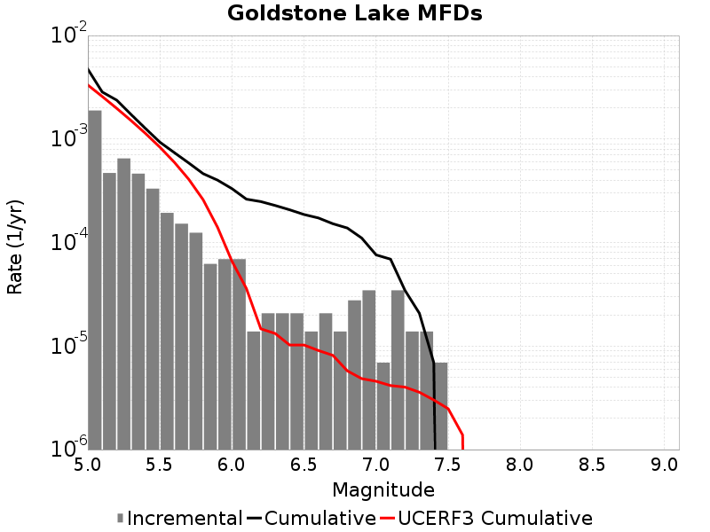

| Magnitude | Incremental Rate | Cumulative Rate | UCERF3 Cumulative Rate |
|-----|-----|-----|-----|
| 5.05 | 0.0018862389 | 0.004767417 | 0.0033266959 |
| 5.15 | 4.698324E-4 | 0.0028811782 | 0.0025769845 |
| 5.25 | 6.494742E-4 | 0.0024113457 | 0.0019814675 |
| 5.35 | 4.6292308E-4 | 0.0017618715 | 0.0015084314 |
| 5.45 | 3.3164638E-4 | 0.0012989484 | 0.0011326856 |
| 5.55 | 1.934604E-4 | 9.67302E-4 | 8.3422E-4 |
| 5.65 | 1.5200459E-4 | 7.738416E-4 | 5.971404E-4 |
| 5.75 | 1.243674E-4 | 6.21837E-4 | 4.0882136E-4 |
| 5.85 | 8.2911596E-5 | 4.974696E-4 | 2.5923422E-4 |
| 5.95 | 6.9092996E-5 | 4.14558E-4 | 1.4041296E-4 |
| 6.05 | 6.9092996E-5 | 3.45465E-4 | 6.596648E-5 |
| 6.15 | 2.0727899E-5 | 2.7637198E-4 | 3.5978028E-5 |
| 6.25 | 2.0727899E-5 | 2.556441E-4 | 1.4682251E-5 |
| 6.35 | 2.0727899E-5 | 2.349162E-4 | 1.3227863E-5 |
| 6.45 | 2.0727899E-5 | 2.141883E-4 | 1.0236818E-5 |
| 6.55 | 1.38186E-5 | 1.934604E-4 | 1.0236818E-5 |
| 6.65 | 2.0727899E-5 | 1.796418E-4 | 9.057331E-6 |
| 6.75 | 1.38186E-5 | 1.589139E-4 | 8.133101E-6 |
| 6.85 | 2.76372E-5 | 1.450953E-4 | 5.7651127E-6 |
| 6.95 | 4.1455798E-5 | 1.174581E-4 | 4.844765E-6 |
| 7.05 | 6.9093E-6 | 7.6002296E-5 | 4.570457E-6 |
| 7.15 | 3.4546498E-5 | 6.9092996E-5 | 4.154984E-6 |
| 7.25 | 1.38186E-5 | 3.4546498E-5 | 4.0137143E-6 |
| 7.35 | 1.38186E-5 | 2.0727899E-5 | 3.5806995E-6 |
| 7.45 | 6.9093E-6 | 6.9093E-6 | 3.0127965E-6 |
| 7.55 | 0.0 | 0.0 | 2.4814249E-6 |
| 7.65 | 0.0 | 0.0 | 1.3823751E-6 |

### Goose Lake 2011 CFM
*[(top)](#table-of-contents)*

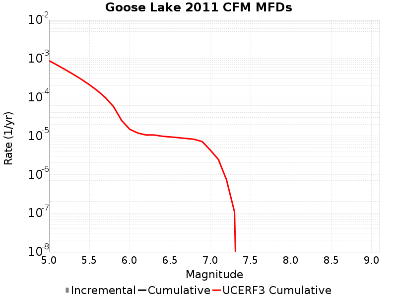

| Magnitude | Incremental Rate | Cumulative Rate | UCERF3 Cumulative Rate |
|-----|-----|-----|-----|
| 5.05 | 0.0 | 0.0 | 8.781311E-4 |
| 5.15 | 0.0 | 0.0 | 6.773831E-4 |
| 5.25 | 0.0 | 0.0 | 5.179233E-4 |
| 5.35 | 0.0 | 0.0 | 3.912599E-4 |
| 5.45 | 0.0 | 0.0 | 2.906476E-4 |
| 5.55 | 0.0 | 0.0 | 2.1072838E-4 |
| 5.65 | 0.0 | 0.0 | 1.4724629E-4 |
| 5.75 | 0.0 | 0.0 | 9.682067E-5 |
| 5.85 | 0.0 | 0.0 | 5.676619E-5 |
| 5.95 | 0.0 | 0.0 | 2.4949775E-5 |
| 6.05 | 0.0 | 0.0 | 1.4840708E-5 |
| 6.15 | 0.0 | 0.0 | 1.1855327E-5 |
| 6.25 | 0.0 | 0.0 | 1.0561222E-5 |
| 6.35 | 0.0 | 0.0 | 1.0561222E-5 |
| 6.45 | 0.0 | 0.0 | 9.8122755E-6 |
| 6.55 | 0.0 | 0.0 | 9.394644E-6 |
| 6.65 | 0.0 | 0.0 | 9.004372E-6 |
| 6.75 | 0.0 | 0.0 | 8.573226E-6 |
| 6.85 | 0.0 | 0.0 | 8.141211E-6 |
| 6.95 | 0.0 | 0.0 | 7.1015947E-6 |
| 7.05 | 0.0 | 0.0 | 4.274196E-6 |
| 7.15 | 0.0 | 0.0 | 2.451909E-6 |
| 7.25 | 0.0 | 0.0 | 7.378361E-7 |
| 7.35 | 0.0 | 0.0 | 1.0840584E-7 |

### Gravel Hills-Harper Lk
*[(top)](#table-of-contents)*

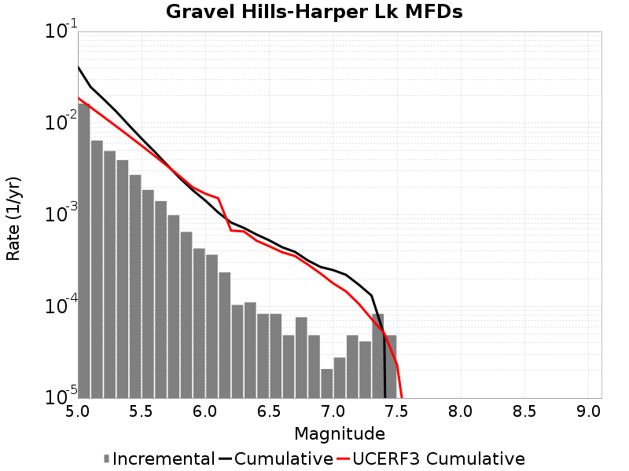

| Magnitude | Incremental Rate | Cumulative Rate | UCERF3 Cumulative Rate |
|-----|-----|-----|-----|
| 5.05 | 0.016326675 | 0.041303795 | 0.018875368 |
| 5.15 | 0.0064394674 | 0.02497712 | 0.014902145 |
| 5.25 | 0.004953968 | 0.018537652 | 0.011746102 |
| 5.35 | 0.003938301 | 0.013583683 | 0.009239168 |
| 5.45 | 0.0027222643 | 0.009645383 | 0.00724784 |
| 5.55 | 0.001865511 | 0.0069231186 | 0.0056660715 |
| 5.65 | 0.0014094972 | 0.0050576073 | 0.0044096285 |
| 5.75 | 9.880299E-4 | 0.0036481104 | 0.0034116001 |
| 5.85 | 6.6329277E-4 | 0.0026600806 | 0.002618838 |
| 5.95 | 4.283766E-4 | 0.0019967877 | 0.0019891248 |
| 6.05 | 3.731022E-4 | 0.0015684111 | 0.0016956531 |
| 6.15 | 2.487348E-4 | 0.0011953089 | 0.00151064 |
| 6.25 | 1.105488E-4 | 9.465741E-4 | 6.718835E-4 |
| 6.35 | 1.450953E-4 | 8.360253E-4 | 6.5796904E-4 |
| 6.45 | 9.67302E-5 | 6.9093E-4 | 5.209545E-4 |
| 6.55 | 8.98209E-5 | 5.941998E-4 | 4.527762E-4 |
| 6.65 | 6.21837E-5 | 5.0437887E-4 | 3.8990745E-4 |
| 6.75 | 7.6002296E-5 | 4.421952E-4 | 3.5445546E-4 |
| 6.85 | 5.52744E-5 | 3.661929E-4 | 2.8710422E-4 |
| 6.95 | 3.4546498E-5 | 3.109185E-4 | 2.2874033E-4 |
| 7.05 | 3.4546498E-5 | 2.7637198E-4 | 1.783336E-4 |
| 7.15 | 6.21837E-5 | 2.418255E-4 | 1.4587185E-4 |
| 7.25 | 4.83651E-5 | 1.796418E-4 | 1.06775326E-4 |
| 7.35 | 8.2911596E-5 | 1.312767E-4 | 7.304396E-5 |
| 7.45 | 4.83651E-5 | 4.83651E-5 | 5.0693292E-5 |
| 7.55 | 0.0 | 0.0 | 2.3049073E-5 |
| 7.65 | 0.0 | 0.0 | 2.4567867E-6 |

### Great Valley 01
*[(top)](#table-of-contents)*

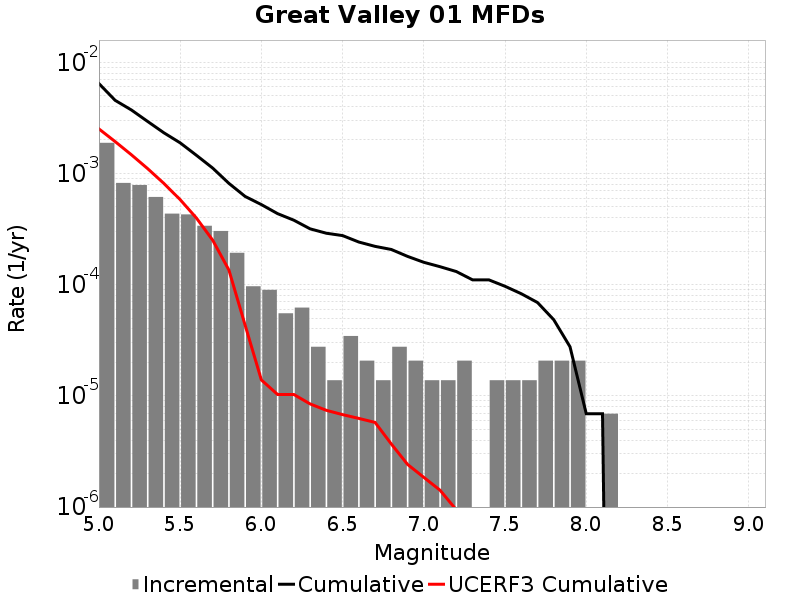

| Magnitude | Incremental Rate | Cumulative Rate | UCERF3 Cumulative Rate |
|-----|-----|-----|-----|
| 5.05 | 0.0018862389 | 0.006936937 | 0.002516863 |
| 5.15 | 8.2220667E-4 | 0.0050506983 | 0.0019348286 |
| 5.25 | 7.876602E-4 | 0.0042284913 | 0.0014725022 |
| 5.35 | 6.149277E-4 | 0.0034408313 | 0.0011052634 |
| 5.45 | 4.421952E-4 | 0.0028259037 | 8.135552E-4 |
| 5.55 | 4.283766E-4 | 0.0023837085 | 5.818432E-4 |
| 5.65 | 3.45465E-4 | 0.0019553318 | 3.9778775E-4 |
| 5.75 | 3.45465E-4 | 0.0016098669 | 2.5158733E-4 |
| 5.85 | 2.625534E-4 | 0.0012644018 | 1.354562E-4 |
| 5.95 | 1.3818599E-4 | 0.0010018485 | 4.3209973E-5 |
| 6.05 | 1.5200459E-4 | 8.636625E-4 | 1.3900463E-5 |
| 6.15 | 7.6002296E-5 | 7.1165786E-4 | 1.0289816E-5 |
| 6.25 | 8.2911596E-5 | 6.356556E-4 | 1.0289816E-5 |
| 6.35 | 4.1455798E-5 | 5.5274396E-4 | 8.463326E-6 |
| 6.45 | 5.52744E-5 | 5.112882E-4 | 7.413233E-6 |
| 6.55 | 6.9092996E-5 | 4.560138E-4 | 6.7812125E-6 |
| 6.65 | 2.76372E-5 | 3.869208E-4 | 6.2704858E-6 |
| 6.75 | 2.0727899E-5 | 3.592836E-4 | 5.768401E-6 |
| 6.85 | 5.52744E-5 | 3.385557E-4 | 3.6897993E-6 |
| 6.95 | 4.1455798E-5 | 2.832813E-4 | 2.4189455E-6 |
| 7.05 | 2.0727899E-5 | 2.418255E-4 | 1.8493951E-6 |
| 7.15 | 3.4546498E-5 | 2.210976E-4 | 1.4169507E-6 |
| 7.25 | 2.0727899E-5 | 1.865511E-4 | 9.443081E-7 |
| 7.35 | 2.76372E-5 | 1.6582319E-4 | 5.352527E-7 |
| 7.45 | 3.4546498E-5 | 1.3818599E-4 | 2.7385022E-7 |
| 7.55 | 1.38186E-5 | 1.036395E-4 | 0.0 |
| 7.65 | 2.0727899E-5 | 8.98209E-5 | 0.0 |
| 7.75 | 2.0727899E-5 | 6.9092996E-5 | 0.0 |
| 7.85 | 2.0727899E-5 | 4.83651E-5 | 0.0 |
| 7.95 | 2.0727899E-5 | 2.76372E-5 | 0.0 |
| 8.05 | 0.0 | 6.9093E-6 | 0.0 |
| 8.15 | 6.9093E-6 | 6.9093E-6 | 0.0 |

### Great Valley 02
*[(top)](#table-of-contents)*

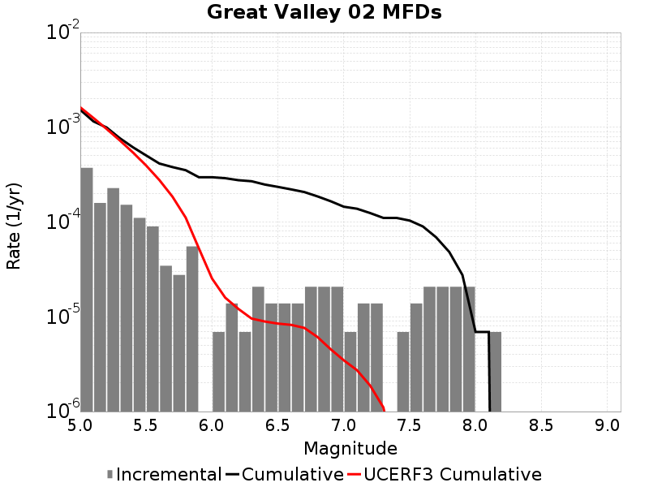

| Magnitude | Incremental Rate | Cumulative Rate | UCERF3 Cumulative Rate |
|-----|-----|-----|-----|
| 5.05 | 3.731022E-4 | 0.0018447831 | 0.0016227883 |
| 5.15 | 1.589139E-4 | 0.0014716808 | 0.0012533738 |
| 5.25 | 2.280069E-4 | 0.0013127669 | 9.599375E-4 |
| 5.35 | 1.5200459E-4 | 0.0010847601 | 7.268528E-4 |
| 5.45 | 1.105488E-4 | 9.327555E-4 | 5.41707E-4 |
| 5.55 | 9.67302E-5 | 8.2220667E-4 | 3.9464046E-4 |
| 5.65 | 3.4546498E-5 | 7.254765E-4 | 2.7782135E-4 |
| 5.75 | 4.1455798E-5 | 6.9093E-4 | 1.8502865E-4 |
| 5.85 | 5.52744E-5 | 6.494742E-4 | 1.1132078E-4 |
| 5.95 | 0.0 | 5.941998E-4 | 5.277254E-5 |
| 6.05 | 6.9093E-6 | 5.941998E-4 | 2.5345184E-5 |
| 6.15 | 4.1455798E-5 | 5.872905E-4 | 1.5925716E-5 |
| 6.25 | 1.38186E-5 | 5.458347E-4 | 1.2113868E-5 |
| 6.35 | 2.0727899E-5 | 5.320161E-4 | 9.582463E-6 |
| 6.45 | 2.0727899E-5 | 5.112882E-4 | 8.923063E-6 |
| 6.55 | 2.76372E-5 | 4.905603E-4 | 8.477578E-6 |
| 6.65 | 2.0727899E-5 | 4.6292308E-4 | 8.218794E-6 |
| 6.75 | 2.76372E-5 | 4.421952E-4 | 7.639998E-6 |
| 6.85 | 2.0727899E-5 | 4.14558E-4 | 6.122295E-6 |
| 6.95 | 2.76372E-5 | 3.938301E-4 | 4.550081E-6 |
| 7.05 | 3.4546498E-5 | 3.661929E-4 | 3.4734003E-6 |
| 7.15 | 5.52744E-5 | 3.3164638E-4 | 2.7340454E-6 |
| 7.25 | 6.9092996E-5 | 2.7637198E-4 | 1.8795237E-6 |
| 7.35 | 2.76372E-5 | 2.07279E-4 | 1.1064361E-6 |
| 7.45 | 3.4546498E-5 | 1.796418E-4 | 2.7385022E-7 |
| 7.55 | 2.0727899E-5 | 1.450953E-4 | 0.0 |
| 7.65 | 3.4546498E-5 | 1.243674E-4 | 0.0 |
| 7.75 | 3.4546498E-5 | 8.98209E-5 | 0.0 |
| 7.85 | 2.76372E-5 | 5.52744E-5 | 0.0 |
| 7.95 | 2.0727899E-5 | 2.76372E-5 | 0.0 |
| 8.05 | 0.0 | 6.9093E-6 | 0.0 |
| 8.15 | 6.9093E-6 | 6.9093E-6 | 0.0 |

### Great Valley 03 Mysterious Ridge
*[(top)](#table-of-contents)*

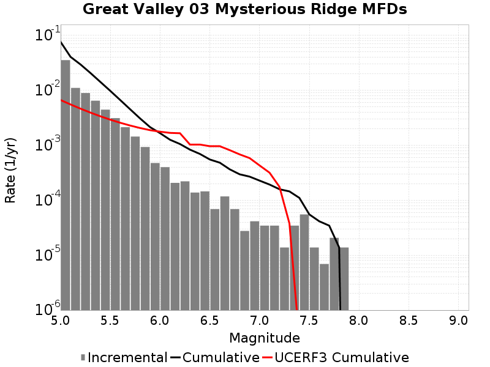

| Magnitude | Incremental Rate | Cumulative Rate | UCERF3 Cumulative Rate |
|-----|-----|-----|-----|
| 5.05 | 0.035569075 | 0.07804054 | 0.0066806325 |
| 5.15 | 0.0111032445 | 0.042471465 | 0.005553092 |
| 5.25 | 0.008954452 | 0.031368222 | 0.004657454 |
| 5.35 | 0.006494742 | 0.02241377 | 0.003946024 |
| 5.45 | 0.004477226 | 0.015919028 | 0.0033809147 |
| 5.55 | 0.0031713687 | 0.011441801 | 0.0029320326 |
| 5.65 | 0.0022455226 | 0.008270432 | 0.002575473 |
| 5.75 | 0.0016098669 | 0.0060249097 | 0.0022922473 |
| 5.85 | 0.0011538531 | 0.0044150427 | 0.0020672735 |
| 5.95 | 5.941998E-4 | 0.0032611894 | 0.0018885701 |
| 6.05 | 5.0437887E-4 | 0.0026669898 | 0.0017733701 |
| 6.15 | 2.694627E-4 | 0.0021626109 | 0.0016863359 |
| 6.25 | 3.0400918E-4 | 0.0018931482 | 0.0016617619 |
| 6.35 | 1.934604E-4 | 0.001589139 | 0.001034472 |
| 6.45 | 2.141883E-4 | 0.0013956786 | 0.0010341533 |
| 6.55 | 1.105488E-4 | 0.0011814903 | 9.6511235E-4 |
| 6.65 | 1.727325E-4 | 0.0010709414 | 9.6498214E-4 |
| 6.75 | 1.589139E-4 | 8.98209E-4 | 8.1777235E-4 |
| 6.85 | 6.9092996E-5 | 7.392951E-4 | 6.8446033E-4 |
| 6.95 | 8.98209E-5 | 6.702021E-4 | 5.860731E-4 |
| 7.05 | 8.2911596E-5 | 5.803812E-4 | 4.30603E-4 |
| 7.15 | 8.2911596E-5 | 4.974696E-4 | 3.1806683E-4 |
| 7.25 | 6.9092996E-5 | 4.14558E-4 | 1.755287E-4 |
| 7.35 | 1.174581E-4 | 3.45465E-4 | 3.7857582E-5 |
| 7.45 | 1.174581E-4 | 2.280069E-4 | 2.7385022E-7 |
| 7.55 | 1.38186E-5 | 1.105488E-4 | 0.0 |
| 7.65 | 6.9093E-6 | 9.67302E-5 | 0.0 |
| 7.75 | 3.4546498E-5 | 8.98209E-5 | 0.0 |
| 7.85 | 2.76372E-5 | 5.52744E-5 | 0.0 |
| 7.95 | 2.0727899E-5 | 2.76372E-5 | 0.0 |
| 8.05 | 0.0 | 6.9093E-6 | 0.0 |
| 8.15 | 6.9093E-6 | 6.9093E-6 | 0.0 |

### Great Valley 03a Dunnigan Hills
*[(top)](#table-of-contents)*

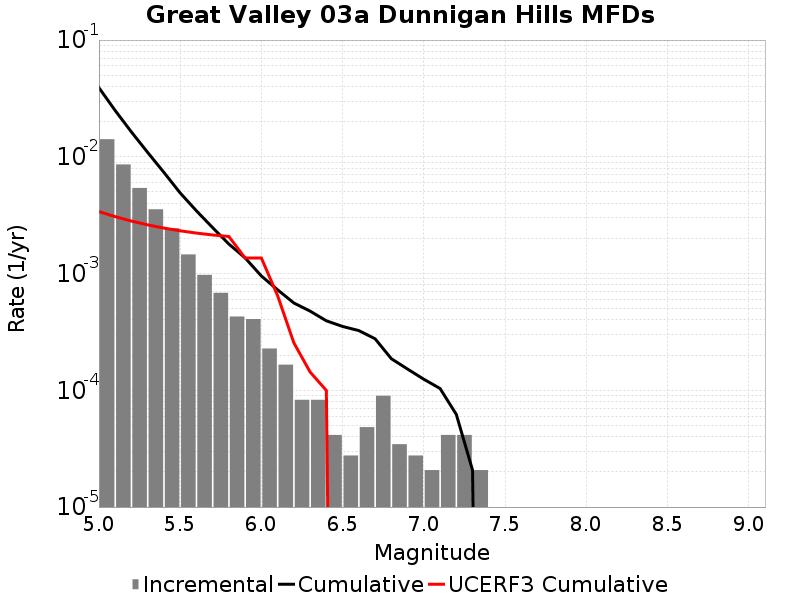

| Magnitude | Incremental Rate | Cumulative Rate | UCERF3 Cumulative Rate |
|-----|-----|-----|-----|
| 5.05 | 0.014143337 | 0.03905827 | 0.003394924 |
| 5.15 | 0.008602078 | 0.024914935 | 0.0030726525 |
| 5.25 | 0.0054099816 | 0.016312856 | 0.0028166631 |
| 5.35 | 0.0035513802 | 0.010902875 | 0.0026133235 |
| 5.45 | 0.0024458922 | 0.007351495 | 0.0024518052 |
| 5.55 | 0.0014578623 | 0.004905603 | 0.0023235066 |
| 5.65 | 9.7421126E-4 | 0.0034477406 | 0.0022215955 |
| 5.75 | 6.840207E-4 | 0.0024735294 | 0.0021406445 |
| 5.85 | 4.283766E-4 | 0.0017895086 | 0.002076343 |
| 5.95 | 4.0764868E-4 | 0.0013611321 | 0.0013579665 |
| 6.05 | 2.280069E-4 | 9.534834E-4 | 0.0013579665 |
| 6.15 | 1.6582319E-4 | 7.254765E-4 | 6.4611906E-4 |
| 6.25 | 8.2911596E-5 | 5.596533E-4 | 2.5491268E-4 |
| 6.35 | 8.2911596E-5 | 4.767417E-4 | 1.4340668E-4 |
| 6.45 | 4.1455798E-5 | 3.938301E-4 | 9.970944E-5 |
| 6.55 | 2.76372E-5 | 3.523743E-4 | 0.0 |
| 6.65 | 4.83651E-5 | 3.247371E-4 | 0.0 |
| 6.75 | 8.98209E-5 | 2.7637198E-4 | 0.0 |
| 6.85 | 3.4546498E-5 | 1.865511E-4 | 0.0 |
| 6.95 | 2.76372E-5 | 1.5200459E-4 | 0.0 |
| 7.05 | 2.0727899E-5 | 1.243674E-4 | 0.0 |
| 7.15 | 4.1455798E-5 | 1.036395E-4 | 0.0 |
| 7.25 | 4.1455798E-5 | 6.21837E-5 | 0.0 |
| 7.35 | 2.0727899E-5 | 2.0727899E-5 | 0.0 |

### Great Valley 04a Trout Creek
*[(top)](#table-of-contents)*

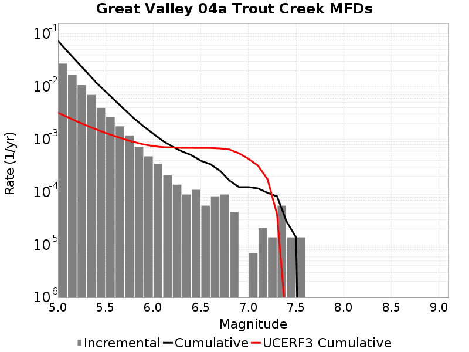

| Magnitude | Incremental Rate | Cumulative Rate | UCERF3 Cumulative Rate |
|-----|-----|-----|-----|
| 5.05 | 0.027464466 | 0.076914325 | 0.0032126831 |
| 5.15 | 0.016948512 | 0.04944986 | 0.0026453158 |
| 5.25 | 0.010730143 | 0.032501347 | 0.00219464 |
| 5.35 | 0.006985302 | 0.021771204 | 0.0018366554 |
| 5.45 | 0.003965938 | 0.014785902 | 0.0015522981 |
| 5.55 | 0.0026808083 | 0.010819963 | 0.0013264251 |
| 5.65 | 0.0019276947 | 0.008139155 | 0.0011470078 |
| 5.75 | 0.0014025879 | 0.0062114606 | 0.0010044916 |
| 5.85 | 0.0010156671 | 0.004808873 | 8.912869E-4 |
| 5.95 | 6.5638346E-4 | 0.0037932056 | 8.0136524E-4 |
| 6.05 | 5.0437887E-4 | 0.0031368223 | 7.471634E-4 |
| 6.15 | 3.800115E-4 | 0.0026324433 | 7.1321917E-4 |
| 6.25 | 2.7637198E-4 | 0.0022524318 | 7.024378E-4 |
| 6.35 | 2.625534E-4 | 0.0019760597 | 6.8931474E-4 |
| 6.45 | 2.210976E-4 | 0.0017135064 | 6.8931474E-4 |
| 6.55 | 2.07279E-4 | 0.0014924088 | 6.865665E-4 |
| 6.65 | 2.349162E-4 | 0.0012851298 | 6.865665E-4 |
| 6.75 | 2.210976E-4 | 0.0010502136 | 6.7400775E-4 |
| 6.85 | 1.450953E-4 | 8.29116E-4 | 6.4325385E-4 |
| 6.95 | 1.243674E-4 | 6.840207E-4 | 5.455537E-4 |
| 7.05 | 1.5200459E-4 | 5.596533E-4 | 4.2898004E-4 |
| 7.15 | 1.727325E-4 | 4.0764868E-4 | 3.1718324E-4 |
| 7.25 | 4.1455798E-5 | 2.349162E-4 | 1.751583E-4 |
| 7.35 | 9.67302E-5 | 1.934604E-4 | 3.78346E-5 |
| 7.45 | 3.4546498E-5 | 9.67302E-5 | 2.7385022E-7 |
| 7.55 | 2.76372E-5 | 6.21837E-5 | 0.0 |
| 7.65 | 1.38186E-5 | 3.4546498E-5 | 0.0 |
| 7.75 | 6.9093E-6 | 2.0727899E-5 | 0.0 |
| 7.85 | 1.38186E-5 | 1.38186E-5 | 0.0 |

### Great Valley 04b Gordon Valley
*[(top)](#table-of-contents)*

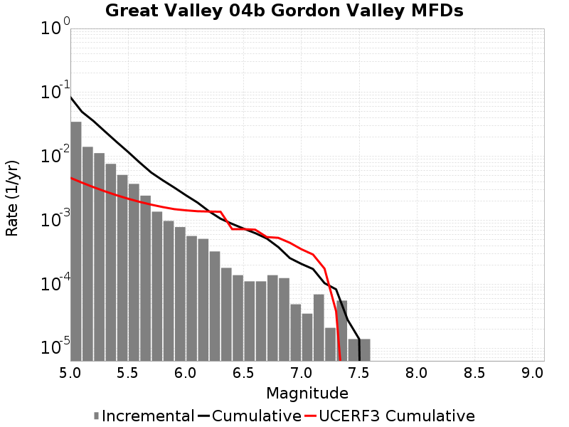

| Magnitude | Incremental Rate | Cumulative Rate | UCERF3 Cumulative Rate |
|-----|-----|-----|-----|
| 5.05 | 0.03464323 | 0.08828703 | 0.0046114046 |
| 5.15 | 0.014060426 | 0.053643804 | 0.0038771776 |
| 5.25 | 0.011213793 | 0.039583378 | 0.0032939604 |
| 5.35 | 0.0076140487 | 0.028369585 | 0.0028306944 |
| 5.45 | 0.0051197913 | 0.020755537 | 0.0024627093 |
| 5.55 | 0.0037241126 | 0.015635746 | 0.0021704081 |
| 5.65 | 0.002556441 | 0.011911633 | 0.0019382254 |
| 5.75 | 0.0016651413 | 0.009355192 | 0.0017537959 |
| 5.85 | 0.0013542228 | 0.0076900506 | 0.0016072983 |
| 5.95 | 0.0011331252 | 0.006335828 | 0.0014909311 |
| 6.05 | 0.0010294857 | 0.0052027027 | 0.0014294649 |
| 6.15 | 7.876602E-4 | 0.0041732173 | 0.0013838306 |
| 6.25 | 5.251068E-4 | 0.0033855569 | 0.0013692676 |
| 6.35 | 3.247371E-4 | 0.0028604502 | 0.0013577001 |
| 6.45 | 2.901906E-4 | 0.0025357131 | 7.2646193E-4 |
| 6.55 | 3.385557E-4 | 0.0022455226 | 7.2644075E-4 |
| 6.65 | 3.592836E-4 | 0.0019069668 | 7.1201735E-4 |
| 6.75 | 3.800115E-4 | 0.0015476831 | 5.4575544E-4 |
| 6.85 | 3.45465E-4 | 0.0011676716 | 5.3056556E-4 |
| 6.95 | 1.796418E-4 | 8.2220667E-4 | 4.4397503E-4 |
| 7.05 | 2.003697E-4 | 6.425649E-4 | 3.5172387E-4 |
| 7.15 | 1.727325E-4 | 4.421952E-4 | 2.9098566E-4 |
| 7.25 | 8.98209E-5 | 2.694627E-4 | 1.7477165E-4 |
| 7.35 | 1.105488E-4 | 1.796418E-4 | 3.764641E-5 |
| 7.45 | 3.4546498E-5 | 6.9092996E-5 | 2.7385022E-7 |
| 7.55 | 2.76372E-5 | 3.4546498E-5 | 0.0 |
| 7.65 | 6.9093E-6 | 6.9093E-6 | 0.0 |

### Great Valley 05 Pittsburg - Kirby Hills alt1
*[(top)](#table-of-contents)*

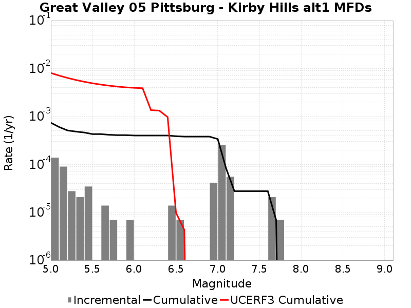

| Magnitude | Incremental Rate | Cumulative Rate | UCERF3 Cumulative Rate |
|-----|-----|-----|-----|
| 5.05 | 1.3818599E-4 | 7.531137E-4 | 0.00806022 |
| 5.15 | 8.98209E-5 | 6.149277E-4 | 0.007114938 |
| 5.25 | 2.76372E-5 | 5.251068E-4 | 0.0063640745 |
| 5.35 | 2.0727899E-5 | 4.974696E-4 | 0.005767642 |
| 5.45 | 3.4546498E-5 | 4.767417E-4 | 0.005293879 |
| 5.55 | 0.0 | 4.421952E-4 | 0.004917556 |
| 5.65 | 1.38186E-5 | 4.421952E-4 | 0.0046186317 |
| 5.75 | 6.9093E-6 | 4.283766E-4 | 0.0043811877 |
| 5.85 | 0.0 | 4.214673E-4 | 0.004192579 |
| 5.95 | 6.9093E-6 | 4.214673E-4 | 0.004042762 |
| 6.05 | 0.0 | 4.14558E-4 | 0.0039521945 |
| 6.15 | 0.0 | 4.14558E-4 | 0.0038838768 |
| 6.25 | 6.9093E-6 | 4.14558E-4 | 0.00135566 |
| 6.35 | 0.0 | 4.0764868E-4 | 0.001322748 |
| 6.45 | 1.38186E-5 | 4.0764868E-4 | 9.682582E-4 |
| 6.55 | 6.9093E-6 | 3.938301E-4 | 9.788367E-6 |
| 6.65 | 6.9093E-6 | 3.869208E-4 | 4.3057744E-6 |
| 6.75 | 0.0 | 3.800115E-4 | 0.0 |
| 6.85 | 0.0 | 3.800115E-4 | 0.0 |
| 6.95 | 4.1455798E-5 | 3.800115E-4 | 0.0 |
| 7.05 | 2.556441E-4 | 3.385557E-4 | 0.0 |
| 7.15 | 5.52744E-5 | 8.2911596E-5 | 0.0 |
| 7.25 | 0.0 | 2.76372E-5 | 0.0 |
| 7.35 | 0.0 | 2.76372E-5 | 0.0 |
| 7.45 | 0.0 | 2.76372E-5 | 0.0 |
| 7.55 | 0.0 | 2.76372E-5 | 0.0 |
| 7.65 | 2.0727899E-5 | 2.76372E-5 | 0.0 |
| 7.75 | 6.9093E-6 | 6.9093E-6 | 0.0 |

### Great Valley 06 (Midland) 2011 CFM alt1
*[(top)](#table-of-contents)*

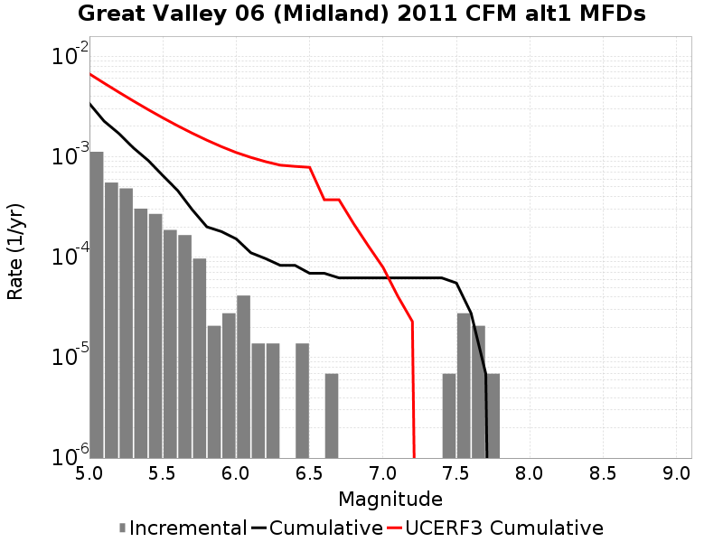

| Magnitude | Incremental Rate | Cumulative Rate | UCERF3 Cumulative Rate |
|-----|-----|-----|-----|
| 5.05 | 0.0011193065 | 0.0037724779 | 0.006677428 |
| 5.15 | 5.5274396E-4 | 0.002653171 | 0.005402478 |
| 5.25 | 4.83651E-4 | 0.0021004272 | 0.004389749 |
| 5.35 | 3.0400918E-4 | 0.0016167762 | 0.00358531 |
| 5.45 | 2.694627E-4 | 0.0013127669 | 0.0029463214 |
| 5.55 | 1.865511E-4 | 0.0010433043 | 0.0024387545 |
| 5.65 | 1.6582319E-4 | 8.567532E-4 | 0.0020355799 |
| 5.75 | 9.67302E-5 | 6.9093E-4 | 0.0017153269 |
| 5.85 | 2.0727899E-5 | 5.941998E-4 | 0.0014609409 |
| 5.95 | 4.83651E-5 | 5.734719E-4 | 0.001258875 |
| 6.05 | 6.21837E-5 | 5.251068E-4 | 0.0011006475 |
| 6.15 | 2.0727899E-5 | 4.6292308E-4 | 9.840578E-4 |
| 6.25 | 4.83651E-5 | 4.421952E-4 | 8.92954E-4 |
| 6.35 | 3.4546498E-5 | 3.938301E-4 | 8.2400645E-4 |
| 6.45 | 2.76372E-5 | 3.592836E-4 | 8.013309E-4 |
| 6.55 | 1.38186E-5 | 3.3164638E-4 | 7.8403373E-4 |
| 6.65 | 2.76372E-5 | 3.178278E-4 | 3.7321576E-4 |
| 6.75 | 2.0727899E-5 | 2.901906E-4 | 3.7305077E-4 |
| 6.85 | 1.38186E-5 | 2.694627E-4 | 2.151537E-4 |
| 6.95 | 3.4546498E-5 | 2.556441E-4 | 1.2940659E-4 |
| 7.05 | 9.67302E-5 | 2.210976E-4 | 7.9181606E-5 |
| 7.15 | 5.52744E-5 | 1.243674E-4 | 4.100547E-5 |
| 7.25 | 0.0 | 6.9092996E-5 | 2.2863744E-5 |
| 7.35 | 0.0 | 6.9092996E-5 | 0.0 |
| 7.45 | 1.38186E-5 | 6.9092996E-5 | 0.0 |
| 7.55 | 2.76372E-5 | 5.52744E-5 | 0.0 |
| 7.65 | 2.0727899E-5 | 2.76372E-5 | 0.0 |
| 7.75 | 6.9093E-6 | 6.9093E-6 | 0.0 |

### Great Valley 07 (Orestimba)
*[(top)](#table-of-contents)*

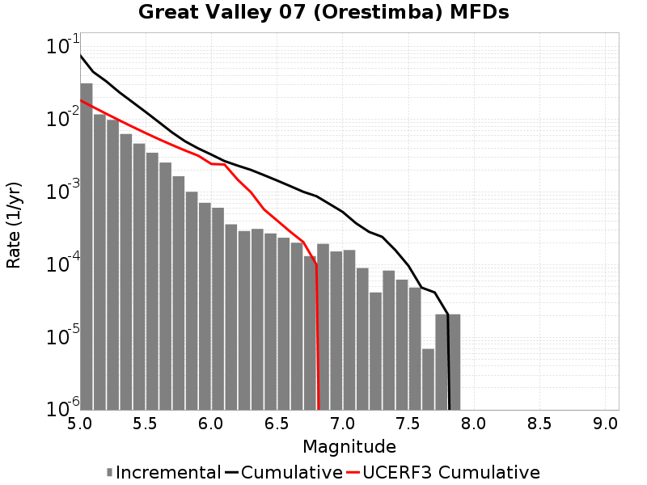

| Magnitude | Incremental Rate | Cumulative Rate | UCERF3 Cumulative Rate |
|-----|-----|-----|-----|
| 5.05 | 0.031437315 | 0.08227594 | 0.018434417 |
| 5.15 | 0.011752719 | 0.050838627 | 0.014843676 |
| 5.25 | 0.009873389 | 0.03908591 | 0.011991451 |
| 5.35 | 0.0063220095 | 0.02921252 | 0.009725847 |
| 5.45 | 0.0047121425 | 0.02289051 | 0.0079262145 |
| 5.55 | 0.0035997452 | 0.018178368 | 0.0064967154 |
| 5.65 | 0.0028051757 | 0.014578623 | 0.005361224 |
| 5.75 | 0.0021487924 | 0.011773447 | 0.004459271 |
| 5.85 | 0.0015269553 | 0.009624654 | 0.003741273 |
| 5.95 | 0.0011538531 | 0.0080977 | 0.0031721792 |
| 6.05 | 0.0010433043 | 0.0069438466 | 0.0024397557 |
| 6.15 | 7.392951E-4 | 0.0059005423 | 0.0023971263 |
| 6.25 | 6.287463E-4 | 0.005161247 | 0.0014839681 |
| 6.35 | 7.1165786E-4 | 0.0045325006 | 9.982939E-4 |
| 6.45 | 6.840207E-4 | 0.0038208428 | 5.7819113E-4 |
| 6.55 | 4.83651E-4 | 0.0031368223 | 4.0642844E-4 |
| 6.65 | 6.21837E-4 | 0.002653171 | 2.8509687E-4 |
| 6.75 | 3.385557E-4 | 0.0020313342 | 2.0469303E-4 |
| 6.85 | 4.007394E-4 | 0.0016927784 | 1.0009144E-4 |
| 6.95 | 2.901906E-4 | 0.001292039 | 0.0 |
| 7.05 | 3.3164638E-4 | 0.0010018485 | 0.0 |
| 7.15 | 2.418255E-4 | 6.702021E-4 | 0.0 |
| 7.25 | 1.036395E-4 | 4.283766E-4 | 0.0 |
| 7.35 | 1.105488E-4 | 3.247371E-4 | 0.0 |
| 7.45 | 1.036395E-4 | 2.141883E-4 | 0.0 |
| 7.55 | 6.21837E-5 | 1.105488E-4 | 0.0 |
| 7.65 | 6.9093E-6 | 4.83651E-5 | 0.0 |
| 7.75 | 2.0727899E-5 | 4.1455798E-5 | 0.0 |
| 7.85 | 2.0727899E-5 | 2.0727899E-5 | 0.0 |

### Great Valley 08 (Quinto)
*[(top)](#table-of-contents)*

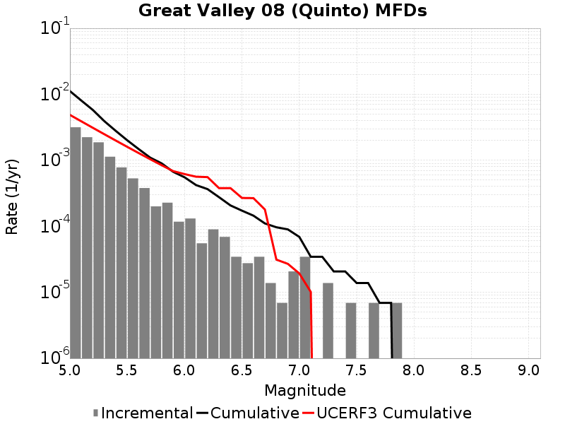

| Magnitude | Incremental Rate | Cumulative Rate | UCERF3 Cumulative Rate |
|-----|-----|-----|-----|
| 5.05 | 0.0031644593 | 0.013459316 | 0.0048809317 |
| 5.15 | 0.002238613 | 0.0102948565 | 0.0038939351 |
| 5.25 | 0.0019000574 | 0.008056244 | 0.003109936 |
| 5.35 | 0.0013887692 | 0.006156186 | 0.0024871833 |
| 5.45 | 0.0010571228 | 0.004767417 | 0.0019925132 |
| 5.55 | 8.7748107E-4 | 0.0037102941 | 0.0015995828 |
| 5.65 | 6.0801837E-4 | 0.002832813 | 0.0012874672 |
| 5.75 | 4.14558E-4 | 0.0022247946 | 0.0010395449 |
| 5.85 | 3.592836E-4 | 0.0018102366 | 8.426132E-4 |
| 5.95 | 2.07279E-4 | 0.001450953 | 6.861848E-4 |
| 6.05 | 2.07279E-4 | 0.001243674 | 6.183035E-4 |
| 6.15 | 7.6002296E-5 | 0.001036395 | 5.6438346E-4 |
| 6.25 | 1.6582319E-4 | 9.603927E-4 | 5.5641535E-4 |
| 6.35 | 1.105488E-4 | 7.945695E-4 | 3.791523E-4 |
| 6.45 | 8.98209E-5 | 6.840207E-4 | 3.791523E-4 |
| 6.55 | 6.21837E-5 | 5.941998E-4 | 2.6893965E-4 |
| 6.65 | 7.6002296E-5 | 5.320161E-4 | 2.6734034E-4 |
| 6.75 | 4.83651E-5 | 4.560138E-4 | 1.7954849E-4 |
| 6.85 | 2.76372E-5 | 4.0764868E-4 | 3.1294683E-5 |
| 6.95 | 6.9092996E-5 | 3.800115E-4 | 2.7002805E-5 |
| 7.05 | 6.9092996E-5 | 3.109185E-4 | 1.9301842E-5 |
| 7.15 | 4.83651E-5 | 2.418255E-4 | 1.0133934E-5 |
| 7.25 | 4.83651E-5 | 1.934604E-4 | 0.0 |
| 7.35 | 5.52744E-5 | 1.450953E-4 | 0.0 |
| 7.45 | 2.76372E-5 | 8.98209E-5 | 0.0 |
| 7.55 | 2.76372E-5 | 6.21837E-5 | 0.0 |
| 7.65 | 6.9093E-6 | 3.4546498E-5 | 0.0 |
| 7.75 | 1.38186E-5 | 2.76372E-5 | 0.0 |
| 7.85 | 1.38186E-5 | 1.38186E-5 | 0.0 |

### Great Valley 09 (Laguna Seca)
*[(top)](#table-of-contents)*

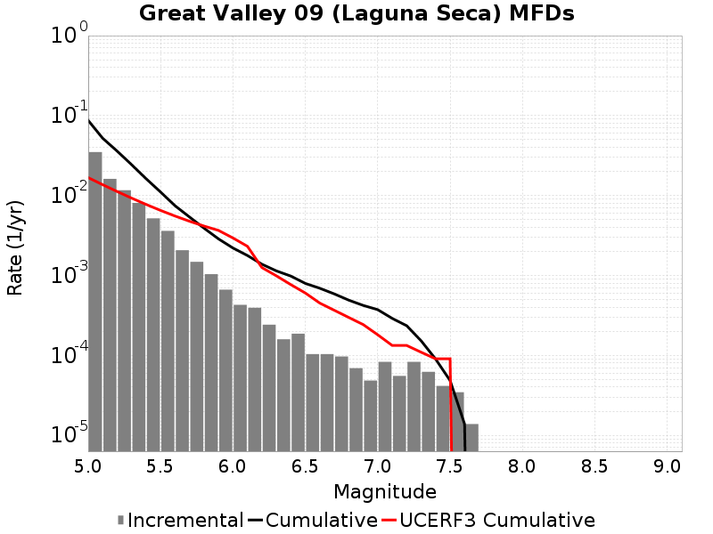

| Magnitude | Incremental Rate | Cumulative Rate | UCERF3 Cumulative Rate |
|-----|-----|-----|-----|
| 5.05 | 0.03494033 | 0.08843904 | 0.0167377 |
| 5.15 | 0.016140124 | 0.053498708 | 0.013661041 |
| 5.25 | 0.011635261 | 0.037358586 | 0.011217164 |
| 5.35 | 0.008070062 | 0.025723323 | 0.0092759235 |
| 5.45 | 0.0051750657 | 0.01765326 | 0.007733941 |
| 5.55 | 0.0036481104 | 0.012478196 | 0.006509101 |
| 5.65 | 0.0022178853 | 0.008830085 | 0.0055356636 |
| 5.75 | 0.0016236855 | 0.0066122 | 0.004762842 |
| 5.85 | 0.0012298553 | 0.0049885144 | 0.0041484195 |
| 5.95 | 8.014788E-4 | 0.0037586591 | 0.0036608018 |
| 6.05 | 5.389254E-4 | 0.0029571804 | 0.002942349 |
| 6.15 | 4.83651E-4 | 0.002418255 | 0.0023147448 |
| 6.25 | 3.109185E-4 | 0.001934604 | 0.0012542375 |
| 6.35 | 2.349162E-4 | 0.0016236855 | 9.880789E-4 |
| 6.45 | 2.418255E-4 | 0.0013887692 | 7.672094E-4 |
| 6.55 | 1.450953E-4 | 0.0011469438 | 6.0234085E-4 |
| 6.65 | 1.312767E-4 | 0.0010018485 | 4.5053323E-4 |
| 6.75 | 1.312767E-4 | 8.7057176E-4 | 3.6642E-4 |
| 6.85 | 1.174581E-4 | 7.392951E-4 | 2.979713E-4 |
| 6.95 | 6.9092996E-5 | 6.21837E-4 | 2.4257594E-4 |
| 7.05 | 1.105488E-4 | 5.5274396E-4 | 1.809068E-4 |
| 7.15 | 9.67302E-5 | 4.421952E-4 | 1.3306798E-4 |
| 7.25 | 1.105488E-4 | 3.45465E-4 | 1.3306798E-4 |
| 7.35 | 1.243674E-4 | 2.349162E-4 | 1.09428736E-4 |
| 7.45 | 5.52744E-5 | 1.105488E-4 | 9.0522284E-5 |
| 7.55 | 4.1455798E-5 | 5.52744E-5 | 9.0522284E-5 |
| 7.65 | 1.38186E-5 | 1.38186E-5 | 0.0 |

### Great Valley 10 (Panoche)
*[(top)](#table-of-contents)*

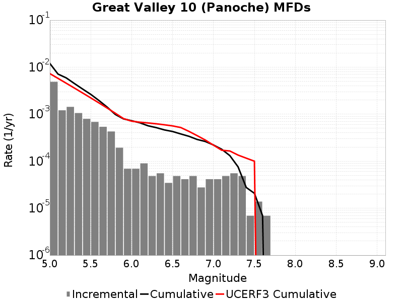

| Magnitude | Incremental Rate | Cumulative Rate | UCERF3 Cumulative Rate |
|-----|-----|-----|-----|
| 5.05 | 0.004877966 | 0.013597502 | 0.007302307 |
| 5.15 | 0.0012091275 | 0.0087195365 | 0.005773837 |
| 5.25 | 0.0014302251 | 0.0075104088 | 0.00455973 |
| 5.35 | 0.0010571228 | 0.006080184 | 0.0035953305 |
| 5.45 | 7.945695E-4 | 0.005023061 | 0.0028292807 |
| 5.55 | 7.047486E-4 | 0.0042284913 | 0.002220786 |
| 5.65 | 5.5274396E-4 | 0.003523743 | 0.0017374412 |
| 5.75 | 5.251068E-4 | 0.0029709989 | 0.0013535068 |
| 5.85 | 3.592836E-4 | 0.0024458922 | 0.0010485369 |
| 5.95 | 1.934604E-4 | 0.0020866087 | 8.0629066E-4 |
| 6.05 | 1.450953E-4 | 0.0018931482 | 7.0931535E-4 |
| 6.15 | 1.934604E-4 | 0.0017480529 | 6.7495287E-4 |
| 6.25 | 1.3818599E-4 | 0.0015545925 | 6.504882E-4 |
| 6.35 | 9.67302E-5 | 0.0014164065 | 6.2470144E-4 |
| 6.45 | 7.6002296E-5 | 0.0013196763 | 5.950116E-4 |
| 6.55 | 9.67302E-5 | 0.001243674 | 5.633104E-4 |
| 6.65 | 9.67302E-5 | 0.0011469438 | 5.203517E-4 |
| 6.75 | 1.174581E-4 | 0.0010502136 | 4.307411E-4 |
| 6.85 | 1.105488E-4 | 9.327555E-4 | 3.498655E-4 |
| 6.95 | 1.5200459E-4 | 8.2220667E-4 | 2.8174874E-4 |
| 7.05 | 1.796418E-4 | 6.702021E-4 | 2.1913668E-4 |
| 7.15 | 1.589139E-4 | 4.905603E-4 | 1.7129784E-4 |
| 7.25 | 1.450953E-4 | 3.3164638E-4 | 1.6477573E-4 |
| 7.35 | 8.98209E-5 | 1.865511E-4 | 1.3498664E-4 |
| 7.45 | 5.52744E-5 | 9.67302E-5 | 1.1608019E-4 |
| 7.55 | 3.4546498E-5 | 4.1455798E-5 | 1.0001791E-4 |
| 7.65 | 6.9093E-6 | 6.9093E-6 | 0.0 |

### Great Valley 11
*[(top)](#table-of-contents)*

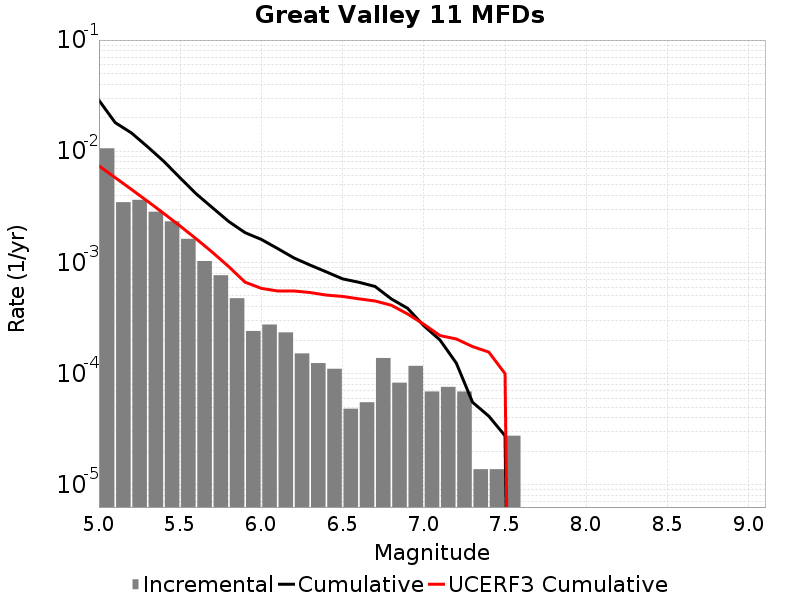

| Magnitude | Incremental Rate | Cumulative Rate | UCERF3 Cumulative Rate |
|-----|-----|-----|-----|
| 5.05 | 0.010626503 | 0.029889632 | 0.007370854 |
| 5.15 | 0.003482287 | 0.019263128 | 0.0057927915 |
| 5.25 | 0.0036550197 | 0.01578084 | 0.0045392923 |
| 5.35 | 0.0028604502 | 0.012125822 | 0.0035436023 |
| 5.45 | 0.002349162 | 0.009265372 | 0.0027526978 |
| 5.55 | 0.0017135064 | 0.006916209 | 0.0021244597 |
| 5.65 | 0.0012367647 | 0.0052027027 | 0.0016254327 |
| 5.75 | 9.949392E-4 | 0.003965938 | 0.0012290414 |
| 5.85 | 6.425649E-4 | 0.0029709989 | 9.1417663E-4 |
| 5.95 | 3.523743E-4 | 0.002328434 | 6.640706E-4 |
| 6.05 | 3.523743E-4 | 0.0019760597 | 5.846041E-4 |
| 6.15 | 3.0400918E-4 | 0.0016236855 | 5.537108E-4 |
| 6.25 | 1.796418E-4 | 0.0013196763 | 5.537108E-4 |
| 6.35 | 1.5200459E-4 | 0.0011400345 | 5.362627E-4 |
| 6.45 | 1.174581E-4 | 9.880299E-4 | 5.08558E-4 |
| 6.55 | 5.52744E-5 | 8.7057176E-4 | 4.946318E-4 |
| 6.65 | 5.52744E-5 | 8.1529736E-4 | 4.7060172E-4 |
| 6.75 | 1.727325E-4 | 7.60023E-4 | 4.4997336E-4 |
| 6.85 | 8.98209E-5 | 5.872905E-4 | 4.1222948E-4 |
| 6.95 | 1.450953E-4 | 4.974696E-4 | 3.4411272E-4 |
| 7.05 | 8.2911596E-5 | 3.523743E-4 | 2.7784807E-4 |
| 7.15 | 8.98209E-5 | 2.694627E-4 | 2.1994414E-4 |
| 7.25 | 8.2911596E-5 | 1.796418E-4 | 2.0495847E-4 |
| 7.35 | 2.0727899E-5 | 9.67302E-5 | 1.7516939E-4 |
| 7.45 | 3.4546498E-5 | 7.6002296E-5 | 1.5626295E-4 |
| 7.55 | 3.4546498E-5 | 4.1455798E-5 | 1.0001791E-4 |
| 7.65 | 6.9093E-6 | 6.9093E-6 | 0.0 |

### Great Valley 12
*[(top)](#table-of-contents)*

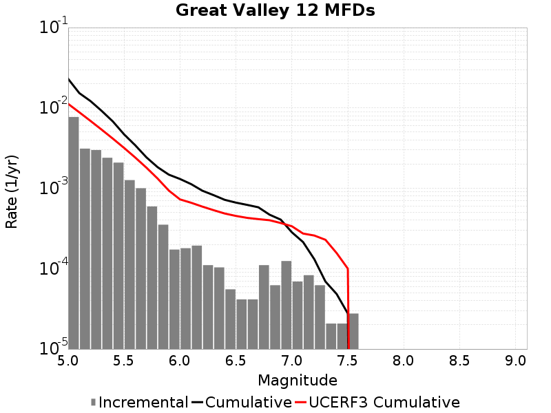

| Magnitude | Incremental Rate | Cumulative Rate | UCERF3 Cumulative Rate |
|-----|-----|-----|-----|
| 5.05 | 0.0077107786 | 0.024431285 | 0.011241798 |
| 5.15 | 0.0031160943 | 0.016720505 | 0.008817032 |
| 5.25 | 0.0029917269 | 0.013604412 | 0.006890972 |
| 5.35 | 0.002397527 | 0.010612684 | 0.0053610485 |
| 5.45 | 0.0020866087 | 0.008215157 | 0.004145787 |
| 5.55 | 0.0013473135 | 0.006128549 | 0.0031804703 |
| 5.65 | 0.0011883996 | 0.0047812355 | 0.002413692 |
| 5.75 | 8.29116E-4 | 0.003592836 | 0.0018046184 |
| 5.85 | 5.872905E-4 | 0.00276372 | 0.001320814 |
| 5.95 | 3.109185E-4 | 0.0021764294 | 9.365145E-4 |
| 6.05 | 2.970999E-4 | 0.001865511 | 7.2747975E-4 |
| 6.15 | 3.0400918E-4 | 0.0015684111 | 6.605592E-4 |
| 6.25 | 1.589139E-4 | 0.0012644018 | 5.9161556E-4 |
| 6.35 | 1.5200459E-4 | 0.0011054879 | 5.3433096E-4 |
| 6.45 | 1.105488E-4 | 9.534834E-4 | 4.8540675E-4 |
| 6.55 | 6.21837E-5 | 8.429346E-4 | 4.529285E-4 |
| 6.65 | 5.52744E-5 | 7.807509E-4 | 4.2860972E-4 |
| 6.75 | 1.589139E-4 | 7.254765E-4 | 4.1353804E-4 |
| 6.85 | 8.98209E-5 | 5.665626E-4 | 4.005212E-4 |
| 6.95 | 1.312767E-4 | 4.767417E-4 | 3.6988567E-4 |
| 7.05 | 7.6002296E-5 | 3.45465E-4 | 3.3691098E-4 |
| 7.15 | 9.67302E-5 | 2.694627E-4 | 2.7348855E-4 |
| 7.25 | 6.9092996E-5 | 1.727325E-4 | 2.5850287E-4 |
| 7.35 | 2.76372E-5 | 1.036395E-4 | 2.2871379E-4 |
| 7.45 | 2.76372E-5 | 7.6002296E-5 | 1.5626295E-4 |
| 7.55 | 4.83651E-5 | 4.83651E-5 | 1.0001791E-4 |

### Great Valley 13 (Coalinga)
*[(top)](#table-of-contents)*

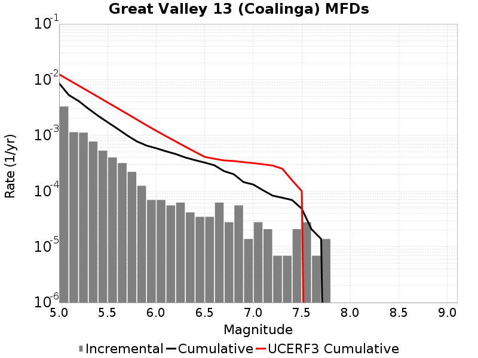

| Magnitude | Incremental Rate | Cumulative Rate | UCERF3 Cumulative Rate |
|-----|-----|-----|-----|
| 5.05 | 0.0032957362 | 0.009355192 | 0.0124317445 |
| 5.15 | 0.0011400345 | 0.006059456 | 0.009864163 |
| 5.25 | 0.0011193065 | 0.0049194214 | 0.007824658 |
| 5.35 | 7.738416E-4 | 0.0038001148 | 0.0062046237 |
| 5.45 | 5.458347E-4 | 0.0030262733 | 0.004917784 |
| 5.55 | 4.214673E-4 | 0.0024804387 | 0.0038956108 |
| 5.65 | 4.007394E-4 | 0.0020589714 | 0.00308367 |
| 5.75 | 2.625534E-4 | 0.001658232 | 0.0024387224 |
| 5.85 | 1.796418E-4 | 0.0013956786 | 0.0019264222 |
| 5.95 | 1.312767E-4 | 0.0012160367 | 0.0015201803 |
| 6.05 | 8.2911596E-5 | 0.0010847601 | 0.0012097765 |
| 6.15 | 9.67302E-5 | 0.0010018485 | 9.695258E-4 |
| 6.25 | 9.67302E-5 | 9.051183E-4 | 7.786879E-4 |
| 6.35 | 7.6002296E-5 | 8.083881E-4 | 6.270999E-4 |
| 6.45 | 6.21837E-5 | 7.323858E-4 | 5.066893E-4 |
| 6.55 | 8.98209E-5 | 6.702021E-4 | 4.1104376E-4 |
| 6.65 | 1.036395E-4 | 5.803812E-4 | 3.7971608E-4 |
| 6.75 | 4.83651E-5 | 4.767417E-4 | 3.548316E-4 |
| 6.85 | 8.98209E-5 | 4.283766E-4 | 3.4652863E-4 |
| 6.95 | 4.83651E-5 | 3.385557E-4 | 3.301431E-4 |
| 7.05 | 6.9092996E-5 | 2.901906E-4 | 3.1793414E-4 |
| 7.15 | 5.52744E-5 | 2.210976E-4 | 3.0235053E-4 |
| 7.25 | 2.76372E-5 | 1.6582319E-4 | 2.8736488E-4 |
| 7.35 | 2.0727899E-5 | 1.3818599E-4 | 2.516089E-4 |
| 7.45 | 2.76372E-5 | 1.174581E-4 | 1.5626295E-4 |
| 7.55 | 4.1455798E-5 | 8.98209E-5 | 1.0001791E-4 |
| 7.65 | 6.9093E-6 | 4.83651E-5 | 0.0 |
| 7.75 | 3.4546498E-5 | 4.1455798E-5 | 0.0 |
| 7.85 | 6.9093E-6 | 6.9093E-6 | 0.0 |

### Great Valley 14 (Kettleman Hills)
*[(top)](#table-of-contents)*

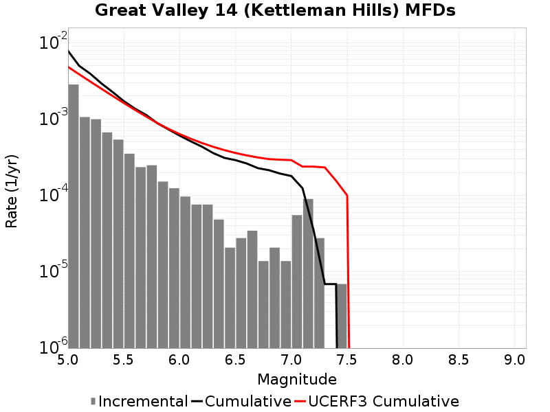

| Magnitude | Incremental Rate | Cumulative Rate | UCERF3 Cumulative Rate |
|-----|-----|-----|-----|
| 5.05 | 0.0028397222 | 0.008629716 | 0.004828992 |
| 5.15 | 0.0010640322 | 0.0057899933 | 0.003865819 |
| 5.25 | 9.949392E-4 | 0.004725961 | 0.0031007435 |
| 5.35 | 6.702021E-4 | 0.003731022 | 0.0024930225 |
| 5.45 | 5.389254E-4 | 0.0030608198 | 0.0020102926 |
| 5.55 | 3.592836E-4 | 0.0025218944 | 0.0016268466 |
| 5.65 | 2.418255E-4 | 0.0021626109 | 0.0013222646 |
| 5.75 | 2.487348E-4 | 0.0019207854 | 0.0010803265 |
| 5.85 | 1.6582319E-4 | 0.0016720506 | 8.881482E-4 |
| 5.95 | 1.312767E-4 | 0.0015062274 | 7.4517046E-4 |
| 6.05 | 1.243674E-4 | 0.0013749506 | 6.3672254E-4 |
| 6.15 | 1.036395E-4 | 0.0012505833 | 5.528434E-4 |
| 6.25 | 9.67302E-5 | 0.0011469438 | 4.8621575E-4 |
| 6.35 | 8.98209E-5 | 0.0010502136 | 4.3424394E-4 |
| 6.45 | 4.83651E-5 | 9.603927E-4 | 3.9296123E-4 |
| 6.55 | 4.1455798E-5 | 9.120276E-4 | 3.6016922E-4 |
| 6.65 | 4.83651E-5 | 8.7057176E-4 | 3.3491277E-4 |
| 6.75 | 2.76372E-5 | 8.2220667E-4 | 3.1485085E-4 |
| 6.85 | 5.52744E-5 | 7.945695E-4 | 2.9924794E-4 |
| 6.95 | 4.83651E-5 | 7.392951E-4 | 2.942904E-4 |
| 7.05 | 6.9092996E-5 | 6.9093E-4 | 2.9035247E-4 |
| 7.15 | 1.174581E-4 | 6.21837E-4 | 2.3866932E-4 |
| 7.25 | 4.1455798E-5 | 5.0437887E-4 | 2.3866932E-4 |
| 7.35 | 1.38186E-5 | 4.6292308E-4 | 2.3270246E-4 |
| 7.45 | 3.4546498E-5 | 4.491045E-4 | 1.5626295E-4 |
| 7.55 | 9.67302E-5 | 4.14558E-4 | 1.0001791E-4 |
| 7.65 | 1.036395E-4 | 3.178278E-4 | 0.0 |
| 7.75 | 1.727325E-4 | 2.141883E-4 | 0.0 |
| 7.85 | 2.76372E-5 | 4.1455798E-5 | 0.0 |
| 7.95 | 6.9093E-6 | 1.38186E-5 | 0.0 |
| 8.05 | 0.0 | 6.9093E-6 | 0.0 |
| 8.15 | 6.9093E-6 | 6.9093E-6 | 0.0 |

### Greenville (No) 2011 CFM
*[(top)](#table-of-contents)*

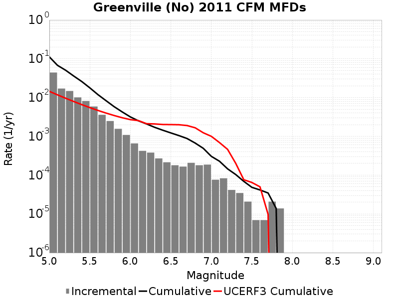

| Magnitude | Incremental Rate | Cumulative Rate | UCERF3 Cumulative Rate |
|-----|-----|-----|-----|
| 5.05 | 0.044150427 | 0.116380244 | 0.014442125 |
| 5.15 | 0.017038334 | 0.07222982 | 0.011752625 |
| 5.25 | 0.014744446 | 0.055191487 | 0.009616279 |
| 5.35 | 0.010087578 | 0.04044704 | 0.007919319 |
| 5.45 | 0.008201339 | 0.030359464 | 0.0065713753 |
| 5.55 | 0.0063703745 | 0.022158125 | 0.005500666 |
| 5.65 | 0.0044634077 | 0.01578775 | 0.0046501714 |
| 5.75 | 0.0033371919 | 0.011324342 | 0.0039745993 |
| 5.85 | 0.002093518 | 0.007987151 | 0.0034379736 |
| 5.95 | 0.0014371343 | 0.005893633 | 0.0030117163 |
| 6.05 | 9.2584617E-4 | 0.0044564987 | 0.002695236 |
| 6.15 | 5.458347E-4 | 0.0035306523 | 0.0025405057 |
| 6.25 | 5.112882E-4 | 0.0029848176 | 0.0021185628 |
| 6.35 | 3.45465E-4 | 0.0024735294 | 0.0020857656 |
| 6.45 | 3.45465E-4 | 0.0021280644 | 0.002018008 |
| 6.55 | 2.901906E-4 | 0.0017825994 | 0.0020077308 |
| 6.65 | 3.247371E-4 | 0.0014924088 | 0.0019898864 |
| 6.75 | 2.418255E-4 | 0.0011676716 | 0.0018965922 |
| 6.85 | 2.487348E-4 | 9.2584617E-4 | 0.0016597494 |
| 6.95 | 2.487348E-4 | 6.771114E-4 | 0.001235093 |
| 7.05 | 1.036395E-4 | 4.283766E-4 | 9.982423E-4 |
| 7.15 | 1.036395E-4 | 3.247371E-4 | 6.8996625E-4 |
| 7.25 | 4.83651E-5 | 2.210976E-4 | 4.6127423E-4 |
| 7.35 | 6.9092996E-5 | 1.727325E-4 | 2.0204736E-4 |
| 7.45 | 2.76372E-5 | 1.036395E-4 | 7.6019285E-5 |
| 7.55 | 2.0727899E-5 | 7.6002296E-5 | 6.4578635E-5 |
| 7.65 | 6.9093E-6 | 5.52744E-5 | 4.991595E-5 |
| 7.75 | 2.76372E-5 | 4.83651E-5 | 9.7324355E-6 |
| 7.85 | 2.0727899E-5 | 2.0727899E-5 | 0.0 |

### Greenville (So) 2011 CFM
*[(top)](#table-of-contents)*

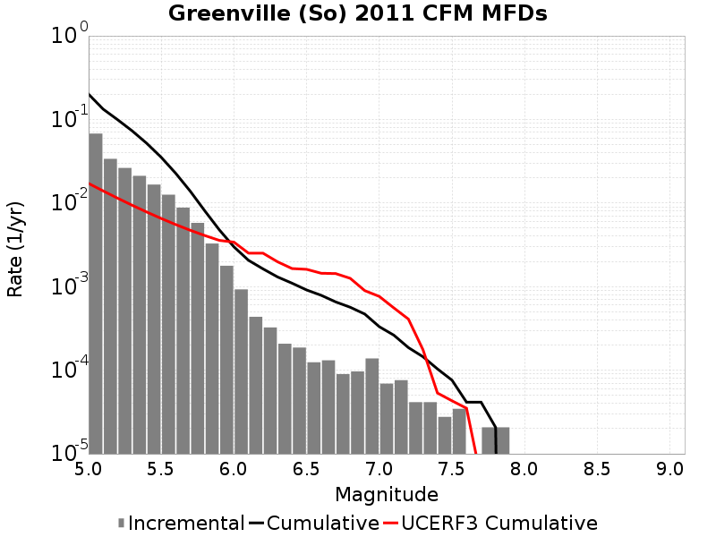

| Magnitude | Incremental Rate | Cumulative Rate | UCERF3 Cumulative Rate |
|-----|-----|-----|-----|
| 5.05 | 0.067697324 | 0.20155118 | 0.01716644 |
| 5.15 | 0.03376575 | 0.13385387 | 0.0139685115 |
| 5.25 | 0.026289886 | 0.10008812 | 0.011428308 |
| 5.35 | 0.021142459 | 0.07379823 | 0.009410552 |
| 5.45 | 0.016630685 | 0.052655775 | 0.0078077917 |
| 5.55 | 0.0125818355 | 0.03602509 | 0.0065346737 |
| 5.65 | 0.008830085 | 0.023443254 | 0.0055234004 |
| 5.75 | 0.005852177 | 0.014613169 | 0.0047201174 |
| 5.85 | 0.0033924663 | 0.008760992 | 0.004082047 |
| 5.95 | 0.0019000574 | 0.005368526 | 0.0035752098 |
| 6.05 | 0.001036395 | 0.0034684686 | 0.0034047633 |
| 6.15 | 4.974696E-4 | 0.0024320735 | 0.0025175738 |
| 6.25 | 3.800115E-4 | 0.001934604 | 0.0025124718 |
| 6.35 | 2.556441E-4 | 0.0015545925 | 0.0019826808 |
| 6.45 | 2.07279E-4 | 0.0012989484 | 0.0016445665 |
| 6.55 | 1.3818599E-4 | 0.0010916694 | 0.0016106018 |
| 6.65 | 1.450953E-4 | 9.534834E-4 | 0.001445908 |
| 6.75 | 8.98209E-5 | 8.083881E-4 | 0.001432695 |
| 6.85 | 1.174581E-4 | 7.185672E-4 | 0.0012567275 |
| 6.95 | 1.589139E-4 | 6.011091E-4 | 8.955679E-4 |
| 7.05 | 1.174581E-4 | 4.421952E-4 | 7.633265E-4 |
| 7.15 | 9.67302E-5 | 3.247371E-4 | 5.5627193E-4 |
| 7.25 | 4.83651E-5 | 2.280069E-4 | 4.091319E-4 |
| 7.35 | 7.6002296E-5 | 1.796418E-4 | 1.7639453E-4 |
| 7.45 | 2.76372E-5 | 1.036395E-4 | 5.335362E-5 |
| 7.55 | 3.4546498E-5 | 7.6002296E-5 | 4.3067088E-5 |
| 7.65 | 0.0 | 4.1455798E-5 | 3.507812E-5 |
| 7.75 | 2.0727899E-5 | 4.1455798E-5 | 5.0497806E-6 |
| 7.85 | 2.0727899E-5 | 2.0727899E-5 | 0.0 |

### Hartley Springs 2011 CFM
*[(top)](#table-of-contents)*

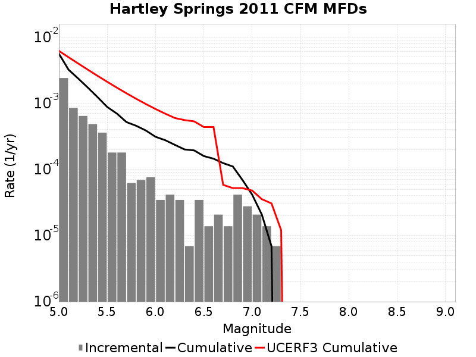

| Magnitude | Incremental Rate | Cumulative Rate | UCERF3 Cumulative Rate |
|-----|-----|-----|-----|
| 5.05 | 0.0024044365 | 0.005617261 | 0.0061864997 |
| 5.15 | 8.498439E-4 | 0.0032128245 | 0.004959693 |
| 5.25 | 6.425649E-4 | 0.0023629805 | 0.003985206 |
| 5.35 | 4.83651E-4 | 0.0017204157 | 0.0032111437 |
| 5.45 | 3.592836E-4 | 0.0012367647 | 0.002596284 |
| 5.55 | 1.796418E-4 | 8.7748107E-4 | 0.0021078836 |
| 5.65 | 1.796418E-4 | 6.978393E-4 | 0.0017199332 |
| 5.75 | 6.21837E-5 | 5.181975E-4 | 0.0014117734 |
| 5.85 | 6.9092996E-5 | 4.560138E-4 | 0.0011669934 |
| 5.95 | 7.6002296E-5 | 3.869208E-4 | 9.7255764E-4 |
| 6.05 | 3.4546498E-5 | 3.109185E-4 | 8.181119E-4 |
| 6.15 | 4.1455798E-5 | 2.7637198E-4 | 6.954312E-4 |
| 6.25 | 3.4546498E-5 | 2.349162E-4 | 5.979825E-4 |
| 6.35 | 6.9093E-6 | 2.003697E-4 | 5.56227E-4 |
| 6.45 | 3.4546498E-5 | 1.934604E-4 | 5.316326E-4 |
| 6.55 | 1.38186E-5 | 1.589139E-4 | 4.368563E-4 |
| 6.65 | 2.0727899E-5 | 1.450953E-4 | 4.368563E-4 |
| 6.75 | 1.38186E-5 | 1.243674E-4 | 5.8304457E-5 |
| 6.85 | 4.1455798E-5 | 1.105488E-4 | 5.2116928E-5 |
| 6.95 | 2.76372E-5 | 6.9092996E-5 | 5.2116928E-5 |
| 7.05 | 2.0727899E-5 | 4.1455798E-5 | 4.7866528E-5 |
| 7.15 | 1.38186E-5 | 2.0727899E-5 | 3.5438137E-5 |
| 7.25 | 6.9093E-6 | 6.9093E-6 | 3.061655E-5 |
| 7.35 | 0.0 | 0.0 | 1.20328095E-5 |

### Hat Creek-McArthur-Mayfield
*[(top)](#table-of-contents)*

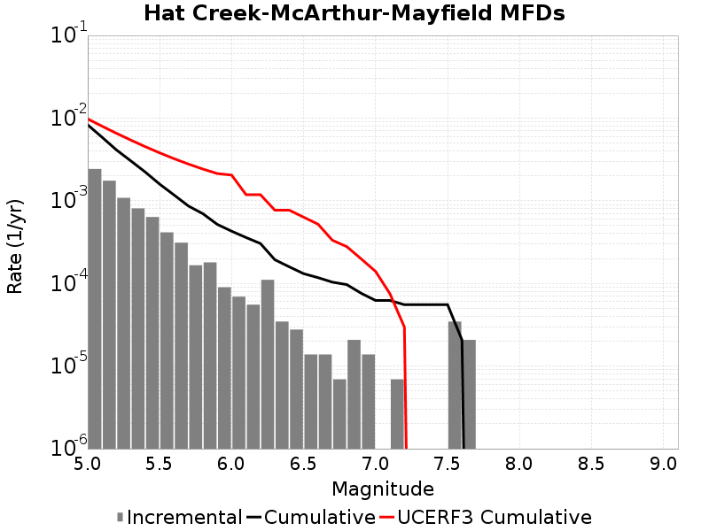

| Magnitude | Incremental Rate | Cumulative Rate | UCERF3 Cumulative Rate |
|-----|-----|-----|-----|
| 5.05 | 0.0024251642 | 0.00829116 | 0.009776516 |
| 5.15 | 0.0017480529 | 0.005865996 | 0.007978403 |
| 5.25 | 0.0010847601 | 0.004117943 | 0.006550111 |
| 5.35 | 8.083881E-4 | 0.0030331826 | 0.0054155784 |
| 5.45 | 6.356556E-4 | 0.0022247946 | 0.004514387 |
| 5.55 | 4.14558E-4 | 0.001589139 | 0.003798545 |
| 5.65 | 3.109185E-4 | 0.001174581 | 0.003229932 |
| 5.75 | 1.6582319E-4 | 8.636625E-4 | 0.0027782663 |
| 5.85 | 1.796418E-4 | 6.978393E-4 | 0.0024194955 |
| 5.95 | 8.98209E-5 | 5.181975E-4 | 0.0021345138 |
| 6.05 | 6.9092996E-5 | 4.283766E-4 | 0.0020454822 |
| 6.15 | 5.52744E-5 | 3.592836E-4 | 0.0011847414 |
| 6.25 | 1.105488E-4 | 3.0400918E-4 | 0.0011847414 |
| 6.35 | 3.4546498E-5 | 1.934604E-4 | 7.699087E-4 |
| 6.45 | 2.76372E-5 | 1.589139E-4 | 7.699087E-4 |
| 6.55 | 1.38186E-5 | 1.312767E-4 | 6.333205E-4 |
| 6.65 | 1.38186E-5 | 1.174581E-4 | 5.211367E-4 |
| 6.75 | 6.9093E-6 | 1.036395E-4 | 3.328059E-4 |
| 6.85 | 2.0727899E-5 | 9.67302E-5 | 2.7840163E-4 |
| 6.95 | 1.38186E-5 | 7.6002296E-5 | 1.9809982E-4 |
| 7.05 | 0.0 | 6.21837E-5 | 1.3969417E-4 |
| 7.15 | 6.9093E-6 | 6.21837E-5 | 7.483697E-5 |
| 7.25 | 0.0 | 5.52744E-5 | 2.960857E-5 |
| 7.35 | 0.0 | 5.52744E-5 | 0.0 |
| 7.45 | 0.0 | 5.52744E-5 | 0.0 |
| 7.55 | 3.4546498E-5 | 5.52744E-5 | 0.0 |
| 7.65 | 2.0727899E-5 | 2.0727899E-5 | 0.0 |

### Hector Mine
*[(top)](#table-of-contents)*

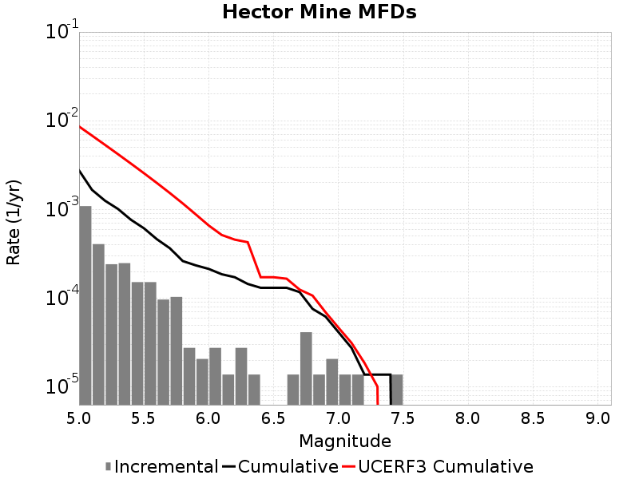

| Magnitude | Incremental Rate | Cumulative Rate | UCERF3 Cumulative Rate |
|-----|-----|-----|-----|
| 5.05 | 0.0010916694 | 0.0029917269 | 0.008624309 |
| 5.15 | 4.0764868E-4 | 0.0019000574 | 0.006802243 |
| 5.25 | 2.418255E-4 | 0.0014924088 | 0.0053549255 |
| 5.35 | 2.487348E-4 | 0.0012505833 | 0.00420528 |
| 5.45 | 1.5200459E-4 | 0.0010018485 | 0.0032920842 |
| 5.55 | 1.5200459E-4 | 8.498439E-4 | 0.0025667069 |
| 5.65 | 9.67302E-5 | 6.978393E-4 | 0.0019905192 |
| 5.75 | 1.036395E-4 | 6.011091E-4 | 0.0015328372 |
| 5.85 | 3.4546498E-5 | 4.974696E-4 | 0.0011692873 |
| 5.95 | 2.76372E-5 | 4.6292308E-4 | 8.8050944E-4 |
| 6.05 | 2.76372E-5 | 4.3528588E-4 | 6.6013116E-4 |
| 6.15 | 3.4546498E-5 | 4.0764868E-4 | 5.1669026E-4 |
| 6.25 | 2.76372E-5 | 3.731022E-4 | 4.57953E-4 |
| 6.35 | 1.38186E-5 | 3.45465E-4 | 4.2826976E-4 |
| 6.45 | 6.9093E-6 | 3.3164638E-4 | 1.7268512E-4 |
| 6.55 | 0.0 | 3.247371E-4 | 1.7268512E-4 |
| 6.65 | 1.38186E-5 | 3.247371E-4 | 1.6620751E-4 |
| 6.75 | 4.83651E-5 | 3.109185E-4 | 1.2527514E-4 |
| 6.85 | 1.38186E-5 | 2.625534E-4 | 1.0714288E-4 |
| 6.95 | 4.83651E-5 | 2.487348E-4 | 6.961767E-5 |
| 7.05 | 2.76372E-5 | 2.003697E-4 | 4.65653E-5 |
| 7.15 | 6.21837E-5 | 1.727325E-4 | 3.1459553E-5 |
| 7.25 | 1.38186E-5 | 1.105488E-4 | 1.870063E-5 |
| 7.35 | 2.76372E-5 | 9.67302E-5 | 1.0118813E-5 |
| 7.45 | 3.4546498E-5 | 6.9092996E-5 | 0.0 |
| 7.55 | 2.76372E-5 | 3.4546498E-5 | 0.0 |
| 7.65 | 6.9093E-6 | 6.9093E-6 | 0.0 |

### Helendale-So Lockhart
*[(top)](#table-of-contents)*

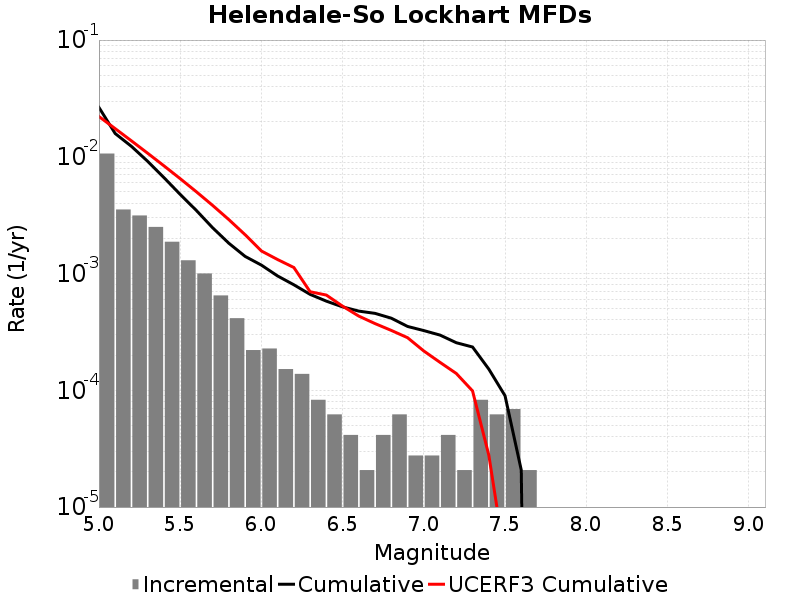

| Magnitude | Incremental Rate | Cumulative Rate | UCERF3 Cumulative Rate |
|-----|-----|-----|-----|
| 5.05 | 0.01066105 | 0.026704444 | 0.02213761 |
| 5.15 | 0.0035375615 | 0.016043395 | 0.017434664 |
| 5.25 | 0.0031437315 | 0.012505833 | 0.013698983 |
| 5.35 | 0.002508076 | 0.009362102 | 0.010731625 |
| 5.45 | 0.0018724203 | 0.0068540256 | 0.008374569 |
| 5.55 | 0.0012989484 | 0.0049816053 | 0.0065022926 |
| 5.65 | 0.0010018485 | 0.003682657 | 0.005015091 |
| 5.75 | 6.702021E-4 | 0.0026808083 | 0.0038337645 |
| 5.85 | 4.214673E-4 | 0.0020106062 | 0.0028954034 |
| 5.95 | 2.280069E-4 | 0.001589139 | 0.0021500369 |
| 6.05 | 2.349162E-4 | 0.0013611321 | 0.0015612777 |
| 6.15 | 1.589139E-4 | 0.0011262159 | 0.0013182824 |
| 6.25 | 1.3818599E-4 | 9.67302E-4 | 0.0011266617 |
| 6.35 | 8.2911596E-5 | 8.29116E-4 | 6.9882575E-4 |
| 6.45 | 6.21837E-5 | 7.462044E-4 | 6.54195E-4 |
| 6.55 | 5.52744E-5 | 6.840207E-4 | 5.255322E-4 |
| 6.65 | 2.76372E-5 | 6.287463E-4 | 4.3191193E-4 |
| 6.75 | 6.21837E-5 | 6.011091E-4 | 3.7265997E-4 |
| 6.85 | 6.9092996E-5 | 5.389254E-4 | 3.2575848E-4 |
| 6.95 | 5.52744E-5 | 4.698324E-4 | 2.8222278E-4 |
| 7.05 | 2.76372E-5 | 4.14558E-4 | 2.1711107E-4 |
| 7.15 | 4.83651E-5 | 3.869208E-4 | 1.7346683E-4 |
| 7.25 | 3.4546498E-5 | 3.385557E-4 | 1.3936833E-4 |
| 7.35 | 8.2911596E-5 | 3.0400918E-4 | 9.882402E-5 |
| 7.45 | 6.21837E-5 | 2.210976E-4 | 2.7885553E-5 |
| 7.55 | 8.2911596E-5 | 1.589139E-4 | 3.5810947E-6 |
| 7.65 | 4.1455798E-5 | 7.6002296E-5 | 0.0 |
| 7.75 | 3.4546498E-5 | 3.4546498E-5 | 0.0 |

### Hilton Creek 2011 CFM
*[(top)](#table-of-contents)*

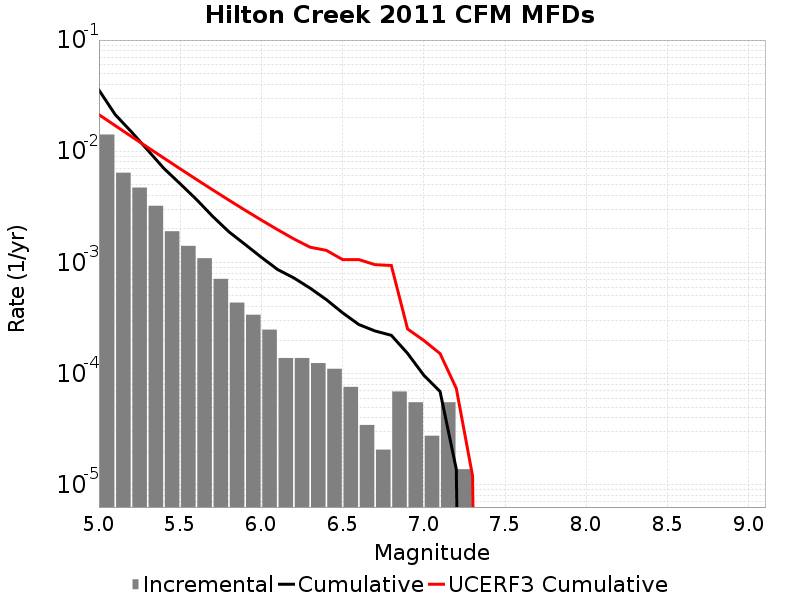

| Magnitude | Incremental Rate | Cumulative Rate | UCERF3 Cumulative Rate |
|-----|-----|-----|-----|
| 5.05 | 0.014136428 | 0.035499983 | 0.021336215 |
| 5.15 | 0.0064118304 | 0.021363555 | 0.01700959 |
| 5.25 | 0.0047121425 | 0.014951725 | 0.013572828 |
| 5.35 | 0.0032335524 | 0.0102395825 | 0.010842912 |
| 5.45 | 0.0019069668 | 0.00700603 | 0.008674462 |
| 5.55 | 0.0014094972 | 0.0050990633 | 0.0069520017 |
| 5.65 | 0.0010916694 | 0.0036895662 | 0.0055838027 |
| 5.75 | 7.1165786E-4 | 0.0025978968 | 0.0044970033 |
| 5.85 | 4.3528588E-4 | 0.0018862389 | 0.003633728 |
| 5.95 | 3.385557E-4 | 0.001450953 | 0.002948004 |
| 6.05 | 2.487348E-4 | 0.0011123973 | 0.002403314 |
| 6.15 | 1.3818599E-4 | 8.636625E-4 | 0.0019706516 |
| 6.25 | 1.3818599E-4 | 7.254765E-4 | 0.0016269755 |
| 6.35 | 1.243674E-4 | 5.872905E-4 | 0.0013710582 |
| 6.45 | 1.105488E-4 | 4.6292308E-4 | 0.0012843201 |
| 6.55 | 7.6002296E-5 | 3.523743E-4 | 0.0010609202 |
| 6.65 | 3.4546498E-5 | 2.7637198E-4 | 0.0010609202 |
| 6.75 | 2.0727899E-5 | 2.418255E-4 | 9.545838E-4 |
| 6.85 | 6.9092996E-5 | 2.210976E-4 | 9.3871244E-4 |
| 6.95 | 5.52744E-5 | 1.5200459E-4 | 2.522405E-4 |
| 7.05 | 2.76372E-5 | 9.67302E-5 | 1.9873196E-4 |
| 7.15 | 5.52744E-5 | 6.9092996E-5 | 1.5148721E-4 |
| 7.25 | 1.38186E-5 | 1.38186E-5 | 7.3636984E-5 |
| 7.35 | 0.0 | 0.0 | 1.20328095E-5 |

### Hollywood
*[(top)](#table-of-contents)*

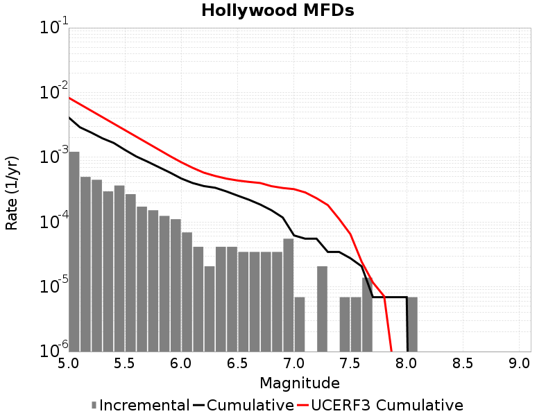

| Magnitude | Incremental Rate | Cumulative Rate | UCERF3 Cumulative Rate |
|-----|-----|-----|-----|
| 5.05 | 0.0012160367 | 0.00483651 | 0.0083140815 |
| 5.15 | 4.974696E-4 | 0.0036204732 | 0.006603005 |
| 5.25 | 4.491045E-4 | 0.0031230035 | 0.0052438485 |
| 5.35 | 2.970999E-4 | 0.002673899 | 0.0041642324 |
| 5.45 | 3.661929E-4 | 0.0023767992 | 0.0033066627 |
| 5.55 | 2.694627E-4 | 0.0020106062 | 0.002625471 |
| 5.65 | 1.727325E-4 | 0.0017411435 | 0.0020843812 |
| 5.75 | 1.5200459E-4 | 0.0015684111 | 0.0016545783 |
| 5.85 | 1.5200459E-4 | 0.0014164065 | 0.0013131736 |
| 5.95 | 1.5200459E-4 | 0.0012644018 | 0.0010419863 |
| 6.05 | 1.5200459E-4 | 0.0011123973 | 8.377045E-4 |
| 6.15 | 5.52744E-5 | 9.603927E-4 | 6.884257E-4 |
| 6.25 | 5.52744E-5 | 9.051183E-4 | 5.78562E-4 |
| 6.35 | 1.036395E-4 | 8.498439E-4 | 5.148656E-4 |
| 6.45 | 1.105488E-4 | 7.462044E-4 | 4.6817455E-4 |
| 6.55 | 5.52744E-5 | 6.356556E-4 | 4.380254E-4 |
| 6.65 | 8.2911596E-5 | 5.803812E-4 | 4.1721002E-4 |
| 6.75 | 8.98209E-5 | 4.974696E-4 | 4.007434E-4 |
| 6.85 | 9.67302E-5 | 4.0764868E-4 | 3.5792E-4 |
| 6.95 | 1.105488E-4 | 3.109185E-4 | 3.3569944E-4 |
| 7.05 | 2.0727899E-5 | 2.003697E-4 | 3.2213383E-4 |
| 7.15 | 2.0727899E-5 | 1.796418E-4 | 2.8640262E-4 |
| 7.25 | 3.4546498E-5 | 1.589139E-4 | 2.3313642E-4 |
| 7.35 | 2.76372E-5 | 1.243674E-4 | 1.825992E-4 |
| 7.45 | 4.1455798E-5 | 9.67302E-5 | 1.1172374E-4 |
| 7.55 | 2.0727899E-5 | 5.52744E-5 | 6.5116736E-5 |
| 7.65 | 1.38186E-5 | 3.4546498E-5 | 2.4408366E-5 |
| 7.75 | 1.38186E-5 | 2.0727899E-5 | 1.1664582E-5 |
| 7.85 | 0.0 | 6.9093E-6 | 7.130707E-6 |
| 7.95 | 0.0 | 6.9093E-6 | 3.449852E-7 |
| 8.05 | 6.9093E-6 | 6.9093E-6 | 0.0 |

### Holser alt 1
*[(top)](#table-of-contents)*

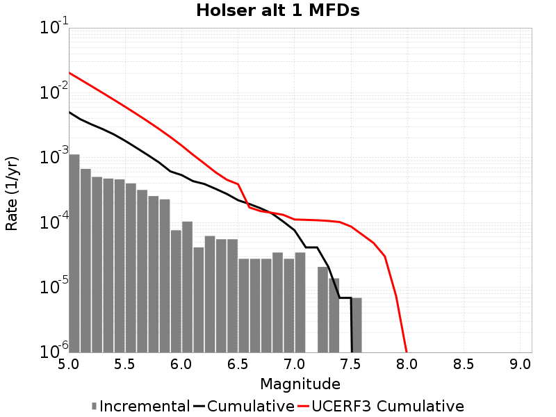

| Magnitude | Incremental Rate | Cumulative Rate | UCERF3 Cumulative Rate |
|-----|-----|-----|-----|
| 5.05 | 0.0011193065 | 0.0060041817 | 0.020423917 |
| 5.15 | 6.702021E-4 | 0.004884875 | 0.016107874 |
| 5.25 | 5.0437887E-4 | 0.004214673 | 0.012679519 |
| 5.35 | 4.767417E-4 | 0.0037102941 | 0.00995628 |
| 5.45 | 4.6292308E-4 | 0.0032335524 | 0.0077931345 |
| 5.55 | 4.007394E-4 | 0.0027706292 | 0.006074887 |
| 5.65 | 3.247371E-4 | 0.0023698898 | 0.004710034 |
| 5.75 | 2.832813E-4 | 0.0020451527 | 0.003625893 |
| 5.85 | 2.349162E-4 | 0.0017618715 | 0.002764729 |
| 5.95 | 1.174581E-4 | 0.0015269553 | 0.0020806824 |
| 6.05 | 1.6582319E-4 | 0.0014094972 | 0.0015373247 |
| 6.15 | 1.6582319E-4 | 0.001243674 | 0.0011099079 |
| 6.25 | 1.105488E-4 | 0.0010778508 | 8.1643753E-4 |
| 6.35 | 8.2911596E-5 | 9.67302E-4 | 5.961324E-4 |
| 6.45 | 1.105488E-4 | 8.843904E-4 | 4.5720383E-4 |
| 6.55 | 8.98209E-5 | 7.738416E-4 | 3.8951618E-4 |
| 6.65 | 1.3818599E-4 | 6.840207E-4 | 1.7104954E-4 |
| 6.75 | 1.174581E-4 | 5.458347E-4 | 1.5010353E-4 |
| 6.85 | 1.174581E-4 | 4.283766E-4 | 1.4140518E-4 |
| 6.95 | 1.036395E-4 | 3.109185E-4 | 1.3153648E-4 |
| 7.05 | 6.9092996E-5 | 2.07279E-4 | 1.1160157E-4 |
| 7.15 | 4.83651E-5 | 1.3818599E-4 | 1.1023117E-4 |
| 7.25 | 4.1455798E-5 | 8.98209E-5 | 1.0864473E-4 |
| 7.35 | 3.4546498E-5 | 4.83651E-5 | 1.06169035E-4 |
| 7.45 | 6.9093E-6 | 1.38186E-5 | 1.0193056E-4 |
| 7.55 | 6.9093E-6 | 6.9093E-6 | 8.6999426E-5 |
| 7.65 | 0.0 | 0.0 | 6.506982E-5 |
| 7.75 | 0.0 | 0.0 | 4.8491096E-5 |
| 7.85 | 0.0 | 0.0 | 3.0098226E-5 |
| 7.95 | 0.0 | 0.0 | 7.3419606E-6 |
| 8.05 | 0.0 | 0.0 | 8.506748E-7 |

### Homestead Valley 2011
*[(top)](#table-of-contents)*

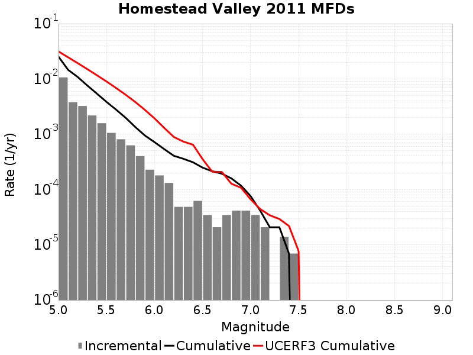

| Magnitude | Incremental Rate | Cumulative Rate | UCERF3 Cumulative Rate |
|-----|-----|-----|-----|
| 5.05 | 0.010674869 | 0.025674958 | 0.031442497 |
| 5.15 | 0.0037932056 | 0.01500009 | 0.02469253 |
| 5.25 | 0.0032404617 | 0.011206885 | 0.019330839 |
| 5.35 | 0.0021833389 | 0.0079664225 | 0.015071897 |
| 5.45 | 0.0015822296 | 0.005783084 | 0.011688899 |
| 5.55 | 0.0010571228 | 0.0042008543 | 0.009001689 |
| 5.65 | 8.083881E-4 | 0.0031437315 | 0.0068671615 |
| 5.75 | 6.287463E-4 | 0.0023353433 | 0.0051716464 |
| 5.85 | 4.214673E-4 | 0.001706597 | 0.0038248505 |
| 5.95 | 2.280069E-4 | 0.0012851298 | 0.0027550529 |
| 6.05 | 1.796418E-4 | 0.0010571228 | 0.0019329126 |
| 6.15 | 1.312767E-4 | 8.7748107E-4 | 0.0013064749 |
| 6.25 | 7.6002296E-5 | 7.462044E-4 | 8.9436275E-4 |
| 6.35 | 5.52744E-5 | 6.702021E-4 | 7.363007E-4 |
| 6.45 | 6.21837E-5 | 6.149277E-4 | 6.4670586E-4 |
| 6.55 | 4.1455798E-5 | 5.5274396E-4 | 3.5470922E-4 |
| 6.65 | 4.1455798E-5 | 5.112882E-4 | 2.1022526E-4 |
| 6.75 | 6.21837E-5 | 4.698324E-4 | 2.078632E-4 |
| 6.85 | 8.98209E-5 | 4.0764868E-4 | 1.272778E-4 |
| 6.95 | 5.52744E-5 | 3.178278E-4 | 1.0789756E-4 |
| 7.05 | 4.83651E-5 | 2.625534E-4 | 6.651972E-5 |
| 7.15 | 4.1455798E-5 | 2.141883E-4 | 4.424073E-5 |
| 7.25 | 2.0727899E-5 | 1.727325E-4 | 3.4133795E-5 |
| 7.35 | 9.67302E-5 | 1.5200459E-4 | 2.9283514E-5 |
| 7.45 | 5.52744E-5 | 5.52744E-5 | 2.1814923E-5 |
| 7.55 | 0.0 | 0.0 | 7.6913175E-6 |

### Honey Lake 2011 CFM
*[(top)](#table-of-contents)*

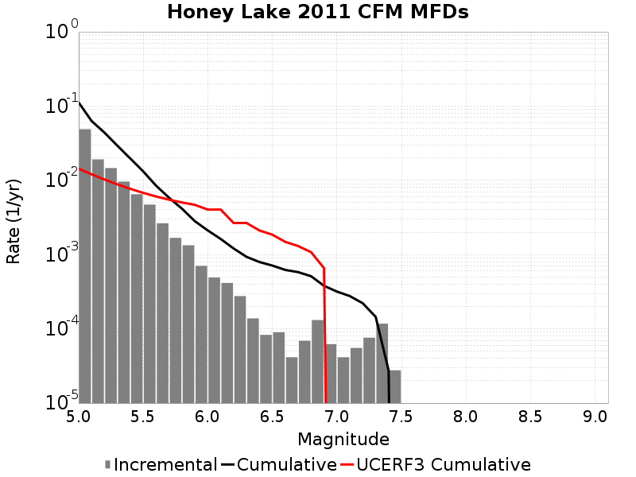

| Magnitude | Incremental Rate | Cumulative Rate | UCERF3 Cumulative Rate |
|-----|-----|-----|-----|
| 5.05 | 0.04874511 | 0.1118132 | 0.014346332 |
| 5.15 | 0.01914567 | 0.06306809 | 0.0120706605 |
| 5.25 | 0.014626988 | 0.04392242 | 0.0102630295 |
| 5.35 | 0.009617746 | 0.029295431 | 0.008827178 |
| 5.45 | 0.006494742 | 0.019677686 | 0.00768664 |
| 5.55 | 0.0047121425 | 0.013182945 | 0.0067806784 |
| 5.65 | 0.0026393526 | 0.008470802 | 0.006061048 |
| 5.75 | 0.0016789599 | 0.0058314493 | 0.005489425 |
| 5.85 | 0.0013334949 | 0.0041524894 | 0.0050353687 |
| 5.95 | 7.047486E-4 | 0.0028189945 | 0.0046746987 |
| 6.05 | 4.905603E-4 | 0.0021142457 | 0.0040387334 |
| 6.15 | 4.14558E-4 | 0.0016236855 | 0.004036878 |
| 6.25 | 2.7637198E-4 | 0.0012091275 | 0.0026639102 |
| 6.35 | 1.3818599E-4 | 9.327555E-4 | 0.0026627393 |
| 6.45 | 8.2911596E-5 | 7.945695E-4 | 0.0021129064 |
| 6.55 | 8.98209E-5 | 7.1165786E-4 | 0.0018544161 |
| 6.65 | 4.1455798E-5 | 6.21837E-4 | 0.0014829923 |
| 6.75 | 6.9092996E-5 | 5.803812E-4 | 0.0013030976 |
| 6.85 | 1.312767E-4 | 5.112882E-4 | 0.001077821 |
| 6.95 | 6.21837E-5 | 3.800115E-4 | 6.565156E-4 |
| 7.05 | 4.1455798E-5 | 3.178278E-4 | 0.0 |
| 7.15 | 5.52744E-5 | 2.7637198E-4 | 0.0 |
| 7.25 | 7.6002296E-5 | 2.210976E-4 | 0.0 |
| 7.35 | 1.174581E-4 | 1.450953E-4 | 0.0 |
| 7.45 | 2.76372E-5 | 2.76372E-5 | 0.0 |

### Hosgri
*[(top)](#table-of-contents)*

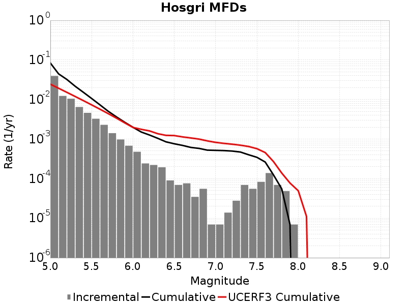

| Magnitude | Incremental Rate | Cumulative Rate | UCERF3 Cumulative Rate |
|-----|-----|-----|-----|
| 5.05 | 0.0393001 | 0.08396872 | 0.024357425 |
| 5.15 | 0.012298554 | 0.044668622 | 0.019230194 |
| 5.25 | 0.010453771 | 0.03237007 | 0.01515749 |
| 5.35 | 0.0064601954 | 0.0219163 | 0.011922426 |
| 5.45 | 0.0045946846 | 0.015456104 | 0.009352723 |
| 5.55 | 0.003268099 | 0.010861419 | 0.0073115355 |
| 5.65 | 0.0022938875 | 0.0075933207 | 0.0056901625 |
| 5.75 | 0.0014440437 | 0.005299433 | 0.0044022608 |
| 5.85 | 0.0010018485 | 0.0038553893 | 0.0033792434 |
| 5.95 | 7.185672E-4 | 0.002853541 | 0.002566632 |
| 6.05 | 4.83651E-4 | 0.0021349736 | 0.001967912 |
| 6.15 | 2.418255E-4 | 0.0016513227 | 0.0017608658 |
| 6.25 | 2.418255E-4 | 0.0014094972 | 0.0016062534 |
| 6.35 | 2.003697E-4 | 0.0011676716 | 0.0013649222 |
| 6.45 | 8.98209E-5 | 9.67302E-4 | 0.0012387682 |
| 6.55 | 8.2911596E-5 | 8.7748107E-4 | 0.0012249249 |
| 6.65 | 8.98209E-5 | 7.945695E-4 | 0.0011332877 |
| 6.75 | 4.1455798E-5 | 7.047486E-4 | 0.0010657161 |
| 6.85 | 6.21837E-5 | 6.6329277E-4 | 9.966682E-4 |
| 6.95 | 1.38186E-5 | 6.011091E-4 | 8.9821924E-4 |
| 7.05 | 1.38186E-5 | 5.872905E-4 | 8.246069E-4 |
| 7.15 | 1.38186E-5 | 5.734719E-4 | 7.78073E-4 |
| 7.25 | 3.4546498E-5 | 5.596533E-4 | 7.412165E-4 |
| 7.35 | 8.2911596E-5 | 5.251068E-4 | 6.9951767E-4 |
| 7.45 | 5.52744E-5 | 4.421952E-4 | 6.4804184E-4 |
| 7.55 | 1.036395E-4 | 3.869208E-4 | 5.708811E-4 |
| 7.65 | 1.450953E-4 | 2.832813E-4 | 4.557592E-4 |
| 7.75 | 8.2911596E-5 | 1.3818599E-4 | 2.6978218E-4 |
| 7.85 | 4.83651E-5 | 5.52744E-5 | 1.3843538E-4 |
| 7.95 | 6.9093E-6 | 6.9093E-6 | 7.7256154E-5 |
| 8.05 | 0.0 | 0.0 | 4.9382463E-5 |
| 8.15 | 0.0 | 0.0 | 1.1048418E-5 |

### Hosgri (Extension)
*[(top)](#table-of-contents)*

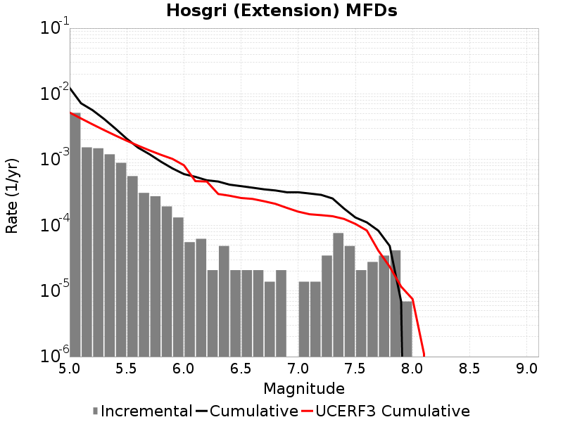

| Magnitude | Incremental Rate | Cumulative Rate | UCERF3 Cumulative Rate |
|-----|-----|-----|-----|
| 5.05 | 0.0051405192 | 0.012346919 | 0.0052005337 |
| 5.15 | 0.0015338645 | 0.0072064 | 0.0042179567 |
| 5.25 | 0.0014854994 | 0.0056725354 | 0.0034374685 |
| 5.35 | 0.0012022182 | 0.004187036 | 0.0028175046 |
| 5.45 | 8.912997E-4 | 0.0029848176 | 0.0023250496 |
| 5.55 | 5.596533E-4 | 0.002093518 | 0.0019338789 |
| 5.65 | 3.109185E-4 | 0.0015338645 | 0.0016231609 |
| 5.75 | 2.7637198E-4 | 0.0012229461 | 0.0013763488 |
| 5.85 | 1.934604E-4 | 9.465741E-4 | 0.0011787553 |
| 5.95 | 1.312767E-4 | 7.531137E-4 | 0.0010230275 |
| 6.05 | 5.52744E-5 | 6.21837E-4 | 8.179194E-4 |
| 6.15 | 6.21837E-5 | 5.665626E-4 | 4.695879E-4 |
| 6.25 | 2.0727899E-5 | 5.0437887E-4 | 4.6289872E-4 |
| 6.35 | 4.83651E-5 | 4.83651E-4 | 2.9896895E-4 |
| 6.45 | 2.0727899E-5 | 4.3528588E-4 | 2.811943E-4 |
| 6.55 | 2.0727899E-5 | 4.14558E-4 | 2.599987E-4 |
| 6.65 | 2.0727899E-5 | 3.938301E-4 | 2.5173748E-4 |
| 6.75 | 1.38186E-5 | 3.731022E-4 | 2.3211172E-4 |
| 6.85 | 2.0727899E-5 | 3.592836E-4 | 2.1187017E-4 |
| 6.95 | 1.38186E-5 | 3.385557E-4 | 1.8391402E-4 |
| 7.05 | 1.38186E-5 | 3.247371E-4 | 1.6101506E-4 |
| 7.15 | 2.0727899E-5 | 3.109185E-4 | 1.4694838E-4 |
| 7.25 | 3.4546498E-5 | 2.901906E-4 | 1.424672E-4 |
| 7.35 | 7.6002296E-5 | 2.556441E-4 | 1.3721146E-4 |
| 7.45 | 4.83651E-5 | 1.796418E-4 | 1.2489308E-4 |
| 7.55 | 2.0727899E-5 | 1.312767E-4 | 1.0477048E-4 |
| 7.65 | 2.76372E-5 | 1.105488E-4 | 8.312975E-5 |
| 7.75 | 3.4546498E-5 | 8.2911596E-5 | 4.1295512E-5 |
| 7.85 | 4.1455798E-5 | 4.83651E-5 | 2.3345057E-5 |
| 7.95 | 6.9093E-6 | 6.9093E-6 | 1.1631239E-5 |
| 8.05 | 0.0 | 0.0 | 7.5168987E-6 |
| 8.15 | 0.0 | 0.0 | 1.1031789E-6 |

### Hunter Mountain-Saline Valley
*[(top)](#table-of-contents)*

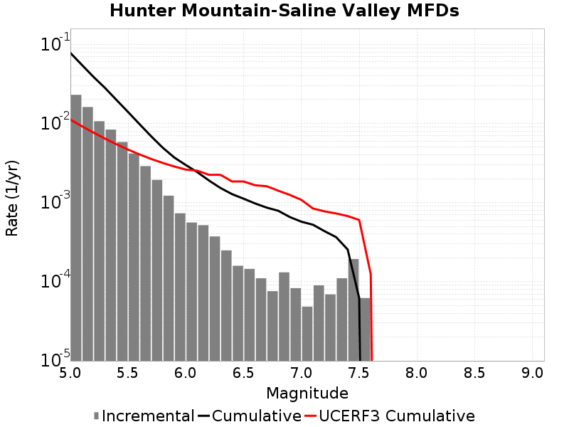

| Magnitude | Incremental Rate | Cumulative Rate | UCERF3 Cumulative Rate |
|-----|-----|-----|-----|
| 5.05 | 0.02299415 | 0.07797145 | 0.011184953 |
| 5.15 | 0.016126307 | 0.054977298 | 0.009225672 |
| 5.25 | 0.010667959 | 0.038850993 | 0.00766936 |
| 5.35 | 0.008360253 | 0.028183034 | 0.0064331368 |
| 5.45 | 0.00582454 | 0.019822782 | 0.0054511703 |
| 5.55 | 0.0041732173 | 0.013998241 | 0.004671166 |
| 5.65 | 0.0028880874 | 0.009825025 | 0.004051587 |
| 5.75 | 0.001934604 | 0.006936937 | 0.003559438 |
| 5.85 | 0.0012229461 | 0.0050023333 | 0.00316851 |
| 5.95 | 7.392951E-4 | 0.003779387 | 0.002857985 |
| 6.05 | 5.596533E-4 | 0.003040092 | 0.002611326 |
| 6.15 | 5.181975E-4 | 0.0024804387 | 0.002528219 |
| 6.25 | 3.731022E-4 | 0.0019622413 | 0.002243937 |
| 6.35 | 2.487348E-4 | 0.001589139 | 0.0022419407 |
| 6.45 | 1.589139E-4 | 0.0013404042 | 0.0018469378 |
| 6.55 | 1.450953E-4 | 0.0011814903 | 0.001846936 |
| 6.65 | 1.174581E-4 | 0.001036395 | 0.0016562323 |
| 6.75 | 8.2911596E-5 | 9.1893686E-4 | 0.001608465 |
| 6.85 | 1.312767E-4 | 8.360253E-4 | 0.0014126288 |
| 6.95 | 8.2911596E-5 | 7.047486E-4 | 0.0012496801 |
| 7.05 | 4.83651E-5 | 6.21837E-4 | 0.0010810951 |
| 7.15 | 9.67302E-5 | 5.734719E-4 | 8.4152294E-4 |
| 7.25 | 6.9092996E-5 | 4.767417E-4 | 7.7472406E-4 |
| 7.35 | 1.174581E-4 | 4.0764868E-4 | 7.288645E-4 |
| 7.45 | 1.934604E-4 | 2.901906E-4 | 6.75391E-4 |
| 7.55 | 8.98209E-5 | 9.67302E-5 | 6.0298434E-4 |
| 7.65 | 6.9093E-6 | 6.9093E-6 | 1.2436116E-4 |

### Hunting Creek - Bartlett Springs connector 2011
*[(top)](#table-of-contents)*

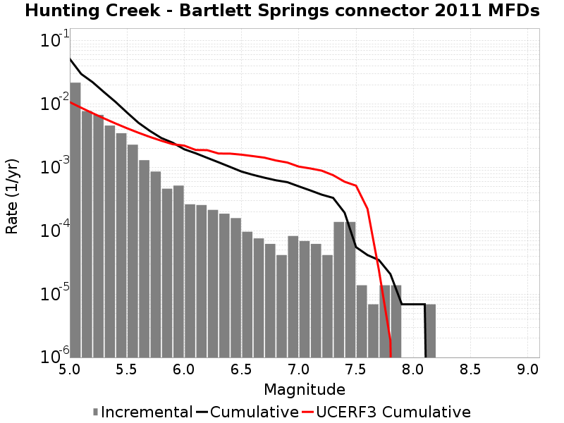

| Magnitude | Incremental Rate | Cumulative Rate | UCERF3 Cumulative Rate |
|-----|-----|-----|-----|
| 5.05 | 0.021888662 | 0.054134365 | 0.01078147 |
| 5.15 | 0.0077798716 | 0.032245703 | 0.008793477 |
| 5.25 | 0.0067849327 | 0.024465831 | 0.007214358 |
| 5.35 | 0.0046015936 | 0.017680898 | 0.0059600193 |
| 5.45 | 0.0034961058 | 0.013079304 | 0.004963663 |
| 5.55 | 0.002418255 | 0.009583199 | 0.0041722287 |
| 5.65 | 0.0016375041 | 0.007164944 | 0.0035435702 |
| 5.75 | 0.0012160367 | 0.00552744 | 0.003044209 |
| 5.85 | 7.60023E-4 | 0.0043114033 | 0.0026475524 |
| 5.95 | 7.047486E-4 | 0.0035513802 | 0.0023324767 |
| 6.05 | 4.698324E-4 | 0.0028466315 | 0.0022180136 |
| 6.15 | 3.3164638E-4 | 0.0023767992 | 0.0018927634 |
| 6.25 | 2.970999E-4 | 0.0020451527 | 0.0018810944 |
| 6.35 | 2.625534E-4 | 0.0017480529 | 0.0016641406 |
| 6.45 | 2.003697E-4 | 0.0014854994 | 0.0016593373 |
| 6.55 | 1.3818599E-4 | 0.0012851298 | 0.0015963438 |
| 6.65 | 1.105488E-4 | 0.0011469438 | 0.0015138952 |
| 6.75 | 9.67302E-5 | 0.001036395 | 0.0014319757 |
| 6.85 | 5.52744E-5 | 9.396648E-4 | 0.0012927126 |
| 6.95 | 9.67302E-5 | 8.843904E-4 | 0.0011996101 |
| 7.05 | 1.036395E-4 | 7.876602E-4 | 0.0010346669 |
| 7.15 | 1.5200459E-4 | 6.840207E-4 | 9.6795085E-4 |
| 7.25 | 1.450953E-4 | 5.320161E-4 | 8.926861E-4 |
| 7.35 | 1.6582319E-4 | 3.869208E-4 | 7.5715943E-4 |
| 7.45 | 1.589139E-4 | 2.210976E-4 | 5.9649977E-4 |
| 7.55 | 1.38186E-5 | 6.21837E-5 | 5.1673193E-4 |
| 7.65 | 6.9093E-6 | 4.83651E-5 | 2.2256369E-4 |
| 7.75 | 2.0727899E-5 | 4.1455798E-5 | 2.3655271E-5 |
| 7.85 | 1.38186E-5 | 2.0727899E-5 | 1.8494985E-6 |
| 7.95 | 0.0 | 6.9093E-6 | 0.0 |
| 8.05 | 0.0 | 6.9093E-6 | 0.0 |
| 8.15 | 6.9093E-6 | 6.9093E-6 | 0.0 |

### Imperial
*[(top)](#table-of-contents)*

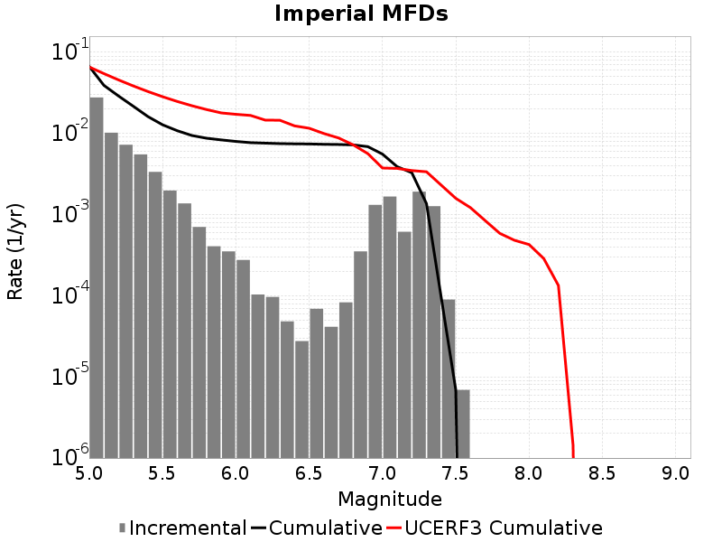

| Magnitude | Incremental Rate | Cumulative Rate | UCERF3 Cumulative Rate |
|-----|-----|-----|-----|
| 5.05 | 0.027816841 | 0.06703403 | 0.06608066 |
| 5.15 | 0.010232673 | 0.039217185 | 0.05475751 |
| 5.25 | 0.0072685834 | 0.028984513 | 0.04576321 |
| 5.35 | 0.00552744 | 0.02171593 | 0.038618788 |
| 5.45 | 0.003364829 | 0.01618849 | 0.03294377 |
| 5.55 | 0.001982969 | 0.012823661 | 0.028435942 |
| 5.65 | 0.0013749506 | 0.010840692 | 0.024855247 |
| 5.75 | 7.047486E-4 | 0.009465741 | 0.022011 |
| 5.85 | 4.0764868E-4 | 0.008760992 | 0.019751735 |
| 5.95 | 3.523743E-4 | 0.008353343 | 0.017957136 |
| 6.05 | 2.7637198E-4 | 0.008000969 | 0.017257566 |
| 6.15 | 1.036395E-4 | 0.007724597 | 0.016719298 |
| 6.25 | 9.67302E-5 | 0.0076209577 | 0.014643836 |
| 6.35 | 4.83651E-5 | 0.0075242277 | 0.014576884 |
| 6.45 | 2.76372E-5 | 0.0074758623 | 0.012429872 |
| 6.55 | 6.9092996E-5 | 0.0074482253 | 0.011619709 |
| 6.65 | 4.1455798E-5 | 0.0073791323 | 0.010007024 |
| 6.75 | 8.2911596E-5 | 0.0073376764 | 0.0088270055 |
| 6.85 | 3.523743E-4 | 0.007254765 | 0.0072582103 |
| 6.95 | 0.0013196763 | 0.0069023906 | 0.0056516584 |
| 7.05 | 0.0016720506 | 0.0055827145 | 0.0037566992 |
| 7.15 | 6.149277E-4 | 0.0039106635 | 0.003717063 |
| 7.25 | 0.0019276947 | 0.0032957362 | 0.0034973372 |
| 7.35 | 0.0012713112 | 0.0013680414 | 0.0033774113 |
| 7.45 | 8.98209E-5 | 9.67302E-5 | 0.0023168845 |
| 7.55 | 6.9093E-6 | 6.9093E-6 | 0.0015892384 |
| 7.65 | 0.0 | 0.0 | 0.0012199652 |
| 7.75 | 0.0 | 0.0 | 8.462858E-4 |
| 7.85 | 0.0 | 0.0 | 5.8848585E-4 |
| 7.95 | 0.0 | 0.0 | 4.8352082E-4 |
| 8.05 | 0.0 | 0.0 | 4.2821607E-4 |
| 8.15 | 0.0 | 0.0 | 2.877441E-4 |
| 8.25 | 0.0 | 0.0 | 1.3400253E-4 |
| 8.35 | 0.0 | 0.0 | 1.4197033E-6 |

### Incline Village 2011 CFM
*[(top)](#table-of-contents)*

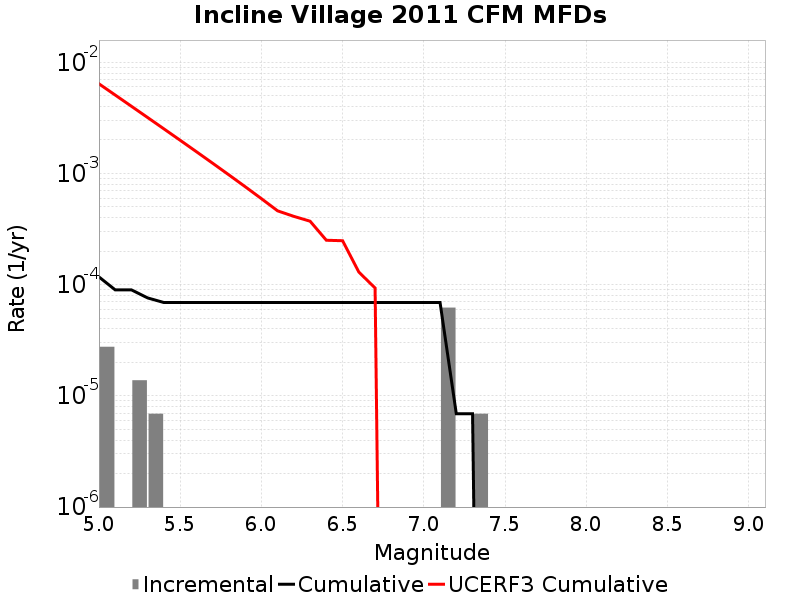

| Magnitude | Incremental Rate | Cumulative Rate | UCERF3 Cumulative Rate |
|-----|-----|-----|-----|
| 5.05 | 2.76372E-5 | 1.312767E-4 | 0.0064057447 |
| 5.15 | 0.0 | 1.036395E-4 | 0.0050776317 |
| 5.25 | 1.38186E-5 | 1.036395E-4 | 0.0040226737 |
| 5.35 | 6.9093E-6 | 8.98209E-5 | 0.0031846908 |
| 5.45 | 0.0 | 8.2911596E-5 | 0.0025190574 |
| 5.55 | 0.0 | 8.2911596E-5 | 0.001990326 |
| 5.65 | 0.0 | 8.2911596E-5 | 0.0015703395 |
| 5.75 | 0.0 | 8.2911596E-5 | 0.0012367326 |
| 5.85 | 0.0 | 8.2911596E-5 | 9.717392E-4 |
| 5.95 | 0.0 | 8.2911596E-5 | 7.612474E-4 |
| 6.05 | 0.0 | 8.2911596E-5 | 5.9404783E-4 |
| 6.15 | 0.0 | 8.2911596E-5 | 4.612365E-4 |
| 6.25 | 0.0 | 8.2911596E-5 | 4.1145502E-4 |
| 6.35 | 0.0 | 8.2911596E-5 | 3.7217216E-4 |
| 6.45 | 0.0 | 8.2911596E-5 | 2.5092324E-4 |
| 6.55 | 0.0 | 8.2911596E-5 | 2.4849887E-4 |
| 6.65 | 0.0 | 8.2911596E-5 | 1.2980711E-4 |
| 6.75 | 0.0 | 8.2911596E-5 | 9.333692E-5 |
| 6.85 | 6.9093E-6 | 8.2911596E-5 | 0.0 |
| 6.95 | 6.9093E-6 | 7.6002296E-5 | 0.0 |
| 7.05 | 0.0 | 6.9092996E-5 | 0.0 |
| 7.15 | 6.21837E-5 | 6.9092996E-5 | 0.0 |
| 7.25 | 0.0 | 6.9093E-6 | 0.0 |
| 7.35 | 6.9093E-6 | 6.9093E-6 | 0.0 |

### Independence rev 2011
*[(top)](#table-of-contents)*

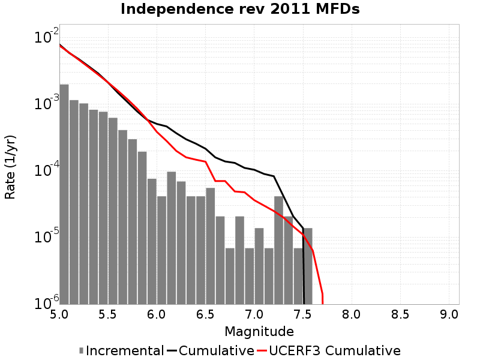

| Magnitude | Incremental Rate | Cumulative Rate | UCERF3 Cumulative Rate |
|-----|-----|-----|-----|
| 5.05 | 0.0019691505 | 0.008857722 | 0.007548486 |
| 5.15 | 0.0011469438 | 0.006888572 | 0.005911027 |
| 5.25 | 0.0010225764 | 0.0057416284 | 0.004610347 |
| 5.35 | 8.2220667E-4 | 0.004719052 | 0.0035771804 |
| 5.45 | 7.6693227E-4 | 0.003896845 | 0.0027565071 |
| 5.55 | 6.21837E-4 | 0.0031299128 | 0.002104623 |
| 5.65 | 4.214673E-4 | 0.002508076 | 0.001586813 |
| 5.75 | 3.592836E-4 | 0.0020866087 | 0.001175502 |
| 5.85 | 2.625534E-4 | 0.001727325 | 8.48786E-4 |
| 5.95 | 1.5200459E-4 | 0.0014647716 | 5.8926624E-4 |
| 6.05 | 1.036395E-4 | 0.0013127669 | 3.8312242E-4 |
| 6.15 | 1.312767E-4 | 0.0012091275 | 2.8027775E-4 |
| 6.25 | 8.98209E-5 | 0.0010778508 | 1.9858532E-4 |
| 6.35 | 6.21837E-5 | 9.880299E-4 | 1.5932339E-4 |
| 6.45 | 6.9092996E-5 | 9.2584617E-4 | 1.4684506E-4 |
| 6.55 | 6.9092996E-5 | 8.567532E-4 | 1.3693793E-4 |
| 6.65 | 3.4546498E-5 | 7.876602E-4 | 7.0305825E-5 |
| 6.75 | 3.4546498E-5 | 7.531137E-4 | 7.0305825E-5 |
| 6.85 | 8.98209E-5 | 7.185672E-4 | 4.9030354E-5 |
| 6.95 | 9.67302E-5 | 6.287463E-4 | 4.7636444E-5 |
| 7.05 | 7.6002296E-5 | 5.320161E-4 | 3.626263E-5 |
| 7.15 | 1.036395E-4 | 4.560138E-4 | 3.0121393E-5 |
| 7.25 | 1.036395E-4 | 3.523743E-4 | 2.4972655E-5 |
| 7.35 | 1.243674E-4 | 2.487348E-4 | 1.992076E-5 |
| 7.45 | 4.1455798E-5 | 1.243674E-4 | 1.4616231E-5 |
| 7.55 | 8.2911596E-5 | 8.2911596E-5 | 1.1049748E-5 |
| 7.65 | 0.0 | 0.0 | 6.3768257E-6 |
| 7.75 | 0.0 | 0.0 | 1.427862E-6 |

### Jess Valley
*[(top)](#table-of-contents)*

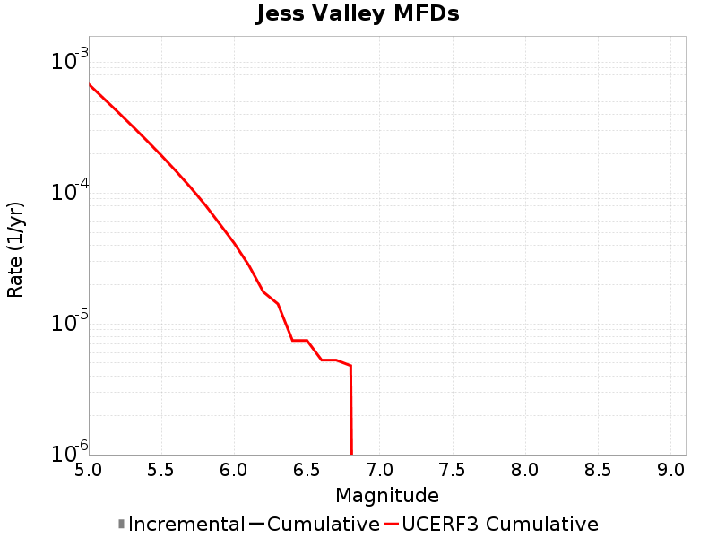

| Magnitude | Incremental Rate | Cumulative Rate | UCERF3 Cumulative Rate |
|-----|-----|-----|-----|
| 5.05 | 0.0 | 0.0 | 6.7798415E-4 |
| 5.15 | 0.0 | 0.0 | 5.3210586E-4 |
| 5.25 | 0.0 | 0.0 | 4.162306E-4 |
| 5.35 | 0.0 | 0.0 | 3.2418763E-4 |
| 5.45 | 0.0 | 0.0 | 2.5107528E-4 |
| 5.55 | 0.0 | 0.0 | 1.9300009E-4 |
| 5.65 | 0.0 | 0.0 | 1.4686932E-4 |
| 5.75 | 0.0 | 0.0 | 1.1022635E-4 |
| 5.85 | 0.0 | 0.0 | 8.1119804E-5 |
| 5.95 | 0.0 | 0.0 | 5.7999656E-5 |
| 6.05 | 0.0 | 0.0 | 4.1279844E-5 |
| 6.15 | 0.0 | 0.0 | 2.7998823E-5 |
| 6.25 | 0.0 | 0.0 | 1.7514494E-5 |
| 6.35 | 0.0 | 0.0 | 1.4183296E-5 |
| 6.45 | 0.0 | 0.0 | 7.4477825E-6 |
| 6.55 | 0.0 | 0.0 | 7.4477825E-6 |
| 6.65 | 0.0 | 0.0 | 5.278108E-6 |
| 6.75 | 0.0 | 0.0 | 5.278108E-6 |
| 6.85 | 0.0 | 0.0 | 4.788956E-6 |

### Johnson Valley (No) 2011 rev
*[(top)](#table-of-contents)*

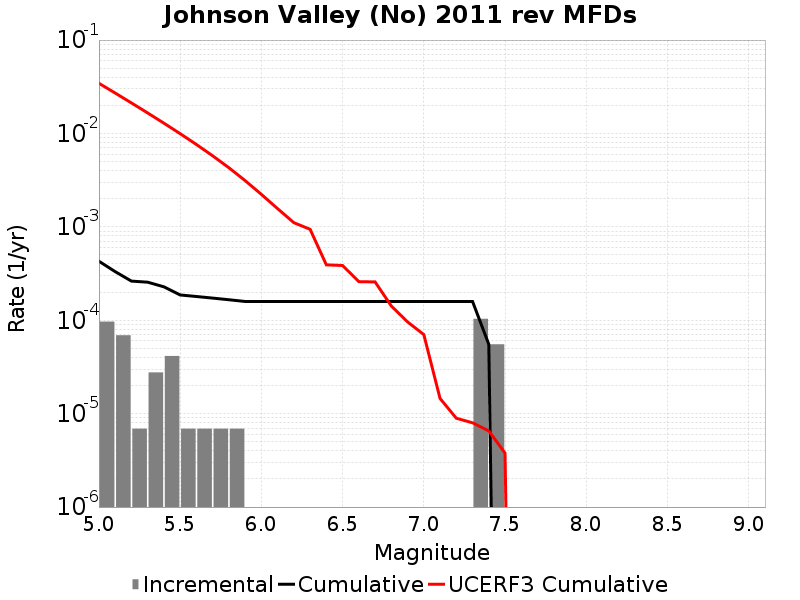

| Magnitude | Incremental Rate | Cumulative Rate | UCERF3 Cumulative Rate |
|-----|-----|-----|-----|
| 5.05 | 9.67302E-5 | 4.6292308E-4 | 0.03444882 |
| 5.15 | 6.9092996E-5 | 3.661929E-4 | 0.027079009 |
| 5.25 | 6.9093E-6 | 2.970999E-4 | 0.021224959 |
| 5.35 | 2.76372E-5 | 2.901906E-4 | 0.016574923 |
| 5.45 | 4.1455798E-5 | 2.625534E-4 | 0.012881267 |
| 5.55 | 6.9093E-6 | 2.210976E-4 | 0.009947292 |
| 5.65 | 6.9093E-6 | 2.141883E-4 | 0.0076167523 |
| 5.75 | 6.9093E-6 | 2.07279E-4 | 0.005765539 |
| 5.85 | 6.9093E-6 | 2.003697E-4 | 0.0042950683 |
| 5.95 | 6.9093E-6 | 1.934604E-4 | 0.003127032 |
| 6.05 | 6.9093E-6 | 1.865511E-4 | 0.0022275439 |
| 6.15 | 0.0 | 1.796418E-4 | 0.0015653144 |
| 6.25 | 0.0 | 1.796418E-4 | 0.00110845 |
| 6.35 | 1.38186E-5 | 1.796418E-4 | 9.4164803E-4 |
| 6.45 | 0.0 | 1.6582319E-4 | 3.9198116E-4 |
| 6.55 | 0.0 | 1.6582319E-4 | 3.857886E-4 |
| 6.65 | 0.0 | 1.6582319E-4 | 2.5894924E-4 |
| 6.75 | 0.0 | 1.6582319E-4 | 2.5739477E-4 |
| 6.85 | 6.9093E-6 | 1.6582319E-4 | 1.4206601E-4 |
| 6.95 | 0.0 | 1.589139E-4 | 9.596724E-5 |
| 7.05 | 0.0 | 1.589139E-4 | 7.0247E-5 |
| 7.15 | 0.0 | 1.589139E-4 | 1.4540369E-5 |
| 7.25 | 0.0 | 1.589139E-4 | 8.933862E-6 |
| 7.35 | 1.036395E-4 | 1.589139E-4 | 7.979897E-6 |
| 7.45 | 5.52744E-5 | 5.52744E-5 | 6.5399013E-6 |
| 7.55 | 0.0 | 0.0 | 3.7804048E-6 |

### Joshua Tree (Seismicity)
*[(top)](#table-of-contents)*

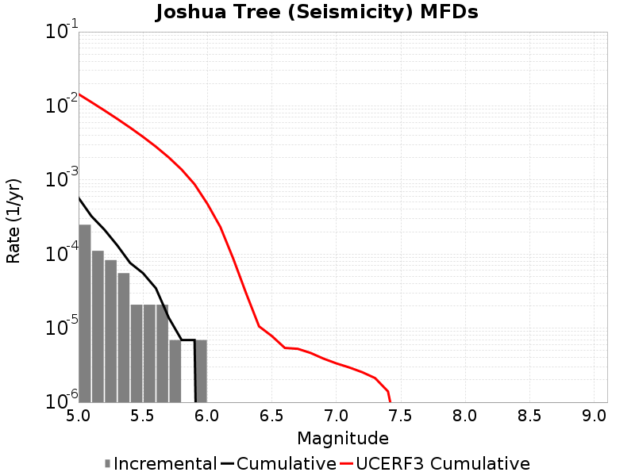

| Magnitude | Incremental Rate | Cumulative Rate | UCERF3 Cumulative Rate |
|-----|-----|-----|-----|
| 5.05 | 2.487348E-4 | 5.941998E-4 | 0.014406515 |
| 5.15 | 1.105488E-4 | 3.45465E-4 | 0.011222604 |
| 5.25 | 8.2911596E-5 | 2.349162E-4 | 0.008693534 |
| 5.35 | 5.52744E-5 | 1.5200459E-4 | 0.006684622 |
| 5.45 | 2.0727899E-5 | 9.67302E-5 | 0.0050888867 |
| 5.55 | 2.0727899E-5 | 7.6002296E-5 | 0.0038213488 |
| 5.65 | 2.0727899E-5 | 5.52744E-5 | 0.0028145078 |
| 5.75 | 6.9093E-6 | 3.4546498E-5 | 0.0020147455 |
| 5.85 | 0.0 | 2.76372E-5 | 0.0013794717 |
| 5.95 | 6.9093E-6 | 2.76372E-5 | 8.748559E-4 |
| 6.05 | 6.9093E-6 | 2.0727899E-5 | 4.7407902E-4 |
| 6.15 | 0.0 | 1.38186E-5 | 2.3208844E-4 |
| 6.25 | 0.0 | 1.38186E-5 | 8.6703796E-5 |
| 6.35 | 6.9093E-6 | 1.38186E-5 | 2.9499568E-5 |
| 6.45 | 0.0 | 6.9093E-6 | 1.0579818E-5 |
| 6.55 | 0.0 | 6.9093E-6 | 7.815366E-6 |
| 6.65 | 0.0 | 6.9093E-6 | 5.41117E-6 |
| 6.75 | 6.9093E-6 | 6.9093E-6 | 5.266493E-6 |
| 6.85 | 0.0 | 0.0 | 4.6294167E-6 |
| 6.95 | 0.0 | 0.0 | 3.881041E-6 |
| 7.05 | 0.0 | 0.0 | 3.3458084E-6 |
| 7.15 | 0.0 | 0.0 | 2.949225E-6 |
| 7.25 | 0.0 | 0.0 | 2.5466452E-6 |
| 7.35 | 0.0 | 0.0 | 2.121456E-6 |
| 7.45 | 0.0 | 0.0 | 1.4017149E-6 |
| 7.55 | 0.0 | 0.0 | 2.053198E-7 |

### Keddie Ridge 2011 CFM
*[(top)](#table-of-contents)*

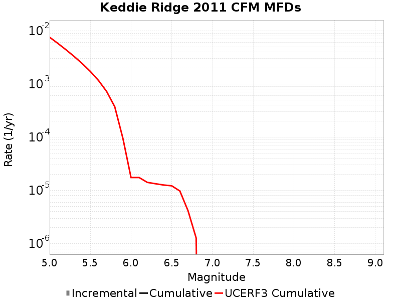

| Magnitude | Incremental Rate | Cumulative Rate | UCERF3 Cumulative Rate |
|-----|-----|-----|-----|
| 5.05 | 0.0 | 0.0 | 0.007572368 |
| 5.15 | 0.0 | 0.0 | 0.005813184 |
| 5.25 | 0.0 | 0.0 | 0.004415815 |
| 5.35 | 0.0 | 0.0 | 0.003305846 |
| 5.45 | 0.0 | 0.0 | 0.0024241656 |
| 5.55 | 0.0 | 0.0 | 0.0017238221 |
| 5.65 | 0.0 | 0.0 | 0.0011675195 |
| 5.75 | 0.0 | 0.0 | 7.2563265E-4 |
| 5.85 | 0.0 | 0.0 | 3.7462942E-4 |
| 5.95 | 0.0 | 0.0 | 9.5817675E-5 |
| 6.05 | 0.0 | 0.0 | 1.7504675E-5 |
| 6.15 | 0.0 | 0.0 | 1.7504675E-5 |
| 6.25 | 0.0 | 0.0 | 1.4200478E-5 |
| 6.35 | 0.0 | 0.0 | 1.33914255E-5 |
| 6.45 | 0.0 | 0.0 | 1.2676798E-5 |
| 6.55 | 0.0 | 0.0 | 1.2240381E-5 |
| 6.65 | 0.0 | 0.0 | 9.775883E-6 |
| 6.75 | 0.0 | 0.0 | 4.1739095E-6 |
| 6.85 | 0.0 | 0.0 | 1.2812885E-6 |

### Kern Canyon (Lake Isabella) 2011
*[(top)](#table-of-contents)*

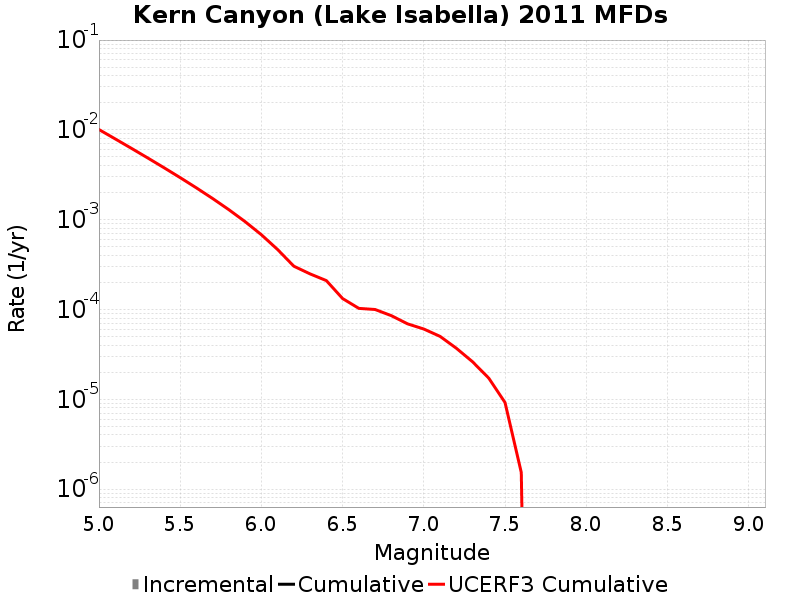

| Magnitude | Incremental Rate | Cumulative Rate | UCERF3 Cumulative Rate |
|-----|-----|-----|-----|
| 5.05 | 0.0 | 0.0 | 0.0100847045 |
| 5.15 | 0.0 | 0.0 | 0.007935451 |
| 5.25 | 0.0 | 0.0 | 0.006228238 |
| 5.35 | 0.0 | 0.0 | 0.0048721507 |
| 5.45 | 0.0 | 0.0 | 0.0037949723 |
| 5.55 | 0.0 | 0.0 | 0.002939339 |
| 5.65 | 0.0 | 0.0 | 0.0022596854 |
| 5.75 | 0.0 | 0.0 | 0.0017198174 |
| 5.85 | 0.0 | 0.0 | 0.0012909849 |
| 5.95 | 0.0 | 0.0 | 9.503511E-4 |
| 6.05 | 0.0 | 0.0 | 6.7977613E-4 |
| 6.15 | 0.0 | 0.0 | 4.648508E-4 |
| 6.25 | 0.0 | 0.0 | 3.032011E-4 |
| 6.35 | 0.0 | 0.0 | 2.489576E-4 |
| 6.45 | 0.0 | 0.0 | 2.0968633E-4 |
| 6.55 | 0.0 | 0.0 | 1.3241736E-4 |
| 6.65 | 0.0 | 0.0 | 1.0287152E-4 |
| 6.75 | 0.0 | 0.0 | 9.99653E-5 |
| 6.85 | 0.0 | 0.0 | 8.534971E-5 |
| 6.95 | 0.0 | 0.0 | 6.918855E-5 |
| 7.05 | 0.0 | 0.0 | 6.058486E-5 |
| 7.15 | 0.0 | 0.0 | 5.018167E-5 |
| 7.25 | 0.0 | 0.0 | 3.704446E-5 |
| 7.35 | 0.0 | 0.0 | 2.6169544E-5 |
| 7.45 | 0.0 | 0.0 | 1.7185217E-5 |
| 7.55 | 0.0 | 0.0 | 9.199693E-6 |
| 7.65 | 0.0 | 0.0 | 1.531443E-6 |

### Kern Canyon (North Kern) 2011
*[(top)](#table-of-contents)*

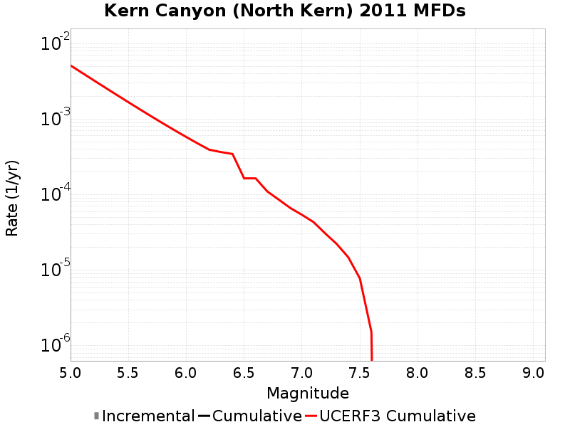

| Magnitude | Incremental Rate | Cumulative Rate | UCERF3 Cumulative Rate |
|-----|-----|-----|-----|
| 5.05 | 0.0 | 0.0 | 0.0051455977 |
| 5.15 | 0.0 | 0.0 | 0.0041023437 |
| 5.25 | 0.0 | 0.0 | 0.0032736578 |
| 5.35 | 0.0 | 0.0 | 0.0026154092 |
| 5.45 | 0.0 | 0.0 | 0.0020925435 |
| 5.55 | 0.0 | 0.0 | 0.0016772167 |
| 5.65 | 0.0 | 0.0 | 0.001347311 |
| 5.75 | 0.0 | 0.0 | 0.0010852574 |
| 5.85 | 0.0 | 0.0 | 8.771009E-4 |
| 5.95 | 0.0 | 0.0 | 7.1175635E-4 |
| 6.05 | 0.0 | 0.0 | 5.8041845E-4 |
| 6.15 | 0.0 | 0.0 | 4.7609312E-4 |
| 6.25 | 0.0 | 0.0 | 3.9322456E-4 |
| 6.35 | 0.0 | 0.0 | 3.6688184E-4 |
| 6.45 | 0.0 | 0.0 | 3.4596722E-4 |
| 6.55 | 0.0 | 0.0 | 1.644022E-4 |
| 6.65 | 0.0 | 0.0 | 1.6439792E-4 |
| 6.75 | 0.0 | 0.0 | 1.1048735E-4 |
| 6.85 | 0.0 | 0.0 | 8.592519E-5 |
| 6.95 | 0.0 | 0.0 | 6.6518216E-5 |
| 7.05 | 0.0 | 0.0 | 5.4153235E-5 |
| 7.15 | 0.0 | 0.0 | 4.335341E-5 |
| 7.25 | 0.0 | 0.0 | 3.078984E-5 |
| 7.35 | 0.0 | 0.0 | 2.2254859E-5 |
| 7.45 | 0.0 | 0.0 | 1.4851908E-5 |
| 7.55 | 0.0 | 0.0 | 7.804718E-6 |
| 7.65 | 0.0 | 0.0 | 1.531443E-6 |

### Kern Canyon (South Kern) 2011
*[(top)](#table-of-contents)*

| Magnitude | Incremental Rate | Cumulative Rate | UCERF3 Cumulative Rate |
|-----|-----|-----|-----|
| 5.05 | 0.0 | 6.9093E-6 | 0.00901156 |
| 5.15 | 0.0 | 6.9093E-6 | 0.0070904936 |
| 5.25 | 0.0 | 6.9093E-6 | 0.0055645364 |
| 5.35 | 0.0 | 6.9093E-6 | 0.004352425 |
| 5.45 | 0.0 | 6.9093E-6 | 0.0033896114 |
| 5.55 | 0.0 | 6.9093E-6 | 0.0026248212 |
| 5.65 | 0.0 | 6.9093E-6 | 0.0020173267 |
| 5.75 | 0.0 | 6.9093E-6 | 0.0015347765 |
| 5.85 | 0.0 | 6.9093E-6 | 0.0011514734 |
| 5.95 | 0.0 | 6.9093E-6 | 8.470049E-4 |
| 6.05 | 0.0 | 6.9093E-6 | 6.05157E-4 |
| 6.15 | 0.0 | 6.9093E-6 | 4.1305032E-4 |
| 6.25 | 0.0 | 6.9093E-6 | 2.604546E-4 |
| 6.35 | 0.0 | 6.9093E-6 | 2.1197018E-4 |
| 6.45 | 0.0 | 6.9093E-6 | 1.7345762E-4 |
| 6.55 | 0.0 | 6.9093E-6 | 1.3076895E-4 |
| 6.65 | 0.0 | 6.9093E-6 | 1.3076895E-4 |
| 6.75 | 0.0 | 6.9093E-6 | 1.1970883E-4 |
| 6.85 | 0.0 | 6.9093E-6 | 1.04975436E-4 |
| 6.95 | 0.0 | 6.9093E-6 | 9.1550806E-5 |
| 7.05 | 0.0 | 6.9093E-6 | 7.44547E-5 |
| 7.15 | 0.0 | 6.9093E-6 | 6.195644E-5 |
| 7.25 | 0.0 | 6.9093E-6 | 3.9999024E-5 |
| 7.35 | 0.0 | 6.9093E-6 | 2.7310067E-5 |
| 7.45 | 0.0 | 6.9093E-6 | 1.8066125E-5 |
| 7.55 | 6.9093E-6 | 6.9093E-6 | 9.440789E-6 |
| 7.65 | 0.0 | 0.0 | 1.531443E-6 |

### Kickapoo
*[(top)](#table-of-contents)*

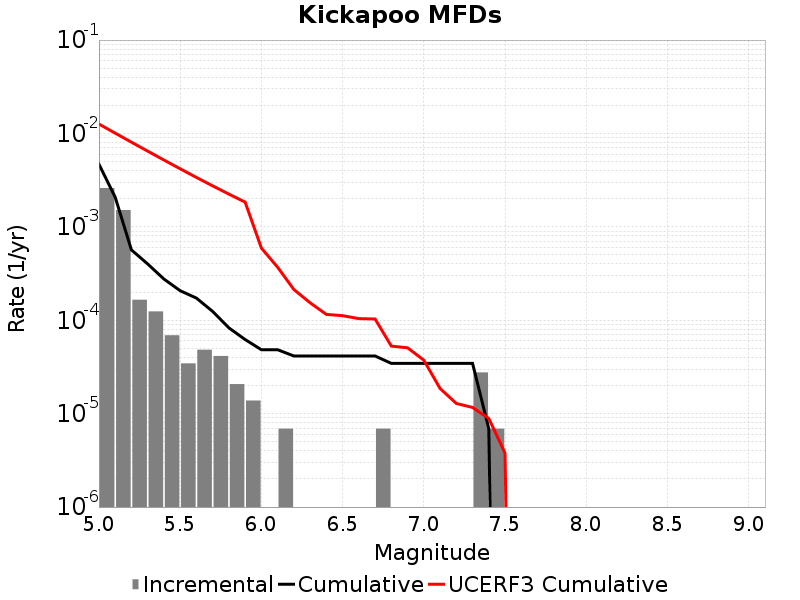

| Magnitude | Incremental Rate | Cumulative Rate | UCERF3 Cumulative Rate |
|-----|-----|-----|-----|
| 5.05 | 0.002604806 | 0.0049332404 | 0.012615435 |
| 5.15 | 0.0015131367 | 0.002328434 | 0.010079947 |
| 5.25 | 1.6582319E-4 | 8.1529736E-4 | 0.008065938 |
| 5.35 | 1.243674E-4 | 6.494742E-4 | 0.006466154 |
| 5.45 | 6.9092996E-5 | 5.251068E-4 | 0.0051954 |
| 5.55 | 3.4546498E-5 | 4.560138E-4 | 0.004186005 |
| 5.65 | 4.83651E-5 | 4.214673E-4 | 0.0033842132 |
| 5.75 | 4.1455798E-5 | 3.731022E-4 | 0.0027473276 |
| 5.85 | 2.76372E-5 | 3.3164638E-4 | 0.0022414315 |
| 5.95 | 2.0727899E-5 | 3.0400918E-4 | 0.0018395837 |
| 6.05 | 2.76372E-5 | 2.832813E-4 | 5.930532E-4 |
| 6.15 | 6.9093E-6 | 2.556441E-4 | 3.6947237E-4 |
| 6.25 | 6.9093E-6 | 2.487348E-4 | 2.133114E-4 |
| 6.35 | 6.9093E-6 | 2.418255E-4 | 1.5377768E-4 |
| 6.45 | 0.0 | 2.349162E-4 | 1.15505005E-4 |
| 6.55 | 6.9093E-6 | 2.349162E-4 | 1.120027E-4 |
| 6.65 | 6.9093E-6 | 2.280069E-4 | 1.0407805E-4 |
| 6.75 | 1.38186E-5 | 2.210976E-4 | 1.0319413E-4 |
| 6.85 | 1.38186E-5 | 2.07279E-4 | 5.286529E-5 |
| 6.95 | 2.0727899E-5 | 1.934604E-4 | 5.071514E-5 |
| 7.05 | 1.38186E-5 | 1.727325E-4 | 3.7367026E-5 |
| 7.15 | 6.9093E-6 | 1.589139E-4 | 1.8602304E-5 |
| 7.25 | 0.0 | 1.5200459E-4 | 1.2860916E-5 |
| 7.35 | 1.036395E-4 | 1.5200459E-4 | 1.1653162E-5 |
| 7.45 | 4.83651E-5 | 4.83651E-5 | 8.882846E-6 |
| 7.55 | 0.0 | 0.0 | 3.7804048E-6 |

### King Range 2011 CFM
*[(top)](#table-of-contents)*

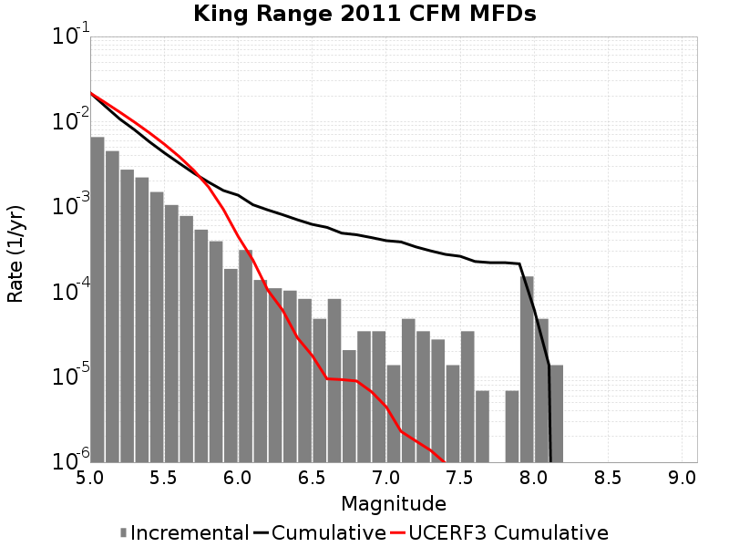

| Magnitude | Incremental Rate | Cumulative Rate | UCERF3 Cumulative Rate |
|-----|-----|-----|-----|
| 5.05 | 0.006584563 | 0.023560712 | 0.021723071 |
| 5.15 | 0.004518682 | 0.01697615 | 0.016831724 |
| 5.25 | 0.0027291735 | 0.012457468 | 0.012946387 |
| 5.35 | 0.0022109759 | 0.009728294 | 0.009860155 |
| 5.45 | 0.0014924088 | 0.0075173182 | 0.0074086734 |
| 5.55 | 0.0010502136 | 0.0060249097 | 0.0054613925 |
| 5.65 | 7.807509E-4 | 0.004974696 | 0.0039146123 |
| 5.75 | 5.389254E-4 | 0.004193945 | 0.002685961 |
| 5.85 | 3.938301E-4 | 0.0036550197 | 0.0017100087 |
| 5.95 | 1.934604E-4 | 0.0032611894 | 9.3478226E-4 |
| 6.05 | 3.109185E-4 | 0.003067729 | 4.4838124E-4 |
| 6.15 | 1.3818599E-4 | 0.0027568107 | 2.3671372E-4 |
| 6.25 | 1.105488E-4 | 0.0026186246 | 1.0504506E-4 |
| 6.35 | 1.036395E-4 | 0.002508076 | 6.128247E-5 |
| 6.45 | 8.2911596E-5 | 0.0024044365 | 2.9020806E-5 |
| 6.55 | 4.83651E-5 | 0.0023215248 | 1.7924855E-5 |
| 6.65 | 8.2911596E-5 | 0.0022731596 | 9.5425E-6 |
| 6.75 | 2.0727899E-5 | 0.002190248 | 9.346777E-6 |
| 6.85 | 3.4546498E-5 | 0.0021695201 | 9.004185E-6 |
| 6.95 | 3.4546498E-5 | 0.0021349736 | 6.751816E-6 |
| 7.05 | 4.83651E-5 | 0.0021004272 | 4.4842623E-6 |
| 7.15 | 2.418255E-4 | 0.002052062 | 2.3034745E-6 |
| 7.25 | 2.280069E-4 | 0.0018102366 | 1.7792008E-6 |
| 7.35 | 1.243674E-4 | 0.0015822296 | 1.3799499E-6 |
| 7.45 | 2.0727899E-5 | 0.0014578623 | 9.752538E-7 |
| 7.55 | 3.4546498E-5 | 0.0014371343 | 6.2952273E-7 |
| 7.65 | 1.38186E-5 | 0.0014025879 | 4.8078186E-7 |
| 7.75 | 0.0 | 0.0013887692 | 2.827096E-7 |
| 7.85 | 1.105488E-4 | 0.0013887692 | 8.937422E-8 |
| 7.95 | 8.7057176E-4 | 0.0012782204 | 2.1754644E-8 |
| 8.05 | 3.45465E-4 | 4.0764868E-4 | 0.0 |
| 8.15 | 6.21837E-5 | 6.21837E-5 | 0.0 |

### La Panza 2011
*[(top)](#table-of-contents)*

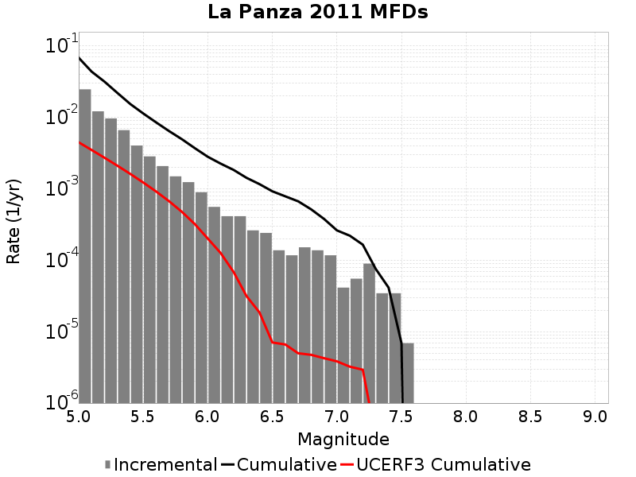

| Magnitude | Incremental Rate | Cumulative Rate | UCERF3 Cumulative Rate |
|-----|-----|-----|-----|
| 5.05 | 0.024804387 | 0.06969411 | 0.0044982075 |
| 5.15 | 0.012208733 | 0.044889722 | 0.003515351 |
| 5.25 | 0.009707566 | 0.03268099 | 0.0027346404 |
| 5.35 | 0.006653656 | 0.022973422 | 0.0021145 |
| 5.45 | 0.00404885 | 0.016319767 | 0.0016219049 |
| 5.55 | 0.002853541 | 0.012270916 | 0.0012306228 |
| 5.65 | 0.002093518 | 0.009417376 | 9.1981626E-4 |
| 5.75 | 0.0015269553 | 0.007323858 | 6.7293394E-4 |
| 5.85 | 0.001292039 | 0.005796903 | 4.7682828E-4 |
| 5.95 | 9.603927E-4 | 0.0045048636 | 3.2105602E-4 |
| 6.05 | 6.287463E-4 | 0.0035444708 | 2.0164515E-4 |
| 6.15 | 4.83651E-4 | 0.0029157246 | 1.2635486E-4 |
| 6.25 | 4.6292308E-4 | 0.0024320735 | 6.856148E-5 |
| 6.35 | 3.178278E-4 | 0.0019691505 | 3.154013E-5 |
| 6.45 | 3.0400918E-4 | 0.0016513227 | 1.8642164E-5 |
| 6.55 | 2.556441E-4 | 0.0013473135 | 7.0667575E-6 |
| 6.65 | 1.6582319E-4 | 0.0010916694 | 6.6266634E-6 |
| 6.75 | 1.6582319E-4 | 9.2584617E-4 | 4.9875057E-6 |
| 6.85 | 1.727325E-4 | 7.60023E-4 | 4.744879E-6 |
| 6.95 | 1.5200459E-4 | 5.872905E-4 | 4.2596375E-6 |
| 7.05 | 8.2911596E-5 | 4.3528588E-4 | 3.843427E-6 |
| 7.15 | 6.9092996E-5 | 3.523743E-4 | 3.2373327E-6 |
| 7.25 | 1.589139E-4 | 2.832813E-4 | 2.9362493E-6 |
| 7.35 | 7.6002296E-5 | 1.243674E-4 | 3.3322974E-7 |
| 7.45 | 4.1455798E-5 | 4.83651E-5 | 1.1895189E-7 |
| 7.55 | 6.9093E-6 | 6.9093E-6 | 8.288668E-8 |
| 7.65 | 0.0 | 0.0 | 5.9225286E-8 |
| 7.75 | 0.0 | 0.0 | 4.2399922E-8 |
| 7.85 | 0.0 | 0.0 | 2.704683E-8 |
| 7.95 | 0.0 | 0.0 | 7.813489E-9 |

### Laguna Salada
*[(top)](#table-of-contents)*

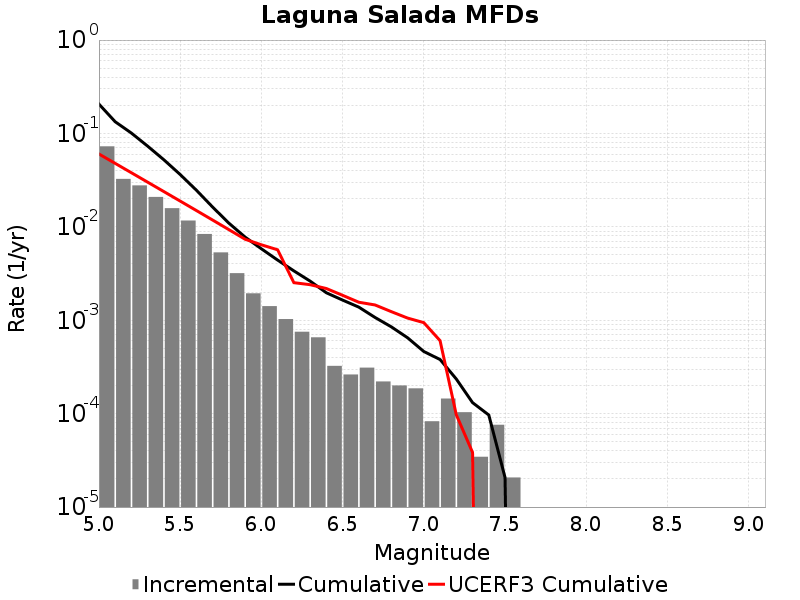

| Magnitude | Incremental Rate | Cumulative Rate | UCERF3 Cumulative Rate |
|-----|-----|-----|-----|
| 5.05 | 0.072775654 | 0.20627715 | 0.060283322 |
| 5.15 | 0.032611895 | 0.1335015 | 0.047832288 |
| 5.25 | 0.027782295 | 0.1008896 | 0.037942078 |
| 5.35 | 0.020907542 | 0.0731073 | 0.030086007 |
| 5.45 | 0.015843024 | 0.052199762 | 0.023845706 |
| 5.55 | 0.011683626 | 0.036356736 | 0.01888886 |
| 5.65 | 0.00838789 | 0.02467311 | 0.014951496 |
| 5.75 | 0.00532707 | 0.01628522 | 0.011823937 |
| 5.85 | 0.0031920965 | 0.01095815 | 0.00933963 |
| 5.95 | 0.0019415133 | 0.007766053 | 0.007366273 |
| 6.05 | 0.0014164065 | 0.00582454 | 0.0064271674 |
| 6.15 | 0.0010294857 | 0.004408133 | 0.005681474 |
| 6.25 | 7.531137E-4 | 0.0033786476 | 0.002526272 |
| 6.35 | 6.5638346E-4 | 0.0026255338 | 0.0024036292 |
| 6.45 | 3.247371E-4 | 0.0019691505 | 0.002186779 |
| 6.55 | 2.625534E-4 | 0.0016444133 | 0.001849314 |
| 6.65 | 3.109185E-4 | 0.00138186 | 0.0015594367 |
| 6.75 | 2.210976E-4 | 0.0010709414 | 0.0014577508 |
| 6.85 | 2.003697E-4 | 8.498439E-4 | 0.0012364174 |
| 6.95 | 1.865511E-4 | 6.494742E-4 | 0.0010554836 |
| 7.05 | 8.2911596E-5 | 4.6292308E-4 | 9.4279315E-4 |
| 7.15 | 1.450953E-4 | 3.800115E-4 | 6.049075E-4 |
| 7.25 | 1.036395E-4 | 2.349162E-4 | 9.72067E-5 |
| 7.35 | 3.4546498E-5 | 1.312767E-4 | 3.8483606E-5 |
| 7.45 | 7.6002296E-5 | 9.67302E-5 | 0.0 |
| 7.55 | 2.0727899E-5 | 2.0727899E-5 | 0.0 |

### Lake Isabella (Seismicity)
*[(top)](#table-of-contents)*

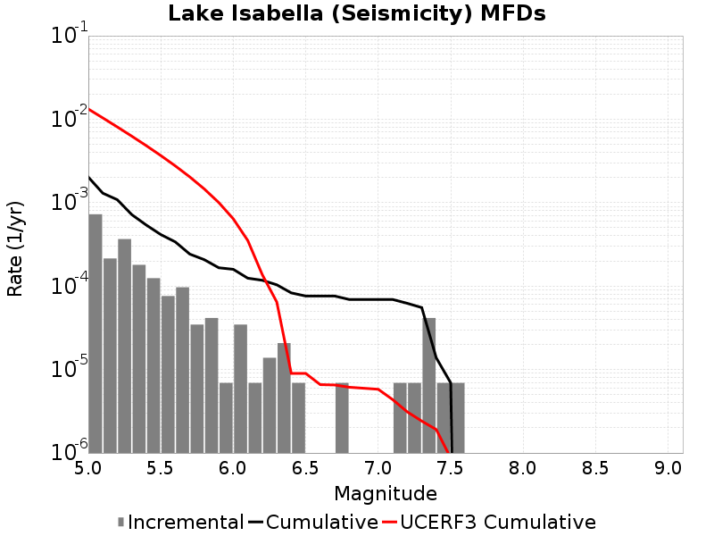

| Magnitude | Incremental Rate | Cumulative Rate | UCERF3 Cumulative Rate |
|-----|-----|-----|-----|
| 5.05 | 7.254765E-4 | 0.002024425 | 0.013251484 |
| 5.15 | 2.141883E-4 | 0.0012989484 | 0.010369461 |
| 5.25 | 3.661929E-4 | 0.0010847601 | 0.008080189 |
| 5.35 | 1.796418E-4 | 7.185672E-4 | 0.0062617557 |
| 5.45 | 1.243674E-4 | 5.389254E-4 | 0.004817323 |
| 5.55 | 7.6002296E-5 | 4.14558E-4 | 0.0036699688 |
| 5.65 | 9.67302E-5 | 3.385557E-4 | 0.002758593 |
| 5.75 | 3.4546498E-5 | 2.418255E-4 | 0.0020346616 |
| 5.85 | 4.1455798E-5 | 2.07279E-4 | 0.0014596225 |
| 5.95 | 6.9093E-6 | 1.6582319E-4 | 0.0010028527 |
| 6.05 | 3.4546498E-5 | 1.589139E-4 | 6.400283E-4 |
| 6.15 | 6.9093E-6 | 1.243674E-4 | 3.5182663E-4 |
| 6.25 | 1.38186E-5 | 1.174581E-4 | 1.3719613E-4 |
| 6.35 | 2.0727899E-5 | 1.036395E-4 | 6.445895E-5 |
| 6.45 | 6.9093E-6 | 8.2911596E-5 | 8.974392E-6 |
| 6.55 | 0.0 | 7.6002296E-5 | 8.974392E-6 |
| 6.65 | 0.0 | 7.6002296E-5 | 6.5940967E-6 |
| 6.75 | 6.9093E-6 | 7.6002296E-5 | 6.5295862E-6 |
| 6.85 | 0.0 | 6.9092996E-5 | 6.135821E-6 |
| 6.95 | 0.0 | 6.9092996E-5 | 5.967289E-6 |
| 7.05 | 0.0 | 6.9092996E-5 | 5.8001847E-6 |
| 7.15 | 6.9093E-6 | 6.9092996E-5 | 4.3555797E-6 |
| 7.25 | 6.9093E-6 | 6.21837E-5 | 3.1112577E-6 |
| 7.35 | 4.1455798E-5 | 5.52744E-5 | 2.4120743E-6 |
| 7.45 | 6.9093E-6 | 1.38186E-5 | 1.9093432E-6 |
| 7.55 | 6.9093E-6 | 6.9093E-6 | 8.68061E-7 |
| 7.65 | 0.0 | 0.0 | 5.035427E-8 |

### Las Positas
*[(top)](#table-of-contents)*

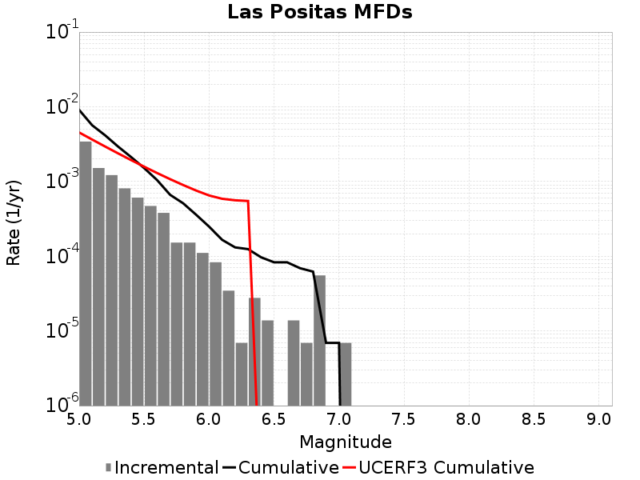

| Magnitude | Incremental Rate | Cumulative Rate | UCERF3 Cumulative Rate |
|-----|-----|-----|-----|
| 5.05 | 0.0034201033 | 0.009210097 | 0.004530055 |
| 5.15 | 0.0015131367 | 0.0057899933 | 0.0036422168 |
| 5.25 | 0.0012160367 | 0.004276857 | 0.0029369819 |
| 5.35 | 8.083881E-4 | 0.0030608198 | 0.002376794 |
| 5.45 | 6.0801837E-4 | 0.0022524318 | 0.0019318209 |
| 5.55 | 4.698324E-4 | 0.0016444133 | 0.0015783662 |
| 5.65 | 3.800115E-4 | 0.001174581 | 0.0012976071 |
| 5.75 | 1.5200459E-4 | 7.945695E-4 | 0.0010745922 |
| 5.85 | 1.589139E-4 | 6.425649E-4 | 8.974452E-4 |
| 5.95 | 1.243674E-4 | 4.83651E-4 | 7.5673236E-4 |
| 6.05 | 8.2911596E-5 | 3.592836E-4 | 6.500698E-4 |
| 6.15 | 4.83651E-5 | 2.7637198E-4 | 5.872944E-4 |
| 6.25 | 2.0727899E-5 | 2.280069E-4 | 5.6034105E-4 |
| 6.35 | 4.1455798E-5 | 2.07279E-4 | 5.4815714E-4 |
| 6.45 | 2.76372E-5 | 1.6582319E-4 | 3.5063692E-8 |
| 6.55 | 0.0 | 1.3818599E-4 | 9.126519E-9 |
| 6.65 | 2.76372E-5 | 1.3818599E-4 | 0.0 |
| 6.75 | 1.38186E-5 | 1.105488E-4 | 0.0 |
| 6.85 | 7.6002296E-5 | 9.67302E-5 | 0.0 |
| 6.95 | 6.9093E-6 | 2.0727899E-5 | 0.0 |
| 7.05 | 1.38186E-5 | 1.38186E-5 | 0.0 |

### Last Chance
*[(top)](#table-of-contents)*

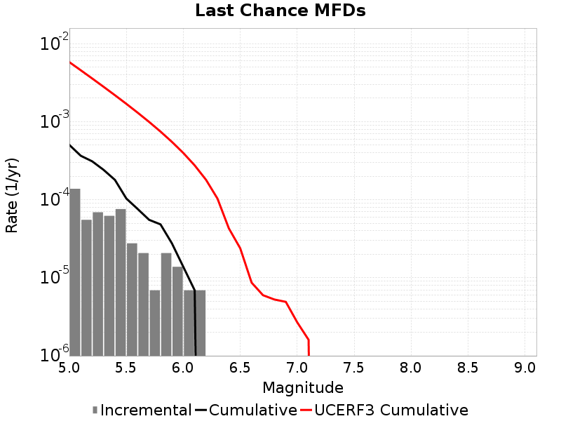

| Magnitude | Incremental Rate | Cumulative Rate | UCERF3 Cumulative Rate |
|-----|-----|-----|-----|
| 5.05 | 1.3818599E-4 | 5.0437887E-4 | 0.0058026146 |
| 5.15 | 5.52744E-5 | 3.661929E-4 | 0.0045671975 |
| 5.25 | 6.9092996E-5 | 3.109185E-4 | 0.0035858706 |
| 5.35 | 6.21837E-5 | 2.418255E-4 | 0.002806375 |
| 5.45 | 7.6002296E-5 | 1.796418E-4 | 0.0021871997 |
| 5.55 | 2.76372E-5 | 1.036395E-4 | 0.0016953712 |
| 5.65 | 2.0727899E-5 | 7.6002296E-5 | 0.001304698 |
| 5.75 | 6.9093E-6 | 5.52744E-5 | 9.943752E-4 |
| 5.85 | 2.0727899E-5 | 4.83651E-5 | 7.4787706E-4 |
| 5.95 | 1.38186E-5 | 2.76372E-5 | 5.520766E-4 |
| 6.05 | 6.9093E-6 | 1.38186E-5 | 3.9772684E-4 |
| 6.15 | 6.9093E-6 | 6.9093E-6 | 2.7574736E-4 |
| 6.25 | 0.0 | 0.0 | 1.7976403E-4 |
| 6.35 | 0.0 | 0.0 | 1.0352177E-4 |
| 6.45 | 0.0 | 0.0 | 4.2960397E-5 |
| 6.55 | 0.0 | 0.0 | 2.3839566E-5 |
| 6.65 | 0.0 | 0.0 | 8.651351E-6 |
| 6.75 | 0.0 | 0.0 | 5.974446E-6 |
| 6.85 | 0.0 | 0.0 | 5.2635814E-6 |
| 6.95 | 0.0 | 0.0 | 4.9122823E-6 |
| 7.05 | 0.0 | 0.0 | 2.6888263E-6 |
| 7.15 | 0.0 | 0.0 | 1.6035956E-6 |

### Lenwood-Lockhart-Old Woman Springs
*[(top)](#table-of-contents)*

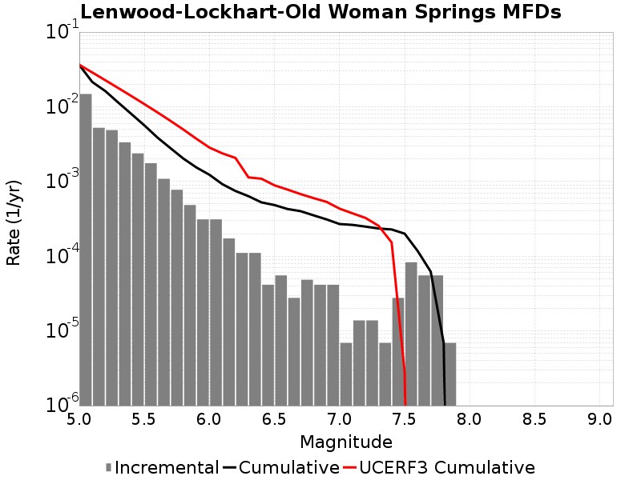

| Magnitude | Incremental Rate | Cumulative Rate | UCERF3 Cumulative Rate |
|-----|-----|-----|-----|
| 5.05 | 0.014799721 | 0.036356736 | 0.03648569 |
| 5.15 | 0.00523034 | 0.021557016 | 0.028778484 |
| 5.25 | 0.004864147 | 0.016326675 | 0.022656433 |
| 5.35 | 0.0033441011 | 0.011462528 | 0.017793514 |
| 5.45 | 0.0023767992 | 0.008118427 | 0.013930759 |
| 5.55 | 0.0017549621 | 0.0057416284 | 0.010862465 |
| 5.65 | 0.0010847601 | 0.003986666 | 0.008425232 |
| 5.75 | 7.807509E-4 | 0.002901906 | 0.006489269 |
| 5.85 | 4.83651E-4 | 0.0021211552 | 0.0049514794 |
| 5.95 | 3.109185E-4 | 0.0016375041 | 0.003729969 |
| 6.05 | 3.178278E-4 | 0.0013265855 | 0.002845256 |
| 6.15 | 1.727325E-4 | 0.0010087577 | 0.0023761638 |
| 6.25 | 1.105488E-4 | 8.360253E-4 | 0.002066353 |
| 6.35 | 1.105488E-4 | 7.254765E-4 | 0.0011346865 |
| 6.45 | 4.1455798E-5 | 6.149277E-4 | 0.0010882706 |
| 6.55 | 5.52744E-5 | 5.734719E-4 | 8.8834733E-4 |
| 6.65 | 2.76372E-5 | 5.181975E-4 | 7.7934173E-4 |
| 6.75 | 4.83651E-5 | 4.905603E-4 | 6.785223E-4 |
| 6.85 | 4.1455798E-5 | 4.421952E-4 | 5.991159E-4 |
| 6.95 | 4.1455798E-5 | 4.007394E-4 | 5.3357775E-4 |
| 7.05 | 1.38186E-5 | 3.592836E-4 | 4.3296805E-4 |
| 7.15 | 1.38186E-5 | 3.45465E-4 | 3.7428946E-4 |
| 7.25 | 1.38186E-5 | 3.3164638E-4 | 3.2484022E-4 |
| 7.35 | 4.83651E-5 | 3.178278E-4 | 2.547318E-4 |
| 7.45 | 4.1455798E-5 | 2.694627E-4 | 1.5289521E-4 |
| 7.55 | 1.105488E-4 | 2.280069E-4 | 2.805055E-6 |
| 7.65 | 5.52744E-5 | 1.174581E-4 | 0.0 |
| 7.75 | 5.52744E-5 | 6.21837E-5 | 0.0 |
| 7.85 | 6.9093E-6 | 6.9093E-6 | 0.0 |

### Likely 2011 CFM
*[(top)](#table-of-contents)*

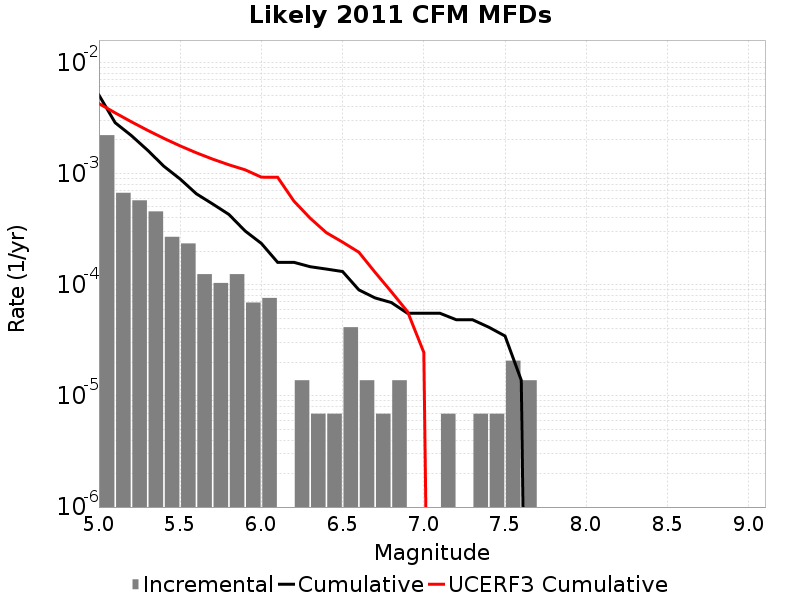

| Magnitude | Incremental Rate | Cumulative Rate | UCERF3 Cumulative Rate |
|-----|-----|-----|-----|
| 5.05 | 0.0022109759 | 0.0050714263 | 0.004255803 |
| 5.15 | 6.702021E-4 | 0.0028604502 | 0.0035082905 |
| 5.25 | 5.734719E-4 | 0.002190248 | 0.0029145202 |
| 5.35 | 4.560138E-4 | 0.0016167762 | 0.0024428717 |
| 5.45 | 2.694627E-4 | 0.0011607624 | 0.002068228 |
| 5.55 | 2.349162E-4 | 8.912997E-4 | 0.0017706379 |
| 5.65 | 1.243674E-4 | 6.5638346E-4 | 0.0015342538 |
| 5.75 | 1.036395E-4 | 5.320161E-4 | 0.0013464871 |
| 5.85 | 1.243674E-4 | 4.283766E-4 | 0.0011973388 |
| 5.95 | 6.9092996E-5 | 3.0400918E-4 | 0.0010788661 |
| 6.05 | 7.6002296E-5 | 2.349162E-4 | 9.26466E-4 |
| 6.15 | 0.0 | 1.589139E-4 | 9.2518795E-4 |
| 6.25 | 1.38186E-5 | 1.589139E-4 | 5.650886E-4 |
| 6.35 | 6.9093E-6 | 1.450953E-4 | 3.966625E-4 |
| 6.45 | 6.9093E-6 | 1.3818599E-4 | 2.9357223E-4 |
| 6.55 | 4.1455798E-5 | 1.312767E-4 | 2.4123515E-4 |
| 6.65 | 1.38186E-5 | 8.98209E-5 | 1.959297E-4 |
| 6.75 | 6.9093E-6 | 7.6002296E-5 | 1.2915647E-4 |
| 6.85 | 1.38186E-5 | 6.9092996E-5 | 8.642037E-5 |
| 6.95 | 0.0 | 5.52744E-5 | 5.7143952E-5 |
| 7.05 | 0.0 | 5.52744E-5 | 2.4585619E-5 |
| 7.15 | 6.9093E-6 | 5.52744E-5 | 0.0 |
| 7.25 | 0.0 | 4.83651E-5 | 0.0 |
| 7.35 | 6.9093E-6 | 4.83651E-5 | 0.0 |
| 7.45 | 6.9093E-6 | 4.1455798E-5 | 0.0 |
| 7.55 | 2.0727899E-5 | 3.4546498E-5 | 0.0 |
| 7.65 | 1.38186E-5 | 1.38186E-5 | 0.0 |

### Lions Head 2011 CFM
*[(top)](#table-of-contents)*

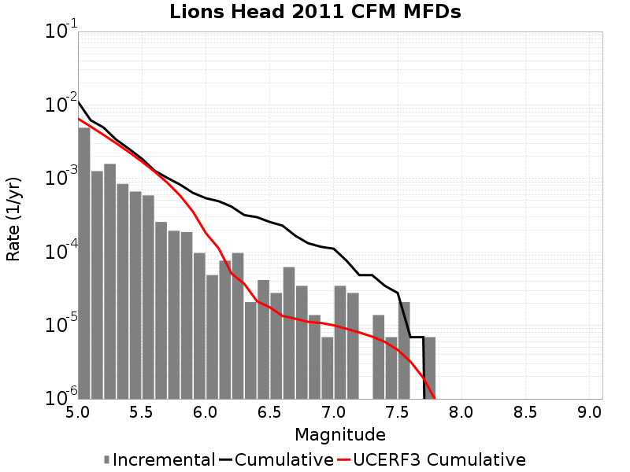

| Magnitude | Incremental Rate | Cumulative Rate | UCERF3 Cumulative Rate |
|-----|-----|-----|-----|
| 5.05 | 0.0048917844 | 0.011213793 | 0.006533182 |
| 5.15 | 0.0012574926 | 0.0063220095 | 0.005078775 |
| 5.25 | 0.0015753204 | 0.005064517 | 0.003923498 |
| 5.35 | 8.429346E-4 | 0.0034891965 | 0.0030058292 |
| 5.45 | 6.6329277E-4 | 0.0026462618 | 0.0022768988 |
| 5.55 | 5.872905E-4 | 0.001982969 | 0.0016978888 |
| 5.65 | 2.556441E-4 | 0.0013956786 | 0.0012379648 |
| 5.75 | 1.934604E-4 | 0.0011400345 | 8.7263423E-4 |
| 5.85 | 1.865511E-4 | 9.465741E-4 | 5.824418E-4 |
| 5.95 | 9.67302E-5 | 7.60023E-4 | 3.519338E-4 |
| 6.05 | 4.83651E-5 | 6.6329277E-4 | 1.8037547E-4 |
| 6.15 | 7.6002296E-5 | 6.149277E-4 | 1.12276364E-4 |
| 6.25 | 1.036395E-4 | 5.389254E-4 | 5.0971244E-5 |
| 6.35 | 2.0727899E-5 | 4.3528588E-4 | 3.690282E-5 |
| 6.45 | 4.83651E-5 | 4.14558E-4 | 2.130225E-5 |
| 6.55 | 2.76372E-5 | 3.661929E-4 | 1.7676726E-5 |
| 6.65 | 6.21837E-5 | 3.385557E-4 | 1.3436651E-5 |
| 6.75 | 3.4546498E-5 | 2.7637198E-4 | 1.2340342E-5 |
| 6.85 | 2.0727899E-5 | 2.418255E-4 | 1.1183565E-5 |
| 6.95 | 1.38186E-5 | 2.210976E-4 | 1.0813019E-5 |
| 7.05 | 4.1455798E-5 | 2.07279E-4 | 1.0039577E-5 |
| 7.15 | 2.76372E-5 | 1.6582319E-4 | 9.006879E-6 |
| 7.25 | 2.0727899E-5 | 1.3818599E-4 | 8.016803E-6 |
| 7.35 | 2.76372E-5 | 1.174581E-4 | 7.053426E-6 |
| 7.45 | 2.76372E-5 | 8.98209E-5 | 5.9619633E-6 |
| 7.55 | 2.76372E-5 | 6.21837E-5 | 4.647651E-6 |
| 7.65 | 6.9093E-6 | 3.4546498E-5 | 3.2198243E-6 |
| 7.75 | 1.38186E-5 | 2.76372E-5 | 1.9333481E-6 |
| 7.85 | 6.9093E-6 | 1.38186E-5 | 9.253558E-7 |
| 7.95 | 6.9093E-6 | 6.9093E-6 | 5.0003104E-7 |
| 8.05 | 0.0 | 0.0 | 1.7896318E-7 |

### Little Lake
*[(top)](#table-of-contents)*

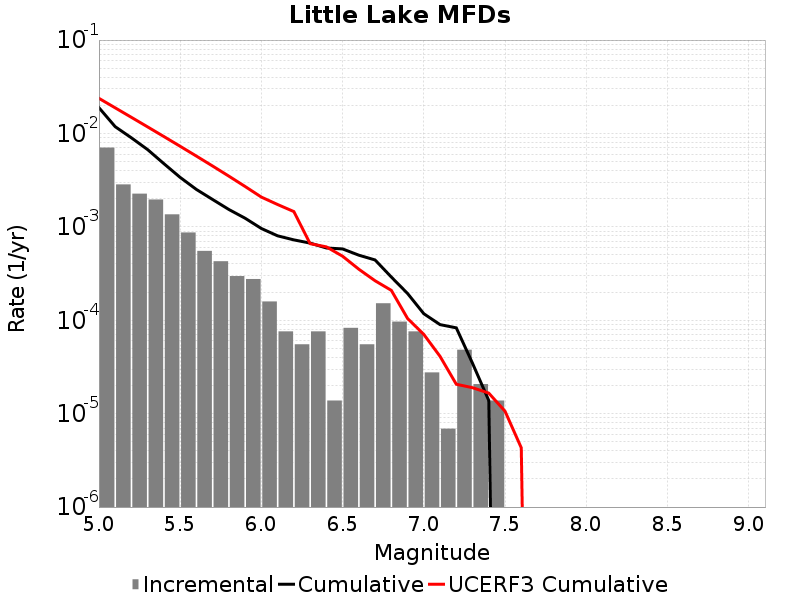

| Magnitude | Incremental Rate | Cumulative Rate | UCERF3 Cumulative Rate |
|-----|-----|-----|-----|
| 5.05 | 0.0070613045 | 0.01914567 | 0.02376616 |
| 5.15 | 0.0028466315 | 0.012084366 | 0.018810438 |
| 5.25 | 0.0022662503 | 0.009237734 | 0.014873968 |
| 5.35 | 0.0019622413 | 0.0069714836 | 0.011747119 |
| 5.45 | 0.0013611321 | 0.0050092423 | 0.009263375 |
| 5.55 | 8.7057176E-4 | 0.0036481104 | 0.007290466 |
| 5.65 | 5.5274396E-4 | 0.0027775385 | 0.0057233297 |
| 5.75 | 4.283766E-4 | 0.0022247946 | 0.0044785086 |
| 5.85 | 2.970999E-4 | 0.001796418 | 0.0034897123 |
| 5.95 | 2.901906E-4 | 0.001499318 | 0.0027042832 |
| 6.05 | 1.796418E-4 | 0.0012091275 | 0.0020828273 |
| 6.15 | 8.2911596E-5 | 0.0010294857 | 0.0017342081 |
| 6.25 | 6.9092996E-5 | 9.465741E-4 | 0.0014572901 |
| 6.35 | 1.036395E-4 | 8.7748107E-4 | 6.610335E-4 |
| 6.45 | 2.0727899E-5 | 7.738416E-4 | 6.1068224E-4 |
| 6.55 | 1.036395E-4 | 7.531137E-4 | 4.849106E-4 |
| 6.65 | 8.98209E-5 | 6.494742E-4 | 3.5188196E-4 |
| 6.75 | 1.6582319E-4 | 5.596533E-4 | 2.6477844E-4 |
| 6.85 | 9.67302E-5 | 3.938301E-4 | 2.0896501E-4 |
| 6.95 | 7.6002296E-5 | 2.970999E-4 | 1.04490195E-4 |
| 7.05 | 4.1455798E-5 | 2.210976E-4 | 7.053496E-5 |
| 7.15 | 4.1455798E-5 | 1.796418E-4 | 4.1039115E-5 |
| 7.25 | 7.6002296E-5 | 1.3818599E-4 | 2.064693E-5 |
| 7.35 | 3.4546498E-5 | 6.21837E-5 | 1.8967039E-5 |
| 7.45 | 1.38186E-5 | 2.76372E-5 | 1.6586931E-5 |
| 7.55 | 0.0 | 1.38186E-5 | 1.0616475E-5 |
| 7.65 | 6.9093E-6 | 1.38186E-5 | 4.308269E-6 |
| 7.75 | 0.0 | 6.9093E-6 | 0.0 |
| 7.85 | 0.0 | 6.9093E-6 | 0.0 |
| 7.95 | 0.0 | 6.9093E-6 | 0.0 |
| 8.05 | 6.9093E-6 | 6.9093E-6 | 0.0 |

### Los Alamos 2011 CFM
*[(top)](#table-of-contents)*

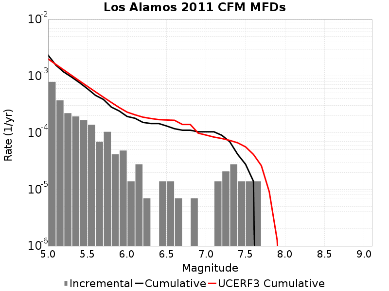

| Magnitude | Incremental Rate | Cumulative Rate | UCERF3 Cumulative Rate |
|-----|-----|-----|-----|
| 5.05 | 7.876602E-4 | 0.0028051757 | 0.0020070537 |
| 5.15 | 3.731022E-4 | 0.0020175155 | 0.0016002351 |
| 5.25 | 2.210976E-4 | 0.0016444133 | 0.0012770877 |
| 5.35 | 1.934604E-4 | 0.0014233157 | 0.0010204025 |
| 5.45 | 1.6582319E-4 | 0.0012298553 | 8.165103E-4 |
| 5.55 | 1.3818599E-4 | 0.0010640322 | 6.5455295E-4 |
| 5.65 | 7.6002296E-5 | 9.2584617E-4 | 5.2590563E-4 |
| 5.75 | 1.036395E-4 | 8.498439E-4 | 4.237174E-4 |
| 5.85 | 6.21837E-5 | 7.462044E-4 | 3.4254644E-4 |
| 5.95 | 6.9092996E-5 | 6.840207E-4 | 2.7807005E-4 |
| 6.05 | 2.76372E-5 | 6.149277E-4 | 2.3078102E-4 |
| 6.15 | 3.4546498E-5 | 5.872905E-4 | 2.0695315E-4 |
| 6.25 | 4.1455798E-5 | 5.5274396E-4 | 1.8808777E-4 |
| 6.35 | 2.0727899E-5 | 5.112882E-4 | 1.7811371E-4 |
| 6.45 | 2.0727899E-5 | 4.905603E-4 | 1.7019102E-4 |
| 6.55 | 4.83651E-5 | 4.698324E-4 | 1.6747703E-4 |
| 6.65 | 1.38186E-5 | 4.214673E-4 | 1.6549752E-4 |
| 6.75 | 1.38186E-5 | 4.0764868E-4 | 1.3972473E-4 |
| 6.85 | 4.83651E-5 | 3.938301E-4 | 1.397243E-4 |
| 6.95 | 5.52744E-5 | 3.45465E-4 | 9.81835E-5 |
| 7.05 | 3.4546498E-5 | 2.901906E-4 | 9.064782E-5 |
| 7.15 | 5.52744E-5 | 2.556441E-4 | 8.364651E-5 |
| 7.25 | 4.1455798E-5 | 2.003697E-4 | 7.889646E-5 |
| 7.35 | 4.1455798E-5 | 1.589139E-4 | 7.3019044E-5 |
| 7.45 | 4.1455798E-5 | 1.174581E-4 | 6.621797E-5 |
| 7.55 | 4.1455798E-5 | 7.6002296E-5 | 5.610656E-5 |
| 7.65 | 2.0727899E-5 | 3.4546498E-5 | 4.1313968E-5 |
| 7.75 | 1.38186E-5 | 1.38186E-5 | 2.6103759E-5 |
| 7.85 | 0.0 | 0.0 | 9.0234225E-6 |
| 7.95 | 0.0 | 0.0 | 1.2677555E-6 |
| 8.05 | 0.0 | 0.0 | 1.802818E-9 |

### Los Alamos extension
*[(top)](#table-of-contents)*

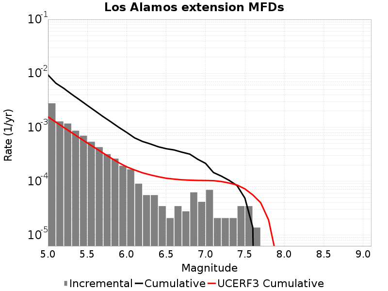

| Magnitude | Incremental Rate | Cumulative Rate | UCERF3 Cumulative Rate |
|-----|-----|-----|-----|
| 5.05 | 0.0027844477 | 0.010426134 | 0.0015621603 |
| 5.15 | 0.0012851298 | 0.0076416857 | 0.001246284 |
| 5.25 | 0.001174581 | 0.006356556 | 9.953745E-4 |
| 5.35 | 8.636625E-4 | 0.0051819747 | 7.9607003E-4 |
| 5.45 | 6.978393E-4 | 0.0043183123 | 6.377569E-4 |
| 5.55 | 5.5274396E-4 | 0.0036204732 | 5.1200425E-4 |
| 5.65 | 4.491045E-4 | 0.003067729 | 4.1211536E-4 |
| 5.75 | 3.523743E-4 | 0.0026186246 | 3.3277084E-4 |
| 5.85 | 2.970999E-4 | 0.0022662503 | 2.6974521E-4 |
| 5.95 | 2.349162E-4 | 0.0019691505 | 2.1968219E-4 |
| 6.05 | 2.141883E-4 | 0.0017342343 | 1.845224E-4 |
| 6.15 | 1.450953E-4 | 0.001520046 | 1.6146513E-4 |
| 6.25 | 7.6002296E-5 | 0.0013749506 | 1.4315009E-4 |
| 6.35 | 9.67302E-5 | 0.0012989484 | 1.3088108E-4 |
| 6.45 | 7.6002296E-5 | 0.0012022182 | 1.2113546E-4 |
| 6.55 | 8.2911596E-5 | 0.0011262159 | 1.13558104E-4 |
| 6.65 | 5.52744E-5 | 0.0010433043 | 1.0943622E-4 |
| 6.75 | 7.6002296E-5 | 9.880299E-4 | 1.0623102E-4 |
| 6.85 | 1.036395E-4 | 9.120276E-4 | 1.0461916E-4 |
| 6.95 | 8.2911596E-5 | 8.083881E-4 | 1.0354897E-4 |
| 7.05 | 1.5200459E-4 | 7.254765E-4 | 1.03131504E-4 |
| 7.15 | 1.105488E-4 | 5.734719E-4 | 1.0233077E-4 |
| 7.25 | 8.98209E-5 | 4.6292308E-4 | 9.871362E-5 |
| 7.35 | 1.036395E-4 | 3.731022E-4 | 9.248779E-5 |
| 7.45 | 7.6002296E-5 | 2.694627E-4 | 8.49826E-5 |
| 7.55 | 1.105488E-4 | 1.934604E-4 | 7.2005314E-5 |
| 7.65 | 5.52744E-5 | 8.2911596E-5 | 5.5672503E-5 |
| 7.75 | 2.0727899E-5 | 2.76372E-5 | 3.9959054E-5 |
| 7.85 | 6.9093E-6 | 6.9093E-6 | 1.9121946E-5 |
| 7.95 | 0.0 | 0.0 | 3.9464185E-6 |
| 8.05 | 0.0 | 0.0 | 1.802818E-9 |

### Los Medanos - Roe Island
*[(top)](#table-of-contents)*

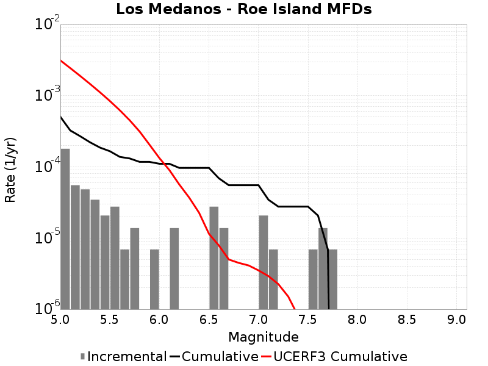

| Magnitude | Incremental Rate | Cumulative Rate | UCERF3 Cumulative Rate |
|-----|-----|-----|-----|
| 5.05 | 1.796418E-4 | 7.254765E-4 | 0.0031248953 |
| 5.15 | 5.52744E-5 | 5.458347E-4 | 0.0024377487 |
| 5.25 | 4.83651E-5 | 4.905603E-4 | 0.0018919287 |
| 5.35 | 3.4546498E-5 | 4.421952E-4 | 0.0014583685 |
| 5.45 | 2.0727899E-5 | 4.0764868E-4 | 0.0011139794 |
| 5.55 | 2.76372E-5 | 3.869208E-4 | 8.4042136E-4 |
| 5.65 | 6.9093E-6 | 3.592836E-4 | 6.231265E-4 |
| 5.75 | 1.38186E-5 | 3.523743E-4 | 4.5052308E-4 |
| 5.85 | 0.0 | 3.385557E-4 | 3.134193E-4 |
| 5.95 | 1.38186E-5 | 3.385557E-4 | 2.045139E-4 |
| 6.05 | 6.9093E-6 | 3.247371E-4 | 1.3258882E-4 |
| 6.15 | 2.0727899E-5 | 3.178278E-4 | 9.026181E-5 |
| 6.25 | 0.0 | 2.970999E-4 | 5.6640616E-5 |
| 6.35 | 0.0 | 2.970999E-4 | 3.705553E-5 |
| 6.45 | 0.0 | 2.970999E-4 | 2.267771E-5 |
| 6.55 | 2.76372E-5 | 2.970999E-4 | 1.14674385E-5 |
| 6.65 | 1.38186E-5 | 2.694627E-4 | 7.877603E-6 |
| 6.75 | 0.0 | 2.556441E-4 | 5.0038957E-6 |
| 6.85 | 0.0 | 2.556441E-4 | 4.4870417E-6 |
| 6.95 | 2.76372E-5 | 2.556441E-4 | 4.1276876E-6 |
| 7.05 | 1.450953E-4 | 2.280069E-4 | 3.5175315E-6 |
| 7.15 | 2.76372E-5 | 8.2911596E-5 | 2.9254754E-6 |
| 7.25 | 0.0 | 5.52744E-5 | 2.2574675E-6 |
| 7.35 | 0.0 | 5.52744E-5 | 1.5099544E-6 |
| 7.45 | 0.0 | 5.52744E-5 | 8.0351464E-7 |
| 7.55 | 2.76372E-5 | 5.52744E-5 | 4.4282874E-7 |
| 7.65 | 2.0727899E-5 | 2.76372E-5 | 2.4059148E-7 |
| 7.75 | 6.9093E-6 | 6.9093E-6 | 2.8536205E-9 |

### Los Osos 2011
*[(top)](#table-of-contents)*

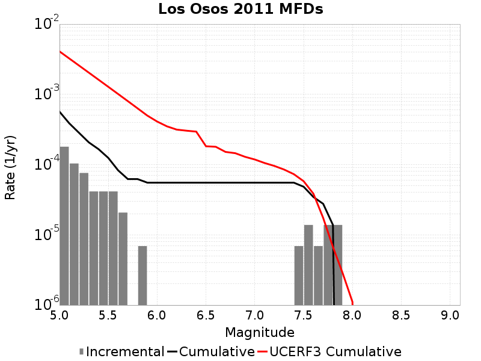

| Magnitude | Incremental Rate | Cumulative Rate | UCERF3 Cumulative Rate |
|-----|-----|-----|-----|
| 5.05 | 1.796418E-4 | 8.083881E-4 | 0.0040854206 |
| 5.15 | 1.036395E-4 | 6.287463E-4 | 0.003241233 |
| 5.25 | 7.6002296E-5 | 5.251068E-4 | 0.0025706713 |
| 5.35 | 4.1455798E-5 | 4.491045E-4 | 0.0020380253 |
| 5.45 | 4.1455798E-5 | 4.0764868E-4 | 0.0016149293 |
| 5.55 | 4.1455798E-5 | 3.661929E-4 | 0.0012788523 |
| 5.65 | 2.0727899E-5 | 3.247371E-4 | 0.0010118969 |
| 5.75 | 6.9093E-6 | 3.0400918E-4 | 7.998466E-4 |
| 5.85 | 1.38186E-5 | 2.970999E-4 | 6.3140906E-4 |
| 5.95 | 0.0 | 2.832813E-4 | 4.9761444E-4 |
| 6.05 | 0.0 | 2.832813E-4 | 4.10068E-4 |
| 6.15 | 0.0 | 2.832813E-4 | 3.5046192E-4 |
| 6.25 | 0.0 | 2.832813E-4 | 3.1506064E-4 |
| 6.35 | 0.0 | 2.832813E-4 | 3.0381128E-4 |
| 6.45 | 6.9093E-6 | 2.832813E-4 | 2.948756E-4 |
| 6.55 | 6.9093E-6 | 2.7637198E-4 | 1.8239478E-4 |
| 6.65 | 0.0 | 2.694627E-4 | 1.7928115E-4 |
| 6.75 | 0.0 | 2.694627E-4 | 1.515445E-4 |
| 6.85 | 0.0 | 2.694627E-4 | 1.4528062E-4 |
| 6.95 | 0.0 | 2.694627E-4 | 1.2900274E-4 |
| 7.05 | 0.0 | 2.694627E-4 | 1.1813713E-4 |
| 7.15 | 0.0 | 2.694627E-4 | 1.05322644E-4 |
| 7.25 | 0.0 | 2.694627E-4 | 9.5705924E-5 |
| 7.35 | 6.9093E-6 | 2.694627E-4 | 8.4963445E-5 |
| 7.45 | 1.38186E-5 | 2.625534E-4 | 7.298343E-5 |
| 7.55 | 4.83651E-5 | 2.487348E-4 | 5.797922E-5 |
| 7.65 | 7.6002296E-5 | 2.003697E-4 | 3.848676E-5 |
| 7.75 | 8.98209E-5 | 1.243674E-4 | 1.7385875E-5 |
| 7.85 | 3.4546498E-5 | 3.4546498E-5 | 6.7202227E-6 |
| 7.95 | 0.0 | 0.0 | 2.8314473E-6 |
| 8.05 | 0.0 | 0.0 | 1.1069503E-6 |

### Lost Hills
*[(top)](#table-of-contents)*

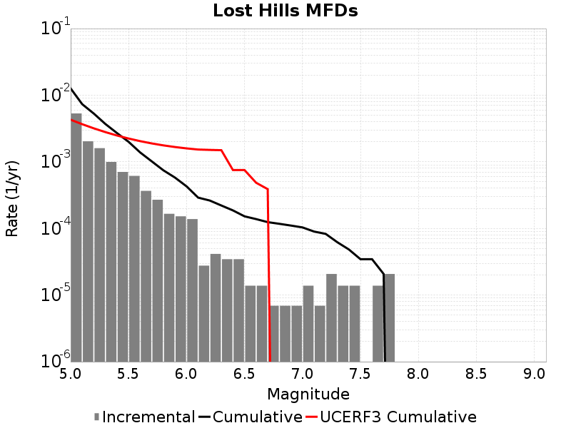

| Magnitude | Incremental Rate | Cumulative Rate | UCERF3 Cumulative Rate |
|-----|-----|-----|-----|
| 5.05 | 0.005320161 | 0.013749507 | 0.0042868447 |
| 5.15 | 0.0020313342 | 0.008429346 | 0.0036707108 |
| 5.25 | 0.0016029576 | 0.006398012 | 0.0031812983 |
| 5.35 | 9.949392E-4 | 0.004795054 | 0.002792544 |
| 5.45 | 7.047486E-4 | 0.0038001148 | 0.0024837453 |
| 5.55 | 6.149277E-4 | 0.0030953663 | 0.002238458 |
| 5.65 | 3.661929E-4 | 0.0024804387 | 0.0020436193 |
| 5.75 | 2.694627E-4 | 0.0021142457 | 0.0018888535 |
| 5.85 | 1.6582319E-4 | 0.0018447831 | 0.0017659187 |
| 5.95 | 1.5200459E-4 | 0.0016789599 | 0.001668268 |
| 6.05 | 1.3818599E-4 | 0.0015269553 | 0.0015907013 |
| 6.15 | 2.76372E-5 | 0.0013887692 | 0.0015296795 |
| 6.25 | 4.1455798E-5 | 0.0013611321 | 0.001510103 |
| 6.35 | 3.4546498E-5 | 0.0013196763 | 0.0014948016 |
| 6.45 | 3.4546498E-5 | 0.0012851298 | 7.520028E-4 |
| 6.55 | 1.38186E-5 | 0.0012505833 | 7.520028E-4 |
| 6.65 | 1.38186E-5 | 0.0012367647 | 4.8541208E-4 |
| 6.75 | 6.9093E-6 | 0.0012229461 | 3.8904924E-4 |
| 6.85 | 6.9093E-6 | 0.0012160367 | 0.0 |
| 6.95 | 6.9093E-6 | 0.0012091275 | 0.0 |
| 7.05 | 4.83651E-5 | 0.0012022182 | 0.0 |
| 7.15 | 2.76372E-5 | 0.0011538531 | 0.0 |
| 7.25 | 4.83651E-5 | 0.0011262159 | 0.0 |
| 7.35 | 5.52744E-5 | 0.0010778508 | 0.0 |
| 7.45 | 6.9092996E-5 | 0.0010225764 | 0.0 |
| 7.55 | 1.5200459E-4 | 9.534834E-4 | 0.0 |
| 7.65 | 3.661929E-4 | 8.014788E-4 | 0.0 |
| 7.75 | 3.385557E-4 | 4.3528588E-4 | 0.0 |
| 7.85 | 5.52744E-5 | 9.67302E-5 | 0.0 |
| 7.95 | 3.4546498E-5 | 4.1455798E-5 | 0.0 |
| 8.05 | 6.9093E-6 | 6.9093E-6 | 0.0 |

### Ludlow
*[(top)](#table-of-contents)*

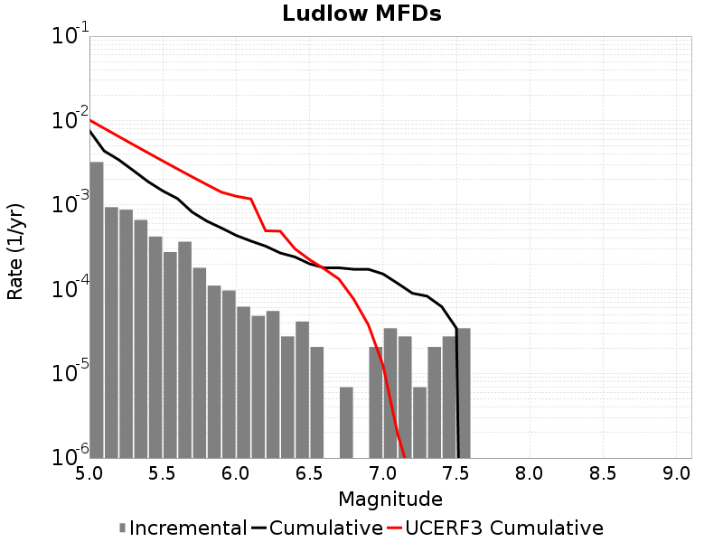

| Magnitude | Incremental Rate | Cumulative Rate | UCERF3 Cumulative Rate |
|-----|-----|-----|-----|
| 5.05 | 0.0032197337 | 0.007586411 | 0.010154627 |
| 5.15 | 9.396648E-4 | 0.0043666777 | 0.0080983685 |
| 5.25 | 8.7748107E-4 | 0.0034270128 | 0.0064650252 |
| 5.35 | 6.6329277E-4 | 0.0025495316 | 0.005167614 |
| 5.45 | 4.214673E-4 | 0.0018862389 | 0.004137044 |
| 5.55 | 2.7637198E-4 | 0.0014647716 | 0.003318433 |
| 5.65 | 3.661929E-4 | 0.0011883996 | 0.002668187 |
| 5.75 | 1.796418E-4 | 8.2220667E-4 | 0.0021516785 |
| 5.85 | 1.105488E-4 | 6.425649E-4 | 0.0017414012 |
| 5.95 | 9.67302E-5 | 5.320161E-4 | 0.0014155062 |
| 6.05 | 6.21837E-5 | 4.3528588E-4 | 0.0012674374 |
| 6.15 | 4.83651E-5 | 3.731022E-4 | 0.0011776132 |
| 6.25 | 5.52744E-5 | 3.247371E-4 | 4.940817E-4 |
| 6.35 | 2.76372E-5 | 2.694627E-4 | 4.881498E-4 |
| 6.45 | 4.1455798E-5 | 2.418255E-4 | 3.0158038E-4 |
| 6.55 | 2.0727899E-5 | 2.003697E-4 | 2.2423151E-4 |
| 6.65 | 0.0 | 1.796418E-4 | 1.74374E-4 |
| 6.75 | 6.9093E-6 | 1.796418E-4 | 1.321846E-4 |
| 6.85 | 0.0 | 1.727325E-4 | 7.6567376E-5 |
| 6.95 | 2.0727899E-5 | 1.727325E-4 | 3.7967955E-5 |
| 7.05 | 3.4546498E-5 | 1.5200459E-4 | 1.2556965E-5 |
| 7.15 | 2.76372E-5 | 1.174581E-4 | 1.917682E-6 |
| 7.25 | 6.9093E-6 | 8.98209E-5 | 5.0835257E-7 |
| 7.35 | 2.0727899E-5 | 8.2911596E-5 | 0.0 |
| 7.45 | 2.76372E-5 | 6.21837E-5 | 0.0 |
| 7.55 | 3.4546498E-5 | 3.4546498E-5 | 0.0 |

### Maacama 2011 CFM
*[(top)](#table-of-contents)*

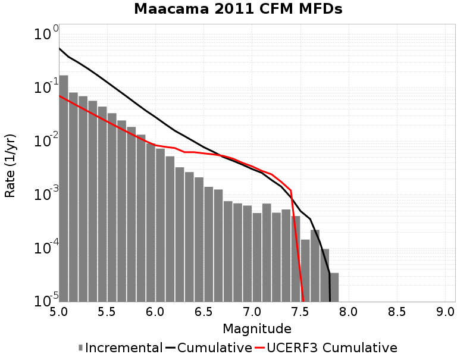

| Magnitude | Incremental Rate | Cumulative Rate | UCERF3 Cumulative Rate |
|-----|-----|-----|-----|
| 5.05 | 0.17213139 | 0.55433315 | 0.07164439 |
| 5.15 | 0.082123935 | 0.38220173 | 0.057157062 |
| 5.25 | 0.07000503 | 0.3000778 | 0.04564937 |
| 5.35 | 0.057381734 | 0.23007278 | 0.036508482 |
| 5.45 | 0.04470317 | 0.17269105 | 0.029247617 |
| 5.55 | 0.03364829 | 0.12798788 | 0.023480108 |
| 5.65 | 0.024645472 | 0.09433958 | 0.018898811 |
| 5.75 | 0.018634383 | 0.06969411 | 0.0152597595 |
| 5.85 | 0.013362586 | 0.051059727 | 0.012369158 |
| 5.95 | 0.009161731 | 0.03769714 | 0.01007307 |
| 6.05 | 0.007323858 | 0.028535409 | 0.008438677 |
| 6.15 | 0.005257977 | 0.021211552 | 0.007913543 |
| 6.25 | 0.0032888267 | 0.015953574 | 0.007505172 |
| 6.35 | 0.0026669898 | 0.0126647465 | 0.006294703 |
| 6.45 | 0.0021349736 | 0.009997757 | 0.0062777745 |
| 6.55 | 0.0014094972 | 0.007862783 | 0.005970559 |
| 6.65 | 0.0012644018 | 0.006453286 | 0.0057060844 |
| 6.75 | 7.6693227E-4 | 0.005188884 | 0.00535695 |
| 6.85 | 6.978393E-4 | 0.0044219517 | 0.004761287 |
| 6.95 | 6.356556E-4 | 0.0037241126 | 0.0039645433 |
| 7.05 | 4.560138E-4 | 0.003088457 | 0.0034024685 |
| 7.15 | 6.9093E-4 | 0.0026324433 | 0.0028083639 |
| 7.25 | 4.698324E-4 | 0.0019415133 | 0.0024200666 |
| 7.35 | 5.458347E-4 | 0.0014716808 | 0.0017536277 |
| 7.45 | 4.14558E-4 | 9.2584617E-4 | 0.001205536 |
| 7.55 | 1.5200459E-4 | 5.112882E-4 | 3.112568E-5 |
| 7.65 | 2.210976E-4 | 3.592836E-4 | 6.960406E-7 |
| 7.75 | 1.036395E-4 | 1.3818599E-4 | 3.371692E-7 |
| 7.85 | 3.4546498E-5 | 3.4546498E-5 | 4.598259E-8 |

### Mad River (alt1)
*[(top)](#table-of-contents)*

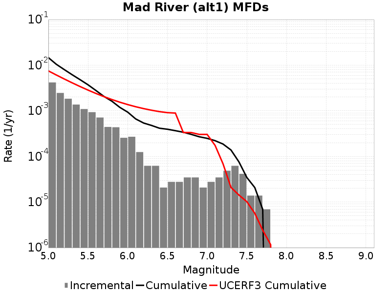

| Magnitude | Incremental Rate | Cumulative Rate | UCERF3 Cumulative Rate |
|-----|-----|-----|-----|
| 5.05 | 0.0041801264 | 0.015967391 | 0.0074982448 |
| 5.15 | 0.0024597107 | 0.011787266 | 0.0060970886 |
| 5.25 | 0.0018378737 | 0.009327555 | 0.0049841106 |
| 5.35 | 0.0013680414 | 0.0074896812 | 0.0041000405 |
| 5.45 | 0.0010916694 | 0.0061216396 | 0.003397799 |
| 5.55 | 9.327555E-4 | 0.0050299703 | 0.0028399888 |
| 5.65 | 7.1165786E-4 | 0.004097215 | 0.0023969042 |
| 5.75 | 4.421952E-4 | 0.0033855569 | 0.0020449497 |
| 5.85 | 4.3528588E-4 | 0.0029433616 | 0.0017653822 |
| 5.95 | 2.556441E-4 | 0.002508076 | 0.001543314 |
| 6.05 | 3.3164638E-4 | 0.0022524318 | 0.0013669188 |
| 6.15 | 2.141883E-4 | 0.0019207854 | 0.0012268032 |
| 6.25 | 1.6582319E-4 | 0.001706597 | 0.0011160887 |
| 6.35 | 1.6582319E-4 | 0.0015407739 | 0.0010281452 |
| 6.45 | 1.3818599E-4 | 0.0013749506 | 9.585345E-4 |
| 6.55 | 8.98209E-5 | 0.0012367647 | 9.0997486E-4 |
| 6.65 | 6.21837E-5 | 0.0011469438 | 8.908199E-4 |
| 6.75 | 1.3818599E-4 | 0.0010847601 | 3.33867E-4 |
| 6.85 | 1.589139E-4 | 9.465741E-4 | 3.3319968E-4 |
| 6.95 | 1.105488E-4 | 7.876602E-4 | 3.0361052E-4 |
| 7.05 | 1.6582319E-4 | 6.771114E-4 | 3.033194E-4 |
| 7.15 | 1.174581E-4 | 5.112882E-4 | 1.741851E-4 |
| 7.25 | 1.036395E-4 | 3.938301E-4 | 6.892874E-5 |
| 7.35 | 1.036395E-4 | 2.901906E-4 | 2.0929147E-5 |
| 7.45 | 6.9092996E-5 | 1.865511E-4 | 1.4227942E-5 |
| 7.55 | 4.83651E-5 | 1.174581E-4 | 1.0173586E-5 |
| 7.65 | 4.1455798E-5 | 6.9092996E-5 | 5.6598547E-6 |
| 7.75 | 2.0727899E-5 | 2.76372E-5 | 2.40857E-6 |
| 7.85 | 6.9093E-6 | 6.9093E-6 | 1.1629164E-6 |

### Malibu Coast (Extension) alt 1
*[(top)](#table-of-contents)*

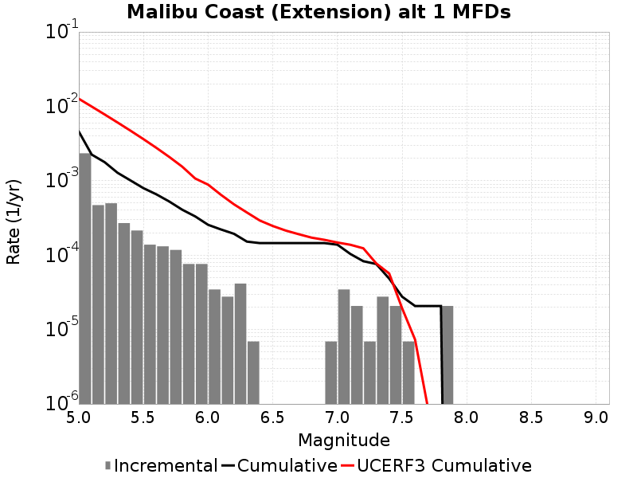

| Magnitude | Incremental Rate | Cumulative Rate | UCERF3 Cumulative Rate |
|-----|-----|-----|-----|
| 5.05 | 0.0023353433 | 0.004905603 | 0.01263826 |
| 5.15 | 4.698324E-4 | 0.0025702596 | 0.0099267345 |
| 5.25 | 4.974696E-4 | 0.0021004272 | 0.007772893 |
| 5.35 | 2.694627E-4 | 0.0016029576 | 0.0060620364 |
| 5.45 | 2.141883E-4 | 0.0013334949 | 0.0047030547 |
| 5.55 | 1.3818599E-4 | 0.0011193065 | 0.0036235768 |
| 5.65 | 1.3818599E-4 | 9.811206E-4 | 0.0027661175 |
| 5.75 | 1.243674E-4 | 8.429346E-4 | 0.002085013 |
| 5.85 | 8.2911596E-5 | 7.185672E-4 | 0.0015439927 |
| 5.95 | 7.6002296E-5 | 6.356556E-4 | 0.0010718737 |
| 6.05 | 4.1455798E-5 | 5.596533E-4 | 8.8575523E-4 |
| 6.15 | 2.76372E-5 | 5.181975E-4 | 6.4532785E-4 |
| 6.25 | 6.9092996E-5 | 4.905603E-4 | 4.8174476E-4 |
| 6.35 | 6.9093E-6 | 4.214673E-4 | 3.7421982E-4 |
| 6.45 | 0.0 | 4.14558E-4 | 2.9172833E-4 |
| 6.55 | 6.9093E-6 | 4.14558E-4 | 2.464336E-4 |
| 6.65 | 6.9093E-6 | 4.0764868E-4 | 2.1399197E-4 |
| 6.75 | 0.0 | 4.007394E-4 | 1.912321E-4 |
| 6.85 | 0.0 | 4.007394E-4 | 1.7189846E-4 |
| 6.95 | 1.38186E-5 | 4.007394E-4 | 1.6052915E-4 |
| 7.05 | 4.83651E-5 | 3.869208E-4 | 1.4777838E-4 |
| 7.15 | 3.4546498E-5 | 3.385557E-4 | 1.3786966E-4 |
| 7.25 | 1.38186E-5 | 3.0400918E-4 | 1.2359537E-4 |
| 7.35 | 8.2911596E-5 | 2.901906E-4 | 7.732295E-5 |
| 7.45 | 5.52744E-5 | 2.07279E-4 | 5.6637833E-5 |
| 7.55 | 6.9093E-6 | 1.5200459E-4 | 1.9292367E-5 |
| 7.65 | 6.9093E-6 | 1.450953E-4 | 7.3304636E-6 |
| 7.75 | 7.6002296E-5 | 1.3818599E-4 | 8.7606776E-7 |
| 7.85 | 6.21837E-5 | 6.21837E-5 | 9.368614E-8 |

### Malibu Coast alt 1
*[(top)](#table-of-contents)*

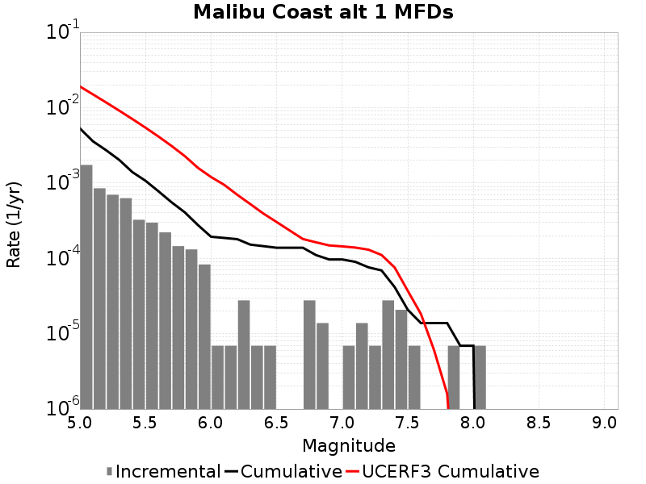

| Magnitude | Incremental Rate | Cumulative Rate | UCERF3 Cumulative Rate |
|-----|-----|-----|-----|
| 5.05 | 0.0017342343 | 0.005637989 | 0.01910272 |
| 5.15 | 8.498439E-4 | 0.0039037545 | 0.014989469 |
| 5.25 | 6.978393E-4 | 0.0030539106 | 0.011722197 |
| 5.35 | 6.287463E-4 | 0.0023560713 | 0.00912691 |
| 5.45 | 3.247371E-4 | 0.001727325 | 0.007065401 |
| 5.55 | 2.970999E-4 | 0.0014025879 | 0.005427886 |
| 5.65 | 2.210976E-4 | 0.0011054879 | 0.004127161 |
| 5.75 | 1.450953E-4 | 8.843904E-4 | 0.003093959 |
| 5.85 | 1.3818599E-4 | 7.392951E-4 | 0.0022732574 |
| 5.95 | 8.98209E-5 | 6.011091E-4 | 0.0015887392 |
| 6.05 | 3.4546498E-5 | 5.112882E-4 | 0.0012001325 |
| 6.15 | 6.9093E-6 | 4.767417E-4 | 9.464234E-4 |
| 6.25 | 3.4546498E-5 | 4.698324E-4 | 6.9725915E-4 |
| 6.35 | 2.76372E-5 | 4.3528588E-4 | 5.2370114E-4 |
| 6.45 | 2.76372E-5 | 4.0764868E-4 | 3.9172743E-4 |
| 6.55 | 2.0727899E-5 | 3.800115E-4 | 3.0343083E-4 |
| 6.65 | 1.38186E-5 | 3.592836E-4 | 2.3395881E-4 |
| 6.75 | 4.83651E-5 | 3.45465E-4 | 1.8054806E-4 |
| 6.85 | 3.4546498E-5 | 2.970999E-4 | 1.6325497E-4 |
| 6.95 | 0.0 | 2.625534E-4 | 1.4844134E-4 |
| 7.05 | 2.0727899E-5 | 2.625534E-4 | 1.4414193E-4 |
| 7.15 | 3.4546498E-5 | 2.418255E-4 | 1.389639E-4 |
| 7.25 | 2.0727899E-5 | 2.07279E-4 | 1.3032656E-4 |
| 7.35 | 6.21837E-5 | 1.865511E-4 | 1.1068497E-4 |
| 7.45 | 4.1455798E-5 | 1.243674E-4 | 7.551302E-5 |
| 7.55 | 2.0727899E-5 | 8.2911596E-5 | 3.6947346E-5 |
| 7.65 | 2.0727899E-5 | 6.21837E-5 | 1.8271354E-5 |
| 7.75 | 2.76372E-5 | 4.1455798E-5 | 6.0543184E-6 |
| 7.85 | 6.9093E-6 | 1.38186E-5 | 1.5924852E-6 |
| 7.95 | 0.0 | 6.9093E-6 | 6.7235293E-9 |
| 8.05 | 6.9093E-6 | 6.9093E-6 | 0.0 |

### Manix-Afton Hills
*[(top)](#table-of-contents)*

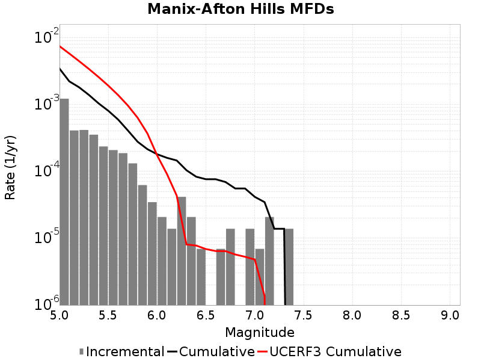

| Magnitude | Incremental Rate | Cumulative Rate | UCERF3 Cumulative Rate |
|-----|-----|-----|-----|
| 5.05 | 0.0012160367 | 0.0034961058 | 0.0074167764 |
| 5.15 | 4.0764868E-4 | 0.002280069 | 0.0057583023 |
| 5.25 | 4.14558E-4 | 0.0018724203 | 0.0044409297 |
| 5.35 | 3.523743E-4 | 0.0014578623 | 0.0033945034 |
| 5.45 | 2.349162E-4 | 0.0011054879 | 0.0025632975 |
| 5.55 | 2.07279E-4 | 8.7057176E-4 | 0.0019030471 |
| 5.65 | 1.865511E-4 | 6.6329277E-4 | 0.0013785916 |
| 5.75 | 1.312767E-4 | 4.767417E-4 | 9.6200174E-4 |
| 5.85 | 6.21837E-5 | 3.45465E-4 | 6.310927E-4 |
| 5.95 | 4.1455798E-5 | 2.832813E-4 | 3.6824227E-4 |
| 6.05 | 2.0727899E-5 | 2.418255E-4 | 1.7247372E-4 |
| 6.15 | 1.38186E-5 | 2.210976E-4 | 9.1330505E-5 |
| 6.25 | 4.1455798E-5 | 2.07279E-4 | 4.3371634E-5 |
| 6.35 | 2.0727899E-5 | 1.6582319E-4 | 8.06333E-6 |
| 6.45 | 6.9093E-6 | 1.450953E-4 | 7.751602E-6 |
| 6.55 | 0.0 | 1.3818599E-4 | 6.873848E-6 |
| 6.65 | 2.0727899E-5 | 1.3818599E-4 | 6.421394E-6 |
| 6.75 | 2.0727899E-5 | 1.174581E-4 | 6.406672E-6 |
| 6.85 | 0.0 | 9.67302E-5 | 5.704202E-6 |
| 6.95 | 3.4546498E-5 | 9.67302E-5 | 5.271226E-6 |
| 7.05 | 2.0727899E-5 | 6.21837E-5 | 4.7926515E-6 |
| 7.15 | 2.0727899E-5 | 4.1455798E-5 | 1.3628215E-6 |
| 7.25 | 0.0 | 2.0727899E-5 | 0.0 |
| 7.35 | 1.38186E-5 | 2.0727899E-5 | 0.0 |
| 7.45 | 6.9093E-6 | 6.9093E-6 | 0.0 |

### McKinleyville (alt1)
*[(top)](#table-of-contents)*

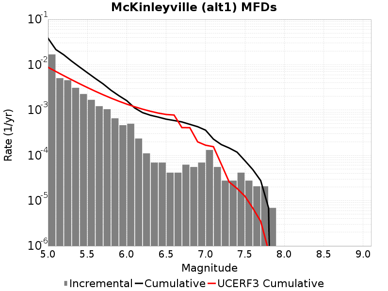

| Magnitude | Incremental Rate | Cumulative Rate | UCERF3 Cumulative Rate |
|-----|-----|-----|-----|
| 5.05 | 0.01687251 | 0.03978375 | 0.008784782 |
| 5.15 | 0.0050506983 | 0.022911238 | 0.007085799 |
| 5.25 | 0.0045532286 | 0.017860541 | 0.0057362486 |
| 5.35 | 0.0030953663 | 0.013307312 | 0.004664263 |
| 5.45 | 0.002259341 | 0.0102119455 | 0.0038127545 |
| 5.55 | 0.0016789599 | 0.007952604 | 0.003136377 |
| 5.65 | 0.0012160367 | 0.0062736445 | 0.0025991115 |
| 5.75 | 0.0010433043 | 0.0050576073 | 0.0021723462 |
| 5.85 | 6.5638346E-4 | 0.0040143034 | 0.0018333547 |
| 5.95 | 4.6292308E-4 | 0.0033579199 | 0.001564084 |
| 6.05 | 5.251068E-4 | 0.0028949967 | 0.0013501948 |
| 6.15 | 2.832813E-4 | 0.0023698898 | 0.0011802964 |
| 6.25 | 2.556441E-4 | 0.0020866087 | 0.0010463541 |
| 6.35 | 1.934604E-4 | 0.0018309645 | 9.3995995E-4 |
| 6.45 | 1.3818599E-4 | 0.0016375041 | 8.55874E-4 |
| 6.55 | 1.312767E-4 | 0.001499318 | 7.975795E-4 |
| 6.65 | 1.036395E-4 | 0.0013680414 | 7.75593E-4 |
| 6.75 | 1.5200459E-4 | 0.0012644018 | 4.085699E-4 |
| 6.85 | 1.796418E-4 | 0.0011123973 | 4.0824828E-4 |
| 6.95 | 1.243674E-4 | 9.327555E-4 | 1.9841768E-4 |
| 7.05 | 2.210976E-4 | 8.083881E-4 | 1.673484E-4 |
| 7.15 | 1.3818599E-4 | 5.872905E-4 | 1.550164E-4 |
| 7.25 | 1.312767E-4 | 4.491045E-4 | 6.3731626E-5 |
| 7.35 | 1.036395E-4 | 3.178278E-4 | 2.5761377E-5 |
| 7.45 | 7.6002296E-5 | 2.141883E-4 | 1.8560038E-5 |
| 7.55 | 6.21837E-5 | 1.3818599E-4 | 1.2500388E-5 |
| 7.65 | 4.1455798E-5 | 7.6002296E-5 | 6.817664E-6 |
| 7.75 | 2.0727899E-5 | 3.4546498E-5 | 3.4875134E-6 |
| 7.85 | 6.9093E-6 | 1.38186E-5 | 7.860197E-7 |
| 7.95 | 6.9093E-6 | 6.9093E-6 | 0.0 |

### McLean Lake
*[(top)](#table-of-contents)*

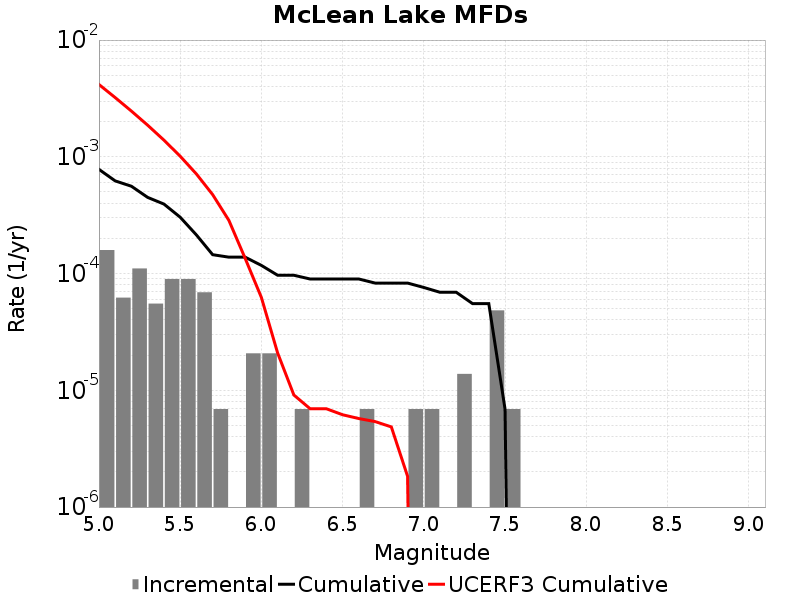

| Magnitude | Incremental Rate | Cumulative Rate | UCERF3 Cumulative Rate |
|-----|-----|-----|-----|
| 5.05 | 1.589139E-4 | 7.807509E-4 | 0.0041637146 |
| 5.15 | 6.21837E-5 | 6.21837E-4 | 0.0032158114 |
| 5.25 | 1.105488E-4 | 5.596533E-4 | 0.0024628656 |
| 5.35 | 5.52744E-5 | 4.491045E-4 | 0.0018647792 |
| 5.45 | 8.98209E-5 | 3.938301E-4 | 0.0013897023 |
| 5.55 | 8.98209E-5 | 3.0400918E-4 | 0.0010123353 |
| 5.65 | 6.9092996E-5 | 2.141883E-4 | 7.1258214E-4 |
| 5.75 | 6.9093E-6 | 1.450953E-4 | 4.744797E-4 |
| 5.85 | 0.0 | 1.3818599E-4 | 2.853482E-4 |
| 5.95 | 2.0727899E-5 | 1.3818599E-4 | 1.351157E-4 |
| 6.05 | 2.0727899E-5 | 1.174581E-4 | 6.2439416E-5 |
| 6.15 | 0.0 | 9.67302E-5 | 2.0889678E-5 |
| 6.25 | 6.9093E-6 | 9.67302E-5 | 9.115706E-6 |
| 6.35 | 0.0 | 8.98209E-5 | 6.9512894E-6 |
| 6.45 | 0.0 | 8.98209E-5 | 6.9512894E-6 |
| 6.55 | 0.0 | 8.98209E-5 | 6.1754463E-6 |
| 6.65 | 6.9093E-6 | 8.98209E-5 | 5.7289194E-6 |
| 6.75 | 0.0 | 8.2911596E-5 | 5.3979606E-6 |
| 6.85 | 0.0 | 8.2911596E-5 | 4.8582137E-6 |
| 6.95 | 6.9093E-6 | 8.2911596E-5 | 1.8349892E-6 |
| 7.05 | 6.9093E-6 | 7.6002296E-5 | 0.0 |
| 7.15 | 0.0 | 6.9092996E-5 | 0.0 |
| 7.25 | 1.38186E-5 | 6.9092996E-5 | 0.0 |
| 7.35 | 0.0 | 5.52744E-5 | 0.0 |
| 7.45 | 4.83651E-5 | 5.52744E-5 | 0.0 |
| 7.55 | 6.9093E-6 | 6.9093E-6 | 0.0 |

### Mendocino
*[(top)](#table-of-contents)*

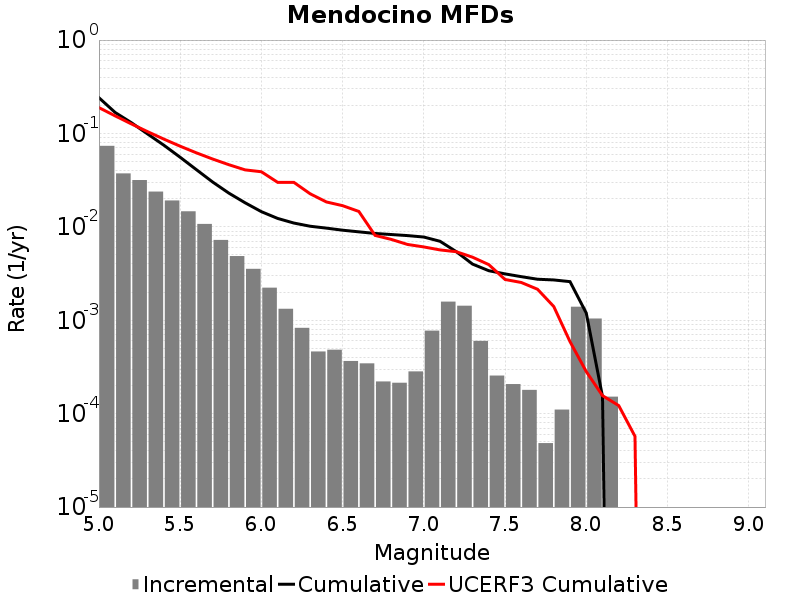

| Magnitude | Incremental Rate | Cumulative Rate | UCERF3 Cumulative Rate |
|-----|-----|-----|-----|
| 5.05 | 0.07365314 | 0.24135566 | 0.1891023 |
| 5.15 | 0.03733786 | 0.16770253 | 0.15419355 |
| 5.25 | 0.03169296 | 0.13036467 | 0.12646455 |
| 5.35 | 0.023850903 | 0.09867171 | 0.1044386 |
| 5.45 | 0.019159488 | 0.07482081 | 0.086942784 |
| 5.55 | 0.014668443 | 0.05566132 | 0.07304536 |
| 5.65 | 0.010743962 | 0.040992875 | 0.062006243 |
| 5.75 | 0.0072409464 | 0.030248916 | 0.05323756 |
| 5.85 | 0.004864147 | 0.023007968 | 0.04627235 |
| 5.95 | 0.0035513802 | 0.018143822 | 0.040739685 |
| 6.05 | 0.0022317038 | 0.014592442 | 0.038907934 |
| 6.15 | 0.0013265855 | 0.012360738 | 0.02998397 |
| 6.25 | 8.29116E-4 | 0.011034152 | 0.029952906 |
| 6.35 | 4.6292308E-4 | 0.010205036 | 0.022617724 |
| 6.45 | 4.83651E-4 | 0.009742113 | 0.018481646 |
| 6.55 | 3.661929E-4 | 0.009258462 | 0.016861951 |
| 6.65 | 3.45465E-4 | 0.008892269 | 0.014622875 |
| 6.75 | 2.210976E-4 | 0.008546804 | 0.008097925 |
| 6.85 | 2.141883E-4 | 0.008325706 | 0.0073385956 |
| 6.95 | 2.832813E-4 | 0.008111518 | 0.006479279 |
| 7.05 | 7.738416E-4 | 0.007828237 | 0.0060957307 |
| 7.15 | 0.0015822296 | 0.007054395 | 0.0056634783 |
| 7.25 | 0.0014302251 | 0.0054721655 | 0.005418601 |
| 7.35 | 6.011091E-4 | 0.0040419404 | 0.004733026 |
| 7.45 | 2.556441E-4 | 0.0034408313 | 0.0039422833 |
| 7.55 | 2.07279E-4 | 0.0031851872 | 0.002733261 |
| 7.65 | 1.796418E-4 | 0.0029779084 | 0.002537756 |
| 7.75 | 4.83651E-5 | 0.0027982665 | 0.0021479991 |
| 7.85 | 1.174581E-4 | 0.0027499013 | 0.0014032788 |
| 7.95 | 0.0014371343 | 0.0026324433 | 5.903404E-4 |
| 8.05 | 0.0010433043 | 0.0011953089 | 2.8212144E-4 |
| 8.15 | 1.5200459E-4 | 1.5200459E-4 | 1.559055E-4 |
| 8.25 | 0.0 | 0.0 | 1.2199121E-4 |
| 8.35 | 0.0 | 0.0 | 5.720505E-5 |

### Mission (connected) 2011 CFM
*[(top)](#table-of-contents)*

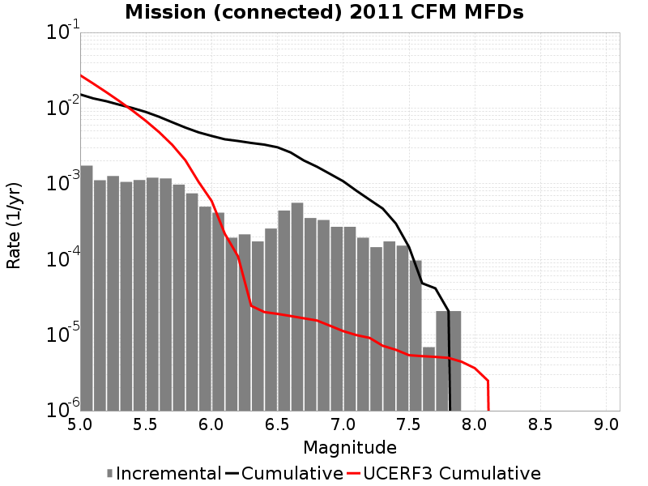

| Magnitude | Incremental Rate | Cumulative Rate | UCERF3 Cumulative Rate |
|-----|-----|-----|-----|
| 5.05 | 0.0017342343 | 0.019560227 | 0.027224129 |
| 5.15 | 0.0011123973 | 0.017825995 | 0.021069238 |
| 5.25 | 0.0012644018 | 0.016713597 | 0.016180234 |
| 5.35 | 0.0010571228 | 0.015449194 | 0.012296761 |
| 5.45 | 0.0011193065 | 0.014392071 | 0.009211207 |
| 5.55 | 0.0012160367 | 0.013272765 | 0.0067609004 |
| 5.65 | 0.0012022182 | 0.012056728 | 0.004813433 |
| 5.75 | 0.001174581 | 0.010854511 | 0.0032673946 |
| 5.85 | 0.0010916694 | 0.009679929 | 0.0020384062 |
| 5.95 | 0.0010156671 | 0.00858826 | 0.0010604743 |
| 6.05 | 7.6693227E-4 | 0.0075725927 | 5.8989105E-4 |
| 6.15 | 5.5274396E-4 | 0.00680566 | 2.1748208E-4 |
| 6.25 | 4.6292308E-4 | 0.0062529165 | 1.0953038E-4 |
| 6.35 | 4.421952E-4 | 0.0057899933 | 2.4363519E-5 |
| 6.45 | 5.872905E-4 | 0.005347798 | 2.0138532E-5 |
| 6.55 | 7.807509E-4 | 0.0047605075 | 1.9055757E-5 |
| 6.65 | 9.465741E-4 | 0.003979757 | 1.784571E-5 |
| 6.75 | 5.941998E-4 | 0.0030331826 | 1.6654478E-5 |
| 6.85 | 5.251068E-4 | 0.002438983 | 1.5574622E-5 |
| 6.95 | 4.698324E-4 | 0.001913876 | 1.3261261E-5 |
| 7.05 | 3.869208E-4 | 0.0014440437 | 1.1267055E-5 |
| 7.15 | 2.7637198E-4 | 0.0010571228 | 9.985056E-6 |
| 7.25 | 2.003697E-4 | 7.807509E-4 | 9.179549E-6 |
| 7.35 | 2.280069E-4 | 5.803812E-4 | 7.215946E-6 |
| 7.45 | 2.003697E-4 | 3.523743E-4 | 6.3864763E-6 |
| 7.55 | 1.036395E-4 | 1.5200459E-4 | 5.4143225E-6 |
| 7.65 | 6.9093E-6 | 4.83651E-5 | 5.2645532E-6 |
| 7.75 | 2.0727899E-5 | 4.1455798E-5 | 5.1444285E-6 |
| 7.85 | 2.0727899E-5 | 2.0727899E-5 | 4.992139E-6 |
| 7.95 | 0.0 | 0.0 | 4.43456E-6 |
| 8.05 | 0.0 | 0.0 | 3.6482472E-6 |
| 8.15 | 0.0 | 0.0 | 2.4875567E-6 |

### Mission Creek
*[(top)](#table-of-contents)*

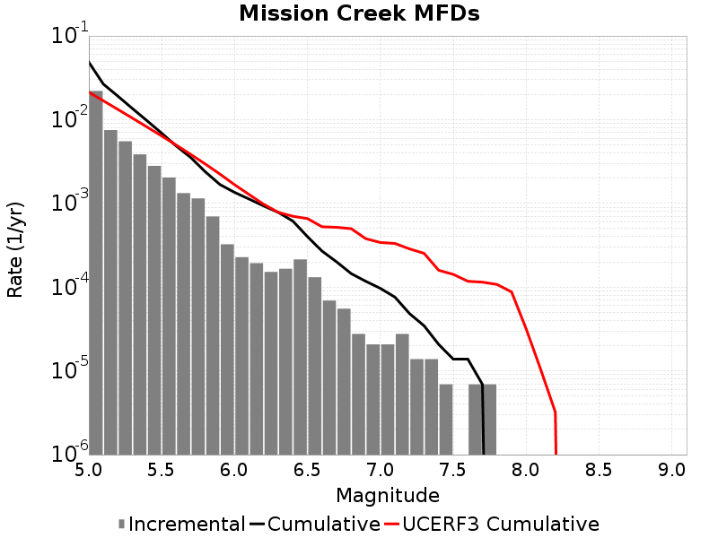

| Magnitude | Incremental Rate | Cumulative Rate | UCERF3 Cumulative Rate |
|-----|-----|-----|-----|
| 5.05 | 0.021992302 | 0.049208034 | 0.021278447 |
| 5.15 | 0.0075104088 | 0.027215732 | 0.016797975 |
| 5.25 | 0.0055136215 | 0.019705324 | 0.013239009 |
| 5.35 | 0.00384848 | 0.014191702 | 0.0104120225 |
| 5.45 | 0.0028051757 | 0.010343222 | 0.008166467 |
| 5.55 | 0.0020382435 | 0.007538046 | 0.0063827587 |
| 5.65 | 0.0013334949 | 0.0054998025 | 0.004965909 |
| 5.75 | 0.0011676716 | 0.004166308 | 0.003840465 |
| 5.85 | 7.6693227E-4 | 0.002998636 | 0.0029464932 |
| 5.95 | 3.938301E-4 | 0.0022317038 | 0.0022363863 |
| 6.05 | 3.0400918E-4 | 0.0018378737 | 0.0016723282 |
| 6.15 | 2.487348E-4 | 0.0015338645 | 0.0012748848 |
| 6.25 | 2.487348E-4 | 0.0012851298 | 9.760029E-4 |
| 6.35 | 2.280069E-4 | 0.001036395 | 7.823788E-4 |
| 6.45 | 2.280069E-4 | 8.083881E-4 | 7.018557E-4 |
| 6.55 | 1.312767E-4 | 5.803812E-4 | 6.590099E-4 |
| 6.65 | 8.98209E-5 | 4.491045E-4 | 5.264274E-4 |
| 6.75 | 8.2911596E-5 | 3.592836E-4 | 5.1840575E-4 |
| 6.85 | 5.52744E-5 | 2.7637198E-4 | 4.9937435E-4 |
| 6.95 | 2.76372E-5 | 2.210976E-4 | 3.789139E-4 |
| 7.05 | 2.0727899E-5 | 1.934604E-4 | 3.414842E-4 |
| 7.15 | 4.83651E-5 | 1.727325E-4 | 3.325343E-4 |
| 7.25 | 4.1455798E-5 | 1.243674E-4 | 2.862905E-4 |
| 7.35 | 4.1455798E-5 | 8.2911596E-5 | 2.533078E-4 |
| 7.45 | 6.9093E-6 | 4.1455798E-5 | 1.590409E-4 |
| 7.55 | 6.9093E-6 | 3.4546498E-5 | 1.4216239E-4 |
| 7.65 | 6.9093E-6 | 2.76372E-5 | 1.17599106E-4 |
| 7.75 | 2.0727899E-5 | 2.0727899E-5 | 1.1478807E-4 |
| 7.85 | 0.0 | 0.0 | 1.077758E-4 |
| 7.95 | 0.0 | 0.0 | 8.767188E-5 |
| 8.05 | 0.0 | 0.0 | 3.17742E-5 |
| 8.15 | 0.0 | 0.0 | 1.0371628E-5 |
| 8.25 | 0.0 | 0.0 | 3.227094E-6 |

### Mission Hills 2011
*[(top)](#table-of-contents)*

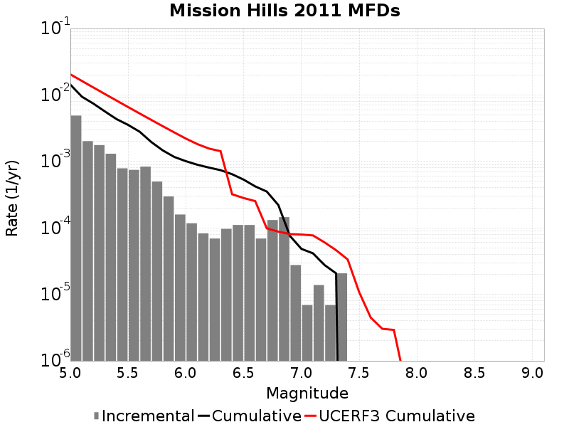

| Magnitude | Incremental Rate | Cumulative Rate | UCERF3 Cumulative Rate |
|-----|-----|-----|-----|
| 5.05 | 0.0048917844 | 0.018116184 | 0.02040893 |
| 5.15 | 0.0020175155 | 0.0132244 | 0.016249154 |
| 5.25 | 0.0017618715 | 0.011206885 | 0.012944926 |
| 5.35 | 0.0013058577 | 0.009445013 | 0.010320284 |
| 5.45 | 7.876602E-4 | 0.008139155 | 0.008235457 |
| 5.55 | 7.531137E-4 | 0.007351495 | 0.00657942 |
| 5.65 | 8.636625E-4 | 0.0065983813 | 0.0052639833 |
| 5.75 | 7.323858E-4 | 0.005734719 | 0.0042190948 |
| 5.85 | 7.1165786E-4 | 0.0050023333 | 0.00338911 |
| 5.95 | 5.665626E-4 | 0.0042906753 | 0.0027298299 |
| 6.05 | 4.974696E-4 | 0.0037241126 | 0.0022061488 |
| 6.15 | 4.0764868E-4 | 0.003226643 | 0.0018211432 |
| 6.25 | 4.698324E-4 | 0.0028189945 | 0.0015628404 |
| 6.35 | 6.840207E-4 | 0.002349162 | 0.0014275459 |
| 6.45 | 5.181975E-4 | 0.0016651413 | 3.2079066E-4 |
| 6.55 | 3.45465E-4 | 0.0011469438 | 2.8149676E-4 |
| 6.65 | 1.6582319E-4 | 8.014788E-4 | 2.53074E-4 |
| 6.75 | 1.796418E-4 | 6.356556E-4 | 9.8463446E-5 |
| 6.85 | 1.796418E-4 | 4.560138E-4 | 8.7889115E-5 |
| 6.95 | 6.21837E-5 | 2.7637198E-4 | 8.0805934E-5 |
| 7.05 | 5.52744E-5 | 2.141883E-4 | 7.953361E-5 |
| 7.15 | 6.9092996E-5 | 1.589139E-4 | 7.7054545E-5 |
| 7.25 | 6.21837E-5 | 8.98209E-5 | 6.062511E-5 |
| 7.35 | 2.76372E-5 | 2.76372E-5 | 4.6206707E-5 |
| 7.45 | 0.0 | 0.0 | 3.3561115E-5 |
| 7.55 | 0.0 | 0.0 | 1.0776913E-5 |
| 7.65 | 0.0 | 0.0 | 4.4666936E-6 |
| 7.75 | 0.0 | 0.0 | 3.0349208E-6 |
| 7.85 | 0.0 | 0.0 | 2.9209714E-6 |
| 7.95 | 0.0 | 0.0 | 4.5245847E-7 |

### Mission Ridge-Arroyo Parida-Santa Ana
*[(top)](#table-of-contents)*

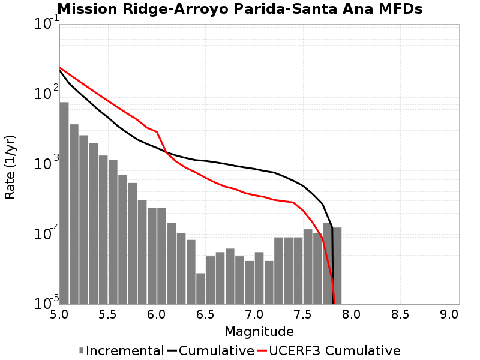

| Magnitude | Incremental Rate | Cumulative Rate | UCERF3 Cumulative Rate |
|-----|-----|-----|-----|
| 5.05 | 0.007648595 | 0.023153065 | 0.024018228 |
| 5.15 | 0.0037033847 | 0.015504469 | 0.019195523 |
| 5.25 | 0.0025771689 | 0.0118010845 | 0.015364714 |
| 5.35 | 0.002003697 | 0.009223916 | 0.0123217935 |
| 5.45 | 0.0013265855 | 0.0072202184 | 0.009904715 |
| 5.55 | 0.0011400345 | 0.005893633 | 0.007984762 |
| 5.65 | 7.047486E-4 | 0.0047535985 | 0.0064596897 |
| 5.75 | 5.458347E-4 | 0.00404885 | 0.005248281 |
| 5.85 | 3.178278E-4 | 0.003503015 | 0.004286025 |
| 5.95 | 2.625534E-4 | 0.0031851872 | 0.0033011967 |
| 6.05 | 2.625534E-4 | 0.002922634 | 0.0028858485 |
| 6.15 | 1.796418E-4 | 0.0026600806 | 0.0014426005 |
| 6.25 | 2.003697E-4 | 0.0024804387 | 0.0010839523 |
| 6.35 | 1.3818599E-4 | 0.002280069 | 8.854326E-4 |
| 6.45 | 1.5200459E-4 | 0.002141883 | 7.6018315E-4 |
| 6.55 | 1.105488E-4 | 0.0019898785 | 6.384819E-4 |
| 6.65 | 1.589139E-4 | 0.0018793296 | 5.4414343E-4 |
| 6.75 | 1.243674E-4 | 0.0017204157 | 4.7816426E-4 |
| 6.85 | 1.589139E-4 | 0.0015960482 | 4.4252587E-4 |
| 6.95 | 1.105488E-4 | 0.0014371343 | 3.8860214E-4 |
| 7.05 | 1.3818599E-4 | 0.0013265855 | 3.5995973E-4 |
| 7.15 | 1.036395E-4 | 0.0011883996 | 3.4061426E-4 |
| 7.25 | 1.312767E-4 | 0.0010847601 | 3.0904976E-4 |
| 7.35 | 1.5200459E-4 | 9.534834E-4 | 2.9600156E-4 |
| 7.45 | 1.105488E-4 | 8.014788E-4 | 2.836855E-4 |
| 7.55 | 2.280069E-4 | 6.9093E-4 | 2.1787288E-4 |
| 7.65 | 1.865511E-4 | 4.6292308E-4 | 1.4602907E-4 |
| 7.75 | 1.5200459E-4 | 2.7637198E-4 | 8.696491E-5 |
| 7.85 | 1.243674E-4 | 1.243674E-4 | 2.2041062E-5 |
| 7.95 | 0.0 | 0.0 | 8.8523666E-7 |
| 8.05 | 0.0 | 0.0 | 1.4813818E-7 |

### Mohawk Valley 2011 CFM
*[(top)](#table-of-contents)*

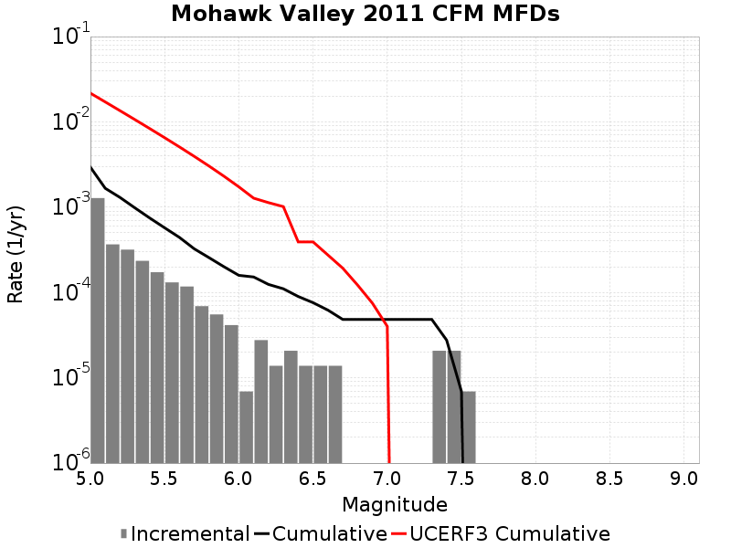

| Magnitude | Incremental Rate | Cumulative Rate | UCERF3 Cumulative Rate |
|-----|-----|-----|-----|
| 5.05 | 0.0012782204 | 0.0029433616 | 0.021697206 |
| 5.15 | 3.661929E-4 | 0.0016651413 | 0.01713464 |
| 5.25 | 3.178278E-4 | 0.0012989484 | 0.013510466 |
| 5.35 | 2.349162E-4 | 9.811206E-4 | 0.010631681 |
| 5.45 | 1.727325E-4 | 7.462044E-4 | 0.008344982 |
| 5.55 | 1.312767E-4 | 5.734719E-4 | 0.006528592 |
| 5.65 | 1.174581E-4 | 4.421952E-4 | 0.005085782 |
| 5.75 | 6.9092996E-5 | 3.247371E-4 | 0.0039397175 |
| 5.85 | 5.52744E-5 | 2.556441E-4 | 0.003029366 |
| 5.95 | 4.1455798E-5 | 2.003697E-4 | 0.0023062483 |
| 6.05 | 6.9093E-6 | 1.589139E-4 | 0.0017318553 |
| 6.15 | 2.76372E-5 | 1.5200459E-4 | 0.0012755988 |
| 6.25 | 1.38186E-5 | 1.243674E-4 | 0.0011306318 |
| 6.35 | 2.0727899E-5 | 1.105488E-4 | 0.0010154805 |
| 6.45 | 1.38186E-5 | 8.98209E-5 | 3.921395E-4 |
| 6.55 | 1.38186E-5 | 7.6002296E-5 | 3.921395E-4 |
| 6.65 | 1.38186E-5 | 6.21837E-5 | 2.7511467E-4 |
| 6.75 | 0.0 | 4.83651E-5 | 1.9288172E-4 |
| 6.85 | 0.0 | 4.83651E-5 | 1.2226155E-4 |
| 6.95 | 0.0 | 4.83651E-5 | 7.490516E-5 |
| 7.05 | 0.0 | 4.83651E-5 | 4.012802E-5 |
| 7.15 | 0.0 | 4.83651E-5 | 0.0 |
| 7.25 | 0.0 | 4.83651E-5 | 0.0 |
| 7.35 | 2.0727899E-5 | 4.83651E-5 | 0.0 |
| 7.45 | 2.0727899E-5 | 2.76372E-5 | 0.0 |
| 7.55 | 6.9093E-6 | 6.9093E-6 | 0.0 |

### Mono Lake 2011 CFM
*[(top)](#table-of-contents)*

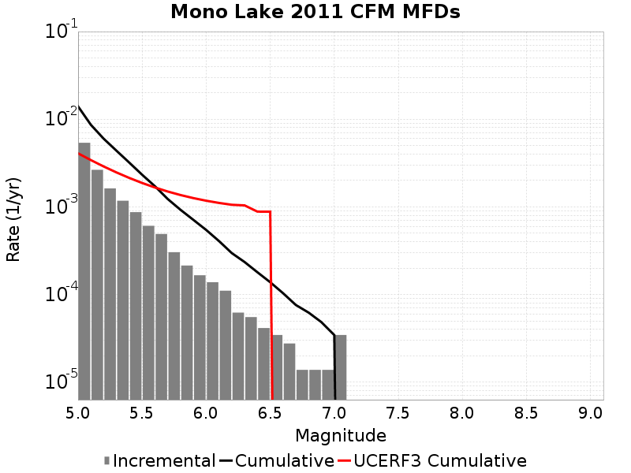

| Magnitude | Incremental Rate | Cumulative Rate | UCERF3 Cumulative Rate |
|-----|-----|-----|-----|
| 5.05 | 0.0053823446 | 0.014025879 | 0.0040842984 |
| 5.15 | 0.0026462618 | 0.008643534 | 0.0034197483 |
| 5.25 | 0.0016236855 | 0.005997272 | 0.002891877 |
| 5.35 | 0.001174581 | 0.0043735867 | 0.0024725741 |
| 5.45 | 8.7057176E-4 | 0.003199006 | 0.0021395101 |
| 5.55 | 6.0801837E-4 | 0.002328434 | 0.0018749478 |
| 5.65 | 4.905603E-4 | 0.0017204157 | 0.0016647985 |
| 5.75 | 3.0400918E-4 | 0.0012298553 | 0.001497871 |
| 5.85 | 2.141883E-4 | 9.2584617E-4 | 0.0013652758 |
| 5.95 | 1.6582319E-4 | 7.1165786E-4 | 0.0012599517 |
| 6.05 | 1.3818599E-4 | 5.458347E-4 | 0.0011762897 |
| 6.15 | 1.105488E-4 | 4.0764868E-4 | 0.0011098348 |
| 6.25 | 6.21837E-5 | 2.970999E-4 | 0.0010570476 |
| 6.35 | 5.52744E-5 | 2.349162E-4 | 0.0010402756 |
| 6.45 | 4.1455798E-5 | 1.796418E-4 | 8.8336057E-4 |
| 6.55 | 3.4546498E-5 | 1.3818599E-4 | 8.8275457E-4 |
| 6.65 | 2.76372E-5 | 1.036395E-4 | 0.0 |
| 6.75 | 1.38186E-5 | 7.6002296E-5 | 0.0 |
| 6.85 | 1.38186E-5 | 6.21837E-5 | 0.0 |
| 6.95 | 1.38186E-5 | 4.83651E-5 | 0.0 |
| 7.05 | 3.4546498E-5 | 3.4546498E-5 | 0.0 |

### Monte Vista - Shannon 2011 CFM
*[(top)](#table-of-contents)*

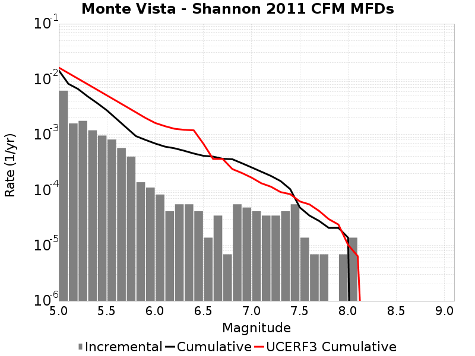

| Magnitude | Incremental Rate | Cumulative Rate | UCERF3 Cumulative Rate |
|-----|-----|-----|-----|
| 5.05 | 0.006197642 | 0.01765326 | 0.016214857 |
| 5.15 | 0.001589139 | 0.011455619 | 0.012868891 |
| 5.25 | 0.0017687808 | 0.009866481 | 0.010211095 |
| 5.35 | 0.0011953089 | 0.0080977 | 0.008099933 |
| 5.45 | 9.603927E-4 | 0.0069023906 | 0.0064229774 |
| 5.55 | 8.1529736E-4 | 0.0059419977 | 0.0050909244 |
| 5.65 | 5.803812E-4 | 0.0051267007 | 0.0040328368 |
| 5.75 | 5.389254E-4 | 0.004546319 | 0.0031923682 |
| 5.85 | 2.694627E-4 | 0.004007394 | 0.00252476 |
| 5.95 | 3.247371E-4 | 0.0037379311 | 0.0019944601 |
| 6.05 | 2.694627E-4 | 0.003413194 | 0.0016214213 |
| 6.15 | 1.5200459E-4 | 0.0031437315 | 0.0014215569 |
| 6.25 | 2.07279E-4 | 0.0029917269 | 0.0012745427 |
| 6.35 | 1.796418E-4 | 0.0027844477 | 0.0012202178 |
| 6.45 | 1.589139E-4 | 0.002604806 | 0.0011945367 |
| 6.55 | 1.5200459E-4 | 0.0024458922 | 6.838653E-4 |
| 6.65 | 1.589139E-4 | 0.0022938875 | 3.6422865E-4 |
| 6.75 | 1.6582319E-4 | 0.0021349736 | 3.6350347E-4 |
| 6.85 | 3.247371E-4 | 0.0019691505 | 2.3888322E-4 |
| 6.95 | 2.349162E-4 | 0.0016444133 | 2.0253517E-4 |
| 7.05 | 1.727325E-4 | 0.0014094972 | 1.671287E-4 |
| 7.15 | 2.625534E-4 | 0.0012367647 | 1.3251028E-4 |
| 7.25 | 3.45465E-4 | 9.7421126E-4 | 1.1477267E-4 |
| 7.35 | 2.556441E-4 | 6.287463E-4 | 9.18057E-5 |
| 7.45 | 2.349162E-4 | 3.731022E-4 | 8.413568E-5 |
| 7.55 | 4.83651E-5 | 1.3818599E-4 | 6.219613E-5 |
| 7.65 | 6.9093E-6 | 8.98209E-5 | 5.4951728E-5 |
| 7.75 | 1.38186E-5 | 8.2911596E-5 | 4.18662E-5 |
| 7.85 | 0.0 | 6.9092996E-5 | 2.9808709E-5 |
| 7.95 | 2.0727899E-5 | 6.9092996E-5 | 2.3826615E-5 |
| 8.05 | 4.83651E-5 | 4.83651E-5 | 1.02290005E-5 |
| 8.15 | 0.0 | 0.0 | 6.4147184E-6 |
| 8.25 | 0.0 | 0.0 | 1.5002314E-9 |

### Monterey Bay-Tularcitos
*[(top)](#table-of-contents)*

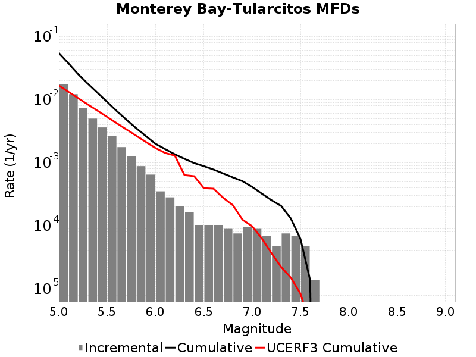

| Magnitude | Incremental Rate | Cumulative Rate | UCERF3 Cumulative Rate |
|-----|-----|-----|-----|
| 5.05 | 0.017356161 | 0.05526749 | 0.016676016 |
| 5.15 | 0.012174186 | 0.03791133 | 0.013255665 |
| 5.25 | 0.0074274973 | 0.025737142 | 0.010538783 |
| 5.35 | 0.0050023333 | 0.018309645 | 0.008380687 |
| 5.45 | 0.0036273825 | 0.013307312 | 0.0066664508 |
| 5.55 | 0.0026255338 | 0.009679929 | 0.0053047845 |
| 5.65 | 0.0017687808 | 0.007054395 | 0.0042231744 |
| 5.75 | 0.0012713112 | 0.0052856146 | 0.0033640207 |
| 5.85 | 8.98209E-4 | 0.0040143034 | 0.002681571 |
| 5.95 | 6.5638346E-4 | 0.0031160943 | 0.0021394817 |
| 6.05 | 3.592836E-4 | 0.0024597107 | 0.0017088851 |
| 6.15 | 2.970999E-4 | 0.0021004272 | 0.0014299598 |
| 6.25 | 2.141883E-4 | 0.0018033272 | 0.0012975613 |
| 6.35 | 1.6582319E-4 | 0.001589139 | 6.3838565E-4 |
| 6.45 | 1.036395E-4 | 0.0014233157 | 6.1345124E-4 |
| 6.55 | 1.036395E-4 | 0.0013196763 | 3.9595133E-4 |
| 6.65 | 1.036395E-4 | 0.0012160367 | 3.8929688E-4 |
| 6.75 | 9.67302E-5 | 0.0011123973 | 2.7898082E-4 |
| 6.85 | 7.6002296E-5 | 0.0010156671 | 2.131786E-4 |
| 6.95 | 9.67302E-5 | 9.396648E-4 | 1.2572152E-4 |
| 7.05 | 1.312767E-4 | 8.429346E-4 | 9.8857134E-5 |
| 7.15 | 1.036395E-4 | 7.1165786E-4 | 6.33533E-5 |
| 7.25 | 8.98209E-5 | 6.0801837E-4 | 3.706071E-5 |
| 7.35 | 1.105488E-4 | 5.181975E-4 | 2.2387872E-5 |
| 7.45 | 2.141883E-4 | 4.0764868E-4 | 1.5167827E-5 |
| 7.55 | 1.312767E-4 | 1.934604E-4 | 8.453905E-6 |
| 7.65 | 4.1455798E-5 | 6.21837E-5 | 2.7056108E-6 |
| 7.75 | 2.0727899E-5 | 2.0727899E-5 | 1.2175004E-6 |
| 7.85 | 0.0 | 0.0 | 1.6273938E-7 |

### Morales (East)
*[(top)](#table-of-contents)*

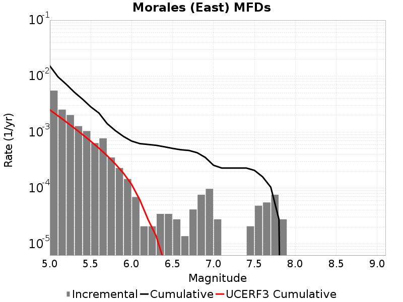

| Magnitude | Incremental Rate | Cumulative Rate | UCERF3 Cumulative Rate |
|-----|-----|-----|-----|
| 5.05 | 0.0055136215 | 0.016748143 | 0.0024914034 |
| 5.15 | 0.0025218944 | 0.011234522 | 0.0019484657 |
| 5.25 | 0.0020175155 | 0.008712627 | 0.0015171949 |
| 5.35 | 0.0012782204 | 0.0066951117 | 0.0011746244 |
| 5.45 | 0.0010433043 | 0.005416891 | 9.0251095E-4 |
| 5.55 | 6.356556E-4 | 0.0043735867 | 6.8636355E-4 |
| 5.65 | 7.738416E-4 | 0.0037379311 | 5.146716E-4 |
| 5.75 | 3.523743E-4 | 0.0029640896 | 3.782918E-4 |
| 5.85 | 2.280069E-4 | 0.0026117153 | 2.6996149E-4 |
| 5.95 | 1.450953E-4 | 0.0023837085 | 1.8391166E-4 |
| 6.05 | 6.9092996E-5 | 0.002238613 | 1.1555985E-4 |
| 6.15 | 2.76372E-5 | 0.0021695201 | 6.126608E-5 |
| 6.25 | 2.0727899E-5 | 0.002141883 | 2.7491886E-5 |
| 6.35 | 3.4546498E-5 | 0.0021211552 | 1.3776857E-5 |
| 6.45 | 3.4546498E-5 | 0.0020866087 | 4.668796E-6 |
| 6.55 | 2.76372E-5 | 0.002052062 | 3.8507924E-6 |
| 6.65 | 1.38186E-5 | 0.002024425 | 3.840909E-6 |
| 6.75 | 4.1455798E-5 | 0.0020106062 | 3.7908228E-6 |
| 6.85 | 7.6002296E-5 | 0.0019691505 | 3.6940457E-6 |
| 6.95 | 9.67302E-5 | 0.0018931482 | 3.5531898E-6 |
| 7.05 | 2.76372E-5 | 0.001796418 | 3.3082897E-6 |
| 7.15 | 0.0 | 0.0017687808 | 3.1881923E-6 |
| 7.25 | 2.0727899E-5 | 0.0017687808 | 2.9857922E-6 |
| 7.35 | 6.9093E-6 | 0.0017480529 | 2.78143E-6 |
| 7.45 | 8.2911596E-5 | 0.0017411435 | 2.3866992E-6 |
| 7.55 | 4.14558E-4 | 0.001658232 | 5.6282477E-7 |
| 7.65 | 6.356556E-4 | 0.001243674 | 4.7474734E-7 |
| 7.75 | 4.905603E-4 | 6.0801837E-4 | 3.1933197E-7 |
| 7.85 | 6.9092996E-5 | 1.174581E-4 | 1.923971E-7 |
| 7.95 | 4.1455798E-5 | 4.83651E-5 | 8.272369E-8 |
| 8.05 | 6.9093E-6 | 6.9093E-6 | 2.6909145E-8 |

### Morales (West)
*[(top)](#table-of-contents)*

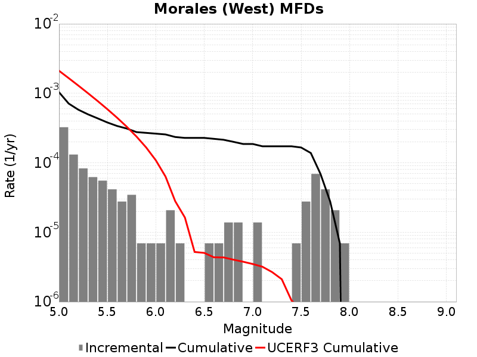

| Magnitude | Incremental Rate | Cumulative Rate | UCERF3 Cumulative Rate |
|-----|-----|-----|-----|
| 5.05 | 3.247371E-4 | 0.0025426224 | 0.0021117143 |
| 5.15 | 1.312767E-4 | 0.0022178853 | 0.00165391 |
| 5.25 | 8.2911596E-5 | 0.0020866087 | 0.0012902631 |
| 5.35 | 6.21837E-5 | 0.002003697 | 0.0010014081 |
| 5.45 | 5.52744E-5 | 0.0019415133 | 7.7196234E-4 |
| 5.55 | 4.1455798E-5 | 0.0018862389 | 5.8970717E-4 |
| 5.65 | 2.76372E-5 | 0.0018447831 | 4.449367E-4 |
| 5.75 | 3.4546498E-5 | 0.0018171459 | 3.2994145E-4 |
| 5.85 | 6.9093E-6 | 0.0017825994 | 2.3859747E-4 |
| 5.95 | 6.9093E-6 | 0.0017756901 | 1.6604037E-4 |
| 6.05 | 2.0727899E-5 | 0.0017687808 | 1.084062E-4 |
| 6.15 | 2.0727899E-5 | 0.0017480529 | 6.3258456E-5 |
| 6.25 | 1.38186E-5 | 0.001727325 | 2.7962085E-5 |
| 6.35 | 6.9093E-6 | 0.0017135064 | 1.6279813E-5 |
| 6.45 | 0.0 | 0.001706597 | 5.204887E-6 |
| 6.55 | 1.38186E-5 | 0.001706597 | 5.0390686E-6 |
| 6.65 | 6.9093E-6 | 0.0016927784 | 4.354482E-6 |
| 6.75 | 2.76372E-5 | 0.0016858692 | 4.3360615E-6 |
| 6.85 | 4.83651E-5 | 0.001658232 | 4.029953E-6 |
| 6.95 | 4.1455798E-5 | 0.0016098669 | 3.7641519E-6 |
| 7.05 | 1.38186E-5 | 0.0015684111 | 3.4888917E-6 |
| 7.15 | 0.0 | 0.0015545925 | 3.1875409E-6 |
| 7.25 | 6.9093E-6 | 0.0015545925 | 2.6705782E-6 |
| 7.35 | 6.9093E-6 | 0.0015476831 | 2.1076535E-6 |
| 7.45 | 6.9092996E-5 | 0.0015407739 | 1.0447874E-6 |
| 7.55 | 2.901906E-4 | 0.0014716808 | 7.669211E-7 |
| 7.65 | 5.181975E-4 | 0.0011814903 | 6.318921E-7 |
| 7.75 | 4.905603E-4 | 6.6329277E-4 | 3.9993358E-7 |
| 7.85 | 9.67302E-5 | 1.727325E-4 | 2.62743E-7 |
| 7.95 | 6.9092996E-5 | 7.6002296E-5 | 1.3914182E-7 |
| 8.05 | 6.9093E-6 | 6.9093E-6 | 8.843221E-8 |
| 8.15 | 0.0 | 0.0 | 4.9488495E-8 |

### Mount Diablo Thrust North CFM
*[(top)](#table-of-contents)*

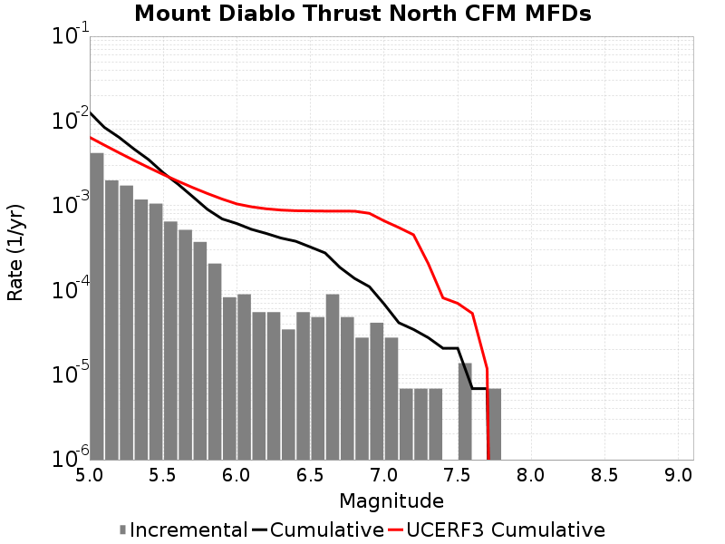

| Magnitude | Incremental Rate | Cumulative Rate | UCERF3 Cumulative Rate |
|-----|-----|-----|-----|
| 5.05 | 0.004187036 | 0.013265856 | 0.0064183353 |
| 5.15 | 0.0019898785 | 0.00907882 | 0.0051898663 |
| 5.25 | 0.001727325 | 0.0070889415 | 0.0042140586 |
| 5.35 | 0.0011814903 | 0.0053616166 | 0.003438947 |
| 5.45 | 0.0010571228 | 0.0041801264 | 0.002823254 |
| 5.55 | 6.494742E-4 | 0.0031230035 | 0.0023341917 |
| 5.65 | 5.181975E-4 | 0.0024735294 | 0.0019457156 |
| 5.75 | 3.938301E-4 | 0.0019553318 | 0.0016371382 |
| 5.85 | 2.418255E-4 | 0.0015615018 | 0.0013920263 |
| 5.95 | 1.174581E-4 | 0.0013196763 | 0.001197327 |
| 6.05 | 1.450953E-4 | 0.0012022182 | 0.0010486717 |
| 6.15 | 1.3818599E-4 | 0.0010571228 | 9.693213E-4 |
| 6.25 | 1.312767E-4 | 9.1893686E-4 | 9.1870455E-4 |
| 6.35 | 9.67302E-5 | 7.876602E-4 | 8.8738254E-4 |
| 6.45 | 1.174581E-4 | 6.9093E-4 | 8.720544E-4 |
| 6.55 | 1.174581E-4 | 5.734719E-4 | 8.670834E-4 |
| 6.65 | 1.727325E-4 | 4.560138E-4 | 8.6309266E-4 |
| 6.75 | 1.105488E-4 | 2.832813E-4 | 8.629796E-4 |
| 6.85 | 4.1455798E-5 | 1.727325E-4 | 8.601771E-4 |
| 6.95 | 4.1455798E-5 | 1.312767E-4 | 8.1243116E-4 |
| 7.05 | 2.76372E-5 | 8.98209E-5 | 6.618625E-4 |
| 7.15 | 6.9093E-6 | 6.21837E-5 | 5.518123E-4 |
| 7.25 | 6.9093E-6 | 5.52744E-5 | 4.534448E-4 |
| 7.35 | 6.9093E-6 | 4.83651E-5 | 2.0705647E-4 |
| 7.45 | 0.0 | 4.1455798E-5 | 8.1557635E-5 |
| 7.55 | 2.76372E-5 | 4.1455798E-5 | 7.030961E-5 |
| 7.65 | 6.9093E-6 | 1.38186E-5 | 5.340164E-5 |
| 7.75 | 6.9093E-6 | 6.9093E-6 | 1.1852772E-5 |

### Mount Diablo Thrust South
*[(top)](#table-of-contents)*

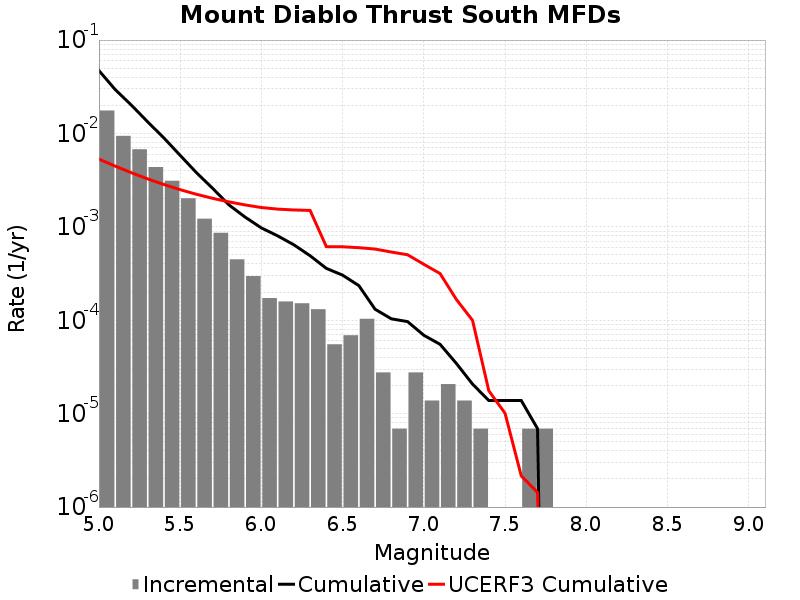

| Magnitude | Incremental Rate | Cumulative Rate | UCERF3 Cumulative Rate |
|-----|-----|-----|-----|
| 5.05 | 0.017604897 | 0.04817855 | 0.005316179 |
| 5.15 | 0.009424285 | 0.030573651 | 0.0044693244 |
| 5.25 | 0.0067711137 | 0.021149367 | 0.003796644 |
| 5.35 | 0.0043666777 | 0.014378253 | 0.003262315 |
| 5.45 | 0.0031160943 | 0.010011575 | 0.0028378824 |
| 5.55 | 0.002024425 | 0.006895481 | 0.0025007436 |
| 5.65 | 0.0012229461 | 0.0048710564 | 0.0022329446 |
| 5.75 | 8.7057176E-4 | 0.0036481104 | 0.0020202245 |
| 5.85 | 5.181975E-4 | 0.0027775385 | 0.0018512548 |
| 5.95 | 4.007394E-4 | 0.002259341 | 0.0017170374 |
| 6.05 | 2.418255E-4 | 0.0018586017 | 0.0016104395 |
| 6.15 | 2.418255E-4 | 0.0016167762 | 0.0015487769 |
| 6.25 | 2.210976E-4 | 0.0013749506 | 0.0015165046 |
| 6.35 | 1.796418E-4 | 0.0011538531 | 0.0014993128 |
| 6.45 | 1.5200459E-4 | 9.7421126E-4 | 6.136148E-4 |
| 6.55 | 1.6582319E-4 | 8.2220667E-4 | 6.11821E-4 |
| 6.65 | 1.865511E-4 | 6.5638346E-4 | 5.9848157E-4 |
| 6.75 | 1.312767E-4 | 4.698324E-4 | 5.7846174E-4 |
| 6.85 | 7.6002296E-5 | 3.385557E-4 | 5.376155E-4 |
| 6.95 | 6.9092996E-5 | 2.625534E-4 | 5.026897E-4 |
| 7.05 | 4.83651E-5 | 1.934604E-4 | 3.9746345E-4 |
| 7.15 | 4.1455798E-5 | 1.450953E-4 | 3.1635363E-4 |
| 7.25 | 2.0727899E-5 | 1.036395E-4 | 1.6735715E-4 |
| 7.35 | 1.38186E-5 | 8.2911596E-5 | 9.972957E-5 |
| 7.45 | 1.38186E-5 | 6.9092996E-5 | 1.7598064E-5 |
| 7.55 | 2.76372E-5 | 5.52744E-5 | 1.0095233E-5 |
| 7.65 | 2.0727899E-5 | 2.76372E-5 | 2.155737E-6 |
| 7.75 | 6.9093E-6 | 6.9093E-6 | 1.4348032E-6 |

### Nelson Lake
*[(top)](#table-of-contents)*

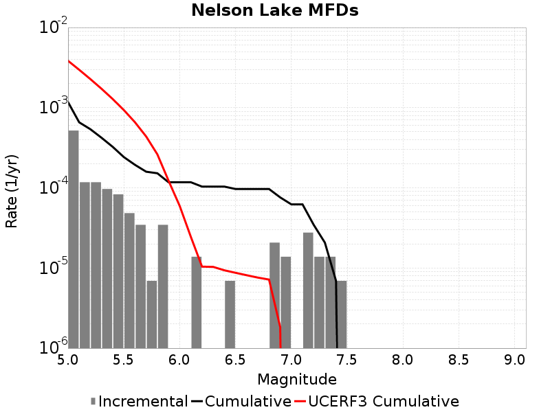

| Magnitude | Incremental Rate | Cumulative Rate | UCERF3 Cumulative Rate |
|-----|-----|-----|-----|
| 5.05 | 5.181975E-4 | 0.0012713112 | 0.0038449077 |
| 5.15 | 1.174581E-4 | 7.531137E-4 | 0.0029691649 |
| 5.25 | 1.174581E-4 | 6.356556E-4 | 0.0022735375 |
| 5.35 | 9.67302E-5 | 5.181975E-4 | 0.0017209811 |
| 5.45 | 8.2911596E-5 | 4.214673E-4 | 0.00128207 |
| 5.55 | 4.83651E-5 | 3.385557E-4 | 9.334304E-4 |
| 5.65 | 3.4546498E-5 | 2.901906E-4 | 6.5649615E-4 |
| 5.75 | 6.9093E-6 | 2.556441E-4 | 4.365195E-4 |
| 5.85 | 4.83651E-5 | 2.487348E-4 | 2.6178584E-4 |
| 5.95 | 6.9093E-6 | 2.003697E-4 | 1.2298994E-4 |
| 6.05 | 2.0727899E-5 | 1.934604E-4 | 5.9474467E-5 |
| 6.15 | 2.0727899E-5 | 1.727325E-4 | 2.4444762E-5 |
| 6.25 | 6.9093E-6 | 1.5200459E-4 | 1.0402963E-5 |
| 6.35 | 0.0 | 1.450953E-4 | 1.0327781E-5 |
| 6.45 | 6.9093E-6 | 1.450953E-4 | 9.36576E-6 |
| 6.55 | 1.38186E-5 | 1.3818599E-4 | 8.714875E-6 |
| 6.65 | 0.0 | 1.243674E-4 | 8.126264E-6 |
| 6.75 | 6.9093E-6 | 1.243674E-4 | 7.5925627E-6 |
| 6.85 | 2.0727899E-5 | 1.174581E-4 | 7.178383E-6 |
| 6.95 | 2.76372E-5 | 9.67302E-5 | 1.8349892E-6 |
| 7.05 | 6.9093E-6 | 6.9092996E-5 | 0.0 |
| 7.15 | 2.76372E-5 | 6.21837E-5 | 0.0 |
| 7.25 | 1.38186E-5 | 3.4546498E-5 | 0.0 |
| 7.35 | 1.38186E-5 | 2.0727899E-5 | 0.0 |
| 7.45 | 6.9093E-6 | 6.9093E-6 | 0.0 |

### Newport-Inglewood (Offshore)
*[(top)](#table-of-contents)*

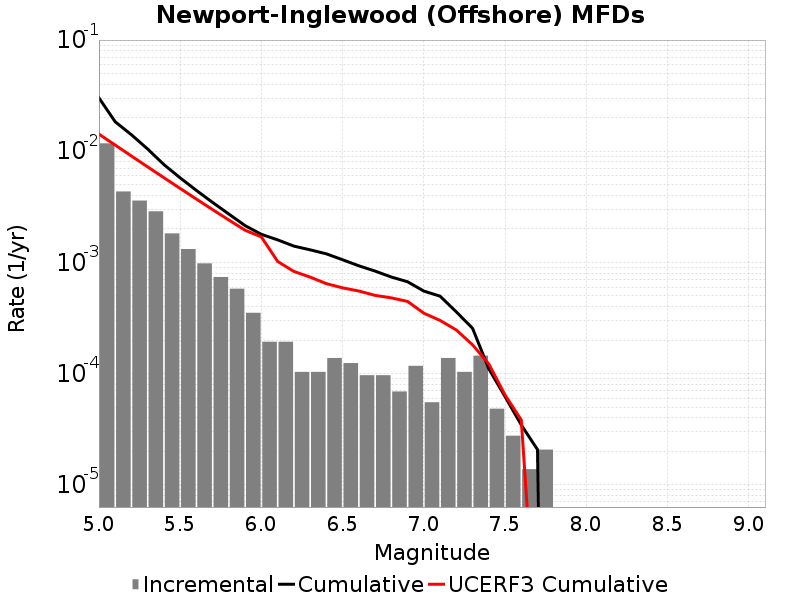

| Magnitude | Incremental Rate | Cumulative Rate | UCERF3 Cumulative Rate |
|-----|-----|-----|-----|
| 5.05 | 0.011773447 | 0.031050393 | 0.014262873 |
| 5.15 | 0.0043459497 | 0.019276947 | 0.011365068 |
| 5.25 | 0.0035997452 | 0.014930997 | 0.00906326 |
| 5.35 | 0.0028811782 | 0.011331252 | 0.007234868 |
| 5.45 | 0.0018240552 | 0.008450074 | 0.005782525 |
| 5.55 | 0.0013265855 | 0.006626019 | 0.0046288883 |
| 5.65 | 9.811206E-4 | 0.005299433 | 0.0037125216 |
| 5.75 | 7.392951E-4 | 0.0043183123 | 0.002984626 |
| 5.85 | 5.803812E-4 | 0.0035790172 | 0.0024064379 |
| 5.95 | 4.0764868E-4 | 0.002998636 | 0.0019471666 |
| 6.05 | 2.832813E-4 | 0.0025909874 | 0.0016961846 |
| 6.15 | 2.970999E-4 | 0.0023077063 | 0.0010216133 |
| 6.25 | 1.934604E-4 | 0.0020106062 | 8.301926E-4 |
| 6.35 | 1.5200459E-4 | 0.0018171459 | 7.380629E-4 |
| 6.45 | 2.003697E-4 | 0.0016651413 | 6.4470666E-4 |
| 6.55 | 1.6582319E-4 | 0.0014647716 | 5.908189E-4 |
| 6.65 | 1.589139E-4 | 0.0012989484 | 5.5336894E-4 |
| 6.75 | 1.312767E-4 | 0.0011400345 | 5.055476E-4 |
| 6.85 | 1.105488E-4 | 0.0010087577 | 4.80073E-4 |
| 6.95 | 1.243674E-4 | 8.98209E-4 | 4.4589688E-4 |
| 7.05 | 1.174581E-4 | 7.738416E-4 | 3.4975578E-4 |
| 7.15 | 1.865511E-4 | 6.5638346E-4 | 3.010364E-4 |
| 7.25 | 1.450953E-4 | 4.698324E-4 | 2.4703957E-4 |
| 7.35 | 1.727325E-4 | 3.247371E-4 | 1.8170383E-4 |
| 7.45 | 7.6002296E-5 | 1.5200459E-4 | 1.2216823E-4 |
| 7.55 | 3.4546498E-5 | 7.6002296E-5 | 6.4293905E-5 |
| 7.65 | 2.0727899E-5 | 4.1455798E-5 | 3.8277452E-5 |
| 7.75 | 2.0727899E-5 | 2.0727899E-5 | 2.6452923E-7 |

### Newport-Inglewood alt 1
*[(top)](#table-of-contents)*

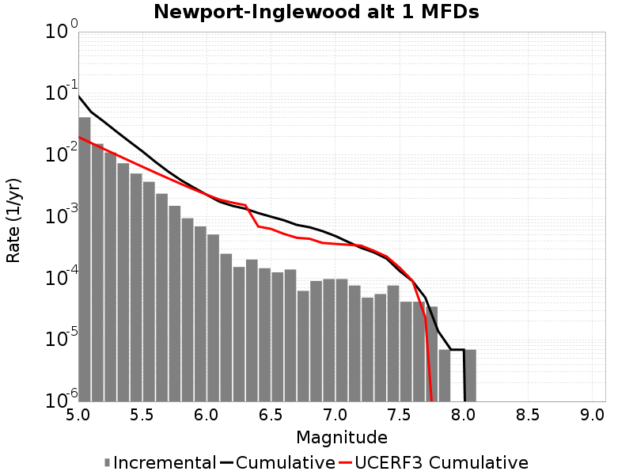

| Magnitude | Incremental Rate | Cumulative Rate | UCERF3 Cumulative Rate |
|-----|-----|-----|-----|
| 5.05 | 0.04075105 | 0.09109912 | 0.019605994 |
| 5.15 | 0.015165913 | 0.05034807 | 0.015640544 |
| 5.25 | 0.010965059 | 0.035182156 | 0.012490674 |
| 5.35 | 0.007323858 | 0.024217095 | 0.009988643 |
| 5.45 | 0.0049816053 | 0.016893238 | 0.00800121 |
| 5.55 | 0.0036757474 | 0.011911633 | 0.0064225355 |
| 5.65 | 0.0023837085 | 0.008235886 | 0.0051685497 |
| 5.75 | 0.0014924088 | 0.005852177 | 0.004172473 |
| 5.85 | 9.465741E-4 | 0.0043597682 | 0.0033812618 |
| 5.95 | 7.047486E-4 | 0.003413194 | 0.00275278 |
| 6.05 | 5.251068E-4 | 0.0027084455 | 0.0022630836 |
| 6.15 | 2.556441E-4 | 0.0021833389 | 0.0018808828 |
| 6.25 | 1.796418E-4 | 0.0019276947 | 0.0016817544 |
| 6.35 | 2.280069E-4 | 0.0017480529 | 0.0015294047 |
| 6.45 | 1.589139E-4 | 0.001520046 | 6.902365E-4 |
| 6.55 | 1.5200459E-4 | 0.0013611321 | 6.301006E-4 |
| 6.65 | 1.5200459E-4 | 0.0012091275 | 5.2330934E-4 |
| 6.75 | 8.2911596E-5 | 0.0010571228 | 4.5262728E-4 |
| 6.85 | 1.174581E-4 | 9.7421126E-4 | 4.3604666E-4 |
| 6.95 | 1.312767E-4 | 8.567532E-4 | 3.7343244E-4 |
| 7.05 | 1.036395E-4 | 7.254765E-4 | 3.6017585E-4 |
| 7.15 | 1.450953E-4 | 6.21837E-4 | 3.486929E-4 |
| 7.25 | 7.6002296E-5 | 4.767417E-4 | 3.3755397E-4 |
| 7.35 | 1.105488E-4 | 4.007394E-4 | 2.7856953E-4 |
| 7.45 | 1.243674E-4 | 2.901906E-4 | 2.239473E-4 |
| 7.55 | 5.52744E-5 | 1.6582319E-4 | 1.4833588E-4 |
| 7.65 | 5.52744E-5 | 1.105488E-4 | 9.0962676E-5 |
| 7.75 | 4.1455798E-5 | 5.52744E-5 | 2.295398E-5 |
| 7.85 | 6.9093E-6 | 1.38186E-5 | 3.9259817E-8 |
| 7.95 | 0.0 | 6.9093E-6 | 0.0 |
| 8.05 | 6.9093E-6 | 6.9093E-6 | 0.0 |

### North Frontal  (East)
*[(top)](#table-of-contents)*

| Magnitude | Incremental Rate | Cumulative Rate | UCERF3 Cumulative Rate |
|-----|-----|-----|-----|
| 5.05 | 3.45465E-4 | 0.0013611321 | 0.00917771 |
| 5.15 | 1.727325E-4 | 0.0010156671 | 0.0072267354 |
| 5.25 | 2.141883E-4 | 8.429346E-4 | 0.0056770206 |
| 5.35 | 1.796418E-4 | 6.287463E-4 | 0.004446039 |
| 5.45 | 1.174581E-4 | 4.491045E-4 | 0.0034682353 |
| 5.55 | 7.6002296E-5 | 3.3164638E-4 | 0.0026915383 |
| 5.65 | 4.83651E-5 | 2.556441E-4 | 0.002074586 |
| 5.75 | 3.4546498E-5 | 2.07279E-4 | 0.0015845232 |
| 5.85 | 2.0727899E-5 | 1.727325E-4 | 0.0011952525 |
| 5.95 | 6.9093E-6 | 1.5200459E-4 | 8.860439E-4 |
| 6.05 | 6.9093E-6 | 1.450953E-4 | 6.435681E-4 |
| 6.15 | 2.0727899E-5 | 1.3818599E-4 | 4.6175517E-4 |
| 6.25 | 1.38186E-5 | 1.174581E-4 | 3.174764E-4 |
| 6.35 | 0.0 | 1.036395E-4 | 2.2199732E-4 |
| 6.45 | 0.0 | 1.036395E-4 | 1.46229E-4 |
| 6.55 | 6.9093E-6 | 1.036395E-4 | 9.3875264E-5 |
| 6.65 | 0.0 | 9.67302E-5 | 7.6794175E-5 |
| 6.75 | 0.0 | 9.67302E-5 | 6.381877E-5 |
| 6.85 | 2.76372E-5 | 9.67302E-5 | 4.096131E-5 |
| 6.95 | 1.38186E-5 | 6.9092996E-5 | 3.6556685E-5 |
| 7.05 | 6.9093E-6 | 5.52744E-5 | 3.602327E-5 |
| 7.15 | 6.9093E-6 | 4.83651E-5 | 3.0165504E-5 |
| 7.25 | 2.76372E-5 | 4.1455798E-5 | 2.1951173E-5 |
| 7.35 | 6.9093E-6 | 1.38186E-5 | 1.5058739E-5 |
| 7.45 | 6.9093E-6 | 6.9093E-6 | 1.0884074E-5 |
| 7.55 | 0.0 | 0.0 | 5.5802598E-6 |
| 7.65 | 0.0 | 0.0 | 5.583857E-7 |

### North Frontal  (West)
*[(top)](#table-of-contents)*

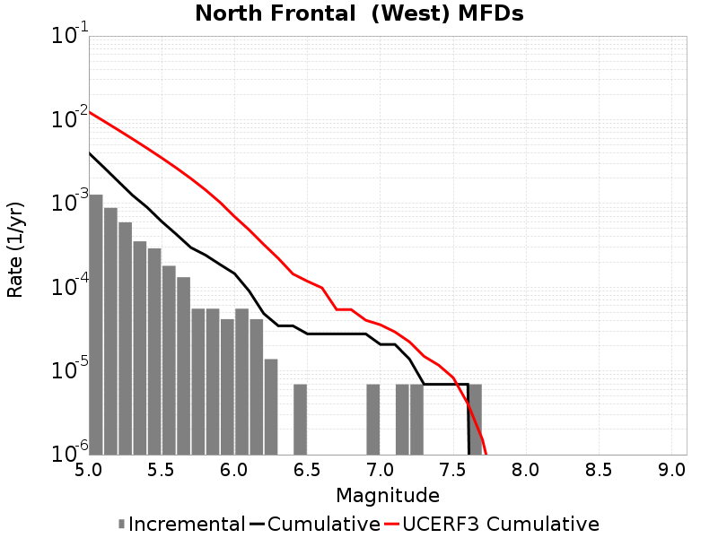

| Magnitude | Incremental Rate | Cumulative Rate | UCERF3 Cumulative Rate |
|-----|-----|-----|-----|
| 5.05 | 0.0012713112 | 0.004304494 | 0.012351959 |
| 5.15 | 8.843904E-4 | 0.0030331826 | 0.0096880365 |
| 5.25 | 5.941998E-4 | 0.0021487924 | 0.0075720083 |
| 5.35 | 3.523743E-4 | 0.0015545925 | 0.005891187 |
| 5.45 | 2.901906E-4 | 0.0012022182 | 0.004556063 |
| 5.55 | 1.796418E-4 | 9.120276E-4 | 0.0034955367 |
| 5.65 | 1.312767E-4 | 7.323858E-4 | 0.0026531306 |
| 5.75 | 5.52744E-5 | 6.011091E-4 | 0.0019839837 |
| 5.85 | 5.52744E-5 | 5.458347E-4 | 0.0014524612 |
| 5.95 | 7.6002296E-5 | 4.905603E-4 | 0.001030258 |
| 6.05 | 6.9092996E-5 | 4.14558E-4 | 6.948901E-4 |
| 6.15 | 5.52744E-5 | 3.45465E-4 | 4.8305676E-4 |
| 6.25 | 2.76372E-5 | 2.901906E-4 | 3.2339786E-4 |
| 6.35 | 2.76372E-5 | 2.625534E-4 | 2.2056825E-4 |
| 6.45 | 2.0727899E-5 | 2.349162E-4 | 1.4388429E-4 |
| 6.55 | 0.0 | 2.141883E-4 | 1.1756023E-4 |
| 6.65 | 0.0 | 2.141883E-4 | 9.7998454E-5 |
| 6.75 | 1.38186E-5 | 2.141883E-4 | 5.396922E-5 |
| 6.85 | 1.38186E-5 | 2.003697E-4 | 5.396922E-5 |
| 6.95 | 1.38186E-5 | 1.865511E-4 | 4.0273917E-5 |
| 7.05 | 3.4546498E-5 | 1.727325E-4 | 3.555355E-5 |
| 7.15 | 2.76372E-5 | 1.3818599E-4 | 2.9205481E-5 |
| 7.25 | 3.4546498E-5 | 1.105488E-4 | 2.220037E-5 |
| 7.35 | 1.38186E-5 | 7.6002296E-5 | 1.4917843E-5 |
| 7.45 | 6.9093E-6 | 6.21837E-5 | 1.1704093E-5 |
| 7.55 | 2.76372E-5 | 5.52744E-5 | 8.2900015E-6 |
| 7.65 | 1.38186E-5 | 2.76372E-5 | 4.0545556E-6 |
| 7.75 | 6.9093E-6 | 1.38186E-5 | 1.5201978E-6 |
| 7.85 | 6.9093E-6 | 6.9093E-6 | 2.8760329E-7 |

### North Salt Lake
*[(top)](#table-of-contents)*

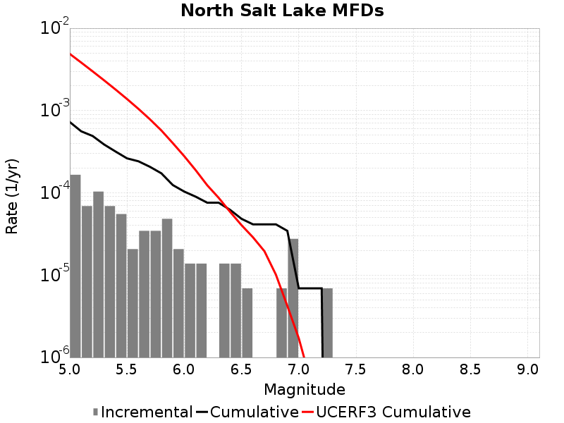

| Magnitude | Incremental Rate | Cumulative Rate | UCERF3 Cumulative Rate |
|-----|-----|-----|-----|
| 5.05 | 1.6582319E-4 | 9.396648E-4 | 0.0048825103 |
| 5.15 | 6.9092996E-5 | 7.738416E-4 | 0.0038292722 |
| 5.25 | 1.036395E-4 | 7.047486E-4 | 0.0029926554 |
| 5.35 | 6.9092996E-5 | 6.011091E-4 | 0.002328107 |
| 5.45 | 5.52744E-5 | 5.320161E-4 | 0.0018002373 |
| 5.55 | 2.0727899E-5 | 4.767417E-4 | 0.0013809357 |
| 5.65 | 3.4546498E-5 | 4.560138E-4 | 0.0010478726 |
| 5.75 | 3.4546498E-5 | 4.214673E-4 | 7.833111E-4 |
| 5.85 | 4.83651E-5 | 3.869208E-4 | 5.7316246E-4 |
| 5.95 | 2.76372E-5 | 3.385557E-4 | 4.0174866E-4 |
| 6.05 | 2.0727899E-5 | 3.109185E-4 | 2.787129E-4 |
| 6.15 | 2.76372E-5 | 2.901906E-4 | 1.8829586E-4 |
| 6.25 | 0.0 | 2.625534E-4 | 1.2391234E-4 |
| 6.35 | 2.0727899E-5 | 2.625534E-4 | 8.716912E-5 |
| 6.45 | 2.0727899E-5 | 2.418255E-4 | 5.8803045E-5 |
| 6.55 | 3.4546498E-5 | 2.210976E-4 | 4.0503848E-5 |
| 6.65 | 1.38186E-5 | 1.865511E-4 | 2.8825129E-5 |
| 6.75 | 3.4546498E-5 | 1.727325E-4 | 1.9548392E-5 |
| 6.85 | 2.76372E-5 | 1.3818599E-4 | 1.0151988E-5 |
| 6.95 | 4.1455798E-5 | 1.105488E-4 | 4.230097E-6 |
| 7.05 | 6.9093E-6 | 6.9092996E-5 | 1.7117807E-6 |
| 7.15 | 6.9093E-6 | 6.21837E-5 | 5.3407484E-7 |
| 7.25 | 1.38186E-5 | 5.52744E-5 | 3.0752128E-7 |
| 7.35 | 0.0 | 4.1455798E-5 | 2.605955E-7 |
| 7.45 | 1.38186E-5 | 4.1455798E-5 | 1.3421231E-7 |
| 7.55 | 1.38186E-5 | 2.76372E-5 | 9.595073E-8 |
| 7.65 | 1.38186E-5 | 1.38186E-5 | 9.183043E-9 |

### North Tahoe 2011 CFM
*[(top)](#table-of-contents)*

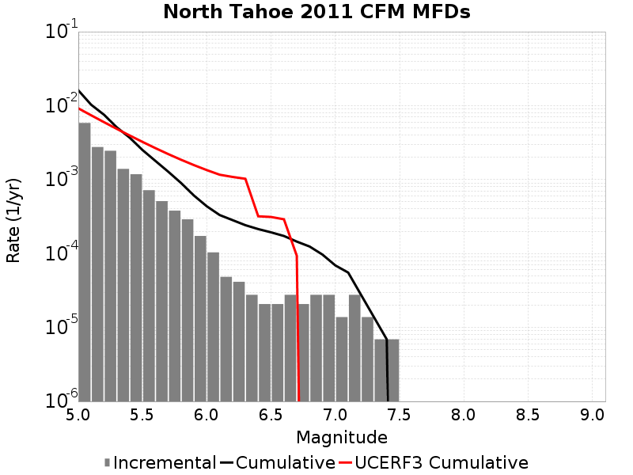

| Magnitude | Incremental Rate | Cumulative Rate | UCERF3 Cumulative Rate |
|-----|-----|-----|-----|
| 5.05 | 0.0058314493 | 0.016333586 | 0.009204918 |
| 5.15 | 0.0027568107 | 0.010502135 | 0.007408489 |
| 5.25 | 0.0024528014 | 0.007745325 | 0.0059815347 |
| 5.35 | 0.0013956786 | 0.0052925237 | 0.0048480653 |
| 5.45 | 0.0011814903 | 0.003896845 | 0.003947718 |
| 5.55 | 7.185672E-4 | 0.0027153548 | 0.0032325468 |
| 5.65 | 5.112882E-4 | 0.0019967877 | 0.0026644662 |
| 5.75 | 3.800115E-4 | 0.0014854994 | 0.0022132238 |
| 5.85 | 2.901906E-4 | 0.0011054879 | 0.0018547891 |
| 5.95 | 1.727325E-4 | 8.1529736E-4 | 0.0015700744 |
| 6.05 | 1.036395E-4 | 6.425649E-4 | 0.0013439175 |
| 6.15 | 4.83651E-5 | 5.389254E-4 | 0.0011642745 |
| 6.25 | 4.1455798E-5 | 4.905603E-4 | 0.001086951 |
| 6.35 | 2.76372E-5 | 4.491045E-4 | 0.0010256796 |
| 6.45 | 2.0727899E-5 | 4.214673E-4 | 3.1898255E-4 |
| 6.55 | 2.76372E-5 | 4.007394E-4 | 3.122807E-4 |
| 6.65 | 6.21837E-5 | 3.731022E-4 | 2.905824E-4 |
| 6.75 | 2.76372E-5 | 3.109185E-4 | 9.333692E-5 |
| 6.85 | 6.21837E-5 | 2.832813E-4 | 0.0 |
| 6.95 | 4.83651E-5 | 2.210976E-4 | 0.0 |
| 7.05 | 2.0727899E-5 | 1.727325E-4 | 0.0 |
| 7.15 | 6.21837E-5 | 1.5200459E-4 | 0.0 |
| 7.25 | 4.83651E-5 | 8.98209E-5 | 0.0 |
| 7.35 | 2.0727899E-5 | 4.1455798E-5 | 0.0 |
| 7.45 | 2.0727899E-5 | 2.0727899E-5 | 0.0 |

### Northridge
*[(top)](#table-of-contents)*

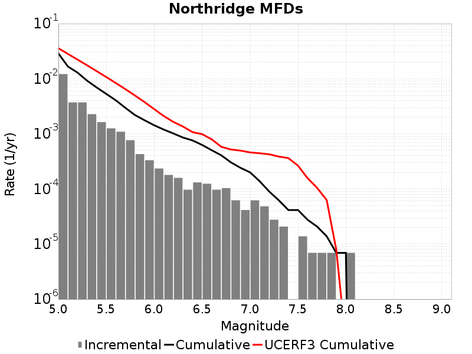

| Magnitude | Incremental Rate | Cumulative Rate | UCERF3 Cumulative Rate |
|-----|-----|-----|-----|
| 5.05 | 0.012146549 | 0.033703566 | 0.035757434 |
| 5.15 | 0.0037172034 | 0.021557016 | 0.028228097 |
| 5.25 | 0.0037172034 | 0.017839812 | 0.022247333 |
| 5.35 | 0.0022731596 | 0.014122609 | 0.017496644 |
| 5.45 | 0.0016305947 | 0.011849449 | 0.013723036 |
| 5.55 | 0.0012574926 | 0.010218855 | 0.010725554 |
| 5.65 | 0.001174581 | 0.008961362 | 0.008344569 |
| 5.75 | 9.603927E-4 | 0.007786781 | 0.0064532855 |
| 5.85 | 8.98209E-4 | 0.006826388 | 0.0049509853 |
| 5.95 | 6.6329277E-4 | 0.0059281792 | 0.003757666 |
| 6.05 | 6.494742E-4 | 0.0052648867 | 0.002810605 |
| 6.15 | 5.734719E-4 | 0.0046154126 | 0.0021012893 |
| 6.25 | 5.872905E-4 | 0.0040419404 | 0.0016468113 |
| 6.35 | 9.051183E-4 | 0.00345465 | 0.0013568357 |
| 6.45 | 7.738416E-4 | 0.0025495316 | 0.0010740691 |
| 6.55 | 4.491045E-4 | 0.0017756901 | 9.876424E-4 |
| 6.65 | 3.247371E-4 | 0.0013265855 | 7.9519005E-4 |
| 6.75 | 2.487348E-4 | 0.0010018485 | 5.8203633E-4 |
| 6.85 | 2.07279E-4 | 7.531137E-4 | 5.201798E-4 |
| 6.95 | 1.312767E-4 | 5.458347E-4 | 4.965514E-4 |
| 7.05 | 1.105488E-4 | 4.14558E-4 | 4.6028465E-4 |
| 7.15 | 1.105488E-4 | 3.0400918E-4 | 4.4473438E-4 |
| 7.25 | 7.6002296E-5 | 1.934604E-4 | 4.2562158E-4 |
| 7.35 | 4.83651E-5 | 1.174581E-4 | 3.8691773E-4 |
| 7.45 | 6.9093E-6 | 6.9092996E-5 | 3.6270244E-4 |
| 7.55 | 1.38186E-5 | 6.21837E-5 | 2.6481916E-4 |
| 7.65 | 1.38186E-5 | 4.83651E-5 | 1.5703707E-4 |
| 7.75 | 2.0727899E-5 | 3.4546498E-5 | 1.04567436E-4 |
| 7.85 | 6.9093E-6 | 1.38186E-5 | 6.260653E-5 |
| 7.95 | 0.0 | 6.9093E-6 | 7.837233E-6 |
| 8.05 | 6.9093E-6 | 6.9093E-6 | 1.5915214E-7 |

### Northridge Hills
*[(top)](#table-of-contents)*

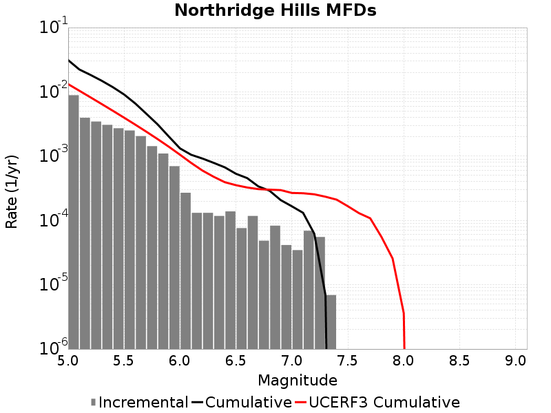

| Magnitude | Incremental Rate | Cumulative Rate | UCERF3 Cumulative Rate |
|-----|-----|-----|-----|
| 5.05 | 0.008857722 | 0.03591454 | 0.01319335 |
| 5.15 | 0.0039521195 | 0.027056819 | 0.010418757 |
| 5.25 | 0.00345465 | 0.0231047 | 0.008214819 |
| 5.35 | 0.003067729 | 0.01965005 | 0.0064641694 |
| 5.45 | 0.0027153548 | 0.01658232 | 0.0050735786 |
| 5.55 | 0.002508076 | 0.013866965 | 0.003968993 |
| 5.65 | 0.0020796992 | 0.011358889 | 0.0030915895 |
| 5.75 | 0.0015338645 | 0.00927919 | 0.0023946431 |
| 5.85 | 0.0013196763 | 0.007745325 | 0.001841039 |
| 5.95 | 0.0010847601 | 0.006425649 | 0.0014012955 |
| 6.05 | 7.6693227E-4 | 0.0053408886 | 0.0010519994 |
| 6.15 | 5.734719E-4 | 0.0045739566 | 7.841834E-4 |
| 6.25 | 5.665626E-4 | 0.0040004845 | 5.9761194E-4 |
| 6.35 | 5.941998E-4 | 0.003433922 | 4.788262E-4 |
| 6.45 | 6.149277E-4 | 0.0028397222 | 3.9359226E-4 |
| 6.55 | 4.560138E-4 | 0.0022247946 | 3.534769E-4 |
| 6.65 | 3.938301E-4 | 0.0017687808 | 3.2560262E-4 |
| 6.75 | 3.0400918E-4 | 0.0013749506 | 3.0713712E-4 |
| 6.85 | 3.592836E-4 | 0.0010709414 | 3.0126932E-4 |
| 6.95 | 2.556441E-4 | 7.1165786E-4 | 2.965153E-4 |
| 7.05 | 1.6582319E-4 | 4.560138E-4 | 2.6776685E-4 |
| 7.15 | 1.243674E-4 | 2.901906E-4 | 2.6494867E-4 |
| 7.25 | 1.036395E-4 | 1.6582319E-4 | 2.5500866E-4 |
| 7.35 | 5.52744E-5 | 6.21837E-5 | 2.3384522E-4 |
| 7.45 | 0.0 | 6.9093E-6 | 2.105353E-4 |
| 7.55 | 6.9093E-6 | 6.9093E-6 | 1.663987E-4 |
| 7.65 | 0.0 | 0.0 | 1.2979537E-4 |
| 7.75 | 0.0 | 0.0 | 1.0804588E-4 |
| 7.85 | 0.0 | 0.0 | 5.5642347E-5 |
| 7.95 | 0.0 | 0.0 | 2.5601825E-5 |
| 8.05 | 0.0 | 0.0 | 3.599812E-6 |

### Oak Ridge (Onshore)
*[(top)](#table-of-contents)*

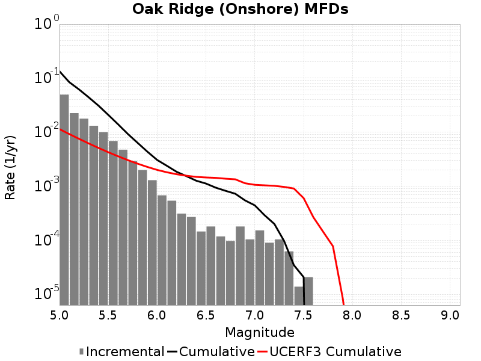

| Magnitude | Incremental Rate | Cumulative Rate | UCERF3 Cumulative Rate |
|-----|-----|-----|-----|
| 5.05 | 0.04944986 | 0.13453098 | 0.011370369 |
| 5.15 | 0.02249668 | 0.085081115 | 0.009229662 |
| 5.25 | 0.017784538 | 0.06258444 | 0.0075292387 |
| 5.35 | 0.01312767 | 0.0447999 | 0.006178544 |
| 5.45 | 0.010032304 | 0.03167223 | 0.0051056487 |
| 5.55 | 0.0068609347 | 0.021639926 | 0.004253418 |
| 5.65 | 0.004746689 | 0.014778992 | 0.0035764673 |
| 5.75 | 0.002922634 | 0.010032304 | 0.003038746 |
| 5.85 | 0.0020175155 | 0.0071096695 | 0.0026116187 |
| 5.95 | 0.0013473135 | 0.0050921543 | 0.0022723395 |
| 6.05 | 7.60023E-4 | 0.0037448406 | 0.0020028406 |
| 6.15 | 6.011091E-4 | 0.0029848176 | 0.001809652 |
| 6.25 | 3.938301E-4 | 0.0023837085 | 0.0016639517 |
| 6.35 | 3.109185E-4 | 0.0019898785 | 0.0015620424 |
| 6.45 | 2.141883E-4 | 0.0016789599 | 0.0014864823 |
| 6.55 | 2.418255E-4 | 0.0014647716 | 0.00145098 |
| 6.65 | 1.5200459E-4 | 0.0012229461 | 0.0014274626 |
| 6.75 | 1.450953E-4 | 0.0010709414 | 0.0013762774 |
| 6.85 | 2.349162E-4 | 9.2584617E-4 | 0.0013406011 |
| 6.95 | 1.3818599E-4 | 6.9093E-4 | 0.0011338971 |
| 7.05 | 2.210976E-4 | 5.5274396E-4 | 0.0010606733 |
| 7.15 | 9.67302E-5 | 3.3164638E-4 | 0.0010383395 |
| 7.25 | 1.243674E-4 | 2.349162E-4 | 0.001015928 |
| 7.35 | 7.6002296E-5 | 1.105488E-4 | 9.701381E-4 |
| 7.45 | 1.38186E-5 | 3.4546498E-5 | 9.062827E-4 |
| 7.55 | 2.0727899E-5 | 2.0727899E-5 | 6.0129643E-4 |
| 7.65 | 0.0 | 0.0 | 2.65468E-4 |
| 7.75 | 0.0 | 0.0 | 1.4301336E-4 |
| 7.85 | 0.0 | 0.0 | 7.740568E-5 |
| 7.95 | 0.0 | 0.0 | 8.5064785E-6 |
| 8.05 | 0.0 | 0.0 | 4.010157E-7 |

### Oceanic - West Huasna
*[(top)](#table-of-contents)*

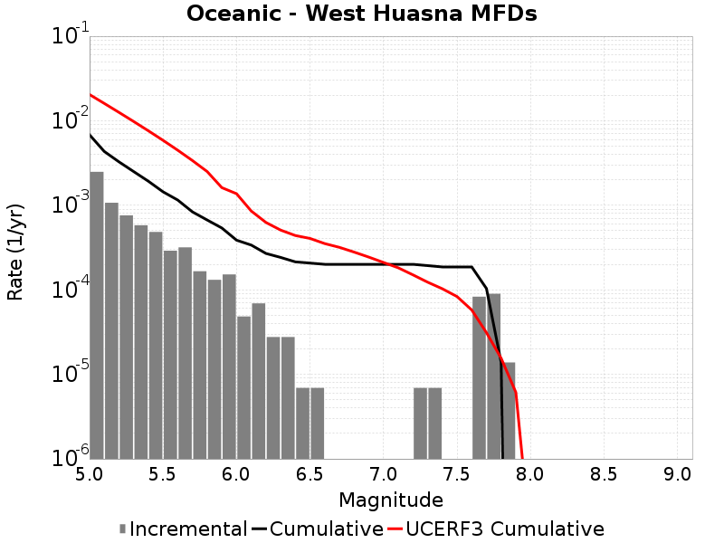

| Magnitude | Incremental Rate | Cumulative Rate | UCERF3 Cumulative Rate |
|-----|-----|-----|-----|
| 5.05 | 0.002487348 | 0.0069438466 | 0.020438327 |
| 5.15 | 0.0010709414 | 0.0044564987 | 0.016056262 |
| 5.25 | 7.60023E-4 | 0.0033855569 | 0.012575462 |
| 5.35 | 5.803812E-4 | 0.0026255338 | 0.009810566 |
| 5.45 | 4.83651E-4 | 0.0020451527 | 0.0076143304 |
| 5.55 | 2.901906E-4 | 0.0015615018 | 0.0058697984 |
| 5.65 | 3.178278E-4 | 0.0012713112 | 0.004484067 |
| 5.75 | 1.6582319E-4 | 9.534834E-4 | 0.0033833422 |
| 5.85 | 1.312767E-4 | 7.876602E-4 | 0.002509005 |
| 5.95 | 1.5200459E-4 | 6.5638346E-4 | 0.0016181276 |
| 6.05 | 4.83651E-5 | 5.0437887E-4 | 0.0013712731 |
| 6.15 | 6.9092996E-5 | 4.560138E-4 | 8.5582235E-4 |
| 6.25 | 2.76372E-5 | 3.869208E-4 | 6.2684284E-4 |
| 6.35 | 2.76372E-5 | 3.592836E-4 | 5.089572E-4 |
| 6.45 | 6.9093E-6 | 3.3164638E-4 | 4.3905698E-4 |
| 6.55 | 1.38186E-5 | 3.247371E-4 | 4.054602E-4 |
| 6.65 | 0.0 | 3.109185E-4 | 3.524135E-4 |
| 6.75 | 0.0 | 3.109185E-4 | 3.1806374E-4 |
| 6.85 | 0.0 | 3.109185E-4 | 2.7954014E-4 |
| 6.95 | 0.0 | 3.109185E-4 | 2.4374046E-4 |
| 7.05 | 1.38186E-5 | 3.109185E-4 | 2.1071125E-4 |
| 7.15 | 0.0 | 2.970999E-4 | 1.8223214E-4 |
| 7.25 | 1.38186E-5 | 2.970999E-4 | 1.503182E-4 |
| 7.35 | 2.76372E-5 | 2.832813E-4 | 1.2316574E-4 |
| 7.45 | 0.0 | 2.556441E-4 | 1.0292516E-4 |
| 7.55 | 2.0727899E-5 | 2.556441E-4 | 8.32268E-5 |
| 7.65 | 1.105488E-4 | 2.349162E-4 | 5.7709705E-5 |
| 7.75 | 1.105488E-4 | 1.243674E-4 | 3.1149397E-5 |
| 7.85 | 1.38186E-5 | 1.38186E-5 | 1.5497038E-5 |
| 7.95 | 0.0 | 0.0 | 6.1270325E-6 |
| 8.05 | 0.0 | 0.0 | 1.061594E-7 |

### Oceanside alt1
*[(top)](#table-of-contents)*

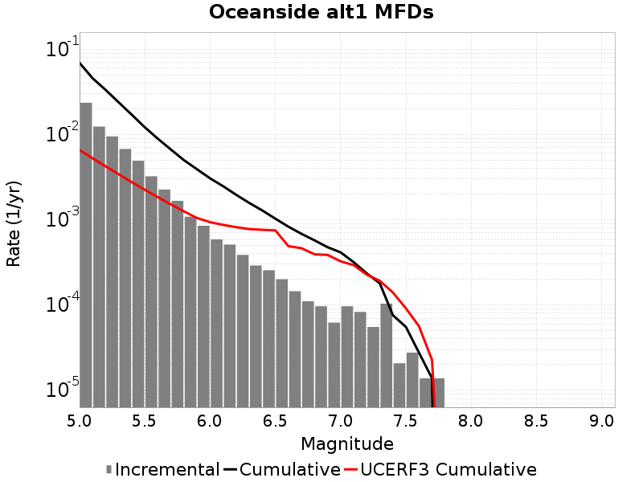

| Magnitude | Incremental Rate | Cumulative Rate | UCERF3 Cumulative Rate |
|-----|-----|-----|-----|
| 5.05 | 0.023546893 | 0.07021921 | 0.0065633357 |
| 5.15 | 0.012367647 | 0.04667232 | 0.005265677 |
| 5.25 | 0.0095002875 | 0.034304675 | 0.00423491 |
| 5.35 | 0.006757295 | 0.024804387 | 0.0034161424 |
| 5.45 | 0.004953968 | 0.01804709 | 0.0027657724 |
| 5.55 | 0.0032750082 | 0.013093123 | 0.0022491652 |
| 5.65 | 0.0023215248 | 0.009818115 | 0.0018388093 |
| 5.75 | 0.0017825994 | 0.0074965903 | 0.0015128523 |
| 5.85 | 0.0011814903 | 0.005713991 | 0.0012539353 |
| 5.95 | 9.2584617E-4 | 0.0045325006 | 0.0010482701 |
| 6.05 | 6.702021E-4 | 0.0036066545 | 9.3666255E-4 |
| 6.15 | 5.665626E-4 | 0.0029364524 | 8.709473E-4 |
| 6.25 | 4.0764868E-4 | 0.0023698898 | 8.188706E-4 |
| 6.35 | 3.109185E-4 | 0.0019622413 | 7.7750464E-4 |
| 6.45 | 3.178278E-4 | 0.0016513227 | 7.622301E-4 |
| 6.55 | 2.487348E-4 | 0.0013334949 | 7.5009704E-4 |
| 6.65 | 1.727325E-4 | 0.0010847601 | 4.9008126E-4 |
| 6.75 | 1.312767E-4 | 9.120276E-4 | 4.6385662E-4 |
| 6.85 | 1.174581E-4 | 7.807509E-4 | 3.9353097E-4 |
| 6.95 | 8.2911596E-5 | 6.6329277E-4 | 3.869313E-4 |
| 7.05 | 1.036395E-4 | 5.803812E-4 | 3.2563083E-4 |
| 7.15 | 1.174581E-4 | 4.767417E-4 | 2.9366722E-4 |
| 7.25 | 9.67302E-5 | 3.592836E-4 | 2.2703712E-4 |
| 7.35 | 1.243674E-4 | 2.625534E-4 | 1.9232715E-4 |
| 7.45 | 4.83651E-5 | 1.3818599E-4 | 1.4039171E-4 |
| 7.55 | 4.83651E-5 | 8.98209E-5 | 9.1379334E-5 |
| 7.65 | 2.0727899E-5 | 4.1455798E-5 | 5.6408473E-5 |
| 7.75 | 2.0727899E-5 | 2.0727899E-5 | 2.2631259E-5 |
| 7.85 | 0.0 | 0.0 | 3.9259817E-8 |

### Ortigalita (North)
*[(top)](#table-of-contents)*

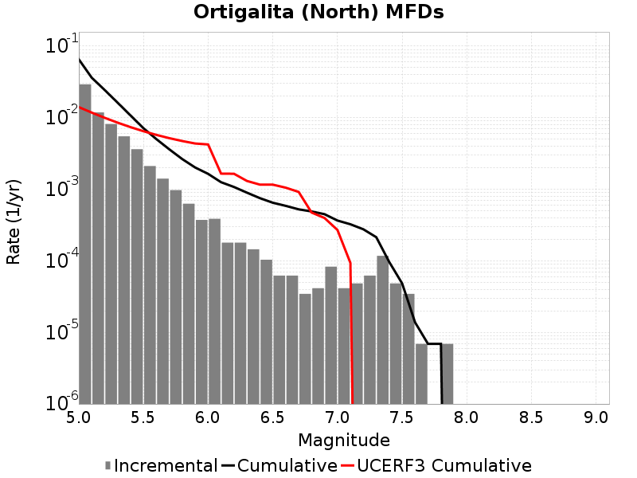

| Magnitude | Incremental Rate | Cumulative Rate | UCERF3 Cumulative Rate |
|-----|-----|-----|-----|
| 5.05 | 0.029316159 | 0.06663329 | 0.014103831 |
| 5.15 | 0.011870177 | 0.037317127 | 0.011812961 |
| 5.25 | 0.00818752 | 0.025446951 | 0.009993258 |
| 5.35 | 0.00552744 | 0.017259432 | 0.008547817 |
| 5.45 | 0.0036757474 | 0.011731992 | 0.0073996624 |
| 5.55 | 0.0021764294 | 0.008056244 | 0.0064876503 |
| 5.65 | 0.0015476831 | 0.0058798143 | 0.0057632136 |
| 5.75 | 0.0010640322 | 0.0043321312 | 0.005187773 |
| 5.85 | 7.738416E-4 | 0.003268099 | 0.0047306847 |
| 5.95 | 4.83651E-4 | 0.0024942572 | 0.0043676062 |
| 6.05 | 4.421952E-4 | 0.0020106062 | 0.0042376947 |
| 6.15 | 2.487348E-4 | 0.0015684111 | 0.0016577322 |
| 6.25 | 2.141883E-4 | 0.0013196763 | 0.0016496636 |
| 6.35 | 1.796418E-4 | 0.0011054879 | 0.0013095214 |
| 6.45 | 1.5200459E-4 | 9.2584617E-4 | 0.0011633005 |
| 6.55 | 8.2911596E-5 | 7.738416E-4 | 0.0011622154 |
| 6.65 | 8.2911596E-5 | 6.9093E-4 | 0.0010542133 |
| 6.75 | 5.52744E-5 | 6.0801837E-4 | 9.197375E-4 |
| 6.85 | 4.83651E-5 | 5.5274396E-4 | 4.735944E-4 |
| 6.95 | 9.67302E-5 | 5.0437887E-4 | 3.9714106E-4 |
| 7.05 | 5.52744E-5 | 4.0764868E-4 | 2.7025182E-4 |
| 7.15 | 4.83651E-5 | 3.523743E-4 | 9.3633214E-5 |
| 7.25 | 6.21837E-5 | 3.0400918E-4 | 0.0 |
| 7.35 | 1.174581E-4 | 2.418255E-4 | 0.0 |
| 7.45 | 4.83651E-5 | 1.243674E-4 | 0.0 |
| 7.55 | 4.83651E-5 | 7.6002296E-5 | 0.0 |
| 7.65 | 6.9093E-6 | 2.76372E-5 | 0.0 |
| 7.75 | 1.38186E-5 | 2.0727899E-5 | 0.0 |
| 7.85 | 6.9093E-6 | 6.9093E-6 | 0.0 |

### Ortigalita (South)
*[(top)](#table-of-contents)*

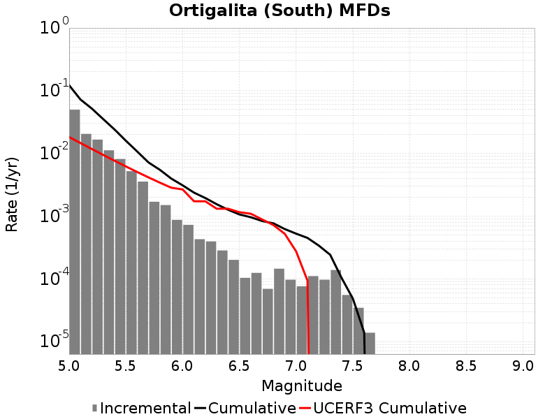

| Magnitude | Incremental Rate | Cumulative Rate | UCERF3 Cumulative Rate |
|-----|-----|-----|-----|
| 5.05 | 0.049691685 | 0.12458158 | 0.018264297 |
| 5.15 | 0.020472256 | 0.0748899 | 0.014634652 |
| 5.25 | 0.016699778 | 0.054417647 | 0.011751522 |
| 5.35 | 0.011386526 | 0.037717868 | 0.00946137 |
| 5.45 | 0.008491529 | 0.026331343 | 0.0076422384 |
| 5.55 | 0.0056518074 | 0.017839812 | 0.0061972504 |
| 5.65 | 0.0039037545 | 0.012188005 | 0.005049456 |
| 5.75 | 0.002052062 | 0.00828425 | 0.00413773 |
| 5.85 | 0.0017135064 | 0.0062321885 | 0.0034135208 |
| 5.95 | 9.880299E-4 | 0.004518682 | 0.0028382607 |
| 6.05 | 7.876602E-4 | 0.0035306523 | 0.0026639085 |
| 6.15 | 4.83651E-4 | 0.002742992 | 0.0017269402 |
| 6.25 | 4.421952E-4 | 0.002259341 | 0.0017228657 |
| 6.35 | 3.385557E-4 | 0.0018171459 | 0.0013123275 |
| 6.45 | 2.280069E-4 | 0.0014785902 | 0.0013123275 |
| 6.55 | 1.036395E-4 | 0.0012505833 | 0.0011549275 |
| 6.65 | 1.589139E-4 | 0.0011469438 | 0.0010922722 |
| 6.75 | 9.67302E-5 | 9.880299E-4 | 8.856149E-4 |
| 6.85 | 1.5200459E-4 | 8.912997E-4 | 7.20101E-4 |
| 6.95 | 1.243674E-4 | 7.392951E-4 | 5.2145496E-4 |
| 7.05 | 9.67302E-5 | 6.149277E-4 | 2.73777E-4 |
| 7.15 | 1.312767E-4 | 5.181975E-4 | 9.3633214E-5 |
| 7.25 | 1.243674E-4 | 3.869208E-4 | 0.0 |
| 7.35 | 1.5200459E-4 | 2.625534E-4 | 0.0 |
| 7.45 | 6.21837E-5 | 1.105488E-4 | 0.0 |
| 7.55 | 3.4546498E-5 | 4.83651E-5 | 0.0 |
| 7.65 | 1.38186E-5 | 1.38186E-5 | 0.0 |

### Owens Valley
*[(top)](#table-of-contents)*

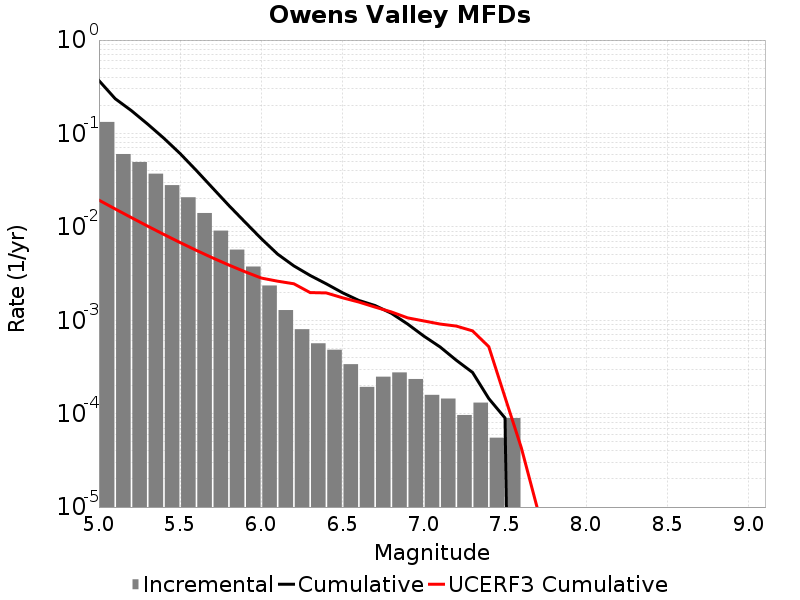

| Magnitude | Incremental Rate | Cumulative Rate | UCERF3 Cumulative Rate |
|-----|-----|-----|-----|
| 5.05 | 0.13281748 | 0.3692606 | 0.019319948 |
| 5.15 | 0.06022146 | 0.23644315 | 0.015551329 |
| 5.25 | 0.049477495 | 0.1762217 | 0.012557809 |
| 5.35 | 0.03709603 | 0.1267442 | 0.010179972 |
| 5.45 | 0.027968846 | 0.089648165 | 0.008291189 |
| 5.55 | 0.02073481 | 0.06167932 | 0.006790875 |
| 5.65 | 0.014067335 | 0.040944513 | 0.0055991337 |
| 5.75 | 0.009161731 | 0.026877176 | 0.0046524997 |
| 5.85 | 0.005783084 | 0.017715445 | 0.0039005615 |
| 5.95 | 0.0037932056 | 0.011932361 | 0.0033032757 |
| 6.05 | 0.0024528014 | 0.008139155 | 0.0028288348 |
| 6.15 | 0.0013680414 | 0.005686354 | 0.002620385 |
| 6.25 | 8.843904E-4 | 0.0043183123 | 0.002457807 |
| 6.35 | 6.356556E-4 | 0.003433922 | 0.0019791024 |
| 6.45 | 5.458347E-4 | 0.0027982665 | 0.0019610834 |
| 6.55 | 3.731022E-4 | 0.0022524318 | 0.0017395443 |
| 6.65 | 2.625534E-4 | 0.0018793296 | 0.0015667523 |
| 6.75 | 2.7637198E-4 | 0.0016167762 | 0.0013830428 |
| 6.85 | 3.178278E-4 | 0.0013404042 | 0.0012281408 |
| 6.95 | 2.625534E-4 | 0.0010225764 | 0.0010612258 |
| 7.05 | 1.727325E-4 | 7.60023E-4 | 9.831345E-4 |
| 7.15 | 1.589139E-4 | 5.872905E-4 | 9.11038E-4 |
| 7.25 | 1.3818599E-4 | 4.283766E-4 | 8.663685E-4 |
| 7.35 | 1.3818599E-4 | 2.901906E-4 | 7.6980045E-4 |
| 7.45 | 5.52744E-5 | 1.5200459E-4 | 5.2128E-4 |
| 7.55 | 8.98209E-5 | 9.67302E-5 | 1.4965242E-4 |
| 7.65 | 0.0 | 6.9093E-6 | 4.33014E-5 |
| 7.75 | 6.9093E-6 | 6.9093E-6 | 9.537954E-6 |

### Owens Valley Keough Hot Springs
*[(top)](#table-of-contents)*

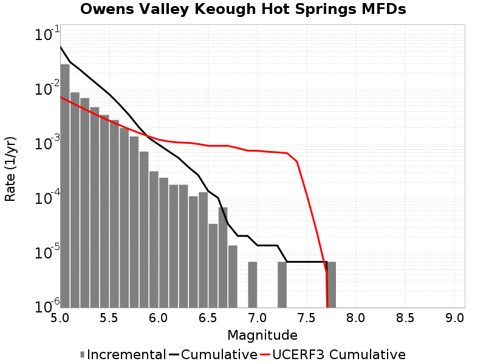

| Magnitude | Incremental Rate | Cumulative Rate | UCERF3 Cumulative Rate |
|-----|-----|-----|-----|
| 5.05 | 0.029240157 | 0.062121514 | 0.0073611913 |
| 5.15 | 0.008885359 | 0.032881357 | 0.005955401 |
| 5.25 | 0.00700603 | 0.023996 | 0.004838742 |
| 5.35 | 0.0047812355 | 0.016989969 | 0.003951748 |
| 5.45 | 0.003433922 | 0.012208733 | 0.0032471835 |
| 5.55 | 0.0027844477 | 0.0087748105 | 0.0026875283 |
| 5.65 | 0.0020106062 | 0.005990363 | 0.0022429784 |
| 5.75 | 0.0014302251 | 0.003979757 | 0.0018898598 |
| 5.85 | 8.014788E-4 | 0.0025495316 | 0.0016093677 |
| 5.95 | 3.523743E-4 | 0.0017480529 | 0.0013865649 |
| 6.05 | 3.178278E-4 | 0.0013956786 | 0.0012095864 |
| 6.15 | 2.210976E-4 | 0.0010778508 | 0.0011221122 |
| 6.25 | 2.280069E-4 | 8.567532E-4 | 0.001072277 |
| 6.35 | 1.243674E-4 | 6.287463E-4 | 0.0010591346 |
| 6.45 | 1.312767E-4 | 5.0437887E-4 | 0.0010068562 |
| 6.55 | 3.4546498E-5 | 3.731022E-4 | 9.3255175E-4 |
| 6.65 | 7.6002296E-5 | 3.385557E-4 | 9.3239994E-4 |
| 6.75 | 2.76372E-5 | 2.625534E-4 | 9.314745E-4 |
| 6.85 | 2.0727899E-5 | 2.349162E-4 | 8.496466E-4 |
| 6.95 | 1.38186E-5 | 2.141883E-4 | 7.606693E-4 |
| 7.05 | 1.38186E-5 | 2.003697E-4 | 7.5506326E-4 |
| 7.15 | 5.52744E-5 | 1.865511E-4 | 7.2685967E-4 |
| 7.25 | 3.4546498E-5 | 1.312767E-4 | 7.0796534E-4 |
| 7.35 | 1.38186E-5 | 9.67302E-5 | 6.850583E-4 |
| 7.45 | 4.1455798E-5 | 8.2911596E-5 | 4.788779E-4 |
| 7.55 | 3.4546498E-5 | 4.1455798E-5 | 1.178039E-4 |
| 7.65 | 0.0 | 6.9093E-6 | 2.5093004E-5 |
| 7.75 | 6.9093E-6 | 6.9093E-6 | 4.3496125E-6 |

### Owl Lake
*[(top)](#table-of-contents)*

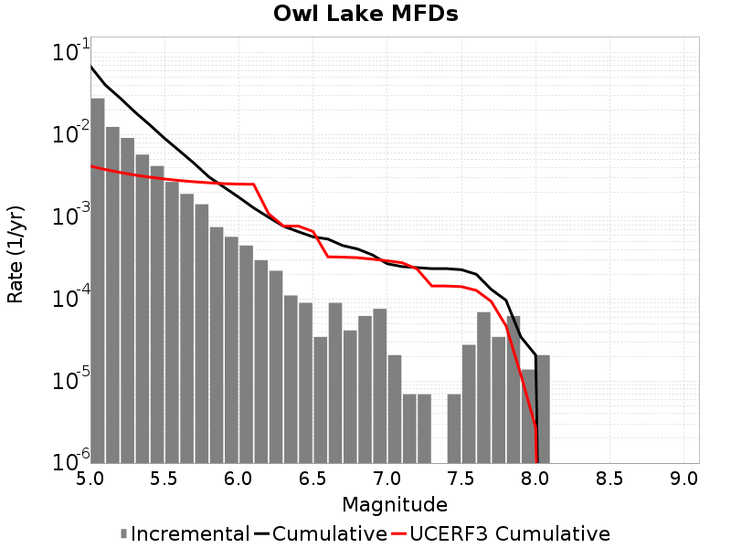

| Magnitude | Incremental Rate | Cumulative Rate | UCERF3 Cumulative Rate |
|-----|-----|-----|-----|
| 5.05 | 0.028003393 | 0.070654504 | 0.0041793226 |
| 5.15 | 0.01254038 | 0.04265111 | 0.0037968834 |
| 5.25 | 0.009203187 | 0.03011073 | 0.0034931013 |
| 5.35 | 0.0057692653 | 0.020907542 | 0.0032517987 |
| 5.45 | 0.004193945 | 0.015138276 | 0.003060125 |
| 5.55 | 0.0026877176 | 0.010944331 | 0.0029078734 |
| 5.65 | 0.0019691505 | 0.008256613 | 0.0027869355 |
| 5.75 | 0.0016444133 | 0.006287463 | 0.0026908712 |
| 5.85 | 0.0010294857 | 0.0046430496 | 0.0026145647 |
| 5.95 | 7.807509E-4 | 0.003613564 | 0.0025539522 |
| 6.05 | 6.0801837E-4 | 0.002832813 | 0.002520832 |
| 6.15 | 4.560138E-4 | 0.0022247946 | 0.0025055343 |
| 6.25 | 2.970999E-4 | 0.0017687808 | 0.0010996981 |
| 6.35 | 1.796418E-4 | 0.0014716808 | 7.7724503E-4 |
| 6.45 | 1.589139E-4 | 0.001292039 | 7.7724503E-4 |
| 6.55 | 9.67302E-5 | 0.0011331252 | 6.6643994E-4 |
| 6.65 | 1.450953E-4 | 0.001036395 | 3.2725662E-4 |
| 6.75 | 6.9092996E-5 | 8.912997E-4 | 3.2433993E-4 |
| 6.85 | 8.2911596E-5 | 8.2220667E-4 | 3.1957158E-4 |
| 6.95 | 9.67302E-5 | 7.392951E-4 | 3.0634404E-4 |
| 7.05 | 5.52744E-5 | 6.425649E-4 | 2.932487E-4 |
| 7.15 | 3.4546498E-5 | 5.872905E-4 | 2.770444E-4 |
| 7.25 | 4.1455798E-5 | 5.5274396E-4 | 2.3310258E-4 |
| 7.35 | 2.76372E-5 | 5.112882E-4 | 1.4454637E-4 |
| 7.45 | 4.1455798E-5 | 4.83651E-4 | 1.4412579E-4 |
| 7.55 | 9.67302E-5 | 4.421952E-4 | 1.4170678E-4 |
| 7.65 | 1.174581E-4 | 3.45465E-4 | 1.2758149E-4 |
| 7.75 | 7.6002296E-5 | 2.280069E-4 | 9.3694034E-5 |
| 7.85 | 9.67302E-5 | 1.5200459E-4 | 4.7166064E-5 |
| 7.95 | 2.0727899E-5 | 5.52744E-5 | 1.1951279E-5 |
| 8.05 | 3.4546498E-5 | 3.4546498E-5 | 2.7093272E-6 |

### Ozena
*[(top)](#table-of-contents)*

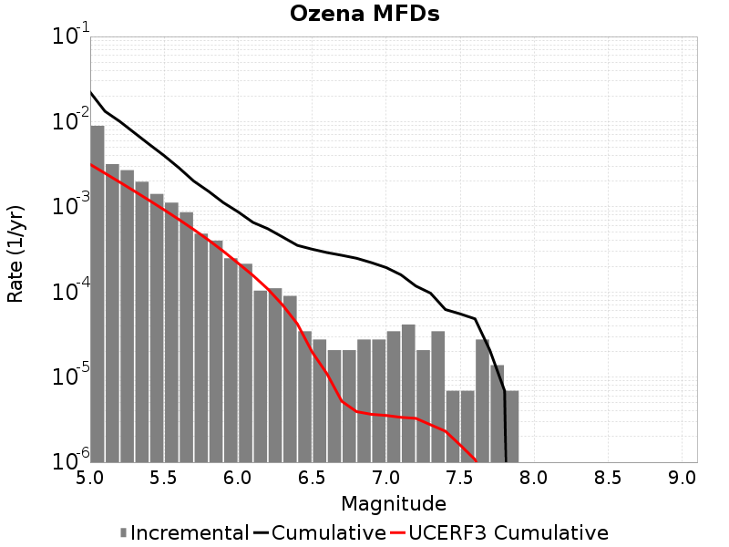

| Magnitude | Incremental Rate | Cumulative Rate | UCERF3 Cumulative Rate |
|-----|-----|-----|-----|
| 5.05 | 0.008933725 | 0.023056334 | 0.0031497278 |
| 5.15 | 0.0031713687 | 0.014122609 | 0.002479309 |
| 5.25 | 0.002694627 | 0.010951241 | 0.0019467765 |
| 5.35 | 0.0019691505 | 0.008256613 | 0.0015237709 |
| 5.45 | 0.0014164065 | 0.006287463 | 0.0011877655 |
| 5.55 | 0.0011193065 | 0.0048710564 | 9.2086697E-4 |
| 5.65 | 8.636625E-4 | 0.0037517499 | 7.088619E-4 |
| 5.75 | 4.905603E-4 | 0.0028880874 | 5.4046034E-4 |
| 5.85 | 4.14558E-4 | 0.002397527 | 4.066942E-4 |
| 5.95 | 2.556441E-4 | 0.001982969 | 3.0043998E-4 |
| 6.05 | 2.418255E-4 | 0.001727325 | 2.1718202E-4 |
| 6.15 | 1.312767E-4 | 0.0014854994 | 1.563201E-4 |
| 6.25 | 1.727325E-4 | 0.0013542228 | 1.0838282E-4 |
| 6.35 | 1.174581E-4 | 0.0011814903 | 7.03681E-5 |
| 6.45 | 8.98209E-5 | 0.0010640322 | 4.21018E-5 |
| 6.55 | 6.21837E-5 | 9.7421126E-4 | 1.9675677E-5 |
| 6.65 | 3.4546498E-5 | 9.120276E-4 | 1.0935818E-5 |
| 6.75 | 4.83651E-5 | 8.7748107E-4 | 5.1966076E-6 |
| 6.85 | 6.21837E-5 | 8.29116E-4 | 3.9314336E-6 |
| 6.95 | 8.2911596E-5 | 7.6693227E-4 | 3.656443E-6 |
| 7.05 | 7.6002296E-5 | 6.840207E-4 | 3.5472221E-6 |
| 7.15 | 7.6002296E-5 | 6.0801837E-4 | 3.3698354E-6 |
| 7.25 | 6.21837E-5 | 5.320161E-4 | 3.27871E-6 |
| 7.35 | 8.98209E-5 | 4.698324E-4 | 2.7561161E-6 |
| 7.45 | 6.21837E-5 | 3.800115E-4 | 2.3157938E-6 |
| 7.55 | 1.6582319E-4 | 3.178278E-4 | 1.5929241E-6 |
| 7.65 | 1.243674E-4 | 1.5200459E-4 | 1.076079E-6 |
| 7.75 | 2.0727899E-5 | 2.76372E-5 | 3.9019525E-7 |
| 7.85 | 6.9093E-6 | 6.9093E-6 | 4.384228E-8 |

### Palos Verdes
*[(top)](#table-of-contents)*

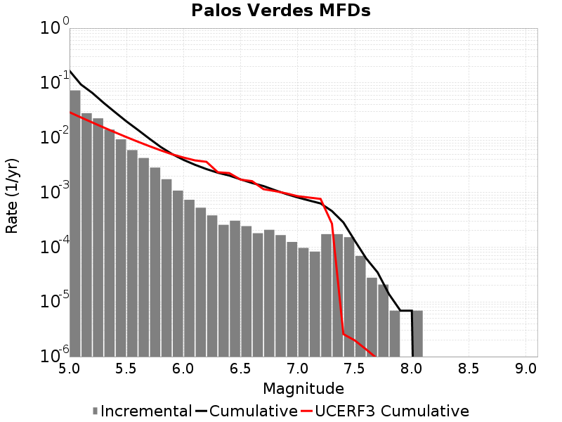

| Magnitude | Incremental Rate | Cumulative Rate | UCERF3 Cumulative Rate |
|-----|-----|-----|-----|
| 5.05 | 0.07294148 | 0.16691487 | 0.029128872 |
| 5.15 | 0.027989574 | 0.09397339 | 0.023441806 |
| 5.25 | 0.022545045 | 0.06598382 | 0.018924408 |
| 5.35 | 0.014046607 | 0.04343877 | 0.015336112 |
| 5.45 | 0.009313736 | 0.029392162 | 0.012485827 |
| 5.55 | 0.00592127 | 0.020078426 | 0.010221764 |
| 5.65 | 0.0042492193 | 0.0141571555 | 0.008423356 |
| 5.75 | 0.0028397222 | 0.009907936 | 0.00699483 |
| 5.85 | 0.0017411435 | 0.007068214 | 0.0058601107 |
| 5.95 | 0.0010916694 | 0.00532707 | 0.0049587716 |
| 6.05 | 7.60023E-4 | 0.004235401 | 0.0043265047 |
| 6.15 | 5.389254E-4 | 0.0034753778 | 0.0038416656 |
| 6.25 | 3.869208E-4 | 0.0029364524 | 0.00362134 |
| 6.35 | 2.556441E-4 | 0.0025495316 | 0.0023330452 |
| 6.45 | 3.178278E-4 | 0.0022938875 | 0.0022533427 |
| 6.55 | 2.556441E-4 | 0.0019760597 | 0.0017109275 |
| 6.65 | 1.865511E-4 | 0.0017204157 | 0.0016052997 |
| 6.75 | 2.210976E-4 | 0.0015338645 | 0.0011451037 |
| 6.85 | 1.865511E-4 | 0.0013127669 | 0.0010586503 |
| 6.95 | 1.243674E-4 | 0.0011262159 | 9.581568E-4 |
| 7.05 | 9.67302E-5 | 0.0010018485 | 8.522814E-4 |
| 7.15 | 1.174581E-4 | 9.051183E-4 | 8.05008E-4 |
| 7.25 | 2.003697E-4 | 7.876602E-4 | 7.6117355E-4 |
| 7.35 | 2.07279E-4 | 5.872905E-4 | 2.6826837E-4 |
| 7.45 | 2.003697E-4 | 3.800115E-4 | 2.5797256E-6 |
| 7.55 | 8.2911596E-5 | 1.796418E-4 | 1.9790996E-6 |
| 7.65 | 5.52744E-5 | 9.67302E-5 | 1.3525804E-6 |
| 7.75 | 2.0727899E-5 | 4.1455798E-5 | 9.0699723E-7 |
| 7.85 | 1.38186E-5 | 2.0727899E-5 | 1.8033363E-7 |
| 7.95 | 0.0 | 6.9093E-6 | 0.0 |
| 8.05 | 6.9093E-6 | 6.9093E-6 | 0.0 |

### Panamint Valley
*[(top)](#table-of-contents)*

| Magnitude | Incremental Rate | Cumulative Rate | UCERF3 Cumulative Rate |
|-----|-----|-----|-----|
| 5.05 | 0.015311008 | 0.048634563 | 0.01199696 |
| 5.15 | 0.009797387 | 0.033323552 | 0.00958076 |
| 5.25 | 0.0059281792 | 0.023526166 | 0.007661505 |
| 5.35 | 0.0046637775 | 0.017597986 | 0.0061369864 |
| 5.45 | 0.0033371919 | 0.01293421 | 0.0049260184 |
| 5.55 | 0.0025357131 | 0.009597017 | 0.003964112 |
| 5.65 | 0.001727325 | 0.0070613045 | 0.0032000425 |
| 5.75 | 0.0010778508 | 0.0053339796 | 0.0025931208 |
| 5.85 | 9.465741E-4 | 0.004256129 | 0.0021110256 |
| 5.95 | 6.9093E-4 | 0.0033095547 | 0.0017280838 |
| 6.05 | 5.941998E-4 | 0.0026186246 | 0.0014461062 |
| 6.15 | 4.491045E-4 | 0.002024425 | 0.001342765 |
| 6.25 | 2.280069E-4 | 0.0015753204 | 0.0012650297 |
| 6.35 | 1.312767E-4 | 0.0013473135 | 0.0011948473 |
| 6.45 | 1.727325E-4 | 0.0012160367 | 0.001192611 |
| 6.55 | 1.036395E-4 | 0.0010433043 | 0.0011431888 |
| 6.65 | 9.67302E-5 | 9.396648E-4 | 0.0010987854 |
| 6.75 | 2.76372E-5 | 8.429346E-4 | 0.0010415004 |
| 6.85 | 3.4546498E-5 | 8.1529736E-4 | 9.879785E-4 |
| 6.95 | 1.38186E-5 | 7.807509E-4 | 9.0638804E-4 |
| 7.05 | 2.0727899E-5 | 7.6693227E-4 | 8.76918E-4 |
| 7.15 | 2.76372E-5 | 7.462044E-4 | 8.568118E-4 |
| 7.25 | 6.21837E-5 | 7.185672E-4 | 8.1184506E-4 |
| 7.35 | 7.6002296E-5 | 6.5638346E-4 | 7.324243E-4 |
| 7.45 | 4.1455798E-5 | 5.803812E-4 | 6.760826E-4 |
| 7.55 | 2.280069E-4 | 5.389254E-4 | 6.0367596E-4 |
| 7.65 | 1.5200459E-4 | 3.109185E-4 | 1.248473E-4 |
| 7.75 | 4.1455798E-5 | 1.589139E-4 | 0.0 |
| 7.85 | 6.9092996E-5 | 1.174581E-4 | 0.0 |
| 7.95 | 1.38186E-5 | 4.83651E-5 | 0.0 |
| 8.05 | 3.4546498E-5 | 3.4546498E-5 | 0.0 |

### Paradise
*[(top)](#table-of-contents)*

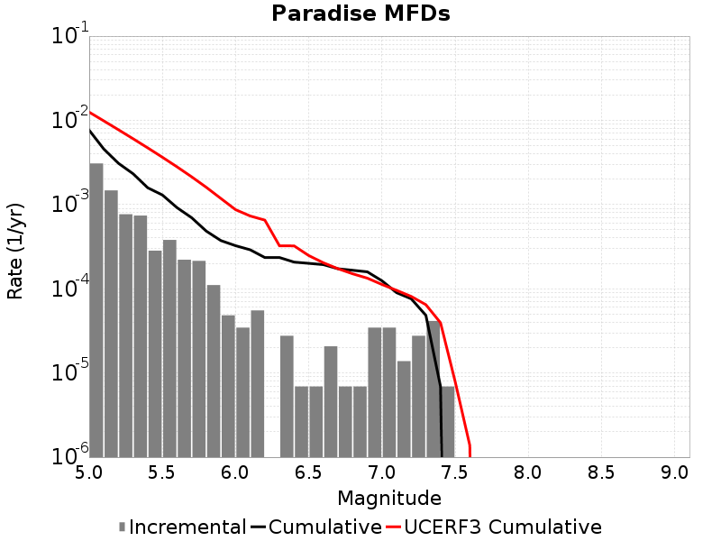

| Magnitude | Incremental Rate | Cumulative Rate | UCERF3 Cumulative Rate |
|-----|-----|-----|-----|
| 5.05 | 0.0030746385 | 0.0077038696 | 0.012512951 |
| 5.15 | 0.0014716808 | 0.004629231 | 0.009846254 |
| 5.25 | 7.6693227E-4 | 0.00315755 | 0.007728022 |
| 5.35 | 7.392951E-4 | 0.0023906177 | 0.00604545 |
| 5.45 | 2.832813E-4 | 0.0016513227 | 0.004708936 |
| 5.55 | 3.800115E-4 | 0.0013680414 | 0.0036473046 |
| 5.65 | 2.210976E-4 | 9.880299E-4 | 0.0028040211 |
| 5.75 | 2.141883E-4 | 7.6693227E-4 | 0.0021341774 |
| 5.85 | 1.105488E-4 | 5.5274396E-4 | 0.0016021014 |
| 5.95 | 4.83651E-5 | 4.421952E-4 | 0.0011794585 |
| 6.05 | 3.4546498E-5 | 3.938301E-4 | 8.693447E-4 |
| 6.15 | 5.52744E-5 | 3.592836E-4 | 7.3164277E-4 |
| 6.25 | 0.0 | 3.0400918E-4 | 6.5304834E-4 |
| 6.35 | 3.4546498E-5 | 3.0400918E-4 | 3.2353308E-4 |
| 6.45 | 6.9093E-6 | 2.694627E-4 | 3.230096E-4 |
| 6.55 | 6.9093E-6 | 2.625534E-4 | 2.4784185E-4 |
| 6.65 | 2.76372E-5 | 2.556441E-4 | 2.0350676E-4 |
| 6.75 | 2.0727899E-5 | 2.280069E-4 | 1.7288687E-4 |
| 6.85 | 6.9093E-6 | 2.07279E-4 | 1.5054115E-4 |
| 6.95 | 4.1455798E-5 | 2.003697E-4 | 1.3362602E-4 |
| 7.05 | 4.1455798E-5 | 1.589139E-4 | 1.1242266E-4 |
| 7.15 | 1.38186E-5 | 1.174581E-4 | 9.578157E-5 |
| 7.25 | 2.76372E-5 | 1.036395E-4 | 8.1087754E-5 |
| 7.35 | 4.83651E-5 | 7.6002296E-5 | 6.46881E-5 |
| 7.45 | 2.76372E-5 | 2.76372E-5 | 3.9477436E-5 |
| 7.55 | 0.0 | 0.0 | 7.901982E-6 |
| 7.65 | 0.0 | 0.0 | 1.3823751E-6 |

### Peralta Hills
*[(top)](#table-of-contents)*

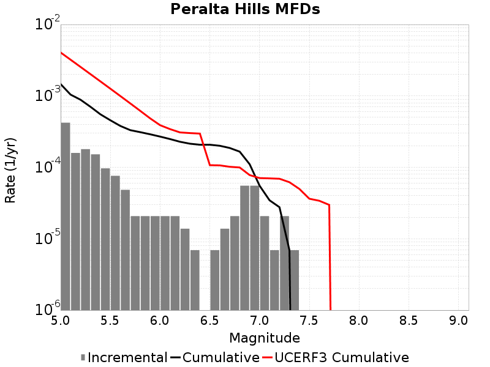

| Magnitude | Incremental Rate | Cumulative Rate | UCERF3 Cumulative Rate |
|-----|-----|-----|-----|
| 5.05 | 4.214673E-4 | 0.0017618715 | 0.004056482 |
| 5.15 | 1.589139E-4 | 0.0013404042 | 0.0032161302 |
| 5.25 | 1.796418E-4 | 0.0011814903 | 0.0025486147 |
| 5.35 | 1.5200459E-4 | 0.0010018485 | 0.0020183886 |
| 5.45 | 9.67302E-5 | 8.498439E-4 | 0.0015972147 |
| 5.55 | 7.6002296E-5 | 7.531137E-4 | 0.0012626646 |
| 5.65 | 4.83651E-5 | 6.771114E-4 | 9.969219E-4 |
| 5.75 | 2.76372E-5 | 6.287463E-4 | 7.85835E-4 |
| 5.85 | 2.76372E-5 | 6.011091E-4 | 6.1816274E-4 |
| 5.95 | 4.83651E-5 | 5.734719E-4 | 4.849759E-4 |
| 6.05 | 2.76372E-5 | 5.251068E-4 | 3.890778E-4 |
| 6.15 | 3.4546498E-5 | 4.974696E-4 | 3.4288134E-4 |
| 6.25 | 2.0727899E-5 | 4.6292308E-4 | 3.0821544E-4 |
| 6.35 | 1.38186E-5 | 4.421952E-4 | 3.0167273E-4 |
| 6.45 | 6.9093E-6 | 4.283766E-4 | 2.968615E-4 |
| 6.55 | 2.0727899E-5 | 4.214673E-4 | 1.0712919E-4 |
| 6.65 | 2.0727899E-5 | 4.007394E-4 | 1.0649073E-4 |
| 6.75 | 3.4546498E-5 | 3.800115E-4 | 1.0175947E-4 |
| 6.85 | 6.9092996E-5 | 3.45465E-4 | 9.9522265E-5 |
| 6.95 | 6.9092996E-5 | 2.7637198E-4 | 7.7871126E-5 |
| 7.05 | 6.21837E-5 | 2.07279E-4 | 7.069544E-5 |
| 7.15 | 4.83651E-5 | 1.450953E-4 | 7.003618E-5 |
| 7.25 | 4.1455798E-5 | 9.67302E-5 | 6.9193484E-5 |
| 7.35 | 1.38186E-5 | 5.52744E-5 | 6.1873194E-5 |
| 7.45 | 1.38186E-5 | 4.1455798E-5 | 4.9804716E-5 |
| 7.55 | 0.0 | 2.76372E-5 | 3.63294E-5 |
| 7.65 | 6.9093E-6 | 2.76372E-5 | 3.4011955E-5 |
| 7.75 | 1.38186E-5 | 2.0727899E-5 | 2.9788582E-5 |
| 7.85 | 0.0 | 6.9093E-6 | 0.0 |
| 7.95 | 0.0 | 6.9093E-6 | 0.0 |
| 8.05 | 6.9093E-6 | 6.9093E-6 | 0.0 |

### Pilarcitos 2011 CFM
*[(top)](#table-of-contents)*

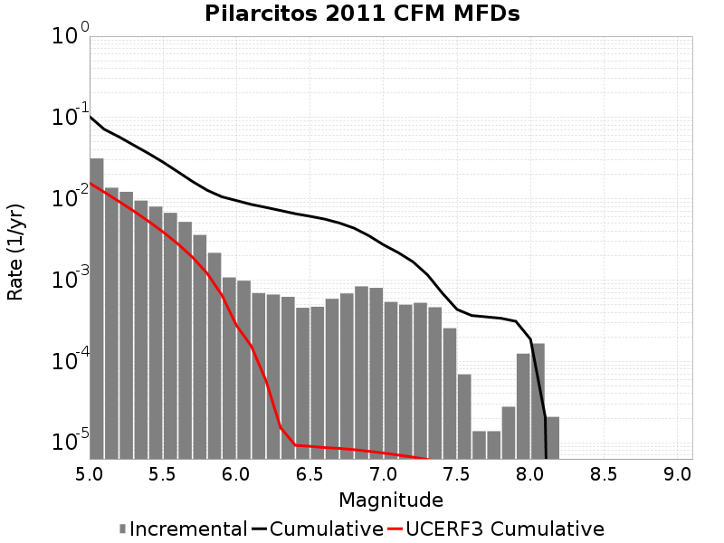

| Magnitude | Incremental Rate | Cumulative Rate | UCERF3 Cumulative Rate |
|-----|-----|-----|-----|
| 5.05 | 0.031347495 | 0.121534586 | 0.015600994 |
| 5.15 | 0.013666595 | 0.090187095 | 0.012084064 |
| 5.25 | 0.012174186 | 0.076520495 | 0.009290467 |
| 5.35 | 0.0095002875 | 0.06434631 | 0.007071434 |
| 5.45 | 0.008014788 | 0.054846022 | 0.005308794 |
| 5.55 | 0.0067227487 | 0.046831235 | 0.003908679 |
| 5.65 | 0.0054998025 | 0.040108487 | 0.002796528 |
| 5.75 | 0.004926331 | 0.034608684 | 0.001913115 |
| 5.85 | 0.004028122 | 0.029682353 | 0.0012113951 |
| 5.95 | 0.0031506408 | 0.02565423 | 6.5399933E-4 |
| 6.05 | 0.002653171 | 0.02250359 | 2.757592E-4 |
| 6.15 | 0.0021833389 | 0.019850418 | 1.5480311E-4 |
| 6.25 | 0.0019069668 | 0.01766708 | 5.8103695E-5 |
| 6.35 | 0.0017342343 | 0.015760113 | 1.5209441E-5 |
| 6.45 | 0.0015062274 | 0.014025879 | 9.26457E-6 |
| 6.55 | 0.0013334949 | 0.012519651 | 9.010179E-6 |
| 6.65 | 0.0011953089 | 0.011186156 | 8.682962E-6 |
| 6.75 | 0.0013127669 | 0.009990848 | 8.492111E-6 |
| 6.85 | 0.0014025879 | 0.0086780805 | 8.188064E-6 |
| 6.95 | 0.0014854994 | 0.007275493 | 7.825138E-6 |
| 7.05 | 0.0011331252 | 0.0057899933 | 7.443384E-6 |
| 7.15 | 0.0011814903 | 0.004656868 | 7.0324795E-6 |
| 7.25 | 0.001036395 | 0.0034753778 | 6.6317552E-6 |
| 7.35 | 8.1529736E-4 | 0.002438983 | 6.2048985E-6 |
| 7.45 | 4.421952E-4 | 0.0016236855 | 5.8255E-6 |
| 7.55 | 1.105488E-4 | 0.0011814903 | 5.3096896E-6 |
| 7.65 | 3.4546498E-5 | 0.0010709414 | 4.969733E-6 |
| 7.75 | 2.0727899E-5 | 0.001036395 | 4.669462E-6 |
| 7.85 | 5.52744E-5 | 0.0010156671 | 4.2800125E-6 |
| 7.95 | 4.3528588E-4 | 9.603927E-4 | 3.377104E-6 |
| 8.05 | 4.421952E-4 | 5.251068E-4 | 2.943609E-6 |
| 8.15 | 8.2911596E-5 | 8.2911596E-5 | 2.4149958E-6 |
| 8.25 | 0.0 | 0.0 | 1.2467118E-8 |

### Pine Mtn
*[(top)](#table-of-contents)*

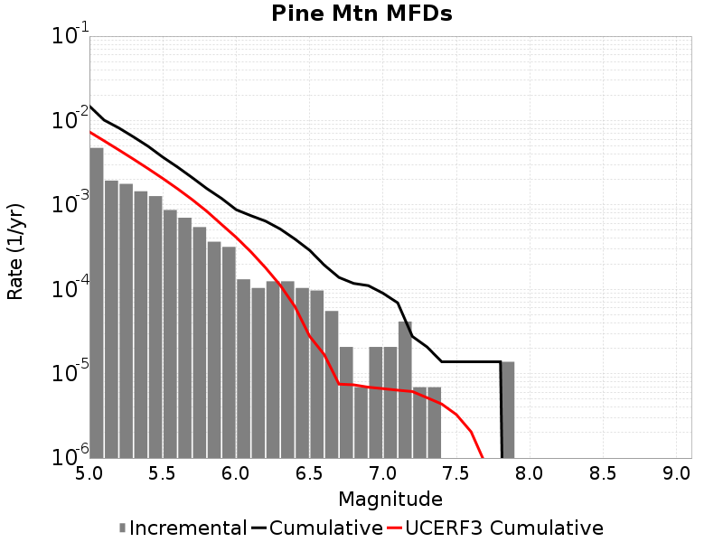

| Magnitude | Incremental Rate | Cumulative Rate | UCERF3 Cumulative Rate |
|-----|-----|-----|-----|
| 5.05 | 0.0047397795 | 0.01618849 | 0.0073394785 |
| 5.15 | 0.0019415133 | 0.01144871 | 0.0057508093 |
| 5.25 | 0.0017756901 | 0.009507197 | 0.0044888845 |
| 5.35 | 0.001450953 | 0.0077315066 | 0.0034865022 |
| 5.45 | 0.0012782204 | 0.0062805535 | 0.0026902815 |
| 5.55 | 8.7057176E-4 | 0.0050023333 | 0.002057821 |
| 5.65 | 7.047486E-4 | 0.0041317614 | 0.0015554397 |
| 5.75 | 5.5274396E-4 | 0.0034270128 | 0.001156384 |
| 5.85 | 4.007394E-4 | 0.0028742687 | 8.3940284E-4 |
| 5.95 | 4.0764868E-4 | 0.0024735294 | 5.8761577E-4 |
| 6.05 | 2.003697E-4 | 0.0020658807 | 4.1220605E-4 |
| 6.15 | 1.312767E-4 | 0.001865511 | 2.7802715E-4 |
| 6.25 | 1.450953E-4 | 0.0017342343 | 1.7978012E-4 |
| 6.35 | 1.3818599E-4 | 0.001589139 | 1.1163047E-4 |
| 6.45 | 1.174581E-4 | 0.001450953 | 6.239214E-5 |
| 6.55 | 1.036395E-4 | 0.0013334949 | 2.7776941E-5 |
| 6.65 | 6.21837E-5 | 0.0012298553 | 1.6793661E-5 |
| 6.75 | 2.76372E-5 | 0.0011676716 | 7.5150056E-6 |
| 6.85 | 1.38186E-5 | 0.0011400345 | 7.3751494E-6 |
| 6.95 | 6.9092996E-5 | 0.0011262159 | 6.9138678E-6 |
| 7.05 | 5.52744E-5 | 0.0010571228 | 6.6428133E-6 |
| 7.15 | 7.6002296E-5 | 0.0010018485 | 6.371693E-6 |
| 7.25 | 8.98209E-5 | 9.2584617E-4 | 6.1412948E-6 |
| 7.35 | 7.6002296E-5 | 8.360253E-4 | 5.1885777E-6 |
| 7.45 | 3.4546498E-5 | 7.60023E-4 | 4.3649065E-6 |
| 7.55 | 5.52744E-5 | 7.254765E-4 | 3.270472E-6 |
| 7.65 | 2.07279E-4 | 6.702021E-4 | 2.046706E-6 |
| 7.75 | 2.280069E-4 | 4.6292308E-4 | 8.278506E-7 |
| 7.85 | 1.243674E-4 | 2.349162E-4 | 3.253888E-7 |
| 7.95 | 1.036395E-4 | 1.105488E-4 | 0.0 |
| 8.05 | 6.9093E-6 | 6.9093E-6 | 0.0 |

### Pinto Mtn
*[(top)](#table-of-contents)*

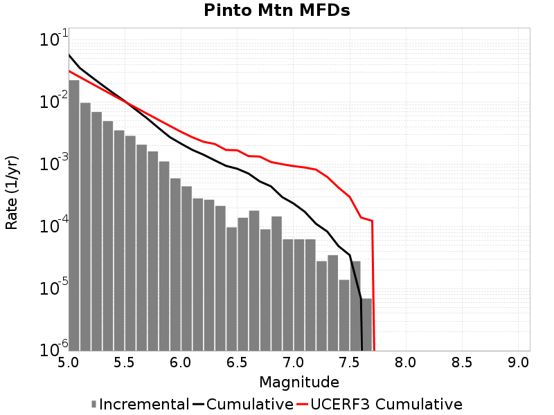

| Magnitude | Incremental Rate | Cumulative Rate | UCERF3 Cumulative Rate |
|-----|-----|-----|-----|
| 5.05 | 0.022621049 | 0.05982763 | 0.032028887 |
| 5.15 | 0.00976975 | 0.03720658 | 0.025473477 |
| 5.25 | 0.006957665 | 0.02743683 | 0.02026633 |
| 5.35 | 0.0049608774 | 0.020479165 | 0.016130146 |
| 5.45 | 0.003523743 | 0.015518287 | 0.012844658 |
| 5.55 | 0.0028742687 | 0.011994544 | 0.010234903 |
| 5.65 | 0.00207279 | 0.009120276 | 0.008161901 |
| 5.75 | 0.0016651413 | 0.007047486 | 0.0065152557 |
| 5.85 | 0.0012091275 | 0.0053823446 | 0.0052072797 |
| 5.95 | 6.771114E-4 | 0.0041732173 | 0.004168317 |
| 6.05 | 6.0801837E-4 | 0.0034961058 | 0.0033440953 |
| 6.15 | 3.731022E-4 | 0.0028880874 | 0.0027353985 |
| 6.25 | 3.661929E-4 | 0.0025149852 | 0.0023120986 |
| 6.35 | 3.3164638E-4 | 0.0021487924 | 0.002128166 |
| 6.45 | 3.385557E-4 | 0.0018171459 | 0.0017056961 |
| 6.55 | 2.418255E-4 | 0.0014785902 | 0.0016867145 |
| 6.65 | 2.970999E-4 | 0.0012367647 | 0.0013583394 |
| 6.75 | 1.589139E-4 | 9.396648E-4 | 0.0013352835 |
| 6.85 | 2.556441E-4 | 7.807509E-4 | 0.0010902552 |
| 6.95 | 1.174581E-4 | 5.251068E-4 | 0.0010053724 |
| 7.05 | 7.6002296E-5 | 4.0764868E-4 | 9.3889935E-4 |
| 7.15 | 1.105488E-4 | 3.3164638E-4 | 8.901711E-4 |
| 7.25 | 5.52744E-5 | 2.210976E-4 | 8.237651E-4 |
| 7.35 | 8.2911596E-5 | 1.6582319E-4 | 6.279549E-4 |
| 7.45 | 4.1455798E-5 | 8.2911596E-5 | 4.2298858E-4 |
| 7.55 | 2.76372E-5 | 4.1455798E-5 | 2.988441E-4 |
| 7.65 | 6.9093E-6 | 1.38186E-5 | 1.3943305E-4 |
| 7.75 | 6.9093E-6 | 6.9093E-6 | 1.2313492E-4 |

### Pisgah-Bullion Mtn-Mesquite Lk
*[(top)](#table-of-contents)*

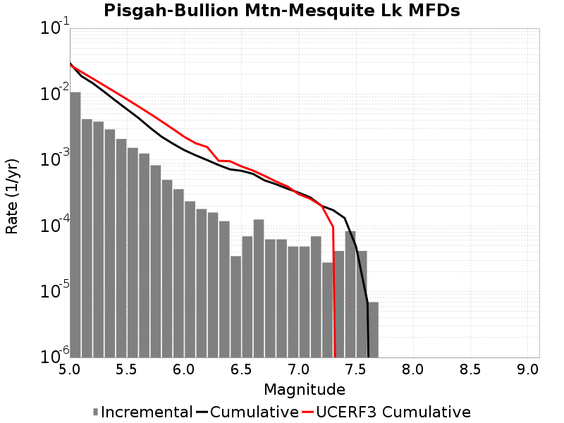

| Magnitude | Incremental Rate | Cumulative Rate | UCERF3 Cumulative Rate |
|-----|-----|-----|-----|
| 5.05 | 0.010688687 | 0.029848175 | 0.027635703 |
| 5.15 | 0.004166308 | 0.019159488 | 0.021829417 |
| 5.25 | 0.0038208428 | 0.0149931805 | 0.017217321 |
| 5.35 | 0.0029088152 | 0.011172338 | 0.013553802 |
| 5.45 | 0.0020796992 | 0.008263523 | 0.010643765 |
| 5.55 | 0.0015269553 | 0.0061838236 | 0.008332241 |
| 5.65 | 0.0012505833 | 0.004656868 | 0.006496132 |
| 5.75 | 8.360253E-4 | 0.0034062848 | 0.005037659 |
| 5.85 | 5.112882E-4 | 0.0025702596 | 0.0038791525 |
| 5.95 | 4.0764868E-4 | 0.0020589714 | 0.0029589182 |
| 6.05 | 2.832813E-4 | 0.0016513227 | 0.0022430215 |
| 6.15 | 1.796418E-4 | 0.0013680414 | 0.001790308 |
| 6.25 | 1.796418E-4 | 0.0011883996 | 0.0015693384 |
| 6.35 | 1.3818599E-4 | 0.0010087577 | 9.721034E-4 |
| 6.45 | 4.1455798E-5 | 8.7057176E-4 | 9.540894E-4 |
| 6.55 | 6.9092996E-5 | 8.29116E-4 | 7.967534E-4 |
| 6.65 | 1.727325E-4 | 7.60023E-4 | 6.904324E-4 |
| 6.75 | 8.98209E-5 | 5.872905E-4 | 5.73878E-4 |
| 6.85 | 8.2911596E-5 | 4.974696E-4 | 4.7118374E-4 |
| 6.95 | 6.21837E-5 | 4.14558E-4 | 3.9569725E-4 |
| 7.05 | 6.9092996E-5 | 3.523743E-4 | 3.0158987E-4 |
| 7.15 | 8.2911596E-5 | 2.832813E-4 | 2.5707445E-4 |
| 7.25 | 2.76372E-5 | 2.003697E-4 | 2.00928E-4 |
| 7.35 | 4.1455798E-5 | 1.727325E-4 | 9.574559E-5 |
| 7.45 | 8.2911596E-5 | 1.312767E-4 | 0.0 |
| 7.55 | 4.1455798E-5 | 4.83651E-5 | 0.0 |
| 7.65 | 6.9093E-6 | 6.9093E-6 | 0.0 |

### Pitas Point (Lower West)
*[(top)](#table-of-contents)*

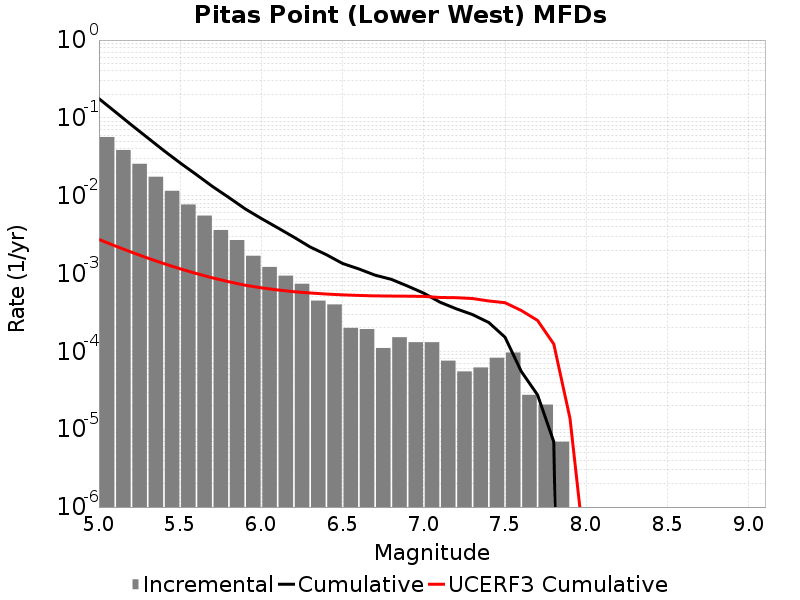

| Magnitude | Incremental Rate | Cumulative Rate | UCERF3 Cumulative Rate |
|-----|-----|-----|-----|
| 5.05 | 0.056801353 | 0.17834285 | 0.0027416747 |
| 5.15 | 0.03869208 | 0.12154149 | 0.002263256 |
| 5.25 | 0.025716415 | 0.08284941 | 0.0018832346 |
| 5.35 | 0.017549621 | 0.057133 | 0.0015813729 |
| 5.45 | 0.011600714 | 0.039583378 | 0.0013415957 |
| 5.55 | 0.007745325 | 0.027982665 | 0.0011511338 |
| 5.65 | 0.0056034424 | 0.02023734 | 9.998446E-4 |
| 5.75 | 0.0037241126 | 0.014633897 | 8.7967125E-4 |
| 5.85 | 0.0027360828 | 0.010909785 | 7.8421424E-4 |
| 5.95 | 0.0017411435 | 0.008173701 | 7.0838997E-4 |
| 6.05 | 0.0012505833 | 0.0064325584 | 6.55363E-4 |
| 6.15 | 0.0010156671 | 0.0051819747 | 6.158393E-4 |
| 6.25 | 7.876602E-4 | 0.004166308 | 5.844445E-4 |
| 6.35 | 5.181975E-4 | 0.0033786476 | 5.628021E-4 |
| 6.45 | 4.6292308E-4 | 0.0028604502 | 5.4561085E-4 |
| 6.55 | 2.487348E-4 | 0.002397527 | 5.3229893E-4 |
| 6.65 | 2.349162E-4 | 0.0021487924 | 5.2356155E-4 |
| 6.75 | 1.796418E-4 | 0.001913876 | 5.1662145E-4 |
| 6.85 | 2.141883E-4 | 0.0017342343 | 5.140216E-4 |
| 6.95 | 2.07279E-4 | 0.001520046 | 5.119565E-4 |
| 7.05 | 2.349162E-4 | 0.0013127669 | 5.0857285E-4 |
| 7.15 | 1.865511E-4 | 0.0010778508 | 4.928712E-4 |
| 7.25 | 1.450953E-4 | 8.912997E-4 | 4.8963266E-4 |
| 7.35 | 1.3818599E-4 | 7.462044E-4 | 4.7780562E-4 |
| 7.45 | 1.3818599E-4 | 6.0801837E-4 | 4.4435935E-4 |
| 7.55 | 2.280069E-4 | 4.698324E-4 | 4.2228508E-4 |
| 7.65 | 1.5200459E-4 | 2.418255E-4 | 3.3533797E-4 |
| 7.75 | 7.6002296E-5 | 8.98209E-5 | 2.5009664E-4 |
| 7.85 | 1.38186E-5 | 1.38186E-5 | 1.244075E-4 |
| 7.95 | 0.0 | 0.0 | 1.372888E-5 |
| 8.05 | 0.0 | 0.0 | 1.7977221E-7 |

### Pitas Point (Lower)-Montalvo
*[(top)](#table-of-contents)*

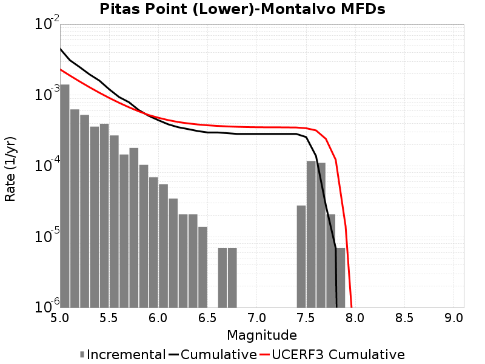

| Magnitude | Incremental Rate | Cumulative Rate | UCERF3 Cumulative Rate |
|-----|-----|-----|-----|
| 5.05 | 0.0014094972 | 0.0048296005 | 0.0023130982 |
| 5.15 | 6.287463E-4 | 0.0034201033 | 0.0018920639 |
| 5.25 | 5.251068E-4 | 0.0027913572 | 0.0015576245 |
| 5.35 | 3.592836E-4 | 0.0022662503 | 0.0012919698 |
| 5.45 | 3.938301E-4 | 0.0019069668 | 0.0010809528 |
| 5.55 | 2.694627E-4 | 0.0015131367 | 9.1333606E-4 |
| 5.65 | 1.5200459E-4 | 0.001243674 | 7.801933E-4 |
| 5.75 | 1.796418E-4 | 0.0010916694 | 6.744343E-4 |
| 5.85 | 1.036395E-4 | 9.120276E-4 | 5.904269E-4 |
| 5.95 | 7.6002296E-5 | 8.083881E-4 | 5.2369747E-4 |
| 6.05 | 6.21837E-5 | 7.323858E-4 | 4.7855772E-4 |
| 6.15 | 7.6002296E-5 | 6.702021E-4 | 4.4355038E-4 |
| 6.25 | 2.76372E-5 | 5.941998E-4 | 4.1711595E-4 |
| 6.35 | 5.52744E-5 | 5.665626E-4 | 3.9897143E-4 |
| 6.45 | 1.38186E-5 | 5.112882E-4 | 3.8513623E-4 |
| 6.55 | 0.0 | 4.974696E-4 | 3.749045E-4 |
| 6.65 | 1.38186E-5 | 4.974696E-4 | 3.67434E-4 |
| 6.75 | 6.9093E-6 | 4.83651E-4 | 3.6152377E-4 |
| 6.85 | 0.0 | 4.767417E-4 | 3.571725E-4 |
| 6.95 | 6.9093E-6 | 4.767417E-4 | 3.5371617E-4 |
| 7.05 | 2.76372E-5 | 4.698324E-4 | 3.5212788E-4 |
| 7.15 | 2.0727899E-5 | 4.421952E-4 | 3.512868E-4 |
| 7.25 | 2.76372E-5 | 4.214673E-4 | 3.5117118E-4 |
| 7.35 | 5.52744E-5 | 3.938301E-4 | 3.5016215E-4 |
| 7.45 | 4.1455798E-5 | 3.385557E-4 | 3.4917408E-4 |
| 7.55 | 1.243674E-4 | 2.970999E-4 | 3.4096293E-4 |
| 7.65 | 1.243674E-4 | 1.727325E-4 | 3.1757864E-4 |
| 7.75 | 3.4546498E-5 | 4.83651E-5 | 2.4123999E-4 |
| 7.85 | 1.38186E-5 | 1.38186E-5 | 1.221846E-4 |
| 7.95 | 0.0 | 0.0 | 1.4210142E-5 |
| 8.05 | 0.0 | 0.0 | 1.7977221E-7 |

### Pittville 2011 CFM
*[(top)](#table-of-contents)*

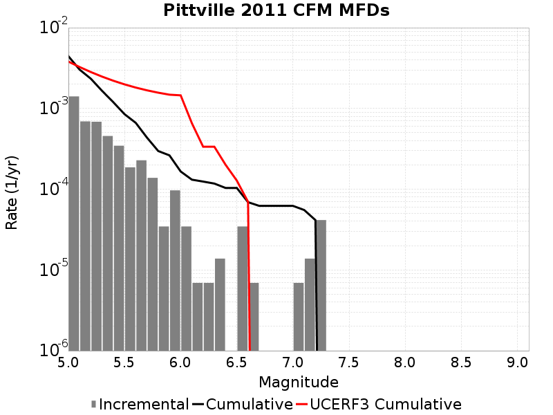

| Magnitude | Incremental Rate | Cumulative Rate | UCERF3 Cumulative Rate |
|-----|-----|-----|-----|
| 5.05 | 0.0014094972 | 0.0044357707 | 0.0038060932 |
| 5.15 | 6.9093E-4 | 0.0030262733 | 0.0032591035 |
| 5.25 | 6.840207E-4 | 0.0023353433 | 0.0028246138 |
| 5.35 | 4.560138E-4 | 0.0016513227 | 0.0024794866 |
| 5.45 | 3.45465E-4 | 0.0011953089 | 0.0022053423 |
| 5.55 | 1.865511E-4 | 8.498439E-4 | 0.0019875818 |
| 5.65 | 2.280069E-4 | 6.6329277E-4 | 0.0018146083 |
| 5.75 | 1.3818599E-4 | 4.3528588E-4 | 0.0016772107 |
| 5.85 | 3.4546498E-5 | 2.970999E-4 | 0.0015680719 |
| 5.95 | 9.67302E-5 | 2.625534E-4 | 0.0014813798 |
| 6.05 | 3.4546498E-5 | 1.6582319E-4 | 0.001453835 |
| 6.15 | 6.9093E-6 | 1.312767E-4 | 6.555532E-4 |
| 6.25 | 6.9093E-6 | 1.243674E-4 | 3.3574458E-4 |
| 6.35 | 1.38186E-5 | 1.174581E-4 | 3.3574458E-4 |
| 6.45 | 0.0 | 1.036395E-4 | 2.005564E-4 |
| 6.55 | 3.4546498E-5 | 1.036395E-4 | 1.2787117E-4 |
| 6.65 | 6.9093E-6 | 6.9092996E-5 | 6.9805355E-5 |
| 6.75 | 0.0 | 6.21837E-5 | 0.0 |
| 6.85 | 0.0 | 6.21837E-5 | 0.0 |
| 6.95 | 0.0 | 6.21837E-5 | 0.0 |
| 7.05 | 6.9093E-6 | 6.21837E-5 | 0.0 |
| 7.15 | 1.38186E-5 | 5.52744E-5 | 0.0 |
| 7.25 | 4.1455798E-5 | 4.1455798E-5 | 0.0 |

### Pleito
*[(top)](#table-of-contents)*

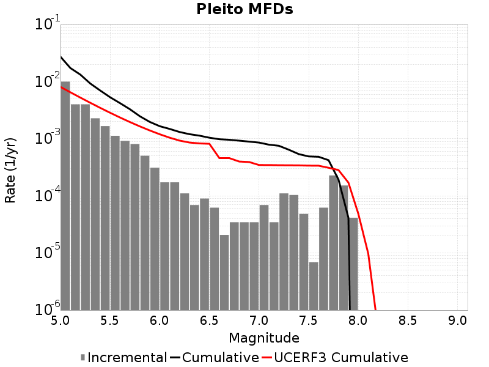

| Magnitude | Incremental Rate | Cumulative Rate | UCERF3 Cumulative Rate |
|-----|-----|-----|-----|
| 5.05 | 0.009997757 | 0.032791536 | 0.008077481 |
| 5.15 | 0.0040004845 | 0.022793781 | 0.0065054195 |
| 5.25 | 0.0040004845 | 0.018793296 | 0.005256687 |
| 5.35 | 0.002280069 | 0.014792811 | 0.004264783 |
| 5.45 | 0.0016651413 | 0.012512743 | 0.0034768863 |
| 5.55 | 0.0011262159 | 0.010847601 | 0.0028510373 |
| 5.65 | 9.1893686E-4 | 0.009721385 | 0.002353908 |
| 5.75 | 8.1529736E-4 | 0.008802448 | 0.001959024 |
| 5.85 | 5.320161E-4 | 0.007987151 | 0.0016453565 |
| 5.95 | 3.869208E-4 | 0.0074551348 | 0.0013962017 |
| 6.05 | 2.349162E-4 | 0.007068214 | 0.0011987878 |
| 6.15 | 2.556441E-4 | 0.0068332977 | 0.0010433755 |
| 6.25 | 1.589139E-4 | 0.0065776533 | 9.280851E-4 |
| 6.35 | 1.3818599E-4 | 0.0064187394 | 8.5848756E-4 |
| 6.45 | 1.243674E-4 | 0.0062805535 | 8.288144E-4 |
| 6.55 | 1.174581E-4 | 0.006156186 | 8.1611087E-4 |
| 6.65 | 5.52744E-5 | 0.006038728 | 4.5880175E-4 |
| 6.75 | 1.312767E-4 | 0.0059834537 | 4.5877E-4 |
| 6.85 | 1.5200459E-4 | 0.005852177 | 3.9943005E-4 |
| 6.95 | 1.105488E-4 | 0.0057001724 | 3.916214E-4 |
| 7.05 | 1.934604E-4 | 0.0055896235 | 3.4702086E-4 |
| 7.15 | 4.83651E-4 | 0.005396163 | 3.4662735E-4 |
| 7.25 | 9.396648E-4 | 0.0049125124 | 3.442337E-4 |
| 7.35 | 4.007394E-4 | 0.0039728475 | 3.430819E-4 |
| 7.45 | 2.07279E-4 | 0.003572108 | 3.4191232E-4 |
| 7.55 | 1.865511E-4 | 0.003364829 | 3.3864848E-4 |
| 7.65 | 8.498439E-4 | 0.003178278 | 3.374851E-4 |
| 7.75 | 0.0015269553 | 0.002328434 | 3.1069727E-4 |
| 7.85 | 5.458347E-4 | 8.014788E-4 | 2.8333737E-4 |
| 7.95 | 2.210976E-4 | 2.556441E-4 | 1.7080526E-4 |
| 8.05 | 2.76372E-5 | 3.4546498E-5 | 4.845756E-5 |
| 8.15 | 6.9093E-6 | 6.9093E-6 | 9.7040365E-6 |
| 8.25 | 0.0 | 0.0 | 4.3553504E-7 |

### Point Reyes 2011 CFM
*[(top)](#table-of-contents)*

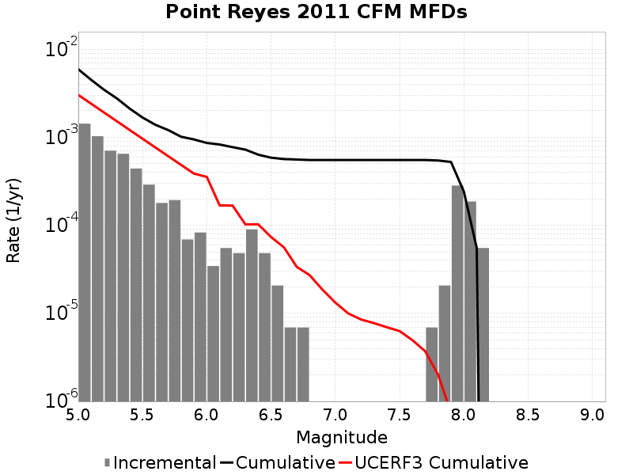

| Magnitude | Incremental Rate | Cumulative Rate | UCERF3 Cumulative Rate |
|-----|-----|-----|-----|
| 5.05 | 0.0014302251 | 0.00769696 | 0.003033421 |
| 5.15 | 0.0010294857 | 0.006266735 | 0.0024108521 |
| 5.25 | 7.047486E-4 | 0.005237249 | 0.0019163281 |
| 5.35 | 6.494742E-4 | 0.0045325006 | 0.0015235137 |
| 5.45 | 4.421952E-4 | 0.0038830265 | 0.0012114901 |
| 5.55 | 2.970999E-4 | 0.0034408313 | 9.6364104E-4 |
| 5.65 | 1.934604E-4 | 0.0031437315 | 7.667675E-4 |
| 5.75 | 2.141883E-4 | 0.0029502711 | 6.103852E-4 |
| 5.85 | 6.9092996E-5 | 0.0027360828 | 4.8616642E-4 |
| 5.95 | 9.67302E-5 | 0.0026669898 | 3.874959E-4 |
| 6.05 | 4.1455798E-5 | 0.0025702596 | 3.5530774E-4 |
| 6.15 | 6.21837E-5 | 0.0025288037 | 1.6844692E-4 |
| 6.25 | 5.52744E-5 | 0.0024666202 | 1.6809464E-4 |
| 6.35 | 9.67302E-5 | 0.0024113457 | 1.0267773E-4 |
| 6.45 | 4.83651E-5 | 0.0023146155 | 1.0267773E-4 |
| 6.55 | 2.0727899E-5 | 0.0022662503 | 7.369223E-5 |
| 6.65 | 6.9093E-6 | 0.0022455226 | 5.6290977E-5 |
| 6.75 | 1.38186E-5 | 0.002238613 | 3.3754124E-5 |
| 6.85 | 0.0 | 0.0022247946 | 2.7177768E-5 |
| 6.95 | 0.0 | 0.0022247946 | 1.8604573E-5 |
| 7.05 | 0.0 | 0.0022247946 | 1.3271455E-5 |
| 7.15 | 0.0 | 0.0022247946 | 9.996385E-6 |
| 7.25 | 0.0 | 0.0022247946 | 8.530007E-6 |
| 7.35 | 0.0 | 0.0022247946 | 7.759755E-6 |
| 7.45 | 0.0 | 0.0022247946 | 6.964284E-6 |
| 7.55 | 0.0 | 0.0022247946 | 6.2989043E-6 |
| 7.65 | 0.0 | 0.0022247946 | 4.963262E-6 |
| 7.75 | 6.9093E-6 | 0.0022247946 | 3.7043014E-6 |
| 7.85 | 1.450953E-4 | 0.0022178853 | 2.0037844E-6 |
| 7.95 | 0.0012160367 | 0.00207279 | 7.4069214E-7 |
| 8.05 | 7.392951E-4 | 8.567532E-4 | 3.3732383E-7 |
| 8.15 | 1.174581E-4 | 1.174581E-4 | 1.3345453E-7 |

### Point Reyes 2011 connector
*[(top)](#table-of-contents)*

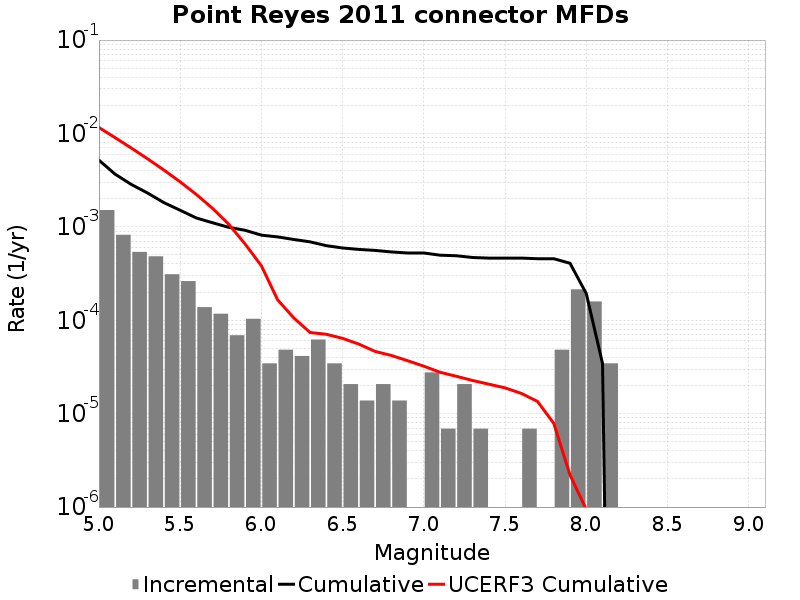

| Magnitude | Incremental Rate | Cumulative Rate | UCERF3 Cumulative Rate |
|-----|-----|-----|-----|
| 5.05 | 0.0015131367 | 0.0075933207 | 0.011581 |
| 5.15 | 8.2220667E-4 | 0.006080184 | 0.009010057 |
| 5.25 | 5.389254E-4 | 0.005257977 | 0.006967885 |
| 5.35 | 4.83651E-4 | 0.004719052 | 0.00534573 |
| 5.45 | 3.109185E-4 | 0.004235401 | 0.0040572067 |
| 5.55 | 2.694627E-4 | 0.0039244825 | 0.0030336962 |
| 5.65 | 2.003697E-4 | 0.0036550197 | 0.0022206928 |
| 5.75 | 2.280069E-4 | 0.00345465 | 0.0015749013 |
| 5.85 | 1.3818599E-4 | 0.003226643 | 0.0010619309 |
| 5.95 | 1.589139E-4 | 0.003088457 | 6.5446395E-4 |
| 6.05 | 8.2911596E-5 | 0.0029295431 | 3.827783E-4 |
| 6.15 | 8.2911596E-5 | 0.0028466315 | 1.6548306E-4 |
| 6.25 | 9.67302E-5 | 0.00276372 | 1.05659616E-4 |
| 6.35 | 1.450953E-4 | 0.0026669898 | 7.3962954E-5 |
| 6.45 | 6.9092996E-5 | 0.0025218944 | 7.076305E-5 |
| 6.55 | 6.21837E-5 | 0.0024528014 | 6.401447E-5 |
| 6.65 | 4.1455798E-5 | 0.0023906177 | 5.557577E-5 |
| 6.75 | 3.4546498E-5 | 0.002349162 | 4.6394533E-5 |
| 6.85 | 4.83651E-5 | 0.0023146155 | 4.200414E-5 |
| 6.95 | 7.6002296E-5 | 0.0022662503 | 3.689292E-5 |
| 7.05 | 9.67302E-5 | 0.002190248 | 3.2250264E-5 |
| 7.15 | 1.5200459E-4 | 0.002093518 | 2.7747192E-5 |
| 7.25 | 8.2911596E-5 | 0.0019415133 | 2.5129804E-5 |
| 7.35 | 6.21837E-5 | 0.0018586017 | 2.2672364E-5 |
| 7.45 | 2.76372E-5 | 0.001796418 | 2.0690879E-5 |
| 7.55 | 6.9093E-6 | 0.0017687808 | 1.8896151E-5 |
| 7.65 | 2.0727899E-5 | 0.0017618715 | 1.6488639E-5 |
| 7.75 | 0.0 | 0.0017411435 | 1.3515038E-5 |
| 7.85 | 1.174581E-4 | 0.0017411435 | 7.869425E-6 |
| 7.95 | 9.811206E-4 | 0.0016236855 | 2.207548E-6 |
| 8.05 | 5.389254E-4 | 6.425649E-4 | 9.421604E-7 |
| 8.15 | 1.036395E-4 | 1.036395E-4 | 3.3775845E-7 |

### Polaris 2011 CFM
*[(top)](#table-of-contents)*

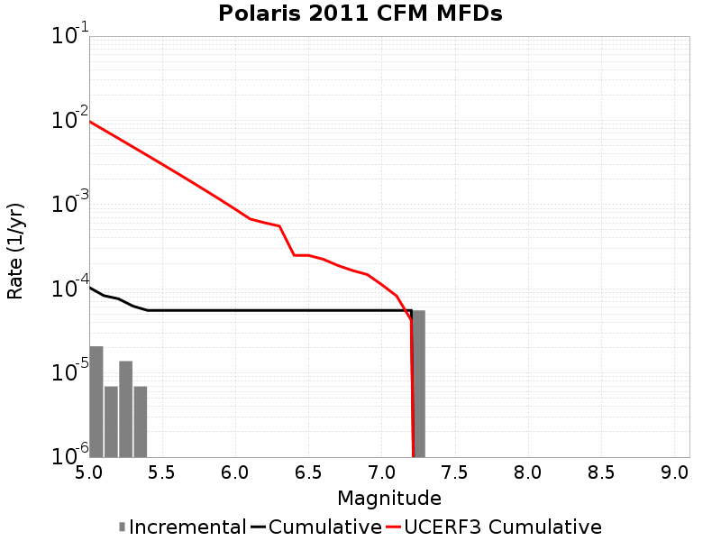

| Magnitude | Incremental Rate | Cumulative Rate | UCERF3 Cumulative Rate |
|-----|-----|-----|-----|
| 5.05 | 2.0727899E-5 | 1.036395E-4 | 0.009729172 |
| 5.15 | 6.9093E-6 | 8.2911596E-5 | 0.007705809 |
| 5.25 | 1.38186E-5 | 7.6002296E-5 | 0.0060985945 |
| 5.35 | 6.9093E-6 | 6.21837E-5 | 0.0048219385 |
| 5.45 | 0.0 | 5.52744E-5 | 0.0038078546 |
| 5.55 | 0.0 | 5.52744E-5 | 0.0030023393 |
| 5.65 | 0.0 | 5.52744E-5 | 0.0023624958 |
| 5.75 | 0.0 | 5.52744E-5 | 0.0018542497 |
| 5.85 | 0.0 | 5.52744E-5 | 0.0014505357 |
| 5.95 | 0.0 | 5.52744E-5 | 0.0011298542 |
| 6.05 | 0.0 | 5.52744E-5 | 8.7512797E-4 |
| 6.15 | 0.0 | 5.52744E-5 | 6.727916E-4 |
| 6.25 | 0.0 | 5.52744E-5 | 6.068011E-4 |
| 6.35 | 0.0 | 5.52744E-5 | 5.5438303E-4 |
| 6.45 | 0.0 | 5.52744E-5 | 2.4948263E-4 |
| 6.55 | 0.0 | 5.52744E-5 | 2.4891397E-4 |
| 6.65 | 0.0 | 5.52744E-5 | 2.2382176E-4 |
| 6.75 | 0.0 | 5.52744E-5 | 1.8868965E-4 |
| 6.85 | 0.0 | 5.52744E-5 | 1.6460576E-4 |
| 6.95 | 0.0 | 5.52744E-5 | 1.4739601E-4 |
| 7.05 | 0.0 | 5.52744E-5 | 1.11399655E-4 |
| 7.15 | 0.0 | 5.52744E-5 | 8.2154154E-5 |
| 7.25 | 5.52744E-5 | 5.52744E-5 | 4.2299707E-5 |

### Quien Sabe 2011 CFM
*[(top)](#table-of-contents)*

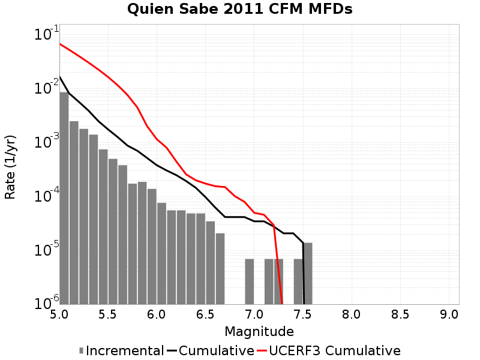

| Magnitude | Incremental Rate | Cumulative Rate | UCERF3 Cumulative Rate |
|-----|-----|-----|-----|
| 5.05 | 0.008608988 | 0.016858691 | 0.06836732 |
| 5.15 | 0.0024942572 | 0.008249704 | 0.052755944 |
| 5.25 | 0.001796418 | 0.005755447 | 0.040357232 |
| 5.35 | 0.0014025879 | 0.003959029 | 0.030505773 |
| 5.45 | 7.462044E-4 | 0.002556441 | 0.022680284 |
| 5.55 | 4.974696E-4 | 0.0018102366 | 0.016464712 |
| 5.65 | 3.800115E-4 | 0.0013127669 | 0.011528696 |
| 5.75 | 1.727325E-4 | 9.327555E-4 | 0.007607879 |
| 5.85 | 1.865511E-4 | 7.60023E-4 | 0.0044934633 |
| 5.95 | 1.450953E-4 | 5.734719E-4 | 0.0020195951 |
| 6.05 | 7.6002296E-5 | 4.283766E-4 | 0.0011523792 |
| 6.15 | 6.21837E-5 | 3.523743E-4 | 8.049908E-4 |
| 6.25 | 6.21837E-5 | 2.901906E-4 | 4.465466E-4 |
| 6.35 | 4.83651E-5 | 2.280069E-4 | 2.5746663E-4 |
| 6.45 | 5.52744E-5 | 1.796418E-4 | 1.995971E-4 |
| 6.55 | 3.4546498E-5 | 1.243674E-4 | 1.7320471E-4 |
| 6.65 | 2.0727899E-5 | 8.98209E-5 | 1.5520108E-4 |
| 6.75 | 0.0 | 6.9092996E-5 | 1.4932903E-4 |
| 6.85 | 0.0 | 6.9092996E-5 | 1.0135486E-4 |
| 6.95 | 6.9093E-6 | 6.9092996E-5 | 7.932166E-5 |
| 7.05 | 0.0 | 6.21837E-5 | 4.9735587E-5 |
| 7.15 | 6.9093E-6 | 6.21837E-5 | 4.5720346E-5 |
| 7.25 | 1.38186E-5 | 5.52744E-5 | 2.9234152E-5 |
| 7.35 | 0.0 | 4.1455798E-5 | 5.5890257E-7 |
| 7.45 | 1.38186E-5 | 4.1455798E-5 | 2.89003E-7 |
| 7.55 | 2.0727899E-5 | 2.76372E-5 | 2.9461239E-8 |
| 7.65 | 6.9093E-6 | 6.9093E-6 | 0.0 |

### Raymond
*[(top)](#table-of-contents)*

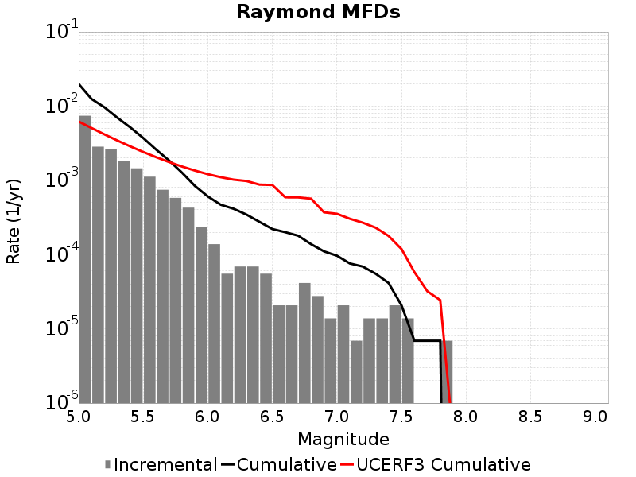

| Magnitude | Incremental Rate | Cumulative Rate | UCERF3 Cumulative Rate |
|-----|-----|-----|-----|
| 5.05 | 0.0074067693 | 0.021688292 | 0.006208632 |
| 5.15 | 0.0028397222 | 0.0142815225 | 0.005066617 |
| 5.25 | 0.0026600806 | 0.011441801 | 0.004159482 |
| 5.35 | 0.0018033272 | 0.00878172 | 0.003438919 |
| 5.45 | 0.001450953 | 0.006978393 | 0.0028665555 |
| 5.55 | 0.0011193065 | 0.00552744 | 0.002411911 |
| 5.65 | 7.462044E-4 | 0.004408133 | 0.0020507742 |
| 5.75 | 5.941998E-4 | 0.003661929 | 0.0017639127 |
| 5.85 | 4.83651E-4 | 0.003067729 | 0.0015360508 |
| 5.95 | 4.0764868E-4 | 0.002584078 | 0.0013550535 |
| 6.05 | 2.832813E-4 | 0.0021764294 | 0.0012112823 |
| 6.15 | 1.865511E-4 | 0.0018931482 | 0.0011023454 |
| 6.25 | 1.6582319E-4 | 0.001706597 | 0.0010217908 |
| 6.35 | 2.7637198E-4 | 0.0015407739 | 9.793374E-4 |
| 6.45 | 2.349162E-4 | 0.0012644018 | 8.763063E-4 |
| 6.55 | 1.105488E-4 | 0.0010294857 | 8.6621766E-4 |
| 6.65 | 1.5200459E-4 | 9.1893686E-4 | 5.9142814E-4 |
| 6.75 | 1.312767E-4 | 7.6693227E-4 | 5.8975996E-4 |
| 6.85 | 1.312767E-4 | 6.356556E-4 | 5.6678033E-4 |
| 6.95 | 1.312767E-4 | 5.0437887E-4 | 3.7111342E-4 |
| 7.05 | 6.21837E-5 | 3.731022E-4 | 3.54598E-4 |
| 7.15 | 6.21837E-5 | 3.109185E-4 | 3.040068E-4 |
| 7.25 | 4.83651E-5 | 2.487348E-4 | 2.6941142E-4 |
| 7.35 | 8.2911596E-5 | 2.003697E-4 | 2.3037633E-4 |
| 7.45 | 5.52744E-5 | 1.174581E-4 | 1.7831617E-4 |
| 7.55 | 1.38186E-5 | 6.21837E-5 | 1.1900291E-4 |
| 7.65 | 2.0727899E-5 | 4.83651E-5 | 5.8157122E-5 |
| 7.75 | 1.38186E-5 | 2.76372E-5 | 3.210824E-5 |
| 7.85 | 6.9093E-6 | 1.38186E-5 | 2.4377865E-5 |
| 7.95 | 0.0 | 6.9093E-6 | 3.3852191E-7 |
| 8.05 | 6.9093E-6 | 6.9093E-6 | 0.0 |

### Red Mountain
*[(top)](#table-of-contents)*

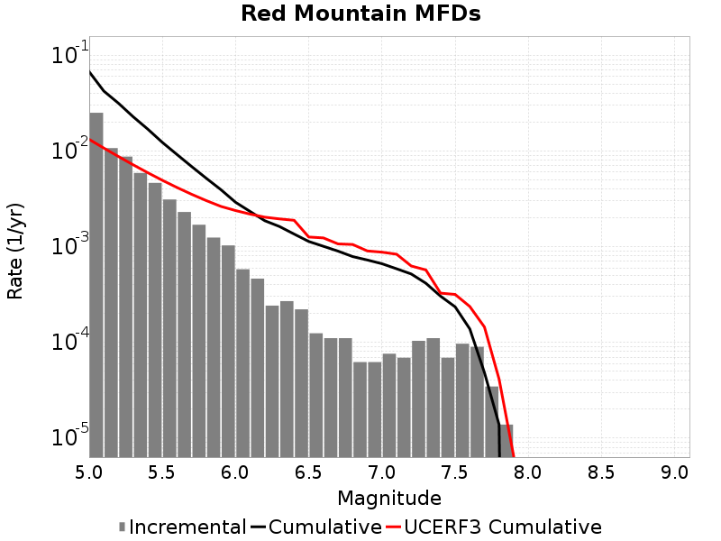

| Magnitude | Incremental Rate | Cumulative Rate | UCERF3 Cumulative Rate |
|-----|-----|-----|-----|
| 5.05 | 0.025039302 | 0.0684988 | 0.013210555 |
| 5.15 | 0.010702506 | 0.043459497 | 0.010721996 |
| 5.25 | 0.008726446 | 0.03275699 | 0.008745264 |
| 5.35 | 0.0058867233 | 0.024030546 | 0.0071750907 |
| 5.45 | 0.0046430496 | 0.018143822 | 0.005927857 |
| 5.55 | 0.003178278 | 0.013500772 | 0.004937144 |
| 5.65 | 0.0023146155 | 0.010322494 | 0.004150193 |
| 5.75 | 0.0017756901 | 0.008007878 | 0.0035250955 |
| 5.85 | 0.0013058577 | 0.0062321885 | 0.0030285628 |
| 5.95 | 0.0010709414 | 0.004926331 | 0.002634153 |
| 6.05 | 6.21837E-4 | 0.0038553893 | 0.0023838452 |
| 6.15 | 5.181975E-4 | 0.0032335524 | 0.0021871936 |
| 6.25 | 2.625534E-4 | 0.0027153548 | 0.0020324297 |
| 6.35 | 2.970999E-4 | 0.0024528014 | 0.0019502727 |
| 6.45 | 2.694627E-4 | 0.0021557016 | 0.0018856197 |
| 6.55 | 2.003697E-4 | 0.0018862389 | 0.0012609035 |
| 6.65 | 1.727325E-4 | 0.0016858692 | 0.001234275 |
| 6.75 | 1.5200459E-4 | 0.0015131367 | 0.0010686208 |
| 6.85 | 1.450953E-4 | 0.0013611321 | 0.0010539717 |
| 6.95 | 1.105488E-4 | 0.0012160367 | 9.0211205E-4 |
| 7.05 | 1.312767E-4 | 0.0011054879 | 8.760516E-4 |
| 7.15 | 9.67302E-5 | 9.7421126E-4 | 8.336574E-4 |
| 7.25 | 1.243674E-4 | 8.7748107E-4 | 6.282092E-4 |
| 7.35 | 1.3818599E-4 | 7.531137E-4 | 5.7117455E-4 |
| 7.45 | 9.67302E-5 | 6.149277E-4 | 3.268813E-4 |
| 7.55 | 2.003697E-4 | 5.181975E-4 | 3.1681862E-4 |
| 7.65 | 1.5200459E-4 | 3.178278E-4 | 2.369533E-4 |
| 7.75 | 8.98209E-5 | 1.6582319E-4 | 1.4461765E-4 |
| 7.85 | 7.6002296E-5 | 7.6002296E-5 | 4.134483E-5 |
| 7.95 | 0.0 | 0.0 | 6.4360856E-6 |

### Red Pass
*[(top)](#table-of-contents)*

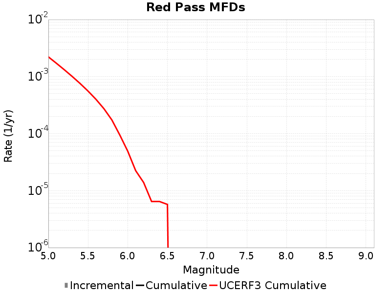

| Magnitude | Incremental Rate | Cumulative Rate | UCERF3 Cumulative Rate |
|-----|-----|-----|-----|
| 5.05 | 0.0 | 0.0 | 0.00221673 |
| 5.15 | 0.0 | 0.0 | 0.0017173444 |
| 5.25 | 0.0 | 0.0 | 0.0013206684 |
| 5.35 | 0.0 | 0.0 | 0.0010055775 |
| 5.45 | 0.0 | 0.0 | 7.5529184E-4 |
| 5.55 | 0.0 | 0.0 | 5.564829E-4 |
| 5.65 | 0.0 | 0.0 | 3.9856334E-4 |
| 5.75 | 0.0 | 0.0 | 2.7312335E-4 |
| 5.85 | 0.0 | 0.0 | 1.7348285E-4 |
| 5.95 | 0.0 | 0.0 | 9.4335584E-5 |
| 6.05 | 0.0 | 0.0 | 4.9051112E-5 |
| 6.15 | 0.0 | 0.0 | 2.2346821E-5 |
| 6.25 | 0.0 | 0.0 | 1.387647E-5 |
| 6.35 | 0.0 | 0.0 | 6.438205E-6 |
| 6.45 | 0.0 | 0.0 | 6.438205E-6 |
| 6.55 | 0.0 | 0.0 | 5.718807E-6 |

### Redondo Canyon alt 1
*[(top)](#table-of-contents)*

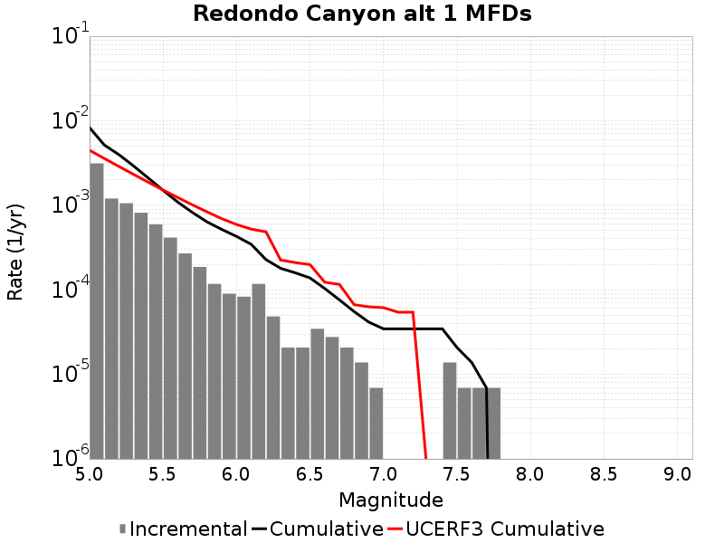

| Magnitude | Incremental Rate | Cumulative Rate | UCERF3 Cumulative Rate |
|-----|-----|-----|-----|
| 5.05 | 0.0031299128 | 0.008436255 | 0.004478427 |
| 5.15 | 0.0012022182 | 0.005306342 | 0.0035878872 |
| 5.25 | 0.0010571228 | 0.004104124 | 0.0028805062 |
| 5.35 | 8.1529736E-4 | 0.0030470013 | 0.0023186135 |
| 5.45 | 5.941998E-4 | 0.0022317038 | 0.0018722862 |
| 5.55 | 4.14558E-4 | 0.0016375041 | 0.0015177558 |
| 5.65 | 2.694627E-4 | 0.0012229461 | 0.0012361424 |
| 5.75 | 1.865511E-4 | 9.534834E-4 | 0.0010124488 |
| 5.85 | 1.312767E-4 | 7.6693227E-4 | 8.3476276E-4 |
| 5.95 | 8.98209E-5 | 6.356556E-4 | 6.936217E-4 |
| 6.05 | 8.2911596E-5 | 5.458347E-4 | 5.926857E-4 |
| 6.15 | 1.312767E-4 | 4.6292308E-4 | 5.230673E-4 |
| 6.25 | 5.52744E-5 | 3.3164638E-4 | 4.8579194E-4 |
| 6.35 | 3.4546498E-5 | 2.7637198E-4 | 2.2515068E-4 |
| 6.45 | 2.0727899E-5 | 2.418255E-4 | 2.1004488E-4 |
| 6.55 | 3.4546498E-5 | 2.210976E-4 | 1.986167E-4 |
| 6.65 | 3.4546498E-5 | 1.865511E-4 | 1.2307636E-4 |
| 6.75 | 3.4546498E-5 | 1.5200459E-4 | 1.1586567E-4 |
| 6.85 | 1.38186E-5 | 1.174581E-4 | 6.6667075E-5 |
| 6.95 | 1.38186E-5 | 1.036395E-4 | 6.298564E-5 |
| 7.05 | 6.9093E-6 | 8.98209E-5 | 6.150693E-5 |
| 7.15 | 6.9093E-6 | 8.2911596E-5 | 5.431682E-5 |
| 7.25 | 0.0 | 7.6002296E-5 | 5.431682E-5 |
| 7.35 | 0.0 | 7.6002296E-5 | 6.0391363E-7 |
| 7.45 | 2.0727899E-5 | 7.6002296E-5 | 3.9331502E-7 |
| 7.55 | 3.4546498E-5 | 5.52744E-5 | 2.251511E-7 |
| 7.65 | 1.38186E-5 | 2.0727899E-5 | 1.2138452E-7 |
| 7.75 | 6.9093E-6 | 6.9093E-6 | 1.8265375E-8 |
| 7.85 | 0.0 | 0.0 | 1.8265375E-8 |

### Reliz 2011 CFM
*[(top)](#table-of-contents)*

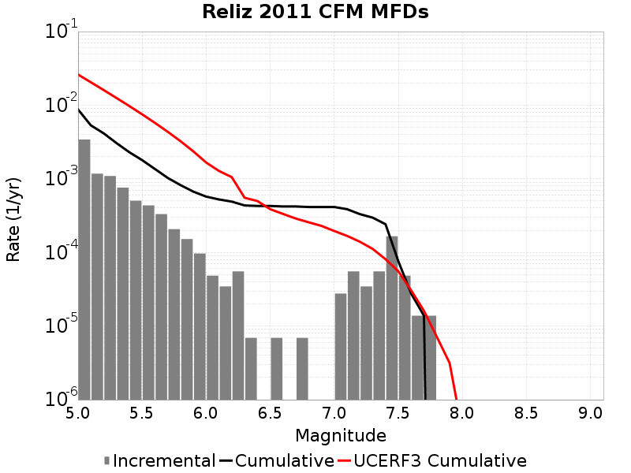

| Magnitude | Incremental Rate | Cumulative Rate | UCERF3 Cumulative Rate |
|-----|-----|-----|-----|
| 5.05 | 0.0034201033 | 0.009880299 | 0.02607848 |
| 5.15 | 0.001174581 | 0.0064601954 | 0.020497508 |
| 5.25 | 0.0010916694 | 0.0052856146 | 0.016064387 |
| 5.35 | 7.60023E-4 | 0.004193945 | 0.012543032 |
| 5.45 | 5.0437887E-4 | 0.003433922 | 0.009745921 |
| 5.55 | 4.3528588E-4 | 0.0029295431 | 0.007524097 |
| 5.65 | 3.800115E-4 | 0.0024942572 | 0.005759239 |
| 5.75 | 3.247371E-4 | 0.0021142457 | 0.004357363 |
| 5.85 | 3.731022E-4 | 0.0017895086 | 0.003243813 |
| 5.95 | 2.556441E-4 | 0.0014164065 | 0.0023592887 |
| 6.05 | 1.105488E-4 | 0.0011607624 | 0.0016671116 |
| 6.15 | 9.67302E-5 | 0.0010502136 | 0.0012801468 |
| 6.25 | 8.2911596E-5 | 9.534834E-4 | 0.0010541759 |
| 6.35 | 4.83651E-5 | 8.7057176E-4 | 5.5362325E-4 |
| 6.45 | 1.38186E-5 | 8.2220667E-4 | 4.9970037E-4 |
| 6.55 | 1.38186E-5 | 8.083881E-4 | 3.8710906E-4 |
| 6.65 | 2.0727899E-5 | 7.945695E-4 | 3.336842E-4 |
| 6.75 | 4.83651E-5 | 7.738416E-4 | 2.8865147E-4 |
| 6.85 | 6.9093E-6 | 7.254765E-4 | 2.5693898E-4 |
| 6.95 | 2.0727899E-5 | 7.185672E-4 | 2.295991E-4 |
| 7.05 | 5.52744E-5 | 6.978393E-4 | 1.9567927E-4 |
| 7.15 | 7.6002296E-5 | 6.425649E-4 | 1.6796862E-4 |
| 7.25 | 8.2911596E-5 | 5.665626E-4 | 1.3984006E-4 |
| 7.35 | 1.036395E-4 | 4.83651E-4 | 1.11703535E-4 |
| 7.45 | 2.349162E-4 | 3.800115E-4 | 8.1063496E-5 |
| 7.55 | 8.98209E-5 | 1.450953E-4 | 5.5554137E-5 |
| 7.65 | 3.4546498E-5 | 5.52744E-5 | 3.0578114E-5 |
| 7.75 | 1.38186E-5 | 2.0727899E-5 | 1.6096494E-5 |
| 7.85 | 0.0 | 6.9093E-6 | 7.1562104E-6 |
| 7.95 | 0.0 | 6.9093E-6 | 3.1598856E-6 |
| 8.05 | 6.9093E-6 | 6.9093E-6 | 3.7322187E-7 |

### Richfield
*[(top)](#table-of-contents)*

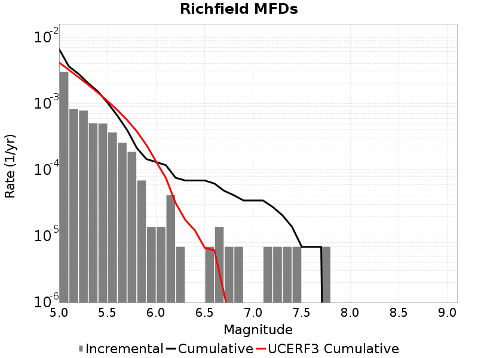

| Magnitude | Incremental Rate | Cumulative Rate | UCERF3 Cumulative Rate |
|-----|-----|-----|-----|
| 5.05 | 0.0029848176 | 0.0073791323 | 0.0041457806 |
| 5.15 | 8.2220667E-4 | 0.0043943147 | 0.0032259445 |
| 5.25 | 7.807509E-4 | 0.003572108 | 0.0024952928 |
| 5.35 | 5.0437887E-4 | 0.0027913572 | 0.0019149153 |
| 5.45 | 4.974696E-4 | 0.0022869783 | 0.0014539051 |
| 5.55 | 3.661929E-4 | 0.0017895086 | 0.0010877118 |
| 5.65 | 2.625534E-4 | 0.0014233157 | 7.9683407E-4 |
| 5.75 | 2.487348E-4 | 0.0011607624 | 5.6578167E-4 |
| 5.85 | 1.036395E-4 | 9.120276E-4 | 3.822502E-4 |
| 5.95 | 4.83651E-5 | 8.083881E-4 | 2.3646599E-4 |
| 6.05 | 2.76372E-5 | 7.60023E-4 | 1.3283534E-4 |
| 6.15 | 7.6002296E-5 | 7.323858E-4 | 7.551393E-5 |
| 6.25 | 1.38186E-5 | 6.5638346E-4 | 3.170162E-5 |
| 6.35 | 1.38186E-5 | 6.425649E-4 | 1.758694E-5 |
| 6.45 | 2.76372E-5 | 6.287463E-4 | 1.2195602E-5 |
| 6.55 | 2.76372E-5 | 6.011091E-4 | 6.6842676E-6 |
| 6.65 | 5.52744E-5 | 5.734719E-4 | 6.1193027E-6 |
| 6.75 | 3.4546498E-5 | 5.181975E-4 | 1.3500753E-6 |
| 6.85 | 8.2911596E-5 | 4.83651E-4 | 3.0434202E-7 |
| 6.95 | 4.83651E-5 | 4.007394E-4 | 1.6633956E-7 |
| 7.05 | 3.4546498E-5 | 3.523743E-4 | 1.2459866E-7 |
| 7.15 | 8.2911596E-5 | 3.178278E-4 | 4.810707E-8 |
| 7.25 | 7.6002296E-5 | 2.349162E-4 | 1.7590228E-8 |
| 7.35 | 5.52744E-5 | 1.589139E-4 | 5.0983697E-9 |
| 7.45 | 3.4546498E-5 | 1.036395E-4 | 1.9883788E-10 |
| 7.55 | 1.38186E-5 | 6.9092996E-5 | 0.0 |
| 7.65 | 2.0727899E-5 | 5.52744E-5 | 0.0 |
| 7.75 | 2.0727899E-5 | 3.4546498E-5 | 0.0 |
| 7.85 | 6.9093E-6 | 1.38186E-5 | 0.0 |
| 7.95 | 0.0 | 6.9093E-6 | 0.0 |
| 8.05 | 6.9093E-6 | 6.9093E-6 | 0.0 |

### Rinconada 2011 CFM
*[(top)](#table-of-contents)*

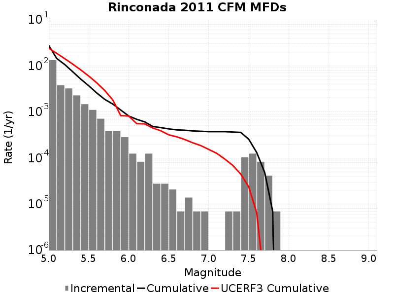

| Magnitude | Incremental Rate | Cumulative Rate | UCERF3 Cumulative Rate |
|-----|-----|-----|-----|
| 5.05 | 0.013307312 | 0.0279343 | 0.02409809 |
| 5.15 | 0.0037932056 | 0.014626988 | 0.01865659 |
| 5.25 | 0.0032335524 | 0.010833782 | 0.01433425 |
| 5.35 | 0.002280069 | 0.0076002297 | 0.010900895 |
| 5.45 | 0.0014716808 | 0.005320161 | 0.008173684 |
| 5.55 | 0.0011054879 | 0.00384848 | 0.0060073826 |
| 5.65 | 7.1165786E-4 | 0.002742992 | 0.0042866287 |
| 5.75 | 3.869208E-4 | 0.0020313342 | 0.0029197852 |
| 5.85 | 3.869208E-4 | 0.0016444133 | 0.0018340627 |
| 5.95 | 2.832813E-4 | 0.0012574926 | 8.308314E-4 |
| 6.05 | 1.243674E-4 | 9.7421126E-4 | 8.136192E-4 |
| 6.15 | 8.2911596E-5 | 8.498439E-4 | 5.562355E-4 |
| 6.25 | 1.243674E-4 | 7.6693227E-4 | 5.4958573E-4 |
| 6.35 | 2.76372E-5 | 6.425649E-4 | 4.481479E-4 |
| 6.45 | 2.76372E-5 | 6.149277E-4 | 3.8991804E-4 |
| 6.55 | 2.0727899E-5 | 5.872905E-4 | 3.1812326E-4 |
| 6.65 | 2.0727899E-5 | 5.665626E-4 | 2.8835045E-4 |
| 6.75 | 1.38186E-5 | 5.458347E-4 | 2.5201557E-4 |
| 6.85 | 6.9093E-6 | 5.320161E-4 | 2.1361576E-4 |
| 6.95 | 6.9093E-6 | 5.251068E-4 | 1.8612198E-4 |
| 7.05 | 0.0 | 5.181975E-4 | 1.5345999E-4 |
| 7.15 | 0.0 | 5.181975E-4 | 1.2633459E-4 |
| 7.25 | 6.9093E-6 | 5.181975E-4 | 9.516555E-5 |
| 7.35 | 2.0727899E-5 | 5.112882E-4 | 6.9300186E-5 |
| 7.45 | 1.312767E-4 | 4.905603E-4 | 4.490046E-5 |
| 7.55 | 1.243674E-4 | 3.592836E-4 | 2.372395E-5 |
| 7.65 | 1.312767E-4 | 2.349162E-4 | 6.427044E-6 |
| 7.75 | 8.98209E-5 | 1.036395E-4 | 1.6841093E-7 |
| 7.85 | 1.38186E-5 | 1.38186E-5 | 1.6957284E-9 |

### Robinson Creek
*[(top)](#table-of-contents)*

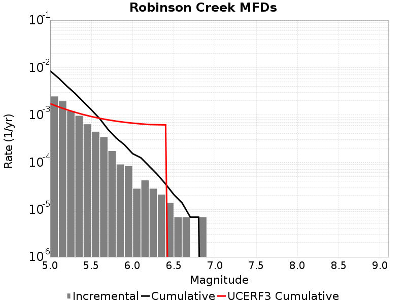

| Magnitude | Incremental Rate | Cumulative Rate | UCERF3 Cumulative Rate |
|-----|-----|-----|-----|
| 5.05 | 0.0024597107 | 0.008512258 | 0.0017257219 |
| 5.15 | 0.0019622413 | 0.0060525467 | 0.0014846356 |
| 5.25 | 0.0012160367 | 0.0040903054 | 0.001293134 |
| 5.35 | 9.603927E-4 | 0.0028742687 | 0.0011410188 |
| 5.45 | 6.356556E-4 | 0.001913876 | 0.0010201895 |
| 5.55 | 4.421952E-4 | 0.0012782204 | 9.242113E-4 |
| 5.65 | 3.385557E-4 | 8.360253E-4 | 8.479731E-4 |
| 5.75 | 1.727325E-4 | 4.974696E-4 | 7.8741496E-4 |
| 5.85 | 8.98209E-5 | 3.247371E-4 | 7.393119E-4 |
| 5.95 | 8.2911596E-5 | 2.349162E-4 | 7.011023E-4 |
| 6.05 | 2.76372E-5 | 1.5200459E-4 | 6.707514E-4 |
| 6.15 | 4.1455798E-5 | 1.243674E-4 | 6.4664276E-4 |
| 6.25 | 2.76372E-5 | 8.2911596E-5 | 6.2749255E-4 |
| 6.35 | 2.0727899E-5 | 5.52744E-5 | 6.21408E-4 |
| 6.45 | 1.38186E-5 | 3.4546498E-5 | 6.165748E-4 |
| 6.55 | 6.9093E-6 | 2.0727899E-5 | 0.0 |
| 6.65 | 6.9093E-6 | 1.38186E-5 | 0.0 |
| 6.75 | 0.0 | 6.9093E-6 | 0.0 |
| 6.85 | 6.9093E-6 | 6.9093E-6 | 0.0 |

### Rocky Ledge 2011 CFM
*[(top)](#table-of-contents)*

| Magnitude | Incremental Rate | Cumulative Rate | UCERF3 Cumulative Rate |
|-----|-----|-----|-----|
| 5.05 | 0.0 | 0.0 | 0.0018781765 |
| 5.15 | 0.0 | 0.0 | 0.0014861714 |
| 5.25 | 0.0 | 0.0 | 0.0011747907 |
| 5.35 | 0.0 | 0.0 | 9.274521E-4 |
| 5.45 | 0.0 | 0.0 | 7.3098415E-4 |
| 5.55 | 0.0 | 0.0 | 5.749241E-4 |
| 5.65 | 0.0 | 0.0 | 4.509612E-4 |
| 5.75 | 0.0 | 0.0 | 3.5249395E-4 |
| 5.85 | 0.0 | 0.0 | 2.7427866E-4 |
| 5.95 | 0.0 | 0.0 | 2.1215003E-4 |
| 6.05 | 0.0 | 0.0 | 1.3132993E-4 |
| 6.15 | 0.0 | 0.0 | 1.29749E-4 |
| 6.25 | 0.0 | 0.0 | 8.838461E-5 |

### Rose Canyon
*[(top)](#table-of-contents)*

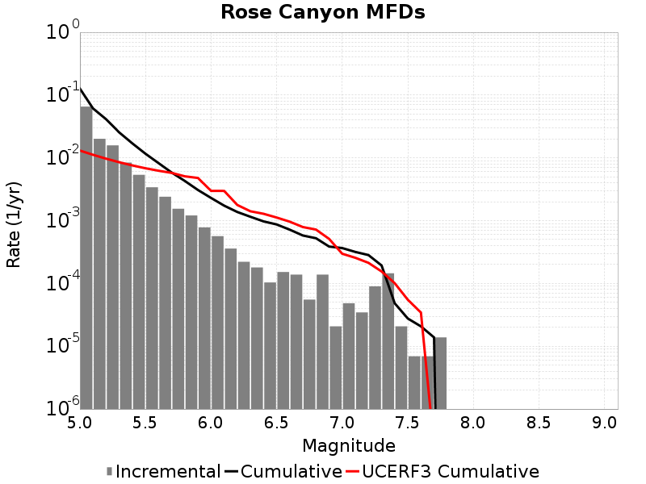

| Magnitude | Incremental Rate | Cumulative Rate | UCERF3 Cumulative Rate |
|-----|-----|-----|-----|
| 5.05 | 0.0655278 | 0.12744895 | 0.013083562 |
| 5.15 | 0.020112973 | 0.061921146 | 0.011203534 |
| 5.25 | 0.015808478 | 0.041808173 | 0.009710175 |
| 5.35 | 0.008415528 | 0.025999695 | 0.008523958 |
| 5.45 | 0.005375435 | 0.017584167 | 0.007581712 |
| 5.55 | 0.003413194 | 0.012208733 | 0.0068332595 |
| 5.65 | 0.0024113457 | 0.008795539 | 0.0062387427 |
| 5.75 | 0.0015753204 | 0.006384193 | 0.005766501 |
| 5.85 | 0.0012298553 | 0.004808873 | 0.005085696 |
| 5.95 | 8.2220667E-4 | 0.0035790172 | 0.0047877315 |
| 6.05 | 5.941998E-4 | 0.0027568107 | 0.002986239 |
| 6.15 | 4.214673E-4 | 0.0021626109 | 0.0029762257 |
| 6.25 | 2.418255E-4 | 0.0017411435 | 0.0017790662 |
| 6.35 | 2.280069E-4 | 0.001499318 | 0.0014117521 |
| 6.45 | 1.450953E-4 | 0.0012713112 | 0.0012876586 |
| 6.55 | 2.07279E-4 | 0.0011262159 | 0.0011220451 |
| 6.65 | 1.796418E-4 | 9.1893686E-4 | 9.633873E-4 |
| 6.75 | 8.2911596E-5 | 7.392951E-4 | 7.914764E-4 |
| 6.85 | 1.450953E-4 | 6.5638346E-4 | 7.211428E-4 |
| 6.95 | 3.4546498E-5 | 5.112882E-4 | 5.127353E-4 |
| 7.05 | 9.67302E-5 | 4.767417E-4 | 2.9732203E-4 |
| 7.15 | 4.83651E-5 | 3.800115E-4 | 2.5631304E-4 |
| 7.25 | 1.105488E-4 | 3.3164638E-4 | 2.1307687E-4 |
| 7.35 | 1.6582319E-4 | 2.210976E-4 | 1.5521905E-4 |
| 7.45 | 2.0727899E-5 | 5.52744E-5 | 1.0104443E-4 |
| 7.55 | 1.38186E-5 | 3.4546498E-5 | 5.504696E-5 |
| 7.65 | 6.9093E-6 | 2.0727899E-5 | 3.4390298E-5 |
| 7.75 | 1.38186E-5 | 1.38186E-5 | 2.4977894E-7 |

### Round Valley
*[(top)](#table-of-contents)*

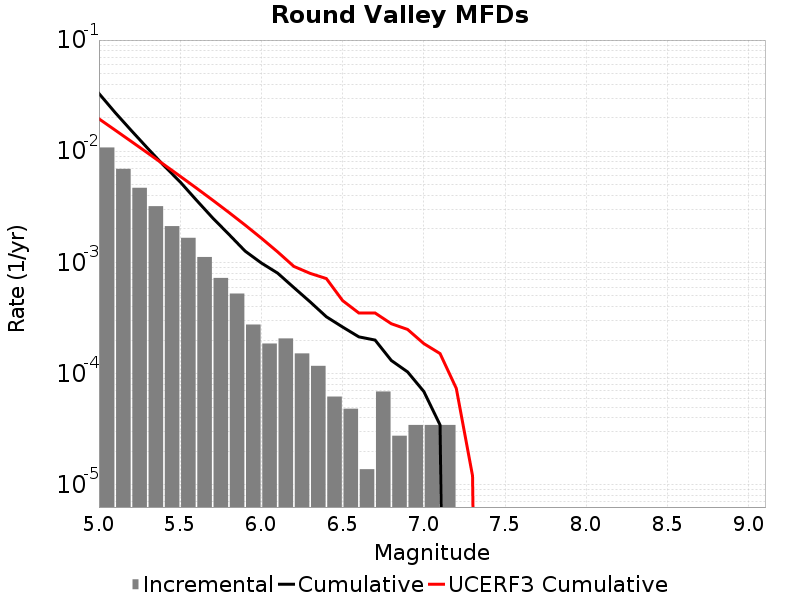

| Magnitude | Incremental Rate | Cumulative Rate | UCERF3 Cumulative Rate |
|-----|-----|-----|-----|
| 5.05 | 0.010813055 | 0.033109367 | 0.019575054 |
| 5.15 | 0.0069438466 | 0.022296311 | 0.015479283 |
| 5.25 | 0.0046914145 | 0.015352464 | 0.012225898 |
| 5.35 | 0.0032059152 | 0.01066105 | 0.009641642 |
| 5.45 | 0.0021211552 | 0.0074551348 | 0.0075888936 |
| 5.55 | 0.0016651413 | 0.0053339796 | 0.0059583383 |
| 5.65 | 0.0011193065 | 0.0036688382 | 0.004663142 |
| 5.75 | 7.254765E-4 | 0.0025495316 | 0.003634331 |
| 5.85 | 5.251068E-4 | 0.0018240552 | 0.0028171174 |
| 5.95 | 2.7637198E-4 | 0.0012989484 | 0.0021679816 |
| 6.05 | 1.934604E-4 | 0.0010225764 | 0.0016523547 |
| 6.15 | 2.07279E-4 | 8.29116E-4 | 0.001244753 |
| 6.25 | 1.5200459E-4 | 6.21837E-4 | 9.209834E-4 |
| 6.35 | 1.174581E-4 | 4.698324E-4 | 7.975774E-4 |
| 6.45 | 6.21837E-5 | 3.523743E-4 | 7.1612746E-4 |
| 6.55 | 4.83651E-5 | 2.901906E-4 | 4.539066E-4 |
| 6.65 | 1.38186E-5 | 2.418255E-4 | 3.5102584E-4 |
| 6.75 | 6.9092996E-5 | 2.280069E-4 | 3.5102584E-4 |
| 6.85 | 2.76372E-5 | 1.589139E-4 | 2.809776E-4 |
| 6.95 | 3.4546498E-5 | 1.312767E-4 | 2.498025E-4 |
| 7.05 | 3.4546498E-5 | 9.67302E-5 | 1.8630357E-4 |
| 7.15 | 4.83651E-5 | 6.21837E-5 | 1.5148721E-4 |
| 7.25 | 1.38186E-5 | 1.38186E-5 | 7.3636984E-5 |
| 7.35 | 0.0 | 0.0 | 1.20328095E-5 |

### Russ 2011 CFM
*[(top)](#table-of-contents)*

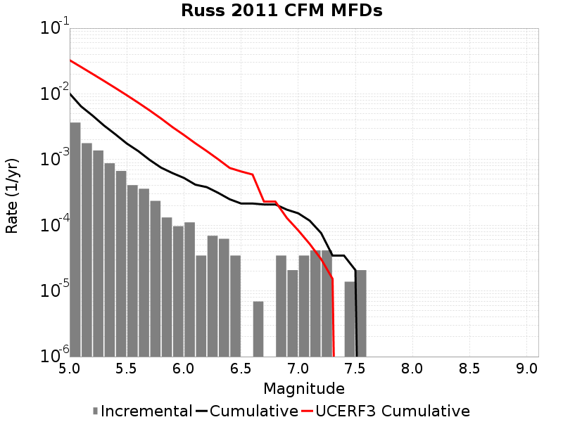

| Magnitude | Incremental Rate | Cumulative Rate | UCERF3 Cumulative Rate |
|-----|-----|-----|-----|
| 5.05 | 0.0036550197 | 0.010108306 | 0.03258498 |
| 5.15 | 0.0017756901 | 0.006453286 | 0.02565105 |
| 5.25 | 0.0013749506 | 0.004677596 | 0.020143235 |
| 5.35 | 8.7748107E-4 | 0.0033026454 | 0.015768223 |
| 5.45 | 6.702021E-4 | 0.0024251642 | 0.012293028 |
| 5.55 | 4.0764868E-4 | 0.0017549621 | 0.009532581 |
| 5.65 | 3.592836E-4 | 0.0013473135 | 0.0073398803 |
| 5.75 | 2.349162E-4 | 9.880299E-4 | 0.0055981567 |
| 5.85 | 1.312767E-4 | 7.531137E-4 | 0.004214656 |
| 5.95 | 9.67302E-5 | 6.21837E-4 | 0.0031157027 |
| 6.05 | 1.105488E-4 | 5.251068E-4 | 0.0023639866 |
| 6.15 | 3.4546498E-5 | 4.14558E-4 | 0.0017669474 |
| 6.25 | 6.9092996E-5 | 3.800115E-4 | 0.0013439786 |
| 6.35 | 6.21837E-5 | 3.109185E-4 | 0.0010080319 |
| 6.45 | 3.4546498E-5 | 2.487348E-4 | 7.4542E-4 |
| 6.55 | 0.0 | 2.141883E-4 | 6.587917E-4 |
| 6.65 | 6.9093E-6 | 2.141883E-4 | 5.917751E-4 |
| 6.75 | 0.0 | 2.07279E-4 | 2.2947082E-4 |
| 6.85 | 3.4546498E-5 | 2.07279E-4 | 2.2886897E-4 |
| 6.95 | 2.0727899E-5 | 1.727325E-4 | 1.2919803E-4 |
| 7.05 | 3.4546498E-5 | 1.5200459E-4 | 8.348E-5 |
| 7.15 | 4.1455798E-5 | 1.174581E-4 | 5.19362E-5 |
| 7.25 | 4.1455798E-5 | 7.6002296E-5 | 3.0503528E-5 |
| 7.35 | 0.0 | 3.4546498E-5 | 1.5307649E-5 |
| 7.45 | 1.38186E-5 | 3.4546498E-5 | 0.0 |
| 7.55 | 2.0727899E-5 | 2.0727899E-5 | 0.0 |

### San Andreas (North Branch Mill Creek)
*[(top)](#table-of-contents)*

| Magnitude | Incremental Rate | Cumulative Rate | UCERF3 Cumulative Rate |
|-----|-----|-----|-----|
| 5.05 | 0.005976544 | 0.033482466 | 0.05657551 |
| 5.15 | 0.0036550197 | 0.027505923 | 0.044372868 |
| 5.25 | 0.002604806 | 0.023850903 | 0.034679964 |
| 5.35 | 0.0023837085 | 0.021246098 | 0.026980618 |
| 5.45 | 0.002003697 | 0.018862389 | 0.020864809 |
| 5.55 | 0.001589139 | 0.016858691 | 0.01600685 |
| 5.65 | 0.0013956786 | 0.015269552 | 0.012148035 |
| 5.75 | 0.0011400345 | 0.013873874 | 0.00908287 |
| 5.85 | 0.0010156671 | 0.012733839 | 0.006648122 |
| 5.95 | 7.876602E-4 | 0.011718173 | 0.0047141337 |
| 6.05 | 8.429346E-4 | 0.010930512 | 0.003181524 |
| 6.15 | 7.807509E-4 | 0.010087578 | 0.0021520553 |
| 6.25 | 6.5638346E-4 | 0.009306827 | 0.0014166503 |
| 6.35 | 5.872905E-4 | 0.0086504435 | 9.805999E-4 |
| 6.45 | 4.007394E-4 | 0.008063153 | 8.1267895E-4 |
| 6.55 | 3.869208E-4 | 0.0076624136 | 7.250354E-4 |
| 6.65 | 6.425649E-4 | 0.007275493 | 6.564398E-4 |
| 6.75 | 6.978393E-4 | 0.006632928 | 6.5643515E-4 |
| 6.85 | 4.974696E-4 | 0.0059350887 | 6.520361E-4 |
| 6.95 | 4.14558E-4 | 0.005437619 | 6.510069E-4 |
| 7.05 | 5.251068E-4 | 0.005023061 | 6.482483E-4 |
| 7.15 | 8.014788E-4 | 0.004497954 | 6.468157E-4 |
| 7.25 | 0.0010502136 | 0.0036964754 | 6.450139E-4 |
| 7.35 | 0.0012505833 | 0.0026462618 | 6.4246415E-4 |
| 7.45 | 2.07279E-4 | 0.0013956786 | 6.32251E-4 |
| 7.55 | 7.6002296E-5 | 0.0011883996 | 5.9528457E-4 |
| 7.65 | 2.487348E-4 | 0.0011123973 | 5.800886E-4 |
| 7.75 | 5.941998E-4 | 8.636625E-4 | 5.367652E-4 |
| 7.85 | 2.07279E-4 | 2.694627E-4 | 3.641955E-4 |
| 7.95 | 3.4546498E-5 | 6.21837E-5 | 3.0042298E-4 |
| 8.05 | 2.76372E-5 | 2.76372E-5 | 2.0858977E-4 |
| 8.15 | 0.0 | 0.0 | 1.2730129E-4 |
| 8.25 | 0.0 | 0.0 | 6.0181268E-5 |
| 8.35 | 0.0 | 0.0 | 1.5444582E-5 |

### San Cayetano
*[(top)](#table-of-contents)*

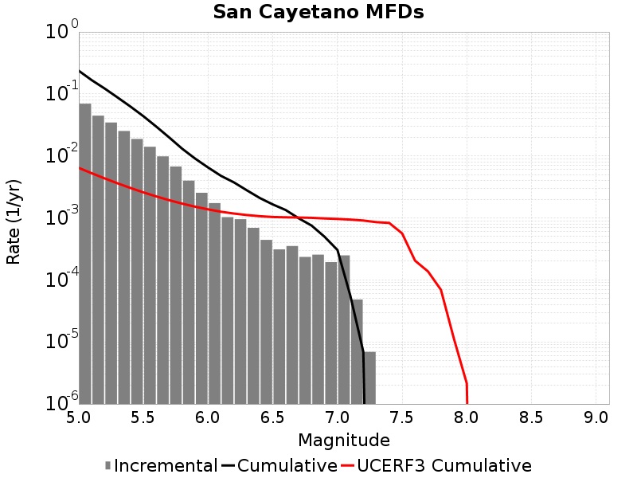

| Magnitude | Incremental Rate | Cumulative Rate | UCERF3 Cumulative Rate |
|-----|-----|-----|-----|
| 5.05 | 0.069507554 | 0.23680934 | 0.006409323 |
| 5.15 | 0.044551164 | 0.16730179 | 0.005258294 |
| 5.25 | 0.03456032 | 0.122750625 | 0.0043439986 |
| 5.35 | 0.025225854 | 0.0881903 | 0.0036177484 |
| 5.45 | 0.018772569 | 0.06296445 | 0.0030408674 |
| 5.55 | 0.014039697 | 0.044191882 | 0.0025826343 |
| 5.65 | 0.009831933 | 0.030152185 | 0.002218647 |
| 5.75 | 0.0067918417 | 0.020320252 | 0.0019295216 |
| 5.85 | 0.0040212125 | 0.013528409 | 0.001699861 |
| 5.95 | 0.0025909874 | 0.009507197 | 0.0015174352 |
| 6.05 | 0.0017756901 | 0.006916209 | 0.001373171 |
| 6.15 | 0.0010433043 | 0.0051405192 | 0.0012585778 |
| 6.25 | 0.0010225764 | 0.004097215 | 0.0011766326 |
| 6.35 | 7.254765E-4 | 0.0030746385 | 0.0011132411 |
| 6.45 | 4.905603E-4 | 0.002349162 | 0.0010669986 |
| 6.55 | 3.661929E-4 | 0.0018586017 | 0.0010349151 |
| 6.65 | 3.731022E-4 | 0.0014924088 | 0.0010232098 |
| 6.75 | 2.7637198E-4 | 0.0011193065 | 0.0010157309 |
| 6.85 | 2.7637198E-4 | 8.429346E-4 | 0.0010041733 |
| 6.95 | 2.07279E-4 | 5.665626E-4 | 9.810684E-4 |
| 7.05 | 2.625534E-4 | 3.592836E-4 | 9.6350256E-4 |
| 7.15 | 6.21837E-5 | 9.67302E-5 | 9.405502E-4 |
| 7.25 | 3.4546498E-5 | 3.4546498E-5 | 9.082446E-4 |
| 7.35 | 0.0 | 0.0 | 8.5489714E-4 |
| 7.45 | 0.0 | 0.0 | 8.30789E-4 |
| 7.55 | 0.0 | 0.0 | 5.630931E-4 |
| 7.65 | 0.0 | 0.0 | 2.0447547E-4 |
| 7.75 | 0.0 | 0.0 | 1.3712895E-4 |
| 7.85 | 0.0 | 0.0 | 6.9328285E-5 |
| 7.95 | 0.0 | 0.0 | 1.1354806E-5 |
| 8.05 | 0.0 | 0.0 | 2.138137E-6 |

### San Clemente
*[(top)](#table-of-contents)*

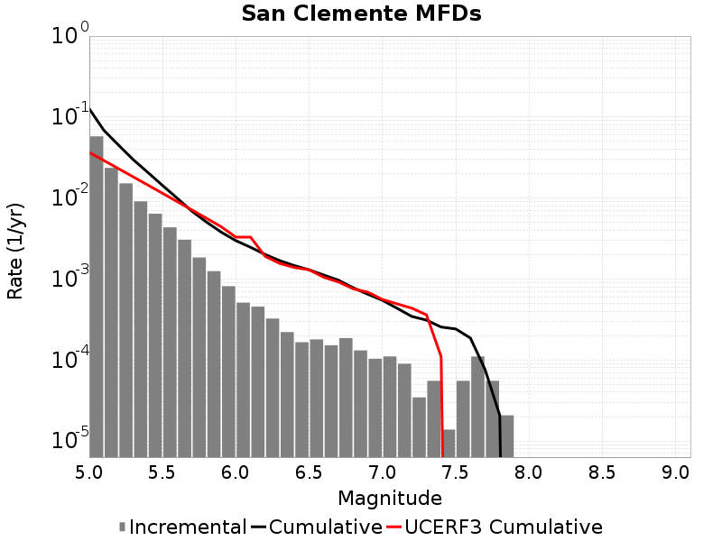

| Magnitude | Incremental Rate | Cumulative Rate | UCERF3 Cumulative Rate |
|-----|-----|-----|-----|
| 5.05 | 0.057761747 | 0.12631582 | 0.036648512 |
| 5.15 | 0.02358144 | 0.06855407 | 0.029066352 |
| 5.25 | 0.015179732 | 0.044972632 | 0.023043627 |
| 5.35 | 0.009099548 | 0.029792901 | 0.018259607 |
| 5.45 | 0.006398012 | 0.020693352 | 0.014459525 |
| 5.55 | 0.0043459497 | 0.014295341 | 0.011441013 |
| 5.65 | 0.0030608198 | 0.009949392 | 0.009043323 |
| 5.75 | 0.0018447831 | 0.006888572 | 0.00713877 |
| 5.85 | 0.0012505833 | 0.005043789 | 0.00562593 |
| 5.95 | 8.1529736E-4 | 0.0037932056 | 0.0044242386 |
| 6.05 | 5.112882E-4 | 0.0029779084 | 0.003289686 |
| 6.15 | 4.560138E-4 | 0.0024666202 | 0.0032882825 |
| 6.25 | 3.247371E-4 | 0.0020106062 | 0.0019059088 |
| 6.35 | 2.210976E-4 | 0.0016858692 | 0.0015573042 |
| 6.45 | 1.6582319E-4 | 0.0014647716 | 0.0013865795 |
| 6.55 | 1.796418E-4 | 0.0012989484 | 0.0013016855 |
| 6.65 | 1.5200459E-4 | 0.0011193065 | 0.0010504617 |
| 6.75 | 1.865511E-4 | 9.67302E-4 | 9.200773E-4 |
| 6.85 | 1.312767E-4 | 7.807509E-4 | 7.5799576E-4 |
| 6.95 | 1.036395E-4 | 6.494742E-4 | 6.8918156E-4 |
| 7.05 | 1.105488E-4 | 5.458347E-4 | 5.593755E-4 |
| 7.15 | 8.98209E-5 | 4.3528588E-4 | 4.933601E-4 |
| 7.25 | 3.4546498E-5 | 3.45465E-4 | 4.3708287E-4 |
| 7.35 | 5.52744E-5 | 3.109185E-4 | 3.6117912E-4 |
| 7.45 | 1.38186E-5 | 2.556441E-4 | 1.1011408E-4 |
| 7.55 | 5.52744E-5 | 2.418255E-4 | 0.0 |
| 7.65 | 1.105488E-4 | 1.865511E-4 | 0.0 |
| 7.75 | 5.52744E-5 | 7.6002296E-5 | 0.0 |
| 7.85 | 2.0727899E-5 | 2.0727899E-5 | 0.0 |

### San Diego Trough north alt1
*[(top)](#table-of-contents)*

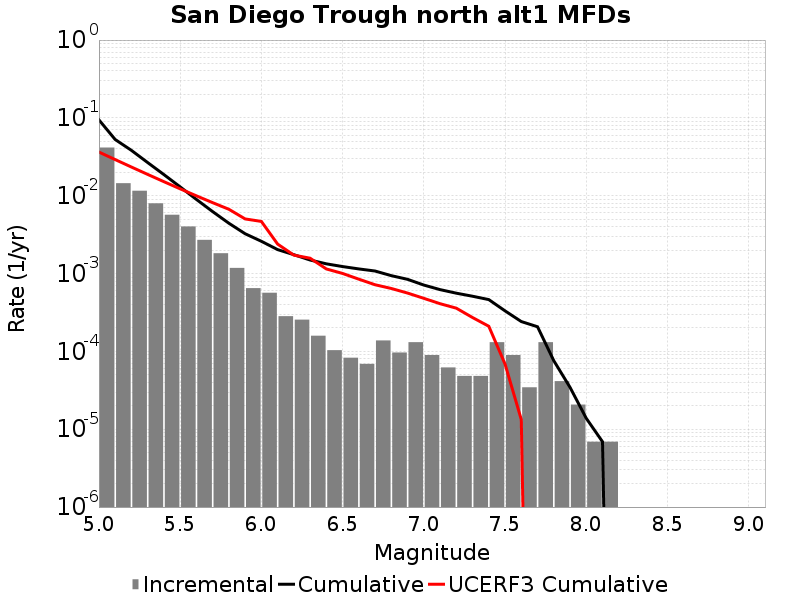

| Magnitude | Incremental Rate | Cumulative Rate | UCERF3 Cumulative Rate |
|-----|-----|-----|-----|
| 5.05 | 0.041580167 | 0.094381034 | 0.036387797 |
| 5.15 | 0.014481893 | 0.05280087 | 0.02913115 |
| 5.25 | 0.011586896 | 0.038318977 | 0.023366991 |
| 5.35 | 0.007987151 | 0.026732082 | 0.018788358 |
| 5.45 | 0.005693263 | 0.01874493 | 0.015151419 |
| 5.55 | 0.004035031 | 0.013051667 | 0.012262496 |
| 5.65 | 0.0027084455 | 0.009016637 | 0.009967743 |
| 5.75 | 0.0018378737 | 0.006308191 | 0.008144956 |
| 5.85 | 0.0011814903 | 0.004470317 | 0.006697065 |
| 5.95 | 6.494742E-4 | 0.0032888267 | 0.0050340286 |
| 6.05 | 5.803812E-4 | 0.0026393526 | 0.0046737883 |
| 6.15 | 2.832813E-4 | 0.0020589714 | 0.0023922236 |
| 6.25 | 2.556441E-4 | 0.0017756901 | 0.0017243563 |
| 6.35 | 1.589139E-4 | 0.001520046 | 0.0015749587 |
| 6.45 | 1.036395E-4 | 0.0013611321 | 0.0011461134 |
| 6.55 | 8.2911596E-5 | 0.0012574926 | 0.0010030649 |
| 6.65 | 6.9092996E-5 | 0.001174581 | 8.467408E-4 |
| 6.75 | 1.3818599E-4 | 0.0011054879 | 7.181272E-4 |
| 6.85 | 1.243674E-4 | 9.67302E-4 | 6.430495E-4 |
| 6.95 | 1.312767E-4 | 8.429346E-4 | 5.6149316E-4 |
| 7.05 | 8.98209E-5 | 7.1165786E-4 | 4.8063404E-4 |
| 7.15 | 6.21837E-5 | 6.21837E-4 | 4.0998976E-4 |
| 7.25 | 4.83651E-5 | 5.596533E-4 | 3.5922686E-4 |
| 7.35 | 4.83651E-5 | 5.112882E-4 | 2.7226866E-4 |
| 7.45 | 1.312767E-4 | 4.6292308E-4 | 2.1034913E-4 |
| 7.55 | 8.98209E-5 | 3.3164638E-4 | 6.876253E-5 |
| 7.65 | 3.4546498E-5 | 2.418255E-4 | 1.3318822E-5 |
| 7.75 | 1.312767E-4 | 2.07279E-4 | 0.0 |
| 7.85 | 4.1455798E-5 | 7.6002296E-5 | 0.0 |
| 7.95 | 2.0727899E-5 | 3.4546498E-5 | 0.0 |
| 8.05 | 6.9093E-6 | 1.38186E-5 | 0.0 |
| 8.15 | 6.9093E-6 | 6.9093E-6 | 0.0 |

### San Diego Trough south
*[(top)](#table-of-contents)*

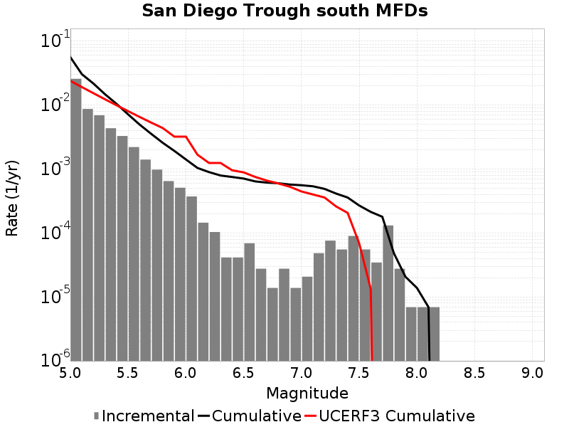

| Magnitude | Incremental Rate | Cumulative Rate | UCERF3 Cumulative Rate |
|-----|-----|-----|-----|
| 5.05 | 0.02586151 | 0.056372978 | 0.023986857 |
| 5.15 | 0.008726446 | 0.030511469 | 0.0191963 |
| 5.25 | 0.0069507556 | 0.021785023 | 0.015391024 |
| 5.35 | 0.0043597682 | 0.014834267 | 0.012368386 |
| 5.45 | 0.0032957362 | 0.010474498 | 0.009967419 |
| 5.55 | 0.0022109759 | 0.0071787625 | 0.0080602635 |
| 5.65 | 0.0014094972 | 0.004967787 | 0.006545356 |
| 5.75 | 9.811206E-4 | 0.0035582895 | 0.005342022 |
| 5.85 | 6.494742E-4 | 0.0025771689 | 0.00438618 |
| 5.95 | 5.112882E-4 | 0.0019276947 | 0.0032231905 |
| 6.05 | 3.731022E-4 | 0.0014164065 | 0.0032231905 |
| 6.15 | 1.450953E-4 | 0.0010433043 | 0.0016822852 |
| 6.25 | 1.036395E-4 | 8.98209E-4 | 0.0012470015 |
| 6.35 | 4.1455798E-5 | 7.945695E-4 | 0.0012470015 |
| 6.45 | 4.1455798E-5 | 7.531137E-4 | 9.59203E-4 |
| 6.55 | 6.9092996E-5 | 7.1165786E-4 | 8.895397E-4 |
| 6.65 | 2.76372E-5 | 6.425649E-4 | 7.5476983E-4 |
| 6.75 | 1.38186E-5 | 6.149277E-4 | 6.6176354E-4 |
| 6.85 | 2.76372E-5 | 6.011091E-4 | 5.9638376E-4 |
| 6.95 | 1.38186E-5 | 5.734719E-4 | 5.2911375E-4 |
| 7.05 | 2.0727899E-5 | 5.596533E-4 | 4.4742847E-4 |
| 7.15 | 4.83651E-5 | 5.389254E-4 | 4.0102203E-4 |
| 7.25 | 7.6002296E-5 | 4.905603E-4 | 3.597238E-4 |
| 7.35 | 5.52744E-5 | 4.14558E-4 | 2.6063225E-4 |
| 7.45 | 8.98209E-5 | 3.592836E-4 | 2.0645263E-4 |
| 7.55 | 5.52744E-5 | 2.694627E-4 | 6.876253E-5 |
| 7.65 | 3.4546498E-5 | 2.141883E-4 | 1.3318822E-5 |
| 7.75 | 1.312767E-4 | 1.796418E-4 | 0.0 |
| 7.85 | 2.76372E-5 | 4.83651E-5 | 0.0 |
| 7.95 | 6.9093E-6 | 2.0727899E-5 | 0.0 |
| 8.05 | 6.9093E-6 | 1.38186E-5 | 0.0 |
| 8.15 | 6.9093E-6 | 6.9093E-6 | 0.0 |

### San Gabriel
*[(top)](#table-of-contents)*

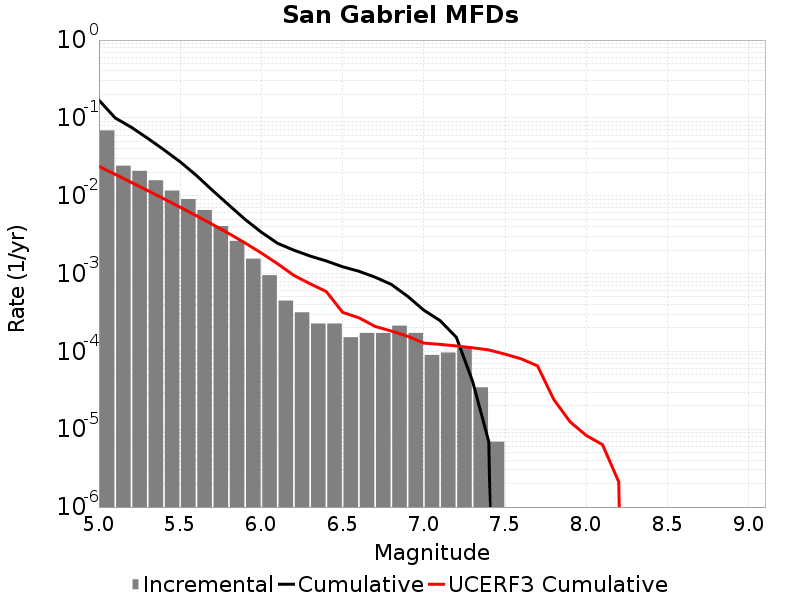

| Magnitude | Incremental Rate | Cumulative Rate | UCERF3 Cumulative Rate |
|-----|-----|-----|-----|
| 5.05 | 0.06905154 | 0.1703626 | 0.023833761 |
| 5.15 | 0.024293099 | 0.101311065 | 0.018806502 |
| 5.25 | 0.020872995 | 0.07701796 | 0.014813209 |
| 5.35 | 0.01580157 | 0.05614497 | 0.011641223 |
| 5.45 | 0.01164908 | 0.040343404 | 0.009121625 |
| 5.55 | 0.009065001 | 0.028694322 | 0.007120237 |
| 5.65 | 0.006556926 | 0.01962932 | 0.0055304784 |
| 5.75 | 0.004076487 | 0.013072396 | 0.004267688 |
| 5.85 | 0.002653171 | 0.008995908 | 0.0032646179 |
| 5.95 | 0.0016305947 | 0.0063427375 | 0.0024678512 |
| 6.05 | 0.0010571228 | 0.0047121425 | 0.0018349567 |
| 6.15 | 5.596533E-4 | 0.0036550197 | 0.0013343908 |
| 6.25 | 4.14558E-4 | 0.0030953663 | 9.464749E-4 |
| 6.35 | 4.007394E-4 | 0.0026808083 | 7.39424E-4 |
| 6.45 | 4.0764868E-4 | 0.002280069 | 5.8691116E-4 |
| 6.55 | 2.210976E-4 | 0.0018724203 | 3.1731147E-4 |
| 6.65 | 2.901906E-4 | 0.0016513227 | 2.7063998E-4 |
| 6.75 | 2.556441E-4 | 0.0013611321 | 2.0933148E-4 |
| 6.85 | 2.625534E-4 | 0.0011054879 | 1.8272815E-4 |
| 6.95 | 2.210976E-4 | 8.429346E-4 | 1.5663287E-4 |
| 7.05 | 1.589139E-4 | 6.21837E-4 | 1.2783881E-4 |
| 7.15 | 1.727325E-4 | 4.6292308E-4 | 1.2312253E-4 |
| 7.25 | 1.312767E-4 | 2.901906E-4 | 1.17542986E-4 |
| 7.35 | 6.9092996E-5 | 1.589139E-4 | 1.11241876E-4 |
| 7.45 | 1.38186E-5 | 8.98209E-5 | 1.044049E-4 |
| 7.55 | 0.0 | 7.6002296E-5 | 9.2186834E-5 |
| 7.65 | 2.76372E-5 | 7.6002296E-5 | 8.016436E-5 |
| 7.75 | 3.4546498E-5 | 4.83651E-5 | 6.5089815E-5 |
| 7.85 | 6.9093E-6 | 1.38186E-5 | 2.4113753E-5 |
| 7.95 | 6.9093E-6 | 6.9093E-6 | 1.2475566E-5 |
| 8.05 | 0.0 | 0.0 | 8.314521E-6 |
| 8.15 | 0.0 | 0.0 | 6.335155E-6 |
| 8.25 | 0.0 | 0.0 | 2.1070582E-6 |

### San Gabriel (Extension)
*[(top)](#table-of-contents)*

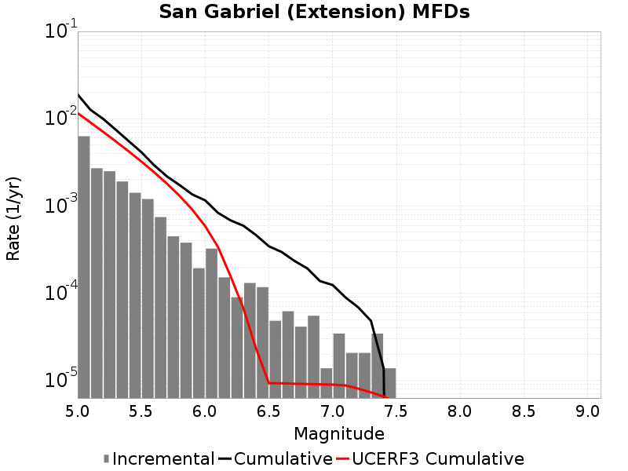

| Magnitude | Incremental Rate | Cumulative Rate | UCERF3 Cumulative Rate |
|-----|-----|-----|-----|
| 5.05 | 0.006294372 | 0.020182066 | 0.011581415 |
| 5.15 | 0.0027084455 | 0.013887693 | 0.009069249 |
| 5.25 | 0.0025011667 | 0.011179247 | 0.0070737647 |
| 5.35 | 0.0019069668 | 0.0086780805 | 0.0054886946 |
| 5.45 | 0.0014164065 | 0.0067711137 | 0.0042296294 |
| 5.55 | 0.0012022182 | 0.0053547076 | 0.0032295177 |
| 5.65 | 7.462044E-4 | 0.0041524894 | 0.002435101 |
| 5.75 | 4.560138E-4 | 0.0034062848 | 0.0018040735 |
| 5.85 | 4.007394E-4 | 0.0029502711 | 0.0013028304 |
| 5.95 | 2.141883E-4 | 0.0025495316 | 9.046789E-4 |
| 6.05 | 3.661929E-4 | 0.0023353433 | 5.884159E-4 |
| 6.15 | 1.796418E-4 | 0.0019691505 | 3.4053592E-4 |
| 6.25 | 1.450953E-4 | 0.0017895086 | 1.5591504E-4 |
| 6.35 | 2.003697E-4 | 0.0016444133 | 6.7109446E-5 |
| 6.45 | 1.5200459E-4 | 0.0014440437 | 2.3025932E-5 |
| 6.55 | 1.243674E-4 | 0.001292039 | 9.308339E-6 |
| 6.65 | 1.312767E-4 | 0.0011676716 | 9.308339E-6 |
| 6.75 | 1.5200459E-4 | 0.001036395 | 9.205277E-6 |
| 6.85 | 1.934604E-4 | 8.843904E-4 | 9.130813E-6 |
| 6.95 | 8.98209E-5 | 6.9093E-4 | 9.064049E-6 |
| 7.05 | 1.036395E-4 | 6.011091E-4 | 8.992958E-6 |
| 7.15 | 5.52744E-5 | 4.974696E-4 | 8.798247E-6 |
| 7.25 | 3.4546498E-5 | 4.421952E-4 | 8.091766E-6 |
| 7.35 | 5.52744E-5 | 4.0764868E-4 | 7.3332494E-6 |
| 7.45 | 1.38186E-5 | 3.523743E-4 | 6.569474E-6 |
| 7.55 | 3.4546498E-5 | 3.385557E-4 | 5.620448E-6 |
| 7.65 | 1.243674E-4 | 3.0400918E-4 | 4.7290123E-6 |
| 7.75 | 1.105488E-4 | 1.796418E-4 | 3.5961123E-6 |
| 7.85 | 5.52744E-5 | 6.9092996E-5 | 2.2726167E-6 |
| 7.95 | 6.9093E-6 | 1.38186E-5 | 6.483458E-7 |
| 8.05 | 6.9093E-6 | 6.9093E-6 | 3.616481E-7 |
| 8.15 | 0.0 | 0.0 | 2.3228783E-7 |
| 8.25 | 0.0 | 0.0 | 1.1312758E-7 |

### San Gorgonio Pass
*[(top)](#table-of-contents)*

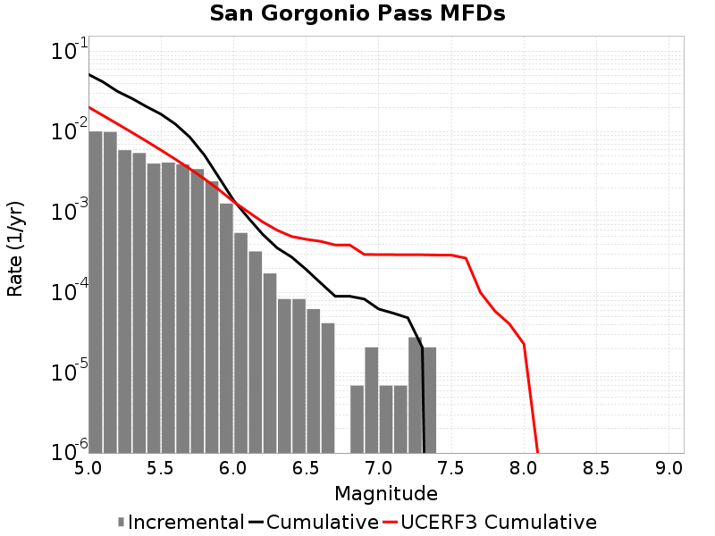

| Magnitude | Incremental Rate | Cumulative Rate | UCERF3 Cumulative Rate |
|-----|-----|-----|-----|
| 5.05 | 0.01016358 | 0.055391856 | 0.020478271 |
| 5.15 | 0.010032304 | 0.045228276 | 0.016108276 |
| 5.25 | 0.0059350887 | 0.035195973 | 0.012637067 |
| 5.35 | 0.0054721655 | 0.029260885 | 0.009879787 |
| 5.45 | 0.0040419404 | 0.02378872 | 0.0076896017 |
| 5.55 | 0.004166308 | 0.019746779 | 0.005949876 |
| 5.65 | 0.00394521 | 0.015580472 | 0.004567962 |
| 5.75 | 0.0034891965 | 0.011635261 | 0.0034702693 |
| 5.85 | 0.0026877176 | 0.008146064 | 0.0025983409 |
| 5.95 | 0.0015407739 | 0.005458347 | 0.0019057435 |
| 6.05 | 8.014788E-4 | 0.003917573 | 0.0013555938 |
| 6.15 | 6.287463E-4 | 0.0031160943 | 0.0010126311 |
| 6.25 | 4.283766E-4 | 0.002487348 | 7.592535E-4 |
| 6.35 | 2.556441E-4 | 0.0020589714 | 5.975442E-4 |
| 6.45 | 3.800115E-4 | 0.0018033272 | 4.991013E-4 |
| 6.55 | 3.247371E-4 | 0.0014233157 | 4.6083433E-4 |
| 6.65 | 2.280069E-4 | 0.0010985787 | 4.3399932E-4 |
| 6.75 | 1.6582319E-4 | 8.7057176E-4 | 3.909809E-4 |
| 6.85 | 1.036395E-4 | 7.047486E-4 | 3.909809E-4 |
| 6.95 | 1.174581E-4 | 6.011091E-4 | 2.9812264E-4 |
| 7.05 | 8.98209E-5 | 4.83651E-4 | 2.970754E-4 |
| 7.15 | 1.243674E-4 | 3.938301E-4 | 2.964558E-4 |
| 7.25 | 1.450953E-4 | 2.694627E-4 | 2.960072E-4 |
| 7.35 | 1.036395E-4 | 1.243674E-4 | 2.9564215E-4 |
| 7.45 | 0.0 | 2.0727899E-5 | 2.9361914E-4 |
| 7.55 | 1.38186E-5 | 2.0727899E-5 | 2.9251442E-4 |
| 7.65 | 0.0 | 6.9093E-6 | 2.6783752E-4 |
| 7.75 | 0.0 | 6.9093E-6 | 1.00250174E-4 |
| 7.85 | 6.9093E-6 | 6.9093E-6 | 5.8653837E-5 |
| 7.95 | 0.0 | 0.0 | 4.0511568E-5 |
| 8.05 | 0.0 | 0.0 | 2.278126E-5 |
| 8.15 | 0.0 | 0.0 | 8.367655E-7 |

### San Jacinto (Lytle Creek connector)
*[(top)](#table-of-contents)*

| Magnitude | Incremental Rate | Cumulative Rate | UCERF3 Cumulative Rate |
|-----|-----|-----|-----|
| 5.05 | 0.026828812 | 0.07718379 | 0.01436112 |
| 5.15 | 0.010502135 | 0.050354976 | 0.011328154 |
| 5.25 | 0.0086504435 | 0.039852843 | 0.008918984 |
| 5.35 | 0.006798751 | 0.031202398 | 0.0070053125 |
| 5.45 | 0.0046845055 | 0.024403647 | 0.005485229 |
| 5.55 | 0.003247371 | 0.019719142 | 0.004277784 |
| 5.65 | 0.0022109759 | 0.016471772 | 0.0033186758 |
| 5.75 | 0.0019760597 | 0.014260795 | 0.0025568295 |
| 5.85 | 0.0015476831 | 0.012284735 | 0.0019516733 |
| 5.95 | 0.0012367647 | 0.010737052 | 0.0014709807 |
| 6.05 | 0.0010571228 | 0.0095002875 | 0.001089153 |
| 6.15 | 9.396648E-4 | 0.008443165 | 8.23109E-4 |
| 6.25 | 6.287463E-4 | 0.0075034997 | 6.245442E-4 |
| 6.35 | 4.83651E-4 | 0.0068747536 | 5.621598E-4 |
| 6.45 | 4.14558E-4 | 0.0063911024 | 5.191452E-4 |
| 6.55 | 3.731022E-4 | 0.005976544 | 5.178994E-4 |
| 6.65 | 4.767417E-4 | 0.0056034424 | 5.173958E-4 |
| 6.75 | 8.29116E-4 | 0.0051267007 | 5.1682704E-4 |
| 6.85 | 9.327555E-4 | 0.0042975848 | 5.1651325E-4 |
| 6.95 | 5.0437887E-4 | 0.003364829 | 5.1619933E-4 |
| 7.05 | 2.487348E-4 | 0.0028604502 | 5.158904E-4 |
| 7.15 | 1.865511E-4 | 0.0026117153 | 5.155368E-4 |
| 7.25 | 2.694627E-4 | 0.0024251642 | 5.1514397E-4 |
| 7.35 | 3.0400918E-4 | 0.0021557016 | 5.1467656E-4 |
| 7.45 | 1.243674E-4 | 0.0018516923 | 5.1413605E-4 |
| 7.55 | 3.661929E-4 | 0.001727325 | 5.1334174E-4 |
| 7.65 | 5.941998E-4 | 0.0013611321 | 5.117482E-4 |
| 7.75 | 5.458347E-4 | 7.6693227E-4 | 5.0594157E-4 |
| 7.85 | 1.6582319E-4 | 2.210976E-4 | 4.8276916E-4 |
| 7.95 | 4.1455798E-5 | 5.52744E-5 | 3.825131E-4 |
| 8.05 | 6.9093E-6 | 1.38186E-5 | 2.8293362E-4 |
| 8.15 | 6.9093E-6 | 6.9093E-6 | 1.7675551E-4 |
| 8.25 | 0.0 | 0.0 | 8.334442E-5 |
| 8.35 | 0.0 | 0.0 | 2.900736E-5 |

### San Joaquin Hills
*[(top)](#table-of-contents)*

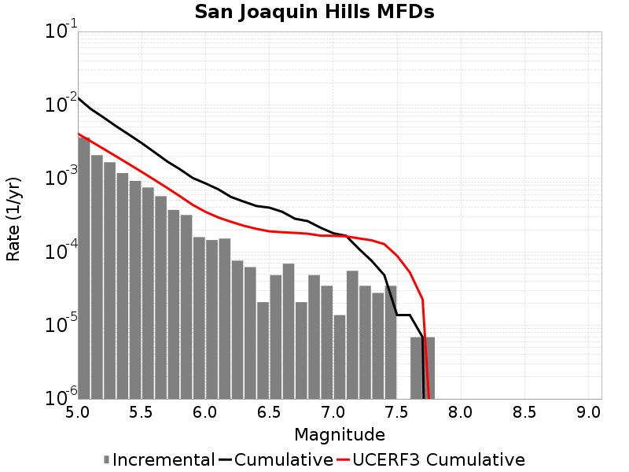

| Magnitude | Incremental Rate | Cumulative Rate | UCERF3 Cumulative Rate |
|-----|-----|-----|-----|
| 5.05 | 0.0036204732 | 0.013162216 | 0.004075514 |
| 5.15 | 0.00207279 | 0.009541743 | 0.0032193833 |
| 5.25 | 0.001658232 | 0.0074689533 | 0.0025393346 |
| 5.35 | 0.0011814903 | 0.0058107213 | 0.0019991526 |
| 5.45 | 9.2584617E-4 | 0.004629231 | 0.0015700709 |
| 5.55 | 7.60023E-4 | 0.0037033847 | 0.0012292392 |
| 5.65 | 5.941998E-4 | 0.0029433616 | 9.5850683E-4 |
| 5.75 | 4.007394E-4 | 0.002349162 | 7.4345653E-4 |
| 5.85 | 3.592836E-4 | 0.0019484225 | 5.72636E-4 |
| 5.95 | 2.07279E-4 | 0.001589139 | 4.3694844E-4 |
| 6.05 | 1.6582319E-4 | 0.00138186 | 3.5118897E-4 |
| 6.15 | 1.727325E-4 | 0.0012160367 | 2.9472896E-4 |
| 6.25 | 1.036395E-4 | 0.0010433043 | 2.570894E-4 |
| 6.35 | 9.67302E-5 | 9.396648E-4 | 2.2719138E-4 |
| 6.45 | 3.4546498E-5 | 8.429346E-4 | 2.0602916E-4 |
| 6.55 | 7.6002296E-5 | 8.083881E-4 | 1.905869E-4 |
| 6.65 | 1.036395E-4 | 7.323858E-4 | 1.8535733E-4 |
| 6.75 | 4.83651E-5 | 6.287463E-4 | 1.8162979E-4 |
| 6.85 | 6.9092996E-5 | 5.803812E-4 | 1.7715026E-4 |
| 6.95 | 6.9092996E-5 | 5.112882E-4 | 1.6665785E-4 |
| 7.05 | 4.83651E-5 | 4.421952E-4 | 1.6593328E-4 |
| 7.15 | 1.105488E-4 | 3.938301E-4 | 1.6320385E-4 |
| 7.25 | 8.2911596E-5 | 2.832813E-4 | 1.5297995E-4 |
| 7.35 | 1.105488E-4 | 2.003697E-4 | 1.4399021E-4 |
| 7.45 | 6.9092996E-5 | 8.98209E-5 | 1.275755E-4 |
| 7.55 | 6.9093E-6 | 2.0727899E-5 | 8.869527E-5 |
| 7.65 | 6.9093E-6 | 1.38186E-5 | 5.2607353E-5 |
| 7.75 | 6.9093E-6 | 6.9093E-6 | 2.2625332E-5 |
| 7.85 | 0.0 | 0.0 | 3.9259817E-8 |

### San Jose
*[(top)](#table-of-contents)*

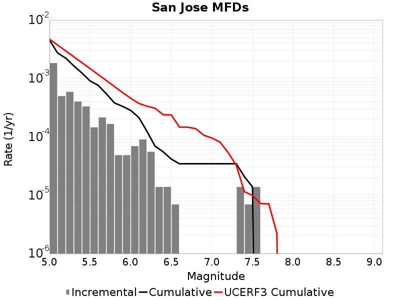

| Magnitude | Incremental Rate | Cumulative Rate | UCERF3 Cumulative Rate |
|-----|-----|-----|-----|
| 5.05 | 0.0018309645 | 0.0049125124 | 0.0047078687 |
| 5.15 | 4.974696E-4 | 0.0030815478 | 0.0037348224 |
| 5.25 | 5.872905E-4 | 0.002584078 | 0.0029619043 |
| 5.35 | 4.007394E-4 | 0.0019967877 | 0.0023479536 |
| 5.45 | 3.3164638E-4 | 0.0015960482 | 0.0018602753 |
| 5.55 | 1.450953E-4 | 0.0012644018 | 0.0014728985 |
| 5.65 | 2.141883E-4 | 0.0011193065 | 0.0011651942 |
| 5.75 | 1.796418E-4 | 9.051183E-4 | 9.2077604E-4 |
| 5.85 | 6.21837E-5 | 7.254765E-4 | 7.266278E-4 |
| 5.95 | 6.9092996E-5 | 6.6329277E-4 | 5.7241035E-4 |
| 6.05 | 8.2911596E-5 | 5.941998E-4 | 4.580236E-4 |
| 6.15 | 9.67302E-5 | 5.112882E-4 | 3.7340602E-4 |
| 6.25 | 6.21837E-5 | 4.14558E-4 | 3.3407225E-4 |
| 6.35 | 1.38186E-5 | 3.523743E-4 | 3.0848855E-4 |
| 6.45 | 2.0727899E-5 | 3.385557E-4 | 2.3928132E-4 |
| 6.55 | 6.9093E-6 | 3.178278E-4 | 2.3659797E-4 |
| 6.65 | 6.9093E-6 | 3.109185E-4 | 1.4653809E-4 |
| 6.75 | 0.0 | 3.0400918E-4 | 1.4653063E-4 |
| 6.85 | 1.38186E-5 | 3.0400918E-4 | 1.3787708E-4 |
| 6.95 | 0.0 | 2.901906E-4 | 1.065003E-4 |
| 7.05 | 2.76372E-5 | 2.901906E-4 | 9.5358206E-5 |
| 7.15 | 5.52744E-5 | 2.625534E-4 | 8.108768E-5 |
| 7.25 | 3.4546498E-5 | 2.07279E-4 | 5.351143E-5 |
| 7.35 | 7.6002296E-5 | 1.727325E-4 | 3.246458E-5 |
| 7.45 | 4.1455798E-5 | 9.67302E-5 | 1.1467763E-5 |
| 7.55 | 1.38186E-5 | 5.52744E-5 | 9.905677E-6 |
| 7.65 | 2.0727899E-5 | 4.1455798E-5 | 7.185031E-6 |
| 7.75 | 1.38186E-5 | 2.0727899E-5 | 7.1115023E-6 |
| 7.85 | 6.9093E-6 | 6.9093E-6 | 2.2153151E-6 |

### San Juan
*[(top)](#table-of-contents)*

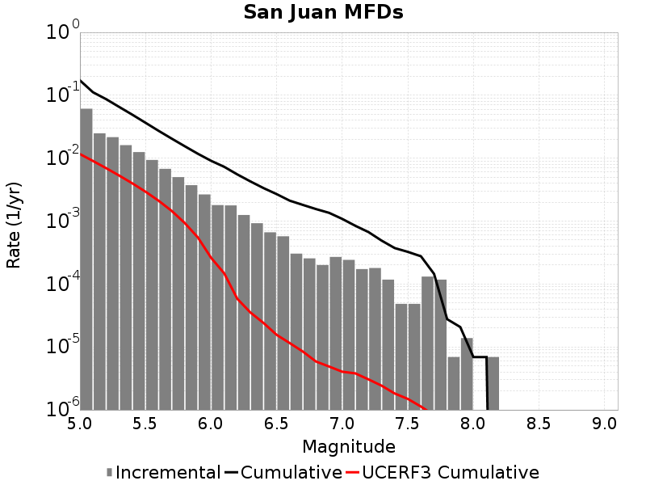

| Magnitude | Incremental Rate | Cumulative Rate | UCERF3 Cumulative Rate |
|-----|-----|-----|-----|
| 5.05 | 0.061154213 | 0.17855012 | 0.011651279 |
| 5.15 | 0.02485275 | 0.117395915 | 0.009031136 |
| 5.25 | 0.021591563 | 0.09254316 | 0.0069498816 |
| 5.35 | 0.016112488 | 0.0709516 | 0.0052966825 |
| 5.45 | 0.012505833 | 0.054839112 | 0.0039834995 |
| 5.55 | 0.009417376 | 0.04233328 | 0.0029404014 |
| 5.65 | 0.0068402067 | 0.032915905 | 0.0021118391 |
| 5.75 | 0.0051059728 | 0.026075698 | 0.0014536888 |
| 5.85 | 0.0038622986 | 0.020969724 | 9.309014E-4 |
| 5.95 | 0.0028811782 | 0.017107427 | 5.483934E-4 |
| 6.05 | 0.001982969 | 0.0142262485 | 2.6190293E-4 |
| 6.15 | 0.0019207854 | 0.012243279 | 1.4815832E-4 |
| 6.25 | 0.0015338645 | 0.010322494 | 5.829936E-5 |
| 6.35 | 0.0011538531 | 0.008788629 | 3.5316418E-5 |
| 6.45 | 9.2584617E-4 | 0.007634776 | 2.407052E-5 |
| 6.55 | 7.185672E-4 | 0.0067089302 | 1.5585545E-5 |
| 6.65 | 4.767417E-4 | 0.005990363 | 1.1517444E-5 |
| 6.75 | 4.698324E-4 | 0.0055136215 | 8.444658E-6 |
| 6.85 | 4.83651E-4 | 0.005043789 | 5.8688424E-6 |
| 6.95 | 5.734719E-4 | 0.004560138 | 4.8847314E-6 |
| 7.05 | 4.421952E-4 | 0.003986666 | 4.041427E-6 |
| 7.15 | 3.247371E-4 | 0.0035444708 | 3.801629E-6 |
| 7.25 | 3.3164638E-4 | 0.0032197337 | 3.0545907E-6 |
| 7.35 | 2.625534E-4 | 0.0028880874 | 2.4261296E-6 |
| 7.45 | 3.45465E-4 | 0.0026255338 | 1.8225845E-6 |
| 7.55 | 4.905603E-4 | 0.002280069 | 1.4943679E-6 |
| 7.65 | 8.7748107E-4 | 0.0017895086 | 1.1298653E-6 |
| 7.75 | 7.254765E-4 | 9.120276E-4 | 8.2220447E-7 |
| 7.85 | 7.6002296E-5 | 1.865511E-4 | 4.5383788E-7 |
| 7.95 | 1.036395E-4 | 1.105488E-4 | 2.1445098E-7 |
| 8.05 | 0.0 | 6.9093E-6 | 5.154039E-8 |
| 8.15 | 6.9093E-6 | 6.9093E-6 | 4.0369383E-9 |

### San Luis Range - Oceano 2011 CFM
*[(top)](#table-of-contents)*

| Magnitude | Incremental Rate | Cumulative Rate | UCERF3 Cumulative Rate |
|-----|-----|-----|-----|
| 5.05 | 6.9093E-6 | 5.52744E-5 | 0.0015228445 |
| 5.15 | 0.0 | 4.83651E-5 | 0.0012081392 |
| 5.25 | 6.9093E-6 | 4.83651E-5 | 9.581599E-4 |
| 5.35 | 0.0 | 4.1455798E-5 | 7.595943E-4 |
| 5.45 | 0.0 | 4.1455798E-5 | 6.01868E-4 |
| 5.55 | 0.0 | 4.1455798E-5 | 4.7658157E-4 |
| 5.65 | 0.0 | 4.1455798E-5 | 3.7706303E-4 |
| 5.75 | 0.0 | 4.1455798E-5 | 2.9801263E-4 |
| 5.85 | 0.0 | 4.1455798E-5 | 2.3522065E-4 |
| 5.95 | 0.0 | 4.1455798E-5 | 1.8534322E-4 |
| 6.05 | 0.0 | 4.1455798E-5 | 1.4986501E-4 |
| 6.15 | 0.0 | 4.1455798E-5 | 1.2188105E-4 |
| 6.25 | 0.0 | 4.1455798E-5 | 1.0471954E-4 |
| 6.35 | 0.0 | 4.1455798E-5 | 9.743923E-5 |
| 6.45 | 0.0 | 4.1455798E-5 | 7.011643E-5 |
| 6.55 | 0.0 | 4.1455798E-5 | 6.854357E-5 |
| 6.65 | 0.0 | 4.1455798E-5 | 3.8002905E-5 |
| 6.75 | 0.0 | 4.1455798E-5 | 3.7890044E-5 |
| 6.85 | 0.0 | 4.1455798E-5 | 3.375653E-5 |
| 6.95 | 0.0 | 4.1455798E-5 | 2.5618629E-5 |
| 7.05 | 0.0 | 4.1455798E-5 | 1.6901635E-5 |
| 7.15 | 0.0 | 4.1455798E-5 | 1.3375423E-5 |
| 7.25 | 0.0 | 4.1455798E-5 | 1.1253915E-5 |
| 7.35 | 0.0 | 4.1455798E-5 | 9.418661E-6 |
| 7.45 | 6.9093E-6 | 4.1455798E-5 | 7.466646E-6 |
| 7.55 | 6.9093E-6 | 3.4546498E-5 | 4.025845E-6 |
| 7.65 | 6.9093E-6 | 2.76372E-5 | 1.7890821E-6 |
| 7.75 | 1.38186E-5 | 2.0727899E-5 | 1.6089905E-7 |
| 7.85 | 6.9093E-6 | 6.9093E-6 | 0.0 |

### San Luis Range - Pecho 2011 CFM
*[(top)](#table-of-contents)*

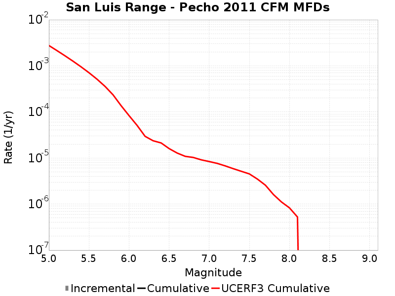

| Magnitude | Incremental Rate | Cumulative Rate | UCERF3 Cumulative Rate |
|-----|-----|-----|-----|
| 5.05 | 0.0 | 0.0 | 0.0027665305 |
| 5.15 | 0.0 | 0.0 | 0.0021478776 |
| 5.25 | 0.0 | 0.0 | 0.001656464 |
| 5.35 | 0.0 | 0.0 | 0.0012661204 |
| 5.45 | 0.0 | 0.0 | 9.560594E-4 |
| 5.55 | 0.0 | 0.0 | 7.0976914E-4 |
| 5.65 | 0.0 | 0.0 | 5.141339E-4 |
| 5.75 | 0.0 | 0.0 | 3.587353E-4 |
| 5.85 | 0.0 | 0.0 | 2.352978E-4 |
| 5.95 | 0.0 | 0.0 | 1.3724792E-4 |
| 6.05 | 0.0 | 0.0 | 8.312204E-5 |
| 6.15 | 0.0 | 0.0 | 5.102197E-5 |
| 6.25 | 0.0 | 0.0 | 2.9513218E-5 |
| 6.35 | 0.0 | 0.0 | 2.3668312E-5 |
| 6.45 | 0.0 | 0.0 | 2.1205986E-5 |
| 6.55 | 0.0 | 0.0 | 1.598198E-5 |
| 6.65 | 0.0 | 0.0 | 1.28017555E-5 |
| 6.75 | 0.0 | 0.0 | 1.08686045E-5 |
| 6.85 | 0.0 | 0.0 | 1.0278481E-5 |
| 6.95 | 0.0 | 0.0 | 9.1190805E-6 |
| 7.05 | 0.0 | 0.0 | 8.364636E-6 |
| 7.15 | 0.0 | 0.0 | 7.634322E-6 |
| 7.25 | 0.0 | 0.0 | 6.730057E-6 |
| 7.35 | 0.0 | 0.0 | 5.859997E-6 |
| 7.45 | 0.0 | 0.0 | 5.141553E-6 |
| 7.55 | 0.0 | 0.0 | 4.513665E-6 |
| 7.65 | 0.0 | 0.0 | 3.4905283E-6 |
| 7.75 | 0.0 | 0.0 | 2.5691998E-6 |
| 7.85 | 0.0 | 0.0 | 1.611753E-6 |
| 7.95 | 0.0 | 0.0 | 1.1118119E-6 |
| 8.05 | 0.0 | 0.0 | 8.279645E-7 |
| 8.15 | 0.0 | 0.0 | 5.234879E-7 |

### San Luis Range 2011 CFM
*[(top)](#table-of-contents)*

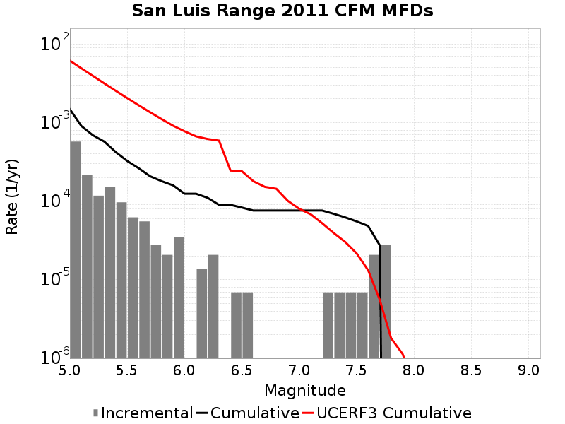

| Magnitude | Incremental Rate | Cumulative Rate | UCERF3 Cumulative Rate |
|-----|-----|-----|-----|
| 5.05 | 5.734719E-4 | 0.0016513227 | 0.006142113 |
| 5.15 | 2.141883E-4 | 0.0010778508 | 0.0049114604 |
| 5.25 | 1.174581E-4 | 8.636625E-4 | 0.0039339187 |
| 5.35 | 1.5200459E-4 | 7.462044E-4 | 0.0031574294 |
| 5.45 | 1.036395E-4 | 5.941998E-4 | 0.0025406422 |
| 5.55 | 6.21837E-5 | 4.905603E-4 | 0.0020507106 |
| 5.65 | 5.52744E-5 | 4.283766E-4 | 0.0016615442 |
| 5.75 | 2.76372E-5 | 3.731022E-4 | 0.0013524183 |
| 5.85 | 2.0727899E-5 | 3.45465E-4 | 0.0011068708 |
| 5.95 | 3.4546498E-5 | 3.247371E-4 | 9.118256E-4 |
| 6.05 | 6.9093E-6 | 2.901906E-4 | 7.7464787E-4 |
| 6.15 | 1.38186E-5 | 2.832813E-4 | 6.678747E-4 |
| 6.25 | 2.0727899E-5 | 2.694627E-4 | 6.18929E-4 |
| 6.35 | 0.0 | 2.487348E-4 | 5.902831E-4 |
| 6.45 | 1.38186E-5 | 2.487348E-4 | 2.4536523E-4 |
| 6.55 | 6.9093E-6 | 2.349162E-4 | 2.3989154E-4 |
| 6.65 | 0.0 | 2.280069E-4 | 1.7909297E-4 |
| 6.75 | 6.9093E-6 | 2.280069E-4 | 1.5205398E-4 |
| 6.85 | 0.0 | 2.210976E-4 | 1.4382794E-4 |
| 6.95 | 1.38186E-5 | 2.210976E-4 | 1.0078125E-4 |
| 7.05 | 2.76372E-5 | 2.07279E-4 | 7.996456E-5 |
| 7.15 | 6.9093E-6 | 1.796418E-4 | 6.8034096E-5 |
| 7.25 | 3.4546498E-5 | 1.727325E-4 | 5.2270472E-5 |
| 7.35 | 6.9093E-6 | 1.3818599E-4 | 3.9323055E-5 |
| 7.45 | 2.0727899E-5 | 1.312767E-4 | 3.0267996E-5 |
| 7.55 | 4.1455798E-5 | 1.105488E-4 | 2.1635786E-5 |
| 7.65 | 2.76372E-5 | 6.9092996E-5 | 1.3208056E-5 |
| 7.75 | 3.4546498E-5 | 4.1455798E-5 | 5.6010153E-6 |
| 7.85 | 6.9093E-6 | 6.9093E-6 | 1.8033165E-6 |
| 7.95 | 0.0 | 0.0 | 1.1387228E-6 |
| 8.05 | 0.0 | 0.0 | 4.6348643E-7 |

### San Pedro Basin
*[(top)](#table-of-contents)*

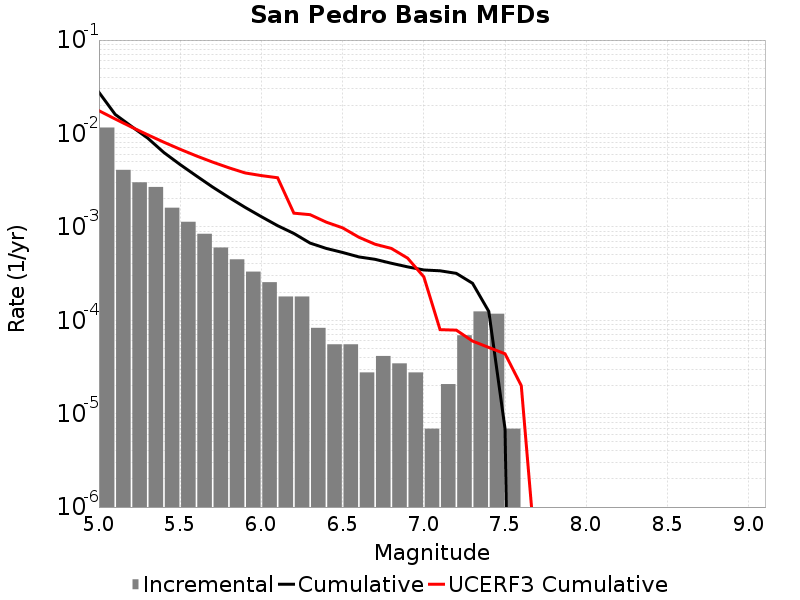

| Magnitude | Incremental Rate | Cumulative Rate | UCERF3 Cumulative Rate |
|-----|-----|-----|-----|
| 5.05 | 0.011573077 | 0.027581925 | 0.017518312 |
| 5.15 | 0.004076487 | 0.016008848 | 0.014285274 |
| 5.25 | 0.002998636 | 0.011932361 | 0.011717181 |
| 5.35 | 0.002673899 | 0.008933725 | 0.009677271 |
| 5.45 | 0.0016029576 | 0.0062598255 | 0.008056914 |
| 5.55 | 0.0011331252 | 0.004656868 | 0.0067698183 |
| 5.65 | 8.429346E-4 | 0.003523743 | 0.005747442 |
| 5.75 | 6.011091E-4 | 0.0026808083 | 0.0049353396 |
| 5.85 | 4.491045E-4 | 0.0020796992 | 0.0042902636 |
| 5.95 | 3.3164638E-4 | 0.0016305947 | 0.0037778616 |
| 6.05 | 2.556441E-4 | 0.0012989484 | 0.0035385063 |
| 6.15 | 1.796418E-4 | 0.0010433043 | 0.0033555918 |
| 6.25 | 1.796418E-4 | 8.636625E-4 | 0.0014014312 |
| 6.35 | 8.2911596E-5 | 6.840207E-4 | 0.0013505355 |
| 6.45 | 5.52744E-5 | 6.011091E-4 | 0.0011223449 |
| 6.55 | 5.52744E-5 | 5.458347E-4 | 9.7611145E-4 |
| 6.65 | 3.4546498E-5 | 4.905603E-4 | 7.745611E-4 |
| 6.75 | 4.1455798E-5 | 4.560138E-4 | 6.5164274E-4 |
| 6.85 | 3.4546498E-5 | 4.14558E-4 | 5.8795966E-4 |
| 6.95 | 2.76372E-5 | 3.800115E-4 | 4.6280245E-4 |
| 7.05 | 6.9093E-6 | 3.523743E-4 | 2.9181215E-4 |
| 7.15 | 2.0727899E-5 | 3.45465E-4 | 7.931485E-5 |
| 7.25 | 6.9092996E-5 | 3.247371E-4 | 7.838417E-5 |
| 7.35 | 1.243674E-4 | 2.556441E-4 | 5.983692E-5 |
| 7.45 | 1.174581E-4 | 1.312767E-4 | 5.1119427E-5 |
| 7.55 | 1.38186E-5 | 1.38186E-5 | 4.3754426E-5 |
| 7.65 | 0.0 | 0.0 | 1.9938894E-5 |
| 7.75 | 0.0 | 0.0 | 1.734362E-7 |
| 7.85 | 0.0 | 0.0 | 1.5959825E-8 |

### San Pedro Escarpment
*[(top)](#table-of-contents)*

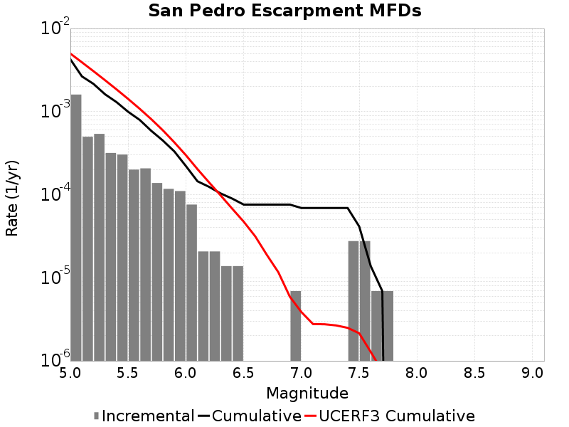

| Magnitude | Incremental Rate | Cumulative Rate | UCERF3 Cumulative Rate |
|-----|-----|-----|-----|
| 5.05 | 0.0016029576 | 0.005257977 | 0.0049934355 |
| 5.15 | 4.974696E-4 | 0.0036550197 | 0.003918804 |
| 5.25 | 5.389254E-4 | 0.00315755 | 0.003065194 |
| 5.35 | 3.178278E-4 | 0.0026186246 | 0.0023871474 |
| 5.45 | 3.0400918E-4 | 0.0023007968 | 0.001848556 |
| 5.55 | 2.003697E-4 | 0.0019967877 | 0.0014207375 |
| 5.65 | 2.141883E-4 | 0.001796418 | 0.0010809092 |
| 5.75 | 1.589139E-4 | 0.0015822296 | 8.10974E-4 |
| 5.85 | 1.312767E-4 | 0.0014233157 | 5.965568E-4 |
| 5.95 | 1.3818599E-4 | 0.001292039 | 4.262392E-4 |
| 6.05 | 8.98209E-5 | 0.0011538531 | 2.9867186E-4 |
| 6.15 | 3.4546498E-5 | 0.0010640322 | 2.0302806E-4 |
| 6.25 | 6.9092996E-5 | 0.0010294857 | 1.4084487E-4 |
| 6.35 | 9.67302E-5 | 9.603927E-4 | 9.8276716E-5 |
| 6.45 | 9.67302E-5 | 8.636625E-4 | 6.80419E-5 |
| 6.55 | 6.21837E-5 | 7.6693227E-4 | 4.7388825E-5 |
| 6.65 | 6.21837E-5 | 7.047486E-4 | 3.152185E-5 |
| 6.75 | 8.2911596E-5 | 6.425649E-4 | 1.8918263E-5 |
| 6.85 | 1.174581E-4 | 5.596533E-4 | 1.1667407E-5 |
| 6.95 | 1.243674E-4 | 4.421952E-4 | 5.9078475E-6 |
| 7.05 | 4.1455798E-5 | 3.178278E-4 | 3.8595686E-6 |
| 7.15 | 4.1455798E-5 | 2.7637198E-4 | 2.7748983E-6 |
| 7.25 | 3.4546498E-5 | 2.349162E-4 | 2.756194E-6 |
| 7.35 | 3.4546498E-5 | 2.003697E-4 | 2.6700345E-6 |
| 7.45 | 5.52744E-5 | 1.6582319E-4 | 2.4957728E-6 |
| 7.55 | 3.4546498E-5 | 1.105488E-4 | 2.1489986E-6 |
| 7.65 | 3.4546498E-5 | 7.6002296E-5 | 1.2798913E-6 |
| 7.75 | 2.76372E-5 | 4.1455798E-5 | 7.5029334E-7 |
| 7.85 | 6.9093E-6 | 1.38186E-5 | 2.6268884E-7 |
| 7.95 | 0.0 | 6.9093E-6 | 4.9641077E-8 |
| 8.05 | 6.9093E-6 | 6.9093E-6 | 0.0 |

### San Vicente
*[(top)](#table-of-contents)*

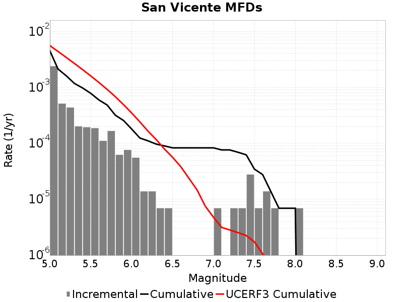

| Magnitude | Incremental Rate | Cumulative Rate | UCERF3 Cumulative Rate |
|-----|-----|-----|-----|
| 5.05 | 0.0023837085 | 0.004815782 | 0.0055698776 |
| 5.15 | 5.112882E-4 | 0.0024320735 | 0.004374959 |
| 5.25 | 4.3528588E-4 | 0.0019207854 | 0.0034258012 |
| 5.35 | 2.003697E-4 | 0.0014854994 | 0.0026718585 |
| 5.45 | 1.934604E-4 | 0.0012851298 | 0.0020729804 |
| 5.55 | 1.865511E-4 | 0.0010916694 | 0.0015972747 |
| 5.65 | 1.105488E-4 | 9.051183E-4 | 0.0012194082 |
| 5.75 | 1.6582319E-4 | 7.945695E-4 | 9.192582E-4 |
| 5.85 | 6.21837E-5 | 6.287463E-4 | 6.808406E-4 |
| 5.95 | 8.2911596E-5 | 5.665626E-4 | 4.914587E-4 |
| 6.05 | 5.52744E-5 | 4.83651E-4 | 3.4776068E-4 |
| 6.15 | 1.38186E-5 | 4.283766E-4 | 2.4148129E-4 |
| 6.25 | 2.0727899E-5 | 4.14558E-4 | 1.6454907E-4 |
| 6.35 | 2.0727899E-5 | 3.938301E-4 | 1.1657311E-4 |
| 6.45 | 2.0727899E-5 | 3.731022E-4 | 7.92254E-5 |
| 6.55 | 2.76372E-5 | 3.523743E-4 | 5.6200817E-5 |
| 6.65 | 1.38186E-5 | 3.247371E-4 | 3.821032E-5 |
| 6.75 | 1.38186E-5 | 3.109185E-4 | 2.3683464E-5 |
| 6.85 | 3.4546498E-5 | 2.970999E-4 | 1.4625135E-5 |
| 6.95 | 4.1455798E-5 | 2.625534E-4 | 7.5082435E-6 |
| 7.05 | 1.38186E-5 | 2.210976E-4 | 4.7757267E-6 |
| 7.15 | 2.76372E-5 | 2.07279E-4 | 3.1431255E-6 |
| 7.25 | 3.4546498E-5 | 1.796418E-4 | 2.8204786E-6 |
| 7.35 | 2.0727899E-5 | 1.450953E-4 | 2.5347852E-6 |
| 7.45 | 4.83651E-5 | 1.243674E-4 | 2.2447027E-6 |
| 7.55 | 2.76372E-5 | 7.6002296E-5 | 1.7302104E-6 |
| 7.65 | 2.0727899E-5 | 4.83651E-5 | 1.0611805E-6 |
| 7.75 | 2.0727899E-5 | 2.76372E-5 | 5.6855947E-7 |
| 7.85 | 0.0 | 6.9093E-6 | 3.800911E-7 |
| 7.95 | 0.0 | 6.9093E-6 | 2.602545E-10 |
| 8.05 | 6.9093E-6 | 6.9093E-6 | 0.0 |

### Santa Cruz Catalina Ridge alt1
*[(top)](#table-of-contents)*

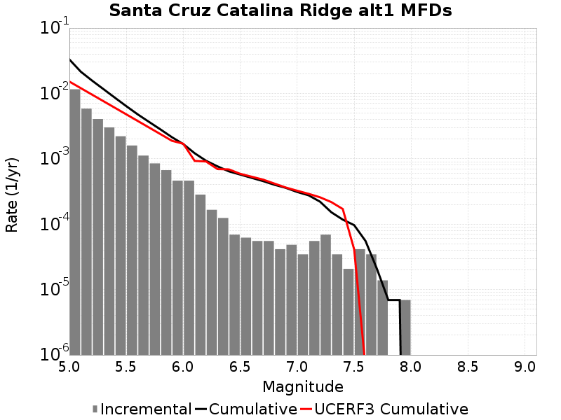

| Magnitude | Incremental Rate | Cumulative Rate | UCERF3 Cumulative Rate |
|-----|-----|-----|-----|
| 5.05 | 0.011566168 | 0.033199187 | 0.0151727665 |
| 5.15 | 0.005845268 | 0.021633018 | 0.012046545 |
| 5.25 | 0.004055759 | 0.01578775 | 0.009563298 |
| 5.35 | 0.003019364 | 0.011731992 | 0.007590785 |
| 5.45 | 0.0022109759 | 0.008712627 | 0.006023963 |
| 5.55 | 0.0015960482 | 0.0065016514 | 0.0047793915 |
| 5.65 | 0.0011193065 | 0.004905603 | 0.003790793 |
| 5.75 | 8.567532E-4 | 0.0037862964 | 0.0030055216 |
| 5.85 | 6.702021E-4 | 0.0029295431 | 0.0023817583 |
| 5.95 | 4.767417E-4 | 0.002259341 | 0.0018862855 |
| 6.05 | 4.698324E-4 | 0.0017825994 | 0.0016999855 |
| 6.15 | 2.970999E-4 | 0.0013127669 | 9.293678E-4 |
| 6.25 | 1.6582319E-4 | 0.0010156671 | 9.0940174E-4 |
| 6.35 | 1.243674E-4 | 8.498439E-4 | 6.964978E-4 |
| 6.45 | 7.6002296E-5 | 7.254765E-4 | 6.889808E-4 |
| 6.55 | 6.9092996E-5 | 6.494742E-4 | 5.892687E-4 |
| 6.65 | 5.52744E-5 | 5.803812E-4 | 5.3252175E-4 |
| 6.75 | 5.52744E-5 | 5.251068E-4 | 4.8065776E-4 |
| 6.85 | 4.1455798E-5 | 4.698324E-4 | 4.1784582E-4 |
| 6.95 | 5.52744E-5 | 4.283766E-4 | 3.637325E-4 |
| 7.05 | 5.52744E-5 | 3.731022E-4 | 3.248346E-4 |
| 7.15 | 6.21837E-5 | 3.178278E-4 | 2.9141342E-4 |
| 7.25 | 6.9092996E-5 | 2.556441E-4 | 2.5797132E-4 |
| 7.35 | 4.1455798E-5 | 1.865511E-4 | 2.1758015E-4 |
| 7.45 | 3.4546498E-5 | 1.450953E-4 | 1.7069183E-4 |
| 7.55 | 4.83651E-5 | 1.105488E-4 | 4.1247135E-5 |
| 7.65 | 3.4546498E-5 | 6.21837E-5 | 6.467189E-7 |
| 7.75 | 2.0727899E-5 | 2.76372E-5 | 2.166714E-7 |
| 7.85 | 0.0 | 6.9093E-6 | 4.2915563E-8 |
| 7.95 | 6.9093E-6 | 6.9093E-6 | 0.0 |

### Santa Cruz Island
*[(top)](#table-of-contents)*

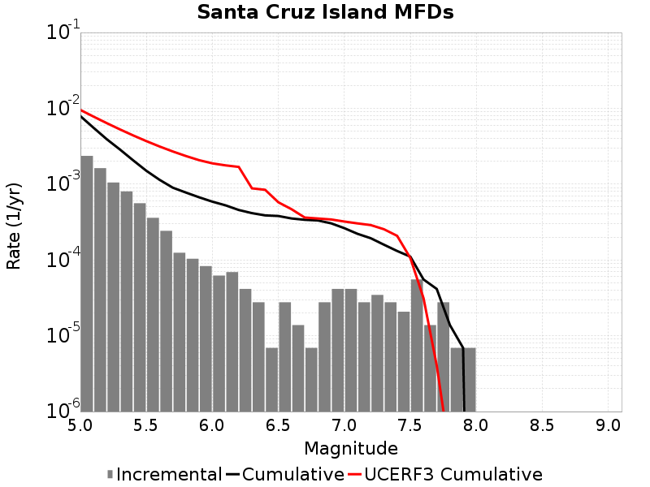

| Magnitude | Incremental Rate | Cumulative Rate | UCERF3 Cumulative Rate |
|-----|-----|-----|-----|
| 5.05 | 0.0023560713 | 0.008429346 | 0.0095239235 |
| 5.15 | 0.0016236855 | 0.0060732746 | 0.007769918 |
| 5.25 | 0.0010502136 | 0.004449589 | 0.0063766623 |
| 5.35 | 8.083881E-4 | 0.0033993756 | 0.00526996 |
| 5.45 | 5.596533E-4 | 0.0025909874 | 0.004390875 |
| 5.55 | 3.731022E-4 | 0.0020313342 | 0.003692593 |
| 5.65 | 2.832813E-4 | 0.001658232 | 0.0031379277 |
| 5.75 | 1.450953E-4 | 0.0013749506 | 0.0026973416 |
| 5.85 | 1.3818599E-4 | 0.0012298553 | 0.0023473715 |
| 5.95 | 1.450953E-4 | 0.0010916694 | 0.0020693806 |
| 6.05 | 1.036395E-4 | 9.465741E-4 | 0.0018797397 |
| 6.15 | 1.105488E-4 | 8.429346E-4 | 0.0017682682 |
| 6.25 | 4.83651E-5 | 7.323858E-4 | 0.001686745 |
| 6.35 | 3.4546498E-5 | 6.840207E-4 | 8.800086E-4 |
| 6.45 | 2.0727899E-5 | 6.494742E-4 | 8.4165717E-4 |
| 6.55 | 2.76372E-5 | 6.287463E-4 | 5.7611766E-4 |
| 6.65 | 1.38186E-5 | 6.011091E-4 | 4.6669762E-4 |
| 6.75 | 6.9093E-6 | 5.872905E-4 | 3.6265168E-4 |
| 6.85 | 4.1455798E-5 | 5.803812E-4 | 3.5219305E-4 |
| 6.95 | 5.52744E-5 | 5.389254E-4 | 3.4188558E-4 |
| 7.05 | 5.52744E-5 | 4.83651E-4 | 3.2117675E-4 |
| 7.15 | 3.4546498E-5 | 4.283766E-4 | 3.033914E-4 |
| 7.25 | 4.1455798E-5 | 3.938301E-4 | 2.883588E-4 |
| 7.35 | 3.4546498E-5 | 3.523743E-4 | 2.5418517E-4 |
| 7.45 | 4.1455798E-5 | 3.178278E-4 | 2.0794693E-4 |
| 7.55 | 6.21837E-5 | 2.7637198E-4 | 1.06067884E-4 |
| 7.65 | 3.4546498E-5 | 2.141883E-4 | 3.1327356E-5 |
| 7.75 | 1.036395E-4 | 1.796418E-4 | 4.0524255E-6 |
| 7.85 | 6.9092996E-5 | 7.6002296E-5 | 2.676411E-7 |
| 7.95 | 6.9093E-6 | 6.9093E-6 | 6.463275E-9 |

### Santa Monica Bay
*[(top)](#table-of-contents)*

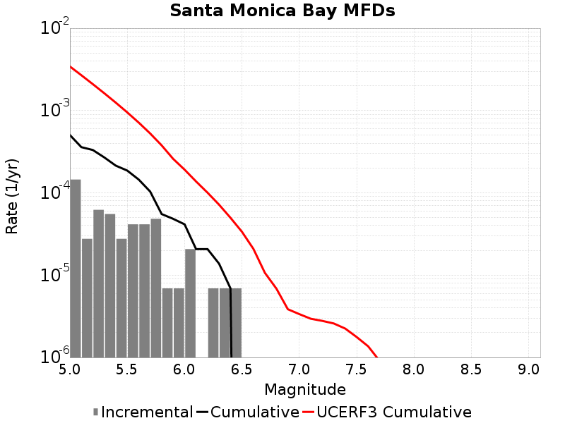

| Magnitude | Incremental Rate | Cumulative Rate | UCERF3 Cumulative Rate |
|-----|-----|-----|-----|
| 5.05 | 1.450953E-4 | 8.29116E-4 | 0.0034337733 |
| 5.15 | 2.76372E-5 | 6.840207E-4 | 0.0026867795 |
| 5.25 | 6.21837E-5 | 6.5638346E-4 | 0.002093421 |
| 5.35 | 5.52744E-5 | 5.941998E-4 | 0.0016220995 |
| 5.45 | 2.76372E-5 | 5.389254E-4 | 0.0012477157 |
| 5.55 | 4.1455798E-5 | 5.112882E-4 | 9.5033203E-4 |
| 5.65 | 5.52744E-5 | 4.698324E-4 | 7.141118E-4 |
| 5.75 | 6.21837E-5 | 4.14558E-4 | 5.2647537E-4 |
| 5.85 | 1.38186E-5 | 3.523743E-4 | 3.774305E-4 |
| 5.95 | 2.0727899E-5 | 3.385557E-4 | 2.5903992E-4 |
| 6.05 | 4.1455798E-5 | 3.178278E-4 | 1.9132199E-4 |
| 6.15 | 2.0727899E-5 | 2.7637198E-4 | 1.3753181E-4 |
| 6.25 | 3.4546498E-5 | 2.556441E-4 | 1.0046851E-4 |
| 6.35 | 2.0727899E-5 | 2.210976E-4 | 7.19745E-5 |
| 6.45 | 2.0727899E-5 | 2.003697E-4 | 4.9779603E-5 |
| 6.55 | 6.9093E-6 | 1.796418E-4 | 3.3652133E-5 |
| 6.65 | 6.9093E-6 | 1.727325E-4 | 2.084163E-5 |
| 6.75 | 2.0727899E-5 | 1.6582319E-4 | 1.0665886E-5 |
| 6.85 | 1.38186E-5 | 1.450953E-4 | 6.87082E-6 |
| 6.95 | 0.0 | 1.312767E-4 | 3.8562916E-6 |
| 7.05 | 6.9093E-6 | 1.312767E-4 | 3.3634926E-6 |
| 7.15 | 1.38186E-5 | 1.243674E-4 | 2.9549694E-6 |
| 7.25 | 6.9093E-6 | 1.105488E-4 | 2.7838794E-6 |
| 7.35 | 2.76372E-5 | 1.036395E-4 | 2.5904276E-6 |
| 7.45 | 6.21837E-5 | 7.6002296E-5 | 2.2459362E-6 |
| 7.55 | 6.9093E-6 | 1.38186E-5 | 1.7711826E-6 |
| 7.65 | 0.0 | 6.9093E-6 | 1.3666735E-6 |
| 7.75 | 6.9093E-6 | 6.9093E-6 | 9.084191E-7 |
| 7.85 | 0.0 | 0.0 | 1.8042178E-7 |

### Santa Monica alt 1
*[(top)](#table-of-contents)*

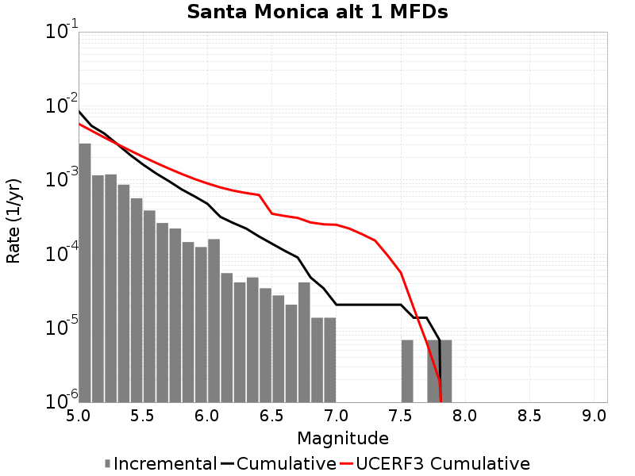

| Magnitude | Incremental Rate | Cumulative Rate | UCERF3 Cumulative Rate |
|-----|-----|-----|-----|
| 5.05 | 0.0031022755 | 0.009065001 | 0.005737078 |
| 5.15 | 0.0011538531 | 0.0059627257 | 0.0046296795 |
| 5.25 | 0.0011883996 | 0.004808873 | 0.0037500416 |
| 5.35 | 8.7748107E-4 | 0.0036204732 | 0.0030513206 |
| 5.45 | 6.011091E-4 | 0.002742992 | 0.0024963066 |
| 5.55 | 4.6292308E-4 | 0.002141883 | 0.0020554434 |
| 5.65 | 3.178278E-4 | 0.0016789599 | 0.0017052533 |
| 5.75 | 2.487348E-4 | 0.0013611321 | 0.0014270875 |
| 5.85 | 1.796418E-4 | 0.0011123973 | 0.0012061325 |
| 5.95 | 1.6582319E-4 | 9.327555E-4 | 0.0010306216 |
| 6.05 | 1.589139E-4 | 7.6693227E-4 | 8.979453E-4 |
| 6.15 | 6.21837E-5 | 6.0801837E-4 | 7.940189E-4 |
| 6.25 | 5.52744E-5 | 5.458347E-4 | 7.182946E-4 |
| 6.35 | 6.21837E-5 | 4.905603E-4 | 6.666366E-4 |
| 6.45 | 4.1455798E-5 | 4.283766E-4 | 6.27164E-4 |
| 6.55 | 3.4546498E-5 | 3.869208E-4 | 3.50374E-4 |
| 6.65 | 3.4546498E-5 | 3.523743E-4 | 3.2637984E-4 |
| 6.75 | 6.9092996E-5 | 3.178278E-4 | 3.0750487E-4 |
| 6.85 | 4.83651E-5 | 2.487348E-4 | 2.6724528E-4 |
| 6.95 | 2.0727899E-5 | 2.003697E-4 | 2.5227445E-4 |
| 7.05 | 0.0 | 1.796418E-4 | 2.4834022E-4 |
| 7.15 | 2.76372E-5 | 1.796418E-4 | 2.2097421E-4 |
| 7.25 | 2.76372E-5 | 1.5200459E-4 | 1.8525156E-4 |
| 7.35 | 2.0727899E-5 | 1.243674E-4 | 1.5214E-4 |
| 7.45 | 4.1455798E-5 | 1.036395E-4 | 9.4554416E-5 |
| 7.55 | 1.38186E-5 | 6.21837E-5 | 5.6025256E-5 |
| 7.65 | 1.38186E-5 | 4.83651E-5 | 1.8604727E-5 |
| 7.75 | 2.0727899E-5 | 3.4546498E-5 | 6.4084456E-6 |
| 7.85 | 6.9093E-6 | 1.38186E-5 | 1.942631E-6 |
| 7.95 | 0.0 | 6.9093E-6 | 6.7235293E-9 |
| 8.05 | 6.9093E-6 | 6.9093E-6 | 0.0 |

### Santa Rosa Island
*[(top)](#table-of-contents)*

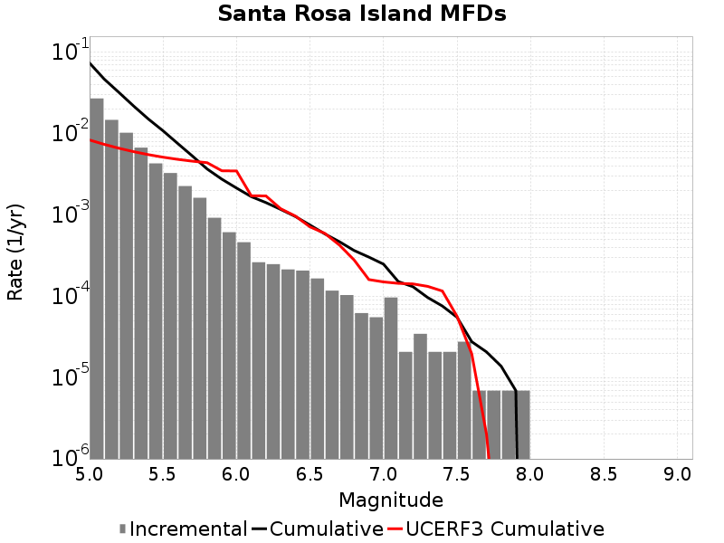

| Magnitude | Incremental Rate | Cumulative Rate | UCERF3 Cumulative Rate |
|-----|-----|-----|-----|
| 5.05 | 0.027201913 | 0.074578986 | 0.008382223 |
| 5.15 | 0.014820448 | 0.04737707 | 0.0074107964 |
| 5.25 | 0.0102948565 | 0.03255662 | 0.0066391653 |
| 5.35 | 0.006750386 | 0.022261765 | 0.006026237 |
| 5.45 | 0.0043183123 | 0.015511379 | 0.0055393702 |
| 5.55 | 0.0032888267 | 0.011193066 | 0.0051526385 |
| 5.65 | 0.0022731596 | 0.007904239 | 0.004845447 |
| 5.75 | 0.0016444133 | 0.0056310794 | 0.0046014357 |
| 5.85 | 9.327555E-4 | 0.003986666 | 0.0044076107 |
| 5.95 | 6.287463E-4 | 0.0030539106 | 0.0035088134 |
| 6.05 | 4.767417E-4 | 0.0024251642 | 0.0034862945 |
| 6.15 | 2.901906E-4 | 0.0019484225 | 0.001727913 |
| 6.25 | 2.694627E-4 | 0.001658232 | 0.001719222 |
| 6.35 | 2.349162E-4 | 0.0013887692 | 0.0011970701 |
| 6.45 | 2.210976E-4 | 0.0011538531 | 9.726145E-4 |
| 6.55 | 1.727325E-4 | 9.327555E-4 | 7.1462203E-4 |
| 6.65 | 1.312767E-4 | 7.60023E-4 | 5.9603417E-4 |
| 6.75 | 1.036395E-4 | 6.287463E-4 | 4.2714895E-4 |
| 6.85 | 6.9092996E-5 | 5.251068E-4 | 2.797142E-4 |
| 6.95 | 6.9092996E-5 | 4.560138E-4 | 1.6078158E-4 |
| 7.05 | 1.174581E-4 | 3.869208E-4 | 1.5044706E-4 |
| 7.15 | 2.76372E-5 | 2.694627E-4 | 1.4451744E-4 |
| 7.25 | 4.1455798E-5 | 2.418255E-4 | 1.4222575E-4 |
| 7.35 | 2.76372E-5 | 2.003697E-4 | 1.3268965E-4 |
| 7.45 | 4.1455798E-5 | 1.727325E-4 | 1.1627429E-4 |
| 7.55 | 3.4546498E-5 | 1.312767E-4 | 5.673343E-5 |
| 7.65 | 2.0727899E-5 | 9.67302E-5 | 1.9603669E-5 |
| 7.75 | 3.4546498E-5 | 7.6002296E-5 | 2.0227483E-6 |
| 7.85 | 3.4546498E-5 | 4.1455798E-5 | 3.060226E-8 |
| 7.95 | 6.9093E-6 | 6.9093E-6 | 0.0 |

### Santa Susana East (connector)
*[(top)](#table-of-contents)*

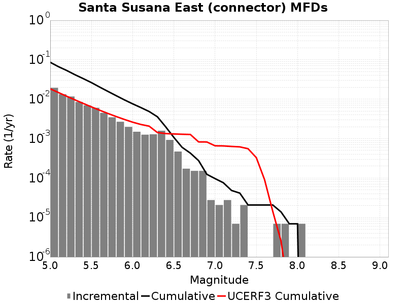

| Magnitude | Incremental Rate | Cumulative Rate | UCERF3 Cumulative Rate |
|-----|-----|-----|-----|
| 5.05 | 0.019401314 | 0.086870626 | 0.018293375 |
| 5.15 | 0.013321131 | 0.067469314 | 0.014708792 |
| 5.25 | 0.011690536 | 0.054148182 | 0.011861456 |
| 5.35 | 0.008470802 | 0.042457648 | 0.009599737 |
| 5.45 | 0.0069507556 | 0.033986848 | 0.007803189 |
| 5.55 | 0.006038728 | 0.027036091 | 0.0063761408 |
| 5.65 | 0.0045048636 | 0.020997362 | 0.0052425954 |
| 5.75 | 0.003482287 | 0.016492499 | 0.004342189 |
| 5.85 | 0.0027015363 | 0.013010211 | 0.0036269706 |
| 5.95 | 0.0020106062 | 0.0103086755 | 0.0030588524 |
| 6.05 | 0.0015338645 | 0.008298069 | 0.0026077854 |
| 6.15 | 0.0013127669 | 0.0067642047 | 0.0022815494 |
| 6.25 | 0.0013473135 | 0.0054514376 | 0.0020684206 |
| 6.35 | 0.0016375041 | 0.004104124 | 0.0014268402 |
| 6.45 | 9.811206E-4 | 0.0024666202 | 0.00134183 |
| 6.55 | 5.458347E-4 | 0.0014854994 | 0.0013113711 |
| 6.65 | 2.901906E-4 | 9.396648E-4 | 0.0012893772 |
| 6.75 | 1.934604E-4 | 6.494742E-4 | 0.00127213 |
| 6.85 | 1.796418E-4 | 4.560138E-4 | 8.253579E-4 |
| 6.95 | 5.52744E-5 | 2.7637198E-4 | 8.2134095E-4 |
| 7.05 | 5.52744E-5 | 2.210976E-4 | 6.569612E-4 |
| 7.15 | 6.9092996E-5 | 1.6582319E-4 | 6.531403E-4 |
| 7.25 | 4.1455798E-5 | 9.67302E-5 | 6.328516E-4 |
| 7.35 | 2.76372E-5 | 5.52744E-5 | 6.1715476E-4 |
| 7.45 | 6.9093E-6 | 2.76372E-5 | 5.539793E-4 |
| 7.55 | 0.0 | 2.0727899E-5 | 3.291176E-4 |
| 7.65 | 0.0 | 2.0727899E-5 | 9.102562E-5 |
| 7.75 | 6.9093E-6 | 2.0727899E-5 | 1.4207734E-5 |
| 7.85 | 6.9093E-6 | 1.38186E-5 | 2.5100871E-6 |
| 7.95 | 0.0 | 6.9093E-6 | 9.7594445E-8 |
| 8.05 | 6.9093E-6 | 6.9093E-6 | 0.0 |

### Santa Susana alt 1
*[(top)](#table-of-contents)*

| Magnitude | Incremental Rate | Cumulative Rate | UCERF3 Cumulative Rate |
|-----|-----|-----|-----|
| 5.05 | 0.07807509 | 0.17263576 | 0.023065528 |
| 5.15 | 0.023277432 | 0.094560675 | 0.018392121 |
| 5.25 | 0.019456588 | 0.07128324 | 0.014679903 |
| 5.35 | 0.014426618 | 0.05182666 | 0.011731183 |
| 5.45 | 0.011835631 | 0.03740004 | 0.009388931 |
| 5.55 | 0.008470802 | 0.02556441 | 0.0075284145 |
| 5.65 | 0.00582454 | 0.017093608 | 0.006050553 |
| 5.75 | 0.0033786476 | 0.011269068 | 0.0048766467 |
| 5.85 | 0.002052062 | 0.00789042 | 0.0039441795 |
| 5.95 | 0.0013887692 | 0.0058383583 | 0.0032034945 |
| 6.05 | 8.98209E-4 | 0.004449589 | 0.0026151475 |
| 6.15 | 5.872905E-4 | 0.0035513802 | 0.0021574285 |
| 6.25 | 4.491045E-4 | 0.0029640896 | 0.0018471531 |
| 6.35 | 3.523743E-4 | 0.0025149852 | 0.0016229801 |
| 6.45 | 3.938301E-4 | 0.0021626109 | 0.0014763091 |
| 6.55 | 3.109185E-4 | 0.0017687808 | 0.0014070368 |
| 6.65 | 3.3164638E-4 | 0.0014578623 | 0.0013613439 |
| 6.75 | 2.07279E-4 | 0.0011262159 | 0.0013374148 |
| 6.85 | 2.349162E-4 | 9.1893686E-4 | 9.031434E-4 |
| 6.95 | 2.418255E-4 | 6.840207E-4 | 8.9671335E-4 |
| 7.05 | 1.6582319E-4 | 4.421952E-4 | 7.585398E-4 |
| 7.15 | 1.105488E-4 | 2.7637198E-4 | 7.554823E-4 |
| 7.25 | 8.98209E-5 | 1.6582319E-4 | 7.367977E-4 |
| 7.35 | 4.83651E-5 | 7.6002296E-5 | 7.247438E-4 |
| 7.45 | 1.38186E-5 | 2.76372E-5 | 6.626595E-4 |
| 7.55 | 1.38186E-5 | 1.38186E-5 | 3.9765547E-4 |
| 7.65 | 0.0 | 0.0 | 1.1759375E-4 |
| 7.75 | 0.0 | 0.0 | 3.025073E-5 |
| 7.85 | 0.0 | 0.0 | 9.786777E-6 |
| 7.95 | 0.0 | 0.0 | 2.1893538E-6 |

### Santa Ynez (East)
*[(top)](#table-of-contents)*

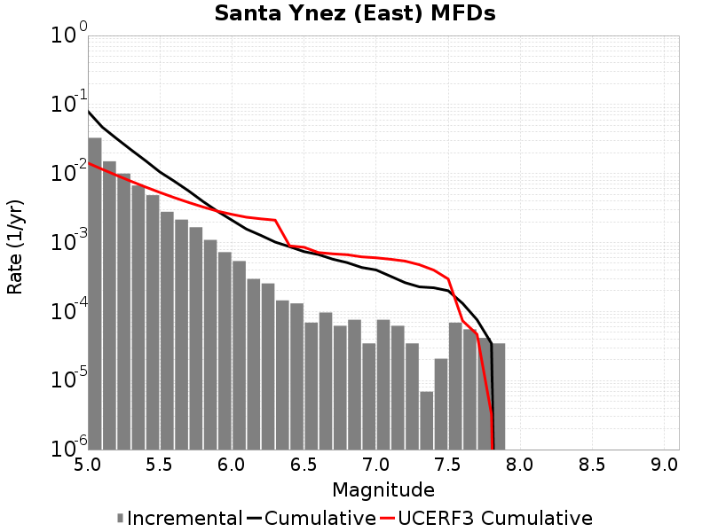

| Magnitude | Incremental Rate | Cumulative Rate | UCERF3 Cumulative Rate |
|-----|-----|-----|-----|
| 5.05 | 0.032881357 | 0.08322943 | 0.014204341 |
| 5.15 | 0.015041546 | 0.05034807 | 0.011532476 |
| 5.25 | 0.009990848 | 0.03530652 | 0.009410138 |
| 5.35 | 0.0067020208 | 0.025315674 | 0.0077243056 |
| 5.45 | 0.004857238 | 0.018613653 | 0.006385201 |
| 5.55 | 0.0028189945 | 0.013756416 | 0.0053215125 |
| 5.65 | 0.002190248 | 0.010937422 | 0.0044765947 |
| 5.75 | 0.001727325 | 0.0087471735 | 0.0038054527 |
| 5.85 | 0.0012160367 | 0.0070198486 | 0.0032723455 |
| 5.95 | 7.876602E-4 | 0.005803812 | 0.0028488836 |
| 6.05 | 6.702021E-4 | 0.005016152 | 0.0025591517 |
| 6.15 | 5.112882E-4 | 0.0043459497 | 0.00232961 |
| 6.25 | 5.389254E-4 | 0.0038346613 | 0.0022066676 |
| 6.35 | 5.112882E-4 | 0.0032957362 | 0.0021105723 |
| 6.45 | 3.731022E-4 | 0.0027844477 | 8.950138E-4 |
| 6.55 | 2.694627E-4 | 0.0024113457 | 8.5437566E-4 |
| 6.65 | 3.592836E-4 | 0.002141883 | 7.159997E-4 |
| 6.75 | 2.349162E-4 | 0.0017825994 | 6.862513E-4 |
| 6.85 | 3.109185E-4 | 0.0015476831 | 6.6595303E-4 |
| 6.95 | 2.556441E-4 | 0.0012367647 | 6.205379E-4 |
| 7.05 | 3.247371E-4 | 9.811206E-4 | 6.012778E-4 |
| 7.15 | 1.174581E-4 | 6.5638346E-4 | 5.7280133E-4 |
| 7.25 | 6.21837E-5 | 5.389254E-4 | 5.3914456E-4 |
| 7.35 | 6.21837E-5 | 4.767417E-4 | 4.7718454E-4 |
| 7.45 | 3.4546498E-5 | 4.14558E-4 | 3.9857303E-4 |
| 7.55 | 1.174581E-4 | 3.800115E-4 | 2.9640747E-4 |
| 7.65 | 1.105488E-4 | 2.625534E-4 | 7.346239E-5 |
| 7.75 | 8.98209E-5 | 1.5200459E-4 | 4.6841236E-5 |
| 7.85 | 6.21837E-5 | 6.21837E-5 | 3.2584514E-6 |

### Santa Ynez (West)
*[(top)](#table-of-contents)*

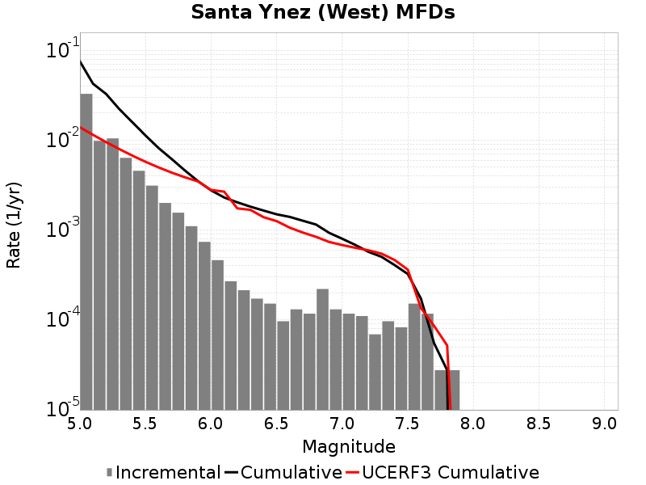

| Magnitude | Incremental Rate | Cumulative Rate | UCERF3 Cumulative Rate |
|-----|-----|-----|-----|
| 5.05 | 0.03278463 | 0.076748505 | 0.013944544 |
| 5.15 | 0.009831933 | 0.043963876 | 0.011482964 |
| 5.25 | 0.010474498 | 0.03413194 | 0.009527662 |
| 5.35 | 0.006363465 | 0.023657443 | 0.007974511 |
| 5.45 | 0.004567047 | 0.017293978 | 0.0067407987 |
| 5.55 | 0.0031230035 | 0.01272693 | 0.005760826 |
| 5.65 | 0.0020106062 | 0.009603927 | 0.0049824063 |
| 5.75 | 0.0015615018 | 0.0075933207 | 0.0043640854 |
| 5.85 | 0.0011331252 | 0.0060318187 | 0.003872936 |
| 5.95 | 8.083881E-4 | 0.0048986934 | 0.0034828018 |
| 6.05 | 5.320161E-4 | 0.0040903054 | 0.0027987473 |
| 6.15 | 3.45465E-4 | 0.0035582895 | 0.002678288 |
| 6.25 | 2.901906E-4 | 0.0032128245 | 0.0017463225 |
| 6.35 | 2.832813E-4 | 0.002922634 | 0.0016804598 |
| 6.45 | 2.418255E-4 | 0.0026393526 | 0.0013935966 |
| 6.55 | 2.003697E-4 | 0.002397527 | 0.0012587932 |
| 6.65 | 2.141883E-4 | 0.0021971574 | 0.0010638902 |
| 6.75 | 1.727325E-4 | 0.001982969 | 9.3888456E-4 |
| 6.85 | 2.694627E-4 | 0.0018102366 | 8.422061E-4 |
| 6.95 | 2.07279E-4 | 0.0015407739 | 7.386776E-4 |
| 7.05 | 2.349162E-4 | 0.0013334949 | 6.820994E-4 |
| 7.15 | 1.727325E-4 | 0.0010985787 | 6.3539087E-4 |
| 7.25 | 1.450953E-4 | 9.2584617E-4 | 5.963036E-4 |
| 7.35 | 1.727325E-4 | 7.807509E-4 | 5.4677814E-4 |
| 7.45 | 1.243674E-4 | 6.0801837E-4 | 4.6456614E-4 |
| 7.55 | 2.280069E-4 | 4.83651E-4 | 3.6339593E-4 |
| 7.65 | 1.6582319E-4 | 2.556441E-4 | 1.3599881E-4 |
| 7.75 | 5.52744E-5 | 8.98209E-5 | 8.606529E-5 |
| 7.85 | 3.4546498E-5 | 3.4546498E-5 | 5.208629E-5 |
| 7.95 | 0.0 | 0.0 | 8.940483E-8 |

### Santa Ynez River
*[(top)](#table-of-contents)*

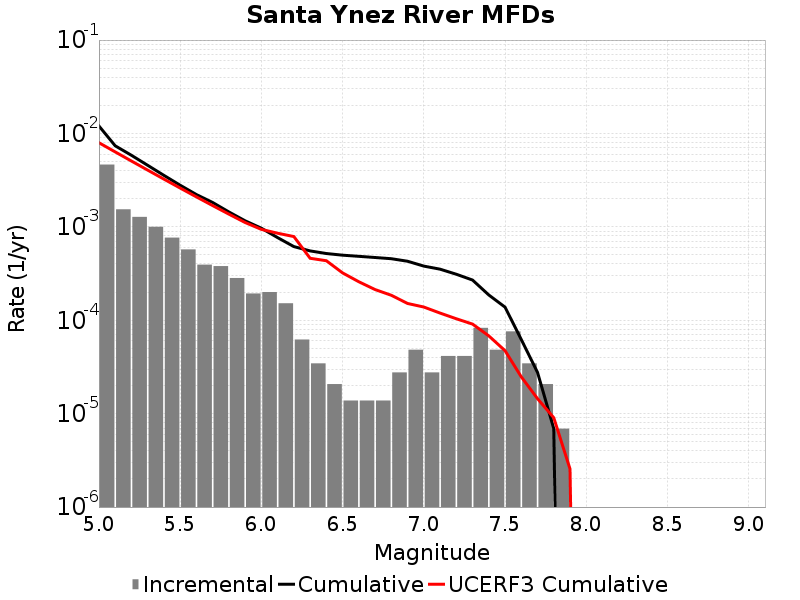

| Magnitude | Incremental Rate | Cumulative Rate | UCERF3 Cumulative Rate |
|-----|-----|-----|-----|
| 5.05 | 0.0046430496 | 0.013307312 | 0.007956835 |
| 5.15 | 0.0015407739 | 0.0086642625 | 0.006346531 |
| 5.25 | 0.0012782204 | 0.007123488 | 0.005067421 |
| 5.35 | 0.0010018485 | 0.005845268 | 0.004051388 |
| 5.45 | 7.6693227E-4 | 0.0048434194 | 0.0032443241 |
| 5.55 | 5.872905E-4 | 0.004076487 | 0.0026032506 |
| 5.65 | 4.0764868E-4 | 0.0034891965 | 0.0020940276 |
| 5.75 | 4.0764868E-4 | 0.0030815478 | 0.0016895375 |
| 5.85 | 3.178278E-4 | 0.002673899 | 0.0013682396 |
| 5.95 | 2.210976E-4 | 0.0023560713 | 0.0011130237 |
| 6.05 | 2.07279E-4 | 0.0021349736 | 9.3979295E-4 |
| 6.15 | 1.796418E-4 | 0.0019276947 | 8.5471774E-4 |
| 6.25 | 1.174581E-4 | 0.0017480529 | 7.871454E-4 |
| 6.35 | 1.312767E-4 | 0.0016305947 | 4.609293E-4 |
| 6.45 | 1.3818599E-4 | 0.001499318 | 4.3381372E-4 |
| 6.55 | 8.98209E-5 | 0.0013611321 | 3.213948E-4 |
| 6.65 | 7.6002296E-5 | 0.0012713112 | 2.5829338E-4 |
| 6.75 | 7.6002296E-5 | 0.0011953089 | 2.131384E-4 |
| 6.85 | 1.450953E-4 | 0.0011193065 | 1.8511324E-4 |
| 6.95 | 1.3818599E-4 | 9.7421126E-4 | 1.5126169E-4 |
| 7.05 | 1.6582319E-4 | 8.360253E-4 | 1.3855423E-4 |
| 7.15 | 1.312767E-4 | 6.702021E-4 | 1.1938751E-4 |
| 7.25 | 1.036395E-4 | 5.389254E-4 | 1.0378546E-4 |
| 7.35 | 1.3818599E-4 | 4.3528588E-4 | 9.098468E-5 |
| 7.45 | 8.98209E-5 | 2.970999E-4 | 6.803962E-5 |
| 7.55 | 1.243674E-4 | 2.07279E-4 | 4.725514E-5 |
| 7.65 | 4.83651E-5 | 8.2911596E-5 | 2.4779858E-5 |
| 7.75 | 2.76372E-5 | 3.4546498E-5 | 1.4468195E-5 |
| 7.85 | 6.9093E-6 | 6.9093E-6 | 9.039069E-6 |
| 7.95 | 0.0 | 0.0 | 2.561932E-6 |

### Sargent 2011 CFM
*[(top)](#table-of-contents)*

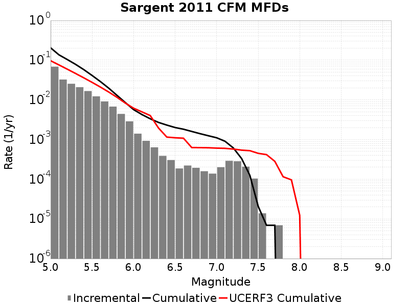

| Magnitude | Incremental Rate | Cumulative Rate | UCERF3 Cumulative Rate |
|-----|-----|-----|-----|
| 5.05 | 0.06825007 | 0.2107682 | 0.09664417 |
| 5.15 | 0.032418434 | 0.14251813 | 0.07585208 |
| 5.25 | 0.02535713 | 0.110099696 | 0.059336346 |
| 5.35 | 0.020817721 | 0.08474256 | 0.04621711 |
| 5.45 | 0.016630685 | 0.06392484 | 0.035795785 |
| 5.55 | 0.012305463 | 0.04729416 | 0.02751831 |
| 5.65 | 0.009237734 | 0.034988694 | 0.020942688 |
| 5.75 | 0.006936937 | 0.025750961 | 0.015719676 |
| 5.85 | 0.0045255916 | 0.018814024 | 0.011570381 |
| 5.95 | 0.0030953663 | 0.014288432 | 0.008274723 |
| 6.05 | 0.0015476831 | 0.011193066 | 0.0061403704 |
| 6.15 | 0.0010433043 | 0.009645383 | 0.0049722674 |
| 6.25 | 8.360253E-4 | 0.008602078 | 0.0040128203 |
| 6.35 | 6.149277E-4 | 0.007766053 | 0.0019419256 |
| 6.45 | 3.938301E-4 | 0.0071511255 | 0.0011503285 |
| 6.55 | 3.385557E-4 | 0.006757295 | 0.001106238 |
| 6.65 | 3.731022E-4 | 0.0064187394 | 0.0010786718 |
| 6.75 | 4.007394E-4 | 0.006045637 | 6.272276E-4 |
| 6.85 | 4.560138E-4 | 0.005644898 | 6.2402204E-4 |
| 6.95 | 5.181975E-4 | 0.005188884 | 6.197937E-4 |
| 7.05 | 9.2584617E-4 | 0.0046706866 | 6.073835E-4 |
| 7.15 | 0.0014302251 | 0.0037448406 | 5.9979426E-4 |
| 7.25 | 0.0012298553 | 0.0023146155 | 5.748675E-4 |
| 7.35 | 7.462044E-4 | 0.0010847601 | 5.4041087E-4 |
| 7.45 | 2.832813E-4 | 3.385557E-4 | 5.231781E-4 |
| 7.55 | 2.76372E-5 | 5.52744E-5 | 4.486123E-4 |
| 7.65 | 6.9093E-6 | 2.76372E-5 | 4.16545E-4 |
| 7.75 | 6.9093E-6 | 2.0727899E-5 | 2.822034E-4 |
| 7.85 | 0.0 | 1.38186E-5 | 1.15503564E-4 |
| 7.95 | 6.9093E-6 | 1.38186E-5 | 9.621757E-5 |
| 8.05 | 6.9093E-6 | 6.9093E-6 | 1.2304817E-5 |

### Scodie Lineament
*[(top)](#table-of-contents)*

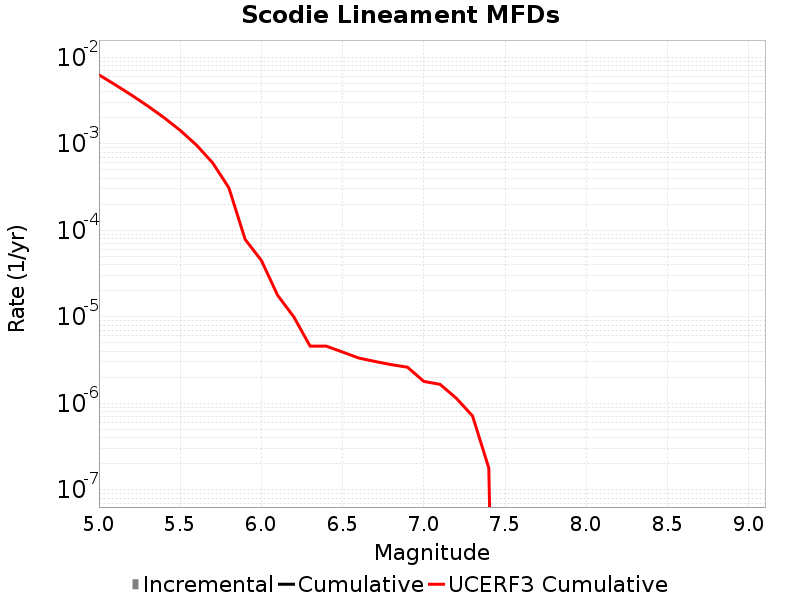

| Magnitude | Incremental Rate | Cumulative Rate | UCERF3 Cumulative Rate |
|-----|-----|-----|-----|
| 5.05 | 0.0 | 0.0 | 0.0062824637 |
| 5.15 | 0.0 | 0.0 | 0.0048237424 |
| 5.25 | 0.0 | 0.0 | 0.0036650393 |
| 5.35 | 0.0 | 0.0 | 0.0027446486 |
| 5.45 | 0.0 | 0.0 | 0.0020135564 |
| 5.55 | 0.0 | 0.0 | 0.0014328291 |
| 5.65 | 0.0 | 0.0 | 9.6959545E-4 |
| 5.75 | 0.0 | 0.0 | 6.031813E-4 |
| 5.85 | 0.0 | 0.0 | 3.0976397E-4 |
| 5.95 | 0.0 | 0.0 | 7.857227E-5 |
| 6.05 | 0.0 | 0.0 | 4.4834294E-5 |
| 6.15 | 0.0 | 0.0 | 1.77332E-5 |
| 6.25 | 0.0 | 0.0 | 9.947708E-6 |
| 6.35 | 0.0 | 0.0 | 4.575414E-6 |
| 6.45 | 0.0 | 0.0 | 4.5748843E-6 |
| 6.55 | 0.0 | 0.0 | 3.911304E-6 |
| 6.65 | 0.0 | 0.0 | 3.3352494E-6 |
| 6.75 | 0.0 | 0.0 | 3.0417957E-6 |
| 6.85 | 0.0 | 0.0 | 2.7971228E-6 |
| 6.95 | 0.0 | 0.0 | 2.6111743E-6 |
| 7.05 | 0.0 | 0.0 | 1.7893537E-6 |
| 7.15 | 0.0 | 0.0 | 1.6559054E-6 |
| 7.25 | 0.0 | 0.0 | 1.1434682E-6 |
| 7.35 | 0.0 | 0.0 | 7.133831E-7 |
| 7.45 | 0.0 | 0.0 | 1.7882314E-7 |

### Sheephole
*[(top)](#table-of-contents)*

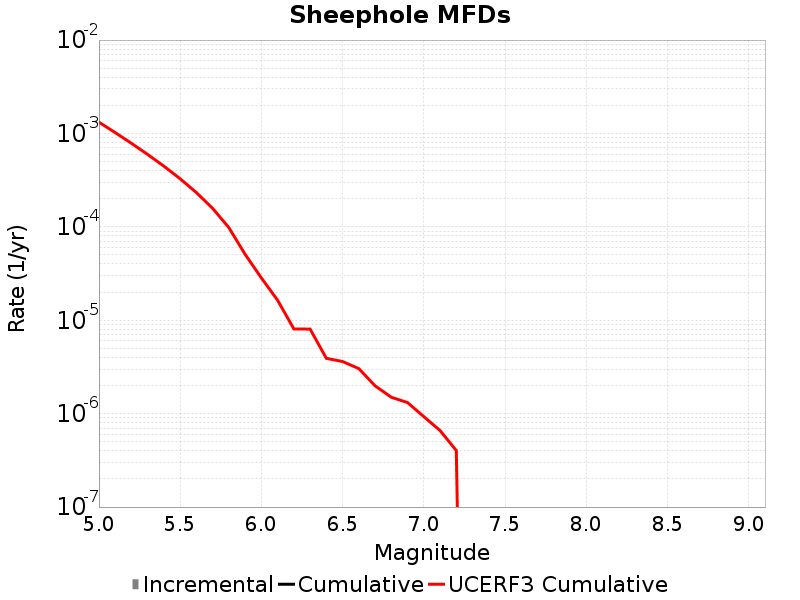

| Magnitude | Incremental Rate | Cumulative Rate | UCERF3 Cumulative Rate |
|-----|-----|-----|-----|
| 5.05 | 0.0 | 0.0 | 0.0013203998 |
| 5.15 | 0.0 | 0.0 | 0.0010216635 |
| 5.25 | 0.0 | 0.0 | 7.8436895E-4 |
| 5.35 | 0.0 | 0.0 | 5.9587916E-4 |
| 5.45 | 0.0 | 0.0 | 4.461564E-4 |
| 5.55 | 0.0 | 0.0 | 3.2722738E-4 |
| 5.65 | 0.0 | 0.0 | 2.3275868E-4 |
| 5.75 | 0.0 | 0.0 | 1.5771954E-4 |
| 5.85 | 0.0 | 0.0 | 9.811383E-5 |
| 5.95 | 0.0 | 0.0 | 5.0767332E-5 |
| 6.05 | 0.0 | 0.0 | 2.838763E-5 |
| 6.15 | 0.0 | 0.0 | 1.6363065E-5 |
| 6.25 | 0.0 | 0.0 | 8.072806E-6 |
| 6.35 | 0.0 | 0.0 | 8.0412065E-6 |
| 6.45 | 0.0 | 0.0 | 3.9115753E-6 |
| 6.55 | 0.0 | 0.0 | 3.6152185E-6 |
| 6.65 | 0.0 | 0.0 | 3.0362055E-6 |
| 6.75 | 0.0 | 0.0 | 1.9852394E-6 |
| 6.85 | 0.0 | 0.0 | 1.4985787E-6 |
| 6.95 | 0.0 | 0.0 | 1.3137847E-6 |
| 7.05 | 0.0 | 0.0 | 9.294603E-7 |
| 7.15 | 0.0 | 0.0 | 6.594316E-7 |
| 7.25 | 0.0 | 0.0 | 4.0270106E-7 |

### Shoreline
*[(top)](#table-of-contents)*

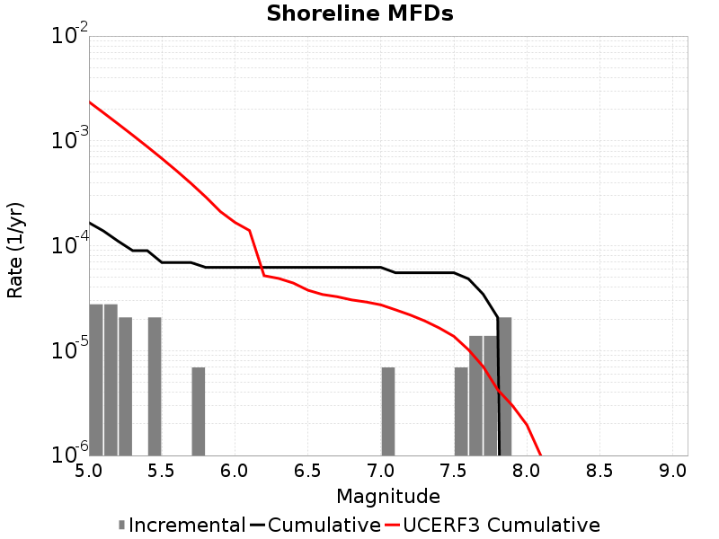

| Magnitude | Incremental Rate | Cumulative Rate | UCERF3 Cumulative Rate |
|-----|-----|-----|-----|
| 5.05 | 2.76372E-5 | 2.141883E-4 | 0.002355411 |
| 5.15 | 2.76372E-5 | 1.865511E-4 | 0.0018510707 |
| 5.25 | 2.0727899E-5 | 1.589139E-4 | 0.001450459 |
| 5.35 | 0.0 | 1.3818599E-4 | 0.0011322418 |
| 5.45 | 2.0727899E-5 | 1.3818599E-4 | 8.7947294E-4 |
| 5.55 | 0.0 | 1.174581E-4 | 6.786915E-4 |
| 5.65 | 0.0 | 1.174581E-4 | 5.1920506E-4 |
| 5.75 | 1.38186E-5 | 1.174581E-4 | 3.9252054E-4 |
| 5.85 | 0.0 | 1.036395E-4 | 2.9189143E-4 |
| 5.95 | 0.0 | 1.036395E-4 | 2.1195889E-4 |
| 6.05 | 0.0 | 1.036395E-4 | 1.6705837E-4 |
| 6.15 | 6.9093E-6 | 1.036395E-4 | 1.3966502E-4 |
| 6.25 | 0.0 | 9.67302E-5 | 5.182343E-5 |
| 6.35 | 6.9093E-6 | 9.67302E-5 | 4.876913E-5 |
| 6.45 | 0.0 | 8.98209E-5 | 4.4091776E-5 |
| 6.55 | 0.0 | 8.98209E-5 | 3.7674316E-5 |
| 6.65 | 0.0 | 8.98209E-5 | 3.42911E-5 |
| 6.75 | 0.0 | 8.98209E-5 | 3.2662567E-5 |
| 6.85 | 0.0 | 8.98209E-5 | 3.0450472E-5 |
| 6.95 | 0.0 | 8.98209E-5 | 2.9070736E-5 |
| 7.05 | 6.9093E-6 | 8.98209E-5 | 2.7307258E-5 |
| 7.15 | 0.0 | 8.2911596E-5 | 2.450504E-5 |
| 7.25 | 0.0 | 8.2911596E-5 | 2.1894179E-5 |
| 7.35 | 0.0 | 8.2911596E-5 | 1.9210516E-5 |
| 7.45 | 6.9093E-6 | 8.2911596E-5 | 1.643325E-5 |
| 7.55 | 6.9093E-6 | 7.6002296E-5 | 1.3680238E-5 |
| 7.65 | 3.4546498E-5 | 6.9092996E-5 | 1.0184801E-5 |
| 7.75 | 1.38186E-5 | 3.4546498E-5 | 7.0578753E-6 |
| 7.85 | 2.0727899E-5 | 2.0727899E-5 | 4.2365573E-6 |
| 7.95 | 0.0 | 0.0 | 3.0023298E-6 |
| 8.05 | 0.0 | 0.0 | 1.9581887E-6 |
| 8.15 | 0.0 | 0.0 | 9.641772E-7 |

### Sierra Madre
*[(top)](#table-of-contents)*

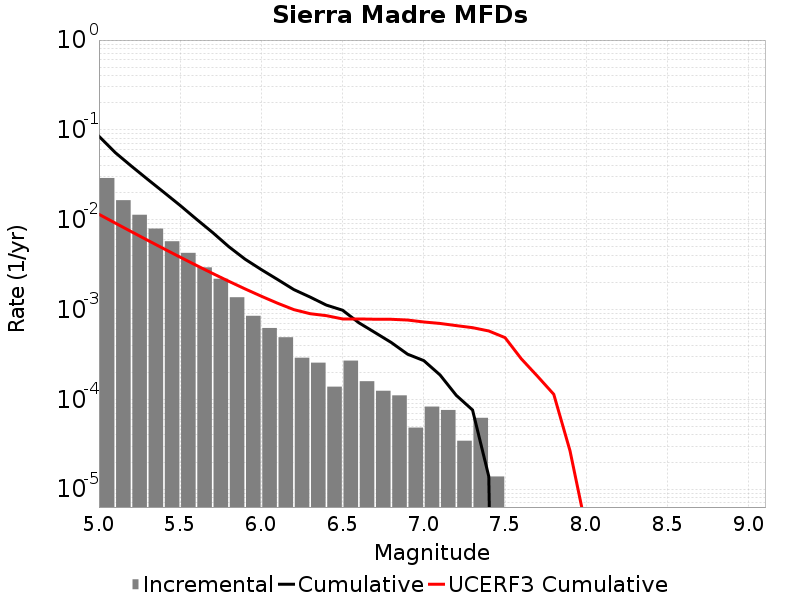

| Magnitude | Incremental Rate | Cumulative Rate | UCERF3 Cumulative Rate |
|-----|-----|-----|-----|
| 5.05 | 0.029101972 | 0.08676699 | 0.01147797 |
| 5.15 | 0.01647868 | 0.057665017 | 0.009175786 |
| 5.25 | 0.011338161 | 0.041186336 | 0.0073470958 |
| 5.35 | 0.007959514 | 0.029848175 | 0.005894515 |
| 5.45 | 0.0057485374 | 0.021888662 | 0.00474069 |
| 5.55 | 0.0042699473 | 0.016140124 | 0.003824174 |
| 5.65 | 0.0029779084 | 0.011870177 | 0.0030961593 |
| 5.75 | 0.0022247946 | 0.008892269 | 0.0025178767 |
| 5.85 | 0.0014233157 | 0.0066674743 | 0.0020585305 |
| 5.95 | 9.949392E-4 | 0.0052441587 | 0.0016936589 |
| 6.05 | 7.876602E-4 | 0.0042492193 | 0.0014038505 |
| 6.15 | 6.356556E-4 | 0.0034615593 | 0.0011736477 |
| 6.25 | 4.007394E-4 | 0.0028259037 | 9.96295E-4 |
| 6.35 | 4.214673E-4 | 0.0024251642 | 8.9758687E-4 |
| 6.45 | 2.694627E-4 | 0.002003697 | 8.5371523E-4 |
| 6.55 | 3.592836E-4 | 0.0017342343 | 7.846718E-4 |
| 6.65 | 2.625534E-4 | 0.0013749506 | 7.84633E-4 |
| 6.75 | 2.07279E-4 | 0.0011123973 | 7.787716E-4 |
| 6.85 | 2.694627E-4 | 9.051183E-4 | 7.7757885E-4 |
| 6.95 | 1.312767E-4 | 6.356556E-4 | 7.6285703E-4 |
| 7.05 | 1.450953E-4 | 5.0437887E-4 | 7.2591443E-4 |
| 7.15 | 1.174581E-4 | 3.592836E-4 | 6.989838E-4 |
| 7.25 | 6.9092996E-5 | 2.418255E-4 | 6.6120183E-4 |
| 7.35 | 8.98209E-5 | 1.727325E-4 | 6.274964E-4 |
| 7.45 | 2.76372E-5 | 8.2911596E-5 | 5.7635945E-4 |
| 7.55 | 6.9093E-6 | 5.52744E-5 | 4.8589433E-4 |
| 7.65 | 6.9093E-6 | 4.83651E-5 | 2.8251347E-4 |
| 7.75 | 1.38186E-5 | 4.1455798E-5 | 1.8037164E-4 |
| 7.85 | 2.0727899E-5 | 2.76372E-5 | 1.1361344E-4 |
| 7.95 | 0.0 | 6.9093E-6 | 2.6676507E-5 |
| 8.05 | 6.9093E-6 | 6.9093E-6 | 3.5980095E-6 |

### Sierra Madre (San Fernando)
*[(top)](#table-of-contents)*

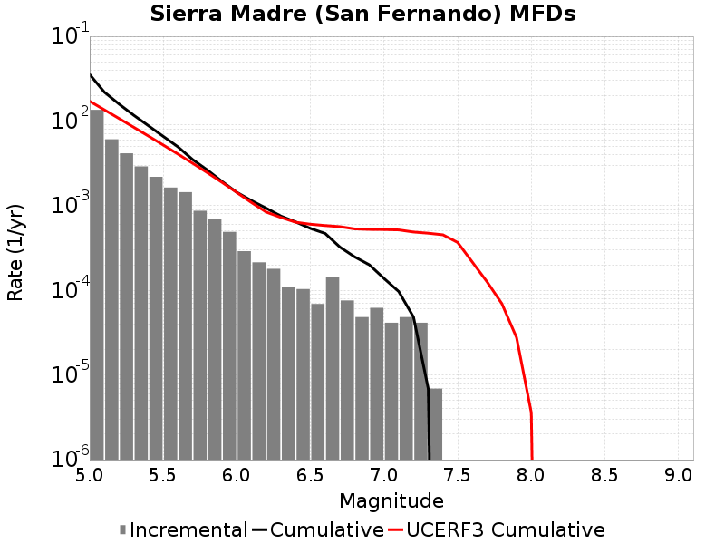

| Magnitude | Incremental Rate | Cumulative Rate | UCERF3 Cumulative Rate |
|-----|-----|-----|-----|
| 5.05 | 0.013535319 | 0.039237913 | 0.01713279 |
| 5.15 | 0.006080184 | 0.025702596 | 0.013544331 |
| 5.25 | 0.0041524894 | 0.019622412 | 0.010693915 |
| 5.35 | 0.0029088152 | 0.015469923 | 0.00842975 |
| 5.45 | 0.002190248 | 0.012561107 | 0.0066312593 |
| 5.55 | 0.0016375041 | 0.010370859 | 0.0052026673 |
| 5.65 | 0.0014578623 | 0.008733355 | 0.0040678964 |
| 5.75 | 0.0010156671 | 0.007275493 | 0.003166516 |
| 5.85 | 9.465741E-4 | 0.0062598255 | 0.002450524 |
| 5.95 | 8.7057176E-4 | 0.0053132516 | 0.0018817913 |
| 6.05 | 6.425649E-4 | 0.0044426797 | 0.0014300309 |
| 6.15 | 5.389254E-4 | 0.0038001148 | 0.0010872942 |
| 6.25 | 5.181975E-4 | 0.0032611894 | 8.397767E-4 |
| 6.35 | 4.83651E-4 | 0.002742992 | 7.2578946E-4 |
| 6.45 | 5.0437887E-4 | 0.002259341 | 6.370129E-4 |
| 6.55 | 4.007394E-4 | 0.0017549621 | 6.0372835E-4 |
| 6.65 | 4.007394E-4 | 0.0013542228 | 5.826786E-4 |
| 6.75 | 2.280069E-4 | 9.534834E-4 | 5.657023E-4 |
| 6.85 | 2.210976E-4 | 7.254765E-4 | 5.3219585E-4 |
| 6.95 | 1.796418E-4 | 5.0437887E-4 | 5.244073E-4 |
| 7.05 | 1.243674E-4 | 3.247371E-4 | 5.224067E-4 |
| 7.15 | 8.98209E-5 | 2.003697E-4 | 5.175369E-4 |
| 7.25 | 7.6002296E-5 | 1.105488E-4 | 4.886391E-4 |
| 7.35 | 3.4546498E-5 | 3.4546498E-5 | 4.731842E-4 |
| 7.45 | 0.0 | 0.0 | 4.5311448E-4 |
| 7.55 | 0.0 | 0.0 | 3.6769608E-4 |
| 7.65 | 0.0 | 0.0 | 2.151746E-4 |
| 7.75 | 0.0 | 0.0 | 1.2591481E-4 |
| 7.85 | 0.0 | 0.0 | 6.977828E-5 |
| 7.95 | 0.0 | 0.0 | 2.76855E-5 |
| 8.05 | 0.0 | 0.0 | 3.5980095E-6 |

### Sierra Nevada  (No Extension)
*[(top)](#table-of-contents)*

| Magnitude | Incremental Rate | Cumulative Rate | UCERF3 Cumulative Rate |
|-----|-----|-----|-----|
| 5.05 | 0.0023353433 | 0.00966611 | 0.0054589165 |
| 5.15 | 0.0015338645 | 0.0073307673 | 0.004338267 |
| 5.25 | 0.001243674 | 0.005796903 | 0.0034481029 |
| 5.35 | 7.876602E-4 | 0.0045532286 | 0.0027410206 |
| 5.45 | 6.287463E-4 | 0.0037655684 | 0.0021793651 |
| 5.55 | 3.938301E-4 | 0.0031368223 | 0.0017332265 |
| 5.65 | 3.731022E-4 | 0.002742992 | 0.0013788459 |
| 5.75 | 3.0400918E-4 | 0.0023698898 | 0.0010973513 |
| 5.85 | 2.832813E-4 | 0.0020658807 | 8.7375235E-4 |
| 5.95 | 1.865511E-4 | 0.0017825994 | 6.961413E-4 |
| 6.05 | 2.280069E-4 | 0.0015960482 | 5.550598E-4 |
| 6.15 | 1.3818599E-4 | 0.0013680414 | 4.736812E-4 |
| 6.25 | 1.312767E-4 | 0.0012298553 | 4.0903984E-4 |
| 6.35 | 1.243674E-4 | 0.0010985787 | 3.7060122E-4 |
| 6.45 | 1.865511E-4 | 9.7421126E-4 | 3.5838806E-4 |
| 6.55 | 1.3818599E-4 | 7.876602E-4 | 3.4868682E-4 |
| 6.65 | 9.67302E-5 | 6.494742E-4 | 9.5472555E-5 |
| 6.75 | 1.036395E-4 | 5.5274396E-4 | 9.1001115E-5 |
| 6.85 | 6.9092996E-5 | 4.491045E-4 | 9.068471E-5 |
| 6.95 | 9.67302E-5 | 3.800115E-4 | 8.7114764E-5 |
| 7.05 | 6.21837E-5 | 2.832813E-4 | 8.618293E-5 |
| 7.15 | 9.67302E-5 | 2.210976E-4 | 8.383891E-5 |
| 7.25 | 3.4546498E-5 | 1.243674E-4 | 8.119513E-5 |
| 7.35 | 0.0 | 8.98209E-5 | 7.62652E-5 |
| 7.45 | 2.76372E-5 | 8.98209E-5 | 6.842804E-5 |
| 7.55 | 6.21837E-5 | 6.21837E-5 | 5.0488557E-5 |
| 7.65 | 0.0 | 0.0 | 3.0338862E-5 |
| 7.75 | 0.0 | 0.0 | 1.0887747E-5 |

### Silver Creek 2011 CFM
*[(top)](#table-of-contents)*

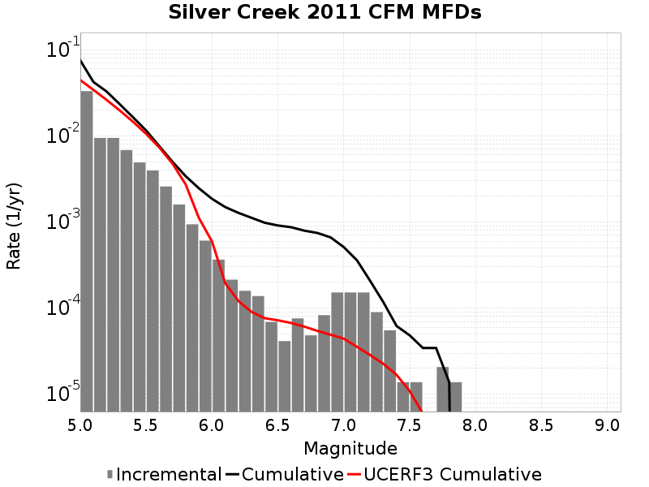

| Magnitude | Incremental Rate | Cumulative Rate | UCERF3 Cumulative Rate |
|-----|-----|-----|-----|
| 5.05 | 0.03304718 | 0.07854492 | 0.04443838 |
| 5.15 | 0.0094588315 | 0.04549774 | 0.034245238 |
| 5.25 | 0.009465741 | 0.03603891 | 0.026148539 |
| 5.35 | 0.0068402067 | 0.026573168 | 0.019717101 |
| 5.45 | 0.0049194214 | 0.019732961 | 0.014608429 |
| 5.55 | 0.003986666 | 0.014813539 | 0.010550466 |
| 5.65 | 0.002812085 | 0.010826873 | 0.007327112 |
| 5.75 | 0.0018586017 | 0.008014788 | 0.0047667106 |
| 5.85 | 0.001292039 | 0.006156186 | 0.0027329114 |
| 5.95 | 0.0010018485 | 0.004864147 | 0.0011174072 |
| 6.05 | 6.9093E-4 | 0.0038622986 | 5.9425953E-4 |
| 6.15 | 5.181975E-4 | 0.0031713687 | 1.951026E-4 |
| 6.25 | 4.974696E-4 | 0.002653171 | 1.2118615E-4 |
| 6.35 | 4.007394E-4 | 0.0021557016 | 9.046135E-5 |
| 6.45 | 1.5200459E-4 | 0.0017549621 | 7.650532E-5 |
| 6.55 | 1.6582319E-4 | 0.0016029576 | 7.23355E-5 |
| 6.65 | 1.450953E-4 | 0.0014371343 | 6.736627E-5 |
| 6.75 | 2.07279E-4 | 0.001292039 | 6.107614E-5 |
| 6.85 | 1.6582319E-4 | 0.0010847601 | 5.4466618E-5 |
| 6.95 | 1.727325E-4 | 9.1893686E-4 | 4.9180195E-5 |
| 7.05 | 2.280069E-4 | 7.462044E-4 | 4.4280805E-5 |
| 7.15 | 1.934604E-4 | 5.181975E-4 | 3.5605623E-5 |
| 7.25 | 1.036395E-4 | 3.247371E-4 | 2.8557584E-5 |
| 7.35 | 8.2911596E-5 | 2.210976E-4 | 2.2606577E-5 |
| 7.45 | 4.83651E-5 | 1.3818599E-4 | 1.6854241E-5 |
| 7.55 | 5.52744E-5 | 8.98209E-5 | 1.0881495E-5 |
| 7.65 | 0.0 | 3.4546498E-5 | 5.9680287E-6 |
| 7.75 | 2.0727899E-5 | 3.4546498E-5 | 4.6918644E-6 |
| 7.85 | 1.38186E-5 | 1.38186E-5 | 4.0010696E-6 |
| 7.95 | 0.0 | 0.0 | 3.1235297E-6 |
| 8.05 | 0.0 | 0.0 | 1.8507725E-6 |
| 8.15 | 0.0 | 0.0 | 4.1709947E-7 |

### Simi-Santa Rosa
*[(top)](#table-of-contents)*

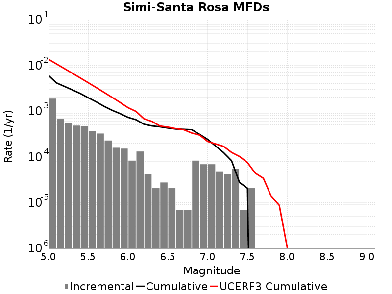

| Magnitude | Incremental Rate | Cumulative Rate | UCERF3 Cumulative Rate |
|-----|-----|-----|-----|
| 5.05 | 0.0018793296 | 0.007047486 | 0.01360708 |
| 5.15 | 6.702021E-4 | 0.005168156 | 0.010769736 |
| 5.25 | 5.596533E-4 | 0.004497954 | 0.008515953 |
| 5.35 | 4.83651E-4 | 0.003938301 | 0.0067257094 |
| 5.45 | 4.698324E-4 | 0.00345465 | 0.005303669 |
| 5.55 | 3.661929E-4 | 0.0029848176 | 0.0041741016 |
| 5.65 | 3.247371E-4 | 0.0026186246 | 0.0032768543 |
| 5.75 | 2.280069E-4 | 0.0022938875 | 0.0025641455 |
| 5.85 | 1.6582319E-4 | 0.0020658807 | 0.0019980208 |
| 5.95 | 1.589139E-4 | 0.0019000574 | 0.001548332 |
| 6.05 | 1.174581E-4 | 0.0017411435 | 0.0011911315 |
| 6.15 | 2.210976E-4 | 0.0016236855 | 9.878711E-4 |
| 6.25 | 9.67302E-5 | 0.0014025879 | 6.8052154E-4 |
| 6.35 | 7.6002296E-5 | 0.0013058577 | 5.98179E-4 |
| 6.45 | 8.2911596E-5 | 0.0012298553 | 4.7475443E-4 |
| 6.55 | 6.9092996E-5 | 0.0011469438 | 4.4794683E-4 |
| 6.65 | 1.243674E-4 | 0.0010778508 | 4.1523334E-4 |
| 6.75 | 8.98209E-5 | 9.534834E-4 | 3.935158E-4 |
| 6.85 | 2.07279E-4 | 8.636625E-4 | 3.3335466E-4 |
| 6.95 | 1.3818599E-4 | 6.5638346E-4 | 3.0048468E-4 |
| 7.05 | 1.6582319E-4 | 5.181975E-4 | 2.1794238E-4 |
| 7.15 | 1.243674E-4 | 3.523743E-4 | 1.9201502E-4 |
| 7.25 | 1.312767E-4 | 2.280069E-4 | 1.703067E-4 |
| 7.35 | 6.21837E-5 | 9.67302E-5 | 1.2550828E-4 |
| 7.45 | 1.38186E-5 | 3.4546498E-5 | 1.0225383E-4 |
| 7.55 | 2.0727899E-5 | 2.0727899E-5 | 7.534466E-5 |
| 7.65 | 0.0 | 0.0 | 4.4021872E-5 |
| 7.75 | 0.0 | 0.0 | 3.415104E-5 |
| 7.85 | 0.0 | 0.0 | 1.3641344E-5 |
| 7.95 | 0.0 | 0.0 | 8.753221E-6 |
| 8.05 | 0.0 | 0.0 | 1.0427792E-6 |

### Sisar
*[(top)](#table-of-contents)*

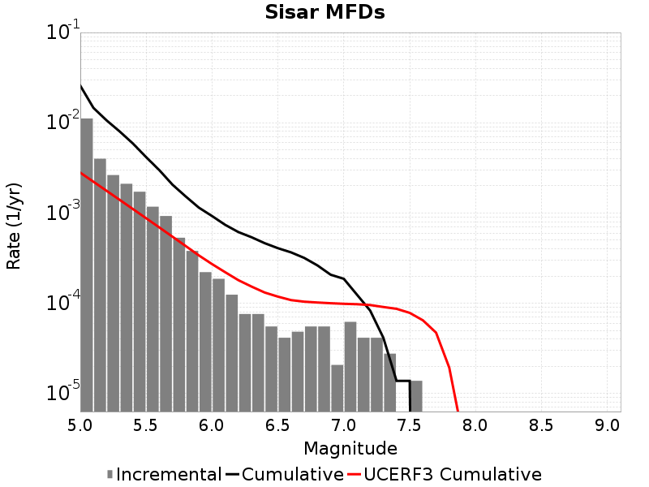

| Magnitude | Incremental Rate | Cumulative Rate | UCERF3 Cumulative Rate |
|-----|-----|-----|-----|
| 5.05 | 0.01115161 | 0.027678655 | 0.0028008223 |
| 5.15 | 0.0039935755 | 0.016527046 | 0.0022215648 |
| 5.25 | 0.0026324433 | 0.01253347 | 0.0017614443 |
| 5.35 | 0.0021073364 | 0.009901027 | 0.0013959575 |
| 5.45 | 0.0017204157 | 0.00779369 | 0.0011056411 |
| 5.55 | 0.0011814903 | 0.0060732746 | 8.7503466E-4 |
| 5.65 | 9.2584617E-4 | 0.0048917844 | 6.9185736E-4 |
| 5.75 | 5.458347E-4 | 0.003965938 | 5.463545E-4 |
| 5.85 | 4.007394E-4 | 0.0034201033 | 4.3077747E-4 |
| 5.95 | 2.7637198E-4 | 0.003019364 | 3.3897135E-4 |
| 6.05 | 3.385557E-4 | 0.002742992 | 2.7171636E-4 |
| 6.15 | 2.625534E-4 | 0.0024044365 | 2.2070386E-4 |
| 6.25 | 1.865511E-4 | 0.002141883 | 1.801832E-4 |
| 6.35 | 1.865511E-4 | 0.0019553318 | 1.5302181E-4 |
| 6.45 | 1.3818599E-4 | 0.0017687808 | 1.3144675E-4 |
| 6.55 | 1.589139E-4 | 0.0016305947 | 1.1844325E-4 |
| 6.65 | 2.141883E-4 | 0.0014716808 | 1.08370594E-4 |
| 6.75 | 1.589139E-4 | 0.0012574926 | 1.0410331E-4 |
| 6.85 | 3.109185E-4 | 0.0010985787 | 1.019313E-4 |
| 6.95 | 1.727325E-4 | 7.876602E-4 | 1.0011374E-4 |
| 7.05 | 2.07279E-4 | 6.149277E-4 | 9.866734E-5 |
| 7.15 | 1.036395E-4 | 4.0764868E-4 | 9.758194E-5 |
| 7.25 | 1.174581E-4 | 3.0400918E-4 | 9.556722E-5 |
| 7.35 | 1.243674E-4 | 1.865511E-4 | 9.092964E-5 |
| 7.45 | 4.1455798E-5 | 6.21837E-5 | 8.6806205E-5 |
| 7.55 | 1.38186E-5 | 2.0727899E-5 | 7.827063E-5 |
| 7.65 | 0.0 | 6.9093E-6 | 6.4752596E-5 |
| 7.75 | 6.9093E-6 | 6.9093E-6 | 4.7268553E-5 |
| 7.85 | 0.0 | 0.0 | 1.9367184E-5 |
| 7.95 | 0.0 | 0.0 | 3.5367711E-6 |
| 8.05 | 0.0 | 0.0 | 4.77152E-8 |

### Skinner Flat 2011 CFM
*[(top)](#table-of-contents)*

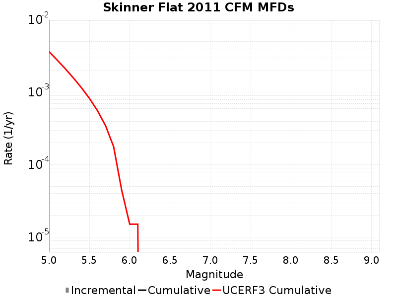

| Magnitude | Incremental Rate | Cumulative Rate | UCERF3 Cumulative Rate |
|-----|-----|-----|-----|
| 5.05 | 0.0 | 0.0 | 0.0036386966 |
| 5.15 | 0.0 | 0.0 | 0.0027931244 |
| 5.25 | 0.0 | 0.0 | 0.0021214625 |
| 5.35 | 0.0 | 0.0 | 0.0015879425 |
| 5.45 | 0.0 | 0.0 | 0.0011641525 |
| 5.55 | 0.0 | 0.0 | 8.275241E-4 |
| 5.65 | 0.0 | 0.0 | 5.6013075E-4 |
| 5.75 | 0.0 | 0.0 | 3.477326E-4 |
| 5.85 | 0.0 | 0.0 | 1.7901875E-4 |
| 5.95 | 0.0 | 0.0 | 4.5004588E-5 |
| 6.05 | 0.0 | 0.0 | 1.51817685E-5 |
| 6.15 | 0.0 | 0.0 | 1.51817685E-5 |

### So Sierra Nevada
*[(top)](#table-of-contents)*

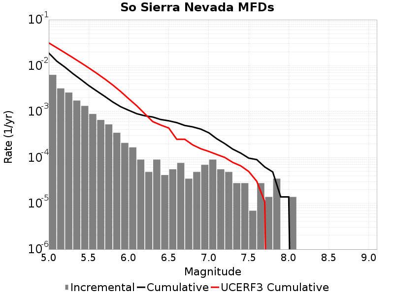

| Magnitude | Incremental Rate | Cumulative Rate | UCERF3 Cumulative Rate |
|-----|-----|-----|-----|
| 5.05 | 0.006294372 | 0.020893723 | 0.031251006 |
| 5.15 | 0.0031920965 | 0.01459935 | 0.024538154 |
| 5.25 | 0.0025909874 | 0.011407254 | 0.019205946 |
| 5.35 | 0.0017342343 | 0.008816266 | 0.014970423 |
| 5.45 | 0.0013265855 | 0.0070820325 | 0.011606026 |
| 5.55 | 8.843904E-4 | 0.005755447 | 0.008933593 |
| 5.65 | 6.9093E-4 | 0.0048710564 | 0.006810802 |
| 5.75 | 6.21837E-4 | 0.0041801264 | 0.00512461 |
| 5.85 | 4.767417E-4 | 0.0035582895 | 0.0037852197 |
| 5.95 | 2.832813E-4 | 0.0030815478 | 0.0027213043 |
| 6.05 | 2.694627E-4 | 0.0027982665 | 0.0018960169 |
| 6.15 | 1.589139E-4 | 0.0025288037 | 0.0013377487 |
| 6.25 | 1.589139E-4 | 0.0023698898 | 8.952217E-4 |
| 6.35 | 2.07279E-4 | 0.0022109759 | 6.0504186E-4 |
| 6.45 | 1.174581E-4 | 0.002003697 | 5.082283E-4 |
| 6.55 | 1.450953E-4 | 0.0018862389 | 4.3743566E-4 |
| 6.65 | 1.450953E-4 | 0.0017411435 | 2.4913216E-4 |
| 6.75 | 1.934604E-4 | 0.0015960482 | 2.4913216E-4 |
| 6.85 | 2.141883E-4 | 0.0014025879 | 1.8770967E-4 |
| 6.95 | 1.865511E-4 | 0.0011883996 | 1.5497048E-4 |
| 7.05 | 1.796418E-4 | 0.0010018485 | 1.3532475E-4 |
| 7.15 | 9.67302E-5 | 8.2220667E-4 | 1.16266405E-4 |
| 7.25 | 1.3818599E-4 | 7.254765E-4 | 1.00141435E-4 |
| 7.35 | 8.2911596E-5 | 5.872905E-4 | 7.817219E-5 |
| 7.45 | 9.67302E-5 | 5.0437887E-4 | 6.563083E-5 |
| 7.55 | 1.243674E-4 | 4.0764868E-4 | 4.9494305E-5 |
| 7.65 | 8.2911596E-5 | 2.832813E-4 | 3.0338862E-5 |
| 7.75 | 5.52744E-5 | 2.003697E-4 | 1.0887747E-5 |
| 7.85 | 8.98209E-5 | 1.450953E-4 | 0.0 |
| 7.95 | 1.38186E-5 | 5.52744E-5 | 0.0 |
| 8.05 | 4.1455798E-5 | 4.1455798E-5 | 0.0 |

### South Cuyama
*[(top)](#table-of-contents)*

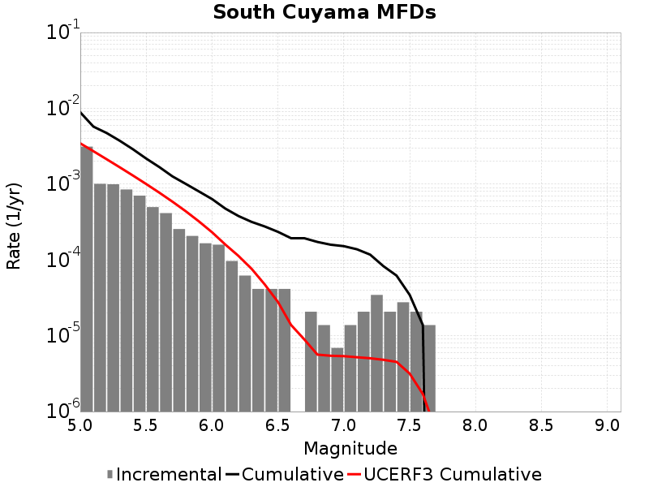

| Magnitude | Incremental Rate | Cumulative Rate | UCERF3 Cumulative Rate |
|-----|-----|-----|-----|
| 5.05 | 0.0031230035 | 0.009776659 | 0.0034527532 |
| 5.15 | 0.0010087577 | 0.006653656 | 0.002716301 |
| 5.25 | 9.949392E-4 | 0.005644898 | 0.0021313163 |
| 5.35 | 8.498439E-4 | 0.004649959 | 0.0016666463 |
| 5.45 | 7.1165786E-4 | 0.0038001148 | 0.0012975459 |
| 5.55 | 4.974696E-4 | 0.003088457 | 0.001004359 |
| 5.65 | 4.14558E-4 | 0.0025909874 | 7.7147235E-4 |
| 5.75 | 2.625534E-4 | 0.0021764294 | 5.864839E-4 |
| 5.85 | 2.141883E-4 | 0.001913876 | 4.3954237E-4 |
| 5.95 | 1.934604E-4 | 0.0016996878 | 3.2282257E-4 |
| 6.05 | 1.6582319E-4 | 0.0015062274 | 2.3189106E-4 |
| 6.15 | 1.174581E-4 | 0.0013404042 | 1.6008574E-4 |
| 6.25 | 1.036395E-4 | 0.0012229461 | 1.132725E-4 |
| 6.35 | 6.21837E-5 | 0.0011193065 | 7.650141E-5 |
| 6.45 | 1.105488E-4 | 0.0010571228 | 4.747461E-5 |
| 6.55 | 9.67302E-5 | 9.465741E-4 | 2.7925E-5 |
| 6.65 | 2.76372E-5 | 8.498439E-4 | 1.3861759E-5 |
| 6.75 | 5.52744E-5 | 8.2220667E-4 | 8.9533705E-6 |
| 6.85 | 3.4546498E-5 | 7.6693227E-4 | 5.6370814E-6 |
| 6.95 | 5.52744E-5 | 7.323858E-4 | 5.446956E-6 |
| 7.05 | 6.9092996E-5 | 6.771114E-4 | 5.379445E-6 |
| 7.15 | 6.9092996E-5 | 6.0801837E-4 | 5.2070604E-6 |
| 7.25 | 7.6002296E-5 | 5.389254E-4 | 5.0483477E-6 |
| 7.35 | 9.67302E-5 | 4.6292308E-4 | 4.8162833E-6 |
| 7.45 | 6.9092996E-5 | 3.661929E-4 | 4.524146E-6 |
| 7.55 | 1.036395E-4 | 2.970999E-4 | 3.1656389E-6 |
| 7.65 | 1.036395E-4 | 1.934604E-4 | 1.699251E-6 |
| 7.75 | 7.6002296E-5 | 8.98209E-5 | 5.489138E-7 |
| 7.85 | 1.38186E-5 | 1.38186E-5 | 1.0279852E-7 |
| 7.95 | 0.0 | 0.0 | 3.4012137E-11 |

### South Klamath Lake East
*[(top)](#table-of-contents)*

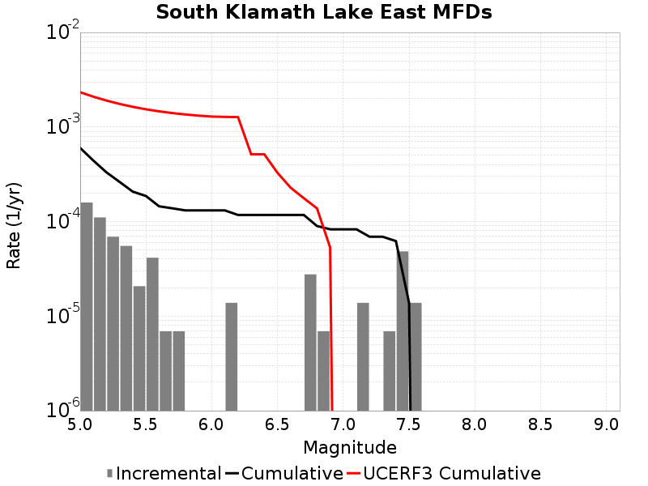

| Magnitude | Incremental Rate | Cumulative Rate | UCERF3 Cumulative Rate |
|-----|-----|-----|-----|
| 5.05 | 1.589139E-4 | 6.6329277E-4 | 0.002332038 |
| 5.15 | 1.105488E-4 | 5.0437887E-4 | 0.002093699 |
| 5.25 | 6.9092996E-5 | 3.938301E-4 | 0.0019043798 |
| 5.35 | 5.52744E-5 | 3.247371E-4 | 0.0017539981 |
| 5.45 | 2.0727899E-5 | 2.694627E-4 | 0.0016345457 |
| 5.55 | 4.1455798E-5 | 2.487348E-4 | 0.0015396613 |
| 5.65 | 6.9093E-6 | 2.07279E-4 | 0.0014642919 |
| 5.75 | 6.9093E-6 | 2.003697E-4 | 0.0014044238 |
| 5.85 | 0.0 | 1.934604E-4 | 0.001356869 |
| 5.95 | 0.0 | 1.934604E-4 | 0.0013190949 |
| 6.05 | 0.0 | 1.934604E-4 | 0.0012893793 |
| 6.15 | 1.38186E-5 | 1.934604E-4 | 0.0012798458 |
| 6.25 | 0.0 | 1.796418E-4 | 0.0012723949 |
| 6.35 | 0.0 | 1.796418E-4 | 5.142663E-4 |
| 6.45 | 0.0 | 1.796418E-4 | 5.142663E-4 |
| 6.55 | 6.9093E-6 | 1.796418E-4 | 3.277197E-4 |
| 6.65 | 6.9093E-6 | 1.727325E-4 | 2.280595E-4 |
| 6.75 | 2.76372E-5 | 1.6582319E-4 | 1.7678758E-4 |
| 6.85 | 6.9093E-6 | 1.3818599E-4 | 1.3796051E-4 |
| 6.95 | 6.9093E-6 | 1.312767E-4 | 5.3285396E-5 |
| 7.05 | 1.38186E-5 | 1.243674E-4 | 0.0 |
| 7.15 | 2.0727899E-5 | 1.105488E-4 | 0.0 |
| 7.25 | 6.9093E-6 | 8.98209E-5 | 0.0 |
| 7.35 | 2.0727899E-5 | 8.2911596E-5 | 0.0 |
| 7.45 | 4.83651E-5 | 6.21837E-5 | 0.0 |
| 7.55 | 1.38186E-5 | 1.38186E-5 | 0.0 |

### South Klamath Lake West
*[(top)](#table-of-contents)*

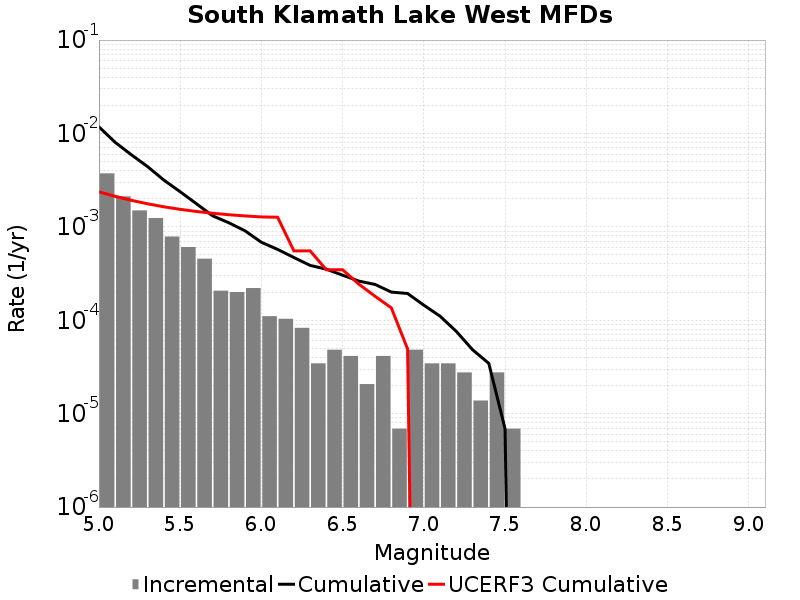

| Magnitude | Incremental Rate | Cumulative Rate | UCERF3 Cumulative Rate |
|-----|-----|-----|-----|
| 5.05 | 0.0037379311 | 0.011821812 | 0.0023714236 |
| 5.15 | 0.0021211552 | 0.008083881 | 0.0021214355 |
| 5.25 | 0.001499318 | 0.0059627257 | 0.001922863 |
| 5.35 | 0.001243674 | 0.0044634077 | 0.0017651311 |
| 5.45 | 7.876602E-4 | 0.0032197337 | 0.0016398403 |
| 5.55 | 6.0801837E-4 | 0.0024320735 | 0.0015403184 |
| 5.65 | 4.560138E-4 | 0.0018240552 | 0.0014612651 |
| 5.75 | 2.07279E-4 | 0.0013680414 | 0.0013984711 |
| 5.85 | 2.003697E-4 | 0.0011607624 | 0.0013485919 |
| 5.95 | 2.210976E-4 | 9.603927E-4 | 0.0013089714 |
| 6.05 | 1.105488E-4 | 7.392951E-4 | 0.0012777065 |
| 6.15 | 1.036395E-4 | 6.287463E-4 | 0.0012677069 |
| 6.25 | 8.2911596E-5 | 5.251068E-4 | 5.5336306E-4 |
| 6.35 | 3.4546498E-5 | 4.421952E-4 | 5.5336306E-4 |
| 6.45 | 4.83651E-5 | 4.0764868E-4 | 3.475172E-4 |
| 6.55 | 4.1455798E-5 | 3.592836E-4 | 3.475172E-4 |
| 6.65 | 2.0727899E-5 | 3.178278E-4 | 2.4379049E-4 |
| 6.75 | 5.52744E-5 | 2.970999E-4 | 1.8052579E-4 |
| 6.85 | 1.38186E-5 | 2.418255E-4 | 1.3575975E-4 |
| 6.95 | 4.83651E-5 | 2.280069E-4 | 4.9369508E-5 |
| 7.05 | 3.4546498E-5 | 1.796418E-4 | 0.0 |
| 7.15 | 4.1455798E-5 | 1.450953E-4 | 0.0 |
| 7.25 | 2.76372E-5 | 1.036395E-4 | 0.0 |
| 7.35 | 2.0727899E-5 | 7.6002296E-5 | 0.0 |
| 7.45 | 4.83651E-5 | 5.52744E-5 | 0.0 |
| 7.55 | 6.9093E-6 | 6.9093E-6 | 0.0 |

### Superstition Hills
*[(top)](#table-of-contents)*

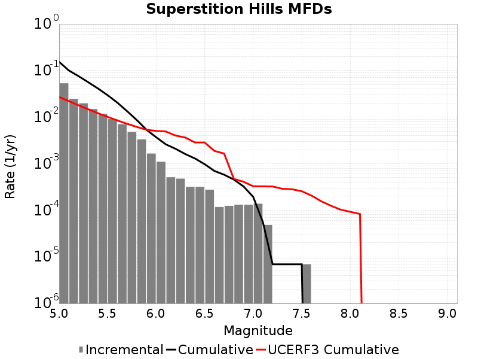

| Magnitude | Incremental Rate | Cumulative Rate | UCERF3 Cumulative Rate |
|-----|-----|-----|-----|
| 5.05 | 0.053222336 | 0.15384938 | 0.027134124 |
| 5.15 | 0.024555651 | 0.10062704 | 0.02200933 |
| 5.25 | 0.01973987 | 0.07607139 | 0.01793856 |
| 5.35 | 0.014875723 | 0.056331523 | 0.014705033 |
| 5.45 | 0.011704354 | 0.041455798 | 0.012136551 |
| 5.55 | 0.009051183 | 0.029751446 | 0.010096333 |
| 5.65 | 0.0070405765 | 0.020700263 | 0.00847573 |
| 5.75 | 0.0047812355 | 0.013659686 | 0.00718844 |
| 5.85 | 0.0033441011 | 0.00887845 | 0.0061659086 |
| 5.95 | 0.0016927784 | 0.005534349 | 0.005353683 |
| 6.05 | 0.0011262159 | 0.0038415708 | 0.0050495486 |
| 6.15 | 5.251068E-4 | 0.0027153548 | 0.0049092807 |
| 6.25 | 4.83651E-4 | 0.002190248 | 0.004014129 |
| 6.35 | 3.247371E-4 | 0.001706597 | 0.0036458122 |
| 6.45 | 3.178278E-4 | 0.00138186 | 0.0028493614 |
| 6.55 | 3.109185E-4 | 0.0010640322 | 0.0028493614 |
| 6.65 | 1.174581E-4 | 7.531137E-4 | 0.0018802059 |
| 6.75 | 1.243674E-4 | 6.356556E-4 | 0.001649963 |
| 6.85 | 1.5200459E-4 | 5.112882E-4 | 4.7212897E-4 |
| 6.95 | 1.5200459E-4 | 3.592836E-4 | 4.0818832E-4 |
| 7.05 | 1.5200459E-4 | 2.07279E-4 | 3.2717944E-4 |
| 7.15 | 4.83651E-5 | 5.52744E-5 | 3.253891E-4 |
| 7.25 | 0.0 | 6.9093E-6 | 3.2374996E-4 |
| 7.35 | 0.0 | 6.9093E-6 | 2.8887895E-4 |
| 7.45 | 0.0 | 6.9093E-6 | 2.819572E-4 |
| 7.55 | 6.9093E-6 | 6.9093E-6 | 2.561098E-4 |
| 7.65 | 0.0 | 0.0 | 2.0653899E-4 |
| 7.75 | 0.0 | 0.0 | 1.5612485E-4 |
| 7.85 | 0.0 | 0.0 | 1.2508123E-4 |
| 7.95 | 0.0 | 0.0 | 1.03228056E-4 |
| 8.05 | 0.0 | 0.0 | 9.25001E-5 |
| 8.15 | 0.0 | 0.0 | 8.308421E-5 |

### Surprise Valley 2011 CFM
*[(top)](#table-of-contents)*

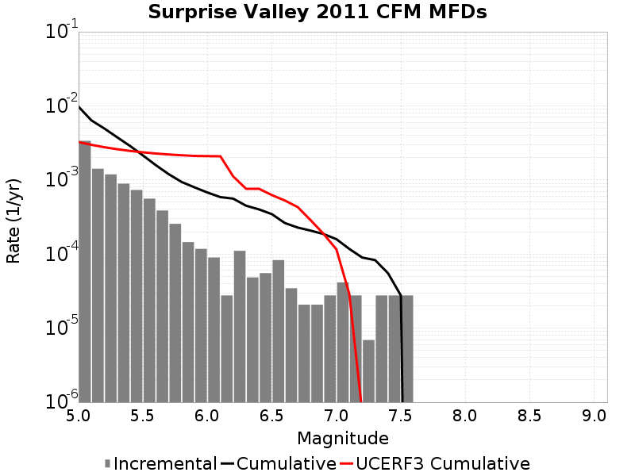

| Magnitude | Incremental Rate | Cumulative Rate | UCERF3 Cumulative Rate |
|-----|-----|-----|-----|
| 5.05 | 0.0033717384 | 0.009742113 | 0.0032484918 |
| 5.15 | 0.0014164065 | 0.0063703745 | 0.0029812679 |
| 5.25 | 0.0011883996 | 0.004953968 | 0.0027690043 |
| 5.35 | 8.912997E-4 | 0.0037655684 | 0.0026003972 |
| 5.45 | 7.323858E-4 | 0.0028742687 | 0.002466468 |
| 5.55 | 5.596533E-4 | 0.002141883 | 0.002360084 |
| 5.65 | 3.869208E-4 | 0.0015822296 | 0.0022755805 |
| 5.75 | 2.556441E-4 | 0.0011953089 | 0.0022084569 |
| 5.85 | 1.450953E-4 | 9.396648E-4 | 0.0021551386 |
| 5.95 | 1.174581E-4 | 7.945695E-4 | 0.0021127865 |
| 6.05 | 8.98209E-5 | 6.771114E-4 | 0.0020992735 |
| 6.15 | 2.76372E-5 | 5.872905E-4 | 0.0020890208 |
| 6.25 | 1.105488E-4 | 5.596533E-4 | 0.0011140954 |
| 6.35 | 4.83651E-5 | 4.491045E-4 | 7.6029537E-4 |
| 6.45 | 5.52744E-5 | 4.007394E-4 | 7.6026376E-4 |
| 6.55 | 8.2911596E-5 | 3.45465E-4 | 6.248364E-4 |
| 6.65 | 3.4546498E-5 | 2.625534E-4 | 5.28624E-4 |
| 6.75 | 2.0727899E-5 | 2.280069E-4 | 4.3059821E-4 |
| 6.85 | 2.0727899E-5 | 2.07279E-4 | 2.8694127E-4 |
| 6.95 | 2.76372E-5 | 1.865511E-4 | 1.8767078E-4 |
| 7.05 | 4.1455798E-5 | 1.589139E-4 | 1.1579713E-4 |
| 7.15 | 2.76372E-5 | 1.174581E-4 | 2.9059294E-5 |
| 7.25 | 6.9093E-6 | 8.98209E-5 | 7.378361E-7 |
| 7.35 | 2.76372E-5 | 8.2911596E-5 | 1.0840584E-7 |
| 7.45 | 2.76372E-5 | 5.52744E-5 | 0.0 |
| 7.55 | 2.76372E-5 | 2.76372E-5 | 0.0 |

### Swain Ravine - Spenceville
*[(top)](#table-of-contents)*

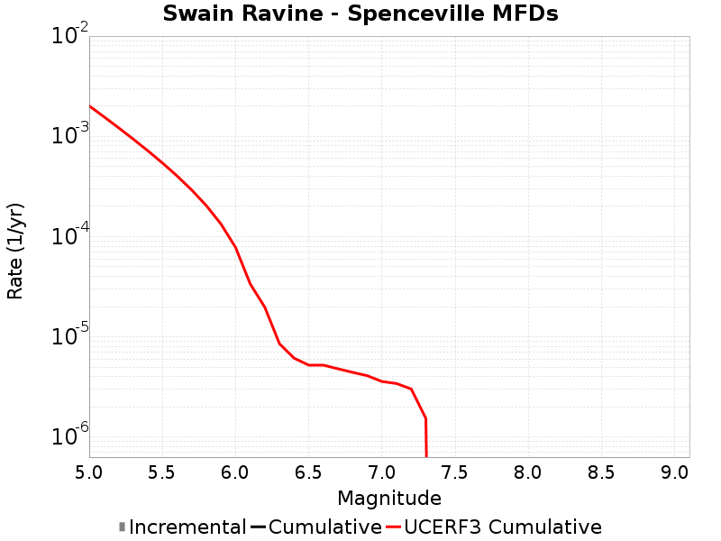

| Magnitude | Incremental Rate | Cumulative Rate | UCERF3 Cumulative Rate |
|-----|-----|-----|-----|
| 5.05 | 0.0 | 0.0 | 0.002016061 |
| 5.15 | 0.0 | 0.0 | 0.0015731844 |
| 5.25 | 0.0 | 0.0 | 0.0012213951 |
| 5.35 | 0.0 | 0.0 | 9.419588E-4 |
| 5.45 | 0.0 | 0.0 | 7.199947E-4 |
| 5.55 | 0.0 | 0.0 | 5.4368237E-4 |
| 5.65 | 0.0 | 0.0 | 4.0363253E-4 |
| 5.75 | 0.0 | 0.0 | 2.9238695E-4 |
| 5.85 | 0.0 | 0.0 | 2.0402146E-4 |
| 5.95 | 0.0 | 0.0 | 1.3383024E-4 |
| 6.05 | 0.0 | 0.0 | 7.807539E-5 |
| 6.15 | 0.0 | 0.0 | 3.3787728E-5 |
| 6.25 | 0.0 | 0.0 | 1.9716157E-5 |
| 6.35 | 0.0 | 0.0 | 8.538709E-6 |
| 6.45 | 0.0 | 0.0 | 6.1319133E-6 |
| 6.55 | 0.0 | 0.0 | 5.227026E-6 |
| 6.65 | 0.0 | 0.0 | 5.227026E-6 |
| 6.75 | 0.0 | 0.0 | 4.8027377E-6 |
| 6.85 | 0.0 | 0.0 | 4.4274966E-6 |
| 6.95 | 0.0 | 0.0 | 4.099638E-6 |
| 7.05 | 0.0 | 0.0 | 3.5888831E-6 |
| 7.15 | 0.0 | 0.0 | 3.4247614E-6 |
| 7.25 | 0.0 | 0.0 | 3.0206807E-6 |
| 7.35 | 0.0 | 0.0 | 1.5361566E-6 |

### Table Bluff
*[(top)](#table-of-contents)*

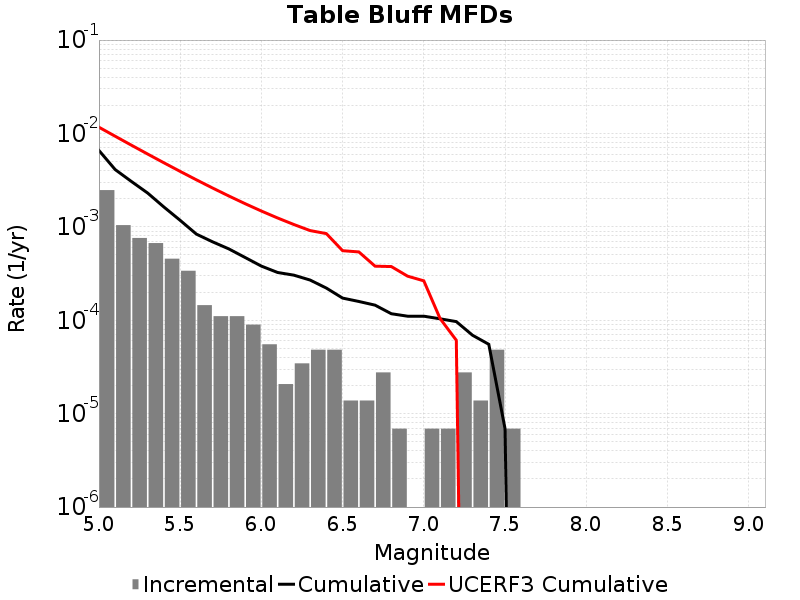

| Magnitude | Incremental Rate | Cumulative Rate | UCERF3 Cumulative Rate |
|-----|-----|-----|-----|
| 5.05 | 0.0024735294 | 0.0067711137 | 0.0116657205 |
| 5.15 | 0.0010433043 | 0.0042975848 | 0.009337409 |
| 5.25 | 7.60023E-4 | 0.0032542802 | 0.0074879667 |
| 5.35 | 6.702021E-4 | 0.0024942572 | 0.006018902 |
| 5.45 | 4.560138E-4 | 0.0018240552 | 0.0048519825 |
| 5.55 | 3.385557E-4 | 0.0013680414 | 0.0039250655 |
| 5.65 | 1.450953E-4 | 0.0010294857 | 0.003188789 |
| 5.75 | 1.105488E-4 | 8.843904E-4 | 0.0026039437 |
| 5.85 | 1.105488E-4 | 7.738416E-4 | 0.0021393849 |
| 5.95 | 8.98209E-5 | 6.6329277E-4 | 0.0017703724 |
| 6.05 | 5.52744E-5 | 5.734719E-4 | 0.0014772555 |
| 6.15 | 2.0727899E-5 | 5.181975E-4 | 0.0012444244 |
| 6.25 | 4.1455798E-5 | 4.974696E-4 | 0.0010594801 |
| 6.35 | 4.83651E-5 | 4.560138E-4 | 9.1257365E-4 |
| 6.45 | 5.52744E-5 | 4.0764868E-4 | 8.4680744E-4 |
| 6.55 | 1.38186E-5 | 3.523743E-4 | 5.556889E-4 |
| 6.65 | 2.0727899E-5 | 3.385557E-4 | 5.3905975E-4 |
| 6.75 | 3.4546498E-5 | 3.178278E-4 | 3.7940947E-4 |
| 6.85 | 1.38186E-5 | 2.832813E-4 | 3.757922E-4 |
| 6.95 | 2.0727899E-5 | 2.694627E-4 | 2.9662627E-4 |
| 7.05 | 4.1455798E-5 | 2.487348E-4 | 2.6420495E-4 |
| 7.15 | 5.52744E-5 | 2.07279E-4 | 1.04364844E-4 |
| 7.25 | 6.9092996E-5 | 1.5200459E-4 | 6.1083796E-5 |
| 7.35 | 2.0727899E-5 | 8.2911596E-5 | 0.0 |
| 7.45 | 5.52744E-5 | 6.21837E-5 | 0.0 |
| 7.55 | 6.9093E-6 | 6.9093E-6 | 0.0 |

### Tank Canyon
*[(top)](#table-of-contents)*

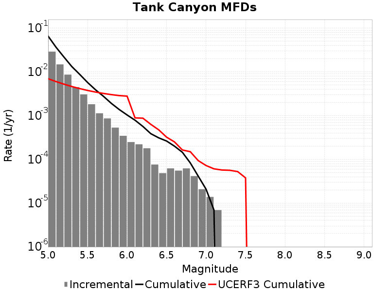

| Magnitude | Incremental Rate | Cumulative Rate | UCERF3 Cumulative Rate |
|-----|-----|-----|-----|
| 5.05 | 0.029095061 | 0.06599072 | 0.00699592 |
| 5.15 | 0.014875723 | 0.036895663 | 0.0060267993 |
| 5.25 | 0.0086780805 | 0.02201994 | 0.0052569993 |
| 5.35 | 0.0044841357 | 0.013341858 | 0.0046455255 |
| 5.45 | 0.003067729 | 0.008857722 | 0.0041598147 |
| 5.55 | 0.0018240552 | 0.0057899933 | 0.0037740006 |
| 5.65 | 0.0011331252 | 0.003965938 | 0.0034675377 |
| 5.75 | 8.636625E-4 | 0.002832813 | 0.0032241056 |
| 5.85 | 5.320161E-4 | 0.0019691505 | 0.0030307407 |
| 5.95 | 3.45465E-4 | 0.0014371343 | 0.0028771453 |
| 6.05 | 2.487348E-4 | 0.0010916694 | 0.0027975007 |
| 6.15 | 2.210976E-4 | 8.429346E-4 | 8.8998873E-4 |
| 6.25 | 1.796418E-4 | 6.21837E-4 | 8.7554235E-4 |
| 6.35 | 7.6002296E-5 | 4.421952E-4 | 6.326823E-4 |
| 6.45 | 4.83651E-5 | 3.661929E-4 | 4.7414823E-4 |
| 6.55 | 6.21837E-5 | 3.178278E-4 | 3.2222347E-4 |
| 6.65 | 5.52744E-5 | 2.556441E-4 | 2.5064807E-4 |
| 6.75 | 6.21837E-5 | 2.003697E-4 | 1.6395899E-4 |
| 6.85 | 4.1455798E-5 | 1.3818599E-4 | 1.497214E-4 |
| 6.95 | 2.0727899E-5 | 9.67302E-5 | 9.3770985E-5 |
| 7.05 | 1.38186E-5 | 7.6002296E-5 | 7.220504E-5 |
| 7.15 | 6.9093E-6 | 6.21837E-5 | 6.0712013E-5 |
| 7.25 | 0.0 | 5.52744E-5 | 5.7038404E-5 |
| 7.35 | 0.0 | 5.52744E-5 | 5.6184377E-5 |
| 7.45 | 0.0 | 5.52744E-5 | 5.250628E-5 |
| 7.55 | 3.4546498E-5 | 5.52744E-5 | 3.7669975E-5 |
| 7.65 | 1.38186E-5 | 2.0727899E-5 | 0.0 |
| 7.75 | 6.9093E-6 | 6.9093E-6 | 0.0 |

### Thirty Mile Bank
*[(top)](#table-of-contents)*

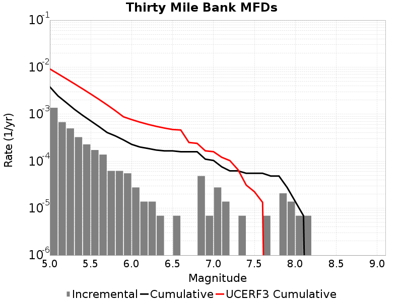

| Magnitude | Incremental Rate | Cumulative Rate | UCERF3 Cumulative Rate |
|-----|-----|-----|-----|
| 5.05 | 0.0013680414 | 0.004104124 | 0.009172222 |
| 5.15 | 6.771114E-4 | 0.0027360828 | 0.007221008 |
| 5.25 | 4.974696E-4 | 0.0020589714 | 0.005671105 |
| 5.35 | 3.247371E-4 | 0.0015615018 | 0.0044399723 |
| 5.45 | 2.280069E-4 | 0.0012367647 | 0.0034620494 |
| 5.55 | 1.934604E-4 | 0.0010087577 | 0.0026852575 |
| 5.65 | 1.3818599E-4 | 8.1529736E-4 | 0.00206823 |
| 5.75 | 6.21837E-5 | 6.771114E-4 | 0.0015781072 |
| 5.85 | 8.2911596E-5 | 6.149277E-4 | 0.0011887891 |
| 5.95 | 5.52744E-5 | 5.320161E-4 | 8.795427E-4 |
| 6.05 | 3.4546498E-5 | 4.767417E-4 | 7.672095E-4 |
| 6.15 | 1.38186E-5 | 4.421952E-4 | 6.779818E-4 |
| 6.25 | 2.0727899E-5 | 4.283766E-4 | 6.0747005E-4 |
| 6.35 | 1.38186E-5 | 4.0764868E-4 | 5.5146054E-4 |
| 6.45 | 3.4546498E-5 | 3.938301E-4 | 5.071239E-4 |
| 6.55 | 6.21837E-5 | 3.592836E-4 | 4.7190604E-4 |
| 6.65 | 3.4546498E-5 | 2.970999E-4 | 4.6071623E-4 |
| 6.75 | 1.38186E-5 | 2.625534E-4 | 2.5008136E-4 |
| 6.85 | 5.52744E-5 | 2.487348E-4 | 2.3949363E-4 |
| 6.95 | 2.0727899E-5 | 1.934604E-4 | 1.6616374E-4 |
| 7.05 | 4.1455798E-5 | 1.727325E-4 | 1.593373E-4 |
| 7.15 | 1.38186E-5 | 1.312767E-4 | 1.2131792E-4 |
| 7.25 | 6.9093E-6 | 1.174581E-4 | 1.0289631E-4 |
| 7.35 | 6.9093E-6 | 1.105488E-4 | 6.5798136E-5 |
| 7.45 | 2.76372E-5 | 1.036395E-4 | 3.103456E-5 |
| 7.55 | 6.9093E-6 | 7.6002296E-5 | 2.2429607E-5 |
| 7.65 | 6.9093E-6 | 6.9092996E-5 | 1.3318822E-5 |
| 7.75 | 0.0 | 6.21837E-5 | 0.0 |
| 7.85 | 3.4546498E-5 | 6.21837E-5 | 0.0 |
| 7.95 | 1.38186E-5 | 2.76372E-5 | 0.0 |
| 8.05 | 6.9093E-6 | 1.38186E-5 | 0.0 |
| 8.15 | 6.9093E-6 | 6.9093E-6 | 0.0 |

### Tin Mountain
*[(top)](#table-of-contents)*

| Magnitude | Incremental Rate | Cumulative Rate | UCERF3 Cumulative Rate |
|-----|-----|-----|-----|
| 5.05 | 5.734719E-4 | 0.0014578623 | 0.0032169484 |
| 5.15 | 1.105488E-4 | 8.843904E-4 | 0.002513995 |
| 5.25 | 2.003697E-4 | 7.738416E-4 | 0.001955619 |
| 5.35 | 1.174581E-4 | 5.734719E-4 | 0.0015120856 |
| 5.45 | 1.105488E-4 | 4.560138E-4 | 0.0011597744 |
| 5.55 | 8.98209E-5 | 3.45465E-4 | 8.799235E-4 |
| 5.65 | 6.21837E-5 | 2.556441E-4 | 6.5763015E-4 |
| 5.75 | 5.52744E-5 | 1.934604E-4 | 4.8105625E-4 |
| 5.85 | 2.0727899E-5 | 1.3818599E-4 | 3.407986E-4 |
| 5.95 | 6.9093E-6 | 1.174581E-4 | 2.29388E-4 |
| 6.05 | 6.9093E-6 | 1.105488E-4 | 1.4089141E-4 |
| 6.15 | 6.9093E-6 | 1.036395E-4 | 8.0894126E-5 |
| 6.25 | 0.0 | 9.67302E-5 | 3.3236596E-5 |
| 6.35 | 1.38186E-5 | 9.67302E-5 | 1.982701E-5 |
| 6.45 | 6.9093E-6 | 8.2911596E-5 | 9.175397E-6 |
| 6.55 | 0.0 | 7.6002296E-5 | 6.2565014E-6 |
| 6.65 | 0.0 | 7.6002296E-5 | 6.2565014E-6 |
| 6.75 | 0.0 | 7.6002296E-5 | 4.7364792E-6 |
| 6.85 | 0.0 | 7.6002296E-5 | 4.409129E-6 |
| 6.95 | 2.0727899E-5 | 7.6002296E-5 | 2.9197508E-6 |
| 7.05 | 2.76372E-5 | 5.52744E-5 | 2.3218672E-6 |
| 7.15 | 2.0727899E-5 | 2.76372E-5 | 1.9062119E-6 |
| 7.25 | 6.9093E-6 | 6.9093E-6 | 1.7743513E-6 |
| 7.35 | 0.0 | 0.0 | 1.4606668E-6 |
| 7.45 | 0.0 | 0.0 | 1.0534243E-6 |
| 7.55 | 0.0 | 0.0 | 1.8639284E-7 |

### Towne Pass
*[(top)](#table-of-contents)*

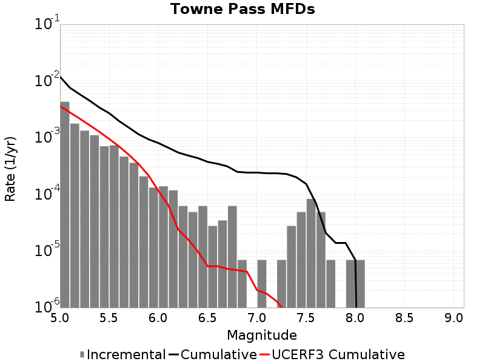

| Magnitude | Incremental Rate | Cumulative Rate | UCERF3 Cumulative Rate |
|-----|-----|-----|-----|
| 5.05 | 0.0042906753 | 0.01293421 | 0.003586412 |
| 5.15 | 0.0017687808 | 0.008643534 | 0.0027930026 |
| 5.25 | 0.0013265855 | 0.0068747536 | 0.0021627753 |
| 5.35 | 0.0011054879 | 0.005548168 | 0.0016621678 |
| 5.45 | 7.047486E-4 | 0.0044426797 | 0.0012645213 |
| 5.55 | 7.323858E-4 | 0.0037379311 | 9.486593E-4 |
| 5.65 | 4.6292308E-4 | 0.0030055454 | 6.977613E-4 |
| 5.75 | 3.800115E-4 | 0.0025426224 | 4.984659E-4 |
| 5.85 | 2.7637198E-4 | 0.0021626109 | 3.4015992E-4 |
| 5.95 | 1.727325E-4 | 0.0018862389 | 2.1441303E-4 |
| 6.05 | 1.865511E-4 | 0.0017135064 | 1.1452872E-4 |
| 6.15 | 1.5200459E-4 | 0.0015269553 | 6.404531E-5 |
| 6.25 | 1.036395E-4 | 0.0013749506 | 2.3944905E-5 |
| 6.35 | 8.2911596E-5 | 0.0012713112 | 1.6059183E-5 |
| 6.45 | 9.67302E-5 | 0.0011883996 | 9.795329E-6 |
| 6.55 | 4.1455798E-5 | 0.0010916694 | 5.376495E-6 |
| 6.65 | 6.9092996E-5 | 0.0010502136 | 5.376495E-6 |
| 6.75 | 7.6002296E-5 | 9.811206E-4 | 4.838458E-6 |
| 6.85 | 4.1455798E-5 | 9.051183E-4 | 4.576725E-6 |
| 6.95 | 2.0727899E-5 | 8.636625E-4 | 4.291544E-6 |
| 7.05 | 1.38186E-5 | 8.429346E-4 | 2.046353E-6 |
| 7.15 | 2.76372E-5 | 8.29116E-4 | 1.7547617E-6 |
| 7.25 | 5.52744E-5 | 8.014788E-4 | 1.2924374E-6 |
| 7.35 | 1.312767E-4 | 7.462044E-4 | 7.978768E-7 |
| 7.45 | 1.865511E-4 | 6.149277E-4 | 0.0 |
| 7.55 | 2.418255E-4 | 4.283766E-4 | 0.0 |
| 7.65 | 1.312767E-4 | 1.865511E-4 | 0.0 |
| 7.75 | 3.4546498E-5 | 5.52744E-5 | 0.0 |
| 7.85 | 0.0 | 2.0727899E-5 | 0.0 |
| 7.95 | 6.9093E-6 | 2.0727899E-5 | 0.0 |
| 8.05 | 1.38186E-5 | 1.38186E-5 | 0.0 |

### Trinidad (alt1)
*[(top)](#table-of-contents)*

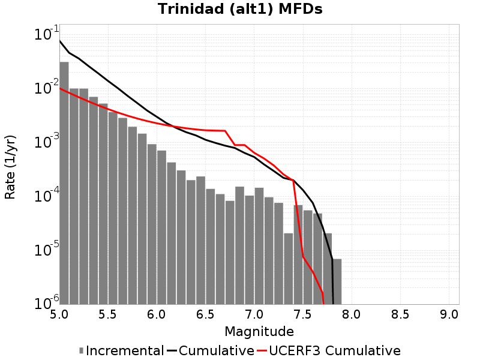

| Magnitude | Incremental Rate | Cumulative Rate | UCERF3 Cumulative Rate |
|-----|-----|-----|-----|
| 5.05 | 0.0312784 | 0.07848274 | 0.010180801 |
| 5.15 | 0.01006685 | 0.047204338 | 0.008375774 |
| 5.25 | 0.010032304 | 0.037137486 | 0.0069419905 |
| 5.35 | 0.0070405765 | 0.027105184 | 0.005803095 |
| 5.45 | 0.0052925237 | 0.020064607 | 0.0048984387 |
| 5.55 | 0.0036757474 | 0.014772084 | 0.0041798446 |
| 5.65 | 0.0028673594 | 0.011096336 | 0.0036090447 |
| 5.75 | 0.0019622413 | 0.008228976 | 0.0031556424 |
| 5.85 | 0.0014647716 | 0.006266735 | 0.002795492 |
| 5.95 | 9.327555E-4 | 0.0048019635 | 0.0025094147 |
| 6.05 | 7.738416E-4 | 0.003869208 | 0.0022821752 |
| 6.15 | 4.905603E-4 | 0.0030953663 | 0.0021016726 |
| 6.25 | 3.661929E-4 | 0.002604806 | 0.001958991 |
| 6.35 | 2.694627E-4 | 0.002238613 | 0.0018456551 |
| 6.45 | 2.970999E-4 | 0.0019691505 | 0.0017559223 |
| 6.55 | 1.589139E-4 | 0.0016720506 | 0.0016911342 |
| 6.65 | 1.5200459E-4 | 0.0015131367 | 0.0016684006 |
| 6.75 | 1.5200459E-4 | 0.0013611321 | 0.001653141 |
| 6.85 | 2.07279E-4 | 0.0012091275 | 9.013081E-4 |
| 6.95 | 1.450953E-4 | 0.0010018485 | 9.013081E-4 |
| 7.05 | 2.418255E-4 | 8.567532E-4 | 6.448377E-4 |
| 7.15 | 1.5200459E-4 | 6.149277E-4 | 5.0722796E-4 |
| 7.25 | 1.450953E-4 | 4.6292308E-4 | 3.7634964E-4 |
| 7.35 | 4.83651E-5 | 3.178278E-4 | 2.5644657E-4 |
| 7.45 | 8.2911596E-5 | 2.694627E-4 | 1.954158E-4 |
| 7.55 | 7.6002296E-5 | 1.865511E-4 | 7.6139554E-6 |
| 7.65 | 4.83651E-5 | 1.105488E-4 | 4.0006726E-6 |
| 7.75 | 4.1455798E-5 | 6.21837E-5 | 1.6259477E-6 |
| 7.85 | 6.9093E-6 | 2.0727899E-5 | 8.2954825E-9 |
| 7.95 | 1.38186E-5 | 1.38186E-5 | 0.0 |

### Ventura-Pitas Point
*[(top)](#table-of-contents)*

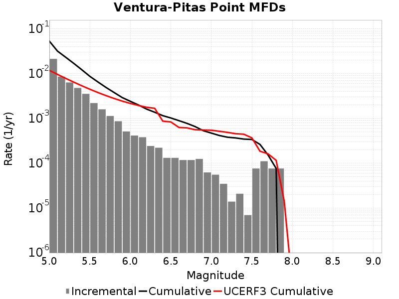

| Magnitude | Incremental Rate | Cumulative Rate | UCERF3 Cumulative Rate |
|-----|-----|-----|-----|
| 5.05 | 0.021384284 | 0.05425873 | 0.011871064 |
| 5.15 | 0.008574441 | 0.03287445 | 0.009651474 |
| 5.25 | 0.006356556 | 0.024300007 | 0.007888391 |
| 5.35 | 0.004795054 | 0.017943451 | 0.006487924 |
| 5.45 | 0.0035375615 | 0.013148398 | 0.0053754942 |
| 5.55 | 0.0022109759 | 0.009610836 | 0.004491859 |
| 5.65 | 0.0016098669 | 0.0073998603 | 0.0037899634 |
| 5.75 | 0.0011331252 | 0.0057899933 | 0.0032324274 |
| 5.85 | 8.7748107E-4 | 0.004656868 | 0.0027895612 |
| 5.95 | 5.112882E-4 | 0.003779387 | 0.0024377797 |
| 6.05 | 4.214673E-4 | 0.003268099 | 0.0021646083 |
| 6.15 | 4.214673E-4 | 0.0028466315 | 0.0019490751 |
| 6.25 | 2.694627E-4 | 0.0024251642 | 0.0017782777 |
| 6.35 | 2.7637198E-4 | 0.0021557016 | 0.0016852826 |
| 6.45 | 1.865511E-4 | 0.0018793296 | 8.709668E-4 |
| 6.55 | 2.003697E-4 | 0.0016927784 | 8.33889E-4 |
| 6.65 | 1.934604E-4 | 0.0014924088 | 6.280713E-4 |
| 6.75 | 1.865511E-4 | 0.0012989484 | 6.147227E-4 |
| 6.85 | 2.210976E-4 | 0.0011123973 | 5.5893627E-4 |
| 6.95 | 8.2911596E-5 | 8.912997E-4 | 5.5166305E-4 |
| 7.05 | 1.243674E-4 | 8.083881E-4 | 5.45249E-4 |
| 7.15 | 4.1455798E-5 | 6.840207E-4 | 5.164355E-4 |
| 7.25 | 4.1455798E-5 | 6.425649E-4 | 4.876367E-4 |
| 7.35 | 3.4546498E-5 | 6.011091E-4 | 4.5566278E-4 |
| 7.45 | 4.1455798E-5 | 5.665626E-4 | 4.4421133E-4 |
| 7.55 | 1.312767E-4 | 5.251068E-4 | 3.6812754E-4 |
| 7.65 | 1.3818599E-4 | 3.938301E-4 | 1.8530423E-4 |
| 7.75 | 1.312767E-4 | 2.556441E-4 | 1.6154024E-4 |
| 7.85 | 1.243674E-4 | 1.243674E-4 | 1.1543686E-4 |
| 7.95 | 0.0 | 0.0 | 1.3814703E-5 |
| 8.05 | 0.0 | 0.0 | 1.7977221E-7 |

### Verdugo
*[(top)](#table-of-contents)*

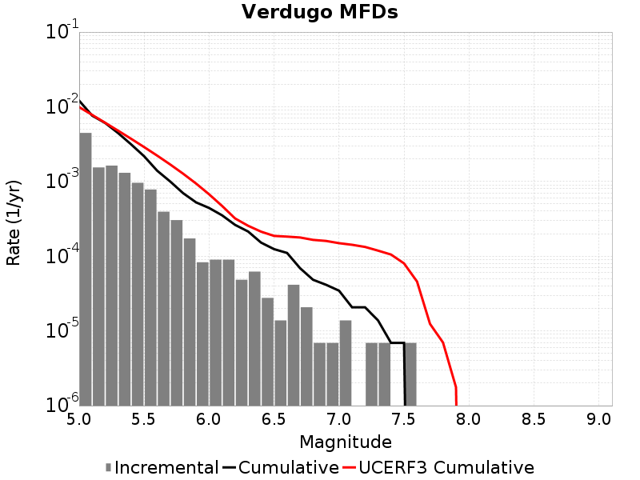

| Magnitude | Incremental Rate | Cumulative Rate | UCERF3 Cumulative Rate |
|-----|-----|-----|-----|
| 5.05 | 0.0044634077 | 0.012782205 | 0.00989586 |
| 5.15 | 0.0015407739 | 0.008318797 | 0.007788103 |
| 5.25 | 0.0016305947 | 0.006778023 | 0.006113852 |
| 5.35 | 0.0013058577 | 0.0051474283 | 0.004783947 |
| 5.45 | 9.603927E-4 | 0.0038415708 | 0.0037275658 |
| 5.55 | 7.807509E-4 | 0.0028811782 | 0.0028884525 |
| 5.65 | 4.007394E-4 | 0.0021004272 | 0.0022219212 |
| 5.75 | 3.247371E-4 | 0.0016996878 | 0.0016924764 |
| 5.85 | 2.003697E-4 | 0.0013749506 | 0.0012719235 |
| 5.95 | 1.450953E-4 | 0.001174581 | 9.378665E-4 |
| 6.05 | 1.450953E-4 | 0.0010294857 | 6.740433E-4 |
| 6.15 | 1.450953E-4 | 8.843904E-4 | 4.705108E-4 |
| 6.25 | 8.2911596E-5 | 7.392951E-4 | 3.2025657E-4 |
| 6.35 | 1.3818599E-4 | 6.5638346E-4 | 2.5565186E-4 |
| 6.45 | 7.6002296E-5 | 5.181975E-4 | 2.1306207E-4 |
| 6.55 | 6.21837E-5 | 4.421952E-4 | 1.8693497E-4 |
| 6.65 | 8.98209E-5 | 3.800115E-4 | 1.8292342E-4 |
| 6.75 | 9.67302E-5 | 2.901906E-4 | 1.7805884E-4 |
| 6.85 | 3.4546498E-5 | 1.934604E-4 | 1.6544222E-4 |
| 6.95 | 2.76372E-5 | 1.589139E-4 | 1.6007895E-4 |
| 7.05 | 1.38186E-5 | 1.312767E-4 | 1.4941343E-4 |
| 7.15 | 0.0 | 1.174581E-4 | 1.4221383E-4 |
| 7.25 | 4.1455798E-5 | 1.174581E-4 | 1.3309703E-4 |
| 7.35 | 4.1455798E-5 | 7.6002296E-5 | 1.18759825E-4 |
| 7.45 | 2.0727899E-5 | 3.4546498E-5 | 1.05238585E-4 |
| 7.55 | 1.38186E-5 | 1.38186E-5 | 8.011886E-5 |
| 7.65 | 0.0 | 0.0 | 4.5831734E-5 |
| 7.75 | 0.0 | 0.0 | 1.24217495E-5 |
| 7.85 | 0.0 | 0.0 | 6.991907E-6 |
| 7.95 | 0.0 | 0.0 | 1.7607248E-6 |

### Walker Spring 2011 CFM
*[(top)](#table-of-contents)*

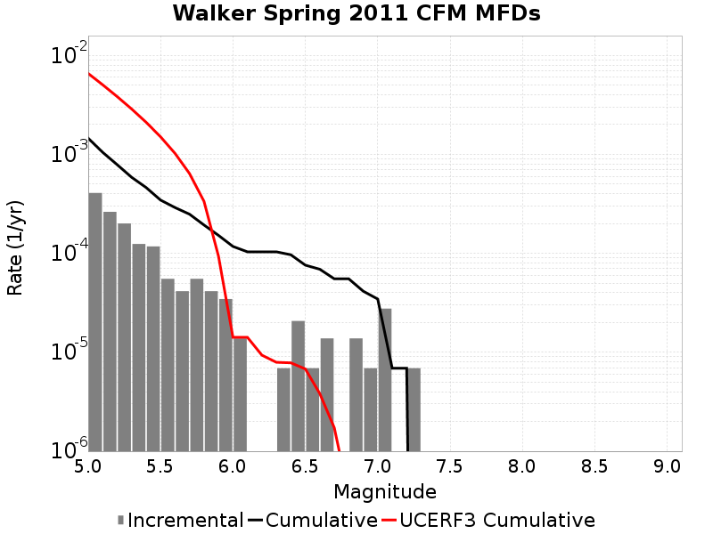

| Magnitude | Incremental Rate | Cumulative Rate | UCERF3 Cumulative Rate |
|-----|-----|-----|-----|
| 5.05 | 4.0764868E-4 | 0.0014578623 | 0.0065788575 |
| 5.15 | 2.625534E-4 | 0.0010502136 | 0.0050529637 |
| 5.25 | 2.003697E-4 | 7.876602E-4 | 0.0038409035 |
| 5.35 | 1.243674E-4 | 5.872905E-4 | 0.00287813 |
| 5.45 | 1.174581E-4 | 4.6292308E-4 | 0.0021133714 |
| 5.55 | 5.52744E-5 | 3.45465E-4 | 0.0015059023 |
| 5.65 | 4.1455798E-5 | 2.901906E-4 | 0.0010233724 |
| 5.75 | 5.52744E-5 | 2.487348E-4 | 6.400852E-4 |
| 5.85 | 4.1455798E-5 | 1.934604E-4 | 3.3562942E-4 |
| 5.95 | 3.4546498E-5 | 1.5200459E-4 | 9.3791576E-5 |
| 6.05 | 1.38186E-5 | 1.174581E-4 | 1.4170889E-5 |
| 6.15 | 0.0 | 1.036395E-4 | 1.4170889E-5 |
| 6.25 | 0.0 | 1.036395E-4 | 9.357606E-6 |
| 6.35 | 6.9093E-6 | 1.036395E-4 | 7.9265565E-6 |
| 6.45 | 2.0727899E-5 | 9.67302E-5 | 7.829856E-6 |
| 6.55 | 6.9093E-6 | 7.6002296E-5 | 6.7886294E-6 |
| 6.65 | 1.38186E-5 | 6.9092996E-5 | 3.8220455E-6 |
| 6.75 | 0.0 | 5.52744E-5 | 1.7292783E-6 |
| 6.85 | 1.38186E-5 | 5.52744E-5 | 3.5440533E-7 |
| 6.95 | 6.9093E-6 | 4.1455798E-5 | 0.0 |
| 7.05 | 2.76372E-5 | 3.4546498E-5 | 0.0 |
| 7.15 | 0.0 | 6.9093E-6 | 0.0 |
| 7.25 | 6.9093E-6 | 6.9093E-6 | 0.0 |

### West Napa 2011 CFM
*[(top)](#table-of-contents)*

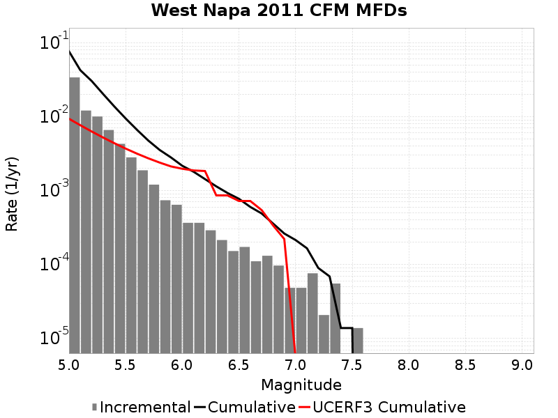

| Magnitude | Incremental Rate | Cumulative Rate | UCERF3 Cumulative Rate |
|-----|-----|-----|-----|
| 5.05 | 0.033897024 | 0.07737034 | 0.009353306 |
| 5.15 | 0.012084366 | 0.043473314 | 0.0076518464 |
| 5.25 | 0.010032304 | 0.03138895 | 0.0063003283 |
| 5.35 | 0.0065914723 | 0.021356646 | 0.0052267793 |
| 5.45 | 0.004283766 | 0.014765174 | 0.004374029 |
| 5.55 | 0.002812085 | 0.010481408 | 0.0036966659 |
| 5.65 | 0.0018862389 | 0.0076693227 | 0.0031586168 |
| 5.75 | 0.0012367647 | 0.005783084 | 0.0027312294 |
| 5.85 | 8.636625E-4 | 0.004546319 | 0.0023917432 |
| 5.95 | 7.738416E-4 | 0.003682657 | 0.0021220802 |
| 6.05 | 4.974696E-4 | 0.0029088152 | 0.0019720371 |
| 6.15 | 5.181975E-4 | 0.0024113457 | 0.001871833 |
| 6.25 | 3.385557E-4 | 0.0018931482 | 0.001839052 |
| 6.35 | 2.832813E-4 | 0.0015545925 | 8.5926574E-4 |
| 6.45 | 1.865511E-4 | 0.0012713112 | 8.5926574E-4 |
| 6.55 | 2.280069E-4 | 0.0010847601 | 7.2303397E-4 |
| 6.65 | 1.865511E-4 | 8.567532E-4 | 7.229768E-4 |
| 6.75 | 1.796418E-4 | 6.702021E-4 | 5.4512924E-4 |
| 6.85 | 1.243674E-4 | 4.905603E-4 | 3.3984988E-4 |
| 6.95 | 6.9092996E-5 | 3.661929E-4 | 2.2115481E-4 |
| 7.05 | 6.9092996E-5 | 2.970999E-4 | 5.4802467E-6 |
| 7.15 | 1.174581E-4 | 2.280069E-4 | 3.2688747E-6 |
| 7.25 | 2.76372E-5 | 1.105488E-4 | 2.7481892E-6 |
| 7.35 | 6.9092996E-5 | 8.2911596E-5 | 2.3722416E-6 |
| 7.45 | 0.0 | 1.38186E-5 | 1.7610109E-6 |
| 7.55 | 1.38186E-5 | 1.38186E-5 | 1.0256357E-6 |
| 7.65 | 0.0 | 0.0 | 4.6027642E-7 |
| 7.75 | 0.0 | 0.0 | 1.7288761E-7 |
| 7.85 | 0.0 | 0.0 | 1.208566E-7 |
| 7.95 | 0.0 | 0.0 | 9.187233E-8 |
| 8.05 | 0.0 | 0.0 | 5.2998292E-8 |
| 8.15 | 0.0 | 0.0 | 4.425838E-9 |

### West Tahoe
*[(top)](#table-of-contents)*

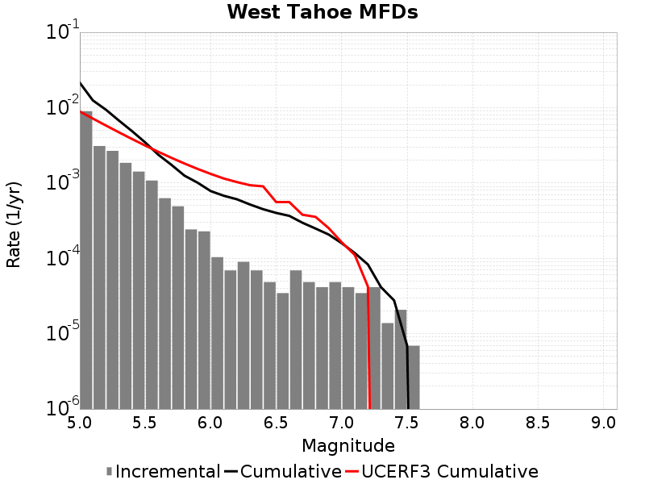

| Magnitude | Incremental Rate | Cumulative Rate | UCERF3 Cumulative Rate |
|-----|-----|-----|-----|
| 5.05 | 0.008940634 | 0.021425739 | 0.00889507 |
| 5.15 | 0.0030953663 | 0.012485105 | 0.0071639908 |
| 5.25 | 0.0026669898 | 0.009389739 | 0.005788945 |
| 5.35 | 0.0018516923 | 0.0067227487 | 0.0046967077 |
| 5.45 | 0.0014164065 | 0.0048710564 | 0.0038291125 |
| 5.55 | 0.0010778508 | 0.00345465 | 0.0031399573 |
| 5.65 | 6.287463E-4 | 0.0023767992 | 0.002592542 |
| 5.75 | 4.905603E-4 | 0.0017480529 | 0.0021577142 |
| 5.85 | 2.487348E-4 | 0.0012574926 | 0.0018123185 |
| 5.95 | 2.280069E-4 | 0.0010087577 | 0.0015379608 |
| 6.05 | 1.036395E-4 | 7.807509E-4 | 0.0013200308 |
| 6.15 | 6.9092996E-5 | 6.771114E-4 | 0.0011469228 |
| 6.25 | 8.98209E-5 | 6.0801837E-4 | 0.0010285511 |
| 6.35 | 6.9092996E-5 | 5.181975E-4 | 9.3468075E-4 |
| 6.45 | 4.83651E-5 | 4.491045E-4 | 9.027284E-4 |
| 6.55 | 3.4546498E-5 | 4.007394E-4 | 5.578722E-4 |
| 6.65 | 6.9092996E-5 | 3.661929E-4 | 5.578722E-4 |
| 6.75 | 4.83651E-5 | 2.970999E-4 | 3.7931555E-4 |
| 6.85 | 4.1455798E-5 | 2.487348E-4 | 3.5523166E-4 |
| 6.95 | 4.83651E-5 | 2.07279E-4 | 2.526337E-4 |
| 7.05 | 4.1455798E-5 | 1.589139E-4 | 1.6339963E-4 |
| 7.15 | 3.4546498E-5 | 1.174581E-4 | 1.1085789E-4 |
| 7.25 | 4.1455798E-5 | 8.2911596E-5 | 4.2299707E-5 |
| 7.35 | 1.38186E-5 | 4.1455798E-5 | 0.0 |
| 7.45 | 2.0727899E-5 | 2.76372E-5 | 0.0 |
| 7.55 | 6.9093E-6 | 6.9093E-6 | 0.0 |

### White Mountains
*[(top)](#table-of-contents)*

| Magnitude | Incremental Rate | Cumulative Rate | UCERF3 Cumulative Rate |
|-----|-----|-----|-----|
| 5.05 | 0.009831933 | 0.027796114 | 0.042108502 |
| 5.15 | 0.004428861 | 0.01796418 | 0.033180833 |
| 5.25 | 0.00345465 | 0.013535319 | 0.026089335 |
| 5.35 | 0.0024113457 | 0.010080668 | 0.020456359 |
| 5.45 | 0.0019967877 | 0.0076693227 | 0.015981926 |
| 5.55 | 0.0014785902 | 0.0056725354 | 0.012427757 |
| 5.65 | 9.811206E-4 | 0.004193945 | 0.00960458 |
| 5.75 | 8.567532E-4 | 0.0032128245 | 0.0073620514 |
| 5.85 | 5.458347E-4 | 0.0023560713 | 0.0055807475 |
| 5.95 | 3.938301E-4 | 0.0018102366 | 0.0041658073 |
| 6.05 | 3.178278E-4 | 0.0014164065 | 0.0030418807 |
| 6.15 | 1.934604E-4 | 0.0010985787 | 0.0025755176 |
| 6.25 | 1.727325E-4 | 9.051183E-4 | 0.0022180756 |
| 6.35 | 9.67302E-5 | 7.323858E-4 | 0.0010978049 |
| 6.45 | 6.9092996E-5 | 6.356556E-4 | 0.0010667692 |
| 6.55 | 4.1455798E-5 | 5.665626E-4 | 7.817855E-4 |
| 6.65 | 8.2911596E-5 | 5.251068E-4 | 6.093478E-4 |
| 6.75 | 4.1455798E-5 | 4.421952E-4 | 5.034819E-4 |
| 6.85 | 9.67302E-5 | 4.007394E-4 | 3.8029358E-4 |
| 6.95 | 3.4546498E-5 | 3.0400918E-4 | 3.1449515E-4 |
| 7.05 | 2.0727899E-5 | 2.694627E-4 | 2.618893E-4 |
| 7.15 | 6.9092996E-5 | 2.487348E-4 | 2.2887728E-4 |
| 7.25 | 8.2911596E-5 | 1.796418E-4 | 2.1159797E-4 |
| 7.35 | 2.0727899E-5 | 9.67302E-5 | 1.8634538E-4 |
| 7.45 | 6.21837E-5 | 7.6002296E-5 | 1.6536703E-4 |
| 7.55 | 6.9093E-6 | 1.38186E-5 | 1.0558641E-4 |
| 7.65 | 0.0 | 6.9093E-6 | 1.7819622E-5 |
| 7.75 | 6.9093E-6 | 6.9093E-6 | 0.0 |

### White Wolf
*[(top)](#table-of-contents)*

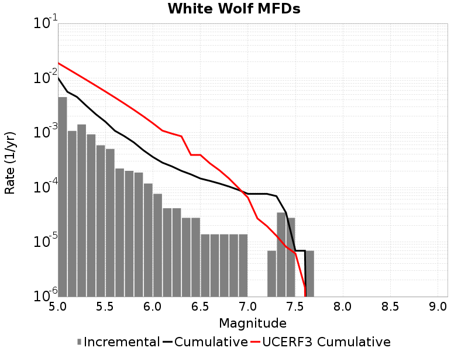

| Magnitude | Incremental Rate | Cumulative Rate | UCERF3 Cumulative Rate |
|-----|-----|-----|-----|
| 5.05 | 0.0044841357 | 0.010087578 | 0.018902894 |
| 5.15 | 0.0010778508 | 0.0056034424 | 0.014923411 |
| 5.25 | 0.0014164065 | 0.0045255916 | 0.011762396 |
| 5.35 | 9.327555E-4 | 0.003109185 | 0.009251513 |
| 5.45 | 5.872905E-4 | 0.0021764294 | 0.007257047 |
| 5.55 | 5.0437887E-4 | 0.001589139 | 0.0056727864 |
| 5.65 | 2.210976E-4 | 0.0010847601 | 0.0044143638 |
| 5.75 | 2.003697E-4 | 8.636625E-4 | 0.003414763 |
| 5.85 | 1.865511E-4 | 6.6329277E-4 | 0.0026207517 |
| 5.95 | 1.174581E-4 | 4.767417E-4 | 0.0019900464 |
| 6.05 | 7.6002296E-5 | 3.592836E-4 | 0.0014890592 |
| 6.15 | 4.1455798E-5 | 2.832813E-4 | 0.001091111 |
| 6.25 | 4.1455798E-5 | 2.418255E-4 | 9.62182E-4 |
| 6.35 | 2.76372E-5 | 2.003697E-4 | 8.598213E-4 |
| 6.45 | 2.76372E-5 | 1.727325E-4 | 3.9225697E-4 |
| 6.55 | 1.38186E-5 | 1.450953E-4 | 3.914471E-4 |
| 6.65 | 1.38186E-5 | 1.312767E-4 | 2.7478536E-4 |
| 6.75 | 1.38186E-5 | 1.174581E-4 | 2.0532153E-4 |
| 6.85 | 1.38186E-5 | 1.036395E-4 | 1.4569813E-4 |
| 6.95 | 1.38186E-5 | 8.98209E-5 | 9.754403E-5 |
| 7.05 | 0.0 | 7.6002296E-5 | 6.4845255E-5 |
| 7.15 | 0.0 | 7.6002296E-5 | 2.697546E-5 |
| 7.25 | 6.9093E-6 | 7.6002296E-5 | 1.9527464E-5 |
| 7.35 | 3.4546498E-5 | 6.9092996E-5 | 1.3009912E-5 |
| 7.45 | 2.76372E-5 | 3.4546498E-5 | 8.2028355E-6 |
| 7.55 | 0.0 | 6.9093E-6 | 6.1602373E-6 |
| 7.65 | 6.9093E-6 | 6.9093E-6 | 1.4810888E-6 |

### White Wolf (Extension)
*[(top)](#table-of-contents)*

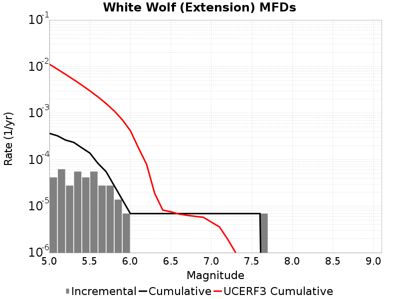

| Magnitude | Incremental Rate | Cumulative Rate | UCERF3 Cumulative Rate |
|-----|-----|-----|-----|
| 5.05 | 4.1455798E-5 | 4.007394E-4 | 0.011215357 |
| 5.15 | 6.21837E-5 | 3.592836E-4 | 0.00874593 |
| 5.25 | 2.76372E-5 | 2.970999E-4 | 0.0067843944 |
| 5.35 | 5.52744E-5 | 2.694627E-4 | 0.0052262913 |
| 5.45 | 4.1455798E-5 | 2.141883E-4 | 0.003988646 |
| 5.55 | 5.52744E-5 | 1.727325E-4 | 0.0030055495 |
| 5.65 | 2.76372E-5 | 1.174581E-4 | 0.0022246481 |
| 5.75 | 2.76372E-5 | 8.98209E-5 | 0.0016043562 |
| 5.85 | 1.38186E-5 | 6.21837E-5 | 0.0011116407 |
| 5.95 | 6.9093E-6 | 4.83651E-5 | 7.2026293E-4 |
| 6.05 | 0.0 | 4.1455798E-5 | 4.1831998E-4 |
| 6.15 | 0.0 | 4.1455798E-5 | 1.7847818E-4 |
| 6.25 | 0.0 | 4.1455798E-5 | 7.937429E-5 |
| 6.35 | 0.0 | 4.1455798E-5 | 1.8841652E-5 |
| 6.45 | 0.0 | 4.1455798E-5 | 8.232546E-6 |
| 6.55 | 0.0 | 4.1455798E-5 | 7.568687E-6 |
| 6.65 | 0.0 | 4.1455798E-5 | 6.757164E-6 |
| 6.75 | 6.9093E-6 | 4.1455798E-5 | 6.3572606E-6 |
| 6.85 | 0.0 | 3.4546498E-5 | 6.02666E-6 |
| 6.95 | 6.9093E-6 | 3.4546498E-5 | 5.773265E-6 |
| 7.05 | 0.0 | 2.76372E-5 | 4.5377083E-6 |
| 7.15 | 0.0 | 2.76372E-5 | 3.5766418E-6 |
| 7.25 | 0.0 | 2.76372E-5 | 1.9554539E-6 |
| 7.35 | 6.9093E-6 | 2.76372E-5 | 9.993529E-7 |
| 7.45 | 1.38186E-5 | 2.0727899E-5 | 1.7882314E-7 |
| 7.55 | 0.0 | 6.9093E-6 | 0.0 |
| 7.65 | 6.9093E-6 | 6.9093E-6 | 0.0 |

### Wight Way 2011 CFM
*[(top)](#table-of-contents)*

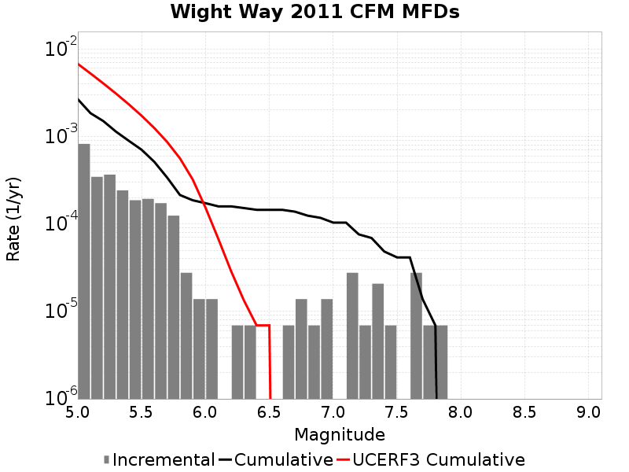

| Magnitude | Incremental Rate | Cumulative Rate | UCERF3 Cumulative Rate |
|-----|-----|-----|-----|
| 5.05 | 8.2220667E-4 | 0.004035031 | 0.006759971 |
| 5.15 | 3.45465E-4 | 0.0032128245 | 0.0052451803 |
| 5.25 | 3.661929E-4 | 0.0028673594 | 0.0040419395 |
| 5.35 | 2.418255E-4 | 0.0025011667 | 0.0030861716 |
| 5.45 | 1.865511E-4 | 0.002259341 | 0.0023269781 |
| 5.55 | 1.934604E-4 | 0.00207279 | 0.0017239292 |
| 5.65 | 1.865511E-4 | 0.0018793296 | 0.0012449104 |
| 5.75 | 1.934604E-4 | 0.0016927784 | 8.644123E-4 |
| 5.85 | 1.5200459E-4 | 0.001499318 | 5.6217186E-4 |
| 5.95 | 1.036395E-4 | 0.0013473135 | 3.220938E-4 |
| 6.05 | 1.312767E-4 | 0.001243674 | 1.5353778E-4 |
| 6.15 | 5.52744E-5 | 0.0011123973 | 6.776115E-5 |
| 6.25 | 4.83651E-5 | 0.0010571228 | 2.8946479E-5 |
| 6.35 | 6.21837E-5 | 0.0010087577 | 1.3419948E-5 |
| 6.45 | 1.105488E-4 | 9.465741E-4 | 6.9171406E-6 |
| 6.55 | 8.98209E-5 | 8.360253E-4 | 6.9171406E-6 |
| 6.65 | 6.21837E-5 | 7.462044E-4 | 0.0 |
| 6.75 | 3.4546498E-5 | 6.840207E-4 | 0.0 |
| 6.85 | 4.83651E-5 | 6.494742E-4 | 0.0 |
| 6.95 | 6.21837E-5 | 6.011091E-4 | 0.0 |
| 7.05 | 4.1455798E-5 | 5.389254E-4 | 0.0 |
| 7.15 | 1.3818599E-4 | 4.974696E-4 | 0.0 |
| 7.25 | 8.2911596E-5 | 3.592836E-4 | 0.0 |
| 7.35 | 4.83651E-5 | 2.7637198E-4 | 0.0 |
| 7.45 | 4.83651E-5 | 2.280069E-4 | 0.0 |
| 7.55 | 4.1455798E-5 | 1.796418E-4 | 0.0 |
| 7.65 | 1.036395E-4 | 1.3818599E-4 | 0.0 |
| 7.75 | 2.0727899E-5 | 3.4546498E-5 | 0.0 |
| 7.85 | 1.38186E-5 | 1.38186E-5 | 0.0 |

### Yorba Linda
*[(top)](#table-of-contents)*

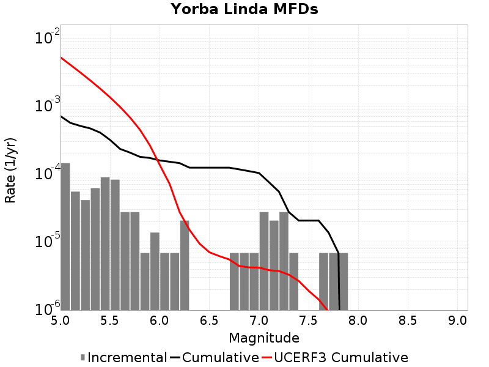

| Magnitude | Incremental Rate | Cumulative Rate | UCERF3 Cumulative Rate |
|-----|-----|-----|-----|
| 5.05 | 1.450953E-4 | 0.0010433043 | 0.0052116574 |
| 5.15 | 5.52744E-5 | 8.98209E-4 | 0.0040479377 |
| 5.25 | 4.1455798E-5 | 8.429346E-4 | 0.0031235626 |
| 5.35 | 6.21837E-5 | 8.014788E-4 | 0.002389305 |
| 5.45 | 8.98209E-5 | 7.392951E-4 | 0.0018060636 |
| 5.55 | 8.2911596E-5 | 6.494742E-4 | 0.0013427784 |
| 5.65 | 3.4546498E-5 | 5.665626E-4 | 9.74778E-4 |
| 5.75 | 5.52744E-5 | 5.320161E-4 | 6.8246486E-4 |
| 5.85 | 2.76372E-5 | 4.767417E-4 | 4.5027226E-4 |
| 5.95 | 4.83651E-5 | 4.491045E-4 | 2.6583511E-4 |
| 6.05 | 4.83651E-5 | 4.007394E-4 | 1.365725E-4 |
| 6.15 | 2.76372E-5 | 3.523743E-4 | 7.14544E-5 |
| 6.25 | 3.4546498E-5 | 3.247371E-4 | 2.760472E-5 |
| 6.35 | 6.9093E-6 | 2.901906E-4 | 1.51118875E-5 |
| 6.45 | 6.9093E-6 | 2.832813E-4 | 9.526084E-6 |
| 6.55 | 1.38186E-5 | 2.7637198E-4 | 7.0939336E-6 |
| 6.65 | 6.9093E-6 | 2.625534E-4 | 6.229716E-6 |
| 6.75 | 3.4546498E-5 | 2.556441E-4 | 5.561415E-6 |
| 6.85 | 4.1455798E-5 | 2.210976E-4 | 4.464291E-6 |
| 6.95 | 2.0727899E-5 | 1.796418E-4 | 4.251803E-6 |
| 7.05 | 4.83651E-5 | 1.589139E-4 | 4.2230513E-6 |
| 7.15 | 4.83651E-5 | 1.105488E-4 | 3.8694297E-6 |
| 7.25 | 3.4546498E-5 | 6.21837E-5 | 3.7592476E-6 |
| 7.35 | 6.9093E-6 | 2.76372E-5 | 3.3214378E-6 |
| 7.45 | 0.0 | 2.0727899E-5 | 2.6871792E-6 |
| 7.55 | 0.0 | 2.0727899E-5 | 1.921759E-6 |
| 7.65 | 6.9093E-6 | 2.0727899E-5 | 1.4354798E-6 |
| 7.75 | 6.9093E-6 | 1.38186E-5 | 9.456392E-7 |
| 7.85 | 6.9093E-6 | 6.9093E-6 | 4.804394E-7 |
| 7.95 | 0.0 | 0.0 | 7.249409E-8 |

### Zayante-Vergeles 2011 CFM
*[(top)](#table-of-contents)*

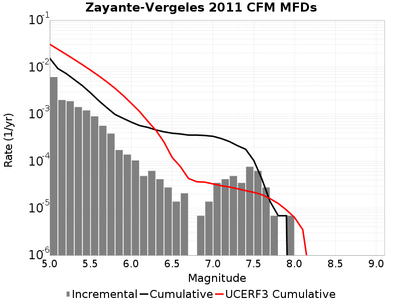

| Magnitude | Incremental Rate | Cumulative Rate | UCERF3 Cumulative Rate |
|-----|-----|-----|-----|
| 5.05 | 0.006149277 | 0.017017605 | 0.030719683 |
| 5.15 | 0.0019967877 | 0.010868329 | 0.024079127 |
| 5.25 | 0.0018862389 | 0.008871541 | 0.018804345 |
| 5.35 | 0.0014164065 | 0.006985302 | 0.014614437 |
| 5.45 | 0.0012022182 | 0.0055688955 | 0.0112862745 |
| 5.55 | 8.98209E-4 | 0.0043666777 | 0.008642621 |
| 5.65 | 5.941998E-4 | 0.0034684686 | 0.0065426924 |
| 5.75 | 5.181975E-4 | 0.0028742687 | 0.00487466 |
| 5.85 | 3.45465E-4 | 0.0023560713 | 0.003549695 |
| 5.95 | 2.970999E-4 | 0.0020106062 | 0.0024972376 |
| 6.05 | 2.210976E-4 | 0.0017135064 | 0.0016964033 |
| 6.15 | 1.174581E-4 | 0.0014924088 | 0.0011447123 |
| 6.25 | 1.312767E-4 | 0.0013749506 | 7.126735E-4 |
| 6.35 | 7.6002296E-5 | 0.001243674 | 4.5597518E-4 |
| 6.45 | 6.9092996E-5 | 0.0011676716 | 2.5531993E-4 |
| 6.55 | 2.0727899E-5 | 0.0010985787 | 1.200683E-4 |
| 6.65 | 5.52744E-5 | 0.0010778508 | 7.709463E-5 |
| 6.75 | 3.4546498E-5 | 0.0010225764 | 4.2959426E-5 |
| 6.85 | 8.98209E-5 | 9.880299E-4 | 3.6575046E-5 |
| 6.95 | 8.98209E-5 | 8.98209E-4 | 3.587988E-5 |
| 7.05 | 9.67302E-5 | 8.083881E-4 | 3.2882563E-5 |
| 7.15 | 1.174581E-4 | 7.1165786E-4 | 3.0132496E-5 |
| 7.25 | 9.67302E-5 | 5.941998E-4 | 2.8283832E-5 |
| 7.35 | 1.036395E-4 | 4.974696E-4 | 2.6017306E-5 |
| 7.45 | 1.727325E-4 | 3.938301E-4 | 2.3651777E-5 |
| 7.55 | 1.450953E-4 | 2.210976E-4 | 2.1761358E-5 |
| 7.65 | 4.83651E-5 | 7.6002296E-5 | 1.9359015E-5 |
| 7.75 | 1.38186E-5 | 2.76372E-5 | 1.5967273E-5 |
| 7.85 | 0.0 | 1.38186E-5 | 1.2620218E-5 |
| 7.95 | 1.38186E-5 | 1.38186E-5 | 9.177115E-6 |
| 8.05 | 0.0 | 0.0 | 6.3329053E-6 |
| 8.15 | 0.0 | 0.0 | 3.4979223E-6 |
| 8.25 | 0.0 | 0.0 | 2.3443162E-7 |

