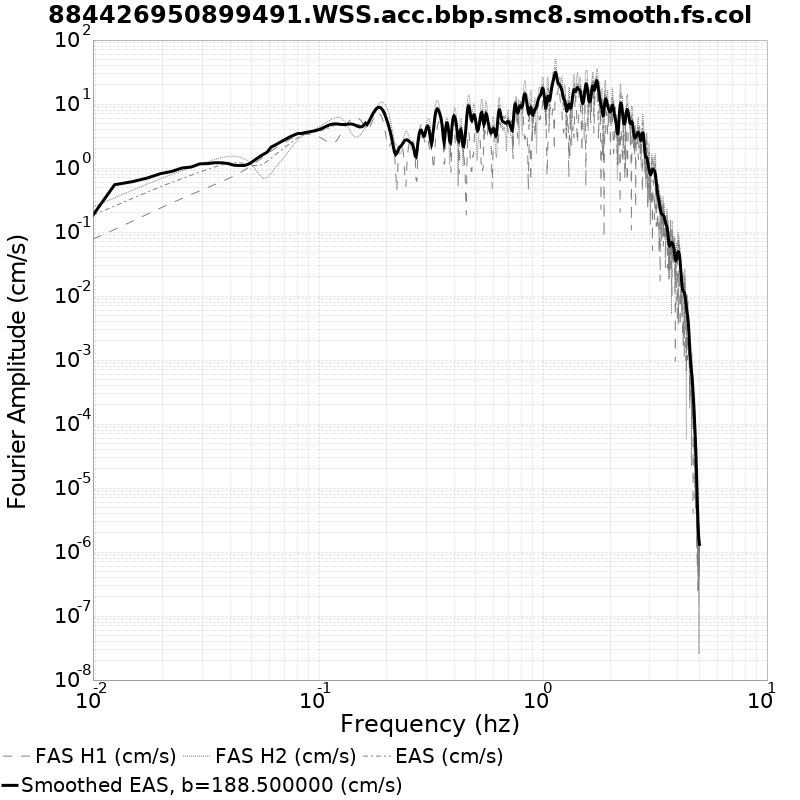
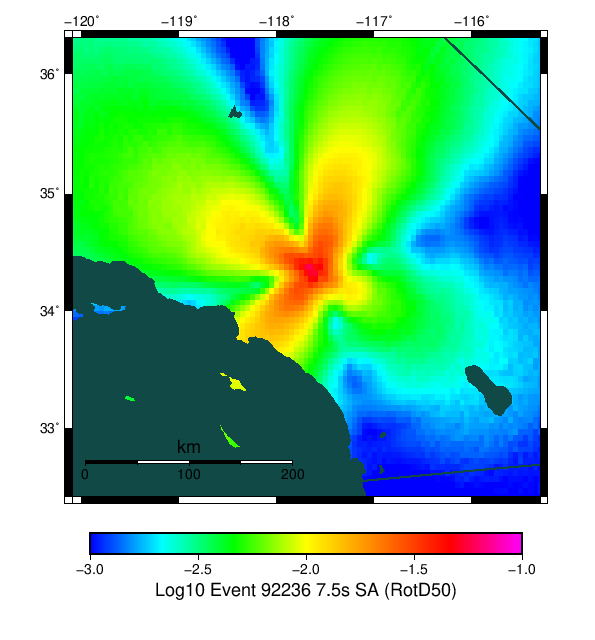
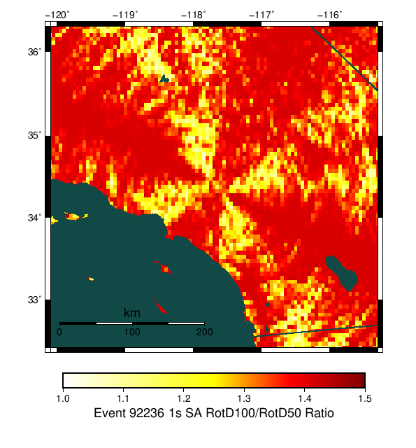
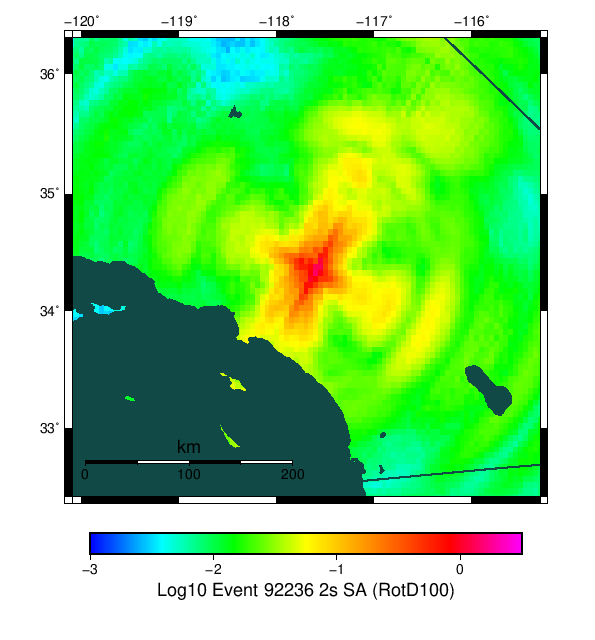
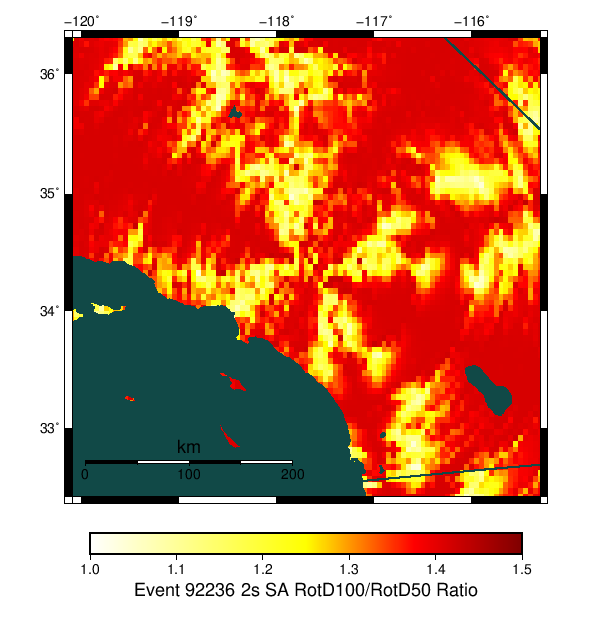

# Event 92236, M7.19

[Catalog Details](../#bruce-4322)

## Table Of Contents
* [Fault List](#fault-list)
* [Rupture Plots](#rupture-plots)
  * [Slip/Time Plot](#sliptime-plot)
  * [Slip/Vel Animation](resources/rupture_plot_92236.gif)
  * [Map Plot](#map-plot)
  * [Rupture Velocity Plot](#rupture-velocity-plot)
* [Spectra Plots](#spectra-plots)
  * [Site USC](#site-usc)
    * [USC Fourier Amplitude Spectra](#usc-fourier-amplitude-spectra)
    * [USC RotD50 Spectra](#usc-rotd50-spectra)
    * [USC RotD Ratio](#usc-rotd-ratio)
    * [USC Acceleration Seismograms](#usc-acceleration-seismograms)
    * [USC Velocity Seismograms](#usc-velocity-seismograms)
  * [Site SBSM](#site-sbsm)
    * [SBSM Fourier Amplitude Spectra](#sbsm-fourier-amplitude-spectra)
    * [SBSM RotD50 Spectra](#sbsm-rotd50-spectra)
    * [SBSM RotD Ratio](#sbsm-rotd-ratio)
    * [SBSM Acceleration Seismograms](#sbsm-acceleration-seismograms)
    * [SBSM Velocity Seismograms](#sbsm-velocity-seismograms)
  * [Site WNGC](#site-wngc)
    * [WNGC Fourier Amplitude Spectra](#wngc-fourier-amplitude-spectra)
    * [WNGC RotD50 Spectra](#wngc-rotd50-spectra)
    * [WNGC RotD Ratio](#wngc-rotd-ratio)
    * [WNGC Acceleration Seismograms](#wngc-acceleration-seismograms)
    * [WNGC Velocity Seismograms](#wngc-velocity-seismograms)
  * [Site STNI](#site-stni)
    * [STNI Fourier Amplitude Spectra](#stni-fourier-amplitude-spectra)
    * [STNI RotD50 Spectra](#stni-rotd50-spectra)
    * [STNI RotD Ratio](#stni-rotd-ratio)
    * [STNI Acceleration Seismograms](#stni-acceleration-seismograms)
    * [STNI Velocity Seismograms](#stni-velocity-seismograms)
  * [Site SMCA](#site-smca)
    * [SMCA Fourier Amplitude Spectra](#smca-fourier-amplitude-spectra)
    * [SMCA RotD50 Spectra](#smca-rotd50-spectra)
    * [SMCA RotD Ratio](#smca-rotd-ratio)
    * [SMCA Acceleration Seismograms](#smca-acceleration-seismograms)
    * [SMCA Velocity Seismograms](#smca-velocity-seismograms)
  * [Site OSI](#site-osi)
    * [OSI Fourier Amplitude Spectra](#osi-fourier-amplitude-spectra)
    * [OSI RotD50 Spectra](#osi-rotd50-spectra)
    * [OSI RotD Ratio](#osi-rotd-ratio)
    * [OSI Acceleration Seismograms](#osi-acceleration-seismograms)
    * [OSI Velocity Seismograms](#osi-velocity-seismograms)
  * [Site PDE](#site-pde)
    * [PDE Fourier Amplitude Spectra](#pde-fourier-amplitude-spectra)
    * [PDE RotD50 Spectra](#pde-rotd50-spectra)
    * [PDE RotD Ratio](#pde-rotd-ratio)
    * [PDE Acceleration Seismograms](#pde-acceleration-seismograms)
    * [PDE Velocity Seismograms](#pde-velocity-seismograms)
  * [Site WSS](#site-wss)
    * [WSS Fourier Amplitude Spectra](#wss-fourier-amplitude-spectra)
    * [WSS RotD50 Spectra](#wss-rotd50-spectra)
    * [WSS RotD Ratio](#wss-rotd-ratio)
    * [WSS Acceleration Seismograms](#wss-acceleration-seismograms)
    * [WSS Velocity Seismograms](#wss-velocity-seismograms)
  * [Site LAF](#site-laf)
    * [LAF Fourier Amplitude Spectra](#laf-fourier-amplitude-spectra)
    * [LAF RotD50 Spectra](#laf-rotd50-spectra)
    * [LAF RotD Ratio](#laf-rotd-ratio)
    * [LAF Acceleration Seismograms](#laf-acceleration-seismograms)
    * [LAF Velocity Seismograms](#laf-velocity-seismograms)
  * [Site s022](#site-s022)
    * [s022 Fourier Amplitude Spectra](#s022-fourier-amplitude-spectra)
    * [s022 RotD50 Spectra](#s022-rotd50-spectra)
    * [s022 RotD Ratio](#s022-rotd-ratio)
    * [s022 Acceleration Seismograms](#s022-acceleration-seismograms)
    * [s022 Velocity Seismograms](#s022-velocity-seismograms)
* [ShakeMaps](#shakemaps)
  * [Region RotD100/RotD50 Ratio](#region-rotd100rotd50-ratio)
## Fault List
*[(top)](#table-of-contents)*

| Section Name | Area Ruptured | Patches Ruptured | Moment | Equiv. Mag | Max Slip |
|-----|-----|-----|-----|-----|-----|
| *(Total)* | 640.53 km^2 | 462 | 6.74e19 N-m | M7.19 | 6.32 m |
| San Andreas (Mojave S) | 540.26 km^2 | 388 | 6.11e19 N-m | M7.16 | 6.32 m |
| San Andreas (San Bernardino N) | 100.27 km^2 | 74 | 6.24e18 N-m | M6.50 | 3.95 m |

## Rupture Plots
*[(top)](#table-of-contents)*

**Legend**
* Colored, Filled Triangles: RSQSim Elements
* Red Star: RSQSim Hypocenter
* Dark Gray Dashed Outline: GMPE Surface

### Slip/Time Plot
*[(top)](#table-of-contents)*

### Slip/Vel Animation
*[(top)](#table-of-contents)*

[Click here to view Slip/Velocity Animation](resources/rupture_plot_92236.gif)
### Map Plot
*[(top)](#table-of-contents)*

### Rupture Velocity Plot
*[(top)](#table-of-contents)*

## Spectra Plots
*[(top)](#table-of-contents)*

### Site USC
*[(top)](#table-of-contents)*

*Location: 34.0192, -118.286*

| Distance | Actual RSQSim Surface | GMPE Surface |
|-----|-----|-----|
| Horizontal | 61.57 km | 61.51 km |
| 3-D | 61.99 km | 61.51 km |

*NOTE: RSQSim ruptures sometimes have a few co-rupturing elements on faults some distance from the main rupture. This may cause discrepancies in the table above, consult rupture map plot.*
#### USC Fourier Amplitude Spectra
*[(top)](#table-of-contents)*

#### USC RotD50 Spectra
*[(top)](#table-of-contents)*

#### USC RotD Ratio
*[(top)](#table-of-contents)*

#### USC Acceleration Seismograms
*[(top)](#table-of-contents)*

#### USC Velocity Seismograms
*[(top)](#table-of-contents)*

### Site SBSM
*[(top)](#table-of-contents)*

*Location: 34.064987, -117.29201*

| Distance | Actual RSQSim Surface | GMPE Surface |
|-----|-----|-----|
| Horizontal | 29.40 km | 31.15 km |
| 3-D | 30.83 km | 31.15 km |

*NOTE: RSQSim ruptures sometimes have a few co-rupturing elements on faults some distance from the main rupture. This may cause discrepancies in the table above, consult rupture map plot.*
#### SBSM Fourier Amplitude Spectra
*[(top)](#table-of-contents)*

#### SBSM RotD50 Spectra
*[(top)](#table-of-contents)*

#### SBSM RotD Ratio
*[(top)](#table-of-contents)*

#### SBSM Acceleration Seismograms
*[(top)](#table-of-contents)*

#### SBSM Velocity Seismograms
*[(top)](#table-of-contents)*

### Site WNGC
*[(top)](#table-of-contents)*

*Location: 34.041824, -118.0653*

| Distance | Actual RSQSim Surface | GMPE Surface |
|-----|-----|-----|
| Horizontal | 48.75 km | 48.74 km |
| 3-D | 48.75 km | 48.74 km |

*NOTE: RSQSim ruptures sometimes have a few co-rupturing elements on faults some distance from the main rupture. This may cause discrepancies in the table above, consult rupture map plot.*
#### WNGC Fourier Amplitude Spectra
*[(top)](#table-of-contents)*

#### WNGC RotD50 Spectra
*[(top)](#table-of-contents)*

#### WNGC RotD Ratio
*[(top)](#table-of-contents)*

#### WNGC Acceleration Seismograms
*[(top)](#table-of-contents)*

#### WNGC Velocity Seismograms
*[(top)](#table-of-contents)*

### Site STNI
*[(top)](#table-of-contents)*

*Location: 33.93088, -118.17881*

| Distance | Actual RSQSim Surface | GMPE Surface |
|-----|-----|-----|
| Horizontal | 64.46 km | 64.46 km |
| 3-D | 64.55 km | 64.46 km |

*NOTE: RSQSim ruptures sometimes have a few co-rupturing elements on faults some distance from the main rupture. This may cause discrepancies in the table above, consult rupture map plot.*
#### STNI Fourier Amplitude Spectra
*[(top)](#table-of-contents)*

#### STNI RotD50 Spectra
*[(top)](#table-of-contents)*

#### STNI RotD Ratio
*[(top)](#table-of-contents)*

#### STNI Acceleration Seismograms
*[(top)](#table-of-contents)*

#### STNI Velocity Seismograms
*[(top)](#table-of-contents)*

### Site SMCA
*[(top)](#table-of-contents)*

*Location: 34.00909, -118.48939*

| Distance | Actual RSQSim Surface | GMPE Surface |
|-----|-----|-----|
| Horizontal | 75.54 km | 75.42 km |
| 3-D | 75.88 km | 75.42 km |

*NOTE: RSQSim ruptures sometimes have a few co-rupturing elements on faults some distance from the main rupture. This may cause discrepancies in the table above, consult rupture map plot.*
#### SMCA Fourier Amplitude Spectra
*[(top)](#table-of-contents)*

#### SMCA RotD50 Spectra
*[(top)](#table-of-contents)*

#### SMCA RotD Ratio
*[(top)](#table-of-contents)*

#### SMCA Acceleration Seismograms
*[(top)](#table-of-contents)*

#### SMCA Velocity Seismograms
*[(top)](#table-of-contents)*

### Site OSI
*[(top)](#table-of-contents)*

*Location: 34.6145, -118.7235*

| Distance | Actual RSQSim Surface | GMPE Surface |
|-----|-----|-----|
| Horizontal | 81.03 km | 80.74 km |
| 3-D | 81.35 km | 80.74 km |

*NOTE: RSQSim ruptures sometimes have a few co-rupturing elements on faults some distance from the main rupture. This may cause discrepancies in the table above, consult rupture map plot.*
#### OSI Fourier Amplitude Spectra
*[(top)](#table-of-contents)*

#### OSI RotD50 Spectra
*[(top)](#table-of-contents)*

#### OSI RotD Ratio
*[(top)](#table-of-contents)*

#### OSI Acceleration Seismograms
*[(top)](#table-of-contents)*

#### OSI Velocity Seismograms
*[(top)](#table-of-contents)*

### Site PDE
*[(top)](#table-of-contents)*

*Location: 34.44199, -118.58215*

| Distance | Actual RSQSim Surface | GMPE Surface |
|-----|-----|-----|
| Horizontal | 66.01 km | 65.75 km |
| 3-D | 66.40 km | 65.75 km |

*NOTE: RSQSim ruptures sometimes have a few co-rupturing elements on faults some distance from the main rupture. This may cause discrepancies in the table above, consult rupture map plot.*
#### PDE Fourier Amplitude Spectra
*[(top)](#table-of-contents)*

#### PDE RotD50 Spectra
*[(top)](#table-of-contents)*

#### PDE RotD Ratio
*[(top)](#table-of-contents)*

#### PDE Acceleration Seismograms
*[(top)](#table-of-contents)*

#### PDE Velocity Seismograms
*[(top)](#table-of-contents)*

### Site WSS
*[(top)](#table-of-contents)*

*Location: 34.1717, -118.64971*

| Distance | Actual RSQSim Surface | GMPE Surface |
|-----|-----|-----|
| Horizontal | 78.58 km | 78.38 km |
| 3-D | 78.91 km | 78.38 km |

*NOTE: RSQSim ruptures sometimes have a few co-rupturing elements on faults some distance from the main rupture. This may cause discrepancies in the table above, consult rupture map plot.*
#### WSS Fourier Amplitude Spectra
*[(top)](#table-of-contents)*

#### WSS RotD50 Spectra
*[(top)](#table-of-contents)*

#### WSS RotD Ratio
*[(top)](#table-of-contents)*

#### WSS Acceleration Seismograms
*[(top)](#table-of-contents)*

#### WSS Velocity Seismograms
*[(top)](#table-of-contents)*

### Site LAF
*[(top)](#table-of-contents)*

*Location: 33.86889, -118.33143*

| Distance | Actual RSQSim Surface | GMPE Surface |
|-----|-----|-----|
| Horizontal | 77.53 km | 77.49 km |
| 3-D | 77.86 km | 77.49 km |

*NOTE: RSQSim ruptures sometimes have a few co-rupturing elements on faults some distance from the main rupture. This may cause discrepancies in the table above, consult rupture map plot.*
#### LAF Fourier Amplitude Spectra
*[(top)](#table-of-contents)*

#### LAF RotD50 Spectra
*[(top)](#table-of-contents)*

#### LAF RotD Ratio
*[(top)](#table-of-contents)*

#### LAF Acceleration Seismograms
*[(top)](#table-of-contents)*

#### LAF Velocity Seismograms
*[(top)](#table-of-contents)*

### Site s022
*[(top)](#table-of-contents)*

*Location: 34.24505, -119.18086*

| Distance | Actual RSQSim Surface | GMPE Surface |
|-----|-----|-----|
| Horizontal | 123.14 km | 122.90 km |
| 3-D | 123.35 km | 122.90 km |

*NOTE: RSQSim ruptures sometimes have a few co-rupturing elements on faults some distance from the main rupture. This may cause discrepancies in the table above, consult rupture map plot.*
#### s022 Fourier Amplitude Spectra
*[(top)](#table-of-contents)*

#### s022 RotD50 Spectra
*[(top)](#table-of-contents)*

#### s022 RotD Ratio
*[(top)](#table-of-contents)*

#### s022 Acceleration Seismograms
*[(top)](#table-of-contents)*

#### s022 Velocity Seismograms
*[(top)](#table-of-contents)*

## ShakeMaps
*[(top)](#table-of-contents)*

| SA Period | RSQSim | NGAWest_2014_NoIdr | Ratio |
|-----|-----|-----|-----|
| **1.0 s** |  |  |  |
| **2.0 s** |  |  |  |
| **3.0 s** |  |  |  |
| **4.0 s** |  |  |  |
| **5.0 s** |  |  |  |
| **7.5 s** |  |  |  |
| **10.0 s** |  |  |  |
### Region RotD100/RotD50 Ratio
*[(top)](#table-of-contents)*

| SA Period | RotD50 | RotD100 | RotD100/RotD50 Ratio |
|-----|-----|-----|-----|
| **1.0 s** |  |  |  |
| **2.0 s** |  |  |  |
| **3.0 s** |  |  |  |
| **4.0 s** |  |  |  |
| **5.0 s** |  |  |  |
| **7.5 s** |  |  |  |
| **10.0 s** |  |  |  |
