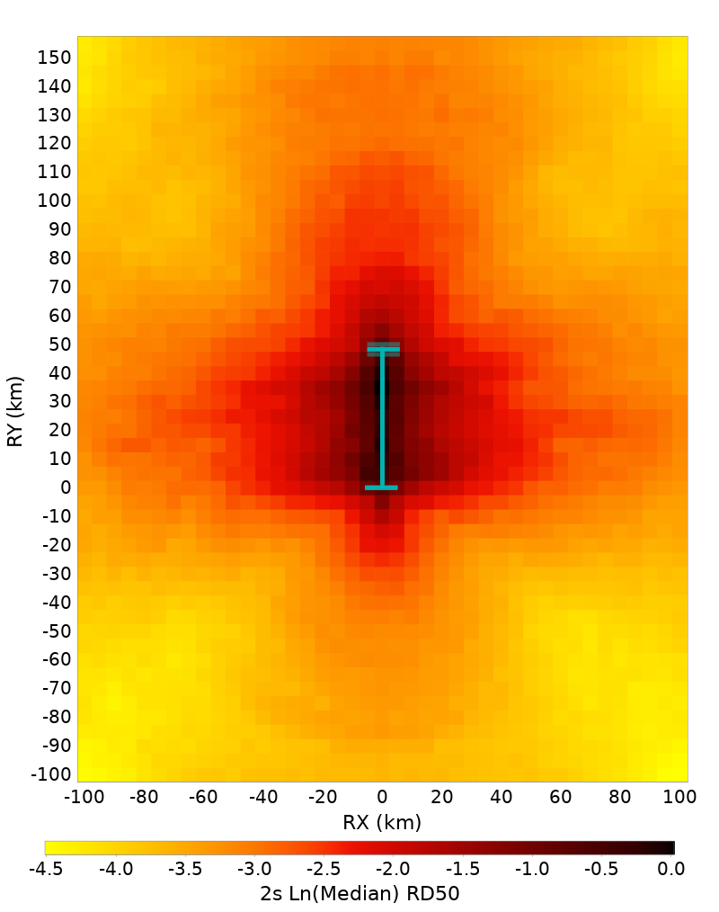
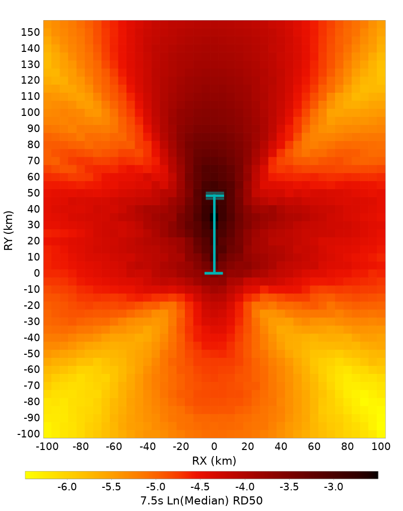
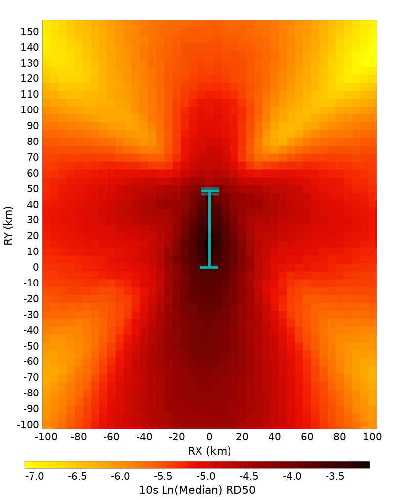
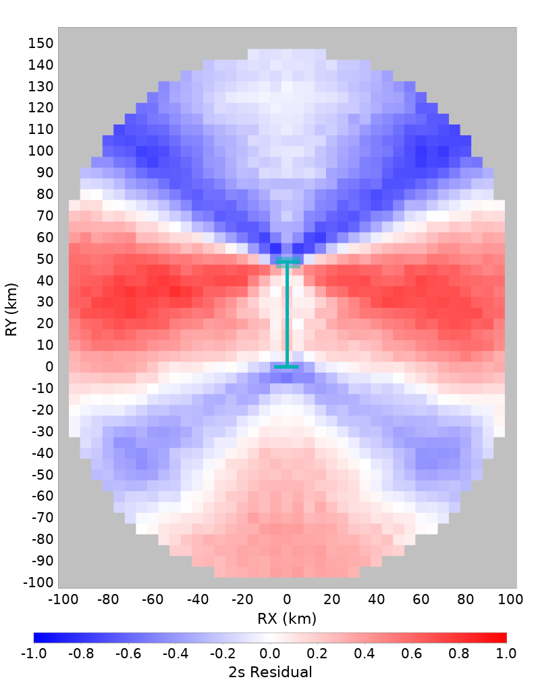

# Bruce 4660, M7.2, Vertical Strike-Slip with Surface Rupture Spatial Distributions

[RSQSim Catalog Details](../#bruce-4660)

## Table Of Contents
* [Full Spatial Distributions](#full-spatial-distributions)
* [Bottom Third Hypocenter Spatial Distributions](#bottom-third-hypocenter-spatial-distributions)
* [Center Third Hypocenter Spatial Distributions](#center-third-hypocenter-spatial-distributions)
* [Top Third Hypocenter Spatial Distributions](#top-third-hypocenter-spatial-distributions)
## Full Spatial Distributions
*[(top)](#table-of-contents)*

|  | 2 s | 3 s | 5 s | 7.5 s | 10 s |
|-----|-----|-----|-----|-----|-----|
| **Ln(Median)** |  |  |  |  |  |
| **Residuals** |  |  |  |  |  |
| **Std. Dev.** |  |  |  |  |  |

## Bottom Third Hypocenter Spatial Distributions
*[(top)](#table-of-contents)*

|  | 2 s | 3 s | 5 s | 7.5 s | 10 s |
|-----|-----|-----|-----|-----|-----|
| **Ln(Median)** |  |  |  |  |  |
| **Residuals** |  |  |  |  |  |
| **Std. Dev.** |  |  |  |  |  |

## Center Third Hypocenter Spatial Distributions
*[(top)](#table-of-contents)*

|  | 2 s | 3 s | 5 s | 7.5 s | 10 s |
|-----|-----|-----|-----|-----|-----|
| **Ln(Median)** |  |  |  |  |  |
| **Residuals** |  |  |  |  |  |
| **Std. Dev.** |  |  |  |  |  |

## Top Third Hypocenter Spatial Distributions
*[(top)](#table-of-contents)*

|  | 2 s | 3 s | 5 s | 7.5 s | 10 s |
|-----|-----|-----|-----|-----|-----|
| **Ln(Median)** |  |  |  |  |  |
| **Residuals** |  |  |  |  |  |
| **Std. Dev.** |  |  |  |  |  |

