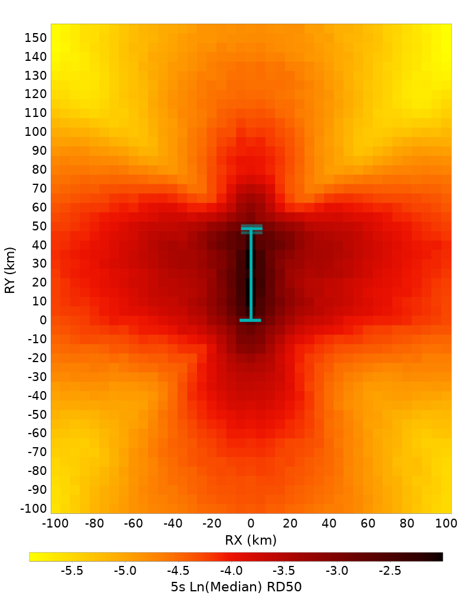
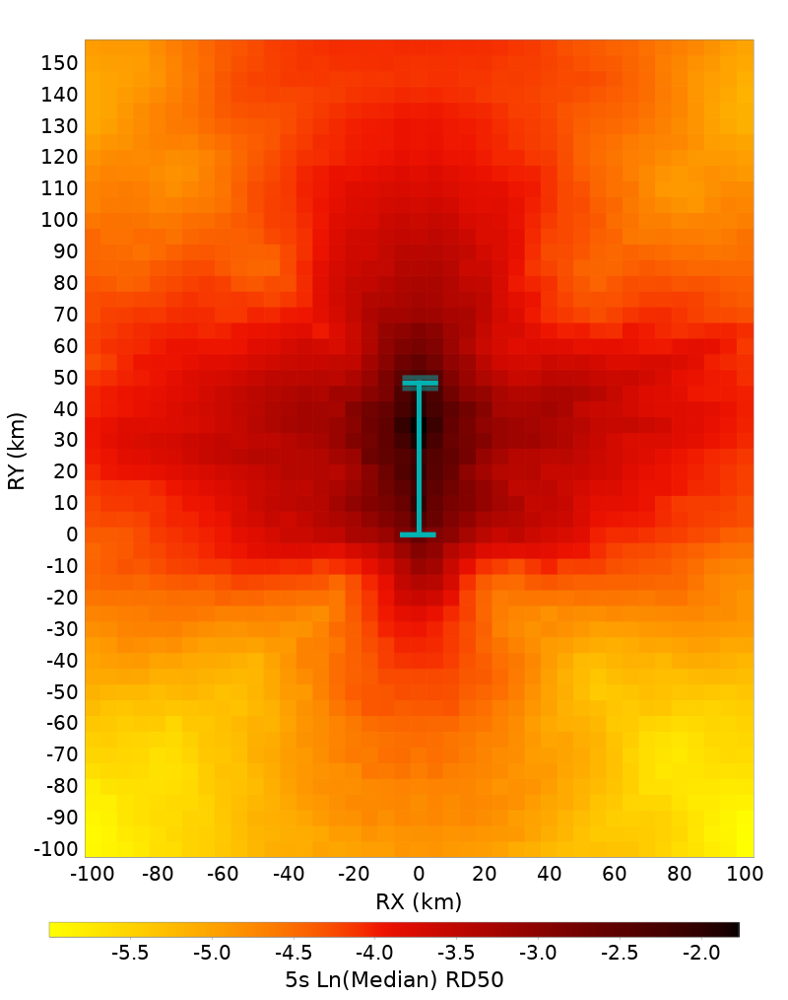
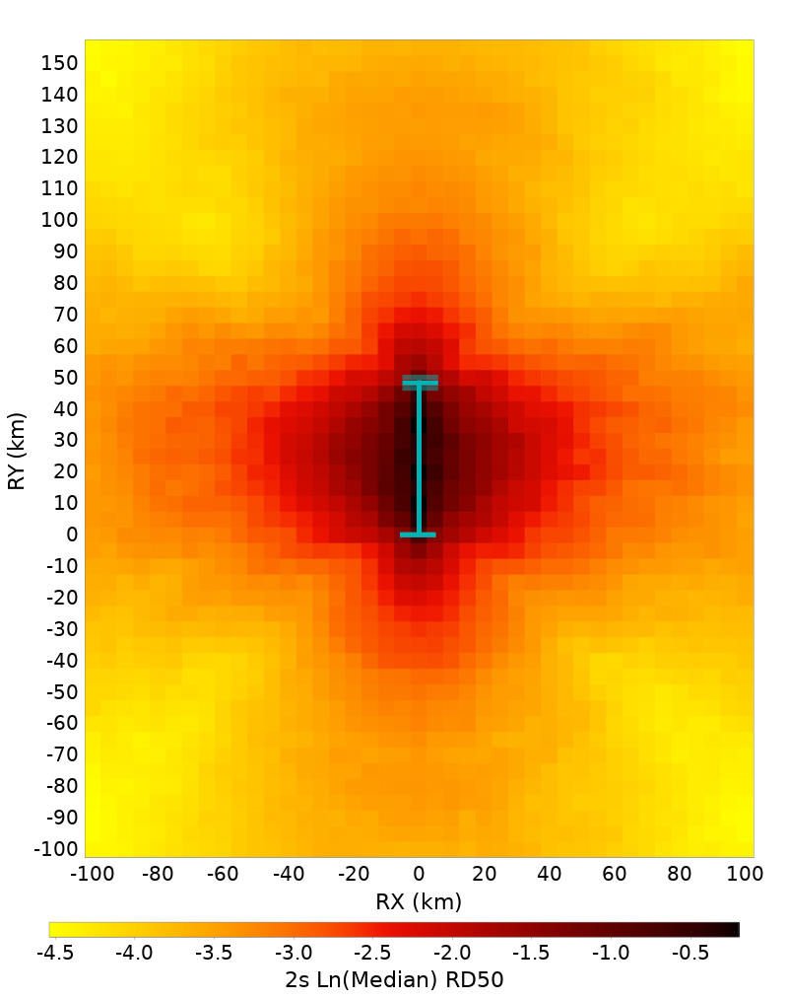
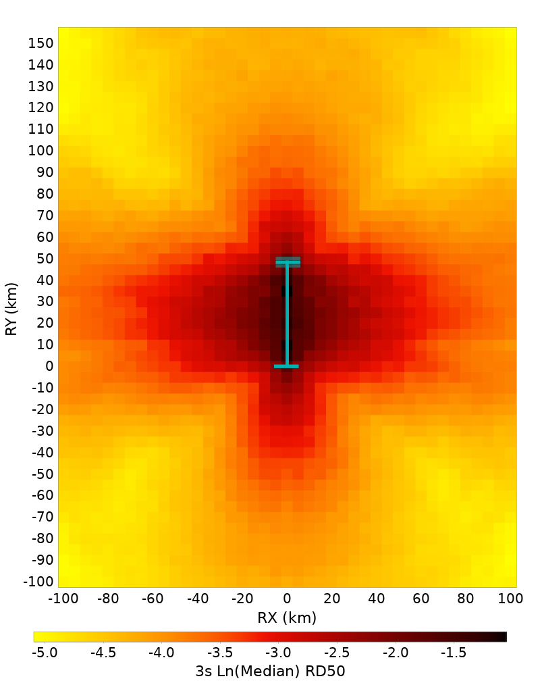
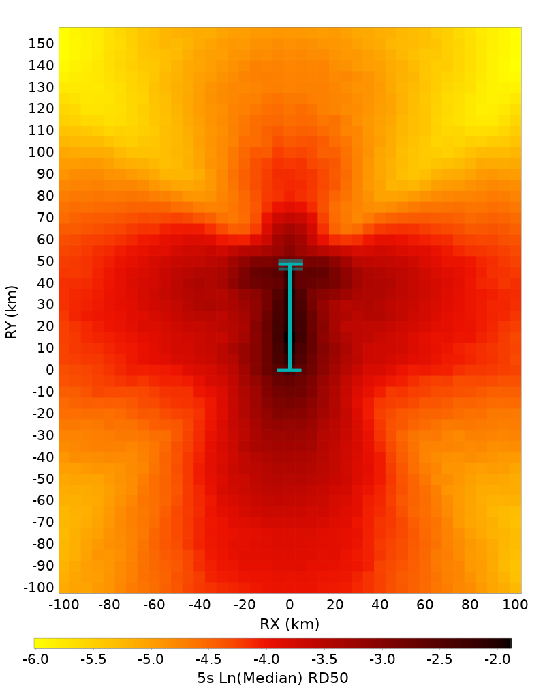

# Bruce 4660, M7.2, Vertical Strike-Slip with Surface Rupture Spatial Distributions

[RSQSim Catalog Details](../#bruce-4660)

## Table Of Contents
* [Full Spatial Distributions](#full-spatial-distributions)
* [Bottom Third Hypocenter Spatial Distributions](#bottom-third-hypocenter-spatial-distributions)
* [Center Third Hypocenter Spatial Distributions](#center-third-hypocenter-spatial-distributions)
* [Top Third Hypocenter Spatial Distributions](#top-third-hypocenter-spatial-distributions)
## Full Spatial Distributions
*[(top)](#table-of-contents)*

These plots show ground motions across 100 ruptures. Each surface is sized slightely differently. The lengh range is [46.488632,50.204918] with a median length of 48.6454295 (km). The width range is [16.2,18.0] with a median width of 18.0 (km). The hypocenter distribution is shown below:

Each column represents a defferent spectral period. The first row gives the log median ground motion (an average shakemap). The second row shows residuals at each point relative to the median ground motion at that distance (Rjb). Residuals are calculated individually for each ruprture, and then averaged spatially. The bottom row shows the standard deviation of log ground motions. The meidan length is annotated with a dark cyan line and ticks, and the extents of all surfaces light cyan lines and ticks.

|  | 2 s | 3 s | 5 s | 7.5 s | 10 s |
|-----|-----|-----|-----|-----|-----|
| **Ln(Median)** |  |  |  |  |  |
| **Residuals** |  |  |  |  |  |
| **Std. Dev.** |  |  |  |  |  |

## Bottom Third Hypocenter Spatial Distributions
*[(top)](#table-of-contents)*

These plots show ground motions across 20 ruptures with hypocenters in the first third of the rupture along strike (bottom third in the plots). Each surface is sized slightely differently. The lengh range is [46.50217,49.96632] with a median length of 48.26356 (km). The width range is [16.2,18.0] with a median width of 18.0 (km). The hypocenter distribution is shown below:

|  | 2 s | 3 s | 5 s | 7.5 s | 10 s |
|-----|-----|-----|-----|-----|-----|
| **Ln(Median)** |  |  |  |  |  |
| **Residuals** |  |  |  |  |  |
| **Std. Dev.** |  |  |  |  |  |

## Center Third Hypocenter Spatial Distributions
*[(top)](#table-of-contents)*

These plots show ground motions across 22 ruptures with hypocenters in the center third of the rupture. Each surface is sized slightely differently. The lengh range is [46.56036,50.099236] with a median length of 48.2864875 (km). The width range is [17.1,18.0] with a median width of 18.0 (km). The hypocenter distribution is shown below:

|  | 2 s | 3 s | 5 s | 7.5 s | 10 s |
|-----|-----|-----|-----|-----|-----|
| **Ln(Median)** |  |  |  |  |  |
| **Residuals** |  |  |  |  |  |
| **Std. Dev.** |  |  |  |  |  |

## Top Third Hypocenter Spatial Distributions
*[(top)](#table-of-contents)*

These plots show ground motions across 58 ruptures with hypocenters in the last third of the rupture along strike (top third in the plots). Each surface is sized slightely differently. The lengh range is [46.488632,50.204918] with a median length of 48.647890000000004 (km). The width range is [16.2,18.0] with a median width of 18.0 (km). The hypocenter distribution is shown below:

|  | 2 s | 3 s | 5 s | 7.5 s | 10 s |
|-----|-----|-----|-----|-----|-----|
| **Ln(Median)** |  |  |  |  |  |
| **Residuals** |  |  |  |  |  |
| **Std. Dev.** |  |  |  |  |  |

