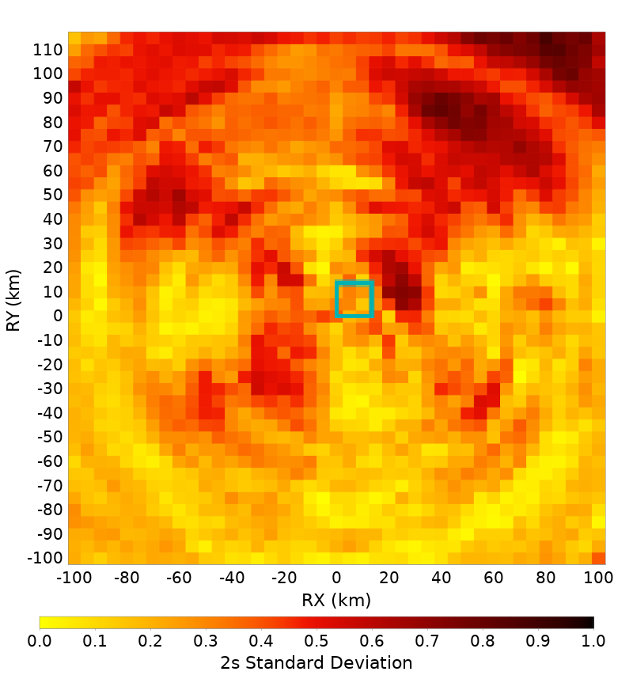
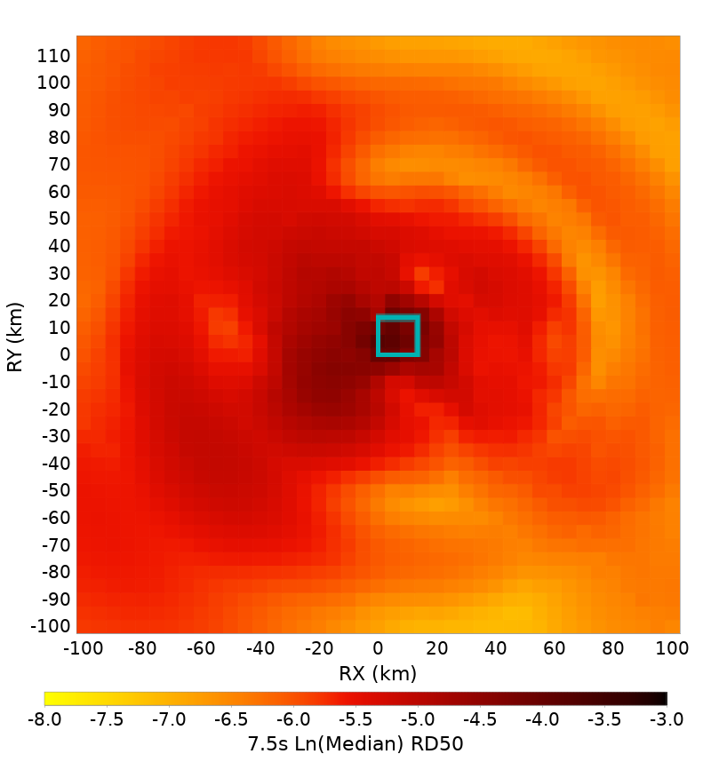
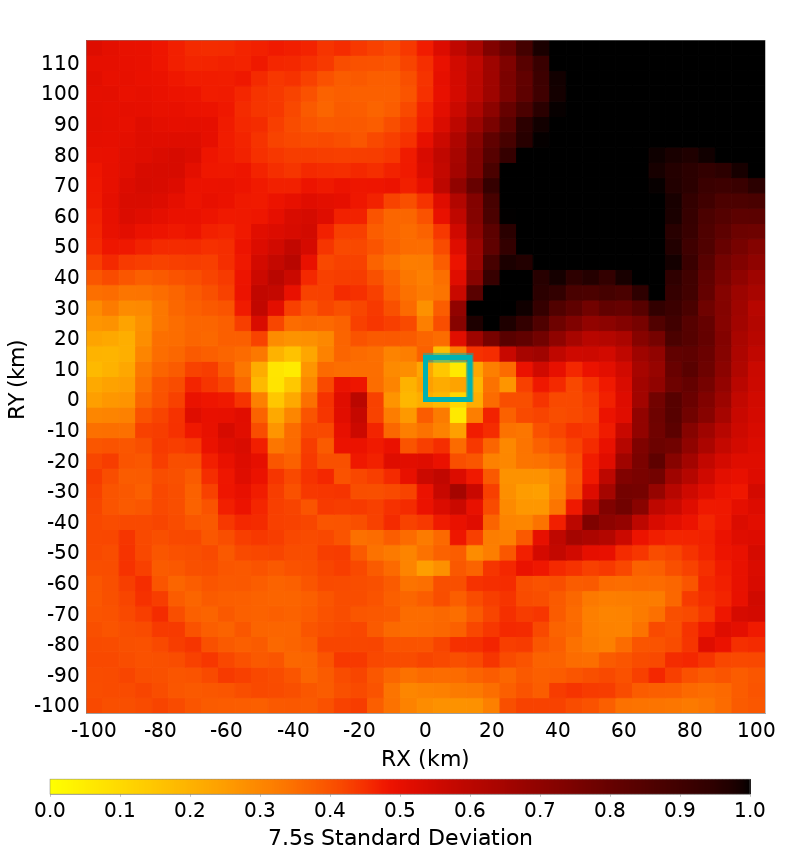
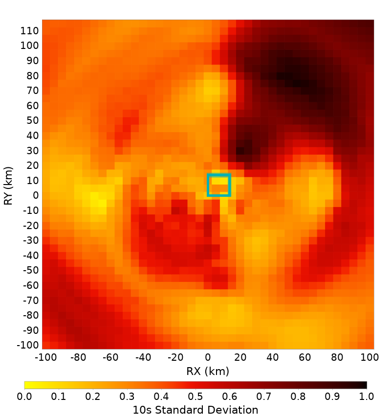
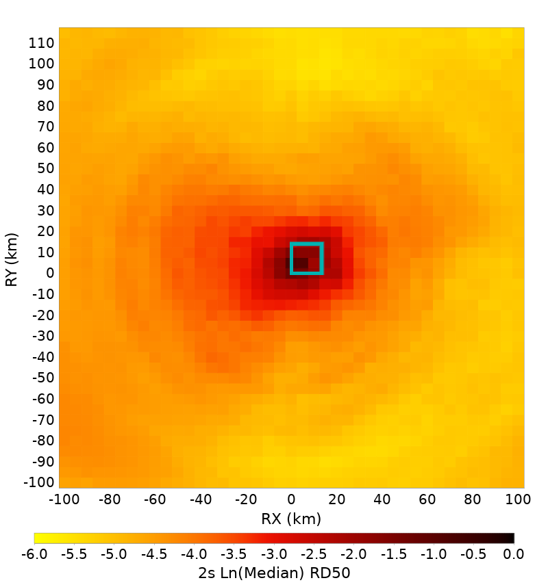
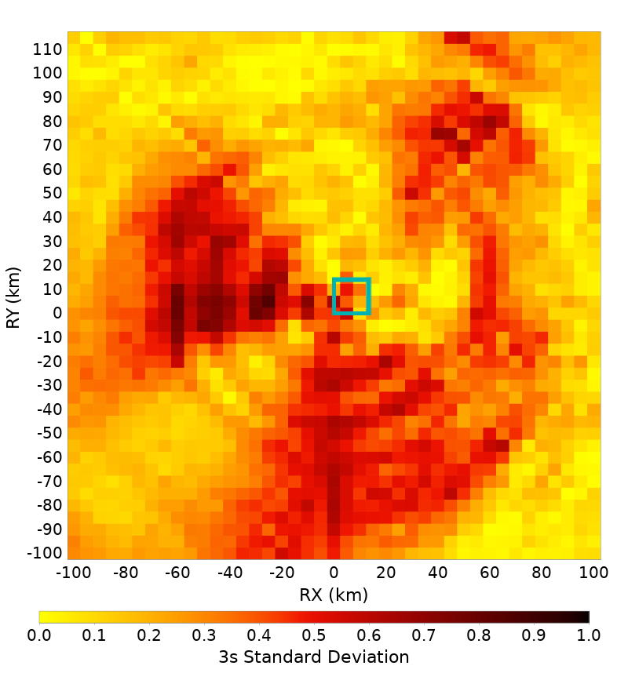
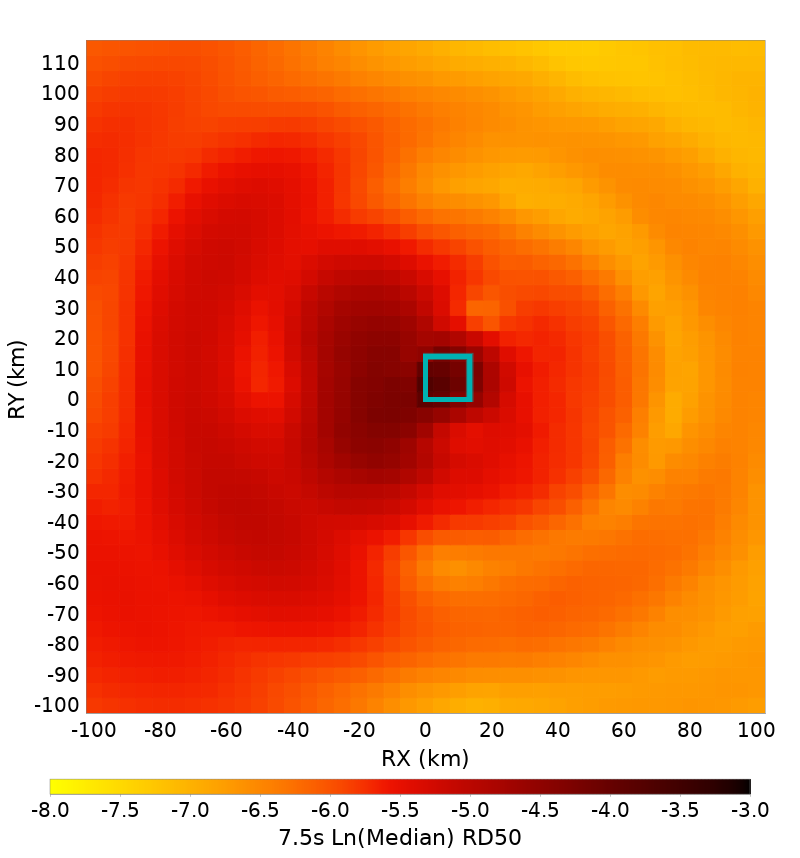
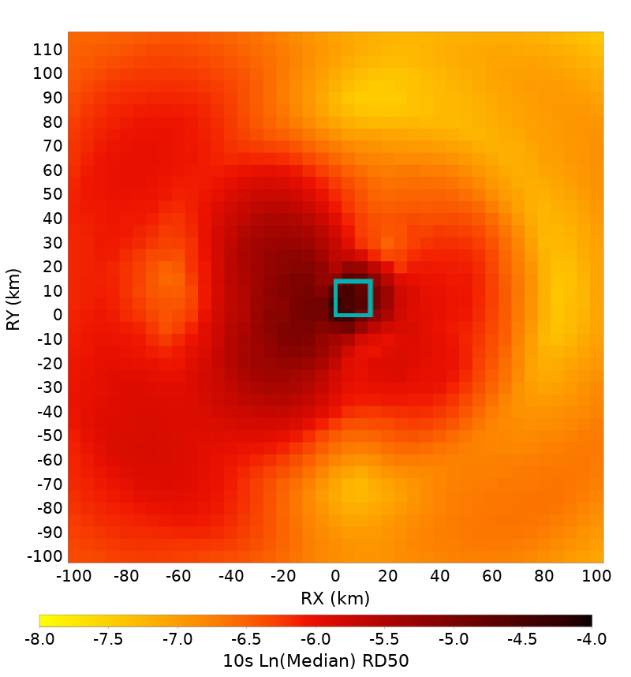
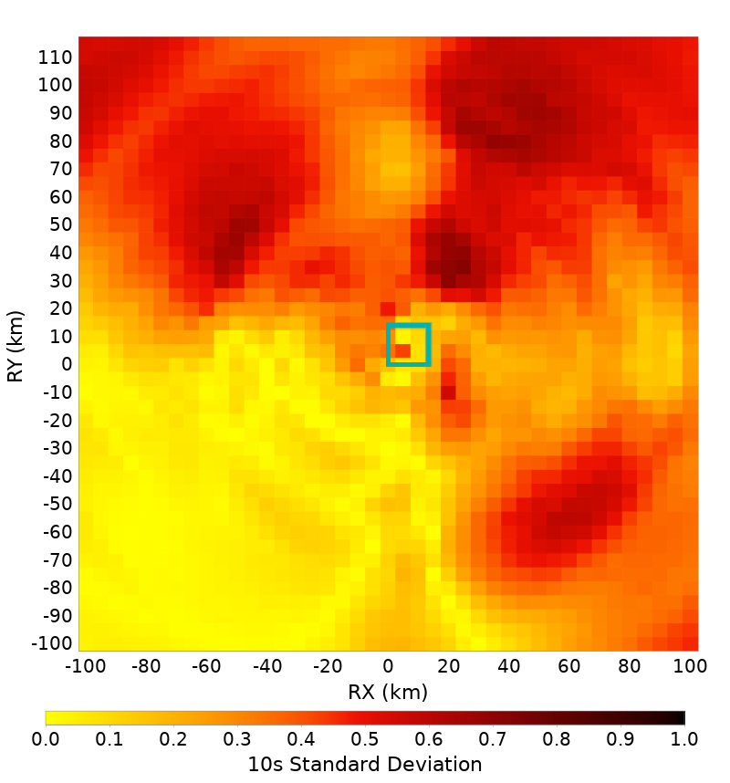

# Bruce 4682, M6.6, Reverse, Dip=45, Ztor=3 Spatial Distributions

[RSQSim Catalog Details](../#bruce-4682)

## Table Of Contents
* [Full Spatial Distributions](#full-spatial-distributions)
* [Center Third Hypocenter Spatial Distributions](#center-third-hypocenter-spatial-distributions)
## Full Spatial Distributions
*[(top)](#table-of-contents)*

| Period | Ln(Median) | Standard Deviation |
|-----|-----|-----|
| 2 s |  |  |
| 3 s |  |  |
| 5 s |  |  |
| 7.5 s |  |  |
| 10 s |  |  |

## Center Third Hypocenter Spatial Distributions
*[(top)](#table-of-contents)*

| Period | Ln(Median) | Standard Deviation |
|-----|-----|-----|
| 2 s |  |  |
| 3 s |  |  |
| 5 s |  |  |
| 7.5 s |  |  |
| 10 s |  |  |

