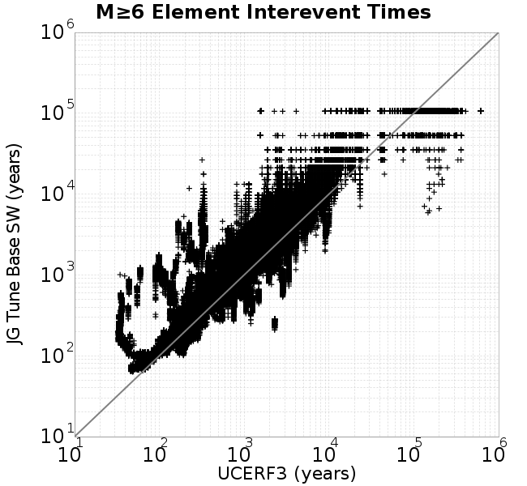

# JG Tune Base SW
## Metadata
| **Catalog** | JG Tune Base SW |
|-----|-----|
| **Author** | Jacqui Gilchrist, 2017/11/20 |
| **Description** | Tuned, additional slip weakening parameters using Keith's fault geometry. muSlipAmp = 0.2, muSlipInvDist_1 = 2.0, cohesion = 6. |
| **Fault/Def Model** | Fault Model 3.1, Geologic |
| **Slip Velocity** | 1.0 m/s |
| **Average Element Area** | 0.90 km^2 |
| **Length** | 40,715,999 events in 110,918 years |
| **Frictional Params** | a=0.005, b=0.006, (b-a)=0.001, ddotEQ=1 |

* [Metadata](#metadata)
* [Plots](#plots)
  * [Magnitude-Frequency Plot](#magnitude-frequency-plot)
  * [Magnitude-Area Plots](#magnitude-area-plots)
  * [Rupture Velocity Plots](#rupture-velocity-plots)
  * [Global Interevent-Time Distributions](#global-interevent-time-distributions)
  * [Normalized Fault Interevent-Time Distributions](#normalized-fault-interevent-time-distributions)
  * [Stationarity Plot](#stationarity-plot)
  * [Element/Subsection Interevent Time Comparisons](#elementsubsection-interevent-time-comparisons)
    * [Element Interevent Time Comparisons](#element-interevent-time-comparisons)
    * [Subsection Interevent Time Comparisons](#subsection-interevent-time-comparisons)
* [Input File](#input-file)

## Plots
### Magnitude-Frequency Plot
*[(top)](#jg-tune-base-sw)*


### Magnitude-Area Plots
*[(top)](#jg-tune-base-sw)*

| Scatter | 2-D Hist |
|-----|-----|
|  |  |
### Rupture Velocity Plots
*[(top)](#jg-tune-base-sw)*

| **Scatter** |  |
|-----|-----|
| **Distance/Velocity** |  |
### Global Interevent-Time Distributions
*[(top)](#jg-tune-base-sw)*

| **M≥6** | **M≥6.5** | **M≥7** | **M≥7.5** |
|-----|-----|-----|-----|
|  |  |  |  |
### Normalized Fault Interevent-Time Distributions
*[(top)](#jg-tune-base-sw)*

|  | **M≥6** | **M≥6.5** | **M≥7** | **M≥7.5** |
|-----|-----|-----|-----|-----|
| **Elements** |  |  |  |  |
| **Subsections** |  |  |  |  |
| **Sections** |  |  |  |  |
### Stationarity Plot
*[(top)](#jg-tune-base-sw)*


### Element/Subsection Interevent Time Comparisons

#### Element Interevent Time Comparisons
*[(top)](#jg-tune-base-sw)*

| Min Mag | Scatter | 2-D Hist |
|-----|-----|-----|
| **M≥6.0** |  |  |
| **M≥6.5** |  |  |
| **M≥7.0** |  |  |
| **M≥7.5** |  |  |

#### Subsection Interevent Time Comparisons
*[(top)](#jg-tune-base-sw)*

*Subsections participate in a rupture if at least 20.0 % of its area ruptures*

| Min Mag | Scatter | 2-D Hist |
|-----|-----|-----|
| **M≥6.0** |  |  |
| **M≥6.5** |  |  |
| **M≥7.0** |  |  |
| **M≥7.5** |  |  |

## Input File
*[(top)](#jg-tune-base-sw)*

```
A_1 = 0.005
fA = .1
B_1 = 0.006
Dc_1 = 1.0000000000000000818e-05
mu0_1 = 0.6
ddotStar_1 = 9.9999999999999995475e-07
ddotAB_1 = 9.9999999999999995475e-07
alpha_1 = 0.0
theta0_1 = 200000000
tau0_1 = 60
sigma0_1 = 100
sigmaFracPin = .5
lowSigmaAction = 1
maxThetaPin = 1.0e13
ddotEQ_1 = 1
ddotEQFname = 
stressOvershootFactor = 0.2
muSlipAmp_1 = 0.2
muSlipInvDist_1 = 2.0
cohesion = 6.0
lameLambda = 30000
lameMu = 30000
slowSlip_1 = 0
nEq = 2000000000000000
KZeroFrac = 0
KOneFrac =  0
muPin = 1.0
tStart = 20566980085269.25
maxT = 2.529738e13
maxTrans = 
faultFname = UCERF3.D3.1.1km.tri.2.flt
outFnameInfix = tuneBaseCatalogSW_1e5t
writeTau = 2
writeSigma = 2
writeSlip = 0
writeSlipSpeed = 0
writeState = 0
writeTheta = 2
writePED = 1
writeTransitions = 1
minDtWrite = 3.15e10
minDtWriteCoseismic = 0
minDtWriteInterseismic = 0
minMagWrite = 7.5
writeStiffness = 0
stressRateSpecification = 1
dMu3 = 0.0010000000000000000208
initTauFname = initTau.txt
initSigmaFname = initSigma.txt
initThetaFname = initTheta.txt
initSlipSpeedFname = 
AFname = 
BFname = 
DcFname = 
mu0Fname = 
ddotStarFname = 
ddotABFname = 
alphaFname = 
KTauFname = 
KSigmaFname = 
tFailFname = 
tauFailFname = 
tauDotFname = 
sigmaDotFname = 
pinnedFname = tuneBaseCatalogSW_1e5.pin
neighborFname = neighbors.12
stressRateFname = 
slowSlipFname = 
writePatchFname = 
DEBUG = 1
ZBrentUpperBracket = 0
ZBrentTol = 9.9999999999999995475e-07
lowSigmaAction = 0
KZeroFrac = 0.0
KZeroFname = UCERF3.D3.1.1km.tri.2.KZero0.8
slipInState1 = 1
resetStressingRates = 1
```
