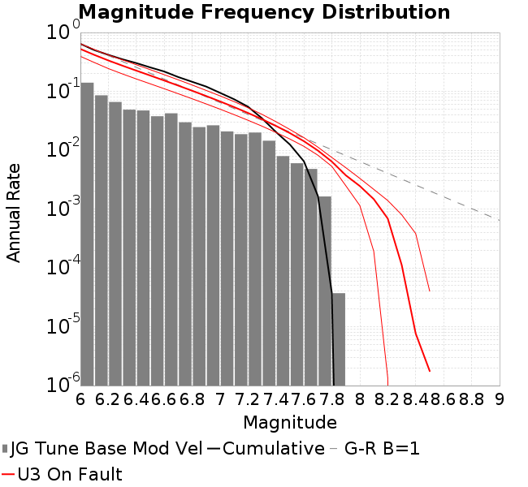
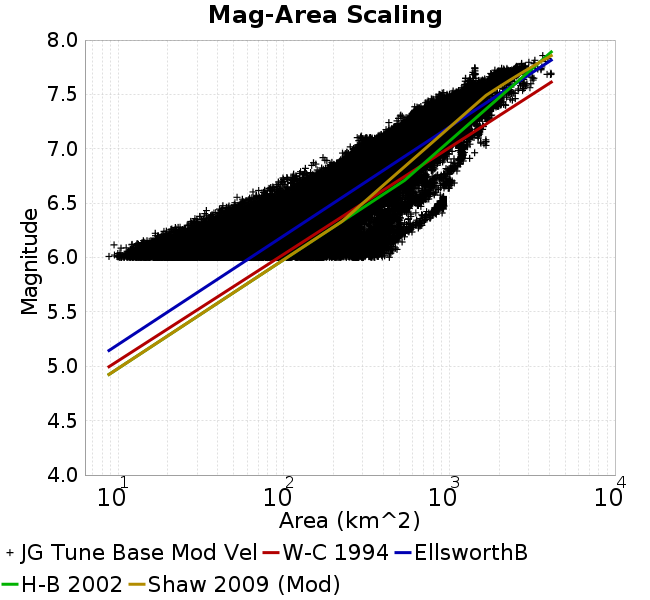
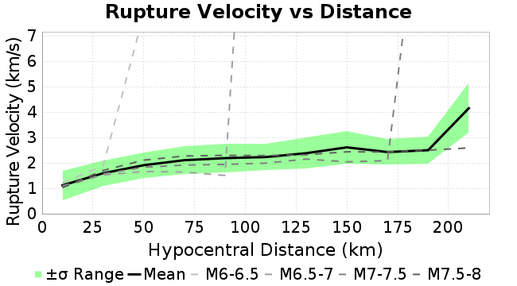
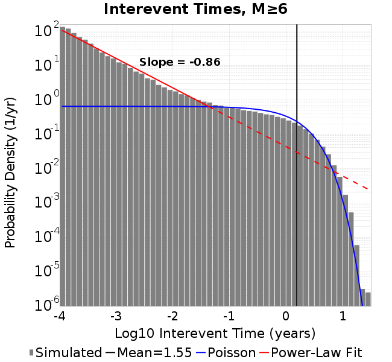
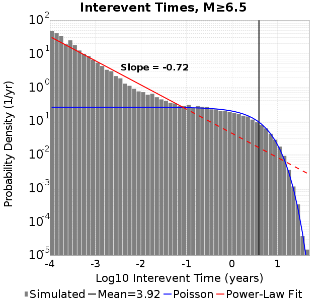
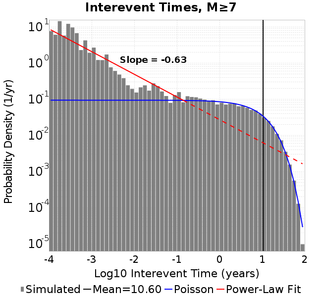

# JG Tune Base Mod Vel
## Metadata
| **Catalog** | JG Tune Base Mod Vel |
|-----|-----|
| **Author** | Jacqui Gilchrist, 2017/11/26 |
| **Description** | New version of tuneBase1m, with patch-specific slip velocities. |
| **Fault/Def Model** | Fault Model 3.1, Geologic |
| **Slip Velocity** | Variable, range=[0.007585216 4.999275], mean=0.995433 |
| **Average Element Area** | 0.90 km^2 |
| **Length** | 37,538,999 events in 112,714 years |
| **Frictional Params** | a=0.01, b=0.015, (b-a)=0.005, ddotEQ=1 |

* [Metadata](#metadata)
* [Plots](#plots)
  * [Magnitude-Frequency Plot](#magnitude-frequency-plot)
  * [Magnitude-Area Plots](#magnitude-area-plots)
  * [Rupture Velocity Plots](#rupture-velocity-plots)
  * [Interevent-Time Distributions](#interevent-time-distributions)
  * [Stationarity Plot](#stationarity-plot)
* [Input File](#input-file)

## Plots
### Magnitude-Frequency Plot
*[(top)](#jg-tune-base-mod-vel)*


### Magnitude-Area Plots
*[(top)](#jg-tune-base-mod-vel)*

| Scatter | 2-D Hist |
|-----|-----|
|  |  |
### Rupture Velocity Plots
*[(top)](#jg-tune-base-mod-vel)*

| **Scatter** |  |
|-----|-----|
| **Distance/Velocity** |  |
### Interevent-Time Distributions
*[(top)](#jg-tune-base-mod-vel)*

| **M≥6** | **M≥6.5** | **M≥7** | **M≥7.5** |
|-----|-----|-----|-----|
|  |  |  |  |
### Stationarity Plot
*[(top)](#jg-tune-base-mod-vel)*


## Input File
*[(top)](#jg-tune-base-mod-vel)*

```
  A_1 = 0.01
  fA = 0.1
  B_1 = 0.015
  Dc_1 = 1.0000000000000000818e-05
  mu0_1 = 0.6
  ddotStar_1 = 9.9999999999999995475e-07
  ddotAB_1 = 9.9999999999999995475e-07
  alpha_1 = 0.25
  theta0_1 = 200000000
  tau0_1 = 60
  sigma0_1 = 100
  sigmaFracPin = 0.1
  maxThetaPin = 10000000000
  ddotEQ_1 = 1
  ddotEQFname = ddotEQ_mod.txt
  stressOvershootFactor = 0.10000000000000000555
  lameLambda = 30000
  lameMu = 30000
  slowSlip_1 = 0
  nEq = 3e20
  tStart = 55651082300705.9921875
  maxT = 6.0381475e+13
  faultFname = UCERF3.D3.1.1km.tri.2.flt
  outFnameInfix = tuneBase1m
  writeTau = 2
  writeSigma = 2
  writeSlip = 0
  writeSlipSpeed = 0
  writeState = 0
  writeTheta = 2
  writePED = 1
  writeTransitions = 1
  minDtWrite = 3.15e10
  minDtWriteCoseismic = 0
  minDtWriteInterseismic = 0
  minMagWrite = 7.5
  writeStiffness = 0
  stressRateSpecification = 1
  dMu3 = 0.0010000000000000000208
  initTauFname = initTau.txt
  initSigmaFname = initSigma.txt
  initThetaFname = initTheta.txt
  initSlipSpeedFname = 
  AFname = 
  BFname = 
  DcFname = 
  mu0Fname = 
  ddotStarFname = 
  ddotABFname = 
  alphaFname = 
  KTauFname = 
  KSigmaFname = 
  tFailFname = 
  tauFailFname = 
  tauDotFname = 
  sigmaDotFname = 
  pinnedFname = tuneBase1m.pin 
  neighborFname = neighbors.12
  stressRateFname = 
  slowSlipFname = 
  writePatchFname = 
  DEBUG = 1
  ZBrentUpperBracket = 0
  ZBrentTol = 9.9999999999999995475e-07
  lowSigmaAction = 0
  KZeroFrac = 0.0
  KZeroFname = UCERF3.D3.1.1km.tri.2.KZero0.8
  slipInState1 = 1
  resetStressingRates = 1
```
