# JG Tune Base Mod Vel Extreme Events

*Subsections participates in a rupture if at least 20.0 % of its area ruptures*

[Catalog Details](../#jg-tune-base-mod-vel)

## Table Of Contents
* [Subsection Count](#subsection-count)
  * [Subsection Count Histogram](#subsection-count-histogram)
  * [Subsection Count Events](#subsection-count-events)
* [Parent Section Count](#parent-section-count)
  * [Parent Section Count Histogram](#parent-section-count-histogram)
  * [Parent Section Count Events](#parent-section-count-events)
* [Mapped Length Ratio](#mapped-length-ratio)
  * [Mapped Length Ratio Histogram](#mapped-length-ratio-histogram)
  * [Mapped Length Ratio Events](#mapped-length-ratio-events)
* [Mapped Excess Length](#mapped-excess-length)
  * [Mapped Excess Length Histogram](#mapped-excess-length-histogram)
  * [Mapped Excess Length Events](#mapped-excess-length-events)
* [Moment Off Mapped Rupture](#moment-off-mapped-rupture)
  * [Moment Off Mapped Rupture Histogram](#moment-off-mapped-rupture-histogram)
  * [Moment Off Mapped Rupture Events](#moment-off-mapped-rupture-events)
* [Magnitude](#magnitude)
  * [Magnitude Histogram](#magnitude-histogram)
  * [Magnitude Events](#magnitude-events)
## Subsection Count
*[(top)](#table-of-contents)*

Total count of mapped UCERF3 subsections (e.g. SAF Mojave S Subsection 3), after application of minimum subsection area filter

### Subsection Count Histogram
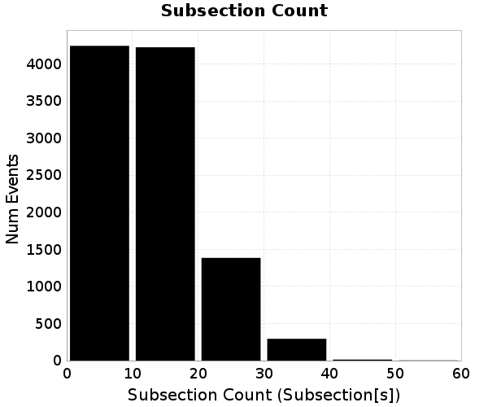
### Subsection Count Events
*[(top)](#table-of-contents)*

| Event ID | Subsection Count | Plot |
|-----|-----|-----|
| **5798783** | **56 (Subsection[s])** | 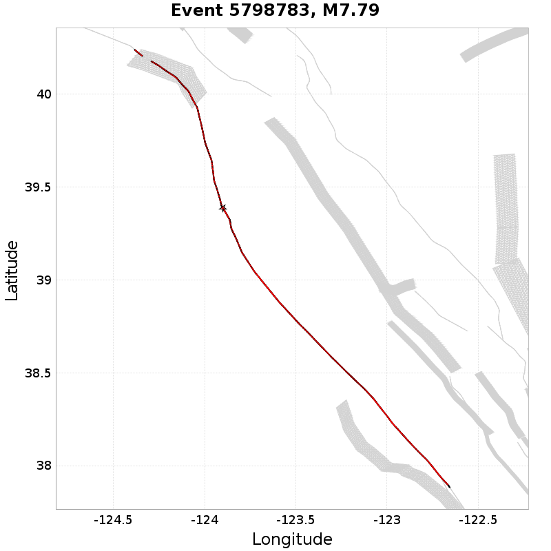 |
| **7863322** | **56 (Subsection[s])** |  |
| **31243115** | **50 (Subsection[s])** | 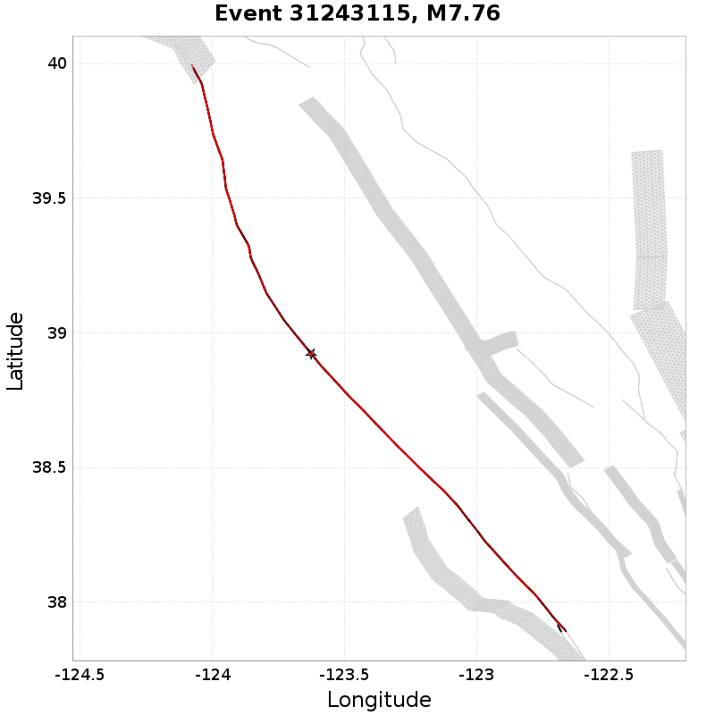 |
| **27745787** | **48 (Subsection[s])** |  |
| **5441633** | **47 (Subsection[s])** | 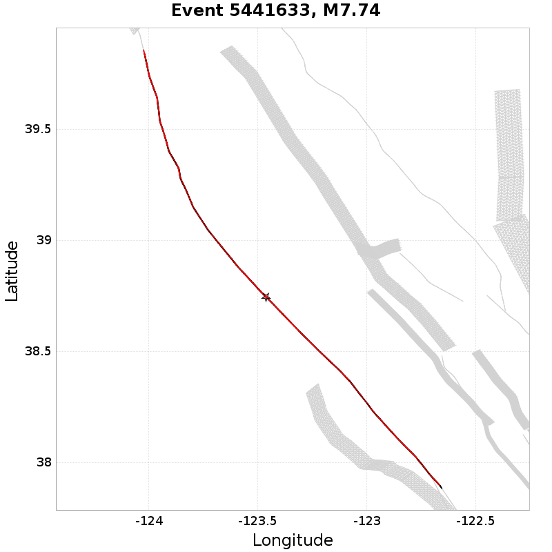 |

## Parent Section Count
*[(top)](#table-of-contents)*

Total count of mapped UCERF3 subsections (e.g. SAF Mojave S), after application of minimum subsection area filter

### Parent Section Count Histogram
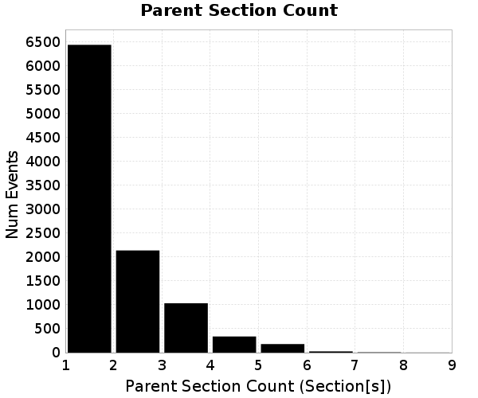
### Parent Section Count Events
*[(top)](#table-of-contents)*

| Event ID | Parent Section Count | Plot |
|-----|-----|-----|
| **36529162** | **8 (Section[s])** |  |
| **18109274** | **8 (Section[s])** | 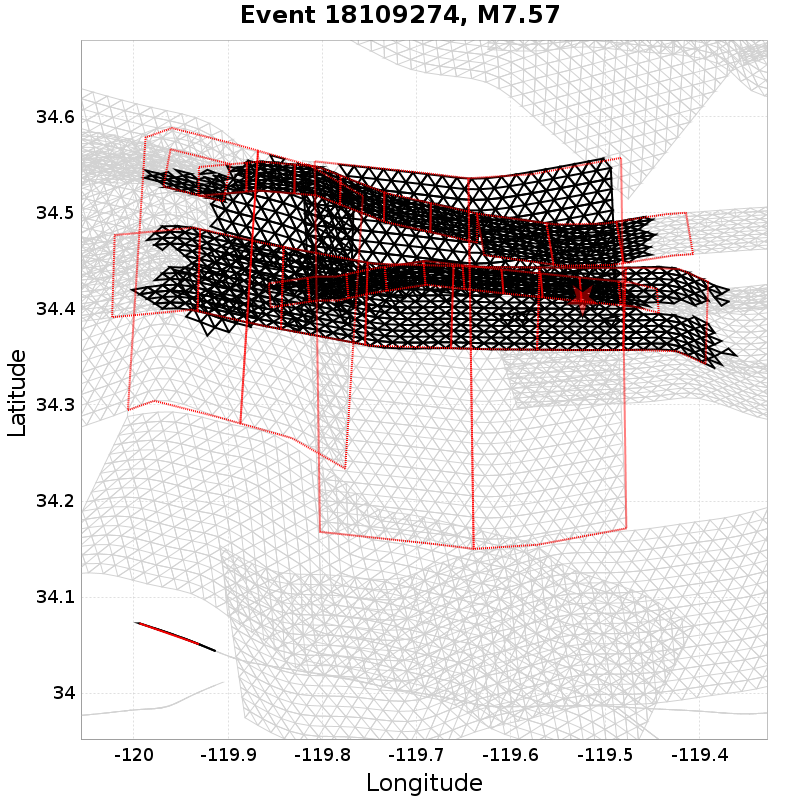 |
| **16476751** | **7 (Section[s])** |  |
| **29149906** | **7 (Section[s])** |  |
| **27046217** | **7 (Section[s])** |  |

## Mapped Length Ratio
*[(top)](#table-of-contents)*

Ratio of the total rupture length (UCERF3 mapped subsection rupture) to the idealized length, defined as the straight line distance between the furthest 2 subsections

### Mapped Length Ratio Histogram

### Mapped Length Ratio Events
*[(top)](#table-of-contents)*

| Event ID | Mapped Length Ratio | Plot |
|-----|-----|-----|
| **5798783** | **56.43** |  |
| **7863322** | **56.43** |  |
| **31243115** | **50.39** |  |
| **27745787** | **48.35** |  |
| **6804744** | **47.35** |  |

## Mapped Excess Length
*[(top)](#table-of-contents)*

Total rupture length (UCERF3 mapped subsection rupture) minus the idealized length, defined as the straight line distance between the furthest 2 subsections

### Mapped Excess Length Histogram
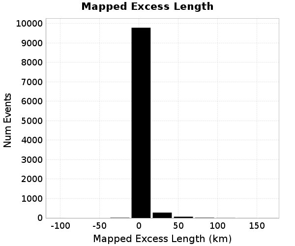
### Mapped Excess Length Events
*[(top)](#table-of-contents)*

| Event ID | Mapped Excess Length | Plot |
|-----|-----|-----|
| **5798783** | **295.66 (km)** |  |
| **7863322** | **295.66 (km)** |  |
| **7380799** | **279.87 (km)** |  |
| **36529162** | **276.58 (km)** |  |
| **16476751** | **275.26 (km)** |  |

## Moment Off Mapped Rupture
*[(top)](#table-of-contents)*

Moment of simulator elements not included in mapped UCERF3 subsection rupture

### Moment Off Mapped Rupture Histogram
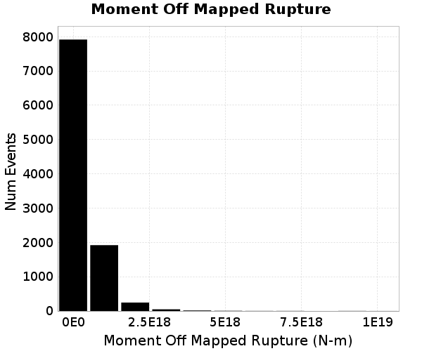
### Moment Off Mapped Rupture Events
*[(top)](#table-of-contents)*

| Event ID | Moment Off Mapped Rupture | Plot |
|-----|-----|-----|
| **2746711** | **1.0191426E19 (N-m)** | 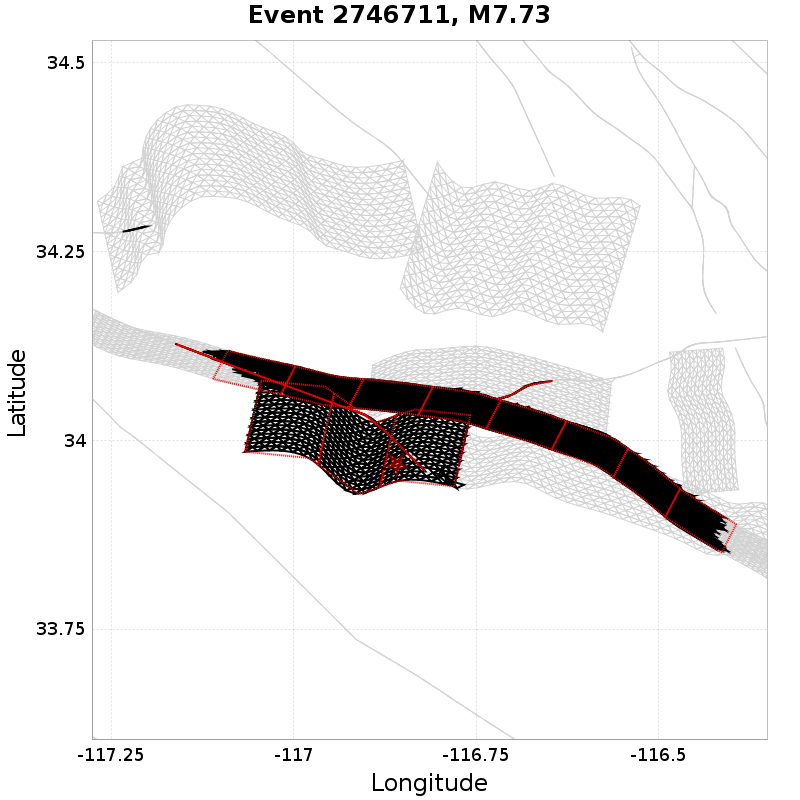 |
| **21862982** | **9.609209E18 (N-m)** | 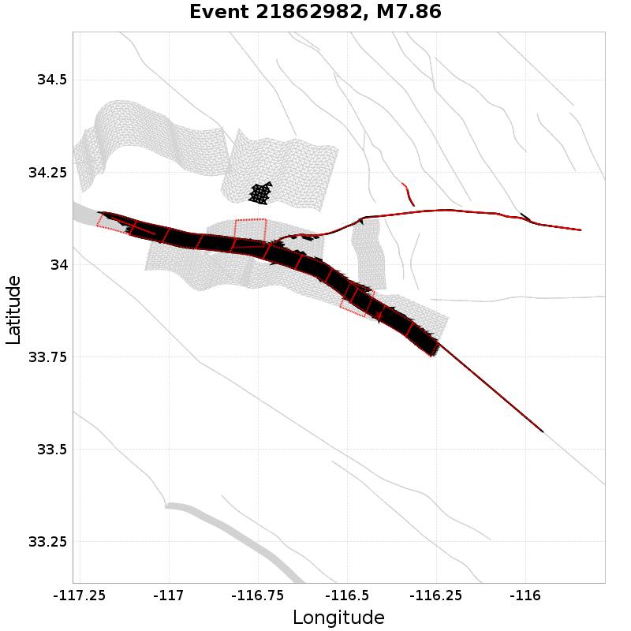 |
| **25821192** | **9.276064E18 (N-m)** |  |
| **2879548** | **8.9270784E18 (N-m)** |  |
| **6362198** | **6.9412928E18 (N-m)** |  |

## Magnitude
*[(top)](#table-of-contents)*

Event Moment Magnitude

### Magnitude Histogram

### Magnitude Events
*[(top)](#table-of-contents)*

| Event ID | Magnitude | Plot |
|-----|-----|-----|
| **21862982** | **7.86** |  |
| **36529162** | **7.83** |  |
| **28873598** | **7.81** | 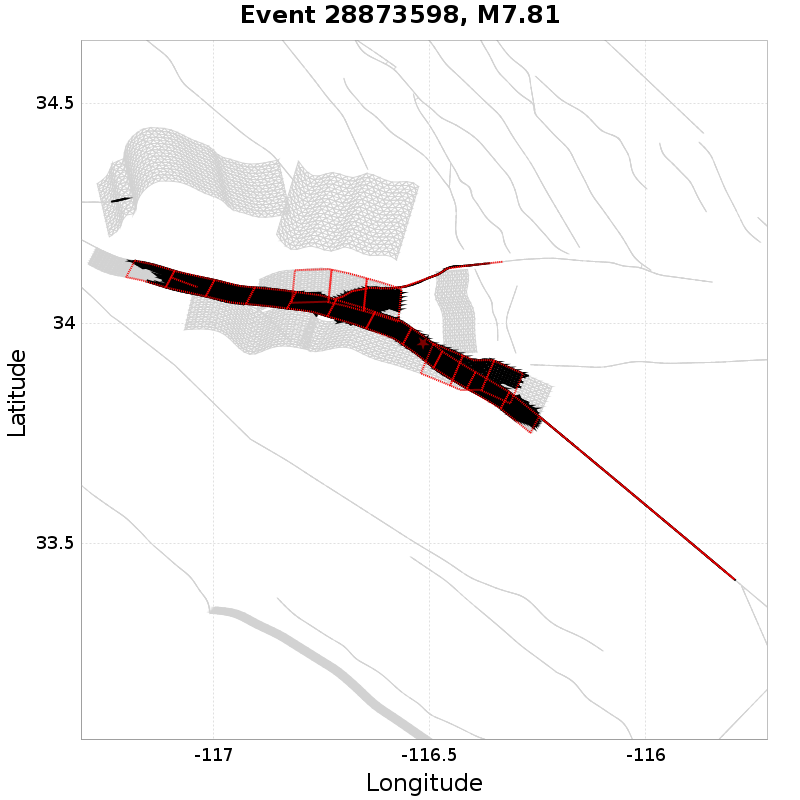 |
| **16476751** | **7.8** |  |
| **3945661** | **7.8** | 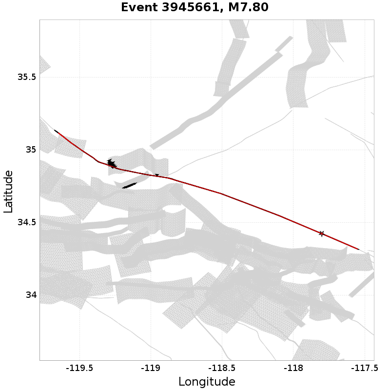 |

