# Graves & Pitarka (2016) Rotated Rupture Variability, M7.2 SS

This exercise uses translations and rotations to estimate ground motion variability from different sources. We begin by selecting a subset of similar ruptures which match a set of criteria (in this case, M7.2, Vertical Strike-Slip with Surface Rupture). Each rupture is then reoriented such that its strike (following the Aki & Richards 1980 convention) is 0 degrees (due North, dipping to the right for normal or reverse ruptures). For each site, ruptures are translated such that their scalar seismic moment centroid is directly North of the site, and their 3-dimensional distance (Rrup) is as specified (we consider 1 distance[s] here).

We then  perform various rotations. We rotate the rupture in place around its centroid, holding the site-to-source centroid path and Rrup constant (henceforth 'Rupture Strike'). We also rotate ruptures around the site, holding Rrup and source orientation relative to the site constant but sampling different various paths (henceforth 'Path'). We do this for each unique combination of Rupture Strike, Path, Distance, Site, and Rupture.

This pages uses the Graves & Pitarka (2016) rupture generator. Rupture surfaces are determined by first computing the Wells & Coppersmith median length for the magnitude, then a down dip width using that length and the area from Somerville (2006). Hypocenters are randomly distributed both down dip and along strike.

*NOTE: This page uses the SCEC BBP to simulate a 1-dimensional velocity structure. Thus we expect no path variability, and plots of path variabilitiy are included only as verification of the method.*

## Table Of Contents
* [Rupture Rotation Parameters](#rupture-rotation-parameters)
* [M7.2 SS Rupture Match Criteria](#m72-ss-rupture-match-criteria)
* [Sites](#sites)
* [Result Summary Table](#result-summary-table)
  * [GMPE Table](#gmpe-table)
* [Source-strike Variability](#source-strike-variability)
  * [Source-strike Variability Methodology](#source-strike-variability-methodology)
  * [M7.2 Source-strike Results](#m72-source-strike-results)
  * [M7.2 Source-strike Downsampled Results](#m72-source-strike-downsampled-results)
  * [M7.2 Source-strike Downsampled Results](#m72-source-strike-downsampled-results)
* [Within-event, single-site Variability](#within-event-single-site-variability)
  * [Within-event, single-site Variability Methodology](#within-event-single-site-variability-methodology)
  * [M7.2 Within-event, single-site Results](#m72-within-event-single-site-results)
  * [M7.2 Within-event, single-site Downsampled Results](#m72-within-event-single-site-downsampled-results)
  * [M7.2 Within-event, single-site Downsampled Results](#m72-within-event-single-site-downsampled-results)
* [Between-events Variability](#between-events-variability)
  * [Between-events Variability Methodology](#between-events-variability-methodology)
  * [M7.2 Between-events Results](#m72-between-events-results)
  * [M7.2 Between-events Downsampled Results](#m72-between-events-downsampled-results)
  * [M7.2 Between-events Downsampled Results](#m72-between-events-downsampled-results)
* [Event Term Scatters](#event-term-scatters)
  * [Propagation Velocity Event Term Scatters](#propagation-velocity-event-term-scatters)
  * [Mag Event Term Scatters](#mag-event-term-scatters)
  * [Log10(Area) Event Term Scatters](#log10area-event-term-scatters)
  * [Max Slip Event Term Scatters](#max-slip-event-term-scatters)
  * [Mean Slip Event Term Scatters](#mean-slip-event-term-scatters)
  * [Slip Std Dev Event Term Scatters](#slip-std-dev-event-term-scatters)
  * [Mid-Seismogenic Mean Slip Event Term Scatters](#mid-seismogenic-mean-slip-event-term-scatters)
* [Directivity Comparisons](#directivity-comparisons)
* [Azumth Dependence](#azumth-dependence)
  * [Rupture Strike Dependence](#rupture-strike-dependence)
* [BBP PartB Comparison](#bbp-partb-comparison)
  * [BBP PartB Summary Table](#bbp-partb-summary-table)
  * [BBP PartB, M7.2, Vertical Strike-Slip with Surface Rupture](#bbp-partb-m72-vertical-strike-slip-with-surface-rupture)
* [CSV Files](#csv-files)
## Rupture Rotation Parameters

| Quantity | Variations | Description |
|-----|-----|-----|
| Rupture | 10 | Unique (but similar in faulting style and magnitude) ruptures which match the given scenario. |
| Site | 1 | Unique site locations. If 3-d, each will have unique velocity profiles. |
| Rupture Strike | 4 | Rupture strike conforming to the Aki & Richards (1980) convention, where dipping faults dip to the right of the rupture. If path rotation is also performed, this azimuth is relative to the path. |
| Path | 1 | Path from the site to the centroid of the rupture, in azimuthal degrees (0 is North) |
| Distance | 20.0 km | 3-dimensional distance between the site and the rupture surface. |
| **Total # Simulations** | **40** | Total number of combinations of the above. |

## M7.2 SS Rupture Match Criteria
*[(top)](#table-of-contents)*

We condisder 10 events which match the following criteria:

* M=[7.15,7.25]
* Ztor=[0.0,1.0]
* Rake=[-180,-170] or [-10,10] or [170,180]
* Dip=90.0
* Linear rupture (max 5.0% deviation from ideal)

## Sites

| Name | Location | Vs30 (m/s) | Z1.0 (km) | Z2.5 (km) |
|-----|-----|-----|-----|-----|
| USC | *34.0192, -118.286* | 500 | N/A | N/A |

## Result Summary Table

| Type | Notation | Distance | T-independent Std. Dev. | 3s Std. Dev. | 5s Std. Dev. | 7.5s Std. Dev. | 10s Std. Dev. |
|-----|-----|-----|-----|-----|-----|-----|-----|
| Source-strike | &phi;s | 20 km | 0.36 | 0.38 | 0.37 | 0.41 | 0.43 |
| Within-event, single-site | &phi;SS | 20 km | 0.36 | 0.38 | 0.37 | 0.41 | 0.43 |
| Between-events | &tau; | 20 km | 0.17 | 0.16 | 0.17 | 0.19 | 0.17 |

### GMPE Table
*[(top)](#table-of-contents)*

| Type | Notation | Distance | ASK2014 3s | ASK2014 5s | ASK2014 7.5s | ASK2014 10s | BSSA2014 3s | BSSA2014 5s | BSSA2014 7.5s | BSSA2014 10s | CB2014 3s | CB2014 5s | CB2014 7.5s | CB2014 10s | CY2014 3s | CY2014 5s | CY2014 7.5s | CY2014 10s |
|-----|-----|-----|-----|-----|-----|-----|-----|-----|-----|-----|-----|-----|-----|-----|-----|-----|-----|-----|
| Source-strike | &phi;SS | 20 km | 0.55 | 0.58 | 0.57 | 0.55 | 0.55 | 0.54 | 0.54 | 0.54 | 0.55 | 0.51 | 0.49 | 0.47 | 0.52 | 0.53 | 0.52 | 0.51 |
| Within-event, single-site | &phi;SS | 20 km | 0.55 | 0.58 | 0.57 | 0.55 | 0.55 | 0.54 | 0.54 | 0.54 | 0.55 | 0.51 | 0.49 | 0.47 | 0.52 | 0.53 | 0.52 | 0.51 |
| Between-events | &tau; | 20 km | 0.36 | 0.36 | 0.36 | 0.36 | 0.3 | 0.33 | 0.34 | 0.35 | 0.35 | 0.4 | 0.42 | 0.39 | 0.33 | 0.33 | 0.34 | 0.34 |

## Source-strike Variability
*[(top)](#table-of-contents)*

### Source-strike Variability Methodology
*[(top)](#table-of-contents)*

Source-strike variability, denoted &phi;s in Aki & Richards (1980), is computed separately for each:

* Site *[1 unique]*
* Distance *[1 unique]*

Then, for each unique combination of:

* Rupture *[10 unique]*
* Path *[1 unique]*

we compute residuals, &delta;Wes, of the natural-log ground motions (relative to the median), computed across all 4 combinations of:

* Rupture Strike *[4 unique]*

We take &phi;s to be the standard deviation of all residuals, &delta;Wes, across each combination of Rupture, Path.

Here is an exmample with 5 rotations, which would be repeated for each combination of [Rupture, Path]. The site is shown with a blue square, and initially oriented rupture in bold with its hypocenter as a red star and centroid a green circle. Rotations of that rupture are in gray:

### M7.2 Source-strike Results
*[(top)](#table-of-contents)*

| 3s &phi;s | Total | Mean | Median | Range | 5s &phi;s | Total | Mean | Median | Range | 7.5s &phi;s | Total | Mean | Median | Range | 10s &phi;s | Total | Mean | Median | Range |
|-----|-----|-----|-----|-----|-----|-----|-----|-----|-----|-----|-----|-----|-----|-----|-----|-----|-----|-----|-----|
|  | 0.38 | 0.35 | 0.27 | [0.13 0.72] |  | 0.37 | 0.36 | 0.4 | [0.09 0.58] |  | 0.41 | 0.41 | 0.39 | [0.19 0.75] |  | 0.43 | 0.45 | 0.4 | [0.2 0.7] |

Here are plots of the histogram of &phi;s for each individual rupture, from which we compute a total &phi;s

| 3s | 5s |
|-----|-----|
|  |  |
| 7.5s | 10s |
|  | 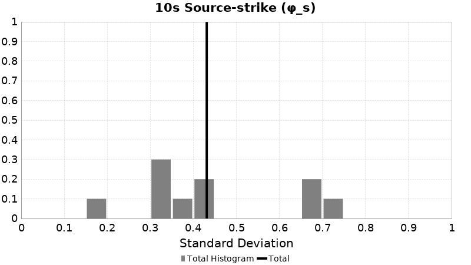 |

### M7.2 Source-strike Downsampled Results
*[(top)](#table-of-contents)*

We compute uncertainties on &phi;s through downsampling the rotational synthetic data to match the sample sizes used in the ASK 2014 regressions. We search the ASK dataset for ruptures with the same mechanism, magnitude in the range [7.0 7.4], and distance within the range [10.0 30.0] km. We throw out any events with only 1 recording, leaving us with 4 events and a total of 16 recordings. We then downsample our simulated data 100 times, and compute &phi;s from each sample. The 95% confidence range from these samples is plotted as a shaded region above, and listed in the table below. Weighted standard deviations are calculated, weighted by the square-root of the number of recordings in each event.

*WARNING: Some real events had more recordings than we have rotations per event, so our dataset for this test is smaller. We are using 35 fewer data points.*

| Period (s) | Full &phi;s | Downsampled median &phi;s | Downsampled &phi;s std. dev. | Downsampled &phi;s 68% conf range | Downsampled &phi;s 95% conf range |
|-----|-----|-----|-----|-----|-----|
| T-independent | 0.36 | 0.36 | 0.05 | [0.3 0.41] | [0.24 0.46] |
| 1 | 0.26 | 0.26 | 0.02 | [0.24 0.29] | [0.23 0.3] |
| 2 | 0.32 | 0.33 | 0.09 | [0.21 0.4] | [0.16 0.46] |
| 3 | 0.38 | 0.38 | 0.08 | [0.28 0.45] | [0.18 0.51] |
| 4 | 0.34 | 0.34 | 0.07 | [0.26 0.4] | [0.17 0.47] |
| 5 | 0.37 | 0.37 | 0.06 | [0.3 0.42] | [0.23 0.49] |
| 7.5 | 0.41 | 0.42 | 0.07 | [0.32 0.5] | [0.28 0.56] |
| 10 | 0.43 | 0.43 | 0.07 | [0.35 0.5] | [0.32 0.57] |

These plots show the distribution of period-independent downsampled &phi;s for each site.

| Period | **USC** |
|-----|-----|
| Period-Indep |  |
| 3s | 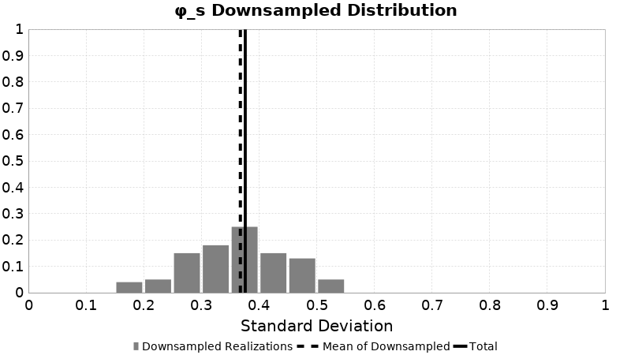 |

| 3s &phi;s | Total | Mean | Median | Range | 5s &phi;s | Total | Mean | Median | Range | 7.5s &phi;s | Total | Mean | Median | Range | 10s &phi;s | Total | Mean | Median | Range |
|-----|-----|-----|-----|-----|-----|-----|-----|-----|-----|-----|-----|-----|-----|-----|-----|-----|-----|-----|-----|
|  | 0.38 | 0.35 | 0.27 | [0.13 0.72] |  | 0.37 | 0.36 | 0.4 | [0.09 0.58] |  | 0.41 | 0.41 | 0.39 | [0.19 0.75] |  | 0.43 | 0.45 | 0.4 | [0.2 0.7] |

Here are plots of the histogram of &phi;s for each individual rupture, from which we compute a total &phi;s

| 3s | 5s |
|-----|-----|
| 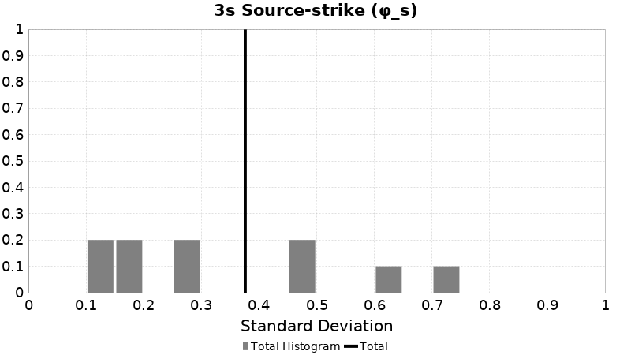 |  |
| 7.5s | 10s |
|  |  |

### M7.2 Source-strike Downsampled Results
*[(top)](#table-of-contents)*

We compute uncertainties on &phi;s through downsampling the rotational synthetic data to match the sample sizes used in the ASK 2014 regressions. We search the ASK dataset for ruptures with the same mechanism, magnitude in the range [7.0 7.4], and all distances. We throw out any events with only 1 recording, leaving us with 6 events and a total of 24 recordings. We then downsample our simulated data 100 times, and compute &phi;s from each sample. The 95% confidence range from these samples is plotted as a shaded region above, and listed in the table below. Weighted standard deviations are calculated, weighted by the square-root of the number of recordings in each event.

*WARNING: Some real events had more recordings than we have rotations per event, so our dataset for this test is smaller. We are using 538 fewer data points.*

| Period (s) | Full &phi;s | Downsampled median &phi;s | Downsampled &phi;s std. dev. | Downsampled &phi;s 68% conf range | Downsampled &phi;s 95% conf range |
|-----|-----|-----|-----|-----|-----|
| T-independent | 0.36 | 0.35 | 0.03 | [0.32 0.38] | [0.28 0.41] |
| 1 | 0.26 | 0.26 | 0.01 | [0.25 0.28] | [0.23 0.28] |
| 2 | 0.32 | 0.31 | 0.06 | [0.24 0.37] | [0.2 0.4] |
| 3 | 0.38 | 0.37 | 0.06 | [0.31 0.43] | [0.24 0.47] |
| 4 | 0.34 | 0.33 | 0.05 | [0.28 0.38] | [0.23 0.41] |
| 5 | 0.37 | 0.36 | 0.04 | [0.31 0.4] | [0.28 0.44] |
| 7.5 | 0.41 | 0.41 | 0.04 | [0.37 0.45] | [0.32 0.48] |
| 10 | 0.43 | 0.44 | 0.04 | [0.39 0.45] | [0.33 0.49] |

These plots show the distribution of period-independent downsampled &phi;s for each site.

| Period | **USC** |
|-----|-----|
| Period-Indep | 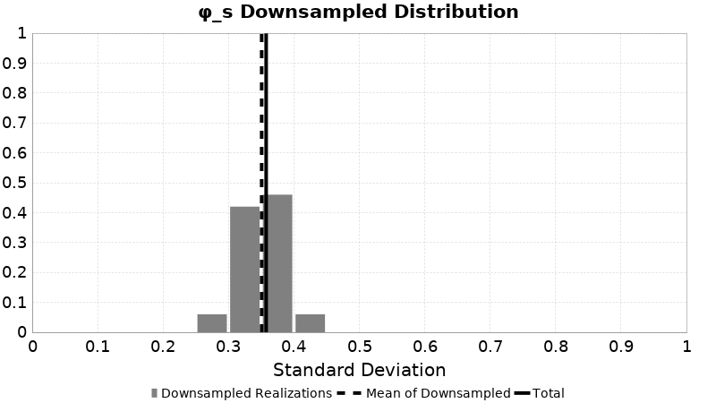 |
| 3s |  |

## Within-event, single-site Variability
*[(top)](#table-of-contents)*

### Within-event, single-site Variability Methodology
*[(top)](#table-of-contents)*

Within-event, single-site variability, denoted &phi;SS in Al Atik (2010), is computed separately for each:

* Site *[1 unique]*
* Distance *[1 unique]*

Then, for each unique combination of:

* Rupture *[10 unique]*

we compute residuals, &delta;Wes, of the natural-log ground motions (relative to the median), computed across all 4 combinations of:

* Rupture Strike *[4 unique]*
* Path *[1 unique]*

We take &phi;SS to be the standard deviation of all residuals, &delta;Wes, across each combination of Rupture.

Here is an exmample with 5 rotations, which would be repeated for each combination of [Rupture]. The site is shown with a blue square, and initially oriented rupture in bold with its hypocenter as a red star and centroid a green circle. Rotations of that rupture are in gray:

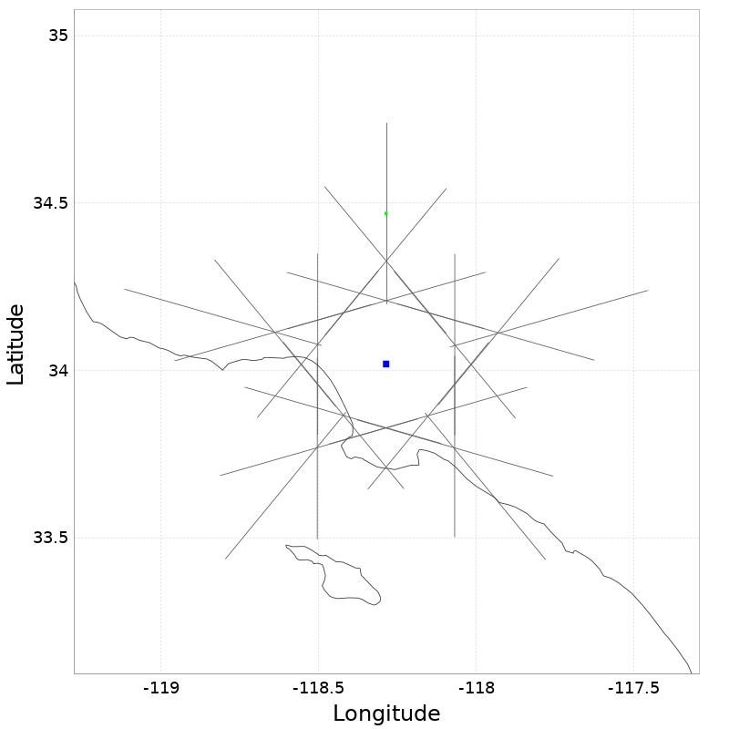

### M7.2 Within-event, single-site Results
*[(top)](#table-of-contents)*

| 3s &phi;SS | Total | Mean | Median | Range | 5s &phi;SS | Total | Mean | Median | Range | 7.5s &phi;SS | Total | Mean | Median | Range | 10s &phi;SS | Total | Mean | Median | Range |
|-----|-----|-----|-----|-----|-----|-----|-----|-----|-----|-----|-----|-----|-----|-----|-----|-----|-----|-----|-----|
|  | 0.38 | 0.35 | 0.27 | [0.13 0.72] |  | 0.37 | 0.36 | 0.4 | [0.09 0.58] |  | 0.41 | 0.41 | 0.39 | [0.19 0.75] |  | 0.43 | 0.45 | 0.4 | [0.2 0.7] |

Here are plots of the histogram of &phi;SS for each individual rupture, from which we compute a total &phi;SS

| 3s | 5s |
|-----|-----|
| 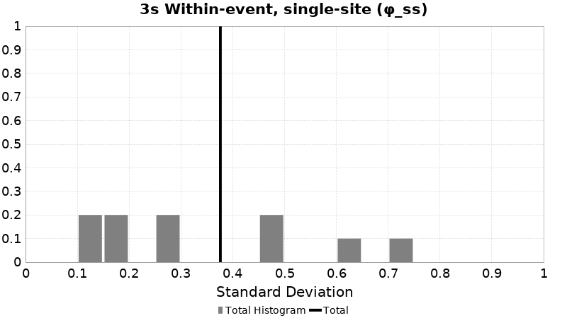 |  |
| 7.5s | 10s |
| 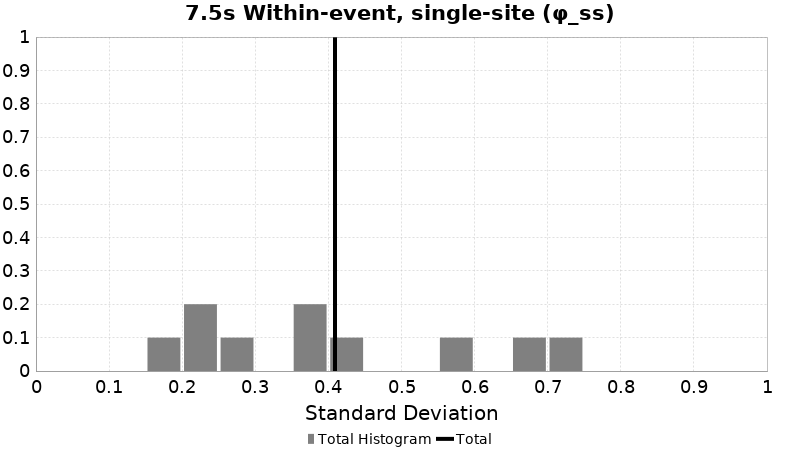 |  |

### M7.2 Within-event, single-site Downsampled Results
*[(top)](#table-of-contents)*

We compute uncertainties on &phi;SS through downsampling the rotational synthetic data to match the sample sizes used in the ASK 2014 regressions. We search the ASK dataset for ruptures with the same mechanism, magnitude in the range [7.0 7.4], and distance within the range [10.0 30.0] km. We throw out any events with only 1 recording, leaving us with 4 events and a total of 16 recordings. We then downsample our simulated data 100 times, and compute &phi;SS from each sample. The 95% confidence range from these samples is plotted as a shaded region above, and listed in the table below. Weighted standard deviations are calculated, weighted by the square-root of the number of recordings in each event.

*WARNING: Some real events had more recordings than we have rotations per event, so our dataset for this test is smaller. We are using 35 fewer data points.*

| Period (s) | Full &phi;SS | Downsampled median &phi;SS | Downsampled &phi;SS std. dev. | Downsampled &phi;SS 68% conf range | Downsampled &phi;SS 95% conf range |
|-----|-----|-----|-----|-----|-----|
| T-independent | 0.36 | 0.36 | 0.05 | [0.3 0.4] | [0.24 0.45] |
| 1 | 0.26 | 0.27 | 0.02 | [0.24 0.29] | [0.21 0.3] |
| 2 | 0.32 | 0.33 | 0.08 | [0.21 0.39] | [0.16 0.46] |
| 3 | 0.38 | 0.38 | 0.09 | [0.27 0.47] | [0.18 0.52] |
| 4 | 0.34 | 0.34 | 0.07 | [0.26 0.39] | [0.17 0.46] |
| 5 | 0.37 | 0.38 | 0.06 | [0.3 0.42] | [0.23 0.46] |
| 7.5 | 0.41 | 0.4 | 0.07 | [0.31 0.49] | [0.25 0.54] |
| 10 | 0.43 | 0.43 | 0.06 | [0.34 0.5] | [0.3 0.56] |

These plots show the distribution of period-independent downsampled &phi;SS for each site.

| Period | **USC** |
|-----|-----|
| Period-Indep |  |
| 3s |  |

These plots show the dependence of &phi;SS to the number of events included and the number of recordings per event. The left plot holds the number of recordings per event fixed at the full set of simulated recordings (4), varying the number of events. The right plot holds the number of events fixed at the full set of simulated events (10), varying the number of recordings per event.

| Period | Event Count Dependence | Recordings/Event Dependence |
|-----|-----|-----|
| Period Indep. |  |  |
| 1s |  | 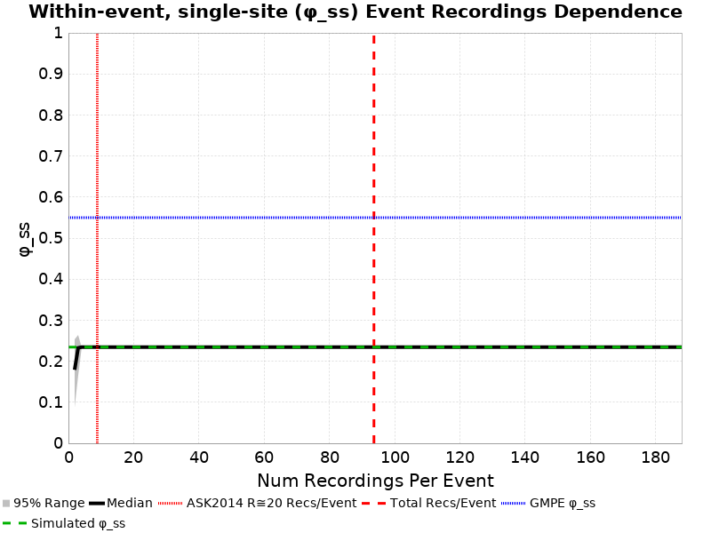 |

This is a histogram of the number of recordings per event from ASK 2014 with M=[7.0,7.4]. The top plot shows the subset with distance in the range [10.0,30.0], and the bottom the whole distribution at all distances.

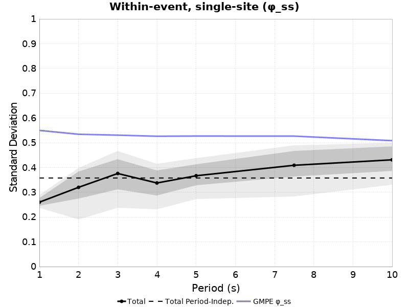

| 3s &phi;SS | Total | Mean | Median | Range | 5s &phi;SS | Total | Mean | Median | Range | 7.5s &phi;SS | Total | Mean | Median | Range | 10s &phi;SS | Total | Mean | Median | Range |
|-----|-----|-----|-----|-----|-----|-----|-----|-----|-----|-----|-----|-----|-----|-----|-----|-----|-----|-----|-----|
|  | 0.38 | 0.35 | 0.27 | [0.13 0.72] |  | 0.37 | 0.36 | 0.4 | [0.09 0.58] |  | 0.41 | 0.41 | 0.39 | [0.19 0.75] |  | 0.43 | 0.45 | 0.4 | [0.2 0.7] |

Here are plots of the histogram of &phi;SS for each individual rupture, from which we compute a total &phi;SS

| 3s | 5s |
|-----|-----|
|  |  |
| 7.5s | 10s |
|  |  |

### M7.2 Within-event, single-site Downsampled Results
*[(top)](#table-of-contents)*

We compute uncertainties on &phi;SS through downsampling the rotational synthetic data to match the sample sizes used in the ASK 2014 regressions. We search the ASK dataset for ruptures with the same mechanism, magnitude in the range [7.0 7.4], and all distances. We throw out any events with only 1 recording, leaving us with 6 events and a total of 24 recordings. We then downsample our simulated data 100 times, and compute &phi;SS from each sample. The 95% confidence range from these samples is plotted as a shaded region above, and listed in the table below. Weighted standard deviations are calculated, weighted by the square-root of the number of recordings in each event.

*WARNING: Some real events had more recordings than we have rotations per event, so our dataset for this test is smaller. We are using 538 fewer data points.*

| Period (s) | Full &phi;SS | Downsampled median &phi;SS | Downsampled &phi;SS std. dev. | Downsampled &phi;SS 68% conf range | Downsampled &phi;SS 95% conf range |
|-----|-----|-----|-----|-----|-----|
| T-independent | 0.36 | 0.36 | 0.04 | [0.32 0.4] | [0.27 0.42] |
| 1 | 0.26 | 0.26 | 0.01 | [0.25 0.28] | [0.24 0.29] |
| 2 | 0.32 | 0.33 | 0.06 | [0.27 0.38] | [0.19 0.4] |
| 3 | 0.38 | 0.38 | 0.06 | [0.31 0.43] | [0.24 0.47] |
| 4 | 0.34 | 0.34 | 0.05 | [0.29 0.39] | [0.23 0.42] |
| 5 | 0.37 | 0.37 | 0.04 | [0.33 0.41] | [0.27 0.44] |
| 7.5 | 0.41 | 0.43 | 0.05 | [0.36 0.47] | [0.28 0.49] |
| 10 | 0.43 | 0.45 | 0.04 | [0.39 0.49] | [0.33 0.5] |

These plots show the distribution of period-independent downsampled &phi;SS for each site.

| Period | **USC** |
|-----|-----|
| Period-Indep |  |
| 3s | 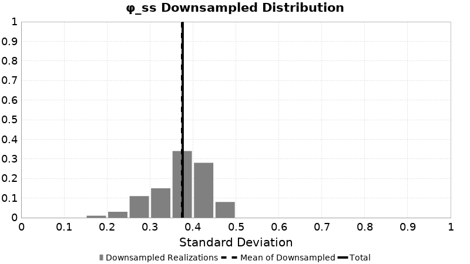 |

These plots show the dependence of &phi;SS to the number of events included and the number of recordings per event. The left plot holds the number of recordings per event fixed at the full set of simulated recordings (4), varying the number of events. The right plot holds the number of events fixed at the full set of simulated events (10), varying the number of recordings per event.

| Period | Event Count Dependence | Recordings/Event Dependence |
|-----|-----|-----|
| Period Indep. | 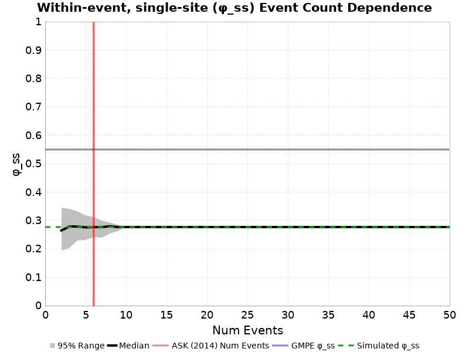 |  |
| 1s | 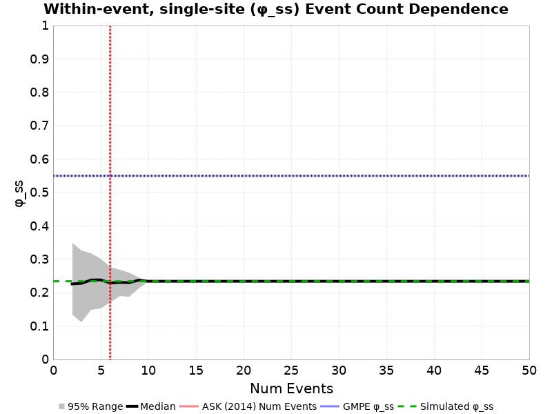 |  |

This is a histogram of the number of recordings per event from ASK 2014 with M=[7.0,7.4].

## Between-events Variability
*[(top)](#table-of-contents)*

### Between-events Variability Methodology
*[(top)](#table-of-contents)*

Between-events variability, denoted &tau; in Al Atik (2010), is computed separately for each:

* Distance *[1 unique]*

We first compute the median natural-log ground motion, &delta;Be, for each combination of:

* Rupture *[10 unique]*

That median, &delta;Be, is computed across all 4 combinations of:

* Site *[1 unique]*
* Rupture Strike *[4 unique]*
* Path *[1 unique]*

We take &tau; to be the standard deviation of all &delta;Be.

Here is an exmample with 5 rotations, which would be repeated for each combination of [Rupture]. The site is shown with a blue square, and initially oriented rupture in bold with its hypocenter as a red star and centroid a green circle. Rotations of that rupture are in gray:

### M7.2 Between-events Results
*[(top)](#table-of-contents)*

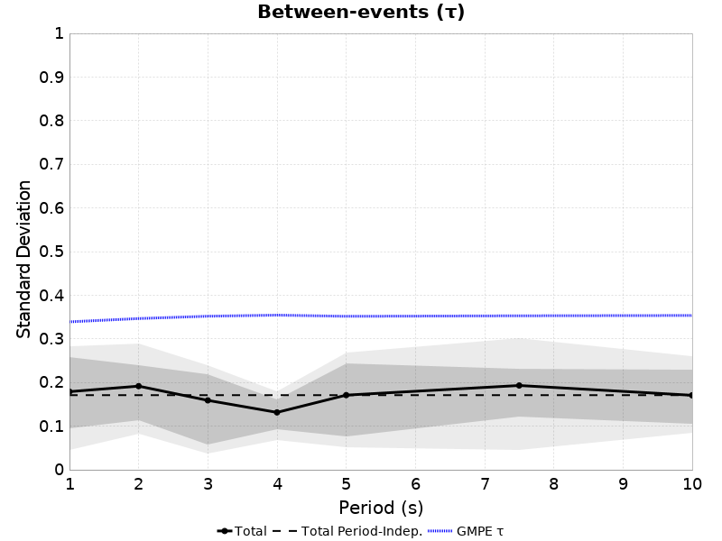

| 3s &tau; | Mean &delta;Be | &delta;Be Range | 5s &tau; | Mean &delta;Be | &delta;Be Range | 7.5s &tau; | Mean &delta;Be | &delta;Be Range | 10s &tau; | Mean &delta;Be | &delta;Be Range |
|-----|-----|-----|-----|-----|-----|-----|-----|-----|-----|-----|-----|
| 0.16 | -2.45 | [-2.6 -2.1] | 0.17 | -3.39 | [-3.58 -3] | 0.19 | -3.96 | [-4.3 -3.62] | 0.17 | -4.46 | [-4.71 -4.12] |

### M7.2 Between-events Downsampled Results
*[(top)](#table-of-contents)*

We compute uncertainties on &tau; through downsampling the rotational synthetic data to match the sample sizes used in the ASK 2014 regressions. We search the ASK dataset for ruptures with the same mechanism, magnitude in the range [7.0 7.4], and distance within the range [10.0 30.0] km. We throw out any events with only 1 recording, leaving us with 4 events and a total of 16 recordings. We then downsample our simulated data 100 times, and compute &tau; from each sample. The 95% confidence range from these samples is plotted as a shaded region above, and listed in the table below. Weighted standard deviations are calculated, weighted by the square-root of the number of recordings in each event.

*WARNING: Some real events had more recordings than we have rotations per event, so our dataset for this test is smaller. We are using 35 fewer data points.*

| Period (s) | Full &tau; | Downsampled median &tau; | Downsampled &tau; std. dev. | Downsampled &tau; 68% conf range | Downsampled &tau; 95% conf range |
|-----|-----|-----|-----|-----|-----|
| T-independent | 0.17 | 0.16 | 0.03 | [0.13 0.19] | [0.11 0.21] |
| 1 | 0.18 | 0.16 | 0.07 | [0.1 0.26] | [0.05 0.28] |
| 2 | 0.19 | 0.18 | 0.05 | [0.11 0.24] | [0.08 0.29] |
| 3 | 0.16 | 0.14 | 0.07 | [0.06 0.22] | [0.04 0.24] |
| 4 | 0.13 | 0.13 | 0.03 | [0.09 0.16] | [0.07 0.18] |
| 5 | 0.17 | 0.16 | 0.07 | [0.08 0.24] | [0.05 0.27] |
| 7.5 | 0.19 | 0.19 | 0.06 | [0.12 0.23] | [0.05 0.3] |
| 10 | 0.17 | 0.16 | 0.05 | [0.1 0.23] | [0.09 0.26] |

This plot shows the distribution of period-independent downsampled &tau;.

| Period-Indep |  |
|-----|-----|
| 3s | 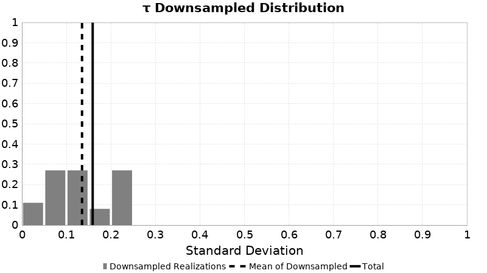 |

These plots show the dependence of &tau; to the number of events included and the number of recordings per event. The left plot holds the number of recordings per event fixed at the full set of simulated recordings (4), varying the number of events. The right plot holds the number of events fixed at the full set of simulated events (10), varying the number of recordings per event.

| Period | Event Count Dependence | Recordings/Event Dependence |
|-----|-----|-----|
| Period Indep. | 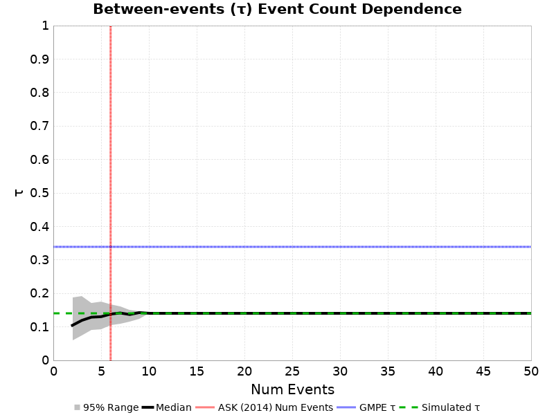 |  |
| 1s |  |  |

This is a histogram of the number of recordings per event from ASK 2014 with M=[7.0,7.4]. The top plot shows the subset with distance in the range [10.0,30.0], and the bottom the whole distribution at all distances.

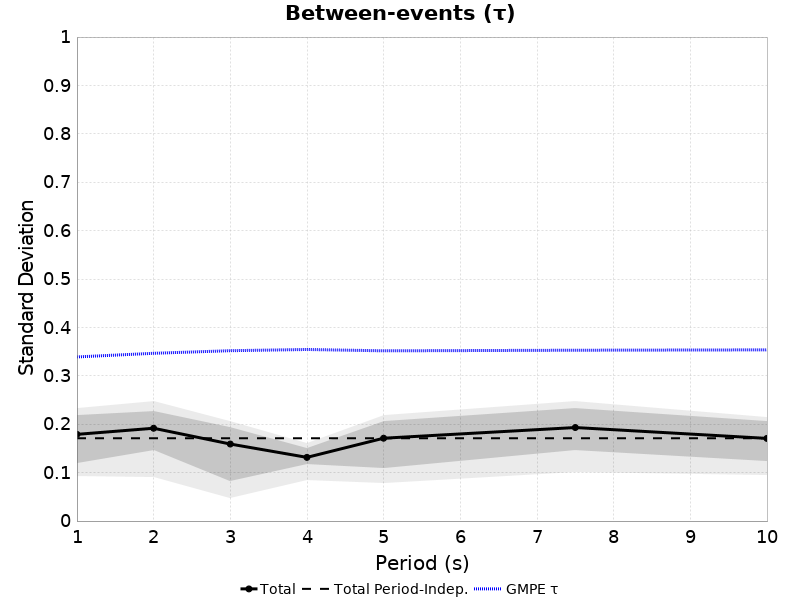

| 3s &tau; | Mean &delta;Be | &delta;Be Range | 5s &tau; | Mean &delta;Be | &delta;Be Range | 7.5s &tau; | Mean &delta;Be | &delta;Be Range | 10s &tau; | Mean &delta;Be | &delta;Be Range |
|-----|-----|-----|-----|-----|-----|-----|-----|-----|-----|-----|-----|
| 0.16 | -2.45 | [-2.6 -2.1] | 0.17 | -3.39 | [-3.58 -3] | 0.19 | -3.96 | [-4.3 -3.62] | 0.17 | -4.46 | [-4.71 -4.12] |

### M7.2 Between-events Downsampled Results
*[(top)](#table-of-contents)*

We compute uncertainties on &tau; through downsampling the rotational synthetic data to match the sample sizes used in the ASK 2014 regressions. We search the ASK dataset for ruptures with the same mechanism, magnitude in the range [7.0 7.4], and all distances. We throw out any events with only 1 recording, leaving us with 6 events and a total of 24 recordings. We then downsample our simulated data 100 times, and compute &tau; from each sample. The 95% confidence range from these samples is plotted as a shaded region above, and listed in the table below. Weighted standard deviations are calculated, weighted by the square-root of the number of recordings in each event.

*WARNING: Some real events had more recordings than we have rotations per event, so our dataset for this test is smaller. We are using 538 fewer data points.*

| Period (s) | Full &tau; | Downsampled median &tau; | Downsampled &tau; std. dev. | Downsampled &tau; 68% conf range | Downsampled &tau; 95% conf range |
|-----|-----|-----|-----|-----|-----|
| T-independent | 0.17 | 0.16 | 0.02 | [0.15 0.18] | [0.13 0.2] |
| 1 | 0.18 | 0.19 | 0.05 | [0.12 0.22] | [0.09 0.23] |
| 2 | 0.19 | 0.19 | 0.04 | [0.15 0.23] | [0.09 0.25] |
| 3 | 0.16 | 0.18 | 0.05 | [0.08 0.19] | [0.05 0.21] |
| 4 | 0.13 | 0.13 | 0.02 | [0.12 0.15] | [0.09 0.16] |
| 5 | 0.17 | 0.18 | 0.05 | [0.11 0.21] | [0.08 0.22] |
| 7.5 | 0.19 | 0.19 | 0.04 | [0.15 0.23] | [0.1 0.25] |
| 10 | 0.17 | 0.17 | 0.04 | [0.12 0.21] | [0.1 0.22] |

This plot shows the distribution of period-independent downsampled &tau;.

| Period-Indep | 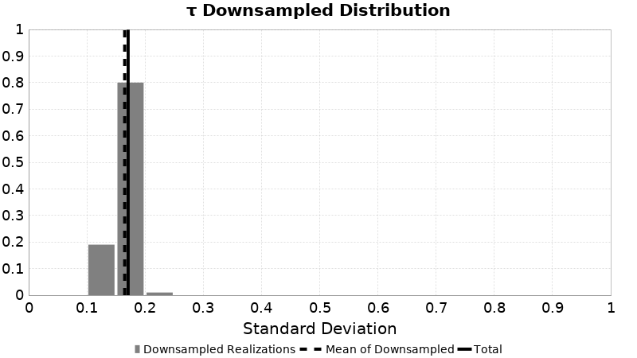 |
|-----|-----|
| 3s | 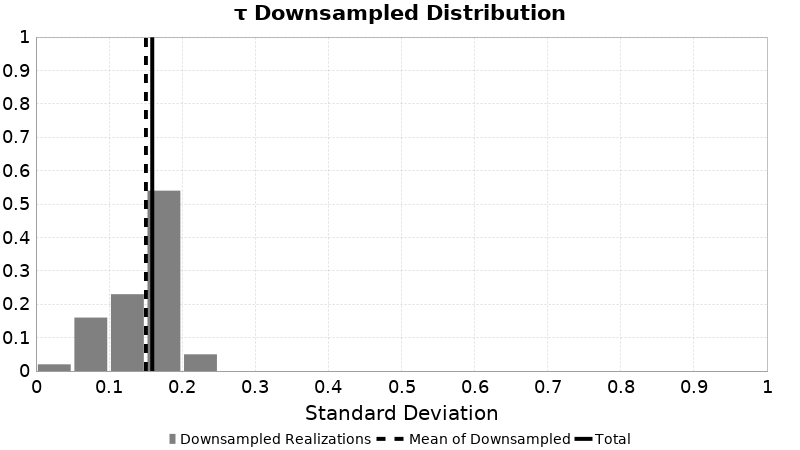 |

These plots show the dependence of &tau; to the number of events included and the number of recordings per event. The left plot holds the number of recordings per event fixed at the full set of simulated recordings (4), varying the number of events. The right plot holds the number of events fixed at the full set of simulated events (10), varying the number of recordings per event.

| Period | Event Count Dependence | Recordings/Event Dependence |
|-----|-----|-----|
| Period Indep. |  | 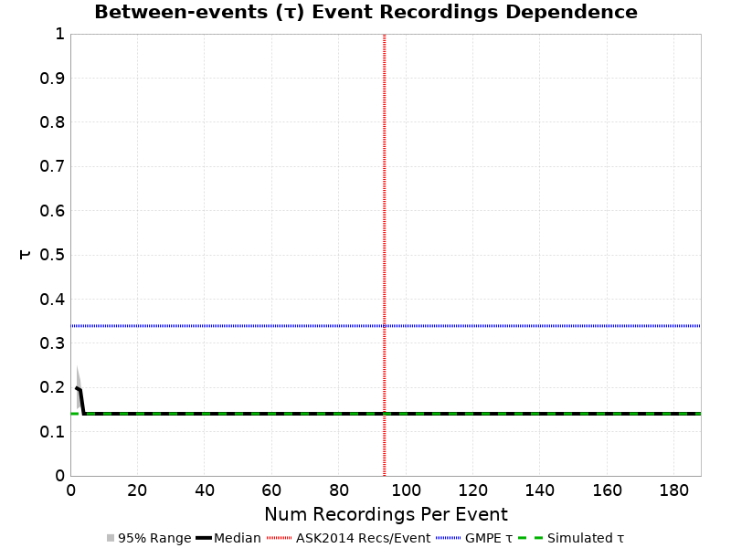 |
| 1s |  |  |

This is a histogram of the number of recordings per event from ASK 2014 with M=[7.0,7.4].

## Event Term Scatters
*[(top)](#table-of-contents)*

### Propagation Velocity Event Term Scatters
*[(top)](#table-of-contents)*

|  | 3 s | 5 s | 7.5 s | 10 s |
|-----|-----|-----|-----|-----|
| **20 km** |  | 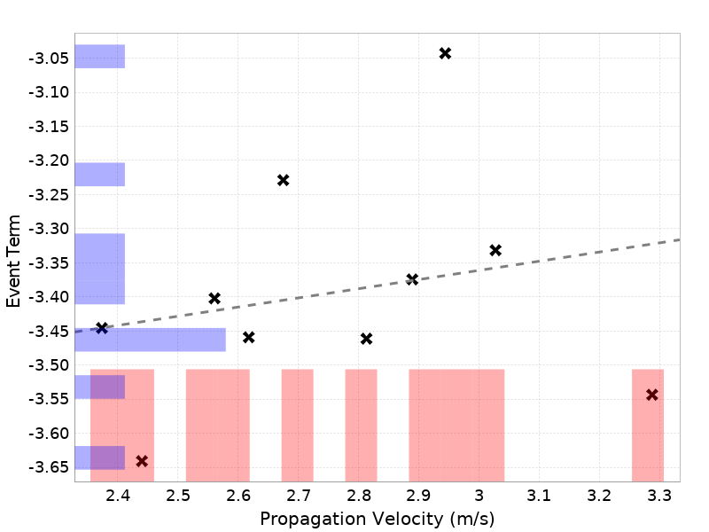 | 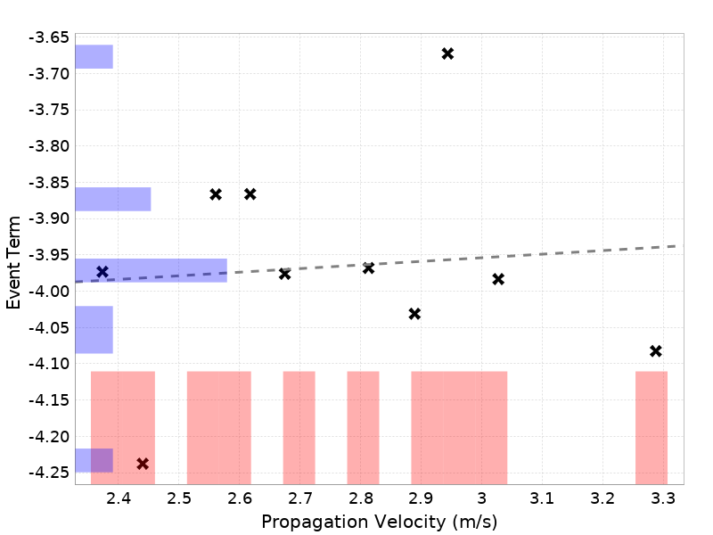 | 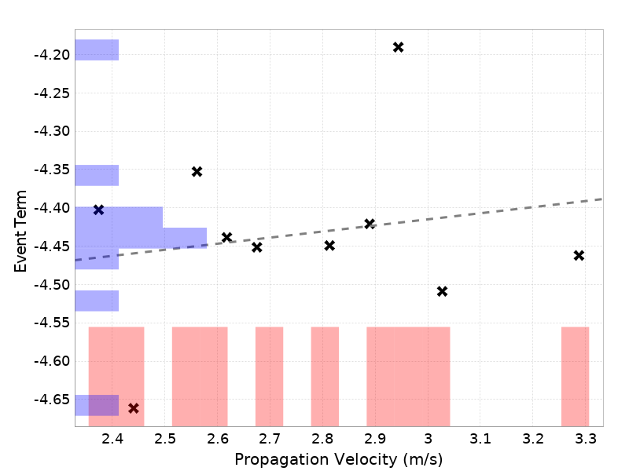 |
### Mag Event Term Scatters
*[(top)](#table-of-contents)*

|  | 3 s | 5 s | 7.5 s | 10 s |
|-----|-----|-----|-----|-----|
| **20 km** | *N/A* | *N/A* | *N/A* | *N/A* |
### Log10(Area) Event Term Scatters
*[(top)](#table-of-contents)*

|  | 3 s | 5 s | 7.5 s | 10 s |
|-----|-----|-----|-----|-----|
| **20 km** | *N/A* | *N/A* | *N/A* | *N/A* |
### Max Slip Event Term Scatters
*[(top)](#table-of-contents)*

|  | 3 s | 5 s | 7.5 s | 10 s |
|-----|-----|-----|-----|-----|
| **20 km** |  | 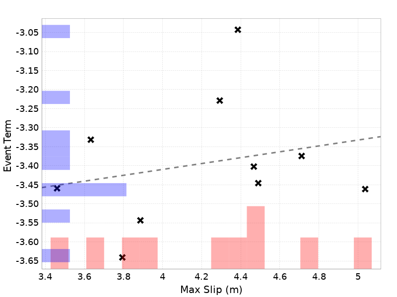 | 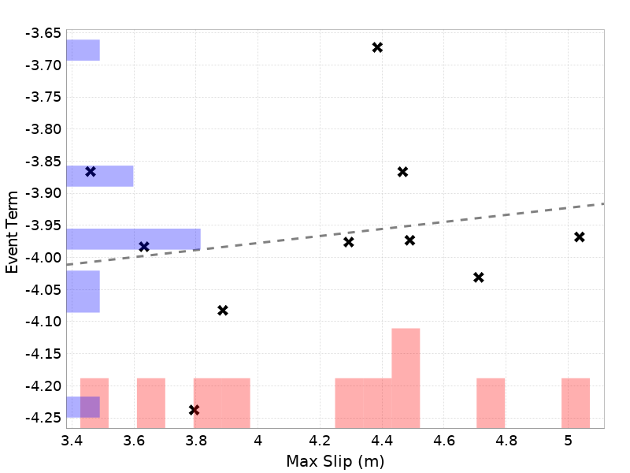 | 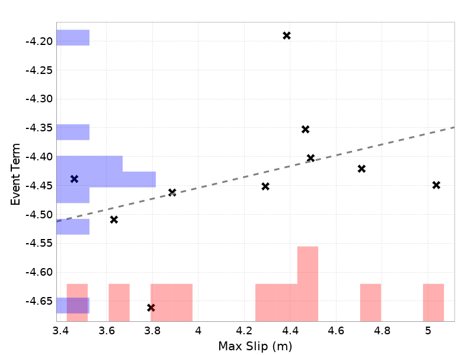 |
### Mean Slip Event Term Scatters
*[(top)](#table-of-contents)*

|  | 3 s | 5 s | 7.5 s | 10 s |
|-----|-----|-----|-----|-----|
| **20 km** |  |  | 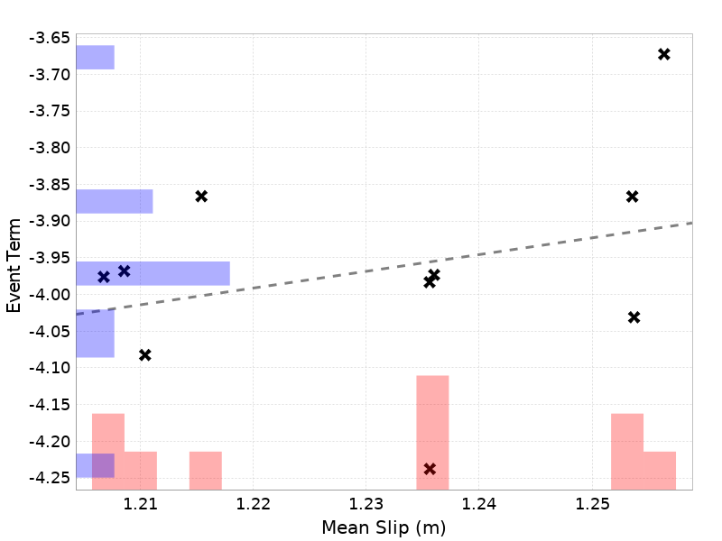 |  |
### Slip Std Dev Event Term Scatters
*[(top)](#table-of-contents)*

|  | 3 s | 5 s | 7.5 s | 10 s |
|-----|-----|-----|-----|-----|
| **20 km** |  | 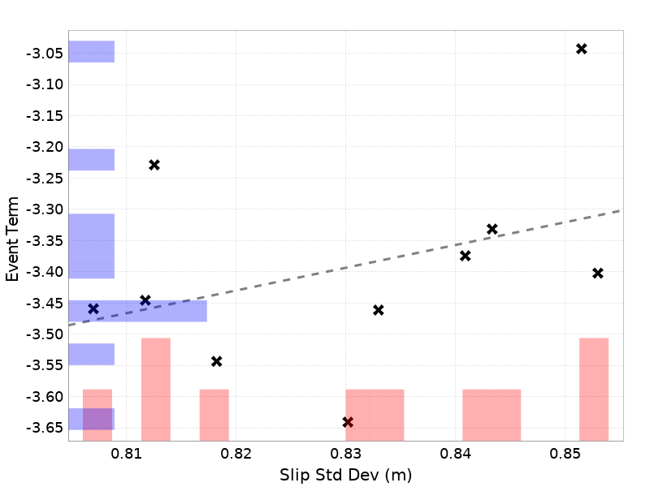 | 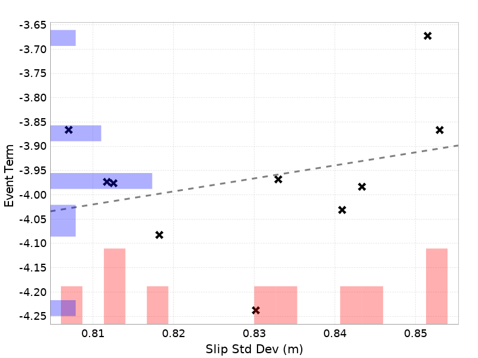 |  |
### Mid-Seismogenic Mean Slip Event Term Scatters
*[(top)](#table-of-contents)*

|  | 3 s | 5 s | 7.5 s | 10 s |
|-----|-----|-----|-----|-----|
| **20 km** | *N/A* | *N/A* | *N/A* | *N/A* |
## Directivity Comparisons
*[(top)](#table-of-contents)*

Directivity comparisons for individual ruptures can be found [here](resources/directivity_debug/README.md).

|  | 3 s | 5 s | 7.5 s | 10 s |
|-----|-----|-----|-----|-----|
| **20 km** |  | 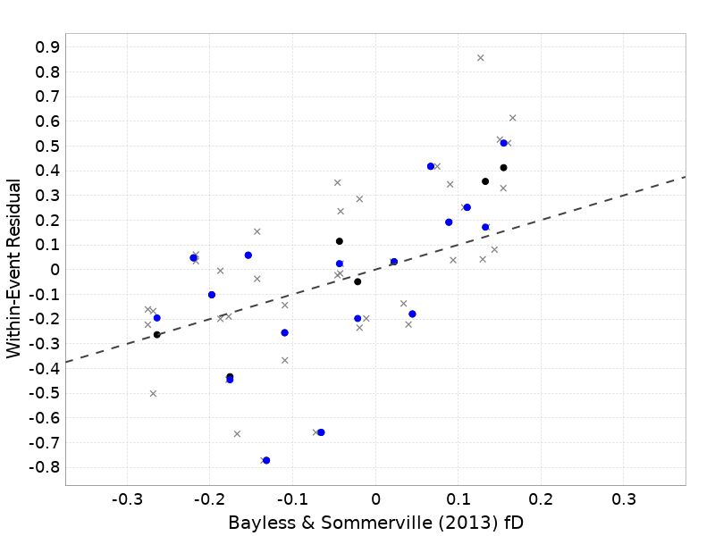 | 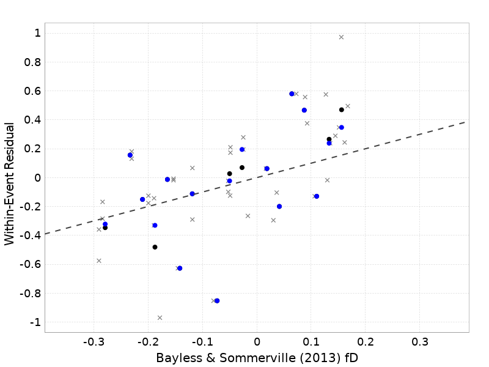 | 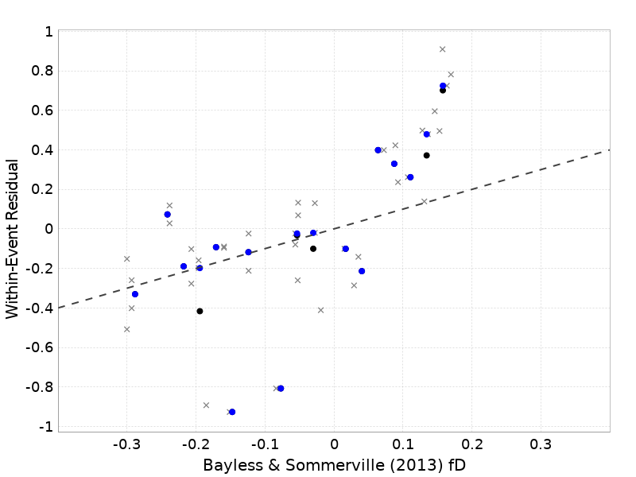 |
## Azumth Dependence
*[(top)](#table-of-contents)*

### Rupture Strike Dependence
*[(top)](#table-of-contents)*

| Type | 3s | 5s | 7.5s | 10s |
|-----|-----|-----|-----|-----|
| **&tau;** |  | 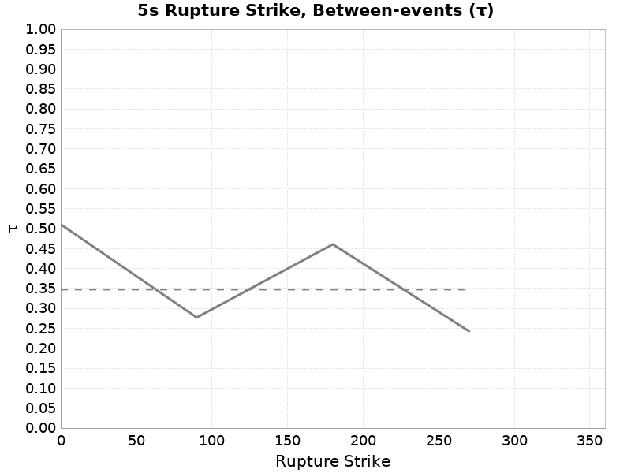 | 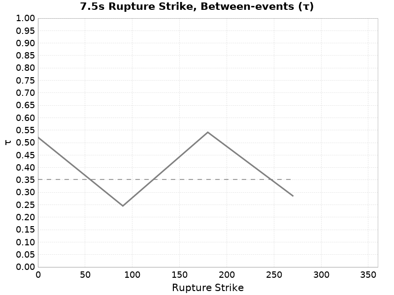 |  |
| **Median SA** |  |  |  |  |

## BBP PartB Comparison
*[(top)](#table-of-contents)*

Here we attempt to reproduce the SCEC BroadBand Platform "Part B" validation exercise as defined in:

*Goulet, C. A., Abrahamson, N. A., Somerville, P. G., & Wooddell, K. E. (2014). The SCEC broadband platform validation exercise: Methodology for code validation in the context of seismic‚Äêhazard analyses. Seismological Research Letters, 86(1), 17-26.* [(link)](https://pubs.geoscienceworld.org/ssa/srl/article/86/1/17/315438/the-scec-broadband-platform-validation-exercise)

The BBP exercise positioned sites in a 'racetrack' around the ruptures. Here, we instead position and rotate the ruptures around the site in order to work in 3-D with CyberShake reciprical calculations. Results for official scenarios and distances are in **bold**, results for additional magnitudes or distances not defined in the Goulet et. al. (2014) are *italicised*.

### BBP PartB Summary Table
*[(top)](#table-of-contents)*

| Scenario | 20.0 km |
|-----|-----|
| **M7.2 SS** | *(FAIL)* |

### BBP PartB, M7.2, Vertical Strike-Slip with Surface Rupture
*[(top)](#table-of-contents)*

| 20.0 km |
|-----|
| 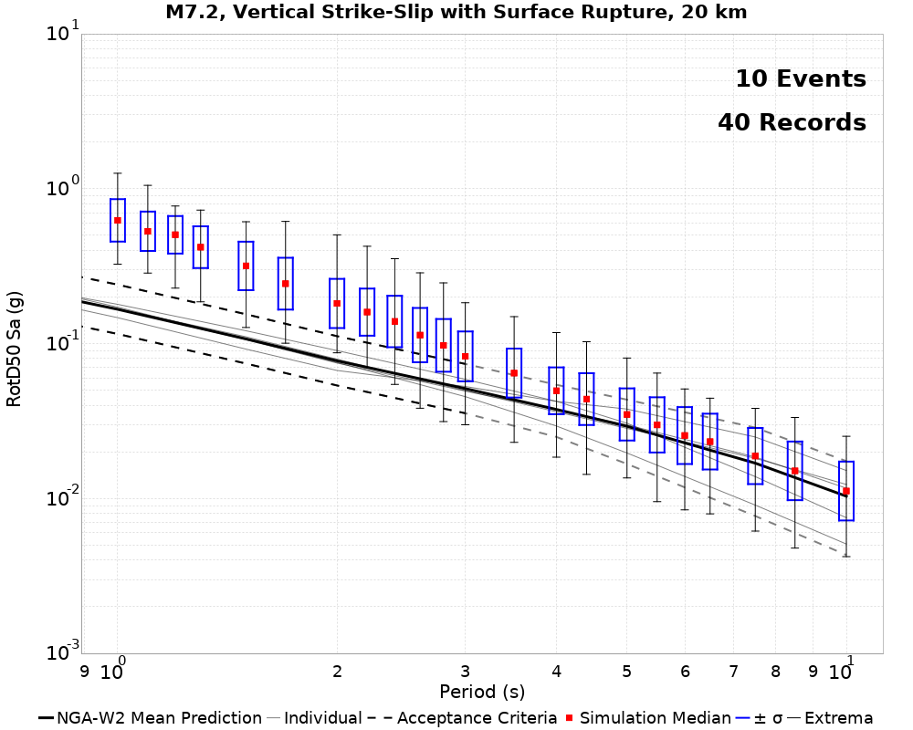 |

## CSV Files
*[(top)](#table-of-contents)*

| Magnitude | Distance | Site | CSV File |
|-----|-----|-----|-----|
| M7.2 | 20.0 km | USC | [sa_USC_m7.2_20.0km.csv.gz](resources/sa_USC_m7.2_20.0km.csv.gz) |

