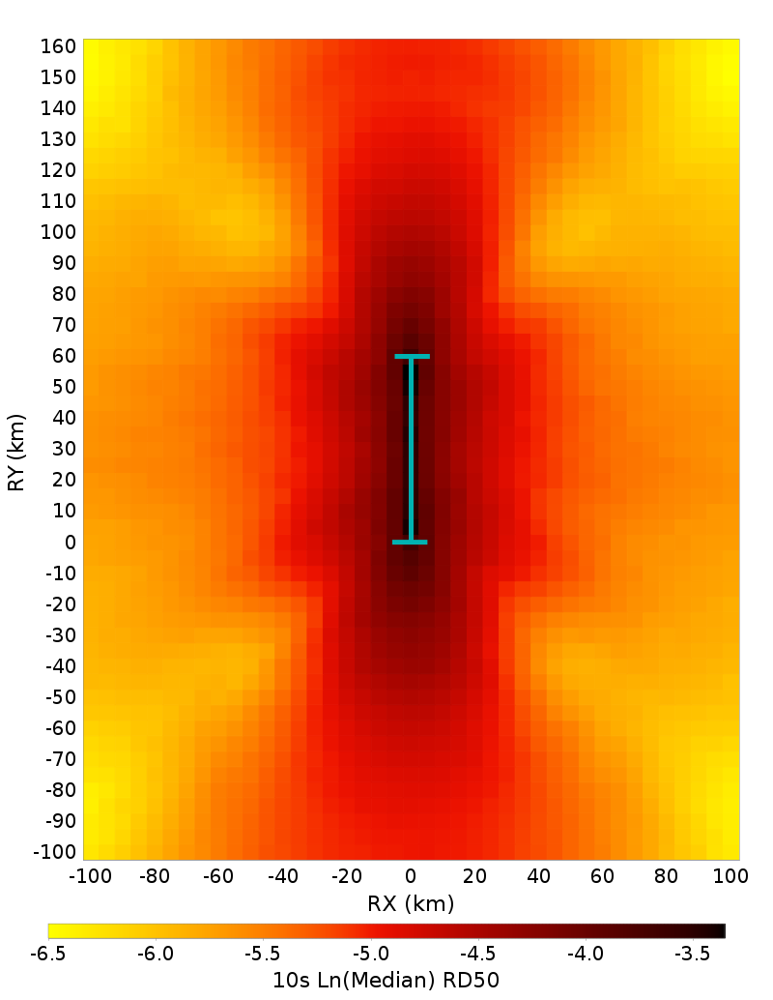
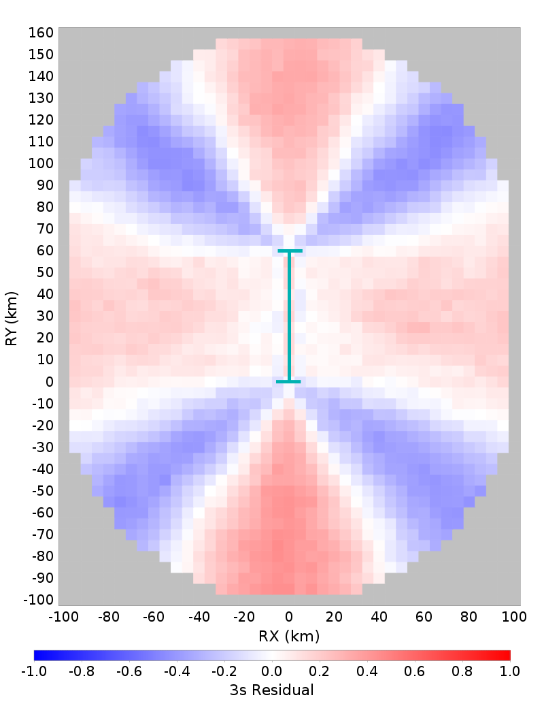

# Graves & Pitarka (2016), M7.2, Vertical Strike-Slip with Surface Rupture Spatial Distributions

## Table Of Contents
* [Full Spatial Distributions](#full-spatial-distributions)
* [First Third Along-Strike Hypocenter Spatial Distributions](#first-third-along-strike-hypocenter-spatial-distributions)
* [Center Third Along-Strike Hypocenter Spatial Distributions](#center-third-along-strike-hypocenter-spatial-distributions)
* [Last Third Along-Strike Hypocenter Spatial Distributions](#last-third-along-strike-hypocenter-spatial-distributions)
## Full Spatial Distributions
*[(top)](#table-of-contents)*

These plots show ground motions across 100 ruptures. Each surface is sized identically, with length=59.979107 (km) and width=27.669416 (km). The hypocenter distribution is shown below:

Each column represents a defferent spectral period. The first row gives the log median ground motion (an average shakemap). The second row shows residuals at each point relative to the median ground motion at that distance (Rjb). Residuals are calculated individually for each ruprture, and then averaged spatially. The bottom row shows the standard deviation of log ground motions. The surface length is annotated with a dark cyan line and ticks.

|  | 2 s | 3 s | 5 s | 7.5 s | 10 s |
|-----|-----|-----|-----|-----|-----|
| **Ln(Median)** |  |  |  |  |  |
| **Residuals** |  |  |  |  |  |
| **Std. Dev.** |  |  |  |  |  |

## First Third Along-Strike Hypocenter Spatial Distributions
*[(top)](#table-of-contents)*

These plots show ground motions across 27 ruptures with hypocenters in the first third of the rupture along-strike (bottom third in map view). Each surface is sized identically, with length=59.979107 (km) and width=27.669416 (km). The hypocenter distribution is shown below:

|  | 2 s | 3 s | 5 s | 7.5 s | 10 s |
|-----|-----|-----|-----|-----|-----|
| **Ln(Median)** |  |  |  |  |  |
| **Residuals** |  |  |  |  |  |
| **Std. Dev.** |  |  |  |  |  |

## Center Third Along-Strike Hypocenter Spatial Distributions
*[(top)](#table-of-contents)*

These plots show ground motions across 38 ruptures with hypocenters in the center third of the rupture along-strike. Each surface is sized identically, with length=59.979107 (km) and width=27.669416 (km). The hypocenter distribution is shown below:

|  | 2 s | 3 s | 5 s | 7.5 s | 10 s |
|-----|-----|-----|-----|-----|-----|
| **Ln(Median)** |  |  |  |  |  |
| **Residuals** |  |  |  |  |  |
| **Std. Dev.** |  |  |  |  |  |

## Last Third Along-Strike Hypocenter Spatial Distributions
*[(top)](#table-of-contents)*

These plots show ground motions across 35 ruptures with hypocenters in the last third of the rupture along-strike (top third in map view). Each surface is sized identically, with length=59.979107 (km) and width=27.669416 (km). The hypocenter distribution is shown below:

|  | 2 s | 3 s | 5 s | 7.5 s | 10 s |
|-----|-----|-----|-----|-----|-----|
| **Ln(Median)** |  |  |  |  |  |
| **Residuals** |  |  |  |  |  |
| **Std. Dev.** |  |  |  |  |  |

