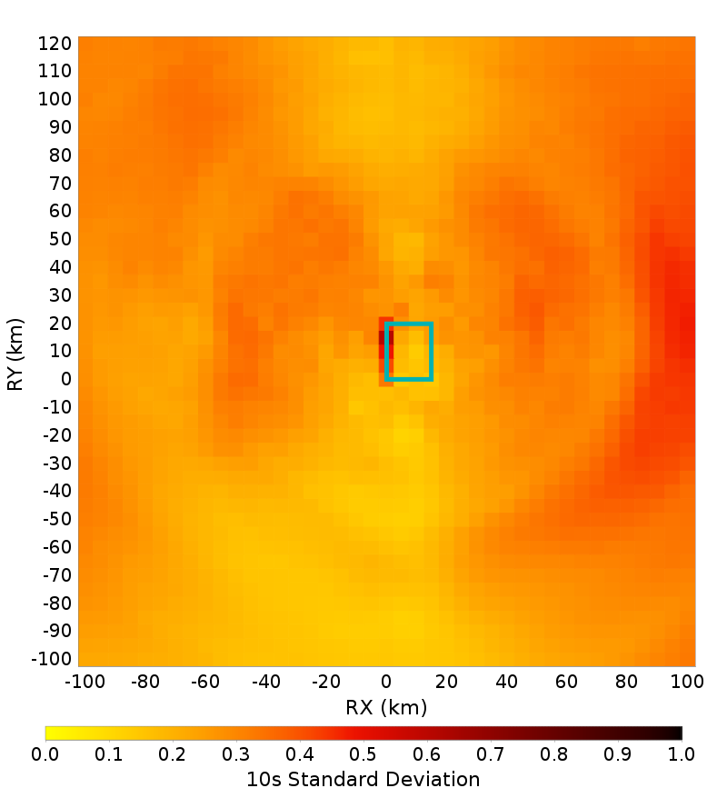

# Graves & Pitarka (2016), M6.6, Reverse, Dip=45, Ztor=3 Spatial Distributions

## Table Of Contents
* [Full Spatial Distributions](#full-spatial-distributions)
* [Bottom Third Hypocenter Spatial Distributions](#bottom-third-hypocenter-spatial-distributions)
* [Center Third Hypocenter Spatial Distributions](#center-third-hypocenter-spatial-distributions)
* [Top Third Hypocenter Spatial Distributions](#top-third-hypocenter-spatial-distributions)
## Full Spatial Distributions
*[(top)](#table-of-contents)*

These plots show ground motions across 100 ruptures. Each surface is sized identically, with length=19.860949 (km) and width=20.989399 (km). The hypocenter distribution is shown below:

Each column represents a defferent spectral period. The first row gives the log median ground motion (an average shakemap). The second row shows residuals at each point relative to the median ground motion at that distance (Rjb). Residuals are calculated individually for each ruprture, and then averaged spatially. The bottom row shows the standard deviation of log ground motions. The surface outline is drawn with a dark cyan line.

|  | 2 s | 3 s | 5 s | 7.5 s | 10 s |
|-----|-----|-----|-----|-----|-----|
| **Ln(Median)** |  |  |  |  |  |
| **Residuals** |  |  |  |  |  |
| **Std. Dev.** |  |  |  |  |  |

## Bottom Third Hypocenter Spatial Distributions
*[(top)](#table-of-contents)*

These plots show ground motions across 30 ruptures with hypocenters in the first third of the rupture along strike (bottom third in the plots). Each surface is sized identically, with length=19.860949 (km) and width=20.989399 (km). The hypocenter distribution is shown below:

|  | 2 s | 3 s | 5 s | 7.5 s | 10 s |
|-----|-----|-----|-----|-----|-----|
| **Ln(Median)** |  |  |  |  |  |
| **Residuals** |  |  |  |  |  |
| **Std. Dev.** |  |  |  |  |  |

## Center Third Hypocenter Spatial Distributions
*[(top)](#table-of-contents)*

These plots show ground motions across 41 ruptures with hypocenters in the center third of the rupture. Each surface is sized identically, with length=19.860949 (km) and width=20.989399 (km). The hypocenter distribution is shown below:

|  | 2 s | 3 s | 5 s | 7.5 s | 10 s |
|-----|-----|-----|-----|-----|-----|
| **Ln(Median)** |  |  |  |  |  |
| **Residuals** |  |  |  |  |  |
| **Std. Dev.** |  |  |  |  |  |

## Top Third Hypocenter Spatial Distributions
*[(top)](#table-of-contents)*

These plots show ground motions across 29 ruptures with hypocenters in the last third of the rupture along strike (top third in the plots). Each surface is sized identically, with length=19.860949 (km) and width=20.989399 (km). The hypocenter distribution is shown below:

|  | 2 s | 3 s | 5 s | 7.5 s | 10 s |
|-----|-----|-----|-----|-----|-----|
| **Ln(Median)** |  |  |  |  |  |
| **Residuals** |  |  |  |  |  |
| **Std. Dev.** |  |  |  |  |  |

